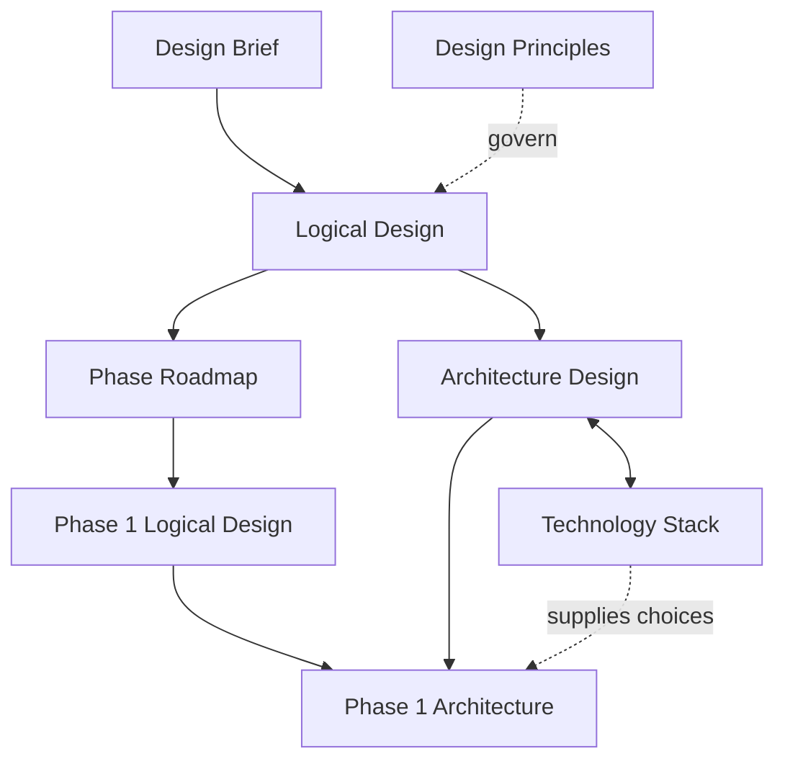

# msgloom Design Documents

Start with the complete product, then read the Phase 1 design. The English documents are authoritative; the Chinese documents are corresponding translations.

## Document ownership

| Document | Scope | Owns |
| --- | --- | --- |
| [Design Brief](design-brief.md) | Complete product | Purpose, core concepts, final capabilities and report contract. |
| [Design Principles](design-principles.md) | All phases | Decision priorities and lasting constraints. |
| [Logical Design](design.md) | Complete product | Supporting concepts, data relationships and behaviour. |
| [Architecture Design](architecture.md) | Complete product | Component responsibilities, interfaces and end-to-end workflows. |
| [Technology Stack](tech-stack.md) | Complete product, with phase labels | Dependency choices, configuration, code quality and technical qualification. |
| [Phase Roadmap](phase-roadmap.md) | Delivery stages | Capability allocation and phase boundaries. |
| [Phase 1 Logical Design](phase-1/design.md) | Phase 1 only | Detailed rules and acceptance cases for the first release. |
| [Phase 1 Architecture](phase-1/architecture.md) | Phase 1 only | Deployment, execution sequences, storage writes and recovery. |

A definition belongs to its owner. Other documents use its exact term and link to it. Phase 1 adds restrictions and detail; it does not redefine the complete product.

Component names and step identifiers come from Architecture Design. Technology Stack maps those names to dependencies. Later-phase selections are proposals, not dependencies to install in Phase 1.

## Product progression

Read these as slices of one product, not four unrelated designs. The [Phase Roadmap](phase-roadmap.md) owns allocation; the linked logical contracts own behaviour.

| Phase | What the user gains | Boundary |
| --- | --- | --- |
| **1 — Reliable triage** | Preserved messages and attachments become grouped, prioritised topic reports through externally invoked commands. | No autonomous investigation or business actions. [Phase 1 design](phase-1/design.md) also reserves the extension interfaces. |
| **2 — Investigation and review** | Selected topics gain further evidence, related-topic links and visible uncertainty. The user navigates overview, details and sources through a local website; an optional MCP adapter uses the same operations. | Reads stay within permission and effort limits. Reports do not wait for unfinished investigation. See [investigation](design.md#6-investigation-and-review) and [report access](design.md#71-report-access-and-review). |
| **3 — Action support** | Topic assessments become suggested next steps and editable drafts for replies, tasks and tickets, with supporting evidence and unresolved questions. | Reviewing a draft does not authorise sending or creation in another system. See [proposal preparation](design.md#81-proposal-preparation). |
| **4 — Controlled execution** | The user can authorise an exact proposal for execution and inspect its recorded external outcome. | Permission, approval and freshness checks precede every submission; unknown effects require reconciliation. See [approval and execution](design.md#82-approval-and-execution). |

The complete-product [extension interfaces](architecture.md#8-extension-interfaces) are exercised with test doubles in Phase 1. Later implementations replace those doubles without adding business logic to the CLI, website or MCP transport.
