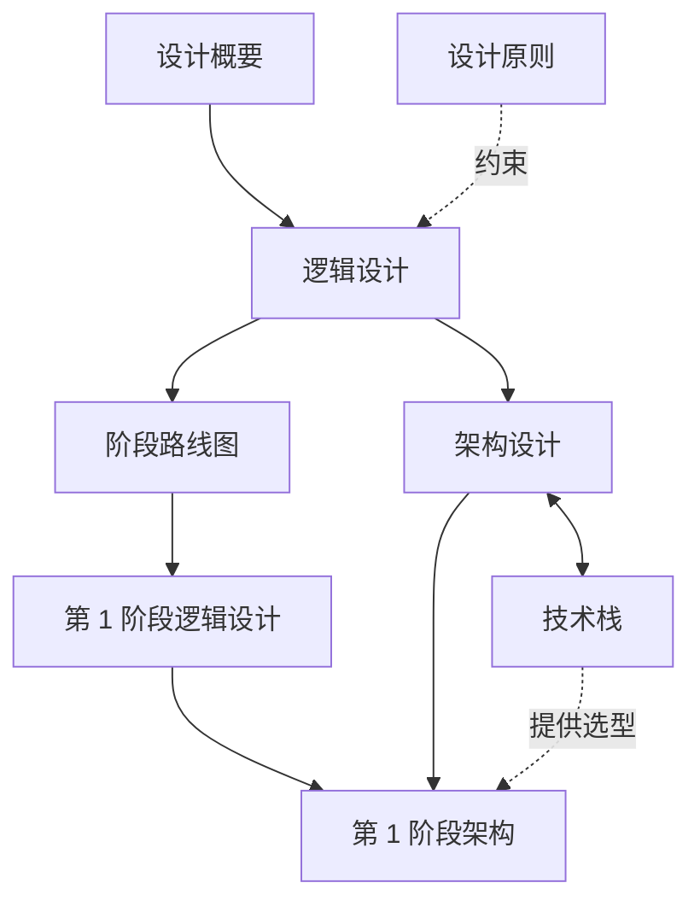

# msgloom 设计文档

先阅读完整产品设计，再阅读第 1 阶段设计。英文文档是权威版本；中文文档是对应译文。

## 文档职责

| 文档 | 范围 | 负责定义 |
| --- | --- | --- |
| [设计概要](design-brief.zh-CN.md) | 完整产品 | 目的、核心概念、最终能力和报告契约。 |
| [设计原则](design-principles.zh-CN.md) | 所有阶段 | 决策优先次序和长期约束。 |
| [逻辑设计](design.zh-CN.md) | 完整产品 | 辅助概念、数据关系和行为。 |
| [架构设计](architecture.zh-CN.md) | 完整产品 | 组件职责、接口和端到端工作流。 |
| [技术栈](tech-stack.zh-CN.md) | 完整产品，附阶段标记 | 依赖选型、配置、代码质量和技术验证。 |
| [阶段路线图](phase-roadmap.zh-CN.md) | 交付阶段 | 能力分配和阶段边界。 |
| [第 1 阶段逻辑设计](phase-1/design.zh-CN.md) | 仅第 1 阶段 | 首个版本的详细规则和验收用例。 |
| [第 1 阶段架构](phase-1/architecture.zh-CN.md) | 仅第 1 阶段 | 部署、执行顺序、存储写入和恢复。 |

每项定义由其所属文档负责。其他文档使用相同术语并链接到该定义。第 1 阶段增加限制和细节，不重新定义完整产品。

组件名称和步骤标识符来自架构设计。技术栈将这些名称映射到依赖。后续阶段的选型是提案，不是第 1 阶段需要安装的依赖。

## 产品演进

以下阶段属于同一个产品，不是四份彼此独立的设计。[阶段路线图](phase-roadmap.zh-CN.md)负责能力分配；下方链接中的逻辑契约负责行为定义。

| 阶段 | 用户获得的能力 | 边界 |
| --- | --- | --- |
| **1 — 可靠分流** | 外部调用命令，将保留的消息和附件转为经过分组、确定优先级的主题报告。 | 不自主调查或执行业务行动。[第 1 阶段设计](phase-1/design.zh-CN.md)同时预留扩展接口。 |
| **2 — 调查与审阅** | 为选定主题补充证据、相关主题链接和明确的不确定性。用户通过本地网站浏览概览、详情和信息源；可选 MCP 适配器使用相同操作。 | 读取受权限和工作量限制；报告不等待未完成调查。见[调查](design.zh-CN.md#6-调查与审阅)和[报告访问](design.zh-CN.md#71-报告访问与审阅)。 |
| **3 — 行动支持** | 将主题评估转为下一步建议，以及回复、任务和工单的可编辑草稿，保留支持证据和尚未解决的问题。 | 审阅草稿不等于授权发送或在其他系统创建对象。见[提案准备](design.zh-CN.md#81-提案准备)。 |
| **4 — 受控执行** | 用户可以授权执行某个确切版本的提案，并查看已记录的外部结果。 | 每次提交前检查权限、批准和输入时效；外部影响未知时必须核实。见[批准与执行](design.zh-CN.md#82-批准与执行)。 |

第 1 阶段用测试替身验证完整产品的[扩展接口](architecture.zh-CN.md#8-扩展接口)。后续实现替换测试替身，不把业务逻辑加入 CLI、网站或 MCP 传输层。
