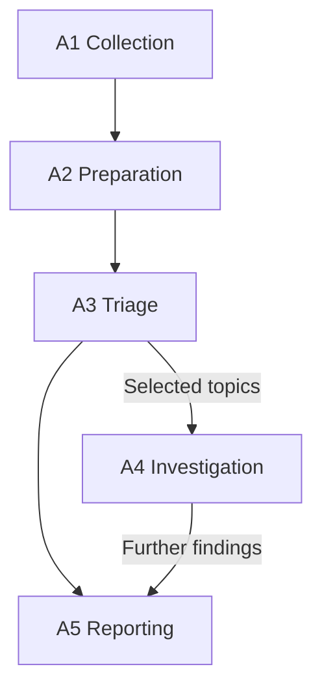
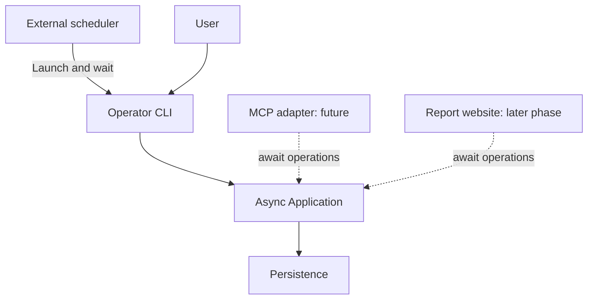
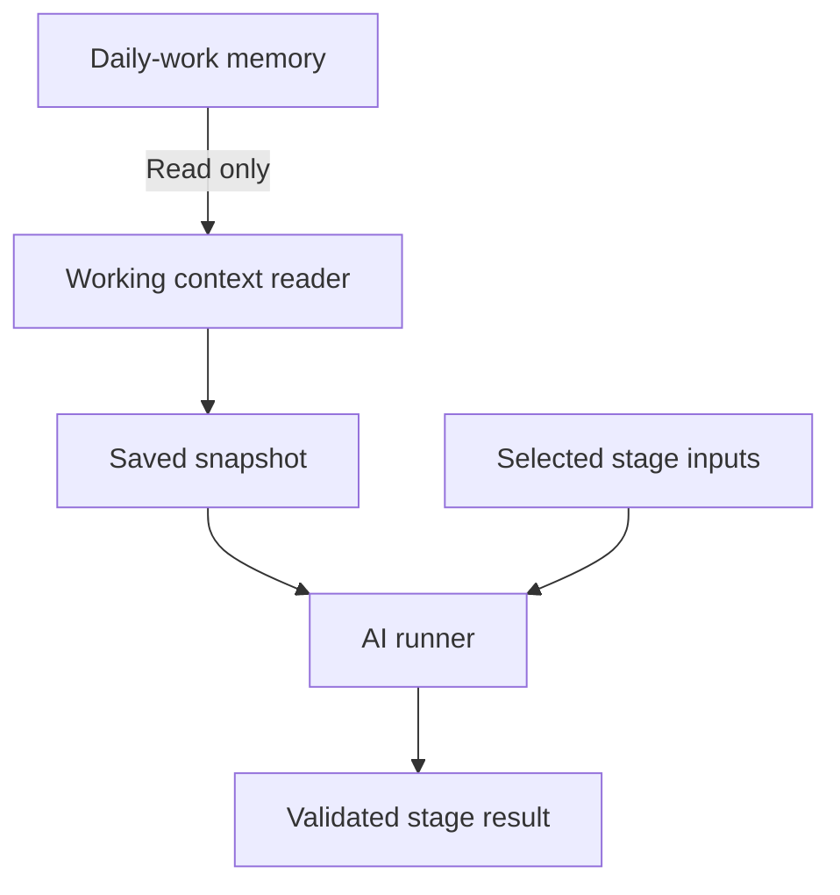
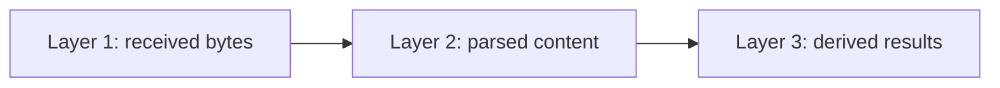
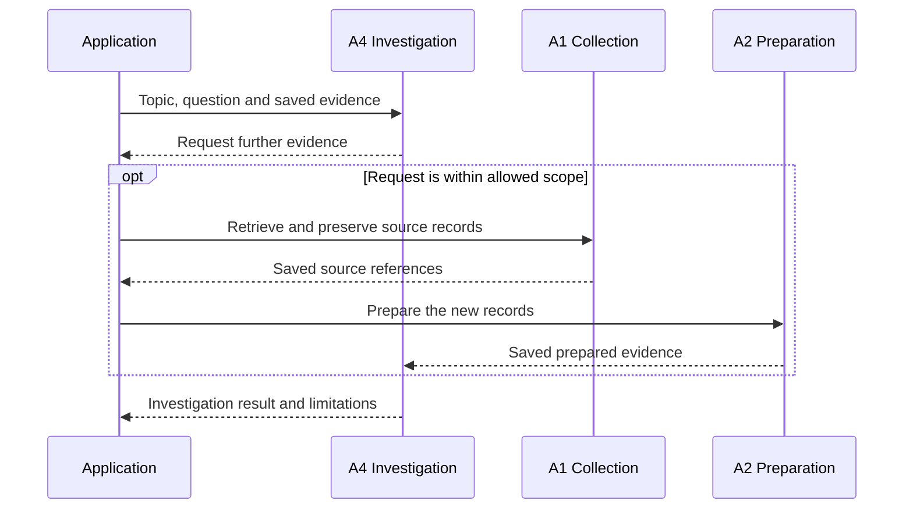
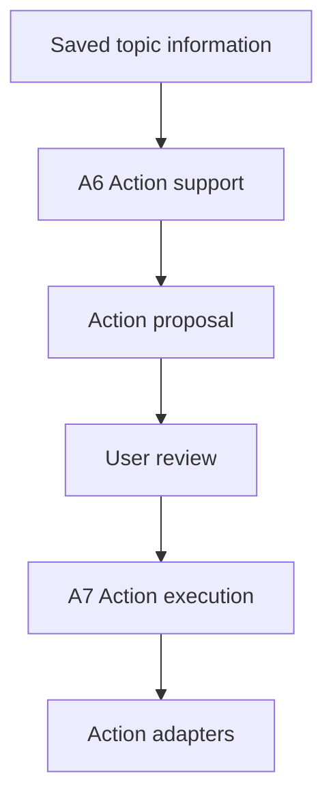
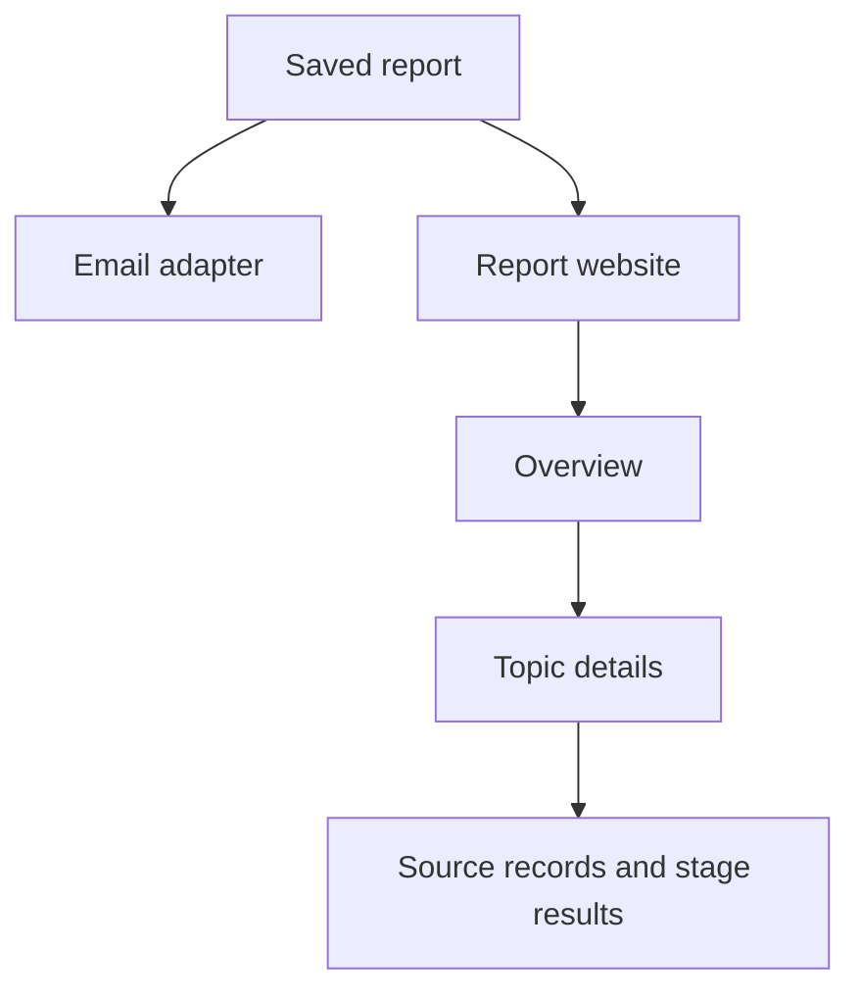
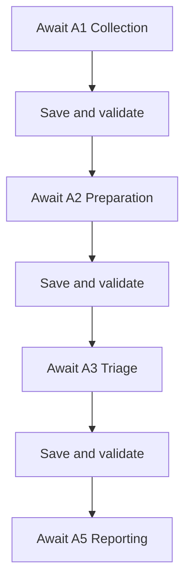
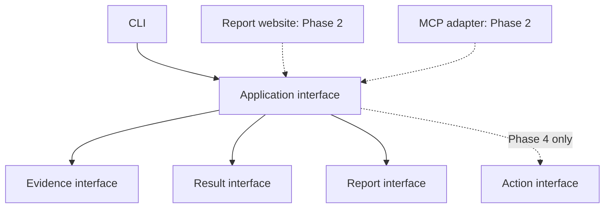

# msgloom Architecture Design

**Scope:** Complete product. **Status:** Draft for review.

Implements the [Logical Design](design.md). Component names and step identifiers are defined here; [Technology Stack](tech-stack.md) assigns their dependencies. [Phase 1 Architecture](phase-1/architecture.md) selects the initial deployment and execution paths.

## 1. Information flow

This diagram shows information dependencies, not one long scheduled job. Reporting can use available results without waiting for investigation.

| Step | Responsibility | Saved output |
| --- | --- | --- |
| **A1 Collection** | Source adapters retrieve authorised information and source-specific progress. | Source records and collection stage results. |
| **A2 Preparation** | Parse messages and collected attachments, then filter and group the results. | Stage results for each transformation, exclusion and content limitation. |
| **A3 Triage** | Apply both categories of triage rules to prepared information. | Triage results. |
| **A4 Investigation** | Find and analyse further evidence for selected topics. | Investigation results and topic relationships. |
| **A5 Reporting** | Select due topic information and pass a saved report to report adapters. | Reports, rendered outputs and delivery attempts. |
| **A6 Action support** | Prepare recommendations and drafts from topic information. | Action proposals. |
| **A7 Action execution** | Validate authority and submit approved proposals through action adapters. | Action attempts. |

A1 is also the entry point for new evidence found by A4. A6 and A7 are shown separately in Section 5 so the normal reporting path stays clear.

## 2. Shared components

The **External scheduler** is deployment infrastructure outside the msgloom Python package. It owns recurring triggers, its operational web interface and its own run history. It launches an installed Operator CLI subcommand and waits for the process outcome, without importing Application internals.

| Package component | Sole responsibility |
| --- | --- |
| **Configuration** | Load and validate operation settings, triage rules, report policies and allowed access; provide a fixed version for each run. |
| **Operator CLI** | Translate a requested subcommand into an Application operation and return a machine-readable outcome. |
| **Application** | Expose async operations and coordinate A1–A7 under the execution contract in Section 7. |
| **Persistence** | Save and retrieve source records, stage results and operational state. |
| **Parser worker** | Run blocking or resource-intensive parsers outside the event loop and return source-mapped outputs to the Application. |
| **Working context reader** | Select relevant daily-work memory and save a read-only snapshot for a run. |
| **AI runner** | Start isolated AI sessions with declared inputs and allowed tools; capture and validate their outputs. |
| **Report website** | Present saved reports and submit authorised review requests to the Application. |
| **MCP adapter** | A future optional interface that awaits the same Application operations under MCP-specific permissions. |
| **Report adapters** | Render and publish saved reports for each output format. |
| **Action adapters** | Execute external business operations after A7 validates authority. |

Source adapters are owned by A1. Provider objects, CLI parsing objects and future MCP objects stay outside shared contracts.

Subcommands may serve message processing, reporting, inspection or replay. These are design categories, not approved command names or a fixed one-command-per-stage interface. Their exact division belongs in implementation design.

The AI runner uses the [SDK integration](tech-stack.md#ai-runner). It has separate configuration and session storage on the same host as daily Claude Code. The future MCP adapter is separate from read tools supplied to the AI runner; adding one does not enable the other.

## 3. Persistence layout

The three layers organise saved content; they are not three database servers.

| Store | Content |
| --- | --- |
| **Application database** | Identities, checkpoints, stage-result relationships, structured outputs, configuration versions and reporting or action state. |
| **Persistent files** | Layer 1 bytes and larger Layer 2 or Layer 3 outputs, including saved AI input, exposed output and rendered reports. |
| **External scheduler state** | Owned and backed up by deployment, outside the package. The Application neither queries it nor uses it to infer business completion. |

The Application database records file identity, location, integrity and input references. Files use generated storage keys, not untrusted attachment paths. Saving, backup and restoration must treat the Application database and referenced files as one recoverable set.

A successful External scheduler run does not prove recipient delivery. The corresponding saved result determines the observable outcome.

## 4. Investigation path

The Application controls scope, tool access and effort limits. Retrieved attachments enter A2 through a format-specific parser. A4 may propose topic relationships; it does not modify received bytes or silently replace previous assessments.

AI capabilities depend on the step: A3 interprets supplied information; A4 may request bounded read operations; A6 prepares drafts. A7 remains deterministic. A general shell or an unrestricted source client is not an investigation interface.

## 5. Action path

The approval boundary and uncertain-effect rules are owned by [Logical Design](design.md#8-action-support-and-execution). The Application checks them for both CLI and website requests. Adapters return external identifiers and outcomes rather than invent success from a timeout.

## 6. Report presentation

Both presentations use the same selected assessment versions. The Report website reads saved results rather than running AI during page rendering. Later review requests create new work through the Application.

The operational web interface belongs to the External scheduler. It is not the Report website and receives safe execution metadata, not message bodies.

## 7. Operating boundaries

### Invocation boundary

Deliver msgloom-owned components through the [Python package](tech-stack.md#8-packaging-and-later-dependencies). Deployment installs the package and the External scheduler independently in Docker. A subcommand also works without a scheduler installed or running.

The package contains no scheduling loop, schedule registration, Prefect client or scheduler dependency. Report policy determines what is due when invoked; recurring trigger times and their time zones belong to the External scheduler. Configuration does not duplicate that schedule configuration.

An invocation waits for the requested operation and its saved outcome before exiting. Return an execution identity, status and result references. Keep business content out of ordinary stdout and stderr. Pending, blocked, failed and unknown-effect outcomes remain distinguishable; exact subcommand and exit-code mappings are not fixed here.

### Async execution

Dependent stages execute in order. Each awaited stage saves and validates its output before the next stage consumes it. Async describes non-blocking execution inside the package, not a queue between stages.

This is one possible operation, not a requirement that every subcommand starts at A1. Operations may begin from eligible saved results. Failed required dependencies prevent dependent work; completed results remain usable.

Public Application operations are async. Use native async I/O where available and await bounded workers for blocking dependencies. Small pure calculations may remain ordinary functions; wrapping blocking code in `async def` does not make it non-blocking. Parsers need not expose a misleading native-async API.

The Operator CLI owns the process event-loop boundary. Application operations never start or nest an event loop. The future MCP adapter and Report website await these operations in their existing loop without launching the CLI. Bound concurrency within a stage and join all work before completion; no detached processing survives an invocation.

### Access and recovery

Expose browser interfaces locally by default. Keep memory mounts read-only and credentials limited to the adapters that require them. Parser workers receive no source or model credentials and must not execute macros, follow external document links or fetch remote resources.

Per-scope and per-policy work claims protect overlapping invocations. Keep network and AI work outside database write transactions. Cancellation closes sessions, clients and workers and records unfinished work. [Phase 1 Architecture](phase-1/architecture.md#6-recovery-and-replay) specifies concrete failure paths.

## 8. Extension interfaces

These are typed boundaries within the package, not new services or an automatic plugin framework. The [Operation request and Operation outcome](design.md#11-shared-operation-boundary) own invocation data. Application operations are async; blocking implementations use the existing Parser worker boundary.

| Interface | Contract | Later use |
| --- | --- | --- |
| **Application interface** | Admit an Operation request, bind authority and versions, await the operation, return its saved Operation outcome. | The CLI, Report website and MCP adapter share admission and behaviour. |
| **Evidence interface** | Read exact saved source/result references, or request authorised collection and preparation; return source-mapped results and explicit gaps. | A4 reuses A1/A2 without a second source client or parsing pipeline. |
| **Result interface** | Append and resolve versioned stage results, lineage and accepted-version references through Persistence. | Investigation, review and proposals extend the result set without rewriting Phase 1 history. |
| **Report interface** | Read accepted topic information and build a saved report independently of presentation or investigation completion. | Website details and action status reuse the same report contract and source mappings. |
| **Action interface** | Accept an approved proposal and resolved authority, claim submission and return a recorded action attempt. | A7 binds provider-specific action adapters; it is separate from A5 report delivery. |

The Application binds implementations at startup for the requested capability. It rejects disabled capabilities before creating their clients. Callers cannot bypass that check by invoking an internal method or forging an approval reference. Exact signatures and registration mechanisms belong in implementation design; use explicit composition before considering dynamic discovery.

Maintain dependency direction: shared contracts do not import adapters; adapters depend on contracts. Exporting an MCP tool must not create a second authority model or nest an event loop. A3's AI session remains tool-restricted even when a later A4 implementation has bounded read tools.

The [Phase 1 interface requirements](phase-1/architecture.md#8-extension-interface-preparation) specify the minimum implementations and tests. Future providers and tables are not required merely to reserve a boundary.
