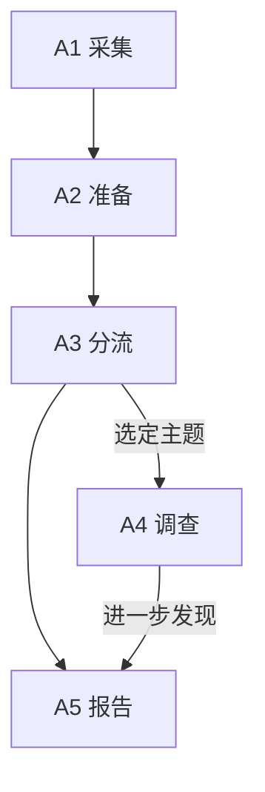
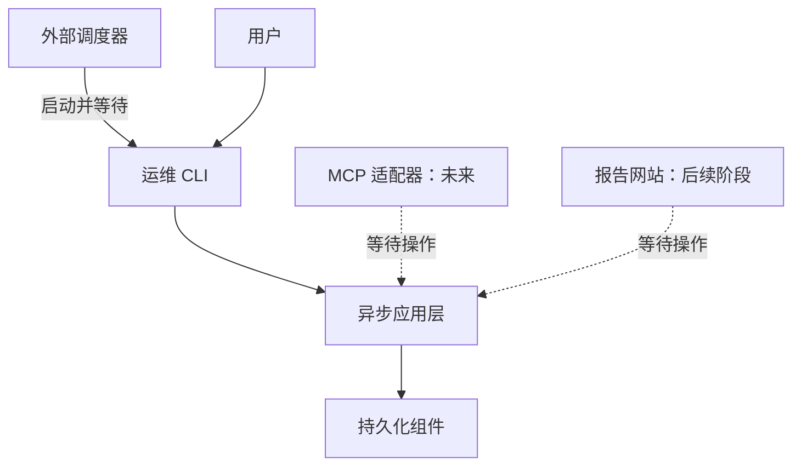
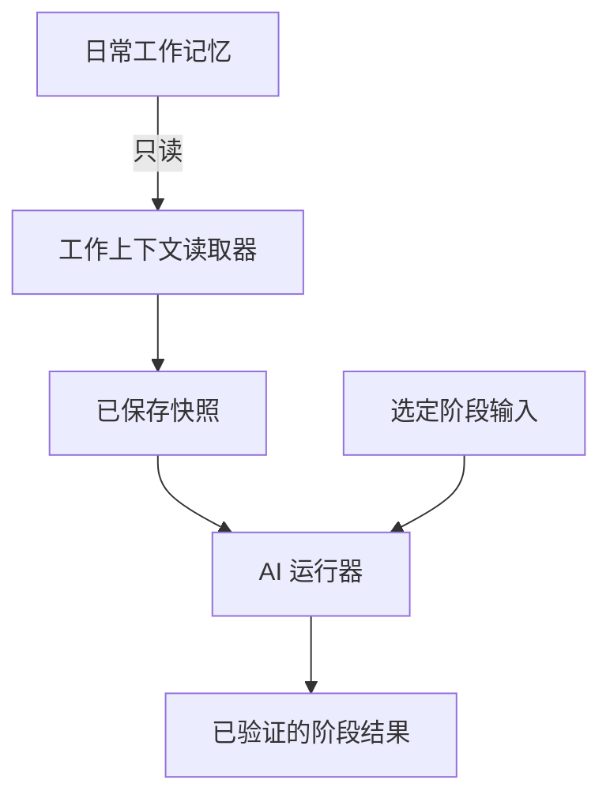
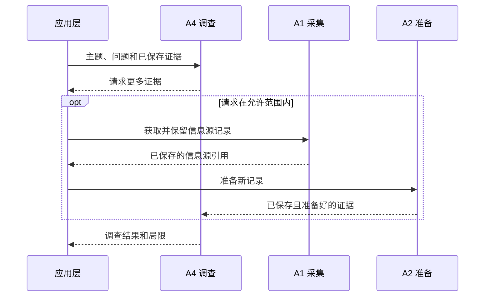
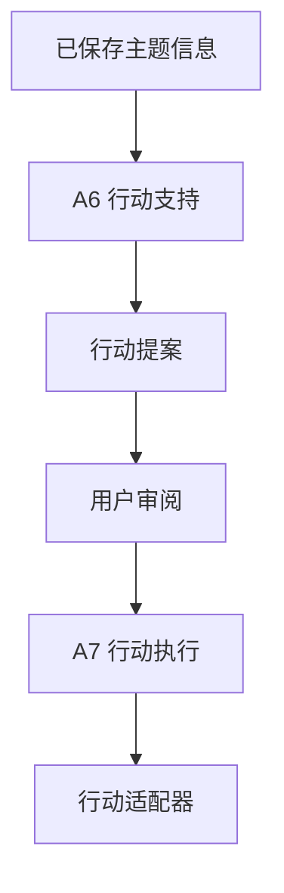
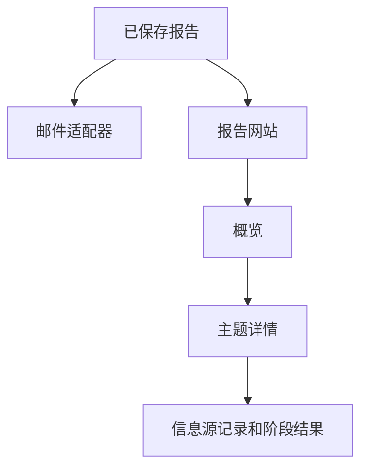
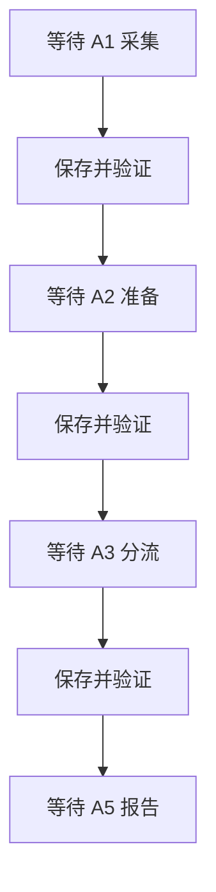
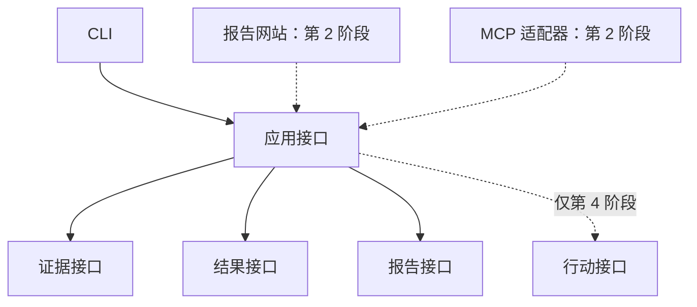

# msgloom 架构设计

**范围：** 完整产品。**状态：** 待审阅草稿。

实现[逻辑设计](design.zh-CN.md)。组件名称和步骤标识符在此定义；[技术栈](tech-stack.zh-CN.md)分配其依赖。[第 1 阶段架构](phase-1/architecture.zh-CN.md)选择初始部署和执行路径。

## 1. 信息流

此图表示信息依赖关系，不是一个长时间运行的定时任务。报告可使用现有结果，无需等待调查完成。

| 步骤 | 职责 | 保存的输出 |
| --- | --- | --- |
| **A1 采集** | 信息源适配器获取已授权信息和信息源特定的进度。 | 信息源记录和采集阶段结果。 |
| **A2 准备** | 解析消息和已采集附件，然后过滤并分组。 | 每次转换、排除和内容局限对应的阶段结果。 |
| **A3 分流** | 对准备好的信息应用两类分流规则。 | 分流结果。 |
| **A4 调查** | 为选定主题查找并分析更多证据。 | 调查结果和主题关系。 |
| **A5 报告** | 选择到期应报告的主题信息，并将已保存报告交给报告适配器。 | 报告、渲染输出和交付尝试。 |
| **A6 行动支持** | 根据主题信息准备建议和草稿。 | 行动提案。 |
| **A7 行动执行** | 验证授权，并通过行动适配器提交已获批准的提案。 | 行动尝试。 |

A1 也是 A4 发现的新证据的入口。A6 和 A7 在第 5 节单独展示，以保持常规报告路径清晰。

## 2. 共享组件

**外部调度器**是 msgloom Python 包之外的部署基础设施。它负责周期性触发器、自己的运维 Web 界面和运行历史。它启动已安装的运维 CLI 子命令并等待进程结果，不导入应用层内部模块。

| 包内组件 | 唯一职责 |
| --- | --- |
| **配置组件** | 加载并验证操作设置、分流规则、报告策略和允许的访问；为每次运行提供固定版本。 |
| **运维 CLI** | 将请求的子命令转换为应用层操作，并返回机器可读的结果。 |
| **应用层** | 提供异步操作，并按第 7 节的执行契约协调 A1–A7。 |
| **持久化组件** | 保存和读取信息源记录、阶段结果及运行状态。 |
| **解析工作器** | 在事件循环外运行阻塞或资源密集型解析器，并向应用层返回带信息源映射的输出。 |
| **工作上下文读取器** | 选择相关日常工作记忆，并为一次运行保存只读快照。 |
| **AI 运行器** | 使用声明的输入和允许的工具启动隔离的 AI 会话；捕获并验证输出。 |
| **报告网站** | 展示已保存报告，并向应用层提交已授权的审阅请求。 |
| **MCP 适配器** | 未来的可选接口，在 MCP 特定权限下等待相同的应用层操作。 |
| **报告适配器** | 按各输出格式渲染并发布已保存报告。 |
| **行动适配器** | 在 A7 验证授权后执行外部业务操作。 |

信息源适配器由 A1 负责。提供方对象、CLI 解析对象和未来的 MCP 对象不进入共享契约。

子命令可用于消息处理、报告、检查或重放。这些是设计类别，不是已批准的命令名称，也不是固定的“一阶段一命令”接口。确切划分属于实现设计。

AI 运行器使用 [SDK 集成](tech-stack.zh-CN.md#ai-运行器)。它与日常使用的 Claude Code 位于同一主机，但使用独立配置和会话存储。未来的 MCP 适配器与提供给 AI 运行器的读取工具相互独立；添加其中一个不会启用另一个。

## 3. 持久化布局

三层用于组织已保存内容，不是三个数据库服务器。

| 存储 | 内容 |
| --- | --- |
| **应用数据库** | 标识、检查点、阶段结果关系、结构化输出、配置版本，以及报告或行动状态。 |
| **持久化文件** | 第 1 层字节数据，以及较大的第 2 层或第 3 层输出，包括已保存的 AI 输入、对外提供的输出和渲染后的报告。 |
| **外部调度器状态** | 由部署层负责并备份，位于包外。应用层既不查询它，也不据此推断业务是否完成。 |

应用数据库记录文件标识、位置、完整性和输入引用。文件使用生成的存储键，不使用不可信的附件路径。保存、备份和恢复必须将应用数据库及其引用文件作为一个可恢复集合处理。

外部调度器运行成功不能证明收件人已收到报告。对应的已保存结果决定可观测的结果。

## 4. 调查路径

应用层控制范围、工具访问和工作量限制。获取的附件通过特定格式解析器进入 A2。A4 可以提出主题关系，但不能修改接收字节数据，也不能静默替换以前的评估。

AI 能力因步骤而异：A3 解释已提供信息；A4 可以请求有边界的读取操作；A6 准备草稿。A7 保持确定性。通用 shell 或不受限制的信息源客户端不是调查接口。

## 5. 行动路径

批准边界和影响不确定时的规则由[逻辑设计](design.zh-CN.md#8-行动支持与执行)定义。应用层对 CLI 和网站请求都检查这些规则。适配器返回外部标识符和结果，不得在超时后凭空认定成功。

## 6. 报告展示

两种展示方式使用相同的选定评估版本。报告网站读取已保存结果，不在页面渲染时运行 AI。后续审阅请求通过应用层创建新工作。

运维 Web 界面属于外部调度器。它不是报告网站，只接收安全的执行元数据，不接收消息正文。

## 7. 运行边界

### 调用边界

通过 [Python 包](tech-stack.zh-CN.md#8-打包与后续依赖)交付 msgloom 自有组件。部署层在 Docker 中分别安装包和外部调度器。未安装或未运行调度器时，子命令也能工作。

包中不包含调度循环、计划注册、Prefect 客户端或调度器依赖。报告策略在调用时决定哪些内容到期应报告；周期性触发时间及其时区属于外部调度器。配置组件不重复保存这些调度配置。

一次调用在退出前等待请求的操作及其结果保存完成。返回执行标识、状态和结果引用。普通 stdout 和 stderr 不包含业务内容。待处理、受阻、失败和外部影响未知的结果保持可区分；此处不固定确切的子命令和退出码映射。

### 异步执行

存在依赖关系的阶段按顺序执行。每个被等待的阶段先保存并验证输出，下一阶段才能使用它。异步指包内的非阻塞执行，不是阶段之间的队列。

这是一种可能的操作，不要求每个子命令都从 A1 开始。操作可以从符合条件的已保存结果开始。必需依赖失败会阻止依赖它的工作；已完成结果仍可使用。

应用层公开操作均为异步。可用时使用原生异步 I/O；对阻塞依赖使用有资源限制的工作器，并等待其完成。小型纯计算可保留为普通函数；用 `async def` 包装阻塞代码不会使它变成非阻塞代码。解析器不必提供具有误导性的原生异步 API。

运维 CLI 负责进程的事件循环边界。应用层操作绝不启动或嵌套事件循环。未来的 MCP 适配器和报告网站在其现有循环中等待这些操作，不启动 CLI。限制阶段内的并发量，并在完成前等待所有工作结束；不得有脱离管理的处理在调用结束后继续运行。

### 访问与恢复

浏览器界面默认仅在本地开放。记忆挂载保持只读，凭据仅提供给需要它们的适配器。解析工作器不接收信息源或模型凭据，也不得执行宏、跟随文档外部链接或获取远程资源。

按范围和策略设置工作认领，防止调用重叠。网络和 AI 工作不放在数据库写事务内。取消时关闭会话、客户端和工作器，并记录未完成工作。[第 1 阶段架构](phase-1/architecture.zh-CN.md#6-恢复与重放)规定具体失败路径。

## 8. 扩展接口

这些是包内的类型化边界，不是新服务或自动插件框架。[操作请求和操作结果](design.zh-CN.md#11-共享操作边界)负责调用数据。应用层操作为异步；阻塞实现使用现有解析工作器边界。

| 接口 | 契约 | 后续用途 |
| --- | --- | --- |
| **应用接口** | 接受操作请求，绑定授权和版本，等待操作完成，并返回已保存的操作结果。 | CLI、报告网站和 MCP 适配器共享准入检查和行为。 |
| **证据接口** | 读取确切的已保存信息源/结果引用，或请求获准的采集与准备；返回带信息源映射的结果和明确缺口。 | A4 复用 A1/A2，不另建信息源客户端或解析流水线。 |
| **结果接口** | 通过持久化组件追加并解析带版本的阶段结果、血缘和已接受版本引用。 | 调查、审阅和提案扩展结果集合，不改写第 1 阶段历史。 |
| **报告接口** | 读取已接受的主题信息并构建已保存报告，不依赖展示方式或调查是否完成。 | 网站详情和行动状态复用同一报告契约及信息源映射。 |
| **行动接口** | 接收已批准提案和已解析授权，认领提交，并返回已记录的行动尝试。 | A7 绑定提供方专用行动适配器；它独立于 A5 的报告交付。 |

应用层在启动时为请求的能力绑定实现。创建客户端前先拒绝禁用能力。调用方不能通过直接调用内部方法或伪造批准引用绕过检查。确切签名和注册机制属于实现设计；先采用显式组装，再考虑动态发现。

保持依赖方向：共享契约不导入适配器；适配器依赖契约。暴露 MCP 工具不能产生第二套授权模型或嵌套事件循环。即使后续 A4 实现具有有边界的读取工具，A3 的 AI 会话仍保持工具限制。

[第 1 阶段接口要求](phase-1/architecture.zh-CN.md#8-扩展接口准备)规定最低实现和测试要求。仅为预留边界，不需要提前实现未来提供方或数据表。
