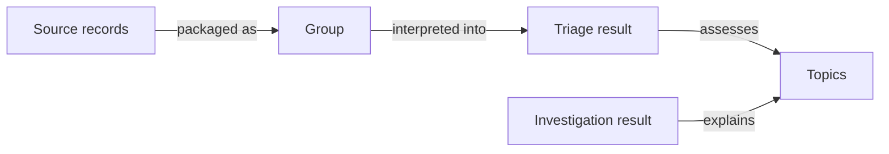
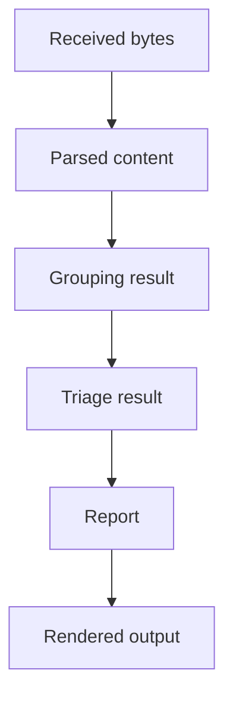
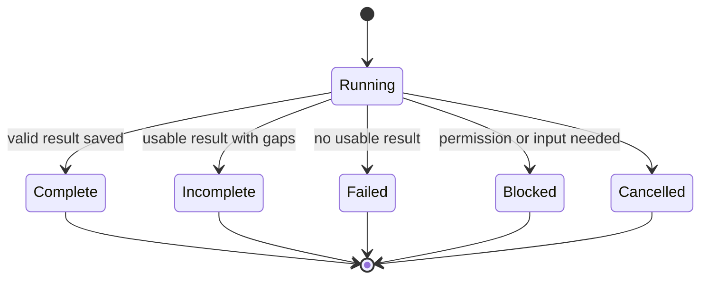
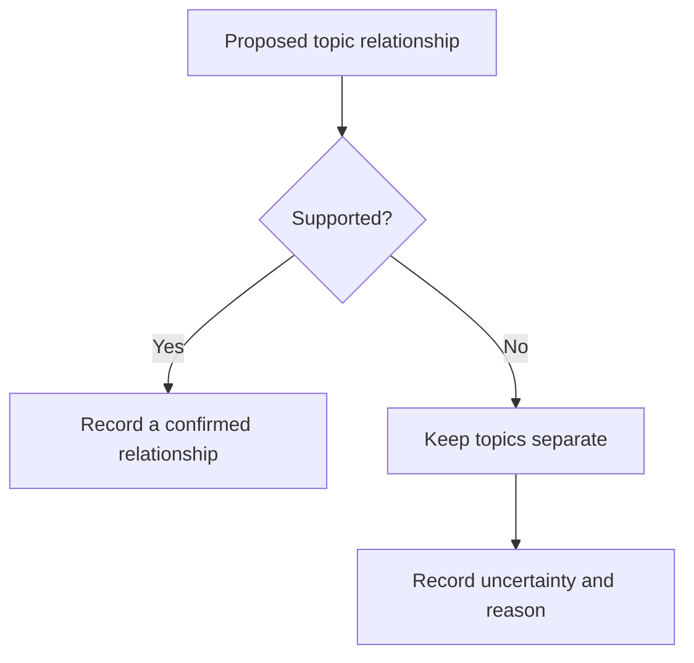
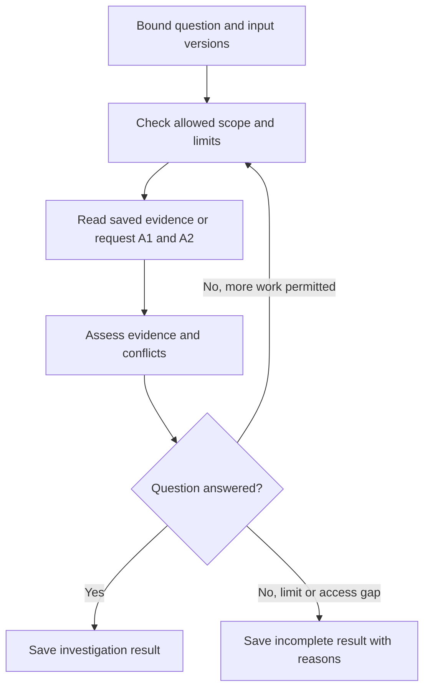
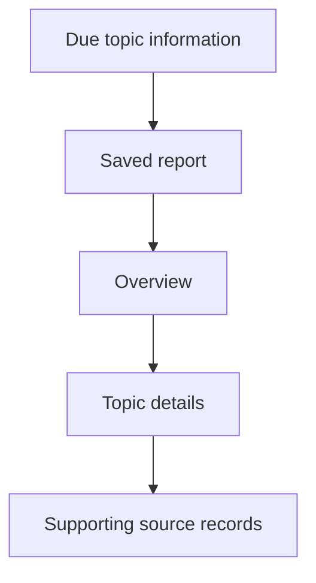
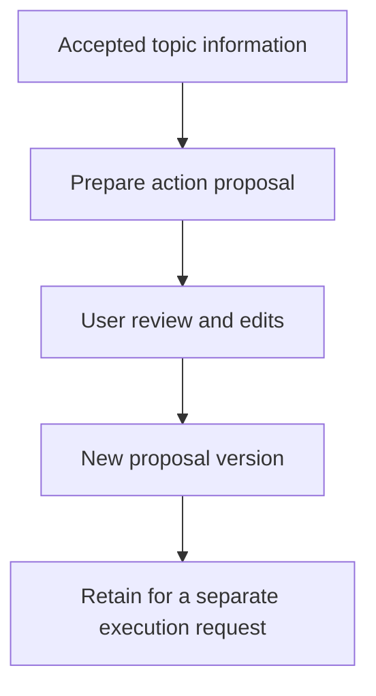
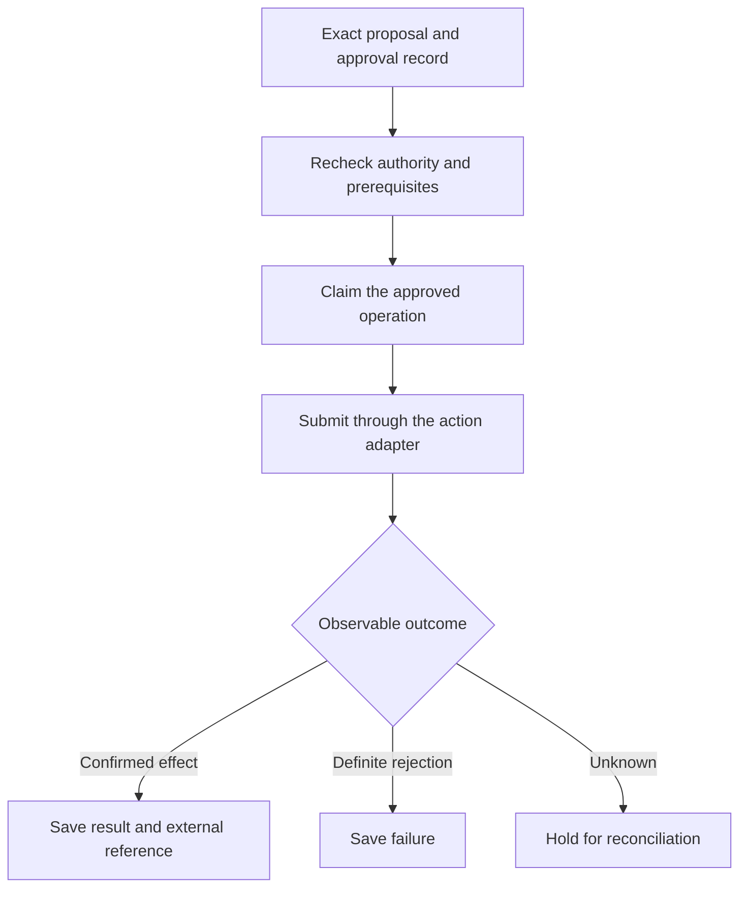

# msgloom Logical Design

**Scope:** Complete product. **Status:** Draft for review.

Extends the [Design Brief](design-brief.md) under the [Design Principles](design-principles.md). [Phase 1 Logical Design](phase-1/design.md) narrows these contracts for the first release.

## 1. Supporting concepts

The Brief owns **Source**, **Topic**, **Triage rules** and **Working context**. This table owns the supporting terms.

| Term | Meaning |
| --- | --- |
| **Source record** | One observed version of source information, linked to its unchanged received bytes. |
| **Stage result** | The saved outcome of one processing attempt: input references, output, status and processing versions. |
| **Group** | Source records packaged using a supported relationship, while retaining each member's identity. |
| **Triage result** | A stage result that identifies topics and records their priority, developments, actions, deadlines and risks. |
| **Investigation result** | A stage result that explains a selected topic using further information and records the evidence and limitations. |
| **Review result** | A stage result recording a user's correction or disposition against an exact assessment, relationship or proposal version, with its reason. |
| **Approval record** | A saved decision by an authorised user binding permission to an exact action proposal version, destination and validity conditions. |
| **Report policy** | User-defined criteria for which topics are due, when to report them and where to present them. |
| **Report** | A saved selection of topic information, organised under the Brief's report contract. |
| **Delivery attempt** | A recorded attempt to publish or send an exact report output to a destination. |
| **Action proposal** | A versioned recommendation or draft tied to a topic, with a target and any intended external effect. |
| **Action attempt** | A recorded attempt to execute an authorised version of an action proposal. |

A group is not a topic. One group may describe several topics, and one topic may draw on several groups.

## 2. Source identity and collection

Collection has a declared scope: accounts, folders, chats, channels, start boundary and permitted content. Record unavailable history and access limits. Content outside that scope is not processed content.

Distinguish message identity, observed version, source time and collection time. Repeated retrieval does not create a new message. Edits and available deletion notices create observations; a missing message or a folder move does not by itself prove deletion. Attachments retain their relationship to the message and their own receipt status.

Collected attachments are parsed under the same source-preservation contract as message bodies. Preserve their parent message, observed file version and available page, sheet, cell or document locations. Extraction from supplied content is separate from investigating additional sources.

Each collection scope has a checkpoint. Advance it only after the received bytes and outstanding processing work are saved. An invalid checkpoint starts recorded recovery rather than an assumed empty interval. Information that the source never supplied cannot be claimed as preserved.

## 3. Processing history

DP-02 governs preservation. Each stage result binds its inputs and the versions of code, configuration, rules, prompt, model and working context that affected it. Save exposed AI outputs and validation findings, not just the accepted interpretation. Credentials used to access services are not part of this record.

This is a traceability example, not a complete execution sequence. Filters, investigation, review, delivery and action work use the same stage-result contract.

Reference unchanged content rather than copying it into every result. Reprocessing creates a new result linked to earlier results; it does not replace them. Re-rendering, rerunning AI and delivering are separate operations. A replay has no external effect unless separately requested.

Each started attempt ends with a saved outcome. A terminal outcome is not rewritten when a retry starts.

## 4. Grouping and topic continuity

A grouping result saves members, method, evidence and status.

| Status | Meaning |
| --- | --- |
| **Confirmed** | The stated relationship is supported; the members may be processed together. |
| **Uncertain** | A possible relationship lacks support; the members remain separate. |
| **None** | No relationship was established or proposed. |

Confirmation of conversation membership does not confirm a common business matter. Similar titles and proximity in time are not identities.

Topic relationships are a separate judgement. Record the evidence, status and reason for joining or continuing topics. Use stable topic identities, not generated titles. A correction creates a new assessment with links to earlier assessments; it never erases source records.

## 5. Triage

The rule categories are defined in DP-01. Save their outcomes separately. A deterministic rule declares an exclusion, required priority, minimum priority or guidance. Guidance is not an exclusion. Conflicting constraints remain visible rather than being resolved by rule order alone.

Semantic triage uses supplied content, semantic triage rules and a saved working-context snapshot. It cannot silently override deterministic constraints. A rule applied to an AI-inferred value retains that value's uncertainty.

Priority order is **Critical**, **Important**, **Normal**, then **Low-value**. Triage rules define the conditions; priority does not determine a schedule by itself.

A triage result binds each topic to supporting source records, rule matches, priority and reason, developments, actions, deadlines, risks and limitations. Preserve the stated action owner and original deadline wording. An interpreted date includes its time-zone basis. Unknown and absent are different outcomes.

Every included source record maps to a topic or an explicit disposition, such as excluded, insufficient information or no reportable content. Pending work is never silently treated as Low-value. Source statements remain distinct from interpretation.

## 6. Investigation and review

### 6.1 Selection and input binding

Investigation starts with a topic assessment version, a question and an explicit reason for further work. The user may request it; AI may propose it under configured rules. The Application, not the message content, decides whether that request is authorised. A proposal to investigate is not permission to fetch arbitrary sources.

Bind the selected source records, related accepted results, working-context snapshot, allowed source scopes and effort limits to the attempt. Record the initiating caller and triggering result. Reuse an accepted investigation only when its question, relevant inputs and permission context still match; otherwise start a new attempt. Identical wording alone does not establish reuse.

### 6.2 Evidence loop

Read saved evidence first. Additional reads use the same collection and parsing contracts as ordinary ingestion. Each request records its scope, purpose and outcome. Limit source reads, elapsed work and model use; exact limits are configuration, not model discretion. Cancellation and exhausted limits retain acquired evidence and unfinished work.

The investigation result records the question, source-backed findings, interpretation, conflicting evidence, supported topic relationships, unanswered questions and completion status. A finding links to its contributing source versions and locations. An unavailable attachment, denied read or empty search must not be interpreted as proof that no issue exists.

Investigation does not automatically replace a triage result. Report selection uses accepted versions and explicitly identifies a pending or superseding assessment. A due topic remains reportable while this loop is unfinished.

### 6.3 Relationships and user correction

Use the relationship states in Section 4 for proposed cross-group and cross-source links. Save exact endpoints and evidence; a model label, shared title or common customer alone is not proof of the same work matter. An uncertain link may be shown as a possibility but cannot collapse separate topics or remove a report entry.

A review result binds the actor, target version, requested correction or rejection, and reason. Validate the referenced versions before accepting it. A concurrent edit produces a conflict for review rather than silently replacing another decision. Apply an accepted correction by creating new linked results; retain the original and the review result.

Corrections to a topic assessment, relationship or proposal do not implicitly edit triage rules, working context or approval. A published report keeps its original snapshot. Revised findings become eligible for an update under report policy.

## 7. Reports

Report policy selects topic information by priority, schedule, destination and prior reporting state. Track that state per policy and assessment version, not with a global sent flag. Reminders are explicit policy choices.

Freeze the selected versions before rendering. New arrivals remain eligible for a later report, even when their source timestamps are old. Investigation in progress cannot delay a topic already due: report the available assessment and its limitation.

The Brief owns the content of these levels. Check coverage by topic identity and version, including essential actions, deadlines and risks. Equal item counts alone do not prove coverage. Distinguish source availability, processing completeness and report completeness.

Each output must make its required details reachable. A broken website link is not delivery. Multiple parts may carry one report; no due topic disappears because of a size limit. A report may be issued with explicit pending-work warnings, but must not claim complete processing.

A delivery attempt distinguishes accepted submission, confirmed delivery where observable, rejection and unknown outcome. Unknown external effects require reconciliation before automatic retry.

### 7.1 Report access and review

The Report website reads saved overview, topic details, source references and assessment history through the Application. It does not run investigation while rendering a page. An authorised user starts investigation or submits a review result as a separate operation and can inspect its saved status.

The optional MCP adapter exposes the same authorised operations and outcomes. Browsing a report is read-only; neither navigation nor a client retry authorises a source fetch, rule change or business action. Check access to details and source content independently of possession of a report link. Exact URLs and MCP tool names belong in implementation design.

## 8. Action support and execution

### 8.1 Proposal preparation

Action support consumes exact accepted triage or investigation result versions and a requested purpose. The user may request a proposal, or configured rules may suggest preparing one. A6 has no provider-write authority.

An action proposal records the supporting topic and evidence, requested action type, destination, content, prerequisites, unresolved values and intended effect. A reply identifies the source conversation; a task or ticket identifies the target system and any known owner. Missing recipients, ambiguous commitments or absent required fields stay unresolved. Do not invent values merely to make a draft executable.

User edits and regeneration create new proposal versions with input and review references. Regeneration must not silently overwrite human edits. Changed evidence marks an affected proposal as needing revalidation; a reviewed draft is not automatically current forever. Rejection remains recorded and cannot be reversed by a background rerun.

Phase 3 ends at a saved proposal and review result. Nothing is sent, filed or created in an external system. Report delivery remains the separate function in Section 7.

### 8.2 Approval and execution

An execution request selects an exact proposal version. An approval record binds the authorised actor, action type, destination and content identity, relevant prerequisites, and validity conditions. Record rejection or revocation as a subsequent decision rather than erasing the earlier record. AI cannot approve its own proposal.

Initially every external business action requires explicit user approval. Reviewing wording, viewing a report or requesting a new draft is not that approval. Changed content, destination or material prerequisites requires revalidation and renewed approval; expired or revoked authority blocks execution.

Persist the execution claim and attempt before submission. Use a stable operation identity across retries and provider idempotency support where available. An internal identity alone cannot guarantee exactly-once external execution. Concurrent requests for the same approved operation must not both submit it.

Record submission acceptance separately from confirmed effect. Reconcile an unknown outcome using provider evidence before another write; otherwise retain it for user review. Treat cancellation after submission as a potentially unknown effect, not proof that nothing happened.

A set of actions records a separate outcome for each action. Do not repeat successful actions when another fails, or assume rollback across external systems. Link attempts back to the proposal and topic so reports show the actual outcome. Further compensating actions require their own authority.

## 9. Validation boundary

Acceptance combines structural checks with user-reviewed work samples. Measure missed important information, wrong grouping, unsupported relationships, lost actions or deadlines, report coverage and recovery. Schema validity and model confidence are not evidence of semantic correctness.

Release-specific cases belong in the phase design. The [Phase Roadmap](phase-roadmap.md) assigns the capabilities above without narrowing this complete-product contract.

## 10. Invocation contract

Operations start on explicit requests from an external caller; the package does not decide when to wake up. Recurring triggers are independent of report-policy decisions about what is due.

An operation consumes eligible saved inputs, completes dependent stages in order and returns after recording its outcome. A failed dependency cannot be replaced with empty input or silently accepted partial work. A later retry or replay does not change the meaning of earlier results.

All interfaces invoke the same operations and preserve their permissions, source mappings and outcome rules. Exact command names and transport schemas are implementation decisions.

## 11. Shared operation boundary

An **Operation request** identifies the caller, requested capability, target input versions and parameters, with an execution identity and an authority reference. Caller-supplied names or source text are not authority; resolve permission from trusted configuration and any required approval record.

An **Operation outcome** reports the saved execution identity, stage-result references, terminal status, limitations and observable external-effect state. It describes completed work, not a promise to finish later. No SDK, CLI, ORM or MCP transport objects appear in either contract.

All interfaces use these contracts. Capability admission occurs before optional service creation or external access. A capability unavailable in the current phase returns an explicit blocked outcome without provider writes; hiding a CLI command alone is not enforcement.

Shared result references identify both kind and schema version. Preserve earlier versions and add explicit migrations or readers when later phases extend the model. Unknown versions cannot be silently interpreted as empty results. Later-phase evidence, review and approval records follow the same identity, lineage and permissions as Phase 1 results.
