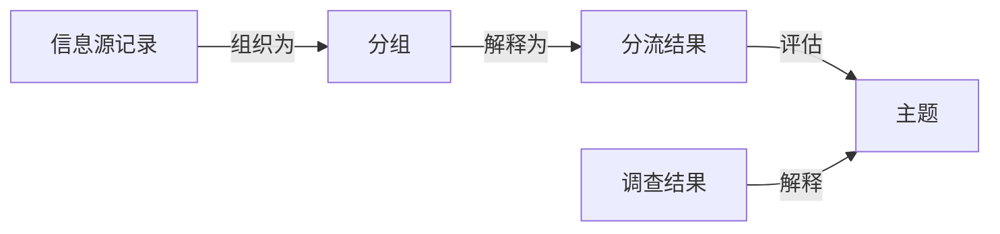
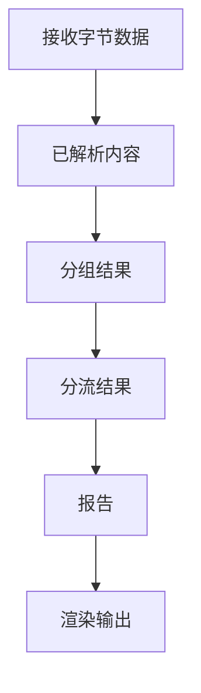
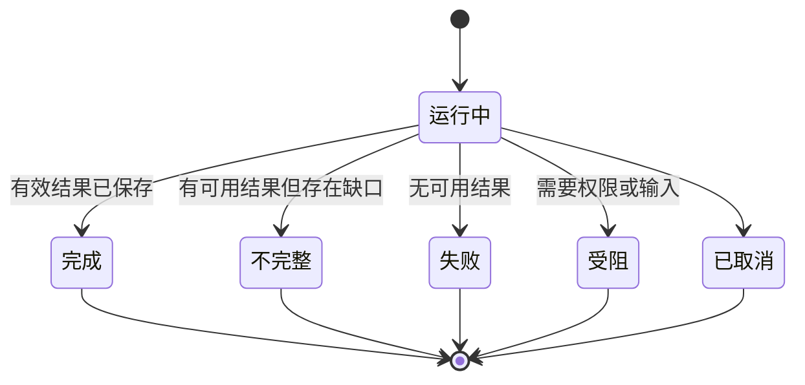
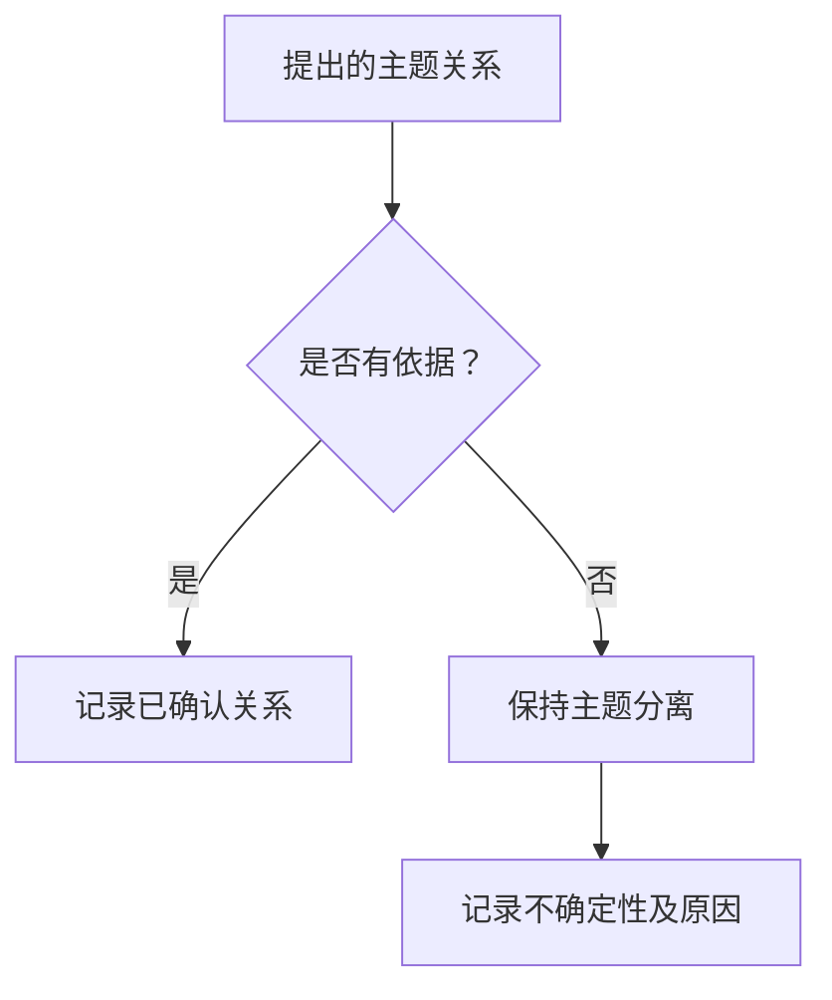
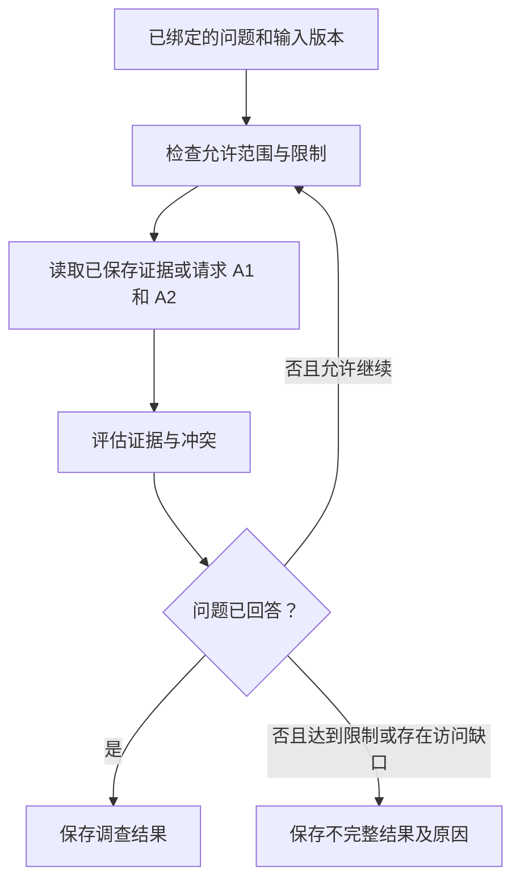
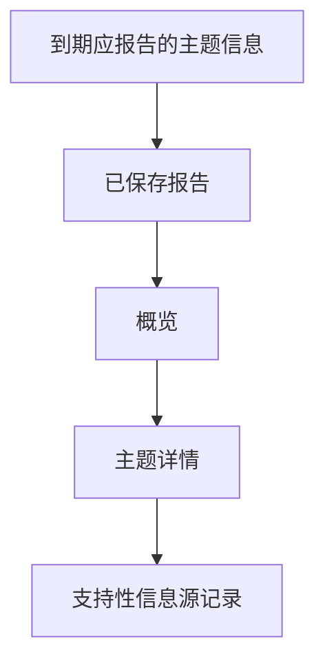
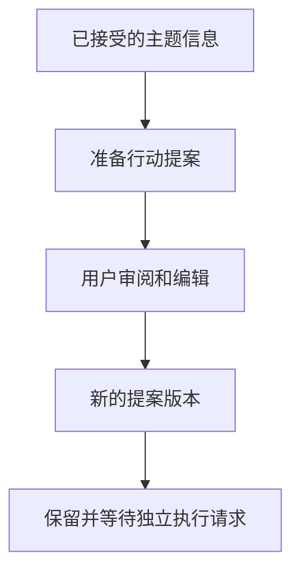
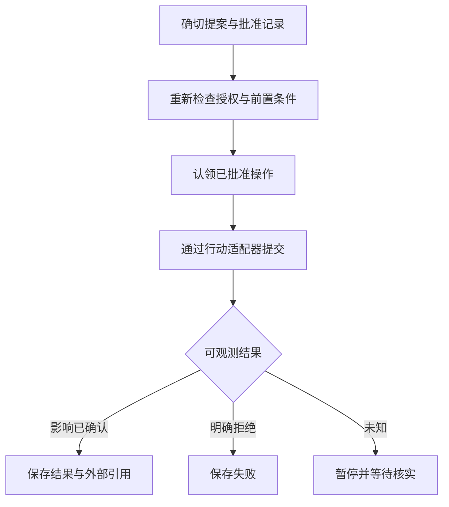

# msgloom 逻辑设计

**范围：** 完整产品。**状态：** 待审阅草稿。

在[设计原则](design-principles.zh-CN.md)约束下扩展[设计概要](design-brief.zh-CN.md)。[第 1 阶段逻辑设计](phase-1/design.zh-CN.md)针对首个版本收窄这些契约。

## 1. 辅助概念

概要负责定义**信息源**、**主题**、**分流规则**和**工作上下文**。下表负责定义辅助术语。

| 术语 | 含义 |
| --- | --- |
| **信息源记录** | 信息源信息的一个已观测版本，链接到原样保留的接收字节数据。 |
| **阶段结果** | 一次处理尝试保存的结果：输入引用、输出、状态和处理版本。 |
| **分组** | 按有依据的关系组织的信息源记录集合，同时保留每个成员的标识。 |
| **分流结果** | 识别主题并记录其优先级、进展、行动、截止时间和风险的阶段结果。 |
| **调查结果** | 使用更多信息解释选定主题，并记录证据和局限的阶段结果。 |
| **审阅结果** | 针对评估、关系或提案的确切版本，记录用户更正或处置决定及其原因的阶段结果。 |
| **批准记录** | 获准用户保存的决定，将权限绑定到行动提案的确切版本、目标位置和有效条件。 |
| **报告策略** | 用户定义的标准，用于确定哪些主题到期应报告、何时报告以及在哪里展示。 |
| **报告** | 按概要中的报告契约组织并保存的选定主题信息。 |
| **交付尝试** | 将报告的确切输出发布或发送到目标位置的一次尝试记录。 |
| **行动提案** | 与主题关联、带版本的建议或草稿，包含目标和预期的外部影响（如有）。 |
| **行动尝试** | 执行行动提案某个已授权版本的一次尝试记录。 |

分组不是主题。一个分组可能描述多个主题，一个主题也可能使用多个分组的信息。

## 2. 信息源标识与采集

采集范围必须明确声明：账号、文件夹、聊天、频道、起始边界和允许访问的内容。记录不可用的历史记录和访问限制。范围外的内容不属于已处理内容。

区分消息标识、观测版本、信息源时间和采集时间。重复获取不会创建新消息。编辑和可获取的删除通知会产生观测记录；消息缺失或文件夹移动本身不能证明消息已被删除。附件保留与消息的关系以及自身的接收状态。

已采集附件与消息正文遵守相同的信息源保留契约进行解析。保留其父消息、观测到的文件版本，以及可用的页、工作表、单元格或文档位置。从已提供内容中提取信息，与调查其他信息源是不同的操作。

每个采集范围都有检查点。只有在接收字节数据和待处理工作已保存后，才能推进检查点。检查点无效时，启动有记录的恢复流程，不得假定该区间为空。不能声称保留了信息源从未提供的信息。

## 3. 处理历史

保留行为遵循 DP-02。每个阶段结果绑定其输入，以及影响该结果的代码、配置、规则、提示词、模型和工作上下文版本。保存 AI 对外提供的输出和验证发现，而不只是已接受的解释。访问服务所用的凭据不属于此记录。

这是可追溯性示例，不是完整执行顺序。过滤、调查、审阅、交付和行动工作使用相同的阶段结果契约。

引用未改变的内容，不必将其复制到每个结果中。重新处理会创建链接到早期结果的新结果，不替换早期结果。重新渲染、重新运行 AI 和交付是独立操作。除非另行请求，重放不会产生外部影响。

每次已启动的尝试都以保存结果结束。重试启动时，不改写此前的终态结果。

## 4. 分组与主题连续性

分组结果保存成员、方法、证据和状态。

| 状态 | 含义 |
| --- | --- |
| **已确认** | 所述关系有依据；可以一起处理这些成员。 |
| **不确定** | 可能存在某种关系，但缺乏依据；成员保持分离。 |
| **无** | 未建立或提出任何关系。 |

确认属于同一对话，并不等于确认属于同一业务事项。相似标题和相近时间不能作为唯一标识。

主题关系需要单独判断。记录合并或延续主题的证据、状态和原因。使用稳定的主题标识，不使用生成的标题作为标识。更正会创建链接到早期评估的新评估，绝不删除信息源记录。

## 5. 分流

规则类别在 DP-01 中定义。分别保存各类规则的结果。确定性规则声明排除、指定优先级、最低优先级或指导意见。指导意见不等于排除。约束冲突必须保持可见，不能仅靠规则顺序解决。

语义分流使用已提供内容、语义分流规则和已保存的工作上下文快照。它不能静默覆盖确定性约束。对 AI 推断值应用规则时，必须保留该值的不确定性。

优先级从高到低为**关键**、**重要**、**普通**、**低价值**。分流规则定义对应条件；优先级本身不决定运行计划。

分流结果将每个主题绑定到支持它的信息源记录、规则匹配项、优先级及原因、进展、行动、截止时间、风险和局限。保留原文陈述的行动负责人和截止时间措辞。解释后的日期包含其时区依据。“未知”和“不存在”是不同结果。

每条纳入处理的信息源记录都映射到一个主题或明确的处置结果，例如已排除、信息不足或无可报告内容。绝不将待处理工作静默视为低价值。信息源陈述与解释保持区分。

## 6. 调查与审阅

### 6.1 选择与输入绑定

调查从某个主题评估版本、一个问题和明确的进一步工作理由开始。用户可以提出请求；AI 可以依据配置的规则提出建议。请求是否获准由应用层判断，而不是由消息内容决定。提出调查建议不等于获得任意读取信息源的许可。

将选定的信息源记录、相关已接受结果、工作上下文快照、允许的信息源范围和工作量限制绑定到本次尝试。记录发起调用方和触发结果。只有问题、相关输入和授权上下文仍匹配时，才能复用已接受的调查；否则启动新尝试。仅措辞相同不能作为复用依据。

### 6.2 证据循环

优先读取已保存证据。额外读取遵守普通采集的同一套采集和解析契约。每次请求记录范围、目的和结果。限制信息源读取次数、处理时间和模型用量；具体限制来自配置，不由模型自行决定。取消或达到限制时，保留已获取证据和未完成工作。

调查结果记录问题、有信息源支持的发现、解释、冲突证据、有依据的主题关系、未回答的问题和完成状态。每项发现链接到支持它的信息源版本和位置。不可用附件、被拒绝的读取或空搜索结果，不能被解释为不存在问题的证据。

调查不会自动替换分流结果。报告选择使用已接受版本，并明确标识待完成或取代早期结果的评估。此循环尚未完成时，到期主题仍可报告。

### 6.3 关系与用户更正

对拟议的跨分组和跨信息源链接，使用第 4 节的关系状态。保存确切端点和证据；模型标签、共同标题或共同客户本身不能证明属于同一工作事项。不确定链接可以作为可能关系展示，但不能合并独立主题或删除报告条目。

审阅结果绑定操作者、目标版本、请求的更正或拒绝，以及原因。接受前验证引用版本。并发编辑产生待审阅冲突，不静默替换其他决定。接受更正后，通过创建新的关联结果应用变更；保留原始结果和审阅结果。

更正主题评估、关系或提案，不会隐式编辑分流规则、工作上下文或批准。已发布报告保留原始快照。修订发现根据报告策略进入后续更新。

## 7. 报告

报告策略根据优先级、计划、目标位置和先前报告状态选择主题信息。按策略和评估版本跟踪该状态，不使用全局“已发送”标记。提醒必须由策略明确选择。

渲染前冻结选定版本。新到达的信息仍可纳入后续报告，即使其信息源时间戳较早。正在进行的调查不能推迟已到期主题的报告：应报告现有评估及其局限。

概要负责定义这些层级的内容。按主题标识和版本检查覆盖情况，包括关键行动、截止时间和风险。仅条目数量相等不能证明覆盖完整。区分信息源可用性、处理完整性和报告完整性。

每份输出都必须让用户能够访问其必需详情。失效的网站链接不构成交付。一份报告可以分为多个部分；不能因大小限制而丢失任何到期主题。报告可以带有明确的待处理工作提示发布，但不得声称处理已全部完成。

交付尝试区分提交已接受、可观测时确认的送达、拒绝和未知结果。外部影响未知时，必须先核实再自动重试。

### 7.1 报告访问与审阅

报告网站通过应用层读取已保存的概览、主题详情、信息源引用和评估历史，不在页面渲染时执行调查。获准用户通过独立操作发起调查或提交审阅结果，并能查看其已保存状态。

可选 MCP 适配器提供相同的授权操作和结果。浏览报告是只读行为；页面导航或客户端重试都不授权读取新信息源、修改规则或执行业务行动。必须独立检查详情和信息源内容的访问权限，不能将持有报告链接当作授权。确切 URL 和 MCP 工具名称属于实现设计。

## 8. 行动支持与执行

### 8.1 提案准备

行动支持使用已接受的分流结果或调查结果的确切版本，以及请求的用途。用户可以请求提案，也可以由配置规则建议起草。A6 不具有提供方写入权限。

行动提案记录支持它的主题和证据、请求的行动类型、目标位置、内容、前置条件、未解决的值和预期影响。回复标明原始对话；任务或工单标明目标系统及已知负责人。收件人缺失、承诺含糊或必需字段缺失时，保持未解决。不能仅为使草稿可执行而编造值。

用户编辑和重新生成会创建新的提案版本，并保存输入和审阅引用。重新生成不能静默覆盖人工编辑。证据变化后，受影响的提案必须标记为需要重新验证；草稿曾被审阅不代表它永远有效。拒绝保持记录，后台重跑不能反转该决定。

第 3 阶段止于已保存提案和审阅结果，不在外部系统发送、提交或创建任何对象。报告交付仍是第 7 节的独立功能。

### 8.2 批准与执行

执行请求选择行动提案的确切版本。批准记录绑定获准操作者、行动类型、目标位置和内容标识、相关前置条件及有效条件。拒绝或撤销作为后续决定记录，不删除早期记录。AI 不能批准自己的提案。

初期每项外部业务行动都需要用户明确批准。审阅措辞、查看报告或请求新草稿不构成批准。内容、目标位置或重要前置条件改变时，需要重新验证并重新批准；授权过期或撤销时阻止执行。

提交前先持久保存执行认领和尝试。重试沿用稳定的操作标识；提供方支持幂等时使用该能力。仅有内部标识不能保证外部操作恰好执行一次。同一已批准操作的并发请求不能同时提交。

分别记录提交被接受和影响已确认。再次写入前，利用提供方证据核实未知结果；无法核实时保留给用户审阅。提交后取消可能产生未知影响，不能据此认定什么都没有发生。

一组行动中的每项行动分别记录结果。某项失败时，不重复已经成功的行动，也不假定能跨外部系统回滚。尝试链接回提案和主题，使报告呈现实际结果。后续补偿行动需要独立授权。

## 9. 验证边界

验收结合结构检查和经用户审阅的工作样本。衡量重要信息遗漏、错误分组、无依据的关系、行动或截止时间丢失、报告覆盖及恢复情况。符合模式和模型置信度不能证明语义正确。

特定版本的用例属于阶段设计。[阶段路线图](phase-roadmap.zh-CN.md)分配上述能力，不收窄本完整产品契约。

## 10. 调用契约

操作由外部调用方的明确请求启动；包本身不决定何时唤醒。周期性触发器独立于报告策略对哪些内容到期应报告的判断。

操作使用符合条件的已保存输入，按顺序完成依赖阶段，并在记录结果后返回。依赖失败时，不能用空输入替代，也不能静默接受部分完成的工作。后续重试或重放不改变早期结果的含义。

所有接口调用相同的操作，并保留其权限、信息源映射和结果规则。确切命令名称和传输模式由实现设计决定。

## 11. 共享操作边界

**操作请求**标明调用方、请求的能力、目标输入版本和参数，并包含执行标识和授权引用。调用方提供的名称或信息源文本本身不是授权；从可信配置和所需批准记录中解析权限。

**操作结果**报告已保存的执行标识、阶段结果引用、终态、局限和可观测的外部影响状态。它描述已完成的工作，而不是承诺稍后完成。两种契约都不包含 SDK、CLI、ORM 或 MCP 传输对象。

所有接口使用这些契约。在创建可选服务或访问外部资源之前，先检查能力准入。当前阶段不可用的能力返回明确的受阻结果，且不写入提供方；仅隐藏 CLI 命令不构成强制限制。

共享结果引用同时标明类型和模式版本。保留早期版本；后续阶段扩展模型时，增加明确的迁移或读取器。未知版本不能静默解释为空结果。后续阶段的证据、审阅和批准记录遵守与第 1 阶段结果相同的标识、血缘和权限规则。
