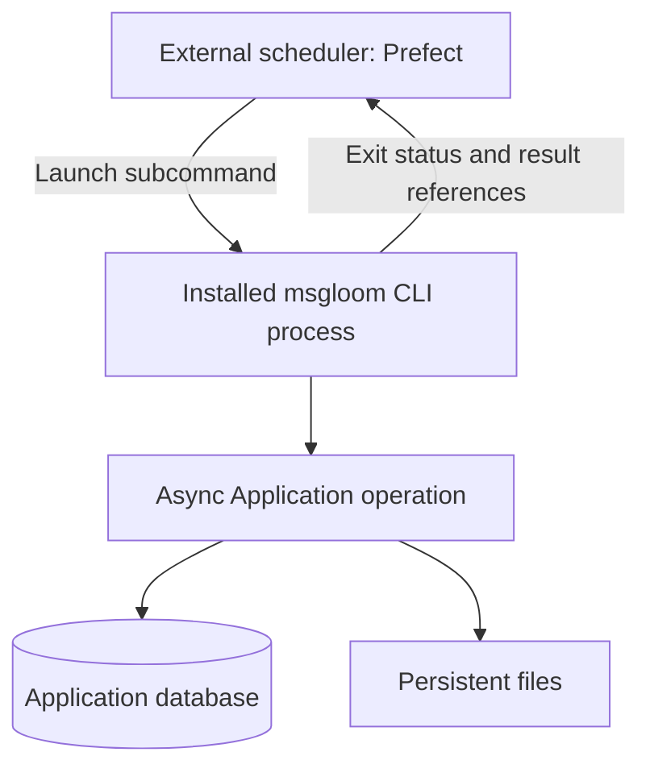
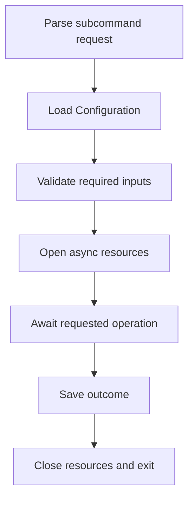
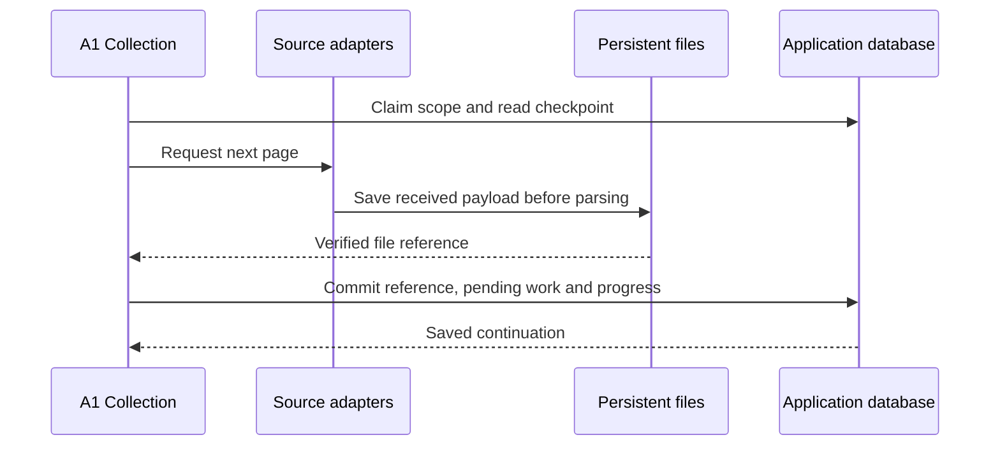
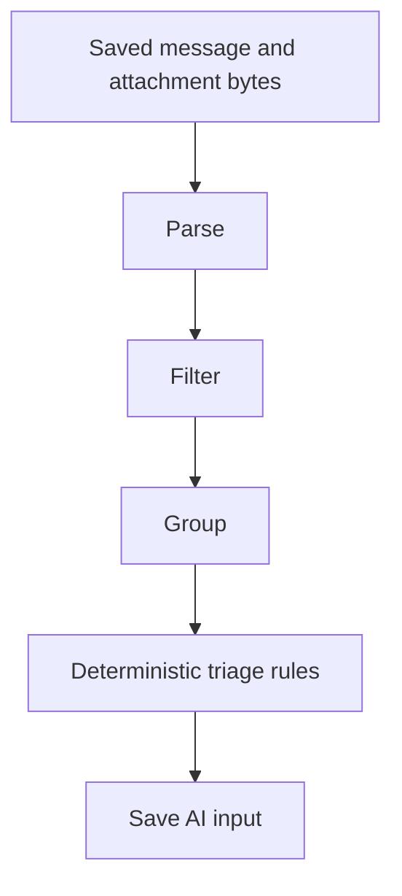
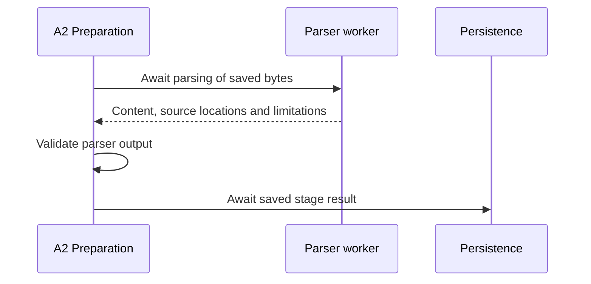
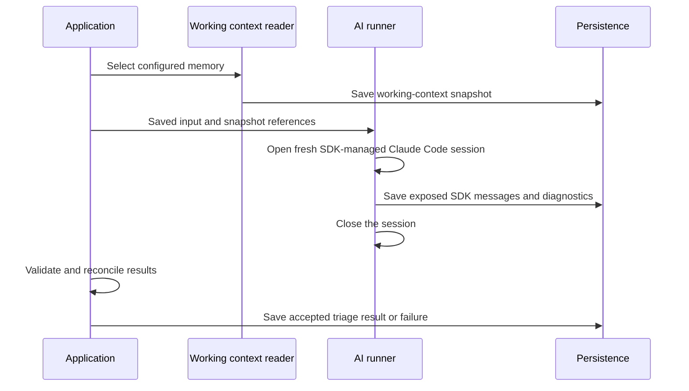
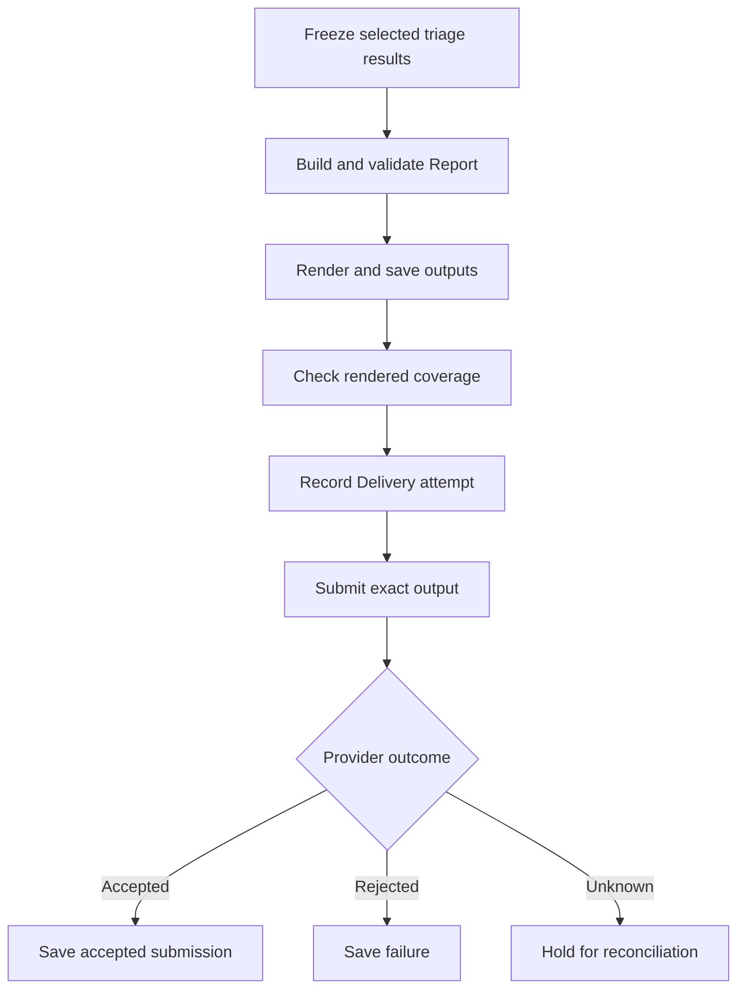
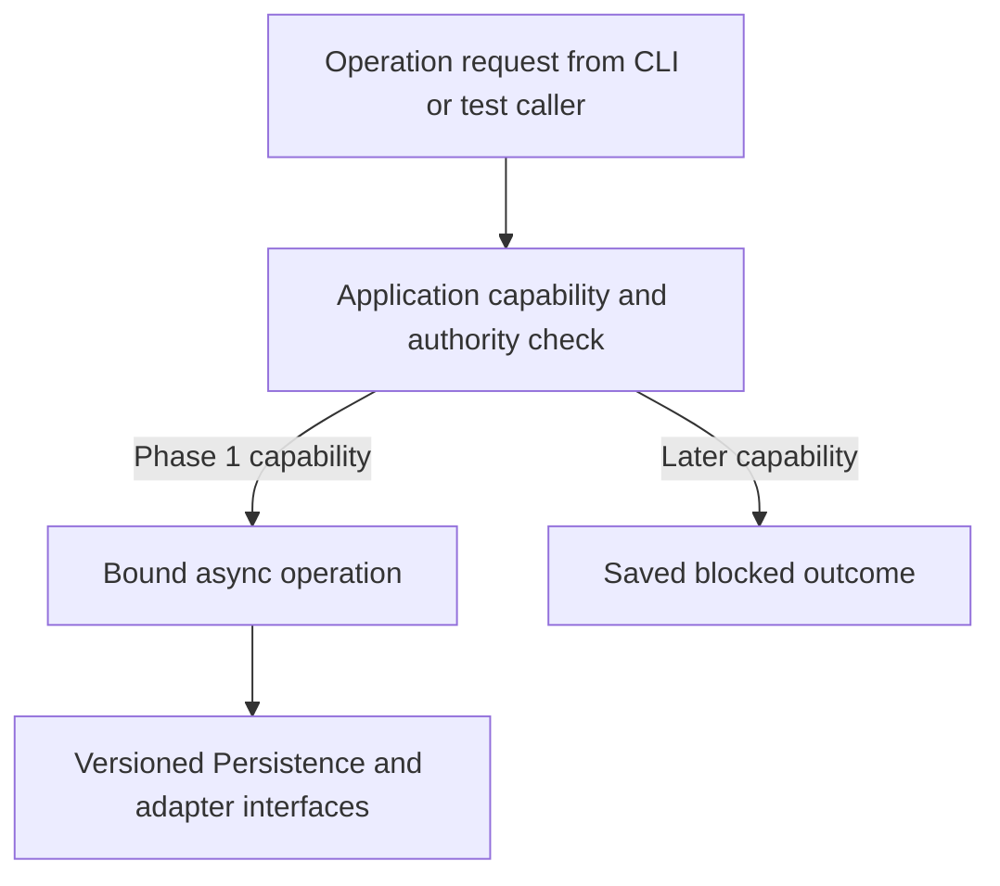

# msgloom Phase 1 Architecture

**Scope:** Phase 1 only. **Status:** Draft for review.

Selects components from the [complete-product Architecture Design](../architecture.md) and implements [Phase 1 Logical Design](design.md). Dependency choices are owned by [Technology Stack](../tech-stack.md).

## 1. Deployment

Deployment installs Prefect 3 as the [External scheduler](../architecture.md#2-shared-components) and the msgloom Python package independently in Docker. In the execution container, the Prefect runner launches the installed msgloom executable. Prefer separate Python environments so scheduler dependencies do not constrain the package. Prefect's server and state may be separate deployment services; their layout is not a package requirement.

The package does not poll Prefect, register schedules or host a Prefect runner. Deployment owns the thin Prefect job definition and configured executable path. No Docker socket is needed to launch a command in the execution container.

Use persistent storage for the Application database, source bytes, results and isolated AI session storage. Mount selected daily-work memory paths read-only. The external operational web interface is not the future Report website; expose it locally by default.

## 2. Invocation lifecycle

Validate only resources required by the requested operation. Help or configuration inspection must not launch Claude Code or require source credentials. Bind one Configuration version per run.

Processing, reporting and replay may have different external triggers. Each invocation consumes eligible saved work according to its request, not merely information newer than the last timer tick. Exact subcommand names and purposes remain for implementation design.

The scheduler waits for process completion and inspects its status. Use an argument list, never message content interpolated into shell commands. Disable blind retry of operations with possible external effects: a nonzero exit after partial delivery is not permission to resend every part.

Enforce the [async execution contract](../architecture.md#async-execution). The CLI starts one event loop, and worker calls and stage results are awaited. There is no in-package scheduling daemon or queue between stages.

## 3. Collection writes

Keep page continuation separate from a completed collection round. Follow all pages and required reply reads. Supplementary MIME or attachment requests have recorded work and outcomes of their own.

A raw page that cannot be parsed remains durable pending work. It must not vanish because collection advanced. An invalid continuation starts explicit recovery using the source-specific strategy in Technology Stack.

File writes use a temporary file, verification and atomic replacement on the same filesystem before the ORM transaction records completion. Interruption may leave an unreferenced file; it must not create a successful result pointing at missing content.

## 4. Preparation and AI execution

### Preparation and deterministic triage

Each step saves a stage result through Persistence. Exclusions stop the semantic path but remain inspectable. Use stored identities and rule versions to prevent the Application's own reports from repeatedly entering triage.

A2 routes collected files through the [parser selection](../tech-stack.md#parser-selection). Await Parser worker completion before accepting content or starting A3. Workers write only to isolated temporary storage; the Application verifies returned output before committing its reference. Heavy document parsing runs in bounded processes, not on the event-loop thread.

Enforce time, memory, decompression and output limits. A stopped worker cannot later mark its attempt complete. On timeout, terminate and reap it; partial or unsupported content remains explicit. Process isolation alone is not a complete security sandbox.

### AI execution

Each analysis attempt opens its own SDK-managed session; it never attaches to a daily interactive session or resumes a previous attempt. The AI runner has separate settings, session storage and a work directory. It must not inherit daily-session hooks, plugins or MCP connections. Only the existing model credentials are supplied to the Claude Code process; source credentials remain with adapters.

Phase 1 disables source discovery, shell execution, file editing and report sending in the AI process. Verify effective SDK, CLI and managed settings rather than rely on a prompt restriction. A fresh process is not, by itself, a security sandbox. On failure or cancellation, close the SDK session and preserve its exposed output and unfinished work.

Split large input before execution and preserve the complete input mapping. Stop or retry failed parts under configured limits; retain every attempt. Unprocessed parts remain visible even if other parts succeed.

## 5. Report submission

The diagram applies to each required output part. The report is not fully submitted until all parts have an accepted submission. Acceptance is distinct from observable recipient delivery.

A retry reuses the saved output and report identity. It does not rerun triage. Reconcile an unknown result through available provider evidence; when that evidence is insufficient, leave the attempt unresolved for the operator.

## 6. Recovery and replay

| Situation | Application response |
| --- | --- |
| Competing collection or reporting runs | Acquire a per-scope or per-policy claim through the ORM; only the claim holder advances progress. |
| Temporary database contention | Await a short ORM transaction retry. Use one async session per task; never share an active session across workers. |
| Failed parse or AI output | Restart from the selected saved input with a new attempt identity. |
| External scheduler restart or missed trigger | A later command resumes saved pending work. Manual invocation remains available without the scheduler. |
| Missing file or disk exhaustion | Mark dependent work unavailable and stop progress; restore or explicitly recollect where permitted. |
| Backup or restore | Pause writers and preserve the Application database with its referenced files; verify integrity before resuming. |

Replay is an Operator CLI operation on a selected stage result. It creates new downstream results without advancing collection checkpoints or submitting reports unless separately requested. Close async clients, SDK sessions, database sessions and parser workers on normal exit and cancellation. Independent invocations enforce the same claims and external-effect rules.

## 7. Qualification boundary

Before production use, exercise the concrete deployment against the logical acceptance cases and [technical qualification](../tech-stack.md#9-qualification). Test the actual container architecture, Python 3.12, 3.13 and 3.14, sequential stage completion and event-loop responsiveness during attachment parsing. Verify command execution without Prefect or FastMCP installed. This document specifies a deployment; it does not claim one has been installed or tested.

## 8. Extension interface preparation

Bind the [extension interfaces](../architecture.md#8-extension-interfaces) with explicit typed dependencies. Implement only the Evidence, Result and Report interface paths needed by current operations. The Action interface has no live provider in Phase 1; capability admission rejects it before any write client is created.

Use Python protocols or equivalent typed interfaces, not FastMCP, Prefect or SDK classes, in shared contracts. The CLI converts arguments to an Operation request and presents the Operation outcome. A future MCP adapter awaits the same Application interface in its existing loop; the scheduler stays outside the package.

Store result kind and schema version with input references in the existing Persistence model. Validate a registered kind before accepting it; do not add unused provider tables or unvalidated arbitrary JSON fields. A later schema migration must retain existing references and older report snapshots. Unknown required schema versions produce a visible failure rather than partial success.

Contract tests use a fake evidence reader, a fake optional result producer and a recording action adapter that must never be called. Exercise cancellation and resource cleanup through a non-CLI async caller. Demonstrate that adding a test implementation requires no change to the CLI, source identity rules or report renderer. Actual later-phase tools remain disabled.

Run these tests in every required interpreter environment from Technology Stack, including Python 3.14. The separate FastMCP 4 compatibility environments test the dependency boundary; they do not start a production server or certify client interoperability.
