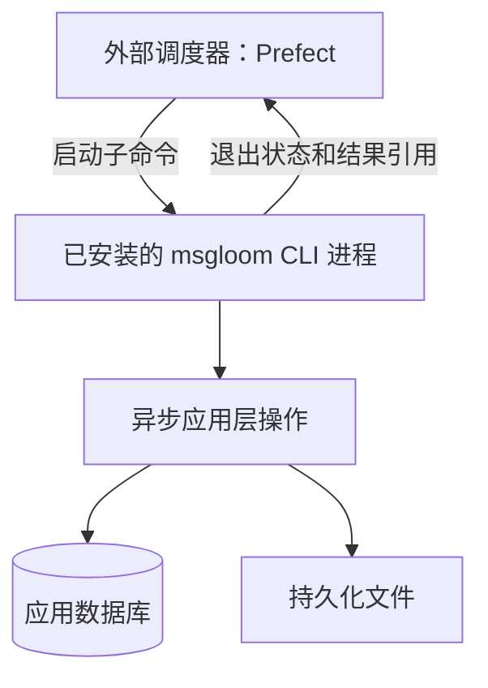
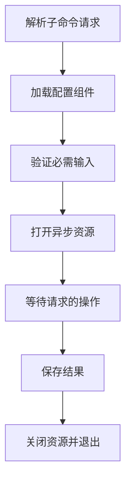
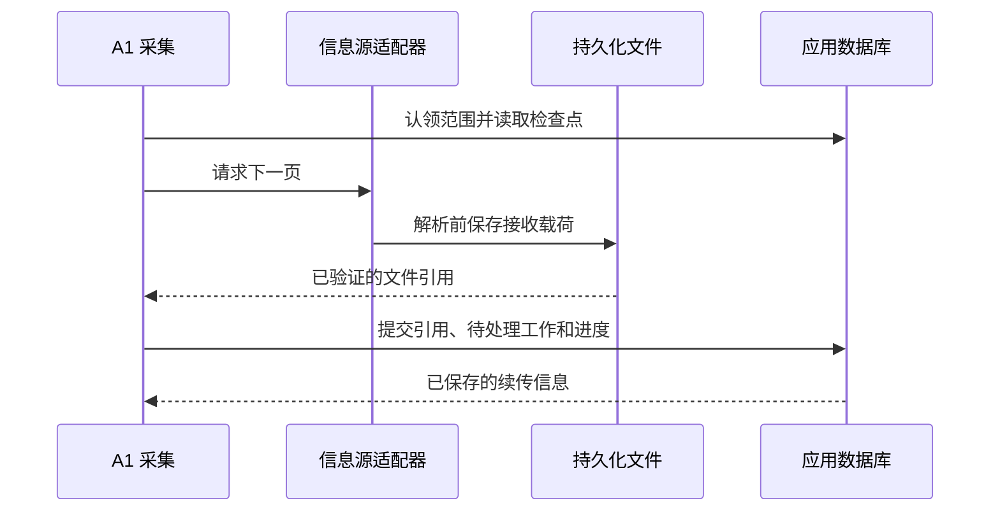
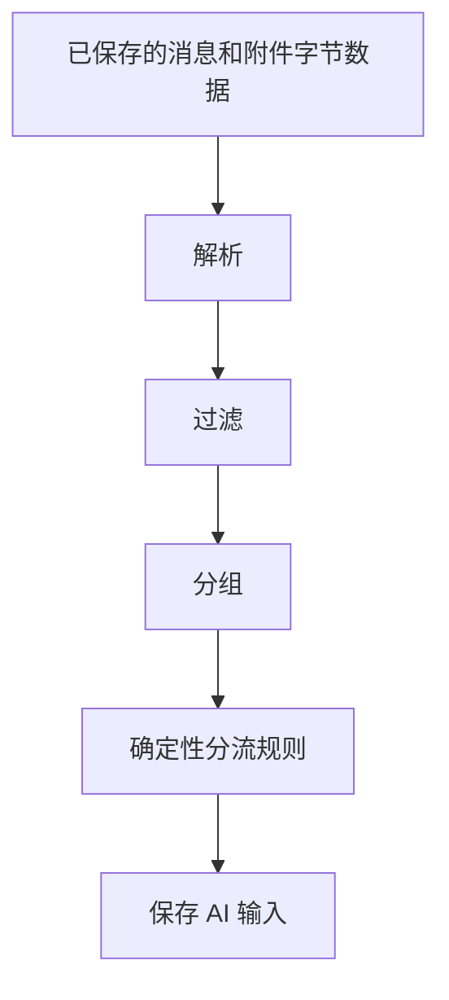
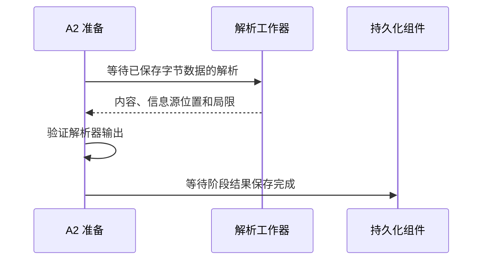
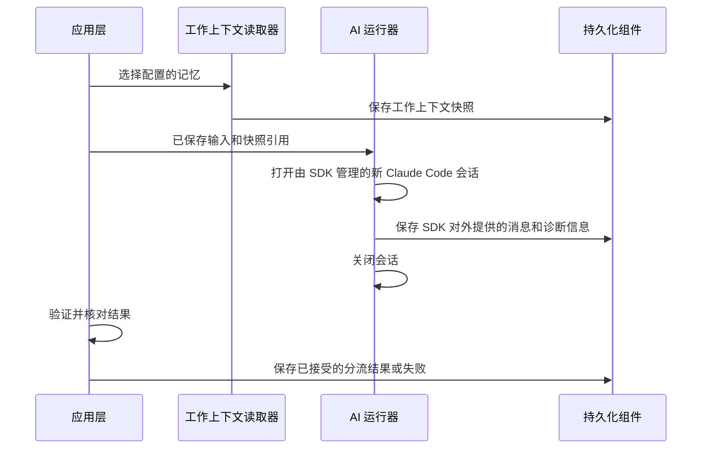
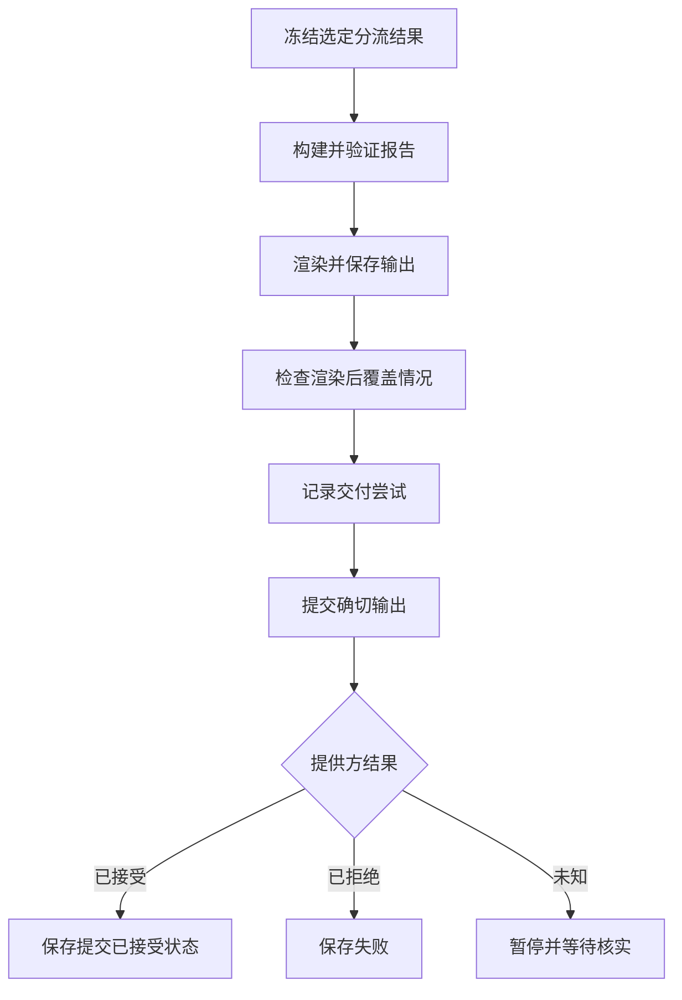
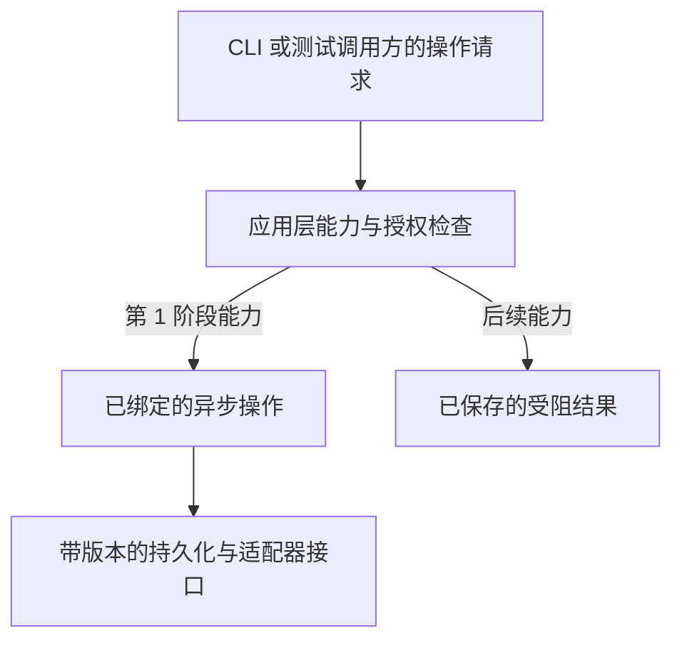

# msgloom 第 1 阶段架构

**范围：** 仅第 1 阶段。**状态：** 待审阅草稿。

从[完整产品架构设计](../architecture.zh-CN.md)选择组件，并实现[第 1 阶段逻辑设计](design.zh-CN.md)。依赖选型由[技术栈](../tech-stack.zh-CN.md)负责。

## 1. 部署

部署层在 Docker 中分别安装作为[外部调度器](../architecture.zh-CN.md#2-共享组件)的 Prefect 3 和 msgloom Python 包。在执行容器中，Prefect 运行器启动已安装的 msgloom 可执行文件。优先使用独立 Python 环境，使调度器依赖不约束包。Prefect 服务器及其状态可以作为独立部署服务；其布局不是包的要求。

包不轮询 Prefect、不注册运行计划，也不托管 Prefect 运行器。部署层负责精简的 Prefect 任务定义和配置的可执行文件路径。在执行容器中启动命令不需要 Docker socket。

为应用数据库、信息源字节数据、结果和隔离的 AI 会话存储使用持久化存储。以只读方式挂载选定的日常工作记忆路径。外部运维 Web 界面不是未来的报告网站；默认仅在本地开放。

## 2. 调用生命周期

仅验证请求操作所需的资源。帮助或配置检查不得启动 Claude Code，也不得要求信息源凭据。每次运行绑定一个配置组件版本。

处理、报告和重放可以具有不同的外部触发器。每次调用按请求使用符合条件的已保存工作，而不只是处理上次定时触发之后的新信息。确切子命令名称和用途留待实现设计决定。

调度器等待进程完成并检查状态。使用参数列表，绝不将消息内容插入 shell 命令。对可能产生外部影响的操作禁用盲目重试：部分交付后的非零退出码不构成重发所有部分的许可。

遵守[异步执行契约](../architecture.zh-CN.md#异步执行)。CLI 启动一个事件循环，并等待工作器调用和阶段结果。包内没有调度守护进程，也没有阶段间队列。

## 3. 采集写入

将分页续传与一轮采集完成区分开。遍历所有页面并完成必需的回复读取。补充 MIME 或附件请求各自记录工作和结果。

无法解析的原始页面仍作为持久保存的待处理工作。不能因采集进度推进而丢失它。续传信息无效时，按技术栈中的信息源特定策略启动明确的恢复流程。

文件写入先使用临时文件，完成验证并在同一文件系统内原子替换，然后 ORM 事务才能记录完成。中断可能留下未被引用的文件；但不能产生指向缺失内容的成功结果。

## 4. 准备与 AI 执行

### 准备与确定性分流

每个步骤通过持久化组件保存阶段结果。排除项停止进入语义路径，但仍可检查。使用已存储标识和规则版本，防止应用层自身的报告反复进入分流。

A2 按[解析器选型](../tech-stack.zh-CN.md#解析器选型)分派已采集文件。在接受内容或启动 A3 前，等待解析工作器完成。工作器仅写入隔离的临时存储；应用层验证返回输出后才提交其引用。繁重的文档解析在有资源限制的进程中运行，不在事件循环线程上运行。

强制执行时间、内存、解压和输出限制。已停止的工作器不能随后将其尝试标记为完成。超时时终止并回收工作器；部分内容或不支持的内容保持明确说明。仅靠进程隔离不构成完整的安全沙箱。

### AI 执行

每次分析尝试打开独立的 SDK 管理会话；绝不连接到日常交互式会话，也不恢复以前的尝试。AI 运行器使用独立设置、会话存储和工作目录。它不得继承日常会话的钩子、插件或 MCP 连接。仅向 Claude Code 进程提供现有模型凭据；信息源凭据保留在适配器中。

第 1 阶段在 AI 进程中禁用信息源发现、shell 执行、文件编辑和报告发送。验证实际生效的 SDK、CLI 和受管设置，不依赖提示词限制。新进程本身不是安全沙箱。失败或取消时，关闭 SDK 会话，并保留其对外提供的输出和未完成工作。

执行前拆分大型输入，并保留完整输入映射。在配置限制内停止或重试失败部分；保留每次尝试。即使其他部分成功，未处理部分也必须保持可见。

## 5. 报告提交

此图适用于每个必需的输出部分。只有所有部分的提交均被接受，报告才算全部提交。提交被接受与可观测的收件人送达不同。

重试复用已保存输出和报告标识，不重新运行分流。通过可获取的提供方证据核实未知结果；证据不足时，将尝试保留为未解决状态，交由操作者处理。

## 6. 恢复与重放

| 情况 | 应用层响应 |
| --- | --- |
| 采集或报告运行相互竞争 | 通过 ORM 获取按范围或策略划分的工作认领；仅认领持有者推进进度。 |
| 临时数据库争用 | 等待短时 ORM 事务重试。每个任务使用一个异步会话；绝不跨工作器共享活动会话。 |
| 解析或 AI 输出失败 | 从选定的已保存输入重新开始，使用新的尝试标识。 |
| 外部调度器重启或触发遗漏 | 后续命令恢复已保存的待处理工作。没有调度器时仍可手动调用。 |
| 文件缺失或磁盘耗尽 | 将依赖工作标记为不可用并停止推进；恢复，或在允许时明确重新采集。 |
| 备份或恢复 | 暂停写入方，将应用数据库及其引用文件一并保留；恢复运行前验证完整性。 |

重放是针对选定阶段结果的运维 CLI 操作。它创建新的下游结果，但不推进采集检查点，也不提交报告，除非另行请求。正常退出和取消时，关闭异步客户端、SDK 会话、数据库会话和解析工作器。独立调用执行相同的工作认领和外部影响规则。

## 7. 技术验证边界

生产使用前，依据逻辑验收用例和[技术验证](../tech-stack.zh-CN.md#9-技术验证)测试具体部署。测试实际容器架构、Python 3.12、3.13 和 3.14、阶段顺序完成情况，以及附件解析期间的事件循环响应能力。验证未安装 Prefect 或 FastMCP 时的命令执行。本文档规定一种部署方案，不声称已经安装或测试该方案。

## 8. 扩展接口准备

通过显式、类型化依赖绑定[扩展接口](../architecture.zh-CN.md#8-扩展接口)。只实现当前操作需要的证据接口、结果接口和报告接口路径。第 1 阶段的行动接口不绑定真实提供方；能力准入检查在创建任何写入客户端前拒绝它。

共享契约使用 Python 协议或等价的类型化接口，不使用 FastMCP、Prefect 或 SDK 类。CLI 将参数转换为操作请求，并呈现操作结果。未来 MCP 适配器在其现有循环中等待同一应用接口；调度器仍位于包外。

在现有持久化模型中，将结果类型、模式版本和输入引用一起保存。接受结果前验证已注册类型；不提前增加未使用的提供方表，也不添加未经验证的任意 JSON 字段。后续模式迁移必须保留既有引用和早期报告快照。未知的必需模式版本产生可见失败，而不是部分成功。

契约测试使用模拟证据读取器、模拟可选结果生成器，以及一个记录调用且绝不能被调用的行动适配器。通过非 CLI 的异步调用方测试取消和资源清理。证明增加测试实现不需要修改 CLI、信息源标识规则或报告渲染器。真实的后续阶段工具仍保持禁用。

在技术栈要求的每个解释器环境中运行这些测试，包括 Python 3.14。独立的 FastMCP 4 兼容性环境验证依赖边界，不启动生产服务器，也不证明客户端互操作性。
