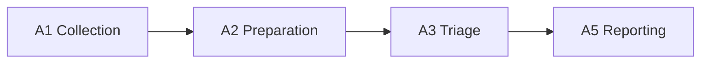
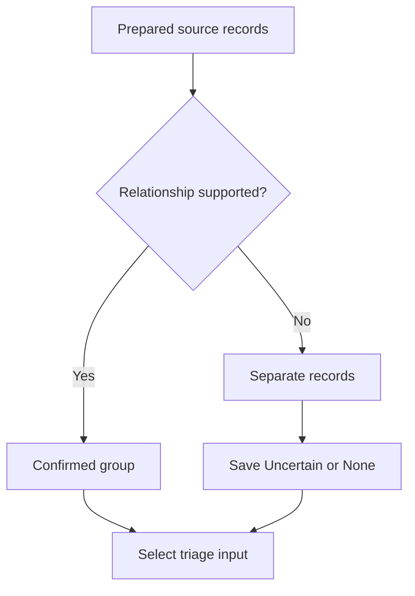
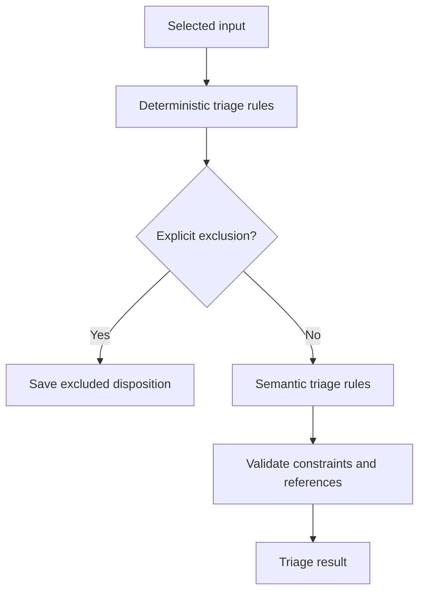
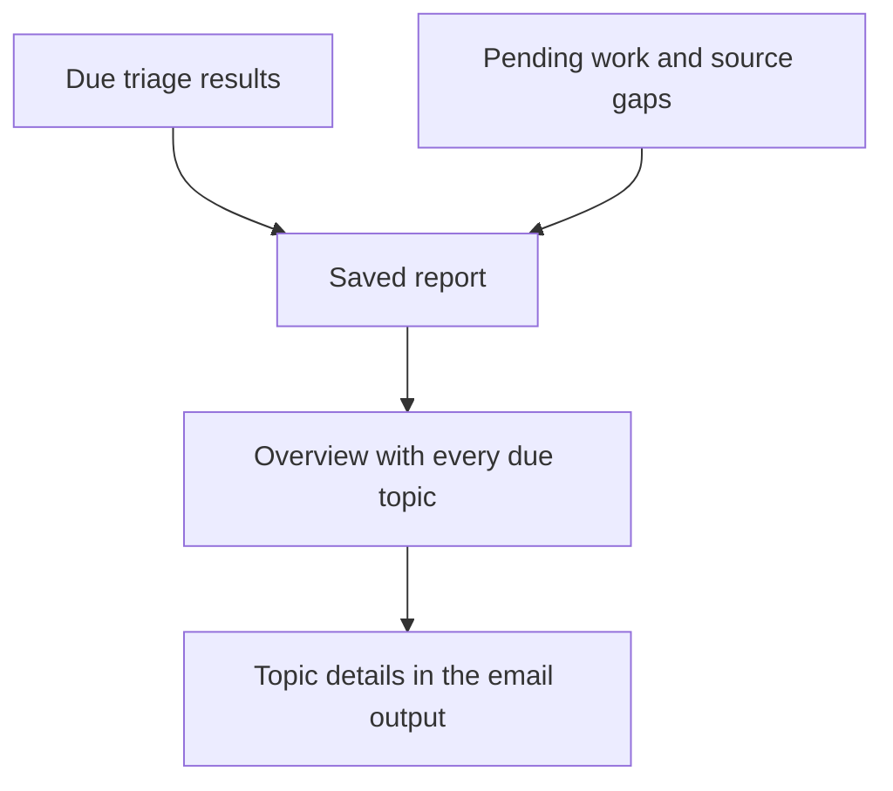

# msgloom Phase 1 Logical Design

**Scope:** Phase 1 only. **Status:** Draft for review.

Refines the [complete-product Logical Design](../design.md) for the [Phase Roadmap](../phase-roadmap.md). Shared terms and contracts keep their existing definitions. Execution is specified in [Phase 1 Architecture](architecture.md).

## 1. Enabled path

The Report adapters provide email. External callers initiate finite operations under the [invocation contract](../design.md#10-invocation-contract). The package does not register schedules. Investigation, the Report website, an MCP server, action support and action execution are not enabled.

## 2. Source and work selection

Include the four initial source types from the Brief. The operator supplies their exact scopes and initial history boundary. Provider restrictions belong in [Technology Stack](../tech-stack.md#4-source-integration).

New or changed source records create pending preparation work. An unchanged version can reuse accepted results only when all meaning-bearing inputs match. Save the reuse reference rather than silently skip the record. A changed rule, parser or working-context snapshot requires an explicit decision to reuse or rerun affected results.

Preserve and parse attachments supplied or explicitly included in collection scope. Phase 1 includes Excel, PDF and Word extraction under the [parser selection](../tech-stack.md#parser-selection); these are collected inputs, not autonomous investigation. Teams file references require an authorised download through A1, not arbitrary URL access by a parser. Record inaccessible, encrypted, unsupported and partially extracted content separately. Required evidence not extracted prevents a claim of complete understanding.

## 3. Preparation and grouping

Parsing retains author, recipients, source time, body, source relationships and parsed attachment references. Preserve numbers, tables and meaningful order. Filters save the matched rule and disposition; an excluded message remains available for replay.

| Source type | Phase 1 grouping rule |
| --- | --- |
| Outlook email | Use source-native conversation membership within its account scope. Normalised subject and supporting metadata may identify a candidate, but do not confirm it alone. |
| Teams channel | Use the channel root and reply relationship within the channel scope. Missing root content remains an explicit gap. |
| Teams one-to-one or group chat | Keep messages independent unless a supported relationship establishes a group. Chat membership alone does not establish a topic. Time-block grouping is disabled until evaluated. |

The status meanings remain in the complete-product Logical Design. An uncertain result includes its reason in downstream output. No Phase 1 operation joins independent groups or different sources by meaning.

## 4. Triage input and rules

### 4.1 Input contract

Supply confirmed groups where possible, with separate records otherwise. Include the selected source versions, earlier collected context from the same group, deterministic rule outcomes, semantic triage rules and a working-context snapshot. Mark earlier context separately from new information.

Include selected attachment content with its file and source-location references. Record absent or incomplete extraction in the input and result.

This declared selection does not authorise Claude Code to search history. Record content removed as exact repetition and retain its references. Input splitting must cover all included content, including an oversized individual message. Combine part results only within the confirmed group and validate the combined source mapping.

A group may produce several topics. Topic identity must not depend on an AI-generated title. A continuation of a previously reported topic needs an explicit link and supporting evidence; otherwise retain a separate topic with uncertainty.

### 4.2 Rule execution

Exact sender membership, a configured subject pattern and an already known timestamp are deterministic inputs. Whether text requests approval or describes an escalating problem needs semantic interpretation.

Rule effects and conflicts follow the complete-product triage contract. In Phase 1, a conflict blocks an accepted priority decision and produces a visible review item. It does not silently discard the message or use a Low-value fallback.

### 4.3 Result checks

Check that referenced source records exist, every included record has a disposition, rule constraints are represented, and required output fields validate. Preserve separate rule outcomes and the exposed AI response before accepting the combined triage result.

An inferred action or deadline is labelled as interpretation with its supporting text. A missing owner, ambiguous date or uncertain risk stays explicit. Invalid or unfinished output remains pending work for reporting.

## 5. Report behaviour

Use saved triage results under the selected report policy; no investigation result is expected in Phase 1. Updated input that has not completed triage must be marked pending rather than presenting an earlier assessment as current without a warning.

The email contains enough information to satisfy the report contract without a future website. When split into parts, preserve one report identity and explicit topic-to-part references. Essential information cannot exist only behind a link that the recipient cannot use.

Coverage checks run against source mappings and selected topic versions before and after rendering. Meaning preservation is also tested against reviewed examples; structural validation alone cannot prove it. Report-policy schedules and destinations are configurable, not fixed by this document.

## 6. Required operator inputs

| Input | Required decision |
| --- | --- |
| Source scope | Accounts, folders, chats, channels, history boundary and attachment collection scope. |
| Triage rules | Priority conditions, explicit exclusions and conflict handling. |
| Working context | Selected daily-work memory and treatment of missing or stale content. |
| Report policy | Due-time criteria, destinations, reminders and repeat-reporting behaviour. Recurring triggers are configured by the external caller, not the package. |
| Retention | Approved retention and deletion rules; automatic pruning is disabled until defined. |

These are configuration requirements, not reasons to invent business defaults.

## 7. Acceptance cases

| Case | Required evidence |
| --- | --- |
| Restart during collection | Received bytes remain recoverable and no checkpoint hides unsaved work. |
| Message edit, move or repeated page | Identity and observed versions remain correct; unchanged content does not cause duplicate triage. |
| Same subject, different work | Independent matters remain separate, with uncertainty where applicable. |
| Several topics in one group | Actions, deadlines and risks survive grouping and input splitting. |
| Conflicting rules or malformed AI output | A saved failure or review item appears; no false completed assessment. |
| Missing memory or attachment content | The limitation appears in the result and report; parser success does not prove that every file feature was represented. |
| Many important topics | All due topic identities and essential content survive rendering and multipart delivery. |
| Timeout after submission | No blind resend or claim of confirmed recipient delivery. |
| Replay with a changed prompt | New results preserve their inputs; earlier results and delivery state remain intact. |
| Common attachments | Excel cells and types, PDF pages and Word blocks retain source mappings; scanned, complex or unsupported features remain explicit. |
| Ordered execution | A dependent stage starts only after its input is saved and validated; a command waits for required work to end. |
| Scheduler-free invocation | Commands run manually with no scheduler dependency; repeated invocation cannot bypass delivery reconciliation. |

Measure Critical/Important recall, false alerts, wrong grouping, lost actions or deadlines, report coverage, token use and run duration on user-reviewed examples. Agree numerical release thresholds before production use. The technical tests are listed in [Technology Stack](../tech-stack.md#9-qualification).

## 8. Later-phase readiness

Phase 1 must satisfy the [shared operation boundary](../design.md#11-shared-operation-boundary), not just complete A1–A3 and A5. Preserve source and topic identities, exact input versions, result kinds, schema versions and lineage so later investigation can cite existing content rather than recollect it.

The report selection must accept Phase 1 triage results without requiring an investigation, proposal or execution result. Their absence means the capability has not run or is unavailable, not that no risk or action exists. Later results may extend topic details without changing a previously delivered report.

| Later capability | What Phase 1 must demonstrate now |
| --- | --- |
| Phase 2 investigation | A test double reads saved evidence through the Evidence interface and returns a versioned result without replacing source records or starting uncontrolled collection. |
| Phase 2 website and MCP | An async test caller uses the Application interface with the same outcomes and permission checks as the CLI. No CLI subprocess or nested event loop is required. |
| Phase 3 proposals | A test double links a proposed result to exact topic inputs and records revisions without any external write. |
| Phase 4 execution | Requests are rejected before adapter construction. Tests prove that neither an AI response nor an arbitrary caller can enable an unavailable write capability. |

Production A4, A6, A7, website and MCP implementations remain outside Phase 1. Add narrow contracts and test fixtures, not placeholder services or a general plugin system. Version-upgrade tests retain Phase 1 input references and accepted results when an additional result kind is introduced.
