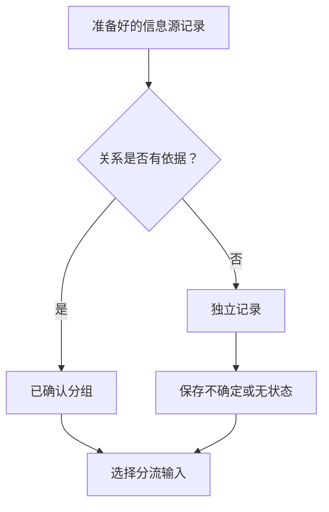
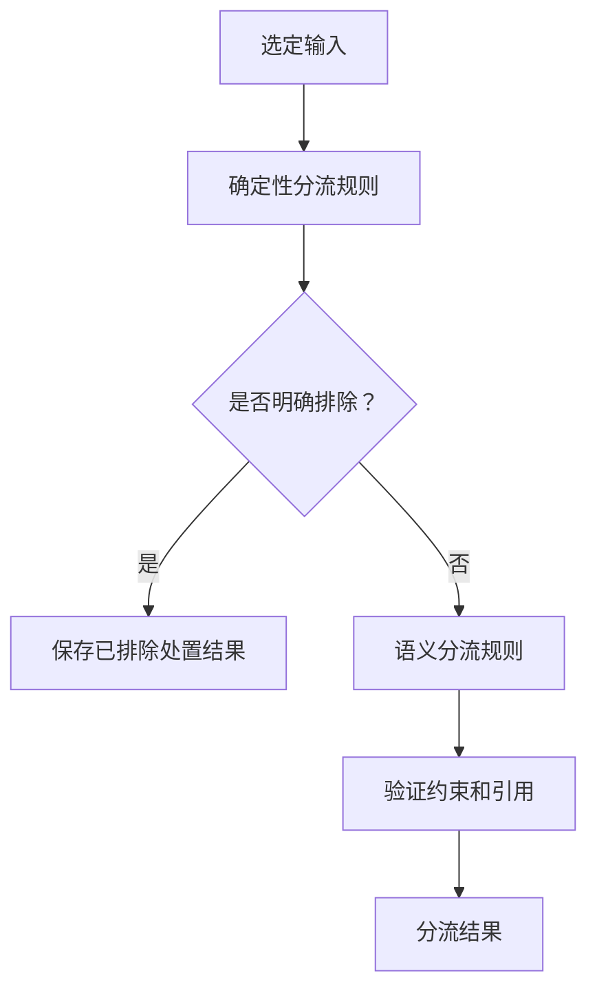
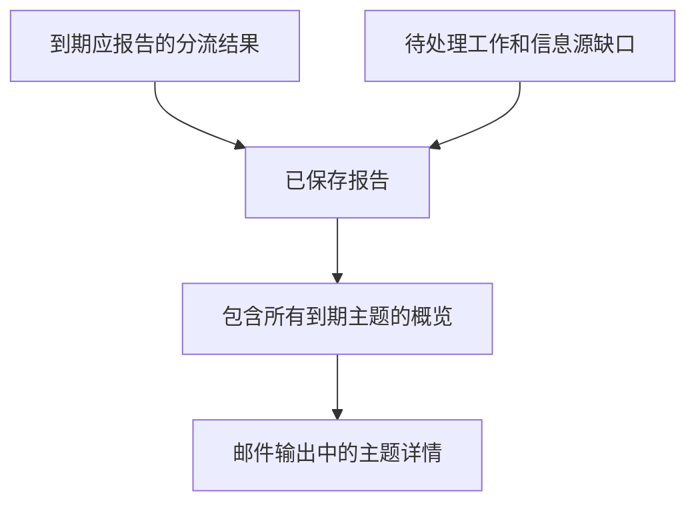

# msgloom 第 1 阶段逻辑设计

**范围：** 仅第 1 阶段。**状态：** 待审阅草稿。

针对[阶段路线图](../phase-roadmap.zh-CN.md)细化[完整产品逻辑设计](../design.zh-CN.md)。共享术语和契约保留现有定义。执行方式由[第 1 阶段架构](architecture.zh-CN.md)规定。

## 1. 启用路径

报告适配器提供邮件输出。外部调用方按[调用契约](../design.zh-CN.md#10-调用契约)发起有限操作。包不注册运行计划。调查、报告网站、MCP 服务器、行动支持和行动执行均未启用。

## 2. 信息源与工作选择

纳入概要中的四种初始信息源类型。操作者提供其确切范围和初始历史边界。提供方限制见[技术栈](../tech-stack.zh-CN.md#4-信息源集成)。

新增或变更的信息源记录创建待准备工作。未改变的版本只有在所有影响含义的输入均匹配时，才能复用已接受结果。保存复用引用，不静默跳过记录。规则、解析器或工作上下文快照改变后，必须明确决定复用还是重新运行受影响的结果。

保留并解析已提供或明确纳入采集范围的附件。第 1 阶段按[解析器选型](../tech-stack.zh-CN.md#解析器选型)提取 Excel、PDF 和 Word 内容；这些属于已采集输入，不是自主调查。Teams 文件引用需要通过 A1 进行已授权下载，不能由解析器任意访问 URL。分别记录无法访问、加密、不支持和部分提取的内容。未提取必需证据时，不能声称已完整理解。

## 3. 准备与分组

解析保留作者、收件人、信息源时间、正文、信息源关系和已解析附件引用。保留数字、表格和有意义的顺序。过滤器保存匹配规则和处置结果；被排除的消息仍可用于重放。

| 信息源类型 | 第 1 阶段分组规则 |
| --- | --- |
| Outlook 邮件 | 在账号范围内使用信息源原生的对话成员关系。规范化主题行和支持性元数据可以识别候选关系，但不能单独确认关系。 |
| Teams 频道 | 在频道范围内使用根消息和回复关系。根消息内容缺失时，明确保留该缺口。 |
| Teams 一对一聊天或群聊 | 消息保持独立，除非有依据的关系能建立分组。仅属于同一聊天不能建立主题关系。按时间段分组在完成评估前保持禁用。 |

状态含义仍由完整产品逻辑设计定义。不确定结果在下游输出中包含其原因。第 1 阶段的任何操作都不按语义合并独立分组或不同信息源。

## 4. 分流输入与规则

### 4.1 输入契约

尽可能提供已确认分组，否则提供独立记录。纳入选定的信息源版本、同一分组内此前已采集的上下文、确定性规则结果、语义分流规则和工作上下文快照。将早期上下文与新信息分开标记。

纳入选定附件内容及其文件和信息源位置引用。在输入和结果中记录缺失或不完整的提取。

此声明的选择范围并不授权 Claude Code 搜索历史记录。记录因完全重复而删除的内容，并保留其引用。输入拆分必须覆盖所有纳入的内容，包括超大的单条消息。仅在已确认分组内合并各部分结果，并验证合并后的信息源映射。

一个分组可以产生多个主题。主题标识不得依赖 AI 生成的标题。延续先前已报告的主题需要明确链接和支持证据；否则保留为带有不确定性的独立主题。

### 4.2 规则执行

发件人是否属于明确集合、配置的主题行模式和已知时间戳属于确定性输入。文本是否请求批准或描述正在升级的问题，需要语义解释。

规则效果和冲突处理遵循完整产品分流契约。在第 1 阶段，冲突会阻止优先级决定被接受，并产生可见的待审阅项。不能静默丢弃消息，也不能回退为低价值。

### 4.3 结果检查

检查引用的信息源记录是否存在、每条纳入的记录是否有处置结果、是否体现规则约束，以及必需输出字段是否通过验证。在接受合并后的分流结果前，保留独立规则结果和 AI 对外提供的响应。

推断的行动或截止时间标记为解释，并附支持文本。负责人缺失、日期含糊或风险不确定时，保持明确说明。无效或未完成的输出仍属于报告中的待处理工作。

## 5. 报告行为

按选定报告策略使用已保存的分流结果；第 1 阶段不要求调查结果。已更新但尚未完成分流的输入必须标记为待处理，不能在没有提示的情况下将早期评估当作当前评估展示。

邮件包含足以满足报告契约的信息，不依赖未来的网站。拆分为多个部分时，保留同一报告标识，并明确记录主题到各部分的引用。关键信息不能仅存在于收件人无法使用的链接后面。

渲染前后均根据信息源映射和选定主题版本检查覆盖情况。还应使用经审阅的示例测试含义保留；仅靠结构验证不能证明这一点。报告策略的计划和目标位置可配置，不由本文档固定。

## 6. 必需的操作者输入

| 输入 | 必须做出的决定 |
| --- | --- |
| 信息源范围 | 账号、文件夹、聊天、频道、历史边界和附件采集范围。 |
| 分流规则 | 优先级条件、明确排除项和冲突处理。 |
| 工作上下文 | 选定的日常工作记忆，以及缺失或过期内容的处理方式。 |
| 报告策略 | 到期判定条件、目标位置、提醒和重复报告行为。周期性触发器由外部调用方配置，不由包配置。 |
| 保留 | 已批准的保留和删除规则；定义这些规则前禁用自动清理。 |

这些是配置要求，不能据此臆造业务默认值。

## 7. 验收用例

| 用例 | 所需证据 |
| --- | --- |
| 采集期间重启 | 接收字节数据仍可恢复，任何检查点都不会隐藏未保存工作。 |
| 消息编辑、移动或重复分页 | 标识和观测版本保持正确；未改变内容不会导致重复分流。 |
| 主题行相同但工作事项不同 | 独立事项保持分离，并在适用时标明不确定性。 |
| 一个分组中有多个主题 | 分组和输入拆分后，行动、截止时间和风险均被保留。 |
| 规则冲突或 AI 输出格式错误 | 出现已保存的失败或待审阅项；不会错误地显示评估已完成。 |
| 记忆或附件内容缺失 | 结果和报告显示局限；解析成功不能证明每项文件特性均被表示。 |
| 大量重要主题 | 渲染和分段交付后，所有到期主题标识和关键内容均被保留。 |
| 提交后超时 | 不盲目重发，也不声称已确认收件人收到报告。 |
| 更改提示词后重放 | 新结果保留其输入；早期结果和交付状态保持完整。 |
| 常见附件 | Excel 单元格和类型、PDF 页面及 Word 内容块保留信息源映射；扫描、复杂或不支持的特性保持明确说明。 |
| 有序执行 | 依赖阶段仅在其输入已保存并验证后启动；命令等待必需工作结束。 |
| 无调度器调用 | 命令无需调度器依赖即可手动运行；重复调用不能绕过交付核实。 |

使用经用户审阅的示例，衡量关键/重要信息召回率、误报、错误分组、行动或截止时间丢失、报告覆盖、token 使用量和运行时长。生产使用前约定量化发布阈值。技术测试见[技术栈](../tech-stack.zh-CN.md#9-技术验证)。

## 8. 后续阶段准备

第 1 阶段必须满足[共享操作边界](../design.zh-CN.md#11-共享操作边界)，而不只是完成 A1–A3 和 A5。保留信息源和主题标识、确切输入版本、结果类型、模式版本及血缘，使后续调查可以引用已有内容，而不必重新采集。

报告选择必须能仅使用第 1 阶段的分流结果，不要求调查、提案或执行结果存在。缺少这些结果表示能力尚未运行或不可用，不表示没有风险或行动。后续结果可以扩展主题详情，但不能改变以前已交付的报告。

| 后续能力 | 第 1 阶段现在必须证明的事项 |
| --- | --- |
| 第 2 阶段调查 | 测试替身通过证据接口读取已保存证据，并返回带版本的结果，不替换信息源记录或启动不受控采集。 |
| 第 2 阶段网站和 MCP | 异步测试调用方使用应用接口，其结果和权限检查与 CLI 相同；不需要 CLI 子进程或嵌套事件循环。 |
| 第 3 阶段提案 | 测试替身将拟议结果链接到确切主题输入并记录修订，不进行任何外部写入。 |
| 第 4 阶段执行 | 在构建适配器前拒绝请求。测试证明 AI 响应或任意调用方都不能启用当前不可用的写入能力。 |

A4、A6、A7、网站和 MCP 的生产实现仍不属于第 1 阶段。增加范围明确的契约和测试夹具，不添加占位服务或通用插件系统。版本升级测试必须证明，新增结果类型后，第 1 阶段输入引用和已接受结果仍被保留。
