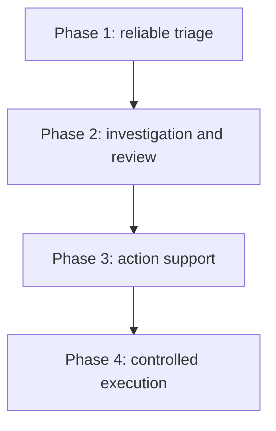

# msgloom Phase Roadmap

**Status:** Draft for review.

This document allocates the complete-product capabilities in [Logical Design](design.md) and [Architecture Design](architecture.md). It does not redefine them or promise delivery dates.

## Capability allocation

| Capability | First phase | Architecture |
| --- | --- | --- |
| All initial source types, incremental progress and source preservation | 1 | A1 |
| Message and Excel/PDF/Word attachment parsing, deterministic filtering and confirmed grouping | 1 | A2 |
| Both triage-rule categories and read-only daily-work memory | 1 | A3, Working context reader |
| Topic assessment within supplied group content | 1 | A3 |
| Saved results and replay, invoked by an external scheduler with an operational web interface | 1 | Persistence, Operator CLI; deployment owns scheduling |
| Overview and topic details delivered through email | 1 | A5, Report adapters |
| Selective investigation using additional history, attachments and evidence | 2 | A4 |
| Topic relationships across independent groups and sources | 2 | A4 |
| Local Report website and user review | 2 | Report website |
| Async interface and dependency alignment for a future MCP server | 1 | Application, Operator CLI |
| Optional MCP server adapter with explicit access policy | 2 | MCP adapter |
| Recommendations and drafts for replies, tasks and tickets | 3 | A6 |
| Approved external business operations | 4 | A7, Action adapters |

Phase 1 extracts content from already collected attachments and supplies it to triage. Technology Stack defines parsing limits and optional conversion or OCR paths. Phase 2 adds decisions to seek further evidence, not basic attachment extraction. MCP readiness in Phase 1 is an interface and compatibility requirement, not a running server.

## Phase boundaries

### Phase 1 — Reliable triage

Prove the complete, recoverable triage-to-report path, including collected attachment extraction. Do not search for further evidence, join independent groups by meaning, build the Report website or execute business actions. Scheduled report delivery belongs to A5, not A7.

The [Phase 1 logical design](phase-1/design.md#8-later-phase-readiness) requires compatible result versions and extension interfaces now. Production implementations of A4, A6, A7 and the MCP adapter remain disabled. Its [acceptance cases](phase-1/design.md#7-acceptance-cases) and Technology Stack own the detailed checks.

### Phase 2 — Investigation and review

A user or an authorised triage decision selects a question about a topic. A4 obtains additional evidence through A1 and A2, assesses relationships across independent groups and sources, and saves an investigation result. The user reviews findings and corrections through the Report website. The optional MCP adapter exposes permitted operations through the same Application, not through CLI subprocesses.

Deliver a navigable overview, topic details, evidence and assessment history. Preserve the Phase 1 reporting path when investigation is blocked or incomplete. The detailed contracts are [investigation and review](design.md#6-investigation-and-review) and [report access](design.md#71-report-access-and-review).

Acceptance must demonstrate a supported cross-source relationship, an uncertain relationship that stays separate, a useful incomplete investigation, a versioned user correction, and equivalent authorised reads through the website and optional MCP adapter. No A6 or A7 business action is enabled.

### Phase 3 — Action support

A6 uses accepted topic information to prepare an action proposal. The user can inspect its evidence, resolve missing details, edit the draft, request regeneration or reject it. Replies, tasks and tickets remain proposals; no external object is created as a side effect of drafting or review.

Deliver editable, versioned proposals alongside the topic details. Follow [proposal preparation](design.md#81-proposal-preparation), including invalidation after source changes. Retain human edits rather than silently replace them when regenerating.

Acceptance must show evidence-grounded proposals, explicit missing recipients or owners, preserved edit history, and rejection of stale input. A test double must detect any attempted provider write. A reviewed draft is not execution approval.

### Phase 4 — Controlled execution

A7 accepts an exact action proposal with valid user authority and the required approval record. It rechecks current prerequisites, claims the operation, calls the permitted action adapter and records the provider outcome. The user can inspect pending, rejected and unknown outcomes as well as success.

Deliver approved external operations, not unrestricted autonomy. Follow [approval and execution](design.md#82-approval-and-execution). Initially require explicit approval for every external business action; broader permission policies need a separate user decision.

Acceptance must cover changed content after approval, expired or revoked permission, duplicate requests, partial multi-action success and timeout after a possible external effect. An unknown outcome must not trigger a blind resend. A confirmed execution is visible from the originating topic and proposal.

Additional sources reuse A1 and A2. Knowledge graphs, vector databases and agent frameworks remain implementation options, not phase deliverables. Each later phase receives its own detailed implementation design before code is enabled.
