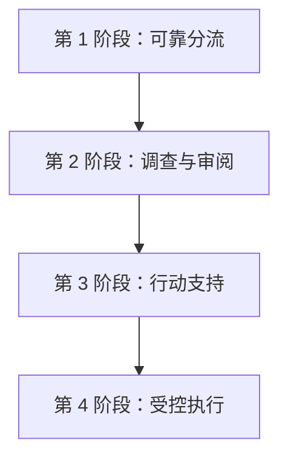

# msgloom 阶段路线图

**状态：** 待审阅草稿。

本文档分配[逻辑设计](design.zh-CN.md)和[架构设计](architecture.zh-CN.md)中的完整产品能力。它不重新定义这些能力，也不承诺交付日期。

## 能力分配

| 能力 | 首次引入阶段 | 架构 |
| --- | --- | --- |
| 所有初始信息源类型、增量进度和信息源保留 | 1 | A1 |
| 消息及 Excel/PDF/Word 附件解析、确定性过滤和已确认分组 | 1 | A2 |
| 两类分流规则和只读日常工作记忆 | 1 | A3、工作上下文读取器 |
| 在提供的分组内容内进行主题评估 | 1 | A3 |
| 保存结果和重放，由带有运维 Web 界面的外部调度器调用 | 1 | 持久化组件、运维 CLI；部署层负责调度 |
| 通过邮件交付概览和主题详情 | 1 | A5、报告适配器 |
| 使用额外历史记录、附件和证据进行选择性调查 | 2 | A4 |
| 跨独立分组和信息源的主题关系 | 2 | A4 |
| 本地报告网站和用户审阅 | 2 | 报告网站 |
| 为未来 MCP 服务器准备异步接口并对齐依赖 | 1 | 应用层、运维 CLI |
| 具有明确访问策略的可选 MCP 服务器适配器 | 2 | MCP 适配器 |
| 回复、任务和工单的建议与草稿 | 3 | A6 |
| 已获批准的外部业务操作 | 4 | A7、行动适配器 |

第 1 阶段从已采集的附件中提取内容，并将其提供给分流。技术栈定义解析限制以及可选转换或 OCR 路径。第 2 阶段增加寻找更多证据的决策能力，而不是基本附件提取。第 1 阶段的 MCP 准备工作是接口和兼容性要求，不是运行中的服务器。

## 阶段边界

### 第 1 阶段 — 可靠分流

验证完整、可恢复的分流到报告路径，包括已采集附件的提取。不搜索更多证据，不按语义合并独立分组，不建设报告网站，也不执行业务行动。定期报告交付属于 A5，不属于 A7。

[第 1 阶段逻辑设计](phase-1/design.zh-CN.md#8-后续阶段准备)要求现在就保留兼容的结果版本和扩展接口。A4、A6、A7 和 MCP 适配器的生产实现仍保持禁用。详细检查由该文档的[验收用例](phase-1/design.zh-CN.md#7-验收用例)和技术栈负责。

### 第 2 阶段 — 调查与审阅

用户或获得授权的分流决定选择与主题有关的问题。A4 通过 A1 和 A2 获取更多证据，评估独立分组和信息源之间的关系，并保存调查结果。用户通过报告网站审阅发现和更正。可选 MCP 适配器通过同一应用层提供获准操作，不启动 CLI 子进程。

交付可浏览的概览、主题详情、证据和评估历史。调查受阻或不完整时，保留第 1 阶段的报告路径。详细契约见[调查与审阅](design.zh-CN.md#6-调查与审阅)和[报告访问](design.zh-CN.md#71-报告访问与审阅)。

验收必须展示有依据的跨信息源关系、保持分离的不确定关系、有用但不完整的调查、带版本的用户更正，以及网站和可选 MCP 适配器中等价的授权读取。不启用 A6 或 A7 业务行动。

### 第 3 阶段 — 行动支持

A6 根据已接受的主题信息准备行动提案。用户可以检查依据、补全缺失细节、编辑草稿、请求重新生成或拒绝提案。回复、任务和工单都保持为提案；起草和审阅不会顺带创建外部对象。

在主题详情旁提供可编辑、带版本的提案。遵守[提案准备](design.zh-CN.md#81-提案准备)，包括信息源变化后的失效处理。重新生成时保留人工编辑，不静默替换。

验收必须展示有证据支持的提案、明确缺失的收件人或负责人、保留的编辑历史，以及对过期输入的拒绝。测试替身必须能发现任何提供方写入尝试。草稿已经审阅不代表批准执行。

### 第 4 阶段 — 受控执行

A7 接收某个确切版本的行动提案、有效用户授权和所需批准记录。它再次检查当前前置条件，认领操作，调用获准的行动适配器，并记录提供方结果。用户既能检查成功，也能检查待处理、被拒绝和未知结果。

交付获准的外部操作，而不是不受限制的自主执行。遵守[批准与执行](design.zh-CN.md#82-批准与执行)。初期每项外部业务行动都需要明确批准；更广泛的授权策略必须由用户另行决定。

验收覆盖批准后内容变化、权限过期或撤销、重复请求、多项行动部分成功，以及可能已产生外部影响后的超时。未知结果不能触发盲目重发。已确认执行必须能从原始主题和提案中查看。

额外信息源复用 A1 和 A2。知识图谱、向量数据库和智能体框架仍是实现选项，不是阶段交付物。后续各阶段在启用代码前分别完成详细实现设计。
