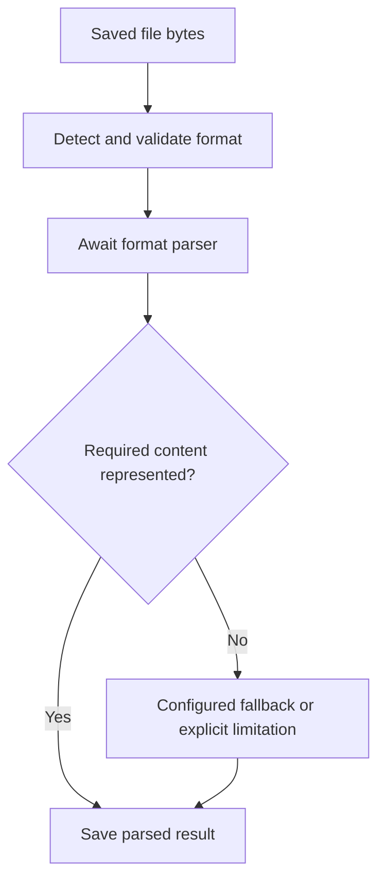
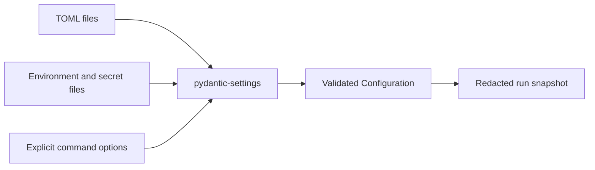
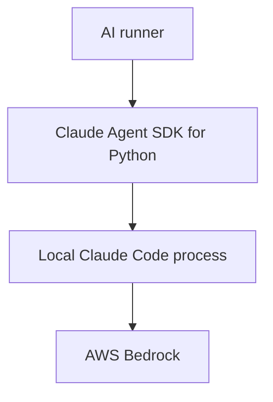
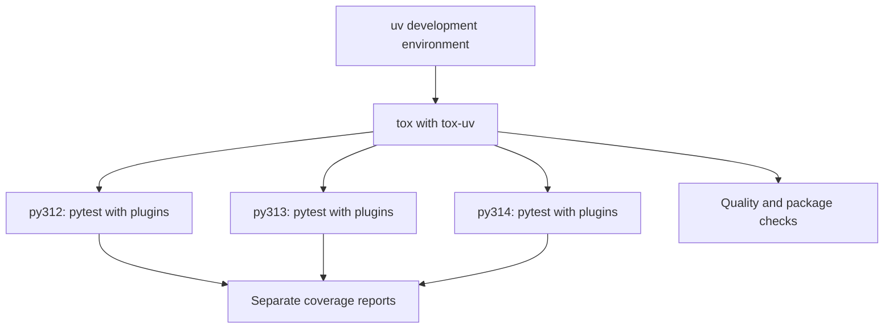
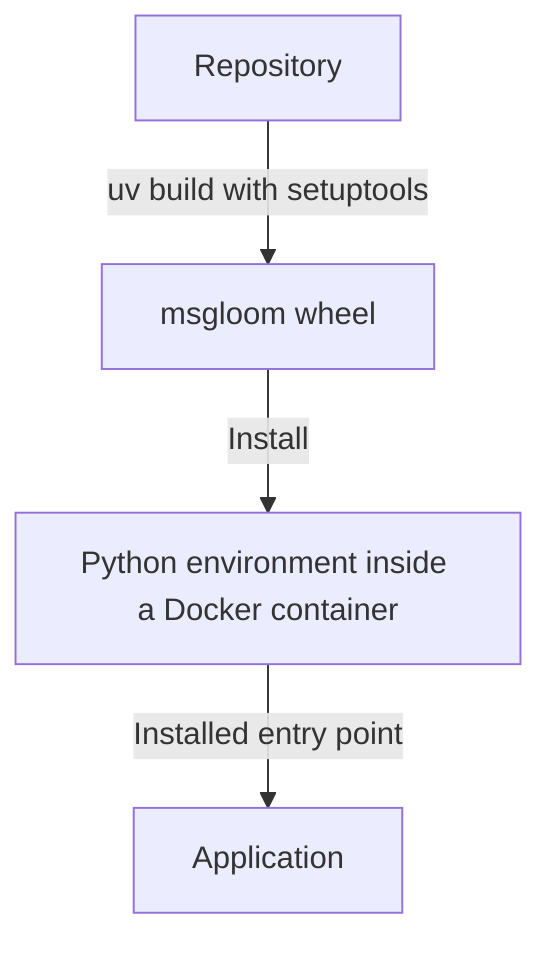

# msgloom Technology Stack

**Scope:** Complete product, with phase-specific adoption. **Status:** Draft for review.

Maps the components in [Architecture Design](architecture.md) to dependencies. Phase 1 installs only its own selections; later-phase rows are proposals for later qualification. Existing repository checks remain in place until an implementation change is approved.

## 1. Selection status

**Required** preserves an agreed constraint. **Proposed** identifies a concrete recommendation that has not yet passed integration tests. Exact versions belong in the dependency lockfile and build records, not in this document.

Earlier selections were researched on 7 September 2026; the FastMCP 4 alignment was rechecked on 8 September 2026. Interpreter and dependency requirements below are acceptance targets, not a claim that the complete lockfile or native wheels have already passed on the host.

## 2. Baseline

| Area | Choice | Status |
| --- | --- | --- |
| Deliverable | Installable `msgloom` Python package under the [packaging contract](#8-packaging-and-later-dependencies). | Required |
| Runtime | Python 3.12 minimum; Python 3.13 remains the default deployment target. Python 3.12, 3.13 and 3.14 are mandatory test and compatibility targets. | Required |
| Deployment | Docker container with persistent storage. The External scheduler and package are installed independently; no scheduler is included in msgloom. | Required |
| Application database | SQLite through an async ORM interface; no handwritten application SQL. | Required |
| AI runner | [SDK integration](#ai-runner) with local Claude Code and the existing AWS Bedrock connection. | Required |
| Cost boundary | No new paid services. Microsoft 365, Claude Code and AWS Bedrock are the existing exceptions. | Required |

Additional runtime tools must be open source and self-hostable. Recheck direct and transitive licences when locking dependencies, including separate model-asset licences. Required proprietary services are exceptions, not described as open source.

## 3. Component-to-dependency map

Rows describe package dependencies unless explicitly marked deployment-only. Proposed choices still require qualification; user-required selections retain their status.

| Component or step | Dependency | Use and reason | First phase |
| --- | --- | --- | --- |
| Configuration | [pydantic-settings 2](https://docs.pydantic.dev/latest/concepts/pydantic_settings/) | Typed settings, environment variables, secret files and TOML sources; reuse Pydantic validation. | 1 |
| External scheduler | [Prefect 3, self-hosted](https://docs.prefect.io/v3/concepts/server), deployment-only | Launch and await installed msgloom subcommands. No Prefect dependency, decorators or client in the package. | 1 deployment |
| Source adapters / A1 | [Microsoft Graph Python SDK](https://pypi.org/project/msgraph-sdk/) | Use async request methods; provider types stay inside adapters. | 1 |
| Source authentication | [Azure Identity async credentials](https://learn.microsoft.com/en-us/python/api/azure-identity/azure.identity.aio) | Await credential acquisition and close clients on exit. | 1 |
| Response capture / A1 | [HTTPX AsyncClient](https://www.python-httpx.org/async/) through the SDK transport | Await requests and capture before deserialisation; reuse and explicitly close clients. | 1 |
| Parsing / A2 | Format-specific choices in [Parser selection](#parser-selection) | Fast extraction paths behind awaited workers, with accuracy and coverage checks. | 1 |
| Filtering and grouping / A2 | Typed Python, `re`, `datetime`, `zoneinfo` | Source-native relationships and declared predicates need no NLP or rule-engine service. | 1 |
| Deterministic triage / A3 | Typed Python predicates and enums | Evaluate validated rule data; never execute configuration as arbitrary Python. | 1 |
| Structured boundaries | [Pydantic 2](https://docs.pydantic.dev/latest/) | Validate configuration-linked records, stage outputs and AI responses; generate JSON Schema. | 1 |
| Persistence | [SQLAlchemy async ORM](https://docs.sqlalchemy.org/en/20/orm/extensions/asyncio.html), [aiosqlite](https://aiosqlite.omnilib.dev/en/stable/) and Alembic | Async engine and sessions for state; migrations remain explicit administration. | 1 |
| Persistent files | [AnyIO file operations](https://anyio.readthedocs.io/en/stable/fileio.html), `pathlib` and `hashlib` | Await blocking file work; preserve integrity and atomic-write semantics. | 1 |
| Working context reader | AnyIO file operations | Await read-only memory access and save a versioned snapshot. | 1 |
| Async execution | [AnyIO 4](https://anyio.readthedocs.io/en/stable/), using its asyncio backend | Await resource lifetimes, workers and cancellation; no cross-stage queue. | 1 |
| MCP adapter | [FastMCP 4](https://gofastmcp.com/getting-started/installation), required major for the optional adapter | Await Application operations; qualify an exact 4.x release and its dependencies under [FastMCP alignment](#fastmcp-alignment). No server in Phase 1. | 2 |
| AI runner / A3 | [Claude Agent SDK for Python](https://code.claude.com/docs/en/agent-sdk/python) (`claude-agent-sdk`) | Required Python interface to local Claude Code. The SDK owns process communication; the AI runner owns input, validation and saved results. | 1 |
| Reporting / A5 | [Jinja2](https://jinja.palletsprojects.com/en/stable/) and Graph SDK | Render saved reports to escaped HTML and plain text, then submit exact outputs. | 1 |
| Operator CLI | [Cyclopts](https://cyclopts.readthedocs.io/en/latest/) | Reuse FastMCP 4's CLI dependency at the sole CLI/event-loop boundary. | 1 |
| Diagnostics | structlog and standard logging | Correlate command and stage identities without importing the External scheduler. | 1 |
| Investigation / A4 | Existing AI runner, Graph SDK and SQLAlchemy | Bounded source reads and saved-evidence lookup; no vector database is required by the logical contract. | 2 |
| Parser worker / A2 | AnyIO process/thread support; Docling only for the optional extraction fallback | Parse collected attachments in Phase 1; A4 later reuses this path for new evidence. | 1 |
| Report website | [FastAPI](https://fastapi.tiangolo.com/advanced/templates/), [Uvicorn](https://www.uvicorn.org/) and the existing Jinja2 templates | Server-rendered pages and typed Application endpoints. No separate JavaScript build pipeline is needed initially. | 2 |
| Action support / A6 | Existing AI runner and Pydantic | Produce validated action proposals without sending them. | 3 |
| Action adapters / A7 | Graph SDK for Outlook/Teams; HTTPX for a selected task or ticket API | Reuse provider clients. The task/ticket system must be named before selecting its operations and permissions. | 4 |

Pydantic validates content; SQLAlchemy persists it; pydantic-settings resolves settings. Cyclopts is the only package CLI framework. Do not add parallel frameworks for the same responsibilities.

### Parser selection

Optimise extraction throughput and peak memory subject to preserved meaning. There is no justified single fastest parser for every format or document. These are performance-oriented defaults, not a measured claim of community-wide superiority. Benchmark representative attachments on the deployment hardware before accepting them.

| Input | Proposed path | Required handling |
| --- | --- | --- |
| Email MIME, JSON and plain text | Standard-library `email`; Pydantic JSON validation for known schemas | Preserve received bytes, encoding, MIME relationships and errors. No second JSON framework without evidence. |
| HTML email and messages | [selectolax with Lexbor](https://selectolax.readthedocs.io/en/latest/) | Native HTML5 extraction replaces Beautiful Soup as the main path. Preserve tables, links and meaningful order rather than flattening everything to text. |
| Excel `.xlsx`, `.xlsm`, `.xls`, `.xlsb`; OpenDocument `.ods` | [python-calamine](https://github.com/dimastbk/python-calamine) | Rust-backed value extraction. Preserve sheet identity, original row/column offsets, types and hidden-content policy. Leading empty rows must not shift cell addresses. |
| XLSX/XLSM features missing from value extraction | [openpyxl](https://openpyxl.readthedocs.io/en/stable/), with defusedxml | Targeted formula, merged-cell and formatting metadata pass only when required. Distinguish formulas from cached results; do not calculate formulas or execute macros. Record unavailable metadata for other formats. |
| Text-based PDF | [pypdfium2](https://pypdfium2.readthedocs.io/en/stable/python_api.html) | Native PDFium extraction with page references. Text alone does not prove reading order, table reconstruction or image coverage. |
| Word `.docx` | [python-docx](https://python-docx.readthedocs.io/en/latest/) and its lxml dependency | Preserve paragraph/table order and supported headers, footers and relationships. Disclose unsupported text boxes, revisions, embedded objects or other missing content. |
| Scanned or layout-heavy PDF and extraction failures | [Docling](https://docling-project.github.io/docling/usage/supported_formats/), optional Phase 1 extraction profile | Use explicitly selected local OCR/layout processing when needed. Pin and review model assets and resource cost. An unavailable profile produces a limitation, not an empty successful result. |
| Legacy Word `.doc` | [LibreOffice headless conversion](https://help.libreoffice.org/latest/en-US/text/shared/guide/convertfilters.html), optional deployment tool | Convert in an isolated process, then parse the derived file. Preserve both representations and record changes. Disable macros and external resources. |

Fast and supplemental paths have distinct jobs; do not run every parser on every file. Native Excel/PDF/Word paths are Phase 1 dependencies. Docling and LibreOffice are conditional capabilities, not prerequisites for every file or reasons to defer basic attachment support.

Check signatures and container structure as well as reported MIME type and filename. Reject unsafe or inconsistent files. Record encryption, decompression limits, missing capabilities and partial page/sheet coverage. Parsing must not fetch URLs or execute document code.

Synchronous document libraries sit behind the async Parser worker boundary. Run heavy and untrusted files in bounded processes; do not share native handles across processes. [PDFium is not thread-safe](https://pypdfium2.readthedocs.io/en/stable/python_api.html#thread-incompatibility): no simultaneous PDFium calls in threads within one process. Await cleanup before accepting later work.

Record parser identity, version, settings, source locations and omissions. Evaluate values, formulas, dates, units, merged cells, hidden sheets, reading order and tables before comparing speed. Measure cold-start time, throughput, peak memory and complete-content rate; fast but incomplete output is not an optimisation.

## 4. Source integration

| Source or operation | Selected approach and limit |
| --- | --- |
| Outlook | Use [per-folder message delta](https://learn.microsoft.com/en-us/graph/delta-query-messages). Save full continuation URLs. Use [immutable IDs](https://learn.microsoft.com/en-us/graph/outlook-immutable-id) within their documented boundary. |
| Email bytes | Preserve JSON payloads and separately requested [MIME bytes](https://learn.microsoft.com/en-us/graph/outlook-get-mime-message). These are Graph representations, not a claim to original SMTP transport bytes. |
| Teams chats | Prefer [user chat delta](https://learn.microsoft.com/en-us/graph/api/chatmessage-delta?view=graph-rest-1.0) only with approved application permissions; it has an eight-month history boundary. Otherwise evaluate [per-chat listing](https://learn.microsoft.com/en-us/graph/api/chat-list-messages?view=graph-rest-1.0) with an explicit polling and recovery contract. |
| Teams channels | Use [channel listing](https://learn.microsoft.com/en-us/graph/api/channel-list-messages?view=graph-rest-1.0) and all required reply pages. Do not assume chat delta applies to channels or that ordinary listing provides a general time filter. |
| Report submission | [Graph sendMail](https://learn.microsoft.com/en-us/graph/api/user-sendmail?view=graph-rest-1.0) supplies acceptance, not proof of completed recipient delivery. |

Select credential flows from the approved permission model. Do not request tenant-wide access merely because a convenient API requires it. Authentication renewal and the available history/change guarantees are qualification gates for each adapter.

Use the SDK's supported [throttling and retry behaviour](https://learn.microsoft.com/en-us/graph/throttling) at the request boundary. External retries re-enter the command under the saved-state recovery contract. Do not multiply request retries or blindly retry a command with an unknown external effect.

Record content encoding and whether the HTTP transport decoded the payload. Capture bytes before semantic parsing, with safe metadata; do not persist authentication headers. HTTPX hooks may run before the body has been read, so capture ordering and error paths need an integration test.

## 5. Configuration design

Use **pydantic-settings** as the single settings loader. Use TOML for operator settings, deterministic triage-rule data and report policies; semantic triage rules remain versioned Markdown. Pydantic validates each structure. User working context is separate input, not a settings override.

Define precedence, highest first: explicit command options, environment, mounted secret files, TOML, then defaults. Implement it with the documented custom settings sources; this is a project choice, not the library default. Disable implicit `.env` discovery in deployed containers.

Credentials are accepted only through approved credential sources, not command-line values or plain TOML. Save secret references, not their values. Secret wrappers redact display; they are not encryption. Disable settings-source debug output in deployed runs because it can disclose loaded values.

Configuration covers source scopes, parser profiles, rules, report destinations and due-time criteria, memory paths, storage, model identity, effort limits and recovery limits. Recurring schedules and trigger time zones belong only to the External scheduler. Reject unknown fields and invalid combinations at startup. No service may bypass Configuration with its own environment reads. An intentional configuration change produces a new version for later runs.

## 6. Runtime operation

### External scheduler

Prefect 3 is installed and operated by deployment, outside msgloom's dependency set. Its job launches `msgloom <subcommand>` and waits for exit; this placeholder does not fix command names. Use an explicit executable path and argument list. [Prefect process execution](https://docs.prefect.io/v3/api-ref/python/prefect-utilities-processutils) belongs in the external wrapper, not in package imports.

Do not host `serve()`, schedule registration or a Prefect worker in msgloom. Separate scheduler state and environment management. Sharing a Docker container does not place separately installed software in the wheel. Package tests must pass with Prefect absent.

The wrapper records execution identities and outcomes, not message bodies. Distinguish incomplete and unknown-effect outcomes from safe retryable failures. Design commands and exit codes together; do not automatically rerun every failed process from the beginning.

### Async execution

Use asyncio as the supported loop backend, with AnyIO for tasks, file I/O, workers and cancellation. SQLAlchemy's driver path means Trio compatibility is not claimed. Architecture owns [stage sequencing](architecture.md#async-execution).

Use Graph async methods, `azure.identity.aio`, HTTPX AsyncClient and the async Claude Agent SDK interface. Use SQLAlchemy `AsyncEngine` and `AsyncSession` with `sqlite+aiosqlite` and its asyncio installation support. [aiosqlite](https://aiosqlite.omnilib.dev/en/stable/) wraps per-connection worker-thread execution; it does not create concurrent SQLite writers. Use one session per task and short transactions. Alembic remains explicit administration, never automatic on import.

Await [AnyIO worker processes](https://anyio.readthedocs.io/en/stable/subprocesses.html) for document parsing and [thread-backed I/O](https://anyio.readthedocs.io/en/stable/threads.html) for blocking files. Render larger Jinja2 outputs off the event loop. Small validation and pure calculations may stay synchronous. Coroutine cancellation does not stop an arbitrary thread: drain safe I/O or terminate an isolated process before releasing its claim.

### FastMCP alignment

FastMCP **4.x** is the required major version for the future MCP adapter and current compatibility tests. Use the [current installation guidance](https://gofastmcp.com/getting-started/installation), not the archived v2 documentation. Pin the exact qualified release in the compatibility lock and later adapter deployment. FastMCP remains absent from the Phase 1 base runtime; it does not introduce an in-package scheduler.

Keep Cyclopts as the sole CLI framework. Reuse compatible Pydantic, pydantic-settings and AnyIO versions through their public APIs. The [FastMCP 4 upgrade guide](https://gofastmcp.com/getting-started/upgrading/from-fastmcp-3) specifies the MCP Python SDK v2 foundation and a Pydantic 2.12 minimum. Later combined website/server environments must also resolve its Starlette requirement with a compatible FastAPI release; do not assume the old pins remain valid.

FastMCP 4 uses **httpx2** for its own HTTP paths. The Graph adapter keeps the HTTPX transport required by its SDK. This is an explicit provider-boundary exception to dependency reuse, not a reason to replace Graph internals or pass HTTPX clients and exceptions into an httpx2 API. Qualify response capture and error handling independently. No application-wide HTTP transport rewrite is approved here.

Resolve the complete dependency set, including Claude Agent SDK and any MCP SDK constraints, in the compatibility environments. A conflict is a release blocker for that deployment, not permission to force incompatible versions. Exact release metadata, not a v2 dependency list, governs optional task packages. Do not install task extras merely to obtain CLI support.

Shared Application contracts contain no CLI, SDK or MCP transport objects. Future request authority, result state and cancellation belong to the Application and Persistence, not to a transport session. Phase 2 tests the implemented adapter's negotiated protocol, permissions and supported clients separately; dependency resolution alone does not prove interoperability.

### AI runner

Use Claude Agent SDK for Python as the only communication layer for local Claude Code. Do not maintain a parallel CLI transport or direct model-API path.

Use a fresh `query()` for each Phase 1 analysis attempt, without resume or continuation. Explicitly set `tools=[]`, `mcp_servers={}`, `strict_mcp_config=True` and `setting_sources=[]`; do not inherit daily-session hooks or plugins. Verify effective policy and context loading rather than trust defaults. Supply the saved working-context snapshot explicitly, not an interactive session. These controls follow the [Python SDK reference](https://code.claude.com/docs/en/agent-sdk/python).

Provide the Pydantic schema through the SDK's [structured-output interface](https://code.claude.com/docs/en/agent-sdk/structured-outputs). Preserve exposed SDK messages, the final payload, available usage and failure diagnostics. Validate the payload and source coverage before accepting a stage result. SDK-specific types remain inside the AI runner. Cancellation or timeout closes the run and records unfinished work rather than a successful partial summary.

Use the [SDK-bundled CLI](https://github.com/anthropics/claude-agent-sdk-python#installation) by default. An explicitly configured `cli_path` may select a separately installed executable inside the container. Qualify that override; never select a changing host installation implicitly. Record the SDK, CLI and model versions together. The SDK's [MIT-licensed Python code](https://raw.githubusercontent.com/anthropics/claude-agent-sdk-python/main/LICENSE) does not remove the existing Claude Code service exception.

Keep the existing [Bedrock connection](https://code.claude.com/docs/en/amazon-bedrock); local execution does not make inference local. Restrict inherited environment values as well as explicit SDK options, and keep source credentials out of the Claude Code process. SDK-reported cost is an estimate unless reconciled with provider billing.

Phase 2 may expose bounded Application read operations through the SDK's custom-tool support. This does not enable investigation in Phase 1. Tool permissions and browser authentication/CSRF controls require Phase 2 qualification before read tools or website write routes are enabled.

### Persistence and diagnostics

Apply the [async execution](#async-execution) resource rules to Persistence. Do not introduce a cache or queue before a measured need exists.

Logs carry run, source-scope, stage-result and delivery identifiers, duration, status and available usage counts. Business content stays in protected Persistence, not routine logs. The External scheduler shows command outcomes; detailed inspection and recovery use the Operator CLI without scheduler integration. Back up the Application database and files together using the host's approved backup tooling; restore testing is mandatory.

## 7. Code quality

Use one owner for each quality task. tox, tox-uv, pytest, pytest-xdist and pytest-cov are required selections; the other tools remain proposed. These are development dependencies, not Application runtime requirements.

| Concern | Selection | Project use |
| --- | --- | --- |
| Linting | [Ruff](https://docs.astral.sh/ruff/) | Error, bug-risk, upgrade and security rules. Target Python 3.12-compatible source. |
| Formatting | [Black](https://black.readthedocs.io/en/stable/) | One code format; do not also run Ruff's formatter. |
| Import order | [isort](https://isort.readthedocs.io/en/latest/configuration/black_compatibility.html) | Use the Black profile; leave Ruff import-sorting rules disabled. |
| Static types | [mypy](https://mypy.readthedocs.io/en/stable/) | Strict checks for Application code, with the [Pydantic plugin](https://docs.pydantic.dev/latest/integrations/mypy/). Limit exceptions to named provider boundaries. |
| Test environments | [tox](https://tox.wiki/en/latest/) and [tox-uv](https://github.com/tox-dev/tox-uv) | Named interpreter and quality environments, using uv for environment creation and installation. |
| Tests | [pytest](https://docs.pytest.org/en/stable/) | Unit, integration and acceptance tests. |
| Parallel tests | [pytest-xdist](https://pytest-xdist.readthedocs.io/en/stable/) | Distribute independent tests across a bounded number of workers. |
| Coverage | [pytest-cov](https://pytest-cov.readthedocs.io/en/latest/xdist.html) | Branch coverage and combined worker results within each test environment. |
| Generated edge cases | [Hypothesis](https://hypothesis.readthedocs.io/en/latest/) | Group membership, duplicate pages, input splitting and coverage invariants. |
| HTTP isolation | [RESPX](https://lundberg.github.io/respx/) | Deterministic async HTTPX responses for pagination, throttling and uncertain submissions. |
| Async tests | [AnyIO pytest plugin](https://anyio.readthedocs.io/en/stable/testing.html) | Test the asyncio backend, cancellation, cleanup and event-loop responsiveness; no second async test runner. |
| Import boundaries | [Import Linter](https://import-linter.readthedocs.io/en/stable/) | Keep Application contracts independent of CLI/MCP objects and all Prefect imports. |
| Dependency vulnerabilities | [pip-audit](https://pypi.org/project/pip-audit/) | Audit locked runtime and development dependencies; record any narrowly scoped exception. |
| Local checks | Existing pre-commit configuration | Retain hygiene, YAML, Gitleaks, Markdown and Mermaid checks; add the Python checks during implementation. |

Use Ruff's selected security rules rather than add an overlapping Bandit run initially.

### Test environments

Define tox environments in `pyproject.toml`, require the tox-uv plugin and launch through the uv-managed development environment. The `py312`, `py313` and `py314` environments use `uv-venv-lock-runner`, explicit dependency groups and `uv_sync_locked=true`. Select `package=wheel` rather than the editable default. A present `uv.lock` alone does not select locked operation; these settings follow the [tox-uv configuration](https://github.com/tox-dev/tox-uv#uvlock-support).

CI must fail when a required interpreter is unavailable. Keep lock updates separate from test execution. A dedicated package check builds a wheel from the source distribution and tests that exact wheel outside the repository; a source-tree test cannot replace this check.

Isolate databases, files, configuration directories and ports by environment and worker. Run tests requiring exclusive state in a separate serial environment with xdist disabled. Bound total concurrency across tox environments and xdist workers. Save coverage separately per environment so simultaneous runs cannot overwrite each other. Compare serial and parallel outcomes during qualification. Test stage completion and persistence order, an event-loop heartbeat during large parser jobs, worker cancellation and SDK cleanup.

Clean-wheel tests exclude Prefect and FastMCP. Add `py312-fastmcp4`, `py313-fastmcp4` and `py314-fastmcp4` compatibility environments. Each resolves an exact qualified FastMCP 4 release with the full package dependency set and exercises shared models and async calls. These tests do not certify an unimplemented server.

The three interpreter environments run the same unit, integration, async-cleanup, extension-contract and installed-wheel checks with pytest-xdist and pytest-cov. Python 3.14 is required, not experimental or allowed to fail. Use standard GIL-enabled CPython builds for this matrix; free-threaded builds need separate qualification. Missing interpreters, unavailable native wheels or unresolved dependencies remain visible blockers, not skipped success. Record per-environment coverage and test summaries.

Mock the AI runner boundary for ordinary tests; do not launch Claude Code or make paid model calls. Test message handling, invalid output, cancellation and cleanup with controlled SDK responses.

Store tool settings in `pyproject.toml` where supported. Keep hook definitions in the existing pre-commit file. CI runs quality checks and tests without automatic source edits. Tests use synthetic or approved redacted fixtures; live messages and credentials are excluded from normal CI.

GitHub Actions is an optional runner for these same commands, not a runtime dependency. Use only an existing no-cost entitlement under [GitHub's billing rules](https://docs.github.com/en/billing/concepts/product-billing/github-actions); all checks must also run locally without a hosted service.

## 8. Packaging and later dependencies

The repository produces the **msgloom Python package**. A versioned wheel is the normal installation artifact; a source distribution supports source builds. A Docker image is a deployment artifact, not a replacement for the Python package.

Use [uv](https://docs.astral.sh/uv/concepts/projects/layout/) for development environments, dependency management and a committed `uv.lock`. Use [setuptools](https://setuptools.pypa.io/en/latest/userguide/pyproject_config.html) as the required build backend, with `setuptools.build_meta` declared in `pyproject.toml`. [uv build](https://docs.astral.sh/uv/concepts/projects/build/) invokes that backend; it does not select a second packaging system. Keep the `src/msgloom/` layout.

`pyproject.toml` owns package metadata, entry points, runtime dependencies, installable extras and development dependency groups. Declare setuptools under build-system requirements, not runtime dependencies. `uv.lock` records the tested dependency resolution; record the build-backend version used for each release.

Install the wheel and its declared dependencies into the container's Python environment. Installation may occur during image build or in an existing suitable container. The deployed Application must not require a Git checkout, an editable installation or the repository as its working directory.

Include runtime templates, default prompts and database migrations as explicit setuptools package data, and resolve them from the installed package. Operator configuration, credentials, daily-work memory, databases and saved results remain outside the package in configured storage.

Declare `claude-agent-sdk` as a runtime dependency; do not copy its code or Claude Code binaries into the msgloom wheel. CLI provisioning follows the [AI runner](#ai-runner) contract. Operating-system dependencies and the External scheduler are provisioned by deployment, outside the package dependency graph.

Installing or importing the package must not start workflows, launch services or modify business data. Startup and database migration are explicit runtime operations. External callers invoke an installed subcommand rather than a repository script. No command starts a recurring scheduling loop.

Keep development tools out of runtime dependencies. Native Excel/PDF/Word parsers belong to Phase 1. Use an installable extra for the optional Docling extraction profile and later Report website; development groups are not a substitute. Keep Prefect out of the wheel and all msgloom extras. Qualify the future MCP adapter as a separate optional deployment. Select the project licence before PyPI publication.

No in-package scheduler, LangChain, vector database, knowledge graph, Redis or Kafka is selected for Phase 1. These tools do not remove the need for msgloom's own contracts, source adapters and report assembly.

## 9. Qualification

| Gate | Required test | Phase |
| --- | --- | --- |
| Source integration | Approved permissions, credential renewal, complete paging and replies, changes, known deletion limits and recovery for each source type. | 1 |
| Preservation | Transport capture before parsing, MIME/attachment handling, interrupted file/database writes and restoration. | 1 |
| Configuration | Precedence, unknown fields, secret redaction, missing paths, snapshot stability and restart behaviour. | 1 |
| AI execution | Qualified SDK/CLI/model combination, fresh sessions, unchanged daily memory, effective settings and environment isolation, tool restrictions, injection attempts, schema output, complete input mapping and cancellation cleanup. | 1 |
| Operation | External invocation, overlapping commands, sequential stages, missed triggers, database contention, disk pressure, multipart reports and unknown submissions. | 1 |
| Compatibility | Locked tox-uv environments and actual container architecture on all three required Python versions; FastMCP 4 compatibility environments for all three versions. | 1 |
| Parsing | Representative Excel/PDF/Word files, source mappings, extraction completeness, process limits, cancellation and measured throughput/memory. Optional capabilities remain explicit. | 1 |
| Async behaviour | Awaited I/O, responsive loop during parsing, ordered commits, no nested loops, complete worker cleanup and no premature process success. | 1 |
| Package installation | Build a wheel from the source distribution and install it in clean container environments. Outside the repository, verify installed imports, entry points and package resources on all three required Python versions. Confirm that installation and import do not start workflows or modify business data. | 1 |
| Extension contracts | Fake later-phase providers, Application admission, versioned result compatibility, CLI/non-CLI equivalence and rejection of unavailable writes. | 1 |
| Investigation, website and MCP | Bounded read tools, shared async operations, supported relationships, source links, transport compatibility and access controls. | 2 |
| Action safety | Evidence-bound drafts, approval of exact content, stale-input checks, provider permissions and external-effect reconciliation. | 3–4 |

These gates are specifications. No dependency stack, live Microsoft 365 data, paid model call or deployed service was exercised during this documentation revision.
