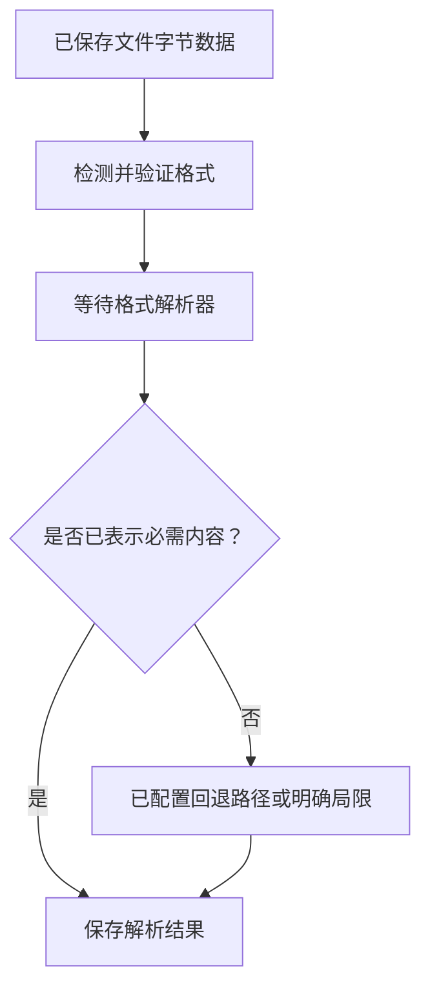
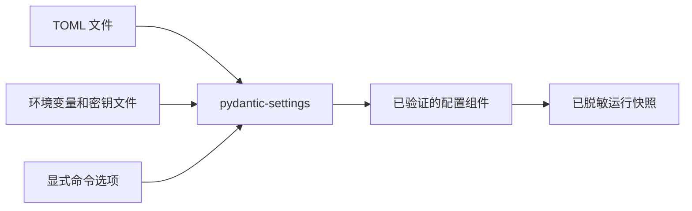
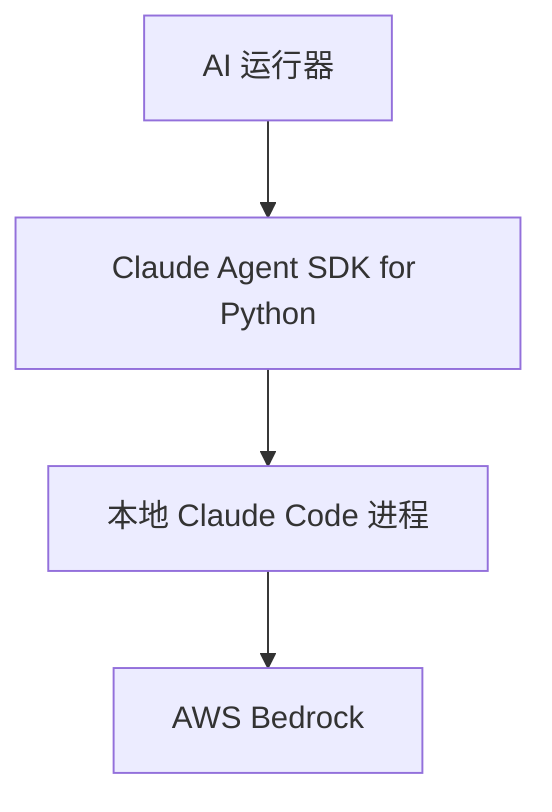
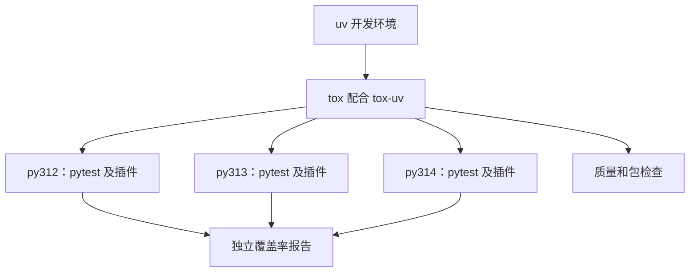
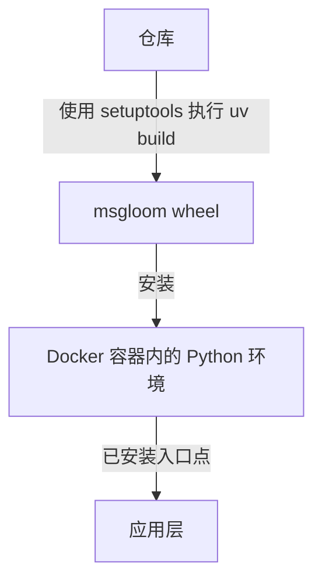

# msgloom 技术栈

**范围：** 完整产品，按阶段采用。**状态：** 待审阅草稿。

将[架构设计](architecture.zh-CN.md)中的组件映射到依赖。第 1 阶段仅安装本阶段的选型；后续阶段的条目是留待以后验证的提案。在实现变更获批前，保留仓库现有检查。

## 1. 选型状态

**必需**表示保留已约定约束。**提议**表示尚未通过集成测试的具体建议。确切版本应写入依赖锁文件和构建记录，不写在本文档中。

此前选型于 2026 年 9 月 7 日查阅；FastMCP 4 对齐要求于 2026 年 9 月 8 日重新核查。以下解释器和依赖要求是验收目标，不表示完整锁文件或原生 wheel 已在主机上通过测试。

## 2. 基线

| 领域 | 选择 | 状态 |
| --- | --- | --- |
| 交付物 | 符合[打包契约](#8-打包与后续依赖)的可安装 `msgloom` Python 包。 | 必需 |
| 运行时 | 最低 Python 3.12；Python 3.13 保持为默认部署目标。Python 3.12、3.13 和 3.14 都是必需的测试与兼容性目标。 | 必需 |
| 部署 | 具有持久化存储的 Docker 容器。外部调度器和包独立安装；msgloom 不包含调度器。 | 必需 |
| 应用数据库 | 通过异步 ORM 接口使用 SQLite；不手写应用 SQL。 | 必需 |
| AI 运行器 | 通过 [SDK 集成](#ai-运行器)使用本地 Claude Code 和现有 AWS Bedrock 连接。 | 必需 |
| 成本边界 | 不新增付费服务。Microsoft 365、Claude Code 和 AWS Bedrock 是现有例外。 | 必需 |

其他运行时工具必须开源且支持自行托管。锁定依赖时，重新检查直接和传递依赖的许可证，包括独立的模型资产许可证。必需的专有服务属于例外，不得将其描述为开源。

## 3. 组件到依赖的映射

除非明确标记为仅用于部署，否则各行描述的都是包依赖。提议选型仍需验证；用户要求的选型保留其状态。

| 组件或步骤 | 依赖 | 用途与理由 | 首次引入阶段 |
| --- | --- | --- | --- |
| 配置组件 | [pydantic-settings 2](https://docs.pydantic.dev/latest/concepts/pydantic_settings/) | 类型化设置、环境变量、密钥文件和 TOML 来源；复用 Pydantic 验证。 | 1 |
| 外部调度器 | [自行托管的 Prefect 3](https://docs.prefect.io/v3/concepts/server)，仅用于部署 | 启动并等待已安装的 msgloom 子命令。包中不含 Prefect 依赖、装饰器或客户端。 | 第 1 阶段部署 |
| 信息源适配器 / A1 | [Microsoft Graph Python SDK](https://pypi.org/project/msgraph-sdk/) | 使用异步请求方法；提供方类型保留在适配器内部。 | 1 |
| 信息源认证 | [Azure Identity 异步凭据](https://learn.microsoft.com/en-us/python/api/azure-identity/azure.identity.aio) | 等待凭据获取，退出时关闭客户端。 | 1 |
| 响应捕获 / A1 | 通过 SDK 传输层使用 [HTTPX AsyncClient](https://www.python-httpx.org/async/) | 等待请求，并在反序列化前捕获响应；复用并明确关闭客户端。 | 1 |
| 解析 / A2 | [解析器选型](#解析器选型)中的格式专用选型 | 通过需要等待完成的工作器提供快速提取路径，并检查准确性和覆盖情况。 | 1 |
| 过滤与分组 / A2 | 类型化 Python、`re`、`datetime`、`zoneinfo` | 信息源原生关系和声明的谓词不需要 NLP 或规则引擎服务。 | 1 |
| 确定性分流 / A3 | 类型化 Python 谓词和枚举 | 对已验证的规则数据求值；绝不将配置作为任意 Python 代码执行。 | 1 |
| 结构化边界 | [Pydantic 2](https://docs.pydantic.dev/latest/) | 验证与配置关联的记录、阶段输出和 AI 响应；生成 JSON Schema。 | 1 |
| 持久化组件 | [SQLAlchemy 异步 ORM](https://docs.sqlalchemy.org/en/20/orm/extensions/asyncio.html)、[aiosqlite](https://aiosqlite.omnilib.dev/en/stable/) 和 Alembic | 使用异步引擎和会话管理状态；迁移保持为明确的管理操作。 | 1 |
| 持久化文件 | [AnyIO 文件操作](https://anyio.readthedocs.io/en/stable/fileio.html)、`pathlib` 和 `hashlib` | 等待阻塞文件工作；保留完整性和原子写入语义。 | 1 |
| 工作上下文读取器 | AnyIO 文件操作 | 等待只读记忆访问，并保存带版本的快照。 | 1 |
| 异步执行 | [AnyIO 4](https://anyio.readthedocs.io/en/stable/)，使用其 asyncio 后端 | 等待资源生命周期操作、工作器和取消处理；不设置跨阶段队列。 | 1 |
| MCP 适配器 | [FastMCP 4](https://gofastmcp.com/getting-started/installation)，可选适配器的必需主版本 | 等待应用层操作；按 [FastMCP 对齐](#fastmcp-对齐)验证确切的 4.x 版本及其依赖。第 1 阶段没有服务器。 | 2 |
| AI 运行器 / A3 | [Claude Agent SDK for Python](https://code.claude.com/docs/en/agent-sdk/python)（`claude-agent-sdk`） | 连接本地 Claude Code 的必需 Python 接口。SDK 负责进程通信；AI 运行器负责输入、验证和结果保存。 | 1 |
| 报告 / A5 | [Jinja2](https://jinja.palletsprojects.com/en/stable/) 和 Graph SDK | 将已保存报告渲染为经过转义的 HTML 和纯文本，然后提交这些确切输出。 | 1 |
| 运维 CLI | [Cyclopts](https://cyclopts.readthedocs.io/en/latest/) | 在唯一的 CLI/事件循环边界复用 FastMCP 4 的 CLI 依赖。 | 1 |
| 诊断 | structlog 和标准日志库 | 关联命令与阶段标识，无需导入外部调度器。 | 1 |
| 调查 / A4 | 现有 AI 运行器、Graph SDK 和 SQLAlchemy | 有边界的信息源读取和已保存证据查找；逻辑契约不要求向量数据库。 | 2 |
| 解析工作器 / A2 | AnyIO 进程/线程支持；Docling 仅用于可选提取回退路径 | 第 1 阶段解析已采集附件；后续 A4 复用此路径处理新证据。 | 1 |
| 报告网站 | [FastAPI](https://fastapi.tiangolo.com/advanced/templates/)、[Uvicorn](https://www.uvicorn.org/) 和现有 Jinja2 模板 | 服务器渲染页面和类型化应用层端点。初期不需要独立的 JavaScript 构建流程。 | 2 |
| 行动支持 / A6 | 现有 AI 运行器和 Pydantic | 生成通过验证的行动提案，但不发送。 | 3 |
| 行动适配器 / A7 | Outlook/Teams 使用 Graph SDK；选定的任务或工单 API 使用 HTTPX | 复用提供方客户端。选择操作和权限前，必须明确任务/工单系统。 | 4 |

Pydantic 验证内容；SQLAlchemy 持久化内容；pydantic-settings 解析设置。Cyclopts 是包中唯一的 CLI 框架。不要为相同职责添加并行框架。

### 解析器选型

在保留含义的前提下，优化提取吞吐量和峰值内存。没有依据表明某一个解析器对所有格式或文档都是最快的。以下是面向性能的默认选型，不是经过测量的全社区最优声明。接受选型前，在部署硬件上对有代表性的附件进行基准测试。

| 输入 | 提议路径 | 必需处理 |
| --- | --- | --- |
| 邮件 MIME、JSON 和纯文本 | 标准库 `email`；对已知模式使用 Pydantic JSON 验证 | 保留接收字节数据、编码、MIME 关系和错误。没有证据支持时，不引入第二个 JSON 框架。 |
| HTML 邮件和消息 | [使用 Lexbor 的 selectolax](https://selectolax.readthedocs.io/en/latest/) | 原生 HTML5 提取取代 Beautiful Soup，作为主要路径。保留表格、链接和有意义的顺序，不将所有内容展平为文本。 |
| Excel `.xlsx`、`.xlsm`、`.xls`、`.xlsb`；OpenDocument `.ods` | [python-calamine](https://github.com/dimastbk/python-calamine) | 基于 Rust 的值提取。保留工作表标识、原始行列偏移、类型和隐藏内容策略。开头的空行不得改变单元格地址。 |
| 值提取未覆盖的 XLSX/XLSM 特性 | [openpyxl](https://openpyxl.readthedocs.io/en/stable/)，配合 defusedxml | 仅在需要时进行定向的公式、合并单元格和格式元数据处理。区分公式与缓存结果；不计算公式，不执行宏。记录其他格式中不可用的元数据。 |
| 文本型 PDF | [pypdfium2](https://pypdfium2.readthedocs.io/en/stable/python_api.html) | 使用原生 PDFium 提取并保留页引用。仅有文本不能证明阅读顺序、表格重建或图像覆盖正确。 |
| Word `.docx` | [python-docx](https://python-docx.readthedocs.io/en/latest/) 及其 lxml 依赖 | 保留段落/表格顺序，以及受支持的页眉、页脚和关系。明确说明不支持的文本框、修订、嵌入对象或其他缺失内容。 |
| 扫描型或复杂版式 PDF，以及提取失败 | [Docling](https://docling-project.github.io/docling/usage/supported_formats/)，第 1 阶段可选提取配置 | 需要时使用明确选定的本地 OCR/版式处理。固定并审查模型资产和资源成本。配置不可用时产生局限记录，不返回空的成功结果。 |
| 旧版 Word `.doc` | [LibreOffice 无界面转换](https://help.libreoffice.org/latest/en-US/text/shared/guide/convertfilters.html)，可选部署工具 | 在隔离进程中转换，然后解析派生文件。保留两种表示并记录变化。禁用宏和外部资源。 |

快速路径和补充路径各有职责；不要对每个文件运行所有解析器。原生 Excel/PDF/Word 路径属于第 1 阶段依赖。Docling 和 LibreOffice 是有条件启用的能力，不是每个文件的前置要求，也不是推迟基本附件支持的理由。

除声明的 MIME 类型和文件名外，还须检查文件签名和容器结构。拒绝不安全或不一致的文件。记录加密、解压限制、缺失能力和部分页面/工作表覆盖。解析不得获取 URL 或执行文档代码。

同步文档库位于异步解析工作器边界之后。繁重和不可信文件在有资源限制的进程中处理；不跨进程共享原生句柄。[PDFium 不是线程安全的](https://pypdfium2.readthedocs.io/en/stable/python_api.html#thread-incompatibility)：同一进程的多个线程不得同时调用 PDFium。接受后续工作前，等待清理完成。

记录解析器标识、版本、设置、信息源位置和遗漏。比较速度前，先评估值、公式、日期、单位、合并单元格、隐藏工作表、阅读顺序和表格。测量冷启动时间、吞吐量、峰值内存和内容完整率；快速但不完整的输出不算优化。

## 4. 信息源集成

| 信息源或操作 | 选定方法与限制 |
| --- | --- |
| Outlook | 使用[按文件夹的消息增量查询](https://learn.microsoft.com/en-us/graph/delta-query-messages)。保存完整续传 URL。在文档规定边界内使用[不可变 ID](https://learn.microsoft.com/en-us/graph/outlook-immutable-id)。 |
| 邮件字节数据 | 保留 JSON 载荷和单独请求的 [MIME 字节数据](https://learn.microsoft.com/en-us/graph/outlook-get-mime-message)。它们是 Graph 提供的表示，不声称是原始 SMTP 传输字节数据。 |
| Teams 聊天 | 仅在应用程序权限已获批准时，优先使用[用户聊天增量查询](https://learn.microsoft.com/en-us/graph/api/chatmessage-delta?view=graph-rest-1.0)；其历史边界为八个月。否则，评估[逐聊天列出消息](https://learn.microsoft.com/en-us/graph/api/chat-list-messages?view=graph-rest-1.0)，并明确轮询和恢复契约。 |
| Teams 频道 | 使用[频道消息列表](https://learn.microsoft.com/en-us/graph/api/channel-list-messages?view=graph-rest-1.0)和所有必需的回复页面。不要假定聊天增量查询适用于频道，也不要假定普通列表提供通用时间过滤器。 |
| 报告提交 | [Graph sendMail](https://learn.microsoft.com/en-us/graph/api/user-sendmail?view=graph-rest-1.0)表示提交被接受，不能证明已完成收件人送达。 |

按已批准的权限模型选择凭据流程。不要仅因某个方便的 API 要求，就申请租户范围的访问权限。认证续期和可用的历史/变更保证是每个适配器的验证门槛。

在请求边界使用 SDK 支持的[限流和重试行为](https://learn.microsoft.com/en-us/graph/throttling)。外部重试按已保存状态恢复契约重新进入命令。不要叠加请求重试，也不要盲目重试外部影响未知的命令。

记录内容编码以及 HTTP 传输层是否解码了载荷。在语义解析前捕获字节数据并附安全元数据；不持久化认证标头。HTTPX 钩子可能在正文尚未读取时运行，因此捕获顺序和错误路径需要集成测试。

## 5. 配置设计

使用 **pydantic-settings** 作为唯一设置加载器。操作者设置、确定性分流规则数据和报告策略使用 TOML；语义分流规则保持为受版本管理的 Markdown。Pydantic 验证每种结构。用户工作上下文是独立输入，不是设置覆盖项。

定义从高到低的优先级：显式命令选项、环境变量、挂载的密钥文件、TOML、默认值。使用文档中的自定义设置源实现；这是项目选择，不是库的默认行为。在部署容器中禁用隐式 `.env` 发现。

凭据仅通过已批准的凭据来源接收，不通过命令行值或明文 TOML 接收。保存密钥引用，不保存密钥值。密钥包装类型只对显示内容脱敏，不提供加密。部署运行时禁用设置源调试输出，因为它可能泄露已加载的值。

配置组件涵盖信息源范围、解析器配置、规则、报告目标位置和到期判定条件、记忆路径、存储、模型标识、工作量限制及恢复限制。周期性运行计划和触发时区仅属于外部调度器。启动时拒绝未知字段和无效组合。任何服务都不得通过自行读取环境变量绕过配置组件。有意的配置变更产生新版本，供后续运行使用。

## 6. 运行时操作

### 外部调度器

Prefect 3 由部署层安装和运维，不属于 msgloom 的依赖集合。其任务启动 `msgloom <subcommand>` 并等待退出；此占位符不固定命令名称。使用明确的可执行文件路径和参数列表。[Prefect 进程执行](https://docs.prefect.io/v3/api-ref/python/prefect-utilities-processutils)属于外部包装层，不得导入包内。

不要在 msgloom 中托管 `serve()`、计划注册或 Prefect worker。将调度器状态和环境管理分开。共用 Docker 容器不意味着独立安装的软件进入 wheel。未安装 Prefect 时，包测试必须通过。

包装层记录执行标识和结果，不记录消息正文。将不完整和外部影响未知的结果，与可安全重试的失败区分开。命令和退出码应一起设计；不要自动从头重新运行每个失败进程。

### 异步执行

使用 asyncio 作为受支持的事件循环后端，使用 AnyIO 处理任务、文件 I/O、工作器和取消。SQLAlchemy 的驱动路径意味着不声称兼容 Trio。[阶段顺序](architecture.zh-CN.md#异步执行)由架构设计负责。

使用 Graph 异步方法、`azure.identity.aio`、HTTPX AsyncClient 和异步 Claude Agent SDK 接口。使用 SQLAlchemy `AsyncEngine` 和 `AsyncSession`，搭配 `sqlite+aiosqlite` 及其 asyncio 安装支持。[aiosqlite](https://aiosqlite.omnilib.dev/en/stable/)封装每个连接的工作线程执行；它不会创建并发 SQLite 写入方。每个任务使用一个会话和短事务。Alembic 保持为明确的管理操作，绝不在导入时自动执行。

等待用于文档解析的 [AnyIO 工作进程](https://anyio.readthedocs.io/en/stable/subprocesses.html)，以及用于阻塞文件操作的[线程支持 I/O](https://anyio.readthedocs.io/en/stable/threads.html)。较大的 Jinja2 输出在事件循环之外渲染。小型验证和纯计算可保持同步。协程取消不会停止任意线程：释放其工作认领前，等待安全 I/O 完成，或终止隔离进程。

### FastMCP 对齐

FastMCP **4.x** 是未来 MCP 适配器和当前兼容性测试的必需主版本。使用[当前安装说明](https://gofastmcp.com/getting-started/installation)，不使用归档的 v2 文档。在兼容性锁定记录和后续适配器部署中固定经过验证的确切版本。FastMCP 仍不属于第 1 阶段基础运行时，也不引入包内调度器。

Cyclopts 保持为唯一 CLI 框架。通过公共 API 复用兼容版本的 Pydantic、pydantic-settings 和 AnyIO。[FastMCP 4 升级指南](https://gofastmcp.com/getting-started/upgrading/from-fastmcp-3)说明其基于 MCP Python SDK v2，并要求 Pydantic 最低 2.12。后续网站与服务器组合环境还必须将其 Starlette 要求与兼容的 FastAPI 版本共同解析；不能假定旧版本锁定仍有效。

FastMCP 4 在自己的 HTTP 路径使用 **httpx2**。Graph 适配器保留其 SDK 要求的 HTTPX 传输层。这是在提供方边界上明确记录的依赖复用例外，不构成替换 Graph 内部实现，或向 httpx2 API 传递 HTTPX 客户端与异常的理由。分别验证响应捕获和错误处理。此处不批准重写全应用的 HTTP 传输层。

在兼容性环境中解析完整依赖集合，包括 Claude Agent SDK 和可能存在的 MCP SDK 约束。冲突会阻止对应部署发布，不能强制组合不兼容版本。可选任务包以确切版本的元数据为准，不继续沿用 v2 的依赖清单。不能仅为获得 CLI 支持而安装任务扩展。

共享应用层契约不包含 CLI、SDK 或 MCP 传输对象。未来请求的授权、结果状态和取消属于应用层及持久化组件，不属于传输会话。第 2 阶段另外验证已实现适配器的协议协商、权限和支持的客户端；依赖解析本身不能证明互操作性。

### AI 运行器

使用 Claude Agent SDK for Python 作为与本地 Claude Code 通信的唯一层。不维护并行的 CLI 传输路径或直接模型 API 路径。

每次第 1 阶段分析尝试使用新的 `query()`，不恢复或延续会话。显式设置 `tools=[]`、`mcp_servers={}`、`strict_mcp_config=True` 和 `setting_sources=[]`；不继承日常会话的钩子或插件。验证实际生效的策略和上下文加载，不信任默认值。明确提供已保存的工作上下文快照，不提供交互式会话。这些控制遵循 [Python SDK 参考文档](https://code.claude.com/docs/en/agent-sdk/python)。

通过 SDK 的[结构化输出接口](https://code.claude.com/docs/en/agent-sdk/structured-outputs)提供 Pydantic 模式。保留 SDK 对外提供的消息、最终载荷、可用的用量信息和失败诊断。接受阶段结果前，验证载荷和信息源覆盖情况。SDK 专用类型保留在 AI 运行器内部。取消或超时会关闭运行并记录未完成工作，不得将部分摘要视为成功结果。

默认使用 [SDK 捆绑的 CLI](https://github.com/anthropics/claude-agent-sdk-python#installation)。显式配置的 `cli_path` 可以选择容器内独立安装的可执行文件。验证该覆盖选项；绝不隐式选择不断变化的主机安装。一起记录 SDK、CLI 和模型版本。SDK 的 [MIT 许可 Python 代码](https://raw.githubusercontent.com/anthropics/claude-agent-sdk-python/main/LICENSE)不会取消现有 Claude Code 服务例外。

保留现有 [Bedrock 连接](https://code.claude.com/docs/en/amazon-bedrock)；本地执行不代表本地推理。除显式 SDK 选项外，还要限制继承的环境变量值，并确保 Claude Code 进程无法获得信息源凭据。除非与提供方账单核对，否则 SDK 报告的成本只是估算值。

第 2 阶段可以通过 SDK 的自定义工具支持，提供有边界的应用层读取操作。这不会在第 1 阶段启用调查。在启用读取工具或网站写入路由前，工具权限以及浏览器认证/CSRF 控制必须通过第 2 阶段验证。

### 持久化与诊断

将[异步执行](#异步执行)的资源规则应用于持久化组件。在测量证明有需要前，不引入缓存或队列。

日志包含运行、信息源范围、阶段结果和交付标识符，以及时长、状态和可用的用量计数。业务内容保留在受保护的持久化组件中，不进入常规日志。外部调度器显示命令结果；详细检查和恢复使用运维 CLI，无需调度器集成。使用主机已批准的备份工具，一并备份应用数据库和文件；必须进行恢复测试。

## 7. 代码质量

每项质量任务只由一个工具负责。tox、tox-uv、pytest、pytest-xdist 和 pytest-cov 是必需选型；其他工具仍为提议。这些是开发依赖，不是应用层运行时要求。

| 关注点 | 选型 | 项目用途 |
| --- | --- | --- |
| 静态代码检查 | [Ruff](https://docs.astral.sh/ruff/) | 错误、缺陷风险、升级和安全规则。源代码以兼容 Python 3.12 为目标。 |
| 格式化 | [Black](https://black.readthedocs.io/en/stable/) | 统一代码格式；不同时运行 Ruff 格式化器。 |
| 导入顺序 | [isort](https://isort.readthedocs.io/en/latest/configuration/black_compatibility.html) | 使用 Black 配置方案；保持禁用 Ruff 导入排序规则。 |
| 静态类型 | [mypy](https://mypy.readthedocs.io/en/stable/) | 配合 [Pydantic 插件](https://docs.pydantic.dev/latest/integrations/mypy/)，严格检查应用层代码。例外仅限明确列出的提供方边界。 |
| 测试环境 | [tox](https://tox.wiki/en/latest/) 和 [tox-uv](https://github.com/tox-dev/tox-uv) | 具名解释器和质量环境，使用 uv 创建环境并安装依赖。 |
| 测试 | [pytest](https://docs.pytest.org/en/stable/) | 单元、集成和验收测试。 |
| 并行测试 | [pytest-xdist](https://pytest-xdist.readthedocs.io/en/stable/) | 将独立测试分配到数量受限的工作器。 |
| 覆盖率 | [pytest-cov](https://pytest-cov.readthedocs.io/en/latest/xdist.html) | 分支覆盖率，以及各测试环境内工作器结果的合并。 |
| 生成边界用例 | [Hypothesis](https://hypothesis.readthedocs.io/en/latest/) | 分组成员关系、重复分页、输入拆分和覆盖不变量。 |
| HTTP 隔离 | [RESPX](https://lundberg.github.io/respx/) | 为分页、限流和不确定提交提供确定性的异步 HTTPX 响应。 |
| 异步测试 | [AnyIO pytest 插件](https://anyio.readthedocs.io/en/stable/testing.html) | 测试 asyncio 后端、取消、清理和事件循环响应能力；不引入第二个异步测试运行器。 |
| 导入边界 | [Import Linter](https://import-linter.readthedocs.io/en/stable/) | 保持应用层契约独立于 CLI/MCP 对象和所有 Prefect 导入。 |
| 依赖漏洞 | [pip-audit](https://pypi.org/project/pip-audit/) | 审查已锁定的运行时和开发依赖；记录任何范围严格受限的例外。 |
| 本地检查 | 现有 pre-commit 配置 | 保留基础规范、YAML、Gitleaks、Markdown 和 Mermaid 检查；实现期间添加 Python 检查。 |

初期使用 Ruff 选定的安全规则，不另加职责重叠的 Bandit 检查。

### 测试环境

在 `pyproject.toml` 中定义 tox 环境，要求 tox-uv 插件，并通过 uv 管理的开发环境启动。`py312`、`py313` 和 `py314` 环境使用 `uv-venv-lock-runner`、显式依赖组和 `uv_sync_locked=true`。选择 `package=wheel`，不使用默认可编辑安装。仅存在 `uv.lock` 不会启用锁定运行；这些设置遵循 [tox-uv 配置](https://github.com/tox-dev/tox-uv#uvlock-support)。

必需解释器不可用时，CI 必须失败。将锁文件更新与测试执行分开。专用包检查从源代码分发包构建 wheel，并在仓库外测试该确切 wheel；源代码树测试不能替代此检查。

按环境和工作器隔离数据库、文件、配置目录和端口。需要独占状态的测试在禁用 xdist 的独立串行环境中运行。限制 tox 环境和 xdist 工作器的总并发量。每个环境单独保存覆盖率，防止同时运行时相互覆盖。验证时比较串行与并行结果。测试阶段完成与持久化顺序、大型解析任务期间的事件循环心跳、工作器取消和 SDK 清理。

纯净 wheel 测试不包含 Prefect 和 FastMCP。增加 `py312-fastmcp4`、`py313-fastmcp4` 和 `py314-fastmcp4` 兼容性环境。每个环境使用经过验证的确切 FastMCP 4 版本，解析完整包依赖集合，并测试共享模型和异步调用。这些测试不证明尚未实现的服务器符合要求。

三个解释器环境通过 pytest-xdist 和 pytest-cov 运行相同的单元、集成、异步清理、扩展契约和已安装 wheel 检查。Python 3.14 是必需目标，不是实验性或允许失败的环境。该矩阵使用标准启用 GIL 的 CPython 构建；自由线程构建另行验证。解释器缺失、原生 wheel 不可用或依赖无法解析都必须作为可见阻塞，不能通过跳过而视为成功。分别记录各环境的覆盖率和测试摘要。

常规测试模拟 AI 运行器边界；不启动 Claude Code，也不调用付费模型。使用受控 SDK 响应测试消息处理、无效输出、取消和清理。

工具支持时，将设置存储在 `pyproject.toml`。钩子定义保留在现有 pre-commit 文件中。CI 运行质量检查和测试，不自动修改源代码。测试使用合成或已批准的脱敏测试数据；普通 CI 不包含真实消息和凭据。

GitHub Actions 是运行相同命令的可选执行平台，不是运行时依赖。按 [GitHub 计费规则](https://docs.github.com/en/billing/concepts/product-billing/github-actions)，仅使用现有免费额度；所有检查也必须能在本地运行，无需托管服务。

## 8. 打包与后续依赖

仓库产出 **msgloom Python 包**。带版本的 wheel 是常规安装产物；源代码分发包支持从源代码构建。Docker 镜像是部署产物，不能替代 Python 包。

使用 [uv](https://docs.astral.sh/uv/concepts/projects/layout/)管理开发环境、依赖和已提交的 `uv.lock`。使用 [setuptools](https://setuptools.pypa.io/en/latest/userguide/pyproject_config.html)作为必需构建后端，并在 `pyproject.toml` 中声明 `setuptools.build_meta`。[uv build](https://docs.astral.sh/uv/concepts/projects/build/)调用该后端，不引入第二套打包系统。保留 `src/msgloom/` 布局。

`pyproject.toml` 负责包元数据、入口点、运行时依赖、可安装 extras 和开发依赖组。将 setuptools 声明为构建系统要求，不声明为运行时依赖。`uv.lock` 记录经测试的依赖解析结果；每次发布记录所用构建后端版本。

将 wheel 及其声明的依赖安装到容器的 Python 环境中。可以在镜像构建期间安装，也可以在现有适用容器中安装。部署后的应用层不得依赖 Git 检出、可编辑安装，也不得要求以仓库作为工作目录。

将运行时模板、默认提示词和数据库迁移明确列为 setuptools 包数据，并从已安装包中定位它们。操作者配置、凭据、日常工作记忆、数据库和已保存结果留在包外的配置存储中。

将 `claude-agent-sdk` 声明为运行时依赖；不将其代码或 Claude Code 二进制文件复制到 msgloom wheel 中。CLI 配置遵循 [AI 运行器](#ai-运行器)契约。操作系统依赖和外部调度器由部署层提供，不属于包依赖图。

安装或导入包不得启动工作流、启动服务或修改业务数据。启动和数据库迁移是明确的运行时操作。外部调用方调用已安装子命令，不调用仓库脚本。任何命令都不启动周期性调度循环。

开发工具不进入运行时依赖。原生 Excel/PDF/Word 解析器属于第 1 阶段。可选 Docling 提取配置和后续报告网站使用可安装 extra；开发依赖组不能替代它。wheel 和所有 msgloom extras 都不包含 Prefect。将未来 MCP 适配器作为独立可选部署进行验证。发布到 PyPI 前选择项目许可证。

第 1 阶段不选择包内调度器、LangChain、向量数据库、知识图谱、Redis 或 Kafka。这些工具不能免除 msgloom 自身契约、信息源适配器和报告组装的需求。

## 9. 技术验证

| 门槛 | 必需测试 | 阶段 |
| --- | --- | --- |
| 信息源集成 | 每种信息源类型的已批准权限、凭据续期、完整分页和回复、变更、已知删除限制及恢复。 | 1 |
| 保留 | 解析前的传输捕获、MIME/附件处理、中断的文件/数据库写入及恢复。 | 1 |
| 配置 | 优先级、未知字段、密钥脱敏、路径缺失、快照稳定性和重启行为。 | 1 |
| AI 执行 | 经验证的 SDK/CLI/模型组合、新会话、日常记忆不变、实际生效的设置和环境隔离、工具限制、注入尝试、模式化输出、完整输入映射和取消清理。 | 1 |
| 运维 | 外部调用、重叠命令、顺序阶段、触发遗漏、数据库争用、磁盘压力、分段报告和未知提交。 | 1 |
| 兼容性 | 在三个必需 Python 版本上测试锁定的 tox-uv 环境和实际容器架构；覆盖三个版本的 FastMCP 4 兼容性环境。 | 1 |
| 解析 | 有代表性的 Excel/PDF/Word 文件、信息源映射、提取完整性、进程限制、取消，以及实测吞吐量/内存。可选能力保持明确说明。 | 1 |
| 异步行为 | 等待 I/O、解析时事件循环可响应、有序提交、无嵌套循环、工作器清理完整，以及进程不提前报告成功。 | 1 |
| 包安装 | 从源代码分发包构建 wheel，并安装到纯净容器环境。在仓库外，在三个必需 Python 版本上验证已安装导入、入口点和包资源。确认安装和导入不启动工作流，也不修改业务数据。 | 1 |
| 扩展契约 | 后续阶段模拟提供方、应用层准入、结果版本兼容、CLI/非 CLI 等价，以及对不可用写入的拒绝。 | 1 |
| 调查、网站和 MCP | 有边界的读取工具、共享异步操作、有依据的关系、信息源链接、传输兼容性和访问控制。 | 2 |
| 行动安全 | 与证据绑定的草稿、确切内容的批准、过期输入检查、提供方权限和外部影响核实。 | 3–4 |

这些门槛是规范要求。本次文档修订没有实际运行任何依赖栈，没有使用真实 Microsoft 365 数据，没有调用付费模型，也没有测试已部署服务。
