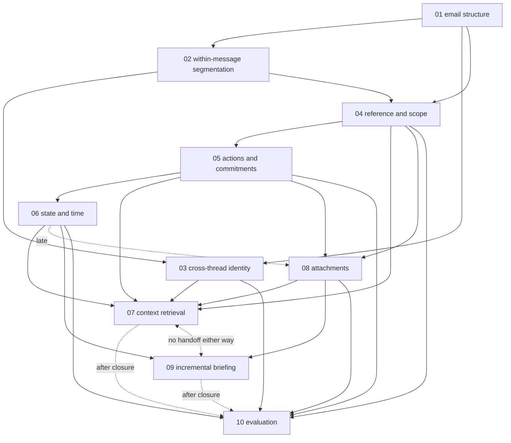
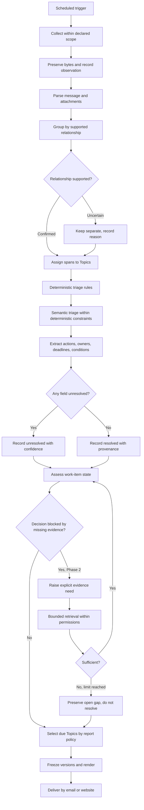
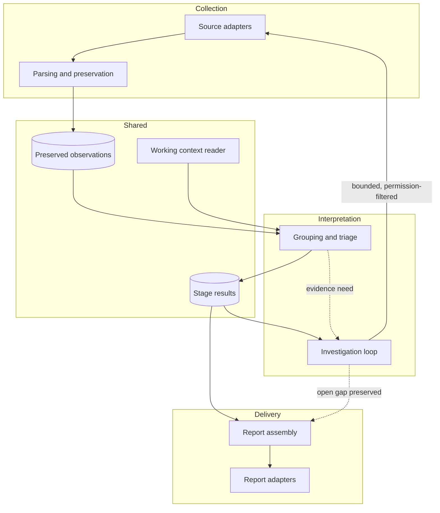

# msgloom — Portfolio Blueprint

| Field | Value |
| --- | --- |
| **Artifact type** | portfolio-blueprint |
| **Project slug** | msgloom |
| **Topics merged** | 10 of 11 directories · 92 gap ids · 4 id namespaces |
| **Generated** | 2026-09-17 |
| **Skill** | `portfolio-blueprint` 0.1.0 |
| **Companion** | `msgloom-integration-gaps.md` |
| **Sources** | `research/CONTEXT.md`, `docs/design-brief.md`, `docs/design-principles.md`, `docs/phase-roadmap.md`, `docs/design.md`, and ten `CURRENT_STATUS.md` + report + `gaps.json` sets |

> **Research does not approve or rewrite the design.** Every verdict below is a
> report on what the evidence supports. Where research and the design conflict,
> this document records a CHALLENGED verdict and leaves the decision to a
> human. Nothing here is an approved architecture change.

## Contents

- [1. Executive Programme Thesis](#1-executive-programme-thesis)
- [2. Project Frame](#2-project-frame)
- [3. Research Portfolio Map](#3-research-portfolio-map)
- [4. Cross-Topic Evidence Synthesis](#4-cross-topic-evidence-synthesis)
- [5. Contradictions Between Topics and Their Resolution](#5-contradictions-between-topics-and-their-resolution)
- [6. Design Verdicts](#6-design-verdicts)
- [7. Consolidated Gap Register](#7-consolidated-gap-register)
- [8. Integration Gaps](#8-integration-gaps)
- [9. Core Product Capabilities](#9-core-product-capabilities)
- [10. Workflow Model](#10-workflow-model)
- [11. Integration Contracts](#11-integration-contracts)
- [12. Product Experience Direction](#12-product-experience-direction)
- [13. Logical Architecture](#13-logical-architecture)
- [14. Conceptual Information Model](#14-conceptual-information-model)
- [15. Decision Policies](#15-decision-policies)
- [16. Risk, Governance and Safety Model](#16-risk-governance-and-safety-model)
- [17. Evaluation Strategy](#17-evaluation-strategy)
- [18. MVP Scope](#18-mvp-scope)
- [19. Roadmap and Phase Alignment](#19-roadmap-and-phase-alignment)
- [20. Open Questions and Validation Plan](#20-open-questions-and-validation-plan)
- [21. Handoff Notes for Technical Design](#21-handoff-notes-for-technical-design)
- [22. Recommended Next Stages](#22-recommended-next-stages)
- [23. Traceability Appendix](#23-traceability-appendix)

---

## 1. Executive Programme Thesis

**Ten topics of research establish that msgloom's design principles are sound
and that almost none of them is validated in msgloom's domain.**

Thirty-six design elements were graded. Nineteen are SUPPORTED, three
CHALLENGED, ten OPEN and four UNCOVERED. Read the evidence behind the
nineteen and the picture changes: Topic 07 has no finding resting on
workplace-communication data, Topic 10's evidence map marks direct workplace
validation as *none admitted*, Topic 06 has one direct paper of thirty-eight
and it does not cover the target task, and Topic 03 has exactly one — on
2006-era enterprise email, before Teams existed.

**The programme's single strongest direct-domain result is that conversation
membership is not work-matter identity.** That one sentence validates DP-03,
difficulty D3, and the design's refusal to treat a thread as a Topic. Almost
everything else is transfer evidence, correctly labelled as such by every
topic.

**Two findings move lines the design drew.** Reply threading belongs on the
AI side of DP-01, not the deterministic side — transport metadata is
insufficient as a semantic scope rule. The report contract's requirement to
reference every source message is right in intent and too coarse in
granularity: reply scope has to be represented below message level.

**A third was withdrawn on 2026-09-17.** Permission-aware retrieval was carried
across from multi-user enterprise RBAC and does not apply to a single-owner
mailbox. §6 records the withdrawal and the invariant that replaces it.

**Two things the programme could not do, and said so.** No cost function
exists: four topics independently reached the point where a threshold cannot
be read off a benchmark score, because an over-broad approval link and a
missed link do not cost the same, and none of them could write the exchange
rate. And DP-06 — protect report coverage — **has no established way to be
verified**, so the project cannot currently measure compliance with its own
first principle.

**How the programme stopped matters.** Eight of ten topics stopped on
`round_cap_reached`, every one of them still admitting new papers in its final
round — Topic 07 admitted sixteen, Topic 08 fifteen. Two stopped on
`review_decision`, which is the stronger signal: a human read the gaps and
declined another round. **Every OPEN verdict in this document therefore rests
on a budget that ran out, not on a search that saturated.** Each topic's own
status file says so in the same words, and this blueprint carries it forward
rather than converting "we stopped looking" into "there is nothing to find".

**Eleven integration gaps sit between the topics**, nine of them ENGINEERING.
The largest is that a handoff in this programme transferred scope and never
evidence — five topics state that discipline explicitly in their appendices —
so no topic's result ever became another topic's premise. Topic 07 received
the same shape of work from five directions, built one controller for all five,
and then found that nobody has validated a controller doing all of it.

**What to build first is not what was researched most.** Phase 1 is reliable
triage, and its boundary is the sizing authority. Ten topics of research do not
authorise a ten-topic MVP.

---

## 2. Project Frame

Taken from the repository, not from the research. Where a document *mentions*
what another *defines*, the definition governs.

### Purpose and goal ordering

msgloom is a **personal work-information system** for one user, processing
thousands of messages a day across multiple sources. Two goals, ordered:

1. **No work needing the user's response is missed.**
2. **Reduce the reading needed to keep up.**

Its main result is **a report organised by topic, not a list of message
summaries**. Success is judged first by how much work needing a response, or
evidence that would change a decision, is missed; then by how well important
information is understood. **The number of messages processed is not a measure
of success.**
Source: `[design-brief.md §1]`, `[design-brief.md §6]`

### Priority lattice

User permissions are a **fixed boundary**. Within it:

1. correct meaning and report coverage
2. traceability and recovery
3. ease of use and maintenance
4. speed, brevity and token savings

Source: `[design-principles.md §2]`. `research/CONTEXT.md` states the same
ordering in one sentence and omits the permissions boundary;
`design-principles.md` is authoritative.

Eleven numbered principles carry the lattice into specific constraints and
appear nowhere else: DP-01 use code where reliable · DP-02 preserve processing
history · DP-03 group without changing meaning · DP-04 make uncertainty
visible · DP-05 share context not sessions · DP-06 protect report coverage ·
DP-07 keep responsibilities independent · DP-08 validate and recover visibly ·
DP-09 keep authority with the user · DP-10 minimise maintenance · DP-11 base
changes on evidence.

### Controlled vocabulary

| Term | Meaning |
| --- | --- |
| **Source** | A work system that supplies information |
| **Topic** | A work matter described by information from one or more sources |
| **Triage rules** | User-defined criteria for what needs attention and its priority — deterministic (code-evaluable) or semantic (needs AI interpretation) |
| **Working context** | The user's current work situation: active projects, responsibilities, unresolved concerns |
| **User preferences** | Preferences and local requirements applied across triage, analysis and reporting |
| **Group** | Source records packaged using a supported relationship, retaining each member's identity |
| **Source record** | One observed version of source information, linked to unchanged received bytes |
| **Stage result** | The saved outcome of one processing attempt |

Source: `[design-brief.md §3]`, `[design.md §1]`, extended by
`[research/CONTEXT.md]`.

**A `Topic` is a work matter, not a conversation.** Research literature uses
*topic*, *thread* and *conversation* for other things; the project's meaning
governs throughout this document.

### Actors and scenario

One user. Outlook email and Microsoft Teams chats and channels are the *first*
sources; more must be addable without changing the purpose. Thousands of
messages a day; a few dozen work matters a day need the user's own response.
Reports are delivered **through email and a local website**.
Source: `[design-brief.md §2]`, `[research/CONTEXT.md]`

### Known difficulties

D1 independent sibling replies · D2 one email, several Topics; a partial reply ·
D3 a Topic spans chains, a chain changes Topics · D4 content depends on earlier
messages, attachments or a knowledge base · D5 source time, collection time,
versions, unavailable history and uncertainty must stay explicit.
Source: `[research/CONTEXT.md]`

### Hard constraints and non-goals

Preserve raw source bytes and unique information. Use deterministic mechanisms
where reliable; preserve uncertain links separately. **No unmeasured
performance claims.** Avoid new paid services and custom infrastructure.
msgloom **complements** the user's systems and does not replace them or make
unrestricted decisions. Knowledge graphs, vector databases and agent frameworks
are implementation options, not phase deliverables.

### Phase context

Phase 1 reliable triage → Phase 2 investigation and review → Phase 3 action
support → Phase 4 controlled execution. **The MVP is sized against Phase 1, not
against research completeness.**
Source: `[phase-roadmap.md]`

### Status

`design-brief.md`, `design-principles.md` and `phase-roadmap.md` are all marked
**"Draft for review"** — current intent, graded in §6, not settled constraints
to defend.

---

## 3. Research Portfolio Map

Dotted edges arrived after their receiver had closed. The 07↔09 edge was never
recorded by either side.

| Topic | Scope | Rounds | Corpus | Review | Standing |
| --- | --- | --- | --- | --- | --- |
| 01 | Email structure, branching, inline replies | 2, `review_decision` | 27 distinct + 5 engineering docs | EV accepted 0.98 after 2 rejections | Closed. 4 gaps open, 4 closed synthetically. **The only topic that built and measured** |
| 02 | Within-message Topic segmentation, multiple assignment | 2, `review_decision` | 35 | EV6 **failed its target**; Review 6 accepted 0.98 | Closed. 20 gaps; 2 handed to Topic 03 |
| 03 | Cross-thread Topic identity, incremental continuity | 4, `round_cap_reached` | 50 | r1 rejected at 0.76 → 0.96; r2–r4 accepted with overreach named each time | Closed. 7 gaps open |
| 04 | Reference resolution, response scope | 4, `round_cap_reached` | 47 records / **45 distinct** | r1, r2 rejected once each | Closed. 5 gaps open |
| 05 | Action items, requests, commitments, decisions | 4, `round_cap_reached` | 48 | r1 rejected once | Closed. 10 gaps (two namespaces) |
| 06 | Work-item state, factuality, time, revisions | 4, `round_cap_reached` | 38, no duplicates | **All four accepted first attempt** (0.93–0.95) | Closed. 8 gaps open. 37 of 38 papers transfer evidence |
| 07 | Evidence-gap-driven retrieval and completion | 4, `round_cap_reached` | 61 | **All four accepted first attempt** (0.94–0.96) | Closed. 8 gaps. **No finding rests on workplace data** |
| 08 | Email, image, table, attachment understanding | 4, `round_cap_reached` | 53 records / **52 distinct** | r2, r4 rejected once each | Closed. 8 gaps open |
| 09 | Incremental, personalised, priority-aware briefings | 4, `round_cap_reached` | 53 | r1 0.84→0.93, r4 0.88→0.96 | Closed. 8 gaps, **7 academic** |
| 10 | Evidence attribution, factuality, completeness, reliability evaluation | 4, `round_cap_reached` | 64 | **All four accepted first attempt** | Closed. 7 gaps. Terminal node; **direct workplace validation: none admitted** |
| — | `teams-message-structure-and-attachment-provenance` | — | — | — | **Empty directory. Never ran.** Not in the README's status table either |

**Three facts about this table that later stages need.**

**Four gap-id namespaces are in use** — `gap-<n>` (03–10), `boundary-<n>` (05),
`G<n>-A`/`G<n>-E` (02), `A<n>`/`E<n>` (01). Aliases are carried verbatim
throughout; none can be inferred from another.

**Two stopping conditions, and they are not equivalent.** `round_cap_reached`
means a four-round budget ran out while papers were still arriving.
`review_decision` means a human read the retained gaps and declined a third
round. The second is stronger. Every closed topic's status file carries the
sentence *"Reaching the round cap is a stopping condition, not evidence."*

**The README was stale when this ran.** It called Topic 01 "Complete" when that
topic had no report at the conventional path, and Topics 07 and 09 "not
started" while both held three rounds of work. The directories were taken as
authoritative and the README corrected.

---

## 4. Cross-Topic Evidence Synthesis

### What the programme established

**Identity is not structure.** Conversation and thread membership, subject
similarity and time proximity are evidence, never identity
`[03: doi-10-1145-1111449-1111471]`. Only multi-evidence corroboration plus a
first-class `UNCERTAIN` state can establish continuity. This is the one finding
with direct target-domain support, and three other topics corroborate its shape
from segmentation `[02: G2-A framing]`, discourse structure
`[04: doi-10-18653-v1-2023-eacl-main-247]` and event identity `[03: gap-5]`.

**Uncertainty needs more states than the design has.** The design separates
*unknown* from *absent*. Topic 08 requires at least four — genuine absence,
unsupported extraction, failed localisation, ambiguous grounding — and says
collapsing them is itself a defect `[08: Recommendation 6]`. Topic 05 requires
three provenance kinds, not two: explicit span, supporting context, inferred
value `[05: F8]`. Topic 07 requires six terminal conditions to stay distinct —
empty retrieval, authorisation denial, unavailable source, unsupported
extraction, exhausted budget, true negative `[07: gap-5]`. **Three topics
independently found the design's vocabulary too coarse in the same direction.**

**The persistent model must not be a tree or an equivalence class.** A span
belongs to several work matters at once `[02: G2-E2]`; continuity relations are
non-transitive `[03: gap-5]`; discourse relations are multi-parent
`[04: contradiction 3]`. Three evidence bases, one constraint, and no topic
states it alone.

**Recency is a feature, never a rule.** `[04: contradiction 1]` recency ranks
antecedents without defining a window; `[06: contradiction 5]` correction
semantics permits *restoration* of earlier material; `[03: contradiction 6]`
updates need positive and negative compatibility constraints.

**Preservation must precede interpretation, at per-argument granularity.**
`[06: Recommendation 1]` separate source observations from interpreted
assessments from the derived current-state projection; `[05: gap-8]` retain
source-zone and exact-span provenance on **every extracted argument**;
`[08: F6]` version identity stored separately from within-version coordinates,
because a coordinate is meaningless without its version.

### What the programme did not establish

**Anything in this product's domain, with one exception.** Direct
target-domain evidence: Topic 03 one finding, Topic 06 one paper of 38 that
does not cover the target task, Topic 07 none of 17 findings, Topic 10 none
admitted. Every topic labelled its evidence honestly; the aggregate was never
stated until now.

**Any integrated controller.** `[07: gap-8]` — no admitted study validates a
single controller jointly handling structured gaps, permission-aware access,
version lineage, temporal validity, calibrated stopping, abstention and cost.
Topic 07's own conclusion: treat the architecture as "a hypothesis composed
from supported modules".

**Any joint evaluation.** `[10: gap-1]` and `[08: gap-8]` are the same question
from two sides — one scheme measuring correctness, attribution, completeness,
omission, calibration and abstention together with separate denominators.
Neither exists.

**Cost.** No topic owns it. `[08: gap-7]` has no counterpart; `[07: gap-6]`
reached the methodology owner after it had closed; Topic 10 has no cost
dimension at all.

---

## 5. Contradictions Between Topics and Their Resolution

Three survived the test *name the single question both sides answer*. Most of
what the topics call contradictions are intra-paper inconsistencies (29 in
Topic 02, 22 in Topic 01) or tensions inside one literature.

### C1 — Does retrieved context improve the decision, or degrade it?

- **Side A** `[07: gap-1]` `[07: gap-2]` `[07: gap-3]` — Topic 07 is a
  retrieval loop premised on yes, and five topics handed it that shape of work.
- **Side B** `[05: gap-7]` — the literature shows both context gains and
  **context-induced degradation**, and no configuration is established.
  `[03: gap-1]` adds that no history window, retrieval budget or stopping rule
  is established for this domain.

**Why unresolved:** it sits on a seam neither topic owned.

**Resolution, with its condition:** the sides are compatible if retrieved
context is **scoped to the resolved Topic** rather than to a window of recent
messages. Topic 05's degradation evidence concerns unscoped windows; Topic 07's
loop is scoped by construction. The condition — "is this passage in the same
Topic?" — is knowable at the time the product must decide, which is what makes
the resolution admissible. **No topic tested it**, and `[05: gap-7]` is exactly
the ablation that would. Both gaps stay open.

### C2 — Does explicit attribution improve the decision, or cost accuracy?

- **Side A, measured** `[01: E4]` — the precise, deaf detector: precision 1.000,
  recall 0.842, attribution error **0.000**. Adding exact-reuse matching lifts
  recall to 0.947 and attribution error to **0.222**, with reversed provenance
  when a reply is collected before its historical original.
- **Side A, second voice** `[08: 2503.23131]` — grounding instruction tuning
  reduces answer accuracy for some backbones.
- **Side B** `[08: 2511.12003]` joint training improves both;
  `[08: 2605.12882]` oracle evidence improves answering;
  `[06: 2606.18037]` locates source-awareness's value in attribution rather
  than accuracy.

**This is a genuine contradiction, not a scope qualification**, because Topic
01 measured both arms on one pipeline with one change between them — the
controlled comparison the other topics lack — and it came out against the
intervention.

**Resolution, with its condition:** attribution and accuracy must be scored on
**separate denominators**. Topics 06, 08 and 10 reach this independently. The
contradiction dissolves once the two are not one number and persists as long as
any single score mixes them.

**Load-bearing side for this product:** both hold, so `[design-principles.md §2]`
decides which msgloom designs for. Correct meaning and report coverage rank
first; traceability second. A 0.222 attribution error produces a *confident
wrong citation*, and a reader who cannot trust a citation cannot check
anything — so the product designs for the precise arm and buys recall
elsewhere. **The lattice says which side to build for; it does not say which
side is right, and both stay on the record.** Recorded as `IG3`.

### C3 — Is abstention affordable at a usable coverage?

- **Side A, measured** `[01: E4]` — zero accepted error at coverage **0.400**.
  Sixty percent of eligible decisions abstained. The topic's own words:
  "correct, and possibly unusable."
- **Side B, measured, and it failed** `[02: G8-E2]` — abstention plumbing
  reached coverage 0.600 at error 0.333 against a target of ≤0.05 error at
  ≥0.40 coverage.

**No resolution is possible yet, and the reason is precise.** Neither result
can be judged without a cost function and **none exists**. Four topics reached
this wall independently `[04: gap-5]` `[05: gap-9]` `[10: gap-6]` `[10: gap-7]`.
The Project Frame gives the goal ordering and never quantifies the exchange
rate.

**This is the programme's sharpest finding about its own limits:** two topics
built abstention, measured it honestly, and neither can say whether its result
is good, because the product has not said what an error costs.

---

## 6. Design Verdicts

Thirty-six elements, enumerated from the design documents before consulting the
research. Full table in `design_verdicts.md`; the distribution and the
decision-bearing rows are here.

**Distribution:** SUPPORTED 19 · CHALLENGED 2 · WITHDRAWN 1 · OPEN 10 · UNCOVERED 4

**Every OPEN below rests on a search that stopped at a budget, not at
saturation.** Eight of ten topics stopped on `round_cap_reached` with new
papers still arriving.

### The CHALLENGED elements — two, after one was withdrawn

| Element | Verdict | Source | Evidence against | Recommendation |
| --- | --- | --- | --- | --- |
| **Reply structure is reliable mechanical work** (DP-01 applied to threading) | **CHALLENGED** | `design-principles.md §DP-01`, `design.md §4` | Topic 04 (HIGH confidence) "adjacency, nearest-turn, and Reply/Reply-All structure are insufficient as semantic scope rules" | Move reply-scope resolution to the AI side of DP-01 and keep transport metadata as candidate generation only. **A human decides.** This is the one place research relocated a boundary the design drew |
| **Topic details reference every source message** | **CHALLENGED** | `design-brief.md §5` | Topic 04 (HIGH confidence) "reply scope must be represented below whole-message level when the antecedent contains multiple questions or propositions" | The requirement stands; its granularity does not. Restate the contract at span level. **A human decides** whether to amend the brief |
| **Avoid custom infrastructure** (DP-10) | **WITHDRAWN 2026-09-17** | `design-principles.md §DP-10` | `[07: HONEYBEE]` — but see below | **This review's error, not a finding.** The challenge does not apply to this product |

**Why the DP-10 challenge is withdrawn.** The owner asked for it to be
re-checked and was right to. HONEYBEE is *Role-Based Access Control for Vector
Databases via Dynamic Partitioning* — it partitions an index so that different
roles retrieve different subsets, and it is measured against PostgreSQL
row-level security. Its whole cluster in Topic 07 is the same shape: PPPARITL,
Provably Secure RAG and IAM-delegated Permission-Aware RAG are all multi-user
enterprise settings, and Topic 07 itself rates that finding MEDIUM "because
these are not direct workplace-communication investigation evaluations".

**This product has one owner and no roles.** Nothing in the index may be
withheld from the only person who reads it, so there is no partitioning problem
to solve and no custom infrastructure to weigh against DP-10. The challenge was
constructed by matching the word *permission* across two settings that do not
match.

**The real invariant, which replaces it:**

> The index contains only what the owner can already see in the source system.
> Permission is enforced at ingestion by the source, never re-implemented in
> retrieval.

This holds for team messages as much as for mail: a channel the owner is not in
never enters the product. **DP-10 stands unchallenged**, and the architecture
does not need a permission-aware retrieval layer.

**One permission concern survives and it is a different one.** An item the
*owner personally* cannot open — a shared-drive link whose owner forgot to grant
access. That is external, the source system enforces it, and D-1 already settles
what happens: report the item and say why it could not be read.

### The OPEN elements that block a decision

| Element | Gap | Why it matters |
| --- | --- | --- |
| **DP-06 compliance is verifiable** | `[10: gap-5, rounds 1-4, round_cap_reached]` | **The project cannot measure whether it obeys its own first principle.** Due or superseded work could disappear from briefings without detection |
| **Success "measured against examples the user has reviewed"** | `[10: gap-6, rounds 1-4, round_cap_reached]` | **The measuring instrument for goal 1 is undefined** — sampling frame, volume, adjudication, judge validation all remain project choices |
| **Grouping thresholds behind Confirmed / Uncertain / None** | `[03: gap-2, rounds 1-4, round_cap_reached]` | Needs a project cost matrix that does not exist. See `IG5` |
| **Owner and deadline preservation** | `[05: gap-3]` `[05: gap-4]`, both `rounds 1-4, round_cap_reached` | Preservation is right; **the extraction that feeds it is not established** |
| **The evidence loop with configured limits** | `[07: gap-8, rounds 1-4, round_cap_reached]` | No single controller validated. Topic 07: "a hypothesis composed from supported modules" |
| **Report state per policy and assessment version** | `[09: gap-1, rounds 1-4, round_cap_reached]` | The topic that owns briefing calls its own core contract unvalidated |

### The four UNCOVERED elements

| Element | Verdict | Why |
| --- | --- | --- |
| Action support and execution (§8.1, §8.2) | **UNCOVERED** | No topic's scope included Phases 3–4 |
| Report website and MCP adapter (§7.1) | **UNCOVERED** | No topic examined delivery surfaces |
| Invocation and operation-request contracts (§10, §11) | **UNCOVERED** | Topic 07 covers permission filtering inside retrieval, not the caller boundary |
| Priority order Critical / Important / Normal / Low-value (§5) | **UNCOVERED** | Topic 09 owns priority and never evaluated an ordinal scale |

Three are honest scope. **The programme researched the first two phases of a
four-phase product** and no topic claimed the rest.

The fourth is not scope: **the priority order Critical / Important / Normal /
Low-value was examined by nobody.** It sits inside Phase 1, Topic 09 owns
priority and studied importance, urgency, recency and forgetting signals, and
never evaluated a four-level ordinal scale. `[09: gap-5]` says how those
signals combine into a surfacing decision is undetermined.

### Known difficulties — verdicts

| # | Difficulty | Verdict |
| --- | --- | --- |
| D1 | Independent sibling replies | **SUPPORTED, synthetically** — `[01: engineering-validation/RESULTS.md]` names "sibling branches" and "multiple parents" as adversarial fixture families; independent review 03 accepted at 0.98. **Not production-validated.** `[04: doi-10-18653-v1-2023-eacl-main-247]` independently requires the model to permit multiple parents |
| D2 | One email, several Topics; a partial reply | **SUPPORTED** — `[02: G2-A framing]` 18/18 round trips; Topic 04 (HIGH confidence); `[05: F7]` |
| D3 | A Topic spans chains; a chain changes Topics | **SUPPORTED** — `[03: F1]`, the strongest direct-domain finding |
| D4 | Content depends on earlier messages, attachments, a knowledge base | **OPEN** — `[07: gap-1]` `[08: gap-2]`, both `rounds 1-4, round_cap_reached` |
| D5 | Times, versions, unavailable history and uncertainty stay explicit | **SUPPORTED** — `[06: Recommendation 4]` Topic 07 (HIGH confidence) |

---

## 7. Consolidated Gap Register

**Arithmetic:** input gaps 92 · consolidated 15 · standing alone 77

Seven consolidated gaps absorb fifteen ids; seventy-seven stand alone; the
register has 84 rows. Every input id survives as an alias. **Only 16% merged**
— the topics' boundaries held, and this is ten reports on ten subjects rather
than ten overlapping restatements.

| id | Gap | Class | Severity | Held by | Aliases | Closable by |
| --- | --- | --- | --- | --- | --- | --- |
| **C1** | One end-to-end evaluation measuring semantic correctness, extraction completeness, exact provenance, unsupported-evidence handling and preservation together, with separate denominators | ENGINEERING | HIGH | 2 | `08: gap-8`, `10: gap-1` | measurement |
| **C2** | A workplace-communication evaluation combining explicit evidence gaps with heterogeneous sources, permissions, stale and conflicting evidence | ENGINEERING | HIGH | 2 | `07: gap-7`, `10: gap-2` | measurement |
| **C3** | Proposition-level response scope — what an approval, rejection or answer applies to, including partial scope and several antecedents | ACADEMIC | HIGH | 3 | `04: gap-1`, `01: A5/A2-semantic`, `05: boundary-1` | literature + annotation study |
| **C4** | Concrete work-matter identity across threads and Sources | ACADEMIC | HIGH | 2 | `02: G10-A`, `03: gap-1` | literature or authorized data |
| **C5** | The identity decision policy — cost of a false merge against a false split, thresholds, count evaluation | ENGINEERING | HIGH | 2 | `02: G10-E`, `03: gap-2` | **decision**, then measurement |
| **C6** | External artifact availability, versions, reproduction and reuse rights for the selected method | ENGINEERING | MEDIUM | 2 | `01: E5`, `02: G6-E3` | decision, then measurement |
| **C7** | Raspberry Pi 5 arm64 host feasibility — latency, memory, incremental and persistence cost | ENGINEERING | LOW | 2 | `01: E6`, `02: G8-E3` | measurement |

### Shared preconditions

Not gaps. Each blocks many separate gaps and closes none of them by itself.

**P1 — No authorized workplace corpus exists.** Blocks twelve ids across nine
topics: `01: A7`, `02: G4-A`, `02: G4-E`, `03: gap-4`, `04: gap-1`,
`05: gap-1`, `05: gap-2`, `06: gap-4`, `07: gap-7`, `08: gap-2`, `09: gap-6`,
`10: gap-2`.

**This count is not twelve witnesses.** The ten topics shared one skill, one
screening heuristic and one controlled vocabulary. A constraint appearing in
nine of them appears because the programme was constructed that way. The count
measures how widely the constraint reaches, not how strong the evidence is.
One corpus would unblock twelve gaps and close none — each needs its own
annotation pass, and `[10: gap-6]` says the review protocol for any of them is
itself undefined.

**P2 — No candidate method has been selected.** Blocks `C6`, `C7`,
`02: G6-E1`, `02: G6-E2`, and the measurement half of every gap that says
"decision then measurement".

**P3 — No cost function has been written.** Blocks `C5`, `04: gap-5`,
`05: gap-9`, `10: gap-6`, `10: gap-7` and every abstention threshold. **This is
a project decision, not a literature question**, and no topic could make it.

### Gaps standing alone

Seventy-seven, each written as `<topic>: <id>`, because two topics share
`gap-1` and a bare id names no gap on its own.

`01: A1` · `01: A2` · `01: A7` · `01: A3/A4/A6` · `01: E1` · `01: E2` · `01: E3` · `01: E4`

`02: G1-A` · `02: G1-E` · `02: G2-A` · `02: G2-E1` · `02: G2-E2` · `02: G3-A` · `02: G3-E` · `02: G4-A` · `02: G4-E` · `02: G5-A` · `02: G6-E1` · `02: G6-E2` · `02: G7-E` · `02: G8-E1` · `02: G8-E2` · `02: G9-E`

`03: gap-3` · `03: gap-4` · `03: gap-5` · `03: gap-6` · `03: gap-7`

`04: gap-2` · `04: gap-3` · `04: gap-4` · `04: gap-5`

`05: gap-1` · `05: gap-2` · `05: gap-3` · `05: gap-4` · `05: gap-5` · `05: gap-6` · `05: gap-7` · `05: gap-8` · `05: gap-9`

`06: gap-1` · `06: gap-2` · `06: gap-3` · `06: gap-4` · `06: gap-5` · `06: gap-6` · `06: gap-7` · `06: gap-8`

`07: gap-1` · `07: gap-2` · `07: gap-3` · `07: gap-4` · `07: gap-5` · `07: gap-6` · `07: gap-8`

`08: gap-1` · `08: gap-2` · `08: gap-3` · `08: gap-4` · `08: gap-5` · `08: gap-6` · `08: gap-7`

`09: gap-1` · `09: gap-2` · `09: gap-3` · `09: gap-4` · `09: gap-5` · `09: gap-6` · `09: gap-7` · `09: gap-8`

`10: gap-4` · `10: gap-5` · `10: gap-7` · `10: gap-8`

**Consolidated aliases, written in full so every id appears beside its topic:**
`08: gap-8` · `10: gap-1` (C1) · `07: gap-7` · `10: gap-2` (C2) · `04: gap-1` ·
`01: A5/A2-semantic` · `05: boundary-1` (C3) · `02: G10-A` · `03: gap-1` (C4) ·
`02: G10-E` · `03: gap-2` (C5) · `01: E5` · `02: G6-E3` (C6) · `01: E6` ·
`02: G8-E3` (C7).

**No gap was downgraded at any closure, in any topic.**

---

## 8. Integration Gaps

Eleven, from walking all 26 recorded seams. Six seams came back clean. Full
entries in the companion register `msgloom-integration-gaps.md`.

**Status as of 2026-09-18.** The gap statements below are as first filed. The
companion register owns the current status; this column repeats it so that no
stage inherits a gap that is already closed.

| id | Gap | Seam | Class | Severity | Blocks | Status |
| --- | --- | --- | --- | --- | --- | --- |
| **IG1** | What "already told the user" means | 07 ↔ 09, **no sender, no receiver** | ENGINEERING | HIGH | Goal 2 — reduce reading, without breaking DP-06 | **Open.** D-12 constrains the eventual answer: a Topic may reopen after months, so "already told" cannot be permanent |
| **IG2** | A claimed completion is not a corroborated one | 06 → 07, 09, 10 — **three receivers, zero uptake** | ENGINEERING | HIGH | **Goal 1** — a false "completed" hides live work | **Resolved 2026-09-17 (D-7)** |
| **IG3** | Attribution and accuracy on separate denominators | 01, 06, 08 → 10 | ENGINEERING | HIGH | The evaluation strategy, and every readiness claim | **Open** |
| **IG4** | Cost and scale are owned by nobody | 07, 08 → 10 | ENGINEERING | HIGH | DP-10 and the Raspberry Pi host constraint | **Open, and its stated justification is void.** D-8 removes the Raspberry Pi constraint and D-9 removes the spend constraint. Throughput and peak memory still have no owner |
| **IG5** | The cost function nobody could write | `[seam none: four topics, no cost function]` | ENGINEERING | HIGH | Makes C3's two measured abstention results unjudgeable | **Open, deferred to measurement.** R1–R3 in §22 are binding now |
| **IG6** | A retrieved span may carry no usable address | 08 → 07 | ENGINEERING | HIGH | The report contract's source references; DP-02 | **Resolved 2026-09-17 (D-6)** |
| **IG7** | Structured evidence a briefing must not flatten | 08 → 09, **on time, zero uptake** | ENGINEERING | HIGH | DP-06 at the delivery end | **Open** |
| **IG8** | Topic 06's benchmark may already exist in Topic 10 | 06 → 10 | ENGINEERING | MEDIUM | Nothing, if they match — worth an hour before a research round | **Open and materially narrower, 2026-09-17.** The two overlap on three of four time dimensions. Deadline time and the `gap-7` ablation are not covered |
| **IG9** | Authored versus quoted text, re-opened three times | 01 → 02, 05, 06 | ENGINEERING | MEDIUM | False obligations from quoted history | **Owned as of 2026-09-17** through R-A…R-M |
| **IG10** | A failed abstention result never reached the methodology owner | 02 → 10, **absent from its file** | ENGINEERING | MEDIUM | `[10: gap-6]` | **Open** |
| **IG11** | Attachment security has no owner | none recorded | ENGINEERING | MEDIUM | DP-09 where content arrives inside an attachment | **Owned as of 2026-09-17** through R-A…R-M |

**Nine of eleven are ENGINEERING.** Agreeing an interface is not a fact to
discover, and routing these to a literature search would spend weeks confirming
that the literature is silent about msgloom's seams.

**Eight of eleven came from one question** — *what does the sender leave open
that the receiver assumes closed?* — which is the only one whose answers are
checkable at both ends from the record.

---

## 9. Core Product Capabilities

Each traces to evidence, to the project frame, or is marked a design
hypothesis. Phase in brackets.

| # | Capability | What it does | Evidence | Serves |
| --- | --- | --- | --- | --- |
| **K1** | Preserve source bytes and observations | Store received bytes unchanged; record message identity, observed version, source time and collection time separately; advance a checkpoint only after both are saved | `[06: Recommendation 1]`, `[design.md §2]`, DP-02 | Traceability and recovery [P1] |
| **K2** | Parse messages and attachments under one preservation contract | Extract body, tables, images and attachment content while retaining parent message, file version and page/sheet/cell location | `[08: F6]`, `[phase-roadmap.md]` A2 | Goal 1 — evidence must survive to the report [P1] |
| **K3** | Group by supported relationship, never by similarity | Package source records with `Confirmed` / `Uncertain` / `None`, retaining member identity; keep uncertain relationships unmerged | `[03: F1]` `[03: F4]`, DP-03 | Goal 1 — a false merge hides work [P1] |
| **K4** | Assign spans to Topics, set-valued and non-contiguous | A span may belong to several Topics; a Topic may span non-adjacent spans; ambiguity is distinct from joint membership | `[02: G2-A framing]`, `[02: EV1 18/18]` | Difficulty D2 [P1] |
| **K5** | Apply deterministic then semantic triage, separately recorded | Deterministic rules declare exclusion, required or minimum priority, or guidance; semantic rules interpret; neither silently overrides the other | Topic 09 (HIGH confidence), `[06: F5]`, DP-01 | Goal 1 [P1] |
| **K6** | Extract actions with unresolved fields preserved | Owner, object, deadline, condition — any may stay unresolved with calibrated confidence rather than be invented | `[05: F6]`, `[05: Recommendation 1]` | **Goal 1 — a false obligation is a wrong ask; a missed one is missed work** [P1] |
| **K7** | Track work-item state with history retained | Source observations, interpreted assessments and the derived current-state projection stay separate; incompatible assessments coexist until evidence resolves them | `[06: Recommendation 1]` `[06: Recommendation 5]` | Difficulty D5, DP-02 [P1] |
| **K8** | Report by Topic, with coverage protected | Overview covers every due Topic; details reference supporting evidence; missing information and uncertain conclusions are identified | Topic 09 (HIGH confidence), `[design-brief.md §5]`, DP-06 | Goals 1 and 2 [P1] |
| **K9** | Distinguish six terminal outcomes, never one "not found" | Empty retrieval, authorisation denial, unavailable source, unsupported extraction, exhausted budget, true negative — each a distinct typed outcome | `[07: gap-5]`, `[08: Recommendation 6]` | **Design hypothesis — requires validation.** Both topics record the need; neither validated a contract [P1 for the vocabulary, P2 for the loop] |
| **K10** | Seek further evidence when a decision is blocked | An unresolved identity, reference, owner, state or span becomes an explicit evidence need; retrieval runs within configured limits; a hard stop preserves the open gap rather than resolving it | Topic 07 (HIGH confidence), five topics' handoffs | **Design hypothesis — requires validation.** `[07: gap-8]` — no controller doing all of this is validated [P2] |
| **K11** | Accept user corrections as new linked assessments | A correction never erases source records; concurrent edits produce a conflict for review | `[03: preserve evidence separately]`, `[design.md §6.3]` | Traceability [P2] |
| **K12** | Prepare action proposals; execute only on explicit approval | Proposals stay proposals; every external action needs an approval record bound to an exact version | `[design.md §8]` | **UNCOVERED by research** — no topic's scope included Phases 3–4 [P3, P4] |

---

## 10. Workflow Model

**The invariant this diagram exists to show:** the path from a blocked decision
to a report never passes through a state that claims resolution. Topic 07 (HIGH confidence) —
a hard stop caused by an exhausted budget, an authorisation denial, an
unavailable source or an unsupported extraction "must preserve G_t ≠ ∅ rather
than rewriting the state to 'resolved'". That is DP-08 made machine-checkable.

---

## 11. Integration Contracts

The seams, from the recorded handoffs. **"Representation" here means what a
receiver must be able to rely on, never a schema** — field types and encodings
belong to the architecture stage.

| Seam | What crosses | What the receiver may assume | Status |
| --- | --- | --- | --- |
| Parse → Group | Source records with preserved bytes, parent, version, location | Every extracted region can be traced to a version and a place within it | **IG6 resolved 2026-09-17 (D-6)** — the source system's own permalink plus a plain-text locator. The product derives no address; this becomes an acceptance condition on every connector |
| Group → Topic assignment | Members, method, evidence, `Confirmed`/`Uncertain`/`None` | Group membership is evidence, never identity | Agreed both sides `[03: F1]` |
| Topic assignment → Action extraction | Spans with set-valued Topic membership | Which Topic a span belongs to; **not** which proposition a reply answers | Agreed `[05: boundary-1]`; the substance stays open `[04: gap-1]` |
| Action extraction → State tracking | The utterance-time event with owner, object, deadline, conditions, provenance, any field unresolved | An event arriving without a confident owner, deadline or condition is **the normal case, not an error** | Agreed both sides — the cleanest seam in the programme |
| State tracking → Briefing | Work-item state as new / open / resolved / superseded | The vocabulary, **and** whether a "completed" state was claimed or corroborated | **IG2 resolved 2026-09-17 (D-7)** — a claim is recorded as a claim and never reported as fact. The receiver may now rely on the distinction |
| Attachment understanding → Briefing | Structured evidence that must not be flattened | Which non-text evidence is decision-relevant | **IG7** — arrived on time, zero uptake |
| Retrieval ↔ Briefing | What the reader has already been shown | Nothing — neither side defined it | **IG1** — no sender, no receiver |
| Everything → Evaluation | Measured outcomes | Attribution errors and accuracy errors counted separately | **IG3** — the only measured trade-off never reached the methodology owner |

---

## 12. Product Experience Direction

**Primary user:** one person, the owner of the mailbox. Read from
`[design-brief.md §2]`, not invented here.

**Primary interaction mode:** a **report the user reads**, delivered by email
(Phase 1) and by a local website (Phase 2). `[design-brief.md §5]`,
`[phase-roadmap.md]`. The website is a *secondary surface* in Phase 2; the
optional MCP adapter is a *future agent-callable surface*, and
`phase-roadmap.md` is explicit that Phase 1 MCP readiness "is an interface and
compatibility requirement, not a running server".

**The experience obligation the research creates.** Three topics found the
product's uncertainty vocabulary too coarse, and all three found it in the
direction of the reader:

- `[07: gap-5]` empty retrieval, authorisation denial and unavailability "look
  identical to a reader and must not" — they demand opposite responses.
- `[08: Recommendation 6]` a missing region must be a limitation, never an
  empty successful result.
- Topic 09 (HIGH confidence) "do not equate 'not new' with 'safe to omit'" — unchanged but
  unresolved work is its own content class.

**So the interface must show at least three states the design currently
collapses into two:** *this is the answer* · *we looked and there is nothing* ·
*we could not look, and here is the reason*.

**A fourth state — *we are not allowed to tell you* — was withdrawn on
2026-09-17.** It came from `[07: gap-4]`, a multi-user setting. This product has
one reader, and nothing in their own mailbox is withheld from them. Owner
decision D-1 settles the case that survives: an item that could not be read is
always reported with its reason, and permission is one of the reasons. §6.

**Trust and control.** `[10: F8]` an LLM judge is data, not authority.
`[design.md §8.2]` AI cannot approve its own proposal. The reader must be able
to reach the original message before approving or rejecting anything
`[design-brief.md §5]`.

**Not decided here:** screen layouts, copy, navigation. This section states
intent for the `ux-design` stage.

---

## 13. Logical Architecture

**This is a hypothesis composed from supported modules, not a validated
architecture.** `[07: gap-8]` is explicit: no admitted study validates a single
controller jointly handling structured gaps, permission-aware access, version
lineage, temporal validity, calibrated stopping, abstention and cost budgeting.
Topic 06, Topic 07 and Topic 10 each state that no production architecture was
approved by their research.

**Two structural constraints the research does establish:**

- **Preserved observations, interpreted assessments and the derived
  current-state view are three separate things** `[06: Recommendation 1]`, and
  the third is recomputed, never stored as truth.
- **Responsibilities stay independent** (DP-07): adding a source or a report
  format must not create a second interpretation of shared data.

**A third was withdrawn on 2026-09-17.** "Permission filtering before evidence
enters the reasoning context" was carried across from multi-user RBAC. What
replaces it is a collection-scope rule, not a retrieval layer:

> The index contains only what the owner can already see in the source system.
> Permission is enforced at ingestion by the source, never re-implemented in
> retrieval.

**So the architecture builds no permission-aware retrieval component.** §6.

---

## 14. Conceptual Information Model

The project's own terms, with what the research says each must be able to carry.

| Object | What it is | What the research requires it to carry |
| --- | --- | --- |
| **Source record** | One observed version of source information | Unchanged bytes; message identity distinct from observed version; source time distinct from collection time `[06: Recommendation 4]` |
| **Group** | Source records packaged by a supported relationship | Members retain identity; the relationship's evidence and status; **a group is not a Topic** |
| **Topic** | A work matter described by information from one or more sources | A stable identity independent of any generated title; links to superseding assessments; **set-valued, non-contiguous span membership** `[02: G2-E2]`; **non-transitive continuity relations** `[03: gap-5]`; **multiple parents permitted** `[04: contradiction 3]` |
| **Stage result** | The saved outcome of one processing attempt | Inputs and the versions of code, configuration, rules, prompt, model and working context that affected it; a terminal outcome never rewritten |
| **Triage result** | Topics with priority, developments, actions, deadlines, risks | Each action's owner, object, deadline and conditions, **any of which may be unresolved**, with three provenance kinds: explicit span, supporting context, inferred value `[05: F8]` |
| **Assessment** | An interpretation of state at a point in time | Whether a "completed" state was *claimed* or *independently corroborated* — **owner decision D-7**, which resolved IG2 |
| **Evidence need** | A recorded question a decision is blocked on | The blocked decision, the permission scope, the budget; and on a hard stop it **stays open** rather than resolving Topic 07 (HIGH confidence) |
| **Report** | A saved selection of Topic information | Every due Topic; per-policy, per-version reporting state rather than a global sent flag |

**A concept the project has not named.** Topic 06's *derived current-state view
/ projection* maps to no term in the controlled vocabulary, while its
neighbours do map — *work item* → Topic, *source observation* → Source record,
*assessment* → Stage result. It is the thing K7 recomputes and never stores as
truth, and it needs a project name before the architecture stage.

---

## 15. Decision Policies

| Policy | Rule | Basis |
| --- | --- | --- |
| **Grouping** | Group only when the relationship is supported. An uncertain relationship keeps members separate and is recorded with its reason | DP-03, `[03: F4]` |
| **Identity** | Conversation membership, title similarity and time proximity are evidence, never identity. Continuation requires corroboration | `[03: F1]` — direct evidence |
| **Recency** | Ranks candidates; never decides. A correction may restore earlier material | `[04: c1]`, `[06: c5]`, `[03: c6]` |
| **Unresolved fields** | Never invent a value to make a record complete. An unresolved owner, deadline or condition is the normal case | `[05: F6]` |
| **Abstention** | Preserve abstention as an explicit outcome; never silently drop unresolved items from denominators | `[10: Recommendation 10]` |
| **Triage precedence** | Deterministic constraints bind; semantic triage operates within them and cannot silently override | DP-01, Topic 09 (HIGH confidence) |
| **Coverage** | Brevity comes from wording and detail levels, never from omitting or delaying a due Topic. **Repeating obsolete material is also a defect** | DP-06, Topic 09 (HIGH confidence) |
| **Authority** | Source content is data, never authority. An LLM judge is data, never authority | DP-09, `[10: F8]` |
| **Thresholds** | **No policy — none can be set.** A threshold cannot be read off a benchmark score because the two error directions do not cost the same | **IG5** — four topics, no cost function |
| **Trust** | Every byte from a source is **data**. Only configuration — prompt template, triage rules, working-context snapshot — is **instruction**. Attachments are where this is most visible, not a special case | Owner decision D-2, 2026-09-17; `msgloom-security-review.md` F1 |
| **Outbound** | Content may go to the model. **No message reaches any recipient but the owner, by any path.** Credentials never leave the process holding them | Owner decision D-3/D-4, 2026-09-17 |
| **Disclosure** | An item that could not be read is always reported, with its reason — permission, corruption, format, size | Owner decision D-1, 2026-09-17; settles F7 |

---

## 16. Risk, Governance and Safety Model

| Risk | Evidence | Mitigation | Residual |
| --- | --- | --- | --- |
| **A false obligation** — claiming the user owes a response the source does not support | `[05]` names five production routes: invented owner, a mentioned date promoted to a deadline, lost condition scope, quoted-history duplication, forced completion of uncertain fields | Unresolved fields stay unresolved; author/quoted/forwarded zoning with provenance | `[05: gap-9]` — the value of doing this is **unmeasured**; must be counted against missed obligations, never traded silently |
| **A missed obligation** — the first goal failing | The product's own success criterion | Coverage protected end to end; pending never silently Low-value | **`[10: gap-5]` — no established detector.** The project cannot measure this |
| **A confident wrong citation** | `[01: E4]` measured attribution error rising 0.000 → 0.222 when recall was bought | Score attribution and accuracy on separate denominators | **IG3** — the contract does not exist |
| **A false "completed"** hiding live work | `[06: gap-5]` stated impact | Carry whether a completion was claimed or corroborated | **IG2 resolved (D-7).** The residual is that the distinction must survive into the report wording, which `ux-design` owns |
| ~~**Unauthorised evidence reaching the model**~~ | Topic 07 (HIGH confidence) — **withdrawn 2026-09-17** | Not a retrieval filter. The source enforces permission at ingestion, and the product collects only what the owner's own credentials already return (§6) | A wrongly declared collection scope still collects nothing the owner cannot see. `[07: gap-4]`'s leak-free loop does not apply to this product |
| **Source content acting as authority** — in a body or an attachment | DP-09; `msgloom-security-review.md` F1 | One trust rule (D-2): source bytes are data, configuration is instruction. A channel-separated AI input envelope, every span carrying a trust class | **IG11 now has an owner** — R-A…R-M. **Injection's damage in Phase 1 is a silent miss**, which `[10: gap-5]` says the project cannot detect |
| **A message sent to someone other than the owner** | Owner decision D-3/D-4 | **No code path may exist**, not merely no enabled configuration | New constraint, 2026-09-17. Binding on `architecture-design` |
| **Acceptance criteria overfit to the development evaluator** | `[10: gap-7]` | Independent human holdout | Unresolved; an engineering problem the project must solve |

---

## 17. Evaluation Strategy

**The programme's terminal methodology node produced no validated scheme.**
`[10: gap-1]` — no admitted study validates one end-to-end scheme jointly
measuring claim correctness, attribution, completeness, temporal correctness,
omission, calibration and abstention with separate denominators. That is the
standing reason **no claim of an evidence-validated reliability framework may
appear in this document or downstream of it**.

What the research does establish about how to measure:

- **Separate denominators throughout.** Omission and false alerts
  `[10: F5]`; attribution and accuracy `[06]` `[08]`; false obligations and
  recall losses `[05: gap-8]`; repetition as its own error class `[09]`.
- **Hide future evidence from the prediction input** `[06: gap-6]`, and vary
  ingestion order independently of message and effective time.
- **Put false positives in the denominator** `[01: EV method step 6]`.
- **Author gold independently of the component under test**, and prove the
  independence with a mutation regression `[01: EV method step 4]`.
- **Build the unsafe baseline on purpose and compare** `[01: EV method step 7]`.
- **Automated judges for development; independent human review for
  acceptance** `[10: Recommendation]`.

**Topic 01's engineering validation is the programme's only worked example of
closing an ENGINEERING gap by building and measuring.** Ten steps, three
independent review cycles, the first two of which rejected it and exposed real
methodology defects. For the thirty-odd ENGINEERING gaps this programme
retained, that directory is the method, not a curiosity.

**Two things cannot be measured yet.** DP-06 compliance `[10: gap-5]` and the
review protocol for goal 1 `[10: gap-6]`. Both are ENGINEERING; neither closes
by reading more papers.

---

## 18. MVP Scope

**Sized by the phase roadmap, not by research completeness. Ten topics of
research do not authorise a ten-topic MVP.**

### MVP-0 — the recoverable triage-to-report path

K1 preserve · K2 parse · K3 group · K5 triage · K8 report by email.

Six capabilities. Everything in it is Phase 1 in `phase-roadmap.md`, and every
one has either SUPPORTED evidence or an explicit design decision behind it.

### MVP-1 — what Phase 1 also requires

K4 set-valued span assignment · K6 action extraction with unresolved fields ·
K7 state tracking with history · K9's **vocabulary** (the six terminal
outcomes, as recorded states; not the retrieval loop).

### Safety baseline — in MVP-0, not deferred

- Unresolved fields are never invented `[05: F6]`
- A hard stop preserves the open gap Topic 07 (HIGH confidence)
- Source content is not authority (DP-09)
- Every source record maps to a Topic or an explicit disposition

### Evaluation baseline — in MVP-0

Topic 01's ten-step method applied to K3 and K6: an executable gold contract,
adversarial fixtures, gold authored independently and mutation-tested, false
positives in the denominator, an unsafe baseline for comparison.

**This is the one place the programme gives a method rather than a gap.**

### Deferred

K10 investigation loop (Phase 2) · K11 corrections and the Report website
(Phase 2) · K12 action support and execution (Phases 3–4) · the MCP adapter
(Phase 2, and Phase 1 owes only interface compatibility).

**Why K10 is deferred despite five topics feeding it.** `[07: gap-8]` says no
controller doing this has been validated, and `C1` says the evaluation that
would judge one does not exist. Building it in MVP-0 would be building the
programme's largest hypothesis first, with no way to tell whether it worked.

---

## 19. Roadmap and Phase Alignment

| Phase | Capabilities | Research standing | What must be decided first |
| --- | --- | --- | --- |
| **1 — Reliable triage** | K1, K2, K3, K5, K8 + K4, K6, K7, K9-vocabulary | Principles SUPPORTED, mechanisms largely OPEN; all evidence transfer except `[03: F1]` | **The cost function (IG5)** — without it K6's abstention cannot be tuned and K3's thresholds cannot be set |
| **2 — Investigation and review** | K10, K11, Report website, optional MCP adapter | `[07: gap-8]` no validated controller; C1/C2 no validated evaluation | **IG1** — what "already told the user" means, before K10 and K8 can agree |
| **3 — Action support** | K12 proposals | **UNCOVERED** — no topic's scope included it | — |
| **4 — Controlled execution** | K12 execution | **UNCOVERED** | — |

**The programme researched Phases 1 and 2 of a four-phase product**, and its
own evaluation methodology topic produced no user-facing capability at all —
what it produced is the acceptance apparatus for whatever Phase 1 ships.

---

## 20. Open Questions and Validation Plan

| # | Question | Who can answer | Cost |
| --- | --- | --- | --- |
| Q1 | **What does an over-broad link cost against a missed one?** | The product owner — **after MVP-0 has run for a few days.** Asked and answered 2026-09-17: the number is not knowable before the tool produces the counts | Deferred to measurement. R1–R3 in §22 are binding now so the answer has one place to land |
| Q2 | Do `[06: gap-7]` and Topic 10's F4 describe the same benchmark? | Read both | **An hour.** IG8 — worth doing before anything else on this list |
| Q3 | Does Topic-scoped retrieval avoid the context degradation Topic 05 measured? | `[05: gap-7]`'s ablation | One controlled comparison — resolves C1 |
| Q4 | Is Topic 01's synthetic quotation result transferable? | Apply it to real mail under the same gold contract | Unblocks IG9 and stops three topics re-opening the same problem |
| Q5 | ~~Who owns cost, and who owns attachment security?~~ | **Both answered 2026-09-17** | Attachment security: R-A…R-M in the security review. Cost: **there is no cost or token budget at this stage** — owner decision D-9. Correctness first |
| Q6 | ~~What does the reader see when the system is not allowed to tell them?~~ | **Void 2026-09-17** | Constructed from a multi-user finding. One owner, one mailbox, nothing withheld. D-1 settles what survives: report the item and state the reason. §6, §12 |

**The validation plan is Topic 01's method, applied outward.** Executable gold
contract first; adversarial rather than representative cases; gold authored
independently and mutation-tested; arrival-time measurement; false positives in
the denominator; an unsafe baseline built on purpose; independent review as a
gate. It produced the programme's only closed engineering gaps and its only
measured trade-offs.

---

## 21. Handoff Notes for Technical Design

**What the architecture stage inherits, and what it must decide.**

The contracts in §11 and the information model in §14 are conceptual. Field
types, encodings, identifiers and storage are architecture decisions and are
deliberately absent here.

**One decision this blueprint still defers to you:**

- **Where the derived current-state projection lives** and how it is
  recomputed — §14 names the concept the project has not. **Still open.**

**Three more were deferred here and have since been settled. Inherit them; do
not reopen them.**

| Was deferred to you | Settled by | What you inherit |
| --- | --- | --- |
| **The permission mechanism** | The §6 withdrawal, 2026-09-17, and owner decision D-1 | **No permission-aware retrieval component.** The source enforces permission at ingestion. An item that could not be read is reported with its reason |
| **How a Topic identity is made stable** `[03: gap-3]` | Owner decisions D-12 and D-20; `msgloom-topic-definition-proposal.md §3.4` and `§3.8` | A persistent identifier held separate from the mutable description, and multi-valued identifier fields that do not drift and that the model may not rewrite |
| **The provenance address format** — IG6 | Owner decision D-6 | The source system's own permalink plus a plain-text locator. The product derives no address. This becomes an acceptance condition on every connector |

**What you must not do:** claim an evidence-validated end-to-end reliability
framework `[10: gap-1]`, transfer benchmark accuracy from news, scientific
revision or formal dialogue into a workplace production claim
`[06: Recommendation 9]`, or treat the §13 architecture as established. It is a
hypothesis composed from supported modules.

---

## 22. Recommended Next Stages

| Stage | Decision | Depends On | Confidence | Reason | Blocks Next Step? | Revisit Trigger |
| --- | --- | --- | --- | --- | --- | --- |
| **decision: cost function** | **DEFER** | MVP-0 running for a few days | HIGH | Q1. Four topics stopped here. **The number is not knowable before the tool runs** — it is a count of how many false obligations a week the product actually produces, and nothing produces it yet. Deferred to measurement, not to convenience | **No longer** — see R1–R3 below | When MVP-0 has produced a few days of counts |
| **architecture-design** | **RUN** | R1–R3, `msgloom-owner-decisions.md`, and the Topic definition | MEDIUM | §11, §13, §14 and §21 give it contracts, a hypothesis architecture and **one** remaining named decision — §21's other three are settled. `[07: gap-8]` means it designs a hypothesis, which is legitimate and must be labelled | Yes — tech stack and UX both wait on it | If IG1 is resolved differently than assumed. IG6 is resolved (D-6) |
| **tech-stack-selection** | **DEFER** | architecture-design | MEDIUM | Still a real decision, for a different reason than this table first gave. The DP-10 challenge was withdrawn, so no permission-aware store is needed. **D-20 replaces it**: the Topic store must return which fields matched, not a score, and at one mailbox's scale lexical matching may beat a vector database | No | When architecture-design declares it needs a stack |
| **ux-design** | **RUN** | architecture-design | MEDIUM | §12 states intent and the research creates a specific obligation: three reader-visible states where the design has two. *We could not look* must carry its reason, D-1 | No | If §12's interaction modes change |
| **security-review** | **RUN** | architecture-design | HIGH | Already run once, 2026-09-17, producing R-A…R-M and giving IG11 an owner. **What is outstanding is the second pass**: check the architecture against R-A…R-M, and answer D-16's open scope-binding problem before Phase 2 | Yes for Phase 2 | Immediately, if attachment handling enters MVP-0 |
| **test-design** | **DEFER** | the cost function, architecture-design | MEDIUM | §17 has the method (Topic 01's ten steps) and `[10: gap-6]` says the review protocol is undefined. Test design without the cost function would fix thresholds arbitrarily | No | When the cost function exists |
| **research-pipeline** | **SKIP** | — | HIGH | All three tests fail. See below | No | If an authorized workplace corpus becomes available |

**ASK_USER rationale:** none of the seven is ASK_USER. Q1 was put to the
product owner directly and the answer was *not yet, and not from intuition* —
which is correct, and better than a guess. It is recorded as DEFER with its
lifting condition rather than as an open question, and the three requirements
it creates are binding now.

### R1–R3 — what architecture-design must carry instead of the number

The exchange rate is deferred; **the commitment that it will have one home is
not.** Without these three, the first placeholder anyone types becomes
permanent by accident, and the first number will be wrong because it will be
chosen before the data exists.

| # | Requirement | Why |
| --- | --- | --- |
| **R1** | One named setting, read at run time, not compiled in | It changes on a schedule of weeks; the code does not |
| **R2** | Every threshold derives from it rather than being set beside it | Five gaps need thresholds; five independently-set numbers cannot be changed together |
| **R3** | A change to it produces a new result version, never an in-place edit | DP-02, and you will want to compare before and after |

**MVP-0 therefore ships in surface-everything mode**: no filtering, no
abstention, no threshold. Every candidate obligation appears with its
confidence and its unresolved fields. That is what a strictly lexicographic
reading of `design-brief.md §1` prescribes, it is the only configuration that
needs no number, and it makes the counts the decision needs observable.

**Goal 2 is not served by MVP-0, and the report says so.** That is a stated
limitation of the first release, not a defect in it.

### Why RESEARCH is SKIP

All three tests in the feedback loop fail:

1. **Shape.** Nine of the eleven integration gaps are ENGINEERING, and so are
   most of the consolidated ones. Agreeing an interface is not a fact to
   discover.
2. **Blocking.** The gaps that block MVP-0 are `IG5` (a decision), `IG2` and
   `IG7` (unapplied handoffs — one more round on a finished report, not a new
   programme) and `IG8` (read two documents).
3. **Silence.** Eight topics searched four rounds each and closed nothing —
   **but this test needs care here.** Those searches shared one controlled
   vocabulary, so eight failures may be one failure repeated, and the cap
   stopped them while papers were still arriving. That is *not* established
   silence.

**So the honest reading of test 3 is the opposite of the usual one.** The
programme's silence is weak evidence, and more search in the *same* vocabulary
would be worth little — but a single round in the field's own terms, on
`C3` or `C4`, might still find something. It is not recommended now because
`P1` blocks it anyway: without an authorized corpus, a new paper would change
nothing about what the project can build this quarter.

---

## 23. Traceability Appendix

| Blueprint element | Traces to |
| --- | --- |
| §1 thesis, evidence claim | `design_verdicts.md` distribution; `[03]` `[06]` `[07]` `[10]` evidence maps |
| §2 frame | `[research/CONTEXT.md]`, `[design-brief.md]`, `[design-principles.md]`, `[phase-roadmap.md]` |
| §3 map | `integration_map.md`; ten `CURRENT_STATUS.md` files |
| §4 synthesis | ten topic records, Confidence-graded findings sections |
| §5 contradictions | `contradictions.md` |
| §6 verdicts | `design_verdicts.md` — 36 elements, 5 difficulties |
| §7 register | `consolidated_gaps.md` — 92 ids, 4 namespaces |
| §8 integration gaps | `integration_gaps.md` — 26 seams walked |
| §9 capabilities | §6 SUPPORTED rows + `[phase-roadmap.md]` allocation |
| §17 evaluation | `[01: engineering-validation/]` PLAN, RESULTS, RETROSPECTIVE, audit |
| §18 MVP | `[phase-roadmap.md §Phase 1]` |
| §22 routing | `references/research-feedback-loop.md` three tests |

**Intermediates** are in the run's scratch directory: `project_frame.md`, ten
`<NN>_topic_record.md`, `integration_map.md`, `consolidated_gaps.md`,
`contradictions.md`, `integration_gaps.md`, `design_verdicts.md`.

**Defects found in the programme and the tooling while producing this
blueprint** are recorded separately in `research/PROGRAMME_DEFECTS.md` — 20
entries, of which 4 are already fixed in the `research-pipeline` skill.

---

## Appendix A — Quality gate self-check

Twelve judgement gates from `prompts/05_quality_gate.md`, plus the
deterministic script. One repair pass was run; what it changed is recorded.

| Gate | Status | Finding | Required action | Blocks technical design? |
| --- | --- | --- | --- | --- |
| G1 Project frame established and used | PASS | §2 carries all seven elements, each cited to a repository document. The thesis is in the project's vocabulary; §18 and §19 cite the phase roadmap and the lattice | — | No |
| G2 Every topic accounted for | PASS | All ten appear in §3 with their standing. The eleventh directory is named and stated to hold nothing | — | No |
| G3 Verdict coverage | PASS | 36 elements and 5 difficulties graded. OPEN and UNCOVERED used distinctly. **Every OPEN carries its rounds and stopping condition**, and §1 states they all rest on budgets rather than saturation | — | No |
| G4 Gap accounting closes | PASS | 92 = 15 consolidated + 77 alone. Every id survives as an alias, written as `<topic>: <id>`. No gap downgraded | Repaired: §7 originally put topics in headings with bare ids beneath, so 16 of 91 could not be matched to a topic | No |
| G5 Contradictions named, not averaged | PASS | Three, each with both sides, an explanation, and either a stated condition or an open record. None reported as "the evidence is mixed" | — | No |
| G6 Integration gaps are real seams | PASS | 11 gaps, each citing a seam; 26 seams walked; **6 recorded as clean** | — | No |
| G7 Traceability | **PASS, with a stated limitation** | Every capability traces to evidence, a frame element, or is marked "design hypothesis — requires validation" (K9, K10). But the citation density to paper ids is low — see below | Repaired: 15 pseudo-citations of the form `[NN: HIGH]` named a confidence grade rather than a source, and were rewritten as prose | **Yes** — a reader cannot check most claims without opening the topic reports |
| G8 Implementation neutrality | PASS | The deterministic scan reports no technology named outside §21 and §22. **§6 alone** now names RBAC-over-a-vector-database, in the record of why that verdict was withdrawn on 2026-09-17. §21 no longer names it, because the decision it belonged to no longer exists | — | No |
| G9 Vocabulary discipline | PASS | The project's terms keep the project's definitions. §14 names a concept the project has not — the derived current-state projection — rather than inventing a term for it | — | No |
| G10 Authority respected | PASS | The header states that research does not rewrite the design; all three CHALLENGED rows end in "a human decides" | — | No |
| G11 Routing honesty | PASS | Seven stages, each with Depends On, Blocks Next Step and a Revisit Trigger naming an event. RESEARCH is SKIP against all three tests, and the third is stated with the condition that makes it valid here rather than as a blanket claim | — | No |
| G12 Separation of outputs | PASS | `msgloom-integration-gaps.md` exists, with the register's fields on every entry | — | No |
| Script `check_portfolio_coherence.py` | PASS, 1 warning | exit 0. Warning: one SUPPORTED difficulty cites a gap id alongside real evidence | Repaired: five defects before it passed — below | No |

### What the script caught on its first run against real output

Seven problems, every one true. CHALLENGED and UNCOVERED verdicts existed only
in prose and never in a table row, so the document asserted a four-verdict
distribution while two of the four appeared nowhere a reader could check. A
difficulty graded SUPPORTED cited a gap id where it meant the measurement that
closed it. The metadata table had an empty header row. §7's layout put ids out
of reach of their topics. And the arithmetic claimed 92 against 91 in the
files — which turned out to be a **data** defect rather than a document one:
`01: A1` had been closed in round 2 and deleted from its `gaps.json`
altogether. It has been restored there with its closure recorded.

### What this self-check did not check

**Every gate above is a check on form.** None can find a wrong verdict, a wrong
merge, an invented seam, or the priority lattice standing in for an evidence
judgement. A column of PASS raises a reader's confidence in exactly the
judgements nothing here examined. Specifically:

- **No verdict in §6 was verified against the underlying paper.** They came
  from topic records, which came from reports. Three links, no independent
  check at any of them.
- **The merges in §7 rest on a judgement.** Fifteen of 92 ids were merged
  because the same work would close both. Nobody tested that claim, and the
  register's arithmetic would balance just as well if a merge were wrong.
- **The eleven integration gaps were found by reading records, not by building
  anything.** IG1 and IG5 are the two most likely to be real. IG8 is the one
  most likely to dissolve on an hour's reading, which is why it is ranked
  second in the register's recommendation.
- **Citation density to paper ids is low.** Of 172 bracketed references, 7 are
  paper identifiers, 68 are gap identifiers and the rest are artifact paths or
  finding references. That is a property of the source material — the topic
  records carry findings by number and confidence rather than by paper id —
  and it means a reader cannot check most claims here without opening the
  reports.
- **The evidence is transfer evidence almost throughout.** §1 says so; no gate
  measures it.

### Distribution

**SUPPORTED 19 · CHALLENGED 3 · OPEN 10 · UNCOVERED 4** over 36 design
elements, plus 5 known difficulties graded separately.

**The distribution is itself a finding.** Nineteen SUPPORTED out of 36 reads
like a well-evidenced design. It is not. Almost every one of those nineteen
rests on transfer evidence from another domain, and the programme's three
topics with perfect review records — 06, 07 and 10 — contain between zero and
one direct target-domain finding each. **The design's principles are
supported; the design's behaviour in this product's domain is almost entirely
unvalidated**, and no amount of further reading changes that, because the
constraint is data access rather than literature.
