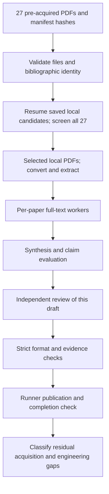
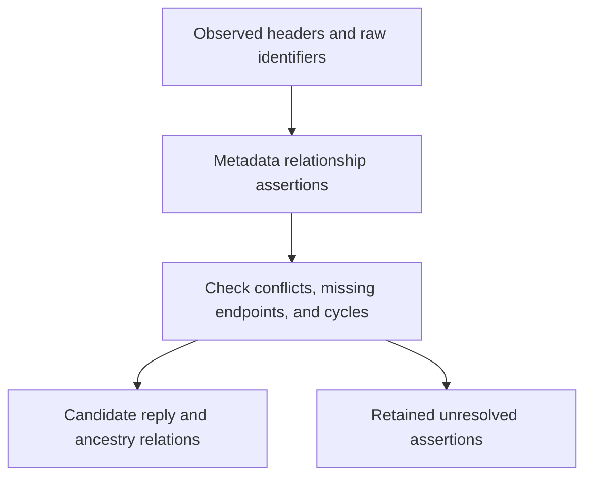
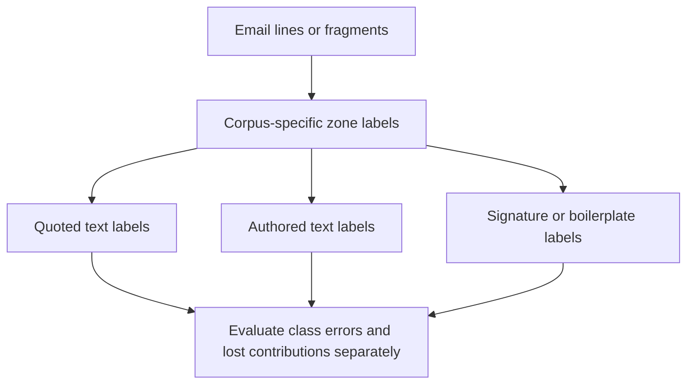
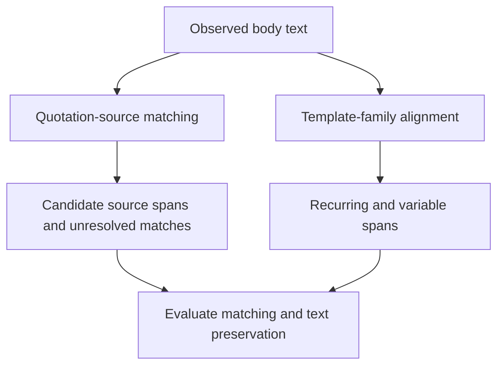
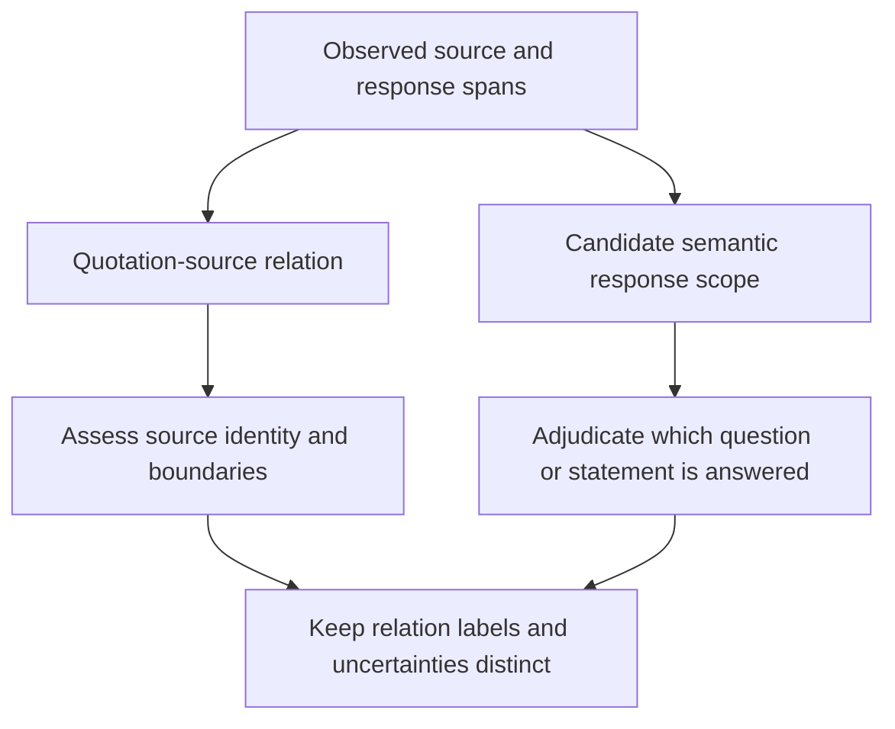
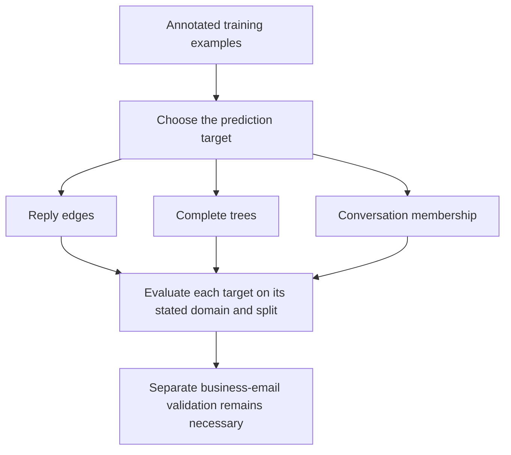
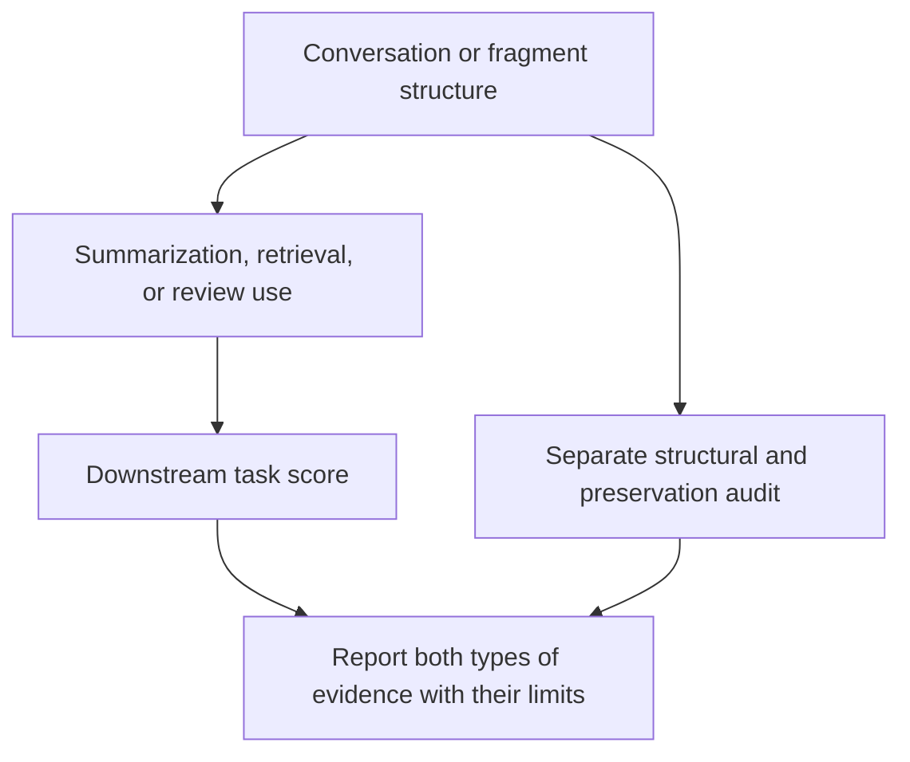
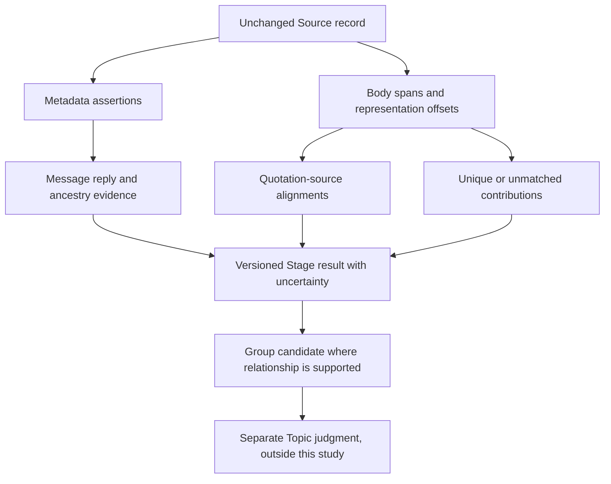

# Topic 01: Email conversation structure, branching, and inline replies

Research for msgloom. Recommendations are proposals for evaluation. They do not approve architecture changes.

## Contents

- [Round History](#round-history)
- [Executive Summary](#executive-summary)
- [Research Question](#research-question)
- [Methodology](#methodology)
- [Papers Reviewed](#papers-reviewed)
- [Research Landscape](#research-landscape)
- [Confidence-Graded Findings](#confidence-graded-findings)
- [Engineering Evidence](#engineering-evidence)
- [Assumption Map](#assumption-map)
- [Contradiction Map](#contradiction-map)
- [Practical Recommendations](#practical-recommendations)
- [Evaluation Plan](#evaluation-plan)
- [Synthetic Cases](#synthetic-cases)
- [Research Gaps](#research-gaps)
- [Risk Register](#risk-register)
- [Evidence Map and Traceability Appendix](#evidence-map-and-traceability-appendix)
- [References](#references)

## Round History

| Run | Scope | Verified activity | Status evidence |
| --- | --- | --- | --- |
| 101cf2285113 | Historical blocked acquisition run | No candidate corpus reached screening in that run | [Original state](../workflow_state.json) and [evaluation](../EVALUATION.md), preserved |
| 20260914T084949Z | One local-corpus analysis round | 27 pre-acquired PDFs screened; 24 selected full texts analyzed | [Current state](workflow_state.json); [validation](runs/20260914T084949Z/validate/validation_result.json) |

These are separate run histories. The blocked run is not counted as a completed research round. No new network paper search, citation expansion, or PDF acquisition was executed in this continuation. Further acquisition is outside this run's authorization.

## Executive Summary

### Recurring Mechanisms and Patterns

- **RQ3-EX1 Separate relation claims. Confidence: HIGH.** Treat a message reply edge, conversation membership, quote-source alignment and semantic response scope as separate claims. The corpus contains line labels, message trees, fragment graphs and Q–A links, each with different evidence. A Group remains distinct from a Topic; a branch does not prove sibling awareness. [E01](runs/20260914T084949Z/analysis/E01v1.analysis.md) [E02](runs/20260914T084949Z/analysis/E02v1.analysis.md) [E08](runs/20260914T084949Z/analysis/E08v1.analysis.md) [E10](runs/20260914T084949Z/analysis/E10v1.analysis.md) [E17](runs/20260914T084949Z/analysis/E17v1.analysis.md) [T04](runs/20260914T084949Z/analysis/T04v1.analysis.md)  Trace: E01:E01-F1; E02:F7; E08:F1; E10:F2; E17:F2; T04:F1.
The distinction is supported by source task definitions. Keeping these claims separate in msgloom is a research proposal consistent with the user’s constraints.
Limits: No selected study validates a complete, uncertain, multiple-parent business-email representation.

- **RQ2-EX2 Preserve before filtering. Confidence: HIGH.** High zoning accuracy does not establish preservation. E14 reports 5% body-line filtering loss, E09 reports reduced term recall after filtering, and E04 contains Author-to-quote/boilerplate errors. Keep complete source representations while testing labels and display reduction; unique and decision-bearing text loss still needs direct annotation. [E04](runs/20260914T084949Z/analysis/E04v1.analysis.md) [E09](runs/20260914T084949Z/analysis/E09v1.analysis.md) [E13](runs/20260914T084949Z/analysis/E13v1.analysis.md) [E14](runs/20260914T084949Z/analysis/E14v1.analysis.md)  Trace: E04:F6; E09:E09-F6; E13:E13-F4; E14:F1; E14:F3.
Body-line loss, term loss and unique decision-bearing loss have different denominators. The first two are measured in their source tasks; the last is not.
Limits: No zero-loss claim is supported. Correctly labeled quotations, signatures or disclaimers may still carry needed content.

- **RQ1-EX3 Combine cues without forced certainty. Confidence: MEDIUM.** Investigate standards-based header ancestry and conservative text matching as separate baselines. Subject, time and participant constraints reduce search, but they can miss changed subjects, long delays and partial histories. Missing-message quotations provide observed fragments; they do not prove complete original-message recovery. [E02](runs/20260914T084949Z/analysis/E02v1.analysis.md) [E03](runs/20260914T084949Z/analysis/E03v1.analysis.md) [E10](runs/20260914T084949Z/analysis/E10v1.analysis.md)  Trace: E02:F1; E02:F2; E02:F5; E03:F1; E03:F2; E10:F1; ENG-01; ENG-02.
RFC facts are ENGINEERING evidence. A combined, evidence-preserving method is an untested proposal; E02 itself leaves a hybrid method as future work.
Limits: Missing and conflicting identifiers, partial quotes and late evidence remain unresolved end-to-end.

- **RQ7-EX4 Measure each objective. Confidence: HIGH.** Report edge, ancestry, grouping, span alignment and preservation metrics separately. E02’s recall rises after the reference is filtered. T05 and T07 show that link and grouping scores can move in different directions. Quote-line accuracy, retrieval MAP, summary scores and human display answers cannot substitute for relation accuracy. [E02](runs/20260914T084949Z/analysis/E02v1.analysis.md) [E15](runs/20260914T084949Z/analysis/E15v1.analysis.md) [E16](runs/20260914T084949Z/analysis/E16v1.analysis.md) [T04](runs/20260914T084949Z/analysis/T04v1.analysis.md) [T05](runs/20260914T084949Z/analysis/T05v1.analysis.md) [T07](runs/20260914T084949Z/analysis/T07v1.analysis.md)  Trace: E02:F2; E15:F5; E16:E16-F1; T04:F3; T05:F2; T07:F2.
These are within-study scope and metric distinctions. They are not a pooled ranking of methods across incompatible datasets.
Limits: Exact grouping and link conventions differ even across related IRC papers; several source aggregation rules remain unspecified.

- **RQ5-EX5 Model complexity does not settle transfer. Confidence: HIGH.** Feature models remain useful controls. Neural email zoning shows cross-corpus and minority-class failures, while newer structural chat methods provide transfer hypotheses. T06’s 86.8 link F1 uses oracle reply counts; estimated capacities score 71.5–72.3, below its greedy 72.6 baseline. No selected paper measures Raspberry Pi 5 inference. [E06](runs/20260914T084949Z/analysis/E06v1.analysis.md) [E07](runs/20260914T084949Z/analysis/E07v1.analysis.md) [E13](runs/20260914T084949Z/analysis/E13v1.analysis.md) [E14](runs/20260914T084949Z/analysis/E14v1.analysis.md) [T06](runs/20260914T084949Z/analysis/T06v1.analysis.md) [T07](runs/20260914T084949Z/analysis/T07v1.analysis.md)  Trace: E06:F1; E06:F2; E07:E07-F4; E13:E13-F5; E14:F2; T06:T06-F1; T06:T06-F3; T06:T06-F6; T07:F1.
The numeric matching comparison is Ubuntu IRC only. This supports task-matched controls and deployment measurement, not a general claim that simpler models always win.
Limits: No direct LLM-assisted reconstruction evaluation appears in this selected corpus; no conclusion about all current literature follows.

- **RQ8-EX6 Readiness is HAS_GAPS. Confidence: HIGH.** The evidence is sufficient to define a controlled evaluation program, but it is not sufficient to approve a production architecture. The next work should test a minimal source-and-relation representation on authorized mailbox data, with unique/decision-bearing loss, abstention, HTML/plain-text alignment and arrival-order correction measured explicitly. [E02](runs/20260914T084949Z/analysis/E02v1.analysis.md) [E04](runs/20260914T084949Z/analysis/E04v1.analysis.md) [E10](runs/20260914T084949Z/analysis/E10v1.analysis.md) [E14](runs/20260914T084949Z/analysis/E14v1.analysis.md) [E17](runs/20260914T084949Z/analysis/E17v1.analysis.md) [T05](runs/20260914T084949Z/analysis/T05v1.analysis.md) [T06](runs/20260914T084949Z/analysis/T06v1.analysis.md)  Trace: E02:F5; E04:F6; E10:F2; E14:F3; E17:F2; T05:F6; T06:T06-F5.
HAS_GAPS is the synthesis readiness judgment for this corpus and msgloom’s stated requirements. No mailbox experiment or architecture approval occurred.
Limits: Targeted academic acquisition, exact artifact/license checks and arm64 runtime measurements remain follow-up work.

## Research Question

The objective is to recover reply and quotation relations while preserving unique contributions. A **Group** is not a **Topic**. A quote-source match, a reply edge, a semantic response, and conversation membership are distinct claims.

| RQ | Question |
| --- | --- |
| RQ1 | What metadata supports reply and ancestry reconstruction when identifiers are absent, malformed, duplicated, or conflicting? |
| RQ2 | How can original text, quotations, forwards, inline replies, signatures, and disclaimers be identified without losing decision-bearing text in HTML or plain text? |
| RQ3 | Can relations connect spans or multiple parent messages, with unresolved references and uncertainty preserved? |
| RQ4 | How can forks, missing ancestors, late arrivals, and corrections be represented and evaluated without inventing participant knowledge? |
| RQ5 | What evidence supports deterministic, statistical, neural, and LLM-assisted methods, and under what data and computational assumptions? |
| RQ6 | Which datasets and annotations cover email phenomena, and what leakage, licensing, availability, and domain-transfer limits remain? |
| RQ7 | How should reply edges, ancestry, grouping, quotation alignment, unique-span loss, abstention, and incremental correction be measured? |
| RQ8 | What minimal representation and evaluation experiments should msgloom investigate, and which decisions remain hypotheses? |

## Methodology

This is local-only round 1, run 20260914T084949Z, under the installed research-pipeline deep profile. All 27 manifest-governed pre-acquired PDFs were screened; 24 were selected and received full-text analyses: 18 DIRECT_EMAIL and six TRANSFER. E19, E20 and T02 were deprioritized and are not used as full-text evidence. The shortlist contains all 27 screening records; download=true selects the 24-paper evidence set.

The selected artifact years span 2003–2023. Some years come only from pre-acquisition metadata. January 1 timestamps and v1 are schema/local-artifact conventions, not verified publication dates or arXiv versions. The fixed corpus provides partial coverage; source_coverage.json has attempts=[] and records zero provider searches and zero network PDF downloads in this run. No claim of exhaustive or current 2024–2026 literature coverage follows.

Acquisition preceded this run. Local hashes and byte counts were checked against the manifest, selected PDFs were staged, and existing-file download handling avoided new PDF requests. The saved source URLs are acquisition provenance, not search receipts. The historical blocked run 101cf2285113 remains a separate, unsuccessful acquisition history and is not counted as a completed research round.

The bibliography uses the local artifact identity. E09 and E13 author lists were corrected. E14 is the 89-page master’s dissertation by João Bruno Morais de Sousa Jardim, not the separate three-author EACL paper. E15 is MSR-TR-2002-102 revised in January 2003 and containing CHI 2003 paper text. Manuscripts without venue/date imprints retain that uncertainty; hosting does not establish peer review. T03 placeholder DOI/ISBN values are excluded.

Semantic synthesis reads all 24 saved per-paper analysis JSON records and worker results. Short papers were read in full by their paper workers, with relevant original-PDF table checks. E14 research-specific Chapters 1 and 3–8 were read; generic Chapter 2 background was selectively skimmed as recorded in its read_scope. Converted text and PDF hashes identify the actual inputs. All source-reported experiments remain author results; no model, dataset or mailbox experiment was reproduced here.

The independent selected-worker audit reports 167 findings with source locators and 181 normalized, source-matched raw claims. Synthesis evidence IDs preserve each paper’s actual finding ID, namespaced by its stable local paper ID. The appendix links every cited finding to pages, sections and converted-text lines. Schema validity and citation linkage establish structural checks; they do not independently prove each scientific result.

DIRECT_EMAIL includes business email, public mailing lists, student mail, simulated email and email-specific template studies; it is not a claim that every dataset represents current business mail. TRANSFER comprises IRC/forum studies and remains separately labeled in all comparisons. E08 additionally trains its email question detector on speech. Shared Enron/Gmane/Ubuntu lineage and reused baselines mean 24 papers are not 24 independent replications.

Five separately saved RFC/Microsoft Graph sources supply ENGINEERING facts and are excluded from paper counts. Their saved hashes and access records are maintained under ../supporting/engineering. Standards establish syntax or baseline procedures; Graph field descriptions do not establish reliable parent edges, semantic response scope or lossless uniqueBody behavior.

The CLI’s initial summarize/extraction artifacts were deterministic fallbacks, not semantic evidence. Any later claim-enrichment score is heuristic and cannot replace full-text support, resolve a source contradiction or supply an unmeasured accuracy result. Workers inherited the active Codex runtime without an external LLM API; an exact historical worker model identifier is not separately attested.

The historical audit finds the blocked run/core/source files unchanged. Two earlier corpus-analysis launcher logs already differ from the early baseline; that drift is recorded without restoring or modifying them. This synthesis does not claim that every historical file matches the baseline. It does not change workflow state, application design, Topics 02–10 or architecture approval.

Confidence grades describe support for the scoped synthesis claim, not calibrated model probabilities. Source-described mechanisms remain distinct from tested performance and analyst proposals. Incompatible denominators, failed classes, oracle information, source arithmetic and unresolved annotation rules are retained. Academic gaps name targeted follow-up acquisition within this corpus; engineering gaps require separately authorized validation. No follow-up acquisition was executed.

[Run note](RUN_NOTE.md), [local-corpus validation](audit/corpus-validation.json), [bibliographic corrections](audit/bibliographic-intake.json), [ID/provenance mapping](audit/paper-id-map.json), [screening decisions](runs/20260914T084949Z/screen/screening-decisions.md), and [resume coverage](runs/20260914T084949Z/search/source_coverage.json) provide the audit trail. The complete source manifests remain unchanged.

## Papers Reviewed

### Scope and Corpus

The evidence set contains 24 full-text artifacts. Evidence from email and from transfer domains remains separate. Publication type comes from the local artifact; a hosting URL does not prove peer review. Availability statements below are what the paper reports. No code/data URL or license was verified through a new network request.

| ID | Paper and year | Domain / role | Artifact / venue | Data, annotation and split | Code / data / license | Reading scope |
| --- | --- | --- | --- | --- | --- | --- |
| [E01](runs/20260914T084949Z/analysis/E01v1.analysis.md) | Learning to Extract Signature and Reply Lines from Email (2004; manifest year, no local date imprint) | DIRECT_EMAIL; Line-label baseline | research manuscript; no venue imprint in local PDF; No venue imprint in local artifact | 1,203 plain-text messages from 20 Newsgroups and personal inboxes; line labels on 617 signature-bearing messages (33,013 lines). Five-fold message-level CV; thread/quote-family separation unreported. | Minorthird toolkit URL reported; exact experiment and labeled subset release unreported. Code/data licenses unreported. No links accessed or experiments reproduced in this local run. | Full local paper and references; original PDF/table checks and exact reading ranges recorded in per-paper read_scope. |
| [E02](runs/20260914T084949Z/analysis/E02v1.analysis.md) | Email Thread Reassembly Using Similarity Matching (2006) | DIRECT_EMAIL; Header and content reconstruction | conference paper; CEAS 2006 – Third Conference on Email and Anti-Spam | Enron: 1,361,403 raw and 269,257 cleaned unique messages. Main reference: 3,705 Thread-Index proxy threads; 20-root manual and 1,000-email splitter checks. No independent held-out split. | Public Enron source reported. Exact cleaned snapshot, proxy labels, code and licenses unreported. No links accessed or experiments reproduced in this local run. | Full local paper and references; original PDF/table checks and exact reading ranges recorded in per-paper read_scope. |
| [E03](runs/20260914T084949Z/analysis/E03v1.analysis.md) | Email Conversations Reconstruction Based on Messages Threading for Multi-person (2008) | DIRECT_EMAIL; Metadata reconstruction and placeholders | workshop paper; 2008 International Workshop on Education Technology and Training & 2008 International Workshop on Geoscience and Remote Sensing | Four research-team students, December 2007–June 2008: 1,067 deduplicated messages and 613 subject-defined conversations. No held-out split or independent edge-annotation protocol. | Own code, four-student corpus and licenses not reported released; cited Grendel/Zawinski is a baseline resource. No links accessed or experiments reproduced in this local run. | Full local paper and references; original PDF/table checks and exact reading ranges recorded in per-paper read_scope. |
| [E04](runs/20260914T084949Z/analysis/E04v1.analysis.md) | Segmenting Email Message Text into Zones (2009) | DIRECT_EMAIL; Functional-zone annotation and errors | conference paper; 2009 Conference on Empirical Methods in Natural Language Processing | Almost 400 Enron messages; 11,881 annotated lines, 7,922 nonblank classification lines, nine zones, one annotator. Ten-fold CV; fold unit and thread separation unreported. | Annotated sample URL reported; system release announced. Source code and code/data license terms unconfirmed in the paper. No links accessed or experiments reproduced in this local run. | Full local paper and references; original PDF/table checks and exact reading ranges recorded in per-paper read_scope. |
| [E05](runs/20260914T084949Z/analysis/E05v1.analysis.md) | Auto-Grouping Emails For Faster E-Discovery (2011) | DIRECT_EMAIL; Thread membership and duplicate grouping | journal/proceedings article; Proceedings of the VLDB Endowment, Vol. 4, No. 12 | Enron thread retrieval uses 100 seeds and a judged union of two systems; unnamed 1,000-email set uses 50 seeds. Separate 641-message template test and fixed-order three-person review study. | Raw/annotated Enron resources cited. Exact subsets, rules, derived labels and code release unreported; licenses unreported. No links accessed or experiments reproduced in this local run. | Full local paper and references; original PDF/table checks and exact reading ranges recorded in per-paper read_scope. |
| [E06](runs/20260914T084949Z/analysis/E06v1.analysis.md) | Headerless, Quoteless, but not Hopeless? Using Pairwise Email Classification to Disentangle Email Threads (2013; manifest year, no local date imprint) | DIRECT_EMAIL; Content-only membership classification | conference-style manuscript; no venue imprint in local PDF; No venue imprint in local artifact | Enron-derived 209,063 messages in 70,178 threads; quote-based extraction omits other branches. Thread-disjoint ten-rotation 80/10/10 splits; balanced, similarity-matched and 10%-positive pair sets. | Derived corpus URL reported; experiment code unreported. Source Enron public-domain assertion is the paper’s claim; no separate derived-corpus license is supplied. No links accessed or experiments reproduced in this local run. | Full local paper and references; original PDF/table checks and exact reading ranges recorded in per-paper read_scope. |
| [E07](runs/20260914T084949Z/analysis/E07v1.analysis.md) | Bringing Back Structure to Free Text Email Conversations with Recurrent Neural Networks (2018; manifest year, no local date imprint) | DIRECT_EMAIL; Neural zoning and email-domain transfer | research manuscript; no venue imprint in local PDF; No venue imprint in local artifact | Enron 800 emails (500/200/100 Train/Test/Eval) and ASF 500 (350/100/50). Mailbox/list-separated sampling; quoted-text and thread disjointness unverified; Test/Eval mapping ambiguous. | Quagga code and annotations reported at GitHub. Commit, environment, licenses and current accessibility unverified. No links accessed or experiments reproduced in this local run. | Full local paper and references; original PDF/table checks and exact reading ranges recorded in per-paper read_scope. |
| [E08](runs/20260914T084949Z/analysis/E08v1.analysis.md) | Detection of Question-Answer Pairs in Email Conversations (2004; manifest year, no local date imprint) | DIRECT_EMAIL; Paragraph question–answer relations | conference-style manuscript; no venue imprint in local PDF; No venue imprint in local artifact | Question training: 10,000 SWITCHBOARD utterances; email test: balanced 600 speech acts. ACM email: about 300 threads/1,000 messages; two annotators; QA five-fold grouping unreported. | SWITCHBOARD resource linked. ACM sample, QA labels, code and licenses unreported released. Speech training is a transfer component within this email study. No links accessed or experiments reproduced in this local run. | Full local paper and references; original PDF/table checks and exact reading ranges recorded in per-paper read_scope. |
| [E09](runs/20260914T084949Z/analysis/E09v1.analysis.md) | Email Data Cleaning (2005) | DIRECT_EMAIL; Cleaning and downstream text-loss evidence | conference paper; KDD’05 | 5,565 annotated emails/newsgroup messages from 14 sources; 5,000 in five-fold cleaning CV (fold unit unreported). BR 310/J2EE 255 are held-out source collections for term extraction. | SVM-light dependency and source collection URLs reported; full cleaner and exact annotated benchmark release unreported. Code/data licenses unreported. No links accessed or experiments reproduced in this local run. | Full local paper and references; original PDF/table checks and exact reading ranges recorded in per-paper read_scope. |
| [E10](runs/20260914T084949Z/analysis/E10v1.analysis.md) | Summarizing Email Conversations with Clue Words (2007) | DIRECT_EMAIL; Fragment graph and hidden quoted content | conference paper; WWW 2007 | 20 Enron conversations, 110 emails, 741 evaluated sentences; five student summaries per conversation. Sentence-level and leave-one-conversation-out protocols differ; no gold graph/span labels. | Exact 20-conversation labels, executable code and licenses not reported released. Cited hidden-email work is a separate acquisition lead. No links accessed or experiments reproduced in this local run. | Full local paper and references; original PDF/table checks and exact reading ranges recorded in per-paper read_scope. |
| [E11](runs/20260914T084949Z/analysis/E11v1.analysis.md) | Summarizing Emails with Conversational Cohesion and Subjectivity (2008) | DIRECT_EMAIL; Sentence expansion and task-specific salience | conference paper; ACL-08: HLT | 39 Enron conversations with at least four emails and 1,394 sentences; 50 summarizers, five per conversation. No reported train/dev/test split; no gold reply or quote-span labels. | Raw Enron and named lexicons/tools cited; own code, exact annotations and license terms unreported. No links accessed or experiments reproduced in this local run. | Full local paper and references; original PDF/table checks and exact reading ranges recorded in per-paper read_scope. |
| [E12](runs/20260914T084949Z/analysis/E12v1.analysis.md) | Detection of imperative and declarative question–answer pairs in email conversations (2012) | DIRECT_EMAIL; Sentence-level requests and answer scope | journal article; AI Communications 25 (2012) 271–283; IOS Press | Enron/CSpace: balanced 700-sentence question test; four QA annotators, about 90 QA threads per main annotator and 23 common threads. Five-fold/50-repeat QA split unit and pair totals unreported. | Raw corpora reported available. Exact QA annotations and code release unreported; no applicable code/data license supplied. No links accessed or experiments reproduced in this local run. | Full local paper and references; original PDF/table checks and exact reading ranges recorded in per-paper read_scope. |
| [E13](runs/20260914T084949Z/analysis/E13v1.analysis.md) | Crawling and Preprocessing Mailing Lists At Scale for Dialog Analysis (2020) | DIRECT_EMAIL; Mailing-list zoning, scale and transfer limits | conference paper; 58th Annual Meeting of the Association for Computational Linguistics | 153,310,330 usable Gmane emails are a source-reported crawl, not human gold. Supervised sample: 3,033 emails/170,309 lines, 300 validation emails; separate 300-email Enron evaluation. Independent Gmane test unclear. | Chipmunk code/model and data access pages reported. Dataset access restricted to researchers/academic institutions; further non-academic distribution prohibited by the paper. Separate code/model licenses unreported. No links accessed or experiments reproduced in this local run. | Full local paper and references; original PDF/table checks and exact reading ranges recorded in per-paper read_scope. |
| [E14](runs/20260914T084949Z/analysis/E14v1.analysis.md) | Multilingual Email Zoning (2021) | DIRECT_EMAIL; Multilingual zoning dissertation and preservation limits | master’s dissertation; NOVA Information Management School, Universidade Nova de Lisboa | CLEVERLY reports 15,547 tickets, but language/split rows sum to 15,457; 14 client accounts, five languages. Public 625-email PT/ES/FR benchmark has two annotators. Reused Enron/ASF/Gmane partitions have count conflicts. | New multilingual corpus and project repository linked; explicit OKAPI code release unconfirmed in dissertation. Private CLEVERLY data/workload release and all relevant licenses unreported. No links accessed or experiments reproduced in this local run. | Research-specific dissertation scope: title/abstract and Chapters 1, 3–8; PDF pp. 1–7,14–18,35–89. Generic Chapter 2 selectively skimmed; exact ranges in read_scope. |
| [E15](runs/20260914T084949Z/analysis/E15v1.analysis.md) | Understanding Sequence and Reply Relationships within Email Conversations: A Mixed-Model Visualization (2003) | DIRECT_EMAIL; Sequence versus reply visualization | technical report containing CHI 2003 paper text; Microsoft Research Technical Report MSR-TR-2002-102; paper page prints CHI 2003 | Six Outlook knowledge workers; simulated messages, seven tasks and two post-training screenshots. 72 sequence and 84 tree answers are repeated human responses, not edge examples. | Working prototype and layout pseudocode described. Source code, study data, raw responses and licenses not reported released. No links accessed or experiments reproduced in this local run. | Full local paper and references; original PDF/table checks and exact reading ranges recorded in per-paper read_scope. |
| [E16](runs/20260914T084949Z/analysis/E16v1.analysis.md) | Applying the Annotation View on Messages for Discussion Search (2005) | DIRECT_EMAIL; Quote context versus inline-association loss | TREC participant report; TREC 2005 Enterprise Track discussion search task | TREC 2005 W3C email topical-relevance retrieval. Corpus/query totals and split unreported; 3,445 Relevant Documents is a relevance count, not corpus size. Corrected reruns follow an IDF bug fix. | HySpirit and trec_eval URLs reported; parser, complete corrected experiment, task data license and code release unreported. No links accessed or experiments reproduced in this local run. | Full local paper and references; original PDF/table checks and exact reading ranges recorded in per-paper read_scope. |
| [E17](runs/20260914T084949Z/analysis/E17v1.analysis.md) | A semantic framework for modelling quotes in email conversations (2010; manifest year, no local date imprint) | DIRECT_EMAIL; Quote/response blocks and inline use | research manuscript; no venue imprint in local PDF; No venue imprint in local artifact | January–March 2010 LOD 554/MF 275 messages manually classified by reply style; OWL archive demonstration processes 7,074 messages. No gold span extraction or held-out accuracy test. | Public W3C archives and SIOC Quotes vocabulary linked; custom extractor, exact annotations, RDF snapshot and licenses unreported released. No links accessed or experiments reproduced in this local run. | Full local paper and references; original PDF/table checks and exact reading ranges recorded in per-paper read_scope. |
| [E18](runs/20260914T084949Z/analysis/E18v1.analysis.md) | Template Induction over Unstructured Email Corpora (2017) | DIRECT_EMAIL; Template alignment and repeated-text risks | conference paper; WWW 2017 | Synthetic phrase/gap corpora plus 125,104 Enron sent emails from 316 sender-address entities. Templates evaluated on contributing messages, without held-out template/author split. Timing clusters reach 33,000 emails. | Enron source link reported; code, generator, exact subset and data licenses unreported. Article CC-BY-NC-ND 2.0 notice does not license code/data. No links accessed or experiments reproduced in this local run. | Full local paper and references; original PDF/table checks and exact reading ranges recorded in per-paper read_scope. |
| [T01](runs/20260914T084949Z/analysis/T01v1.analysis.md) | You talking to me? A Corpus and Algorithm for Conversation Disentanglement (2008) | TRANSFER; TRANSFER: clustering ambiguity and local cues | conference paper; ACL-08: HLT | Single Linux IRC channel: 706 development, 800 test and 359 pilot utterances; six retained test annotations. Flat one-conversation labels. Classifier fitting unclear; baselines tuned on test. | Future code/data release promised at author URL; release snapshot and licenses unverified. No links accessed or experiments reproduced in this local run. | Full local paper and references; original PDF/table checks and exact reading ranges recorded in per-paper read_scope. |
| [T03](runs/20260914T084949Z/analysis/T03v1.analysis.md) | Thread Reconstruction in Conversational Data using Neural Coherence Models (2017) | TRANSFER; TRANSFER: whole-tree coherence | workshop manuscript, arXiv v2 copy; SIGIR 2017 Workshop on Neural Information Retrieval (Neu-IR’17) | 2,200 CNET forum threads with fewer than six posts: 1,500 train, 200 dev, 500 test by subtraction. Gold post trees; annotation details, duplicate controls and exact subset release unreported. | Prior CNET data availability cited; no own code or exact split URL. Licenses unreported. Local ACM DOI/ISBN strings are placeholders. No links accessed or experiments reproduced in this local run. | Full local paper and references; original PDF/table checks and exact reading ranges recorded in per-paper read_scope. |
| [T04](runs/20260914T084949Z/analysis/T04v1.analysis.md) | A Large-Scale Corpus for Conversation Disentanglement (2019) | TRANSFER; TRANSFER: multi-parent gold graph and group metrics | arXiv manuscript, version 2; No venue imprint in local artifact | 77,563 IRC messages: Ubuntu 74,963 and Linux 2,600. Temporal samples; adjudicated dev/test; most training singly annotated. Table training subset 18,963 conflicts with prose 18,924; supplementary material not read. | Corpus/project and annotation-tool URLs reported; own model release and license terms not explicit in this artifact. No links accessed or experiments reproduced in this local run. | Full local paper and references; original PDF/table checks and exact reading ranges recorded in per-paper read_scope. |
| [T05](runs/20260914T084949Z/analysis/T05v1.analysis.md) | Online Conversation Disentanglement with Pointer Networks (2020) | TRANSFER; TRANSFER: online pointer and root decisions | arXiv manuscript, version 1; No venue imprint in local artifact | DSTC8 Ubuntu split reports 52,641/2,145/4,265 train/dev/test links, not message counts. Self plus 50 prior candidates; one decoded parent despite multiple-parent labels. Exact-group metric excludes singletons. | Method and baseline GitHub URLs and test-label resource reported. Versions, code/data licenses, state resets and split-overlap checks unreported. No links accessed or experiments reproduced in this local run. | Full local paper and references; original PDF/table checks and exact reading ranges recorded in per-paper read_scope. |
| [T06](runs/20260914T084949Z/analysis/T06v1.analysis.md) | Findings on Conversation Disentanglement (2021; manifest year, no local date imprint) | TRANSFER; TRANSFER: feature baselines and oracle gap | conference-style manuscript; no venue imprint in local PDF; No venue imprint in local artifact | Ubuntu train/validation/test: 67,463/2,500/5,000 annotated utterances in 153/10/10 logs. Fifty candidates include self; training drops 1.5% without a parent and selects latest among multiple parents. | Named corpus and dependency URLs; paper-specific code/data access statement and licenses unreported. V100 training results do not measure arm64 inference. No links accessed or experiments reproduced in this local run. | Full local paper and references; original PDF/table checks and exact reading ranges recorded in per-paper read_scope. |
| [T07](runs/20260914T084949Z/analysis/T07v1.analysis.md) | End-to-End Deep Reinforcement Learning for Conversation Disentanglement (2023) | TRANSFER; TRANSFER: structural reward and metric disagreement | conference paper; The Thirty-Seventh AAAI Conference on Artificial Intelligence (AAAI-23) | Ubuntu Table 1 train/dev/test: 220,463/12,500/15,000 messages; prose calls train count a total. Manual 77,563-message count is not reconciled. Evaluation tables do not explicitly name split. | Method and Structural BERT repositories reported; standalone data URL, commits, versions and code/data licenses unreported. No links accessed or experiments reproduced in this local run. | Full local paper and references; original PDF/table checks and exact reading ranges recorded in per-paper read_scope. |

### Evidence Matrix

Published numbers must be read with their task, metric, unit, split and dataset. None of the transfer results below is an email performance result. No msgloom benchmark or latency test was executed.

| Paper | Method and assumptions | Dataset / task / verified result | Important limitation |
| --- | --- | --- | --- |
| E01 | Quote-marker rules; linear and sequential line classifiers; Plain text; extraction conditional on signature-bearing messages | Quoted-line baseline P/R/F1 99.92/71.09/83.08%; windowed CRF 98.17/96.15/97.15%, line accuracy 99.04%, five-fold CV on 617 messages; §5 Table 5, PDF p. 6. Joint accuracy 98.91% conflicts with diagonal sum 98.89%. Trace: E01:E01-F4; E01:E01-F5; E01:E01-F6. | Line labels do not identify quote sources. Other→reply 0.26% and other→signature 0.09% use all-line denominators; no unique-loss rate. |
| E02 | Thread-Index heuristic; subject/time/participant-constrained Jaccard matching; Known roots; one parent; 14-day/root-subject restriction; complete quotations for missing content | Paper-defined relation recall 0.5976 on 3,705 proxy threads; 0.8739 only after time+subject reference filtering (3,045 threads). Mean per-thread recall 0.7184/0.8949. §5/Table 3, PDF pp. 5–6; splitter 98% of 1,000 emails excludes interleaving. Trace: E02:F2; E02:F4; E02:F5. | No precision; duplicate expansion and missing-intermediate credit differ from exact parent edges. Recovery counts are unscored outputs; source arithmetic conflicts. |
| E03 | Header extraction, dummy mapping, subject-based split/merge; Single-parent tree; nearest send time and participant constraints | 1,067 messages/613 subject-defined conversations: P_ct and P_rk both >92.02%; false-alarm F_ncd 5.55%. §5, PDF pp. 3–5. No exact per-bar values or aggregate ART error are supplied. Trace: E03:F4; E03:F5; E03:F6. | Conversation metrics are not standard edge precision; Equation 4 union conflicts with plotted ordering. Forged times and mapping errors remain. |
| E04 | SVM line/fragment zoning with graphic and word features; One zone per nonblank line; fragment gold uses modal line label | Ten-fold CV on 7,922 nonblank Enron lines: 2/3/9-zone accuracy 93.60/91.53/87.01%. Nine-zone boundary P/R 22.5/90.15%. §4–5, Tables 1–4, PDF pp. 6–9. Trace: E04:F2; E04:F3; E04:F6. | Fold unit unknown; 96 Author lines→Reply/Forward and 77→boilerplate are conditional deletion risks, not labeled unique-text loss. |
| E05 | Segment fingerprints, approximate containment, root-segment retrieval; Repeated segments identify a group; new insertions can count as small variations | Thread retrieval prose reports P 0.91 vs 0.62 and F1 about 0.8 vs 0.7 against subjects, with lower recall; dataset/aggregation attribution is unclear. §6.3/Figs. 8–9. Separate six-template/641-message test has precision 1.0 at 50% match. Trace: E05:F1; E05:F3; E05:F4; E05:F6. | Large reference is two-system judged union; no parent-edge or preservation metric. Finance RB inferiority contradicts universal superiority prose. |
| E06 | Content-feature logistic regression on unquoted, headerless pairs; Same-thread membership; automatically extracted quote-chain labels | Ten thread-disjoint rotations: content F1 0.78±0.03 on random balanced, 0.65±0.04 on similarity-balanced, 0.38±0.06 on 10%-positive random pairs (accuracy 0.92±0.01). §4/Table 3, PDF pp. 4–6. Trace: E06:F1; E06:F2; E06:F3; E06:F5. | Prevalence and minimum-length conditions differ; no directed edge or whole-graph test. Chance RI F1=0.90 is an unresolved source anomaly. |
| E07 | Character CNN embeddings and bidirectional GRU-CRF; 100-character line input; one zone per line; inline copied/new text shares body block | Table 2 two/five-zone accuracy: Enron 0.98/0.93, ASF 0.98/0.95; ASF→Enron 0.86/0.80 and Enron→ASF 0.94/0.86. §5, PDF p. 10. Target-matched drops are 4–13 points, not unqualified 4–10%. Trace: E07:E07-F2; E07:E07-F3; E07:E07-F4. | Exact scored subset/averaging unclear; adapted baselines and different labels. No quote-source or unique-text metric. |
| E08 | Ripper question detector and paragraph QA classifier; Existing In-Reply-To threads; annotated answered questions; original later segments | ACM Union five-fold answer-pair P/R/F1 0.698/0.619/0.656; candidate-count split 0.728/0.732/0.730. §4, Tables 4–5, PDF p. 6. Question detection is a separate speech-trained task. Trace: E08:F1; E08:F4; E08:F5; E08:F6. | Fold unit unknown; unanswered questions omitted; paragraph gold and rare quote responses. Prose 92/142 QA pairs versus table positives 89/139 unresolved. |
| E09 | SVM block/line-break detection plus quote-prefix and normalization rules; Plain text; source-specific non-text definitions | Five-fold cleaning CV: quoted-line P/R/F1 98.18/92.01/95.00%. Held-out BR/J2EE term F1 after cleaning 88.9/62.0%, from 63.0/49.7%. §6, Tables 3–4, PDF pp. 7–9. Trace: E09:E09-F3; E09:E09-F4; E09:E09-F5; E09:E09-F6; E09:E09-F7. | Non-text filtering lowers term recall on both datasets; necessary line-break removal causes errors. Term F1 is not decision preservation; introductory gain range conflicts. |
| E10 | Substring-aligned fragment quotation graph and clue-word summary ranking; Quote markers; adjacent quote blocks are potential reply targets; folder-wide matching | 20 Enron conversations: about 18% of 88 overall-essential sentences come from hidden emails; at 15% summary length CWS misses every essential sentence in 5/20 conversations. §5.2/§6.4, PDF pp. 6,9. Trace: E10:F1; E10:F2; E10:F3; E10:F5; E10:F7. | Hidden material is quoted fragments. Summary/random-graph comparisons do not validate reply edges; sentence versus conversation splits change ranking results. |
| E11 | Expand fragment edges to all sentence pairs; clue, semantic and subjectivity ranking; Heuristic fragment links inherited by sentences | 39 Enron conversations: mean sentence-pyramid precision CWS 0.60, CWS+OpFind 0.65, CWS+OpBear 0.64 across five summary lengths. §6/Tables 1–3, PDF pp. 7–8. Trace: E11:F1; E11:F2; E11:F3; E11:F4; E11:F5; E11:F6. | Salience scores do not validate response scope; some ROUGE comparisons p=0.06 and Bonferroni wording is unresolved. Timing units differ. |
| E12 | Question regexes; sentence QA features, rules and linear regression; Preassembled threads; one selected answer; answer reuse capped at two questions | Balanced 700-sentence question test Regex F1 0.907. QA Heuristic-LR LCS F1 0.4982/0.5670 for two main annotators; their SM F1 is 0.6021/0.4597. §4/Tables 1,5–6, PDF pp. 6,9. Trace: E12:F1; E12:F2; E12:F3; E12:F4; E12:F7. | LCS permits partial answers; no unique-span loss measurement. Five-fold/50-repeat aggregation unclear; Table 9 mean 316/median 1320 ms is internally inconsistent. |
| E13 | Chipmunk Bi-GRU/CNN line labeling with local context; 15 semantic classes plus empty; 12-word line limit; altered baselines | Gmane/300-email Enron overall accuracy 0.96/0.88. Enron log-data recall 0.24 vs adapted Quagga 0.74; MUA-signature recall 0.65. Gmane section-heading recall 0.125 and paragraph→quotation 0.008. §4.2/Tables 1–2, PDF pp. 5,8. Trace: E13:E13-F2; E13:E13-F3; E13:E13-F4; E13:E13-F5. | Independent Gmane test and blank-line denominator unclear. No precision or unique-loss metric; absent Enron patch entries are dashes, not zero recall. |
| E14 | Frozen XLM-R line embeddings, BiLSTM-CRF; multilingual zoning; CLEVERLY quoted-suffix labels; line metrics and reused public splits | CLEVERLY weighted line F1 0.93; body recall 0.95 and explicit 5% body-line filtering loss; attachment recall 0.13. PT/ES/FR Table 5.11 accuracy 0.91/0.92/0.93; Spanish prose says 0.93. PDF pp. 69–71,75. Trace: E14:F1; E14:F3; E14:F5; E14:F6; E14:F7. | No decision-loss or inline-preservation audit; Table 5.4 supports invalid. Mean 1.22 s/ticket lacks hardware; downstream accuracy stays 0.71. |
| E15 | Combined chronological and reply-tree display; Existing single-parent tree and generated conversations | Post-training screenshot questions: sequence 65/72 correct (90% reported), tree 81/84 (96% reported), from six participants. Table 1/Results, PDF pp. 7–8. Trace: E15:F1; E15:F3; E15:F4; E15:F5; E15:F6; E15:F7. | Human repeated responses are not algorithm edge accuracy; no control condition. Quote stripping and timestamp repairs lack fidelity evaluation. |
| E16 | Probabilistic retrieval with merged new text, quote context and highlights; Predecessor chain; quote depth maps source; merged segments lose local associations | Corrected W3C retrieval reruns: MAP 0.2565 whole-message, 0.2816 strong context, 0.3174 best combined. Strong highlight P@5 improves to 0.5186 but MAP falls to 0.2460. Tables 1–3, PDF pp. 11–12. Trace: E16:E16-F1; E16:E16-F3; E16:E16-F4; E16:E16-F5; E16:E16-F6. | Retrieval relevance is not edge/quote correctness; parser explicitly loses quote-to-inline-comment association. Some later runs not submitted. |
| E17 | RDF Quote/Response/Block model; regex extractor; OWL property chains; Reply metadata and quote blocks guide source/authorship inference | LOD inline replies 287/449 (63.92%); Media Fragments 145/200 (72.50%), January–March 2010. OWL archive produces 10,146 blocks from 7,074 messages in about 40 s. Table 1/§4.1, PDF pp. 2,5. Trace: E17:F1; E17:F2; E17:F3; E17:F4; E17:F5. | Extraction counts lack gold accuracy; other Table 1 category totals conflict. Demonstrated +1 query is not semantic approval validation. |
| E18 | Within-sender template clustering, suffix arrays and nonoverlapping phrase alignment; English and quote-only filtering; corpus-member induction/evaluation | Enron body/subject edit-distance correlation 0.31 within induced clusters; Figures 2/5 qualitatively favor suffix arrays for coverage/fragmentation. §4, PDF pp. 7–9. No tabulated held-out semantic accuracy. Trace: E18:F1; E18:F2; E18:F3; E18:F4; E18:F5; E18:F6; E18:F7. | Repeated fixed phrases do not prove expendability. Undefined SIM and omitted alignment details; 35-word saving is a projection. |
| T01 | TRANSFER: MaxEnt pair scores and greedy flat clustering; 129-second chat window; one conversation per utterance | 800-utterance IRC test: system one-to-one/loc_3 40.62/72.75%; human means 52.98/81.09%. §3/§5 Tables 1/3, PDF pp. 4,7. Local and global agreement differ. Trace: T01:F1; T01:F2; T01:F3; T01:F5. | No directed reply/spans. Test-tuned baselines and unclear classifier fitting; shared visibility in chat differs from email recipients. |
| T03 | TRANSFER: CNN coherence scores entire candidate trees; Supplied CNET thread, fewer than six posts, chronological single-parent trees | Derived 500-thread test: exact tree accuracy 26.40%; edge F1 60.55 and accuracy 66.12%. All-previous gives 20.00%, 58.45, 65.62%, respectively. Table 4, PDF p. 5. Trace: T03:F1; T03:F2; T03:F3; T03:F5; T03:F6. | Edge averaging/denominator unclear; exhaustive candidate enumeration is not a measured scalable or email method. |
| T04 | TRANSFER: manual multi-parent reply graphs; feature rankers and ensembles; IRC connected components define conversations; self-link starts | Ubuntu test Feedforward link/exact-conversation F1 72.3/36.2; ten-model vote 73.5/38.0; intersect exact-conversation P/R 67.0/21.1. Tables 3–4, PDF pp. 6–7. Trace: T04:F1; T04:F2; T04:F3; T04:F6. | Different error targets and precision/coverage tradeoff; IRC short-gap statistics are not email parent-window recall. |
| T05 | TRANSFER: BiLSTM pointer, metadata interactions and joint membership objective; One parent from self plus 50 prior utterances; singleton-excluding exact groups | DSTC8 Ubuntu Table 2 bare pointer link/group F1 73.7/36.0; joint+threshold 73.1/44.5. Table 4 gold-self-link oracle raises group F1 36.0→54.9 using its own link baseline 74.1. PDF pp. 7–8. Trace: T05:F1; T05:F2; T05:F3; T05:F4; T05:F6. | Root oracle is not deployable. Tables disagree, self-link subtype percentages sum to 110%, and some P/R/F1 triples are inconsistent. |
| T06 | TRANSFER: BERT+manual features, auxiliary thread training and matching; Fifty candidates including self; one parent; reply-count capacities in whole-log matching | Ubuntu Table 3 link F1: MF 69.8, BERT 47.3, BERT+MF 72.6. Table 6 oracle matching 86.8; estimated capacity 72.3/72.3/71.5. PDF pp. 5,8. Tables do not explicitly name scored split. Trace: T06:T06-F1; T06:T06-F3; T06:T06-F4; T06:T06-F5; T06:T06-F6. | Estimated variants do not beat greedy 72.6. V100 training memory/throughput cannot establish CPU/arm64 inference. |
| T07 | TRANSFER: Structural BERT policy, REINFORCE and path-overlap reward; One parent; 50-message window; root-to-leaf reward paths may overlap | Ubuntu Table 2 RL link/group F1 83.3/51.9 vs Structural BERT 75.4/47.1. Table 3 ARI/VI rewards improve both clustering scores while link/group F1 fall. PDF p. 6; scored split unspecified. Trace: T07:F1; T07:F2; T07:F3; T07:F4; T07:F5; T07:F6. | No significance or email test. Prose only-optimized-metric claim contradicted; reward overlap is not multiple-parent output or proof of universal edge equivalence. |

## Research Landscape

### Taxonomy of Approaches

The diagrams separate the target relations and evaluation tasks. Validation steps describe proposed checks; they do not claim that a cited paper executed every step.

**RQ1-TAX1 Metadata ancestry. Confidence: HIGH.** Header-driven methods construct message ancestry from identifiers and references, with subject, time and participant heuristics used for repair or merging. E02’s historical Thread-Index observations and E03’s dummy mapping are useful baselines; neither supplies a general truth test for conflicting metadata. [E02](runs/20260914T084949Z/analysis/E02v1.analysis.md) [E03](runs/20260914T084949Z/analysis/E03v1.analysis.md)

Observed headers and inferred links are different evidence objects.
Limits: Timestamp order and same subject do not establish causality or Topic identity.
Trace: E02:F1; E02:F6; E03:F1; E03:F2; E03:F3.

**RQ2-TAX2 Line zoning. Confidence: HIGH.** Functional zoning assigns classes within a message. E01/E09 use line features and rules; E04 compares lines and fragments; E07/E13 use character or token neural context; E14 adds multilingual contextual embeddings. Label meanings differ, especially for quoted history, inline replies, signatures and forwards. [E01](runs/20260914T084949Z/analysis/E01v1.analysis.md) [E04](runs/20260914T084949Z/analysis/E04v1.analysis.md) [E07](runs/20260914T084949Z/analysis/E07v1.analysis.md) [E09](runs/20260914T084949Z/analysis/E09v1.analysis.md) [E13](runs/20260914T084949Z/analysis/E13v1.analysis.md) [E14](runs/20260914T084949Z/analysis/E14v1.analysis.md)

A zone is a content label, not a source-message or response relation.
Limits: Flat or modal labels can hide mixed content; benchmark scores require the original label schema.
Trace: E01:E01-F1; E04:F1; E07:E07-F1; E07:E07-F2; E09:E09-F1; E13:E13-F2; E14:F1.

**RQ2-TAX3 Quotation and template matching. Confidence: HIGH.** String overlap, fingerprints and suffix arrays expose repeated material at different units. E02 compares quotes with candidate reply text; E05 retrieves thread members from root segments; E10 splits shared fragments; E18 aligns fixed template phrases. Quote-source matching, thread membership and template alignment remain distinct outputs. [E02](runs/20260914T084949Z/analysis/E02v1.analysis.md) [E05](runs/20260914T084949Z/analysis/E05v1.analysis.md) [E10](runs/20260914T084949Z/analysis/E10v1.analysis.md) [E18](runs/20260914T084949Z/analysis/E18v1.analysis.md)

Shared text can provide evidence of reuse. It does not by itself prove the parent, the semantic response target or redundancy of every difference.
Limits: Partial/edited quotations and short unique additions need separate error tests.
Trace: E02:F1; E05:F1; E05:F2; E10:F1; E18:F2.

**RQ3-TAX4 Span response relations. Confidence: HIGH.** E08 and E12 connect question and answer segments within preassembled threads. E10/E11 propose fragment or sentence relations from quotation adjacency. E17 represents Quote, Response and Block resources without cardinality restrictions. These supply representation precedents, with different and only partly tested response semantics. [E08](runs/20260914T084949Z/analysis/E08v1.analysis.md) [E10](runs/20260914T084949Z/analysis/E10v1.analysis.md) [E11](runs/20260914T084949Z/analysis/E11v1.analysis.md) [E12](runs/20260914T084949Z/analysis/E12v1.analysis.md) [E17](runs/20260914T084949Z/analysis/E17v1.analysis.md)

Sentence expansion and ontology entailment are not independent evidence that an answer addresses every target proposition.
Limits: No unified gold set joins metadata, exact quote provenance, multiple parents and partial decision scope.
Trace: E08:F1; E12:F1; E10:F2; E11:F1; E11:F2; E17:F2; E17:F3.

**RQ5-TAX5 Learned relation and group inference. Confidence: HIGH.** Learned outputs range from E06 same-thread pair labels and T01 flat clusters to T03 whole-tree scores and T04–T07 reply-link/graph objectives. Handcrafted cues, neural encoders, auxiliary membership training and reinforcement learning address different targets. T04 gold supports multiple reply parents, but T05–T07 evaluated decoders select one. [E06](runs/20260914T084949Z/analysis/E06v1.analysis.md) [T01](runs/20260914T084949Z/analysis/T01v1.analysis.md) [T03](runs/20260914T084949Z/analysis/T03v1.analysis.md) [T04](runs/20260914T084949Z/analysis/T04v1.analysis.md) [T05](runs/20260914T084949Z/analysis/T05v1.analysis.md) [T06](runs/20260914T084949Z/analysis/T06v1.analysis.md) [T07](runs/20260914T084949Z/analysis/T07v1.analysis.md)

E06 is DIRECT_EMAIL; T01/T03–T07 are TRANSFER. Directed edges, cluster membership and tree coherence cannot be compared as one accuracy task.
Limits: Finite chat windows and shared visibility require independent email validation.
Trace: E06:F5; T01:F1; T03:F3; T04:F1; T05:F5; T05:F6; T06:T06-F5; T07:F4.

**RQ7-TAX6 Downstream structure use. Confidence: HIGH.** Structure supports extractive summaries (E10/E11), topical retrieval (E16), grouping-assisted review (E05), display comprehension (E15) and template suggestions (E18). Such outcomes test the downstream task. They do not verify that all original relation evidence or unique decisions survived preprocessing. [E05](runs/20260914T084949Z/analysis/E05v1.analysis.md) [E10](runs/20260914T084949Z/analysis/E10v1.analysis.md) [E11](runs/20260914T084949Z/analysis/E11v1.analysis.md) [E15](runs/20260914T084949Z/analysis/E15v1.analysis.md) [E16](runs/20260914T084949Z/analysis/E16v1.analysis.md) [E18](runs/20260914T084949Z/analysis/E18v1.analysis.md)

Use these studies to form utility experiments after measuring ingestion and relation errors separately.
Limits: Small studies, selected datasets, uncontrolled order effects and projections limit generalization.
Trace: E05:F7; E10:F5; E11:F5; E15:F5; E15:F6; E16:E16-F3; E18:F7.

This diagram is an evaluation model derived from the research and existing msgloom constraints. It is not an approved storage schema or processing architecture.

## Confidence-Graded Findings

### Evidence Strength Map

Confidence grades describe the support and limits of an answer. They are not calibrated prediction probabilities. A high-confidence statement that a mechanism exists does not establish high accuracy on business email.

### RQ1 Metadata evidence and unresolved identifiers

**Confidence: MEDIUM.** Use Message-ID, In-Reply-To and References as source assertions, and retain their raw values and conflicts. E03 describes synthetic IDs for observed records without identifiers and dummy nodes for referenced missing messages; its nearest-time mapping is not independently validated. E02’s text matching can add evidence when headers are absent, but subject/time restrictions miss real replies and the main reference is header-derived. Sender, recipients, subject and dates are useful candidate cues, not sufficient proof of a parent. Duplicate identifiers must not silently merge different observed bodies.

Evidence: [E02](runs/20260914T084949Z/analysis/E02v1.analysis.md) [E03](runs/20260914T084949Z/analysis/E03v1.analysis.md)

Trace: E02:F1; E02:F2; E02:F6; E02:F7; E03:F1; E03:F2; E03:F3; E03:F6; ENG-01; ENG-02; ENG-04; ENG-05.

ENGINEERING: RFC 5322 permits several In-Reply-To parents and leaves multi-parent References construction unspecified. RFC 5256 supplies a concrete display-thread baseline, including normalization, placeholders and cycle prevention, but warns about false references and truncated ancestry. Graph conversationId/conversationIndex describe provider fields; they do not independently prove parent edges. Keeping source identity, provider ID, Internet identifier and observed version separate is a proposed representation rule.

Residual gaps: General handling of absent, malformed, duplicated or contradictory headers is not validated on representative current mailbox exports. E02’s 6.4% Thread-Index coverage is from one historical 52,878-email personal collection; no current coverage estimate follows. Forwarded body headers are embedded text until a separately evaluated parse establishes their role; changing a subject does not by itself sever supported ancestry.

### RQ2 Content zones without unmeasured loss claims

**Confidence: MEDIUM.** Line rules, supervised sequence models and multilingual encoders can identify useful functional zones, but the selected evidence does not establish preservation of every unique decision-bearing contribution. E01’s quoted-line CRF reaches F1 97.15% on a selected plain-text corpus; E04 and E13 show authored-line errors despite high aggregate accuracy. E14 labels the entire suffix after the first quote as quoted and explicitly reports 5% body-line loss in a body-only filter. E09 improves term-extraction F1 while losing some relevant terms. Investigate labels and alignments over retained HTML and plain-text alternatives, with a direct preservation test before using a label to hide or remove content.

Evidence: [E01](runs/20260914T084949Z/analysis/E01v1.analysis.md) [E02](runs/20260914T084949Z/analysis/E02v1.analysis.md) [E04](runs/20260914T084949Z/analysis/E04v1.analysis.md) [E07](runs/20260914T084949Z/analysis/E07v1.analysis.md) [E09](runs/20260914T084949Z/analysis/E09v1.analysis.md) [E13](runs/20260914T084949Z/analysis/E13v1.analysis.md) [E14](runs/20260914T084949Z/analysis/E14v1.analysis.md) [E18](runs/20260914T084949Z/analysis/E18v1.analysis.md)

Trace: E01:E01-F4; E01:E01-F6; E02:F4; E04:F1; E04:F6; E07:E07-F2; E09:E09-F4; E09:E09-F6; E13:E13-F4; E13:E13-F6; E14:F1; E14:F3; E18:F1; ENG-03; ENG-04.

The measured units differ: quote lines, body lines, term matches and functional classes. None is a verified unique-decision loss rate. RFC 3676 supplies ENGINEERING rules for format=flowed; Graph uniqueBody is a provider output that needs an independent preservation comparison. Quoted-tail annotation and recursive re-zoning suggestions cannot certify inline-answer survival.

Residual gaps: Nested/markerless quotations, mixed text within a physical line, forwarded text, HTML tables and MIME alternative disagreements lack a joint evaluated solution in this corpus. Signature, disclaimer and template labels do not mean their text is dispensable. Attachment labels often mean placeholder text, not attachment contents. No method here supports a production-wide zero-loss claim; finite future tests must report observed losses and their scope.

### RQ3 Span targets and multiple parents

**Confidence: MEDIUM.** Yes, the corpus supplies several ways to attach relations below the message level. E10/E11 use fragment and sentence graphs, E17 uses Quote/Response/Block resources, and E08/E12 classify Q–A segments. These support investigating multiple relation endpoints, but not assuming that every relation has the same meaning. T04 annotates multiple message parents in IRC; E02/E03/T03 and the tested T05–T07 decoders impose a single parent. Keep quote occurrence→source-span alignment separate from new-span→semantic-target evidence and message→parent assertions. Permit unresolved endpoints instead of inventing an unavailable source.

Evidence: [E02](runs/20260914T084949Z/analysis/E02v1.analysis.md) [E03](runs/20260914T084949Z/analysis/E03v1.analysis.md) [E08](runs/20260914T084949Z/analysis/E08v1.analysis.md) [E10](runs/20260914T084949Z/analysis/E10v1.analysis.md) [E11](runs/20260914T084949Z/analysis/E11v1.analysis.md) [E12](runs/20260914T084949Z/analysis/E12v1.analysis.md) [E17](runs/20260914T084949Z/analysis/E17v1.analysis.md) [T04](runs/20260914T084949Z/analysis/T04v1.analysis.md) [T05](runs/20260914T084949Z/analysis/T05v1.analysis.md) [T06](runs/20260914T084949Z/analysis/T06v1.analysis.md) [T07](runs/20260914T084949Z/analysis/T07v1.analysis.md)

Trace: E02:F1; E03:F7; E08:F1; E10:F1; E10:F2; E11:F1; E11:F2; E12:F1; E17:F2; E17:F3; T04:F1; T05:F6; T06:T06-F5; T07:F5; ENG-01.

This is a representation synthesis, not a demonstrated end-to-end email graph. E11’s complete sentence-pair expansion can overstate response scope; E17’s property chains can propagate unverified authorship. E12’s single highest-scoring answer and reuse cap are experimental restrictions. T07’s overlapping reward paths share ancestors but do not create multiple parents.

Residual gaps: No selected direct-email benchmark simultaneously validates multiple parents, exact spans, unresolved references and semantic partial approvals. Adjacency, shared wording and parent metadata are evidence cues; they do not prove agreement with all clauses or awareness of another branch.

### RQ4 Forks and incomplete or changing history

**Confidence: LOW.** Existing trees can preserve sibling forks, and fragment graphs can retain quoted traces of unavailable messages. They do not establish correct incremental reconciliation. E02 reports generated missing-node contents under a complete-quotation assumption; E03 creates placeholders and maps candidates by metadata; E10 retains hidden quoted fragments. These outputs are not complete original messages. T01/T05 use past-only decisions and T06/T07 finite windows, but none provides the required late-parent, arrival-permutation and correction audit for business email. Investigate unresolved ancestors and versioned relation assessments, then replay missing and late evidence against a fully observed adjudicated reference.

Evidence: [E02](runs/20260914T084949Z/analysis/E02v1.analysis.md) [E03](runs/20260914T084949Z/analysis/E03v1.analysis.md) [E10](runs/20260914T084949Z/analysis/E10v1.analysis.md) [E15](runs/20260914T084949Z/analysis/E15v1.analysis.md) [T01](runs/20260914T084949Z/analysis/T01v1.analysis.md) [T05](runs/20260914T084949Z/analysis/T05v1.analysis.md) [T06](runs/20260914T084949Z/analysis/T06v1.analysis.md) [T07](runs/20260914T084949Z/analysis/T07v1.analysis.md)

Trace: E02:F5; E03:F2; E03:F6; E10:F1; E10:F3; E15:F4; T01:F5; T05:F6; T06:T06-F4; T06:T06-F5; T07:F4; ENG-02.

LOW describes support for a general incremental-recovery method. The gap itself is well documented. Preserve observed timestamps and inferred ordering separately. A message’s recipient fields or position in a reconstructed thread do not demonstrate that its author saw a sibling; chat’s shared-channel setting cannot supply that email fact.

Residual gaps: No evaluated correction/retraction policy, stable fragment identity after new splits, arrival-order invariance, or per-arrival cost is established. Unquoted missing content cannot be recovered from a quotation match. Different partial quotes of one missing source must not automatically become different original messages. RFC display pruning is a baseline behavior; an evidence-preserving representation needs its own tested policy.

### RQ5 Method evidence and computational assumptions

**Confidence: MEDIUM.** Compare task-matched deterministic and feature baselines before adding neural complexity. Email evidence supports quote-marker rules, header heuristics, windowed line classifiers, pairwise logistic regression, neural zoning and multilingual embeddings, with corpus-specific gains and failures. E06 positive-pair F1 falls from 0.78 on random balanced pairs to 0.65 with semantically matched negatives and 0.38 in its imbalanced condition. T03/T05–T07 offer transferable whole-tree, pointer, multitask and structural-reward ideas; their results are IRC/forum results. T06’s oracle matching gain does not survive estimated capacities. No selected artifact directly evaluates LLM-assisted email reconstruction.

Evidence: [E01](runs/20260914T084949Z/analysis/E01v1.analysis.md) [E02](runs/20260914T084949Z/analysis/E02v1.analysis.md) [E06](runs/20260914T084949Z/analysis/E06v1.analysis.md) [E07](runs/20260914T084949Z/analysis/E07v1.analysis.md) [E13](runs/20260914T084949Z/analysis/E13v1.analysis.md) [E14](runs/20260914T084949Z/analysis/E14v1.analysis.md) [T03](runs/20260914T084949Z/analysis/T03v1.analysis.md) [T05](runs/20260914T084949Z/analysis/T05v1.analysis.md) [T06](runs/20260914T084949Z/analysis/T06v1.analysis.md) [T07](runs/20260914T084949Z/analysis/T07v1.analysis.md)

Trace: E01:E01-F3; E01:E01-F4; E02:F1; E06:F1; E06:F2; E06:F3; E07:E07-F1; E07:E07-F4; E13:E13-F5; E13:E13-F7; E14:F2; E14:F7; T03:F3; T03:F6; T05:F5; T06:T06-F1; T06:T06-F3; T06:T06-F6; T07:F1; T07:F4.

The selected methods assume particular labels, candidate windows, token limits and training data. E14’s 1.22 seconds per ticket lacks hardware context; E11’s word-pair/conversation timings and E15’s human answer times measure different work; T06 reports GPU training, not CPU inference. A current LLM comparison is an ACADEMIC acquisition gap plus a later ENGINEERING experiment, not evidence that no relevant literature exists.

Residual gaps: No arm64/Pi 5 latency, peak memory or incremental mailbox-cost result exists in this selected evidence set. Reported repositories, pretrained models and licenses were not accessed; complete reproducibility is unconfirmed. No cross-paper numeric leaderboard is justified without shared data, label mappings, splits and scorer definitions.

### RQ6 Datasets and transfer boundaries

**Confidence: MEDIUM.** The corpus covers email line zoning (E01/E04/E07/E09/E13/E14), message reconstruction or membership (E02/E03/E05/E06), Q–A relations (E08/E12), fragment-based downstream tasks (E10/E11/E16/E17), visualization (E15) and templates (E18). Enron is reused in different versions and subsets; Gmane and ASF are largely public technical discussion; CLEVERLY adds client-derived multilingual tickets. T01/T03–T07 provide IRC/forum labels, not business-email gold. No single selected dataset joins all required phenomena. Use conversation and quote/template-family split controls and report what each annotation actually means.

Evidence: [E01](runs/20260914T084949Z/analysis/E01v1.analysis.md) [E03](runs/20260914T084949Z/analysis/E03v1.analysis.md) [E04](runs/20260914T084949Z/analysis/E04v1.analysis.md) [E06](runs/20260914T084949Z/analysis/E06v1.analysis.md) [E07](runs/20260914T084949Z/analysis/E07v1.analysis.md) [E08](runs/20260914T084949Z/analysis/E08v1.analysis.md) [E09](runs/20260914T084949Z/analysis/E09v1.analysis.md) [E10](runs/20260914T084949Z/analysis/E10v1.analysis.md) [E11](runs/20260914T084949Z/analysis/E11v1.analysis.md) [E12](runs/20260914T084949Z/analysis/E12v1.analysis.md) [E13](runs/20260914T084949Z/analysis/E13v1.analysis.md) [E14](runs/20260914T084949Z/analysis/E14v1.analysis.md) [E15](runs/20260914T084949Z/analysis/E15v1.analysis.md) [E16](runs/20260914T084949Z/analysis/E16v1.analysis.md) [E17](runs/20260914T084949Z/analysis/E17v1.analysis.md) [E18](runs/20260914T084949Z/analysis/E18v1.analysis.md) [T01](runs/20260914T084949Z/analysis/T01v1.analysis.md) [T03](runs/20260914T084949Z/analysis/T03v1.analysis.md) [T04](runs/20260914T084949Z/analysis/T04v1.analysis.md) [T05](runs/20260914T084949Z/analysis/T05v1.analysis.md)

Trace: E01:E01-F1; E03:F4; E04:F1; E06:F4; E06:F5; E07:E07-F4; E08:F2; E09:E09-F2; E10:F3; E11:F1; E12:F4; E13:E13-F1; E13:E13-F5; E14:F1; E14:F5; E15:F5; E16:E16-F5; E17:F1; E18:F2; T01:F2; T03:F5; T04:F2; T05:F6.

DIRECT_EMAIL is an evidence-domain label, not a representativeness guarantee. E06 keeps extracted threads disjoint, but drops alternate branches; E07 separates mailboxes/lists, which does not establish quote-family separation. Many other fold units are unspecified. E13 reports restricted academic/research access and no further non-academic distribution; other public availability or article licenses do not establish dataset rights. Bibliographic identity follows the local dissertation/report/manuscript, not hosting associations.

Residual gaps: Leakage risks are unmeasured unless the source shows exposure; do not assert leakage occurred from absent reporting alone. E14 count conflicts and quote-tail labels, E13 rare-class failures and limited agreement reporting, and E08/E12 annotation-unit differences limit transfer. Exact data releases, current availability, annotation licenses and authorized mailbox coverage remain ENGINEERING checks; missing primary papers/supplements are targeted ACADEMIC acquisition gaps.

### RQ7 Separate metrics and explicit denominators

**Confidence: HIGH.** Measure direct-edge precision/recall, ancestor reachability and group recovery separately. Add exact and overlap-based quote/source-span scoring, preserved unique and decision-bearing spans, per-message completeness, and conditional error versus accepted-link coverage. E02’s original/filtered recall and T04–T07 edge/group divergences show why one score is insufficient. E04 boundary accuracy and E12 LCS-versus-paragraph scoring show why segmentation units and matching thresholds matter. For late arrivals, record intermediate errors, correction latency, unnecessary revisions, final-reference agreement and processing cost per added message.

Evidence: [E01](runs/20260914T084949Z/analysis/E01v1.analysis.md) [E02](runs/20260914T084949Z/analysis/E02v1.analysis.md) [E04](runs/20260914T084949Z/analysis/E04v1.analysis.md) [E10](runs/20260914T084949Z/analysis/E10v1.analysis.md) [E12](runs/20260914T084949Z/analysis/E12v1.analysis.md) [E14](runs/20260914T084949Z/analysis/E14v1.analysis.md) [T01](runs/20260914T084949Z/analysis/T01v1.analysis.md) [T03](runs/20260914T084949Z/analysis/T03v1.analysis.md) [T04](runs/20260914T084949Z/analysis/T04v1.analysis.md) [T05](runs/20260914T084949Z/analysis/T05v1.analysis.md) [T06](runs/20260914T084949Z/analysis/T06v1.analysis.md) [T07](runs/20260914T084949Z/analysis/T07v1.analysis.md)

Trace: E01:E01-F6; E02:F2; E04:F3; E04:F6; E10:F5; E12:F4; E14:F3; T01:F2; T03:F1; T03:F2; T04:F3; T04:F6; T05:F2; T05:F4; T06:T06-F3; T07:F2; T07:F5.

HIGH supports separating the measured objectives; the proposed preservation, calibration/abstention and incremental metrics are ENGINEERING evaluation choices, not a validated optimal metric suite. Keep paper-defined original denominators: E02 includes duplicate/missing-intermediate relation credit; E01 confusion cells use all lines; T05 exact groups exclude singletons; T03/T06/T07 leave some aggregation/split details unclear. Oracle outcomes remain separate.

Residual gaps: Calibrated abstention and unique-decision loss are not measured by the selected models. An argmax score, self-link threshold or unmatched matching node is not calibrated uncertainty. Record denominator-zero cases, class supports, confidence intervals and split units; do not repair conflicting source numbers or infer missing precision/recall. Candidate-window coverage of consecutive chat messages is not a measured email reply-edge recall ceiling.

### RQ8 Minimal representation and next experiments

**Confidence: MEDIUM.** Investigate an unchanged Source record plus versioned Stage assessments that identify representation-specific spans and typed relation evidence. Keep observed message identity/metadata, quote occurrences and candidate source spans, message parents/ancestors, semantic response targets and Group candidates separate. Allow multiple or unresolved endpoints and retain previous assessments when new evidence arrives. Start with RFC/header and simple text/feature baselines, then compare selected neural components only on the same annotation targets. The first tests should stress sibling forks, partial approvals, edited/markerless quotes, HTML/plain-text differences, identifier collisions, missing parents and later corrections.

Evidence: [E02](runs/20260914T084949Z/analysis/E02v1.analysis.md) [E03](runs/20260914T084949Z/analysis/E03v1.analysis.md) [E04](runs/20260914T084949Z/analysis/E04v1.analysis.md) [E08](runs/20260914T084949Z/analysis/E08v1.analysis.md) [E10](runs/20260914T084949Z/analysis/E10v1.analysis.md) [E11](runs/20260914T084949Z/analysis/E11v1.analysis.md) [E12](runs/20260914T084949Z/analysis/E12v1.analysis.md) [E14](runs/20260914T084949Z/analysis/E14v1.analysis.md) [E15](runs/20260914T084949Z/analysis/E15v1.analysis.md) [E16](runs/20260914T084949Z/analysis/E16v1.analysis.md) [E17](runs/20260914T084949Z/analysis/E17v1.analysis.md) [E18](runs/20260914T084949Z/analysis/E18v1.analysis.md) [T04](runs/20260914T084949Z/analysis/T04v1.analysis.md) [T05](runs/20260914T084949Z/analysis/T05v1.analysis.md) [T06](runs/20260914T084949Z/analysis/T06v1.analysis.md)

Trace: E02:F7; E03:F2; E04:F6; E08:F1; E10:F1; E10:F2; E11:F2; E12:F1; E14:F1; E14:F3; E15:F2; E16:E16-F5; E17:F2; E18:F2; T04:F1; T05:F2; T06:T06-F3; ENG-01; ENG-02; ENG-03; ENG-04; ENG-05.

This is a minimal evaluation model, not an approved schema, storage technology, processing architecture or application change. Source/Stage/Group terms reflect msgloom constraints. Group is not Topic. Raw-source retention is a proposed control; it does not by itself guarantee correct downstream display or preservation. The existing template’s synthetic cases and metric definitions are proposed experiments, not executed results.

Residual gaps: Architecture choice, confidence policy, correction semantics, production thresholds and resource budgets remain hypotheses. Use representative authorized mailbox annotations, held-out conversations/quote families, leakage audits and local arm64 measurement before readiness can improve beyond HAS_GAPS. A zero-loss requirement requires direct observed-loss reporting and clear finite-test scope; no universal guarantee follows.

## Engineering Evidence

The five sources below are saved standards and Microsoft Graph documentation. They were fetched on **2026-09-14** before this continuation. All five saved byte counts and hashes were rechecked locally. These sources are excluded from academic paper counts. Exact access timestamps and URLs are in [source_access.json](../supporting/engineering/source_access.json).

| ID | Verified documentation fact | Source and local locator | Limit for this research |
| --- | --- | --- | --- |
| ENG-01 | Message-ID identifies a message version. In-Reply-To can identify several parents. Construction of References for multiple parents is discouraged and unspecified. Reply-To is an address field. | [RFC 5322 §3.6.4](https://www.rfc-editor.org/rfc/rfc5322.html#section-3.6.4); [saved text](../supporting/engineering/rfc5322.txt), lines 1351–1483; Reply-To §3.6.2 | Recommended headers can be absent. Syntax does not prove that a field is truthful or that a sibling was read. |
| ENG-02 | REFERENCES normalizes identifiers, handles missing/duplicate identifiers, creates missing-message placeholders, prevents cycles, then prunes and merges display threads. Adjacent truncated references need not be direct parent-child pairs. | [RFC 5256 §3](https://www.rfc-editor.org/rfc/rfc5256.html#section-3); [saved text](../supporting/engineering/rfc5256.txt), lines 382–653; §6 lines 846–854 | Subject merging and false references can mislead. Its display tree is a baseline, not Topic identity or complete evidence preservation. |
| ENG-03 | For format=flowed, quote depth is processed before unstuffing and flow. DelSp and the signature separator have specific rules. | [RFC 3676 §§4.1–4.5](https://www.rfc-editor.org/rfc/rfc3676.html#section-4.1); [saved text](../supporting/engineering/rfc3676.txt), lines 287–595 | This does not define general HTML, arbitrary disclaimers, or semantic response scope. |
| ENG-04 | Graph exposes conversationId, conversationIndex, internetMessageId, selected internetMessageHeaders and uniqueBody. bodyPreview is only 255 characters; hasAttachments excludes inline-only attachments. | [Graph message resource](https://learn.microsoft.com/en-us/graph/api/resources/message?view=graph-rest-1.0); [saved HTML](../supporting/engineering/graph-message.html), Properties rows by exact field name | Field descriptions do not establish lossless inline-reply extraction or a parent edge. uniqueBody needs an independent preservation test. |
| ENG-05 | Immutable Graph IDs are case-sensitive. The preference applies per request. Stability holds within the same mailbox, with documented archive/export/reimport exceptions. | [Immutable Outlook IDs](https://learn.microsoft.com/en-us/graph/outlook-immutable-id); [saved HTML](../supporting/engineering/graph-immutable-id.html), lines 743–755 | Source identity, observed version, Internet identifier, and body bytes remain distinct concepts. No live mailbox behavior was tested. |

## Assumption Map

- **A1 Metadata is an assertion.** Usable identifiers, ordered references and source timestamps help reconstruction, but their correctness must be assessed separately from their presence. Scope: Historical email metadata heuristics; no universal corruption model. Risk if false: A fabricated, duplicated or misordered value can create false ancestry or suppress a distinct body. [E02, E03]. Trace: E02:F6; E03:F1; E03:F2; E03:F6.

- **A2 A quotation is partial observed evidence.** Repeated text may identify an observed source span; absent originals and edited or partial quotes leave identity and completeness uncertain. Scope: Quotation-based missing-history and authorship inference. Risk if false: Different excerpts may be split into false missing messages, or quoted authorship may be attributed to the wrong parent. [E02, E10, E17]. Trace: E02:F5; E10:F1; E17:F3.

- **A3 Labels do not authorize deletion.** A label such as quoted, signature, disclaimer or template does not establish that every labeled span is redundant or irrelevant. Scope: Any downstream filter or duplicate display reduction. Risk if false: Unique decisions, small corrections and context can disappear even when aggregate label accuracy is high. [E01, E04, E09, E14, E18]. Trace: E01:E01-F6; E04:F6; E09:E09-F6; E14:F1; E14:F3; E18:F2.

- **A4 Relation cardinality is task-specific.** A single-parent tree is a baseline restriction; some gold graphs and span models allow multiple targets. Scope: Message, quote and semantic-response endpoints must be distinguished. Risk if false: Forcing all evidence into one parent can discard legitimate targets or expand one answer beyond its supported scope. [E08, E10, E17, T04, T05, T06]. Trace: E08:F1; E10:F2; E17:F2; T04:F1; T05:F6; T06:T06-F5.

- **A5 Candidate windows need measured recall.** Time, subject and position windows bound candidate search, but their recall depends on the data and on which relation is measured. Scope: Historical email and synchronous-chat candidate generation. Risk if false: True long-delay or missing-parent links become impossible; a new-root prediction can conceal an unavailable candidate. [E02, T01, T04, T05, T06]. Trace: E02:F2; T01:F5; T04:F6; T05:F6; T06:T06-F4.

- **A6 Annotation and split definitions govern scores.** A reported score applies to its label schema, source selection, split and averaging convention. Scope: Cross-paper and cross-corpus comparison. Risk if false: Incompatible results can appear to confirm each other; shared quotations or reused baselines can inflate apparent independence. [E04, E06, E10, E12, E13, E14, T01, T04]. Trace: E04:F1; E06:F5; E10:F5; E12:F4; E13:E13-F3; E14:F1; T01:F2; T04:F2.

- **A7 Reply structure does not establish awareness.** A represented fork does not show that a sibling’s content was available to or read by another author. Scope: Asynchronous email with recipient-specific histories; a user requirement, not an experimentally established inference rule. Risk if false: The system may invent mutual knowledge, approval or responsibility from a shared ancestor or arrival order. [E03, E15, T04, T05]. Trace: E03:F6; E15:F1; T04:F1; T05:F6.

- **A8 Reported artifacts do not establish deployability.** Repository/data mentions and historical timing measurements require current artifact and target-device checks. Scope: Reproduction and Raspberry Pi 5 evaluation. Risk if false: An unreproducible environment, unknown license, excessive memory use or different latency unit can invalidate a deployment assumption. [E07, E13, E14, E15, E16, T06]. Trace: E07:E07-F1; E13:E13-F7; E14:F7; E15:F5; E16:E16-F8; T06:T06-F6.

## Contradiction Map

These entries distinguish conflicting results from different task definitions or untested assumptions. A metric mismatch is not a scientific contradiction.

**C01 — High zoning scores versus preservation**

- Measured labels: E01/E04/E13 report useful classification results; E14 reports weighted line F1 0.93.

- Preservation boundary: E04 has 96 Author lines predicted Reply/Forward and 77 predicted boilerplate; E14 reports body recall 0.95 and 5% body-line filtering loss. E09 improves term F1 while term recall falls during filtering.

Resolution: Different outcomes, not conflicting replications. Measure unique and decision-bearing loss directly; neither line nor term metrics settle it..
Trace: E01:E01-F6; E04:F6; E09:E09-F6; E13:E13-F4; E14:F3.

**C02 — E02 original versus restricted reference recall**

- Original reference: Recall 0.5976 and mean per-thread recall 0.7184 on 3,705 Thread-Index-derived threads.

- Time+subject-filtered reference: Recall 0.8739 and mean per-thread recall 0.8949 on 3,045 threads; this changes the reference set while the algorithm retains its constraints.

Resolution: Keep both denominators. The small 20-root manual 0.9338 recall excludes changed-subject candidates and supplies no precision; it does not erase the original-reference misses..
Trace: E02:F2; E02:F3.

**C03 — E02 generated recovery counts and arithmetic**

- Source outputs: 4,850 of 8,077 missing nodes receive generated content; longest recovered chain six; 430 extra siblings from 359 distinct quoted-content nodes. Counts are not independently scored recovery accuracy.

- Source inconsistencies: 8,077/103,183 is about 7.83%, not printed 7.3%; 95,259+8,077=103,336, not 103,183. Mean 3.14 is compatible with all nodes/32,910 threads, not 95,259 observed messages/32,910. Printed 7,222/52,792=13.9% computes to about 13.68%.

Resolution: Unresolved source arithmetic. Preserve printed quantities; do not invent repaired totals or complete original-message recovery..
Trace: E02:F5.

**C04 — Subject-based conversation rules and semantic identity**

- E03 mechanism: Changed base subjects split links; same-subject threads can merge under a three-day and participant constraint. Manual conversation labels are also subject-defined.

- Limits: E02 distinguishes reply/forward structure from topic relations. E03 acknowledges subject-change errors and timestamp problems; its Equation 4 union conflicts with the lower P_rk bars, and its false-alarm complement universe is unspecified.

Resolution: Do not equate subject grouping with Topic identity or treat E03 measures as standard exact-edge precision. The source equation remains unresolved..
Trace: E02:F7; E03:F3; E03:F4; E03:F6.

**C05 — Repeated-text grouping versus exact contribution relations**

- Matching utility: E05 approximate fingerprints retrieve related messages; E18 aligns fixed phrases; E10 can preserve distinct hidden fragments.

- Relation limits: E05 permits inline insertions as small segment variations and leaves tree/root details incomplete. E16 explicitly merges quotations/comments and loses their association. E18 coverage and fixed-phrase counts do not show that variable text or every decision is preserved.

Resolution: These are different objectives. Keep exact occurrence provenance and test small edits before interpreting similarity as safe display reduction..
Trace: E05:F1; E05:F2; E10:F1; E16:E16-F5; E18:F2; E18:F4.

**C06 — Source-level overstatements in E05 and E09**

- E05 prose versus Table 3: Universal rule-based superiority is contradicted by Finance: RB P/R 52/92%, naive Bayes 63/94%. This is legal-concept classification, not threading.

- E09 prose versus detailed results: Introduction claims 38–45% relative term-F1 gains; detailed BR/J2EE gains are 41.0/24.7%. J2EE +Signature precision 51.2 and stated +32.9% gain do not agree with original precision 38.9; filtering-stage order also varies.

Resolution: The printed source conflicts remain. Use the scoped table results and avoid blanket superiority or a repaired gain range..
Trace: E05:F6; E09:E09-F7; E09:E09-F6.

**C07 — Local baseline reporting anomalies in E01, E06 and E07**

- E01: Table 6 reports joint accuracy 98.91%; its diagonal totals 98.89%.

- E06: RI Chance F1=0.90 conflicts with the stated positive-class task at 10% positives; its caption overgeneralizes random negatives to SB.

- E07: Cross-corpus prose says around 4–10% loss; printed target-matched scores imply 4–13 percentage points. Table 1 thread-length denominators and Table 2 Test/Eval mapping are undefined.

Resolution: Keep table-specific values. Do not recompute missing results, relabel F1 as accuracy or harmonize undefined averages..
Trace: E01:E01-F5; E06:F3; E07:E07-F3; E07:E07-F4.

**C08 — Q–A granularity, incomplete selection and timing**

- E08: Paragraph QA-pair F1 improves with features/candidate splitting, but questions without annotated answers are excluded; prose DB/GR pair counts 92/142 differ from table positives 89/139, and printed similarity formulas are anomalous.

- E12: The same Heuristic-LR outputs score LCS/SM F1 0.4982/0.6021 for Annotator 1 and 0.5670/0.4597 for Annotator 2. Source F1 wording incorrectly says geometric mean. Table 9 prints mean 316 and median 1320 ms per thread.

Resolution: Metric and annotation mismatch explains score reversals; it is not an email ancestry comparison. Formula, count and timing anomalies remain unresolved without implementation/raw records..
Trace: E08:F4; E08:F5; E12:F3; E12:F4; E12:F7.

**C09 — Downstream graph utility and statistical scope**

- E10: CWS/MEAD ordering changes between sentence-level and conversation-level protocols. At 15% length, recall p=0.049, precision p=0.077 and F1 p=0.053. Five conversations lose all essential sentences from the CWS extract.

- E10 gold/reporting: GSValue>=8 permits three essential votes, unlike prose requiring four selectors. Table 2 RIPPER precision 0.225 is not pooled 5/9; averaging/zero-output rules are unspecified.

- E11: CWS gains are metric-specific. Some ROUGE comparisons have p=0.06; same-weight jcn ROUGE means favor Page-Rank. Bonferroni wording is not resolved by the printed lesk p=0.02.

Resolution: Retain useful downstream evidence with its protocol. It does not prove exact reply semantics, a general graph advantage or preservation..
Trace: E10:F5; E10:F6; E10:F7; E11:F3; E11:F4; E11:F5.

**C10 — Email-domain portability and rare-class failure in E13**

- Aggregate: Chipmunk Gmane accuracy 0.96 and Enron 0.88 exceeds adapted baselines in their displayed aggregate rows.

- Class failures: Enron log-data recall is 0.24 versus adapted Quagga 0.74; Chipmunk MUA-signature recall 0.65. Gmane section-heading recall is 0.125. Patch dashes on Enron denote absent classes, not zero recall.

- Protocol/source: Gmane independent test and blank-line accuracy denominator are unclear. Quagga is modified; Tang has six merged classes and one signature class. Table 3 prints 6.4M total unique senders versus 6.7M English unique senders.

Resolution: Aggregate superiority does not imply each class transfers. Keep class-specific results and source-count inconsistency; do not infer universal cross-email portability..
Trace: E13:E13-F1; E13:E13-F3; E13:E13-F4; E13:E13-F5.

**C11 — E14 label policy, source totals and table/prose conflicts**

- Annotation/preservation: CLEVERLY marks the entire suffix after its first quote as quoted; recurrence is suggested but untested. Body recall 0.95 and explicit 5% filtering loss coexist with weighted F1 0.93.

- Counts: Reported CLEVERLY total 15,547 differs from 15,457 summed language/split counts. ASF 222/90/45 sums to 357 despite 500 described; line-count columns conflict. Gmane train 2,733 versus prose 2,766; Enron 60+236 leaves four of 300 unaccounted for.

- Supports/scores: Table 5.4 prints overall/body/other supports 13,920/33,588/47,508 inconsistently; do not use these denominators. Spanish accuracy is 0.92 in Table 5.11 versus prose 0.93. Table 5.8 Gmane paragraph recall 0.94 versus prose 0.98. Table 5.7 calls its third metric accuracy despite Table 4.8 naming F1.

- Ablation/downstream: CRF helps some language pairs but worsens Portuguese→Italian F1 0.93→0.85. Downstream classifier accuracy stays 0.71. Enron OKAPI MUA/personal-signature recalls are 0.45/0.73, not Chipmunk’s 0.65/0.85.

Resolution: All remain dissertation-specific results and uncertainties. Do not import the separate EACL article’s identity or invent corrected support/count cells..
Trace: E14:F1; E14:F2; E14:F3; E14:F4; E14:F5; E14:F6.

**C12 — Inline prevalence is sample-dependent and source rows conflict**

- E06 sample: One annotator saw no interspersed edits in 465 quoted emails from 20 extracted threads; the same-sized extraction check reports about 1% regex misidentification.

- E17 samples: Inline replies are 287/449 LOD replies and 145/200 Media Fragments replies. Other Table 1 category counts/percentages and totals conflict; only the coherent scoped inline ratios are used.

Resolution: Different corpora and selection rules, not a universal prevalence contradiction. Neither result establishes inline absence or prevalence in msgloom mailbox traffic. E17 extraction counts have no gold accuracy..
Trace: E06:F4; E17:F1; E17:F4.

**C13 — Retrieval ranking gains do not preserve local associations**

- E16 results: Strong highlights improve P@5 but lower MAP. Combined variants do not all beat best context-only MAP. Reported scores are corrected reruns after an IDF bug.

- E16 mechanism/reporting: Merged new/quoted documents lose quote-comment association. Example 3 uses link(quotation) while defining highlight facts/rules use link(highlight). Table 1 official-runs label includes a run the text says was not submitted.

Resolution: Preserve run provenance and metric-specific tradeoffs. Parser semantics remain under-specified; retrieval relevance is not source attribution..
Trace: E16:E16-F1; E16:E16-F3; E16:E16-F4; E16:E16-F5; E16:E16-F6.

**C14 — Annotation granularity and decoder cardinality**

- T01/T04 annotations: T01 has flat single-membership partitions with human one-to-one mean 52.98% versus local agreement 81.09%. T04 permits several reply edges; pre-adjudication Ubuntu test kappa 0.74 coexists with exact-conversation F1 49.5.

- Later decoders: T05 predicts one parent despite mean 1.03 gold parents. T06 selects the latest in-window parent and discards missing-window training examples; T07 predicts one parent although its reward paths overlap.

Resolution: These are representation and target choices. Keep multiple-parent evaluation and ambiguity explicit; do not infer that average rarity makes dropped parents immaterial..
Trace: T01:F1; T01:F2; T04:F1; T04:F2; T05:F6; T06:T06-F4; T06:T06-F5; T07:F5.

**C15 — T05 root sensitivity and inconsistent tables**

- Within Table 2: Bare Ptr-Net link/group F1 73.7/36.0 versus FF 73.1/40.1. Joint+threshold pointer gives 73.1/44.5; better group recovery does not require best link F1.

- Oracle within Table 4: Gold self-links change pointer group F1 36.0→54.9; link F1 74.1→77.0. Table 2 instead uses 73.7 as the bare link baseline; FF 1V1 is 69.6 in Table 2 versus 79.3 in Table 4.

- Other conflicts: Self-link subtypes 41%/36%/33% total 110%. Some P/R/F1 triples exceed both P and R without an explained convention. 1V1/ARI naming and VI scaling are incomplete; SHCNN citation mismatches its reference title.

Resolution: Use table-local comparisons only. The oracle is diagnostic, not deployable; do not repair the baseline, subtype distribution or F1 cells..
Trace: T05:F2; T05:F3; T05:F4; T05:F6.

**C16 — T06 oracle capacity versus estimated capacity**

- Oracle: Maximum-weight matching with ground-truth incoming-reply capacities gives link F1 86.8.

- Deployable estimates: Rule/FFN/BERT+FFN capacities give 72.3/72.3/71.5 versus greedy BERT+MF 72.6. Underestimated capacity can make constraints infeasible; relaxed matching allows unmatched UOIs.

Resolution: The oracle establishes sensitivity to unavailable information. No estimated-capacity advantage, calibrated abstention or measured online repair follows..
Trace: T06:T06-F1; T06:T06-F3; T06:T06-F5.

**C17 — T07 clustering objectives and claimed reward guarantees**

- Prose: ARI or VI reward is said to improve only its optimized metric; perfect TL-FBC is said to require all links correct.

- Evidence: Table 3 shows ARI reward improves scaled VI and VI reward improves ARI, while link/group F1 fall. Figure 3 illustrates edge sensitivity but supplies no general proof or exhaustive validation of perfect-score equivalence. Micro-over-macro gains lack uncertainty intervals; Ptr-Net retains higher displayed ARI than RL in Table 2.

Resolution: The exclusive metric-improvement statement is contradicted by the table. Use the narrower metric-divergence result; universal reward guarantees remain unverified..
Trace: T07:F1; T07:F2; T07:F3; T07:F5; T07:F6.

**C18 — Remaining source counts and computational scope**

- IRC accounting: T04 training-subset count is 18,963 in Table 1 versus 18,924 in prose. T07 labels 220,463/6,201 a total in prose but Train in Table 1; contextual and manually annotated totals are not reconciled. T01 human/model loc_3 extrema overlap despite prose saying no overlap; aggregation is unclear.

- Timing/complexity: E18 describes both phrase algorithms with the same asymptotic form yet reports different growth empirically; hardware/stages are not sufficient for a portable speedup. E11 times word pairs and full conversation scores with different units. E15 1–2 seconds measures human answers. T06 V100 figures measure training.

Resolution: Keep raw counting conventions and timing units. No combined denominator, corrected training total or Raspberry Pi latency is inferred..
Trace: T01:F2; T01:F3; T04:F2; T07:F1; T07:F4; E18:F6; E11:F6; E15:F5; T06:T06-F6.

## Practical Recommendations

### Design Implications

**RQ8-DES1 Separate source and relation assessments. Confidence: MEDIUM.** Investigate a small representation with unchanged Source records, representation-specific spans and versioned Stage relation assessments. Each assessment should state relation type, observed or inferred basis, endpoints, source locators and unresolved alternatives. Treat Group candidates and Topic judgments separately. [E02](runs/20260914T084949Z/analysis/E02v1.analysis.md) [E03](runs/20260914T084949Z/analysis/E03v1.analysis.md) [E10](runs/20260914T084949Z/analysis/E10v1.analysis.md) [E17](runs/20260914T084949Z/analysis/E17v1.analysis.md) [T04](runs/20260914T084949Z/analysis/T04v1.analysis.md)

This is an evaluation model derived from existing msgloom constraints and the papers’ different relation units. It approves no schema or architecture.
Limits: Whether these fields and version boundaries are sufficient must be tested against fixtures and representative mailbox annotations.
Trace: E02:F7; E03:F2; E10:F1; E10:F2; E17:F2; T04:F1; ENG-01; ENG-05.

**RQ2-DES2 Preserve exact contributions through all views. Confidence: MEDIUM.** Use predicted zones and duplicate matches to propose views over retained text. Keep mixed, unmatched and uncertain spans accessible. Test one-word decisions, template-field changes, signatures/disclaimers with unique content and inline answers inside quotation containers. [E01](runs/20260914T084949Z/analysis/E01v1.analysis.md) [E04](runs/20260914T084949Z/analysis/E04v1.analysis.md) [E05](runs/20260914T084949Z/analysis/E05v1.analysis.md) [E09](runs/20260914T084949Z/analysis/E09v1.analysis.md) [E14](runs/20260914T084949Z/analysis/E14v1.analysis.md) [E18](runs/20260914T084949Z/analysis/E18v1.analysis.md)

Observed source errors motivate reversible views. Raw retention alone does not ensure that a downstream summary or UI exposes every decision.
Limits: No selected result establishes zero loss or a safe category-wide deletion rule.
Trace: E01:E01-F6; E04:F6; E05:F1; E09:E09-F6; E14:F1; E14:F3; E18:F2.

**RQ3-DES3 Constrain semantic scope to evidence. Confidence: MEDIUM.** Represent quotation-source identity, message-parent relations and semantic responses with separate assertions. A short approval after one quoted clause should not automatically apply to every clause in the source message. Permit multiple supported targets without forcing a single-parent tree to serve as the evidence store. [E08](runs/20260914T084949Z/analysis/E08v1.analysis.md) [E10](runs/20260914T084949Z/analysis/E10v1.analysis.md) [E11](runs/20260914T084949Z/analysis/E11v1.analysis.md) [E12](runs/20260914T084949Z/analysis/E12v1.analysis.md) [E17](runs/20260914T084949Z/analysis/E17v1.analysis.md) [T04](runs/20260914T084949Z/analysis/T04v1.analysis.md)

The partial-approval example is a proposed fixture, not a measured capability. Ontology inference and lexical overlap cannot supply absent semantic evidence.
Limits: Gold partial-response and multiple-parent annotation is still needed.
Trace: E08:F1; E10:F2; E11:F2; E12:F1; E17:F2; E17:F3; T04:F1; ENG-01.

**RQ4-DES4 Separate absence from a new root. Confidence: MEDIUM.** Distinguish a supported new root from an unavailable or uncertain parent. Preserve unresolved references and earlier assessments when a late source or correction arrives. Keep raw timestamps separate from any inferred display order. [E02](runs/20260914T084949Z/analysis/E02v1.analysis.md) [E03](runs/20260914T084949Z/analysis/E03v1.analysis.md) [E15](runs/20260914T084949Z/analysis/E15v1.analysis.md) [T05](runs/20260914T084949Z/analysis/T05v1.analysis.md) [T06](runs/20260914T084949Z/analysis/T06v1.analysis.md)

Root-error sensitivity in chat and missing-node mechanisms motivate the distinction; no selected study validates its full email behavior.
Limits: Correction semantics, inference retraction and stable identity after span splitting remain engineering hypotheses.
Trace: E02:F5; E03:F2; E03:F6; E15:F4; T05:F4; T05:F6; T06:T06-F5.

**RQ7-DES5 Define rejection criteria by lost evidence. Confidence: MEDIUM.** Evaluate candidates against independent gold reply, ancestry, grouping, quote/source-span, semantic-response and decision-bearing labels. Reject a tested configuration when a fixture loses a required decision or silently converts an unresolved relation into a false certain edge. Report observed counts and rates with denominators. [E04](runs/20260914T084949Z/analysis/E04v1.analysis.md) [E12](runs/20260914T084949Z/analysis/E12v1.analysis.md) [E14](runs/20260914T084949Z/analysis/E14v1.analysis.md) [T04](runs/20260914T084949Z/analysis/T04v1.analysis.md) [T05](runs/20260914T084949Z/analysis/T05v1.analysis.md) [T06](runs/20260914T084949Z/analysis/T06v1.analysis.md) [T07](runs/20260914T084949Z/analysis/T07v1.analysis.md)

Fixture rejection rules express the user’s requirements. Passing finite cases is necessary evidence for that scope, not a proof of universal safety.
Limits: Acceptance thresholds and operational costs require user-authorized representative data and held-out validation.
Trace: E04:F6; E12:F4; E14:F3; T04:F3; T05:F2; T06:T06-F3; T07:F2.

**RQ5-DES6 Add complexity only after a shared comparison. Confidence: MEDIUM.** Compare simple header/quote/feature baselines and selected neural components on the same target labels, split and scorer. Add current LLM-assisted candidates only after targeted academic acquisition identifies evidence and a reproducible experiment; measure accuracy, retained text, abstention and arm64 cost together. [E01](runs/20260914T084949Z/analysis/E01v1.analysis.md) [E06](runs/20260914T084949Z/analysis/E06v1.analysis.md) [E07](runs/20260914T084949Z/analysis/E07v1.analysis.md) [E13](runs/20260914T084949Z/analysis/E13v1.analysis.md) [E14](runs/20260914T084949Z/analysis/E14v1.analysis.md) [T06](runs/20260914T084949Z/analysis/T06v1.analysis.md) [T07](runs/20260914T084949Z/analysis/T07v1.analysis.md)

This is a comparison plan, not a model or vendor choice. The selected corpus has no direct LLM-assisted reconstruction evaluation.
Limits: No new acquisition, training, external model API call or application implementation is authorized by this synthesis.
Trace: E01:E01-F4; E06:F1; E06:F3; E07:E07-F4; E13:E13-F5; E14:F2; T06:T06-F1; T06:T06-F3; T07:F1.

### Operational Implications

- **RQ2-OP1 Retain auditable source representations. Confidence: MEDIUM.** Investigate a workflow that retains original message bytes and supplied HTML/plain-text alternatives, then records normalization, zoning and quotation matches as reversible annotations with source offsets. Test every stage for unique and decision-bearing loss before reducing the visible text. [E04, E09, E14, E16]. Trace: E04:F6; E09:E09-F6; E14:F1; E14:F3; E16:E16-F5; ENG-03; ENG-04.
Source retention is a control proposed from observed filtering and association-loss risks, not a measured guarantee of downstream completeness.
Limits: Offset mappings must survive normalization and distinguish representations; HTML extraction is not evaluated by the cited line-label scores.

- **RQ1-OP2 Retain conflicts and unresolved candidates. Confidence: MEDIUM.** Keep observed header assertions, candidate matches and selected relations distinguishable. For missing, duplicate or contradictory identifiers, expose unresolved endpoints and evidence conflicts. Test a standards-based display tree separately from the complete evidence record. [E02, E03]. Trace: E02:F1; E03:F1; E03:F2; E03:F6; ENG-01; ENG-02; ENG-05.
The cited methods motivate placeholders and explicit provenance; they do not validate a general conflict policy.
Limits: No automated identity merge or confidence threshold is approved.

- **RQ4-OP3 Replay arrival and correction sequences. Confidence: MEDIUM.** For each gold fixture, replay complete, missing-parent and permuted-arrival inputs. Compare intermediate and final links, retained text, correction latency and unnecessary changes. Retain earlier Stage assessments when later evidence changes a decision. [E02, E03, E10, T05, T06, T07]. Trace: E02:F5; E03:F6; E10:F1; T05:F6; T06:T06-F5; T07:F4.
This closes an untested operating requirement. Past-only inference or a chronological batch pass is not the same as tested correction behavior.
Limits: No selected paper supplies a verified late-parent retraction protocol.

- **RQ6-OP4 Control dataset dependence. Confidence: HIGH.** Create held-out conversation and quote/template-family partitions before fitting or tuning. Audit near duplicates across mailboxes, lists and senders. Record label definitions, annotation disagreements, class prevalence and every excluded candidate or message. [E04, E06, E07, E12, E13, E14, T04]. Trace: E04:F1; E06:F2; E06:F4; E06:F5; E07:E07-F4; E12:F4; E13:E13-F3; E14:F1; T04:F2.
This combines source-reported split controls and identified coverage risks. Absent split reporting does not prove actual leakage.
Limits: No new mailbox collection or dataset acquisition is part of this run.

- **RQ7-OP5 Select thresholds using held-out error and coverage. Confidence: MEDIUM.** Compare abstention thresholds using both accepted-link coverage and conditional error, then assess calibration with held-out labels. Record confident false links, new-root decisions, unavailable-parent cases and unmatched nodes separately. Assess group errors after link selection. [T04, T05, T06]. Trace: T04:F3; T05:F2; T05:F3; T05:F4; T06:T06-F1; T06:T06-F3; T06:T06-F5.
The studies establish precision/coverage and root/group sensitivity. They do not establish calibrated uncertainty; the proposed procedure requires independent evaluation.
Limits: Thresholds cannot be copied from chat scores or interpreted as probabilities without validation.

- **RQ5-OP6 Verify artifacts and device cost. Confidence: HIGH.** Before reproducing a candidate component, identify its exact source/checkpoint, annotation data, license and executable environment. Measure full-message and incremental CPU inference on the Raspberry Pi 5 arm64 target, including peak RAM, latency distribution and long-history cases. [E07, E13, E14, E18, T03, T06]. Trace: E07:E07-F1; E13:E13-F7; E14:F7; E18:F6; T03:F6; T06:T06-F6.
Reported data/code links are leads for artifact verification. Historical Intel or V100 timings do not predict this host’s behavior.
Limits: No artifact license clearance, working environment or Raspberry Pi throughput is established here.

### Production Readiness

- **RQ8-READY1 HAS_GAPS. Confidence: HIGH.** HAS_GAPS: this local corpus supports component selection and a test plan, but does not establish a complete msgloom method that preserves decision-bearing text, resolves uncertain multi-parent relations and corrects them as history arrives. [E02, E03, E04, E10, E14, E17, T05, T06]. Trace: E02:F5; E03:F6; E04:F6; E10:F2; E14:F1; E14:F3; E17:F2; T05:F6; T06:T06-F5.
This judgment concerns task fit and validation coverage, not a claim that no suitable method exists in the wider literature.
Limits: Architecture, storage, automation thresholds and production rollout remain unapproved.

- **RQ5-READY2 Baselines ready for controlled investigation. Confidence: MEDIUM.** Header/quote rules, local line features, pairwise content models and selected neural zoning methods are concrete enough to investigate as baselines. Preserve their task restrictions and verify exact artifacts before treating them as reproducible candidates. [E01, E02, E06, E07, E13, E14]. Trace: E01:E01-F3; E01:E01-F4; E02:F1; E06:F1; E07:E07-F1; E13:E13-F2; E14:F2.
Investigable means a method has documented mechanisms or source-reported results; it does not mean an installed production-ready package exists.
Limits: Own code, model versions, full annotation sets and license status vary and are often unreported.

- **RQ3-READY3 Span graphs are representation precedents. Confidence: MEDIUM.** Fragment graphs, Q–A links and Quote/Response resources justify testing span-level relations and multiple endpoints. They do not yet supply validated quotation-source identity, semantic response scope or safe inference/retraction for current business email. [E08, E10, E11, E12, E16, E17]. Trace: E08:F1; E10:F2; E11:F2; E12:F1; E16:E16-F5; E17:F2; E17:F3.
The distinction prevents a useful conceptual model from becoming an unsupported correctness claim.
Limits: No architecture technology or ontology commitment follows.

- **RQ5-READY4 Transfer models require email and arm64 tests. Confidence: HIGH.** T03–T07 can inform candidate generation, learning objectives and evaluation. Their short-forum/IRC inputs, finite windows, one-parent decoders and unmeasured CPU costs require separate business-email and arm64 tests. Oracle diagnostics must remain outside deployable baselines. [T03, T04, T05, T06, T07]. Trace: T03:F5; T03:F6; T04:F3; T05:F6; T06:T06-F3; T06:T06-F6; T07:F4; T07:F5.
High confidence applies to the domain and measurement limits, not to predicted success or failure of a future adaptation.
Limits: No email performance, calibration or Raspberry Pi inference estimate is inferred.

### Reusable Mechanism Inventory

- **M1: Explicit missing-message placeholders.** Retain an unresolved node for an identifier referenced by observed messages and compare candidate resolutions using distinct evidence records. Generality: Email representation precedent; resolution policy remains an engineering proposal. Constraints: Do not copy descendant-derived metadata into an observed original fact. Quoted fragments do not reconstruct unquoted original content. [E02, E03]. Trace: E03:F2; E02:F5.

- **M2: Contextual line labeling.** Compare quote-marker rules and neighbor-line features with CRF/GRU/CNN or multilingual encoders for functional zones. Generality: Direct-email component family with corpus-specific evaluations. Constraints: One-label-per-line and quoted-tail policies can hide mixed content. Language, token/character limits and lookahead differ. [E01, E04, E07, E13, E14]. Trace: E01:E01-F3; E01:E01-F4; E04:F4; E07:E07-F1; E13:E13-F2; E14:F2.

- **M3: Quote occurrence and source-span matching.** Use overlap matching to propose corresponding quoted and observed source spans, retaining unmatched fragments and all occurrence provenance. Generality: Research proposal combining source-described matching primitives. Constraints: Fingerprints, word sets and templates have different semantics. Thresholds, normalization and short unique differences require gold alignment/preservation tests. [E02, E05, E10, E18]. Trace: E02:F1; E05:F1; E10:F1; E18:F2.

- **M4: Typed span response candidates.** Represent a new response span and its candidate quote/question targets separately from whole-message reply metadata. Generality: Direct-email representation precedent; unified model unvalidated. Constraints: Quote adjacency and all-sentence expansion are heuristics. Multiple answers, multiple questions and multiple message parents are different cardinalities. [E08, E10, E11, E12, E17]. Trace: E08:F1; E10:F2; E11:F1; E12:F1; E17:F2.

- **M5: Task-matched pair-feature baseline.** Use lexical overlap and explicit context features as controlled baselines, with hard negatives and realistic class prevalence. Generality: E06 is email membership evidence; IRC features are transfer ideas. Constraints: Same-thread classification does not produce a reply direction. Balanced accuracy can hide rare-positive failure. [E06, T01, T06]. Trace: E06:F1; E06:F2; E06:F3; T01:F4; T06:T06-F1.

- **M6: Separate edge and group evaluation.** Evaluate direct links and derived groups together without using one as a proxy for the other; include root/self-link diagnostics. Generality: Strong within-IRC evidence for separating objectives; email scorer still required. Constraints: Record singleton and multi-parent treatment. Do not pool unharmonized 1V1/ARI/VI or exact-group definitions. [T04, T05, T06, T07]. Trace: T04:F3; T05:F2; T05:F4; T06:T06-F2; T07:F2.

- **M7: Capacity and global-objective diagnostics.** Use oracle comparisons to identify potential error sources, then compare only estimated-input variants as deployable candidates. Generality: Transfer diagnostic method, not validated email inference. Constraints: Gold capacities and self-links are unavailable during real inference. Candidate enumeration and whole-log optimization lack measured incremental costs. [T03, T05, T06, T07]. Trace: T03:F3; T05:F4; T06:T06-F3; T07:F5.

- **M8: Separate sequence and reply views.** Expose chronological order and reply branches as distinct relationships when testing review usefulness. Generality: Small email-interface usability precedent. Constraints: Six-person, generated-message, post-training screenshot study; no controlled comparative trial. Column position does not mean Topic, and a displayed branch does not prove participant awareness. [E15]. Trace: E15:F2; E15:F5; E15:F6; E15:F7.

- **M9: Task-specific use of repeated context.** Test quotation context, clue words or template alignments for downstream retrieval/review without discarding the underlying source evidence. Generality: Utility hypotheses beyond the core relation/preservation tests. Constraints: Summary salience and topical relevance are not decision completeness. Merged quote/comment representations can destroy local associations. [E10, E11, E16, E18]. Trace: E10:F6; E11:F5; E16:E16-F3; E16:E16-F4; E18:F2.

## Evaluation Plan

This is a proposed experiment plan. Its measures have not been executed on msgloom or a real mailbox. Keep gold reply edges, ancestor relations, groups, quote-source alignments, semantic responses, and decision-bearing spans as separate annotation targets. Permit multiple parent labels and unresolved endpoints. Label ambiguous cases for abstention evaluation instead of inventing a parent.

For predicted reply edges $\hat{E}$ and adjudicated edges $E$, report $P_E=|\hat{E}\cap E|/|\hat{E}|$ and $R_E=|\hat{E}\cap E|/|E|$. Report denominator-zero cases separately. Measure ancestor reachability and grouping errors separately from direct edges. For span alignment, report exact boundary correctness and overlap $\mathrm{IoU}(A,B)=|A\cap B|/|A\cup B|$, including whether the source message and representation are correct.

Let $U$ be adjudicated unique spans and $D\subseteq U$ be decision-bearing spans. Report $L_U=|U_{\mathrm{lost}}|/|U|$ and $L_D=|D_{\mathrm{lost}}|/|D|$, plus absolute lost-span counts. Keep span and token loss separate. A low average token-loss rate can hide a lost one-word approval. Report losses caused by conversion, zoning, deduplication and downstream packaging separately.

For a confidence threshold $\tau$, report accepted-link coverage $C(\tau)$ and selective error $R(\tau)$ together. Use held-out labels to assess calibration. Report incorrect confident links, unresolved references and abstentions separately. A model score is not evidence of calibration.

Replay each fixture with permuted arrival order, missing ancestors and later corrections. Report intermediate errors, correction latency in arrivals and wall time, unnecessary link changes, final agreement with a fully observed adjudicated result, and processing cost per added message. Preserve each intermediate Stage result. Measure Raspberry Pi 5 latency and memory locally before making a throughput claim.

Split by complete conversation and quoted/template family, then audit near duplicates across splits. Add held-out time, sender organization, email client, language, and HTML/plain-text representation tests where labels permit. Record dataset licenses and access terms before any future acquisition or training use. No license clearance is inferred from a public PDF.

## Synthetic Cases

The following fixtures come from BRIEF.md and the saved engineering material. They are proposals with expected behavior, not executed benchmark results.

| ID | Input and change | Proposed expected behavior | Reject the tested method if |
| --- | --- | --- | --- |
| C01 | B and C each identify A as their parent. B and C contain different decisions. | Preserve A→B and A→C as separate branches and preserve both decisions. Record no evidence that either sibling was read by the other's author. | It creates a B→C or C→B edge only from arrival order, or removes either decision. |
| C02 | D forwards text from B; E forwards text from C. B and C are the siblings in C01. | Keep the forward messages and their new contributions. Match forwarded spans to B or C only where supported. Do not turn the shared ancestor into evidence of mutual branch visibility. | It treats forwarded history as proof that the original sibling authors knew each other's decisions. |
| C03 | D has two valid identifiers in `In-Reply-To`, referring to B and C. | Retain both metadata assertions and their raw locations. A tree baseline can expose its one-parent loss explicitly. | The authoritative representation silently discards one asserted parent to satisfy a tree constraint. |
| C04 | D quotes two separate source spans and places a different inline answer after each. | Preserve both answers and both quotation spans. Evaluate quotation-source alignment separately from the interpretation of each answer. | Any answer is deleted because it appears inside an email client's quotation container. |
| C05 | A says “Approve X and Y?” D quotes only the X span and says “Approved.” | Retain the exact approved text and reply evidence. Treat approval of Y as unsupported unless another span establishes it. | It expands a span-limited response to every condition in A. |
| C06 | Quote markers are missing; a reply repeats a paragraph from A with minor wrapping changes, then adds a unique sentence. | Test approximate alignment with source offsets and an explicit unmatched/new span. Record uncertain matches. | It deletes the unique sentence or presents an uncertain match as established identity. |
| C07 | HTML contains a `blockquote` with a reply inserted in a nested table cell. | Retain HTML bytes and extraction mappings. Test whether the inserted reply survives conversion and segmentation. | Rendering or quote stripping loses the cell's distinct contribution. |
| C08 | Plain text and HTML alternatives differ in the decision-bearing clause. | Preserve both supplied alternatives and expose the discrepancy. Measure each extraction against its own source representation. | It silently treats the alternatives as equivalent and removes the differing clause. |
| C09 | A nested quotation contains the same old paragraph three times and a single new correction. | Duplicate display reduction may reference repeated spans; all occurrences remain traceable and the correction remains visible. | Repetition removal also removes the correction or its provenance. |
| C10 | An ordinary body contains a forwarded header block with `From`, `Date`, `Subject`, and a spoofed `Message-ID`. | Preserve it as body content. A proposed embedded-message interpretation retains its parsing evidence and uncertainty. | It treats the embedded block as a trusted transport header or changes the containing message's identity. |
| C11 | B references unavailable A. A arrives in the next collection interval. | First represent an unresolved ancestor. Later link the new observation to a revised relationship result while preserving the earlier result. | It fabricates A's body, loses B, or overwrites the original unresolved result. |
| C12 | Two unrelated messages use the subject “Weekly update.” | A subject-based baseline may group them, but the evaluation records that as a heuristic grouping error. Topic identity remains separate. | Shared subject alone becomes a confirmed reply relationship or common Topic. |
| C13 | B changes subject but provides valid reply evidence to A. | Retain the reply evidence despite the title change. Do not assume a Topic change or Topic continuity from the reply edge alone. | It breaks supported ancestry solely because the subject changed. |
| C14 | Two distinct source records claim the same `Message-ID` but contain different bodies. | Preserve both records and the identifier conflict. Record the baseline's collision policy separately. | Identifier deduplication silently drops one distinct body. |
| C15 | Identifiers differ only by legal quoting normalization; another pair differs in case. | Test legal normalization using RFC 5256's rules and preserve raw forms. Test case-sensitive comparison separately. | It lowercases all identifiers or fails a supported quoting-equivalence match. |
| C16 | A claims B as a parent and B claims A; timestamps also conflict. | Preserve the conflicting source assertions. Prevent a cycle in any accepted ancestry view and expose unresolved evidence. | It hides the conflict or equates source time with proof of causal order. |
| C17 | A `References` chain omits an intermediate message, while a later observed message provides its direct parent. | Preserve the original chain. Test correction of the inferred ancestry without treating every adjacent reference as a proven direct parent. | It treats a truncated reference chain as complete direct-parent ground truth. |
| C18 | `format=flowed` text has stuffed literal `>` characters, nested quote-depth changes, and a `-- ` separator. | Apply quote-depth, unstuffing, and flow semantics in the documented order. Preserve offset mappings and all post-separator content for inspection. | Normalization changes a literal marker into quoted history or erases a decision placed near a signature separator. |
| C19 | A later message corrects a prior decision. Arrival order differs from source dates. | Preserve both source statements and the evidence for any proposed correction relation. Keep previous assessments available. | It rewrites the earlier source or assumes “latest collected” means “latest authored” or “authoritative.” |
| C20 | Graph `uniqueBody` omits an inline answer that is present in the preserved body in this synthetic fixture. | Count the omitted answer as loss in the fixture. Treat `uniqueBody` as an evaluated input option. This fixture does not assert that a live Graph service produces that omission. | The method cannot detect or account for the lost decision-bearing span. |

## Research Gaps

### Unresolved Questions

- ACADEMIC A1 — Missing-history source reconstruction: this corpus lacks direct primary evidence from Carenini, Ng, Zhou and Zwart, “Discovery and Regeneration of Hidden Emails,” SAC 2005, pp. 503–510 (visible E02 ref. [2], E10 ref. [3]), and Carenini, Ng and Zhou, “Scalable Discovery of Hidden Emails from Large Folders,” KDD 2005, pp. 544–549 (E10 ref. [2]). Targeted follow-up: acquire those exact works and check partial quotation identity, recovered-fragment fidelity, source attribution and actual scaling denominators. They are leads, not verified evidence of complete recovery.

- ACADEMIC A2 — Quotation and deliberation semantics: acquire Murakoshi, Shimazu and Ochimizu, “Construction of Deliberation Structure in Email Communication,” PACLING 1999, pp. 16–28 (E01 ref. [12]); Eklundh and MacDonald, “The Use of Quoting to Preserve Context in Electronic Mail Dialogues,” IEEE TPC 37(4), 197–202, 1994 (E17 ref. [9]); and, if needed, Barcellini et al., “A study of online discussion in an Open-Source community: reconstructing thematic coherence and argumentation from quotation practices,” Communities and Technologies 2005, pp. 301–320 (E17 ref. [2]). Check response units, edited quotations and evidence of partial semantic scope; do not infer their findings from titles.

- ACADEMIC A3 — Historical direct threading baseline: Lewis and Knowles, “Threading Electronic Mail: A Preliminary Study,” Information Processing and Management 33(2), 209–217, 1997 is visible in E02 ref. [7]. Acquire that primary work to verify quote-to-unquoted-text matching and evaluation definitions. E06’s inconsistent secondary citation should not replace the exact E02 lead.

- ACADEMIC A4 — Separate multilingual article: E14 is a dissertation. The related Jardim, Rei and Almeida “Multilingual Email Zoning,” EACL 2021 Student Research Workshop / arXiv:2102.00461 is visible in E14 §1.2 and bibliography, PDF p. 83, converted L5659–5661. Acquire that distinct artifact to compare annotation/count reporting. E07, E13 and E04 are already analyzed and are not missing-paper gaps; current code, data and license checks remain ENGINEERING work.

- ACADEMIC A5 — Multi-sentence semantic response evidence: Marom and Zukerman, “An Empirical Study of Corpus-Based Response Automation Methods for an E-Mail-Based Helpdesk Domain,” Computational Linguistics 35(4), 597–635, 2009 is visible in E12 ref. [24]. Acquire only to check how multi-sentence answers and response scope are annotated and evaluated. E08/E12 already cover the available paragraph/sentence Q–A baseline evidence; helpdesk results would still need scope qualification.

- ACADEMIC A6 — Transfer protocol and structural objectives: T04’s unprovided supplementary material, Kim et al. 2019 “The Eighth Dialog System Technology Challenge” / arXiv:1911.06394 (T05 reference), and Ma, Zhang and Zhao 2022 “Structural Characterization for Dialogue Disentanglement,” ACL, pp. 285–297 (T07 reference) are targeted leads for exact splits, singleton/multi-parent conventions and reproduced baselines. Amigó et al. 2009, Information Retrieval 12(4), 461–486 (T07 reference), can clarify the original FBcubed properties. T04 itself is already in this corpus; these leads do not supply business-email accuracy.

- ACADEMIC A7 — Current and incremental-method coverage: the selected years end in 2023 and no selected artifact evaluates LLM-assisted email reconstruction. Future authorized queries should include “email conversation reconstruction inline replies span alignment large language model evaluation”, “email reply graph missing parents out-of-order incremental correction”, and “email quotation source alignment multiple parent benchmark”, with an explicit 2024–2026 window plus older exact-reference follow-up. T06 cites Liu et al. 2020, “End-to-End Transition-Based Online Dialogue Disentanglement,” IJCAI, pp. 3868–3874 as an additional transfer lead. This is a gap in this fixed corpus, not a claim of literature absence; no query is executed now.

- ENGINEERING E1 — Representative authorized mailbox validation: define an approved mailbox sample and annotation protocol covering actual clients, languages, forwards, subject changes, identifiers, branches and partial exports. Independently annotate reply parents, ancestry, Groups, quote occurrences/source spans, semantic responses and decision-bearing contributions. Preserve ambiguity and annotator disagreement. No mailbox access or collection occurred in this run.

- ENGINEERING E2 — Unique/decision-bearing preservation and HTML/plain-text alignment: measure exact spans and tokens lost at conversion, zoning, deduplication, packaging and display. Include nested HTML tables, blockquotes, MIME alternatives, markerless/edited quotes, short approvals and template-field changes. Test Graph uniqueBody against retained bodies as an input option. Report observed losses with denominators; no finite test establishes universal zero loss.

- ENGINEERING E3 — Late-parent and incremental correction: replay missing/late ancestors, duplicate identifier collisions, contradictory timestamps, repeated arrivals and later corrections. Measure intermediate/final relation errors, correction latency, unnecessary churn and cost per arrival. Keep previous Stage results and do not infer sibling awareness.

- ENGINEERING E4 — Calibration and abstention: design held-out risk/coverage and calibration experiments that distinguish unavailable parents from true new roots and compare uncertain alternatives. A self-link threshold, top-k recall, matching abstention or model score does not establish calibrated confidence.

- ENGINEERING E5 — Data rights and reproducible artifacts: check current availability, exact code/model commits, environment, dataset/annotation licenses, access terms and release versions before acquisition or reuse. E13’s reported academic-access/non-academic-distribution restriction is material; paper copyrights and public links are not dataset licenses. Missing reporting is not proof that no license or artifact exists.

- ENGINEERING E6 — Raspberry Pi 5 arm64 performance: benchmark the actual candidate pipeline for full-message and per-arrival work, including long threads, large HTML bodies, token limits, peak RAM, mean/tail latency and persistence cost. Do not extrapolate from E15 human times, E14 unreported-hardware ticket means, E12 inconsistent timings or T06 V100 training measurements.

Local evidence can narrow these questions. New papers, new datasets and application experiments remain follow-up work. Stopping after this local analysis round reflects the user's acquisition boundary; it does not establish literature exhaustion or empirical convergence.

## Risk Register

- **RQ2-RISK1 Unique text removed or hidden. Confidence: HIGH.** A zoning or duplicate rule may suppress a short unique decision inside quoted, signature, disclaimer or template text. [E01, E04, E05, E09, E14, E18]. Trace: E01:E01-F6; E04:F6; E05:F1; E09:E09-F6; E14:F1; E14:F3; E18:F2.
Mitigation proposal: retain source representations and score exact unique/decision-bearing spans at each stage.
Limits: No source metric here quantifies all such decision losses.

- **RQ1-RISK2 False identity or ancestry. Confidence: HIGH.** A repeated identifier, subject match, timestamp or partial quote may falsely merge source records or invent a parent. [E02, E03]. Trace: E02:F1; E02:F5; E03:F1; E03:F2; E03:F6; ENG-01; ENG-02.
Mitigation proposal: preserve conflicting assertions, unresolved candidates and distinct source bodies; evaluate collision and cycle fixtures.
Limits: An identifier syntax rule does not prove truthful content or identity.

- **RQ3-RISK3 Unsupported semantic scope. Confidence: HIGH.** Quotation adjacency, complete sentence-pair expansion or authorship propagation may turn a limited answer into an unsupported broad response. [E08, E10, E11, E12, E17]. Trace: E08:F1; E10:F2; E11:F2; E12:F1; E17:F3.
Mitigation proposal: distinguish quote provenance, message parent and semantic response; annotate clause-level partial approvals.
Limits: No selected evaluation validates every such inference or multiple-source attribution.

- **RQ4-RISK4 Incorrect history and branch knowledge. Confidence: HIGH.** Batch ordering, finite candidate windows or untracked updates may miss a late parent, keep stale relations or imply knowledge of a sibling. [E03, E10, E15, T05, T06, T07]. Trace: E03:F6; E10:F1; E15:F4; T05:F6; T06:T06-F4; T07:F4.
Mitigation proposal: unresolved states, versioned assessments, arrival replay and explicit visibility limits.
Limits: No incremental correction or branch-awareness accuracy is reported.

- **RQ6-RISK5 Misleading generalization. Confidence: HIGH.** Reused corpora, quote-derived labels, undefined folds, altered baselines and rare classes can make a reported aggregate appear more general than its test supports. [E04, E06, E07, E13, E14, T01, T04]. Trace: E04:F1; E06:F4; E06:F5; E07:E07-F4; E13:E13-F3; E13:E13-F5; E14:F1; T01:F2; T04:F2.
Mitigation proposal: preserve schema/split provenance, audit quote/template families, use representative held-out mail and report per-class errors.
Limits: Potential dependence is not proof of observed leakage.

- **RQ7-RISK6 Optimizing a proxy. Confidence: HIGH.** Improving line accuracy, link F1, ARI, summary salience or retrieval MAP may leave other required outcomes worse. [E09, E10, E12, E16, T05, T06, T07]. Trace: E09:E09-F6; E10:F7; E12:F4; E16:E16-F4; T05:F2; T06:T06-F2; T07:F2; T07:F6.
Mitigation proposal: report the full independent edge/group/span/loss/abstention metric suite with original denominators and source contradictions.
Limits: No single selected metric represents msgloom correctness.

- **RQ5-RISK7 Oracle or runtime claims misused. Confidence: HIGH.** An oracle-capacity result or historical timing can be mistaken for deployable accuracy or Raspberry Pi throughput. [E11, E12, E14, E15, E18, T05, T06]. Trace: E11:F6; E12:F7; E14:F7; E15:F5; E18:F6; T05:F4; T06:T06-F3; T06:T06-F6.
Mitigation proposal: separate oracle diagnostics from estimated-input baselines and measure actual arm64 inference and update cost.
Limits: No deployable oracle or portable timing conversion is justified.

- **RQ6-RISK8 Artifact and publication uncertainty. Confidence: MEDIUM.** Incorrect publication identity, missing exact releases or unverified license terms can undermine reproduction and evaluation provenance. [E07, E13, E14, E15, T03, T06]. Trace: E07:E07-F1; E13:E13-F1; E14:F5; E15:F1; T03:F6; T06:T06-F7.
Mitigation proposal: use corrected local bibliography and verify exact artifacts and terms before future reuse. E14 remains a dissertation and E15 a technical-report copy.
Limits: A URL, venue proxy or paper copyright does not establish code/data availability, license or peer-review status.

## Evidence Map and Traceability Appendix

PDF page numbers count from the first page of the saved artifact, including front matter. Printed page numbers are used only when explicitly labeled. Stable source-text locations and paper hashes are recorded in each per-paper analysis.

| Finding / item | Type | Papers | Verified evidence locators | Confidence |
| --- | --- | --- | --- | --- |
| RQ3-EX1 Separate relation claims | recurring_patterns | E01, E02, E08, E10, E17, T04 | Source-evidence rows: E01:E01-F1; E02:F7; E08:F1; E10:F2; E17:F2; T04:F1 | HIGH |
| RQ2-EX2 Preserve before filtering | recurring_patterns | E04, E09, E13, E14 | Source-evidence rows: E04:F6; E09:E09-F6; E13:E13-F4; E14:F1; E14:F3 | HIGH |
| RQ1-EX3 Combine cues without forced certainty | recurring_patterns | E02, E03, E10 | Source-evidence rows: E02:F1; E02:F2; E02:F5; E03:F1; E03:F2; E10:F1; ENG-01; ENG-02 | MEDIUM |
| RQ7-EX4 Measure each objective | recurring_patterns | E02, E15, E16, T04, T05, T07 | Source-evidence rows: E02:F2; E15:F5; E16:E16-F1; T04:F3; T05:F2; T07:F2 | HIGH |
| RQ5-EX5 Model complexity does not settle transfer | recurring_patterns | E06, E07, E13, E14, T06, T07 | Source-evidence rows: E06:F1; E06:F2; E07:E07-F4; E13:E13-F5; E14:F2; T06:T06-F1; T06:T06-F3; T06:T06-F6; T07:F1 | HIGH |
| RQ8-EX6 Readiness is HAS_GAPS | recurring_patterns | E02, E04, E10, E14, E17, T05, T06 | Source-evidence rows: E02:F5; E04:F6; E10:F2; E14:F3; E17:F2; T05:F6; T06:T06-F5 | HIGH |
| RQ1-TAX1 Metadata ancestry | taxonomy | E02, E03 | Source-evidence rows: E02:F1; E02:F6; E03:F1; E03:F2; E03:F3 | HIGH |
| RQ2-TAX2 Line zoning | taxonomy | E01, E04, E07, E09, E13, E14 | Source-evidence rows: E01:E01-F1; E04:F1; E07:E07-F1; E07:E07-F2; E09:E09-F1; E13:E13-F2; E14:F1 | HIGH |
| RQ2-TAX3 Quotation and template matching | taxonomy | E02, E05, E10, E18 | Source-evidence rows: E02:F1; E05:F1; E05:F2; E10:F1; E18:F2 | HIGH |
| RQ3-TAX4 Span response relations | taxonomy | E08, E10, E11, E12, E17 | Source-evidence rows: E08:F1; E12:F1; E10:F2; E11:F1; E11:F2; E17:F2; E17:F3 | HIGH |
| RQ5-TAX5 Learned relation and group inference | taxonomy | E06, T01, T03, T04, T05, T06, T07 | Source-evidence rows: E06:F5; T01:F1; T03:F3; T04:F1; T05:F5; T05:F6; T06:T06-F5; T07:F4 | HIGH |
| RQ7-TAX6 Downstream structure use | taxonomy | E05, E10, E11, E15, E16, E18 | Source-evidence rows: E05:F7; E10:F5; E11:F5; E15:F5; E15:F6; E16:E16-F3; E18:F7 | HIGH |
| RQ1 Metadata evidence and unresolved identifiers | evidence_strength_map | E02, E03 | Source-evidence rows: E02:F1; E02:F2; E02:F6; E02:F7; E03:F1; E03:F2; E03:F3; E03:F6; ENG-01; ENG-02; ENG-04; ENG-05 | MEDIUM |
| RQ2 Content zones without unmeasured loss claims | evidence_strength_map | E01, E02, E04, E07, E09, E13, E14, E18 | Source-evidence rows: E01:E01-F4; E01:E01-F6; E02:F4; E04:F1; E04:F6; E07:E07-F2; E09:E09-F4; E09:E09-F6; E13:E13-F4; E13:E13-F6; E14:F1; E14:F3; E18:F1; ENG-03; ENG-04 | MEDIUM |
| RQ3 Span targets and multiple parents | evidence_strength_map | E02, E03, E08, E10, E11, E12, E17, T04, T05, T06, T07 | Source-evidence rows: E02:F1; E03:F7; E08:F1; E10:F1; E10:F2; E11:F1; E11:F2; E12:F1; E17:F2; E17:F3; T04:F1; T05:F6; T06:T06-F5; T07:F5; ENG-01 | MEDIUM |
| RQ4 Forks and incomplete or changing history | evidence_strength_map | E02, E03, E10, E15, T01, T05, T06, T07 | Source-evidence rows: E02:F5; E03:F2; E03:F6; E10:F1; E10:F3; E15:F4; T01:F5; T05:F6; T06:T06-F4; T06:T06-F5; T07:F4; ENG-02 | LOW |
| RQ5 Method evidence and computational assumptions | evidence_strength_map | E01, E02, E06, E07, E13, E14, T03, T05, T06, T07 | Source-evidence rows: E01:E01-F3; E01:E01-F4; E02:F1; E06:F1; E06:F2; E06:F3; E07:E07-F1; E07:E07-F4; E13:E13-F5; E13:E13-F7; E14:F2; E14:F7; T03:F3; T03:F6; T05:F5; T06:T06-F1; T06:T06-F3; T06:T06-F6; T07:F1; T07:F4 | MEDIUM |
| RQ6 Datasets and transfer boundaries | evidence_strength_map | E01, E03, E04, E06, E07, E08, E09, E10, E11, E12, E13, E14, E15, E16, E17, E18, T01, T03, T04, T05 | Source-evidence rows: E01:E01-F1; E03:F4; E04:F1; E06:F4; E06:F5; E07:E07-F4; E08:F2; E09:E09-F2; E10:F3; E11:F1; E12:F4; E13:E13-F1; E13:E13-F5; E14:F1; E14:F5; E15:F5; E16:E16-F5; E17:F1; E18:F2; T01:F2; T03:F5; T04:F2; T05:F6 | MEDIUM |
| RQ7 Separate metrics and explicit denominators | evidence_strength_map | E01, E02, E04, E10, E12, E14, T01, T03, T04, T05, T06, T07 | Source-evidence rows: E01:E01-F6; E02:F2; E04:F3; E04:F6; E10:F5; E12:F4; E14:F3; T01:F2; T03:F1; T03:F2; T04:F3; T04:F6; T05:F2; T05:F4; T06:T06-F3; T07:F2; T07:F5 | HIGH |
| RQ8 Minimal representation and next experiments | evidence_strength_map | E02, E03, E04, E08, E10, E11, E12, E14, E15, E16, E17, E18, T04, T05, T06 | Source-evidence rows: E02:F7; E03:F2; E04:F6; E08:F1; E10:F1; E10:F2; E11:F2; E12:F1; E14:F1; E14:F3; E15:F2; E16:E16-F5; E17:F2; E18:F2; T04:F1; T05:F2; T06:T06-F3; ENG-01; ENG-02; ENG-03; ENG-04; ENG-05 | MEDIUM |
| RQ2-OP1 Retain auditable source representations | operational_implications | E04, E09, E14, E16 | Source-evidence rows: E04:F6; E09:E09-F6; E14:F1; E14:F3; E16:E16-F5; ENG-03; ENG-04 | MEDIUM |
| RQ1-OP2 Retain conflicts and unresolved candidates | operational_implications | E02, E03 | Source-evidence rows: E02:F1; E03:F1; E03:F2; E03:F6; ENG-01; ENG-02; ENG-05 | MEDIUM |
| RQ4-OP3 Replay arrival and correction sequences | operational_implications | E02, E03, E10, T05, T06, T07 | Source-evidence rows: E02:F5; E03:F6; E10:F1; T05:F6; T06:T06-F5; T07:F4 | MEDIUM |
| RQ6-OP4 Control dataset dependence | operational_implications | E04, E06, E07, E12, E13, E14, T04 | Source-evidence rows: E04:F1; E06:F2; E06:F4; E06:F5; E07:E07-F4; E12:F4; E13:E13-F3; E14:F1; T04:F2 | HIGH |
| RQ7-OP5 Select thresholds using held-out error and coverage | operational_implications | T04, T05, T06 | Source-evidence rows: T04:F3; T05:F2; T05:F3; T05:F4; T06:T06-F1; T06:T06-F3; T06:T06-F5 | MEDIUM |
| RQ5-OP6 Verify artifacts and device cost | operational_implications | E07, E13, E14, E18, T03, T06 | Source-evidence rows: E07:E07-F1; E13:E13-F7; E14:F7; E18:F6; T03:F6; T06:T06-F6 | HIGH |
| RQ8-READY1 HAS_GAPS | production_readiness | E02, E03, E04, E10, E14, E17, T05, T06 | Source-evidence rows: E02:F5; E03:F6; E04:F6; E10:F2; E14:F1; E14:F3; E17:F2; T05:F6; T06:T06-F5 | HIGH |
| RQ5-READY2 Baselines ready for controlled investigation | production_readiness | E01, E02, E06, E07, E13, E14 | Source-evidence rows: E01:E01-F3; E01:E01-F4; E02:F1; E06:F1; E07:E07-F1; E13:E13-F2; E14:F2 | MEDIUM |
| RQ3-READY3 Span graphs are representation precedents | production_readiness | E08, E10, E11, E12, E16, E17 | Source-evidence rows: E08:F1; E10:F2; E11:F2; E12:F1; E16:E16-F5; E17:F2; E17:F3 | MEDIUM |
| RQ5-READY4 Transfer models require email and arm64 tests | production_readiness | T03, T04, T05, T06, T07 | Source-evidence rows: T03:F5; T03:F6; T04:F3; T05:F6; T06:T06-F3; T06:T06-F6; T07:F4; T07:F5 | HIGH |
| RQ8-DES1 Separate source and relation assessments | design_implications | E02, E03, E10, E17, T04 | Source-evidence rows: E02:F7; E03:F2; E10:F1; E10:F2; E17:F2; T04:F1; ENG-01; ENG-05 | MEDIUM |
| RQ2-DES2 Preserve exact contributions through all views | design_implications | E01, E04, E05, E09, E14, E18 | Source-evidence rows: E01:E01-F6; E04:F6; E05:F1; E09:E09-F6; E14:F1; E14:F3; E18:F2 | MEDIUM |
| RQ3-DES3 Constrain semantic scope to evidence | design_implications | E08, E10, E11, E12, E17, T04 | Source-evidence rows: E08:F1; E10:F2; E11:F2; E12:F1; E17:F2; E17:F3; T04:F1; ENG-01 | MEDIUM |
| RQ4-DES4 Separate absence from a new root | design_implications | E02, E03, E15, T05, T06 | Source-evidence rows: E02:F5; E03:F2; E03:F6; E15:F4; T05:F4; T05:F6; T06:T06-F5 | MEDIUM |
| RQ7-DES5 Define rejection criteria by lost evidence | design_implications | E04, E12, E14, T04, T05, T06, T07 | Source-evidence rows: E04:F6; E12:F4; E14:F3; T04:F3; T05:F2; T06:T06-F3; T07:F2 | MEDIUM |
| RQ5-DES6 Add complexity only after a shared comparison | design_implications | E01, E06, E07, E13, E14, T06, T07 | Source-evidence rows: E01:E01-F4; E06:F1; E06:F3; E07:E07-F4; E13:E13-F5; E14:F2; T06:T06-F1; T06:T06-F3; T07:F1 | MEDIUM |
| RQ2-RISK1 Unique text removed or hidden | risk_register | E01, E04, E05, E09, E14, E18 | Source-evidence rows: E01:E01-F6; E04:F6; E05:F1; E09:E09-F6; E14:F1; E14:F3; E18:F2 | HIGH |
| RQ1-RISK2 False identity or ancestry | risk_register | E02, E03 | Source-evidence rows: E02:F1; E02:F5; E03:F1; E03:F2; E03:F6; ENG-01; ENG-02 | HIGH |
| RQ3-RISK3 Unsupported semantic scope | risk_register | E08, E10, E11, E12, E17 | Source-evidence rows: E08:F1; E10:F2; E11:F2; E12:F1; E17:F3 | HIGH |
| RQ4-RISK4 Incorrect history and branch knowledge | risk_register | E03, E10, E15, T05, T06, T07 | Source-evidence rows: E03:F6; E10:F1; E15:F4; T05:F6; T06:T06-F4; T07:F4 | HIGH |
| RQ6-RISK5 Misleading generalization | risk_register | E04, E06, E07, E13, E14, T01, T04 | Source-evidence rows: E04:F1; E06:F4; E06:F5; E07:E07-F4; E13:E13-F3; E13:E13-F5; E14:F1; T01:F2; T04:F2 | HIGH |
| RQ7-RISK6 Optimizing a proxy | risk_register | E09, E10, E12, E16, T05, T06, T07 | Source-evidence rows: E09:E09-F6; E10:F7; E12:F4; E16:E16-F4; T05:F2; T06:T06-F2; T07:F2; T07:F6 | HIGH |
| RQ5-RISK7 Oracle or runtime claims misused | risk_register | E11, E12, E14, E15, E18, T05, T06 | Source-evidence rows: E11:F6; E12:F7; E14:F7; E15:F5; E18:F6; T05:F4; T06:T06-F3; T06:T06-F6 | HIGH |
| RQ6-RISK8 Artifact and publication uncertainty | risk_register | E07, E13, E14, E15, T03, T06 | Source-evidence rows: E07:E07-F1; E13:E13-F1; E14:F5; E15:F1; T03:F6; T06:T06-F7 | MEDIUM |
| A1 Metadata is an assertion | assumption_map | E02, E03 | Source-evidence rows: E02:F6; E03:F1; E03:F2; E03:F6 | MEDIUM; scope and limitations stated above |
| A2 A quotation is partial observed evidence | assumption_map | E02, E10, E17 | Source-evidence rows: E02:F5; E10:F1; E17:F3 | MEDIUM; scope and limitations stated above |
| A3 Labels do not authorize deletion | assumption_map | E01, E04, E09, E14, E18 | Source-evidence rows: E01:E01-F6; E04:F6; E09:E09-F6; E14:F1; E14:F3; E18:F2 | MEDIUM; scope and limitations stated above |
| A4 Relation cardinality is task-specific | assumption_map | E08, E10, E17, T04, T05, T06 | Source-evidence rows: E08:F1; E10:F2; E17:F2; T04:F1; T05:F6; T06:T06-F5 | MEDIUM; scope and limitations stated above |
| A5 Candidate windows need measured recall | assumption_map | E02, T01, T04, T05, T06 | Source-evidence rows: E02:F2; T01:F5; T04:F6; T05:F6; T06:T06-F4 | MEDIUM; scope and limitations stated above |
| A6 Annotation and split definitions govern scores | assumption_map | E04, E06, E10, E12, E13, E14, T01, T04 | Source-evidence rows: E04:F1; E06:F5; E10:F5; E12:F4; E13:E13-F3; E14:F1; T01:F2; T04:F2 | MEDIUM; scope and limitations stated above |
| A7 Reply structure does not establish awareness | assumption_map | E03, E15, T04, T05 | Source-evidence rows: E03:F6; E15:F1; T04:F1; T05:F6 | MEDIUM; scope and limitations stated above |
| A8 Reported artifacts do not establish deployability | assumption_map | E07, E13, E14, E15, E16, T06 | Source-evidence rows: E07:E07-F1; E13:E13-F7; E14:F7; E15:F5; E16:E16-F8; T06:T06-F6 | MEDIUM; scope and limitations stated above |
| C01 | contradiction_map | E01, E04, E09, E13, E14 | Source-evidence rows: E01:E01-F6; E04:F6; E09:E09-F6; E13:E13-F4; E14:F3; also see source-reporting audit and corpus/artifact rows for E01, E04, E09, E13, E14 | HIGH |
| C02 | contradiction_map | E02 | Source-evidence rows: E02:F2; E02:F3; also see source-reporting audit and corpus/artifact rows for E02 | HIGH |
| C03 | contradiction_map | E02 | Source-evidence rows: E02:F5; also see source-reporting audit and corpus/artifact rows for E02 | HIGH |
| C04 | contradiction_map | E02, E03 | Source-evidence rows: E02:F7; E03:F3; E03:F4; E03:F6; also see source-reporting audit and corpus/artifact rows for E02, E03 | MEDIUM |
| C05 | contradiction_map | E05, E10, E16, E18 | Source-evidence rows: E05:F1; E05:F2; E10:F1; E16:E16-F5; E18:F2; E18:F4; also see source-reporting audit and corpus/artifact rows for E05, E10, E16, E18 | HIGH |
| C06 | contradiction_map | E05, E09 | Source-evidence rows: E05:F6; E09:E09-F7; E09:E09-F6; also see source-reporting audit and corpus/artifact rows for E05, E09 | MEDIUM |
| C07 | contradiction_map | E01, E06, E07 | Source-evidence rows: E01:E01-F5; E06:F3; E07:E07-F3; E07:E07-F4; also see source-reporting audit and corpus/artifact rows for E01, E06, E07 | MEDIUM |
| C08 | contradiction_map | E08, E12 | Source-evidence rows: E08:F4; E08:F5; E12:F3; E12:F4; E12:F7; also see source-reporting audit and corpus/artifact rows for E08, E12 | MEDIUM |
| C09 | contradiction_map | E10, E11 | Source-evidence rows: E10:F5; E10:F6; E10:F7; E11:F3; E11:F4; E11:F5; also see source-reporting audit and corpus/artifact rows for E10, E11 | HIGH |
| C10 | contradiction_map | E13 | Source-evidence rows: E13:E13-F1; E13:E13-F3; E13:E13-F4; E13:E13-F5; also see source-reporting audit and corpus/artifact rows for E13 | HIGH |
| C11 | contradiction_map | E14 | Source-evidence rows: E14:F1; E14:F2; E14:F3; E14:F4; E14:F5; E14:F6; also see source-reporting audit and corpus/artifact rows for E14 | HIGH |
| C12 | contradiction_map | E06, E17 | Source-evidence rows: E06:F4; E17:F1; E17:F4; also see source-reporting audit and corpus/artifact rows for E06, E17 | MEDIUM |
| C13 | contradiction_map | E16 | Source-evidence rows: E16:E16-F1; E16:E16-F3; E16:E16-F4; E16:E16-F5; E16:E16-F6; also see source-reporting audit and corpus/artifact rows for E16 | MEDIUM |
| C14 | contradiction_map | T01, T04, T05, T06, T07 | Source-evidence rows: T01:F1; T01:F2; T04:F1; T04:F2; T05:F6; T06:T06-F4; T06:T06-F5; T07:F5; also see source-reporting audit and corpus/artifact rows for T01, T04, T05, T06, T07 | HIGH |
| C15 | contradiction_map | T05 | Source-evidence rows: T05:F2; T05:F3; T05:F4; T05:F6; also see source-reporting audit and corpus/artifact rows for T05 | HIGH |
| C16 | contradiction_map | T06 | Source-evidence rows: T06:T06-F1; T06:T06-F3; T06:T06-F5; also see source-reporting audit and corpus/artifact rows for T06 | HIGH |
| C17 | contradiction_map | T07 | Source-evidence rows: T07:F1; T07:F2; T07:F3; T07:F5; T07:F6; also see source-reporting audit and corpus/artifact rows for T07 | HIGH |
| C18 | contradiction_map | E11, E15, E18, T01, T04, T06, T07 | Source-evidence rows: T01:F2; T01:F3; T04:F2; T07:F1; T07:F4; E18:F6; E11:F6; E15:F5; T06:T06-F6; also see source-reporting audit and corpus/artifact rows for E11, E15, E18, T01, T04, T06, T07 | MEDIUM |
| M1 | reusable_mechanism_inventory | E02, E03 | Source-evidence rows: E03:F2; E02:F5 | MEDIUM; scope and limitations stated above |
| M2 | reusable_mechanism_inventory | E01, E04, E07, E13, E14 | Source-evidence rows: E01:E01-F3; E01:E01-F4; E04:F4; E07:E07-F1; E13:E13-F2; E14:F2 | MEDIUM; scope and limitations stated above |
| M3 | reusable_mechanism_inventory | E02, E05, E10, E18 | Source-evidence rows: E02:F1; E05:F1; E10:F1; E18:F2 | MEDIUM; scope and limitations stated above |
| M4 | reusable_mechanism_inventory | E08, E10, E11, E12, E17 | Source-evidence rows: E08:F1; E10:F2; E11:F1; E12:F1; E17:F2 | MEDIUM; scope and limitations stated above |
| M5 | reusable_mechanism_inventory | E06, T01, T06 | Source-evidence rows: E06:F1; E06:F2; E06:F3; T01:F4; T06:T06-F1 | MEDIUM; scope and limitations stated above |
| M6 | reusable_mechanism_inventory | T04, T05, T06, T07 | Source-evidence rows: T04:F3; T05:F2; T05:F4; T06:T06-F2; T07:F2 | MEDIUM; scope and limitations stated above |
| M7 | reusable_mechanism_inventory | T03, T05, T06, T07 | Source-evidence rows: T03:F3; T05:F4; T06:T06-F3; T07:F5 | MEDIUM; scope and limitations stated above |
| M8 | reusable_mechanism_inventory | E15 | Source-evidence rows: E15:F2; E15:F5; E15:F6; E15:F7 | MEDIUM; scope and limitations stated above |
| M9 | reusable_mechanism_inventory | E10, E11, E16, E18 | Source-evidence rows: E10:F6; E11:F5; E16:E16-F3; E16:E16-F4; E18:F2 | MEDIUM; scope and limitations stated above |
| E01 evidence matrix | task-specific results | E01 | Source-evidence rows: E01:E01-F4; E01:E01-F5; E01:E01-F6 | Source-reported results; limitations retained |
| E02 evidence matrix | task-specific results | E02 | Source-evidence rows: E02:F2; E02:F4; E02:F5 | Source-reported results; limitations retained |
| E03 evidence matrix | task-specific results | E03 | Source-evidence rows: E03:F4; E03:F5; E03:F6 | Source-reported results; limitations retained |
| E04 evidence matrix | task-specific results | E04 | Source-evidence rows: E04:F2; E04:F3; E04:F6 | Source-reported results; limitations retained |
| E05 evidence matrix | task-specific results | E05 | Source-evidence rows: E05:F1; E05:F3; E05:F4; E05:F6 | Source-reported results; limitations retained |
| E06 evidence matrix | task-specific results | E06 | Source-evidence rows: E06:F1; E06:F2; E06:F3; E06:F5 | Source-reported results; limitations retained |
| E07 evidence matrix | task-specific results | E07 | Source-evidence rows: E07:E07-F2; E07:E07-F3; E07:E07-F4 | Source-reported results; limitations retained |
| E08 evidence matrix | task-specific results | E08 | Source-evidence rows: E08:F1; E08:F4; E08:F5; E08:F6 | Source-reported results; limitations retained |
| E09 evidence matrix | task-specific results | E09 | Source-evidence rows: E09:E09-F3; E09:E09-F4; E09:E09-F5; E09:E09-F6; E09:E09-F7 | Source-reported results; limitations retained |
| E10 evidence matrix | task-specific results | E10 | Source-evidence rows: E10:F1; E10:F2; E10:F3; E10:F5; E10:F7 | Source-reported results; limitations retained |
| E11 evidence matrix | task-specific results | E11 | Source-evidence rows: E11:F1; E11:F2; E11:F3; E11:F4; E11:F5; E11:F6 | Source-reported results; limitations retained |
| E12 evidence matrix | task-specific results | E12 | Source-evidence rows: E12:F1; E12:F2; E12:F3; E12:F4; E12:F7 | Source-reported results; limitations retained |
| E13 evidence matrix | task-specific results | E13 | Source-evidence rows: E13:E13-F2; E13:E13-F3; E13:E13-F4; E13:E13-F5 | Source-reported results; limitations retained |
| E14 evidence matrix | task-specific results | E14 | Source-evidence rows: E14:F1; E14:F3; E14:F5; E14:F6; E14:F7 | Source-reported results; limitations retained |
| E15 evidence matrix | task-specific results | E15 | Source-evidence rows: E15:F1; E15:F3; E15:F4; E15:F5; E15:F6; E15:F7 | Source-reported results; limitations retained |
| E16 evidence matrix | task-specific results | E16 | Source-evidence rows: E16:E16-F1; E16:E16-F3; E16:E16-F4; E16:E16-F5; E16:E16-F6 | Source-reported results; limitations retained |
| E17 evidence matrix | task-specific results | E17 | Source-evidence rows: E17:F1; E17:F2; E17:F3; E17:F4; E17:F5 | Source-reported results; limitations retained |
| E18 evidence matrix | task-specific results | E18 | Source-evidence rows: E18:F1; E18:F2; E18:F3; E18:F4; E18:F5; E18:F6; E18:F7 | Source-reported results; limitations retained |
| T01 evidence matrix | task-specific results | T01 | Source-evidence rows: T01:F1; T01:F2; T01:F3; T01:F5 | Source-reported results; limitations retained |
| T03 evidence matrix | task-specific results | T03 | Source-evidence rows: T03:F1; T03:F2; T03:F3; T03:F5; T03:F6 | Source-reported results; limitations retained |
| T04 evidence matrix | task-specific results | T04 | Source-evidence rows: T04:F1; T04:F2; T04:F3; T04:F6 | Source-reported results; limitations retained |
| T05 evidence matrix | task-specific results | T05 | Source-evidence rows: T05:F1; T05:F2; T05:F3; T05:F4; T05:F6 | Source-reported results; limitations retained |
| T06 evidence matrix | task-specific results | T06 | Source-evidence rows: T06:T06-F1; T06:T06-F3; T06:T06-F4; T06:T06-F5; T06:T06-F6 | Source-reported results; limitations retained |
| T07 evidence matrix | task-specific results | T07 | Source-evidence rows: T07:F1; T07:F2; T07:F3; T07:F4; T07:F5; T07:F6 | Source-reported results; limitations retained |
| E01 corpus and artifact record | bibliography/data/reproducibility | E01 | audit/bibliographic-intake.json paper_id=E01; audit/paper-id-map.json paper_id=E01; E01v1.analysis.json datasets, reproducibility_detail and read_scope. 2. Problem Definition and Corpus; PDF p. 2; converted L73–104 / 4. Signature Line Extraction, Table 3; PDF p. 4; converted L209–248 / 4. Signature Line Extraction, development-set tuning; PDF p. 5; converted L259–264 / 8. References, reference [2]; PDF p. 8; converted L499–500 / 3. Signature Block Detection, learner implementation; PDF p. 3; converted L169–174 / 4. Signature Line Extraction, learner implementation and tuning; PDF p. 4,5; converted L251–264 / 4. Signature Line Extraction, Table 4 and discussion; PDF p. 5; converted L282–330 | Local identity and source-reported data; live availability/licenses unverified |
| E01 source-reporting audit | source uncertainty | E01 | E01v1.analysis.json evidence_ambiguities/material_evidence_ambiguities; E01v1.worker-result.json material issues; 6. Multi-Class Line Identification, Table 6; PDF p. 6,7; converted L391–445 / 3–6. Evaluation and tuning; PDF p. 3,4,5,6; converted L125–397 / 4. Signature Line Extraction, Table 4 and discussion; PDF p. 5; converted L282–330 | Unresolved source issues are retained, not corrected |
| E02 corpus and artifact record | bibliography/data/reproducibility | E02 | audit/bibliographic-intake.json paper_id=E02; audit/paper-id-map.json paper_id=E02; E02v1.analysis.json datasets, reproducibility_detail and read_scope. 4.1 duplicate grouping; PDF p. 2; converted L209–270 / 5.1 The Enron Corpus; PDF p. 5; converted L569–584 / 5.2–5.3; PDF p. 5; converted L587–677 / 6.3; PDF p. 7; converted L971–989 / 4.1 splitters and footnote 1; PDF p. 2; converted L273–303 / 6.2; PDF p. 6; converted L859–865 / 4.1–4.2; PDF p. 2,3,4; converted L209–497 / 5.1–5.4; PDF p. 5; converted L569–726 / 9. References, URLs; PDF p. 8; converted L1092–1118 | Local identity and source-reported data; live availability/licenses unverified |
| E02 source-reporting audit | source uncertainty | E02 | E02v1.analysis.json evidence_ambiguities/material_evidence_ambiguities; E02v1.worker-result.json material issues; 6.1 Thread Statistics; PDF p. 6; converted L835–839 / 6.1 Thread Statistics; PDF p. 6; converted L819–839 / 6.1 Thread Statistics; PDF p. 6; converted L842–845 | Unresolved source issues are retained, not corrected |
| E03 corpus and artifact record | bibliography/data/reproducibility | E03 | audit/bibliographic-intake.json paper_id=E03; audit/paper-id-map.json paper_id=E03; E03v1.analysis.json datasets, reproducibility_detail and read_scope. 5.1; Table 1; PDF p. 3; converted L349–372 / 4, Step 3, development-corpus statistic; PDF p. 3; converted L282–288 / 5.2, evaluation data and labels; PDF p. 4; converted L386–402 / 2. Related work; PDF p. 2; converted L129–146 / References [1]; PDF p. 5; converted L595–596 / References [9]; PDF p. 5; converted L644–647 / PDF page 1, printed page 676, footer; this is not a code/data license. | Local identity and source-reported data; live availability/licenses unverified |
| E04 corpus and artifact record | bibliography/data/reproducibility | E04 | audit/bibliographic-intake.json paper_id=E04; audit/paper-id-map.json paper_id=E04; E04v1.analysis.json datasets, reproducibility_detail and read_scope. 3.4 Email Data and Annotation; PDF p. 4; converted L365–396 / 5 Results and Discussion; PDF p. 9; converted L860–879; table_or_figure: Table 3 / 2 Related Work; PDF p. 2; converted L189–200 / 3.2 footnote 4; PDF p. 3; converted L332–336 / 4.1.3 Classifying Zone Fragments; PDF p. 6; converted L555–578 / 3.4 footnote 5; PDF p. 4; converted L393–394 / 6 Conclusion and footnote 7; PDF p. 9; converted L939–958 / 3.4 footnote 6; PDF p. 4; converted L396–396 / 4.2–4.3 Line Classification and Classification Features; PDF p. 6,7; converted L581–747 / 5 Results and Discussion; PDF p. 7; converted L750–757 | Local identity and source-reported data; live availability/licenses unverified |
| E04 source-reporting audit | source uncertainty | E04 | E04v1.analysis.json evidence_ambiguities/material_evidence_ambiguities; E04v1.worker-result.json material issues; | Unresolved source issues are retained, not corrected |
| E05 corpus and artifact record | bibliography/data/reproducibility | E05 | audit/bibliographic-intake.json paper_id=E05; audit/paper-id-map.json paper_id=E05; E05v1.analysis.json datasets, reproducibility_detail and read_scope. | Local identity and source-reported data; live availability/licenses unverified |
| E05 source-reporting audit | source uncertainty | E05 | E05v1.analysis.json evidence_ambiguities/material_evidence_ambiguities; E05v1.worker-result.json material issues; | Unresolved source issues are retained, not corrected |
| E06 corpus and artifact record | bibliography/data/reproducibility | E06 | audit/bibliographic-intake.json paper_id=E06; audit/paper-id-map.json paper_id=E06; E06v1.analysis.json datasets, reproducibility_detail and read_scope. 2 Data; PDF p. 2; converted L105–110 / 2.1; footnote 1; PDF p. 2; converted L140–147 / 4.1 Data Sampling; footnote 5; PDF p. 4; converted L400–435 / 4.1 Semantically Balanced Dataset; PDF p. 5; converted L490–497 / 4.1 Random Imbalanced Dataset; footnote 6; PDF p. 5; converted L500–526 / 2.1; Table 1; PDF p. 2,3; converted L171–223 / 2.1; Table 2; footnote 4; PDF p. 3; converted L226–278 / 4 Evaluation; PDF p. 4; converted L367–397 / 4.2 Results; PDF p. 5; converted L536–557 / 4.2 Results; Table 3; PDF p. 6; converted L584–605 / 4.4 Error Analysis; PDF p. 6; converted L691–717 / 4.4 Error Analysis; PDF p. 7; converted L720–776 / 4.4 Error Analysis; PDF p. 7; converted L817–829 / 4.3 Inherent limitations; PDF p. 6; converted L635–648 / 2.1 Gold Standard Thread Extraction from the Enron Email Corpus; PDF p. 2; converted L118–155 / 2.1 Gold Standard Thread Extraction from the Enron Email Corpus; PDF p. 2; converted L157–198 / 2.1; footnote 3; PDF p. 2; converted L183–196 / 3 Text Similarity Features; PDF p. 3,4; converted L271–364 | Local identity and source-reported data; live availability/licenses unverified |
| E07 corpus and artifact record | bibliography/data/reproducibility | E07 | audit/bibliographic-intake.json paper_id=E07; audit/paper-id-map.json paper_id=E07; E07v1.analysis.json datasets, reproducibility_detail and read_scope. 1 Introduction, Problem statement; PDF p. 2; converted L52–72 / 4.1 Dataset; PDF p. 8; converted L408–433 / 4.1 Dataset; PDF p. 9; converted L439–457 / 3.1 Representation of Email Data; 3.2 Classification of Email Lines; PDF p. 5,6,7; converted L225–342; figure: 2, PDF page 5 / 3.3 Selection of Model Parameters; PDF p. 7,8; converted L362–393; figure: 3, PDF page 7 / 4.2 Competing Approaches; PDF p. 9; converted L463–495 / 6 Conclusion and Future Work; PDF p. 11,12; converted L640–658 | Local identity and source-reported data; live availability/licenses unverified |
| E07 source-reporting audit | source uncertainty | E07 | E07v1.analysis.json evidence_ambiguities/material_evidence_ambiguities; E07v1.worker-result.json material issues; | Unresolved source issues are retained, not corrected |
| E08 corpus and artifact record | bibliography/data/reproducibility | E08 | audit/bibliographic-intake.json paper_id=E08; audit/paper-id-map.json paper_id=E08; E08v1.analysis.json datasets, reproducibility_detail and read_scope. 3, footnote 1; PDF p. 3; converted L198–246 / 3, ACM test selection; PDF p. 3; converted L260–281 / 4.1 Corpus; PDF p. 4,5; converted L359–388 / 4.3 and Table 2; PDF p. 5,6; converted L534–579 / 4.4; PDF p. 6; converted L582–586 / 3, footnote 1; PDF p. 3; converted L221–223 / 4.2.1, footnotes 5 and 6; PDF p. 5; converted L426–489 | Local identity and source-reported data; live availability/licenses unverified |
| E09 corpus and artifact record | bibliography/data/reproducibility | E09 | audit/bibliographic-intake.json paper_id=E09; audit/paper-id-map.json paper_id=E09; E09v1.analysis.json datasets, reproducibility_detail and read_scope. 5.3.1; PDF p. 5; converted L632–644 / 5.5.1; PDF p. 6; converted L867–884 / 6.1.1; PDF p. 6,7; converted L930–994 / 6.2.1; PDF p. 7,8; converted L1071–1128 / 6.3.1; PDF p. 8; converted L1215–1233 / 5.2; PDF p. 4,5; converted L602–611 / 6.1.1; PDF p. 6; converted L932–942 / title-page permission notice; PDF p. 1; converted L84–91 | Local identity and source-reported data; live availability/licenses unverified |
| E09 source-reporting audit | source uncertainty | E09 | E09v1.analysis.json evidence_ambiguities/material_evidence_ambiguities; E09v1.worker-result.json material issues; title page; PDF p. 1; converted L1–34 / 1; PDF p. 2; converted L172–174 / 6.3.2; PDF p. 9; converted L1290–1294 / 6.3.1; PDF p. 9; converted L1391–1405; table: 4 / 6.3.1; PDF p. 9; converted L1400–1403; table: 4 / 5.1; PDF p. 4; converted L547–554 / 6.2.1; PDF p. 7; converted L1080–1088 / 6.3.1; PDF p. 9; converted L1394–1405; table: 4 / 6.1.2; PDF p. 7; converted L997–1033 / 6.2.1; PDF p. 7,8; converted L1071–1128 / 6.3.1; PDF p. 8; converted L1215–1233 | Unresolved source issues are retained, not corrected |
| E10 corpus and artifact record | bibliography/data/reproducibility | E10 | audit/bibliographic-intake.json paper_id=E10; audit/paper-id-map.json paper_id=E10; E10v1.analysis.json datasets, reproducibility_detail and read_scope. Section 5.1, dataset setup; PDF p. 5; converted L698–728 / Sections 5.1–5.2, sentence annotations and gold standard; PDF p. 6; converted L731–782 / Section 6.1.2 and Table 2, conversation-level training; PDF p. 7; converted L974–1028 / Title page and publication imprint; PDF p. 1; converted L1–64 / Section 3.2, overlap matching and node creation; PDF p. 2,3; converted L201–334 / Section 4.2 and Figure 3, CWS; PDF p. 4; converted L474–595 | Local identity and source-reported data; live availability/licenses unverified |
| E10 source-reporting audit | source uncertainty | E10 | E10v1.analysis.json evidence_ambiguities/material_evidence_ambiguities; E10v1.worker-result.json material issues; Sections 5.1–5.2, sentence annotations and gold standard; PDF p. 6; converted L731–782 / Section 5.2, Table 1; PDF p. 6; converted L795–813 / Section 6.1.2 and Table 2, conversation-level training; PDF p. 7; converted L974–1028 / Section 6.1.1 and Table 2, summary precision; PDF p. 7; converted L959–989 / Section 6.2 and Figure 7, summary-length comparison; PDF p. 8; converted L1167–1189 | Unresolved source issues are retained, not corrected |
| E11 corpus and artifact record | bibliography/data/reproducibility | E11 | audit/bibliographic-intake.json paper_id=E11; audit/paper-id-map.json paper_id=E11; E11v1.analysis.json datasets, reproducibility_detail and read_scope. 6.1; PDF p. 6; converted L697–751 / 5; PDF p. 6; converted L674–683 / References; PDF p. 9; converted L1076–1080 / References; PDF p. 9; converted L1100–1105 / 5; PDF p. 6; converted L686–688 / References; PDF p. 9; converted L1035–1039 / Proceedings imprint; PDF p. 1; converted L83–84 / 3.3.2; PDF p. 4; converted L444–477 / 4.2-5; PDF p. 5,6; converted L576–688 / 6.1-6.3; PDF p. 6,7; converted L697–811 | Local identity and source-reported data; live availability/licenses unverified |
| E11 source-reporting audit | source uncertainty | E11 | E11v1.analysis.json evidence_ambiguities/material_evidence_ambiguities; E11v1.worker-result.json material issues; 6.3; PDF p. 7; converted L825–845; table: 1 / 6.3; PDF p. 7; converted L825–835; table: 1 / 6.4; PDF p. 8; converted L890–901 / 6.4-6.5; PDF p. 8; converted L922–945; table: 2 and 3 / 6.1; PDF p. 6; converted L697–706 / 6.3; PDF p. 7,8; converted L867–884 | Unresolved source issues are retained, not corrected |
| E12 corpus and artifact record | bibliography/data/reproducibility | E12 | audit/bibliographic-intake.json paper_id=E12; audit/paper-id-map.json paper_id=E12; E12v1.analysis.json datasets, reproducibility_detail and read_scope. Section 4.1, Methodology and datasets; PDF p. 6; converted L562–594 / Section 4.2, Data and metrics; PDF p. 7; converted L608–640 / Section 4.3, Data and metrics; PDF p. 8; converted L774–787 / Section 4.3, Results; PDF p. 9; converted L869–904 / References, [27]; PDF p. 13; converted L1370–1372 / Title-page copyright line; PDF p. 1; converted L85–85 | Local identity and source-reported data; live availability/licenses unverified |
| E12 source-reporting audit | source uncertainty | E12 | E12v1.analysis.json evidence_ambiguities/material_evidence_ambiguities; E12v1.worker-result.json material issues; Section 4.3, Table 9 and runtime discussion; PDF p. 10; converted L1069–1111 / Section 4.3, Data and metrics; PDF p. 8; converted L774–787 / Section 4.3, Results; PDF p. 9; converted L869–904 / Section 3.1, Question detection; PDF p. 4; converted L280–284 | Unresolved source issues are retained, not corrected |
| E13 corpus and artifact record | bibliography/data/reproducibility | E13 | audit/bibliographic-intake.json paper_id=E13; audit/paper-id-map.json paper_id=E13; E13v1.analysis.json datasets, reproducibility_detail and read_scope. 3 and 3.1 Acquisition; PDF p. 2,3; converted L157–219 / 7.2 Corpus Statistics; PDF p. 8; converted L850–879; table_or_figure: Table 3 / 5 Ethical Considerations; 6 Summary, footnote 3; PDF p. 5; converted L519–552 / 4 The Chipmunk Email Segmenter; PDF p. 3; converted L279–305 / 4.2 Evaluation; PDF p. 4; converted L402–418 / 4.2 Evaluation; PDF p. 4; converted L420–432 / 4.2 Evaluation; PDF p. 5; converted L493–516; table_or_figure: Table 1 / 6 Summary, footnote 3; PDF p. 5; converted L548–552 / Abstract/Introduction, footnote 1; PDF p. 1; converted L58–58 / 4.1 Model Architecture; PDF p. 3,4; converted L308–398; table_or_figure: Figure 1 / 4.2 Evaluation; PDF p. 5; converted L439–479 | Local identity and source-reported data; live availability/licenses unverified |
| E13 source-reporting audit | source uncertainty | E13 | E13v1.analysis.json evidence_ambiguities/material_evidence_ambiguities; E13v1.worker-result.json material issues; 4.2 Evaluation; PDF p. 5; converted L493–516; table_or_figure: Table 1 / 7.2 Corpus Statistics; PDF p. 8; converted L850–879; table_or_figure: Table 3 / 4 The Chipmunk Email Segmenter; PDF p. 3; converted L279–305 | Unresolved source issues are retained, not corrected |
| E14 corpus and artifact record | bibliography/data/reproducibility | E14 | audit/bibliographic-intake.json paper_id=E14; audit/paper-id-map.json paper_id=E14; E14v1.analysis.json datasets, reproducibility_detail and read_scope. 4.1.1.1 Definition of Zones; PDF p. 48,49,50; converted L3175–3271 / 4.1.1.2 Language and Zone Analysis; PDF p. 50,51,52; converted L3274–3451; table_or_figure: Tables 4.1 and 4.3 / 4.1.2.1 QUAGGA - Enron & ASF; PDF p. 52; converted L3462–3534; table_or_figure: Table 4.4 / 5.3.1 English Corpora; PDF p. 72,73; converted L4940–5012; table_or_figure: Table 5.7 / 3.1.5; PDF p. 43; converted L2859–2859 / 3.1.3 and 3.1.5; PDF p. 39,43; converted L2606–2610 / 4.1.2.2 CHIPMUNK - Gmane & Enron; PDF p. 53,54; converted L3581–3658; table_or_figure: Table 4.5 / 5.3.1 English Corpora; PDF p. 73,74; converted L5015–5092; table_or_figure: Table 5.8 / 3.1.4 CHIPMUNK; PDF p. 41; converted L2733–2735 / 4.1.3 New Multilingual Email Zoning Corpus; PDF p. 54,55,56; converted L3661–3861; table_or_figure: Tables 4.6 and 4.7 / 5.3.2 Multilingual Corpus; PDF p. 74; converted L5144–5188; table_or_figure: Table 5.10 / 5.3.2 Multilingual Corpus; PDF p. 74,75; converted L5182–5284; table_or_figure: Table 5.11 / 5.2.3 Impact in CLEVERLY Pipeline; PDF p. 71; converted L4830–4892; table_or_figure: Table 5.5 / 5.2.3 Impact in CLEVERLY Pipeline; PDF p. 72; converted L4898–4920; table_or_figure: Table 5.6 / 4.2.3-4.2.4 XLMR-BiLSTM and OKAPI; PDF p. 59,60,61; converted L3999–4080; table_or_figure: Figures 4.7-4.9 / 5.1 Experimental Setup; PDF p. 66,67; converted L4369–4434 | Local identity and source-reported data; live availability/licenses unverified |
| E14 source-reporting audit | source uncertainty | E14 | E14v1.analysis.json evidence_ambiguities/material_evidence_ambiguities; E14v1.worker-result.json material issues; 4.1.1.2 Language and Zone Analysis; PDF p. 50,51,52; converted L3274–3451; table_or_figure: Tables 4.1 and 4.3 / 4.1.2.1 QUAGGA - Enron & ASF; PDF p. 52; converted L3462–3534; table_or_figure: Table 4.4 / 3.1.3 QUAGGA; PDF p. 39; converted L2606–2610 / 4.1.2.2 CHIPMUNK - Gmane & Enron; PDF p. 53,54; converted L3581–3658; table_or_figure: Table 4.5 / 5.3.1 English Corpora; PDF p. 73,74; converted L5015–5092; table_or_figure: Table 5.8 / 3.1.5 Email Zoning Public Corpora; PDF p. 43; converted L2818–2822 / 5.2.2 Best Model Analysis; PDF p. 69; converted L4695–4750; table_or_figure: Table 5.3 / 5.2.2 Best Model Analysis; PDF p. 70,71; converted L4790–4827; table_or_figure: Table 5.4 / 5.3.2 Multilingual Corpus; PDF p. 74,75; converted L5182–5284; table_or_figure: Table 5.11 / 4.3.1 Email Zoning; PDF p. 62,63; converted L4105–4262; table_or_figure: Table 4.8; equations 5.3-5.7 / 5.3.1 English Corpora; PDF p. 72,73; converted L4940–5012; table_or_figure: Table 5.7 | Unresolved source issues are retained, not corrected |
| E15 corpus and artifact record | bibliography/data/reproducibility | E15 | audit/bibliographic-intake.json paper_id=E15; audit/paper-id-map.json paper_id=E15; E15v1.analysis.json datasets, reproducibility_detail and read_scope. Usability Study / Methodology; PDF p. 7; converted L759–828 / Table 1; PDF p. 7; converted L777–796 / Acknowledgments; PDF p. 9; converted L1000–1003 / Paper copyright and reproduction notice; PDF p. 2; converted L87–94 / Layout Algorithm and Cleaning the Data; PDF p. 6; converted L569–655 / Usability Study; PDF p. 7,8; converted L745–888 | Local identity and source-reported data; live availability/licenses unverified |
| E16 corpus and artifact record | bibliography/data/reproducibility | E16 | audit/bibliographic-intake.json paper_id=E16; audit/paper-id-map.json paper_id=E16; E16v1.analysis.json datasets, reproducibility_detail and read_scope. 2 Footnote 1; PDF p. 2; converted L69–70 / 3 Task relevance definition; PDF p. 3; converted L78–84 / 6.1 Collection and evaluation; PDF p. 9; converted L478–500 / Table 1; PDF p. 11; converted L608–624 / 3 Footnote 3; PDF p. 3; converted L128–128 / 6.1 Footnote 6; PDF p. 9; converted L500–500 / 5 Indexing; PDF p. 8,9; converted L413–470 / 3.4 Example 3 and footnote 5; PDF p. 7; converted L311–366 / 3.4 Highlight about rule; PDF p. 6; converted L292–305 | Local identity and source-reported data; live availability/licenses unverified |
| E16 source-reporting audit | source uncertainty | E16 | E16v1.analysis.json evidence_ambiguities/material_evidence_ambiguities; E16v1.worker-result.json material issues; | Unresolved source issues are retained, not corrected |
| E17 corpus and artifact record | bibliography/data/reproducibility | E17 | audit/bibliographic-intake.json paper_id=E17; audit/paper-id-map.json paper_id=E17; E17v1.analysis.json datasets, reproducibility_detail and read_scope. 2.2; PDF p. 2; converted L126–192; table_or_figure: Table 1 / 4.3; PDF p. 6; converted L584–597; table_or_figure: Figure 9 / 4.1; PDF p. 5; converted L513–533 / 4.2; PDF p. 5; converted L558–559 / 3; PDF p. 3; converted L243–249 / 2.2, footnote 5; PDF p. 2; converted L162–162 / 2.2, footnote 6; PDF p. 2; converted L163–165 / 4.1, footnote 14; PDF p. 5; converted L521–523 / 3.2.1, footnote 10; PDF p. 4; converted L469–469 / 3.2.1, footnote 11; PDF p. 4; converted L470–470 / 3.2.1, footnote 13; PDF p. 4; converted L472–474 | Local identity and source-reported data; live availability/licenses unverified |
| E17 source-reporting audit | source uncertainty | E17 | E17v1.analysis.json evidence_ambiguities/material_evidence_ambiguities; E17v1.worker-result.json material issues; 2.2; PDF p. 2; converted L170–192; table_or_figure: Table 1 / 3.1; PDF p. 3; converted L266–274; table_or_figure: Figure 3 / 3.2.2; PDF p. 4,5; converted L446–456; table_or_figure: Figure 6 / 2.2; PDF p. 2; converted L207–216 | Unresolved source issues are retained, not corrected |
| E18 corpus and artifact record | bibliography/data/reproducibility | E18 | audit/bibliographic-intake.json paper_id=E18; audit/paper-id-map.json paper_id=E18; E18v1.analysis.json datasets, reproducibility_detail and read_scope. 4.1 Synthetic Corpus; PDF p. 6,7; converted L743–773 / Table 3 and discussion; PDF p. 7; converted L826–852 / 4.2 Corpus and selection; footnote 7; PDF p. 7; converted L859–915 / Table 4; PDF p. 8; converted L918–923 / 4.2 Cluster count; PDF p. 8; converted L980–984 / Footnote 2; PDF p. 2; converted L168–168 / 4.3 Scalability Analysis and footnote 8; PDF p. 9; converted L1071–1116 / Publication imprint; PDF p. 1; converted L52–56 | Local identity and source-reported data; live availability/licenses unverified |
| E18 source-reporting audit | source uncertainty | E18 | E18v1.analysis.json evidence_ambiguities/material_evidence_ambiguities; E18v1.worker-result.json material issues; 3.2 Equation 1 and Algorithm 1; PDF p. 3,4; converted L299–404 / 4 Metric prose; PDF p. 6; converted L733–740 / Figure 2 caption; PDF p. 7; converted L819–822 / 4.3; PDF p. 9; converted L1071–1099 / Figure 6; PDF p. 9; converted L1148–1154 / 4.2 Figure 5 and estimate; PDF p. 8,9; converted L999–1068 | Unresolved source issues are retained, not corrected |
| T01 corpus and artifact record | bibliography/data/reproducibility | T01 | audit/bibliographic-intake.json paper_id=T01; audit/paper-id-map.json paper_id=T01; T01v1.analysis.json datasets, reproducibility_detail and read_scope. 3 Dataset; 3.1 Annotation; PDF p. 3; converted L193–243 / 4.1 Classification; footnotes 5–7; PDF p. 6; converted L546–565, 582–589 / 5 Experiments: output and baselines; PDF p. 7; converted L648–701 / 7 Conclusion; footnote 9; PDF p. 8; converted L772–795 / References: Daumé 2004; PDF p. 9; converted L827–830 | Local identity and source-reported data; live availability/licenses unverified |
| T03 corpus and artifact record | bibliography/data/reproducibility | T03 | audit/bibliographic-intake.json paper_id=T03; audit/paper-id-map.json paper_id=T03; T03v1.analysis.json datasets, reproducibility_detail and read_scope. 4.1 Experimental setup and Table 2; PDF p. 4; converted L374–388 / 4.2: manual error inspection; PDF p. 4; converted L461–466 / References [11]; PDF p. 5; converted L596–598 / Title-page permission and copyright notice; PDF p. 1; converted L62–69 / 4.1 Experimental setup; PDF p. 4; converted L391–400 / Table 3; PDF p. 4; converted L424–430 / 4.1 Experimental setup; PDF p. 4; converted L403–420 | Local identity and source-reported data; live availability/licenses unverified |
| T03 source-reporting audit | source uncertainty | T03 | T03v1.analysis.json evidence_ambiguities/material_evidence_ambiguities; T03v1.worker-result.json material issues; | Unresolved source issues are retained, not corrected |
| T04 corpus and artifact record | bibliography/data/reproducibility | T04 | audit/bibliographic-intake.json paper_id=T04; audit/paper-id-map.json paper_id=T04; T04v1.analysis.json datasets, reproducibility_detail and read_scope. 1 Introduction; PDF p. 1; converted L59–72 / 4 Data and Table 1; PDF p. 3; converted L224–315 / 4.1-4.2; PDF p. 3,4; converted L328–381 / 4 Data and Table 1; PDF p. 3; converted L224–304 / 5.2 Channel Two Results; PDF p. 6,7; converted L683–771 / 3 Related Work; PDF p. 2; converted L180–192 / 5.3 Additional Metrics; PDF p. 7; converted L820–832 / 5.3 Dialogue Modeling; PDF p. 8; converted L943–959 / 4 Data; PDF p. 3; converted L289–297 / 6 Conclusion; PDF p. 9; converted L1032–1043 / 1 footnote 1; PDF p. 1; converted L97–97 / 4 footnote 3; PDF p. 3; converted L302–304 / 4.2 footnote 5; PDF p. 4; converted L388–388 / 3 Models; PDF p. 2; converted L209–216 / 4.2 Methodology; PDF p. 4; converted L355–430 / 5 Model definitions; PDF p. 5; converted L562–591 | Local identity and source-reported data; live availability/licenses unverified |
| T04 source-reporting audit | source uncertainty | T04 | T04v1.analysis.json evidence_ambiguities/material_evidence_ambiguities; T04v1.worker-result.json material issues; Table 1; PDF p. 3; converted L234–240 / 4.2 Adjudication; PDF p. 4; converted L369–377 | Unresolved source issues are retained, not corrected |
| T05 corpus and artifact record | bibliography/data/reproducibility | T05 | audit/bibliographic-intake.json paper_id=T05; audit/paper-id-map.json paper_id=T05; T05v1.analysis.json datasets, reproducibility_detail and read_scope. 4.3 Pointer Network; PDF p. 7; converted L956–964 / 4.1 Dataset; Table 1; footnote 2; PDF p. 6; converted L773–778 / 4.1 Dataset; PDF p. 6; converted L847–863 / 3.2 Training; PDF p. 5; converted L728–735 / 1 Introduction, footnote 1; PDF p. 2; converted L219–220 / 4.1, footnote 2; PDF p. 6; converted L862–863 / 4.3 Feed Forward Model, footnote 3; PDF p. 7; converted L949–984 / 3.2 Training; PDF p. 5; converted L719–735 / 3.3 Decoding; PDF p. 6; converted L821–836 | Local identity and source-reported data; live availability/licenses unverified |
| T05 source-reporting audit | source uncertainty | T05 | T05v1.analysis.json evidence_ambiguities/material_evidence_ambiguities; T05v1.worker-result.json material issues; Table 2; PDF p. 7; converted L933–945 / Table 4; PDF p. 8; converted L1036–1045 / 4.4 Self-links; Table 3; PDF p. 8; converted L1025–1034 / 4.4 Self-links; PDF p. 8; converted L1053–1067 / Table 5; PDF p. 8; converted L1086–1095 / 4.2(a)–(b); PDF p. 6; converted L793–807 / 4.4 Results; PDF p. 7; converted L988–994 / References: Jiang et al. 2018; PDF p. 9; converted L1224–1230 | Unresolved source issues are retained, not corrected |
| T06 corpus and artifact record | bibliography/data/reproducibility | T06 | audit/bibliographic-intake.json paper_id=T06; audit/paper-id-map.json paper_id=T06; T06v1.analysis.json datasets, reproducibility_detail and read_scope. 4 Dataset; PDF p. 2,3; converted L222–260; table: 2 / 5.1.2 Dataset construction; PDF p. 4; converted L399–425 / 5.2; PDF p. 5; converted L551–557 / 5.2.2 Configuration; PDF p. 5; converted L663–675 / References: Kummerfeld et al.; PDF p. 9; converted L1258–1264 / Appendix 8.3, footnote 7; PDF p. 10; converted L1433–1440 / Appendix 8.3, footnote 8; PDF p. 10; converted L1439–1440 / Appendix 8.4, footnote 9; PDF p. 10; converted L1459–1471 / 5.1.1 Features; PDF p. 3; converted L330–361 / 5.1.2 Configuration; PDF p. 4; converted L414–438 / Appendix 8.2–8.4; PDF p. 10,11; converted L1382–1520 | Local identity and source-reported data; live availability/licenses unverified |
| T06 source-reporting audit | source uncertainty | T06 | T06v1.analysis.json evidence_ambiguities/material_evidence_ambiguities; T06v1.worker-result.json material issues; | Unresolved source issues are retained, not corrected |
| T07 corpus and artifact record | bibliography/data/reproducibility | T07 | audit/bibliographic-intake.json paper_id=T07; audit/paper-id-map.json paper_id=T07; T07v1.analysis.json datasets, reproducibility_detail and read_scope. Experimental Setup / Dataset / Table 1; PDF p. 5; converted L584–604 / Introduction / contribution 1 / footnote 1; PDF p. 2; converted L98–103 / Experimental Setup / Baselines / footnote 3; PDF p. 5; converted L508–510 / RL Based Approach / Policy Network; PDF p. 3; converted L207–296 / RL Based Approach / Training; PDF p. 3,4; converted L258–354 / Training Details; PDF p. 5,6; converted L500–510 / Training Details; PDF p. 6; converted L638–640 / Copyright; PDF p. 1; converted L49–50 | Local identity and source-reported data; live availability/licenses unverified |
| T07 source-reporting audit | source uncertainty | T07 | T07v1.analysis.json evidence_ambiguities/material_evidence_ambiguities; T07v1.worker-result.json material issues; Experimental Setup / Dataset / Table 1; PDF p. 5; converted L584–604 / Experimental Setup / Evaluation Metrics; PDF p. 5; converted L452–460 / Experiments / Performance Study / Table 2; PDF p. 6; converted L620–634 / Conversation-Level Vs Thread-Level Rewards / Table 3; PDF p. 6; converted L690–708 / Micro vs Macro TL-FBC Rewards / Table 4; PDF p. 7; converted L735–748 / Performance Study; PDF p. 6; converted L658–663 | Unresolved source issues are retained, not corrected |
| E01:E01-F1 | per-paper finding; unsupported | E01 | E01:E01-F1 (2. Problem Definition and Corpus; PDF p. 2; converted L73–104 / 4. Signature Line Extraction; 5. Reply Line Extraction; 6. Multi-Class Line Identification; PDF p. 4,5,6; converted L188–397; E01v1.analysis.json key_findings) | See per-paper evidential confidence; not model accuracy |
| E01:E01-F2 | per-paper finding; supported | E01 | E01:E01-F2 (3. Signature Block Detection, Table 2; PDF p. 3; converted L125–177; E01v1.analysis.json key_findings) | See per-paper evidential confidence; not model accuracy |
| E01:E01-F3 | per-paper finding; supported | E01 | E01:E01-F3 (4. Signature Line Extraction, Table 3; PDF p. 4; converted L209–248 / 4. Signature Line Extraction, Table 4 and discussion; PDF p. 5; converted L282–330; E01v1.analysis.json key_findings) | See per-paper evidential confidence; not model accuracy |
| E01:E01-F4 | per-paper finding; supported | E01 | E01:E01-F4 (5. Reply Line Extraction, Table 5; PDF p. 6; converted L333–385 / 2. Problem Definition and Corpus; PDF p. 2; converted L73–104; E01v1.analysis.json key_findings) | See per-paper evidential confidence; not model accuracy |
| E01:E01-F5 | per-paper finding; supported | E01 | E01:E01-F5 (6. Multi-Class Line Identification, Table 6; PDF p. 6,7; converted L391–445; E01v1.analysis.json key_findings) | See per-paper evidential confidence; not model accuracy |
| E01:E01-F6 | per-paper finding; supported | E01 | E01:E01-F6 (6. Multi-Class Line Identification, Table 6; PDF p. 6,7; converted L391–445; E01v1.analysis.json key_findings) | See per-paper evidential confidence; not model accuracy |
| E01:E01-F7 | per-paper finding; unsupported | E01 | E01:E01-F7 (1. Introduction; 2. Problem Definition and Corpus; PDF p. 1,2; converted L47–104 / 7. Conclusions; PDF p. 7,8; converted L448–488; E01v1.analysis.json key_findings) | See per-paper evidential confidence; not model accuracy |
| E02:F1 | per-paper finding; unsupported | E02 | E02:F1 (4.1 Preprocessing; PDF p. 2,3; converted L209–348 / 4.2 The Algorithm; PDF p. 3,4; converted L352–497 / 5.3 Settings and Methods; PDF p. 5; converted L671–677; E02v1.analysis.json key_findings) | See per-paper evidential confidence; not model accuracy |
| E02:F2 | per-paper finding; supported | E02 | E02:F2 (5.2 Evaluation Metric; Figure 2; PDF p. 5; converted L587–668 / 5.3–5.4; Table 3; PDF p. 5; converted L671–726; E02v1.analysis.json key_findings) | See per-paper evidential confidence; not model accuracy |
| E02:F3 | per-paper finding; supported | E02 | E02:F3 (6.3 Small Manual Evaluation; PDF p. 7; converted L971–989; E02v1.analysis.json key_findings) | See per-paper evidential confidence; not model accuracy |
| E02:F4 | per-paper finding; supported | E02 | E02:F4 (4.1, footnote 1; PDF p. 2; converted L302–303 / 4.1 limitations; Table 2; PDF p. 3; converted L306–348; E02v1.analysis.json key_findings) | See per-paper evidential confidence; not model accuracy |
| E02:F5 | per-paper finding; supported | E02 | E02:F5 (4.3 Missing Message Recovery; PDF p. 4,5; converted L500–564 / 6.1 Thread Statistics; PDF p. 6; converted L819–851; E02v1.analysis.json key_findings) | See per-paper evidential confidence; not model accuracy |
| E02:F6 | per-paper finding; supported | E02 | E02:F6 (6.2 header coverage; PDF p. 6; converted L859–865 / 3. Thread-Index heuristic; PDF p. 2; converted L145–196 / 6.2 external-exchange example; PDF p. 6; converted L872–884; E02v1.analysis.json key_findings) | See per-paper evidential confidence; not model accuracy |
| E02:F7 | per-paper finding; unsupported | E02 | E02:F7 (6. Discussion; PDF p. 6; converted L801–814 / 7. Conclusion; PDF p. 7; converted L1007–1029; E02v1.analysis.json key_findings) | See per-paper evidential confidence; not model accuracy |
| E03:F1 | per-paper finding; unsupported | E03 | E03:F1 (3. Extraction of Relational Data; PDF p. 2; converted L152–195; E03v1.analysis.json key_findings) | See per-paper evidential confidence; not model accuracy |
| E03:F2 | per-paper finding; unsupported | E03 | E03:F2 (4, Steps 1–2; PDF p. 2; converted L200–244 / 4, Step 2; Figure 1; PDF p. 3; converted L251–266; E03v1.analysis.json key_findings) | See per-paper evidential confidence; not model accuracy |
| E03:F3 | per-paper finding; unsupported | E03 | E03:F3 (4, Step 3; PDF p. 3; converted L268–288 / 4, Step 4; PDF p. 3; converted L290–342; E03v1.analysis.json key_findings) | See per-paper evidential confidence; not model accuracy |
| E03:F4 | per-paper finding; supported | E03 | E03:F4 (5.1; Table 1; PDF p. 3; converted L349–372 / 5.2; Equations 1–4; PDF p. 4; converted L386–492 / 5.3; Figure 2; PDF p. 4; converted L509–515 / 5.3, continuation in right column; PDF p. 4; converted L406–412; E03v1.analysis.json key_findings) | See per-paper evidential confidence; not model accuracy |
| E03:F5 | per-paper finding; supported | E03 | E03:F5 (5.2, ART definition; PDF p. 4; converted L496–504 / 5.3, Figure 4 discussion; PDF p. 4; converted L529–535 / Figure 4 caption; PDF p. 5; converted L552–552; E03v1.analysis.json key_findings) | See per-paper evidential confidence; not model accuracy |
| E03:F6 | per-paper finding; unsupported | E03 | E03:F6 (6. Conclusion; PDF p. 5; converted L569–579 / 4, Step 1; PDF p. 2; converted L200–218; E03v1.analysis.json key_findings) | See per-paper evidential confidence; not model accuracy |
| E03:F7 | per-paper finding; unsupported | E03 | E03:F7 (1, thread definition; PDF p. 1; converted L51–65 / 3, extracted fields; PDF p. 2; converted L152–195 / 4, tree construction and mapping; PDF p. 2; converted L200–244 / 4, dummy pruning and decomposition; PDF p. 3; converted L268–280 / 5.2, evaluation scope; PDF p. 4; converted L393–504; E03v1.analysis.json key_findings) | See per-paper evidential confidence; not model accuracy |
| E04:F1 | per-paper finding; unsupported | E04 | E04:F1 (3–3.3 Email Zones; PDF p. 3,4; converted L225–362 / 4.1.3 Classifying Zone Fragments; PDF p. 6; converted L555–578 / 4.2 Line Classification; PDF p. 6; converted L581–589; E04v1.analysis.json key_findings) | See per-paper evidential confidence; not model accuracy |
| E04:F2 | per-paper finding; supported | E04 | E04:F2 (3.4 Email Data and Annotation; PDF p. 4; converted L365–396 / 5 Results and Discussion; PDF p. 7; converted L750–757 / 5 Results and Discussion; PDF p. 8; converted L768–779; table_or_figure: Table 1; E04v1.analysis.json key_findings) | See per-paper evidential confidence; not model accuracy |
| E04:F3 | per-paper finding; supported | E04 | E04:F3 (4.1.2 Hypothesising Zone Boundaries; PDF p. 6; converted L501–552 / 4.1.3 Classifying Zone Fragments; PDF p. 6; converted L555–578; E04v1.analysis.json key_findings) | See per-paper evidential confidence; not model accuracy |
| E04:F4 | per-paper finding; supported | E04 | E04:F4 (5 Results and Discussion; PDF p. 8; converted L768–779; table_or_figure: Table 1 / 5 Results and Discussion; PDF p. 8; converted L782–793; table_or_figure: Table 2 / 5 Results and Discussion; PDF p. 8; converted L836–848 / 4.1.3 Classifying Zone Fragments; PDF p. 6; converted L555–578; E04v1.analysis.json key_findings) | See per-paper evidential confidence; not model accuracy |
| E04:F5 | per-paper finding; supported | E04 | E04:F5 (5 Results and Discussion; PDF p. 9; converted L860–879; table_or_figure: Table 3 / 5 Results and Discussion; PDF p. 9; converted L918–936; table_or_figure: Table 4 / 5 Results and Discussion; PDF p. 9; converted L883–905; E04v1.analysis.json key_findings) | See per-paper evidential confidence; not model accuracy |
| E04:F6 | per-paper finding; supported | E04 | E04:F6 (3.1 Sender Zones; PDF p. 3; converted L277–280 / 5 Results and Discussion; PDF p. 9; converted L860–879; table_or_figure: Table 3; E04v1.analysis.json key_findings) | See per-paper evidential confidence; not model accuracy |
| E04:F7 | per-paper finding; unsupported | E04 | E04:F7 (3 Email Zones; PDF p. 3; converted L236–250 / 5 Results and Discussion; PDF p. 8; converted L836–848 / 5 Results and Discussion; PDF p. 9; converted L883–898 / 6 Conclusion and footnote 7; PDF p. 9; converted L939–958; E04v1.analysis.json key_findings) | See per-paper evidential confidence; not model accuracy |
| E05:F1 | per-paper finding; unsupported | E05 | E05:F1 (3.2; Figures 3–4; PDF p. 3; converted L263–387 / 4.3.1; 5.2; PDF p. 4,5,6; converted L508–656 / 5.2; PDF p. 5; converted L616–641; E05v1.analysis.json key_findings) | See per-paper evidential confidence; not model accuracy |
| E05:F2 | per-paper finding; unsupported | E05 | E05:F2 (5.2; Figure 7; PDF p. 6; converted L658–712 / 7. Conclusions and Future Work; PDF p. 8; converted L919–936 / Appendix C.3; PDF p. 11; converted L1314–1336; E05v1.analysis.json key_findings) | See per-paper evidential confidence; not model accuracy |
| E05:F3 | per-paper finding; supported | E05 | E05:F3 (6.3; Equations 2–3; Figures 8–9; PDF p. 7,8; converted L825–916 / 6.3; paragraph after Figure 9; PDF p. 8; converted L907–916; E05v1.analysis.json key_findings) | See per-paper evidential confidence; not model accuracy |
| E05:F4 | per-paper finding; supported | E05 | E05:F4 (6.1; Table 1; PDF p. 6; converted L718–756; E05v1.analysis.json key_findings) | See per-paper evidential confidence; not model accuracy |
| E05:F5 | per-paper finding; supported | E05 | E05:F5 (Appendix A; Figure 10; PDF p. 9; converted L1094–1125 / Appendix A; Figure 11; PDF p. 9; converted L1127–1136 / Appendix A; Figures 12–13; PDF p. 9,10; converted L1150–1196; E05v1.analysis.json key_findings) | See per-paper evidential confidence; not model accuracy |
| E05:F6 | per-paper finding; contradicted | E05 | E05:F6 (6.2; Table 3; PDF p. 7; converted L786–823; E05v1.analysis.json key_findings) | See per-paper evidential confidence; not model accuracy |
| E05:F7 | per-paper finding; supported | E05 | E05:F7 (Appendix B; Table 4; PDF p. 10; converted L1179–1232; E05v1.analysis.json key_findings) | See per-paper evidential confidence; not model accuracy |
| E06:F1 | per-paper finding; supported | E06 | E06:F1 (4 Evaluation; PDF p. 4; converted L367–397 / 4.2 Results; PDF p. 5; converted L536–557 / 4.2 Results; Table 3; PDF p. 6; converted L584–605; E06v1.analysis.json key_findings) | See per-paper evidential confidence; not model accuracy |
| E06:F2 | per-paper finding; supported | E06 | E06:F2 (4.1 Semantically Balanced Dataset; PDF p. 5; converted L490–497 / 4.2 Results; PDF p. 5; converted L560–581 / 4.2 Results; Table 3; PDF p. 6; converted L584–605; E06v1.analysis.json key_findings) | See per-paper evidential confidence; not model accuracy |
| E06:F3 | per-paper finding; supported | E06 | E06:F3 (4.1 Random Imbalanced Dataset; footnote 6; PDF p. 5; converted L500–526 / 4.2 Results; Table 3; PDF p. 6; converted L584–605; E06v1.analysis.json key_findings) | See per-paper evidential confidence; not model accuracy |
| E06:F4 | per-paper finding; supported | E06 | E06:F4 (2.1; Table 1; PDF p. 2,3; converted L171–223 / 2.1; Table 2; footnote 4; PDF p. 3; converted L226–278; E06v1.analysis.json key_findings) | See per-paper evidential confidence; not model accuracy |
| E06:F5 | per-paper finding; unsupported | E06 | E06:F5 (2.1 Gold Standard Thread Extraction from the Enron Email Corpus; PDF p. 2; converted L118–155 / 2.1 Gold Standard Thread Extraction from the Enron Email Corpus; PDF p. 2; converted L157–198 / 2.1; PDF p. 3; converted L250–257 / 4 Evaluation; PDF p. 4; converted L367–397; E06v1.analysis.json key_findings) | See per-paper evidential confidence; not model accuracy |
| E06:F6 | per-paper finding; supported | E06 | E06:F6 (4.3 Inherent limitations; PDF p. 6; converted L635–648 / 4.4 Error Analysis; PDF p. 6; converted L691–717 / 4.4 Error Analysis; PDF p. 7; converted L720–776; E06v1.analysis.json key_findings) | See per-paper evidential confidence; not model accuracy |
| E06:F7 | per-paper finding; unsupported | E06 | E06:F7 (5 Conclusion; PDF p. 7; converted L832–850; E06v1.analysis.json key_findings) | See per-paper evidential confidence; not model accuracy |
| E07:E07-F1 | per-paper finding; unsupported | E07 | E07:E07-F1 (3.1 Representation of Email Data; 3.2 Classification of Email Lines; PDF p. 5,6,7; converted L225–342; figure: 2, PDF page 5 / 3.3 Selection of Model Parameters; PDF p. 7,8; converted L362–393; figure: 3, PDF page 7; E07v1.analysis.json key_findings) | See per-paper evidential confidence; not model accuracy |
| E07:E07-F2 | per-paper finding; unsupported | E07 | E07:E07-F2 (1 Introduction, Problem statement; PDF p. 2; converted L52–72 / 2 Related Work, Thread Reconstruction; PDF p. 3; converted L113–120 / 2 Related Work, Email Zoning with Rules and Text Alignment; PDF p. 4; converted L153–155 / 3.2 Classification of Email Lines; PDF p. 7; converted L344–359; E07v1.analysis.json key_findings) | See per-paper evidential confidence; not model accuracy |
| E07:E07-F3 | per-paper finding; supported | E07 | E07:E07-F3 (4.2 Competing Approaches; PDF p. 9; converted L463–495 / 5 Results; PDF p. 10; converted L501–531; table: 2; E07v1.analysis.json key_findings) | See per-paper evidential confidence; not model accuracy |
| E07:E07-F4 | per-paper finding; supported | E07 | E07:E07-F4 (5 Results, Cross Corpus Compatibility; PDF p. 10; converted L544–551 / 5 Results; PDF p. 10; converted L501–531; table: 2; E07v1.analysis.json key_findings) | See per-paper evidential confidence; not model accuracy |
| E07:E07-F5 | per-paper finding; supported | E07 | E07:E07-F5 (5 Results, Number of Training Samples; PDF p. 10; converted L534–541; E07v1.analysis.json key_findings) | See per-paper evidential confidence; not model accuracy |
| E07:E07-F6 | per-paper finding; supported | E07 | E07:E07-F6 (5 Results, Robustness to Noise; PDF p. 11; converted L616–634; figure: 4; E07v1.analysis.json key_findings) | See per-paper evidential confidence; not model accuracy |
| E07:E07-F7 | per-paper finding; unsupported | E07 | E07:E07-F7 (3.2 Classification of Email Lines; PDF p. 7; converted L344–359 / 5 Results; PDF p. 10; converted L501–531; table: 2 / 6 Conclusion and Future Work; PDF p. 11,12; converted L640–658; E07v1.analysis.json key_findings) | See per-paper evidential confidence; not model accuracy |
| E08:F1 | per-paper finding; unsupported | E08 | E08:F1 (4 Automatic Answer Detection; PDF p. 4; converted L317–350 / 4.1 Corpus; PDF p. 4; converted L359–369 / 4.2 Features; PDF p. 5; converted L393–405; E08v1.analysis.json key_findings) | See per-paper evidential confidence; not model accuracy |
| E08:F2 | per-paper finding; supported | E08 | E08:F2 (4.1 Corpus; PDF p. 4,5; converted L371–388; E08v1.analysis.json key_findings) | See per-paper evidential confidence; not model accuracy |
| E08:F3 | per-paper finding; supported | E08 | E08:F3 (3; Table 1; PDF p. 3; converted L198–264 / 3, error analysis and comma-phrase fallback; PDF p. 3,4; converted L267–294; E08v1.analysis.json key_findings) | See per-paper evidential confidence; not model accuracy |
| E08:F4 | per-paper finding; supported | E08 | E08:F4 (Table 3; PDF p. 6; converted L556–567 / 4.4 and Table 4; PDF p. 6; converted L582–618; E08v1.analysis.json key_findings) | See per-paper evidential confidence; not model accuracy |
| E08:F5 | per-paper finding; supported | E08 | E08:F5 (4.4, candidate-count split; PDF p. 6; converted L626–644 / Table 5; PDF p. 7; converted L647–660; E08v1.analysis.json key_findings) | See per-paper evidential confidence; not model accuracy |
| E08:F6 | per-paper finding; unsupported | E08 | E08:F6 (4, paragraph segmentation; PDF p. 4; converted L340–350 / 4.2 and footnote 4; PDF p. 5; converted L393–424; E08v1.analysis.json key_findings) | See per-paper evidential confidence; not model accuracy |
| E08:F7 | per-paper finding; unsupported | E08 | E08:F7 (5 Conclusion and Future Work; PDF p. 7; converted L670–695; E08v1.analysis.json key_findings) | See per-paper evidential confidence; not model accuracy |
| E09:E09-F1 | per-paper finding; unsupported | E09 | E09:E09-F1 (3; PDF p. 3; converted L424–461 / 4–5.1; PDF p. 3,4; converted L464–578; E09v1.analysis.json key_findings) | See per-paper evidential confidence; not model accuracy |
| E09:E09-F2 | per-paper finding; supported | E09 | E09:E09-F2 (5.3.1; PDF p. 5; converted L640–644 / 6.1.1; PDF p. 6,7; converted L930–980; E09v1.analysis.json key_findings) | See per-paper evidential confidence; not model accuracy |
| E09:E09-F3 | per-paper finding; supported | E09 | E09:E09-F3 (6.1.2; PDF p. 7; converted L997–1033 / 6.1.3; PDF p. 7; converted L1036–1068 / 6.2.1; PDF p. 7,8; converted L1071–1128; table: 3; E09v1.analysis.json key_findings) | See per-paper evidential confidence; not model accuracy |
| E09:E09-F4 | per-paper finding; supported | E09 | E09:E09-F4 (5.1, step 2; PDF p. 4; converted L547–554 / 6.1.2; PDF p. 7; converted L1027–1033 / 6.2.1; PDF p. 8; converted L1103–1118; table: 3; E09v1.analysis.json key_findings) | See per-paper evidential confidence; not model accuracy |
| E09:E09-F5 | per-paper finding; supported | E09 | E09:E09-F5 (6.3.1; PDF p. 8,9; converted L1199–1257 / 6.3.1; PDF p. 9; converted L1391–1405; table: 4 / 6.3.1; PDF p. 9; converted L1421–1426; table: 5; E09v1.analysis.json key_findings) | See per-paper evidential confidence; not model accuracy |
| E09:E09-F6 | per-paper finding; supported | E09 | E09:E09-F6 (6.2.2, error analysis; PDF p. 8; converted L1151–1196 / 6.3.2, items 3–4; PDF p. 9; converted L1278–1287 / 6.3.1; PDF p. 9; converted L1394–1405; table: 4; E09v1.analysis.json key_findings) | See per-paper evidential confidence; not model accuracy |
| E09:E09-F7 | per-paper finding; contradicted | E09 | E09:E09-F7 (1; PDF p. 2; converted L166–174 / 6.3.2, item 5; PDF p. 9; converted L1290–1294 / 6.3.1; PDF p. 9; converted L1391–1405; table: 4; E09v1.analysis.json key_findings) | See per-paper evidential confidence; not model accuracy |
| E10:F1 | per-paper finding; unsupported | E10 | E10:F1 (Section 3.1, quoted and new fragments; PDF p. 2; converted L180–198 / Section 3.2, overlap matching and node creation; PDF p. 2,3; converted L201–334; E10v1.analysis.json key_findings) | See per-paper evidential confidence; not model accuracy |
| E10:F2 | per-paper finding; unsupported | E10 | E10:F2 (Section 3, graph definition and assumptions; PDF p. 2; converted L165–178 / Section 3.3 and Figure 1, edge creation; PDF p. 3; converted L337–378; E10v1.analysis.json key_findings) | See per-paper evidential confidence; not model accuracy |
| E10:F3 | per-paper finding; supported | E10 | E10:F3 (Section 5.1, dataset setup; PDF p. 5; converted L698–728 / Sections 5.1–5.2, sentence annotations and gold standard; PDF p. 6; converted L731–782 / Section 5.2, hidden-email results; PDF p. 6; converted L790–813; E10v1.analysis.json key_findings) | See per-paper evidential confidence; not model accuracy |
| E10:F4 | per-paper finding; supported | E10 | E10:F4 (Section 4.1, implemented clue-word matching; PDF p. 4; converted L431–455 / Section 4.2 and Figure 3, CWS; PDF p. 4; converted L474–595 / Section 5.2 and Figure 4, ClueScore ratios; PDF p. 6,7; converted L815–838; E10v1.analysis.json key_findings) | See per-paper evidential confidence; not model accuracy |
| E10:F5 | per-paper finding; supported | E10 | E10:F5 (Section 6.1.1, sentence-level training; PDF p. 7; converted L890–903 / Section 6.1.1 and Table 2, summary precision; PDF p. 7; converted L959–989 / Section 6.1.2 and Table 2, conversation-level training; PDF p. 7; converted L974–1028 / Section 6.2 and Figure 6, summary length 15%; PDF p. 8; converted L1102–1165 / Section 6.2 and Figure 7, summary-length comparison; PDF p. 8; converted L1167–1189; E10v1.analysis.json key_findings) | See per-paper evidential confidence; not model accuracy |
| E10:F6 | per-paper finding; supported | E10 | E10:F6 (Section 6.3, randomized baselines; PDF p. 9; converted L1235–1253 / Section 6.3 and Figure 8, randomized-baseline results; PDF p. 9; converted L1311–1328; E10v1.analysis.json key_findings) | See per-paper evidential confidence; not model accuracy |
| E10:F7 | per-paper finding; supported | E10 | E10:F7 (Section 6.4 and Figure 9, individual conversations; PDF p. 9; converted L1331–1340 / Section 6.4, Table 3; PDF p. 9; converted L1260–1278; E10v1.analysis.json key_findings) | See per-paper evidential confidence; not model accuracy |
| E11:F1 | per-paper finding; unsupported | E11 | E11:F1 (3.1; PDF p. 3; converted L288–324; E11v1.analysis.json key_findings) | See per-paper evidential confidence; not model accuracy |
| E11:F2 | per-paper finding; unsupported | E11 | E11:F2 (3.2; PDF p. 3,4; converted L327–351 / 3.2; PDF p. 4; converted L391–407; E11v1.analysis.json key_findings) | See per-paper evidential confidence; not model accuracy |
| E11:F3 | per-paper finding; supported | E11 | E11:F3 (6.3; PDF p. 7; converted L801–845; table: 1; E11v1.analysis.json key_findings) | See per-paper evidential confidence; not model accuracy |
| E11:F4 | per-paper finding; supported | E11 | E11:F4 (6.3; PDF p. 7; converted L825–835; table: 1 / 6.4; PDF p. 8; converted L887–901 / 6.4; PDF p. 8; converted L922–932; table: 2; E11v1.analysis.json key_findings) | See per-paper evidential confidence; not model accuracy |
| E11:F5 | per-paper finding; supported | E11 | E11:F5 (5; PDF p. 5,6; converted L595–688 / 6.5; PDF p. 8; converted L904–954; table: 3; E11v1.analysis.json key_findings) | See per-paper evidential confidence; not model accuracy |
| E11:F6 | per-paper finding; supported | E11 | E11:F6 (6.1; PDF p. 6; converted L697–706 / 6.3; PDF p. 7,8; converted L867–884; E11v1.analysis.json key_findings) | See per-paper evidential confidence; not model accuracy |
| E12:F1 | per-paper finding; unsupported | E12 | E12:F1 (Section 3, Algorithms; PDF p. 3; converted L263–266 / Section 3.2, Heuristic Q–A; PDF p. 5; converted L425–453 / Section 3.2, Features and header omission; PDF p. 5,6; converted L456–538; E12v1.analysis.json key_findings) | See per-paper evidential confidence; not model accuracy |
| E12:F2 | per-paper finding; supported | E12 | E12:F2 (Section 4.2, Data and metrics; PDF p. 7; converted L608–640 / Section 4.2, Tables 1–2 and runtime discussion; PDF p. 7; converted L658–711; E12v1.analysis.json key_findings) | See per-paper evidential confidence; not model accuracy |
| E12:F3 | per-paper finding; supported | E12 | E12:F3 (Section 4.3, Results; PDF p. 9; converted L869–904 / Section 4.3, Table 5 (Annotator 1); PDF p. 9; converted L909–941 / Section 4.3, Table 6 (Annotator 2); PDF p. 9; converted L944–977 / Section 4.3, Table 8 (union set); PDF p. 10; converted L1018–1050; E12v1.analysis.json key_findings) | See per-paper evidential confidence; not model accuracy |
| E12:F4 | per-paper finding; supported | E12 | E12:F4 (Section 4.3, Data and metrics; PDF p. 8; converted L774–787 / Section 4.3, SM and LCS metrics; PDF p. 8; converted L823–850 / Section 4.3, Table 5 (Annotator 1); PDF p. 9; converted L909–941 / Section 4.3, Table 6 (Annotator 2); PDF p. 9; converted L944–977 / Section 4.3, Annotation granularity; PDF p. 9; converted L906–906 / Section 4.3, Annotation granularity (continued); PDF p. 10; converted L1054–1057; E12v1.analysis.json key_findings) | See per-paper evidential confidence; not model accuracy |
| E12:F5 | per-paper finding; supported | E12 | E12:F5 (Section 4.3, Table 7 (intersection set); PDF p. 10; converted L983–1015 / Section 4.3, Table 8 (union set); PDF p. 10; converted L1018–1050 / Section 4.3, Figures 1–2 and Learning and features; PDF p. 11; converted L1121–1142; E12v1.analysis.json key_findings) | See per-paper evidential confidence; not model accuracy |
| E12:F6 | per-paper finding; unsupported | E12 | E12:F6 (Section 3.2, Heuristic Q–A; PDF p. 5; converted L425–453 / Section 5, Conclusion and future work; PDF p. 12; converted L1192–1204; E12v1.analysis.json key_findings) | See per-paper evidential confidence; not model accuracy |
| E12:F7 | per-paper finding; supported | E12 | E12:F7 (Section 4, Empirical analysis; PDF p. 6; converted L554–556 / Section 4.2, Tables 1–2 and runtime discussion; PDF p. 7; converted L658–711 / Section 4.3, Table 9 and runtime discussion; PDF p. 10; converted L1069–1111; E12v1.analysis.json key_findings) | See per-paper evidential confidence; not model accuracy |
| E13:E13-F1 | per-paper finding; supported | E13 | E13:E13-F1 (3 and 3.1 Acquisition; PDF p. 2,3; converted L157–219 / 7.2 Corpus Statistics; PDF p. 8; converted L850–879; table_or_figure: Table 3; E13v1.analysis.json key_findings) | See per-paper evidential confidence; not model accuracy |
| E13:E13-F2 | per-paper finding; unsupported | E13 | E13:E13-F2 (3.2 Preprocessing; PDF p. 3; converted L225–253 / 4 The Chipmunk Email Segmenter; PDF p. 3; converted L279–305 / 4.1 Model Architecture; PDF p. 3,4; converted L308–398; table_or_figure: Figure 1; E13v1.analysis.json key_findings) | See per-paper evidential confidence; not model accuracy |
| E13:E13-F3 | per-paper finding; supported | E13 | E13:E13-F3 (4 The Chipmunk Email Segmenter; PDF p. 3; converted L279–305 / 4.2 Evaluation; PDF p. 4; converted L402–418 / 4.2 Evaluation; PDF p. 5; converted L439–479 / 4.2 Evaluation; PDF p. 5; converted L493–516; table_or_figure: Table 1; E13v1.analysis.json key_findings) | See per-paper evidential confidence; not model accuracy |
| E13:E13-F4 | per-paper finding; supported | E13 | E13:E13-F4 (4.2 Evaluation; PDF p. 4; converted L402–418 / 7.1 Segmentation Confusion Matrix; PDF p. 8; converted L802–846; table_or_figure: Table 2; E13v1.analysis.json key_findings) | See per-paper evidential confidence; not model accuracy |
| E13:E13-F5 | per-paper finding; supported | E13 | E13:E13-F5 (4.2 Evaluation; PDF p. 4; converted L420–432 / 4.2 Evaluation; PDF p. 5; converted L439–479 / 4.2 Evaluation; PDF p. 5; converted L493–516; table_or_figure: Table 1; E13v1.analysis.json key_findings) | See per-paper evidential confidence; not model accuracy |
| E13:E13-F6 | per-paper finding; unsupported | E13 | E13:E13-F6 (4.2 Evaluation; PDF p. 5; converted L439–455 / 4.2 Evaluation; PDF p. 5; converted L493–516; table_or_figure: Table 1 / 7.1 Segmentation Confusion Matrix; PDF p. 8; converted L802–846; table_or_figure: Table 2; E13v1.analysis.json key_findings) | See per-paper evidential confidence; not model accuracy |
| E13:E13-F7 | per-paper finding; unsupported | E13 | E13:E13-F7 (4.1 Model Architecture; PDF p. 4; converted L389–398 / 4.2 Evaluation; PDF p. 5; converted L455–469; E13v1.analysis.json key_findings) | See per-paper evidential confidence; not model accuracy |
| E14:F1 | per-paper finding; unsupported | E14 | E14:F1 (4.1.1.1 Definition of Zones; PDF p. 48,49,50; converted L3175–3271; E14v1.analysis.json key_findings) | See per-paper evidential confidence; not model accuracy |
| E14:F2 | per-paper finding; supported | E14 | E14:F2 (5.2.1 CLEVERLY Annotated Corpus; PDF p. 68,69; converted L4513–4692; table_or_figure: Tables 5.1 and 5.2 / 4.3.1 Email Zoning; PDF p. 62,63; converted L4105–4262; table_or_figure: Table 4.8; equations 5.3-5.7; E14v1.analysis.json key_findings) | See per-paper evidential confidence; not model accuracy |
| E14:F3 | per-paper finding; supported | E14 | E14:F3 (5.2.2 Best Model Analysis; PDF p. 69; converted L4695–4750; table_or_figure: Table 5.3 / 5.2.2 Best Model Analysis; PDF p. 70,71; converted L4790–4827; table_or_figure: Table 5.4 / 5.2.2 Best Model Analysis; PDF p. 70; converted L4767–4787; table_or_figure: Figure 5.1 and accompanying prose; E14v1.analysis.json key_findings) | See per-paper evidential confidence; not model accuracy |
| E14:F4 | per-paper finding; supported | E14 | E14:F4 (5.3.1 English Corpora; PDF p. 72,73; converted L4940–5012; table_or_figure: Table 5.7 / 5.3.1 English Corpora; PDF p. 74; converted L5095–5141; table_or_figure: Table 5.9 / 4.1.2.1 QUAGGA - Enron & ASF; PDF p. 52; converted L3462–3534; table_or_figure: Table 4.4; E14v1.analysis.json key_findings) | See per-paper evidential confidence; not model accuracy |
| E14:F5 | per-paper finding; supported | E14 | E14:F5 (4.1.3 New Multilingual Email Zoning Corpus; PDF p. 54,55,56; converted L3661–3861; table_or_figure: Tables 4.6 and 4.7 / 5.3.2 Multilingual Corpus; PDF p. 74,75; converted L5182–5284; table_or_figure: Table 5.11; E14v1.analysis.json key_findings) | See per-paper evidential confidence; not model accuracy |
| E14:F6 | per-paper finding; supported | E14 | E14:F6 (5.2.3 Impact in CLEVERLY Pipeline; PDF p. 72; converted L4898–4920; table_or_figure: Table 5.6 / 7 Limitations and Recommendations for Future Works; PDF p. 79; converted L5373–5441; E14v1.analysis.json key_findings) | See per-paper evidential confidence; not model accuracy |
| E14:F7 | per-paper finding; supported | E14 | E14:F7 (5.2.3 Impact in CLEVERLY Pipeline; PDF p. 71; converted L4830–4892; table_or_figure: Table 5.5; E14v1.analysis.json key_findings) | See per-paper evidential confidence; not model accuracy |
| E15:F1 | per-paper finding; unsupported | E15 | E15:F1 (What is a Conversation?; PDF p. 3; converted L164–211; E15v1.analysis.json key_findings) | See per-paper evidential confidence; not model accuracy |
| E15:F2 | per-paper finding; unsupported | E15 | E15:F2 (Visualization Design; PDF p. 5; converted L492–560 / Layout Algorithm; Figure 3; PDF p. 6; converted L575–589 / Comparison with McDaniel et al.; PDF p. 6; converted L601–607 / Figure 3 pseudocode; PDF p. 6; converted L625–655; E15v1.analysis.json key_findings) | See per-paper evidential confidence; not model accuracy |
| E15:F3 | per-paper finding; unsupported | E15 | E15:F3 (Cleaning the Data; PDF p. 6; converted L610–617; E15v1.analysis.json key_findings) | See per-paper evidential confidence; not model accuracy |
| E15:F4 | per-paper finding; unsupported | E15 | E15:F4 (Cleaning the Data; PDF p. 6; converted L620–622 / Proposed reference repair; PDF p. 6; converted L569–572; E15v1.analysis.json key_findings) | See per-paper evidential confidence; not model accuracy |
| E15:F5 | per-paper finding; supported | E15 | E15:F5 (Table 1 and caption; PDF p. 7; converted L777–796 / Usability Study / Results: sequence; PDF p. 8; converted L848–863 / Usability Study / Methodology; PDF p. 7; converted L803–828; E15v1.analysis.json key_findings) | See per-paper evidential confidence; not model accuracy |
| E15:F6 | per-paper finding; supported | E15 | E15:F6 (Table 1 and caption; PDF p. 7; converted L785–796 / Usability Study / Results: tree; PDF p. 8; converted L866–888; E15v1.analysis.json key_findings) | See per-paper evidential confidence; not model accuracy |
| E15:F7 | per-paper finding; supported | E15 | E15:F7 (Usability Study / Methodology: prior experience; PDF p. 7; converted L759–767 / Usability Study / Results: learning; PDF p. 8; converted L866–877; E15v1.analysis.json key_findings) | See per-paper evidential confidence; not model accuracy |
| E15:F8 | per-paper finding; unsupported | E15 | E15:F8 (Putting It in Context; PDF p. 6; converted L668–695 / Conclusions and Future Work: compactness and simple conversations; PDF p. 8; converted L922–940; E15v1.analysis.json key_findings) | See per-paper evidential confidence; not model accuracy |
| E16:E16-F1 | per-paper finding; supported | E16 | E16:E16-F1 (6.1 Official Runs: task and corrected reruns; PDF p. 9; converted L478–497 / Table 1; PDF p. 11; converted L608–624; E16v1.analysis.json key_findings) | See per-paper evidential confidence; not model accuracy |
| E16:E16-F2 | per-paper finding; supported | E16 | E16:E16-F2 (3.3 Alternative query-term weights; PDF p. 5,6; converted L247–262 / 3.4 Alternative highlight runs; PDF p. 7; converted L339–347 / 6.2 Alternative Runs; PDF p. 10,11; converted L601–636; E16v1.analysis.json key_findings) | See per-paper evidential confidence; not model accuracy |
| E16:E16-F3 | per-paper finding; supported | E16 | E16:E16-F3 (3.5 Combined run weights; PDF p. 8; converted L374–387 / Table 2; PDF p. 11; converted L630–636 / 6.3 and Table 3; PDF p. 11,12; converted L639–699; E16v1.analysis.json key_findings) | See per-paper evidential confidence; not model accuracy |
| E16:E16-F4 | per-paper finding; supported | E16 | E16:E16-F4 (3.4 Highlight weights; PDF p. 6; converted L298–305 / 6.1 Interpretation of highlight results; PDF p. 9; converted L493–497 / Table 1; PDF p. 11; converted L608–621; E16v1.analysis.json key_findings) | See per-paper evidential confidence; not model accuracy |
| E16:E16-F5 | per-paper finding; unsupported | E16 | E16:E16-F5 (4 Creating Documents from Emails; PDF p. 8; converted L392–401; E16v1.analysis.json key_findings) | See per-paper evidential confidence; not model accuracy |
| E16:E16-F6 | per-paper finding; unsupported | E16 | E16:E16-F6 (2 Quote markers and depth; PDF p. 2; converted L48–70 / 3.3 Footnote 4 and context fallback; PDF p. 4,5; converted L179–205 / 3.4 Multiple highlight documents; PDF p. 6; converted L298–305 / 4 Depth-to-predecessor assignment; PDF p. 8; converted L401–408; E16v1.analysis.json key_findings) | See per-paper evidential confidence; not model accuracy |
| E16:E16-F7 | per-paper finding; unsupported | E16 | E16:E16-F7 (3.4 Importance interpretation and caveat; PDF p. 6; converted L268–287 / 6.1 Possible overemphasis; PDF p. 9; converted L493–497; E16v1.analysis.json key_findings) | See per-paper evidential confidence; not model accuracy |
| E16:E16-F8 | per-paper finding; unsupported | E16 | E16:E16-F8 (3.4 Descendant highlight evidence; PDF p. 6; converted L268–287 / 4 Descendant assignment; PDF p. 8; converted L401–408 / 5 Document-local weights and collection IDF; PDF p. 8,9; converted L413–470; E16v1.analysis.json key_findings) | See per-paper evidential confidence; not model accuracy |
| E17:F1 | per-paper finding; supported | E17 | E17:F1 (2.2; PDF p. 2; converted L126–154 / 2.2; PDF p. 2; converted L170–192; table_or_figure: Table 1; E17v1.analysis.json key_findings) | See per-paper evidential confidence; not model accuracy |
| E17:F2 | per-paper finding; unsupported | E17 | E17:F2 (3.1; PDF p. 3; converted L252–284; table_or_figure: Figures 2–3 / 3.1; PDF p. 3; converted L342–343 / 2.1; PDF p. 2; converted L120–123; E17v1.analysis.json key_findings) | See per-paper evidential confidence; not model accuracy |
| E17:F3 | per-paper finding; unsupported | E17 | E17:F3 (3.2.1; PDF p. 4; converted L412–417; table_or_figure: Figure 4 / 3.2.2; PDF p. 4,5; converted L446–494; table_or_figure: Figure 6; E17v1.analysis.json key_findings) | See per-paper evidential confidence; not model accuracy |
| E17:F4 | per-paper finding; supported | E17 | E17:F4 (4.1; PDF p. 5; converted L499–518 / 4.1; PDF p. 5; converted L528–533; E17v1.analysis.json key_findings) | See per-paper evidential confidence; not model accuracy |
| E17:F5 | per-paper finding; supported | E17 | E17:F5 (4.2; PDF p. 5; converted L536–559; table_or_figure: Figure 7 / 4.2; PDF p. 6; converted L580–581; table_or_figure: Figure 8; E17v1.analysis.json key_findings) | See per-paper evidential confidence; not model accuracy |
| E17:F6 | per-paper finding; unsupported | E17 | E17:F6 (4.3; PDF p. 5; converted L562–574 / 4.3; PDF p. 6; converted L577–597; table_or_figure: Figure 9; E17v1.analysis.json key_findings) | See per-paper evidential confidence; not model accuracy |
| E18:F1 | per-paper finding; unsupported | E18 | E18:F1 (3.1–3.2 Preprocessing and Clustering; PDF p. 3; converted L274–349 / 3.2 Algorithm 1; PDF p. 4; converted L374–404; E18v1.analysis.json key_findings) | See per-paper evidential confidence; not model accuracy |
| E18:F2 | per-paper finding; unsupported | E18 | E18:F2 (3.4 Suffix Array Based Approach; Algorithm 3; PDF p. 5,6; converted L510–674 / 3.5 Constructing a Template from Phrases; Table 2; PDF p. 6; converted L677–723; E18v1.analysis.json key_findings) | See per-paper evidential confidence; not model accuracy |
| E18:F3 | per-paper finding; supported | E18 | E18:F3 (4.1 Synthetic Corpus; PDF p. 6; converted L743–773 / 4.1 Figure 2, Table 3, and result discussion; PDF p. 7; converted L819–852; E18v1.analysis.json key_findings) | See per-paper evidential confidence; not model accuracy |
| E18:F4 | per-paper finding; supported | E18 | E18:F4 (4.2 Figure 5 and discussion; PDF p. 8; converted L980–1008 / 4.2 Phrase-length variants and summary; PDF p. 8,9; converted L1042–1068; E18v1.analysis.json key_findings) | See per-paper evidential confidence; not model accuracy |
| E18:F5 | per-paper finding; supported | E18 | E18:F5 (4.2 Equation 2 and high-quality cluster definition; PDF p. 7; converted L877–906 / 4.2 Subject/body correlation and Figure 4; PDF p. 8; converted L971–978 / Figure 4 caption; PDF p. 8; converted L1034–1035; E18v1.analysis.json key_findings) | See per-paper evidential confidence; not model accuracy |
| E18:F6 | per-paper finding; supported | E18 | E18:F6 (4.3 Scalability Analysis; PDF p. 9; converted L1071–1099 / Figure 6 and conclusion; PDF p. 9; converted L1148–1162 / 5 Scaling limitations; PDF p. 9; converted L1185–1189; E18v1.analysis.json key_findings) | See per-paper evidential confidence; not model accuracy |
| E18:F7 | per-paper finding; unsupported | E18 | E18:F7 (4.2 Typing-reduction estimate; PDF p. 9; converted L1052–1059 / 5 Proposed application; PDF p. 9; converted L1163–1174; E18v1.analysis.json key_findings) | See per-paper evidential confidence; not model accuracy |
| T01:F1 | per-paper finding; unsupported | T01 | T01:F1 (3 Dataset; 3.1 Annotation; PDF p. 3; converted L193–243 / 3.3 Discussion; Figure 2; PDF p. 4,5; converted L335–417 / 4 Model; 4.1 Classification; PDF p. 5; converted L441–468 / 4.2 Partitioning; footnote 8; PDF p. 7; converted L602–637, 644–645; T01v1.analysis.json key_findings) | See per-paper evidential confidence; not model accuracy |
| T01:F2 | per-paper finding; supported | T01 | T01:F2 (3.2 Metrics; PDF p. 3,4; converted L246–273, 325–328 / 3.3 Discussion; Table 1; PDF p. 4; converted L276–311, 314–323, 369–388 / 3.3 Discussion; Figure 2; PDF p. 4,5; converted L335–417; T01v1.analysis.json key_findings) | See per-paper evidential confidence; not model accuracy |
| T01:F3 | per-paper finding; supported | T01 | T01:F3 (5 Experiments: output and baselines; PDF p. 7; converted L648–701 / 5 Experiments; Table 3; PDF p. 8; converted L704–724; T01v1.analysis.json key_findings) | See per-paper evidential confidence; not model accuracy |
| T01:F4 | per-paper finding; supported | T01 | T01:F4 (4.1 Classification; Table 2; PDF p. 6; converted L479–514, 541–565 / 5 Experiments: name-mention ablations; PDF p. 8; converted L726–735 / 5 Experiments; Table 3; PDF p. 8; converted L704–724; T01v1.analysis.json key_findings) | See per-paper evidential confidence; not model accuracy |
| T01:F5 | per-paper finding; supported | T01 | T01:F5 (4.1 Classification: candidate window; PDF p. 6,7; converted L568–592 / 4.2 Partitioning; footnote 8; PDF p. 7; converted L602–637, 644–645; T01v1.analysis.json key_findings) | See per-paper evidential confidence; not model accuracy |
| T01:F6 | per-paper finding; supported | T01 | T01:F6 (3.3 Discussion; Figure 3; PDF p. 5; converted L419–438; T01v1.analysis.json key_findings) | See per-paper evidential confidence; not model accuracy |
| T01:F7 | per-paper finding; unsupported | T01 | T01:F7 (3.3 Discussion; Figure 2; PDF p. 4,5; converted L335–417 / 6 Future Work; PDF p. 8; converted L738–769; T01v1.analysis.json key_findings) | See per-paper evidential confidence; not model accuracy |
| T03:F1 | per-paper finding; supported | T03 | T03:F1 (4.1 Experimental setup and Table 2; PDF p. 4; converted L374–388 / 4.1: tree-level and edge-level evaluation definitions; PDF p. 4; converted L433–440 / Table 4: Performance on the thread reconstruction task; PDF p. 5; converted L479–494; T03v1.analysis.json key_findings) | See per-paper evidential confidence; not model accuracy |
| T03:F2 | per-paper finding; supported | T03 | T03:F2 (4.1: tree-level and edge-level evaluation definitions; PDF p. 4; converted L433–440 / 4.2 Results and discussion; PDF p. 4; converted L446–459 / Table 4: Performance on the thread reconstruction task; PDF p. 5; converted L479–494; T03v1.analysis.json key_findings) | See per-paper evidential confidence; not model accuracy |
| T03:F3 | per-paper finding; unsupported | T03 | T03:F3 (2.2 Neural Entity Grid Model and Figure 2; PDF p. 2,3; converted L222–253 / 3.1 Entity Grid for Forum Threads; PDF p. 3; converted L278–301 / 3.2 Thread Reconstruction, Equation 1; PDF p. 3; converted L312–339 / Table 1; PDF p. 4; converted L342–358 / Table 4: Performance on the thread reconstruction task; PDF p. 5; converted L479–494; T03v1.analysis.json key_findings) | See per-paper evidential confidence; not model accuracy |
| T03:F4 | per-paper finding; supported | T03 | T03:F4 (4.2: manual error inspection; PDF p. 4; converted L461–466; T03v1.analysis.json key_findings) | See per-paper evidential confidence; not model accuracy |
| T03:F5 | per-paper finding; unsupported | T03 | T03:F5 (1 Introduction: chronological reply-tree task; PDF p. 1; converted L57–59 / 1 Introduction and Figure 1; PDF p. 1,2; converted L91–95 / 3.1 Entity Grid for Forum Threads; PDF p. 3; converted L278–301 / 3.2 Thread Reconstruction, Equation 1; PDF p. 3; converted L312–339; T03v1.analysis.json key_findings) | See per-paper evidential confidence; not model accuracy |
| T03:F6 | per-paper finding; unsupported | T03 | T03:F6 (3.2 Thread Reconstruction, Equation 1; PDF p. 3; converted L312–339 / 4.1 Experimental setup and Table 2; PDF p. 4; converted L374–388 / 6 Conclusions; PDF p. 5; converted L517–528; T03v1.analysis.json key_findings) | See per-paper evidential confidence; not model accuracy |
| T04:F1 | per-paper finding; unsupported | T04 | T04:F1 (2 Task Definition and Figure 1; PDF p. 1,2; converted L86–150 / 4.2 Guidelines; PDF p. 4; converted L355–365; T04v1.analysis.json key_findings) | See per-paper evidential confidence; not model accuracy |
| T04:F2 | per-paper finding; supported | T04 | T04:F2 (4 Data and Table 1; PDF p. 3; converted L224–304 / 4.2 Adjudication; PDF p. 4; converted L369–381 / 4.3 Annotation Quality and Table 2; PDF p. 4,5; converted L433–559; T04v1.analysis.json key_findings) | See per-paper evidential confidence; not model accuracy |
| T04:F3 | per-paper finding; supported | T04 | T04:F3 (5.1 Results, Tables 3 and 4; PDF p. 6; converted L594–635 / 5 Ensemble definitions; PDF p. 5; converted L576–583; T04v1.analysis.json key_findings) | See per-paper evidential confidence; not model accuracy |
| T04:F4 | per-paper finding; supported | T04 | T04:F4 (Table 4; PDF p. 6; converted L611–635 / 5.3 Additional Metrics and Error Types; PDF p. 7,8; converted L820–850 / 5.3 Causes; PDF p. 8; converted L910–941; T04v1.analysis.json key_findings) | See per-paper evidential confidence; not model accuracy |
| T04:F5 | per-paper finding; supported | T04 | T04:F5 (5.1 Dataset Variations and Table 5; PDF p. 6; converted L638–680; T04v1.analysis.json key_findings) | See per-paper evidential confidence; not model accuracy |
| T04:F6 | per-paper finding; supported | T04 | T04:F6 (5.4 Consecutive-message separation; PDF p. 9; converted L980–992 / 5.3 Long Distance Links and footnote 9; PDF p. 8; converted L894–908 / 5.3 footnote 9; PDF p. 8; converted L917–918; T04v1.analysis.json key_findings) | See per-paper evidential confidence; not model accuracy |
| T04:F7 | per-paper finding; supported | T04 | T04:F7 (5.4 Conversation and message length; PDF p. 9; converted L1005–1021; T04v1.analysis.json key_findings) | See per-paper evidential confidence; not model accuracy |
| T04:F8 | per-paper finding; supported | T04 | T04:F8 (5.3 Dialogue Modeling and Table 7; PDF p. 8; converted L853–881 / Table 7 caption; PDF p. 8; converted L925–928 / 5.3 Dialogue Modeling; PDF p. 8; converted L943–959; T04v1.analysis.json key_findings) | See per-paper evidential confidence; not model accuracy |
| T05:F1 | per-paper finding; supported | T05 | T05:F1 (4.4; Table 2; PDF p. 7; converted L933–945 / 4.4 Ablation Studies; PDF p. 8; converted L1117–1133; T05v1.analysis.json key_findings) | See per-paper evidential confidence; not model accuracy |
| T05:F2 | per-paper finding; supported | T05 | T05:F2 (4.4; Table 2; PDF p. 7; converted L933–945 / 4.4 Link Prediction and Cluster Prediction; PDF p. 7; converted L997–1022; T05v1.analysis.json key_findings) | See per-paper evidential confidence; not model accuracy |
| T05:F3 | per-paper finding; supported | T05 | T05:F3 (3.3 Decoding; PDF p. 6; converted L821–836 / 4.4; Table 2; PDF p. 7; converted L933–945 / 4.4 Handling Self-links and Joint Learning; PDF p. 8; converted L1106–1114; T05v1.analysis.json key_findings) | See per-paper evidential confidence; not model accuracy |
| T05:F4 | per-paper finding; supported | T05 | T05:F4 (4.4; Table 4; PDF p. 8; converted L1036–1045 / 4.4 Handling Self-links; PDF p. 8; converted L1070–1080; T05v1.analysis.json key_findings) | See per-paper evidential confidence; not model accuracy |
| T05:F5 | per-paper finding; unsupported | T05 | T05:F5 (3.1.1 Utterance Encoder; PDF p. 3,4; converted L317–419 / 3.1.2 Pointer Module; PDF p. 4,5; converted L476–674 / 3.1.3 Pairwise Classification Model and 3.2 Training; PDF p. 5; converted L678–735; T05v1.analysis.json key_findings) | See per-paper evidential confidence; not model accuracy |
| T05:F6 | per-paper finding; unsupported | T05 | T05:F6 (3 Our Disentanglement Model; PDF p. 3; converted L287–300 / 3.3 Decoding; PDF p. 6; converted L766–836 / 4.3 Pointer Network; PDF p. 7; converted L956–964; T05v1.analysis.json key_findings) | See per-paper evidential confidence; not model accuracy |
| T05:F7 | per-paper finding; unsupported | T05 | T05:F7 (1 Introduction; PDF p. 2; converted L157–165 / 4.1 Dataset; PDF p. 6; converted L847–863 / 5 Conclusion; PDF p. 9; converted L1156–1168; T05v1.analysis.json key_findings) | See per-paper evidential confidence; not model accuracy |
| T06:T06-F1 | per-paper finding; supported | T06 | T06:T06-F1 (5.1.2 Results and discussions; PDF p. 4; converted L442–458 / Table 3; PDF p. 5; converted L505–526 / 5.1.2 Evaluation Metrics and footnote 4; PDF p. 4; converted L387–396 / Footnote 4; PDF p. 4; converted L432–437; T06v1.analysis.json key_findings) | See per-paper evidential confidence; not model accuracy |
| T06:T06-F2 | per-paper finding; supported | T06 | T06:T06-F2 (5.2 Training versus inference; PDF p. 5; converted L551–557 / 5.2.2 Configuration; PDF p. 5; converted L663–678 / Table 5; PDF p. 6; converted L710–731 / 5.2.2 Discussion; PDF p. 6; converted L735–746; T06v1.analysis.json key_findings) | See per-paper evidential confidence; not model accuracy |
| T06:T06-F3 | per-paper finding; supported | T06 | T06:T06-F3 (5.3.3 Node frequency estimation; PDF p. 8; converted L1072–1121 / Table 6 and 5.3.4; PDF p. 8; converted L1125–1157 / Table 3; PDF p. 5; converted L520–526; T06v1.analysis.json key_findings) | See per-paper evidential confidence; not model accuracy |
| T06:T06-F4 | per-paper finding; supported | T06 | T06:T06-F4 (5.1 Candidate definition; PDF p. 3; converted L299–304 / 5.1.2 Dataset construction; PDF p. 4; converted L399–411 / Table 2; PDF p. 3; converted L249–260; T06v1.analysis.json key_findings) | See per-paper evidential confidence; not model accuracy |
| T06:T06-F5 | per-paper finding; unsupported | T06 | T06:T06-F5 (3 Notations and Task Definition; PDF p. 2; converted L194–219 / 5.1 Candidate/self-link definition; PDF p. 3; converted L299–304 / 5.3.1 Duplicated candidates; PDF p. 7; converted L952–1017 / 5.3.2 Equation 4 and explanation; PDF p. 8; converted L1020–1069 / 8.4 Feasibility relaxation; PDF p. 10,11; converted L1459–1520; T06v1.analysis.json key_findings) | See per-paper evidential confidence; not model accuracy |
| T06:T06-F6 | per-paper finding; supported | T06 | T06:T06-F6 (Table 3; PDF p. 5; converted L505–526 / Table 4 and caption; PDF p. 5; converted L530–548 / 5.1.2 Model configuration; PDF p. 4; converted L414–438; T06v1.analysis.json key_findings) | See per-paper evidential confidence; not model accuracy |
| T06:T06-F7 | per-paper finding; unsupported | T06 | T06:T06-F7 (5.2.2 Transfer suggestion; PDF p. 6; converted L741–746 / 4 Dataset; PDF p. 2,3; converted L222–260; T06v1.analysis.json key_findings) | See per-paper evidential confidence; not model accuracy |
| T07:F1 | per-paper finding; supported | T07 | T07:F1 (Experiments / Performance Study / Table 2; PDF p. 6; converted L620–634 / Performance Study; PDF p. 6; converted L656–674; T07v1.analysis.json key_findings) | See per-paper evidential confidence; not model accuracy |
| T07:F2 | per-paper finding; supported | T07 | T07:F2 (Conversation-Level Vs Thread-Level Rewards / Table 3; PDF p. 6; converted L690–708 / Conversation-Level Vs Thread-Level Rewards; PDF p. 6; converted L713–719; T07v1.analysis.json key_findings) | See per-paper evidential confidence; not model accuracy |
| T07:F3 | per-paper finding; supported | T07 | T07:F3 (Micro vs Macro TL-FBC Rewards / Table 4; PDF p. 7; converted L735–748 / Micro vs Macro TL-FBC Rewards / Figures 4–5; PDF p. 7; converted L751–788; T07v1.analysis.json key_findings) | See per-paper evidential confidence; not model accuracy |
| T07:F4 | per-paper finding; unsupported | T07 | T07:F4 (Methodology / Task Definition; PDF p. 2; converted L177–183 / RL Based Approach / Policy Network; PDF p. 3; converted L207–296 / Training Details; PDF p. 6; converted L638–640; T07v1.analysis.json key_findings) | See per-paper evidential confidence; not model accuracy |
| T07:F5 | per-paper finding; unsupported | T07 | T07:F5 (RL Based Approach / Reward Function; PDF p. 4,5; converted L357–581 / Reward Function / Figure 3; PDF p. 4,5; converted L342–344; T07v1.analysis.json key_findings) | See per-paper evidential confidence; not model accuracy |
| T07:F6 | per-paper finding; contradicted | T07 | T07:F6 (Conversation-Level Vs Thread-Level Rewards; PDF p. 6; converted L713–719 / Conversation-Level Vs Thread-Level Rewards / Table 3; PDF p. 6; converted L690–708; T07v1.analysis.json key_findings) | See per-paper evidential confidence; not model accuracy |
| ENG-01 | ENGINEERING, outside academic corpus | Not a corpus paper | ENGINEERING: RFC 5322 §3.6.4, saved rfc5322.txt lines 1351–1483; multiple In-Reply-To parents and unspecified multi-parent References construction; Reply-To address semantics in §3.6.2. | Saved documentation fact; application behavior untested |
| ENG-02 | ENGINEERING, outside academic corpus | Not a corpus paper | ENGINEERING: RFC 5256 REFERENCES §3, saved rfc5256.txt lines 382–653; identifier normalization, case sensitivity, duplicate handling, placeholders, cycles and display pruning; §6 lines 846–854 for false References and subject-merging risks. | Saved documentation fact; application behavior untested |
| ENG-03 | ENGINEERING, outside academic corpus | Not a corpus paper | ENGINEERING: RFC 3676 §§4.1–4.5, saved rfc3676.txt lines 287–595; quote-depth, stuffing, DelSp, flowing and signature-separator handling. | Saved documentation fact; application behavior untested |
| ENG-04 | ENGINEERING, outside academic corpus | Not a corpus paper | ENGINEERING: saved graph-message.html, Properties table rows conversationId, conversationIndex, internetMessageId, internetMessageHeaders, uniqueBody, bodyPreview and hasAttachments; source_access.json records URL, access time and hash. | Saved documentation fact; application behavior untested |
| ENG-05 | ENGINEERING, outside academic corpus | Not a corpus paper | ENGINEERING: saved graph-immutable-id.html lines 743–755, case-sensitive IDs, per-request preference and same-mailbox stability with archive/export/reimport exceptions. | Saved documentation fact; application behavior untested |
| Run scope and counts | local-run provenance | E01, E02, E03, E04, E05, E06, E07, E08, E09, E10, E11, E12, E13, E14, E15, E16, E17, E18, T01, T03, T04, T05, T06, T07 | RUN_NOTE.md; plan/query_plan.json; search/source_coverage.json; screen/shortlist.json (27 records, 24 download=true); audit/selected-workers-independent-audit.json (24 analyses, 167 findings, 181 source-matched claims); audit/continuation-historical-observed-hashes.json. Run-local paths are under runs/20260914T084949Z/. | Locally audited; no exhaustive literature-coverage claim |

The deterministic CLI summaries and claim scores remain in summarize/. Their fallbacks are preliminary machine artifacts. They are not a substitute for the full-text worker analyses or the independent review of this report. The runner's schema and format checks establish structural compliance; they do not establish email accuracy.

## References

- **E01.** Vitor R. Carvalho; William W. Cohen. 2004; manifest year, no local date imprint. *Learning to Extract Signature and Reply Lines from Email*. research manuscript; no venue imprint in local PDF; No venue imprint in local artifact. [Acquired source PDF](https://www.cs.cmu.edu/~vitor/publications/papers/carvalho04ceas.pdf). [Local PDF](runs/20260914T084949Z/download/pdf/E01v1.pdf). [Full-text analysis](runs/20260914T084949Z/analysis/E01v1.analysis.md).

- **E02.** Jen-Yuan Yeh; Aaron Harnly. 2006. *Email Thread Reassembly Using Similarity Matching*. conference paper; CEAS 2006 – Third Conference on Email and Anti-Spam. [Acquired source PDF](https://people.cs.nycu.edu.tw/~jenyuan/publist/2006YH.CEAS.pdf). [Local PDF](runs/20260914T084949Z/download/pdf/E02v1.pdf). [Full-text analysis](runs/20260914T084949Z/analysis/E02v1.analysis.md).

- **E03.** Xia Wang; Ming Xu; Ning Zheng; Mo Chen. 2008. *Email Conversations Reconstruction Based on Messages Threading for Multi-person*. workshop paper; 2008 International Workshop on Education Technology and Training & 2008 International Workshop on Geoscience and Remote Sensing. [Acquired source PDF](https://seclab.hdu.edu.cn/static/uploads/paper/08-08.pdf). [Local PDF](runs/20260914T084949Z/download/pdf/E03v1.pdf). [Full-text analysis](runs/20260914T084949Z/analysis/E03v1.analysis.md).

- **E04.** Andrew Lampert; Robert Dale; Cécile Paris. 2009. *Segmenting Email Message Text into Zones*. conference paper; 2009 Conference on Empirical Methods in Natural Language Processing. [Acquired source PDF](https://aclanthology.org/D09-1096.pdf). [Local PDF](runs/20260914T084949Z/download/pdf/E04v1.pdf). [Full-text analysis](runs/20260914T084949Z/analysis/E04v1.analysis.md).

- **E05.** Sachindra Joshi; Danish Contractor; Kenney Ng; Prasad M Deshpande; Thomas Hampp. 2011. *Auto-Grouping Emails For Faster E-Discovery*. journal/proceedings article; Proceedings of the VLDB Endowment, Vol. 4, No. 12. [Acquired source PDF](https://vldb.org/pvldb/vol4/p1284-joshi.pdf). [Local PDF](runs/20260914T084949Z/download/pdf/E05v1.pdf). [Full-text analysis](runs/20260914T084949Z/analysis/E05v1.analysis.md).

- **E06.** Emily K. Jamison; Iryna Gurevych. 2013; manifest year, no local date imprint. *Headerless, Quoteless, but not Hopeless? Using Pairwise Email Classification to Disentangle Email Threads*. conference-style manuscript; no venue imprint in local PDF; No venue imprint in local artifact. [Acquired source PDF](https://public.ukp.informatik.tu-darmstadt.de/UKP_Webpage/publications/2013/RANLP_2013_EJIG_Camera.pdf). [Local PDF](runs/20260914T084949Z/download/pdf/E06v1.pdf). [Full-text analysis](runs/20260914T084949Z/analysis/E06v1.analysis.md).

- **E07.** Tim Repke; Ralf Krestel. 2018; manifest year, no local date imprint. *Bringing Back Structure to Free Text Email Conversations with Recurrent Neural Networks*. research manuscript; no venue imprint in local PDF; No venue imprint in local artifact. [Acquired source PDF](https://hpi.de/fileadmin/user_upload/fachgebiete/naumann/publications/PDFs/2018_repke_bringing.pdf). [Local PDF](runs/20260914T084949Z/download/pdf/E07v1.pdf). [Full-text analysis](runs/20260914T084949Z/analysis/E07v1.analysis.md).

- **E08.** Lokesh Shrestha; Kathleen McKeown. 2004; manifest year, no local date imprint. *Detection of Question-Answer Pairs in Email Conversations*. conference-style manuscript; no venue imprint in local PDF; No venue imprint in local artifact. [Acquired source PDF](https://aclanthology.org/C04-1128.pdf). [Local PDF](runs/20260914T084949Z/download/pdf/E08v1.pdf). [Full-text analysis](runs/20260914T084949Z/analysis/E08v1.analysis.md).

- **E09.** Jie Tang; Hang Li; Yunbo Cao; Zhaohui Tang. 2005. *Email Data Cleaning*. conference paper; KDD’05. [Acquired source PDF](https://keg.cs.tsinghua.edu.cn/jietang/publications/f142-tang.pdf). [Local PDF](runs/20260914T084949Z/download/pdf/E09v1.pdf). [Full-text analysis](runs/20260914T084949Z/analysis/E09v1.analysis.md).

- **E10.** Giuseppe Carenini; Raymond T. Ng; Xiaodong Zhou. 2007. *Summarizing Email Conversations with Clue Words*. conference paper; WWW 2007. [Acquired source PDF](https://www.cs.ubc.ca/~carenini/PAPERS/www07.pdf). [Local PDF](runs/20260914T084949Z/download/pdf/E10v1.pdf). [Full-text analysis](runs/20260914T084949Z/analysis/E10v1.analysis.md).

- **E11.** Giuseppe Carenini; Raymond T. Ng; Xiaodong Zhou. 2008. *Summarizing Emails with Conversational Cohesion and Subjectivity*. conference paper; ACL-08: HLT. [Acquired source PDF](https://aclanthology.org/P08-1041.pdf). [Local PDF](runs/20260914T084949Z/download/pdf/E11v1.pdf). [Full-text analysis](runs/20260914T084949Z/analysis/E11v1.analysis.md).

- **E12.** Helen Kwong; Neil Yorke-Smith. 2012. *Detection of imperative and declarative question–answer pairs in email conversations*. journal article; AI Communications 25 (2012) 271–283; IOS Press. [Acquired source PDF](https://starlab.ewi.tudelft.nl/papers/n99.pdf). [Local PDF](runs/20260914T084949Z/download/pdf/E12v1.pdf). [Full-text analysis](runs/20260914T084949Z/analysis/E12v1.analysis.md).

- **E13.** Janek Bevendorff; Khalid Al-Khatib; Martin Potthast; Benno Stein. 2020. *Crawling and Preprocessing Mailing Lists At Scale for Dialog Analysis*. conference paper; 58th Annual Meeting of the Association for Computational Linguistics. [Acquired source PDF](https://aclanthology.org/2020.acl-main.108.pdf). [Local PDF](runs/20260914T084949Z/download/pdf/E13v1.pdf). [Full-text analysis](runs/20260914T084949Z/analysis/E13v1.analysis.md).

- **E14.** João Bruno Morais de Sousa Jardim. 2021. *Multilingual Email Zoning*. master’s dissertation; NOVA Information Management School, Universidade Nova de Lisboa. [Acquired source PDF](https://run.unl.pt/server/api/core/bitstreams/33f09134-6fef-4325-bfdb-d2542516b122/content). [Local PDF](runs/20260914T084949Z/download/pdf/E14v1.pdf). [Full-text analysis](runs/20260914T084949Z/analysis/E14v1.analysis.md).

- **E15.** Gina Danielle Venolia; Carman Neustaedter. 2003. *Understanding Sequence and Reply Relationships within Email Conversations: A Mixed-Model Visualization*. technical report containing CHI 2003 paper text; Microsoft Research Technical Report MSR-TR-2002-102; paper page prints CHI 2003. [Acquired source PDF](https://www.microsoft.com/en-us/research/wp-content/uploads/2016/02/tr-2002-102.pdf). [Local PDF](runs/20260914T084949Z/download/pdf/E15v1.pdf). [Full-text analysis](runs/20260914T084949Z/analysis/E15v1.analysis.md).

- **E16.** Ingo Frommholz. 2005. *Applying the Annotation View on Messages for Discussion Search*. TREC participant report; TREC 2005 Enterprise Track discussion search task. [Acquired source PDF](https://trec.nist.gov/pubs/trec14/papers/uduisburg-essen.ent.pdf). [Local PDF](runs/20260914T084949Z/download/pdf/E16v1.pdf). [Full-text analysis](runs/20260914T084949Z/analysis/E16v1.analysis.md).

- **E17.** Alexandre Passant; Antoine Zimmermann; Jodi Schneider; John G. Breslin. 2010; manifest year, no local date imprint. *A semantic framework for modelling quotes in email conversations*. research manuscript; no venue imprint in local PDF; No venue imprint in local artifact. [Acquired source PDF](https://jodischneider.com/pubs/iswsa2010.pdf). [Local PDF](runs/20260914T084949Z/download/pdf/E17v1.pdf). [Full-text analysis](runs/20260914T084949Z/analysis/E17v1.analysis.md).

- **E18.** Julia Proskurnia; Marc-Allen Cartright; Lluís Garcia-Pueyo; Ivo Krka; James B. Wendt; Tobias Kaufmann; Balint Miklos. 2017. *Template Induction over Unstructured Email Corpora*. conference paper; WWW 2017. [Acquired source PDF](https://infoscience.epfl.ch/server/api/core/bitstreams/926752f3-e62b-4a07-b111-42d9984c7f4e/content). [Local PDF](runs/20260914T084949Z/download/pdf/E18v1.pdf). [Full-text analysis](runs/20260914T084949Z/analysis/E18v1.analysis.md).

- **T01.** Micha Elsner; Eugene Charniak. 2008. *You talking to me? A Corpus and Algorithm for Conversation Disentanglement*. conference paper; ACL-08: HLT. [Acquired source PDF](https://catalog.ldc.upenn.edu/docs/LDC2010T05/Conversation_Disentanglement.pdf). [Local PDF](runs/20260914T084949Z/download/pdf/T01v1.pdf). [Full-text analysis](runs/20260914T084949Z/analysis/T01v1.analysis.md).

- **T03.** Dat Tien Nguyen; Shafiq Joty; Basma El Amel Boussaha; Maarten de Rijke. 2017. *Thread Reconstruction in Conversational Data using Neural Coherence Models*. workshop manuscript, arXiv v2 copy; SIGIR 2017 Workshop on Neural Information Retrieval (Neu-IR’17). [Acquired source PDF](https://arxiv.org/pdf/1707.07660). [Local PDF](runs/20260914T084949Z/download/pdf/T03v1.pdf). [Full-text analysis](runs/20260914T084949Z/analysis/T03v1.analysis.md).

- **T04.** Jonathan K. Kummerfeld; Sai R. Gouravajhala; Joseph J. Peper; Vignesh Athreya; Chulaka Gunasekara; Jatin Ganhotra; Siva Sankalp Patel; Lazaros Polymenakos; Walter S. Lasecki. 2019. *A Large-Scale Corpus for Conversation Disentanglement*. arXiv manuscript, version 2; No venue imprint in local artifact. [Acquired source PDF](https://arxiv.org/pdf/1810.11118). [Local PDF](runs/20260914T084949Z/download/pdf/T04v1.pdf). [Full-text analysis](runs/20260914T084949Z/analysis/T04v1.analysis.md).

- **T05.** Tao Yu; Shafiq Joty. 2020. *Online Conversation Disentanglement with Pointer Networks*. arXiv manuscript, version 1; No venue imprint in local artifact. [Acquired source PDF](https://arxiv.org/pdf/2010.11080). [Local PDF](runs/20260914T084949Z/download/pdf/T05v1.pdf). [Full-text analysis](runs/20260914T084949Z/analysis/T05v1.analysis.md).

- **T06.** Rongxin Zhu; Jey Han Lau; Jianzhong Qi. 2021; manifest year, no local date imprint. *Findings on Conversation Disentanglement*. conference-style manuscript; no venue imprint in local PDF; No venue imprint in local artifact. [Acquired source PDF](https://alta2021.alta.asn.au/files/ALTW_2021_paper_30.pdf). [Local PDF](runs/20260914T084949Z/download/pdf/T06v1.pdf). [Full-text analysis](runs/20260914T084949Z/analysis/T06v1.analysis.md).

- **T07.** Karan Bhukar; Harshit Kumar; Dinesh Raghu; Ajay Gupta. 2023. *End-to-End Deep Reinforcement Learning for Conversation Disentanglement*. conference paper; The Thirty-Seventh AAAI Conference on Artificial Intelligence (AAAI-23). [Acquired source PDF](https://ojs.aaai.org/index.php/AAAI/article/download/26480/26252). [Local PDF](runs/20260914T084949Z/download/pdf/T07v1.pdf). [Full-text analysis](runs/20260914T084949Z/analysis/T07v1.analysis.md).

Engineering references are listed separately in [Engineering Evidence](#engineering-evidence). Unacquired citations named in gaps are acquisition leads, not members of the verified evidence set.
