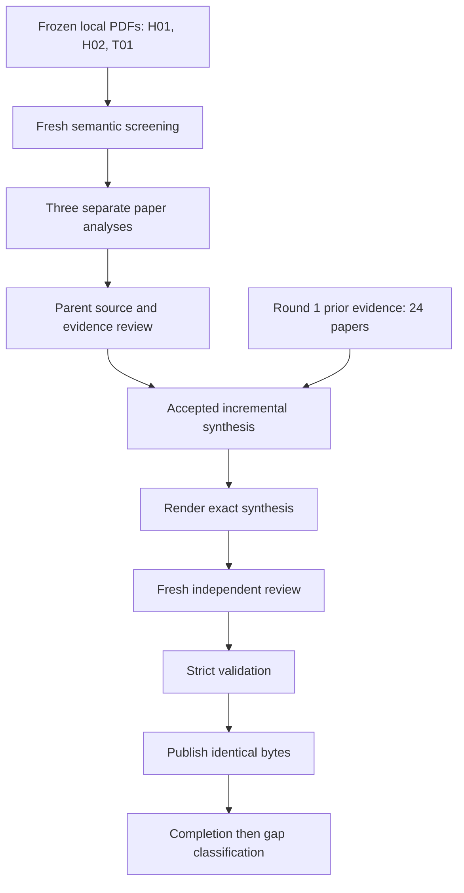

# Topic 01 Round 2: Incomplete email reconstruction and quotation source-span alignment

## Contents

- [Executive Summary](#executive-summary)
- [Scope and Corpus](#scope-and-corpus)
- [Round History](#round-history)
- [Methodology](#methodology)
- [Taxonomy of Approaches](#taxonomy-of-approaches)
- [Evidence Matrix](#evidence-matrix)
- [Recurring Mechanisms and Patterns](#recurring-mechanisms-and-patterns)
- [Assumption Map](#assumption-map)
- [Contradiction Map](#contradiction-map)
- [Evidence Strength Map](#evidence-strength-map)
- [Operational Implications](#operational-implications)
- [Production Readiness](#production-readiness)
- [Reusable Mechanism Inventory](#reusable-mechanism-inventory)
- [Design Implications](#design-implications)
- [Unresolved Questions](#unresolved-questions)
- [Risk Register](#risk-register)
- [Traceability Appendix](#traceability-appendix)
- [References](#references)

## Executive Summary

Exactly 3 new papers were analyzed in Round 2: H01, H02, and T01. H01/H02 are two DIRECT_EMAIL papers from one related research line. T01 is TRANSFER_METHOD evidence. The 24 Round 1 papers are prior read-only evidence and are not counted as new Round 2 papers.

- **HIGH:** Disconnected components can arise from one selectively quoted original or from multiple hidden originals. Component and reconstructed-document counts therefore do not establish the number of historical originals. Support: H01, H02. See [R2-A-S03](#r2-a-s03).

- **HIGH:** H01/H02 are one related research line. Empirical support comprises H01's single deletion example and synthetic sweeps, plus H02's Enron case study. Support: H01, H02. See [R2-A-S04](#r2-a-s04).

- **HIGH:** No online late-arrival reconciliation or retraction correctness is established by H01/H02. Support: H01, H02. See [R2-A-S05](#r2-a-s05).

## Scope and Corpus

Research question: Topic 01 Round 2: incomplete email reconstruction and robust quotation source-span alignment

| ID | Title | Year | Venue | Role |
| --- | --- | --- | --- | --- |

| H01 | Discovery and Regeneration of Hidden Emails | 2005 | ACM Symposium on Applied Computing (SAC 2005) | DIRECT_EMAIL |

| H02 | Scalable Discovery of Hidden Emails from Large Folders | 2005 | ACM SIGKDD International Conference on Knowledge Discovery and Data Mining (KDD 2005) | DIRECT_EMAIL |

| T01 | Detecting and Modeling Local Text Reuse | 2014 | ACM/IEEE Joint Conference on Digital Libraries (JCDL 2014) | TRANSFER_METHOD |

## Round History

| Academic round / attempt | Run ID | New papers analyzed | Status and use |
| --- | --- | --- | --- |
| Round 1 | 20260914T084949Z | 24 | Prior accepted evidence; read-only |
| Round 2 failed attempt | f471e319ea1c | 0 completed paper analyses | Blocked at screener; preserved; not a completed round |
| Round 2 recovery | fb483e38f452 | 3 | Current synthesis; review, validation, and publication receipts are separate |

The isolated runner cycle counter is 1. The academic study is Topic 01 Round 2. No Round 3 is authorized. Stopping does not imply literature exhaustion or closure of all gaps.

## Methodology

Exactly 3 new papers were analyzed in Round 2. H01 and H02 are DIRECT_EMAIL papers from one related research line; T01 is TRANSFER_METHOD only. The 24 Round 1 papers remain read-only prior evidence and are not re-counted.

Phase A manually refined academic terminology, applied a strict admission gate, and acquired only three clean PDFs from canonical author sources. Identity and integrity checks included title page, authors, artifact type, PDF magic, bytes, SHA-256, page count, and extraction sanity.

Recovery run fb483e38f452 used partial local source coverage with provider attempts=[] and no provider search. The pipeline download stage recorded downloaded=0, skipped_exists=3, failed=0; rough conversion, extraction and deterministic summarize completed locally.

Paper analysis was source-driven: H01 completed at high effort; H02 and T01 completed in fresh self-contained xhigh workers after earlier process-finalization hangs. Final accepted hashes and runtime provenance are recorded in pipeline-workspace-recovery/audit/parent-paper-acceptance.json. No max effort was used.

Cross-paper synthesis semantic reasoning was split into four independent no-tool xhigh sections (A, B, C1, C2) after larger one-shot generation attempts hung. A deterministic assembler maps the validated section outputs into the installed synthesis schema. This changes serialization, not evidence or semantic judgments.

Confidence normalization is explicit: C1 numeric values >=0.85 become HIGH; C2 proposed/unexecuted findings with null confidence become LOW for effectiveness. The original section outputs remain unchanged in execution/workers.

Source inconsistencies are preserved rather than repaired. In particular, H02 Figure 6 labeling/output-count issues and T01 Table 6/prose metric and fold-size inconsistencies remain unresolved.

No mailbox access, application/design change, architecture approval, engineering benchmark execution, deployment, or Raspberry Pi performance measurement occurred in this academic round.

Independent review attempt 1 rejected the first rendered artifact because the Evidence Matrix placed analyst-identified unsafe extrapolations under an unqualified Assumptions label. This bounded retry changes only that semantic labeling: source/model assumptions and unvalidated transfer assumptions are now explicit, and each unsafe extrapolation is labeled as not source-accepted. The rejected artifacts remain archived.

For finding $f$, let $s(f)=|\mathcal{P}_f|$ count cited new corpus papers. This is a traceability count. It is not an independent replication count or a calibrated confidence probability.

## Taxonomy of Approaches

### R2-A-S01

**Confidence: HIGH. Type: source-described mechanism.**

H01/H02 reconstruct surviving quotations when originals are absent from the searched folders. Unquoted missing text is unknowable from quotations alone, so fragment recovery cannot establish complete-original recovery.

Support: [H01, H02]. Evidence: H01-F01; H01-F03; H02-F1.

This materially reduces the R2-A foundational-method gap. Coverage of observed fragments does not establish coverage of the original.

- Limitation: Missingness depends on search coverage and matching behavior.

- Limitation: An unmatched quotation does not prove deletion.

### R2-A-S02

**Confidence: HIGH. Type: source-described mechanism.**

The precedence graph and bulletized representation preserve supported fragment order while leaving some pairs unordered. H01's strict-and-complete condition concerns graph representability.

Support: [H01, H02]. Evidence: H01-F04; H01-F06; H01-F07; H02-F3.

Graph completeness does not mean complete original text. Partial-order output does not certify source identity.

- Limitation: H01 excludes cycles.

- Limitation: Quoted textual order does not independently verify original order.

- Limitation: Edge-deletion heuristics reduce represented precedence.

### R2-B-MATCH

**Confidence: HIGH. Type: source-described mechanism.**

H01/H02 match contiguous shared strings. Complete matches can be removed; sufficiently long partial matches are split out, leaving residual fragments for further processing. Partial or composite quotations can therefore retain matchable exact substrings.

Support: [H01, H02]. Evidence: H01-F03; H02-F2.

Splitting around surviving substrings does not make one alignment tolerate arbitrary edits. Neither paper validates occurrence-to-source boundary accuracy.

- Limitation: Longest Common Substring is not longest common subsequence or general edit-distance alignment.

- Limitation: Edits that destroy sufficiently long exact runs, including paraphrase, have no demonstrated handling.

### R2-B-LOCAL-ALIGN

**Confidence: HIGH. Type: source-described mechanism.**

T01 separates candidate retrieval from character-level Smith-Waterman local passage alignment with affine gap penalties. The alignment represents matches, substitutions, and gaps within otherwise unrelated documents.

Support: [T01]. Evidence: T01-F1.

This is a transfer candidate for edited structural correspondence. Alignment scores are not calibrated source probabilities, and the mechanism supplies no email accuracy claim.

- Limitation: The study concerns newspapers and legislation, with intended passages around 100 words or more.

- Limitation: It provides no direct-email source-boundary evaluation or proof that anchor pruning preserves desired alignments.

## Evidence Matrix

| Paper | Methods | Results and task | Source/model assumptions and explicitly labeled unsafe extrapolations | Limitations |
| --- | --- | --- | --- | --- |

| H01 | A folder-level pipeline detects marked or indented quotations, subtracts contiguous matches to extant new text, splits and deduplicates overlapping hidden fragments, constructs a transitively reduced precedence graph, and regenerates bulletized documents under strictness/completeness conditions or edge-deletion heuristics; evaluation consists of one deliberately deleted real email and synthetic folder/quotation parameter sweeps. | H01-F07: Edge-deletion heuristics trade graph coverage against a representable output; the empirical comparison does not establish a universal winner.; H01-F08: One deliberately deleted teaching-assistant email demonstrates reconstruction from five quoting messages; using only messages 1 and 4 yields two reconstructed emails from that one original.; H01-F09: Synthetic experiments report roughly linear folder-size scaling and excess reconstructed-document counts; longer quotations reduce splitting in the tested setting. | SOURCE-STATED / UNVALIDATED MODEL ASSUMPTION: quotations at the same level are treated as originating from one original (H01-F02).; SOURCE-STATED / UNVALIDATED MODEL ASSUMPTION: precedence reconstruction relies on supported textual order and an acyclic graph (H01-F04/H01-F06).; UNSAFE EXTRAPOLATION TO AVOID — analyst-identified and NOT a source-accepted assumption: Recovered fragments equal a complete original.; UNSAFE EXTRAPOLATION TO AVOID — analyst-identified and NOT a source-accepted assumption: One connected component or one generated document equals one historical original.; UNSAFE EXTRAPOLATION TO AVOID — analyst-identified and NOT a source-accepted assumption: All quotations at the same depth come from the same original.; UNSAFE EXTRAPOLATION TO AVOID — analyst-identified and NOT a source-accepted assumption: Textual matching proves a unique source even when the text appears in several messages.; UNSAFE EXTRAPOLATION TO AVOID — analyst-identified and NOT a source-accepted assumption: Deduplication can discard occurrence provenance without affecting future corrections.; UNSAFE EXTRAPOLATION TO AVOID — analyst-identified and NOT a source-accepted assumption: Every pair of recovered fragments has a justified total order and every quote graph is acyclic.; UNSAFE EXTRAPOLATION TO AVOID — analyst-identified and NOT a source-accepted assumption: Deleted edges are false or can be hidden from an evidence audit.; UNSAFE EXTRAPOLATION TO AVOID — analyst-identified and NOT a source-accepted assumption: Synthetic output counts establish quote alignment accuracy, complete recovery, or modern-client robustness. | Unquoted original content cannot be recovered from the observed fragments; full original coverage is not established.; The same quotation level is assumed to refer to one original, and nested-quotation details are omitted.; Markerless, HTML/table, paraphrased, and heavily edited quotation handling is neither specified in sufficient detail nor evaluated as a separate task.; Contiguous partial matching is not general semantic or edit-tolerant alignment; minLen=40 is an example, with no tuning results.; Unique occurrence-to-source offsets, competing source matches, and calibrated uncertainty are not defined or measured.; Graph cycles are excluded. Reordered quotations and repeated text can violate the acyclic or source-identity assumptions.; Graph connected components and regenerated document counts are not counts of verified historical originals. |

| H02 | H02 extends the HiddenEmailFinder framework attributed to H01 with word-index filtering and positional anchoring for Longest Common Substring matching. It extracts quotations, removes sufficiently long matches to available nonquoted content, splits overlapping hidden fragments, constructs a precedence graph, and produces bulletized reconstructions. Its empirical case study uses Enron inboxes, varies overlap and frequent-word thresholds, and reports fragment prevalence, reconstructed-email counts, and runtime. It reports no held-out reconstruction benchmark, source-span ground truth, precision, recall, or calibrated ambiguity evaluation. H01's formal results are referenced rather than reproduced or independently assessed here. | H02-F4: The Enron case study reports substantial algorithm-identified missing quotation material, including material unmatched across the same user's folders. These are corpus-specific detection results, not validated prevalence estimates for ordinary email users.; H02-F5: Changing minLen produces modest changes in reconstructed-email counts. This supports output-count stability under the reported settings, not reconstruction accuracy or preservation of individual fragments.; H02-F7: The reported experiments support runtime improvements from filtering and anchoring on Enron folders. Their output-count comparisons do not establish the authors' broader claim of unchanged output quality. | SOURCE-STATED / UNVALIDATED MODEL ASSUMPTION: sufficiently overlapping hidden fragments are treated as sharing one original (H02-F3).; SOURCE-STATED METHOD FACT, NOT A GENERAL ASSUMPTION: LCS means Longest Common Substring in H02 (H02-F2).; UNSAFE EXTRAPOLATION TO AVOID — analyst-identified and NOT a source-accepted assumption: An unmatched quotation proves deletion or absence outside the searched folders.; UNSAFE EXTRAPOLATION TO AVOID — analyst-identified and NOT a source-accepted assumption: Surviving quotations determine every word of one complete original.; UNSAFE EXTRAPOLATION TO AVOID — analyst-identified and NOT a source-accepted assumption: LCS here means longest common subsequence or general edit-distance matching.; UNSAFE EXTRAPOLATION TO AVOID — analyst-identified and NOT a source-accepted assumption: A shared substring uniquely identifies its source email and occurrence.; UNSAFE EXTRAPOLATION TO AVOID — analyst-identified and NOT a source-accepted assumption: Sufficient overlap proves common origin, even for boilerplate or copied text.; UNSAFE EXTRAPOLATION TO AVOID — analyst-identified and NOT a source-accepted assumption: Stable reconstruction counts prove accurate content, source spans, or graph constraints.; UNSAFE EXTRAPOLATION TO AVOID — analyst-identified and NOT a source-accepted assumption: Partial-order output provides calibrated alternatives over possible original identities.; UNSAFE EXTRAPOLATION TO AVOID — analyst-identified and NOT a source-accepted assumption: H01 and H02 independently replicate an email-accuracy result. | H02 is an Enron case study from the same research line as H01. It is not independent replication of that framework.; There is no labeled reconstruction or source-alignment test split, no recovery precision or recall, and no evaluation of complete original-text recovery.; Missingness and global/local labels depend on the searched folder boundary and the algorithm's ability to match content.; Boilerplate filtering was adapted through manual inspection of this corpus. Its errors and portability are unmeasured.; Output counts and runtime are the central robustness and optimization measures; they do not establish provenance correctness.; Source inconsistencies concerning denominators, threshold ranges, and Figure 6(b) remain explicit below. |

| T01 | The paper studies nineteenth-century U.S. newspapers and congressional bills. Its pipeline generates candidate document pairs with contiguous or skip n-grams, filters and indexes repeated features, ranks candidate pairs, computes character-level Smith-Waterman local alignments, and clusters aligned passages. Candidate retrieval is evaluated against pooled, alignment-derived pseudo-relevance judgments. A separate human-labeled legislative experiment evaluates shared-policy classification using an SVM boilerplate classifier and logistic regression on alignment scores. Exploratory analyses examine newspaper reprinting dynamics and legislative matches. These are distinct evaluation tasks. None evaluates email quotations, missing email originals, or online processing. | T01-F2: The reported average precision measures candidate-pair ranking against pooled, alignment-derived relevance. It is not universal alignment accuracy, human-verified quotation attribution, or an estimate of recall over every actual reuse occurrence.; T01-F3: Candidate-generation results depend on text quality and feature selection. The paper reports that longer n-grams work better on the cleaner legislative collection, while skip bigrams provide a useful candidate-cost tradeoff on noisy newspapers. These results support corpus-specific tuning, not a universal email configuration.; T01-F6: The legislative experiment distinguishes textual similarity from shared policy content, but its final classifier's recall is inconsistently reported. Table 6 reports sensitivity of 65.0% and specificity of 97.3%; the prose calls 97.3% recall. The prose value cannot be treated as verified recall.; T01-F7: The exploratory newspaper study reports lower accuracy under a temporal split than under a random split for predicting fast versus slow reprinting. This supports caution about historical generalization, but provides no evaluation of online arrival, replay, or missing-parent correction. | SOURCE-STATED METHOD CONDITION: local Smith-Waterman seeks a best local passage alignment and is not exhaustive occurrence enumeration (T01-F1/T01-F4).; UNVALIDATED TRANSFER ASSUMPTION: adapting this non-email local aligner to email while preserving occurrence/source offsets requires separate testing.; UNSAFE EXTRAPOLATION TO AVOID — analyst-identified and NOT a source-accepted assumption: Treating pooled average precision as human-verified source-span accuracy or complete reuse recall.; UNSAFE EXTRAPOLATION TO AVOID — analyst-identified and NOT a source-accepted assumption: Treating an alignment score as calibrated source confidence.; UNSAFE EXTRAPOLATION TO AVOID — analyst-identified and NOT a source-accepted assumption: Assuming long-passage performance transfers to short, edited, markerless, HTML, or table-based email quotations.; UNSAFE EXTRAPOLATION TO AVOID — analyst-identified and NOT a source-accepted assumption: Assuming one best local alignment enumerates all quotation occurrences.; UNSAFE EXTRAPOLATION TO AVOID — analyst-identified and NOT a source-accepted assumption: Treating connected reuse clusters or earliest observed appearances as unique directed provenance.; UNSAFE EXTRAPOLATION TO AVOID — analyst-identified and NOT a source-accepted assumption: Using 97.3% as verified policy recall or applying any policy-classifier rate to email.; UNSAFE EXTRAPOLATION TO AVOID — analyst-identified and NOT a source-accepted assumption: Equating historical publication lag with late message arrival or incremental correction.; UNSAFE EXTRAPOLATION TO AVOID — analyst-identified and NOT a source-accepted assumption: Interpreting confidence scores here as calibrated probabilities; they express confidence in the scoped source interpretation. | T01 is a transfer-method study of newspapers and legislation. It contains no direct email evaluation.; Large-passage reuse detection, candidate-pair ranking, local alignment, policy classification, and temporal classification have different targets and denominators.; The newspaper archive has acknowledged coverage gaps, including absent Massachusetts newspapers. Observed transmission histories are incomplete.; Edited examples illustrate matching behavior but do not quantify robustness across edit types or establish preservation of unique, decision-bearing text.; The policy-label annotation procedure does not report inter-annotator agreement in the supplied text.; Source inconsistencies below remain unresolved unless the source itself supplies an explicit clarification. No numerical correction or author intention is inferred.; All proposed msgloom experiments remain unexecuted. |

## Recurring Mechanisms and Patterns

### R2-A-S03

**Confidence: HIGH. Type: source-described mechanism.**

Disconnected components can arise from one selectively quoted original or from multiple hidden originals. Component and reconstructed-document counts therefore do not establish the number of historical originals.

Support: [H01, H02]. Evidence: H01-F05; H01-F08; H02-F3.

H01's deletion example produces two reconstructions from one original when only messages 1 and 4 are available. Treat components as reconstruction units.

- Limitation: Repeated text can also join fragments from unrelated originals.

- Limitation: No calibrated model of alternative original identities is evaluated.

### R2-A-S04

**Confidence: HIGH. Type: analyst inference.**

H01/H02 are one related research line. Empirical support comprises H01's single deletion example and synthetic sweeps, plus H02's Enron case study.

Support: [H01, H02]. Evidence: H01-F08; H01-F09; H02-F3; H02-F4; H02-F7.

Shared lineage is explicit in the current packet. The studies strengthen method feasibility while leaving representative recovery correctness unestablished.

- Limitation: H02 extends H01 and is not an independent replication.

- Limitation: Document counts and runtime do not establish complete-text recovery or end-to-end reconstruction accuracy.

### R2-A-S05

**Confidence: HIGH. Type: analyst inference.**

No online late-arrival reconciliation or retraction correctness is established by H01/H02.

Support: [H01, H02]. Evidence: H01-F08; H01-F10; H02-F1; H02-F7.

This absence assessment is limited to the supplied papers. Late-arrival replay remains a proposed experiment.

- Limitation: Static folder-subset comparisons do not evaluate online updates.

- Limitation: Arrival-order effects, late-original correction, and retraction of prior decisions remain unevaluated.

### R2-B-PROVENANCE

**Confidence: MEDIUM. Type: analyst inference.**

Shared text, sufficient overlap, and connected components do not establish a unique original or directed provenance. Partial-order representations also do not supply calibrated alternatives over source emails or source positions.

Support: [H01, H02, T01]. Evidence: H01-F03; H01-F05; H02-F3; T01-F5.

Treat components as reconstruction or association units. Preserve unresolved candidate sources instead of interpreting text equality as unique attribution. T01 contributes only a transfer-method provenance limitation.

- Limitation: Boilerplate or copied passages can join unrelated originals; selective quotation can split one original into several components.

- Limitation: Alternative-source coverage, tie handling, and calibrated source selection are unestablished.

### R2-B-MULTI-PASSAGE

**Confidence: HIGH. Type: source-described mechanism.**

T01's single best local alignment can miss another valid passage between the same document pair when passages occur in reverse order or are separated by a long unrelated span.

Support: [T01]. Evidence: T01-F4.

One successful alignment does not establish coverage of all quotation occurrences. This concerns passage order within documents, not message arrival order.

- Limitation: The reported observation has no systematic occurrence-level denominator.

- Limitation: Repeated extraction, masking, or another exhaustive local-match procedure is not evaluated.

### R2-ZH-EXEC

**Confidence: HIGH. Type: analyst synthesis / Chinese executive summary.**

中文摘要：第二轮新增分析了 3 篇论文。H01/H02 是同一条直接邮件研究线，证明可以从后续引用中恢复仍然可观察到的片段并表示部分顺序，但不能恢复从未被引用的缺失内容，也没有验证在线迟到父邮件、关系撤销或修正。T01 只提供局部文本复用/对齐的迁移方法，不能当作邮件准确率。A1 的指定原始论文获取缺口已关闭；A2 的结构匹配证据有所加强但仍未完全关闭；A7 的现代增量/LLM 邮件重建仍然开放。当前仍为 HAS_GAPS，不批准架构。

Support: [H01, H02, T01]. Evidence: H01-F10; H02-F7; T01-F1.

PRIOR_ROUND remains read-only context and is not counted among the three new papers.

- Limitation: This Chinese paragraph summarizes the bounded Round 2 evidence; it is not a separate experiment or independent evidence source.

## Assumption Map

### A-R2-A-AS01

H01 assumes quotations at the same level originate from one original.

Scope: Source-model assumption; unvalidated for mixed-origin quotations.. Risk if false: Fragments from multiple originals can be grouped together..

Support: H01. Evidence: H01-F02.

### A-R2-A-AS02

H02 assumes sufficiently overlapping hidden fragments share one original.

Scope: Overlap-based fragment grouping.. Risk if false: Boilerplate or copied text can merge unrelated originals..

Support: H02. Evidence: H02-F3.

### A-R2-A-AS03

Using quoted textual order as original precedence requires preserved order; H01 also assumes an acyclic graph.

Scope: Partial-order reconstruction.. Risk if false: Reordered quotations can introduce incorrect precedence or cycles outside H01's model..

Support: H01, H02. Evidence: H01-F04; H01-F06; H02-F3.

### B-ASM-01

H01 assumes that quotations at the same level originate from the same email.

Scope: Source-stated quotation-processing assumption; not an accepted msgloom invariant.. Risk if false: Mixed-origin quotations can receive incorrect source grouping and precedence relations..

Support: H01. Evidence: H01-F02.

### B-ASM-02

H02 assumes that sufficiently overlapping hidden fragments share one original.

Scope: Source-stated overlap-grouping assumption.. Risk if false: Repeated boilerplate or copied passages can merge distinct originals and produce false unique attribution..

Support: H02. Evidence: H02-F3.

### B-ASM-03

T01's local alignment can be adapted to email quotations while retaining recoverable occurrence and source offsets.

Scope: Untested transfer assumption for a structural A2 implementation.. Risk if false: Normalization or alignment can lose raw-source traceability or omit valid short, edited, or reordered occurrences..

Support: H02, T01. Evidence: H02-F2; T01-F1; T01-F4.

### C2-A1

Authorized known-original conversations and independent annotations can be obtained, including admissible alternatives and decision-bearing content.

Scope: Proposed E1-E4 evaluation prerequisites; availability is not established.. Risk if false: Ground-truth denominators and representative accuracy claims cannot be justified..

Support: H01, H02, T01. Evidence: H01-F08; H02-F2; T01-F2.

### C2-A2

Evaluation can hold the final message set, search boundary, configuration, and randomness fixed while varying arrival order.

Scope: Proposed E3 replay controls.. Risk if false: Differences cannot be attributed specifically to arrival order..

Support: H01, H02, T01. Evidence: H01-F10; H02-F1; T01-F7.

## Contradiction Map

### CON-R2-R01: H01's component-to-original wording requires its explicit fragmentation caveat

- **source_record:** H01's component-to-original wording requires its explicit fragmentation caveat. Definition 3 retains the P/v symbol ambiguity. Heuristic comparisons are setting-dependent, and approximate timings remain unreconciled.

- **synthesis_treatment:** Preserve the reported wordings/quantities as unresolved where applicable; do not infer an author correction.

Status: unresolved / qualified in synthesis. Severity: HIGH.

Support: H01. Evidence: H01-F05; H01-F06; H01-F07; H01-F09.

### CON-R2-R02: H02 Figure 6(b) retains the reported PDF-axis label 'recollected hidden emails' and caption/prose label 'reconstructed hidden emails'

- **source_record:** H02 Figure 6(b) retains the reported PDF-axis label 'recollected hidden emails' and caption/prose label 'reconstructed hidden emails'. Neither interpretation turns output-count similarity into accuracy evidence.

- **synthesis_treatment:** Preserve the reported wordings/quantities as unresolved where applicable; do not infer an author correction.

Status: unresolved / qualified in synthesis. Severity: HIGH.

Support: H02. Evidence: H02-F5; H02-F7.

### CON-R2-R03: H02 leaves unresolved the 137-inbox population versus median 38

- **source_record:** H02 leaves unresolved the 137-inbox population versus median 38.5, setup ft=1000–80000 versus first-round ft=500–80000, and the shift from per-user recollection rates to a pooled-fragment claim.

- **synthesis_treatment:** Preserve the reported wordings/quantities as unresolved where applicable; do not infer an author correction.

Status: unresolved / qualified in synthesis. Severity: HIGH.

Support: H02. Evidence: H02-F4; H02-F5; H02-F6.

### CON-R2-R04: T01 Table 6 reports sensitivity 65

- **source_record:** T01 Table 6 reports sensitivity 65.0% and specificity 97.3%, while the prose calls 97.3% recall. Reporting of 20-fold cross-validation, 2900 training cases, and 500 test cases from 3400 labeled alignments remains unresolved.

- **synthesis_treatment:** Preserve the reported wordings/quantities as unresolved where applicable; do not infer an author correction.

Status: unresolved / qualified in synthesis. Severity: HIGH.

Support: T01. Evidence: T01-F6.

## Evidence Strength Map

### R2-A-S06

**Confidence: HIGH. Type: gap update.**

A1 exact-primary acquisition is closed; complete-original/end-to-end accuracy remains unestablished.

Support: [H01, H02]. Evidence: H01-F01; H01-F08; H01-F09; H02-F1; H02-F5.

The exact-primary acquisition status comes from the current packet's required status. The cited findings support the remaining accuracy limitation.

- Limitation: Acquisition closure does not establish reconstruction correctness.

- Limitation: The supplied evaluations do not validate complete-original recovery.

### R2-A-S07

**Confidence: HIGH. Type: gap update.**

A7 current/incremental/LLM email reconstruction remains open.

Support: [H01, H02]. Evidence: H01-F10; H02-F1; H02-F7.

This is the exact A7 status required by the current packet. It does not assert a literature-wide absence.

- Limitation: Historical offline studies supply no current, incremental, or LLM-assisted direct-email evaluation.

- Limitation: No online correction or retraction evaluation closes this gap.

### R2-B-A2-STATUS

**Confidence: HIGH. Type: gap update.**

R2-B and structural A2 are partially reduced by explicit substring matching, overlap splitting, deduplication, and a transferable local aligner. Robust direct-email occurrence-to-source alignment remains open, including markerless, HTML, table, nested, paraphrased, and ambiguous-source cases.

Support: [H01, H02, T01]. Evidence: H01-F02; H01-F10; H02-F2; H02-F5; H02-F7; T01-F1; T01-F2.

The structural component is not fully closed. This assessment applies only to the current packet and does not claim a literature-wide absence.

- Limitation: Reconstruction counts and runtime do not establish source-span accuracy or preserved provenance.

- Limitation: T01's pooled candidate-ranking evaluation does not independently validate alignment boundaries or complete occurrence recall.

### R2-GAP-A1-A2

**Confidence: HIGH. Type: prior_gap_status.**

A1 is closed only as acquisition of the two missing primary hidden-email studies. A2's structural component is reduced/partial; A2 is not closed.

Support: [H01, H02, T01]. Evidence: H01-F10; H02-F1; H02-F2; T01-F1.

Gap dispositions follow the supplied register and round scope.

- Limitation: Acquisition does not establish unique source identity, recovered-fragment fidelity, complete originals, or deployable scaling.

- Limitation: Structural matching mechanisms do not validate semantic response scope.

- Limitation: T01 supplies a transfer method without direct-email evaluation.

## Operational Implications

### OP-DETECT-SEPARATE

**Confidence: HIGH. Type: source-described mechanism.**

H01 detects quotation candidates through quotation symbols or indentation. Detection is separate from aligning each quotation occurrence to a source span.

Support: [H01]. Evidence: H01-F02.

A detected quotation does not establish its source identity or source boundaries.

- Limitation: Nested-quotation details are omitted; quotations at the same level are assumed to share one original.

- Limitation: Markerless, HTML, table, and mixed-origin cases lack task-specific evaluation.

### OP-PRESERVE-LINEAGE

**Confidence: HIGH. Type: source-described mechanism.**

H01 splits overlapping hidden fragments into shared and residual fragments, removes duplicates, and derives precedence edges from their textual order in quoting messages. Transitive reduction preserves graph reachability.

Support: [H01]. Evidence: H01-F04.

Analyst recommendation: retain every occurrence's offsets and split/deduplication lineage. A shared fragment node must not erase the observations that support it.

- Limitation: The paper does not define durable occurrence offsets or alternative provenance mappings.

- Limitation: Observed quotation order does not independently verify original source order.

### OP-CANDIDATE-RECALL

**Confidence: HIGH. Type: source-described mechanism.**

H02 accelerates matching through word-index candidate filtering and positional anchors. Its no-false-dismissal argument does not establish recall after frequent open-class words are also excluded.

Support: [H02]. Evidence: H02-F6.

A true shared span containing only excluded words can lose its candidate or anchor. This is an inference from the procedure, not a measured failure rate.

- Limitation: Candidate and matched-span recall under frequent-word exclusion are not reported.

- Limitation: Anchoring does not establish exhaustive mappings for repeated occurrences.

### OP-AMBIGUOUS-PROVENANCE

**Confidence: MEDIUM. Type: analyst inference.**

Shared text, sufficient overlap, and connected components do not establish a unique original or directed provenance. Partial-order representations also do not supply calibrated alternatives over source emails or source positions.

Support: [H01, H02, T01]. Evidence: H01-F03; H01-F05; H02-F3; T01-F5.

Treat components as reconstruction or association units. Preserve unresolved candidate sources instead of interpreting text equality as unique attribution. T01 contributes only a transfer-method provenance limitation.

- Limitation: Boilerplate or copied passages can join unrelated originals; selective quotation can split one original into several components.

- Limitation: Alternative-source coverage, tie handling, and calibrated source selection are unestablished.

## Production Readiness

### READY-A7-RISK

**Confidence: HIGH. Type: risk_assessment.**

A7 remains open. The selected evidence does not establish current or LLM-assisted direct-email reconstruction, online late-arrival correction, robust occurrence provenance, or calibrated source confidence.

Support: [H01, H02, T01]. Evidence: H01-F10; H02-F2; H02-F7; T01-F1; T01-F4; T01-F7.

This is a selected-corpus coverage limit, not a claim that relevant literature does not exist.

- Limitation: E1–E4 validation needs remain open/deferred; proposed experiments are unexecuted.

- Limitation: Static folder subsets and historical publication-time splits do not evaluate arrival-order correction.

- Limitation: A single best alignment can omit additional valid occurrences.

### READY-HAS-GAPS

**Confidence: HIGH. Type: readiness_assessment.**

Round 2 status is HAS_GAPS. The evidence supports candidate baselines and further evaluation, with no architecture approval and no automatic Round 3.

Support: [H01, H02, T01]. Evidence: H01-F10; H02-F7; T01-F1; T01-F2.

Readiness is an analyst assessment; approval and round progression follow the supplied task boundary.

- Limitation: H01 and H02 are related evidence, not independent replications.

- Limitation: Historical timings, output counts, and transfer-task metrics do not establish msgloom readiness.

## Reusable Mechanism Inventory

### M1: Hidden-fragment precedence graph

Represent observed quoted fragments and supported relative order without forcing a total order or inventing unquoted missing text.

Generality: Direct-email mechanism from one related research line.. Support: H01, H02. Evidence: H01-F04; H01-F06; H02-F3.

- Constraint: Same-depth/source identity and overlap assumptions can fail.

- Constraint: Does not establish online late-arrival correction.

### M2: Substring matching with split/deduplicate processing

Use exact/partial contiguous matches to remove extant text, split overlapping fragments, and retain residual fragments for reconstruction.

Generality: Direct email; structural matching only.. Support: H01, H02. Evidence: H01-F03; H01-F04; H02-F2.

- Constraint: Not semantic/paraphrase matching.

- Constraint: Occurrence provenance and alternative sources require separate representation.

### M3: Indexed LCS anchoring

Filter candidate messages and expand positional anchors to approximate longest-common-substring matching for scale.

Generality: Direct email scalability mechanism.. Support: H02. Evidence: H02-F2; H02-F6.

- Constraint: Frequent-word filtering may remove true candidates; candidate recall was not established.

- Constraint: Output-count stability is not reconstruction accuracy.

### M4: Local Smith-Waterman passage alignment

Align local passages embedded in otherwise unrelated longer texts using substitutions and gaps.

Generality: TRANSFER_METHOD only; requires email-specific validation.. Support: T01. Evidence: T01-F1; T01-F4.

- Constraint: A single best alignment can miss a second reversed or distant passage.

- Constraint: Large-passage results do not establish short/edited email quotation accuracy.

## Design Implications

These are research proposals. No application or design implementation is approved or executed.

### DESIGN-E1

**Confidence: LOW. Type: proposed_msgloom_experiment.**

PROPOSED/UNEXECUTED: Representative joint-label benchmark. Population: authorized, known-original email conversations, split by related conversation before tuning; include available, withheld, composite, short, edited, boilerplate, and ambiguous-source cases. Joint labels cover quotation occurrences, admissible source identities, source spans, folder-relative missingness, original grouping, and supported order. Metrics: correct joint occurrence labels/all gold quote occurrences, with missed occurrences counted as failures; detection precision over predicted occurrences and recall over gold occurrences; false merges/all gold different-original pairs; false splits/all gold same-original pairs; unsupported order assertions/all asserted relations. Reject representative-accuracy claims without required strata and independent labels. Reject improvement claims if gains disappear on held-out conversations or conceal degradation in short-fragment, missing-source, or ambiguous-source strata at matched false-link rates.

Support: [H01, H02, T01]. Evidence: H01-F01; H01-F05; H01-F06; H02-F1; H02-F3; T01-F2.

Score explicit ambiguity against admissible alternatives. Withheld originals remain evaluator ground truth and are excluded from system search.

- Limitation: No benchmark, sample size, annotations, or results are supplied.

### DESIGN-E2

**Confidence: LOW. Type: proposed_msgloom_experiment.**

PROPOSED/UNEXECUTED: Unique and decision-bearing content preservation with quote-to-source span alignment. Population: all annotated raw/plain-text/HTML message content, including unique spans, decision-bearing tokens, edits, repeated passages, short quotations, and excluded-word-only matches. Metrics: preserved unique spans/all labeled unique spans; preserved decision-bearing tokens/all labeled decision-bearing tokens; candidate recall over all gold available occurrence-source pairs; exact-boundary and character-overlap scores over gold sourceable occurrences that were detected; end-to-end correct source-span recall over all gold sourceable occurrences, including detection failures, and precision over all predicted source-span links; correct raw-offset round trips/all annotated view mappings. Reject preservation claims after any labeled content loss or unmappable occurrence. Reject candidate-completeness claims if any valid source-span candidate is pruned.

Support: [H01, H02, T01]. Evidence: H01-F02; H01-F03; H01-F04; H02-F2; H02-F5; H02-F6; T01-F1; T01-F3; T01-F4.

Compare contiguous matching, anchored alignment, and multiple-match enumeration. Define threshold units, normalization, and overlap scoring before execution; retain failures by transformation.

- Limitation: Edited, short, HTML, and table alignment remain unvalidated.

### DESIGN-E3

**Confidence: LOW. Type: proposed_msgloom_experiment.**

PROPOSED/UNEXECUTED: Late-parent arrival, arrival-order replay, and correction. Population: fixed labeled histories replayed under prespecified arrival permutations, including originals added later to primary or reference folders and later quotations connecting fragments. Metrics: matching final missingness, candidate-source, source-span, and supported-order fields/all evaluated final fields against fresh analysis of the identical final message set; correctly applied revisions/all gold-required revisions; stale contradicted claims/all claims requiring retraction; traceable revisions/all emitted revisions. Measure correction latency for every gold-required revision, retaining unresolved revisions as failures. Reject order-independent correctness if any supported final field differs solely by arrival order, any contradicted claim persists, or a revision loses its evidence history.

Support: [H01, H02, T01]. Evidence: H01-F04; H01-F05; H01-F08; H01-F10; H02-F1; T01-F7.

Replay tests an extension absent from these studies. Historical publication lag and static folder subsets do not establish online correction.

- Limitation: Agreement with fresh analysis alone cannot establish correctness; both outputs require gold-label checks.

### DESIGN-E4

**Confidence: LOW. Type: proposed_msgloom_experiment.**

PROPOSED/UNEXECUTED: Calibration and abstention. Population: held-out quotation-attribution opportunities with available, missing, repeated, or indistinguishable sources; fit confidence mappings on separate conversations. Metrics: wrong or unsupported accepted unique links/all accepted unique links; coverage = accepted unique links/all attribution opportunities; recovered admissible source pairs/all gold admissible available-source pairs; candidate-set size and abstention rate by ambiguity stratum. If probabilities exist, compute calibration error over every prespecified scored, gold-adjudicable link, including abstained links. Reject automatic-attribution claims if accepted-link error exceeds preregistered epsilon, coverage falls below preregistered minimum coverage, or any indistinguishable alternatives receive an unsupported unique attribution. Reject calibration claims without held-out probability evaluation or when error exceeds preregistered delta.

Support: [H01, H02, T01]. Evidence: H01-F03; H01-F05; H01-F10; H02-F2; H02-F3; T01-F1; T01-F5.

Fix probability targets, calibration bins, epsilon, minimum coverage, and delta before evaluation. Partial-order display and alignment scores do not establish calibrated source confidence.

- Limitation: No calibrated probabilities or acceptable operating thresholds are established by the packet.

### SYNTHETIC-C1

**Confidence: LOW. Type: proposed_synthetic_case.**

PROPOSED/UNEXECUTED synthetic case: Missing parent then late arrival. Two replies quote disconnected passages of one withheld original; later add that original to the searched primary or reference folder. Evaluate every annotated quote occurrence and every gold-required missingness, attribution, and order revision across each prescribed arrival order. Reject the case result if it retains contradicted hidden labels, treats disconnected fragments as proven distinct originals, loses occurrence provenance, or differs from the gold-consistent final replay result.

Support: [H01, H02]. Evidence: H01-F05; H01-F08; H01-F10; H02-F1.

Exercises E1 and E3. The late arrival and expected revisions are proposed fixture conditions.

- Limitation: One synthetic history cannot establish representative replay performance.

### SYNTHETIC-C2

**Confidence: LOW. Type: proposed_synthetic_case.**

PROPOSED/UNEXECUTED synthetic case: Boilerplate collision. Two unrelated originals contain identical boilerplate and different decision-bearing text; quote the shared passage and each distinct passage. Measure retained admissible sources over all labeled alternatives, preserved decision-bearing tokens over all labeled tokens, and false merges over the known different-original pair. Reject the case result if boilerplate alone produces a unique-source claim or original merge, or filtering removes distinct decision-bearing content.

Support: [H01, H02, T01]. Evidence: H01-F03; H02-F3; H02-F5; T01-F5.

Exercises E1, E2, and E4.

- Limitation: Synthetic boilerplate does not establish filter portability.

### SYNTHETIC-C3

**Confidence: LOW. Type: proposed_synthetic_case.**

PROPOSED/UNEXECUTED synthetic case: Short edited quotation. Use source text 'Ship 10 units Monday.' and quoted text 'Ship 12 units Monday.', plus a short exact-match control. Score both gold occurrences, their source-span mappings, and every labeled decision-bearing token. Reject preservation claims if 12 is deleted or replaced with 10, the edit is presented as exact identity, or either occurrence is silently omitted; unresolved attribution must remain explicit.

Support: [H01, H02, T01]. Evidence: H01-F03; H02-F2; H02-F6; T01-F1; T01-F3.

Exercises E1, E2, and E4. H01's complete-match branch precedes its short-partial-match threshold test; the control must preserve that distinction.

- Limitation: This constructed edit does not establish general edit tolerance.

### SYNTHETIC-C4

**Confidence: LOW. Type: proposed_synthetic_case.**

PROPOSED/UNEXECUTED synthetic case: Branch quotation. Sibling replies B and C respond to A; D quotes distinct passages from C and then B at the same quotation depth. Score both gold quote-to-source pairs and each asserted ordering or grouping relation. Reject the case result if it merges B and C because their quotations share a depth, omits either passage, or treats their displayed quotation order as proof of source-message chronology.

Support: [H01, H02, T01]. Evidence: H01-F02; H01-F04; H01-F06; H02-F2; H02-F3; T01-F4.

Exercises E1 and E2. The branch relationships are fixture ground truth.

- Limitation: Textual correspondence does not independently establish reply semantics.

### SYNTHETIC-C5

**Confidence: LOW. Type: proposed_synthetic_case.**

PROPOSED/UNEXECUTED synthetic case: Nested HTML/table/interleaving. Construct nested quotations containing a table, with new replies between quoted blocks and cells containing decision-bearing values. Score every gold quotation occurrence, labeled new-content span, decision-bearing cell, and raw-to-rendered mapping. Reject preservation claims if normalization loses content or row/column meaning, absorbs new replies into quotations, omits a nested occurrence, or prevents mapping a retained span back to its raw occurrence.

Support: [H01, H02, T01]. Evidence: H01-F02; H01-F03; H02-F2; T01-F1; T01-F4.

Exercises E1 and E2. Annotate discontinuous mappings where markup or interleaving requires them.

- Limitation: Client-specific HTML diversity remains outside one synthetic fixture.

## Unresolved Questions

- A1 — CLOSED AS ACQUISITION GAP ONLY: the two specified hidden-email primary studies are now directly analyzed; complete-original recovery and end-to-end quote/source accuracy remain unestablished and move to engineering evaluation.

- A2 — REDUCED/PARTIAL: structural quotation matching, splitting, deduplication and partial-order evidence are stronger; robust markerless/HTML/table/nested/paraphrased occurrence-to-source alignment remains open. Semantic response/agreement scope is Topic 04 and outside this round.

- A7 — OPEN: this bounded corpus does not establish current 2024–2026, online/incremental, late-parent correction/retraction, or LLM-assisted direct-email reconstruction performance.

- A3/A4/A6 — DEFERRED unchanged by this targeted round; they were not admitted because they were unlikely to change the targeted R2-A/R2-B conclusions.

- A5 — OUTSIDE THIS ROUND: multi-sentence semantic answer/response scope belongs to Topic 04.

- E1–E4 — OPEN ENGINEERING WORK: representative joint labels, preservation/source-span evaluation, late-arrival replay/correction, and calibration/abstention remain proposed and unexecuted.

- E5/E6 — DEFERRED: exact artifact/reuse/license checks and Raspberry Pi performance measurement should follow candidate-method selection and correctness validation.

- No automatic Round 3 is authorized; additional academic acquisition should occur only if a remaining gap is judged important enough to change design or evaluation decisions.

## Risk Register

### RISK-R2-R01

**Confidence: HIGH. Type: source_reporting_conflict.**

H01's component-to-original wording requires its explicit fragmentation caveat. Definition 3 retains the P/v symbol ambiguity. Heuristic comparisons are setting-dependent, and approximate timings remain unreconciled.

Support: [H01]. Evidence: H01-F05; H01-F06; H01-F07; H01-F09.

Preserve capital P in Definition 3; do not repair it to v. Do not infer a universal heuristic winner.

- Limitation: A component or generated document does not establish one historical original.

- Limitation: The theorem does not establish reconstruction accuracy.

- Limitation: Both heuristics are reported at about 20 seconds for M=10000, with star-cut about 3 seconds slower; exact timings are unavailable.

### RISK-R2-R02

**Confidence: HIGH. Type: source_reporting_conflict.**

H02 Figure 6(b) retains the reported PDF-axis label 'recollected hidden emails' and caption/prose label 'reconstructed hidden emails'. Neither interpretation turns output-count similarity into accuracy evidence.

Support: [H02]. Evidence: H02-F5; H02-F7.

Retain both labels without choosing a correction. Runtime improvement and output-count stability have separate meanings from accuracy.

- Limitation: Similar counts can conceal changes in content, grouping, or source attribution.

- Limitation: The claimed absence of output-quality degradation lacks labeled reconstruction or alignment validation.

### RISK-R2-R03

**Confidence: HIGH. Type: source_reporting_conflict.**

H02 leaves unresolved the 137-inbox population versus median 38.5, setup ft=1000–80000 versus first-round ft=500–80000, and the shift from per-user recollection rates to a pooled-fragment claim.

Support: [H02]. Evidence: H02-F4; H02-F5; H02-F6.

The filtering issue is a guarantee-scope tension, not a measured failure.

- Limitation: No supplied explanation supports corrected samples, medians, threshold ranges, or a pooled recollection rate below 15%.

- Limitation: The no-false-dismissal argument does not establish recall after frequent open-class words are excluded or under anchoring.

### RISK-R2-R04

**Confidence: HIGH. Type: source_reporting_conflict.**

T01 Table 6 reports sensitivity 65.0% and specificity 97.3%, while the prose calls 97.3% recall. Reporting of 20-fold cross-validation, 2900 training cases, and 500 test cases from 3400 labeled alignments remains unresolved.

Support: [T01]. Evidence: T01-F6.

These are policy-classifier results, not email or source-span accuracy.

- Limitation: Do not accept 97.3% as verified recall or the prose's 2.7% missed-positive claim.

- Limitation: The prose's approximately 31% false-positive rate is also unreconciled.

- Limitation: No corrected fold count, split sizes, repeated-holdout design, or confusion counts can be inferred.

### RISK-R2-R07

**Confidence: HIGH. Type: risk_assessment.**

A7 remains open. The selected evidence does not establish current or LLM-assisted direct-email reconstruction, online late-arrival correction, robust occurrence provenance, or calibrated source confidence.

Support: [H01, H02, T01]. Evidence: H01-F10; H02-F2; H02-F7; T01-F1; T01-F4; T01-F7.

This is a selected-corpus coverage limit, not a claim that relevant literature does not exist.

- Limitation: E1–E4 validation needs remain open/deferred; proposed experiments are unexecuted.

- Limitation: Static folder subsets and historical publication-time splits do not evaluate arrival-order correction.

- Limitation: A single best alignment can omit additional valid occurrences.

## Traceability Appendix

- **item_id:** R2-A-S01

- **item_type:** taxonomy

- **papers:** H01,H02

- **evidence_ids:** H01-F01,H01-F03,H02-F1

- **confidence:** HIGH

- **source_locator:** Accepted Round 2 analyses: H01v1.analysis.json; H02v1.analysis.json

- **item_id:** R2-A-S02

- **item_type:** taxonomy

- **papers:** H01,H02

- **evidence_ids:** H01-F04,H01-F06,H01-F07,H02-F3

- **confidence:** HIGH

- **source_locator:** Accepted Round 2 analyses: H01v1.analysis.json; H02v1.analysis.json

- **item_id:** R2-B-MATCH

- **item_type:** taxonomy

- **papers:** H01,H02

- **evidence_ids:** H01-F03,H02-F2

- **confidence:** HIGH

- **source_locator:** Accepted Round 2 analyses: H01v1.analysis.json; H02v1.analysis.json

- **item_id:** R2-B-LOCAL-ALIGN

- **item_type:** taxonomy

- **papers:** T01

- **evidence_ids:** T01-F1

- **confidence:** HIGH

- **source_locator:** Accepted Round 2 analyses: T01v1.analysis.json

- **item_id:** R2-A-S03

- **item_type:** recurring_patterns

- **papers:** H01,H02

- **evidence_ids:** H01-F05,H01-F08,H02-F3

- **confidence:** HIGH

- **source_locator:** Accepted Round 2 analyses: H01v1.analysis.json; H02v1.analysis.json

- **item_id:** R2-A-S04

- **item_type:** recurring_patterns

- **papers:** H01,H02

- **evidence_ids:** H01-F08,H01-F09,H02-F3,H02-F4,H02-F7

- **confidence:** HIGH

- **source_locator:** Accepted Round 2 analyses: H01v1.analysis.json; H02v1.analysis.json

- **item_id:** R2-A-S05

- **item_type:** recurring_patterns

- **papers:** H01,H02

- **evidence_ids:** H01-F08,H01-F10,H02-F1,H02-F7

- **confidence:** HIGH

- **source_locator:** Accepted Round 2 analyses: H01v1.analysis.json; H02v1.analysis.json

- **item_id:** R2-B-PROVENANCE

- **item_type:** recurring_patterns

- **papers:** H01,H02,T01

- **evidence_ids:** H01-F03,H01-F05,H02-F3,T01-F5

- **confidence:** MEDIUM

- **source_locator:** Accepted Round 2 analyses: H01v1.analysis.json; H02v1.analysis.json; T01v1.analysis.json

- **item_id:** R2-B-MULTI-PASSAGE

- **item_type:** recurring_patterns

- **papers:** T01

- **evidence_ids:** T01-F4

- **confidence:** HIGH

- **source_locator:** Accepted Round 2 analyses: T01v1.analysis.json

- **item_id:** R2-ZH-EXEC

- **item_type:** recurring_patterns

- **papers:** H01,H02,T01

- **evidence_ids:** H01-F10,H02-F7,T01-F1

- **confidence:** HIGH

- **source_locator:** Accepted Round 2 analyses: H01v1.analysis.json; H02v1.analysis.json; T01v1.analysis.json

- **item_id:** R2-A-S06

- **item_type:** evidence_strength_map

- **papers:** H01,H02

- **evidence_ids:** H01-F01,H01-F08,H01-F09,H02-F1,H02-F5

- **confidence:** HIGH

- **source_locator:** Accepted Round 2 analyses: H01v1.analysis.json; H02v1.analysis.json

- **item_id:** R2-A-S07

- **item_type:** evidence_strength_map

- **papers:** H01,H02

- **evidence_ids:** H01-F10,H02-F1,H02-F7

- **confidence:** HIGH

- **source_locator:** Accepted Round 2 analyses: H01v1.analysis.json; H02v1.analysis.json

- **item_id:** R2-B-A2-STATUS

- **item_type:** evidence_strength_map

- **papers:** H01,H02,T01

- **evidence_ids:** H01-F02,H01-F10,H02-F2,H02-F5,H02-F7,T01-F1,T01-F2

- **confidence:** HIGH

- **source_locator:** Accepted Round 2 analyses: H01v1.analysis.json; H02v1.analysis.json; T01v1.analysis.json

- **item_id:** R2-GAP-A1-A2

- **item_type:** evidence_strength_map

- **papers:** H01,H02,T01

- **evidence_ids:** H01-F10,H02-F1,H02-F2,T01-F1

- **confidence:** HIGH

- **source_locator:** Accepted Round 2 analyses: H01v1.analysis.json; H02v1.analysis.json; T01v1.analysis.json

- **item_id:** OP-DETECT-SEPARATE

- **item_type:** operational_implications

- **papers:** H01

- **evidence_ids:** H01-F02

- **confidence:** HIGH

- **source_locator:** Accepted Round 2 analyses: H01v1.analysis.json

- **item_id:** OP-PRESERVE-LINEAGE

- **item_type:** operational_implications

- **papers:** H01

- **evidence_ids:** H01-F04

- **confidence:** HIGH

- **source_locator:** Accepted Round 2 analyses: H01v1.analysis.json

- **item_id:** OP-CANDIDATE-RECALL

- **item_type:** operational_implications

- **papers:** H02

- **evidence_ids:** H02-F6

- **confidence:** HIGH

- **source_locator:** Accepted Round 2 analyses: H02v1.analysis.json

- **item_id:** OP-AMBIGUOUS-PROVENANCE

- **item_type:** operational_implications

- **papers:** H01,H02,T01

- **evidence_ids:** H01-F03,H01-F05,H02-F3,T01-F5

- **confidence:** MEDIUM

- **source_locator:** Accepted Round 2 analyses: H01v1.analysis.json; H02v1.analysis.json; T01v1.analysis.json

- **item_id:** READY-A7-RISK

- **item_type:** production_readiness

- **papers:** H01,H02,T01

- **evidence_ids:** H01-F10,H02-F2,H02-F7,T01-F1,T01-F4,T01-F7

- **confidence:** HIGH

- **source_locator:** Accepted Round 2 analyses: H01v1.analysis.json; H02v1.analysis.json; T01v1.analysis.json

- **item_id:** READY-HAS-GAPS

- **item_type:** production_readiness

- **papers:** H01,H02,T01

- **evidence_ids:** H01-F10,H02-F7,T01-F1,T01-F2

- **confidence:** HIGH

- **source_locator:** Accepted Round 2 analyses: H01v1.analysis.json; H02v1.analysis.json; T01v1.analysis.json

- **item_id:** DESIGN-E1

- **item_type:** design_implications

- **papers:** H01,H02,T01

- **evidence_ids:** H01-F01,H01-F05,H01-F06,H02-F1,H02-F3,T01-F2

- **confidence:** LOW

- **source_locator:** Accepted Round 2 analyses: H01v1.analysis.json; H02v1.analysis.json; T01v1.analysis.json

- **item_id:** DESIGN-E2

- **item_type:** design_implications

- **papers:** H01,H02,T01

- **evidence_ids:** H01-F02,H01-F03,H01-F04,H02-F2,H02-F5,H02-F6,T01-F1,T01-F3,T01-F4

- **confidence:** LOW

- **source_locator:** Accepted Round 2 analyses: H01v1.analysis.json; H02v1.analysis.json; T01v1.analysis.json

- **item_id:** DESIGN-E3

- **item_type:** design_implications

- **papers:** H01,H02,T01

- **evidence_ids:** H01-F04,H01-F05,H01-F08,H01-F10,H02-F1,T01-F7

- **confidence:** LOW

- **source_locator:** Accepted Round 2 analyses: H01v1.analysis.json; H02v1.analysis.json; T01v1.analysis.json

- **item_id:** DESIGN-E4

- **item_type:** design_implications

- **papers:** H01,H02,T01

- **evidence_ids:** H01-F03,H01-F05,H01-F10,H02-F2,H02-F3,T01-F1,T01-F5

- **confidence:** LOW

- **source_locator:** Accepted Round 2 analyses: H01v1.analysis.json; H02v1.analysis.json; T01v1.analysis.json

- **item_id:** SYNTHETIC-C1

- **item_type:** design_implications

- **papers:** H01,H02

- **evidence_ids:** H01-F05,H01-F08,H01-F10,H02-F1

- **confidence:** LOW

- **source_locator:** Accepted Round 2 analyses: H01v1.analysis.json; H02v1.analysis.json

- **item_id:** SYNTHETIC-C2

- **item_type:** design_implications

- **papers:** H01,H02,T01

- **evidence_ids:** H01-F03,H02-F3,H02-F5,T01-F5

- **confidence:** LOW

- **source_locator:** Accepted Round 2 analyses: H01v1.analysis.json; H02v1.analysis.json; T01v1.analysis.json

- **item_id:** SYNTHETIC-C3

- **item_type:** design_implications

- **papers:** H01,H02,T01

- **evidence_ids:** H01-F03,H02-F2,H02-F6,T01-F1,T01-F3

- **confidence:** LOW

- **source_locator:** Accepted Round 2 analyses: H01v1.analysis.json; H02v1.analysis.json; T01v1.analysis.json

- **item_id:** SYNTHETIC-C4

- **item_type:** design_implications

- **papers:** H01,H02,T01

- **evidence_ids:** H01-F02,H01-F04,H01-F06,H02-F2,H02-F3,T01-F4

- **confidence:** LOW

- **source_locator:** Accepted Round 2 analyses: H01v1.analysis.json; H02v1.analysis.json; T01v1.analysis.json

- **item_id:** SYNTHETIC-C5

- **item_type:** design_implications

- **papers:** H01,H02,T01

- **evidence_ids:** H01-F02,H01-F03,H02-F2,T01-F1,T01-F4

- **confidence:** LOW

- **source_locator:** Accepted Round 2 analyses: H01v1.analysis.json; H02v1.analysis.json; T01v1.analysis.json

- **item_id:** RISK-R2-R01

- **item_type:** risk_register

- **papers:** H01

- **evidence_ids:** H01-F05,H01-F06,H01-F07,H01-F09

- **confidence:** HIGH

- **source_locator:** Accepted Round 2 analyses: H01v1.analysis.json

- **item_id:** RISK-R2-R02

- **item_type:** risk_register

- **papers:** H02

- **evidence_ids:** H02-F5,H02-F7

- **confidence:** HIGH

- **source_locator:** Accepted Round 2 analyses: H02v1.analysis.json

- **item_id:** RISK-R2-R03

- **item_type:** risk_register

- **papers:** H02

- **evidence_ids:** H02-F4,H02-F5,H02-F6

- **confidence:** HIGH

- **source_locator:** Accepted Round 2 analyses: H02v1.analysis.json

- **item_id:** RISK-R2-R04

- **item_type:** risk_register

- **papers:** T01

- **evidence_ids:** T01-F6

- **confidence:** HIGH

- **source_locator:** Accepted Round 2 analyses: T01v1.analysis.json

- **item_id:** RISK-R2-R07

- **item_type:** risk_register

- **papers:** H01,H02,T01

- **evidence_ids:** H01-F10,H02-F2,H02-F7,T01-F1,T01-F4,T01-F7

- **confidence:** HIGH

- **source_locator:** Accepted Round 2 analyses: H01v1.analysis.json; H02v1.analysis.json; T01v1.analysis.json

- **item_id:** A-R2-A-AS01

- **item_type:** assumption

- **papers:** H01

- **evidence_ids:** H01-F02

- **confidence:** N/A

- **source_locator:** Accepted Round 2 analyses / xhigh section synthesis

- **item_id:** A-R2-A-AS02

- **item_type:** assumption

- **papers:** H02

- **evidence_ids:** H02-F3

- **confidence:** N/A

- **source_locator:** Accepted Round 2 analyses / xhigh section synthesis

- **item_id:** A-R2-A-AS03

- **item_type:** assumption

- **papers:** H01,H02

- **evidence_ids:** H01-F04,H01-F06,H02-F3

- **confidence:** N/A

- **source_locator:** Accepted Round 2 analyses / xhigh section synthesis

- **item_id:** B-ASM-01

- **item_type:** assumption

- **papers:** H01

- **evidence_ids:** H01-F02

- **confidence:** N/A

- **source_locator:** Accepted Round 2 analyses / xhigh section synthesis

- **item_id:** B-ASM-02

- **item_type:** assumption

- **papers:** H02

- **evidence_ids:** H02-F3

- **confidence:** N/A

- **source_locator:** Accepted Round 2 analyses / xhigh section synthesis

- **item_id:** B-ASM-03

- **item_type:** assumption

- **papers:** H02,T01

- **evidence_ids:** H02-F2,T01-F1,T01-F4

- **confidence:** N/A

- **source_locator:** Accepted Round 2 analyses / xhigh section synthesis

- **item_id:** C2-A1

- **item_type:** assumption

- **papers:** H01,H02,T01

- **evidence_ids:** H01-F08,H02-F2,T01-F2

- **confidence:** N/A

- **source_locator:** Accepted Round 2 analyses / xhigh section synthesis

- **item_id:** C2-A2

- **item_type:** assumption

- **papers:** H01,H02,T01

- **evidence_ids:** H01-F10,H02-F1,T01-F7

- **confidence:** N/A

- **source_locator:** Accepted Round 2 analyses / xhigh section synthesis

- **item_id:** CON-R2-R01

- **item_type:** contradiction

- **papers:** H01

- **evidence_ids:** H01-F05,H01-F06,H01-F07,H01-F09

- **confidence:** HIGH

- **source_locator:** Accepted Round 2 analyses source_conflicts

- **item_id:** CON-R2-R02

- **item_type:** contradiction

- **papers:** H02

- **evidence_ids:** H02-F5,H02-F7

- **confidence:** HIGH

- **source_locator:** Accepted Round 2 analyses source_conflicts

- **item_id:** CON-R2-R03

- **item_type:** contradiction

- **papers:** H02

- **evidence_ids:** H02-F4,H02-F5,H02-F6

- **confidence:** HIGH

- **source_locator:** Accepted Round 2 analyses source_conflicts

- **item_id:** CON-R2-R04

- **item_type:** contradiction

- **papers:** T01

- **evidence_ids:** T01-F6

- **confidence:** HIGH

- **source_locator:** Accepted Round 2 analyses source_conflicts

## References

- **H01:** Giuseppe Carenini, Raymond Ng, Xiaodong Zhou, Ed Zwart. [Discovery and Regeneration of Hidden Emails](https://www.cs.ubc.ca/~carenini/PAPERS/SAC05.pdf). 2005. ACM Symposium on Applied Computing (SAC 2005). DOI: 10.1145/1066677.1066792. Role: DIRECT_EMAIL. Full local text examined. [Analysis](pipeline-workspace-recovery/runs/fb483e38f452/analysis/H01v1.analysis.md).

- **H02:** Giuseppe Carenini, Raymond T. Ng, Xiaodong Zhou. [Scalable Discovery of Hidden Emails from Large Folders](https://www.cs.ubc.ca/~carenini/PAPERS/kdd05.pdf). 2005. ACM SIGKDD International Conference on Knowledge Discovery and Data Mining (KDD 2005). DOI: 10.1145/1081870.1081934. Role: DIRECT_EMAIL. Full local text examined. [Analysis](pipeline-workspace-recovery/runs/fb483e38f452/analysis/H02v1.analysis.md).

- **T01:** David A. Smith, Ryan Cordell, Elizabeth Maddock Dillon, Nick Stramp, John Wilkerson. [Detecting and Modeling Local Text Reuse](https://www.ccs.neu.edu/home/dasmith/infect-dl-2014.pdf). 2014. ACM/IEEE Joint Conference on Digital Libraries (JCDL 2014). DOI: 10.1109/JCDL.2014.6970166. Role: TRANSFER_METHOD. Full local text examined. [Analysis](pipeline-workspace-recovery/runs/fb483e38f452/analysis/T01v1.analysis.md).

- **PRIOR_ROUND:** [Accepted Round 1 report](../local-corpus-20260914/email-conversation-structure-branching-and-inline-replies-research-report.md), [accepted synthesis](../local-corpus-20260914/runs/20260914T084949Z/analysis/synthesis.json), and [prior gaps](../local-corpus-20260914/gaps.json). Its paper IDs remain qualified as prior evidence. In particular, PRIOR_ROUND:T01 is not NEW_ROUND:T01.
