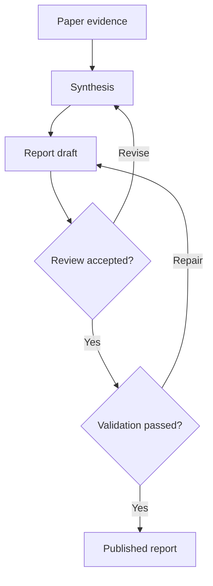
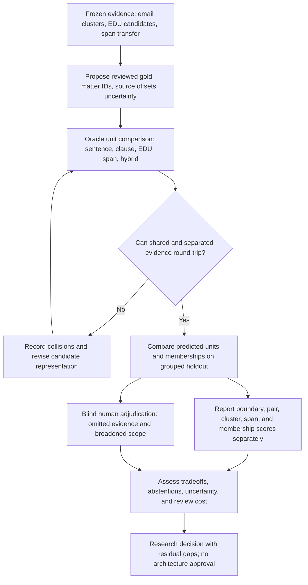

# Structured Research Synthesis: Within-message Topic segmentation and multiple assignments: frozen-corpus research snapshot

*Generated by research-pipeline v0.33.0 on 2026-09-14 18:09 UTC*
*29 papers analyzed*

## Contents

- [Executive Summary](#executive-summary)
- [Scope and Corpus](#scope-and-corpus)
- [Round History](#round-history)
- [Methodology](#methodology)
- [Taxonomy of Approaches](#taxonomy-of-approaches)
- [Evidence Matrix](#evidence-matrix)
- [Recurring Mechanisms and Patterns](#recurring-mechanisms-and-patterns)
- [Assumption Map](#assumption-map)
- [Contradiction Map](#contradiction-map)
- [Evidence Strength Map](#evidence-strength-map)
- [Operational Implications](#operational-implications)
- [Production Readiness](#production-readiness)
- [Reusable Mechanism Inventory](#reusable-mechanism-inventory)
- [Design Implications](#design-implications)
- [Unresolved Questions](#unresolved-questions)
- [Risk Register](#risk-register)
- [Traceability Appendix](#traceability-appendix)

## Executive Summary

The strongest answer is that email Topic assignment needs a richer target than a sequence of boundaries. Direct email studies support grouping separated sentences within a conversation, and their annotation protocols permit several Topics on one sentence. Their evaluated decoders nevertheless produce single-membership partitions. Confidence is HIGH in this distinction and MEDIUM in transfer to concrete business work matters. D01–D03 are one related research line, not three independent replications (D01-F01/F02; D03-F02/F03, PDF pp. 30/15).

No compared unit—sentence, clause, arbitrary span, EDU, or hybrid—is established as best for preserving decision scope. The biggest gap is direct, adjudicated measurement of omitted conditions and broadened action, approval, or reply scope. D08 documents a reformulation that removes context and a confidence assertion; R02 describes loss of quote–comment correspondence. These are concrete source observations, but neither supplies a semantic loss rate (D08 §5, PDF p. 4; R02-F02, PDF p. 8). S01–S04 provide useful representation transfer, with clear limits, rather than email Topic performance.

All 29 frozen papers are analyzed. Their PDFs predate this run, which made zero provider attempts and PDF network requests. D05 remains absent. HAS_GAPS: controlled representation/preservation tests and targeted future evidence work remain necessary. No architecture is approved. At synthesis authoring time for the first attempt, parent acceptance and publication gates were pending. Separate runner, review, and validation records establish publication status.

## Scope and Corpus

| Paper | Title | Authors | Year | Venue |
|-------|-------|---------|------|-------|
| D01 | [Exploiting Conversation Structure in Unsupervised Topic Segmentation for Emails](https://aclanthology.org/D10-1038/) | Shafiq Joty; Giuseppe Carenini; Gabriel Murray; Raymond T. Ng | 2010 | EMNLP 2010 |
| D02 | [Supervised Topic Segmentation of Email Conversations](https://ojs.aaai.org/index.php/ICWSM/article/view/14198) | Shafiq Joty; Giuseppe Carenini; Gabriel Murray; Raymond T. Ng | 2011 | ICWSM 2011 |
| D03 | [Topic Segmentation and Labeling in Asynchronous Conversations](https://arxiv.org/abs/1402.0586) | Shafiq Joty; Giuseppe Carenini; Raymond T. Ng | 2013 | Journal of Artificial Intelligence Research 47 |
| D06 | [Detecting Action-Items in E-mail](https://www.microsoft.com/en-us/research/publication/detecting-action-items-e-mail/) | Paul N. Bennett; Jaime Carbonell | 2005 | SIGIR 2005 poster paper |
| D07 | [Assisting Composition of Email Responses: a Topic Prediction Approach](https://arxiv.org/abs/1510.02049) | Spandana Gella; Marc Dymetman; Jean Michel Renders; Sriram Venkatapathy | 2015 | arXiv manuscript/preprint |
| D08 | [Task-Focused Summarization of Email](https://aclanthology.org/W04-1008/) | Simon Corston-Oliver; Eric Ringger; Michael Gamon; Richard Campbell | 2004 | ACL 2004 workshop: Text Summarization Branches Out |
| R01 | [Detection of Question-Answer Pairs in Email Conversations](https://aclanthology.org/C04-1128/) | Lokesh Shrestha; Kathleen McKeown | 2004 | COLING 2004 |
| R02 | [Applying the Annotation View on Messages for Discussion Search](https://trec.nist.gov/pubs/trec14/papers/uduisburg-essen.ent.pdf) | Ingo Frommholz | 2005 | TREC 2005 Enterprise Track |
| R03 | [Segmenting Email Message Text into Zones](https://aclanthology.org/D09-1096/) | Andrew Lampert; Robert Dale; Cecile Paris | 2009 | EMNLP 2009 |
| R04 | [A Semantic Framework for Modelling Quotes in Email Conversations](https://jodischneider.com/pubs/iswsa2010.pdf) | Alexandre Passant; Antoine Zimmermann; Jodi Schneider; John G. Breslin | 2010 | research manuscript / semantic web workshop artifact |
| R05 | [Detection of Imperative and Declarative Question–Answer Pairs in Email Conversations](https://starlab.ewi.tudelft.nl/papers/n99.pdf) | Helen Kwong; Neil Yorke-Smith | 2012 | AI Communications 25 |
| S01 | [An Effective Transition-based Model for Discontinuous NER](https://aclanthology.org/2020.acl-main.520/) | Xiang Dai; Sarvnaz Karimi; Ben Hachey; Cecile Paris | 2020 | ACL 2020 |
| S02 | [A Span-Based Model for Joint Overlapped and Discontinuous Named Entity Recognition](https://aclanthology.org/2021.acl-long.372/) | Fei Li; Zhichao Lin; Meishan Zhang; Donghong Ji | 2021 | ACL-IJCNLP 2021 |
| S03 | [Discontinuous Named Entity Recognition as Maximal Clique Discovery](https://aclanthology.org/2021.acl-long.63/) | Yucheng Wang; Bowen Yu; Hongsong Zhu; Tingwen Liu; Nan Yu; Limin Sun | 2021 | ACL-IJCNLP 2021 |
| S04 | [Aspect-based Analysis of Advertising Appeals for Search Engine Advertising](https://aclanthology.org/2022.naacl-industry.9/) | Soichiro Murakami; Peinan Zhang; Sho Hoshino; Hidetaka Kamigaito; Hiroya Takamura; Manabu Okumura | 2022 | NAACL 2022 Industry Track |
| T01 | [TextTiling: Segmenting Text into Multi-Paragraph Subtopic Passages](https://www.ischool.berkeley.edu/research/publications/1997/texttiling-segmenting-text-multi-paragraph-subtopic-passages) | Marti A. Hearst | 1997 | Computational Linguistics 23(1) |
| T02 | [A Critique and Improvement of an Evaluation Metric for Text Segmentation](https://aclanthology.org/J02-1002/) | Lev Pevzner; Marti A. Hearst | 2002 | Computational Linguistics 28(1) |
| T03 | [Discourse Segmentation of Multi-Party Conversation](https://aclanthology.org/P03-1071/) | Michel Galley; Kathleen McKeown; Eric Fosler-Lussier; Hongyan Jing | 2003 | ACL 2003 |
| T04 | [Topic Segmentation of Dialogue](https://aclanthology.org/W06-3407/) | Jaime Arguello; Carolyn Rosé | 2006 | ACTS Workshop at HLT-NAACL 2006 |
| T05 | [Automatic Topic Segmentation and Labeling in Multiparty Dialogue](https://www.research.ed.ac.uk/en/publications/automatic-topic-segmentation-and-labeling-in-multiparty-dialogue/) | Pei-Yun Hsueh; Johanna D. Moore | 2006 | IEEE Spoken Language Technology Workshop 2006 |
| T06 | [Bayesian Unsupervised Topic Segmentation](https://aclanthology.org/D08-1035/) | Jacob Eisenstein; Regina Barzilay | 2008 | EMNLP 2008 |
| T07 | [A Joint Model for Document Segmentation and Segment Labeling](https://aclanthology.org/2020.acl-main.29/) | Joe Barrow; Rajiv Jain; Vlad I. Morariu; Varun Manjunatha; Douglas W. Oard; Philip Resnik | 2020 | ACL 2020 |
| T08 | [Joint Dialogue Topic Segmentation and Categorization: A Case Study on Clinical Spoken Conversations](https://aclanthology.org/2023.emnlp-industry.19/) | Zhengyuan Liu; Siti Umairah Md Salleh; Hong Choon Oh; Pavitra Krishnaswamy; Nancy F. Chen | 2023 | EMNLP 2023 Industry Track |
| T09 | [A Unified Supervised and Unsupervised Dialogue Topic Segmentation Framework Based on Utterance Pair Modeling](https://aclanthology.org/2025.naacl-long.252/) | Shihao Yang; Ziyi Zhang; Yue Jiang; Chunsheng Qin; Shuhua Liu | 2025 | NAACL 2025 |
| T10 | [Def-DTS: Deductive Reasoning for Open-domain Dialogue Topic Segmentation](https://aclanthology.org/2025.findings-acl.1066/) | Seungmin Lee; Yongsang Yoo; Minhwa Jung; Min Song | 2025 | Findings of ACL 2025 |
| T11 | [Leveraging Summarization for Unsupervised Dialogue Topic Segmentation](https://aclanthology.org/2024.findings-naacl.291/) | Aleksei Artemiev; Daniil Parinov; Alexey Grishanov; Ivan Borisov; Alexey Vasilev; Daniil Muravetskii; Aleksey Rezvykh; Aleksei Goncharov; Andrey Savchenko | 2024 | Findings of NAACL 2024 |
| T12 | [CobSeg: Coherence Boundary Modeling for Dialogue Topic Segmentation](https://arxiv.org/abs/2605.30668) | Sijin Sun; Liangbin Zhao; Jiaxiang Cai; Ming Deng; Mingyu Luo; Xiuju Fu | 2026 | arXiv preprint, 2026 |
| U01 | [The DISRPT 2019 Shared Task on Elementary Discourse Unit Segmentation and Connective Detection](https://aclanthology.org/W19-2713/) | Amir Zeldes; Debopam Das; Erick Galani Maziero; Juliano Desiderato Antonio; Mikel Iruskieta | 2019 | Workshop on Discourse Relation Parsing and Treebanking 2019 |
| U02 | [Segmenting a French Meeting Corpus into Elementary Discourse Units](https://aclanthology.org/2025.sigdial-1.14/) | Laurent Prévot; Roxane Bertrand; Julie Hunter | 2025 | SIGDIAL 2025 |

## Round History

| Actual round | Run ID | Screened | Analyzed | New PDF downloads inside run | Status |
| --- | --- | ---: | ---: | ---: | --- |
| 1 | topic02-r1-20260914T140020Z | 29 | 29 | 0 | Frozen-corpus research snapshot; publication gates pending at synthesis authoring time (first attempt) |

Only one actual round ran. The user froze round 1 and disallowed acquisition here, so work stops with known gaps. This does not establish convergence or literature exhaustion. Historical acquisition comprised 24 manually network-acquired PDFs and five reused source-byte copies; those events preceded this run. Current download records are skipped_exists.

## Methodology

- Scope follows WORKER_REQUIREMENTS.md, Topic 02 BRIEF.md, and the authoritative English project briefs. Topic means a concrete work matter, not a Group or conversation. Research changes no design document.

- All 29 frozen records were selected. Publication years span 1997–2026; January 1 timestamps are year-only placeholders. source_coverage.json records partial frozen-local coverage, zero provider attempts, and zero PDF network requests; no current search window ran.

- The integrity audit reports 29 distinct PDF hashes, 355 pages, and no errors. Distinct hashes do not imply independent data. R01–R05 reuse bytes with fresh analyses; D01–D03 share BC3/data and a research line (D03 PDF p.45, bibliographic note; D03.pages.md:2671–2679).

- Primary inputs are selected full-text analyses, semantic/escalation reviews, verified_claims.json, screening, and local source checks. The heuristic synthesis scaffold was not used. Source-described methods, illustrations, measured results, interpretations, and proposals are distinguished. Unsupported can mean not experimentally tested, not absent from the source.

- Frozen metadata is unchanged. Corpus display adopts Helen Kwong from R05 PDF p.1, convert_rough/R05.md:10, replacing Chee Wei Kwong; T04 PDF p.1, T04.raw.txt:1–2 supplies ACTS Workshop at HLT-NAACL instead of SIGdial. D07 remains manuscript/preprint; T12 remains a 2026 preprint. URLs are frozen, not current-availability checks.

- HIGH means strong bounded support; MEDIUM means qualified interpretation; LOW marks untested effectiveness. Counts do not measure independence. Results are author-reported unless labeled calculated. Unknown denominators, IAA, implementation, and controls remain unknown; full tables are linked in each analysis. Source inconsistencies remain unresolved unless explicitly resolved in their issue entry; printed numbers are preserved.

- Locators use physical PDF pages and LF lines; form feeds do not add lines. In issue entries p denotes PDF page and L denotes line in the linked text, unless another source is named. Traceability links findings to exact text; full JSON retains section metadata. Local quote checks do not reproduce experiments or establish current code/data availability.

The publication workflow below describes the required checks; the separate
validation record establishes whether this specific draft passed.

For a finding $f$, let $\mathcal{P}_f$ be its cited corpus papers. The support
count $s(f) = |\mathcal{P}_f|$ measures traceability; it does not establish that
the finding is true or independently replicated.

## Taxonomy of Approaches

- **Confidence: HIGH** Scope matrix: evidence families indicate relevance, not interchangeable levels of success.

| Family | Papers | Contribution | Transfer boundary |
| --- | --- | --- | --- |
| DIRECT_EMAIL | D01–D03 | Within-conversation sentence clusters; D03 also labels clusters | Shared BC3/W3C line; no modern business-span validation |
| DIRECT_EMAIL_SUPPORT | D06–D08, R01–R05 | Action detection, reply-topic prediction, Q–A links, zones, quotation representation/retrieval | Supporting tasks do not establish Topic membership accuracy |
| DIRECT_WORK | T03–T05, T08–T12, U02 | Meeting, educational, clinical, service, or open-dialogue boundaries/units | Family name does not make these direct email experiments |
| TRANSFER_SEGMENTATION | T01, T02, T06, T07 | Linear partitions, metric behavior, joint segment labeling | Document/task assumptions require separate testing |
| TRANSFER_DISCOURSE_UNIT | U01 | EDU unit definitions and evaluation | EDU/connective detection only |
| TRANSFER_SPAN | S01–S04 | Shared/discontinuous mentions and same-interval aspect labels | NER/advertising targets, not work-matter identity |

Sources: [D03-F01:PDF2:D03.pages.md:L97–100](/home/grammy-jiang/Projects/msgloom/research/02-message-topic-segmentation/analysis-runs/topic02-r1-20260914T140020Z/local-text/D03.pages.md:97); [D06-F02:PDF1:D06.raw.txt:L88–99](/home/grammy-jiang/Projects/msgloom/research/02-message-topic-segmentation/analysis-runs/topic02-r1-20260914T140020Z/local-text/D06.raw.txt:88); [T04-F01:PDF2:T04.raw.txt:L97–101](/home/grammy-jiang/Projects/msgloom/research/02-message-topic-segmentation/analysis-runs/topic02-r1-20260914T140020Z/local-text/T04.raw.txt:97); [T07-F03:PDF5:T07.raw.txt:L403–404](/home/grammy-jiang/Projects/msgloom/research/02-message-topic-segmentation/analysis-runs/topic02-r1-20260914T140020Z/local-text/T07.raw.txt:403); [U01-F01:PDF1:U01.raw.txt:L99–102](/home/grammy-jiang/Projects/msgloom/research/02-message-topic-segmentation/analysis-runs/topic02-r1-20260914T140020Z/local-text/U01.raw.txt:99); [S04-F01:PDF3:S04.md:L251–262](/home/grammy-jiang/Projects/msgloom/research/02-message-topic-segmentation/analysis-runs/topic02-r1-20260914T140020Z/runs/topic02-r1-20260914T140020Z/convert_rough/S04.md:251).

[D03, D06, S04, T04, T07, U01]

- **Confidence: HIGH** Ten distinct tasks define the research target. Success on one cannot replace evaluation of another.

| Task | Output and corpus evidence | Required distinction |
| --- | --- | --- |
| 1. Topic-boundary detection | A gap decision; T01–T12 where applicable | A gap has no persistent work-matter identity |
| 2. Contiguous topic segmentation | A linear partition; T01/T03–T12 | Recurrence needs an additional identity relation |
| 3. Segment topic labeling | D03 descriptions; T05/T07/T08 category/header labels | Label quality differs from source assignment |
| 4. Whole-message multi-label classification | No direct simultaneous-message result; S04 whole-ad labels | D07 next-sentence top-K alternatives are different; ads are transfer |
| 5. Exact span assignment | S01–S03 mention boundaries; S04 character intervals | Exact work-Topic spans remain unevaluated |
| 6. Overlapping span assignment | S01–S03 shared mention fragments; S04 coincident labels | Shared offsets, nested boundaries, and type sets differ |
| 7. Non-contiguous assignment to one Topic | D01–D03 nonsequential sentence clusters | Within-one-email gold/prediction scores remain missing |
| 8. Discourse/EDU segmentation | U01/U02 boundary units | EDU boundaries do not identify work matters |
| 9. Action/question/reply-scope extraction | D06/D08 action detection; R01/R05 Q–A pairing; R04 links | Candidate selection, pairing, and complete scope differ |
| 10. Preservation of decision-bearing conditions/evidence/scope | Described risks and examples, no direct rate | Requires independent semantic adjudication |

Sources: [D07-F02:PDF8:D07.raw.txt:L848–848](/home/grammy-jiang/Projects/msgloom/research/02-message-topic-segmentation/analysis-runs/topic02-r1-20260914T140020Z/local-text/D07.raw.txt:848); [D03-F09:PDF40:D03.pages.md:L2399–2399](/home/grammy-jiang/Projects/msgloom/research/02-message-topic-segmentation/analysis-runs/topic02-r1-20260914T140020Z/local-text/D03.pages.md:2399); [S01-F03:PDF7:S01.raw.txt:L622–622](/home/grammy-jiang/Projects/msgloom/research/02-message-topic-segmentation/analysis-runs/topic02-r1-20260914T140020Z/local-text/S01.raw.txt:622); [U02-F09:PDF8:U02.raw.txt:L693–693](/home/grammy-jiang/Projects/msgloom/research/02-message-topic-segmentation/analysis-runs/topic02-r1-20260914T140020Z/local-text/U02.raw.txt:693); [R05-F06:PDF8:R05.md:L837–839](/home/grammy-jiang/Projects/msgloom/research/02-message-topic-segmentation/analysis-runs/topic02-r1-20260914T140020Z/runs/topic02-r1-20260914T140020Z/convert_rough/R05.md:837).

[D03, D07, R05, S01, U02]

- **Confidence: MEDIUM** RQ1—No sentence, clause, span, EDU, or hybrid unit is established as best for preserving work scope. D06 improves document action detection through sentence supervision after a 30% phrase-to-sentence projection; it does not compare semantic completeness. R05 observes short-versus-long Q/A annotations while predicting sentences. R03 compares lines/fragments with different denominators and modal fragment gold. U01/U02 define useful EDU candidates, but reasons and restrictions can occupy separate units. T04 reports gold-exchange benefits without topic results from predicted exchanges; S04 separates oracle-span and predicted-span scores. These are unit clues, not a controlled preservation comparison. Residual gap: compare oracle representability, predicted units, and conditional/approval/reply scope on identical reviewed examples. Sources: [D06-F02:PDF1:D06.raw.txt:L88–99](/home/grammy-jiang/Projects/msgloom/research/02-message-topic-segmentation/analysis-runs/topic02-r1-20260914T140020Z/local-text/D06.raw.txt:88); [R05-F05:PDF10:R05.md:L1054–1055](/home/grammy-jiang/Projects/msgloom/research/02-message-topic-segmentation/analysis-runs/topic02-r1-20260914T140020Z/runs/topic02-r1-20260914T140020Z/convert_rough/R05.md:1054); [R03-F06:PDF6:R03.raw.txt:L479–491](/home/grammy-jiang/Projects/msgloom/research/02-message-topic-segmentation/analysis-runs/topic02-r1-20260914T140020Z/local-text/R03.raw.txt:479); [U01-F01:PDF1:U01.raw.txt:L99–102](/home/grammy-jiang/Projects/msgloom/research/02-message-topic-segmentation/analysis-runs/topic02-r1-20260914T140020Z/local-text/U01.raw.txt:99); [U02-F09:PDF8:U02.raw.txt:L693–693](/home/grammy-jiang/Projects/msgloom/research/02-message-topic-segmentation/analysis-runs/topic02-r1-20260914T140020Z/local-text/U02.raw.txt:693); [T04-F03:PDF7:T04.raw.txt:L659–672](/home/grammy-jiang/Projects/msgloom/research/02-message-topic-segmentation/analysis-runs/topic02-r1-20260914T140020Z/local-text/T04.raw.txt:659); [S04-F04:PDF5:S04.md:L554–557](/home/grammy-jiang/Projects/msgloom/research/02-message-topic-segmentation/analysis-runs/topic02-r1-20260914T140020Z/runs/topic02-r1-20260914T140020Z/convert_rough/S04.md:554). [D06, R03, R05, S04, T04, U01, U02]

## Evidence Matrix

| Paper | Methods | Results | Assumptions | Limitations |
|-------|---------|---------|-------------|-------------|
| D01 | FQG-enhanced LDA/LCSeg; BC3/W3C email sentence clusters. | 39 annotated threads: LCSeg+FQG mean 1-to-1/loc3 0.68/0.71 versus LCSeg 0.62/0.72. Global gain p=0.0014; local decline nonsignificant. Sources: [D01-F04:PDF10:D01.raw.txt:L835–843](/home/grammy-jiang/Projects/msgloom/research/02-message-topic-segmentation/analysis-runs/topic02-r1-20260914T140020Z/local-text/D01.raw.txt:835). | Human-derived K; INTRO/END excluded; no held-out split. Cluster-overlap denominator is evaluated sentences; local early-position/multilabel rules absent. | Shared line; gold overlap scoring unknown. [Details](/home/grammy-jiang/Projects/msgloom/research/02-message-topic-segmentation/analysis-runs/topic02-r1-20260914T140020Z/runs/topic02-r1-20260914T140020Z/analysis/D01.analysis.md). |
| D02 | Pair LR then graph partition; BC3 email. | Leave-one-conversation-out pair accuracy 69.1%, same-class P/R 68.4/81.5%. Cluster mean 1-to-1/loc3 0.70/0.75 versus 0.68/0.71. Sources: [D02-F02:PDF2:D02.raw.txt:L189–189](/home/grammy-jiang/Projects/msgloom/research/02-message-topic-segmentation/analysis-runs/topic02-r1-20260914T140020Z/local-text/D02.raw.txt:189); [D02-F03:PDF4:D02.raw.txt:L393–395](/home/grammy-jiang/Projects/msgloom/research/02-message-topic-segmentation/analysis-runs/topic02-r1-20260914T140020Z/local-text/D02.raw.txt:393). | 39 conversations; 14,528 pairs reported; source 3,200-sentence bridge missing. Human K; inner-fold grouping unspecified. | Correlated pairs; population bridge missing. [Details](/home/grammy-jiang/Projects/msgloom/research/02-message-topic-segmentation/analysis-runs/topic02-r1-20260914T140020Z/runs/topic02-r1-20260914T140020Z/analysis/D02.analysis.md). |
| D03 | Asynchronous sentence clustering plus cluster-description labeling. | Email SUP 1-to-1/loc3 72.3/75.8%; blog 48.5/77.2%. Table 8 compares each conversation with three references. Sources: [D03-F08:PDF38:D03.pages.md:L2278–2280](/home/grammy-jiang/Projects/msgloom/research/02-message-topic-segmentation/analysis-runs/topic02-r1-20260914T140020Z/local-text/D03.pages.md:2278); [D03-F09:PDF40:D03.pages.md:L2399–2399](/home/grammy-jiang/Projects/msgloom/research/02-message-topic-segmentation/analysis-runs/topic02-r1-20260914T140020Z/local-text/D03.pages.md:2399). | 40 email/20 blog conversations reported; human K; supervised conversation holdout. Gold-label tests: 269/562 annotator-specific clusters. | Related data; reference-selected best-of-k labels. [Details](/home/grammy-jiang/Projects/msgloom/research/02-message-topic-segmentation/analysis-runs/topic02-r1-20260914T140020Z/runs/topic02-r1-20260914T140020Z/analysis/D03.analysis.md). |
| D06 | Sentence-supervised action-item detection, university email. | Document F1 0.7790 for sentence n-gram kNN; sentence F1 0.6686. Accuracy has a different all-item denominator. Sources: [D06-F03:PDF2:D06.raw.txt:L156–159](/home/grammy-jiang/Projects/msgloom/research/02-message-topic-segmentation/analysis-runs/topic02-r1-20260914T140020Z/local-text/D06.raw.txt:156); [D06-F05:PDF2:D06.raw.txt:L178–183](/home/grammy-jiang/Projects/msgloom/research/02-message-topic-segmentation/analysis-runs/topic02-r1-20260914T140020Z/local-text/D06.raw.txt:178). | 744 deduplicated messages, 328 positive; ten-fold document grouping. P denominator predicted positives, R reference positives; sentence totals absent. | Quote removal; no exact scope score. [Details](/home/grammy-jiang/Projects/msgloom/research/02-message-topic-segmentation/analysis-runs/topic02-r1-20260914T140020Z/runs/topic02-r1-20260914T140020Z/analysis/D06.analysis.md). |
| D07 | Silver-LDA reply-topic prediction; UK telecom first query/reply pairs. | T2 top-1/top-5 0.471/0.802, BC 0.614; T1 response Recall@1 52.5% among five candidates. Sources: [D07-F02:PDF8:D07.raw.txt:L848–848](/home/grammy-jiang/Projects/msgloom/research/02-message-topic-segmentation/analysis-runs/topic02-r1-20260914T140020Z/local-text/D07.raw.txt:848); [D07-F04:PDF7:D07.raw.txt:L723–724](/home/grammy-jiang/Projects/msgloom/research/02-message-topic-segmentation/analysis-runs/topic02-r1-20260914T140020Z/local-text/D07.raw.txt:723). | 38,650 train/9,660 test pairs; 50 topics. T2 denominator held-out agent sentences, exact count absent; T1 denominator held-out pairs. | Silver targets; manuscript/preprint. [Details](/home/grammy-jiang/Projects/msgloom/research/02-message-topic-segmentation/analysis-runs/topic02-r1-20260914T140020Z/runs/topic02-r1-20260914T140020Z/analysis/D07.analysis.md). |
| D08 | SmartMail Task/non-Task sentence classification and any-positive message flag. | Blind-test precision–recall curves favor full features in reported recall ranges; no exact scalar F1 supplied. Message curves measure at least one task. Sources: [D08-F03:PDF3:D08.raw.txt:L213–220](/home/grammy-jiang/Projects/msgloom/research/02-message-topic-segmentation/analysis-runs/topic02-r1-20260914T140020Z/local-text/D08.raw.txt:213); [D08-F04:PDF3:D08.raw.txt:L228–230](/home/grammy-jiang/Projects/msgloom/research/02-message-topic-segmentation/analysis-runs/topic02-r1-20260914T140020Z/local-text/D08.raw.txt:228). | 14,535 train messages/106,700 body sentences; 507 development/699 test messages. Positive sentence/task counts absent. | Any-task detection differs from complete recovery. [Details](/home/grammy-jiang/Projects/msgloom/research/02-message-topic-segmentation/analysis-runs/topic02-r1-20260914T140020Z/runs/topic02-r1-20260914T140020Z/analysis/D08.analysis.md). |
| R01 | Interrogative detection and paragraph Q–A pair linking, ACM event-planning email. | Union pair P/R/F1 0.698/0.619/0.656; cosine-only 0.610/0.429/0.503. Sources: [R01-F01:PDF6:R01.raw.txt:L535–540](/home/grammy-jiang/Projects/msgloom/research/02-message-topic-segmentation/analysis-runs/topic02-r1-20260914T140020Z/local-text/R01.raw.txt:535). | Five-fold CV: 430 candidate pairs, 168 positive, 118 question segments, 97 QA-containing threads. Grouping unspecified; answered annotated questions only. | Answered-question conditioning; test-adapted question detector. [Details](/home/grammy-jiang/Projects/msgloom/research/02-message-topic-segmentation/analysis-runs/topic02-r1-20260914T140020Z/runs/topic02-r1-20260914T140020Z/analysis/R01.analysis.md). |
| R02 | Quotation/context-weighted query-message retrieval, W3C. | Corrected rerun MAP 0.3174 combined versus baseline 0.2565. Highlight-only P@5 0.5186 versus 0.4678, but MAP 0.2460. Sources: [R02-F05:PDF11:R02.pages.md:L566–570](/home/grammy-jiang/Projects/msgloom/research/02-message-topic-segmentation/analysis-runs/topic02-r1-20260914T140020Z/local-text/R02.pages.md:566); [R02-F06:PDF12:R02.pages.md:L651–655](/home/grammy-jiang/Projects/msgloom/research/02-message-topic-segmentation/analysis-runs/topic02-r1-20260914T140020Z/local-text/R02.pages.md:651). | Query count/split absent. MAP averages query AP; P@5 uses first five retrieval slots per query. Exact relevant-document counting unspecified. | Merged blocks lose correspondence. [Details](/home/grammy-jiang/Projects/msgloom/research/02-message-topic-segmentation/analysis-runs/topic02-r1-20260914T140020Z/runs/topic02-r1-20260914T140020Z/analysis/R02.analysis.md). |
| R03 | SVM functional zones on lines or heuristic fragments, Enron. | Nine-zone line accuracy 87.01%, fragment accuracy 86.45%. Boundary recall/precision 90.15%/22.5%. Sources: [R03-F07:PDF8:R03.raw.txt:L623–627](/home/grammy-jiang/Projects/msgloom/research/02-message-topic-segmentation/analysis-runs/topic02-r1-20260914T140020Z/local-text/R03.raw.txt:623); [R03-F04:PDF6:R03.raw.txt:L449–465](/home/grammy-jiang/Projects/msgloom/research/02-message-topic-segmentation/analysis-runs/topic02-r1-20260914T140020Z/local-text/R03.raw.txt:449). | Ten-fold CV; 7,922 nonblank lines; confusion diagonal 6,893. Fragment and boundary counts absent; fold grouping unknown. | Single annotator; modal fragment gold. [Details](/home/grammy-jiang/Projects/msgloom/research/02-message-topic-segmentation/analysis-runs/topic02-r1-20260914T140020Z/runs/topic02-r1-20260914T140020Z/analysis/R03.analysis.md). |
| R04 | Quote/Response/Block ontology and regex extraction, OWL-WG email. | 7,074 messages processed; 2,168 inline-reply messages; 10,146 blocks; about 40 seconds on stated MacBook Pro. ISSUE/+1 query returns two author-described relevant blocks. Sources: [R04-F05:PDF5:R04.raw.txt:L495–503](/home/grammy-jiang/Projects/msgloom/research/02-message-topic-segmentation/analysis-runs/topic02-r1-20260914T140020Z/local-text/R04.raw.txt:495); [R04-F06:PDF5:R04.raw.txt:L545–547](/home/grammy-jiang/Projects/msgloom/research/02-message-topic-segmentation/analysis-runs/topic02-r1-20260914T140020Z/local-text/R04.raw.txt:545). | One archive workload; counts measure generated objects, not TP/FP. No annotated semantic extraction test denominator. | Semantic accuracy and device transfer untested. [Details](/home/grammy-jiang/Projects/msgloom/research/02-message-topic-segmentation/analysis-runs/topic02-r1-20260914T140020Z/runs/topic02-r1-20260914T140020Z/analysis/R04.analysis.md). |
| R05 | Question detection and sentence-answer heuristics, Enron/CSpace. | Balanced 700-sentence Regex test F1 0.907. Annotator-1 Heuristic-LR pair LCS/SM F1 0.4982/0.6021; annotator-2 0.5670/0.4597. Sources: [R05-F02:PDF7:R05.md:L689–689](/home/grammy-jiang/Projects/msgloom/research/02-message-topic-segmentation/analysis-runs/topic02-r1-20260914T140020Z/runs/topic02-r1-20260914T140020Z/convert_rough/R05.md:689); [R05-F04:PDF9:R05.md:L941–941](/home/grammy-jiang/Projects/msgloom/research/02-message-topic-segmentation/analysis-runs/topic02-r1-20260914T140020Z/runs/topic02-r1-20260914T140020Z/convert_rough/R05.md:941). | About 90 QA threads per annotator; five-fold CV and 50 replications; fold allocation/pair counts unspecified. Detection set has 350 questions/350 nonquestions. | Tolerant matching; unresolved runtime statistics. [Details](/home/grammy-jiang/Projects/msgloom/research/02-message-topic-segmentation/analysis-runs/topic02-r1-20260914T140020Z/runs/topic02-r1-20260914T140020Z/analysis/R05.analysis.md). |
| S01 | Transition-based biomedical mention extraction. | Full-test strict micro mention F1: CADEC/ShARe13/ShARe14 69.0/77.7/79.6%; discontinuous-only 37.9/52.5/49.2%. Sources: [S01-F03:PDF7:S01.raw.txt:L622–622](/home/grammy-jiang/Projects/msgloom/research/02-message-topic-segmentation/analysis-runs/topic02-r1-20260914T140020Z/local-text/S01.raw.txt:622); [S01-F04:PDF6:S01.raw.txt:L592–596](/home/grammy-jiang/Projects/msgloom/research/02-message-topic-segmentation/analysis-runs/topic02-r1-20260914T140020Z/local-text/S01.raw.txt:592). | CADEC post split 70/15/remainder; ShARe official train/test, 10% train development. Exact subset predicted/gold counts absent. | Subset definitions and overlap failures matter. [Details](/home/grammy-jiang/Projects/msgloom/research/02-message-topic-segmentation/analysis-runs/topic02-r1-20260914T140020Z/runs/topic02-r1-20260914T140020Z/analysis/S01.analysis.md). |
| S02 | Typed spans and fragment relations; NER. | Entity F1 CLEF 83.2, CLEF-Dis 63.3, CADEC 69.5, GENIA 77.8, ACE05 83.0. Sources: [S02-F04:PDF7:S02.raw.txt:L664–669](/home/grammy-jiang/Projects/msgloom/research/02-message-topic-segmentation/analysis-runs/topic02-r1-20260914T140020Z/local-text/S02.raw.txt:664); [S02-F05:PDF8:S02.raw.txt:L773–775](/home/grammy-jiang/Projects/msgloom/research/02-message-topic-segmentation/analysis-runs/topic02-r1-20260914T140020Z/local-text/S02.raw.txt:773). | Experimental test interpretation; five-run Section 5 statement, Figure 5 one-run exception. Exact type/all-component match; entity totals absent. | CLEF-Dis includes continuous mentions; split conflict. [Details](/home/grammy-jiang/Projects/msgloom/research/02-message-topic-segmentation/analysis-runs/topic02-r1-20260914T140020Z/runs/topic02-r1-20260914T140020Z/analysis/S02.analysis.md). |
| S03 | Token-pair tags and maximal-clique NER decoding. | Full-test CADEC/ShARe13/ShARe14 F1 71.5/81.2/81.3%; discontinuous-only 44.4/55.9/54.1%. Sources: [S03-F03:PDF6:S03.raw.txt:L656–656](/home/grammy-jiang/Projects/msgloom/research/02-message-topic-segmentation/analysis-runs/topic02-r1-20260914T140020Z/local-text/S03.raw.txt:656); [S03-F04:PDF7:S03.raw.txt:L709–710](/home/grammy-jiang/Projects/msgloom/research/02-message-topic-segmentation/analysis-runs/topic02-r1-20260914T140020Z/local-text/S03.raw.txt:709). | Test score from median-development run of five, not mean test score. Mention matching/aggregation details incomplete; subgroup counts mostly absent. | Shared lineage; encoding collisions. [Details](/home/grammy-jiang/Projects/msgloom/research/02-message-topic-segmentation/analysis-runs/topic02-r1-20260914T140020Z/runs/topic02-r1-20260914T140020Z/analysis/S03.analysis.md). |
| S04 | Japanese ad character spans with multiple aspect labels; whole-ad baseline. | 410-ad test macro F1: predicted span+label 0.32; oracle-span label 0.46; whole-ad label 0.56. Separate span-detection F1 0.69. Sources: [S04-F04:PDF5:S04.md:L554–557](/home/grammy-jiang/Projects/msgloom/research/02-message-topic-segmentation/analysis-runs/topic02-r1-20260914T140020Z/runs/topic02-r1-20260914T140020Z/convert_rough/S04.md:554); [S04-F05:PDF5:S04.md:L602–611](/home/grammy-jiang/Projects/msgloom/research/02-message-topic-segmentation/analysis-runs/topic02-r1-20260914T140020Z/runs/topic02-r1-20260914T140020Z/convert_rough/S04.md:602). | 1,857/465/410 train/development/test ads; macro over labels, label-span TP requires boundaries and label. Exact TP/FP/FN counts absent. | Encoder differences; overlap frequency unknown. [Details](/home/grammy-jiang/Projects/msgloom/research/02-message-topic-segmentation/analysis-runs/topic02-r1-20260914T140020Z/runs/topic02-r1-20260914T140020Z/analysis/S04.analysis.md). |
| T01 | TextTiling lexical boundaries, magazine articles. | 12-article liberal block-comparison boundary P/R 0.66/0.75; conservative 0.71/0.59. Separate WSJ seam test uses ±3-sentence tolerance. Sources: [T01-F02:PDF24:T01.visual-transcription.md:L417–420](/home/grammy-jiang/Projects/msgloom/research/02-message-topic-segmentation/analysis-runs/topic02-r1-20260914T140020Z/runs/topic02-r1-20260914T140020Z/analysis/T01/T01.visual-transcription.md:417); [T01-F08:PDF27:T01.visual-transcription.md:L557–565](/home/grammy-jiang/Projects/msgloom/research/02-message-topic-segmentation/analysis-runs/topic02-r1-20260914T140020Z/runs/topic02-r1-20260914T140020Z/analysis/T01/T01.visual-transcription.md:557). | Seven readers/article; gold ≥3/7; tuning on evaluated texts. P counts selected gaps; R consensus gaps; counts absent. | Visual transcription resolves conversion damage. [Details](/home/grammy-jiang/Projects/msgloom/research/02-message-topic-segmentation/analysis-runs/topic02-r1-20260914T140020Z/runs/topic02-r1-20260914T140020Z/analysis/T01.analysis.md). |
| T02 | Synthetic analysis of Pk and WindowDiff. | Uniform segment sizes (20,30), error probability 0.5: mean Pk FN 0.245 versus FP 0.128. These are generated-error penalties. Sources: [T02-F01:PDF11:T02.pages.md:L603–605](/home/grammy-jiang/Projects/msgloom/research/02-message-topic-segmentation/analysis-runs/topic02-r1-20260914T140020Z/local-text/T02.pages.md:603); [T02-F02:PDF8:T02.pages.md:L433–436](/home/grammy-jiang/Projects/msgloom/research/02-message-topic-segmentation/analysis-runs/topic02-r1-20260914T140020Z/local-text/T02.pages.md:433). | Ten trials, 1,000 reference segments/trial, 100 perturbations/trial; WD denominator N−k. Unit and k rounding unspecified. | Metric simulation, not model performance. [Details](/home/grammy-jiang/Projects/msgloom/research/02-message-topic-segmentation/analysis-runs/topic02-r1-20260914T140020Z/runs/topic02-r1-20260914T140020Z/analysis/T02.analysis.md). |
| T03 | Lexical and conversational meeting boundaries, ICSI. | Combined model mean held-out Pk/WD 23.00/25.47%; text-only unknown-count LCseg 31.91/35.88%. Sources: [T03-F02:PDF5:T03.raw.txt:L393–397](/home/grammy-jiang/Projects/msgloom/research/02-message-topic-segmentation/analysis-runs/topic02-r1-20260914T140020Z/local-text/T03.raw.txt:393); [T03-F03:PDF7:T03.raw.txt:L614–618](/home/grammy-jiang/Projects/msgloom/research/02-message-topic-segmentation/analysis-runs/topic02-r1-20260914T140020Z/local-text/T03.raw.txt:614). | 25 meeting folds; train on 24. Boundary-window counts and exact scoring k absent; cue induction scope not fully specified. | Speech transfer; Q is not agreement magnitude. [Details](/home/grammy-jiang/Projects/msgloom/research/02-message-topic-segmentation/analysis-runs/topic02-r1-20260914T140020Z/runs/topic02-r1-20260914T140020Z/analysis/T03.analysis.md). |
| T04 | Role-specific Museli dialogue boundaries; educational chat. | Thermo Pk/F 0.4043/0.3693; gold-exchange restriction 0.3737/0.3897. Automatic exchange F 0.53 is a different target. Sources: [T04-F02:PDF5:T04.raw.txt:L395–407](/home/grammy-jiang/Projects/msgloom/research/02-message-topic-segmentation/analysis-runs/topic02-r1-20260914T140020Z/local-text/T04.raw.txt:395); [T04-F03:PDF7:T04.raw.txt:L659–672](/home/grammy-jiang/Projects/msgloom/research/02-message-topic-segmentation/analysis-runs/topic02-r1-20260914T140020Z/local-text/T04.raw.txt:659). | 22 Thermo and 42 physics chats; dialogue-disjoint ten-fold Museli CV. Exact boundary/window counts absent; baselines tuned on full test. | No predicted-exchange topic result. [Details](/home/grammy-jiang/Projects/msgloom/research/02-message-topic-segmentation/analysis-runs/topic02-r1-20260914T140020Z/runs/topic02-r1-20260914T140020Z/analysis/T04.analysis.md). |
| T05 | AMI contiguous TOP/SUB segmentation; separate segment-label classification. | Unknown-count CM TOP Pk/WD 0.33/0.33, SUB 0.36/0.36. LL-Q1 Functional/Top-Level/Sub-Topic label F1 0.62/0.53/0.44. Sources: [T05-F02:PDF3:T05.raw.txt:L249–250](/home/grammy-jiang/Projects/msgloom/research/02-message-topic-segmentation/analysis-runs/topic02-r1-20260914T140020Z/local-text/T05.raw.txt:249); [T05-F03:PDF3:T05.raw.txt:L274–274](/home/grammy-jiang/Projects/msgloom/research/02-message-topic-segmentation/analysis-runs/topic02-r1-20260914T140020Z/local-text/T05.raw.txt:274). | Five-fold claim; six four-meeting training series and one unseen test series/fold; unique roster absent. Supplied-segment labeling; class supports absent. | Invalid 9.52 cell retained. [Details](/home/grammy-jiang/Projects/msgloom/research/02-message-topic-segmentation/analysis-runs/topic02-r1-20260914T140020Z/runs/topic02-r1-20260914T140020Z/analysis/T05.analysis.md). |
| T06 | Bayesian sentence partitions with supplied segment count. | Textbook BAYESSEG Pk/WD 0.339/0.353; ICSI BAYESSEG-CUE-PROP 0.258/0.312. Sources: [T06-F03:PDF8:T06.raw.txt:L777–778](/home/grammy-jiang/Projects/msgloom/research/02-message-topic-segmentation/analysis-runs/topic02-r1-20260914T140020Z/local-text/T06.raw.txt:777); [T06-F04:PDF8:T06.raw.txt:L784–786](/home/grammy-jiang/Projects/msgloom/research/02-message-topic-segmentation/analysis-runs/topic02-r1-20260914T140020Z/local-text/T06.raw.txt:784). | 227 textbook chapters/1,136 sections; 25 annotated ICSI meetings within 75. Cue results average five runs; scoring windows/counts absent. | Memory partitions, not cross-validation. [Details](/home/grammy-jiang/Projects/msgloom/research/02-message-topic-segmentation/analysis-runs/topic02-r1-20260914T140020Z/runs/topic02-r1-20260914T140020Z/analysis/T06.analysis.md). |
| T07 | Joint Wikipedia section boundaries and labels. | Oracle de_disease header Prec@1/MAP 43.3/53.3 versus 42.3/52.1; predicted-boundary joint Pk 19.1 versus 21.8 without label loss. Sources: [T07-F09:PDF8:T07.raw.txt:L802–803](/home/grammy-jiang/Projects/msgloom/research/02-message-topic-segmentation/analysis-runs/topic02-r1-20260914T140020Z/local-text/T07.raw.txt:802). | Separate Table 4/5 settings; micro-averaging stated, aligned-label counts/MAP reduction incomplete; exact split sizes absent. | Aligned labels are not overlapping output. [Details](/home/grammy-jiang/Projects/msgloom/research/02-message-topic-segmentation/analysis-runs/topic02-r1-20260914T140020Z/runs/topic02-r1-20260914T140020Z/analysis/T07.analysis.md). |
| T08 | Clinical-call utterance boundaries and gold-segment categories. | DSE + Windowed Encoding Pk/WD/macro-F1 0.2159/0.1252/0.7853; gold-category F1 0.8110. Sources: [T08-F03:PDF5:T08.raw.txt:L346–346](/home/grammy-jiang/Projects/msgloom/research/02-message-topic-segmentation/analysis-runs/topic02-r1-20260914T140020Z/local-text/T08.raw.txt:346); [T08-F04:PDF5:T08.raw.txt:L403–405](/home/grammy-jiang/Projects/msgloom/research/02-message-topic-segmentation/analysis-runs/topic02-r1-20260914T140020Z/local-text/T08.raw.txt:403). | 865 transcripts, 16 categories; ambiguous 8% validation/test wording. Exact windows/positives/segment counts absent. | Gold-informed chunks; conditional metric conflicts. [Details](/home/grammy-jiang/Projects/msgloom/research/02-message-topic-segmentation/analysis-runs/topic02-r1-20260914T140020Z/runs/topic02-r1-20260914T140020Z/analysis/T08.analysis.md). |
| T09 | UPS utterance-pair boundary modeling; distinct supervision regimes. | Supervised TIAGE Pk/WD/F1 25.6/28.1/59.1%; few-shot 34.5/36.2/47.6%. Unsupervised Doc2Dial macro F1 78.4%. Sources: [T09-F04:PDF6:T09.raw.txt:L630–631](/home/grammy-jiang/Projects/msgloom/research/02-message-topic-segmentation/analysis-runs/topic02-r1-20260914T140020Z/local-text/T09.raw.txt:630); [T09-F05:PDF7:T09.raw.txt:L680–683](/home/grammy-jiang/Projects/msgloom/research/02-message-topic-segmentation/analysis-runs/topic02-r1-20260914T140020Z/local-text/T09.raw.txt:680); [T09-F06:PDF7:T09.raw.txt:L756–757](/home/grammy-jiang/Projects/msgloom/research/02-message-topic-segmentation/analysis-runs/topic02-r1-20260914T140020Z/local-text/T09.raw.txt:756). | Supervised split context; few-shot 16 labeled samples, unit unclear, three seeds. Unsupervised split and positive-window counts absent. | Regime/score definitions differ. [Details](/home/grammy-jiang/Projects/msgloom/research/02-message-topic-segmentation/analysis-runs/topic02-r1-20260914T140020Z/runs/topic02-r1-20260914T140020Z/analysis/T09.analysis.md). |
| T10 | GPT-4o Def-DTS offline intent-mediated boundaries. | TIAGE Pk/WD/F1 0.232/0.256/0.699; SuperDialseg 0.315/0.324/0.686; Dialseg711 0.015/0.018/0.979. Sources: [T10-F02:PDF6:T10.md:L558–558](/home/grammy-jiang/Projects/msgloom/research/02-message-topic-segmentation/analysis-runs/topic02-r1-20260914T140020Z/runs/topic02-r1-20260914T140020Z/convert_rough/T10.md:558); [T10-F04:PDF7:T10.raw.txt:L575–578](/home/grammy-jiang/Projects/msgloom/research/02-message-topic-segmentation/analysis-runs/topic02-r1-20260914T140020Z/local-text/T10.raw.txt:575). | 100/1,322/711 evaluation dialogues respectively; split release IDs absent. TIAGE count-derived binary decisions 1,464; other exact window counts absent. | Future context; format-filtered subsets. [Details](/home/grammy-jiang/Projects/msgloom/research/02-message-topic-segmentation/analysis-runs/topic02-r1-20260914T140020Z/runs/topic02-r1-20260914T140020Z/analysis/T10.analysis.md). |
| T11 | Summary-derived features with TextTiling. | Test SumSeg WD/Pk: SuperDialSeg 0.480/0.469; TIAGE 0.455/0.438; QMSum 0.379/0.357. Sources: [T11-F01:PDF5:T11.raw.txt:L440–440](/home/grammy-jiang/Projects/msgloom/research/02-message-topic-segmentation/analysis-runs/topic02-r1-20260914T140020Z/local-text/T11.raw.txt:440). | Test dialogues/meetings 1,277/97/35; validation tuning; QMSum intermediate gaps made separate segments. Exact windows and aggregation absent. | Summary features, not fidelity gold. [Details](/home/grammy-jiang/Projects/msgloom/research/02-message-topic-segmentation/analysis-runs/topic02-r1-20260914T140020Z/runs/topic02-r1-20260914T140020Z/analysis/T11.analysis.md). |
| T12 | CobSeg utterance-cut classifier/CRF, 2026 preprint. | Supervised Doc2Dial Pk/WD/F1 23.8/25.1/72.4%; RoBERTa 27.7/29.6/86.7%. Boundary F1 ranking differs from Pk/WD. Sources: [T12-F03:PDF6:T12.raw.txt:L652–653](/home/grammy-jiang/Projects/msgloom/research/02-message-topic-segmentation/analysis-runs/topic02-r1-20260914T140020Z/local-text/T12.raw.txt:652); [T12-F11:PDF5:T12.raw.txt:L587–592](/home/grammy-jiang/Projects/msgloom/research/02-message-topic-segmentation/analysis-runs/topic02-r1-20260914T140020Z/local-text/T12.raw.txt:587). | 491 Doc2Dial test dialogues; five benchmark splits reported; exact window/boundary denominators absent. Pseudo regime differs in labels and NSP activation. | Preprint; unknown ± and overlength handling. [Details](/home/grammy-jiang/Projects/msgloom/research/02-message-topic-segmentation/analysis-runs/topic02-r1-20260914T140020Z/runs/topic02-r1-20260914T140020Z/analysis/T12.analysis.md). |
| U01 | DISRPT EDU boundaries; separate exact connective spans. | Across 12 EDU test corpora, ToNy macro F1 90.11 treebanked, 86.38 plain. These are corpus macros of within-corpus positive-boundary scores. Sources: [U01-F04:PDF3:U01.raw.txt:L239–249](/home/grammy-jiang/Projects/msgloom/research/02-message-topic-segmentation/analysis-runs/topic02-r1-20260914T140020Z/local-text/U01.raw.txt:239); [U01-F06:PDF4:U01.raw.txt:L275–276](/home/grammy-jiang/Projects/msgloom/research/02-message-topic-segmentation/analysis-runs/topic02-r1-20260914T140020Z/local-text/U01.raw.txt:275); [U01-F07:PDF5:U01.raw.txt:L366–367](/home/grammy-jiang/Projects/msgloom/research/02-message-topic-segmentation/analysis-runs/topic02-r1-20260914T140020Z/local-text/U01.raw.txt:366). | Per-corpus token decisions; exact split-specific counts absent. Connective P/R count exact predicted/gold spans separately. | Undefined mixed Mean excluded. [Details](/home/grammy-jiang/Projects/msgloom/research/02-message-topic-segmentation/analysis-runs/topic02-r1-20260914T140020Z/runs/topic02-r1-20260914T140020Z/analysis/U01.analysis.md). |
| U02 | French SUMM-RE EDU start prediction. | 100,000 gold training tokens: boundary P/R/F 0.900/0.831/0.864. Sources: [U02-F06:PDF8:U02.raw.txt:L703–704](/home/grammy-jiang/Projects/msgloom/research/02-message-topic-segmentation/analysis-runs/topic02-r1-20260914T140020Z/local-text/U02.raw.txt:703); [U02-F08:PDF5:U02.raw.txt:L433–436](/home/grammy-jiang/Projects/msgloom/research/02-message-topic-segmentation/analysis-runs/topic02-r1-20260914T140020Z/local-text/U02.raw.txt:433). | Evaluation partition and boundary counts unspecified; original corpus dev/test names do not define model splits. | Manual-hour conflict; no ASR accuracy. [Details](/home/grammy-jiang/Projects/msgloom/research/02-message-topic-segmentation/analysis-runs/topic02-r1-20260914T140020Z/runs/topic02-r1-20260914T140020Z/analysis/U02.analysis.md). |

## Recurring Mechanisms and Patterns

- **Confidence: HIGH** RQ2—Direct email methods use nonsequential sentence clusters within conversations. D01 segments quotation-graph paths and consolidates sentences; D02 partitions a graph of learned pair affinities; D03 extends the line and labels clusters. Nonadjacent sentences can share a cluster. Final partitions are disjoint; intermediate repeated path membership is not predicted overlap. FQG treats quotation adjacency and reply-parent fallback as approximate affinity evidence, not complete reply scope or Topic identity. No included direct-email model establishes cross-thread/cross-Source work-matter identity. Human-derived Topic counts further limit automatic-discovery claims. Residual gap: test estimated counts and uncertain links without assuming one conversation equals one matter. Sources: [D01-F02:PDF8:D01.raw.txt:L715–728](/home/grammy-jiang/Projects/msgloom/research/02-message-topic-segmentation/analysis-runs/topic02-r1-20260914T140020Z/local-text/D01.raw.txt:715); [D02-F01:PDF2:D02.raw.txt:L95–100](/home/grammy-jiang/Projects/msgloom/research/02-message-topic-segmentation/analysis-runs/topic02-r1-20260914T140020Z/local-text/D02.raw.txt:95); [D03-F05:PDF13:D03.pages.md:L801–801](/home/grammy-jiang/Projects/msgloom/research/02-message-topic-segmentation/analysis-runs/topic02-r1-20260914T140020Z/local-text/D03.pages.md:801). [D01, D02, D03]

- **Confidence: HIGH** RQ3—Multi-topic messages, shared-span membership, and separated evidence are distinct. D01/D03 permit ranked multiple gold sentence labels but omit prevalence and the full gold-to-pair/cluster scoring rule. Final decoders use argmax/disjoint partitions; D02 does not restate gold cardinality. D07 top-K evaluates silver alternatives, not simultaneous matters. D01 Figure1 E6 shows separated green evidence with quotations included, but hidden quotation m has ambiguous membership; authored-only A–B–A is not established (PDF pp.6–7; analysis/D01/xhigh-visual-review.md:7–17; D01.raw.txt:591–598). D03 Figure2 comment5 shows Topic1–3–1 inside a blog comment, not email. Message-local gold prevalence and prediction accuracy remain missing. G1 requires explicit email offsets and quoted-inclusive/authored-only strata; G2 requires actual overlapping predictions and scoring. Sources: [D01-F01:PDF3:D01.raw.txt:L245–249](/home/grammy-jiang/Projects/msgloom/research/02-message-topic-segmentation/analysis-runs/topic02-r1-20260914T140020Z/local-text/D01.raw.txt:245); [D01-F03:PDF5:D01.raw.txt:L367–372](/home/grammy-jiang/Projects/msgloom/research/02-message-topic-segmentation/analysis-runs/topic02-r1-20260914T140020Z/local-text/D01.raw.txt:367); [D03-F02:PDF30:D03.pages.md:L1798–1800](/home/grammy-jiang/Projects/msgloom/research/02-message-topic-segmentation/analysis-runs/topic02-r1-20260914T140020Z/local-text/D03.pages.md:1798); [D03-F03:PDF15:D03.pages.md:L886–887](/home/grammy-jiang/Projects/msgloom/research/02-message-topic-segmentation/analysis-runs/topic02-r1-20260914T140020Z/local-text/D03.pages.md:886); [D03-F04:PDF4:D03.pages.md:L263–264](/home/grammy-jiang/Projects/msgloom/research/02-message-topic-segmentation/analysis-runs/topic02-r1-20260914T140020Z/local-text/D03.pages.md:263); [D07-F02:PDF8:D07.raw.txt:L848–848](/home/grammy-jiang/Projects/msgloom/research/02-message-topic-segmentation/analysis-runs/topic02-r1-20260914T140020Z/local-text/D07.raw.txt:848). [D01, D03, D07]

- **Confidence: HIGH** Annotation/model/evaluation capability matrix. “Permitted” is not observed prevalence; “described” is not measured correctness.

| Evidence | Gold annotation | Model output | Evaluation treatment |
| --- | --- | --- | --- |
| D01/D03 email | Ranked multi-label sentences; nonsequential clusters | One final cluster per sentence | Cluster scores; gold multi-label reduction unspecified |
| D02 email | Sentence clusters; cardinality not restated | Disjoint graph partition | Pair and cluster scores; no overlap subset |
| D01 email Figure 1 | Quote-inclusive separated same-color evidence; interruption ambiguous | No scored within-email example | No authored-only A–B–A denominator |
| D03 blog Figure 2 | Comment-local Topic 1–3–1 illustration | General nonsequential clustering | No separate discontinuity accuracy |
| D07 email | LDA silver labels; no human Topic gold | Distribution/top-K or dominant next-sentence target | Silver target inclusion and distribution similarity |
| R04 email | Reply-style survey; no Topic spans | Quote/Response/Block objects, reuse allowed | Extraction volume and illustrative query; no semantic accuracy |
| S01 NER | Shared/discontinuous mentions | Stack reductions recover some shared components | Strict mention tests; development multi-overlap failures |
| S02 NER | Overlapping/discontinuous entities | Typed fragments and succession-based decoding | Complete-entity matching; shared examples; no standalone discontinuous-only score |
| S03 NER | Shared/discontinuous mentions | Multi-tag pair outputs and maximal-clique mentions | Separate full/discontinuous subsets; no universal lossless coverage |
| S04 advertising | Several labels on identical boundaries permitted | BIOE intervals plus sigmoid aspect labels | Aggregate joint/ oracle/whole-ad scores; realized overlap count absent |
| T07 documents | Single taxonomy or multiple header-word labels | One contiguous partition with segment labels | Many-to-many gold/predicted alignment, not overlapping output spans |
| U01/U02 | Nonoverlapping EDU units | Contiguous boundary sequence | EDU boundary scores, no Topic memberships |

Sources: [D03-F03:PDF15:D03.pages.md:L886–887](/home/grammy-jiang/Projects/msgloom/research/02-message-topic-segmentation/analysis-runs/topic02-r1-20260914T140020Z/local-text/D03.pages.md:886); [R04-F03:PDF3:R04.raw.txt:L258–267](/home/grammy-jiang/Projects/msgloom/research/02-message-topic-segmentation/analysis-runs/topic02-r1-20260914T140020Z/local-text/R04.raw.txt:258); [S01-F06:PDF9:S01.raw.txt:L875–875](/home/grammy-jiang/Projects/msgloom/research/02-message-topic-segmentation/analysis-runs/topic02-r1-20260914T140020Z/local-text/S01.raw.txt:875); [S02-F09:PDF14:S02.raw.txt:L1378–1381](/home/grammy-jiang/Projects/msgloom/research/02-message-topic-segmentation/analysis-runs/topic02-r1-20260914T140020Z/local-text/S02.raw.txt:1378); [S03-F09:PDF3:S03.raw.txt:L243–245](/home/grammy-jiang/Projects/msgloom/research/02-message-topic-segmentation/analysis-runs/topic02-r1-20260914T140020Z/local-text/S03.raw.txt:243); [S04-F02:PDF3:S04.md:L302–314](/home/grammy-jiang/Projects/msgloom/research/02-message-topic-segmentation/analysis-runs/topic02-r1-20260914T140020Z/runs/topic02-r1-20260914T140020Z/convert_rough/S04.md:302); [T07-F03:PDF5:T07.raw.txt:L403–404](/home/grammy-jiang/Projects/msgloom/research/02-message-topic-segmentation/analysis-runs/topic02-r1-20260914T140020Z/local-text/T07.raw.txt:403); [U02-F02:PDF3:U02.raw.txt:L203–206](/home/grammy-jiang/Projects/msgloom/research/02-message-topic-segmentation/analysis-runs/topic02-r1-20260914T140020Z/local-text/U02.raw.txt:203).

[D03, R04, S01, S02, S03, S04, T07, U02]

- **Confidence: MEDIUM** RQ4—S01–S03 demonstrate some shared/discontinuous biomedical mentions, not general Topic performance. S01 retains a stack operand for reuse; unambiguous decoding does not prove universal encodability. S02 decodes Succession links, not its auxiliary Overlapping relation. S03 uses multi-tag pairs and maximal cliques. S04 instead permits multiple labels on one contiguous interval; arbitrary crossing/nesting and discontinuous objects are not established. A checked analyst counterexample under S03’s printed encoding uses ordered fragments d<a<b<c: objects {d,a,b},{d,a,c},{d,b,c} and {d,a,b,c} produce identical BIS/link unions. Maximal-clique recovery cannot distinguish them; {d,a} can also disappear beside {d,a,b}. This is a representation argument, not observed corpus or code failure. Residual gap: test exact object-identity round trips before learning. Sources: [S01-F02:PDF3:S01.raw.txt:L202–204](/home/grammy-jiang/Projects/msgloom/research/02-message-topic-segmentation/analysis-runs/topic02-r1-20260914T140020Z/local-text/S01.raw.txt:202); [S02-F02:PDF5:S02.raw.txt:L556–558](/home/grammy-jiang/Projects/msgloom/research/02-message-topic-segmentation/analysis-runs/topic02-r1-20260914T140020Z/local-text/S02.raw.txt:556); [S02-F03:PDF9:S02.raw.txt:L905–908](/home/grammy-jiang/Projects/msgloom/research/02-message-topic-segmentation/analysis-runs/topic02-r1-20260914T140020Z/local-text/S02.raw.txt:905); [S03-F09:PDF3:S03.raw.txt:L243–245](/home/grammy-jiang/Projects/msgloom/research/02-message-topic-segmentation/analysis-runs/topic02-r1-20260914T140020Z/local-text/S03.raw.txt:243); [S04-F02:PDF3:S04.md:L302–314](/home/grammy-jiang/Projects/msgloom/research/02-message-topic-segmentation/analysis-runs/topic02-r1-20260914T140020Z/runs/topic02-r1-20260914T140020Z/convert_rough/S04.md:302). [S01, S02, S03, S04]

- **Confidence: HIGH** RQ5—No included study measures a decision-bearing email scope-loss rate caused by Topic segmentation. R02 explicitly loses quote/comment correspondence through merging. R03 reduces mixed-fragment gold to modal labels. D08 Example1 removes visa-issue context/confidence wording while retaining the embassy action and visa-stamping purpose; this is displayed transformation, not a gold-judged error or demonstrated conditional-clause deletion. D08 reports missed assignee-heading scope and illustrates a verbatim parse-failure fallback. R01 illustrates omitted answers; R05’s filters and tolerant matching can credit incomplete excerpts. T11 illustrates merged attributes and abbreviation expansion without fidelity adjudication. U02 separates reasons/restrictions; S01/S02 NER gold can omit severity wording appropriate to that target. These observations motivate tests; they do not quantify omission or broadening. G3 requires independent semantic judgments. Sources: [R02-F02:PDF8:R02.pages.md:L390–396](/home/grammy-jiang/Projects/msgloom/research/02-message-topic-segmentation/analysis-runs/topic02-r1-20260914T140020Z/local-text/R02.pages.md:390); [R03-F06:PDF6:R03.raw.txt:L479–491](/home/grammy-jiang/Projects/msgloom/research/02-message-topic-segmentation/analysis-runs/topic02-r1-20260914T140020Z/local-text/R03.raw.txt:479); [D08-F05:PDF4:D08.raw.txt:L293–300](/home/grammy-jiang/Projects/msgloom/research/02-message-topic-segmentation/analysis-runs/topic02-r1-20260914T140020Z/local-text/D08.raw.txt:293); [D08-F07:PDF6:D08.raw.txt:L440–443](/home/grammy-jiang/Projects/msgloom/research/02-message-topic-segmentation/analysis-runs/topic02-r1-20260914T140020Z/local-text/D08.raw.txt:440); [R01-F07:PDF2:R01.raw.txt:L89–91](/home/grammy-jiang/Projects/msgloom/research/02-message-topic-segmentation/analysis-runs/topic02-r1-20260914T140020Z/local-text/R01.raw.txt:89); [R05-F06:PDF8:R05.md:L837–839](/home/grammy-jiang/Projects/msgloom/research/02-message-topic-segmentation/analysis-runs/topic02-r1-20260914T140020Z/runs/topic02-r1-20260914T140020Z/convert_rough/R05.md:837); [T11-F05:PDF1:T11.raw.txt:L82–83](/home/grammy-jiang/Projects/msgloom/research/02-message-topic-segmentation/analysis-runs/topic02-r1-20260914T140020Z/local-text/T11.raw.txt:82); [U02-F09:PDF8:U02.raw.txt:L693–693](/home/grammy-jiang/Projects/msgloom/research/02-message-topic-segmentation/analysis-runs/topic02-r1-20260914T140020Z/local-text/U02.raw.txt:693). [D08, R01, R02, R03, R05, T11, U02]

- **Confidence: HIGH** RQ6—Use a vector of task-specific measures, with explicit denominators. The matrix above retains original task/domain/result settings; a missing denominator is a reproducibility limit, not permission to reconstruct one from rounded means.

| Measure | Definition and denominator | Limit |
| --- | --- | --- |
| Pk | Fraction of valid distance-k pairs whose same-segment relation differs | Boundary count, k, endpoints, and aggregation affect penalties |
| Binary WindowDiff | Fraction of valid windows with different reference/predicted boundary counts; T02 uses N−k | Not the weighted absolute-count variant; no semantic cost |
| Boundary P/R/F1 | TP/predicted boundaries; TP/reference boundaries; 2TP/(2TP+FP+FN) | Positive class, tolerance, terminal boundaries, pooling must be stated |
| Pair P/R/F1 or accuracy | Correct positive pair decisions over predicted/reference positives; accuracy over all pairs | Quadratic pairs are correlated; candidate filtering changes denominator |
| 1-to-1 / loc3 / m-to-1 | Maximum one-to-one cluster overlap over evaluated sentences / local same-different agreement / directional many-to-one overlap | D01–D03 gold overlap normalization and some edge conventions unknown |
| Exact span/entity F1 | Correct full boundaries/type over predicted and reference entities | Discontinuous-only and selected-sentence subsets differ |
| Span IoU, proposed | Intersection/union of source offsets under an explicit Topic/object match | Soft coverage can hide a missing condition; not an included email result |
| Multi-label measures, proposed for Topics | Micro/macro membership PRF; exact label-set accuracy over eligible units | Declare label inventory, abstentions, empty sets, label support, and alignment |
| Label word overlap | D03 stemmed label-word overlap or noun semantic similarity | Descriptions, not source evidence; semantic variant can exceed 100% |
| Retrieval MAP/P@k | Query-average ranking quality / correct items in top-k slots | R02 retrieval and D07 sampled candidates are separate populations |
| Preservation measures, proposed | Eligible semantic items adjudicated for omission or broadening | Untested engineering measures, not published Topic metrics |

For common units, windows, and weights, standard definitions imply
\[
\operatorname{WD}=\frac{1}{N-k}\sum_{i=1}^{N-k}\mathbf{1}[b_R(i,i+k)\ne b_H(i,i+k)],\qquad \operatorname{WD}\ge P_k.
\]
The inequality is conditional. T08, T10, and T12 print exceptions without sufficient implementation detail; retain their numbers, not a guessed swap. Likewise harmonic F1 satisfies F1≤(P+R)/2 under common populations and weights, but F1 of averaged P/R need not equal averaged F1. U01's undefined rightmost mixed aggregates are excluded from task comparisons. T09's published composite Score weights F1 twice and 1−Pk/1−WD once each; it does not create a preservation measure. Residual gap: executable metric specifications and aligned evaluation populations. Sources: [T02-F02:PDF8:T02.pages.md:L433–436](/home/grammy-jiang/Projects/msgloom/research/02-message-topic-segmentation/analysis-runs/topic02-r1-20260914T140020Z/local-text/T02.pages.md:433); [D01-F06:PDF4:D01.raw.txt:L289–293](/home/grammy-jiang/Projects/msgloom/research/02-message-topic-segmentation/analysis-runs/topic02-r1-20260914T140020Z/local-text/D01.raw.txt:289); [S01-F04:PDF6:S01.raw.txt:L592–596](/home/grammy-jiang/Projects/msgloom/research/02-message-topic-segmentation/analysis-runs/topic02-r1-20260914T140020Z/local-text/S01.raw.txt:592); [R05-F06:PDF8:R05.md:L837–839](/home/grammy-jiang/Projects/msgloom/research/02-message-topic-segmentation/analysis-runs/topic02-r1-20260914T140020Z/runs/topic02-r1-20260914T140020Z/convert_rough/R05.md:837); [U01-F05:PDF3:U01.raw.txt:L250–257](/home/grammy-jiang/Projects/msgloom/research/02-message-topic-segmentation/analysis-runs/topic02-r1-20260914T140020Z/local-text/U01.raw.txt:250); [T08-F10:PDF5:T08.raw.txt:L351–351](/home/grammy-jiang/Projects/msgloom/research/02-message-topic-segmentation/analysis-runs/topic02-r1-20260914T140020Z/local-text/T08.raw.txt:351); [T12-F10:PDF7:T12.raw.txt:L716–716](/home/grammy-jiang/Projects/msgloom/research/02-message-topic-segmentation/analysis-runs/topic02-r1-20260914T140020Z/local-text/T12.raw.txt:716).

[D01, R05, S01, T02, T08, T12, U01]

- **Confidence: HIGH** RQ7—No included benchmark matches modern business-email Topic prediction and preservation. Direct Topic data is small public technical email. Historical Enron, university, event-planning, and telecom email address support tasks; recent studies mainly provide dialogue transfer.

| Annotation evidence | Population and reported IAA | Limit |
| --- | --- | --- |
| D01 | Three annotators, 39 threads: 1-to-1 0.804, loc3 0.831, directional m-to-1 0.949 | Summary-assisted protocol; multiple-membership scoring unknown |
| D06 | Two annotators, 744 messages: document/sentence κ 0.85/0.82 | No exact-span agreement or sentence count |
| D08 | Separate 146-message set: pairwise speech-act κ 85.8/82.6/82.3% | Not Task-only agreement |
| R01 | Question-segment/linking κ 0.68/0.81 | Common annotation population unspecified |
| R03 | One author, 7,922 retained lines | No IAA |
| R05 | Four-annotator question-paragraph Fleiss κ 0.69; linking κ 0.77 | 23 shared threads; paragraph counts absent; other κ subtypes unspecified |
| S04 | Three judgments/text: token Cohen κ 0.612; span F1 0.451 | Majority filtering removes unresolved annotations; separate units |
| T03/T04/T05 | Cochran Q on meetings / unnamed >0.7 agreement / TOP-SUB κ 0.66/0.59 on two meetings | Significance, unnamed coefficients, and small samples cannot be pooled |
| U02 | Reported κ 0.85–0.89 versus figure caption F-scores | Metric identity and presegmentation-bias test details unresolved |

D02/D03 hold out conversations; nested tuning/grouping remains incomplete. D06 document grouping/deduplication does not establish thread independence. R01/R03/R05 omit fold allocation. T04 uses dialogue-disjoint model folds but test-tuned baselines. T08 has gold-informed chunks/uncertain split order. S04 duplicate filtering omits threshold/aspect grouping. Unknown controls are not demonstrated leakage.

Named benchmarks differ: SuperDialseg train/validation/test is 6,863/1,305/1,310 in T09 and 6,690/1,298/1,277 in T11; T12 SuperSeg is 6,948/1,322/1,322; T10 evaluates 1,322 dialogues. Keep paper-specific populations. G4 requires exact group/split manifests, source/template/duplicate/pretraining-exposure audits, and independent preservation judgments. Sources: [D01-F06:PDF4:D01.raw.txt:L289–293](/home/grammy-jiang/Projects/msgloom/research/02-message-topic-segmentation/analysis-runs/topic02-r1-20260914T140020Z/local-text/D01.raw.txt:289); [D06-F01:PDF2:D06.raw.txt:L123–127](/home/grammy-jiang/Projects/msgloom/research/02-message-topic-segmentation/analysis-runs/topic02-r1-20260914T140020Z/local-text/D06.raw.txt:123); [D08-F02:PDF2:D08.raw.txt:L93–96](/home/grammy-jiang/Projects/msgloom/research/02-message-topic-segmentation/analysis-runs/topic02-r1-20260914T140020Z/local-text/D08.raw.txt:93); [R05-F05:PDF10:R05.md:L1054–1055](/home/grammy-jiang/Projects/msgloom/research/02-message-topic-segmentation/analysis-runs/topic02-r1-20260914T140020Z/runs/topic02-r1-20260914T140020Z/convert_rough/R05.md:1054); [S04-F03:PDF3:S04.md:L344–347](/home/grammy-jiang/Projects/msgloom/research/02-message-topic-segmentation/analysis-runs/topic02-r1-20260914T140020Z/runs/topic02-r1-20260914T140020Z/convert_rough/S04.md:344); [T03-F01:PDF2:T03.raw.txt:L141–144](/home/grammy-jiang/Projects/msgloom/research/02-message-topic-segmentation/analysis-runs/topic02-r1-20260914T140020Z/local-text/T03.raw.txt:141); [U02-F05:PDF4:U02.raw.txt:L323–327](/home/grammy-jiang/Projects/msgloom/research/02-message-topic-segmentation/analysis-runs/topic02-r1-20260914T140020Z/local-text/U02.raw.txt:323); [T12-F11:PDF5:T12.raw.txt:L587–592](/home/grammy-jiang/Projects/msgloom/research/02-message-topic-segmentation/analysis-runs/topic02-r1-20260914T140020Z/local-text/T12.raw.txt:587).

[D01, D06, D08, R05, S04, T03, T12, U02]

- **Confidence: LOW** RQ8—Proposed tests proceed from representability to prediction and meaning preservation. The diagram approves no architecture.

E1—Create reviewed public/synthetic work messages within the access boundary. Annotate matter IDs, all memberships, source versions, and half-open offsets. Allow ordered discontinuous intervals and shared memberships. Retain pre-adjudication alternatives/reasons. Include single matters, authored A–B–A, quote recurrence, shared conditions, partial approvals, unanswered questions, governing headings, and forked replies. State stratum denominators; enrichment cannot estimate natural prevalence.

E2—Compare sentence, clause, EDU, arbitrary-span, and hybrid units on identical gold/context. Test oracle round trips for missing/added offsets and memberships; then predict units while holding labeling/scoring fixed. Compare supplied/estimated Topic counts. Include S03 collisions, coincident multi-label intervals, and nested/crossing/shared fragments. Record representational failures before training.

E3—Compare contiguous boundaries, nonsequential clustering, and set-valued assignment at equal annotation/tuning budgets. Separately ablate quotation links, full-message context, and summary features. Compare extraction/reformulation and past-only/bidirectional context. Move boundaries around the same conditional clause to isolate scope effects. Preserve source/alternatives; allow uncertain-matter/reply abstention.

E4—Freeze conversation/matter/source groups before feature construction. Group near-duplicate quotes, templates, scenario variants, and related documents; use temporal holdouts when relevant. Fit vocabulary, cues, thresholds, demonstrations, and pseudo-labeling only on permitted training/development inputs. Separate human/original/silver/induced labels. Report seeds and group-level uncertainty intervals; sentence pairs are correlated. Blind human adjudication; report disagreement/review time. Test host resources after meaning-preservation checks. Sources: [T04-F03:PDF7:T04.raw.txt:L659–672](/home/grammy-jiang/Projects/msgloom/research/02-message-topic-segmentation/analysis-runs/topic02-r1-20260914T140020Z/local-text/T04.raw.txt:659); [S04-F04:PDF5:S04.md:L554–557](/home/grammy-jiang/Projects/msgloom/research/02-message-topic-segmentation/analysis-runs/topic02-r1-20260914T140020Z/runs/topic02-r1-20260914T140020Z/convert_rough/S04.md:554); [D01-F07:PDF7:D01.raw.txt:L574–586](/home/grammy-jiang/Projects/msgloom/research/02-message-topic-segmentation/analysis-runs/topic02-r1-20260914T140020Z/local-text/D01.raw.txt:574); [S03-F09:PDF3:S03.raw.txt:L243–245](/home/grammy-jiang/Projects/msgloom/research/02-message-topic-segmentation/analysis-runs/topic02-r1-20260914T140020Z/local-text/S03.raw.txt:243); [T11-F05:PDF1:T11.raw.txt:L82–83](/home/grammy-jiang/Projects/msgloom/research/02-message-topic-segmentation/analysis-runs/topic02-r1-20260914T140020Z/local-text/T11.raw.txt:82); [T12-F11:PDF5:T12.raw.txt:L587–592](/home/grammy-jiang/Projects/msgloom/research/02-message-topic-segmentation/analysis-runs/topic02-r1-20260914T140020Z/local-text/T12.raw.txt:587).

[D01, S03, S04, T04, T11, T12]

## Assumption Map

- **A1** Lexical coherence, conversational relation, and concrete work-matter identity are related but distinct. Using one as a training proxy can merge unrelated obligations; D01-F07 and T09-F08 motivate an explicit proxy ablation. Sources: [D01-F07:PDF7:D01.raw.txt:L574–586](/home/grammy-jiang/Projects/msgloom/research/02-message-topic-segmentation/analysis-runs/topic02-r1-20260914T140020Z/local-text/D01.raw.txt:574); [T09-F08:PDF8:T09.raw.txt:L863–866](/home/grammy-jiang/Projects/msgloom/research/02-message-topic-segmentation/analysis-runs/topic02-r1-20260914T140020Z/local-text/T09.raw.txt:863). [D01, T09]

- **A2** A provided gold unit/count can overstate operational performance. T04 gold exchanges, T08 gold segment categories, and S04 oracle spans require paired predicted-input tests. Failure invalidates direct transfer of their upper-bound-like results. Sources: [T04-F03:PDF7:T04.raw.txt:L659–672](/home/grammy-jiang/Projects/msgloom/research/02-message-topic-segmentation/analysis-runs/topic02-r1-20260914T140020Z/local-text/T04.raw.txt:659); [T08-F04:PDF5:T08.raw.txt:L403–405](/home/grammy-jiang/Projects/msgloom/research/02-message-topic-segmentation/analysis-runs/topic02-r1-20260914T140020Z/local-text/T08.raw.txt:403); [S04-F04:PDF5:S04.md:L554–557](/home/grammy-jiang/Projects/msgloom/research/02-message-topic-segmentation/analysis-runs/topic02-r1-20260914T140020Z/runs/topic02-r1-20260914T140020Z/convert_rough/S04.md:554). [S04, T04, T08]

- **A3** Quotedness and source authorship do not establish approval or importance. R02-F07 and R04-F04 expose assumptions that require independent scope/provenance labels. Sources: [R02-F07:PDF6:R02.pages.md:L275–278](/home/grammy-jiang/Projects/msgloom/research/02-message-topic-segmentation/analysis-runs/topic02-r1-20260914T140020Z/local-text/R02.pages.md:275); [R04-F04:PDF4:R04.raw.txt:L427–437](/home/grammy-jiang/Projects/msgloom/research/02-message-topic-segmentation/analysis-runs/topic02-r1-20260914T140020Z/local-text/R04.raw.txt:427). [R02, R04]

- **A4** Representability and learned accuracy are separate. S01 action unambiguity and S03 clique output do not guarantee all desired objects survive encoding. A collision can make perfect prediction impossible under that encoding. Sources: [S01-F02:PDF3:S01.raw.txt:L202–204](/home/grammy-jiang/Projects/msgloom/research/02-message-topic-segmentation/analysis-runs/topic02-r1-20260914T140020Z/local-text/S01.raw.txt:202); [S03-F09:PDF3:S03.raw.txt:L243–245](/home/grammy-jiang/Projects/msgloom/research/02-message-topic-segmentation/analysis-runs/topic02-r1-20260914T140020Z/local-text/S03.raw.txt:243). [S01, S03]

## Contradiction Map

- **C-D01** D01

  - D01: [D01.raw.txt](/home/grammy-jiang/Projects/msgloom/research/02-message-topic-segmentation/analysis-runs/topic02-r1-20260914T140020Z/local-text/D01.raw.txt): C01: 40 source threads/3,222 sentences versus 39 annotated threads/mean 26.3 sentences; exclusion of one manual-example thread and INTRO/END is explicit, but sentence accounting remains incomplete (pp.3–4:L182–315). C02: shared configured K versus occupied means 2.10/1.90/2.2/2.41 remains an output-count ambiguity (p9:L747–790). C03 resolves metric-qualified best: global 0.68>0.62, local 0.71<0.72, acknowledged nonsignificant decline (p10:L835–849). C04: Block10 loc3 0.584>Block5 0.57, but global 0.35<0.38; “best two” need not mean every metric. [Issues](/home/grammy-jiang/Projects/msgloom/research/02-message-topic-segmentation/analysis-runs/topic02-r1-20260914T140020Z/runs/topic02-r1-20260914T140020Z/analysis/D01.analysis.md).

- **C-D02** D02

  - D02: [D02.raw.txt](/home/grammy-jiang/Projects/msgloom/research/02-message-topic-segmentation/analysis-runs/topic02-r1-20260914T140020Z/local-text/D02.raw.txt): I01: configured K versus output means 2.10/1.90/2.2/2.41/2.41 is not a proved contradiction (p4:L361–382). I02: 3,200 sentences/39 conversations and 14,528 all-pair examples lack a population bridge (pp.2,4:L101–127,344–351). Conditional on the same sentence population, the minimum unordered-pair count is 129,683, an analyst calculation. I03: Figure2 caption says accuracy while axis/prose say error; its approximately 42 error reading uses five test conversations, unlike 30.9% leave-one-conversation-out error (p3:L301–307). [Issues](/home/grammy-jiang/Projects/msgloom/research/02-message-topic-segmentation/analysis-runs/topic02-r1-20260914T140020Z/runs/topic02-r1-20260914T140020Z/analysis/D02.analysis.md).

- **C-D03** D03

  - D03: [D03.pages.md](/home/grammy-jiang/Projects/msgloom/research/02-message-topic-segmentation/analysis-runs/topic02-r1-20260914T140020Z/local-text/D03.pages.md): I01: 1,024/40=25.6 calculated sentences/conversation versus 26.3 (pp.29,31:L1718–1739,1820–1847). I02: 269/562 three-annotator clusters imply 2.242/9.367 per stated conversation/annotator, versus 2.5/10.77; populations unresolved (p39:L2301–2347). I03: Table11 bold 31.04 below 31.43; Table10 also has a CorBias ranking exception (pp.41–42:L2432–2500). I04: blog semantic-overlap prose ends at 28%, Table14 at 26.23, human 28.22 (p43:L2557–2598). I05: human blog word overlap 19.9 versus 19.97 (pp.35,43:L2060–2082,2557–2581). Footnote21 explicitly explains fewer occupied LDA topics; that issue is resolved here, not retroactively assumed for D01/D02. [Issues](/home/grammy-jiang/Projects/msgloom/research/02-message-topic-segmentation/analysis-runs/topic02-r1-20260914T140020Z/runs/topic02-r1-20260914T140020Z/analysis/D03.analysis.md).

- **C-D06** D06

  - D06: [D06.raw.txt](/home/grammy-jiang/Projects/msgloom/research/02-message-topic-segmentation/analysis-runs/topic02-r1-20260914T140020Z/local-text/D06.raw.txt): No material numeric contradiction was found. General n-gram benefit requires the naive-Bayes exception and metric-specific significance; sentence SVM document-F1 gain lacks reported significance (p2:L100–159). The 30% projection counting unit and sentence denominator remain unspecified. [Issues](/home/grammy-jiang/Projects/msgloom/research/02-message-topic-segmentation/analysis-runs/topic02-r1-20260914T140020Z/runs/topic02-r1-20260914T140020Z/analysis/D06.analysis.md).

- **C-D07** D07

  - D07: [D07.raw.txt](/home/grammy-jiang/Projects/msgloom/research/02-message-topic-segmentation/analysis-runs/topic02-r1-20260914T140020Z/local-text/D07.raw.txt): I01: Equation4 dominant-topic conditioning versus table distribution features remains unresolved (pp.6–8:L594–618,776–813). I02: pooled all-sentence results do not explain first-sentence Equation5 integration (pp.6–7:L619–624,776–784). I03: 48.3k and 48,310 pairs are compatible rounding. I04: Equation3 surrounding notation alternates whole-email and current-sentence bags (p6:L571–593). These are method-description gaps, not demonstrated model failures. [Issues](/home/grammy-jiang/Projects/msgloom/research/02-message-topic-segmentation/analysis-runs/topic02-r1-20260914T140020Z/runs/topic02-r1-20260914T140020Z/analysis/D07.analysis.md).

- **C-D08** D08

  - D08: [D08.raw.txt](/home/grammy-jiang/Projects/msgloom/research/02-message-topic-segmentation/analysis-runs/topic02-r1-20260914T140020Z/local-text/D08.raw.txt): I01: three feature sets numbered 1–4, with item2 continuing item1 and three plotted configurations (p3:L199–209). I02: “accuracy” prose accompanies precision–recall axes (pp.3–4:L226–272). I03: retained splits sum to 15,741; the separate 146-message agreement set and discarded items leave initial accounting unclear (pp.1–2:L55–105). No invented fourth ablation or missing count. [Issues](/home/grammy-jiang/Projects/msgloom/research/02-message-topic-segmentation/analysis-runs/topic02-r1-20260914T140020Z/runs/topic02-r1-20260914T140020Z/analysis/D08.analysis.md).

- **C-R01** R01

  - R01: [R01.raw.txt](/home/grammy-jiang/Projects/msgloom/research/02-message-topic-segmentation/analysis-runs/topic02-r1-20260914T140020Z/local-text/R01.raw.txt): I01: cosine denominator repeats x; Euclidean display uses differences of squared counts, not squared differences; implementation unknown (p5; analysis/R01/visual-transcription.md:7–15). I02: annotation pairs DB/GR 92/142 versus feature positives 89/139 (pp.4–6:L355–386,481–520). I03: DB+GR versus Union+Inter sums 614/611 datapoints and 228/227 positives. I04: candidate means 1.5/5.7 with 79/351 pairs and 118 questions do not reconcile under ordinary pooled means (pp.6–7:L559–589). I05: 20% primarily-QA threads and 81/200,62/138 containing-QA threads have different definitions; no contradiction asserted. [Issues](/home/grammy-jiang/Projects/msgloom/research/02-message-topic-segmentation/analysis-runs/topic02-r1-20260914T140020Z/runs/topic02-r1-20260914T140020Z/analysis/R01.analysis.md).

- **C-R02** R02

  - R02: [R02.pages.md](/home/grammy-jiang/Projects/msgloom/research/02-message-topic-segmentation/analysis-runs/topic02-r1-20260914T140020Z/local-text/R02.pages.md): I01: Example3 highlight versus quotation link names (p6:L314 onward); I05: undefined qlink versus highlight rule (p6:L285 onward). I06: Example2 prints 0.1445, expression gives 0.154496, calculated—not a benchmark correction (p5:L231–244). I02: combined MAP 0.2816<matched 0.2889, while 0.3174>0.3094; benefit is conditional (pp.11–12:L589–655). I03: “official” table includes unsubmitted du05noquot and corrected IDF reruns (pp.4,9:L177 onward,458–461). I04: whole-email versus new-part IDF inconsistency is separately acknowledged (p5:L246 onward). [Issues](/home/grammy-jiang/Projects/msgloom/research/02-message-topic-segmentation/analysis-runs/topic02-r1-20260914T140020Z/runs/topic02-r1-20260914T140020Z/analysis/R02.analysis.md).

- **C-R03** R03

  - R03: [R03.raw.txt](/home/grammy-jiang/Projects/msgloom/research/02-message-topic-segmentation/analysis-runs/topic02-r1-20260914T140020Z/local-text/R03.raw.txt): I01: mean line ablation decline printed 4.67%, calculated 4.6367 points; table rounding cannot explain it (p8:L623–632,687–692). I02: majority baseline 61.14% versus pooled 4,844/7,922=61.1462%; averaging/truncation unknown. I03: “other-authored” Reply can contain earlier current-sender text; operational mapping explicit (p3:L238–282). I04: blank/buffer-line illustration is compatible with classification exclusion; punctuation separators can remain content. I05: 11,881−7,922=3,959 blank lines; 6,893/7,922 reproduces 87.01%, resolved (pp.4,9:L319–337,704–714). [Issues](/home/grammy-jiang/Projects/msgloom/research/02-message-topic-segmentation/analysis-runs/topic02-r1-20260914T140020Z/runs/topic02-r1-20260914T140020Z/analysis/R03.analysis.md).

- **C-R04** R04

  - R04: [R04.raw.txt](/home/grammy-jiang/Projects/msgloom/research/02-message-topic-segmentation/analysis-runs/topic02-r1-20260914T140020Z/local-text/R04.raw.txt): I01: LOD 15/449 and MF 7/200 conflict with 00.33%/00.35% and <0.5% prose; calculated 3.3408%/3.5%. Top+inline already equals replies; extra unquoted counts conflict only if categories are exclusive (p2:L132–177). I02: 71/275=25.8182%, not printed 27% (p2:L190–196). I03: sioc:has_block versus quotes:has_block (p3:L247–301). I04: has_reply versus has_response containment wording (pp.4–5:L414–461). I05: “inline queries” is a contextual terminology mismatch, not question-extraction evidence (p5:L481–510). [Issues](/home/grammy-jiang/Projects/msgloom/research/02-message-topic-segmentation/analysis-runs/topic02-r1-20260914T140020Z/runs/topic02-r1-20260914T140020Z/analysis/R04.analysis.md).

- **C-R05** R05

  - R05: [R05.md](/home/grammy-jiang/Projects/msgloom/research/02-message-topic-segmentation/analysis-runs/topic02-r1-20260914T140020Z/runs/topic02-r1-20260914T140020Z/convert_rough/R05.md): I01: “geometric mean” definition versus P/R/F1 0.623/0.865/0.724, consistent with harmonic 0.7243, not geometric 0.7341 (pp.4,7:L283–285,623–625 raw). I02: nine algorithms claimed, eight named/table rows (p8:L843–844 rough). I03: Table9 mean/median pairs 1800/2590,37.4/305,33.8/86.0,1.10/0,1.70/0,241/945,320/1340,316/1320 have conditional same-population timing/variance inconsistencies: median≤2mean fails five rows; SMQA variance5480 is below the required624100 under conventional common-population statistics. Units and weighting remain unknown (p10:raw L882–907). I04: Table6 Heuristic-C 0.5595/0.5018/0.5439 exceeds common-weight F1 bound 0.53065; retain it. Table8 cross-metric anomalies alone do not prove error (pp.9–10:raw L836,856). I05: bold SM precision 0.5118 below 0.5131 (p10:L1009–1015). I06: Helen Kwong PDF versus frozen Chee Wei Kwong (p1:L10). I07: 23/61 shared threads do not define agreed-pair union/intersection gold (pp.8–9:L774–789,897–904). I08: first-reply filtering can affect precision as well as recall; source “reduced precision” wording is plausible, not corrected (p5:L483–486). [Issues](/home/grammy-jiang/Projects/msgloom/research/02-message-topic-segmentation/analysis-runs/topic02-r1-20260914T140020Z/runs/topic02-r1-20260914T140020Z/analysis/R05.analysis.md).

- **C-T01** T01

  - T01: [T01.raw.txt](/home/grammy-jiang/Projects/msgloom/research/02-message-topic-segmentation/analysis-runs/topic02-r1-20260914T140020Z/local-text/T01.raw.txt): C01: inclusive k+1/2(w+1) equation ranges versus k/2w prose (pp.17–18, visual L116–172). C02: “majority” means explicit ≥3/7 (p21:L290–294). C03: one seam missed in prose versus 41/43 at largest shown cutoff; a different operating point is possible (pp.26–27:L547–565). C04: “next three” lists four positions (p21:L583–584). C05: κ .647 prose/.65 table versus calculated rounded-row mean .6525; original aggregation unresolved (pp.22–25:L302–305,361–372,428–440). C06: 2,932-word length exception is disclosed. C07: random sampling probability .39 versus recall .51 lacks procedural reconciliation (pp.22–24:L313–314,361–397). C08: 36/43 rounds .84, table prints .83 (p27:L557–565). All L locators here refer to analysis/T01/T01.visual-transcription.md because raw conversion is damaged. [Issues](/home/grammy-jiang/Projects/msgloom/research/02-message-topic-segmentation/analysis-runs/topic02-r1-20260914T140020Z/runs/topic02-r1-20260914T140020Z/analysis/T01.analysis.md).

- **C-T02** T02

  - T02: [T02.pages.md](/home/grammy-jiang/Projects/msgloom/research/02-message-topic-segmentation/analysis-runs/topic02-r1-20260914T140020Z/local-text/T02.pages.md): I01: Size(A)+Size(B)>2k does not imply the individual-size conditions; analyst example 5+25>20 suffices (p6:L316–326). I02: matching Table1/3 settings differ by .001 in Pk′/WD and mixed-error Pk/Pk′; separate random runs possible, unverified (pp.10,14:L549–563,803–814). I03: 1,000 segments/500 expected omitted boundaries versus 999 internal boundaries/499.5 expectation leaves endpoint/rounding ambiguity (p11:L620–634). I04: damaged fractions/WD equation are resolved from PDF, not source errors. [Issues](/home/grammy-jiang/Projects/msgloom/research/02-message-topic-segmentation/analysis-runs/topic02-r1-20260914T140020Z/runs/topic02-r1-20260914T140020Z/analysis/T02.analysis.md).

- **C-T03** T03

  - T03: [T03.raw.txt](/home/grammy-jiang/Projects/msgloom/research/02-message-topic-segmentation/analysis-runs/topic02-r1-20260914T140020Z/local-text/T03.raw.txt): I01: Brown “insignificantly worse” conflicts with WD 11.37 versus 10.32, p=.0037 at .01; Pk p=.027 is nonsignificant (pp.4–5:L363–382). I02: okay χ² 89.11 versus 93.05, population unclear (p6:L473–483). I03: silence <3 seconds versus rule ≤3.42 is illustrative imprecision (p7:L577–604). I04: divergence footnote attachment to overlap versus activity unclear (pp.6–7:L512–573). I05: no conversational-only ablation supports “either alone.” I06: Table6 p=2.14e−04/3.30e−04 has unspecified comparator/test (p7:L586–620). [Issues](/home/grammy-jiang/Projects/msgloom/research/02-message-topic-segmentation/analysis-runs/topic02-r1-20260914T140020Z/runs/topic02-r1-20260914T140020Z/analysis/T03.analysis.md).

- **C-T04** T04

  - T04: [T04.raw.txt](/home/grammy-jiang/Projects/msgloom/research/02-message-topic-segmentation/analysis-runs/topic02-r1-20260914T140020Z/local-text/T04.raw.txt): I01: every-method physics advantage has TT and B&L exceptions (p5:L395–420). I02: gold-exchange ALL beats contribution-Museli in F, not Pk (p7:L639–672). I03: EVEN Pk .5131/.5132 across tables (pp.5,7:L401,666). I04: P/R .48/.62 harmonic .5411 versus F .53 could reflect unknown averaging (p8:L718–723). I05: 10% prose versus lower unlabeled plotted point is approximate (p6:L578–591). I06: typical 2–3 exchange contributions versus shift-count ratio 4.46 are not established identical means. I07: ACTS venue overrides SIGdial metadata (p1:L1–2). [Issues](/home/grammy-jiang/Projects/msgloom/research/02-message-topic-segmentation/analysis-runs/topic02-r1-20260914T140020Z/runs/topic02-r1-20260914T140020Z/analysis/T04.analysis.md).

- **C-T05** T05

  - T05: [T05.raw.txt](/home/grammy-jiang/Projects/msgloom/research/02-message-topic-segmentation/analysis-runs/topic02-r1-20260914T140020Z/local-text/T05.raw.txt): I01: precision/recall denominator names reversed (p3:L206–216). I02: Project Spec F1 9.52 is printed invalid, no correction (p3:L269–282). I03: χ² denominator and missing factor in LL display differ from conventional definitions; implementation unknown (p2:L129–156). I04: five folds/six training series lack full roster (p3:L220–233). I05: 20%/12% approximately match relative Pk, not WD reductions. I06: 8.1/17.8/10% label gains and overall 13.3% lack consistent stated denominator. I07: Table3 .58/.55 differ from category averages .53/.4733; weights unknown, DICE Q3/Q4 tie (pp.3–4:L269–322). I08: source expressly prohibits direct AMI/ICSI comparison (p3:L283–285). [Issues](/home/grammy-jiang/Projects/msgloom/research/02-message-topic-segmentation/analysis-runs/topic02-r1-20260914T140020Z/runs/topic02-r1-20260914T140020Z/analysis/T05.analysis.md).

- **C-T06** T06

  - T06: [T06.raw.txt](/home/grammy-jiang/Projects/msgloom/research/02-message-topic-segmentation/analysis-runs/topic02-r1-20260914T140020Z/local-text/T06.raw.txt): I01: meeting-decline prose versus improving Table1 (pp.8–9:L784–836). I02: 4–5% gain prose versus calculated 3.3–3.9 points or 11.11–13.13% relative. I03: textbook 2–3% prose approximately matches 2.1–3.2 points (p8:L773–816). I04: four starred cues confirmed; earlier three-star suspicion resolved (p9:L818–861). I05/I06: DCM Wθ0 numerator, product of sentence marginals, power-versus-exponential proposal, and proposal conditioning remain notation gaps (pp.5,7:L397–434,632–658; visual transcription). [Issues](/home/grammy-jiang/Projects/msgloom/research/02-message-topic-segmentation/analysis-runs/topic02-r1-20260914T140020Z/runs/topic02-r1-20260914T140020Z/analysis/T06.analysis.md).

- **C-T07** T07

  - T07: [T07.raw.txt](/home/grammy-jiang/Projects/msgloom/research/02-message-topic-segmentation/analysis-runs/topic02-r1-20260914T140020Z/local-text/T07.raw.txt): I01: universal LSTM-pooling benefit conflicts with en_disease Prec@1/MAP 52.1/59.0 below mean pooling 52.3/59.5 and German disease MAP44.8<45.0 (p7:L723–774). I02: Table4/5 references reversed (p8:L793–837). I03: corrected header vocabularies 179/115/603/318 versus earlier 1.5k/1.0k/2.8k/1.1k are author-reported correction (p5:L419 onward). I04: Pk19.1 in oracle-labeler table has unclear evaluation route. I05: per-sentence figure wording differs from segment-label task; no overlapping output inferred. [Issues](/home/grammy-jiang/Projects/msgloom/research/02-message-topic-segmentation/analysis-runs/topic02-r1-20260914T140020Z/runs/topic02-r1-20260914T140020Z/analysis/T07.analysis.md).

- **C-T08** T08

  - T08: [T08.raw.txt](/home/grammy-jiang/Projects/msgloom/research/02-message-topic-segmentation/analysis-runs/topic02-r1-20260914T140020Z/local-text/T08.raw.txt): I01: all printed Table2/3 Pk>WD; common-window definition would forbid this, but implementation unknown (p5:L339–405). I02: perturbation P/R/F triples .7733/.7864/.7855, .7743/.7838/.7803, .7723/.7811/.7837 exceed same-weight harmonic bounds; averaging unspecified. I03: >half of 16 categories above .85 conflicts with seven >.85/eight ≥.85 (pp.5–6:Figure6,L418–430). I04: fractions called percentages, axes/normalization unclear. I05: enhancement nesting not explicit. I06: 8% split wording and chunk/split order unresolved (p5:L361–383). I07: speaker-distribution prose cites Figure2 instead of Figure3. [Issues](/home/grammy-jiang/Projects/msgloom/research/02-message-topic-segmentation/analysis-runs/topic02-r1-20260914T140020Z/runs/topic02-r1-20260914T140020Z/analysis/T08.analysis.md).

- **C-T09** T09

  - T09: [T09.raw.txt](/home/grammy-jiang/Projects/msgloom/research/02-message-topic-segmentation/analysis-runs/topic02-r1-20260914T140020Z/local-text/T09.raw.txt): I01: TIAGE few-shot +SDP Score48.7<49.1; combined44.2<NSP51.6, explicitly acknowledged (p8:L830–866). I02: RoBERTa best-baseline claim is Score-compatible, not every-metric dominance. I03: “exponential” pair growth has no count/scaling evidence. I04: coherence score, positive shift verbalizer, depth/valley mapping remains unspecified, not a proven inversion (pp.3–6:§§3.1–4.4). I05: Doc2Dial2020 versus 2021/MultiDoc2Dial reference ambiguity. I06: ZYS adapter macroF1 55.9<56.0 while Score59.8>59.0. I07: few-shot gains14.4/6.5 are points, not relative percent (pp.7–8:Tables4,8). [Issues](/home/grammy-jiang/Projects/msgloom/research/02-message-topic-segmentation/analysis-runs/topic02-r1-20260914T140020Z/runs/topic02-r1-20260914T140020Z/analysis/T09.analysis.md).

- **C-T10** T10

  - T10: [T10.raw.txt](/home/grammy-jiang/Projects/msgloom/research/02-message-topic-segmentation/analysis-runs/topic02-r1-20260914T140020Z/local-text/T10.raw.txt): I01: preceding-window endpoints differ (pp.3–4:L185–286). I02: Dialseg711 Train demonstrations versus no train split unresolved (p15:L1184–1199). I03: sampled Dialseg711 full Pk/WD/F .009024/.013738/.982143 versus no-context .005800/.008464/.989770 contradicts universal module benefit (p16:L1226–1245). I04: intent-to-boundary exceptions include SuperDialseg DIFFERENT_QUESTION 83TN/192FN; no gold intent accuracy (p16:L1246–1294). I05: .71/.73 conditional accuracies versus calculated .716867/.735409; instruction-error percentages18/30/42 versus 18.75/30/42.857 (pp.7,16:L562–590,1246–1294). I06: Figure3 conditional counts include 353/498=70.88%,32/189=16.93%,102/189=53.97%, outside approximate prose ranges; other methods correct 57/76,60/76,39/76 false positives and share87/105,78/105,80/105 false negatives. These cannot establish unconditional gains (pp.7–8,figure transcription:L8–22;raw L599–622). I07: domain-agnostic claim uses adapted inventories. I08: main100/1322/711 versus sampled100-per-dataset experiments differ. I09: rerun/original Dialseg711 PlainText F1 .010/.690 changes GPT-4o/GPT-3.5; S3-DST Pk/WD .087/.109 versus .009/.008 changes utterance/turn units; SumSeg TIAGE .482/.496 versus .438/.455 has reproduction differences (p17:Table15). I10: GPT-4/GPT-4o naming and Table14 V3 Pk/WD .259/.204 remain unresolved (p17:Table14). [Issues](/home/grammy-jiang/Projects/msgloom/research/02-message-topic-segmentation/analysis-runs/topic02-r1-20260914T140020Z/runs/topic02-r1-20260914T140020Z/analysis/T10.analysis.md).

- **C-T11** T11

  - T11: [T11.raw.txt](/home/grammy-jiang/Projects/msgloom/research/02-message-topic-segmentation/analysis-runs/topic02-r1-20260914T140020Z/local-text/T11.raw.txt): I01: “5% WD/6% Pk” not reconstructed from Table2 maxima: calculated1.5points/3.191489% relative WD;2points/5.305040% relative Pk (pp.4–5:L403–440). I02: .415/.402 Pk “within3%” denominator unclear (p5:L466–469). I03: conflicting original-TextTiling LDA attribution is not adopted (p2:L115–130). I04: N/(2×boundaries) k lacks endpoint convention (p7:L646–679). I05: stated row smoothing retained; cosine distance/similarity terminology differs (pp.3,8:L290–305,762–766). I06: one-verb definition versus illustrated is/owns. I07: rounded9K and10k/25k prose coexist with exact table counts, not proved corpus corruption. [Issues](/home/grammy-jiang/Projects/msgloom/research/02-message-topic-segmentation/analysis-runs/topic02-r1-20260914T140020Z/runs/topic02-r1-20260914T140020Z/analysis/T11.analysis.md).

- **C-T12** T12

  - T12: [T12.raw.txt](/home/grammy-jiang/Projects/msgloom/research/02-message-topic-segmentation/analysis-runs/topic02-r1-20260914T140020Z/local-text/T12.raw.txt): I01: Pk/WD pairs27.1/23.9,15.8/14.1,14.3/13.8,35.2/28.4 violate common-window inequality conditionally; settings are Tables1–3, not pooled (pp.6–7:L609,633,642,716). I02: claimed reconstructed-boundary assessment has no CobSeg row and no gold alignment description (p7:L697–729). I03: common-protocol assertion lacks row-level rerun provenance (pp.5,13:L587–595,1345–1348). I04: VHF max48 below median49/p90 62, overlength handling absent (pp.12,14:L1293–1299,1396–1419). I05: TextSeg Koshorek/Nair references and definition conflict. I06: ~24M overhead versus module23.88M and full272.65M−baseline124.65M=148M, scopes unreconciled (pp.13–14:L1321–1332,1437–1445). I07: ± statistic undefined; only seed42 listed. I08: VHF25% Pk5.9 minus1.9 gives4.0, printed delta3.9; unrounded values possible. I09: encoder-role names differ. I10: “only supervision differs” requires NSP-off/on qualification (pp.2–5:L176–178,294–309,573–577). [Issues](/home/grammy-jiang/Projects/msgloom/research/02-message-topic-segmentation/analysis-runs/topic02-r1-20260914T140020Z/runs/topic02-r1-20260914T140020Z/analysis/T12.analysis.md).

- **C-U01** U01

  - U01: [U01.raw.txt](/home/grammy-jiang/Projects/msgloom/research/02-message-topic-segmentation/analysis-runs/topic02-r1-20260914T140020Z/local-text/U01.raw.txt): I01: IXA/DFKI prose87.18/84.56 versus Table2 87.41/84.58; displayed F1 row means reproduce table (p4:L263–303). I02: Table4 GumDrop treebanked macro P/R/F81.91/80.21/80.93 versus calculated81.9567/80.2867/80.9633; plain F78.77 versus78.74 (p6:L443–451). I03: rightmost Mean undefined. Parent alternative averaging all P/R/F cells matches23/24 rows within two-decimal rounding; nld treebanked differs .04083. This does not verify intent or show erroneous macro F1; exclude mixed aggregates (pp.4–5:L263–274,354–365; audit/source-checks/U01-rightmost-mean-alternative.json). I04: connective P/R prose uses gold denominator twice (p3:L250–259). I05: treebanked is not universally gold; plain terminology also varies (p5:L419–433). [Issues](/home/grammy-jiang/Projects/msgloom/research/02-message-topic-segmentation/analysis-runs/topic02-r1-20260914T140020Z/runs/topic02-r1-20260914T140020Z/analysis/U01.analysis.md).

- **C-U02** U02

  - U02: [U02.raw.txt](/home/grammy-jiang/Projects/msgloom/research/02-message-topic-segmentation/analysis-runs/topic02-r1-20260914T140020Z/local-text/U02.raw.txt): I01: manual20hours versus approximately24hours/73meetings unresolved (pp.1,3,5:L28–33,234–245,426–432). I02: κ0.85–0.89/~0.9 versus human-F-score figure labels; ceiling unverified (pp.4–5:L323–330,394–405). I03: results called Table2, actually Table1 (p8:L699–718). I04: participants3–4 versus2–4; four annotators versus only A–B/A–C/B–C plots. I05: Figure3 bars visually estimated68 versus73 reported; population unknown, not a corrected count (p9; visual-inspection.md:25). I06: 10k-token row .880/.826/.851 versus calculated harmonic .8521, aggregation unknown (p8:L701). [Issues](/home/grammy-jiang/Projects/msgloom/research/02-message-topic-segmentation/analysis-runs/topic02-r1-20260914T140020Z/runs/topic02-r1-20260914T140020Z/analysis/U02.analysis.md).

- **C-S01** S01

  - S01: [S01.raw.txt](/home/grammy-jiang/Projects/msgloom/research/02-message-topic-segmentation/analysis-runs/topic02-r1-20260914T140020Z/local-text/S01.raw.txt): I01/I02/I03, Table1 headline/component-sum/overlap-sum discontinuous counts: CADEC675/679/679; ShARe13 1090/1088/1088; ShARe14 1710/1650/1650. These are whole-corpus descriptive counts, not test denominators; no corrected total selected (p5:L461–486). Development multi-overlap all-model zeros on15 CADEC/6 ShARe14 examples are evaluated failures; ShARe13 dash means no gold examples (p9:L834–879). [Issues](/home/grammy-jiang/Projects/msgloom/research/02-message-topic-segmentation/analysis-runs/topic02-r1-20260914T140020Z/runs/topic02-r1-20260914T140020Z/analysis/S01.analysis.md).

- **C-S02** S02

  - S02: [S02.raw.txt](/home/grammy-jiang/Projects/msgloom/research/02-message-topic-segmentation/analysis-runs/topic02-r1-20260914T140020Z/local-text/S02.raw.txt): I01: GENIA1599/200/200 labeled documents versus prose sentence split of1999 documents (p6:L560–575,628–637). I02: “all fully connected subgraphs” leaves maximality/proper subcliques/type consistency unclear (p5:L507–558). I03: five-run statement has explicit Figure5 one-run exception (p8:L832–845). I04: Word2Vec-over-ELMo prose holds with added BiLSTM but reverses for bare encoders (p13:L1235–1243,1328–1358). CADEC69.5 rises69.9 without GCN or Overlapping task; component benefit is not universal. [Issues](/home/grammy-jiang/Projects/msgloom/research/02-message-topic-segmentation/analysis-runs/topic02-r1-20260914T140020Z/runs/topic02-r1-20260914T140020Z/analysis/S02.analysis.md).

- **C-S03** S03

  - S03: [S03.raw.txt](/home/grammy-jiang/Projects/msgloom/research/02-message-topic-segmentation/analysis-runs/topic02-r1-20260914T140020Z/local-text/S03.raw.txt): I01: maximum versus maximal clique wording conflicts (pp.2–4:L191–248,400–406). I02: Algorithm2 R∪N(v) fails literal singleton reasoning; intended implementation unknown (p4:L407–424). I03: all-pattern superiority versus zero-height multi-overlap ties,14 CADEC/15 ShARe14 test mentions (pp.7–8:L756,845–846;visual transcription:L7–13). I04: Mac precision70.5 bold below Graph72.1 (p6:L652–658). I05: BIOE P/R/F68.3/52.0/57.3 versus calculated harmonic59.0457; averaging unknown (p7:L702–710). I06: Figure8 caption interval length also includes span-length panels (pp.8–9:L901–993). Encoding collisions discussed in RQ4 remain distinct from these printing issues. [Issues](/home/grammy-jiang/Projects/msgloom/research/02-message-topic-segmentation/analysis-runs/topic02-r1-20260914T140020Z/runs/topic02-r1-20260914T140020Z/analysis/S03.analysis.md).

- **C-S04** S04

  - S04: [S04.md](/home/grammy-jiang/Projects/msgloom/research/02-message-topic-segmentation/analysis-runs/topic02-r1-20260914T140020Z/runs/topic02-r1-20260914T140020Z/convert_rough/S04.md): I01: prose666 titles plus1532 descriptions/440 LP texts sums2638; Table7 titles766 and total2738 agree with annotation groups; six exclusions yield2732 split ads. True intended title correction unknown (pp.2,9–10:L195–197,1063–1071,1192–1224). I02: label16 Track record versus Performance (pp.2,5,10:L128–137,544–547,1154–1157). I03: 13 industries but12 named; table Others532 resolves missing category, not author intent. I04: reported1.54 spans/ad matches calculated4219 label-span assignments/2738, but does not establish unique intervals or multi-label prevalence (pp.3,9–10:L285–295,1077–1080,1130–1164). [Issues](/home/grammy-jiang/Projects/msgloom/research/02-message-topic-segmentation/analysis-runs/topic02-r1-20260914T140020Z/runs/topic02-r1-20260914T140020Z/analysis/S04.analysis.md).

## Evidence Strength Map

- **Confidence: HIGH** D01–D03 provide direct sentence-cluster evidence from a shared line/data. Confidence in the scoped observations is HIGH; transfer to business matters is MEDIUM; preservation effectiveness remains untested. Sources: [D01-F04:PDF10:D01.raw.txt:L835–843](/home/grammy-jiang/Projects/msgloom/research/02-message-topic-segmentation/analysis-runs/topic02-r1-20260914T140020Z/local-text/D01.raw.txt:835); [D03-F03:PDF15:D03.pages.md:L886–887](/home/grammy-jiang/Projects/msgloom/research/02-message-topic-segmentation/analysis-runs/topic02-r1-20260914T140020Z/local-text/D03.pages.md:886). [evidence: D01-F04, D03-F03]

- **Confidence: HIGH** Span, EDU, and dialogue papers broaden candidate mechanisms, not independent email replications. Hard-overlap failures and oracle/predicted gaps constrain transfer. Sources: [S01-F06:PDF9:S01.raw.txt:L875–875](/home/grammy-jiang/Projects/msgloom/research/02-message-topic-segmentation/analysis-runs/topic02-r1-20260914T140020Z/local-text/S01.raw.txt:875); [S03-F06:PDF8:S03.raw.txt:L845–846](/home/grammy-jiang/Projects/msgloom/research/02-message-topic-segmentation/analysis-runs/topic02-r1-20260914T140020Z/local-text/S03.raw.txt:845); [S04-F04:PDF5:S04.md:L554–557](/home/grammy-jiang/Projects/msgloom/research/02-message-topic-segmentation/analysis-runs/topic02-r1-20260914T140020Z/runs/topic02-r1-20260914T140020Z/convert_rough/S04.md:554); [U01-F01:PDF1:U01.raw.txt:L99–102](/home/grammy-jiang/Projects/msgloom/research/02-message-topic-segmentation/analysis-runs/topic02-r1-20260914T140020Z/local-text/U01.raw.txt:99). [evidence: S01-F06, S03-F06, S04-F04, U01-F01]

- **Confidence: HIGH** Missing preservation evidence is a fixed-corpus gap, not literature-wide absence. Zero current provider attempts and absent D05 prevent completeness claims. Sources: [D03-F12:PDF44:D03.pages.md:L2647–2648](/home/grammy-jiang/Projects/msgloom/research/02-message-topic-segmentation/analysis-runs/topic02-r1-20260914T140020Z/local-text/D03.pages.md:2647); [T12-F14:PDF8:T12.raw.txt:L809–815](/home/grammy-jiang/Projects/msgloom/research/02-message-topic-segmentation/analysis-runs/topic02-r1-20260914T140020Z/local-text/T12.raw.txt:809). [evidence: D03-F12, T12-F14]

## Operational Implications

- **Confidence: LOW** Proposed preservation metrics are untested engineering measures. For each class c—condition, exception, supporting evidence, required action, approval scope, reply scope—define E_c as adjudicated eligible reference items. An item includes its governing relation, not just its words. Report O_c = omitted eligible items / |E_c|. Count missing, inaccessible, or incorrectly assigned decision-bearing content as omission under a declared rule. Report B_c = broadened eligible relations / |E_c| separately: the output keeps the action/claim but removes or expands its restriction, target, assignee, or applicable matter. An item may count in both only when the adjudication protocol explicitly permits both; publish overlap counts. If |E_c|=0, report not applicable, never zero loss.

Also report unsupported emitted assertions / all emitted assertions, because wholly invented claims have no gold eligible-item denominator. Report exact matter-evidence completeness over eligible matters and missed response-requiring matters over all adjudicated response-requiring matters. None substitutes for class-specific omission/broadening rates. Inspect abstentions separately: unresolved eligible items / all eligible items, plus selective error on answered items and end-to-end coverage. Abstention must remain visible as pending review, not success. Test whether source links let reviewers recover the relevant complete scope, rather than counting a link as preserved meaning. These measures are motivated by D08 reformulation, R02 correspondence loss, R05 tolerant matching, and U02 reason/restriction examples; none is attributed to those papers as a published metric. Sources: [D08-F05:PDF4:D08.raw.txt:L293–300](/home/grammy-jiang/Projects/msgloom/research/02-message-topic-segmentation/analysis-runs/topic02-r1-20260914T140020Z/local-text/D08.raw.txt:293); [R02-F02:PDF8:R02.pages.md:L390–396](/home/grammy-jiang/Projects/msgloom/research/02-message-topic-segmentation/analysis-runs/topic02-r1-20260914T140020Z/local-text/R02.pages.md:390); [R05-F06:PDF8:R05.md:L837–839](/home/grammy-jiang/Projects/msgloom/research/02-message-topic-segmentation/analysis-runs/topic02-r1-20260914T140020Z/runs/topic02-r1-20260914T140020Z/convert_rough/R05.md:837); [U02-F09:PDF8:U02.raw.txt:L693–693](/home/grammy-jiang/Projects/msgloom/research/02-message-topic-segmentation/analysis-runs/topic02-r1-20260914T140020Z/local-text/U02.raw.txt:693).

- **Confidence: MEDIUM** Test uncertainty separately for boundaries, memberships, quote targets, and complete evidence objects. Scores require calibration; ranked gold (D01/D03) and top-K alternatives (D07) do not supply it. Retain source versions/offsets, alternatives, abstention reasons, and adjudication status. D08 illustrates fallback; R04 describes provenance. Test reviewer recovery and selective risk before accepting thresholds. Sources: [D01-F01:PDF3:D01.raw.txt:L245–249](/home/grammy-jiang/Projects/msgloom/research/02-message-topic-segmentation/analysis-runs/topic02-r1-20260914T140020Z/local-text/D01.raw.txt:245); [D07-F02:PDF8:D07.raw.txt:L848–848](/home/grammy-jiang/Projects/msgloom/research/02-message-topic-segmentation/analysis-runs/topic02-r1-20260914T140020Z/local-text/D07.raw.txt:848); [D08-F06:PDF5:D08.raw.txt:L381–385](/home/grammy-jiang/Projects/msgloom/research/02-message-topic-segmentation/analysis-runs/topic02-r1-20260914T140020Z/local-text/D08.raw.txt:381); [R04-F04:PDF4:R04.raw.txt:L427–437](/home/grammy-jiang/Projects/msgloom/research/02-message-topic-segmentation/analysis-runs/topic02-r1-20260914T140020Z/local-text/R04.raw.txt:427).

## Production Readiness

- **Confidence: HIGH** HAS_GAPS. HIGH confidence in this frozen-corpus verdict. Optimal units, overlapping/discontinuous email predictions, modern business performance, and preservation rates remain unestablished. G1–G8, including D05 provenance, remain open. This snapshot supports diagnostic experiments. At synthesis authoring time for the first attempt, parent acceptance and publication gates were pending. No architecture is approved. Sources: [D03-F12:PDF44:D03.pages.md:L2647–2648](/home/grammy-jiang/Projects/msgloom/research/02-message-topic-segmentation/analysis-runs/topic02-r1-20260914T140020Z/local-text/D03.pages.md:2647); [S03-F09:PDF3:S03.raw.txt:L243–245](/home/grammy-jiang/Projects/msgloom/research/02-message-topic-segmentation/analysis-runs/topic02-r1-20260914T140020Z/local-text/S03.raw.txt:243); [T12-F11:PDF5:T12.raw.txt:L587–592](/home/grammy-jiang/Projects/msgloom/research/02-message-topic-segmentation/analysis-runs/topic02-r1-20260914T140020Z/local-text/T12.raw.txt:587).

## Reusable Mechanism Inventory

- **M1** Quotation-aware affinity: D01/D02 quotation paths and learned sentence affinities motivate nonadjacent grouping. Retain uncertain links; an edge does not establish complete reply scope. Sources: [D01-F07:PDF7:D01.raw.txt:L574–586](/home/grammy-jiang/Projects/msgloom/research/02-message-topic-segmentation/analysis-runs/topic02-r1-20260914T140020Z/local-text/D01.raw.txt:574); [D02-F01:PDF2:D02.raw.txt:L95–100](/home/grammy-jiang/Projects/msgloom/research/02-message-topic-segmentation/analysis-runs/topic02-r1-20260914T140020Z/local-text/D02.raw.txt:95). [D01, D02]

- **M2** Lexical boundary candidates: TextTiling, LCSeg, and Bayesian partitions supply lexical baselines. Recurring matter identity requires separate evaluation. Sources: [T01-F01:PDF2:T01.visual-transcription.md:L13–16](/home/grammy-jiang/Projects/msgloom/research/02-message-topic-segmentation/analysis-runs/topic02-r1-20260914T140020Z/runs/topic02-r1-20260914T140020Z/analysis/T01/T01.visual-transcription.md:13); [T03-F02:PDF5:T03.raw.txt:L393–397](/home/grammy-jiang/Projects/msgloom/research/02-message-topic-segmentation/analysis-runs/topic02-r1-20260914T140020Z/local-text/T03.raw.txt:393); [T06-F01:PDF3:T06.raw.txt:L215–217](/home/grammy-jiang/Projects/msgloom/research/02-message-topic-segmentation/analysis-runs/topic02-r1-20260914T140020Z/local-text/T06.raw.txt:215). [T01, T03, T06]

- **M3** Fragment-set testing: S01/S03 shared/discontinuous mentions and S04 coincident labels motivate distinct object-identity round-trip tests. Sources: [S01-F02:PDF3:S01.raw.txt:L202–204](/home/grammy-jiang/Projects/msgloom/research/02-message-topic-segmentation/analysis-runs/topic02-r1-20260914T140020Z/local-text/S01.raw.txt:202); [S03-F09:PDF3:S03.raw.txt:L243–245](/home/grammy-jiang/Projects/msgloom/research/02-message-topic-segmentation/analysis-runs/topic02-r1-20260914T140020Z/local-text/S03.raw.txt:243); [S04-F02:PDF3:S04.md:L302–314](/home/grammy-jiang/Projects/msgloom/research/02-message-topic-segmentation/analysis-runs/topic02-r1-20260914T140020Z/runs/topic02-r1-20260914T140020Z/convert_rough/S04.md:302). [S01, S03, S04]

- **M4** Source-backed fallback: D08 original-sentence fallback and R04 quote/response blocks motivate recovery tests with human context/provenance judgments. Sources: [D08-F06:PDF5:D08.raw.txt:L381–385](/home/grammy-jiang/Projects/msgloom/research/02-message-topic-segmentation/analysis-runs/topic02-r1-20260914T140020Z/local-text/D08.raw.txt:381); [R04-F02:PDF3:R04.raw.txt:L239–246](/home/grammy-jiang/Projects/msgloom/research/02-message-topic-segmentation/analysis-runs/topic02-r1-20260914T140020Z/local-text/R04.raw.txt:239). [D08, R04]

## Design Implications

- **Confidence: MEDIUM** Investigate source-offset sets, explicit object identity, multiple memberships, and unresolved alternatives independently of computational units. Bounding intervals can add irrelevant content; disjoint partitions can remove shared membership. Round-trip candidates before architecture selection. Sources: [D03-F03:PDF15:D03.pages.md:L886–887](/home/grammy-jiang/Projects/msgloom/research/02-message-topic-segmentation/analysis-runs/topic02-r1-20260914T140020Z/local-text/D03.pages.md:886); [S03-F09:PDF3:S03.raw.txt:L243–245](/home/grammy-jiang/Projects/msgloom/research/02-message-topic-segmentation/analysis-runs/topic02-r1-20260914T140020Z/local-text/S03.raw.txt:243); [S04-F02:PDF3:S04.md:L302–314](/home/grammy-jiang/Projects/msgloom/research/02-message-topic-segmentation/analysis-runs/topic02-r1-20260914T140020Z/runs/topic02-r1-20260914T140020Z/convert_rough/S04.md:302).

- **Confidence: MEDIUM** Compare contextual input separately from retained evidence. A clause classifier can read the full message; a long segment can still lose governing relations through aggregation. Test conditional and reply scope directly. Sources: [R02-F02:PDF8:R02.pages.md:L390–396](/home/grammy-jiang/Projects/msgloom/research/02-message-topic-segmentation/analysis-runs/topic02-r1-20260914T140020Z/local-text/R02.pages.md:390); [R03-F06:PDF6:R03.raw.txt:L479–491](/home/grammy-jiang/Projects/msgloom/research/02-message-topic-segmentation/analysis-runs/topic02-r1-20260914T140020Z/local-text/R03.raw.txt:479); [T11-F05:PDF1:T11.raw.txt:L82–83](/home/grammy-jiang/Projects/msgloom/research/02-message-topic-segmentation/analysis-runs/topic02-r1-20260914T140020Z/local-text/T11.raw.txt:82).

## Unresolved Questions

- G1 — ACADEMIC / ENGINEERING: Within-email discontinuity gold remains incomplete; quote-inclusive D01 and blog A–B–A D03 do not establish authored-email prevalence. Query: "email sentence topic annotation discontinuous non-contiguous within message". Frozen leads: D01 §3.1/Figure1; D03 §4.2 and earlier-email bibliography. Require email offsets and separate quote/authored strata.

- G2 — ACADEMIC / ENGINEERING: Predicted overlapping Topics lack direct-email verification. Query: "email overlapping topic membership multi-label sentence span gold evaluation". Frozen leads: D01/D03 gold/decoding, S04 multi-label intervals, S01–S03 shared fragments. Require actual membership outputs and overlap-only denominators.

- G3 — ENGINEERING / ACADEMIC: Decision-bearing loss measures remain untested. Query: "email summarization conditional scope fidelity action item reply evidence evaluation". Frozen leads: D08 §5–6, R01 motivation, R02/R05 §4, U02 appendix reasons/restrictions. Require blind omission/broadening judgments with eligible-item denominators.

- G4 — ACADEMIC: Modern direct business-email evidence is missing here, not proven absent from literature. Query: "business email topic segmentation overlapping spans benchmark 2020 2026". Frozen leads: D03 BC3, D07 telecom, R03/R05 Enron, T09–T12 dialogue bibliographies. Require task-matched gold, exact modern-domain description, and group/duplicate controls.

- G5 / D05 — ACADEMIC / PROVENANCE: D05 is unacquired and excluded. Historical ACQUISITION_LEDGER.jsonl lines20/23 record AAAI DNS failures; line24 records HTTP200 HTML, not PDF. These predate this run. Frozen lead: Ulrich, Murray, and Carenini (2008), A publicly available annotated corpus for supervised email summarization (D01 PDF p.11, D01.raw.txt:992–995; D03.pages.md:3098–3099). Query: "Ulrich Murray Carenini 2008 publicly available annotated corpus supervised email summarization". A clean verified source remains necessary; no source findings are inferred.

- G6 — ENGINEERING / ACADEMIC: Metrics, counts, and split identities remain unresolved. Query: "BC3 topic annotation multiple labels scoring one-to-one loc3"; paper titles plus "evaluation code split". Frozen leads: D03 Appendix A, T02 definitions, U01 scorer reference, T09–T12 appendices. Reconcile against source/code evidence; do not guess corrected scores.

- G7 — ENGINEERING: Encoding coverage remains unverified. Query: "discontinuous named entity maximal clique lossless representation shared fragments". Frozen leads: S01 transitions, S02 subgraphs, S03 BIS/Algorithms1–2, S04 BIOE/multi-label head. Require synthetic object-identity round trips before training.

- G8 — ENGINEERING: Incremental context, uncertainty, and device costs remain unmeasured. Query: "incremental email topic segmentation calibrated abstention partial reply scope". Frozen leads: R04 provenance, D08 fallback, T10 windows, T11 summaries, T12 cost appendix. Compare past-only/full context, review cost, and coverage. All queries are future targets; no acquisition occurs here.

## Risk Register

- **Confidence: MEDIUM** Good structural scores can coexist with incomplete meaning. Modal labels, tolerant matching, and summary features motivate human omission/broadening checks; magnitude remains unmeasured. Sources: [R03-F06:PDF6:R03.raw.txt:L479–491](/home/grammy-jiang/Projects/msgloom/research/02-message-topic-segmentation/analysis-runs/topic02-r1-20260914T140020Z/local-text/R03.raw.txt:479); [R05-F06:PDF8:R05.md:L837–839](/home/grammy-jiang/Projects/msgloom/research/02-message-topic-segmentation/analysis-runs/topic02-r1-20260914T140020Z/runs/topic02-r1-20260914T140020Z/convert_rough/R05.md:837); [T11-F05:PDF1:T11.raw.txt:L82–83](/home/grammy-jiang/Projects/msgloom/research/02-message-topic-segmentation/analysis-runs/topic02-r1-20260914T140020Z/local-text/T11.raw.txt:82).

- **Confidence: MEDIUM** Oracle inputs, filtered candidates, correlated pairs, changed splits, and format-filtered outputs constrain comparisons. Retain full denominators and abstentions; unknown controls are not proved leakage. Sources: [D02-F02:PDF2:D02.raw.txt:L189–189](/home/grammy-jiang/Projects/msgloom/research/02-message-topic-segmentation/analysis-runs/topic02-r1-20260914T140020Z/local-text/D02.raw.txt:189); [T08-F04:PDF5:T08.raw.txt:L403–405](/home/grammy-jiang/Projects/msgloom/research/02-message-topic-segmentation/analysis-runs/topic02-r1-20260914T140020Z/local-text/T08.raw.txt:403); [T10-F09:PDF17:T10.md:L1738–1739](/home/grammy-jiang/Projects/msgloom/research/02-message-topic-segmentation/analysis-runs/topic02-r1-20260914T140020Z/runs/topic02-r1-20260914T140020Z/convert_rough/T10.md:1738).

- **Confidence: MEDIUM** Historical desktop/GPU timings do not establish Raspberry Pi 5 arm64 suitability. Future tests must state workload, latency, memory, and worst-case graph growth. Sources: [R04-F05:PDF5:R04.raw.txt:L495–503](/home/grammy-jiang/Projects/msgloom/research/02-message-topic-segmentation/analysis-runs/topic02-r1-20260914T140020Z/local-text/R04.raw.txt:495); [S03-F07:PDF9:S03.raw.txt:L1022–1022](/home/grammy-jiang/Projects/msgloom/research/02-message-topic-segmentation/analysis-runs/topic02-r1-20260914T140020Z/local-text/S03.raw.txt:1022); [T12-F13:PDF14:T12.raw.txt:L1441–1441](/home/grammy-jiang/Projects/msgloom/research/02-message-topic-segmentation/analysis-runs/topic02-r1-20260914T140020Z/local-text/T12.raw.txt:1441).

## Traceability Appendix

| Item | Type | Papers | Evidence | Confidence |
|------|------|--------|----------|------------|
| PAPER-D01 | source | D01 | [D01-F01:PDF3:D01.raw.txt:L245–249](/home/grammy-jiang/Projects/msgloom/research/02-message-topic-segmentation/analysis-runs/topic02-r1-20260914T140020Z/local-text/D01.raw.txt:245) [D01-F02:PDF8:D01.raw.txt:L715–728](/home/grammy-jiang/Projects/msgloom/research/02-message-topic-segmentation/analysis-runs/topic02-r1-20260914T140020Z/local-text/D01.raw.txt:715) [D01-F03:PDF5:D01.raw.txt:L367–372](/home/grammy-jiang/Projects/msgloom/research/02-message-topic-segmentation/analysis-runs/topic02-r1-20260914T140020Z/local-text/D01.raw.txt:367) [D01-F04:PDF10:D01.raw.txt:L835–843](/home/grammy-jiang/Projects/msgloom/research/02-message-topic-segmentation/analysis-runs/topic02-r1-20260914T140020Z/local-text/D01.raw.txt:835) [D01-F06:PDF4:D01.raw.txt:L289–293](/home/grammy-jiang/Projects/msgloom/research/02-message-topic-segmentation/analysis-runs/topic02-r1-20260914T140020Z/local-text/D01.raw.txt:289) [D01-F07:PDF7:D01.raw.txt:L574–586](/home/grammy-jiang/Projects/msgloom/research/02-message-topic-segmentation/analysis-runs/topic02-r1-20260914T140020Z/local-text/D01.raw.txt:574) [D01-F08:PDF3:D01.raw.txt:L182–184](/home/grammy-jiang/Projects/msgloom/research/02-message-topic-segmentation/analysis-runs/topic02-r1-20260914T140020Z/local-text/D01.raw.txt:182) [D01-F09:PDF9:D01.raw.txt:L786–790](/home/grammy-jiang/Projects/msgloom/research/02-message-topic-segmentation/analysis-runs/topic02-r1-20260914T140020Z/local-text/D01.raw.txt:786) [JSON](/home/grammy-jiang/Projects/msgloom/research/02-message-topic-segmentation/analysis-runs/topic02-r1-20260914T140020Z/runs/topic02-r1-20260914T140020Z/analysis/D01.analysis.json); [Analysis](/home/grammy-jiang/Projects/msgloom/research/02-message-topic-segmentation/analysis-runs/topic02-r1-20260914T140020Z/runs/topic02-r1-20260914T140020Z/analysis/D01.analysis.md) | HIGH |
| PAPER-D02 | source | D02 | [D02-F01:PDF2:D02.raw.txt:L95–100](/home/grammy-jiang/Projects/msgloom/research/02-message-topic-segmentation/analysis-runs/topic02-r1-20260914T140020Z/local-text/D02.raw.txt:95) [D02-F02:PDF2:D02.raw.txt:L189–189](/home/grammy-jiang/Projects/msgloom/research/02-message-topic-segmentation/analysis-runs/topic02-r1-20260914T140020Z/local-text/D02.raw.txt:189) [D02-F03:PDF4:D02.raw.txt:L393–395](/home/grammy-jiang/Projects/msgloom/research/02-message-topic-segmentation/analysis-runs/topic02-r1-20260914T140020Z/local-text/D02.raw.txt:393) [D02-F06:PDF3:D02.raw.txt:L301–306](/home/grammy-jiang/Projects/msgloom/research/02-message-topic-segmentation/analysis-runs/topic02-r1-20260914T140020Z/local-text/D02.raw.txt:301) [D02-F07:PDF4:D02.raw.txt:L363–364](/home/grammy-jiang/Projects/msgloom/research/02-message-topic-segmentation/analysis-runs/topic02-r1-20260914T140020Z/local-text/D02.raw.txt:363) [D02-F08:PDF4:D02.raw.txt:L345–347](/home/grammy-jiang/Projects/msgloom/research/02-message-topic-segmentation/analysis-runs/topic02-r1-20260914T140020Z/local-text/D02.raw.txt:345) [JSON](/home/grammy-jiang/Projects/msgloom/research/02-message-topic-segmentation/analysis-runs/topic02-r1-20260914T140020Z/runs/topic02-r1-20260914T140020Z/analysis/D02.analysis.json); [Analysis](/home/grammy-jiang/Projects/msgloom/research/02-message-topic-segmentation/analysis-runs/topic02-r1-20260914T140020Z/runs/topic02-r1-20260914T140020Z/analysis/D02.analysis.md) | HIGH |
| PAPER-D03 | source | D03 | [D03-F01:PDF2:D03.pages.md:L97–100](/home/grammy-jiang/Projects/msgloom/research/02-message-topic-segmentation/analysis-runs/topic02-r1-20260914T140020Z/local-text/D03.pages.md:97) [D03-F02:PDF30:D03.pages.md:L1798–1800](/home/grammy-jiang/Projects/msgloom/research/02-message-topic-segmentation/analysis-runs/topic02-r1-20260914T140020Z/local-text/D03.pages.md:1798) [D03-F03:PDF15:D03.pages.md:L886–887](/home/grammy-jiang/Projects/msgloom/research/02-message-topic-segmentation/analysis-runs/topic02-r1-20260914T140020Z/local-text/D03.pages.md:886) [D03-F04:PDF4:D03.pages.md:L263–264](/home/grammy-jiang/Projects/msgloom/research/02-message-topic-segmentation/analysis-runs/topic02-r1-20260914T140020Z/local-text/D03.pages.md:263) [D03-F05:PDF13:D03.pages.md:L801–801](/home/grammy-jiang/Projects/msgloom/research/02-message-topic-segmentation/analysis-runs/topic02-r1-20260914T140020Z/local-text/D03.pages.md:801) [D03-F06:PDF32:D03.pages.md:L1912–1912](/home/grammy-jiang/Projects/msgloom/research/02-message-topic-segmentation/analysis-runs/topic02-r1-20260914T140020Z/local-text/D03.pages.md:1912) [D03-F08:PDF38:D03.pages.md:L2278–2280](/home/grammy-jiang/Projects/msgloom/research/02-message-topic-segmentation/analysis-runs/topic02-r1-20260914T140020Z/local-text/D03.pages.md:2278) [D03-F09:PDF40:D03.pages.md:L2399–2399](/home/grammy-jiang/Projects/msgloom/research/02-message-topic-segmentation/analysis-runs/topic02-r1-20260914T140020Z/local-text/D03.pages.md:2399) [D03-F12:PDF44:D03.pages.md:L2647–2648](/home/grammy-jiang/Projects/msgloom/research/02-message-topic-segmentation/analysis-runs/topic02-r1-20260914T140020Z/local-text/D03.pages.md:2647) [D03-F13:PDF43:D03.pages.md:L2591–2592](/home/grammy-jiang/Projects/msgloom/research/02-message-topic-segmentation/analysis-runs/topic02-r1-20260914T140020Z/local-text/D03.pages.md:2591) [JSON](/home/grammy-jiang/Projects/msgloom/research/02-message-topic-segmentation/analysis-runs/topic02-r1-20260914T140020Z/runs/topic02-r1-20260914T140020Z/analysis/D03.analysis.json); [Analysis](/home/grammy-jiang/Projects/msgloom/research/02-message-topic-segmentation/analysis-runs/topic02-r1-20260914T140020Z/runs/topic02-r1-20260914T140020Z/analysis/D03.analysis.md) | HIGH |
| PAPER-D06 | source | D06 | [D06-F01:PDF2:D06.raw.txt:L123–127](/home/grammy-jiang/Projects/msgloom/research/02-message-topic-segmentation/analysis-runs/topic02-r1-20260914T140020Z/local-text/D06.raw.txt:123) [D06-F02:PDF1:D06.raw.txt:L88–99](/home/grammy-jiang/Projects/msgloom/research/02-message-topic-segmentation/analysis-runs/topic02-r1-20260914T140020Z/local-text/D06.raw.txt:88) [D06-F03:PDF2:D06.raw.txt:L156–159](/home/grammy-jiang/Projects/msgloom/research/02-message-topic-segmentation/analysis-runs/topic02-r1-20260914T140020Z/local-text/D06.raw.txt:156) [D06-F04:PDF2:D06.raw.txt:L129–137](/home/grammy-jiang/Projects/msgloom/research/02-message-topic-segmentation/analysis-runs/topic02-r1-20260914T140020Z/local-text/D06.raw.txt:129) [D06-F05:PDF2:D06.raw.txt:L178–183](/home/grammy-jiang/Projects/msgloom/research/02-message-topic-segmentation/analysis-runs/topic02-r1-20260914T140020Z/local-text/D06.raw.txt:178) [JSON](/home/grammy-jiang/Projects/msgloom/research/02-message-topic-segmentation/analysis-runs/topic02-r1-20260914T140020Z/runs/topic02-r1-20260914T140020Z/analysis/D06.analysis.json); [Analysis](/home/grammy-jiang/Projects/msgloom/research/02-message-topic-segmentation/analysis-runs/topic02-r1-20260914T140020Z/runs/topic02-r1-20260914T140020Z/analysis/D06.analysis.md) | HIGH |
| PAPER-D07 | source | D07 | [D07-F01:PDF3:D07.raw.txt:L277–281](/home/grammy-jiang/Projects/msgloom/research/02-message-topic-segmentation/analysis-runs/topic02-r1-20260914T140020Z/local-text/D07.raw.txt:277) [D07-F02:PDF8:D07.raw.txt:L848–848](/home/grammy-jiang/Projects/msgloom/research/02-message-topic-segmentation/analysis-runs/topic02-r1-20260914T140020Z/local-text/D07.raw.txt:848) [D07-F04:PDF7:D07.raw.txt:L723–724](/home/grammy-jiang/Projects/msgloom/research/02-message-topic-segmentation/analysis-runs/topic02-r1-20260914T140020Z/local-text/D07.raw.txt:723) [JSON](/home/grammy-jiang/Projects/msgloom/research/02-message-topic-segmentation/analysis-runs/topic02-r1-20260914T140020Z/runs/topic02-r1-20260914T140020Z/analysis/D07.analysis.json); [Analysis](/home/grammy-jiang/Projects/msgloom/research/02-message-topic-segmentation/analysis-runs/topic02-r1-20260914T140020Z/runs/topic02-r1-20260914T140020Z/analysis/D07.analysis.md) | HIGH |
| PAPER-D08 | source | D08 | [D08-F02:PDF2:D08.raw.txt:L93–96](/home/grammy-jiang/Projects/msgloom/research/02-message-topic-segmentation/analysis-runs/topic02-r1-20260914T140020Z/local-text/D08.raw.txt:93) [D08-F03:PDF3:D08.raw.txt:L213–220](/home/grammy-jiang/Projects/msgloom/research/02-message-topic-segmentation/analysis-runs/topic02-r1-20260914T140020Z/local-text/D08.raw.txt:213) [D08-F04:PDF3:D08.raw.txt:L228–230](/home/grammy-jiang/Projects/msgloom/research/02-message-topic-segmentation/analysis-runs/topic02-r1-20260914T140020Z/local-text/D08.raw.txt:228) [D08-F05:PDF4:D08.raw.txt:L293–300](/home/grammy-jiang/Projects/msgloom/research/02-message-topic-segmentation/analysis-runs/topic02-r1-20260914T140020Z/local-text/D08.raw.txt:293) [D08-F06:PDF5:D08.raw.txt:L381–385](/home/grammy-jiang/Projects/msgloom/research/02-message-topic-segmentation/analysis-runs/topic02-r1-20260914T140020Z/local-text/D08.raw.txt:381) [D08-F07:PDF6:D08.raw.txt:L440–443](/home/grammy-jiang/Projects/msgloom/research/02-message-topic-segmentation/analysis-runs/topic02-r1-20260914T140020Z/local-text/D08.raw.txt:440) [JSON](/home/grammy-jiang/Projects/msgloom/research/02-message-topic-segmentation/analysis-runs/topic02-r1-20260914T140020Z/runs/topic02-r1-20260914T140020Z/analysis/D08.analysis.json); [Analysis](/home/grammy-jiang/Projects/msgloom/research/02-message-topic-segmentation/analysis-runs/topic02-r1-20260914T140020Z/runs/topic02-r1-20260914T140020Z/analysis/D08.analysis.md) | HIGH |
| PAPER-R01 | source | R01 | [R01-F01:PDF6:R01.raw.txt:L535–540](/home/grammy-jiang/Projects/msgloom/research/02-message-topic-segmentation/analysis-runs/topic02-r1-20260914T140020Z/local-text/R01.raw.txt:535) [R01-F02:PDF7:R01.raw.txt:L582–588](/home/grammy-jiang/Projects/msgloom/research/02-message-topic-segmentation/analysis-runs/topic02-r1-20260914T140020Z/local-text/R01.raw.txt:582) [R01-F07:PDF2:R01.raw.txt:L89–91](/home/grammy-jiang/Projects/msgloom/research/02-message-topic-segmentation/analysis-runs/topic02-r1-20260914T140020Z/local-text/R01.raw.txt:89) [JSON](/home/grammy-jiang/Projects/msgloom/research/02-message-topic-segmentation/analysis-runs/topic02-r1-20260914T140020Z/runs/topic02-r1-20260914T140020Z/analysis/R01.analysis.json); [Analysis](/home/grammy-jiang/Projects/msgloom/research/02-message-topic-segmentation/analysis-runs/topic02-r1-20260914T140020Z/runs/topic02-r1-20260914T140020Z/analysis/R01.analysis.md) | HIGH |
| PAPER-R02 | source | R02 | [R02-F02:PDF8:R02.pages.md:L390–396](/home/grammy-jiang/Projects/msgloom/research/02-message-topic-segmentation/analysis-runs/topic02-r1-20260914T140020Z/local-text/R02.pages.md:390) [R02-F05:PDF11:R02.pages.md:L566–570](/home/grammy-jiang/Projects/msgloom/research/02-message-topic-segmentation/analysis-runs/topic02-r1-20260914T140020Z/local-text/R02.pages.md:566) [R02-F06:PDF12:R02.pages.md:L651–655](/home/grammy-jiang/Projects/msgloom/research/02-message-topic-segmentation/analysis-runs/topic02-r1-20260914T140020Z/local-text/R02.pages.md:651) [R02-F07:PDF6:R02.pages.md:L275–278](/home/grammy-jiang/Projects/msgloom/research/02-message-topic-segmentation/analysis-runs/topic02-r1-20260914T140020Z/local-text/R02.pages.md:275) [R02-F09:PDF9:R02.pages.md:L458–461](/home/grammy-jiang/Projects/msgloom/research/02-message-topic-segmentation/analysis-runs/topic02-r1-20260914T140020Z/local-text/R02.pages.md:458) [R02-F10:PDF5:R02.pages.md:L241–244](/home/grammy-jiang/Projects/msgloom/research/02-message-topic-segmentation/analysis-runs/topic02-r1-20260914T140020Z/local-text/R02.pages.md:241) [JSON](/home/grammy-jiang/Projects/msgloom/research/02-message-topic-segmentation/analysis-runs/topic02-r1-20260914T140020Z/runs/topic02-r1-20260914T140020Z/analysis/R02.analysis.json); [Analysis](/home/grammy-jiang/Projects/msgloom/research/02-message-topic-segmentation/analysis-runs/topic02-r1-20260914T140020Z/runs/topic02-r1-20260914T140020Z/analysis/R02.analysis.md) | HIGH |
| PAPER-R03 | source | R03 | [R03-F02:PDF4:R03.raw.txt:L319–337](/home/grammy-jiang/Projects/msgloom/research/02-message-topic-segmentation/analysis-runs/topic02-r1-20260914T140020Z/local-text/R03.raw.txt:319) [R03-F04:PDF6:R03.raw.txt:L449–465](/home/grammy-jiang/Projects/msgloom/research/02-message-topic-segmentation/analysis-runs/topic02-r1-20260914T140020Z/local-text/R03.raw.txt:449) [R03-F06:PDF6:R03.raw.txt:L479–491](/home/grammy-jiang/Projects/msgloom/research/02-message-topic-segmentation/analysis-runs/topic02-r1-20260914T140020Z/local-text/R03.raw.txt:479) [R03-F07:PDF8:R03.raw.txt:L623–627](/home/grammy-jiang/Projects/msgloom/research/02-message-topic-segmentation/analysis-runs/topic02-r1-20260914T140020Z/local-text/R03.raw.txt:623) [R03-F13:PDF3:R03.raw.txt:L270–282](/home/grammy-jiang/Projects/msgloom/research/02-message-topic-segmentation/analysis-runs/topic02-r1-20260914T140020Z/local-text/R03.raw.txt:270) [R03-F15:PDF8:R03.raw.txt:L687–692](/home/grammy-jiang/Projects/msgloom/research/02-message-topic-segmentation/analysis-runs/topic02-r1-20260914T140020Z/local-text/R03.raw.txt:687) [JSON](/home/grammy-jiang/Projects/msgloom/research/02-message-topic-segmentation/analysis-runs/topic02-r1-20260914T140020Z/runs/topic02-r1-20260914T140020Z/analysis/R03.analysis.json); [Analysis](/home/grammy-jiang/Projects/msgloom/research/02-message-topic-segmentation/analysis-runs/topic02-r1-20260914T140020Z/runs/topic02-r1-20260914T140020Z/analysis/R03.analysis.md) | HIGH |
| PAPER-R04 | source | R04 | [R04-F02:PDF3:R04.raw.txt:L239–246](/home/grammy-jiang/Projects/msgloom/research/02-message-topic-segmentation/analysis-runs/topic02-r1-20260914T140020Z/local-text/R04.raw.txt:239) [R04-F03:PDF3:R04.raw.txt:L258–267](/home/grammy-jiang/Projects/msgloom/research/02-message-topic-segmentation/analysis-runs/topic02-r1-20260914T140020Z/local-text/R04.raw.txt:258) [R04-F04:PDF4:R04.raw.txt:L427–437](/home/grammy-jiang/Projects/msgloom/research/02-message-topic-segmentation/analysis-runs/topic02-r1-20260914T140020Z/local-text/R04.raw.txt:427) [R04-F05:PDF5:R04.raw.txt:L495–503](/home/grammy-jiang/Projects/msgloom/research/02-message-topic-segmentation/analysis-runs/topic02-r1-20260914T140020Z/local-text/R04.raw.txt:495) [R04-F06:PDF5:R04.raw.txt:L545–547](/home/grammy-jiang/Projects/msgloom/research/02-message-topic-segmentation/analysis-runs/topic02-r1-20260914T140020Z/local-text/R04.raw.txt:545) [R04-F08:PDF2:R04.raw.txt:L162–165](/home/grammy-jiang/Projects/msgloom/research/02-message-topic-segmentation/analysis-runs/topic02-r1-20260914T140020Z/local-text/R04.raw.txt:162) [JSON](/home/grammy-jiang/Projects/msgloom/research/02-message-topic-segmentation/analysis-runs/topic02-r1-20260914T140020Z/runs/topic02-r1-20260914T140020Z/analysis/R04.analysis.json); [Analysis](/home/grammy-jiang/Projects/msgloom/research/02-message-topic-segmentation/analysis-runs/topic02-r1-20260914T140020Z/runs/topic02-r1-20260914T140020Z/analysis/R04.analysis.md) | HIGH |
| PAPER-R05 | source | R05 | [R05-F02:PDF7:R05.md:L689–689](/home/grammy-jiang/Projects/msgloom/research/02-message-topic-segmentation/analysis-runs/topic02-r1-20260914T140020Z/runs/topic02-r1-20260914T140020Z/convert_rough/R05.md:689) [R05-F04:PDF9:R05.md:L941–941](/home/grammy-jiang/Projects/msgloom/research/02-message-topic-segmentation/analysis-runs/topic02-r1-20260914T140020Z/runs/topic02-r1-20260914T140020Z/convert_rough/R05.md:941) [R05-F05:PDF10:R05.md:L1054–1055](/home/grammy-jiang/Projects/msgloom/research/02-message-topic-segmentation/analysis-runs/topic02-r1-20260914T140020Z/runs/topic02-r1-20260914T140020Z/convert_rough/R05.md:1054) [R05-F06:PDF8:R05.md:L837–839](/home/grammy-jiang/Projects/msgloom/research/02-message-topic-segmentation/analysis-runs/topic02-r1-20260914T140020Z/runs/topic02-r1-20260914T140020Z/convert_rough/R05.md:837) [JSON](/home/grammy-jiang/Projects/msgloom/research/02-message-topic-segmentation/analysis-runs/topic02-r1-20260914T140020Z/runs/topic02-r1-20260914T140020Z/analysis/R05.analysis.json); [Analysis](/home/grammy-jiang/Projects/msgloom/research/02-message-topic-segmentation/analysis-runs/topic02-r1-20260914T140020Z/runs/topic02-r1-20260914T140020Z/analysis/R05.analysis.md) | HIGH |
| PAPER-S01 | source | S01 | [S01-F02:PDF3:S01.raw.txt:L202–204](/home/grammy-jiang/Projects/msgloom/research/02-message-topic-segmentation/analysis-runs/topic02-r1-20260914T140020Z/local-text/S01.raw.txt:202) [S01-F03:PDF7:S01.raw.txt:L622–622](/home/grammy-jiang/Projects/msgloom/research/02-message-topic-segmentation/analysis-runs/topic02-r1-20260914T140020Z/local-text/S01.raw.txt:622) [S01-F04:PDF6:S01.raw.txt:L592–596](/home/grammy-jiang/Projects/msgloom/research/02-message-topic-segmentation/analysis-runs/topic02-r1-20260914T140020Z/local-text/S01.raw.txt:592) [S01-F06:PDF9:S01.raw.txt:L875–875](/home/grammy-jiang/Projects/msgloom/research/02-message-topic-segmentation/analysis-runs/topic02-r1-20260914T140020Z/local-text/S01.raw.txt:875) [S01-F07:PDF5:S01.raw.txt:L468–468](/home/grammy-jiang/Projects/msgloom/research/02-message-topic-segmentation/analysis-runs/topic02-r1-20260914T140020Z/local-text/S01.raw.txt:468) [JSON](/home/grammy-jiang/Projects/msgloom/research/02-message-topic-segmentation/analysis-runs/topic02-r1-20260914T140020Z/runs/topic02-r1-20260914T140020Z/analysis/S01.analysis.json); [Analysis](/home/grammy-jiang/Projects/msgloom/research/02-message-topic-segmentation/analysis-runs/topic02-r1-20260914T140020Z/runs/topic02-r1-20260914T140020Z/analysis/S01.analysis.md) | HIGH |
| PAPER-S02 | source | S02 | [S02-F02:PDF5:S02.raw.txt:L556–558](/home/grammy-jiang/Projects/msgloom/research/02-message-topic-segmentation/analysis-runs/topic02-r1-20260914T140020Z/local-text/S02.raw.txt:556) [S02-F03:PDF9:S02.raw.txt:L905–908](/home/grammy-jiang/Projects/msgloom/research/02-message-topic-segmentation/analysis-runs/topic02-r1-20260914T140020Z/local-text/S02.raw.txt:905) [S02-F04:PDF7:S02.raw.txt:L664–669](/home/grammy-jiang/Projects/msgloom/research/02-message-topic-segmentation/analysis-runs/topic02-r1-20260914T140020Z/local-text/S02.raw.txt:664) [S02-F05:PDF8:S02.raw.txt:L773–775](/home/grammy-jiang/Projects/msgloom/research/02-message-topic-segmentation/analysis-runs/topic02-r1-20260914T140020Z/local-text/S02.raw.txt:773) [S02-F06:PDF9:S02.raw.txt:L861–866](/home/grammy-jiang/Projects/msgloom/research/02-message-topic-segmentation/analysis-runs/topic02-r1-20260914T140020Z/local-text/S02.raw.txt:861) [S02-F09:PDF14:S02.raw.txt:L1378–1381](/home/grammy-jiang/Projects/msgloom/research/02-message-topic-segmentation/analysis-runs/topic02-r1-20260914T140020Z/local-text/S02.raw.txt:1378) [S02-F10:PDF6:S02.raw.txt:L573–575](/home/grammy-jiang/Projects/msgloom/research/02-message-topic-segmentation/analysis-runs/topic02-r1-20260914T140020Z/local-text/S02.raw.txt:573) [S02-F11:PDF13:S02.raw.txt:L1337–1341](/home/grammy-jiang/Projects/msgloom/research/02-message-topic-segmentation/analysis-runs/topic02-r1-20260914T140020Z/local-text/S02.raw.txt:1337) [JSON](/home/grammy-jiang/Projects/msgloom/research/02-message-topic-segmentation/analysis-runs/topic02-r1-20260914T140020Z/runs/topic02-r1-20260914T140020Z/analysis/S02.analysis.json); [Analysis](/home/grammy-jiang/Projects/msgloom/research/02-message-topic-segmentation/analysis-runs/topic02-r1-20260914T140020Z/runs/topic02-r1-20260914T140020Z/analysis/S02.analysis.md) | HIGH |
| PAPER-S03 | source | S03 | [S03-F03:PDF6:S03.raw.txt:L656–656](/home/grammy-jiang/Projects/msgloom/research/02-message-topic-segmentation/analysis-runs/topic02-r1-20260914T140020Z/local-text/S03.raw.txt:656) [S03-F04:PDF7:S03.raw.txt:L709–710](/home/grammy-jiang/Projects/msgloom/research/02-message-topic-segmentation/analysis-runs/topic02-r1-20260914T140020Z/local-text/S03.raw.txt:709) [S03-F06:PDF8:S03.raw.txt:L845–846](/home/grammy-jiang/Projects/msgloom/research/02-message-topic-segmentation/analysis-runs/topic02-r1-20260914T140020Z/local-text/S03.raw.txt:845) [S03-F07:PDF9:S03.raw.txt:L1022–1022](/home/grammy-jiang/Projects/msgloom/research/02-message-topic-segmentation/analysis-runs/topic02-r1-20260914T140020Z/local-text/S03.raw.txt:1022) [S03-F09:PDF3:S03.raw.txt:L243–245](/home/grammy-jiang/Projects/msgloom/research/02-message-topic-segmentation/analysis-runs/topic02-r1-20260914T140020Z/local-text/S03.raw.txt:243) [S03-F10:PDF4:S03.raw.txt:L418–418](/home/grammy-jiang/Projects/msgloom/research/02-message-topic-segmentation/analysis-runs/topic02-r1-20260914T140020Z/local-text/S03.raw.txt:418) [JSON](/home/grammy-jiang/Projects/msgloom/research/02-message-topic-segmentation/analysis-runs/topic02-r1-20260914T140020Z/runs/topic02-r1-20260914T140020Z/analysis/S03.analysis.json); [Analysis](/home/grammy-jiang/Projects/msgloom/research/02-message-topic-segmentation/analysis-runs/topic02-r1-20260914T140020Z/runs/topic02-r1-20260914T140020Z/analysis/S03.analysis.md) | HIGH |
| PAPER-S04 | source | S04 | [S04-F01:PDF3:S04.md:L251–262](/home/grammy-jiang/Projects/msgloom/research/02-message-topic-segmentation/analysis-runs/topic02-r1-20260914T140020Z/runs/topic02-r1-20260914T140020Z/convert_rough/S04.md:251) [S04-F02:PDF3:S04.md:L302–314](/home/grammy-jiang/Projects/msgloom/research/02-message-topic-segmentation/analysis-runs/topic02-r1-20260914T140020Z/runs/topic02-r1-20260914T140020Z/convert_rough/S04.md:302) [S04-F03:PDF3:S04.md:L344–347](/home/grammy-jiang/Projects/msgloom/research/02-message-topic-segmentation/analysis-runs/topic02-r1-20260914T140020Z/runs/topic02-r1-20260914T140020Z/convert_rough/S04.md:344) [S04-F04:PDF5:S04.md:L554–557](/home/grammy-jiang/Projects/msgloom/research/02-message-topic-segmentation/analysis-runs/topic02-r1-20260914T140020Z/runs/topic02-r1-20260914T140020Z/convert_rough/S04.md:554) [S04-F05:PDF5:S04.md:L602–611](/home/grammy-jiang/Projects/msgloom/research/02-message-topic-segmentation/analysis-runs/topic02-r1-20260914T140020Z/runs/topic02-r1-20260914T140020Z/convert_rough/S04.md:602) [S04-F07:PDF2:S04.md:L188–201](/home/grammy-jiang/Projects/msgloom/research/02-message-topic-segmentation/analysis-runs/topic02-r1-20260914T140020Z/runs/topic02-r1-20260914T140020Z/convert_rough/S04.md:188) [JSON](/home/grammy-jiang/Projects/msgloom/research/02-message-topic-segmentation/analysis-runs/topic02-r1-20260914T140020Z/runs/topic02-r1-20260914T140020Z/analysis/S04.analysis.json); [Analysis](/home/grammy-jiang/Projects/msgloom/research/02-message-topic-segmentation/analysis-runs/topic02-r1-20260914T140020Z/runs/topic02-r1-20260914T140020Z/analysis/S04.analysis.md) | HIGH |
| PAPER-T01 | source | T01 | [T01-F01:PDF2:T01.visual-transcription.md:L13–16](/home/grammy-jiang/Projects/msgloom/research/02-message-topic-segmentation/analysis-runs/topic02-r1-20260914T140020Z/runs/topic02-r1-20260914T140020Z/analysis/T01/T01.visual-transcription.md:13) [T01-F02:PDF24:T01.visual-transcription.md:L417–420](/home/grammy-jiang/Projects/msgloom/research/02-message-topic-segmentation/analysis-runs/topic02-r1-20260914T140020Z/runs/topic02-r1-20260914T140020Z/analysis/T01/T01.visual-transcription.md:417) [T01-F03:PDF22:T01.visual-transcription.md:L302–305](/home/grammy-jiang/Projects/msgloom/research/02-message-topic-segmentation/analysis-runs/topic02-r1-20260914T140020Z/runs/topic02-r1-20260914T140020Z/analysis/T01/T01.visual-transcription.md:302) [T01-F08:PDF27:T01.visual-transcription.md:L557–565](/home/grammy-jiang/Projects/msgloom/research/02-message-topic-segmentation/analysis-runs/topic02-r1-20260914T140020Z/runs/topic02-r1-20260914T140020Z/analysis/T01/T01.visual-transcription.md:557) [JSON](/home/grammy-jiang/Projects/msgloom/research/02-message-topic-segmentation/analysis-runs/topic02-r1-20260914T140020Z/runs/topic02-r1-20260914T140020Z/analysis/T01.analysis.json); [Analysis](/home/grammy-jiang/Projects/msgloom/research/02-message-topic-segmentation/analysis-runs/topic02-r1-20260914T140020Z/runs/topic02-r1-20260914T140020Z/analysis/T01.analysis.md) | HIGH |
| PAPER-T02 | source | T02 | [T02-F01:PDF11:T02.pages.md:L603–605](/home/grammy-jiang/Projects/msgloom/research/02-message-topic-segmentation/analysis-runs/topic02-r1-20260914T140020Z/local-text/T02.pages.md:603) [T02-F02:PDF8:T02.pages.md:L433–436](/home/grammy-jiang/Projects/msgloom/research/02-message-topic-segmentation/analysis-runs/topic02-r1-20260914T140020Z/local-text/T02.pages.md:433) [T02-F03:PDF10:T02.pages.md:L545–547](/home/grammy-jiang/Projects/msgloom/research/02-message-topic-segmentation/analysis-runs/topic02-r1-20260914T140020Z/local-text/T02.pages.md:545) [JSON](/home/grammy-jiang/Projects/msgloom/research/02-message-topic-segmentation/analysis-runs/topic02-r1-20260914T140020Z/runs/topic02-r1-20260914T140020Z/analysis/T02.analysis.json); [Analysis](/home/grammy-jiang/Projects/msgloom/research/02-message-topic-segmentation/analysis-runs/topic02-r1-20260914T140020Z/runs/topic02-r1-20260914T140020Z/analysis/T02.analysis.md) | HIGH |
| PAPER-T03 | source | T03 | [T03-F01:PDF2:T03.raw.txt:L141–144](/home/grammy-jiang/Projects/msgloom/research/02-message-topic-segmentation/analysis-runs/topic02-r1-20260914T140020Z/local-text/T03.raw.txt:141) [T03-F02:PDF5:T03.raw.txt:L393–397](/home/grammy-jiang/Projects/msgloom/research/02-message-topic-segmentation/analysis-runs/topic02-r1-20260914T140020Z/local-text/T03.raw.txt:393) [T03-F03:PDF7:T03.raw.txt:L614–618](/home/grammy-jiang/Projects/msgloom/research/02-message-topic-segmentation/analysis-runs/topic02-r1-20260914T140020Z/local-text/T03.raw.txt:614) [T03-F04:PDF4:T03.raw.txt:L363–366](/home/grammy-jiang/Projects/msgloom/research/02-message-topic-segmentation/analysis-runs/topic02-r1-20260914T140020Z/local-text/T03.raw.txt:363) [T03-F05:PDF7:T03.raw.txt:L586–591](/home/grammy-jiang/Projects/msgloom/research/02-message-topic-segmentation/analysis-runs/topic02-r1-20260914T140020Z/local-text/T03.raw.txt:586) [JSON](/home/grammy-jiang/Projects/msgloom/research/02-message-topic-segmentation/analysis-runs/topic02-r1-20260914T140020Z/runs/topic02-r1-20260914T140020Z/analysis/T03.analysis.json); [Analysis](/home/grammy-jiang/Projects/msgloom/research/02-message-topic-segmentation/analysis-runs/topic02-r1-20260914T140020Z/runs/topic02-r1-20260914T140020Z/analysis/T03.analysis.md) | HIGH |
| PAPER-T04 | source | T04 | [T04-F01:PDF2:T04.raw.txt:L97–101](/home/grammy-jiang/Projects/msgloom/research/02-message-topic-segmentation/analysis-runs/topic02-r1-20260914T140020Z/local-text/T04.raw.txt:97) [T04-F02:PDF5:T04.raw.txt:L395–407](/home/grammy-jiang/Projects/msgloom/research/02-message-topic-segmentation/analysis-runs/topic02-r1-20260914T140020Z/local-text/T04.raw.txt:395) [T04-F03:PDF7:T04.raw.txt:L659–672](/home/grammy-jiang/Projects/msgloom/research/02-message-topic-segmentation/analysis-runs/topic02-r1-20260914T140020Z/local-text/T04.raw.txt:659) [T04-F04:PDF8:T04.raw.txt:L718–723](/home/grammy-jiang/Projects/msgloom/research/02-message-topic-segmentation/analysis-runs/topic02-r1-20260914T140020Z/local-text/T04.raw.txt:718) [T04-F07:PDF5:T04.raw.txt:L409–410](/home/grammy-jiang/Projects/msgloom/research/02-message-topic-segmentation/analysis-runs/topic02-r1-20260914T140020Z/local-text/T04.raw.txt:409) [T04-F08:PDF7:T04.raw.txt:L639–645](/home/grammy-jiang/Projects/msgloom/research/02-message-topic-segmentation/analysis-runs/topic02-r1-20260914T140020Z/local-text/T04.raw.txt:639) [JSON](/home/grammy-jiang/Projects/msgloom/research/02-message-topic-segmentation/analysis-runs/topic02-r1-20260914T140020Z/runs/topic02-r1-20260914T140020Z/analysis/T04.analysis.json); [Analysis](/home/grammy-jiang/Projects/msgloom/research/02-message-topic-segmentation/analysis-runs/topic02-r1-20260914T140020Z/runs/topic02-r1-20260914T140020Z/analysis/T04.analysis.md) | HIGH |
| PAPER-T05 | source | T05 | [T05-F02:PDF3:T05.raw.txt:L249–250](/home/grammy-jiang/Projects/msgloom/research/02-message-topic-segmentation/analysis-runs/topic02-r1-20260914T140020Z/local-text/T05.raw.txt:249) [T05-F03:PDF3:T05.raw.txt:L274–274](/home/grammy-jiang/Projects/msgloom/research/02-message-topic-segmentation/analysis-runs/topic02-r1-20260914T140020Z/local-text/T05.raw.txt:274) [T05-F06:PDF1:T05.raw.txt:L20–22](/home/grammy-jiang/Projects/msgloom/research/02-message-topic-segmentation/analysis-runs/topic02-r1-20260914T140020Z/local-text/T05.raw.txt:20) [JSON](/home/grammy-jiang/Projects/msgloom/research/02-message-topic-segmentation/analysis-runs/topic02-r1-20260914T140020Z/runs/topic02-r1-20260914T140020Z/analysis/T05.analysis.json); [Analysis](/home/grammy-jiang/Projects/msgloom/research/02-message-topic-segmentation/analysis-runs/topic02-r1-20260914T140020Z/runs/topic02-r1-20260914T140020Z/analysis/T05.analysis.md) | HIGH |
| PAPER-T06 | source | T06 | [T06-F01:PDF3:T06.raw.txt:L215–217](/home/grammy-jiang/Projects/msgloom/research/02-message-topic-segmentation/analysis-runs/topic02-r1-20260914T140020Z/local-text/T06.raw.txt:215) [T06-F03:PDF8:T06.raw.txt:L777–778](/home/grammy-jiang/Projects/msgloom/research/02-message-topic-segmentation/analysis-runs/topic02-r1-20260914T140020Z/local-text/T06.raw.txt:777) [T06-F04:PDF8:T06.raw.txt:L784–786](/home/grammy-jiang/Projects/msgloom/research/02-message-topic-segmentation/analysis-runs/topic02-r1-20260914T140020Z/local-text/T06.raw.txt:784) [T06-F05:PDF9:T06.raw.txt:L834–836](/home/grammy-jiang/Projects/msgloom/research/02-message-topic-segmentation/analysis-runs/topic02-r1-20260914T140020Z/local-text/T06.raw.txt:834) [T06-F06:PDF9:T06.raw.txt:L854–856](/home/grammy-jiang/Projects/msgloom/research/02-message-topic-segmentation/analysis-runs/topic02-r1-20260914T140020Z/local-text/T06.raw.txt:854) [T06-F08:PDF8:T06.raw.txt:L804–807](/home/grammy-jiang/Projects/msgloom/research/02-message-topic-segmentation/analysis-runs/topic02-r1-20260914T140020Z/local-text/T06.raw.txt:804) [JSON](/home/grammy-jiang/Projects/msgloom/research/02-message-topic-segmentation/analysis-runs/topic02-r1-20260914T140020Z/runs/topic02-r1-20260914T140020Z/analysis/T06.analysis.json); [Analysis](/home/grammy-jiang/Projects/msgloom/research/02-message-topic-segmentation/analysis-runs/topic02-r1-20260914T140020Z/runs/topic02-r1-20260914T140020Z/analysis/T06.analysis.md) | HIGH |
| PAPER-T07 | source | T07 | [T07-F03:PDF5:T07.raw.txt:L403–404](/home/grammy-jiang/Projects/msgloom/research/02-message-topic-segmentation/analysis-runs/topic02-r1-20260914T140020Z/local-text/T07.raw.txt:403) [T07-F08:PDF7:T07.raw.txt:L774–777](/home/grammy-jiang/Projects/msgloom/research/02-message-topic-segmentation/analysis-runs/topic02-r1-20260914T140020Z/local-text/T07.raw.txt:774) [T07-F09:PDF8:T07.raw.txt:L802–803](/home/grammy-jiang/Projects/msgloom/research/02-message-topic-segmentation/analysis-runs/topic02-r1-20260914T140020Z/local-text/T07.raw.txt:802) [T07-F11:PDF5:T07.raw.txt:L428–430](/home/grammy-jiang/Projects/msgloom/research/02-message-topic-segmentation/analysis-runs/topic02-r1-20260914T140020Z/local-text/T07.raw.txt:428) [JSON](/home/grammy-jiang/Projects/msgloom/research/02-message-topic-segmentation/analysis-runs/topic02-r1-20260914T140020Z/runs/topic02-r1-20260914T140020Z/analysis/T07.analysis.json); [Analysis](/home/grammy-jiang/Projects/msgloom/research/02-message-topic-segmentation/analysis-runs/topic02-r1-20260914T140020Z/runs/topic02-r1-20260914T140020Z/analysis/T07.analysis.md) | HIGH |
| PAPER-T08 | source | T08 | [T08-F03:PDF5:T08.raw.txt:L346–346](/home/grammy-jiang/Projects/msgloom/research/02-message-topic-segmentation/analysis-runs/topic02-r1-20260914T140020Z/local-text/T08.raw.txt:346) [T08-F04:PDF5:T08.raw.txt:L403–405](/home/grammy-jiang/Projects/msgloom/research/02-message-topic-segmentation/analysis-runs/topic02-r1-20260914T140020Z/local-text/T08.raw.txt:403) [T08-F06:PDF5:T08.raw.txt:L341–341](/home/grammy-jiang/Projects/msgloom/research/02-message-topic-segmentation/analysis-runs/topic02-r1-20260914T140020Z/local-text/T08.raw.txt:341) [T08-F07:PDF6:T08.raw.txt:L418–422](/home/grammy-jiang/Projects/msgloom/research/02-message-topic-segmentation/analysis-runs/topic02-r1-20260914T140020Z/local-text/T08.raw.txt:418) [T08-F10:PDF5:T08.raw.txt:L351–351](/home/grammy-jiang/Projects/msgloom/research/02-message-topic-segmentation/analysis-runs/topic02-r1-20260914T140020Z/local-text/T08.raw.txt:351) [JSON](/home/grammy-jiang/Projects/msgloom/research/02-message-topic-segmentation/analysis-runs/topic02-r1-20260914T140020Z/runs/topic02-r1-20260914T140020Z/analysis/T08.analysis.json); [Analysis](/home/grammy-jiang/Projects/msgloom/research/02-message-topic-segmentation/analysis-runs/topic02-r1-20260914T140020Z/runs/topic02-r1-20260914T140020Z/analysis/T08.analysis.md) | HIGH |
| PAPER-T09 | source | T09 | [T09-F04:PDF6:T09.raw.txt:L630–631](/home/grammy-jiang/Projects/msgloom/research/02-message-topic-segmentation/analysis-runs/topic02-r1-20260914T140020Z/local-text/T09.raw.txt:630) [T09-F05:PDF7:T09.raw.txt:L680–683](/home/grammy-jiang/Projects/msgloom/research/02-message-topic-segmentation/analysis-runs/topic02-r1-20260914T140020Z/local-text/T09.raw.txt:680) [T09-F06:PDF7:T09.raw.txt:L756–757](/home/grammy-jiang/Projects/msgloom/research/02-message-topic-segmentation/analysis-runs/topic02-r1-20260914T140020Z/local-text/T09.raw.txt:756) [T09-F07:PDF8:T09.raw.txt:L818–822](/home/grammy-jiang/Projects/msgloom/research/02-message-topic-segmentation/analysis-runs/topic02-r1-20260914T140020Z/local-text/T09.raw.txt:818) [T09-F08:PDF8:T09.raw.txt:L863–866](/home/grammy-jiang/Projects/msgloom/research/02-message-topic-segmentation/analysis-runs/topic02-r1-20260914T140020Z/local-text/T09.raw.txt:863) [T09-F10:PDF8:T09.raw.txt:L859–863](/home/grammy-jiang/Projects/msgloom/research/02-message-topic-segmentation/analysis-runs/topic02-r1-20260914T140020Z/local-text/T09.raw.txt:859) [JSON](/home/grammy-jiang/Projects/msgloom/research/02-message-topic-segmentation/analysis-runs/topic02-r1-20260914T140020Z/runs/topic02-r1-20260914T140020Z/analysis/T09.analysis.json); [Analysis](/home/grammy-jiang/Projects/msgloom/research/02-message-topic-segmentation/analysis-runs/topic02-r1-20260914T140020Z/runs/topic02-r1-20260914T140020Z/analysis/T09.analysis.md) | HIGH |
| PAPER-T10 | source | T10 | [T10-F02:PDF6:T10.md:L558–558](/home/grammy-jiang/Projects/msgloom/research/02-message-topic-segmentation/analysis-runs/topic02-r1-20260914T140020Z/runs/topic02-r1-20260914T140020Z/convert_rough/T10.md:558) [T10-F04:PDF7:T10.raw.txt:L575–578](/home/grammy-jiang/Projects/msgloom/research/02-message-topic-segmentation/analysis-runs/topic02-r1-20260914T140020Z/local-text/T10.raw.txt:575) [T10-F06:PDF3:T10.raw.txt:L229–230](/home/grammy-jiang/Projects/msgloom/research/02-message-topic-segmentation/analysis-runs/topic02-r1-20260914T140020Z/local-text/T10.raw.txt:229) [T10-F07:PDF7:T10.md:L661–663](/home/grammy-jiang/Projects/msgloom/research/02-message-topic-segmentation/analysis-runs/topic02-r1-20260914T140020Z/runs/topic02-r1-20260914T140020Z/convert_rough/T10.md:661) [T10-F09:PDF17:T10.md:L1738–1739](/home/grammy-jiang/Projects/msgloom/research/02-message-topic-segmentation/analysis-runs/topic02-r1-20260914T140020Z/runs/topic02-r1-20260914T140020Z/convert_rough/T10.md:1738) [T10-F11:PDF7:T10.raw.txt:L592–597](/home/grammy-jiang/Projects/msgloom/research/02-message-topic-segmentation/analysis-runs/topic02-r1-20260914T140020Z/local-text/T10.raw.txt:592) [T10-F12:PDF18:T10.md:L1844–1848](/home/grammy-jiang/Projects/msgloom/research/02-message-topic-segmentation/analysis-runs/topic02-r1-20260914T140020Z/runs/topic02-r1-20260914T140020Z/convert_rough/T10.md:1844) [JSON](/home/grammy-jiang/Projects/msgloom/research/02-message-topic-segmentation/analysis-runs/topic02-r1-20260914T140020Z/runs/topic02-r1-20260914T140020Z/analysis/T10.analysis.json); [Analysis](/home/grammy-jiang/Projects/msgloom/research/02-message-topic-segmentation/analysis-runs/topic02-r1-20260914T140020Z/runs/topic02-r1-20260914T140020Z/analysis/T10.analysis.md) | HIGH |
| PAPER-T11 | source | T11 | [T11-F01:PDF5:T11.raw.txt:L440–440](/home/grammy-jiang/Projects/msgloom/research/02-message-topic-segmentation/analysis-runs/topic02-r1-20260914T140020Z/local-text/T11.raw.txt:440) [T11-F04:PDF4:T11.raw.txt:L407–408](/home/grammy-jiang/Projects/msgloom/research/02-message-topic-segmentation/analysis-runs/topic02-r1-20260914T140020Z/local-text/T11.raw.txt:407) [T11-F05:PDF1:T11.raw.txt:L82–83](/home/grammy-jiang/Projects/msgloom/research/02-message-topic-segmentation/analysis-runs/topic02-r1-20260914T140020Z/local-text/T11.raw.txt:82) [T11-F08:PDF2:T11.raw.txt:L128–130](/home/grammy-jiang/Projects/msgloom/research/02-message-topic-segmentation/analysis-runs/topic02-r1-20260914T140020Z/local-text/T11.raw.txt:128) [JSON](/home/grammy-jiang/Projects/msgloom/research/02-message-topic-segmentation/analysis-runs/topic02-r1-20260914T140020Z/runs/topic02-r1-20260914T140020Z/analysis/T11.analysis.json); [Analysis](/home/grammy-jiang/Projects/msgloom/research/02-message-topic-segmentation/analysis-runs/topic02-r1-20260914T140020Z/runs/topic02-r1-20260914T140020Z/analysis/T11.analysis.md) | HIGH |
| PAPER-T12 | source | T12 | [T12-F03:PDF6:T12.raw.txt:L652–653](/home/grammy-jiang/Projects/msgloom/research/02-message-topic-segmentation/analysis-runs/topic02-r1-20260914T140020Z/local-text/T12.raw.txt:652) [T12-F09:PDF7:T12.raw.txt:L726–729](/home/grammy-jiang/Projects/msgloom/research/02-message-topic-segmentation/analysis-runs/topic02-r1-20260914T140020Z/local-text/T12.raw.txt:726) [T12-F10:PDF7:T12.raw.txt:L716–716](/home/grammy-jiang/Projects/msgloom/research/02-message-topic-segmentation/analysis-runs/topic02-r1-20260914T140020Z/local-text/T12.raw.txt:716) [T12-F11:PDF5:T12.raw.txt:L587–592](/home/grammy-jiang/Projects/msgloom/research/02-message-topic-segmentation/analysis-runs/topic02-r1-20260914T140020Z/local-text/T12.raw.txt:587) [T12-F12:PDF12:T12.raw.txt:L1293–1296](/home/grammy-jiang/Projects/msgloom/research/02-message-topic-segmentation/analysis-runs/topic02-r1-20260914T140020Z/local-text/T12.raw.txt:1293) [T12-F13:PDF14:T12.raw.txt:L1441–1441](/home/grammy-jiang/Projects/msgloom/research/02-message-topic-segmentation/analysis-runs/topic02-r1-20260914T140020Z/local-text/T12.raw.txt:1441) [T12-F14:PDF8:T12.raw.txt:L809–815](/home/grammy-jiang/Projects/msgloom/research/02-message-topic-segmentation/analysis-runs/topic02-r1-20260914T140020Z/local-text/T12.raw.txt:809) [JSON](/home/grammy-jiang/Projects/msgloom/research/02-message-topic-segmentation/analysis-runs/topic02-r1-20260914T140020Z/runs/topic02-r1-20260914T140020Z/analysis/T12.analysis.json); [Analysis](/home/grammy-jiang/Projects/msgloom/research/02-message-topic-segmentation/analysis-runs/topic02-r1-20260914T140020Z/runs/topic02-r1-20260914T140020Z/analysis/T12.analysis.md) | HIGH |
| PAPER-U01 | source | U01 | [U01-F01:PDF1:U01.raw.txt:L99–102](/home/grammy-jiang/Projects/msgloom/research/02-message-topic-segmentation/analysis-runs/topic02-r1-20260914T140020Z/local-text/U01.raw.txt:99) [U01-F03:PDF3:U01.raw.txt:L211–216](/home/grammy-jiang/Projects/msgloom/research/02-message-topic-segmentation/analysis-runs/topic02-r1-20260914T140020Z/local-text/U01.raw.txt:211) [U01-F04:PDF3:U01.raw.txt:L239–249](/home/grammy-jiang/Projects/msgloom/research/02-message-topic-segmentation/analysis-runs/topic02-r1-20260914T140020Z/local-text/U01.raw.txt:239) [U01-F05:PDF3:U01.raw.txt:L250–257](/home/grammy-jiang/Projects/msgloom/research/02-message-topic-segmentation/analysis-runs/topic02-r1-20260914T140020Z/local-text/U01.raw.txt:250) [U01-F06:PDF4:U01.raw.txt:L275–276](/home/grammy-jiang/Projects/msgloom/research/02-message-topic-segmentation/analysis-runs/topic02-r1-20260914T140020Z/local-text/U01.raw.txt:275) [U01-F07:PDF5:U01.raw.txt:L366–367](/home/grammy-jiang/Projects/msgloom/research/02-message-topic-segmentation/analysis-runs/topic02-r1-20260914T140020Z/local-text/U01.raw.txt:366) [U01-F09:PDF4:U01.raw.txt:L299–303](/home/grammy-jiang/Projects/msgloom/research/02-message-topic-segmentation/analysis-runs/topic02-r1-20260914T140020Z/local-text/U01.raw.txt:299) [JSON](/home/grammy-jiang/Projects/msgloom/research/02-message-topic-segmentation/analysis-runs/topic02-r1-20260914T140020Z/runs/topic02-r1-20260914T140020Z/analysis/U01.analysis.json); [Analysis](/home/grammy-jiang/Projects/msgloom/research/02-message-topic-segmentation/analysis-runs/topic02-r1-20260914T140020Z/runs/topic02-r1-20260914T140020Z/analysis/U01.analysis.md) | HIGH |
| PAPER-U02 | source | U02 | [U02-F02:PDF3:U02.raw.txt:L203–206](/home/grammy-jiang/Projects/msgloom/research/02-message-topic-segmentation/analysis-runs/topic02-r1-20260914T140020Z/local-text/U02.raw.txt:203) [U02-F03:PDF3:U02.raw.txt:L234–238](/home/grammy-jiang/Projects/msgloom/research/02-message-topic-segmentation/analysis-runs/topic02-r1-20260914T140020Z/local-text/U02.raw.txt:234) [U02-F05:PDF4:U02.raw.txt:L323–327](/home/grammy-jiang/Projects/msgloom/research/02-message-topic-segmentation/analysis-runs/topic02-r1-20260914T140020Z/local-text/U02.raw.txt:323) [U02-F06:PDF8:U02.raw.txt:L703–704](/home/grammy-jiang/Projects/msgloom/research/02-message-topic-segmentation/analysis-runs/topic02-r1-20260914T140020Z/local-text/U02.raw.txt:703) [U02-F08:PDF5:U02.raw.txt:L433–436](/home/grammy-jiang/Projects/msgloom/research/02-message-topic-segmentation/analysis-runs/topic02-r1-20260914T140020Z/local-text/U02.raw.txt:433) [U02-F09:PDF8:U02.raw.txt:L693–693](/home/grammy-jiang/Projects/msgloom/research/02-message-topic-segmentation/analysis-runs/topic02-r1-20260914T140020Z/local-text/U02.raw.txt:693) [JSON](/home/grammy-jiang/Projects/msgloom/research/02-message-topic-segmentation/analysis-runs/topic02-r1-20260914T140020Z/runs/topic02-r1-20260914T140020Z/analysis/U02.analysis.json); [Analysis](/home/grammy-jiang/Projects/msgloom/research/02-message-topic-segmentation/analysis-runs/topic02-r1-20260914T140020Z/runs/topic02-r1-20260914T140020Z/analysis/U02.analysis.md) | HIGH |
