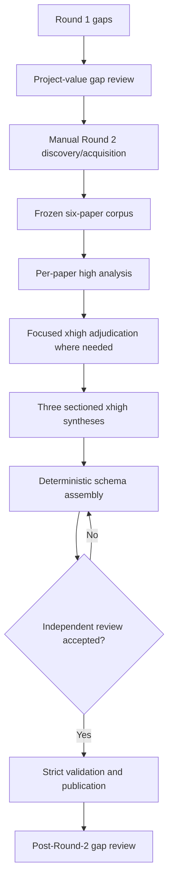

# Topic 02 Academic Round 2 Research Synthesis

*Generated by research-pipeline v0.33.0 on 2026-09-15 03:44 UTC from the exact accepted synthesis artifact.*

## Contents

- [Executive Summary](#executive-summary)
- [中文摘要](#中文摘要)
- [Scope and Corpus](#scope-and-corpus)
- [Round History](#round-history)
- [Methodology](#methodology)
- [Round 2 Gap Disposition](#round-2-gap-disposition)
- [Taxonomy of Approaches](#taxonomy-of-approaches)
- [Evidence Matrix](#evidence-matrix)
- [Recurring Mechanisms and Patterns](#recurring-mechanisms-and-patterns)
- [Assumption Map](#assumption-map)
- [Contradiction Map](#contradiction-map)
- [Evidence Strength Map](#evidence-strength-map)
- [Operational Implications](#operational-implications)
- [Production Readiness](#production-readiness)
- [Reusable Mechanism Inventory](#reusable-mechanism-inventory)
- [Design Implications](#design-implications)
- [Unresolved Questions](#unresolved-questions)
- [Risk Register](#risk-register)
- [Process Decisions](#process-decisions)
- [Traceability Appendix](#traceability-appendix)
- [References](#references)
- [Appendix](#appendix)

## Executive Summary

Academic Round 2 was a targeted follow-up to the 20 gaps classified after Topic 02 Round 1. It did **not** repeat broad Topic-segmentation discovery. Six new papers were admitted under a strict capability gate: one modern direct-email support paper, three transfer-method/annotation papers, and two transfer-evaluation papers.

The new evidence **reduces but does not close G1-A, G2-A, or G3-A**. It strengthens representation and evaluation mechanisms for discontinuous spans, same-location multi-label outputs, and explicit content-coverage denominators. **G4-A remains open**: the bounded search did not admit a modern business/work-email benchmark that directly evaluates concrete-work-matter Topic span segmentation/assignment. This is a bounded-search result, not a literature-absence claim.

No architecture is approved by this report. A fresh post-Round-2 project-value gap review is required before Topic 02 engineering validation starts.

## 中文摘要

本轮不是重新做一次宽泛的 Topic Segmentation 文献综述，而是针对 Round 1 留下的关键 gap 做定向补充。新增 6 篇论文中只有 C01 是现代直接邮件证据，但它研究的是 email event/argument extraction，而不是 msgloom 定义的 concrete work-matter Topic segmentation。

结论是：**G1-A、G2-A、G3-A 的方法学证据得到加强，但仍然开放；G4-A 仍然没有被关闭。** 新文献证明了 discontinuous/overlapping/multi-label span 的可表示与相邻预测能力，也提供了 coverage/omission 的细粒度评价机制，但不能冒充现代 business-email Topic span accuracy，也没有给出 decision-bearing email scope loss 的直接发生率。

在开始工程实验之前，必须再次对 Academic Round 2 后剩余的 gap 做项目价值 review。Production data 目前不可用，但不阻塞 synthetic/public engineering validation；production representativeness 仍需以后单独验证。

## Scope and Corpus

| Paper | Study | Title | Year | Venue | Role | Stream |
| --- | --- | --- | ---: | --- | --- | --- |
| 2212.07538 | A01 | Leveraging Natural Language Processing to Augment Structured Social Determinants of Health Data in the Electronic Health Record | 2023 | arXiv 2212.07538 / journal manuscript | TRANSFER_METHOD | R2-A |
| A02 | A02 | T²-NER: A Two-Stage Span-Based Framework for Unified Named Entity Recognition with Templates | 2023 | Transactions of the Association for Computational Linguistics | TRANSFER_METHOD | R2-A |
| A03 | A03 | Large Language Models for Propaganda Span Annotation | 2024 | Findings of EMNLP 2024 | TRANSFER_METHOD_ANNOTATION | R2-A |
| B01 | B01 | SWING: Balancing Coverage and Faithfulness for Dialogue Summarization | 2023 | Findings of EACL 2023 | TRANSFER_EVAL | R2-B |
| B02 | B02 | Revisiting the Gold Standard: Grounding Summarization Evaluation with Robust Human Evaluation | 2023 | ACL 2023 | TRANSFER_EVAL | R2-B |
| C01 | C01 | MAILEX: Email Event and Argument Extraction | 2023 | EMNLP 2023 | DIRECT_EMAIL_SUPPORT | R2-A/R2-B/R2-C |

## Round History

- Topic 02 Round 1 completed over a frozen 29-paper corpus and classified 20 gaps: 6 Academic and 14 Engineering.
- The subsequent human/project-value review authorized only three Academic Round 2 streams: R2-A (G1-A + G2-A), R2-B (G3-A), and R2-C (G4-A). G5-A was opportunistic; G10-A/G10-E moved to Topic 03.
- Round 2 manually discovered and acquired a six-paper frozen corpus before the Research Pipeline started.
- D05 remained outside the corpus because the single official-source local acquisition attempt failed at DNS resolution. This does not establish source or literature absence.
- The Research Pipeline used a new isolated run and no provider search/download activity for the already frozen corpus.

## Methodology

- Round 2 began with a formal project-value review of the 20 Round 1 gaps. Only G1-A/G2-A, G3-A and G4-A were authorized for targeted academic follow-up; G5-A was opportunistic and G10-A/G10-E were handed to Topic 03.

- Manual terminology refinement and discovery preceded acquisition. Six clean PDFs passed a strict capability admission gate, bibliographic identity checks, PDF integrity checks, SHA-256 checks, extraction sanity checks and zero-duplicate comparison with the Round 1 corpus.

- The frozen corpus contains one DIRECT_EMAIL_SUPPORT paper (C01), three TRANSFER_METHOD/ANNOTATION papers (A01-A03) and two TRANSFER_EVAL papers (B01-B02). Transfer evidence is not upgraded to direct email Topic evidence.

- The Research Pipeline used a new isolated run. Search reconciliation used the frozen local manifest with provider attempts=[]; enrich was skipped by user execution boundary; download recorded 0 downloaded / 6 skipped_exists / 0 failed.

- convert-rough attempt 1 produced no outputs because pymupdf4llm was absent from the pipx runtime. The runner blocked correctly. A run-local copy of previously working converter dependencies was verified, the runner performed a bounded retry, and attempt 2 converted 6/6 locally without modifying the installed Skill.

- Six fresh high full-paper semantic workers ran with at most three concurrent processes and actual exit receipts. Five papers with material source ambiguity received separate focused xhigh adjudication; B02 did not require escalation. No max worker was used.

- A deterministic adapter performed schema normalization, exact LF quote/raw-claim locator validation and only explicit xhigh finding repairs. All six final analyses validate against the installed paper schema with zero locator errors.

- Cross-paper semantic reasoning was split into three independent xhigh sections (R2-A, R2-B, R2-C) and is assembled deterministically into this synthesis. Project/process findings with no paper evidence keep empty paper/evidence lists instead of fabricated citations.

- D05 official-source acquisition failed once at DNS resolution and remains outside the corpus. The bounded R2-C discovery found no admitted modern task-matched business/work-email Topic-span benchmark; this is not a literature-absence claim.

- No production mailbox data, design change, engineering benchmark implementation, deployment, or performance measurement occurred in this academic round.

For finding $f$, let $\mathcal{P}_f$ be its cited corpus papers. The traceability count $s(f)=|\mathcal{P}_f|$ records evidence linkage only; it is not a probability that $f$ is true and is not a replication count when papers measure different tasks.

## Round 2 Gap Disposition

| Gap | Status | Bounded conclusion |
| --- | --- | --- |
| G1-A | **bounded Round 2 disposition** | G1-A: reduced_open. Supporting evidence is stronger: A02 supplies discontinuous-entity gold, a fragment-linking method, and a described discontinuous-only prediction evaluation; C01 supplies direct email gold for non-continuous event triggers. This reduction concerns representation and adjacent prediction evidence. The required gold for separated authored-only evidence belonging to one concrete work-matter Topic, its email prevalence, and its within-email prediction score remain unestablished. |
| G2-A | **bounded Round 2 disposition** | G2-A: reduced_open. Supporting methods are stronger: A01 describes same-span labels through subtype classifiers, and A03 explicitly trains simultaneous binary token labels. A02's overlapping mentions and C01's shared same-type event triggers clarify adjacent structures. No study directly evaluates simultaneous overlapping concrete Topic membership in email. Dedicated same-span recovery scores are absent, and material output and decoding limits remain. |
| G3-A | **bounded Round 2 disposition** | G3-A: reduced_open. The reduction is methodological only. B01 and B02 strengthen explicit-denominator recall, omission granularity, separation from faithfulness, and evaluation reliability. C01 adds direct email span, role, context, and conditional extraction-error support. No embedded study supplies the adjudicated rate of decision-bearing email scope loss caused by Topic segmentation requested by G3-A. That empirical component remains unchanged and open. |
| G4-A | **bounded Round 2 disposition** | G4-A: unchanged_open. Direct-email supporting evidence is stronger through C01, but the gap's task-matched requirement remains unanswered. C01 evaluates Enron event and argument extraction without concrete work-matter Topic gold, Topic prediction results, or task-matched preservation evaluation. The supplied bounded search review reports no admitted modern direct-email Topic-span benchmark. This does not establish literature absence. |

## Taxonomy of Approaches

- **R2A-F01 — Confidence: HIGH.** The four studies support distinct structural capabilities: multiple labels at one source location, overlapping mention boundaries, separated fragments belonging to one object, and shared words belonging to multiple instances. These capabilities do not establish one another or their joint use for msgloom Topics. [papers: 2212.07538, A02, A03, C01; evidence: F01, F02, F03, A02-F01, A02-F03, A03-F01, A03-F02, C01-F02, C01-F03]

- **R2A-F02 — Confidence: HIGH.** G1-A gains complementary gold-representation evidence. A02 contains discontinuous NER mentions with linked fragments. C01 directly establishes that an email event trigger can contain separated source words. Neither supplies gold identities for separated evidence belonging to one concrete work matter. [papers: 2212.07538, A02, C01; evidence: F03, A02-F01, A02-F05, C01-F01, C01-F02]

- **R2A-F03 — Confidence: HIGH.** Prediction evidence extends beyond representability but remains bounded. A02 reports an evaluation restricted to discontinuous entity mentions, although its numerical results are unavailable in the embedded conversion. C01 provides qualitative examples of BART recovering nearby shared triggers and reports difficulties at larger separation. [papers: A02, C01; evidence: A02-F01, A02-F06, A02-F07, A02-F10, C01-F06]

- **R2A-F04 — Confidence: HIGH.** G2-A gains explicit methods for simultaneous source-location labels. A01 adds subtype classifiers to support multiple labels on a span. A03 trains a model with 23 binary technique decisions per token. Neither reports dedicated simultaneous-label accuracy. [papers: 2212.07538, A02, A03, C01; evidence: F01, F02, F04, A02-F03, A03-F01, A03-F07, C01-F03, C01-F04]

## Evidence Matrix

| Paper | Role | Methods | Results | Source/model assumptions and explicitly labeled unsafe extrapolations | Limitations |
| --- | --- | --- | --- | --- | --- |
| 2212.07538 | TRANSFER_METHOD | {"analysis_scope": "The full embedded text, including the appendix, was analyzed. Figure captions and surrounding text are available, but the graphical annotation and architecture examples are not represented in the conversion.", "architecture": "Sentence-level BERT encoding with span representations, an Entity Type classifier, three Entity Subtype classifiers, and a binary relation classifier. Subtype classifiers use span features and Entity Type logits.", "design": "Supervised clinical entity and relation extraction, followed by note-level validation and a retrospective comparison of structured and NLP-derived patient information.", "evaluation": "Evaluates event extraction on 518 UW SHAC test notes. Separately evaluates mapped note-level labels on 750 UW validation documents. Compares selected positive SDOH indications across structured records and NLP-derived information during 2021.", "training": "Fine-tunes BERT and classification layers using gold spans and relations plus sampled negative examples. Hyperparameters use SHAC training and development partitions."} | F01: SHAC supplies same-span multi-label gold annotations, described as frequent, whereas the original SpERT assigns only one label per span.; F02: mSpERT adds an Entity Subtype layer for multi-label span prediction while retaining SpERT's Entity Type and Relation layers.; F03: Individual candidate spans are contiguous token sequences. Relations connect separate spans into events, which is distinct from predicting one discontinuous entity.; F04: Labeled-argument evaluation ignores argument-span boundaries. Trigger scoring accepts any character overlap, while span-only arguments require exact spans and equivalent connected triggers. | UNSAFE EXTRAPOLATION TO AVOID — analyst-identified and NOT source-accepted: That 0.86 overall F1 is exact same-span multi-label accuracy.; UNSAFE EXTRAPOLATION TO AVOID — analyst-identified and NOT source-accepted: That trigger overlap matching measures successful prediction of overlapping entities.; UNSAFE EXTRAPOLATION TO AVOID — analyst-identified and NOT source-accepted: That adding subtype classifiers permits arbitrary simultaneous event-type or Topic labels on a span.; UNSAFE EXTRAPOLATION TO AVOID — analyst-identified and NOT source-accepted: That linked trigger and argument spans demonstrate one discontinuous entity.; UNSAFE EXTRAPOLATION TO AVOID — analyst-identified and NOT source-accepted: That sentence-level extraction supports cross-sentence or cross-message Topic consolidation.; UNSAFE EXTRAPOLATION TO AVOID — analyst-identified and NOT source-accepted: That the word frequently supplies a measured prevalence of multi-label spans.; UNSAFE EXTRAPOLATION TO AVOID — analyst-identified and NOT source-accepted: That patient-level multiple substance categories are same-span multiple labels.; UNSAFE EXTRAPOLATION TO AVOID — analyst-identified and NOT source-accepted: That high note-level accuracy proves detailed event or qualifier preservation. | No direct business-email or work-Topic data, labels, or evaluation.; No separate gold prevalence counts or prediction scores for overlapping spans or same-span multi-label cases.; Contiguous candidate spans and sentence input do not establish discontinuous entity prediction or cross-sentence Topic grouping.; The multi-label mechanism uses distinct classifier families; arbitrary simultaneous labels within one family are not established.; Relaxed slot evaluation does not establish exact labeled-argument boundaries or exact label co-location.; The case study selects particular note sections, sources, SDOH categories, and one year at one health system.; Patient-level source complementarity is affected by extraction errors and cannot measure all missing source content.; Mapping to the latest document status and counting any positive annual indication answer different questions and discard different temporal distinctions. |
| A02 | TRANSFER_METHOD | {"design": "Supervised model development and benchmark comparison across eight NER datasets, with ablations, a joint-training comparison, inference-speed measurements, and qualitative examples.", "experimental_scope": "Use domain-specific BERT variants for biomedical and clinical datasets. Set the context window to 256 tokens and maximum candidate span length to 16 for OntoNotes5.0 and GENIA, and 8 for other datasets. Report scores averaged across five runs.", "span_extraction": "Enumerate contiguous spans up to a maximum length. Pack spans with the same start token into grouped marker templates. Use BERT representations, span-width features, and an MLP softmax over predefined entity types plus none.", "span_pair_classification": "Pair recognized spans and use typed marker templates, a second BERT module, and an MLP softmax over Next-Fragment, Overlapped, and OTHER. Add reverse-direction representations.", "syntax": "Use Stanford CoreNLP syntax information and an attention-guided graph convolutional network to enhance representations.", "training_and_decoding": "Jointly train the two stages with gold span and pair labels. Decode entity mentions from predicted spans and Next-Fragment relations. Exact graph enumeration and the inference role of the other relations are not consistently specified."} | A02-F01: The representation explicitly permits separated spans to belong to one entity mention. Stage two predicts Next-Fragment relations between spans extracted in stage one.; A02-F02: The model predicts overlapping entity mentions. Table 3 reports F1 scores of 89.40 on ACE2004, 90.34 on ACE2005, and 84.45 on GENIA.; A02-F03: The described span classifier produces a categorical distribution over entity types plus none. The paper does not specify a mechanism that emits multiple simultaneous entity types for one identical candidate span.; A02-F04: Evaluation requires predicted entity boundaries and types to match gold entities. Discontinuous mentions require fragment matches. This measures annotated entity recovery, not complete preservation of decision-relevant content. | UNSAFE EXTRAPOLATION TO AVOID — analyst-identified and NOT source-accepted: An NER entity type is equivalent to a msgloom Topic, which represents a concrete work matter.; UNSAFE EXTRAPOLATION TO AVOID — analyst-identified and NOT source-accepted: Recognizing nested or overlapping mentions proves that one identical span can receive simultaneous multiple Topics.; UNSAFE EXTRAPOLATION TO AVOID — analyst-identified and NOT source-accepted: Gold overlapping-mention counts measure identical-span multi-label prevalence.; UNSAFE EXTRAPOLATION TO AVOID — analyst-identified and NOT source-accepted: Table 4 F1 scores measure only discontinuous mentions.; UNSAFE EXTRAPOLATION TO AVOID — analyst-identified and NOT source-accepted: The missing Figure 4 numerical values can be reconstructed from aggregate tables.; UNSAFE EXTRAPOLATION TO AVOID — analyst-identified and NOT source-accepted: The Next-Fragment graph supports every possible shared-fragment, crossing, or multi-fragment structure without ambiguity.; UNSAFE EXTRAPOLATION TO AVOID — analyst-identified and NOT source-accepted: A 256-token context window establishes cross-message or unrestricted cross-sentence Topic assembly.; UNSAFE EXTRAPOLATION TO AVOID — analyst-identified and NOT source-accepted: High entity recall guarantees preservation of conditions, exceptions, deadlines, evidence, approval constraints, or decision qualifiers. | No business-email Topic segmentation or assignment experiment is reported.; Overlapping spans are distinct from multiple simultaneous types for identical span boundaries. The latter is neither established in the gold annotations nor implemented explicitly in the output description.; Discontinuous-only numerical results and the contents of graphical decoding examples are unavailable in the supplied conversion.; Candidate span length limits exclude longer contiguous candidates by construction. The paper does not quantify gold coverage under these limits.; Stage two operates on recognized spans. A gold fragment omitted by stage one is unavailable to the described pair-classification step.; The 256-token context window and sentence-centered enumeration do not establish cross-message or unrestricted cross-sentence entity assembly.; Strict entity recall measures missing annotated entities, not comprehensive preservation of business conditions or decision qualifiers.; The decoder specification contains material ambiguities about graph structure and use of non-Next-Fragment relations. |
| A03 | TRANSFER_METHOD_ANNOTATION | {"annotation_roles": {"annotator": "Receives the paragraph and technique taxonomy, then predicts labeled spans and positions.", "consolidator": "Receives human-provided candidate span annotations. The prompt and index-correction discussion describe selecting annotations; another passage describes consolidators as able to modify boundaries and labels without clearly specifying whether that statement applies to GPT-4.", "selector": "Additionally receives human-provided candidate technique labels, then selects labels and extracts spans."}, "evaluation": "Modified micro- and macro-F1 permit partial span matches. Gamma measures agreement involving span boundaries and labels. Specialized models are tested on ArPro and ArAIEval24T1.", "gpt4": "The paper reports zero-shot GPT-4, described as 32K, version gpt-4-0314, temperature 0. Prompts were selected using development-set pilot experiments.", "human_annotation": "Three trained general annotators independently annotate each paragraph. Two expert consolidators revise and finalize the annotations. Consolidated annotations are the experimental gold standard.", "position_postprocessing": "Each predicted text span is assigned the indices of its first occurrence in the paragraph. This does not resolve which occurrence was intended when identical text appears more than once.", "specialized_model": "AraBERTv0.2-large predicts a binary vector of 23 technique labels for each token, using sigmoid outputs and binary cross-entropy loss.", "training_and_selection": "Four training-label sources are compared: human gold, GPT-4 Annotator, GPT-4 Selector, and GPT-4 Consolidator. Maximum sequence length is 256. Epoch count and prediction threshold are tuned on the ArPro development subset."} | A03-F01: The specialized model explicitly permits simultaneous labels on each token through a 23-element binary prediction vector. This strengthens the representability and training-method component of R2-A.; A03-F02: The reported GPT-4 extraction format uses single-interval technique records. The paper supplies no explicit representation that links separated intervals into one semantic object.; A03-F03: The gold standard comes from expert consolidation after three independent general annotations. GPT-4 consolidation therefore benefits from human candidate annotations and is not annotation from raw text alone.; A03-F04: Evaluation uses micro- and macro-F1 that credit partial span matches. These metrics evaluate propaganda span detection and labeling, not complete preservation of business conditions, exceptions, deadlines, evidence, approval constraints, or decision qualifiers. | UNSAFE EXTRAPOLATION TO AVOID — analyst-identified and NOT source-accepted: Propaganda techniques are equivalent to msgloom Topics.; UNSAFE EXTRAPOLATION TO AVOID — analyst-identified and NOT source-accepted: The dataset's 14 news topics are concrete work-matter annotations.; UNSAFE EXTRAPOLATION TO AVOID — analyst-identified and NOT source-accepted: A multi-label token head proves accurate simultaneous assignment of multiple work-matter Topics.; UNSAFE EXTRAPOLATION TO AVOID — analyst-identified and NOT source-accepted: The paper reports the prevalence of overlapping or simultaneously labeled gold spans.; UNSAFE EXTRAPOLATION TO AVOID — analyst-identified and NOT source-accepted: Repeated spans with the same technique identify one discontinuous semantic object.; UNSAFE EXTRAPOLATION TO AVOID — analyst-identified and NOT source-accepted: A start/end interval record directly represents separated components of one object.; UNSAFE EXTRAPOLATION TO AVOID — analyst-identified and NOT source-accepted: Aggregate partial-match F1 measures exact span boundaries or complete semantic coverage.; UNSAFE EXTRAPOLATION TO AVOID — analyst-identified and NOT source-accepted: Gamma agreement is an accuracy percentage or a measure of missing business information. | No business/work-email data or concrete work-matter Topic annotations are evaluated.; The paper does not report how often gold spans overlap or carry simultaneous labels.; No evaluation isolates simultaneous-label prediction from ordinary span labeling.; No gold schema or output mechanism explicitly links separated spans into one semantic object.; Partial-match span F1 and gamma do not measure complete retention of business conditions and decision qualifiers.; The strongest GPT-4 setup depends on annotations from three humans; candidate coverage is not measured.; First-occurrence index correction can misidentify repeated text.; The exact partial-match scoring formula and detailed gamma aggregation are delegated to cited work or left unspecified. |
| B01 | TRANSFER_EVAL | {"alignment": "The method checks one-to-many and many-to-one mappings through consecutive sentence groups before checking one-to-one mappings. Equivalence involves entailment in both directions, including a reverse check against concatenated sentences for group mappings.", "backbone": "BART-LARGE.", "evaluation": "Automatic summary metrics, pairwise human evaluation on 100 test dialogues per dataset, qualitative missing-information comparisons on 100 SAMSum dialogues, ablations, and an augmentation comparison.", "implementation_caveat": "Some equations and algorithm notation are damaged or inconsistent in the embedded conversion. The prose supports the high-level method, but not an exact reconstruction of every mathematical expression.", "inference": "The NLI component is used during training. Appendix F states that inference uses the backbone model without the NLI component.", "losses": "The final objective combines ordinary maximum likelihood, maximum likelihood on MixAndMatch summaries, and a sentence-level contrastive objective. MixAndMatch combines uncovered reference sentences with matched generated sentences.", "settings": {"contrastive_loss_weight": 1.0, "entailment_threshold": 0.5, "learning_rate": "3e-5", "maximum_input_sequence_length": 1024, "uncovered_loss_weight": 1.0, "weight_decay": "1e-3"}, "task": "English abstractive dialogue summarization.", "training_signal": "A RoBERTa-LARGE model trained on MNLI predicts entailment between reference-summary sentences and generated-summary sentences. An induced bipartite graph identifies uncovered reference sentences and generated sentences matched to reference content."} | B01-F01: The empirical task is dialogue summarization on two English datasets. It provides transfer evidence for summary evaluation, not direct evidence for business-email Topic segmentation or assignment.; B01-F02: Human evaluation distinguishes reference-based recall and precision from faithfulness to the source dialogue. Content absent from a reference can therefore reduce reference precision while remaining faithful to the dialogue.; B01-F03: SWING uses sentence equivalence mappings that can relate one sentence to several sentences, but group matching is restricted to consecutive sentences.; B01-F04: The uncovered loss trains on summaries that combine missing reference sentences with generated sentences judged equivalent to reference content. | UNSAFE EXTRAPOLATION TO AVOID — analyst-identified and NOT source-accepted: Do not infer that a faithful summary necessarily covers all important source information.; UNSAFE EXTRAPOLATION TO AVOID — analyst-identified and NOT source-accepted: Do not infer that reference-summary coverage equals exhaustive dialogue coverage.; UNSAFE EXTRAPOLATION TO AVOID — analyst-identified and NOT source-accepted: Do not infer reliable preservation of conditions, exceptions, deadlines, evidence, approval constraints, or decision qualifiers from aggregate summary metrics.; UNSAFE EXTRAPOLATION TO AVOID — analyst-identified and NOT source-accepted: Do not treat human win-minus-loss scores as absolute recall percentages.; UNSAFE EXTRAPOLATION TO AVOID — analyst-identified and NOT source-accepted: Do not treat Kendall's tau percentages as percentages of information recovered.; UNSAFE EXTRAPOLATION TO AVOID — analyst-identified and NOT source-accepted: Do not treat FactCC probabilities as observed factual-accuracy or coverage rates.; UNSAFE EXTRAPOLATION TO AVOID — analyst-identified and NOT source-accepted: Do not transfer the auxiliary model's approximately 91% MNLI accuracy to omission detection or email reasoning.; UNSAFE EXTRAPOLATION TO AVOID — analyst-identified and NOT source-accepted: Do not infer discontinuous work-matter span capability from one-to-many sentence alignment. | The datasets and output task do not match business-email Topic segmentation or assignment.; Coverage is anchored to reference summaries. The paper does not demonstrate coverage of source facts that the references omit.; The gold and manual analyses do not separately label conditions, exceptions, deadlines, evidence, approval constraints, or decision qualifiers.; Training-time reference equivalence is a proxy for faithfulness. A generated statement can be supported by the dialogue but absent from the reference.; The many-sentence alignment procedure assumes consecutive sentences and does not establish arbitrary discontinuous grouping.; Human evaluation is a limited pairwise comparison with moderate reported agreement. It does not give absolute completeness rates.; The strongest reported automatic correlation with human recall is 0.321 on SAMSum. No metric is shown to reliably identify every omission.; Missing information remains a major residual problem. |
| B02 | TRANSFER_EVAL | {"acu_matching": "Qualified MTurk workers assign binary presence judgments for reference-derived ACUs in system summaries. Reference summaries provide context. The protocol comparison identifies ACU evaluation as using references without input documents.", "acu_writing": "Annotators write fine-grained factual statements from reference summaries. Annotators first familiarize themselves with the protocol and proofread one another's annotations. After this calibration, one annotator writes ACUs for each reference summary.", "aggregation": "The unnormalized score is the fraction of reference ACUs present in a candidate. ACUs receive equal weight. A separate normalized score applies a length-related penalty.", "comparisons": "The study compares ACU evaluation with Prior, Ref-free, and Ref-based human ratings. It evaluates automatic metrics through correlations with human scores.", "design": "Human annotation benchmark and summarization meta-evaluation across CNNDM, XSum, and SamSum.", "statistical_analysis": "System-comparison power uses resampled examples and paired bootstrap significance tests. Metric-comparison power uses permutation significance tests. Summary-level correlations average within-example correlations across systems; system-level correlations use system scores averaged across examples."} | B02_F01: ACU evaluation measures recall of reference-derived facts through separate writing and matching steps. Reusing the written units fixes the content denominator for comparisons with new summaries.; B02_F02: The strongest transfer limitation is that the gold inventory comes from reference summaries and its ACUs have equal weight. Important source content absent from the reference cannot contribute to this recall denominator, and the score does not distinguish business-critical omissions from other omitted units.; B02_F03: The worked example makes timing information separately auditable: the ACU that Oscar was taken off at half time is marked present for BRIO and absent for GPT-3.; B02_F04: The paper reports Krippendorff's alpha of 0.7571 for aggregated summary-level ACU matching and 0.7528 at the ACU level. | UNSAFE EXTRAPOLATION TO AVOID — analyst-identified and NOT source-accepted: An ACU is a msgloom Topic or a concrete work matter.; UNSAFE EXTRAPOLATION TO AVOID — analyst-identified and NOT source-accepted: Multiple facts in a sentence establish simultaneous multiple Topic labels on a span.; UNSAFE EXTRAPOLATION TO AVOID — analyst-identified and NOT source-accepted: Semantic matching establishes a representation for one Topic supported by separated spans.; UNSAFE EXTRAPOLATION TO AVOID — analyst-identified and NOT source-accepted: RoSE reports overlap or discontinuity prevalence.; UNSAFE EXTRAPOLATION TO AVOID — analyst-identified and NOT source-accepted: Human-written ACUs demonstrate that a model can produce accurate ACUs, Topic assignments, or missing-fact lists.; UNSAFE EXTRAPOLATION TO AVOID — analyst-identified and NOT source-accepted: Reference ACU recall measures all important content in the source document.; UNSAFE EXTRAPOLATION TO AVOID — analyst-identified and NOT source-accepted: Unnormalized ACU recall detects hallucinations or measures candidate precision.; UNSAFE EXTRAPOLATION TO AVOID — analyst-identified and NOT source-accepted: Normalized ACU is semantic F1 or directly measures redundancy. | Reference-derived recall cannot detect omissions of important source facts that the reference itself omits.; Unweighted ACUs do not encode the relative importance of deadlines, exceptions, approval constraints, or other business requirements.; The paper evaluates English summarization, with no direct work-email Topic segmentation or assignment experiment.; No category-specific coverage results establish preservation of conditions, exceptions, evidence requirements, approvals, or decision qualifiers.; High matching agreement does not establish correct or exhaustive ACU writing.; Automatic metric correlations do not establish calibrated fact recall or reliable per-item omission detection.; The supplied conversion omits Table 2 and parts of the ACU-writing description and damages scoring equations and figures.; The referenced paper_analysis.schema.json was not embedded. Exact compliance with unprovided schema fields and types cannot be verified from this input. |
| C01 | DIRECT_EMAIL_SUPPORT | {"dataset_construction": "Two annotators labeled Enron emails using a speech-act taxonomy. The paper says each email was annotated twice by each annotator. Agreed overlapping spans were retained; disagreement could remove events or threads.", "evaluation_design": "Thread-level 80/10/10 split; end-to-end extraction, gold-trigger argument extraction, and history ablations. Additional qualitative and sampled error analyses.", "input_limits": "Fine-tuned models use a maximum sequence length of 512. BART input is left-truncated. GPT inputs are left-truncated to a stated 4000-token limit; generation is limited to 300 tokens.", "models": ["BERT-large-uncased trigger labeling with BIOS tags, followed by trigger-conditioned BIO argument labeling and meta semantic role classifiers.", "BART-large generation of filled event templates.", "Five-shot template generation with text-davinci-003 and gpt-3.5-turbo."], "scope_of_analysis": "Based only on the complete embedded paper. No external resources, code, dataset, or schema file were inspected."} | C01-F01: The task extracts event triggers and event-specific arguments within emails. It does not evaluate msgloom Topic segmentation or assignment.; C01-F02: The gold representation permits one event trigger to use separated source words. This directly supports discontinuous trigger representability in email.; C01-F03: Two Deliver Action Data event instances can share the trigger word 'will'. This demonstrates shared source membership between instances of the same event type.; C01-F04: The BERT argument model assumes nonoverlapping arguments within each event instance. Its trigger model assigns one BIOS label per word, with an S tag for sharing among same-type instances. | UNSAFE EXTRAPOLATION TO AVOID — analyst-identified and NOT source-accepted: A msgloom Topic is equivalent to an event type, event instance, meeting agenda, or action description.; UNSAFE EXTRAPOLATION TO AVOID — analyst-identified and NOT source-accepted: A discontinuous event trigger proves discontinuous Topic prediction.; UNSAFE EXTRAPOLATION TO AVOID — analyst-identified and NOT source-accepted: Shared words between same-type event instances prove simultaneous different labels or multiple Topics on one span.; UNSAFE EXTRAPOLATION TO AVOID — analyst-identified and NOT source-accepted: The S tag provides unrestricted multilabel output or solves shared-trigger extraction.; UNSAFE EXTRAPOLATION TO AVOID — analyst-identified and NOT source-accepted: Continuous arguments imply that all semantic objects in email are continuous.; UNSAFE EXTRAPOLATION TO AVOID — analyst-identified and NOT source-accepted: The conditional mean of 3.05 repeated events measures overlap or discontinuity prevalence.; UNSAFE EXTRAPOLATION TO AVOID — analyst-identified and NOT source-accepted: High annotation agreement establishes exhaustive content coverage.; UNSAFE EXTRAPOLATION TO AVOID — analyst-identified and NOT source-accepted: The reported 6% missing-argument category is an overall omission rate or implies 94% content coverage. | The task is event and argument extraction, not concrete work-matter Topic segmentation or assignment.; Enron is the only evaluated source corpus; contemporary work-email generalization is untested.; No corpus-level prevalence or dedicated prediction metrics are reported for discontinuous or shared triggers.; Gold annotations restrict arguments to continuous nonoverlapping spans within each event and filter annotation disagreement.; The taxonomy deliberately excludes content and removes some roles, so recall is bounded by a selective gold target.; Long arguments can contain omitted qualifiers even when partial matching gives credit; the actual matching procedure is internally unclear.; Input truncation can remove context or current-email content. The paper does not quantify the resulting coverage loss.; The GPT results concern the stated 2023 models and prompting setup, not current models. |

## Recurring Mechanisms and Patterns

- **R2A-F05 — Confidence: HIGH.** Observed structural prevalence remains separate from annotation capacity and prediction performance. A02 provides discontinuous-mention counts in its NER data. The other studies provide no numerical prevalence for the same-span or shared-trigger structures relevant here. [papers: 2212.07538, A02, A03, C01; evidence: F01, A02-F05, A03-F01, C01-F02, C01-F03]

- **R2A-F06 — Confidence: HIGH.** The reported metrics evaluate different semantic objects and matching rules. They cannot be pooled into a structural assignment score or converted into expected msgloom accuracy. [papers: 2212.07538, A02, A03, C01; evidence: F04, F05, A02-F02, A02-F04, A02-F06, A02-F07, A03-F04, C01-F07, C01-F08]

- **R2A-F07 — Confidence: HIGH.** Annotation inputs and adjudication rules materially condition the evidence. A03's strongest GPT-4 setup uses human candidate annotations. C01 retains agreed annotation overlap and removes some disputed events or threads. [papers: A03, C01; evidence: A03-F03, A03-F05, A03-F06, A03-F09, C01-F05]

- **R2A-F08 — Confidence: HIGH.** No embedded study directly evaluates non-contiguous or simultaneous overlapping assignment to concrete work-matter Topics in email. G1-A and G2-A therefore remain open despite stronger supporting evidence. [papers: 2212.07538, A02, A03, C01; evidence: F10, A02-F08, A03-F10, C01-F01, C01-F10]

- **R2B-F01 — Confidence: HIGH.** The section strengthens methods for evaluating omissions. It supplies no adjudicated rate of decision-bearing email scope loss caused by Topic segmentation. B01 and B02 provide summarization evaluation transfer. C01 provides direct email event-extraction support. [papers: B01, B02, C01; evidence: B01-F01, B01-F09, B02_F01, B02_F02, C01-F01, C01-F07, C01-F09]

- **R2B-F02 — Confidence: HIGH.** An explicit content inventory makes omissions measurable, but the inventory limits what the measurement can detect. B02 fixes a denominator of reference-derived Atomic Content Units. B01 identifies uncovered reference-summary sentences. C01 measures recovery of selected event arguments. [papers: B01, B02, C01; evidence: B01-F04, B01-F09, B02_F01, B02_F02, C01-F07, C01-F09]

- **R2B-F03 — Confidence: HIGH.** Coverage, source faithfulness, and reference precision are separate evaluation targets. B01 explicitly distinguishes them. B02 measures reference-fact recall without measuring unsupported additions. C01 separately reports missing, extra, incorrect, fabricated, and semantically correct nonmatching argument categories. [papers: B01, B02, C01; evidence: B01-F02, B01-F06, B02_F01, C01-F08]

- **R2B-F04 — Confidence: HIGH.** B01 and B02 support finer omission analysis than whole-summary judgments. B01 distinguishes missing details from missing sentences. B02 makes individual facts separately auditable, including one timing-sensitive fact. C01's missing-argument category concerns absent argument values and does not systematically measure lost content within an extracted value. [papers: B01, B02, C01; evidence: B01-F07, B02_F01, B02_F03, C01-F07, C01-F08]

- **R2-C-F01 — Confidence: HIGH.** C01 strengthens direct-email support for event and argument extraction. It does not supply a benchmark for segmenting or assigning Topics defined as concrete work matters. Its 2023 publication date does not make the underlying Enron communications contemporary. [papers: C01; evidence: C01-F01, C01-F10]

- **R2-C-F02 — Confidence: HIGH.** C01 supplies email examples of discontinuous event triggers and shared trigger words between same-type event instances. Gold representability is established for those structures. Reliable prediction, corpus prevalence, and Topic-level equivalents are not established. [papers: C01; evidence: C01-F02, C01-F03, C01-F04, C01-F06]

- **R2-C-F03 — Confidence: HIGH.** C01 adds structured examples of email arguments and selected qualifiers, but its gold annotations and extraction evaluation do not establish complete preservation of decision-bearing work-matter content. [papers: C01; evidence: C01-F05, C01-F07, C01-F08, C01-F09]

## Assumption Map

- **A-R2A-AS01.** Fragment-membership methods might transfer if separated passages about one work matter can be given consistent Topic identities and membership annotations. [papers: A02, C01; evidence: A02-F01, A02-F08, C01-F01, C01-F02] Scope: Conditional transfer rationale for G1-A. The embedded studies do not establish this correspondence. Risk if false: Correct entity-fragment or event-trigger assembly would provide little evidence about whether separated email passages concern the same work matter.

- **A-R2A-AS02.** Multiple binary or family-specific label decisions might transfer if concrete work-matter memberships can be represented with suitable label identities and supervision. [papers: 2212.07538, A03; evidence: F02, F10, A03-F01, A03-F10] Scope: Conditional transfer rationale for G2-A. Fixed clinical and propaganda taxonomies do not establish a suitable Topic label space. Risk if false: A model could support multiple category labels while failing to represent or distinguish the required concrete work matters.

- **B-R2B-A01.** Transferring inventory-based recall to decision-bearing email preservation would require a source-grounded inventory that includes the relevant information and its governing scope. The embedded studies do not establish such an inventory. [papers: B01, B02, C01; evidence: B01-F09, B02_F02, C01-F09] Scope: Conditional methodological transfer only. Risk if false: A high score could coexist with omitted business-critical information that never entered the denominator.

- **B-R2B-A02.** Using one written ACU inventory for all candidates would provide an unbiased system comparison only if inventory selection and decomposition do not favor particular candidate styles. B02 states this expectation without directly validating it. [papers: B02; evidence: B02_F05] Scope: Comparability of systems evaluated against a shared inventory. Risk if false: A fixed denominator could still produce rankings that depend on subjective inventory choices.

- **B-R2B-A03.** A semantic presence judgment would need to reject a weaker proposition when the omitted condition, exception, timing restriction, or approval qualifier changes the decision. Existing matching results do not validate this behavior across the required categories. [papers: B01, B02, C01; evidence: B01-F03, B01-F07, B02_F03, C01-F07, C01-F09] Scope: Qualifier-sensitive interpretation of semantic matching. Risk if false: A matcher could credit an action or event while failing to detect loss of the restriction that governs it.

- **B-R2B-A04.** Treating unweighted content recall as decision-bearing preservation would assume that omitted units have sufficiently similar consequences. B02 does not validate that assumption for business email. [papers: B02; evidence: B02_F02] Scope: Interpretation of aggregate content scores. Risk if false: Many preserved minor facts could obscure one omitted approval constraint or exception.

- **C-R2-C-A01.** Using C01's discontinuous or shared event triggers to predict Topic representation needs would require corresponding structures in concrete work-matter annotations. That transfer assumption remains unverified. [papers: C01; evidence: C01-F01, C01-F02, C01-F03] Scope: Conditional interpretation only; not an accepted Topic capability claim. Risk if false: An event-specific structure could be mistaken for a demonstrated Topic requirement or a validated Topic prediction capability.

- **C-R2-C-A02.** Applying C01 results to contemporary business email would require evidence that its corpus, annotation target, and evaluated settings transfer to that population. This section does not adopt that assumption. [papers: C01; evidence: C01-F09, C01-F10] Scope: External validity for contemporary work-email use. Risk if false: Enron event-extraction results could overstate modern-domain coverage and conceal missing work-matter content.

## Contradiction Map

- **A-R2A-C01 — A01 standalone labeled-argument relations** (Unresolved specification gap. The gate excludes Entity Type-null spans, but final representation and linking of standalone labeled arguments remain unspecified. Gold-based training does not resolve inference eligibility. Neither an alternative decoding route nor necessary extraction failure is established., severity HIGH) [papers: 2212.07538; evidence: F02, F03]

  - a: Labeled arguments have spans and subtype predictions, while their argument types are absent from the declared Entity Type inventory.

  - b: Only spans with non-null Entity Type predictions enter relation classification.

- **A-R2A-C02 — A01 Method output inventory** (Unresolved. Retain precision 0.68, recall 0.55, and F1 0.61 as reported. Do not add a label, alter the declared count, infer an alias, or use the score to reconstruct a decoding path., severity HIGH) [papers: 2212.07538; evidence: F06]

  - a: Method is explicitly described as a span-only argument and evaluated on 102 gold instances.

  - b: Method is absent from the declared 11-label Entity Type inventory.

- **A-R2A-C03 — A02 multi-fragment graph decoding** (Unresolved ambiguity, not a necessary contradiction. A literal all-pairs interpretation would conflict with succession, but the text does not require that interpretation. No clique, path, or connected-component decoder is established. The differing example decompositions remain unresolved., severity HIGH) [papers: A02; evidence: A02-F01, A02-F10]

  - a: Next-Fragment links successive fragments of one mention.

  - b: The decoder describes spans connecting with any other span without specifying direct adjacency, path connectivity, or competing-subgraph selection. The introductory example uses two fragments, while its figure caption describes three spans.

- **A-R2A-C04 — A02 non-Next-Fragment inference behavior** (Unresolved. Separate filtering could coexist with Next-Fragment assembly, but that reconciliation is not documented. Neither training-only use nor verified inference-time filtering is established. The 0.39-point first-stage F1 gain does not distinguish these explanations., severity HIGH) [papers: A02; evidence: A02-F09, A02-F10]

  - a: The formal account uses all three relations during training and selects Next-Fragment for decoding.

  - b: Other passages attribute double-checking and output filtering to Overlapped and OTHER without an operational rule.

- **A-R2A-C05 — A02 recall narrative** (The intended comparison remains unspecified. A lower-recall claim against those listed baselines is contradicted by the table. Preserve the numerical results and exclude this narrative as causal evidence for filtering., severity MEDIUM) [papers: A02; evidence: A02-F02, A02-F10]

  - a: The prose refers to relatively lower recall and links it to filtering.

  - b: Table 3 gives T²-NER higher recall than both listed unified baselines on all three overlapping datasets.

- **A-R2A-C06 — A03 consolidation action scope** (Unresolved. Retain human-candidate-assisted selection as the supported operational account. Do not credit demonstrated boundary revision, relabeling, recovery beyond candidates, or mechanically enforced selection., severity HIGH) [papers: A03; evidence: A03-F03, A03-F09]

  - a: The GPT-4 prompt and index-error account describe selecting supplied annotations, including spans and indices.

  - b: Another passage permits consolidators to modify boundaries and labels without clearly identifying whether this permission applies to humans or GPT-4.

- **A-R2A-C07 — A03 metric postprocessing provenance** (Micro-F1 correction conditions are qualified by Table 4. Table 3's generic postprocessing description and the correction status of its macro-F1 and gamma remain unresolved. Do not invent another processing step or combine those metrics with corrected micro-F1 as one verified condition., severity MEDIUM) [papers: A03; evidence: A03-F05, A03-F06]

  - a: Table 3 describes post-processed outputs and reports micro-F1 values of 0.050, 0.137, and 0.671.

  - b: Table 4 explicitly identifies these values as without span-index correction and reports corrected values of 0.117, 0.297, and 0.670.

- **A-R2A-C08 — C01 argument matching** (Unresolved. Neither universal exact-gold matching nor a particular partial-credit procedure is established. A source-span validity gate is only a possible reconciliation. Retain reported scores descriptively and exclude them from standardized numerical comparison., severity HIGH) [papers: C01; evidence: C01-F07, C01-F08]

  - a: The main evaluation allows partial argument matching.

  - b: Appendix E.3 describes rejecting semantically correct non-exact arguments and treats some trivial additions as incorrect.

- **A-R2A-C09 — C01 taxonomy and role inventory** (Unresolved. Do not infer an eleventh modeled class or a verified complete 76-role schema. The Context role's documented use is supported, but neither intentional removal nor conversion loss explains the table omission conclusively., severity HIGH) [papers: C01; evidence: C01-F01, C01-F09]

  - a: The stated taxonomy contains ten event types, and the paper reports 76 final argument roles.

  - b: Table 5 mentions Amend Action Data outside the stated taxonomy. Context: Data IdString appears in examples, distribution text, and a generation template but is absent from the supplied Amend Data role table.

- **A-R2A-C10 — C01 numerical reporting and denominators** (Unresolved F1 discrepancy and unspecified O denominator. Preserve 0.454 without correction or an invented averaging explanation. Do not interpret O as non-event email prevalence or assume a token denominator. Use the explicit email counts for email prevalence., severity MEDIUM) [papers: C01; evidence: C01-F07]

  - a: Table 2 prints BERT Argument Identification precision 0.491, recall 0.403, and F1 0.454. Table 5 reports Non-Event O at 8.825.

  - b: The printed precision and recall have a harmonic mean of approximately 0.443. Separately, 776 non-event emails among 3,936 emails imply approximately 19.72%, not 8.825.

- **A-R2A-C11 — C01 error-category semantics** (Unresolved. Preserve the author-reported 42%, 36%, 8%, 8%, and 6% as descriptive shares in an error-selected, gold-trigger sample. Do not treat them as a validated semantic partition, an entity-hallucination rate, or a corpus omission rate. Keep the separate placeholder analysis distinct., severity MEDIUM) [papers: C01; evidence: C01-F08]

  - a: The sampled analysis names semantic, fabricated, extra, missing, and semantically correct nonmatching argument categories.

  - b: Definitions and examples mix surface-form deviations, semantic failures, and template-filling failures. The prose also varies between predictions, instances, and arguments as the counting unit.

- **A-R2A-C12 — A01 peripheral source-reporting conflicts** (Preserved unresolved from the embedded source-conflict records. Retain the reported values and wording without repair. Actual dataset availability is unverified. These peripheral conflicts provide no evidence about span-label multiplicity or email Topic accuracy., severity LOW) [papers: 2212.07538; evidence: F07]

  - a: The prose gives note-level category F1 as 0.77–0.86, calls substance-none descriptions homogeneous, uses present availability language, and reports 1,503 of 5,807 normalized-drug patients as 25%.

  - b: Table 4 includes Drug F1 0.87; the appendix calls the descriptions heterogeneous; another availability statement uses future tense; the reported counts imply approximately 25.9%.

- **A-R2A-C13 — A02 speed-comparison reporting** (Preserved unresolved from the embedded source-conflict record, which has no separate finding ID. The discrepancy does not change listed throughput values and contributes no evidence for this section's Topic questions., severity LOW) [papers: A02; evidence: ]

  - a: The speed-comparison prose states three baselines.

  - b: Table 7 lists four baseline rows.

- **A-R2A-C14 — A03 evaluated-model scope** (Preserved unresolved from the embedded source-conflict record, which has no separate finding ID. Main quantitative experiments can be distinguished from preliminary trials, but the source does not consistently state that distinction. No unreported comparative performance is credited., severity LOW) [papers: A03; evidence: ]

  - a: The limitations section says only a closed LLM was evaluated.

  - b: Other passages mention preliminary Claude 3.5 Sonnet and open-model experiments.

- **B-R2B-C01 — B01 BARTScore recall symbols** (Qualified by xhigh review. The conceptual direction is reference conditioned on generation. The symbol inconsistency remains. It does not establish opposing semantic definitions, and the executed scoring direction is unverified., severity MEDIUM) [papers: B01; evidence: B01-F08]

  - a: Algorithm 1 defines S* as the reference and S as the generated summary; the recall formula is p(S* | S, theta).

  - b: The local metric prose reverses the symbol labels, although its named summary roles also describe reference conditioned on generation.

- **B-R2B-C02 — B01 FactCC claim population** (Unresolved in B01.source_conflicts and xhigh_adjudication. Retain scores and correlations only as author-reported observations. Exclude FactCC recall and FactCC F from numerical pooling or direct cross-paper coverage comparison until the population and aggregation are established., severity HIGH) [papers: B01; evidence: ]

  - a: The recall definition uses reference sentences as claims and the generated summary as source.

  - b: The aggregation description instead names sentences within the generated summary.

- **B-R2B-C03 — B01 F labels and aggregation** (Qualified by xhigh review. Retain reported labels and values. Do not impose harmonic-mean F1 or a uniform alternative formula. Matching definitions are required before numerical comparison., severity MEDIUM) [papers: B01; evidence: B01-F05]

  - a: The paper labels the F setting as F1.

  - b: The general description says to compute both directions and average them without supplying metric-specific aggregation equations.

- **B-R2B-C04 — B01 precision ranking** (Qualified by xhigh review. Use numerical per-dataset rankings. The overall aggregation remains unspecified. The prose does not establish that QUALS wins both datasets, and this issue does not overturn the reported BARTScore recall ranking., severity MEDIUM) [papers: B01; evidence: B01-F08]

  - a: DialogSum ROUGE-L F precision correlation 24.21 is highlighted, and prose calls QUALS best overall.

  - b: BARTScore F has the largest numerical DialogSum precision correlation at 25.94; QUALS leads SamSum precision at 15.35.

- **B-R2B-C05 — B01 entailment illustration and implemented matching description** (Resolved as a scope difference by xhigh review. Use the full graph description. The illustration is not the complete criterion, and predicted equivalence is not a coverage guarantee., severity MEDIUM) [papers: B01; evidence: B01-F03]

  - a: Figure 1 illustrates one-direction entailment as a coverage diagnostic.

  - b: The graph description requires bidirectional equivalence checks and restricts group matching to consecutive sentences.

- **B-R2B-C06 — B01 dialogue length statistics** (Unresolved in B01.source_conflicts and xhigh_adjudication. Preserve locations and stated units. Do not invent a preprocessing explanation or merge the figures into one verified average., severity LOW) [papers: B01; evidence: ]

  - a: The main text reports approximately 94 SAMSum tokens and 131 DialogSum tokens per dialogue.

  - b: Appendix A reports 124.1 SAMSum words and 187.5 DialogSum words using the NLTK tokenizer.

- **B-R2B-C07 — B02 benchmark count population** (Unresolved source gap recorded in B02.source_conflicts. Preserve the reported terminology. Do not reconstruct missing split statistics or substitute a verified judgment count., severity MEDIUM) [papers: B02; evidence: ]

  - a: The paper reports approximately 21,800 ACU-level annotations.

  - b: The referenced Table 2 is absent from the conversion, so the count cannot be assigned confidently to unique written units or matching judgments.

- **B-R2B-C08 — B02 atomicity definition and normalized-score formula** (Unresolved source gap. Raw reference-unit recall supports methodological synthesis. Exact atomicity rules, normalization algebra, and penalty threshold cannot be silently reconstructed. Normalized ACU is not pure recall or established semantic F1., severity MEDIUM) [papers: B02; evidence: B02_F01, B02_F06]

  - a: The prose describes fine-grained ACUs and a length-related redundancy penalty.

  - b: The ACU-writing definition is interrupted and Equation 2 is fragmented in the conversion.

- **B-R2B-C09 — B02 peripheral survey counts and percentages** (Unresolved reporting discrepancies preserved from B02.source_conflicts. Counts and percentages remain distinguishable. They do not change the interpretation of ACU coverage., severity LOW) [papers: B02; evidence: ]

  - a: Appendix F reports significance testing as 68% in prose and 69% in its table for 27 of 39 papers.

  - b: The table also reports 28% for 12 of 39 agreement-reporting papers and 97% for 37 of 39 participant-reporting papers.

- **B-R2B-C10 — B02 free-form text scope** (Unresolved scope conflict preserved from B02.source_conflicts. A restriction to crowdworker matching responses is possible but unestablished. Do not characterize the whole benchmark as containing no written text., severity LOW) [papers: B02; evidence: B02_F01]

  - a: The responsible NLP checklist broadly states that collected data contains no free-form text.

  - b: The benchmark description includes manually written ACUs.

- **B-R2B-C11 — C01 partial matching and non-exact argument rejection** (Unresolved after xhigh review. Do not infer a source-span validity gate, universal exact-gold matching, or a particular partial-credit procedure. Exclude argument identification and classification scores from like-for-like cross-paper comparison and pooling., severity HIGH) [papers: C01; evidence: C01-F07]

  - a: The main evaluation explicitly permits partial argument matching.

  - b: Appendix E.3 describes rejection of semantically correct non-exact arguments and includes trivial added words among incorrect arguments.

- **B-R2B-C12 — C01 event taxonomy and distribution population** (Unresolved after xhigh review. Do not infer an eleventh modeled class or a harmless reporting error. The explicit email counts imply approximately 19.72% non-event emails; O at 8.825 is not that proportion and has no established token denominator. Exclude the disputed distribution entries from cross-paper comparison., severity MEDIUM) [papers: C01; evidence: ]

  - a: The paper states a ten-type taxonomy and separately reports 776 non-event emails among 3,936 emails.

  - b: Table 5 mentions rare Amend Action Data events at 0.028%, although that type is absent from the stated taxonomy, and gives Non-Event O as 8.825 without a clear denominator.

- **B-R2B-C13 — C01 final argument-role inventory** (Unresolved after xhigh review. Specific documented role uses remain supported. The complete final schema is unverified. Neither intentional pruning nor conversion loss is established as the explanation., severity MEDIUM) [papers: C01; evidence: ]

  - a: The supplied Table 4 text omits Context: Data IdString for Amend Data and reports 76 final roles.

  - b: Amendment examples, distribution text, and a generation template explicitly use Context: Data IdString.

- **B-R2B-C14 — C01 BERT Argument Identification F1** (Unresolved after xhigh review. Preserve 0.454 as printed with the discrepancy stated. Do not replace a table value, attribute the difference to unreported averaging, or use the discrepant F1 for derived numerical claims., severity MEDIUM) [papers: C01; evidence: ]

  - a: Table 2 prints precision 0.491, recall 0.403, and F1 0.454.

  - b: The harmonic mean of the printed precision and recall is approximately 0.443, and the text supplies no reconciling aggregation rule.

- **B-R2B-C15 — C01 argument-error semantics and counting unit** (Unresolved after xhigh review. Preserve the percentages under the author's categories. Do not treat 36% as an entity-hallucination rate or 6% as an overall omission rate. Do not recode examples, redistribute percentages, assume 50 independently coded arguments, or combine this sample with the separate placeholder-error analysis. Exclude these shares from standardized cross-paper comparison., severity HIGH) [papers: C01; evidence: C01-F08]

  - a: The author-defined shares are semantically incorrect 42%, semantically incorrect and fabricated 36%, semantically correct but not exact spans 8%, extra arguments 8%, and missing arguments 6%.

  - b: The definitions and examples mix semantic failures, surface-form deviations, and template-filling failures. The sample is described as predictions while the percentages discuss arguments.

- **C-R2-C-C01 — Operational argument matching** (Unresolved. The source does not establish a source-span validity gate or another reconciliation. Preserve author-reported argument scores for descriptive reporting, but exclude them from like-for-like numerical comparison or pooling until matching and aggregation rules are established. Keep end-to-end and gold-trigger results distinct., severity HIGH) [papers: C01; evidence: C01-F07]

  - a: The main evaluation permits partial argument matching.

  - b: Appendix E.3 describes rejection of semantically correct non-exact arguments and includes trivial added words among incorrect arguments.

- **C-R2-C-C02 — Stated event taxonomy versus an additional distribution entry** (Unresolved in C01.source_conflicts and C01.xhigh_adjudication. No separate finding ID is assigned to this conflict. Report ten as the stated count. Do not infer an eleventh modeled class, a removal or remapping history, or a harmless reporting error. Exclude the disputed frequency from cross-paper comparison and evaluated-inventory reconstruction., severity MEDIUM) [papers: C01; evidence: ]

  - a: The paper states a ten-type event taxonomy.

  - b: Table 5 mentions rare Amend Action Data events at 0.028%, although that type is absent from the stated taxonomy.

- **C-R2-C-C03 — Non-Event O population** (Qualified denominator ambiguity, not an established contradiction between measurements of the same population. C01.xhigh_adjudication establishes that 8.825 cannot be treated as the reported non-event email percentage. Its denominator remains unknown; a token denominator must not be assumed. Use the explicit email counts for email prevalence., severity MEDIUM) [papers: C01; evidence: ]

  - a: The explicit email counts report 776 non-event emails among 3,936 emails, approximately 19.72%.

  - b: Table 5 reports Non-Event O at 8.825 without an established counting population.

- **C-R2-C-C04 — Final argument-role inventory** (Unresolved in C01.source_conflicts and C01.xhigh_adjudication. The specific role's documented use is supported, but the complete reported 76-role inventory cannot be verified. Do not infer intentional pruning, reconstruct a pruning chronology, or attribute the discrepancy definitively to conversion loss., severity MEDIUM) [papers: C01; evidence: ]

  - a: The supplied Table 4 text omits Context: Data IdString for Amend Data and reports 76 final roles.

  - b: Amendment examples, distribution text, and a generation template explicitly use Context: Data IdString.

- **C-R2-C-C05 — BERT Argument Identification F1** (Unresolved in C01.metrics and C01.xhigh_adjudication. Preserve F1 0.454 as printed and flag the discrepancy. Do not substitute 0.443, identify a particular source value as definitively erroneous, or assert that unreported averaging explains the result. Do not use the discrepant F1 for derived numerical claims., severity MEDIUM) [papers: C01; evidence: ]

  - a: Table 2 prints precision 0.491, recall 0.403, and F1 0.454.

  - b: The harmonic mean of the printed precision and recall is approximately 0.443; the supplied evaluation description does not explain the difference.

- **C-R2-C-C06 — Meaning and counting unit of sampled argument-error categories** (Unresolved. Preserve the author-defined shares: 42% semantically incorrect, 36% semantically incorrect and fabricated, 8% semantically correct but not exact spans, 8% extra arguments, and 6% missing arguments. These are descriptive shares in an error-selected, gold-trigger analysis with an uncertain coding unit. Do not treat them as standardized semantic-error, omission, or entity-hallucination rates; recode examples; redistribute percentages; or combine the missing-value category with the separate placeholder-error analysis., severity HIGH) [papers: C01; evidence: C01-F08]

  - a: The paper names semantic-error and fabrication categories in an analysis of 50 sampled erroneous predictions with gold triggers.

  - b: The definitions and examples include surface-form deviations and a refusal-like template-filling failure. The text alternates between predictions, instances, and arguments.

## Evidence Strength Map

- **GAP-G1-A — Confidence: HIGH.** G1-A: reduced_open. Supporting evidence is stronger: A02 supplies discontinuous-entity gold, a fragment-linking method, and a described discontinuous-only prediction evaluation; C01 supplies direct email gold for non-continuous event triggers. This reduction concerns representation and adjacent prediction evidence. The required gold for separated authored-only evidence belonging to one concrete work-matter Topic, its email prevalence, and its within-email prediction score remain unestablished. [papers: 2212.07538, A02, A03, C01; evidence: F01, F02, F03, A02-F01, A02-F03, A03-F01, A03-F02, C01-F02, C01-F03, A02-F05, C01-F01, A02-F06, A02-F07, A02-F10, C01-F06, F04, A03-F07, C01-F04, F05, A02-F02]

- **GAP-G2-A — Confidence: HIGH.** G2-A: reduced_open. Supporting methods are stronger: A01 describes same-span labels through subtype classifiers, and A03 explicitly trains simultaneous binary token labels. A02's overlapping mentions and C01's shared same-type event triggers clarify adjacent structures. No study directly evaluates simultaneous overlapping concrete Topic membership in email. Dedicated same-span recovery scores are absent, and material output and decoding limits remain. [papers: 2212.07538, A02, A03, C01; evidence: F01, F02, F03, A02-F01, A02-F03, A03-F01, A03-F02, C01-F02, C01-F03, A02-F05, C01-F01, A02-F06, A02-F07, A02-F10, C01-F06, F04, A03-F07, C01-F04, F05, A02-F02]

- **GAP-G3-A — Confidence: HIGH.** G3-A: reduced_open. The reduction is methodological only. B01 and B02 strengthen explicit-denominator recall, omission granularity, separation from faithfulness, and evaluation reliability. C01 adds direct email span, role, context, and conditional extraction-error support. No embedded study supplies the adjudicated rate of decision-bearing email scope loss caused by Topic segmentation requested by G3-A. That empirical component remains unchanged and open. [papers: B01, B02, C01; evidence: B01-F01, B01-F09, B02_F01, B02_F02, C01-F01, C01-F07, C01-F09, B01-F04, B01-F02, B01-F06, C01-F08, B01-F07, B02_F03, B01-F05, B01-F10, B02_F04, B02_F05, B01-F08, B02_F08, C01-F10]

- **GAP-G4-A — Confidence: HIGH.** G4-A: unchanged_open. Direct-email supporting evidence is stronger through C01, but the gap's task-matched requirement remains unanswered. C01 evaluates Enron event and argument extraction without concrete work-matter Topic gold, Topic prediction results, or task-matched preservation evaluation. The supplied bounded search review reports no admitted modern direct-email Topic-span benchmark. This does not establish literature absence. [papers: C01; evidence: C01-F01, C01-F10, C01-F02, C01-F03, C01-F04, C01-F06, C01-F05, C01-F07, C01-F08, C01-F09]

## Operational Implications

- **R2B-F02 — Confidence: HIGH.** An explicit content inventory makes omissions measurable, but the inventory limits what the measurement can detect. B02 fixes a denominator of reference-derived Atomic Content Units. B01 identifies uncovered reference-summary sentences. C01 measures recovery of selected event arguments. [papers: B01, B02, C01]

- **R2B-F03 — Confidence: HIGH.** Coverage, source faithfulness, and reference precision are separate evaluation targets. B01 explicitly distinguishes them. B02 measures reference-fact recall without measuring unsupported additions. C01 separately reports missing, extra, incorrect, fabricated, and semantically correct nonmatching argument categories. [papers: B01, B02, C01]

- **R2B-F04 — Confidence: HIGH.** B01 and B02 support finer omission analysis than whole-summary judgments. B01 distinguishes missing details from missing sentences. B02 makes individual facts separately auditable, including one timing-sensitive fact. C01's missing-argument category concerns absent argument values and does not systematically measure lost content within an extracted value. [papers: B01, B02, C01]

- **R2-C-F07 — Confidence: HIGH.** C01 does not establish cross-thread or cross-Source identity of the same concrete work matter; it evaluates email event/argument extraction, not that identity task. [papers: C01]

## Production Readiness

- **R2-C-F01 — Confidence: HIGH.** C01 strengthens direct-email support for event and argument extraction. It does not supply a benchmark for segmenting or assigning Topics defined as concrete work matters. Its 2023 publication date does not make the underlying Enron communications contemporary. [papers: C01]

No production-domain accuracy or representativeness is established by this academic round.

## Reusable Mechanism Inventory

- **A-R2A-M01 — Contiguous-fragment extraction followed by membership relations.** A02 extracts typed contiguous spans and predicts Next-Fragment relations that associate separated fragments with one entity mention. [papers: A02; evidence: A02-F01, A02-F03, A02-F10] Generality: Demonstrated NER method with potential structural relevance to G1-A. Topic-identity transfer is untested. Constraints: Stage two operates on recognized spans; a fragment omitted by stage one is unavailable to the described pair-classification step.; Candidate length and context limits restrict the described input and output scope.; General subgraph enumeration, competing memberships, and non-Next-Fragment filtering remain unresolved.; No unrestricted cross-sentence or cross-message Topic assembly is established.

- **A-R2A-M02 — Separate entity-type and subtype classifiers.** A01 retains Entity Type and Relation layers and adds three subtype-classifier families that permit multiple clinical labels associated with a span. [papers: 2212.07538; evidence: F01, F02, F03, F04] Generality: Limited clinical transfer-method evidence for same-span labels. Constraints: Unrestricted combinations within or across classifier families are not established.; Subtype-only argument linking through the Entity Type gate remains unspecified.; The complete implemented output inventory is unresolved.; Aggregate event-slot scores do not validate exact simultaneous-label recovery.

- **A-R2A-M03 — Binary label vector per token.** A03 uses sigmoid outputs and binary cross-entropy to train 23 technique decisions per token, permitting several simultaneous positive labels. [papers: A03; evidence: A03-F01, A03-F07, A03-F08] Generality: Explicit multi-label output and training method for a fixed propaganda taxonomy. Constraints: No simultaneous-label subset accuracy or numerical gold-overlap prevalence is reported.; Token labels do not by themselves identify separated spans as one semantic object.; The fixed technique inventory does not establish a label system for concrete work matters.

- **A-R2A-M04 — Shared-trigger encoding for event instances.** C01 uses a specialized BIOS sharing tag in BERT and filled event templates in BART. Gold examples allow the same trigger word to participate in separate same-type event instances. [papers: C01; evidence: C01-F02, C01-F03, C01-F04, C01-F06] Generality: Direct email-event representation with limited qualitative prediction support. Constraints: The sharing tag is not a general multi-label token output.; Same-type event-instance membership does not establish multiple Topic memberships.; Arguments are continuous and nonoverlapping within each event instance; this does not establish or exclude sharing across different instances.; Reliable prediction across separation distances is not demonstrated.

- **A-R2A-M05 — Human-candidate-assisted annotation.** A03 supplies human span annotations to a selection-oriented GPT-4 consolidation procedure. Supplied spans and indices reduce dependence on generating source positions from scratch. [papers: A03; evidence: A03-F03, A03-F06, A03-F09] Generality: Annotation-workflow evidence, not autonomous Topic discovery or a measured cost-saving mechanism. Constraints: Boundary revision and relabeling permissions remain unresolved.; Candidate coverage is a conditional dependency under selection-only operation, not a measured recall ceiling.; First-occurrence index correction does not verify the intended occurrence of repeated text.; Agreement with consolidated gold does not establish exhaustive semantic coverage.

- **B-R2B-M01 — Fixed reference-unit recall.** B02 separates writing reference-derived ACUs from judging each ACU's binary presence in candidate summaries. Reusing the written inventory fixes the denominator for later candidates. Raw recall is the fraction of those units judged present. [papers: B02; evidence: B02_F01, B02_F02, B02_F04, B02_F05] Generality: Transferable evaluation structure; validated here for human reference-summary matching. Constraints: The inventory represents reference-selected content.; ACUs have equal weight.; Matching agreement does not validate writing correctness or completeness.; The method does not by itself assess unsupported additions, automatic extraction, or Topic preservation.

- **B-R2B-M02 — Training with uncovered reference content.** B01 predicts equivalence between reference and generated summary sentences using bidirectional NLI checks. Group matching uses consecutive sentences. Its uncovered loss trains on MixAndMatch summaries that combine uncovered reference sentences with matched generated sentences. [papers: B01; evidence: B01-F03, B01-F04, B01-F09] Generality: A summarization training mechanism with reference-conditioned coverage objectives. Constraints: NLI matches are predicted training signals, not human gold alignments.; One-direction entailment is not the full matching criterion.; The NLI component is absent at inference according to the embedded analysis.; The mechanism cannot explicitly recover information missing from its reference target.; It does not emit Topic labels, an omission inventory, or a coverage certificate.

- **B-R2B-M03 — Separate whole-unit and within-unit omissions.** B01 distinguishes an entirely missing reference sentence from missing detail within a sentence. B02 demonstrates that a timing proposition can receive its own presence judgment. Together they support distinguishing whole-unit recovery from retention of a unit's details. [papers: B01, B02, C01; evidence: B01-F07, B02_F03, C01-F07, C01-F08] Generality: A transferable distinction for interpreting omission evidence. Constraints: The studies do not establish a common omission taxonomy or denominator.; B01's case categories are not known to be mutually exclusive.; C01's missing-value category does not systematically measure omissions within recovered argument text.; Qualifier scope and decision consequences remain unvalidated.

- **B-R2B-M04 — Email context and event-specific argument structure.** C01 uses earlier messages as context and associates argument spans with event instances in the current email. Dates, times, confirmation values, and amendment context and revision roles provide concrete email annotation examples relevant to preservation. [papers: C01; evidence: C01-F01, C01-F04, C01-F09] Generality: Direct email support for event extraction and selected semantic roles. Constraints: Arguments are continuous and nonoverlapping within an event instance.; The taxonomy is selective and the full reported role inventory is unresolved.; Gold-trigger results remain separate from end-to-end results.; Context availability does not establish correct context use or complete history retention.; Event instances and roles are not concrete work-matter Topics.

- **B-R2B-M05 — Evaluation target and length adjustment.** B01 separates reference recall, reference precision, and source faithfulness. B02 shows that human protocols can yield different system preferences and that normalized ACU adds a length-related penalty to raw reference-unit recall. [papers: B01, B02; evidence: B01-F02, B01-F06, B02_F06, B02_F07] Generality: A measurement interpretation principle supported by summarization evaluations. Constraints: Protocol correlations do not establish the cause of annotator preferences.; Normalized ACU mixes coverage with a length preference.; Its exact normalization formula is not recoverable from the conversion.; A length penalty is not a direct measurement of semantic redundancy or precision.

- **C-R2-C-M01 — Specialized shared-trigger representation.** C01 permits separated trigger words and partial word sharing between same-type event instances. Its BERT baseline uses one BIOS label per word with an S tag for sharing, while BART generates event templates. The reported examples show that permitting a structure in gold does not ensure reliable recovery by a model. [papers: C01; evidence: C01-F02, C01-F03, C01-F04, C01-F06] Generality: Demonstrated for email event-trigger annotation and bounded qualitative prediction examples. Constraints: No unrestricted simultaneous different-label prediction is established.; No Topic segmentation or assignment evaluation is supplied.; Separation-distance effects lack a dedicated denominator, threshold, and subgroup score.

- **C-R2-C-M02 — Gold selection limits what recall can measure.** The annotation process retains agreed overlaps, removes disputed annotations, and limits the target taxonomy. Recovery of that gold can therefore measure extraction success only for retained content. [papers: C01; evidence: C01-F05, C01-F07, C01-F09] Generality: A measurement constraint illustrated directly by C01's annotation and evaluation design. Constraints: The size and semantic impact of excluded content are not established.; High annotation agreement does not establish exhaustive coverage.; Complete decision-bearing preservation requires a task-matched target that C01 does not provide.

- **C-R2-C-M03 — Conditional evaluation changes the question answered.** Supplying gold triggers conditions argument evaluation on correct event localization. Selecting erroneous outputs further changes the population to a failure subset. These results answer different questions from autonomous extraction performance and corpus-wide omission prevalence. [papers: C01; evidence: C01-F07, C01-F08] Generality: An evaluation distinction directly applicable to interpreting C01. Constraints: Gold-trigger results must remain separate from end-to-end results.; BART and GPT gold-trigger experiments additionally receive templates one at a time.; The error-analysis coding unit is unresolved.; Neither evaluation establishes Topic accuracy or complete qualifier preservation.

## Design Implications

These are research implications for later validation, **not approved architecture changes**.

- **R2A-F01 — Confidence: HIGH.** The four studies support distinct structural capabilities: multiple labels at one source location, overlapping mention boundaries, separated fragments belonging to one object, and shared words belonging to multiple instances. These capabilities do not establish one another or their joint use for msgloom Topics. [papers: 2212.07538, A02, A03, C01]

- **R2A-F06 — Confidence: HIGH.** The reported metrics evaluate different semantic objects and matching rules. They cannot be pooled into a structural assignment score or converted into expected msgloom accuracy. [papers: 2212.07538, A02, A03, C01]

- **R2A-F08 — Confidence: HIGH.** No embedded study directly evaluates non-contiguous or simultaneous overlapping assignment to concrete work-matter Topics in email. G1-A and G2-A therefore remain open despite stronger supporting evidence. [papers: 2212.07538, A02, A03, C01]

- **R2B-F01 — Confidence: HIGH.** The section strengthens methods for evaluating omissions. It supplies no adjudicated rate of decision-bearing email scope loss caused by Topic segmentation. B01 and B02 provide summarization evaluation transfer. C01 provides direct email event-extraction support. [papers: B01, B02, C01]

- **R2B-F02 — Confidence: HIGH.** An explicit content inventory makes omissions measurable, but the inventory limits what the measurement can detect. B02 fixes a denominator of reference-derived Atomic Content Units. B01 identifies uncovered reference-summary sentences. C01 measures recovery of selected event arguments. [papers: B01, B02, C01]

- **R2B-F03 — Confidence: HIGH.** Coverage, source faithfulness, and reference precision are separate evaluation targets. B01 explicitly distinguishes them. B02 measures reference-fact recall without measuring unsupported additions. C01 separately reports missing, extra, incorrect, fabricated, and semantically correct nonmatching argument categories. [papers: B01, B02, C01]

## Unresolved Questions

- Does task-matched email gold link separated, authored-only passages to the same concrete work-matter Topic within one message?

- What is the prevalence of non-contiguous Topic evidence and simultaneous Topic membership under explicit sentence, span, and message denominators?

- What prediction results specifically measure simultaneous membership in multiple concrete work matters at the same source span, rather than ranked alternatives or repeated category labels?

- Does any embedded method correctly combine discontinuity, overlap, shared fragments, and distinct object identities in one task-matched Topic evaluation?

- What are A02's discontinuous-only numerical scores, exact multi-fragment decoding rule, and operational uses of Overlapped and OTHER during inference?

- How does A01 link standalone labeled arguments, what is its implemented output inventory, and which simultaneous label combinations are supported?

- Can A03's GPT-4 consolidation revise annotations or recover annotations absent from human candidates, and how is the intended occurrence of repeated text established?

- What matching and aggregation rules produced C01's argument scores, and what were the final evaluated event and role inventories?

- How much decision-relevant content is absent from the studies' selective gold targets or lost within partially matched spans?

- How would any structural transfer perform on contemporary work email with concrete Topic identities? No such result is established by C01's Enron evaluation.

- What is the adjudicated rate of decision-bearing email scope loss caused specifically by segmentation or assignment of Topics defined as concrete work matters?

- What source-grounded inventory can establish completeness for conditions, exceptions, deadlines, evidence requirements, approval constraints, and decision qualifiers independently of reference summaries?

- How can annotation establish which qualifier governs which action, decision, or Topic, including cases where every fact remains present but its scope or attachment changes?

- Can human and automatic matching distinguish a fully preserved proposition from a weaker proposition that omits a governing restriction?

- What are preservation results for each critical information category, and how do those results relate to unweighted aggregate recall?

- How reliable and correct are inventory writing and scope annotation, separately from downstream presence matching?

- Can automated omission checks detect individual business-critical losses, rather than only correlate with average system rankings?

- How can loss caused by Topic segmentation be distinguished from loss caused by selective gold, context truncation, event extraction, or summarization?

- What are the executed B01 FactCC population and aggregation rules and the executed C01 argument matching rules?

- How much do annotation filtering, unresolved role inventories, and conditional gold-trigger evaluation limit C01's account of naturally occurring email ambiguity and omissions?

- Does a modern business/work-email benchmark outside the bounded discovery result provide human gold for concrete work-matter Topic segmentation or assignment and task-matched preservation evaluation?

- What communication dates, domain characteristics, grouping rules, and duplicate controls support the external validity of any such benchmark?

- Can task-matched evaluation establish omission or scope broadening for conditions, exceptions, deadlines, evidence, approval constraints, and decision qualifiers?

- What operational matching and aggregation rules produced C01's argument scores, and how does the evaluation treat partial recovery within long arguments?

- What evaluated event and role inventories reconcile C01's taxonomy, tables, examples, and templates?

- Can D05's official full text eventually be acquired and verified for the limited provenance purpose recorded under G5-A? This remains opportunistic and does not block Topic 02.

- What dispositions should the required post-Round-2 gap review assign before any Topic 02 engineering program is authorized?

- G5-A D05 provenance remains opportunistic: official source was web-discoverable but local byte acquisition failed at DNS; this is not literature absence.

- G10-A/G10-E concrete work-matter identity/count remain handed to Topic 03 rather than being duplicated in Topic 02.

- A fresh post-Round-2 project-value gap review is required before any Topic 02 engineering validation begins.

## Risk Register

- **R2A-R01 — Confidence: HIGH.** Combining evidence from different semantic tasks could create an unsupported claim of a validated set-valued Topic system. [papers: 2212.07538, A02, A03, C01; evidence: F02, F10, A02-F01, A02-F08, A03-F01, A03-F10, C01-F01, C01-F03]

- **R2A-R02 — Confidence: HIGH.** Aggregate or relaxed scores could be mistaken for accurate recovery of the structural cases that motivate G1-A and G2-A. [papers: 2212.07538, A02, A03, C01; evidence: F04, F05, A02-F06, A02-F07, A03-F04, C01-F06, C01-F07]

- **R2A-R03 — Confidence: HIGH.** Incomplete decoding descriptions could be silently repaired into capabilities that the sources do not establish. [papers: 2212.07538, A02; evidence: F02, F03, F06, A02-F01, A02-F09, A02-F10]

- **R2A-R04 — Confidence: HIGH.** Candidate-assisted annotation, first-occurrence matching, and disagreement filtering could be mistaken for exhaustive and precisely grounded gold construction. [papers: A03, C01; evidence: A03-F03, A03-F06, A03-F09, C01-F05]

- **R2A-R05 — Confidence: HIGH.** Extraction recall, source complementarity, and error-sample percentages could be misread as complete preservation of work-matter content. [papers: 2212.07538, A02, A03, C01; evidence: F06, F07, F08, A02-F04, A03-F04, C01-F07, C01-F08, C01-F09]

- **R2B-R01 — Confidence: HIGH.** A selective gold denominator can hide decision-bearing omissions. [papers: B01, B02, C01; evidence: B01-F09, B02_F02, C01-F05, C01-F09]

- **R2B-R02 — Confidence: HIGH.** Metric names and percentages can be mistaken for semantic preservation rates. [papers: B01, B02, C01; evidence: B01-F06, B01-F08, B02_F06, B02_F08, B02_F09, C01-F07, C01-F08]

- **R2B-R03 — Confidence: HIGH.** Gold annotation capability can be mistaken for model capability or corpus prevalence. [papers: B01, B02, C01; evidence: B01-F03, B02_F01, B02_F04, C01-F02, C01-F03, C01-F04, C01-F06]

- **R2B-R04 — Confidence: MEDIUM.** Whole-unit credit and aggregate recall can obscure loss of a critical detail or governing relation. [papers: B01, B02, C01; evidence: B01-F07, B02_F02, B02_F03, C01-F07, C01-F09]

- **R2B-R05 — Confidence: HIGH.** Support-task errors can be incorrectly attributed to Topic segmentation. [papers: B01, B02, C01; evidence: B01-F01, B01-F10, B02_F01, C01-F01, C01-F07, C01-F08, C01-F10]

- **R2B-R06 — Confidence: HIGH.** Methodological strengthening can be mistaken for gap closure or implementation approval. [papers: B01, B02, C01; evidence: B01-F09, B02_F02, C01-F09, C01-F10]

- **R2-C-R01 — Confidence: HIGH.** Promoting C01's domain relevance or publication date into modern business-email Topic validation would misstate the evidence. [papers: C01; evidence: C01-F01, C01-F10]

- **R2-C-R02 — Confidence: HIGH.** Conflating gold representability, qualitative prediction examples, observed prevalence, and evaluation scores could create unsupported claims about overlapping or discontinuous Topic assignment. [papers: C01; evidence: C01-F02, C01-F03, C01-F04, C01-F06]

- **R2-C-R03 — Confidence: HIGH.** Treating argument recall, F1, or the 6% missing-argument category as a content-preservation rate could conceal missing decision qualifiers. [papers: C01; evidence: C01-F05, C01-F07, C01-F08, C01-F09]

## Process Decisions

- The project-value gap review constrained Academic Round 2 to G1-A/G2-A, G3-A and G4-A; G5-A was opportunistic and G10-A/G10-E were handed to Topic 03. This is a project-scope decision, not a paper claim.
- D05 remains outside the corpus because official-URL local acquisition failed at DNS resolution. This is an acquisition limitation, not evidence that the paper or literature is absent.
- No Topic 02 engineering programme is authorized by Academic Round 2 alone. A fresh post-Round-2 gap review is required first.

## Traceability Appendix

| Item | Type | Papers | Evidence | Confidence | Source |
| --- | --- | --- | --- | --- | --- |
| R2A-F01 | findings | 2212.07538,A02,A03,C01 | F01,F02,F03,A02-F01,A02-F03,A03-F01,A03-F02,C01-F02,C01-F03 | HIGH | Final Round 2 paper analyses; section A |
| R2A-F02 | findings | 2212.07538,A02,C01 | F03,A02-F01,A02-F05,C01-F01,C01-F02 | HIGH | Final Round 2 paper analyses; section A |
| R2A-F03 | findings | A02,C01 | A02-F01,A02-F06,A02-F07,A02-F10,C01-F06 | HIGH | Final Round 2 paper analyses; section A |
| R2A-F04 | findings | 2212.07538,A02,A03,C01 | F01,F02,F04,A02-F03,A03-F01,A03-F07,C01-F03,C01-F04 | HIGH | Final Round 2 paper analyses; section A |
| R2A-F05 | findings | 2212.07538,A02,A03,C01 | F01,A02-F05,A03-F01,C01-F02,C01-F03 | HIGH | Final Round 2 paper analyses; section A |
| R2A-F06 | findings | 2212.07538,A02,A03,C01 | F04,F05,A02-F02,A02-F04,A02-F06,A02-F07,A03-F04,C01-F07,C01-F08 | HIGH | Final Round 2 paper analyses; section A |
| R2A-F07 | findings | A03,C01 | A03-F03,A03-F05,A03-F06,A03-F09,C01-F05 | HIGH | Final Round 2 paper analyses; section A |
| R2A-F08 | findings | 2212.07538,A02,A03,C01 | F10,A02-F08,A03-F10,C01-F01,C01-F10 | HIGH | Final Round 2 paper analyses; section A |
| R2A-R01 | risks | 2212.07538,A02,A03,C01 | F02,F10,A02-F01,A02-F08,A03-F01,A03-F10,C01-F01,C01-F03 | HIGH | Final Round 2 paper analyses; section A |
| R2A-R02 | risks | 2212.07538,A02,A03,C01 | F04,F05,A02-F06,A02-F07,A03-F04,C01-F06,C01-F07 | HIGH | Final Round 2 paper analyses; section A |
| R2A-R03 | risks | 2212.07538,A02 | F02,F03,F06,A02-F01,A02-F09,A02-F10 | HIGH | Final Round 2 paper analyses; section A |
| R2A-R04 | risks | A03,C01 | A03-F03,A03-F06,A03-F09,C01-F05 | HIGH | Final Round 2 paper analyses; section A |
| R2A-R05 | risks | 2212.07538,A02,A03,C01 | F06,F07,F08,A02-F04,A03-F04,C01-F07,C01-F08,C01-F09 | HIGH | Final Round 2 paper analyses; section A |
| R2B-F01 | findings | B01,B02,C01 | B01-F01,B01-F09,B02_F01,B02_F02,C01-F01,C01-F07,C01-F09 | HIGH | Final Round 2 paper analyses; section B |
| R2B-F02 | findings | B01,B02,C01 | B01-F04,B01-F09,B02_F01,B02_F02,C01-F07,C01-F09 | HIGH | Final Round 2 paper analyses; section B |
| R2B-F03 | findings | B01,B02,C01 | B01-F02,B01-F06,B02_F01,C01-F08 | HIGH | Final Round 2 paper analyses; section B |
| R2B-F04 | findings | B01,B02,C01 | B01-F07,B02_F01,B02_F03,C01-F07,C01-F08 | HIGH | Final Round 2 paper analyses; section B |
| R2B-F05 | findings | B01 | B01-F05,B01-F06,B01-F07,B01-F10 | HIGH | Final Round 2 paper analyses; section B |
| R2B-F06 | findings | B02 | B02_F01,B02_F04,B02_F05 | HIGH | Final Round 2 paper analyses; section B |
| R2B-F07 | findings | B01,B02 | B01-F08,B02_F08 | HIGH | Final Round 2 paper analyses; section B |
| R2B-F08 | findings | C01 | C01-F01,C01-F09,C01-F10 | HIGH | Final Round 2 paper analyses; section B |
| R2B-F09 | findings | C01 | C01-F02,C01-F03,C01-F04,C01-F06 | HIGH | Final Round 2 paper analyses; section B |
| R2B-F10 | findings | C01 | C01-F07,C01-F08 | HIGH | Final Round 2 paper analyses; section B |
| R2B-R01 | risks | B01,B02,C01 | B01-F09,B02_F02,C01-F05,C01-F09 | HIGH | Final Round 2 paper analyses; section B |
| R2B-R02 | risks | B01,B02,C01 | B01-F06,B01-F08,B02_F06,B02_F08,B02_F09,C01-F07,C01-F08 | HIGH | Final Round 2 paper analyses; section B |
| R2B-R03 | risks | B01,B02,C01 | B01-F03,B02_F01,B02_F04,C01-F02,C01-F03,C01-F04,C01-F06 | HIGH | Final Round 2 paper analyses; section B |
| R2B-R04 | risks | B01,B02,C01 | B01-F07,B02_F02,B02_F03,C01-F07,C01-F09 | MEDIUM | Final Round 2 paper analyses; section B |
| R2B-R05 | risks | B01,B02,C01 | B01-F01,B01-F10,B02_F01,C01-F01,C01-F07,C01-F08,C01-F10 | HIGH | Final Round 2 paper analyses; section B |
| R2B-R06 | risks | B01,B02,C01 | B01-F09,B02_F02,C01-F09,C01-F10 | HIGH | Final Round 2 paper analyses; section B |
| R2-C-F01 | findings | C01 | C01-F01,C01-F10 | HIGH | Final Round 2 paper analyses; section C |
| R2-C-F02 | findings | C01 | C01-F02,C01-F03,C01-F04,C01-F06 | HIGH | Final Round 2 paper analyses; section C |
| R2-C-F03 | findings | C01 | C01-F05,C01-F07,C01-F08,C01-F09 | HIGH | Final Round 2 paper analyses; section C |
| R2-C-F04 | findings |  |  | HIGH | Project/process context embedded in synthesis section C |
| R2-C-F05 | findings |  |  | HIGH | Project/process context embedded in synthesis section C |
| R2-C-F06 | findings |  |  | HIGH | Project/process context embedded in synthesis section C |
| R2-C-F07 | findings | C01 | C01-F01,C01-F10 | HIGH | Final C01 Round 2 paper analysis only; supports task boundary, not project handoff. |
| R2-C-F08 | findings |  |  | HIGH | Project/process context embedded in synthesis section C |
| R2-C-R01 | risks | C01 | C01-F01,C01-F10 | HIGH | Final Round 2 paper analyses; section C |
| R2-C-R02 | risks | C01 | C01-F02,C01-F03,C01-F04,C01-F06 | HIGH | Final Round 2 paper analyses; section C |
| R2-C-R03 | risks | C01 | C01-F05,C01-F07,C01-F08,C01-F09 | HIGH | Final Round 2 paper analyses; section C |
| R2-C-R04 | risks |  |  | HIGH | Project/process context embedded in synthesis section C |
| R2-C-R05 | risks |  |  | HIGH | Project/process context embedded in synthesis section C |
| GAP-G1-A | gap_disposition | 2212.07538,A02,A03,C01 | F01,F02,F03,A02-F01,A02-F03,A03-F01,A03-F02,C01-F02,C01-F03,A02-F05,C01-F01,A02-F06,A02-F07,A02-F10,C01-F06,F04,A03-F07,C01-F04,F05,A02-F02 | HIGH | Round 1 gap baseline + Round 2 section A |
| GAP-G2-A | gap_disposition | 2212.07538,A02,A03,C01 | F01,F02,F03,A02-F01,A02-F03,A03-F01,A03-F02,C01-F02,C01-F03,A02-F05,C01-F01,A02-F06,A02-F07,A02-F10,C01-F06,F04,A03-F07,C01-F04,F05,A02-F02 | HIGH | Round 1 gap baseline + Round 2 section A |
| GAP-G3-A | gap_disposition | B01,B02,C01 | B01-F01,B01-F09,B02_F01,B02_F02,C01-F01,C01-F07,C01-F09,B01-F04,B01-F02,B01-F06,C01-F08,B01-F07,B02_F03,B01-F05,B01-F10,B02_F04,B02_F05,B01-F08,B02_F08,C01-F10 | HIGH | Round 1 gap baseline + Round 2 section B |
| GAP-G4-A | gap_disposition | C01 | C01-F01,C01-F10,C01-F02,C01-F03,C01-F04,C01-F06,C01-F05,C01-F07,C01-F08,C01-F09 | HIGH | Round 1 gap baseline + Round 2 section C |
| PROC-G10-HANDOFF | process_decision |  |  | N/A | research/02-message-topic-segmentation/GAP_REVIEW_DECISION.md:66-68 — project decision handing G10-A/G10-E to Topic 03; not a paper claim. |

## References

- **2212.07538 / A01.** Leveraging Natural Language Processing to Augment Structured Social Determinants of Health Data in the Electronic Health Record. arXiv 2212.07538 / journal manuscript, 2023. Role: TRANSFER_METHOD. https://arxiv.org/abs/2212.07538

- **A02 / A02.** T²-NER: A Two-Stage Span-Based Framework for Unified Named Entity Recognition with Templates. Transactions of the Association for Computational Linguistics, 2023. Role: TRANSFER_METHOD. https://aclanthology.org/2023.tacl-1.72/

- **A03 / A03.** Large Language Models for Propaganda Span Annotation. Findings of EMNLP 2024, 2024. Role: TRANSFER_METHOD_ANNOTATION. https://aclanthology.org/2024.findings-emnlp.850/

- **B01 / B01.** SWING: Balancing Coverage and Faithfulness for Dialogue Summarization. Findings of EACL 2023, 2023. Role: TRANSFER_EVAL. https://aclanthology.org/2023.findings-eacl.37/

- **B02 / B02.** Revisiting the Gold Standard: Grounding Summarization Evaluation with Robust Human Evaluation. ACL 2023, 2023. Role: TRANSFER_EVAL. https://aclanthology.org/2023.acl-long.228/

- **C01 / C01.** MAILEX: Email Event and Argument Extraction. EMNLP 2023, 2023. Role: DIRECT_EMAIL_SUPPORT. https://aclanthology.org/2023.emnlp-main.801/

## Appendix

### Evidence roles

- **DIRECT_EMAIL_SUPPORT** means direct email-domain evidence for the paper's actual task, not Topic segmentation accuracy.
- **TRANSFER_METHOD / TRANSFER_METHOD_ANNOTATION** means a representation or prediction mechanism transferred from another NLP task.
- **TRANSFER_EVAL** means an evaluation mechanism transferred from summarization or another task.

### Round 2 context

- New frozen papers: 6.
- Direct-email support is represented by C01; the remaining new papers are transfer method/annotation/evaluation evidence.
- D05 is pending outside the frozen corpus after an official-URL DNS acquisition failure.
- R2-C remains open because the bounded admitted search did not identify a task-matched modern business/work-email Topic-span benchmark.
- Engineering validation remains unauthorized until the required post-Round-2 gap review.
