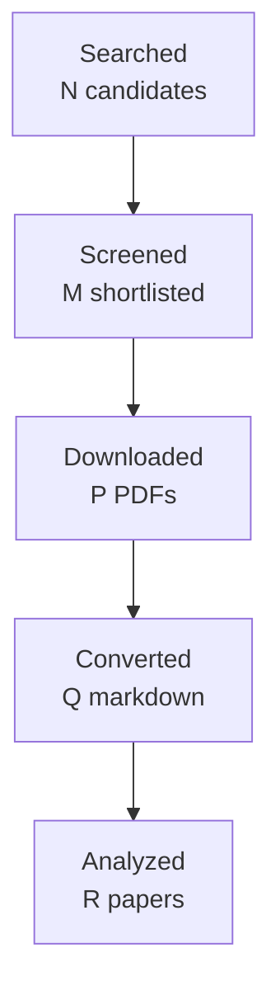

You are one worker inside an automated literature-review pipeline.
A script, not a person, reads your reply. Follow these rules exactly:
- Do the task completely in this single reply. Do not ask questions and do not
  wait for confirmation.
- Reply with the requested artifact block(s) only: no preamble, no commentary
  outside the blocks. Each block starts with a line `===BEGIN <name>===` and
  ends with a line `===END <name>===`; the content between those lines is
  written to a file verbatim.
- Never invent papers, identifiers, numbers, or quotes. Leave unknown fields
  out or mark them as unknown.
- Do not use your code tool, canvas, or connectors; plain text is enough.

# Task: write the final research report

Research topic: **Direct enterprise email/chat studies of longitudinal cross-thread conversation or work-item linking, especially evidence for concrete business-event identity and for partial, evolving, subevent, or non-transitive continuity relations in organizational workflows.**
Run id: `2be7131314a5`  Round: 4 of at most 4

Write the final report in Markdown following the template below exactly:
same section names in the same order, `[HIGH]`/`[MEDIUM]`/`[LOW]` confidence
tags on every finding, `[ACADEMIC]`/`[ENGINEERING]` labels on every gap, at
least one Mermaid `flowchart TD` diagram, LaTeX (`$...$`) for formulas, and
evidence citations as `[paper_id]`. Cite only the paper ids listed under
"Papers reviewed". In Methodology state that the papers were read through
the host's web tool and give the access level of each paper. Leave no
template placeholder in the output. Do not write a line that starts with
`===` inside the report.

Round History: use exactly these rows (they are computed by the pipeline):
| 1 | c97ebc819fac | cross-thread topic identity and incremental continuity in work communication | 14 | initial shortlist | 4 academic, 3 engineering |
| 2 | 3a90c92ac2ec | direct evidence for cross-thread workplace work-matter identity, including cross-document business event coreference, enterprise email/chat continuity, and partial or evolving event identity | 11 | 0 resolved | 4 academic, 3 engineering |
| 3 | 5c3438274b84 | Direct enterprise communication evidence for cross-thread work-matter continuity, with emphasis on email/chat conversation linking, business-event coreference, and partial or evolving event identity in organizational workflows. | 13 | 0 resolved | 4 academic, 3 engineering |
| 4 | 2be7131314a5 | Direct enterprise email/chat studies of longitudinal cross-thread conversation or work-item linking, especially evidence for concrete business-event identity and for partial, evolving, subevent, or non-transitive continuity relations in organizational workflows. | 12 | 0 resolved | 4 academic, 3 engineering |
| 4 | 2be7131314a5 | Direct enterprise email/chat studies of longitudinal cross-thread conversation or work-item linking, especially evidence for concrete business-event identity and for partial, evolving, subevent, or non-transitive continuity relations in organizational workflows. | 4 | academic gaps of the previous round | 4 academic, 3 engineering |
Stop reason line: 4-round cap reached

Research Gaps: list every gap that is still open with its classification,
priority, and the rounds that already searched for it. An unresolved gap is
never presented as accepted or closed; say plainly that the literature has
not answered it yet.

Query variants used:
- direct enterprise email/chat studies longitudinal cross-thread conversation work-item linking, especially evidence concrete business-event identity partial, evolving, subevent, non-transitive continuity relations organizational workflows.
- direct enterprise email/chat
- direct studies longitudinal cross-thread conversation work-item linking, especially evidence concrete business-event identity partial, evolving, subevent, non-transitive continuity relations organizational workflows.
- enterprise studies longitudinal cross-thread conversation work-item linking, especially evidence concrete business-event identity partial, evolving, subevent, non-transitive continuity relations organizational workflows.
- email/chat studies longitudinal cross-thread conversation work-item linking, especially evidence concrete business-event identity partial, evolving, subevent, non-transitive continuity relations organizational workflows.
- direct enterprise email/chat studies longitudinal
- direct enterprise email/chat cross-thread conversation
- direct enterprise email/chat work-item linking,

## Project context you must work within

This is the project's own description of the problem, its boundaries,
and the distinctions it needs preserved. It governs what counts as
relevant; the academic task names alone do not.

# Topic 03 context — Cross-thread Topic identity and incremental continuity

## Why this Topic exists

After Topic 02 identifies work-matter evidence inside supplied messages/groups, msgloom still needs to answer a harder longitudinal question: **does new evidence continue an existing concrete work matter, start a new work matter, or remain uncertain?**

Real work does not respect email subjects or thread boundaries. A procurement matter can move from one email chain to another, then into Teams, then return under a new title. Conversely, two messages with the same customer, project name, participants, or subject can still be distinct matters. Wrong merging can hide a due item; wrong splitting can fragment history and obscure state.

This Topic is therefore the owner of **stable Topic identity across independent Groups and sources**, especially incrementally over time.

## Direct handoff from earlier Topics

Topic 01 established that conversation/group relationships are evidence but **not Topic identity**. Topic 02 explicitly handed off its G10 problem — concrete work-matter identity and Topic count — to Topic 03. Those handoffs are part of this Topic's starting context, not new gaps to rediscover.

## Core research object

Given a new candidate matter/span/group and a set of existing Topic identities, decide among:

```text
CONTINUE existing Topic
NEW Topic
UNCERTAIN relationship (keep separate)
MERGE correction
SPLIT correction
```

Identity must be stable and independent of generated titles. Corrections create new assessments and links; they do not rewrite source history.

## Product and phase relevance

This Topic straddles phases:

- Phase 1 can link a continuation only with explicit supporting evidence and otherwise must keep matters separate with uncertainty.
- Phase 2 A4 explicitly owns Topic relationships across **independent groups and sources** and can investigate additional evidence.

Therefore research should distinguish what can safely be done from supplied content in Phase 1 from what requires Phase 2 investigation.

## Relationships to other Topics

| Topic | Relationship |
| --- | --- |
| 01 | Supplies conversation/group ancestry and source provenance; these are features/evidence, not identity decisions. |
| 02 | Supplies within-message candidate Topic spans/memberships. Topic 03 decides cross-message/group continuity. |
| 04 | Reference resolution may provide evidence that a new message refers to a prior matter, but reference evidence alone may remain ambiguous. |
| 05 | Actions/commitments can be strong identity evidence when owner/object/target match, but must not force a merge by themselves. |
| 06 | State and temporal compatibility help distinguish continuation from a similar but different matter and help detect merge/split errors. |
| 07 | When identity is uncertain, Topic 07 may retrieve bounded historical evidence to resolve the relationship in Phase 2. |
| 09 | Briefing needs stable identities to avoid duplicate or missing Topic entries. |
| 10 | Topic 10 evaluates confidence/calibration and relationship evidence quality; Topic 03 owns the domain decision. |

## Key conceptual distinctions

- Group/conversation membership ≠ Topic identity.
- Same subject/customer/project ≠ same work matter.
- Semantic similarity ≠ continuation.
- One new message may continue multiple existing matters through different spans.
- A Topic label/title is presentation, not identity.
- “No confident match” ≠ proven new Topic; abstention/uncertainty may be correct.
- Online assignment decisions must support later correction when new evidence arrives.

## Research questions to emphasize

- What evidence establishes same-event/same-work-matter identity across documents?
- How do event/entity coreference methods distinguish identity from similarity?
- How should online clustering create a new cluster versus attach to an existing one?
- How are novelty/new-event detection and open-set rejection evaluated?
- How can merge/split corrections preserve stable IDs and history?
- How should temporal, participant, object, action, reference, and source-structure evidence be combined without over-merging?
- Which benchmarks actually test cross-document identity rather than topical similarity?
- How should uncertain cross-source relationships remain separate and visible?

## High-value academic terminology

Search across several research communities:

- cross-document event coreference (CDCR); event coreference resolution;
- cross-document entity coreference; entity resolution; entity matching; record linkage;
- event identity; event linking; event clustering;
- topic detection and tracking (TDT); topic tracking; new event detection;
- online clustering; incremental clustering; streaming clustering;
- novelty detection; open-set recognition/classification; reject option;
- cluster assignment with abstention; unknown-class detection;
- dynamic clustering; cluster merge/split; incremental entity resolution;
- temporal/event consistency; event evolution; storyline/event tracking;
- cross-source information linking; cross-channel conversation linking;
- task/work-item identity (when available in enterprise/workflow literature).

## Query families

- `"cross-document event coreference" identity`
- `"event coreference" cross-document clustering`
- `"new event detection" topic tracking`
- `"online clustering" event stream novelty`
- `"incremental clustering" entity resolution`
- `"open set" event classification clustering`
- `"cluster assignment" abstention streaming text`
- `"topic detection and tracking" new event`
- `work item identity email cross thread`
- `business email cross-thread topic tracking`
- `cross-source work matter identity`

Use snowballing aggressively because useful terminology may come from event coreference, entity resolution, TDT, streaming clustering, or case/workflow management rather than email research.

## False friends / exclusions

Be cautious with:

- document-level semantic similarity or embeddings without identity labels;
- ordinary topic modeling where “topic” means latent word distribution;
- thread/conversation reconstruction (Topic 01);
- within-document segmentation (Topic 02);
- duplicate detection, which is narrower than work-matter identity;
- recommendation-session/user-interest tracking unless identity semantics match;
- clustering results that force every item into a cluster and cannot abstain/create a new Topic.

## Gap-evaluation guidance

The highest-value gaps are those that affect **false merges, false splits, new-Topic detection, stable identity, or correction**. A small precision gain on similarity clustering is less valuable than evidence about when to abstain. Evaluate false merges especially harshly because they can cause one matter to disappear from reports. Separate Phase 1 supplied-evidence decisions from Phase 2 evidence-seeking decisions.

## How to use this file

This file is the self-contained research context for this Topic. A future AI research agent should read **this file first**, then `BRIEF.md`, then any existing `CURRENT_STATUS.md`, gap decisions, reports, manifests, and prior-round artifacts in this folder. The aim is that an agent given only this Topic folder can reconstruct the project intent, Topic boundary, dependencies, search vocabulary, and gap-prioritization logic without relying on the original ChatGPT conversation.

If the full repository is available, the authoritative product documents remain `../../docs/design-brief.md`, `../../docs/design-principles.md`, `../../docs/design.md`, and `../../docs/phase-roadmap.md`. This file explains how those product constraints apply to this research Topic; it does not replace or approve changes to those design documents.

## Shared msgloom background

msgloom is a personal work-information system for one user. It is intended to process very large daily volumes of work communication, initially Outlook email and Microsoft Teams, while ensuring that **work requiring the user's response is not missed** and reducing how much the user must read to stay current.

The product is organized around **Topics**, not message summaries. A Topic is a concrete work matter described by information from one or more sources. One message can contain several Topics; one Topic can span many messages, conversations, attachments, groups, and eventually multiple sources. A conversation or Group is therefore not automatically one Topic.

The report contract is the ultimate product pressure on all ten research Topics. Reports must preserve every due Topic and the decision-relevant information needed to act on it, including developments, actions, deadlines, conditions, risks, uncertainty, and links back to exact source evidence. Missing or conflicting information must remain visible rather than being silently filled in.

The design decision order is important when evaluating research gaps: user permissions are fixed; then preserve correct meaning and report coverage; then traceability and recovery; then usability/maintenance; finally speed, brevity, and token savings. A method that is faster but loses a condition, deadline, branch, source relation, or important Topic is not an improvement for msgloom.

Important persistent principles:

- Use deterministic code for reliable mechanical relationships and AI for language understanding/judgement.
- Preserve source bytes, versions, stage history, identities, and lineage. New assessments do not erase old evidence.
- Group only on reliable relationships. Similar subjects, participants, wording, or model labels are not enough to prove Topic identity.
- Keep uncertain relationships separate and make the reason for uncertainty visible.
- Brevity must come from concise wording and layered detail, never from omitting decision-essential information.
- User-reviewed examples, missed important work, false alerts, wrong grouping, lost actions/deadlines, and evidence that changes a decision matter more than paper count or message throughput.

## Research-programme relationship

The ten Topics form a dependency network rather than ten independent literature reviews. A useful conceptual flow is:

```text
01 source/conversation structure
        ↓
02 within-message Topic spans/membership
        ↓
03 cross-thread/source Topic identity
        ↓
04 reference and response scope
        ↓
05 actions / requests / commitments / decisions
        ↓
06 state / factuality / time / revision
        ↓
07 retrieve missing context when needed
        ↘
08 understand attachments / tables / images
        ↓
09 incremental personalized briefing
        ↓
10 evidence, completeness, calibration, reliability evaluation
```

This is not a strict processing pipeline. Several Topics feed each other, and Topic 10 is cross-cutting. The numbering primarily gives a research order and ownership boundary so that one Topic does not silently absorb the whole product problem.

## Gap-evaluation rules inherited from Topics 01 and 02

The Research Pipeline must evaluate gaps using **project value**, not just academic novelty. The following rules are part of the context for every Topic:

1. A machine-classified `HIGH` or `ACADEMIC` gap does **not** automatically authorize another literature round.
2. After each academic round, perform a human/project-value review: decide whether the uncertainty is best addressed by more papers, engineering experiments, a later Topic, production-domain data, candidate-method selection, or no further current work.
3. Prefer targeted academic follow-up over broad searching. Do not fill paper quotas with weakly related literature.
4. Distinguish direct target-domain evidence from transfer methods/evaluation evidence. Transfer evidence can justify a mechanism or experiment, not production-email accuracy.
5. Engineering validation may use independent synthetic/adversarial fixtures and public data. Lack of production mailbox examples is not a reason to stop work that can be validly completed without them.
6. Never claim production representativeness from synthetic or transfer evidence. Record it as deferred until suitable authorized domain data exists.
7. If a gap belongs to another Topic, hand it off explicitly rather than duplicating research.
8. Research closure means **everything actionable at the current stage is complete and remaining work is explicitly deferred/handed off**. It does not mean literature exhaustion, production accuracy, or architecture approval.
9. For new academic work, use terminology refinement, strict paper admission, manual/controlled canonical acquisition, corpus freeze, fresh isolated Pipeline runs, direct-vs-transfer labels, independent review, strict validation, and post-round gap review. These are lessons learned from Topics 01 and 02.
10. For engineering research, keep gold independent from the component under test; structurally separate prediction inputs from evaluation gold/future context; count false positives and false negatives in end-to-end denominators; use clean-workspace reproducibility, mutation/regression tests, and fresh independent methodological review.


Papers reviewed:
- paper_id `doi-10-1145-1111449-1111472` — Linking messages and form requests (Anthony Tomasic, John Zimmerman, Isaac Simmons; 2006)
- paper_id `doi-10-18653-v1-2025-acl-long-1134` — Employing Discourse Coherence Enhancement to Improve Cross-Document Event and Entity Coreference Resolution (Xinyu Chen, Peifeng Li, Qiaoming Zhu; 2025)
- paper_id `2607.26384` — An ER-Model-Based Framework for Case Notion Selection in Object-Centric Processes (Akhil Kumar; 2026)
- paper_id `doi-10-1109-tbdata-2022-3204207` — Tracking the Evolution of Clusters in Social Media Streams (Tarique Anwar, Surya Nepal, Cecile Paris et al.; 2023)
- paper_id `doi-10-3390-industries1010003` — StableID: An Iterative Graph-Based Framework for Persistent Entity Identification in Evolving Industrial Data Systems (Zhongyuan T. Lee, Arvin Shadravan, Hamid R. Parsaei; 2026)
- paper_id `2406.15990` — Enhancing Cross-Document Event Coreference Resolution by Discourse Structure and Semantic Information (Qiang Gao, Bobo Li, Zixiang Meng et al.; 2024)
- paper_id `2405.05160` — Selective Classification Under Distribution Shifts (Hengyue Liang, Le Peng, Ju Sun; 2024)
- paper_id `doi-10-1145-1111449-1111471` — Automatically classifying emails into activities (Mark Dredze, Tessa Lau, Nicholas Kushmerick; 2006)
- paper_id `2206.10009` — Event-Case Correlation for Process Mining using Probabilistic Optimization (Dina Bayomie, Claudio Di Ciccio, Jan Mendling; 2023)
- paper_id `doi-10-1145-290941-290954` — On-Line New Event Detection and Tracking (James Allan, Ron Papka, Victor Lavrenko; 1998)
- paper_id `manual-5c20fb0229` — Topic Detection and Tracking Evaluation Overview (Jonathan G. Fiscus, George R. Doddington; 2002)
- paper_id `manual-c43ffe3135` — Cross-document Event Identity via Dense Annotation (Adithya Pratapa, Zhengzhong Liu, Kimihiro Hasegawa et al.; 2021)
- paper_id `manual-f56d02b8f9` — Using a sledgehammer to crack a nut? Lexical diversity and event coreference resolution (Agata Cybulska, Piek Vossen; 2014)
- paper_id `2104.05022` — WEC: Deriving a Large-scale Cross-document Event Coreference dataset from Wikipedia (Alon Eirew, Arie Cattan, Ido Dagan; 2021)
- paper_id `2011.12249` — Generalizing Cross-Document Event Coreference Resolution Across Multiple Corpora (Michael Bugert, Nils Reimers, Iryna Gurevych; 2020)
- paper_id `doi-10-1145-354756-354843` — First Story Detection In TDT Is Hard (James Allan, Victor Lavrenko, Hubert Jin; 2000)
- paper_id `doi-10-1007-978-3-030-49461-2-23` — Incremental Multi-source Entity Resolution for Knowledge Graph Completion (Alieh Saeedi, Eric Peukert, Erhard Rahm; 2020)
- paper_id `1412.5687` — Towards Open World Recognition (Abhijit Bendale, Terrance E. Boult; 2014)
- paper_id `1402.4417` — Incremental Entity Resolution from Linked Documents (Pankaj Malhotra, Puneet Agarwal, Gautam Shroff; 2014)
- paper_id `doi-10-1002-sim-4780140510` — Probabilistic linkage of large public health data files (Matthew A. Jaro; 1995)
- paper_id `manual-e988e24127` — Revisiting Joint Modeling of Cross-document Entity and Event Coreference Resolution (Shany Barhom, Vered Shwartz, Alon Eirew et al.; 2019)
- paper_id `1705.08500` — Selective Classification for Deep Neural Networks (Yonatan Geifman, Ran El-Yaniv; 2017)
- paper_id `doi-10-1007-s10115-019-01430-6` — Case notion discovery and recommendation: automated event log building on databases (E. González López de Murillas, Hajo A. Reijers, Wil M. P. van der Aalst; 2019)
- paper_id `doi-10-18653-v1-2022-emnlp-main-58` — Cross-document Event Coreference Search: Task, Dataset and Modeling (Alon Eirew, Avi Caciularu, Ido Dagan; 2022)
- paper_id `doi-10-2139-ssrn-7284343` — Multimodal Cross-Document Event Coreference Resolution via Contrastive Evidence Reasoning (Xue Qiao, Fei Li, Yanfeng Hu et al.; 2026)
- paper_id `doi-10-1145-290941-290953` — A Study of Retrospective and On-Line Event Detection (Yiming Yang, Thomas Pierce, Jaime G. Carbonell; 1998)
- paper_id `2407.11988` — Generating Harder Cross-document Event Coreference Resolution Datasets using Metaphoric Paraphrasing (Shafiuddin Rehan Ahmed, Zhiyong Eric Wang, George Arthur Baker et al.; 2024)
- paper_id `doi-10-1038-s41598-025-32765-6` — Argument centric causal intervention for cross document event coreference resolution (Long Yao, Wenzhong Yang, Yabo Yin et al.; 2025)
- paper_id `doi-10-1007-978-3-540-27868-9-84` — A Two-Stage Classifier with Reject Option for Text Categorisation (Giorgio Fumera, Ignazio Pillai, Fabio Roli; 2004)
- paper_id `doi-10-1002-asi-21264` — New event detection and topic tracking in Turkish (Fazli Can, Seyit Kocberber, Ozgur Baglioglu et al.; 2010)
- paper_id `doi-10-3115-1220575-1220591` — Using Names and Topics for New Event Detection (Giridhar Kumaran, James Allan; 2005)
- paper_id `manual-35bac66e3c` — Detecting Subevent Structure for Event Coreference Resolution (Jun Araki, Zhengzhong Liu, Eduard Hovy et al.; 2014)
- paper_id `doi-10-18653-v1-2023-emnlp-main-294` — Cross-Document Event Coreference Resolution on Discourse Structure (Xinyu Chen, Sheng Xu, Peifeng Li et al.; 2023)
- paper_id `1906.01753` — Revisiting Joint Modeling of Cross-document Entity and Event Coreference Resolution (Shany Barhom, Vered Shwartz, Alon Eirew et al.; 2019)
- paper_id `doi-10-1007-978-3-030-33223-5-12` — A Probabilistic Approach to Event-Case Correlation for Process Mining (Dina Bayomie, Claudio Di Ciccio, Marcello La Rosa et al.; 2019)
- paper_id `doi-10-1007-s00778-010-0203-9` — Event correlation for process discovery from Web service interaction logs (Hamid Reza Motahari-Nezhad, Regis Saint-Paul, Fabio Casati et al.; 2011)
- paper_id `doi-10-3115-v1-w14-2910` — Evaluation for Partial Event Coreference (Jun Araki, Eduard Hovy, Teruko Mitamura; 2014)
- paper_id `2109.06417` — Cross-document Event Identity via Dense Annotation (Adithya Pratapa, Zhengzhong Liu, Kimihiro Hasegawa et al.; 2021)
- paper_id `doi-10-1038-s41598-026-40637-w` — Conformal selective prediction with cost aware deferral for safe clinical triage under distribution shift (Hyun Kwon, Dae-Jin Kim; 2026)
- paper_id `doi-10-18653-v1-2020-coling-main-275` — Event Coreference Resolution with their Paraphrases and Argument-aware Embeddings (Yutao Zeng, Xiaolong Jin, Saiping Guan et al.; 2020)
- paper_id `doi-10-1109-icpm57379-2022-9980684` — Improving Accuracy and Explainability in Event-Case Correlation via Rule Mining (Dina Sayed Bayomie Sobh, Kate Revoredo, Claudio Di Ciccio et al.; 2022)
- paper_id `doi-10-1109-access-2023-3284053` — Step-by-Step Case ID Identification Based on Activity Connection for Cross-Organizational Process Mining (Kazuki Tajima, Bojian Du, Yoshiaki Narusue et al.; 2023)
- paper_id `doi-10-1145-1111449-1111473` — A hybrid learning system for recognizing user tasks from desktop activities and email messages (Jianqiang Shen, Lida Li, Thomas G. Dietterich et al.; 2006)
- paper_id `manual-03d6dfa532` — Post-Hoc Uncertainty Calibration for Domain Drift Scenarios (Christian Tomani, Sebastian Gruber, Muhammed Ebrar Erdem et al.; 2021)
- paper_id `1707.07344` — Event Coreference Resolution by Iteratively Unfolding Inter-dependencies among Events (Prafulla Kumar Choubey, Ruihong Huang; 2017)
- paper_id `doi-10-1016-j-ipm-2025-104085` — Improving cross-document event coreference resolution by discourse coherence and structure (Xinyu Chen, Peifeng Li, Qiaoming Zhu; 2025)
- paper_id `doi-10-1080-01621459-1969-10501049` — A Theory for Record Linkage (Ivan P. Fellegi, Alan B. Sunter; 1969)
- paper_id `manual-61a7e10e5f` — Semantic Relations between Events and their Time, Locations and Participants for Event Coreference Resolution (Agata Cybulska, Piek Vossen; 2013)

Access level per paper:
- `1402.4417`: full_text via https://arxiv.org/html/1402.4417
- `1412.5687`: full_text via https://arxiv.org/html/1412.5687
- `1705.08500`: full_text via https://arxiv.org/html/1705.08500
- `1707.07344`: full_text via https://arxiv.org/html/1707.07344
- `1906.01753`: full_text via https://arxiv.org/html/1906.01753
- `2011.12249`: full_text via https://aclanthology.org/2021.cl-3.18.pdf
- `2104.05022`: full_text via https://arxiv.org/html/2104.05022
- `2109.06417`: full_text via https://arxiv.org/html/2109.06417
- `2206.10009`: full_text via https://arxiv.org/html/2206.10009
- `2211.07342`: full_text via https://arxiv.org/html/2211.07342
- `2405.05160`: full_text via https://arxiv.org/html/2405.05160
- `2406.15990`: full_text via https://arxiv.org/html/2406.15990
- `2407.11988`: full_text via https://arxiv.org/html/2407.11988
- `2607.26384`: full_text via https://arxiv.org/pdf/2607.26384
- `doi-10-1002-asi-21264`: full_text via https://repository.bilkent.edu.tr/bitstreams/7bc0e319-1308-4347-b693-3a5f8af58801/download
- `doi-10-1002-sim-4780140510`: abstract_only via https://onlinelibrary.wiley.com/doi/abs/10.1002/sim.4780140510
- `doi-10-1007-978-3-030-33223-5-12`: full_text via https://www.diciccio.net/claudio/preprints/Bayomie-etal-ER2019-EventCaseCorrelationforProcessMining.pdf
- `doi-10-1007-978-3-030-49461-2-23`: full_text via https://pmc.ncbi.nlm.nih.gov/articles/PMC7250616/
- `doi-10-1007-978-3-540-27868-9-84`: full_text via https://www.researchgate.net/publication/221275693_A_Two-Stage_Classifier_with_Reject_Option_for_Text_Categorisation
- `doi-10-1007-s00778-010-0203-9`: abstract_only via https://www.vldb.org/vldb_journal/index.php/component/article_manager/article/1156
- `doi-10-1007-s10115-019-01430-6`: full_text via https://link.springer.com/article/10.1007/s10115-019-01430-6
- `doi-10-1016-j-ipm-2025-104085`: full_text via https://www.sciencedirect.com/science/article/pii/S0306457325000275
- `doi-10-1038-s41598-025-32765-6`: full_text via https://pmc.ncbi.nlm.nih.gov/articles/PMC12827381/
- `doi-10-1038-s41598-026-40637-w`: full_text via https://www.nature.com/articles/s41598-026-40637-w
- `doi-10-1080-01621459-1969-10501049`: full_text via https://www.cs.cornell.edu/~shmat/courses/cs6434/fellegi-sunter.pdf
- `doi-10-1109-access-2023-3284053`: full_text via https://www.researchgate.net/publication/371440370_Step-by-Step_Case_ID_Identification_based_on_Activity_Connection_for_Cross-Organizational_Process_Mining
- `doi-10-1109-icpm57379-2022-9980684`: full_text via https://icpmconference.org/2022/wp-content/uploads/sites/7/2022/10/paper_40.pdf
- `doi-10-1109-tbdata-2022-3204207`: abstract_only via https://researchers.mq.edu.au/en/publications/tracking-the-evolution-of-clusters-in-social-media-streams/
- `doi-10-1145-1111449-1111471`: full_text via https://www.cs.jhu.edu/~mdredze/publications/iui06-dredze.pdf
- `doi-10-1145-1111449-1111472`: full_text via https://www.researchgate.net/publication/221607600_Linking_messages_and_form_requests
- `doi-10-1145-1111449-1111473`: full_text via https://web.engr.oregonstate.edu/~tgd/publications/IUI06-TaskPredictor.pdf
- `doi-10-1145-290941-290953`: abstract_only via https://scispace.com/papers/a-study-of-retrospective-and-on-line-event-detection-3uo6kj6w8w
- `doi-10-1145-290941-290954`: full_text via https://sigir.hosting.acm.org/wp-content/uploads/2017/06/p185.pdf
- `doi-10-1145-354756-354843`: full_text via https://ciir.cs.umass.edu/pubfiles/ir-206.pdf
- `doi-10-18653-v1-2020-coling-main-275`: full_text via https://aclanthology.org/2020.coling-main.275.pdf
- `doi-10-18653-v1-2022-emnlp-main-58`: full_text via https://arxiv.org/html/2210.12654
- `doi-10-18653-v1-2023-emnlp-main-294`: full_text via https://aclanthology.org/2023.emnlp-main.294.pdf
- `doi-10-18653-v1-2024-findings-emnlp-725`: full_text via https://aclanthology.org/2024.findings-emnlp.725.pdf
- `doi-10-18653-v1-2025-acl-long-1134`: full_text via https://aclanthology.org/2025.acl-long.1134.pdf
- `doi-10-2139-ssrn-7284343`: abstract_only via https://papers.ssrn.com/sol3/papers.cfm?abstract_id=7284343
- `doi-10-3115-1220575-1220591`: full_text via https://aclanthology.org/H05-1016.pdf
- `doi-10-3115-v1-w14-2910`: full_text via https://aclanthology.org/W14-2910.pdf
- `doi-10-3390-industries1010003`: full_text via https://www.mdpi.com/3042-9021/1/1/3
- `manual-03d6dfa532`: full_text via https://arxiv.org/html/2012.10988
- `manual-35bac66e3c`: full_text via https://www.cs.cmu.edu/~hovy/papers/14LREC-subevents.pdf
- `manual-5c20fb0229`: abstract_only via https://www.nist.gov/publications/topic-detection-and-tracking-evaluation-overview
- `manual-61a7e10e5f`: full_text via https://aclanthology.org/R13-1021.pdf
- `manual-c43ffe3135`: full_text via https://arxiv.org/html/2109.06417
- `manual-e988e24127`: full_text via https://arxiv.org/html/1906.01753
- `manual-f56d02b8f9`: abstract_only via https://aclanthology.org/L14-1646/

Cross-paper synthesis (the source of findings, gaps, and themes):
{
 "topic": "Direct enterprise email/chat studies of longitudinal cross-thread conversation or work-item linking, especially evidence for concrete business-event identity and for partial, evolving, subevent, or non-transitive continuity relations in organizational workflows.",
 "paper_count": 50,
 "executive_summary": "The corpus strongly supports msgloom's central premise that conversation structure, lexical similarity, shared participants, and generated labels are evidence for continuity but are not themselves work-matter identity. Direct enterprise-email evidence shows that real work activities cross reply-thread boundaries and that participants alone can confuse concurrent activities. Event-coreference and process-correlation literature further supports combining action, entity, participant, temporal, structural, and domain-constraint evidence while guarding against superficial similarity. Equally important, partial identity, subevents, membership, evolving events, and spatiotemporal continuity cannot always be represented as transitive equivalence clusters. Online systems therefore need explicit rejection or uncertainty, incremental evidence accumulation, and repairable identity state. However, the corpus still lacks direct Outlook-plus-Teams production evidence and does not establish msgloom-specific decision thresholds, correction semantics, or mappings from partial-event relations to workplace Topic continuity.",
 "themes": [
  "Cross-thread enterprise work identity cannot be reduced to email-thread ancestry: content, participants, and threading provide complementary evidence, while the same participants may participate in several concurrent activities [doi-10-1145-1111449-1111471].",
  "Concrete identity is better supported by combinations of event action, arguments/entities, participants, time, discourse, and domain constraints than by surface lexical similarity alone [1906.01753] [2011.12249] [manual-61a7e10e5f] [doi-10-1038-s41598-025-32765-6].",
  "Partial, hierarchical, membership, subevent, and evolving continuity relations are materially different from full same-event identity and may be non-transitive [2109.06417] [manual-c43ffe3135] [manual-35bac66e3c] [2211.07342].",
  "New-event detection and online attachment are asymmetric decisions: detecting genuinely new matters is harder than tracking known ones, which supports an explicit uncertain or reject region instead of forced assignment [doi-10-1145-290941-290954] [doi-10-1145-354756-354843] [doi-10-1080-01621459-1969-10501049].",
  "Continuity representations should evolve as evidence arrives; adaptive tracking, iterative coreference, and incremental entity resolution can exploit facts that were unavailable at initial assignment [doi-10-1002-asi-21264] [1707.07344] [1402.4417].",
  "Incremental identity systems can preserve historical identifiers while supporting local repair, merge, split, emergence, and disappearance rather than recomputing history as if previous assignments never existed [doi-10-1007-978-3-030-49461-2-23] [doi-10-3390-industries1010003] [doi-10-1109-tbdata-2022-3204207].",
  "Enterprise process literature provides useful analogues for concrete work-matter identity: business entities and constraints can anchor cases, broadly shared resources can cause false merges, and incomplete executions can remain legitimate cases while evidence is still arriving [2607.26384] [2206.10009].",
  "Cross-corpus and distribution-shift results warn against assuming that confidence, thresholds, or feature importance learned on one benchmark will transfer unchanged to workplace streams [2011.12249] [2405.05160] [doi-10-18653-v1-2024-findings-emnlp-725] [manual-03d6dfa532]."
 ],
 "findings": [
  {
   "statement": "Direct enterprise-email evidence confirms that work-activity continuity can cross reply-thread boundaries, so Group or thread membership should be treated as evidence rather than Topic identity; participant identity is also insufficient because the same people can participate in multiple simultaneous activities.",
   "confidence": "HIGH",
   "evidence": [
    {
     "paper_id": "doi-10-1145-1111449-1111471",
     "section": "key_findings"
    },
    {
     "paper_id": "doi-10-1145-1111449-1111472",
     "section": "key_findings"
    }
   ]
  },
  {
   "statement": "Across event-coreference and process-correlation studies, identity decisions improve when multiple dimensions are combined, including action semantics, resolved arguments/entities, participants, time, discourse context, data attributes, and domain constraints; no single shared name, participant, trigger, or similarity score is a reliable identity criterion.",
   "confidence": "HIGH",
   "evidence": [
    {
     "paper_id": "1906.01753",
     "section": "key_findings"
    },
    {
     "paper_id": "2011.12249",
     "section": "key_findings"
    },
    {
     "paper_id": "manual-61a7e10e5f",
     "section": "key_findings"
    },
    {
     "paper_id": "2206.10009",
     "section": "key_findings"
    },
    {
     "paper_id": "doi-10-3115-1220575-1220591",
     "section": "key_findings"
    }
   ]
  },
  {
   "statement": "Surface lexical similarity is especially unsafe as an identity proxy: distinct events can share triggers or class vocabulary, while identical events can be paraphrased with very different triggers; argument-aware and contextual evidence helps counter both error modes.",
   "confidence": "HIGH",
   "evidence": [
    {
     "paper_id": "2407.11988",
     "section": "key_findings"
    },
    {
     "paper_id": "doi-10-1038-s41598-025-32765-6",
     "section": "key_findings"
    },
    {
     "paper_id": "doi-10-18653-v1-2020-coling-main-275",
     "section": "key_findings"
    },
    {
     "paper_id": "doi-10-1145-290941-290954",
     "section": "key_findings"
    }
   ]
  },
  {
   "statement": "The literature establishes that longitudinal relation structure is richer than binary same-versus-different identity: membership, subevents, sister relations, and spatiotemporal continuity can represent partial or evolving relationships, and some such relations violate transitivity. Therefore ordinary equivalence-cluster closure is not a sound universal representation for all workplace continuity evidence.",
   "confidence": "HIGH",
   "evidence": [
    {
     "paper_id": "2109.06417",
     "section": "key_findings"
    },
    {
     "paper_id": "manual-c43ffe3135",
     "section": "key_findings"
    },
    {
     "paper_id": "manual-35bac66e3c",
     "section": "key_findings"
    },
    {
     "paper_id": "doi-10-3115-v1-w14-2910",
     "section": "key_findings"
    },
    {
     "paper_id": "2211.07342",
     "section": "key_findings"
    }
   ]
  },
  {
   "statement": "For online operation, a no-confident-match outcome should not automatically mean NEW: record linkage, open-world recognition, and selective classification all support an explicit unresolved or rejected region, while TDT shows that genuinely new-event detection is substantially harder than tracking already represented events.",
   "confidence": "HIGH",
   "evidence": [
    {
     "paper_id": "doi-10-1080-01621459-1969-10501049",
     "section": "key_findings"
    },
    {
     "paper_id": "1412.5687",
     "section": "key_findings"
    },
    {
     "paper_id": "1705.08500",
     "section": "key_findings"
    },
    {
     "paper_id": "doi-10-1145-354756-354843",
     "section": "key_findings"
    },
    {
     "paper_id": "doi-10-1145-290941-290953",
     "section": "key_findings"
    }
   ]
  },
  {
   "statement": "Continuity assessment should be incremental because later evidence can materially change identity judgments: adaptive topic representations, propagated event arguments, newly linked entities, and newly inferred cross-organizational mappings all improve subsequent attachment decisions.",
   "confidence": "HIGH",
   "evidence": [
    {
     "paper_id": "doi-10-1002-asi-21264",
     "section": "key_findings"
    },
    {
     "paper_id": "doi-10-1145-290941-290954",
     "section": "key_findings"
    },
    {
     "paper_id": "1707.07344",
     "section": "key_findings"
    },
    {
     "paper_id": "1402.4417",
     "section": "key_findings"
    },
    {
     "paper_id": "doi-10-1109-access-2023-3284053",
     "section": "key_findings"
    }
   ]
  },
  {
   "statement": "Incremental identity maintenance need not make early assignments irreversible: local reclustering, historical-cluster merging, explicit stream merge/split actions, and historically dominant persistent identifiers demonstrate mechanisms for repair while preserving continuity of system identity.",
   "confidence": "HIGH",
   "evidence": [
    {
     "paper_id": "1402.4417",
     "section": "key_findings"
    },
    {
     "paper_id": "doi-10-1007-978-3-030-49461-2-23",
     "section": "key_findings"
    },
    {
     "paper_id": "doi-10-1109-tbdata-2022-3204207",
     "section": "key_findings"
    },
    {
     "paper_id": "doi-10-3390-industries1010003",
     "section": "key_findings"
    }
   ]
  },
  {
   "statement": "Enterprise process evidence supports anchoring identity in concrete business objects and constraints rather than broadly shared contextual entities: resource-like objects can spuriously connect unrelated executions, whereas domain-selected primary and secondary entities can define coherent cases; incomplete cases may remain valid while later evidence is absent.",
   "confidence": "MEDIUM",
   "evidence": [
    {
     "paper_id": "2607.26384",
     "section": "key_findings"
    },
    {
     "paper_id": "2206.10009",
     "section": "key_findings"
    },
    {
     "paper_id": "doi-10-1109-icpm57379-2022-9980684",
     "section": "key_findings"
    }
   ]
  },
  {
   "statement": "Phase 2 evidence seeking is technically plausible because retrieval-oriented coreference and broader discourse/context methods can recover identity evidence outside a local mention pair, but the corpus does not establish the optimal retrieval budget, stopping rule, latency-quality trade-off, or decision benefit for msgloom.",
   "confidence": "MEDIUM",
   "evidence": [
    {
     "paper_id": "doi-10-18653-v1-2022-emnlp-main-58",
     "section": "key_findings"
    },
    {
     "paper_id": "doi-10-18653-v1-2023-emnlp-main-294",
     "section": "key_findings"
    },
    {
     "paper_id": "doi-10-1016-j-ipm-2025-104085",
     "section": "key_findings"
    },
    {
     "paper_id": "doi-10-18653-v1-2025-acl-long-1134",
     "section": "key_findings"
    }
   ]
  },
  {
   "statement": "Identity models, confidence rankings, and calibration do not transfer reliably across corpora or distribution shifts, so benchmark performance on news event coreference or generic selective classification cannot establish production reliability for longitudinal Outlook-plus-Teams work-matter linking.",
   "confidence": "HIGH",
   "evidence": [
    {
     "paper_id": "2011.12249",
     "section": "key_findings"
    },
    {
     "paper_id": "2405.05160",
     "section": "key_findings"
    },
    {
     "paper_id": "doi-10-18653-v1-2024-findings-emnlp-725",
     "section": "key_findings"
    },
    {
     "paper_id": "manual-03d6dfa532",
     "section": "key_findings"
    }
   ]
  }
 ],
 "contradictions": [
  {
   "topic": "How much email metadata is sufficient for work-task identity",
   "papers": [
    "doi-10-1145-1111449-1111471",
    "doi-10-1145-1111449-1111473"
   ],
   "note": "The activity-classification study finds that threading alone is weak and that content materially strengthens cross-thread activity linking, whereas the predefined-task predictor reports high precision from sender, recipient, and subject features and no additional benefit from email-body words. The results are not directly incompatible because the tasks, labels, coverage regimes, and identity granularity differ; they show that feature sufficiency is task-dependent and should not be generalized."
  },
  {
   "topic": "Document topic pre-clustering as an identity aid versus a source of benchmark overfitting",
   "papers": [
    "1906.01753",
    "2011.12249",
    "2104.05022"
   ],
   "note": "Topic pre-clustering is a very strong continuity signal on ECB+, but cross-corpus evaluation warns that designs exploiting ECB+'s document-link distribution can generalize poorly. WEC deliberately allows corpus-wide coreference rather than restricting identity to predefined topic partitions. For msgloom, pre-clustering may be useful candidate generation but should not be treated as an identity boundary."
  },
  {
   "topic": "Transitive clustering versus non-transitive longitudinal relations",
   "papers": [
    "doi-10-18653-v1-2025-acl-long-1134",
    "2109.06417",
    "manual-c43ffe3135",
    "2211.07342"
   ],
   "note": "Conventional event coreference represents same-event identity as equivalence-style clusters, while dense partial-identity work shows that membership, subevent, and spatiotemporal-continuity relations may violate transitivity. MAVEN-ERE avoids part of this conflict by separating same-event coreference from subevent, temporal, and causal relations. The apparent contradiction is resolved only by preserving distinct relation semantics instead of applying transitive closure to every form of continuity."
  },
  {
   "topic": "Forced case assignment versus explicit rejection or unresolved identity",
   "papers": [
    "doi-10-1007-978-3-030-33223-5-12",
    "doi-10-1080-01621459-1969-10501049",
    "1412.5687",
    "1705.08500"
   ],
   "note": "The process-correlation method assigns every event to exactly one case, whereas record-linkage and selective/open-world methods explicitly preserve possible-link or rejected outcomes. These optimize different task contracts. For msgloom, whose design prioritizes avoiding false merges and preserving uncertainty, the forced-assignment assumption is not transferable without separate validation."
  },
  {
   "topic": "Semantic broadening improves recall but can reduce identity precision",
   "papers": [
    "manual-61a7e10e5f",
    "2407.11988",
    "doi-10-1038-s41598-025-32765-6"
   ],
   "note": "Semantic action similarity and paraphrase robustness are necessary to link lexically diverse mentions, but broader semantic matching can sharply reduce precision when distinct event instances share type-level meaning. Argument-centric evidence mitigates part of this tension by distinguishing same-trigger/different-event and different-trigger/same-event cases. The corpus therefore supports semantic broadening only when constrained by identity-specific evidence."
  }
 ],
 "gaps": [
  {
   "id": "gap-1",
   "description": "Which evidence combinations actually establish or refute continuity of a concrete work matter across independent workplace messages, conversations, attachments, email, and Teams remains open. The corpus contains direct cross-thread enterprise-email evidence and stronger process/event evidence, but it still does not validate the required combination of subject, customer/project names, conversation ancestry, referenced artifacts, commitments, state compatibility, attachments, and cross-source evidence for the target domain.",
   "classification": "ACADEMIC",
   "priority": "HIGH",
   "suggested_query": "(\"work item identity\" OR \"work matter identity\" OR \"business event coreference\" OR \"cross-document event coreference\") AND (email OR \"workplace communication\" OR enterprise) AND (cross-thread OR cross-document OR cross-source)"
  },
  {
   "id": "gap-2",
   "description": "The application-specific decision policy remains open: the relative cost of false merges versus false splits, thresholds for attachment versus rejection, and exact semantics/calibration of CONTINUE, NEW, and UNCERTAIN must be determined from msgloom requirements and empirical evaluation. The corpus supports reject options and risk-coverage trade-offs but does not establish msgloom's loss function or false-merge cost.",
   "classification": "ENGINEERING",
   "priority": "HIGH"
  },
  {
   "id": "gap-3",
   "description": "The msgloom correction and identity-state model remains open. Stable Topic IDs independent of generated labels or source thread IDs, versioned identity assessments, supersession links, immutable evidence lineage, and general MERGE/SPLIT correction require project-level design and testing. Incremental entity-resolution and stable-ID papers establish useful mechanisms but not msgloom's required history semantics.",
   "classification": "ENGINEERING",
   "priority": "HIGH"
  },
  {
   "id": "gap-4",
   "description": "There is still no direct production-domain evidence in this corpus for longitudinal work-matter identity across Outlook email and Microsoft Teams. The direct enterprise-email study and enterprise-process literature are useful adjacent evidence but do not establish production accuracy or representativeness for msgloom's Outlook-plus-Teams environment.",
   "classification": "ACADEMIC",
   "priority": "HIGH",
   "suggested_query": "(enterprise OR workplace OR organizational) AND (email OR \"Microsoft Teams\" OR \"enterprise chat\" OR \"workplace chat\") AND (cross-thread OR longitudinal OR cross-conversation) AND (\"topic identity\" OR \"task tracking\" OR \"case tracking\" OR \"event coreference\" OR \"conversation linking\")"
  },
  {
   "id": "gap-5",
   "description": "How partial, subevent, evolving, membership, or otherwise non-transitive relations should map onto workplace work-matter continuity remains unresolved. The corpus strongly establishes that these relations exist and can violate transitivity, but it does not define when they should mean CONTINUE, RELATED-BUT-SEPARATE, MERGE, SPLIT, or another workplace-specific relation.",
   "classification": "ACADEMIC",
   "priority": "HIGH",
   "suggested_query": "(\"partial event identity\" OR \"partial coreference\" OR \"subevent relation\" OR \"event evolution\" OR \"event membership\" OR \"non-transitive coreference\") AND (workflow OR task OR case OR workplace OR enterprise)"
  },
  {
   "id": "gap-6",
   "description": "The best operational strategy for Phase 2 evidence seeking remains unresolved. Retrieval-based event-coreference search and global-context models show that additional evidence can matter, but msgloom still needs engineering benchmarks for bounded historical retrieval, candidate generation, latency, retrieval stopping rules, and whether retrieved context actually changes identity decisions correctly.",
   "classification": "ENGINEERING",
   "priority": "MEDIUM"
  },
  {
   "id": "gap-7",
   "description": "Calibration under non-stationary workplace streams remains unresolved. The corpus provides substantial evidence that calibration deteriorates under distribution shift and that drift-aware, selective, or conformal approaches can help, but it does not establish reliable calibration, abstention thresholds, or coverage guarantees for longitudinal workplace coreference or clustering.",
   "classification": "ACADEMIC",
   "priority": "MEDIUM",
   "suggested_query": "(\"selective classification\" OR abstention OR \"confidence calibration\" OR \"selective prediction\") AND (\"distribution shift\" OR nonstationary OR streaming OR \"concept drift\") AND (text OR NLP OR coreference OR clustering)"
  }
 ],
 "actionable_insights": [
  "Keep Phase 1 conservative: CONTINUE only when explicit identity evidence is strong; otherwise preserve a separate candidate with UNCERTAIN rather than interpreting low match confidence as NEW [doi-10-1080-01621459-1969-10501049] [1705.08500].",
  "Implement identity evidence as multiple auditable feature families—conversation ancestry, action/object, participants/entities, time, references, artifacts, state compatibility, and source structure—rather than a single semantic-similarity score [1906.01753] [2011.12249] [2206.10009].",
  "Treat subject, project/customer names, participants, and thread IDs as candidate-generation or supporting features, never sufficient merge keys [doi-10-1145-1111449-1111471] [doi-10-3115-1220575-1220591] [2607.26384].",
  "Represent full SAME-MATTER identity separately from RELATED, SUBEVENT/MEMBER, and EVOLVING-CONTINUITY relations; do not apply transitive closure to relations whose semantics are not equivalence relations [2109.06417] [2211.07342] [manual-35bac66e3c].",
  "Make identity state append-only and repairable: retain stable Topic IDs, record each assessment with evidence and version, and express later merge/split corrections explicitly rather than rewriting history [doi-10-3390-industries1010003] [doi-10-1007-978-3-030-49461-2-23] [doi-10-1109-tbdata-2022-3204207].",
  "For Phase 2, retrieve bounded historical evidence only for ambiguous candidates and measure whether retrieval changes a wrong or uncertain decision to a correct one; retrieval quality alone is not the target metric [doi-10-18653-v1-2022-emnlp-main-58] [doi-10-18653-v1-2023-emnlp-main-294].",
  "Build adversarial evaluation sets with same customer/project but different matters, same participants but parallel requests, renamed subjects, paraphrased continuations, delayed evidence, and one message continuing multiple matters; these directly exercise failure modes exposed by enterprise-email, TDT, and event-coreference studies [doi-10-1145-1111449-1111471] [doi-10-1145-290941-290954] [2407.11988].",
  "Evaluate false merges and false splits separately and include an abstention coverage curve; average clustering F1 alone can hide the product-critical failure where an independent work matter disappears into another Topic [1705.08500] [2405.05160].",
  "Do not calibrate deployment confidence solely on ECB+, WEC, or another static benchmark; use held-out workplace-like temporal slices and explicit drift tests before assigning operational meaning to confidence thresholds [2011.12249] [manual-03d6dfa532] [doi-10-18653-v1-2024-findings-emnlp-725]."
 ],
 "confidence_summary": "Confidence is HIGH for the structural conclusions that thread membership is not identity, multiple evidence dimensions are needed, lexical or participant similarity can cause false merges, uncertainty should be representable, and incremental identity requires repair. Confidence is also HIGH that partial and evolving event relations cannot universally be collapsed into transitive equivalence clusters. Confidence is MEDIUM when transferring process-case mechanisms and news-event coreference evidence to concrete workplace Topics. Confidence is LOW for any claim about production accuracy, optimal thresholds, or relation semantics in Outlook-plus-Teams because no study in the corpus directly validates msgloom's target environment.",
 "limitations": [
  "Most identity evidence comes from news event coreference, TDT, entity resolution, or process mining rather than longitudinal Outlook-plus-Teams work communication [2011.12249] [2206.10009].",
  "The strongest direct enterprise-email study links messages to user work activities, which is highly relevant but does not fully establish the narrower semantics of a concrete business-event or work-matter identity [doi-10-1145-1111449-1111471].",
  "Several studies evaluate gold event mentions or otherwise simplified inputs, so their reported coreference scores do not measure an end-to-end system that must first identify candidate matters correctly [doi-10-1016-j-ipm-2025-104085].",
  "Benchmarks differ substantially in annotation ontology, topic partitioning, lexical diversity, and relation definitions, making raw metric comparisons unsuitable as evidence of method superiority for msgloom [2104.05022] [2407.11988] [2011.12249].",
  "Partial-identity annotation itself has lower agreement than full identity, so the exact boundary among continuation, subevent, and related-but-separate cases remains intrinsically difficult [2109.06417].",
  "Process-case identity can depend on a chosen case notion and may admit multiple plausible views, so process-mining correlations are analogues rather than direct ground truth for workplace Topic identity [doi-10-1007-s00778-010-0203-9] [doi-10-1007-s10115-019-01430-6].",
  "The supplied corpus includes duplicate analyses of the same underlying studies under different paper IDs, notably [1906.01753] with [manual-e988e24127] and [2109.06417] with [manual-c43ffe3135]; these should not be counted as independent replication.",
  "Selective-classification, open-world, and calibration papers establish useful decision mechanisms but do not themselves validate semantic work-matter identity features [1412.5687] [1705.08500] [2405.05160]."
 ],
 "gap_status": [
  {
   "id": "gap-1",
   "status": "open",
   "note": "Round 4 strengthens adjacent evidence: enterprise email demonstrates cross-thread work-activity linking, and process/event studies identify useful combinations of content, participants, objects, time, and constraints. No corpus paper validates the required evidence combination for concrete cross-message, attachment, email, and Teams work-matter identity in the target domain.",
   "evidence": [
    "doi-10-1145-1111449-1111471",
    "1906.01753",
    "2206.10009",
    "2607.26384"
   ]
  },
  {
   "id": "gap-2",
   "status": "open",
   "note": "Three-way linkage, open-world rejection, and selective-risk literature establishes mechanisms for abstention and thresholding, but no paper supplies msgloom's loss function, false-merge cost, or operational semantics for CONTINUE, NEW, and UNCERTAIN.",
   "evidence": [
    "doi-10-1080-01621459-1969-10501049",
    "1412.5687",
    "1705.08500",
    "2405.05160"
   ]
  },
  {
   "id": "gap-3",
   "status": "open",
   "note": "Incremental entity resolution, stream clustering, and StableID demonstrate local repair, merge/split handling, and persistent identifiers, but they do not specify msgloom's versioned assessment, supersession, immutable lineage, or correction contract.",
   "evidence": [
    "1402.4417",
    "doi-10-1007-978-3-030-49461-2-23",
    "doi-10-1109-tbdata-2022-3204207",
    "doi-10-3390-industries1010003"
   ]
  },
  {
   "id": "gap-4",
   "status": "open",
   "note": "The corpus now has direct enterprise-email evidence and cross-organizational process evidence, but no study establishes longitudinal work-matter identity accuracy or representativeness across production Outlook email and Microsoft Teams.",
   "evidence": [
    "doi-10-1145-1111449-1111471",
    "doi-10-1145-1111449-1111472",
    "doi-10-1109-access-2023-3284053"
   ]
  },
  {
   "id": "gap-5",
   "status": "open",
   "note": "The corpus strongly establishes partial identity, subevent, membership, hierarchy, spatiotemporal continuity, and possible non-transitivity, but no paper maps those relations to workplace decisions such as CONTINUE, RELATED-BUT-SEPARATE, MERGE, or SPLIT.",
   "evidence": [
    "2109.06417",
    "manual-c43ffe3135",
    "manual-35bac66e3c",
    "2211.07342",
    "doi-10-3115-v1-w14-2910"
   ]
  },
  {
   "id": "gap-6",
   "status": "open",
   "note": "Coreference search and discourse-context models show that external historical context can improve identity evidence, but no corpus paper determines msgloom-specific candidate generation, retrieval bounds, stopping rules, latency targets, or decision-change utility.",
   "evidence": [
    "doi-10-18653-v1-2022-emnlp-main-58",
    "doi-10-18653-v1-2023-emnlp-main-294",
    "doi-10-1016-j-ipm-2025-104085"
   ]
  },
  {
   "id": "gap-7",
   "status": "open",
   "note": "Cross-corpus and distribution-shift studies confirm that calibration and confidence ranking degrade under shift and provide candidate mitigation techniques, but reliable thresholds and coverage guarantees for non-stationary workplace coreference remain unvalidated.",
   "evidence": [
    "2011.12249",
    "2405.05160",
    "doi-10-18653-v1-2024-findings-emnlp-725",
    "manual-03d6dfa532",
    "doi-10-1038-s41598-026-40637-w"
   ]
  }
 ]
}

Report template:
## Final Research Report Template

The final report MUST follow this structure. Every section is required
unless marked (optional). Sections marked **[EVIDENCE REQUIRED]** must
cite specific papers with `[arxiv_id]` or `[Author, Year]` references.

````markdown
# Research Report: [Topic]

## Contents

- [Round History](#round-history)
- [Executive Summary](#executive-summary)
- [Research Question](#research-question)
- [Methodology](#methodology)
- [Papers Reviewed](#papers-reviewed)
- [Research Landscape](#research-landscape)
- [Confidence-Graded Findings](#confidence-graded-findings)
- [Research Gaps](#research-gaps)
- [Practical Recommendations](#practical-recommendations)
- [Evidence Map](#evidence-map)
- [References](#references)
- [Appendix: Run Metadata](#appendix-run-metadata)

## Round History

Iterative gap-closure loop (hard cap: 4 rounds). See
`references/iterative-synthesis.md` for the full loop definition.

| Round | Run ID | Topic / Gap Focus | New Papers | Gaps Addressed | Remaining Gaps |
|-------|--------|-------------------|------------|----------------|----------------|
| 1 | <run-id-1> | <original topic> | N | initial shortlist | A academic, E engineering |
| 2 | <run-id-2> | <academic gap focus> | N | … | … |

**Stop reason**: [converged — no open gaps | 4-round cap reached |
new search returned 0 relevant papers | remaining gaps marked out-of-scope]

## Executive Summary

[3-5 sentences: research question, scope (N papers from M sources),
key conclusion, and confidence level. Must mention the strongest finding
and the most significant gap.]

**Scope**: N papers analyzed from [sources] over [date range]
**Overall Confidence**: High / Medium / Low
**Verdict**: [IMPLEMENTATION_READY | HAS_GAPS | NOT_APPLICABLE]

## Research Question

[Precise statement of what was investigated. Include scope boundaries:
what's in vs. out.]

## Methodology

### Search Strategy
- **Sources**: [arXiv, Google Scholar, Semantic Scholar, ...]
- **Query variants**: [list the key queries used]
- **Time window**: [date range]
- **Screening**: [BM25 + sub-agent / BM25 only]

### Pipeline Summary



| Metric | Count |
|--------|-------|
| Total candidates | N |
| After screening | M |
| Downloaded | P |
| Successfully converted | Q |
| Deeply analyzed | R |
| Iterations (if system-building) | I |

## Papers Reviewed

| # | Title | Authors | Year | Venue | Quality Score | Relevance |
|---|-------|---------|------|-------|--------------|-----------|
| 1 | [Title] [arxiv_id] | First Author et al. | YYYY | Venue | X.X/5 | HIGH / MEDIUM / LOW |

## Research Landscape

### Theme 1: [Theme Name]

**Coverage**: N papers | **Confidence**: High / Medium / Low
**Supporting papers**: [arxiv_id_1], [arxiv_id_2], ...

[Narrative description of the theme with evidence citations.] **[EVIDENCE REQUIRED]**

Key findings:
1. [Finding with citation: "Paper A [arxiv_id] demonstrated X with Y% improvement"]
2. [Finding with citation]

### Theme 2: [Theme Name]
[Same structure as Theme 1]

## Methodology Comparison

| Approach | Papers | Strengths | Weaknesses | Best For | Performance |
|----------|--------|-----------|------------|----------|-------------|
| [Approach A] | [ids] | ... | ... | ... | [metric if available] |
| [Approach B] | [ids] | ... | ... | ... | [metric if available] |

## Confidence-Graded Findings

### 🟢 High Confidence (supported by 3+ papers with consistent results)

1. **[Finding]** — Supported by [paper_1], [paper_2], [paper_3].
   [Brief evidence summary with specific numbers if available.]

### 🟡 Medium Confidence (supported by 1-2 papers or with caveats)

1. **[Finding]** — Reported by [paper_1]. [Caveat or limitation.]

### 🔴 Low Confidence (preliminary, single-source, or contradicted)

1. **[Finding]** — Only reported by [paper_1]. [Why confidence is low.]

## Trade-Off Analysis

| Decision | Option A | Option B | Recommendation |
|----------|----------|----------|----------------|
| [Design choice] | [Pros/cons with evidence] | [Pros/cons with evidence] | [Which and why] |

## Points of Agreement **[EVIDENCE REQUIRED]**

1. [Consensus finding] — Confirmed by [paper_1], [paper_2], [paper_3].

## Points of Contradiction **[EVIDENCE REQUIRED]**

1. **[Topic]**: [Paper A] claims X, but [Paper B] shows Y.
   - **Possible explanation**: [Why they disagree — different datasets, metrics, scope]
   - **Implication**: [What this means for the reader]

## Research Gaps

| # | Gap | Type | Severity | Impact on Goals |
|---|-----|------|----------|----------------|
| 1 | [What's missing] | ACADEMIC / ENGINEERING | HIGH / MEDIUM / LOW | [Why it matters] |

### Academic Gaps (require more papers)

1. **[Gap]**: [Description]. Suggested queries: `"query 1"`, `"query 2"`.

### Engineering Gaps (fillable without papers)

1. **[Gap]**: [Description]. Suggested resolution: [approach].

## Reproducibility Notes

| Paper | Code Available | Data Available | Sufficient Detail | License |
|-------|---------------|----------------|-------------------|---------|
| [arxiv_id] | ✅ [link] / ❌ | ✅ [link] / ❌ | ✅ / ⚠️ / ❌ | [license] |

## Practical Recommendations **[EVIDENCE REQUIRED]**

1. **[Recommendation]** — Based on [evidence from papers].
   *Confidence*: High / Medium / Low

## Future Directions

1. [Research direction enabled by current findings]

## Readiness Assessment (System-Building Mode)

### Verdict: [IMPLEMENTATION_READY | HAS_GAPS | NOT_APPLICABLE]

### Assessment Summary
[2-3 sentences: Is the synthesis sufficient to design and build the system?]

### Coverage Matrix

| Dimension | Status | Evidence |
|-----------|--------|----------|
| Architecture patterns | ✅ Sufficient / ⚠️ Partial / ❌ Missing | [papers] |
| Technology stack | ✅ / ⚠️ / ❌ | [papers] |
| Performance baselines | ✅ / ⚠️ / ❌ | [papers] |
| Security model | ✅ / ⚠️ / ❌ | [papers] |
| Trade-off map | ✅ / ⚠️ / ❌ | [papers] |

### Gap Resolution Plan

| # | Gap | Type | Severity | Resolution |
|---|-----|------|----------|------------|
| 1 | ... | ENGINEERING / ACADEMIC | HIGH / MEDIUM / LOW | [action] |

## Evidence Map

| Research Question Aspect | Paper 1 | Paper 2 | Paper 3 | ... |
|--------------------------|---------|---------|---------|-----|
| [Aspect 1]               | ✓ (§3)  |         | ✓ (§4)  | ... |
| [Aspect 2]               |         | ✓ (§2)  |         | ... |

## References

1. [arxiv_id] — [Title]. [Authors]. [Year]. [Venue].
2. ...

## Appendix: Run Metadata

- **Run ID**: <RUN_ID>
- **Sources**: [list]
- **Pipeline version**: [version]
- **Date**: [date]
- **Artifacts**: `runs/<RUN_ID>/`
````


Reply format (one block containing the whole report):
===BEGIN msgloom-topic-03-cross-thread-topic-tracking-research-report.md===
<content>
===END msgloom-topic-03-cross-thread-topic-tracking-research-report.md===
