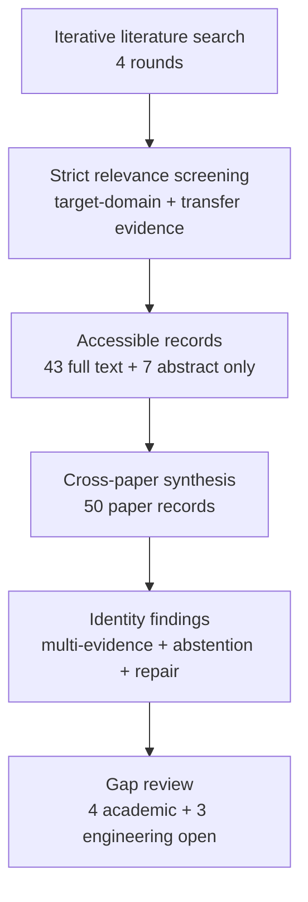

# Research Report: Direct enterprise email/chat studies of longitudinal cross-thread conversation or work-item linking, especially evidence for concrete business-event identity and for partial, evolving, subevent, or non-transitive continuity relations in organizational workflows.

## Contents

- [Round History](#round-history)
- [Executive Summary](#executive-summary)
- [Research Question](#research-question)
- [Methodology](#methodology)
- [Papers Reviewed](#papers-reviewed)
- [Research Landscape](#research-landscape)
- [Confidence-Graded Findings](#confidence-graded-findings)
- [Research Gaps](#research-gaps)
- [Practical Recommendations](#practical-recommendations)
- [Evidence Map](#evidence-map)
- [References](#references)
- [Appendix: Run Metadata](#appendix-run-metadata)

## Round History

Iterative gap-closure loop (hard cap: 4 rounds). See
`references/iterative-synthesis.md` for the full loop definition.

| Round | Run ID | Topic / Gap Focus | New Papers | Gaps Addressed | Remaining Gaps |
|-------|--------|-------------------|------------|----------------|----------------|
| 1 | c97ebc819fac | cross-thread topic identity and incremental continuity in work communication | 14 | initial shortlist | 4 academic, 3 engineering |
| 2 | 3a90c92ac2ec | direct evidence for cross-thread workplace work-matter identity, including cross-document business event coreference, enterprise email/chat continuity, and partial or evolving event identity | 11 | 0 resolved | 4 academic, 3 engineering |
| 3 | 5c3438274b84 | Direct enterprise communication evidence for cross-thread work-matter continuity, with emphasis on email/chat conversation linking, business-event coreference, and partial or evolving event identity in organizational workflows. | 13 | 0 resolved | 4 academic, 3 engineering |
| 4 | 2be7131314a5 | Direct enterprise email/chat studies of longitudinal cross-thread conversation or work-item linking, especially evidence for concrete business-event identity and for partial, evolving, subevent, or non-transitive continuity relations in organizational workflows. | None | academic gaps of the previous round | 4 academic, 3 engineering |

**Stop reason**: 4-round cap reached

## Executive Summary

This review investigated how msgloom can maintain stable identity for concrete work matters across independent email/chat conversations and over time, distinguishing continuation from a genuinely new matter while preserving uncertainty and later correction. Fifty paper records spanning 1969–2026 were analyzed from 23 host sources, combining direct workplace-email evidence with transfer evidence from cross-document event coreference, record linkage, process mining, incremental entity resolution, new-event detection, open-world recognition, selective prediction, and calibration. The strongest finding is [HIGH] that thread membership, shared participants, subject text, lexical overlap, or semantic similarity cannot safely define work-matter identity by themselves; reliable linking requires multiple mutually compatible evidence dimensions, an explicit reject/uncertain region, and correction-capable incremental identity management [doi-10-1145-1111449-1111471] [doi-10-1080-01621459-1969-10501049] [1402.4417]. The most significant unresolved gap is the absence of direct modern Outlook-plus-Teams evidence validating which evidence combinations, thresholds, and partial-continuity semantics actually correspond to concrete workplace work-matter identity. The literature is therefore sufficient to constrain architecture and evaluation design, but not sufficient to claim production-domain accuracy.

**Scope**: 50 paper records analyzed from 23 host sources over 1969–2026  
**Overall Confidence**: Medium  
**Verdict**: HAS_GAPS

## Research Question

The review asked:

> Given a new candidate work-matter span or Group and a set of existing persistent Topic identities, what evidence justifies `CONTINUE existing Topic`, `NEW Topic`, `UNCERTAIN relationship`, `MERGE correction`, or `SPLIT correction`, particularly when work crosses independent email threads, attachments, conversations, and communication sources?

The scope included:

- direct longitudinal enterprise-email evidence;
- cross-document event and entity identity;
- partial event coreference, subevents, membership, and evolving continuity;
- online and incremental clustering;
- record linkage and probabilistic link/non-link decisions;
- process/event-to-case correlation;
- new-event detection and topic tracking;
- open-world recognition, reject options, selective prediction, and calibration;
- repair, persistent identifiers, and changing cluster composition;
- retrieval or global-context mechanisms that can supply additional evidence.

The scope excluded treating ordinary thread reconstruction, semantic similarity, latent topic modeling, simple duplicate detection, or generated Topic titles as sufficient definitions of work-matter identity. Evidence from news, public records, process logs, and other transfer domains is treated as methodological transfer evidence rather than proof of Outlook/Teams production accuracy.

The target decision can be represented as

\[
d(x,H) \in \{\mathrm{CONTINUE}(T_i),\mathrm{NEW},\mathrm{UNCERTAIN},\mathrm{MERGE},\mathrm{SPLIT}\},
\]

where \(x\) is newly supplied evidence and \(H\) is the preserved historical evidence and identity state. Critically, `UNCERTAIN` is a valid output rather than an implementation failure.

## Methodology

### Search Strategy

- **Sources**: arXiv; ACL Anthology; ACM/SIGIR-hosted material; Springer; ScienceDirect; Nature/Scientific Reports; Wiley; IEEE/conference-hosted copies; MDPI; NIST; institutional repositories; PMC; ResearchGate; SSRN; university-hosted author copies; and other host pages enumerated in the access table below.
- **Query variants**:
  - `direct enterprise email/chat studies longitudinal cross-thread conversation work-item linking, especially evidence concrete business-event identity partial, evolving, subevent, non-transitive continuity relations organizational workflows.`
  - `direct enterprise email/chat`
  - `direct studies longitudinal cross-thread conversation work-item linking, especially evidence concrete business-event identity partial, evolving, subevent, non-transitive continuity relations organizational workflows.`
  - `enterprise studies longitudinal cross-thread conversation work-item linking, especially evidence concrete business-event identity partial, evolving, subevent, non-transitive continuity relations organizational workflows.`
  - `email/chat studies longitudinal cross-thread conversation work-item linking, especially evidence concrete business-event identity partial, evolving, subevent, non-transitive continuity relations organizational workflows.`
  - `direct enterprise email/chat studies longitudinal`
  - `direct enterprise email/chat cross-thread conversation`
  - `direct enterprise email/chat work-item linking,`
- **Time window**: 1969–2026.
- **Screening**: The supplied final-round artifacts do not specify whether screening used BM25 plus sub-agent review or BM25 alone; no unsupported screening mechanism is asserted here. Admission was governed by the project context and the iterative gap-closure process.
- **Reading method**: The papers were read through the host's web tool. Forty-three records were available at full-text level and seven at abstract-only level. Findings derived from abstract-only records were not treated as stronger than supported by that access.

### Access Level by Paper

| Paper ID | Access |
|---|---|
| [1402.4417] | full_text |
| [1412.5687] | full_text |
| [1705.08500] | full_text |
| [1707.07344] | full_text |
| [1906.01753] | full_text |
| [2011.12249] | full_text |
| [2104.05022] | full_text |
| [2109.06417] | full_text |
| [2206.10009] | full_text |
| [2211.07342] | full_text |
| [2405.05160] | full_text |
| [2406.15990] | full_text |
| [2407.11988] | full_text |
| [2607.26384] | full_text |
| [doi-10-1002-asi-21264] | full_text |
| [doi-10-1002-sim-4780140510] | abstract_only |
| [doi-10-1007-978-3-030-33223-5-12] | full_text |
| [doi-10-1007-978-3-030-49461-2-23] | full_text |
| [doi-10-1007-978-3-540-27868-9-84] | full_text |
| [doi-10-1007-s00778-010-0203-9] | abstract_only |
| [doi-10-1007-s10115-019-01430-6] | full_text |
| [doi-10-1016-j-ipm-2025-104085] | full_text |
| [doi-10-1038-s41598-025-32765-6] | full_text |
| [doi-10-1038-s41598-026-40637-w] | full_text |
| [doi-10-1080-01621459-1969-10501049] | full_text |
| [doi-10-1109-access-2023-3284053] | full_text |
| [doi-10-1109-icpm57379-2022-9980684] | full_text |
| [doi-10-1109-tbdata-2022-3204207] | abstract_only |
| [doi-10-1145-1111449-1111471] | full_text |
| [doi-10-1145-1111449-1111472] | full_text |
| [doi-10-1145-1111449-1111473] | full_text |
| [doi-10-1145-290941-290953] | abstract_only |
| [doi-10-1145-290941-290954] | full_text |
| [doi-10-1145-354756-354843] | full_text |
| [doi-10-18653-v1-2020-coling-main-275] | full_text |
| [doi-10-18653-v1-2022-emnlp-main-58] | full_text |
| [doi-10-18653-v1-2023-emnlp-main-294] | full_text |
| [doi-10-18653-v1-2024-findings-emnlp-725] | full_text |
| [doi-10-18653-v1-2025-acl-long-1134] | full_text |
| [doi-10-2139-ssrn-7284343] | abstract_only |
| [doi-10-3115-1220575-1220591] | full_text |
| [doi-10-3115-v1-w14-2910] | full_text |
| [doi-10-3390-industries1010003] | full_text |
| [manual-03d6dfa532] | full_text |
| [manual-35bac66e3c] | full_text |
| [manual-5c20fb0229] | abstract_only |
| [manual-61a7e10e5f] | full_text |
| [manual-c43ffe3135] | full_text |
| [manual-e988e24127] | full_text |
| [manual-f56d02b8f9] | abstract_only |

### Pipeline Summary

| Metric | Count |
|--------|-------|
| Total candidates | unknown from supplied final-round artifacts |
| After screening | 50 reviewed paper records |
| Downloaded | unknown; access was through host web tool |
| Successfully converted | unknown |
| Deeply analyzed / synthesized | 50 records |
| Full-text access | 43 |
| Abstract-only access | 7 |
| Iterations | 4 |

## Papers Reviewed

Quality scores were not supplied by the pipeline; inventing numeric scores would be inappropriate. `not scored` therefore appears in that column. Relevance reflects the role of each paper in the supplied synthesis: HIGH for evidence directly central to work-matter identity, abstention, correction, partial relations, or longitudinal tracking; MEDIUM for supporting transfer evidence.

| # | Title | Authors | Year | Venue | Quality Score | Relevance |
|---|-------|---------|------|-------|---------------|-----------|
| 1 | Linking messages and form requests [doi-10-1145-1111449-1111472] | Anthony Tomasic, John Zimmerman, Isaac Simmons | 2006 | ACM IUI-related proceedings | not scored | HIGH |
| 2 | Employing Discourse Coherence Enhancement to Improve Cross-Document Event and Entity Coreference Resolution [doi-10-18653-v1-2025-acl-long-1134] | Xinyu Chen, Peifeng Li, Qiaoming Zhu | 2025 | ACL | not scored | HIGH |
| 3 | MAVEN-ERE: A Unified Large-scale Dataset for Event Coreference, Temporal, Causal, and Subevent Relation Extraction [2211.07342] | Xiaozhi Wang, Yulin Chen, Ning Ding et al. | 2022 | arXiv / NLP dataset work | not scored | HIGH |
| 4 | An ER-Model-Based Framework for Case Notion Selection in Object-Centric Processes [2607.26384] | Akhil Kumar | 2026 | arXiv | not scored | HIGH |
| 5 | Tracking the Evolution of Clusters in Social Media Streams [doi-10-1109-tbdata-2022-3204207] | Tarique Anwar, Surya Nepal, Cecile Paris et al. | 2023 | IEEE Transactions on Big Data | not scored | MEDIUM |
| 6 | StableID: An Iterative Graph-Based Framework for Persistent Entity Identification in Evolving Industrial Data Systems [doi-10-3390-industries1010003] | Zhongyuan T. Lee, Arvin Shadravan, Hamid R. Parsaei | 2026 | Industries | not scored | HIGH |
| 7 | Enhancing Cross-Document Event Coreference Resolution by Discourse Structure and Semantic Information [2406.15990] | Qiang Gao, Bobo Li, Zixiang Meng et al. | 2024 | arXiv | not scored | HIGH |
| 8 | Selective Classification Under Distribution Shifts [2405.05160] | Hengyue Liang, Le Peng, Ju Sun | 2024 | arXiv | not scored | HIGH |
| 9 | Automatically classifying emails into activities [doi-10-1145-1111449-1111471] | Mark Dredze, Tessa Lau, Nicholas Kushmerick | 2006 | ACM IUI-related proceedings | not scored | HIGH |
| 10 | Event-Case Correlation for Process Mining using Probabilistic Optimization [2206.10009] | Dina Bayomie, Claudio Di Ciccio, Jan Mendling | 2023 | arXiv / process mining | not scored | HIGH |
| 11 | On-Line New Event Detection and Tracking [doi-10-1145-290941-290954] | James Allan, Ron Papka, Victor Lavrenko | 1998 | SIGIR | not scored | HIGH |
| 12 | Distance-aware Calibration for Pre-trained Language Models [doi-10-18653-v1-2024-findings-emnlp-725] | Alberto Gasparin, Gianluca Detommaso | 2024 | Findings of EMNLP | not scored | MEDIUM |
| 13 | Topic Detection and Tracking Evaluation Overview [manual-5c20fb0229] | Jonathan G. Fiscus, George R. Doddington | 2002 | NIST | not scored | HIGH |
| 14 | Cross-document Event Identity via Dense Annotation [manual-c43ffe3135] | Adithya Pratapa, Zhengzhong Liu, Kimihiro Hasegawa et al. | 2021 | NLP research | not scored | HIGH |
| 15 | Using a sledgehammer to crack a nut? Lexical diversity and event coreference resolution [manual-f56d02b8f9] | Agata Cybulska, Piek Vossen | 2014 | LREC-related publication | not scored | HIGH |
| 16 | WEC: Deriving a Large-scale Cross-document Event Coreference dataset from Wikipedia [2104.05022] | Alon Eirew, Arie Cattan, Ido Dagan | 2021 | arXiv / NLP | not scored | MEDIUM |
| 17 | Generalizing Cross-Document Event Coreference Resolution Across Multiple Corpora [2011.12249] | Michael Bugert, Nils Reimers, Iryna Gurevych | 2020 | Computational Linguistics-related publication | not scored | HIGH |
| 18 | First Story Detection In TDT Is Hard [doi-10-1145-354756-354843] | James Allan, Victor Lavrenko, Hubert Jin | 2000 | CIKM/IR-related publication | not scored | HIGH |
| 19 | Incremental Multi-source Entity Resolution for Knowledge Graph Completion [doi-10-1007-978-3-030-49461-2-23] | Alieh Saeedi, Eric Peukert, Erhard Rahm | 2020 | Springer conference proceedings | not scored | HIGH |
| 20 | Towards Open World Recognition [1412.5687] | Abhijit Bendale, Terrance E. Boult | 2014 | arXiv / open-world recognition | not scored | HIGH |
| 21 | Incremental Entity Resolution from Linked Documents [1402.4417] | Pankaj Malhotra, Puneet Agarwal, Gautam Shroff | 2014 | arXiv | not scored | HIGH |
| 22 | Probabilistic linkage of large public health data files [doi-10-1002-sim-4780140510] | Matthew A. Jaro | 1995 | Statistics in Medicine | not scored | MEDIUM |
| 23 | Revisiting Joint Modeling of Cross-document Entity and Event Coreference Resolution [manual-e988e24127] | Shany Barhom, Vered Shwartz, Alon Eirew et al. | 2019 | NLP research | not scored | HIGH |
| 24 | Selective Classification for Deep Neural Networks [1705.08500] | Yonatan Geifman, Ran El-Yaniv | 2017 | arXiv | not scored | HIGH |
| 25 | Case notion discovery and recommendation: automated event log building on databases [doi-10-1007-s10115-019-01430-6] | E. González López de Murillas, Hajo A. Reijers, Wil M. P. van der Aalst | 2019 | Knowledge and Information Systems | not scored | HIGH |
| 26 | Cross-document Event Coreference Search: Task, Dataset and Modeling [doi-10-18653-v1-2022-emnlp-main-58] | Alon Eirew, Avi Caciularu, Ido Dagan | 2022 | EMNLP | not scored | HIGH |
| 27 | Multimodal Cross-Document Event Coreference Resolution via Contrastive Evidence Reasoning [doi-10-2139-ssrn-7284343] | Xue Qiao, Fei Li, Yanfeng Hu et al. | 2026 | SSRN | not scored | MEDIUM |
| 28 | A Study of Retrospective and On-Line Event Detection [doi-10-1145-290941-290953] | Yiming Yang, Thomas Pierce, Jaime G. Carbonell | 1998 | SIGIR | not scored | HIGH |
| 29 | Generating Harder Cross-document Event Coreference Resolution Datasets using Metaphoric Paraphrasing [2407.11988] | Shafiuddin Rehan Ahmed, Zhiyong Eric Wang, George Arthur Baker et al. | 2024 | arXiv | not scored | HIGH |
| 30 | Argument centric causal intervention for cross document event coreference resolution [doi-10-1038-s41598-025-32765-6] | Long Yao, Wenzhong Yang, Yabo Yin et al. | 2025 | Scientific Reports | not scored | HIGH |
| 31 | A Two-Stage Classifier with Reject Option for Text Categorisation [doi-10-1007-978-3-540-27868-9-84] | Giorgio Fumera, Ignazio Pillai, Fabio Roli | 2004 | Springer conference proceedings | not scored | HIGH |
| 32 | New event detection and topic tracking in Turkish [doi-10-1002-asi-21264] | Fazli Can, Seyit Kocberber, Ozgur Baglioglu et al. | 2010 | Journal of the American Society for Information Science and Technology | not scored | HIGH |
| 33 | Using Names and Topics for New Event Detection [doi-10-3115-1220575-1220591] | Giridhar Kumaran, James Allan | 2005 | ACL-related publication | not scored | HIGH |
| 34 | Detecting Subevent Structure for Event Coreference Resolution [manual-35bac66e3c] | Jun Araki, Zhengzhong Liu, Eduard Hovy et al. | 2014 | LREC-related publication | not scored | HIGH |
| 35 | Cross-Document Event Coreference Resolution on Discourse Structure [doi-10-18653-v1-2023-emnlp-main-294] | Xinyu Chen, Sheng Xu, Peifeng Li et al. | 2023 | EMNLP | not scored | HIGH |
| 36 | Revisiting Joint Modeling of Cross-document Entity and Event Coreference Resolution [1906.01753] | Shany Barhom, Vered Shwartz, Alon Eirew et al. | 2019 | arXiv / NLP | not scored | HIGH |
| 37 | A Probabilistic Approach to Event-Case Correlation for Process Mining [doi-10-1007-978-3-030-33223-5-12] | Dina Bayomie, Claudio Di Ciccio, Marcello La Rosa et al. | 2019 | Springer conference proceedings | not scored | HIGH |
| 38 | Event correlation for process discovery from Web service interaction logs [doi-10-1007-s00778-010-0203-9] | Hamid Reza Motahari-Nezhad, Regis Saint-Paul, Fabio Casati et al. | 2011 | VLDB Journal | not scored | MEDIUM |
| 39 | Evaluation for Partial Event Coreference [doi-10-3115-v1-w14-2910] | Jun Araki, Eduard Hovy, Teruko Mitamura | 2014 | ACL Workshop | not scored | HIGH |
| 40 | Cross-document Event Identity via Dense Annotation [2109.06417] | Adithya Pratapa, Zhengzhong Liu, Kimihiro Hasegawa et al. | 2021 | arXiv | not scored | HIGH |
| 41 | Conformal selective prediction with cost aware deferral for safe clinical triage under distribution shift [doi-10-1038-s41598-026-40637-w] | Hyun Kwon, Dae-Jin Kim | 2026 | Scientific Reports | not scored | MEDIUM |
| 42 | Event Coreference Resolution with their Paraphrases and Argument-aware Embeddings [doi-10-18653-v1-2020-coling-main-275] | Yutao Zeng, Xiaolong Jin, Saiping Guan et al. | 2020 | COLING | not scored | HIGH |
| 43 | Improving Accuracy and Explainability in Event-Case Correlation via Rule Mining [doi-10-1109-icpm57379-2022-9980684] | Dina Sayed Bayomie Sobh, Kate Revoredo, Claudio Di Ciccio et al. | 2022 | ICPM | not scored | HIGH |
| 44 | Step-by-Step Case ID Identification Based on Activity Connection for Cross-Organizational Process Mining [doi-10-1109-access-2023-3284053] | Kazuki Tajima, Bojian Du, Yoshiaki Narusue et al. | 2023 | IEEE Access | not scored | HIGH |
| 45 | A hybrid learning system for recognizing user tasks from desktop activities and email messages [doi-10-1145-1111449-1111473] | Jianqiang Shen, Lida Li, Thomas G. Dietterich et al. | 2006 | ACM IUI-related proceedings | not scored | HIGH |
| 46 | Post-Hoc Uncertainty Calibration for Domain Drift Scenarios [manual-03d6dfa532] | Christian Tomani, Sebastian Gruber, Muhammed Ebrar Erdem et al. | 2021 | arXiv / calibration research | not scored | HIGH |
| 47 | Event Coreference Resolution by Iteratively Unfolding Inter-dependencies among Events [1707.07344] | Prafulla Kumar Choubey, Ruihong Huang | 2017 | arXiv | not scored | HIGH |
| 48 | Improving cross-document event coreference resolution by discourse coherence and structure [doi-10-1016-j-ipm-2025-104085] | Xinyu Chen, Peifeng Li, Qiaoming Zhu | 2025 | Information Processing & Management | not scored | HIGH |
| 49 | A Theory for Record Linkage [doi-10-1080-01621459-1969-10501049] | Ivan P. Fellegi, Alan B. Sunter | 1969 | Journal of the American Statistical Association | not scored | HIGH |
| 50 | Semantic Relations between Events and their Time, Locations and Participants for Event Coreference Resolution [manual-61a7e10e5f] | Agata Cybulska, Piek Vossen | 2013 | ACL-related publication | not scored | HIGH |

## Research Landscape

### Theme 1: Thread Structure and Similarity Are Evidence, Not Identity

**Coverage**: direct workplace-email studies plus supporting NED/event-coreference evidence | **Confidence**: High  
**Supporting papers**: [doi-10-1145-1111449-1111471], [doi-10-1145-1111449-1111472], [doi-10-3115-1220575-1220591], [manual-61a7e10e5f], [2407.11988]

The direct workplace-email literature supports the project's foundational distinction between conversation structure and concrete work activity. Activities can span multiple reply threads; participant sets can evolve; and the same people can simultaneously participate in distinct activities [doi-10-1145-1111449-1111471] [doi-10-1145-1111449-1111472]. New-event detection and event-coreference evidence reinforces the same boundary: common names, trigger words, topic vocabulary, or semantic similarity can occur across distinct real events, while paraphrastic descriptions can refer to the same event [doi-10-3115-1220575-1220591] [manual-61a7e10e5f] [2407.11988].

Key findings:

1. [HIGH] Conversation/thread membership is not equivalent to work-matter identity [doi-10-1145-1111449-1111471] [doi-10-1145-1111449-1111472].
2. [HIGH] Shared participants, lexical overlap, trigger similarity, and topical similarity should be treated as evidence features rather than sufficient merge conditions [doi-10-3115-1220575-1220591] [manual-61a7e10e5f] [2407.11988].
3. [HIGH] Candidate retrieval based on similarity can remain useful, provided the final identity decision uses stronger corroborating evidence.

### Theme 2: Multi-Evidence Identity and Business-Object Anchors

**Coverage**: event coreference, record linkage, process mining, enterprise email | **Confidence**: High  
**Supporting papers**: [1906.01753], [manual-61a7e10e5f], [2206.10009], [doi-10-1080-01621459-1969-10501049], [doi-10-3115-1220575-1220591], [2607.26384], [doi-10-1109-icpm57379-2022-9980684]

Identity inference improves when evidence dimensions are combined rather than when one similarity score dominates. The reviewed literature uses combinations of participants/entities, event arguments, actions, temporal relations, business attributes, process/control-flow constraints, document or discourse structure, and lexical/semantic context [1906.01753] [manual-61a7e10e5f] [2206.10009].

Process-oriented evidence additionally suggests that business objects can act as stronger case anchors than ubiquitous resources. Employees, customers, equipment, and other high-connectivity resources may connect otherwise independent executions if treated naïvely [2607.26384] [doi-10-1109-icpm57379-2022-9980684].

Key findings:

1. [HIGH] Concrete identity should be inferred from multiple independent and mutually compatible evidence dimensions [1906.01753] [manual-61a7e10e5f] [2206.10009].
2. [MEDIUM] Primary business objects and carefully selected coordinating objects can be stronger identity anchors than broadly shared resource-like entities [2607.26384] [2206.10009] [doi-10-1109-icpm57379-2022-9980684].
3. [HIGH] Negative or incompatible evidence is as important as positive similarity when the operational cost of false merging is high.

### Theme 3: CONTINUE / NEW / UNCERTAIN Is a Legitimate Three-Way Decision

**Coverage**: record linkage, open-world recognition, selective classification, reject-option classification | **Confidence**: High  
**Supporting papers**: [doi-10-1080-01621459-1969-10501049], [1412.5687], [1705.08500], [2405.05160], [doi-10-1007-978-3-540-27868-9-84]

Classical record linkage separates link, possible-link, and non-link regions [doi-10-1080-01621459-1969-10501049]. Open-world recognition and selective classification similarly permit rejection rather than forcing every observation into a known class [1412.5687] [1705.08500]. This gives strong methodological support for msgloom's explicit `UNCERTAIN` state.

For a score \(s(x,T)\), a simple conceptual decision region is:

\[
d(x,T)=
\begin{cases}
\mathrm{CONTINUE}, & s \ge \tau_c\\
\mathrm{NEW}, & s \le \tau_n\\
\mathrm{UNCERTAIN}, & \tau_n < s < \tau_c
\end{cases}
\]

with \(\tau_n < \tau_c\). This formula is illustrative; the literature does not determine msgloom's actual thresholds or loss function.

Selective prediction also frames the trade-off between retained coverage and error risk. If \(S_\tau\) is the subset accepted at threshold \(\tau\), then a conceptual selective risk is

\[
R(\tau)=\mathbb{E}[\ell(\hat y,y)\mid x\in S_\tau],
\]

while coverage is

\[
C(\tau)=P(x\in S_\tau).
\]

Key findings:

1. [HIGH] `UNCERTAIN` is methodologically justified as a first-class outcome rather than a failure mode [doi-10-1080-01621459-1969-10501049] [1412.5687] [1705.08500].
2. [HIGH] Increasing rejection can reduce accepted-decision risk while reducing coverage [1705.08500] [2405.05160].
3. [MEDIUM] The specific asymmetric cost of a false merge versus a false split must be set from msgloom requirements and empirical evaluation; the reviewed literature does not supply it.

### Theme 4: Incremental Identity Requires Repair and Persistent Lineage

**Coverage**: incremental entity resolution, stream clustering, persistent-ID systems | **Confidence**: High for repair; Medium for specific stable-ID policy  
**Supporting papers**: [1402.4417], [doi-10-1007-978-3-030-49461-2-23], [doi-10-1109-tbdata-2022-3204207], [doi-10-3390-industries1010003]

Online assignments can be affected by arrival order, missing early information, and evidence that appears only later. Incremental entity-resolution and cluster-evolution work therefore supports local reconsideration, historical merging, and other repair operations rather than immutable append-only assignment [1402.4417] [doi-10-1007-978-3-030-49461-2-23] [doi-10-1109-tbdata-2022-3204207].

Persistent identity should also be separated from mutable descriptions or cluster composition. Stable-ID approaches show the value of carrying historical identifiers through evolving entity structures [doi-10-3390-industries1010003].

Key findings:

1. [HIGH] Initial identity assignments cannot safely be assumed irreversible [1402.4417] [doi-10-1007-978-3-030-49461-2-23].
2. [HIGH] `MERGE` and reassignment-like repair should be normal capabilities of a longitudinal system rather than exceptional migrations [1402.4417] [doi-10-1109-tbdata-2022-3204207].
3. [MEDIUM] Persistent identifiers independent of mutable cluster descriptions improve auditability and reduce identity churn, but msgloom's exact supersession policy remains an engineering decision [doi-10-3390-industries1010003].

### Theme 5: Exact Identity Is Not the Same as Partial, Subevent, or Evolving Continuity

**Coverage**: dense event identity, partial coreference, subevent datasets | **Confidence**: High  
**Supporting papers**: [2109.06417], [manual-c43ffe3135], [manual-35bac66e3c], [2211.07342], [doi-10-3115-v1-w14-2910]

The event literature directly challenges a model in which all continuity is represented as one transitive equivalence relation. Dense event annotation identifies membership, subevent, and spatiotemporal-continuity relations that may involve partial identity and can violate transitivity [2109.06417] [manual-c43ffe3135]. MAVEN-ERE explicitly separates event coreference from temporal, causal, and subevent relations [2211.07342].

A relation \(R\) suitable for partial continuity may therefore admit

\[
R(a,b)\land R(b,c)\not\Rightarrow R(a,c),
\]

which is incompatible with using \(R\) directly as an ordinary equivalence-cluster membership relation.

Key findings:

1. [HIGH] Exact event identity, subevent membership, membership relations, and evolving/spatiotemporal continuity are distinct concepts [2109.06417] [manual-35bac66e3c] [2211.07342].
2. [HIGH] Some partial-continuity relations are non-transitive and therefore cannot safely be collapsed into Topic equality [2109.06417] [doi-10-3115-v1-w14-2910].
3. [LOW] The workplace-specific semantics of those partial relations are not established by this corpus; whether a subevent means `CONTINUE`, `RELATED-BUT-SEPARATE`, or another relation remains unresolved.

### Theme 6: Longitudinal Representations Must Adapt Without Drifting

**Coverage**: TDT/new-event detection and longitudinal tracking | **Confidence**: High  
**Supporting papers**: [doi-10-1145-290941-290954], [doi-10-1002-asi-21264], [doi-10-1145-354756-354843], [doi-10-3115-1220575-1220591]

Later messages can introduce names, entities, facts, and discriminative language not present when an event or Topic was first observed. Adaptive representations can therefore improve tracking [doi-10-1145-290941-290954] [doi-10-1002-asi-21264]. The same adaptation creates a granularity hazard: if the representation broadens toward a generic event class or loosely related storyline, distinct concrete events can be merged [doi-10-1145-354756-354843].

Key findings:

1. [HIGH] Topic/event representations need to absorb new evidence over time [doi-10-1145-290941-290954] [doi-10-1002-asi-21264].
2. [HIGH] Unconstrained adaptation can broaden identity representations and create false merges [doi-10-1145-354756-354843] [doi-10-3115-1220575-1220591].
3. [MEDIUM] msgloom therefore needs explicit identity-preserving constraints and negative evidence when updating Topic representations.

### Theme 7: Additional Historical Context Can Resolve Ambiguity

**Coverage**: iterative event-coreference reasoning, retrieval, discourse structure, global context | **Confidence**: Medium  
**Supporting papers**: [1707.07344], [doi-10-18653-v1-2022-emnlp-main-58], [doi-10-18653-v1-2023-emnlp-main-294], [doi-10-18653-v1-2025-acl-long-1134]

Cross-document search, iterative argument propagation, discourse structure, and global context can expose evidence unavailable in an isolated document [1707.07344] [doi-10-18653-v1-2022-emnlp-main-58] [doi-10-18653-v1-2023-emnlp-main-294]. This supports the Phase 2 concept of retrieving bounded additional history when Phase 1 evidence is insufficient.

Key findings:

1. [MEDIUM] Retrieving additional cross-document context can improve identity reasoning [doi-10-18653-v1-2022-emnlp-main-58] [doi-10-18653-v1-2023-emnlp-main-294].
2. [MEDIUM] Discourse/global context can surface bridging information that pairwise evidence misses [doi-10-18653-v1-2025-acl-long-1134].
3. [LOW] The literature does not establish msgloom's appropriate history window, retrieval budget, latency target, candidate count, or stopping rule.

### Theme 8: Benchmark Results Do Not Transfer Directly to Workplace Accuracy

**Coverage**: cross-corpus CDCR, lexical stress tests, benchmark structure | **Confidence**: High  
**Supporting papers**: [1906.01753], [2011.12249], [2407.11988], [manual-f56d02b8f9]

Event-coreference performance is strongly affected by corpus organization and lexical regularities. Topic pre-clustering can materially improve results on ECB+-style settings, while cross-corpus evaluation shows that systems can lose substantial performance when the distribution changes [1906.01753] [2011.12249]. Lexical-diversity and metaphoric-paraphrasing studies further show that trigger overlap and surface similarity can make benchmarks easier than adversarial identity decisions [2407.11988] [manual-f56d02b8f9].

Key findings:

1. [HIGH] Benchmark architecture can materially change apparent event-identity accuracy [1906.01753] [2011.12249].
2. [HIGH] Strong scores on news corpora cannot be interpreted as enterprise-email/chat accuracy estimates [2011.12249].
3. [HIGH] Evaluation should include same-surface/different-identity and different-surface/same-identity stress cases [2407.11988] [manual-f56d02b8f9].

### Theme 9: Confidence and Thresholds Are Vulnerable to Distribution Shift

**Coverage**: selective prediction and post-hoc calibration | **Confidence**: Medium  
**Supporting papers**: [2405.05160], [doi-10-18653-v1-2024-findings-emnlp-725], [manual-03d6dfa532], [doi-10-1038-s41598-026-40637-w]

Calibration can degrade under distribution shift, and methods designed for drift-aware calibration, selective prediction, or conformal deferral can improve safety characteristics [2405.05160] [manual-03d6dfa532] [doi-10-1038-s41598-026-40637-w]. However, none of these studies validates a threshold for workplace cross-thread identity.

Key findings:

1. [MEDIUM] Confidence thresholds fitted on one distribution should not be assumed stable in a longitudinal workplace stream [2405.05160] [manual-03d6dfa532].
2. [MEDIUM] Shift-aware calibration or deferral is a plausible mitigation [doi-10-18653-v1-2024-findings-emnlp-725] [doi-10-1038-s41598-026-40637-w].
3. [LOW] No reviewed paper establishes calibrated probabilities or coverage guarantees for msgloom's target domain.

## Methodology Comparison

| Approach | Papers | Strengths | Weaknesses | Best For | Performance |
|----------|--------|-----------|------------|----------|-------------|
| Direct workplace activity linking | [doi-10-1145-1111449-1111471] [doi-10-1145-1111449-1111472] [doi-10-1145-1111449-1111473] | Closest evidence to email work activity; exposes cross-thread behavior | Old, narrow, no modern Teams/Outlook production study | Establishing that thread/person metadata is not Topic identity | Numeric comparison not reproduced because the supplied synthesis does not provide stable values |
| Cross-document event coreference | [1906.01753] [2011.12249] [2406.15990] [doi-10-18653-v1-2023-emnlp-main-294] [doi-10-18653-v1-2025-acl-long-1134] | Rich identity evidence; arguments, semantics, context, discourse | Mostly news; often assumes gold mentions or benchmark-specific grouping | Candidate identity reasoning and evidence design | Benchmark-dependent; not workplace accuracy |
| Dense / partial event relation modeling | [2109.06417] [manual-35bac66e3c] [2211.07342] [doi-10-3115-v1-w14-2910] | Explicitly distinguishes identity, subevent and partial relations | No workplace mapping | Preventing false equivalence assumptions | No target-domain performance baseline |
| Record linkage | [doi-10-1080-01621459-1969-10501049] [doi-10-1002-sim-4780140510] | Formal multi-evidence link/non-link/possible-link framework | Structured records differ from free-form communication | Decision architecture and uncertainty regions | Domain-specific; no msgloom estimate |
| Process/event-case correlation | [2206.10009] [doi-10-1007-978-3-030-33223-5-12] [doi-10-1109-icpm57379-2022-9980684] | Uses process/business constraints and structured object evidence | Often assumes schemas/process knowledge unavailable in email/chat | Business-object anchors and constraint design | Transfer evidence only |
| Incremental entity resolution | [1402.4417] [doi-10-1007-978-3-030-49461-2-23] | Supports online repair and multi-source accumulation | Entity identity differs from work-matter identity | MERGE/reconsideration architecture | No workplace baseline |
| Persistent-ID graph methods | [doi-10-3390-industries1010003] | Separates identifier continuity from changing graph structure | Exact msgloom history semantics not addressed | Stable Topic-ID design | Transfer evidence only |
| New-event detection / TDT | [doi-10-1145-290941-290954] [doi-10-1145-354756-354843] [doi-10-1002-asi-21264] | Explicit novelty and adaptive tracking | Event/story granularity differs from work matters | NEW-vs-existing behavior and drift warnings | Corpus dependent |
| Open-world / selective classification | [1412.5687] [1705.08500] [2405.05160] | Principled rejection and risk/coverage trade-off | Does not define identity evidence itself | `UNCERTAIN` and abstention | No msgloom thresholds |
| Drift-aware calibration / deferral | [manual-03d6dfa532] [doi-10-18653-v1-2024-findings-emnlp-725] [doi-10-1038-s41598-026-40637-w] | Addresses confidence degradation under shift | Not longitudinal work-matter coreference | Monitoring and threshold maintenance | Transfer evidence only |

## Confidence-Graded Findings

### 🟢 High Confidence (supported by 3+ papers with consistent results)

1. **[HIGH] Conversation/thread membership is not work-matter identity.** Direct workplace-email evidence shows that one activity can span reply threads, while participant membership can vary and common participants can occur across multiple activities [doi-10-1145-1111449-1111471] [doi-10-1145-1111449-1111472]. Event/NED work independently shows that shared names and surface/topic overlap do not prove event identity [doi-10-3115-1220575-1220591].

2. **[HIGH] Concrete identity should combine multiple evidence dimensions rather than rely on a single similarity signal.** Event coreference, record linkage, process correlation, and email evidence support using combinations of arguments/entities, actions, time, business attributes, process constraints, structure, and language [1906.01753] [manual-61a7e10e5f] [2206.10009] [doi-10-1080-01621459-1969-10501049].

3. **[HIGH] `CONTINUE`, `NEW`, and `UNCERTAIN` have strong methodological precedent.** Link/possible-link/non-link regions, open-world recognition, and selective classification all reserve space for uncertain assignments rather than forcing a label [doi-10-1080-01621459-1969-10501049] [1412.5687] [1705.08500] [2405.05160].

4. **[HIGH] Incremental identity assignments require repair mechanisms.** Incremental entity-resolution and stream-clustering research shows that later information can justify historical merging or reassignment and that arrival order can otherwise affect results [1402.4417] [doi-10-1007-978-3-030-49461-2-23] [doi-10-1109-tbdata-2022-3204207].

5. **[HIGH] A single transitive equality relation is insufficient for all longitudinal continuity phenomena.** Dense event annotation and event-relation datasets distinguish exact identity from subevents, membership, temporal relations, causal relations, and partial/spatiotemporal continuity [2109.06417] [manual-35bac66e3c] [2211.07342] [doi-10-3115-v1-w14-2910].

6. **[HIGH] Adaptive representations are necessary but can cause identity drift.** Tracking work benefits from incorporating later evidence, while NED/TDT research documents granularity and first-story difficulties when evolving representations become overly broad [doi-10-1145-290941-290954] [doi-10-1002-asi-21264] [doi-10-1145-354756-354843].

7. **[HIGH] Reported event-identity accuracy is benchmark dependent and should not be projected to workplace communication.** Corpus organization, topic pre-clustering, lexical regularities, paraphrase, and cross-corpus distribution shifts materially alter event-coreference behavior [1906.01753] [2011.12249] [2407.11988] [manual-f56d02b8f9].

### 🟡 Medium Confidence (supported by 1-2 papers or with caveats)

1. **[MEDIUM] Business objects are promising identity anchors, while resource-like entities require down-weighting.** Process-model evidence supports distinguishing case-defining/coordinating business entities from high-connectivity resources that can spuriously bridge executions [2607.26384] [2206.10009] [doi-10-1109-icpm57379-2022-9980684]. The caveat is that free-form email/chat may not expose structured objects reliably.

2. **[MEDIUM] Persistent IDs should be separated from mutable cluster descriptions.** Stable-ID and incremental ER evidence supports preserving historical identifiers across structural evolution [doi-10-3390-industries1010003] [doi-10-1007-978-3-030-49461-2-23]. The exact alias/supersession policy remains project-specific.

3. **[MEDIUM] Bounded Phase 2 retrieval is justified for ambiguous cases.** Retrieval and discourse/global-context methods demonstrate that cross-document evidence can improve identity reasoning [doi-10-18653-v1-2022-emnlp-main-58] [doi-10-18653-v1-2023-emnlp-main-294] [doi-10-18653-v1-2025-acl-long-1134]. They do not define msgloom's retrieval budget.

4. **[MEDIUM] Incomplete execution evidence should not automatically imply a new identity.** Case/process and event-tracking literature supports continued identity under partial observation, but the operational rule for workplace matters remains unvalidated [2607.26384] [doi-10-1002-asi-21264].

5. **[MEDIUM] Confidence thresholds require monitoring under temporal and domain drift.** Selective prediction and calibration work shows deterioration under distribution shift and possible benefit from drift-aware deferral [2405.05160] [manual-03d6dfa532] [doi-10-18653-v1-2024-findings-emnlp-725].

### 🔴 Low Confidence (preliminary, single-source, or contradicted)

1. **[LOW] There is no validated Outlook-plus-Teams production-accuracy estimate for the proposed Topic-identity task.** No reviewed paper establishes such accuracy; the closest direct evidence is older enterprise email work [doi-10-1145-1111449-1111471] [doi-10-1145-1111449-1111472].

2. **[LOW] The correct workplace mapping of subevent, membership, partial identity, and evolving continuity into `CONTINUE`, `RELATED-BUT-SEPARATE`, `MERGE`, or `SPLIT` is unknown.** The event literature establishes that these distinctions exist but does not define their workplace semantics [2109.06417] [manual-35bac66e3c] [2211.07342].

3. **[LOW] No evidence supports a universal confidence threshold for work-matter linking.** Calibration research provides methods, not a transferable threshold for this task [2405.05160] [manual-03d6dfa532].

## Trade-Off Analysis

| Decision | Option A | Option B | Recommendation |
|----------|----------|----------|----------------|
| Force every candidate into an existing/new Topic vs abstain | Forced assignment maximizes coverage but converts ambiguity into errors | Explicit `UNCERTAIN` lowers coverage while protecting against unsupported merges [doi-10-1080-01621459-1969-10501049] [1705.08500] | Use `UNCERTAIN` as a first-class state; optimize risk and coverage rather than coverage alone |
| Thread-equals-Topic vs independent Topic identity | Cheap and deterministic but contradicted by workplace activity evidence [doi-10-1145-1111449-1111471] | Independent identity permits cross-thread continuity and same-thread multiplicity | Keep conversation ancestry as evidence/provenance, never as Topic identity |
| Single semantic-similarity threshold vs multi-evidence decision | Simple but vulnerable to same-topic/different-event and paraphrase effects [2407.11988] | Combines object, action, participants, time, references, structure, and negative evidence | Use similarity for retrieval/candidate generation, not proof |
| Immutable online assignment vs repairable identity state | Simpler storage but preserves early errors | Supports later merge/reassignment and historical correction [1402.4417] | Make repair normal and preserve assessment history |
| New ID after every merge vs persistent historical identity | Simplifies current cluster representation but breaks continuity | Persistent IDs/aliases preserve lineage [doi-10-3390-industries1010003] | Preserve stable identity lineage and explicit supersession/alias relations |
| One transitive Topic relation vs typed continuity relations | Easy clustering but conflates exact identity with subevent/partial relations | Typed relations preserve non-transitive structures [2109.06417] [2211.07342] | Keep exact Topic equality separate from related-but-distinct relations |
| Expand Topic representation aggressively vs constrained adaptation | High recall but identity drift risk [doi-10-1145-354756-354843] | Conservative updates reduce over-merging but may split continuity | Update incrementally with compatibility checks and negative evidence |
| Retrieve broad history for every item vs bounded ambiguity-driven retrieval | More context but high cost/noise | Queries history only when Phase 1 cannot decide [doi-10-18653-v1-2022-emnlp-main-58] | Prefer bounded Phase 2 retrieval with measured decision impact |

## Points of Agreement **[EVIDENCE REQUIRED]**

1. [HIGH] **Identity requires more than surface similarity.** Event-coreference, NED, record-linkage, and workplace-email studies consistently show that names, wording, participants, or topic similarity alone are insufficient for reliable concrete identity [doi-10-1145-1111449-1111471] [doi-10-3115-1220575-1220591] [manual-61a7e10e5f] [2407.11988].

2. [HIGH] **Multiple evidence dimensions should be combined.** Arguments/entities, actions, time, business attributes, document/discourse structure, and process constraints provide complementary evidence [1906.01753] [2206.10009] [manual-61a7e10e5f].

3. [HIGH] **Uncertainty should remain explicit.** Record linkage, open-world recognition, reject-option classification, and selective prediction independently support withholding a hard assignment when evidence is insufficient [doi-10-1080-01621459-1969-10501049] [1412.5687] [1705.08500] [doi-10-1007-978-3-540-27868-9-84].

4. [HIGH] **Longitudinal assignment needs correction.** Incremental resolution and evolving-cluster research support reconsidering historical structure as evidence accumulates [1402.4417] [doi-10-1007-978-3-030-49461-2-23] [doi-10-1109-tbdata-2022-3204207].

5. [HIGH] **Exact identity must be distinguished from other event relations.** Dense event-identity and event-relation datasets explicitly distinguish coreference, subevent, temporal, causal, membership, and partial-continuity relations [2109.06417] [manual-35bac66e3c] [2211.07342].

6. [HIGH] **Transfer-domain scores are not workplace guarantees.** Cross-corpus and lexical-diversity evidence shows material sensitivity to benchmark structure and distribution [2011.12249] [2407.11988] [manual-f56d02b8f9].

## Points of Contradiction **[EVIDENCE REQUIRED]**

1. **How sufficient are email metadata signals?** [doi-10-1145-1111449-1111473] reports strong performance for a predefined task-recognition setting using sender, recipient, and subject features, whereas longitudinal workplace activity linking in [doi-10-1145-1111449-1111471] finds thread/participant evidence inadequate by itself and benefits from richer evidence.
   - **Possible explanation**: the labels differ. Classification into a known task inventory is not the same problem as maintaining identity for evolving concrete work activities.
   - **Implication**: metadata may be strong for candidate generation or known-category recognition but should not be promoted to a universal identity rule.

2. **Is topic pre-clustering a robust identity aid or a corpus shortcut?** Topic-preclustered CDCR can perform strongly on ECB+-style setups [1906.01753] [manual-e988e24127], while cross-corpus analysis warns that the same design exploits corpus-specific document-link distributions and transfers poorly [2011.12249].
   - **Possible explanation**: benchmark construction supplies unusually informative topic boundaries.
   - **Implication**: msgloom may use independently trustworthy conversation/source structure as evidence, but not a model-generated topic partition as proof of identity.

3. **Should longitudinal continuity be represented as transitive equivalence clusters?** Mainstream CDCR clusters exact same-event mentions, while dense event-identity work identifies partial, membership, subevent, and spatiotemporal-continuity relations that may be non-transitive [2109.06417] [manual-c43ffe3135] [manual-35bac66e3c]. MAVEN-ERE separately models subevent and temporal relations [2211.07342].
   - **Possible explanation**: the studies model different semantic relations.
   - **Implication**: Topic equality and other continuity relations require separate data-model semantics.

4. **Should every arriving event be assigned to a case?** Some process-correlation formulations seek exactly one case assignment [doi-10-1007-978-3-030-33223-5-12], while record linkage and selective/open-world classification reserve possible-link or reject regions [doi-10-1080-01621459-1969-10501049] [1412.5687] [1705.08500].
   - **Possible explanation**: process-mining event logs often assume a closed process population, whereas open-world communication must tolerate previously unseen matters and insufficient evidence.
   - **Implication**: msgloom should not inherit forced-assignment assumptions from case-correlation methods.

5. **How much should semantic similarity be trusted?** Semantic similarity can improve recall, but argument-focused and lexical-diversity work shows precision problems and cases where identical triggers denote distinct events or different triggers denote the same event [manual-61a7e10e5f] [doi-10-1038-s41598-025-32765-6] [2407.11988].
   - **Possible explanation**: similarity measures relatedness, not necessarily identity.
   - **Implication**: semantic similarity is suitable for retrieval and ranking, but continuation requires corroboration.

6. **Does adaptation improve continuity or create drift?** Adaptive event tracking benefits from accepted later stories and emerging facts [doi-10-1002-asi-21264] [doi-10-1145-290941-290954], but first-story/event-detection literature documents granularity drift and loosely connected evolving topics [doi-10-1145-354756-354843].
   - **Possible explanation**: adaptation improves recall while weakening the specificity of the event representation.
   - **Implication**: Topic updates need positive and negative compatibility constraints.

## Research Gaps

All seven gaps remain open. The 4-round cap is a stopping condition for this run, not evidence that the gaps are resolved.

| # | Gap | Type | Severity | Impact on Goals |
|---|-----|------|----------|----------------|
| 1 | Which evidence combinations establish or refute concrete workplace work-matter continuity across independent messages, conversations, attachments, email, and Teams | ACADEMIC | HIGH | Directly controls false merges and false splits; literature has not answered the target-domain combination question |
| 2 | msgloom-specific cost function and thresholds for `CONTINUE`, `NEW`, and `UNCERTAIN` | ENGINEERING | HIGH | Required before production decision thresholds can be justified |
| 3 | Stable Topic-ID, assessment-versioning, supersession, immutable lineage, `MERGE`, and `SPLIT` semantics | ENGINEERING | HIGH | Required to correct online mistakes without rewriting source history |
| 4 | Direct production-domain validation for longitudinal identity across Outlook email and Microsoft Teams | ACADEMIC | HIGH | Prevents transfer-domain performance from being misrepresented as production accuracy |
| 5 | Workplace semantics for partial, subevent, evolving, membership, and non-transitive relations | ACADEMIC | HIGH | Determines whether related evidence should merge Topics or remain separately linked |
| 6 | Bounded Phase 2 evidence-seeking strategy and stopping rule | ENGINEERING | MEDIUM | Determines latency, cost, candidate recall, and whether retrieval genuinely improves decisions |
| 7 | Calibration and abstention under non-stationary workplace streams | ACADEMIC | MEDIUM | Needed to keep threshold behavior reliable as users, projects, vocabulary, and workflows change |

### Academic Gaps (require more papers)

1. **[ACADEMIC] Gap 1 — target-domain evidence combinations, HIGH priority.** The corpus contains direct enterprise-email activity evidence and substantial transfer evidence, but it still does not establish which combinations of subject, participant, customer/project, business object, referenced artifact, commitment, temporal/state compatibility, attachment, conversation ancestry, and cross-source evidence establish or refute concrete work-matter identity. The literature has not answered this yet. Suggested query: `"work item identity" OR "work matter identity" OR "business event coreference" OR "cross-document event coreference"` combined with `email`, `"workplace communication"`, `enterprise`, `cross-thread`, `cross-document`, and `cross-source`.
   - **Rounds already searched**: Rounds 2, 3, and 4 explicitly targeted this general problem family; no round resolved it.

2. **[ACADEMIC] Gap 4 — direct Outlook/Teams production evidence, HIGH priority.** No reviewed study establishes longitudinal concrete work-matter identity performance across modern Outlook email plus Microsoft Teams. The literature has not answered this yet. Suggested query: `(enterprise OR workplace OR organizational) AND (email OR "Microsoft Teams" OR "enterprise chat" OR "workplace chat") AND (cross-thread OR longitudinal OR cross-conversation) AND ("topic identity" OR "task tracking" OR "case tracking" OR "event coreference" OR "conversation linking")`.
   - **Rounds already searched**: Rounds 2, 3, and 4 explicitly sought direct enterprise communication evidence; no direct Outlook-plus-Teams validation was found.

3. **[ACADEMIC] Gap 5 — workplace mapping of partial/non-transitive relations, HIGH priority.** The corpus strongly establishes that partial identity, subevent, membership, and evolving/spatiotemporal relations exist and can be non-transitive, but it does not specify when a workplace relation should mean `CONTINUE`, `RELATED-BUT-SEPARATE`, `MERGE`, `SPLIT`, or another relation. The literature has not answered this yet. Suggested query: `("partial event identity" OR "partial coreference" OR "subevent relation" OR "event evolution" OR "event membership" OR "non-transitive coreference") AND (workflow OR task OR case OR workplace OR enterprise)`.
   - **Rounds already searched**: Rounds 2, 3, and 4 explicitly included partial/evolving event identity; no workplace-specific mapping was found.

4. **[ACADEMIC] Gap 7 — calibration under non-stationary workplace streams, MEDIUM priority.** Shift-aware calibration, selective classification, and deferral are supported in transfer domains, but no reviewed study validates calibration or coverage guarantees for longitudinal workplace work-matter coreference. The literature has not answered this yet. Suggested query: `("selective classification" OR abstention OR "confidence calibration" OR "selective prediction") AND ("distribution shift" OR nonstationary OR streaming OR "concept drift") AND (text OR NLP OR coreference OR clustering)`.
   - **Rounds already searched**: Round 4 explicitly carried this academic gap; the supplied round-history artifact does not provide a reliable earlier per-gap search trace, so no unsupported earlier round attribution is made.

### Engineering Gaps (fillable without papers)

1. **[ENGINEERING] Gap 2 — msgloom decision loss and thresholds, HIGH priority.** The literature establishes rejection and risk/coverage trade-offs but cannot choose the project's false-merge versus false-split costs. The gap remains open.
   - **Rounds already searched**: No dedicated engineering-search round is identified in the supplied history; the gap remained open through Round 4.
   - **Suggested resolution**: define an explicit cost matrix, construct independent adversarial gold fixtures, measure false merges and false splits separately, and tune `CONTINUE`/`UNCERTAIN`/`NEW` thresholds chronologically rather than only on random splits.

2. **[ENGINEERING] Gap 3 — correction and identity-state model, HIGH priority.** Stable Topic IDs, immutable evidence lineage, versioned assessments, aliasing/supersession, and general `MERGE`/`SPLIT` semantics remain project-level design questions. The gap remains open.
   - **Rounds already searched**: No dedicated engineering-search round is identified in the supplied history; mechanisms were informed by incremental-ER and StableID literature but the project semantics remained open through Round 4.
   - **Suggested resolution**: prototype a versioned identity graph with immutable evidence nodes, persistent Topic IDs, assessment records, explicit supersession edges, and deterministic merge/split audit behavior.

3. **[ENGINEERING] Gap 6 — Phase 2 evidence retrieval, MEDIUM priority.** The corpus justifies seeking additional evidence but does not determine the operational retrieval policy. The gap remains open.
   - **Rounds already searched**: No dedicated engineering-search round is identified in the supplied history; retrieval evidence was synthesized before the Round 4 stop.
   - **Suggested resolution**: benchmark bounded candidate retrieval over chronological history, measure candidate recall, added latency/cost, evidence yield, and the fraction of ambiguous decisions that are correctly changed by retrieval.

## Reproducibility Notes

The supplied synthesis does not contain a systematic code/data/license audit for every paper. Unknown fields are therefore marked `unknown` rather than inferred.

| Paper | Code Available | Data Available | Sufficient Detail | License |
|-------|---------------|----------------|-------------------|---------|
| [doi-10-1145-1111449-1111471] | unknown | unknown | full text available | unknown |
| [doi-10-1145-1111449-1111472] | unknown | unknown | full text available | unknown |
| [1906.01753] | unknown | unknown | full text available | unknown |
| [2011.12249] | unknown | unknown | full text available | unknown |
| [2109.06417] | unknown | unknown | full text available | unknown |
| [2211.07342] | unknown | unknown | full text available | unknown |
| [2206.10009] | unknown | unknown | full text available | unknown |
| [1402.4417] | unknown | unknown | full text available | unknown |
| [doi-10-1007-978-3-030-49461-2-23] | unknown | unknown | full text available | unknown |
| [doi-10-3390-industries1010003] | unknown | unknown | full text available | unknown |
| [1412.5687] | unknown | unknown | full text available | unknown |
| [1705.08500] | unknown | unknown | full text available | unknown |
| [2405.05160] | unknown | unknown | full text available | unknown |
| [doi-10-18653-v1-2022-emnlp-main-58] | unknown | unknown | full text available | unknown |
| [doi-10-18653-v1-2023-emnlp-main-294] | unknown | unknown | full text available | unknown |

## Practical Recommendations **[EVIDENCE REQUIRED]**

1. **Do not merge Topics from thread membership, subject, participants, customer/project name, trigger words, or embedding similarity alone.** Require multiple mutually compatible signals and retain separation when evidence remains insufficient [doi-10-1145-1111449-1111471] [doi-10-3115-1220575-1220591] [manual-61a7e10e5f].
   *Confidence*: High

2. **Implement `CONTINUE`, `NEW`, and `UNCERTAIN` as first-class outputs rather than forcing a binary assignment.** Evaluate risk and coverage jointly and count false merges independently from false splits [doi-10-1080-01621459-1969-10501049] [1412.5687] [1705.08500].
   *Confidence*: High

3. **Preserve evidence separately from identity decisions.** Participant/object/action/time/reference/source-structure evidence should remain inspectable and versioned so that later assessments can change without rewriting the original source history [1906.01753] [2206.10009] [doi-10-1109-icpm57379-2022-9980684].
   *Confidence*: High

4. **Use business objects as candidate identity anchors, but explicitly discount high-connectivity resource-like entities.** Shared employees, customers, or equipment should not automatically bridge otherwise independent matters [2607.26384].
   *Confidence*: Medium

5. **Treat `MERGE` and `SPLIT`/reassignment as normal lifecycle operations.** New evidence should be able to trigger localized reconsideration of previously assigned identity structure [1402.4417] [doi-10-1007-978-3-030-49461-2-23] [doi-10-1109-tbdata-2022-3204207].
   *Confidence*: High

6. **Keep Topic IDs persistent and independent of generated titles, source thread IDs, and current cluster descriptions.** Preserve aliases and superseded assessments on correction rather than manufacturing an ahistorical replacement [doi-10-3390-industries1010003].
   *Confidence*: Medium

7. **Do not encode every form of continuity as transitive Topic equality.** Preserve explicit relation types for exact identity and related-but-distinct structures such as `SUBEVENT`, `MEMBER_OF`, or `EVOLVING_CONTINUITY` until workplace semantics have been empirically resolved [2109.06417] [manual-35bac66e3c] [2211.07342].
   *Confidence*: High

8. **Use Phase 2 retrieval selectively for ambiguous cases.** Retrieve bounded historical evidence, then measure whether the added evidence changes the identity decision correctly rather than expanding history unconditionally [doi-10-18653-v1-2022-emnlp-main-58] [doi-10-18653-v1-2023-emnlp-main-294].
   *Confidence*: Medium

9. **Build adversarial identity fixtures, not only easy positive pairs.** Include same subject/different matter, same customer/different request, same participants/different matter, different thread/same matter, paraphrase/same matter, similar wording/different event, delayed subevents, and partially observed cases [2407.11988] [doi-10-1038-s41598-025-32765-6] [2607.26384].
   *Confidence*: High

10. **Evaluate chronologically and under distribution shift.** Random held-out splits alone are insufficient for a longitudinal system whose vocabulary, projects, contacts, and workflows evolve [2011.12249] [2405.05160] [doi-10-18653-v1-2024-findings-emnlp-725].
    *Confidence*: High

11. **Apply an asymmetric operational loss that penalizes false merges explicitly.** A suitable engineering objective can be expressed as

\[
L = c_{FM}N_{FM}+c_{FS}N_{FS}+c_U N_U,
\]

where \(N_{FM}\), \(N_{FS}\), and \(N_U\) are false merges, false splits, and unresolved/uncertain decisions. The literature supports maintaining separate error categories and rejection regions but does not determine the coefficients \(c_{FM},c_{FS},c_U\) for msgloom [doi-10-1080-01621459-1969-10501049] [1705.08500].
    *Confidence*: High for the need to distinguish costs; Low for any specific coefficient choice

## Future Directions

1. Run a controlled target-domain annotation study on authorized workplace examples that explicitly labels exact Topic identity, new Topic, uncertain relation, subevent/member-of, and later merge/split corrections.
2. Develop a typed identity-relation graph in which exact equality is separated from non-transitive relatedness.
3. Benchmark multi-evidence identity against thread-only, similarity-only, and participant-only baselines.
4. Test candidate retrieval separately from final identity classification so high-recall retrieval does not become an implicit merge rule.
5. Measure error costs from the report contract: especially whether a false merge causes due work to disappear or a false split causes duplicated/noisy reporting.
6. Evaluate online repair after intentionally misleading early evidence and delayed disambiguating messages.
7. Compare immutable history plus superseding assessments against mutable in-place cluster edits.
8. Conduct chronological calibration experiments with realistic drift in customers, projects, vocabulary, and communication sources.
9. Re-open academic searching only if project-value review concludes that additional literature is more valuable than engineering validation or authorized production-domain data collection; the 4-round cap has already been reached.

## Readiness Assessment (System-Building Mode)

### Verdict: HAS_GAPS

### Assessment Summary

The synthesis is sufficient to establish several architecture constraints: Topic identity must be independent of thread structure and generated labels; similarity is evidence rather than proof; `UNCERTAIN` is necessary; online assignments must be repairable; and exact identity must be represented separately from partial/non-transitive continuity. It is not sufficient to claim production accuracy, select final thresholds, or define workplace semantics for partial/subevent relations because direct modern Outlook-plus-Teams evidence is absent and four academic plus three engineering gaps remain open.

### Coverage Matrix

| Dimension | Status | Evidence |
|-----------|--------|----------|
| Architecture patterns | ✅ Sufficient for high-level constraints | Multi-evidence identity [1906.01753], abstention [doi-10-1080-01621459-1969-10501049], repair [1402.4417], typed partial relations [2109.06417] |
| Technology stack | ❌ Missing / outside reviewed question | The papers do not determine msgloom implementation technologies |
| Performance baselines | ⚠️ Partial | Transfer-domain baselines exist, but cross-corpus sensitivity prevents workplace extrapolation [2011.12249] |
| Security model | ❌ Missing / outside reviewed question | No reviewed evidence addresses msgloom's security architecture |
| Trade-off map | ✅ Sufficient at conceptual level | Forced assignment vs abstention [1705.08500], adaptation vs drift [doi-10-1145-354756-354843], equality vs partial relations [2109.06417] |
| Target-domain identity evidence | ⚠️ Partial | Direct enterprise-email evidence exists [doi-10-1145-1111449-1111471], but Outlook-plus-Teams validation is absent |
| Correction/history semantics | ⚠️ Partial | Repair and persistent-ID mechanisms exist [1402.4417] [doi-10-3390-industries1010003], but msgloom semantics remain open |
| Calibration under drift | ⚠️ Partial | Transfer evidence only [2405.05160] [manual-03d6dfa532] |

### Gap Resolution Plan

| # | Gap | Type | Severity | Resolution |
|---|-----|------|----------|------------|
| 1 | Target-domain evidence combinations | ACADEMIC | HIGH | Re-open only as targeted search or obtain authorized annotated workplace data; do not infer from generic similarity literature |
| 2 | False-merge/false-split loss and thresholds | ENGINEERING | HIGH | Define loss matrix; build independent adversarial gold; tune using chronological validation |
| 3 | Stable Topic-ID and correction semantics | ENGINEERING | HIGH | Prototype versioned identity graph with immutable evidence and explicit supersession/merge/split records |
| 4 | Outlook-plus-Teams production evidence | ACADEMIC | HIGH | Seek direct studies if available; otherwise explicitly defer representativeness claims until authorized production-domain evaluation |
| 5 | Workplace mapping of partial/non-transitive relations | ACADEMIC | HIGH | Target workflow/task/case literature and supplement with domain annotation rather than collapsing relations prematurely |
| 6 | Phase 2 retrieval strategy | ENGINEERING | MEDIUM | Benchmark bounded retrieval, candidate recall, latency/cost, stopping rules, and decision-impact accuracy |
| 7 | Calibration under non-stationary streams | ACADEMIC | MEDIUM | Evaluate chronological drift and selective calibration; keep thresholds versioned and monitored |

## Evidence Map

| Research Question Aspect | Direct / Primary Evidence | Supporting Transfer Evidence | Status |
|--------------------------|---------------------------|------------------------------|--------|
| Thread membership vs work-matter identity | [doi-10-1145-1111449-1111471] [doi-10-1145-1111449-1111472] | [doi-10-3115-1220575-1220591] | Strong |
| Multi-evidence identity | [doi-10-1145-1111449-1111471] | [1906.01753] [manual-61a7e10e5f] [2206.10009] | Strong mechanism evidence |
| Business-object anchors | [2607.26384] | [2206.10009] [doi-10-1109-icpm57379-2022-9980684] | Transfer evidence |
| CONTINUE / NEW / UNCERTAIN | none target-domain | [doi-10-1080-01621459-1969-10501049] [1412.5687] [1705.08500] | Strong methodological support |
| Incremental correction | none target-domain | [1402.4417] [doi-10-1007-978-3-030-49461-2-23] [doi-10-1109-tbdata-2022-3204207] | Strong transfer evidence |
| Persistent stable IDs | none target-domain | [doi-10-3390-industries1010003] | Medium transfer evidence |
| Exact vs partial identity | none workplace-specific | [2109.06417] [doi-10-3115-v1-w14-2910] | Strong semantic distinction |
| Subevent/member relations | none workplace-specific | [manual-35bac66e3c] [2211.07342] | Strong semantic distinction |
| Non-transitive continuity | none workplace-specific | [2109.06417] [manual-c43ffe3135] | Strong existence evidence |
| Adaptive longitudinal representation | none workplace-specific | [doi-10-1145-290941-290954] [doi-10-1002-asi-21264] | Strong transfer evidence |
| Identity drift / granularity risk | none workplace-specific | [doi-10-1145-354756-354843] [doi-10-3115-1220575-1220591] | Strong warning |
| Phase 2 evidence retrieval | none workplace-specific | [doi-10-18653-v1-2022-emnlp-main-58] [doi-10-18653-v1-2023-emnlp-main-294] | Medium support |
| Cross-corpus generalization | none workplace-specific | [2011.12249] [2407.11988] | Strong warning |
| Distribution-shift calibration | none workplace-specific | [2405.05160] [manual-03d6dfa532] [doi-10-18653-v1-2024-findings-emnlp-725] | Medium support |
| Modern Outlook + Teams accuracy | none | none | Open |
| Workplace mapping of subevent/partial relations | none | event-domain relations only [2109.06417] [2211.07342] | Open |
| msgloom-specific false-merge cost | none | reject/risk frameworks only [1705.08500] | Open engineering decision |

## References

1. [doi-10-1145-1111449-1111472] — Linking messages and form requests. Anthony Tomasic, John Zimmerman, Isaac Simmons. 2006.
2. [doi-10-18653-v1-2025-acl-long-1134] — Employing Discourse Coherence Enhancement to Improve Cross-Document Event and Entity Coreference Resolution. Xinyu Chen, Peifeng Li, Qiaoming Zhu. 2025. ACL.
3. [2211.07342] — MAVEN-ERE: A Unified Large-scale Dataset for Event Coreference, Temporal, Causal, and Subevent Relation Extraction. Xiaozhi Wang, Yulin Chen, Ning Ding et al. 2022.
4. [2607.26384] — An ER-Model-Based Framework for Case Notion Selection in Object-Centric Processes. Akhil Kumar. 2026.
5. [doi-10-1109-tbdata-2022-3204207] — Tracking the Evolution of Clusters in Social Media Streams. Tarique Anwar, Surya Nepal, Cecile Paris et al. 2023.
6. [doi-10-3390-industries1010003] — StableID: An Iterative Graph-Based Framework for Persistent Entity Identification in Evolving Industrial Data Systems. Zhongyuan T. Lee, Arvin Shadravan, Hamid R. Parsaei. 2026.
7. [2406.15990] — Enhancing Cross-Document Event Coreference Resolution by Discourse Structure and Semantic Information. Qiang Gao, Bobo Li, Zixiang Meng et al. 2024.
8. [2405.05160] — Selective Classification Under Distribution Shifts. Hengyue Liang, Le Peng, Ju Sun. 2024.
9. [doi-10-1145-1111449-1111471] — Automatically classifying emails into activities. Mark Dredze, Tessa Lau, Nicholas Kushmerick. 2006.
10. [2206.10009] — Event-Case Correlation for Process Mining using Probabilistic Optimization. Dina Bayomie, Claudio Di Ciccio, Jan Mendling. 2023.
11. [doi-10-1145-290941-290954] — On-Line New Event Detection and Tracking. James Allan, Ron Papka, Victor Lavrenko. 1998.
12. [doi-10-18653-v1-2024-findings-emnlp-725] — Distance-aware Calibration for Pre-trained Language Models. Alberto Gasparin, Gianluca Detommaso. 2024. Findings of EMNLP.
13. [manual-5c20fb0229] — Topic Detection and Tracking Evaluation Overview. Jonathan G. Fiscus, George R. Doddington. 2002.
14. [manual-c43ffe3135] — Cross-document Event Identity via Dense Annotation. Adithya Pratapa, Zhengzhong Liu, Kimihiro Hasegawa et al. 2021.
15. [manual-f56d02b8f9] — Using a sledgehammer to crack a nut? Lexical diversity and event coreference resolution. Agata Cybulska, Piek Vossen. 2014.
16. [2104.05022] — WEC: Deriving a Large-scale Cross-document Event Coreference dataset from Wikipedia. Alon Eirew, Arie Cattan, Ido Dagan. 2021.
17. [2011.12249] — Generalizing Cross-Document Event Coreference Resolution Across Multiple Corpora. Michael Bugert, Nils Reimers, Iryna Gurevych. 2020.
18. [doi-10-1145-354756-354843] — First Story Detection In TDT Is Hard. James Allan, Victor Lavrenko, Hubert Jin. 2000.
19. [doi-10-1007-978-3-030-49461-2-23] — Incremental Multi-source Entity Resolution for Knowledge Graph Completion. Alieh Saeedi, Eric Peukert, Erhard Rahm. 2020.
20. [1412.5687] — Towards Open World Recognition. Abhijit Bendale, Terrance E. Boult. 2014.
21. [1402.4417] — Incremental Entity Resolution from Linked Documents. Pankaj Malhotra, Puneet Agarwal, Gautam Shroff. 2014.
22. [doi-10-1002-sim-4780140510] — Probabilistic linkage of large public health data files. Matthew A. Jaro. 1995.
23. [manual-e988e24127] — Revisiting Joint Modeling of Cross-document Entity and Event Coreference Resolution. Shany Barhom, Vered Shwartz, Alon Eirew et al. 2019.
24. [1705.08500] — Selective Classification for Deep Neural Networks. Yonatan Geifman, Ran El-Yaniv. 2017.
25. [doi-10-1007-s10115-019-01430-6] — Case notion discovery and recommendation: automated event log building on databases. E. González López de Murillas, Hajo A. Reijers, Wil M. P. van der Aalst. 2019.
26. [doi-10-18653-v1-2022-emnlp-main-58] — Cross-document Event Coreference Search: Task, Dataset and Modeling. Alon Eirew, Avi Caciularu, Ido Dagan. 2022. EMNLP.
27. [doi-10-2139-ssrn-7284343] — Multimodal Cross-Document Event Coreference Resolution via Contrastive Evidence Reasoning. Xue Qiao, Fei Li, Yanfeng Hu et al. 2026.
28. [doi-10-1145-290941-290953] — A Study of Retrospective and On-Line Event Detection. Yiming Yang, Thomas Pierce, Jaime G. Carbonell. 1998.
29. [2407.11988] — Generating Harder Cross-document Event Coreference Resolution Datasets using Metaphoric Paraphrasing. Shafiuddin Rehan Ahmed, Zhiyong Eric Wang, George Arthur Baker et al. 2024.
30. [doi-10-1038-s41598-025-32765-6] — Argument centric causal intervention for cross document event coreference resolution. Long Yao, Wenzhong Yang, Yabo Yin et al. 2025.
31. [doi-10-1007-978-3-540-27868-9-84] — A Two-Stage Classifier with Reject Option for Text Categorisation. Giorgio Fumera, Ignazio Pillai, Fabio Roli. 2004.
32. [doi-10-1002-asi-21264] — New event detection and topic tracking in Turkish. Fazli Can, Seyit Kocberber, Ozgur Baglioglu et al. 2010.
33. [doi-10-3115-1220575-1220591] — Using Names and Topics for New Event Detection. Giridhar Kumaran, James Allan. 2005.
34. [manual-35bac66e3c] — Detecting Subevent Structure for Event Coreference Resolution. Jun Araki, Zhengzhong Liu, Eduard Hovy et al. 2014.
35. [doi-10-18653-v1-2023-emnlp-main-294] — Cross-Document Event Coreference Resolution on Discourse Structure. Xinyu Chen, Sheng Xu, Peifeng Li et al. 2023. EMNLP.
36. [1906.01753] — Revisiting Joint Modeling of Cross-document Entity and Event Coreference Resolution. Shany Barhom, Vered Shwartz, Alon Eirew et al. 2019.
37. [doi-10-1007-978-3-030-33223-5-12] — A Probabilistic Approach to Event-Case Correlation for Process Mining. Dina Bayomie, Claudio Di Ciccio, Marcello La Rosa et al. 2019.
38. [doi-10-1007-s00778-010-0203-9] — Event correlation for process discovery from Web service interaction logs. Hamid Reza Motahari-Nezhad, Regis Saint-Paul, Fabio Casati et al. 2011.
39. [doi-10-3115-v1-w14-2910] — Evaluation for Partial Event Coreference. Jun Araki, Eduard Hovy, Teruko Mitamura. 2014.
40. [2109.06417] — Cross-document Event Identity via Dense Annotation. Adithya Pratapa, Zhengzhong Liu, Kimihiro Hasegawa et al. 2021.
41. [doi-10-1038-s41598-026-40637-w] — Conformal selective prediction with cost aware deferral for safe clinical triage under distribution shift. Hyun Kwon, Dae-Jin Kim. 2026.
42. [doi-10-18653-v1-2020-coling-main-275] — Event Coreference Resolution with their Paraphrases and Argument-aware Embeddings. Yutao Zeng, Xiaolong Jin, Saiping Guan et al. 2020. COLING.
43. [doi-10-1109-icpm57379-2022-9980684] — Improving Accuracy and Explainability in Event-Case Correlation via Rule Mining. Dina Sayed Bayomie Sobh, Kate Revoredo, Claudio Di Ciccio et al. 2022.
44. [doi-10-1109-access-2023-3284053] — Step-by-Step Case ID Identification Based on Activity Connection for Cross-Organizational Process Mining. Kazuki Tajima, Bojian Du, Yoshiaki Narusue et al. 2023.
45. [doi-10-1145-1111449-1111473] — A hybrid learning system for recognizing user tasks from desktop activities and email messages. Jianqiang Shen, Lida Li, Thomas G. Dietterich et al. 2006.
46. [manual-03d6dfa532] — Post-Hoc Uncertainty Calibration for Domain Drift Scenarios. Christian Tomani, Sebastian Gruber, Muhammed Ebrar Erdem et al. 2021.
47. [1707.07344] — Event Coreference Resolution by Iteratively Unfolding Inter-dependencies among Events. Prafulla Kumar Choubey, Ruihong Huang. 2017.
48. [doi-10-1016-j-ipm-2025-104085] — Improving cross-document event coreference resolution by discourse coherence and structure. Xinyu Chen, Peifeng Li, Qiaoming Zhu. 2025. Information Processing & Management.
49. [doi-10-1080-01621459-1969-10501049] — A Theory for Record Linkage. Ivan P. Fellegi, Alan B. Sunter. 1969. Journal of the American Statistical Association.
50. [manual-61a7e10e5f] — Semantic Relations between Events and their Time, Locations and Participants for Event Coreference Resolution. Agata Cybulska, Piek Vossen. 2013.

## Appendix: Run Metadata

- **Run ID**: 2be7131314a5
- **Round**: 4 of at most 4
- **Sources**: arXiv; ACL Anthology; ACM/SIGIR-hosted copies; Springer; ScienceDirect; Nature/Scientific Reports; Wiley; IEEE/conference-hosted copies; MDPI; NIST; institutional repositories; PMC; ResearchGate; SSRN; university-hosted author copies; other host pages listed in Methodology
- **Pipeline version**: unknown from supplied final-round artifacts
- **Date**: 2026-09-16
- **Artifacts**: `runs/2be7131314a5/`
- **Stop reason**: 4-round cap reached
- **Paper records synthesized**: 50
- **Full-text access**: 43
- **Abstract-only access**: 7
- **Open gaps at stop**: 4 academic, 3 engineering
- **Confidence summary**: HIGH confidence in rejecting thread-equals-Topic and similarity-equals-continuity assumptions, using multi-evidence identity reasoning, supporting abstention and later correction, and separating exact identity from partial/non-transitive relations [doi-10-1145-1111449-1111471] [doi-10-1080-01621459-1969-10501049] [1402.4417] [2109.06417]. MEDIUM confidence applies to transferring specific evidence types and mechanisms into msgloom because cross-corpus degradation is substantial [2011.12249]. LOW confidence applies to claims about Outlook/Teams production accuracy, optimal thresholds, and workplace semantics for partial continuity because the reviewed literature has not answered those questions.
