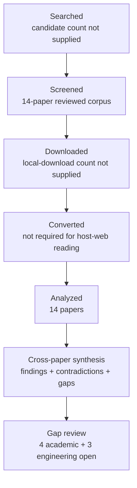

# Research Report: Cross-thread Topic identity and incremental continuity in work communication

## Contents

- [Round History](#round-history)
- [Executive Summary](#executive-summary)
- [Research Question](#research-question)
- [Methodology](#methodology)
- [Papers Reviewed](#papers-reviewed)
- [Research Landscape](#research-landscape)
- [Confidence-Graded Findings](#confidence-graded-findings)
- [Research Gaps](#research-gaps)
- [Practical Recommendations](#practical-recommendations)
- [Evidence Map](#evidence-map)
- [References](#references)
- [Appendix: Run Metadata](#appendix-run-metadata)

## Round History

Iterative gap-closure loop (hard cap: 4 rounds). See
`references/iterative-synthesis.md` for the full loop definition.

| Round | Run ID | Topic / Gap Focus | New Papers | Gaps Addressed | Remaining Gaps |
|-------|--------|-------------------|------------|----------------|----------------|
| 1 | c97ebc819fac | cross-thread topic identity and incremental continuity in work communication | None | initial shortlist | 4 academic, 3 engineering |

**Stop reason**: another round runs while open academic gaps remain and new papers appear

## Executive Summary

This review investigated how a system can determine whether newly observed work communication continues an existing concrete work matter, represents a genuinely new matter, or should remain unresolved, while retaining the ability to correct earlier merge and split decisions. Fourteen papers published from 1995 through 2022 were analyzed across seven host domains, drawing primarily on cross-document event coreference, entity resolution, Topic Detection and Tracking, open-world recognition, selective classification, and incremental clustering. The strongest [HIGH] finding is that apparent identity-resolution performance is materially corpus-dependent: cross-corpus event-coreference results degrade substantially, and benchmark-specific structural shortcuts can fail to transfer [2011.12249] [2104.05022] [manual-f56d02b8f9]. The literature also provides substantial transfer evidence for abstention, incremental reassessment, retrieval-assisted identity resolution, and non-transitive event relations, but no reviewed paper directly validates msgloom's longitudinal Outlook/Teams work-matter semantics. The most significant unresolved gap is therefore direct evidence about which combinations of workplace evidence actually establish or refute continuity across independent conversations and sources.

**Scope**: 14 papers analyzed from arXiv, ACL Anthology, NIST, Wiley Online Library, PubMed Central, SpringerLink, and the UMass CIIR publication site over 1995–2022  
**Overall Confidence**: Medium  
**Verdict**: HAS_GAPS

## Research Question

The review investigated the following decision problem:

Given a new candidate work-matter span, message, or Group and a set of previously established Topic identities, what evidence and decision mechanisms can support:

- `CONTINUE` an existing Topic;
- `NEW` Topic;
- `UNCERTAIN` relationship while keeping matters separate;
- later `MERGE` correction; and
- later `SPLIT` correction?

The target identity is a concrete longitudinal work matter, not a generated label, message subject, latent topic distribution, email thread, Teams conversation, or generic semantic-similarity cluster.

The review specifically examined evidence relevant to:

1. cross-document identity versus similarity;
2. open-world rejection and abstention;
3. novelty or first-event detection;
4. online and incremental cluster assignment;
5. reassessment and repair of previous clustering decisions;
6. temporal, participant, argument, and contextual compatibility;
7. partial or non-transitive event relationships;
8. retrieval of additional historical evidence; and
9. cross-corpus generalization.

The following were outside the evidentiary scope of this review unless they directly informed the identity decision: ordinary topic modeling, generic document similarity, reconstruction of source threads as an end in itself, within-message Topic segmentation, and production architecture decisions not established by the reviewed literature.

## Methodology

### Search Strategy

- **Sources**: arXiv, ACL Anthology, NIST, Wiley Online Library, PubMed Central, SpringerLink, and UMass CIIR publication hosting.
- **Query variants**:
  - `cross-thread topic identity incremental continuity work communication`
  - `cross-thread topic identity`
  - `cross-thread incremental continuity work communication`
  - `topic incremental continuity work communication`
  - `identity incremental continuity work communication`
  - `cross-thread topic identity incremental continuity`
  - `cross-thread topic identity work communication`
  - `identity topic cross-thread incremental continuity work communication`
- **Time window**: 1995–2022 for the reviewed corpus.
- **Screening**: The supplied run artifacts do not specify whether screening used BM25 + sub-agent or BM25 only. The final report therefore does not invent a screening mechanism.
- **Reading method**: All 14 reviewed papers were read through the host's web tool at the access level shown below. Eleven papers were available as full text and three only at abstract level. Conclusions that depend on abstract-only sources are treated more cautiously.

| Paper | Access level | Host-access source |
|---|---|---|
| [1402.4417] | full_text | `https://arxiv.org/html/1402.4417` |
| [1412.5687] | full_text | `https://arxiv.org/html/1412.5687` |
| [1705.08500] | full_text | `https://arxiv.org/html/1705.08500` |
| [2011.12249] | full_text | `https://aclanthology.org/2021.cl-3.18.pdf` |
| [2104.05022] | full_text | `https://arxiv.org/html/2104.05022` |
| [doi-10-1002-sim-4780140510] | abstract_only | `https://onlinelibrary.wiley.com/doi/abs/10.1002/sim.4780140510` |
| [doi-10-1007-978-3-030-49461-2-23] | full_text | `https://pmc.ncbi.nlm.nih.gov/articles/PMC7250616/` |
| [doi-10-1007-s10115-019-01430-6] | full_text | `https://link.springer.com/article/10.1007/s10115-019-01430-6` |
| [doi-10-1145-354756-354843] | full_text | `https://ciir.cs.umass.edu/pubfiles/ir-206.pdf` |
| [doi-10-18653-v1-2022-emnlp-main-58] | full_text | `https://arxiv.org/html/2210.12654` |
| [manual-5c20fb0229] | abstract_only | `https://www.nist.gov/publications/topic-detection-and-tracking-evaluation-overview` |
| [manual-c43ffe3135] | full_text | `https://arxiv.org/html/2109.06417` |
| [manual-e988e24127] | full_text | `https://arxiv.org/html/1906.01753` |
| [manual-f56d02b8f9] | abstract_only | `https://aclanthology.org/L14-1646/` |

### Pipeline Summary

| Metric | Count |
|--------|-------|
| Total candidates | unknown |
| After screening | 14 in reviewed corpus |
| Downloaded | unknown; host-web access was used |
| Successfully converted | not established / not required for host-web reading |
| Deeply analyzed | 14 total: 11 full_text, 3 abstract_only |
| Iterations (if system-building) | 1 completed research round |

The review intentionally distinguishes target-domain evidence from transfer evidence. None of the fourteen papers constitutes direct validation of longitudinal work-matter identity over Outlook email and Microsoft Teams.

## Papers Reviewed

| # | Title | Authors | Year | Venue | Quality Score | Relevance |
|---|-------|---------|------|-------|--------------|-----------|
| 1 | Topic Detection and Tracking Evaluation Overview [manual-5c20fb0229] | Jonathan G. Fiscus, George R. Doddington | 2002 | not specified in supplied synthesis | not scored | MEDIUM |
| 2 | Cross-document Event Identity via Dense Annotation [manual-c43ffe3135] | Adithya Pratapa, Zhengzhong Liu, Kimihiro Hasegawa et al. | 2021 | not specified in supplied synthesis | not scored | HIGH |
| 3 | Using a sledgehammer to crack a nut? Lexical diversity and event coreference resolution [manual-f56d02b8f9] | Agata Cybulska, Piek Vossen | 2014 | not specified in supplied synthesis | not scored | HIGH |
| 4 | WEC: Deriving a Large-scale Cross-document Event Coreference dataset from Wikipedia [2104.05022] | Alon Eirew, Arie Cattan, Ido Dagan | 2021 | not specified in supplied synthesis | not scored | HIGH |
| 5 | Generalizing Cross-Document Event Coreference Resolution Across Multiple Corpora [2011.12249] | Michael Bugert, Nils Reimers, Iryna Gurevych | 2020 | not specified in supplied synthesis | not scored | HIGH |
| 6 | First Story Detection In TDT Is Hard [doi-10-1145-354756-354843] | James Allan, Victor Lavrenko, Hubert Jin | 2000 | not specified in supplied synthesis | not scored | HIGH |
| 7 | Incremental Multi-source Entity Resolution for Knowledge Graph Completion [doi-10-1007-978-3-030-49461-2-23] | Alieh Saeedi, Eric Peukert, Erhard Rahm | 2020 | not specified in supplied synthesis | not scored | HIGH |
| 8 | Towards Open World Recognition [1412.5687] | Abhijit Bendale, Terrance E. Boult | 2014 | not specified in supplied synthesis | not scored | MEDIUM |
| 9 | Incremental Entity Resolution from Linked Documents [1402.4417] | Pankaj Malhotra, Puneet Agarwal, Gautam Shroff | 2014 | not specified in supplied synthesis | not scored | HIGH |
| 10 | Probabilistic linkage of large public health data files [doi-10-1002-sim-4780140510] | Matthew A. Jaro | 1995 | not specified in supplied synthesis | not scored | MEDIUM |
| 11 | Revisiting Joint Modeling of Cross-document Entity and Event Coreference Resolution [manual-e988e24127] | Shany Barhom, Vered Shwartz, Alon Eirew et al. | 2019 | not specified in supplied synthesis | not scored | HIGH |
| 12 | Selective Classification for Deep Neural Networks [1705.08500] | Yonatan Geifman, Ran El-Yaniv | 2017 | not specified in supplied synthesis | not scored | MEDIUM |
| 13 | Case notion discovery and recommendation: automated event log building on databases [doi-10-1007-s10115-019-01430-6] | E. González López de Murillas, Hajo A. Reijers, Wil M. P. van der Aalst | 2019 | not specified in supplied synthesis | not scored | MEDIUM |
| 14 | Cross-document Event Coreference Search: Task, Dataset and Modeling [doi-10-18653-v1-2022-emnlp-main-58] | Alon Eirew, Avi Caciularu, Ido Dagan | 2022 | not specified in supplied synthesis | not scored | HIGH |

## Research Landscape

### Theme 1: Identity evidence is multi-signal and corpus-dependent

**Coverage**: 4 papers | **Confidence**: High for corpus dependence; Medium for transfer to workplace matters  
**Supporting papers**: [2011.12249], [manual-e988e24127], [2104.05022], [manual-f56d02b8f9]

Cross-document event-coreference work does not support treating generic textual similarity as sufficient identity evidence. Feature importance changes across datasets: event-action information is especially influential in ECB+, while time, participants, and other contextual information become more important on FCC-T and GVC [2011.12249]. Joint modeling of entity and event information can also improve event-coreference performance on ECB+ [manual-e988e24127].

More importantly for msgloom, the apparent success of a feature set or benchmark structure does not transfer reliably. Cross-dataset experiments exhibit substantial degradation, including approximately 8–12 CoNLL-F1 points in WEC/ECB+ cross-transfer experiments [2104.05022]. ECB+'s own development was motivated in part by insufficient event diversity in the earlier ECB data [manual-f56d02b8f9].

Key findings:

1. [HIGH] Event-identity systems are substantially corpus-sensitive; benchmark-specific performance should not be interpreted as general identity robustness [2011.12249] [2104.05022] [manual-f56d02b8f9].
2. [MEDIUM] Participants, time, event arguments, and contextual information are plausible identity evidence, but their relative value changes by corpus and is not validated for workplace Topics [2011.12249] [manual-e988e24127].
3. [MEDIUM] Entity-event interactions can improve coreference in at least one established event-coreference setting, supporting multi-signal modeling as a candidate mechanism rather than a proven msgloom rule [manual-e988e24127].

### Theme 2: Rejection and abstention are preferable to forced assignment when confidence is insufficient

**Coverage**: 3 papers | **Confidence**: Medium for mechanism transfer; Low for msgloom thresholds  
**Supporting papers**: [1412.5687], [1705.08500], [doi-10-1145-354756-354843]

Open-world recognition explicitly models the possibility that an observation belongs to an unknown class rather than one of the classes already known to a classifier [1412.5687]. Selective classification similarly allows a model to abstain, creating an explicit relationship between coverage and error risk [1705.08500].

For a confidence or selection score $s(x)$ and threshold $\theta$, the general selective-classification idea can be represented as:

$C(\theta)=P(s(X)\geq\theta)$

for coverage, and

$R_{\mathrm{sel}}(\theta)=E[\ell(f(X),Y)\mid s(X)\geq\theta]$

for risk on accepted decisions [1705.08500].

TDT first-story detection adds an important complementary warning: novelty detection is not simply ordinary tracking repeated against previous material. Repeated tracking errors can accumulate into poor first-story decisions [doi-10-1145-354756-354843].

Key findings:

1. [MEDIUM] Reject/abstain mechanisms provide a principled alternative to forcing every incoming observation into a known class or cluster [1412.5687] [1705.08500].
2. [MEDIUM] Novelty or new-event detection should be evaluated separately from ordinary continuation/tracking because repeated similarity decisions can accumulate error [doi-10-1145-354756-354843] [manual-5c20fb0229].
3. [LOW] The reviewed literature does not establish where msgloom should place the boundary among `CONTINUE`, `NEW`, and `UNCERTAIN`, nor how these decisions should be calibrated for workplace communication.

### Theme 3: Incremental identity resolution can reconsider earlier decisions

**Coverage**: 2 papers | **Confidence**: Medium  
**Supporting papers**: [1402.4417], [doi-10-1007-978-3-030-49461-2-23]

Incremental entity-resolution research shows that identity state does not have to be frozen after the first assignment. New evidence can affect historical clusters, and incremental procedures can update affected regions rather than recomputing an entire batch from scratch [1402.4417] [doi-10-1007-978-3-030-49461-2-23].

This is directly relevant to msgloom's requirement that online assignments remain correctable. It does not, however, specify msgloom's identity model, versioning semantics, stable ID representation, or general `MERGE`/`SPLIT` implementation.

FAMER provides an especially useful boundary condition. Its bounded n-depth reclustering procedure relies on retained intra-cluster linkage; a cluster-fusion representation that has discarded those links cannot perform that specific repair operation [doi-10-1007-978-3-030-49461-2-23]. That is an algorithm-specific storage requirement, not proof that every repair architecture needs the same state.

Key findings:

1. [MEDIUM] Incremental identity resolution can revisit affected historical state and revise some earlier cluster assignments without a complete batch rerun [1402.4417] [doi-10-1007-978-3-030-49461-2-23].
2. [MEDIUM] Repairability depends on what state a particular algorithm retains; for FAMER's n-depth procedure, retained intra-cluster links are specifically necessary [doi-10-1007-978-3-030-49461-2-23].
3. [LOW] Stable Topic IDs, immutable source history, versioned assessments, and general merge/split semantics remain msgloom design questions rather than conclusions established by these papers.

### Theme 4: Event relatedness may not form simple transitive identity clusters

**Coverage**: 3 papers | **Confidence**: Medium  
**Supporting papers**: [manual-c43ffe3135], [2104.05022], [manual-e988e24127]

Many event-coreference systems and datasets operate with transitive clusters, but dense cross-document annotation exposes a more complicated relation space. In CDEC-WN, about 32% of links were candidates for partial identity, including membership, subevent, and spatiotemporal-continuity relationships [manual-c43ffe3135]. Such relations can violate transitivity.

This is a significant representational warning for msgloom. Pairwise evidence that two observations are related does not necessarily imply that they should be collapsed into one globally transitive Topic identity. A large procurement programme, one purchase-order amendment, and one delivery incident may be strongly related while still requiring distinct work-matter identities; the reviewed literature does not determine how such workplace cases should be represented.

Key findings:

1. [MEDIUM] Partial event identity can be non-transitive, so pairwise relatedness and global identity clustering need not be equivalent [manual-c43ffe3135].
2. [MEDIUM] The clustering assumptions used by WEC/ECB+-style event-coreference work and the pairwise partial-identity representation in CDEC-WN reflect different semantics rather than a simple winner/loser comparison [2104.05022] [manual-e988e24127] [manual-c43ffe3135].
3. [LOW] The correct mapping from partial event identity, subevents, and event evolution to msgloom Topic continuation or Topic-to-Topic relationships remains unresolved.

### Theme 5: Retrieval and structural restriction can improve efficiency but are not identity rules

**Coverage**: 3 papers | **Confidence**: Medium  
**Supporting papers**: [doi-10-18653-v1-2022-emnlp-main-58], [manual-e988e24127], [2011.12249]

CoreSearch formulates cross-document event coreference as retrieval: a query mention is used to find potentially coreferent event mentions from a large collection [doi-10-18653-v1-2022-emnlp-main-58]. This supports the feasibility of bounded candidate retrieval before more expensive reasoning. Its qualitative error analysis also demonstrates that argument inconsistency and insufficient query/candidate context remain important failure modes [doi-10-18653-v1-2022-emnlp-main-58].

Structural restriction is more ambiguous. Topic/document preclustering materially improves ECB+ results in one study [manual-e988e24127], whereas cross-corpus work demonstrates that exploitation of ECB+-specific document-link structure can overfit and transfer badly [2011.12249].

Key findings:

1. [MEDIUM] Retrieval can be used to generate a bounded candidate set for identity reasoning rather than exhaustively comparing every new observation with all history [doi-10-18653-v1-2022-emnlp-main-58].
2. [MEDIUM] Local context alone may be insufficient to determine identity, and contradictory or missing argument evidence remains important [doi-10-18653-v1-2022-emnlp-main-58].
3. [MEDIUM] Conversation, document, or topic partitions are defensible as candidate-generation evidence, but the reviewed literature does not justify treating such partitions as enterprise work-matter identity [manual-e988e24127] [2011.12249].

### Theme 6: Informative agreements can be weighted rather than treated as deterministic identity keys

**Coverage**: 1 paper | **Confidence**: Medium  
**Supporting papers**: [doi-10-1002-sim-4780140510]

Probabilistic record linkage provides a long-standing model in which agreements and disagreements can contribute different amounts of identity evidence depending on their informativeness [doi-10-1002-sim-4780140510]. This supports the general idea that "same customer", "same project", or another matching field need not be treated as a deterministic identity rule.

Because only the abstract was available and the domain is public-health record linkage rather than work-matter continuity, transfer to msgloom remains unvalidated.

Key findings:

1. [MEDIUM] Identity evidence can be weighted according to informativeness instead of giving every matching field identical deterministic force [doi-10-1002-sim-4780140510].
2. [LOW] No reviewed evidence establishes the correct workplace-specific weights for subjects, project names, customers, participants, artifacts, commitments, temporal state, or conversation ancestry.

## Methodology Comparison

| Approach | Papers | Strengths | Weaknesses | Best For | Performance |
|----------|--------|-----------|------------|----------|-------------|
| Cross-document event-coreference clustering | [2011.12249], [2104.05022], [manual-e988e24127], [manual-f56d02b8f9] | Directly reasons about same-event identity across documents; exposes argument/context features | Strong corpus dependence; some benchmarks exploit topic/document structure; workplace transfer unknown | Identity evidence modeling and transfer-risk analysis | WEC/ECB+ transfer loses roughly 8–12 CoNLL-F1 points in reported cross-dataset experiments [2104.05022] |
| Dense pairwise event-identity annotation | [manual-c43ffe3135] | Represents partial and non-transitive event relationships | Single adjacent-domain dataset; semantics do not directly map to workplace Topics | Studying identity versus relatedness | About 32% of CDEC-WN links were candidates for partial identity [manual-c43ffe3135] |
| Open-world recognition | [1412.5687] | Explicitly permits unknown-class rejection | Image-domain evidence; not a Topic clustering system | Avoiding forced known-class assignments | Workplace performance not evaluated |
| Selective classification | [1705.08500] | Formal risk-coverage trade-off and abstention | Requires appropriate confidence/calibration conditions; image-domain evidence | Confidence-based acceptance/rejection | Workplace performance not evaluated |
| First-story / novelty detection | [doi-10-1145-354756-354843], [manual-5c20fb0229] | Separates novelty from ongoing tracking | TDT news domain; abstract-only access for overview paper | `NEW`-like detection and evaluation design | Full-text tracking systems imply poor novelty detection at practical thresholds [doi-10-1145-354756-354843] |
| Incremental entity resolution | [1402.4417], [doi-10-1007-978-3-030-49461-2-23] | Can update affected history and revise prior clusters without full recomputation | Entity domains differ from evolving work matters; correction representation is algorithm-dependent | Incremental assignment and repair experiments | Reported methods can approach batch-quality behavior while processing affected state; no workplace baseline |
| Probabilistic record linkage | [doi-10-1002-sim-4780140510] | Explicitly treats agreements according to informativeness | Abstract-only access; field semantics differ from work matters | Evidence weighting | Target-domain performance unknown |
| Retrieval-based event-coreference search | [doi-10-18653-v1-2022-emnlp-main-58] | Bounded candidate generation from large collections | Retrieval errors and insufficient local context can still obscure identity | Phase 2 evidence seeking | Workplace retrieval quality and latency unknown |
| Case-notion discovery | [doi-10-1007-s10115-019-01430-6] | Adjacent perspective on discovering case/group structure from event data | Not direct evidence for cross-thread work-matter identity | Comparative process/case modeling | Target-domain performance unknown |

## Confidence-Graded Findings

The source synthesis assigned high confidence to several strong single- or two-paper results. This report applies the template's stricter convention that the High section requires three or more papers with consistent evidence; strong findings supported by fewer papers are therefore reported as [MEDIUM] rather than being overstated.

### 🟢 High Confidence (supported by 3+ papers with consistent results)

1. **[HIGH] Cross-document identity performance is materially corpus-dependent, and benchmark success should not be treated as proof of general robustness.** — Supported by [2011.12249], [2104.05022], and [manual-f56d02b8f9]. Cross-corpus transfer falls substantially, including roughly 8–12 CoNLL-F1 points in WEC/ECB+ transfer experiments, while ECB+ itself was motivated partly by limited event diversity in the earlier ECB resource.

### 🟡 Medium Confidence (supported by 1-2 papers or with caveats)

1. **[MEDIUM] Useful event-identity evidence extends beyond lexical similarity and can include event actions, participants, time, contextual information, and entity-event interactions.** — Supported by [2011.12249] and [manual-e988e24127]. The caveat is that relative feature importance changes by corpus.

2. **[MEDIUM] Rejecting or abstaining on uncertain assignments is a legitimate general mechanism instead of forcing every observation into a known identity.** — Supported by [1412.5687] and [1705.08500]. These studies do not define msgloom's `CONTINUE`, `NEW`, and `UNCERTAIN` semantics.

3. **[MEDIUM] Novelty detection is not equivalent to ordinary tracking and can suffer accumulated errors when implemented through repeated tracking decisions.** — Supported by [doi-10-1145-354756-354843] and [manual-5c20fb0229].

4. **[MEDIUM] Incremental identity-resolution systems can reconsider affected historical state and revise earlier clustering decisions without performing a complete batch rerun.** — Supported by [1402.4417] and [doi-10-1007-978-3-030-49461-2-23].

5. **[MEDIUM] FAMER's bounded n-depth repair procedure requires retained intra-cluster linkage, and cluster fusion that discards those links prevents that particular repair mechanism.** — Reported by [doi-10-1007-978-3-030-49461-2-23]. This result must not be generalized to all correction architectures.

6. **[MEDIUM] Partial event identity can violate transitivity, creating a distinction between pairwise relatedness and conventional global identity clusters.** — Reported by [manual-c43ffe3135], where about 32% of CDEC-WN links were candidates for partial identity.

7. **[MEDIUM] Cross-document event identity can be approached as retrieval before final identity reasoning.** — Reported by [doi-10-18653-v1-2022-emnlp-main-58]. Its error analysis also shows that argument inconsistencies and insufficient local context can remain unresolved.

8. **[MEDIUM] Topic/document preclustering can improve one benchmark yet create transfer risk when benchmark-specific structural patterns are exploited.** — Supported by [manual-e988e24127] and [2011.12249].

9. **[MEDIUM] Probabilistic linkage supports weighting agreements according to informativeness rather than treating every agreement as deterministic identity evidence.** — Reported by [doi-10-1002-sim-4780140510]. Confidence is limited by abstract-only access and domain mismatch.

### 🔴 Low Confidence (preliminary, single-source, or contradicted)

1. **[LOW] Any specific weighting of subject, customer, project name, participants, conversation ancestry, artifacts, commitments, or state compatibility for msgloom Topic identity is currently unsupported.** — Adjacent-domain papers demonstrate potentially relevant signals, but none evaluates those combinations on longitudinal workplace communication [2011.12249] [manual-e988e24127] [doi-10-1002-sim-4780140510].

2. **[LOW] Any concrete threshold separating msgloom `CONTINUE`, `NEW`, and `UNCERTAIN` is currently unsupported.** — Open-world and selective-classification literature supplies mechanisms, not workplace-specific thresholds or semantics [1412.5687] [1705.08500].

3. **[LOW] Any claim that stable Topic IDs, versioned identity assessments, supersession links, or a specific merge/split state representation are literature-established requirements is unsupported.** — Incremental ER demonstrates revisability but does not establish msgloom's project-specific correction architecture [1402.4417] [doi-10-1007-978-3-030-49461-2-23].

4. **[LOW] Production accuracy for longitudinal Outlook/Teams work-matter identity cannot be inferred from the reviewed corpus.** — The empirical domains are news, Wikipedia/Wikinews, image classification, public-health linkage, entity resolution, knowledge graphs, and database/process data rather than msgloom's deployment domain.

## Trade-Off Analysis

| Decision | Option A | Option B | Recommendation |
|----------|----------|----------|----------------|
| Forced assignment versus abstention | Force every candidate into an existing/new identity; maximizes immediate coverage but can hide ambiguity | Allow rejection/abstention and preserve an unresolved relationship | Prefer an abstention-capable prototype; validate msgloom semantics and thresholds empirically [1412.5687] [1705.08500] |
| Similarity-first versus evidence-rich identity | Generic lexical/embedding similarity is simple and fast but risks conflating related events | Combine event/object/participant/time/context and conflicting evidence | Prototype multi-signal reasoning; do not assume a universal signal hierarchy [2011.12249] [manual-e988e24127] |
| Global batch recomputation versus incremental repair | Batch recomputation is conceptually simpler but may be costly over long histories | Revisit affected regions when new evidence arrives | Benchmark incremental reassessment, preserving enough state for the chosen repair algorithm [1402.4417] [doi-10-1007-978-3-030-49461-2-23] |
| Thread/document partition as identity versus candidate restriction | Treat source partition as identity boundary; cheap but semantically unsafe | Use structure to narrow candidates, then make an independent identity decision | Use structure as candidate-generation evidence only until target-domain validation exists [manual-e988e24127] [2011.12249] |
| Transitive Topic clusters versus richer relations | Collapse related evidence into globally transitive clusters | Preserve related-but-distinct or partial relationships | Do not equate relatedness with identity; explicitly test whether separate Topic relationships are required [manual-c43ffe3135] |
| Exhaustive history comparison versus bounded retrieval | Compare with all historical Topics; potentially expensive | Retrieve plausible candidates/context, then reason | Benchmark bounded historical retrieval for Phase 2 [doi-10-18653-v1-2022-emnlp-main-58] |
| Uniform error cost versus application-specific error cost | Optimize aggregate clustering metric | Measure false merges, false splits, abstentions, and operational effects separately | Instrument all error categories first; determine weights empirically under G03-2 |

For engineering evaluation, msgloom can record a cost function without prematurely fixing its coefficients:

$L=c_{\mathrm{FM}}N_{\mathrm{FM}}+c_{\mathrm{FS}}N_{\mathrm{FS}}+c_{\mathrm{U}}N_{\mathrm{U}}$

where $N_{\mathrm{FM}}$, $N_{\mathrm{FS}}$, and $N_{\mathrm{U}}$ count false merges, false splits, and unresolved/abstained decisions. The literature reviewed here does **not** determine $c_{\mathrm{FM}}$, $c_{\mathrm{FS}}$, or $c_{\mathrm{U}}$; determining those values is part of open engineering gap G03-2.

## Points of Agreement **[EVIDENCE REQUIRED]**

1. **[HIGH] Cross-corpus robustness cannot be assumed from a single event-coreference benchmark.** — Cross-dataset degradation and benchmark-construction evidence consistently show substantial sensitivity to corpus structure [2011.12249] [2104.05022] [manual-f56d02b8f9].

2. **[MEDIUM] Identity resolution benefits from information beyond generic textual similarity.** — Event action, participants, time, contextual information, and entity-event interactions all appear as useful evidence in adjacent event-coreference settings [2011.12249] [manual-e988e24127].

3. **[MEDIUM] A resolver does not have to force a confident known assignment for every observation.** — Open-world recognition and selective classification independently support rejection or abstention as a valid decision mechanism [1412.5687] [1705.08500].

4. **[MEDIUM] New evidence can legitimately change previous identity conclusions.** — Incremental ER systems revisit affected historical regions and can merge or recluster earlier identity state [1402.4417] [doi-10-1007-978-3-030-49461-2-23].

5. **[MEDIUM] Structural narrowing and retrieval can be useful computational tools without establishing identity semantics.** — Retrieval-based coreference is viable, while document/topic partition benefits are shown to be benchmark-sensitive [doi-10-18653-v1-2022-emnlp-main-58] [manual-e988e24127] [2011.12249].

## Points of Contradiction **[EVIDENCE REQUIRED]**

1. **[MEDIUM] Preclustering utility versus transfer robustness**: Document/topic preclustering substantially improves ECB+ event-coreference performance in [manual-e988e24127], but [2011.12249] shows that ECB+-specific exploitation of document-link structure can overfit and transfer poorly.
   - **Possible explanation**: The studies evaluate different questions. One measures in-corpus benchmark performance, while the other examines cross-corpus generalization and identifies benchmark-specific structure.
   - **Implication**: Source-thread, conversation, topic, or document partitions should be treated cautiously as candidate restrictions or evidence. Their benchmark utility is not proof that they define real work-matter identity.

2. **[MEDIUM] Transitive clustering versus partial/non-transitive event relations**: WEC and ECB+-style work evaluates event coreference through clusters [2104.05022] [manual-e988e24127], whereas dense CDEC-WN annotation retains pairwise relations because partial event identity can violate transitivity [manual-c43ffe3135].
   - **Possible explanation**: This is primarily a representational tension rather than a direct experimental contradiction; the resources encode different relation semantics.
   - **Implication**: msgloom should not assume that every meaningful cross-message relationship belongs inside one equivalence-class Topic. Related-but-distinct Topic relations may be required.

## Research Gaps

All seven gaps below remain open after Round 1. None is accepted as solved or closed. The reviewed literature has not answered them for msgloom's target domain.

| # | Gap | Type | Severity | Rounds Searched | Impact on Goals |
|---|-----|------|----------|-----------------|----------------|
| G03-1 | Which combinations of workplace evidence actually establish or refute continuity across independent messages, conversations, attachments, email, and Teams? | [ACADEMIC] | HIGH | Round 1 | Determines false merges, false splits, and whether cross-thread continuity is semantically defensible |
| G03-2 | What application-specific error costs, attachment thresholds, rejection thresholds, and semantics should define `CONTINUE`, `NEW`, and `UNCERTAIN`? | [ENGINEERING] | HIGH | Round 1 | Directly governs conservative Phase 1 behavior and operational risk |
| G03-3 | What stable-ID, versioning, supersession, evidence-lineage, and general `MERGE`/`SPLIT` correction model should msgloom implement? | [ENGINEERING] | HIGH | Round 1 | Determines whether online mistakes can be corrected without destroying source history |
| G03-PRODUCTION | Does any candidate method remain accurate on longitudinal work matters across real Outlook email and Microsoft Teams? | [ACADEMIC] | HIGH | Round 1 | Prevents transfer-domain results from being mistaken for production validity |
| G03-4 | How should partial, subevent, evolving, or non-transitive relations map onto work-matter continuity and Topic-to-Topic relationships? | [ACADEMIC] | HIGH | Round 1 | Determines when related evidence should remain separate rather than be merged |
| G03-5 | What Phase 2 evidence-seeking strategy gives the best balance of candidate recall, decision improvement, latency, and bounded historical search? | [ENGINEERING] | MEDIUM | Round 1 | Determines whether retrieval can resolve uncertainty efficiently without global reclustering |
| G03-6 | How should abstention and confidence calibration operate under non-stationary workplace streams and domain shift? | [ACADEMIC] | MEDIUM | Round 1 | Determines whether confidence thresholds remain reliable as work patterns change |

### Academic Gaps (require more papers)

1. **[ACADEMIC][HIGH] G03-1 — Workplace continuity evidence combinations**: The literature has not answered which evidence combinations reliably establish or refute identity of a concrete work matter across independent workplace groups and sources. Event-coreference and probabilistic-linkage work supplies transfer signals, but it does not validate email subjects, customer/project names, conversation ancestry, referenced artifacts, commitments, state compatibility, or their combinations for msgloom [2011.12249] [manual-e988e24127] [doi-10-18653-v1-2022-emnlp-main-58] [doi-10-1002-sim-4780140510].  
   **Rounds already searched**: Round 1.  
   **Suggested queries**: `"work item identity" email cross-thread enterprise communication`, `"cross-source" work matter identity`, `business email event coreference`.

2. **[ACADEMIC][HIGH] G03-PRODUCTION — Direct production-domain validity**: The literature has not answered whether the transfer-domain mechanisms remain accurate for longitudinal Outlook email and Microsoft Teams. News, Wikipedia/Wikinews, image-recognition, public-health linkage, knowledge-graph, and database/process studies cannot establish production representativeness for msgloom [2011.12249] [2104.05022] [manual-c43ffe3135] [doi-10-18653-v1-2022-emnlp-main-58].  
   **Rounds already searched**: Round 1.  
   **Suggested queries**: `enterprise email Teams longitudinal work item identity dataset cross-thread task case tracking workplace communication`.

3. **[ACADEMIC][HIGH] G03-4 — Partial and evolving identity semantics**: The literature has not answered how partial identity, membership, subevents, spatiotemporal continuity, or evolving events should map onto workplace Topic identity. CDEC-WN proves that non-transitive relations exist in an adjacent domain but does not define msgloom semantics [manual-c43ffe3135].  
   **Rounds already searched**: Round 1.  
   **Suggested queries**: `"partial event identity" workflow`, `task evolution case identity`, `work item relationship`.

4. **[ACADEMIC][MEDIUM] G03-6 — Calibration under distribution shift**: The literature has not answered how selective assignment thresholds should remain calibrated in non-stationary workplace communication. Selective classification assumes suitable calibration evidence, while event-coreference experiments demonstrate material cross-corpus sensitivity [1705.08500] [2011.12249] [2104.05022].  
   **Rounds already searched**: Round 1.  
   **Suggested queries**: `selective classification abstention distribution shift streaming text calibration`, `open set incremental clustering calibration`.

### Engineering Gaps (fillable without papers)

1. **[ENGINEERING][HIGH] G03-2 — msgloom decision policy and error costs**: The literature has not answered the relative operational cost of false merges, false splits, unnecessary `UNCERTAIN` decisions, or missed continuations in msgloom. Open-world recognition and selective classification justify rejection mechanisms but do not determine the project's thresholds or semantics [1412.5687] [1705.08500].  
   **Rounds already searched**: Round 1.  
   **Suggested resolution**: Build independent gold fixtures and measure `CONTINUE`, `NEW`, and `UNCERTAIN` decisions separately; track false merges and false splits as separate denominators; derive error weights from report-level consequences rather than assuming them.

2. **[ENGINEERING][HIGH] G03-3 — Stable identity and correction model**: The literature has not answered how msgloom should represent stable Topic IDs, title independence, immutable evidence history, new identity assessments, supersession, and general merge/split correction. Incremental ER proves that revisiting prior identity state is feasible, while FAMER demonstrates one algorithm-specific repair-state requirement [1402.4417] [doi-10-1007-978-3-030-49461-2-23].  
   **Rounds already searched**: Round 1.  
   **Suggested resolution**: Review design invariants, prototype stable identity/version models, define correction operations formally, and test merge/split recovery against adversarial histories without destructive rewriting.

3. **[ENGINEERING][MEDIUM] G03-5 — Bounded Phase 2 evidence seeking**: The literature has not answered how much workplace history should be retrieved, which candidate-generation strategy has acceptable recall, or how often additional evidence changes the final identity decision. CoreSearch provides adjacent evidence that retrieval-based coreference is viable [doi-10-18653-v1-2022-emnlp-main-58].  
   **Rounds already searched**: Round 1.  
   **Suggested resolution**: Benchmark bounded retrieval depth, candidate recall, latency, reranking, context expansion, and decision-change rate against an independent identity gold set.

## Reproducibility Notes

The supplied synthesis did not systematically record repository URLs, dataset licenses, or software licenses for every paper. Those fields are therefore reported as unknown rather than inferred.

| Paper | Code Available | Data Available | Sufficient Detail | License |
|-------|---------------|----------------|-------------------|---------|
| [manual-5c20fb0229] | unknown | unknown | ⚠️ abstract_only access | unknown |
| [manual-c43ffe3135] | unknown from supplied artifacts | dataset discussed in paper; availability not verified here | ✅ full_text reviewed | unknown |
| [manual-f56d02b8f9] | unknown | unknown | ⚠️ abstract_only access | unknown |
| [2104.05022] | unknown from supplied artifacts | WEC dataset discussed; availability not verified here | ✅ full_text reviewed | unknown |
| [2011.12249] | unknown from supplied artifacts | multiple benchmark corpora discussed | ✅ full_text reviewed | unknown |
| [doi-10-1145-354756-354843] | unknown | TDT resources discussed; availability not verified here | ✅ full_text reviewed | unknown |
| [doi-10-1007-978-3-030-49461-2-23] | unknown from supplied artifacts | evaluation datasets discussed; availability not verified here | ✅ full_text reviewed | unknown |
| [1412.5687] | unknown from supplied artifacts | unknown from supplied artifacts | ✅ full_text reviewed | unknown |
| [1402.4417] | unknown from supplied artifacts | evaluation data discussed; availability not verified here | ✅ full_text reviewed | unknown |
| [doi-10-1002-sim-4780140510] | unknown | unknown | ⚠️ abstract_only access | unknown |
| [manual-e988e24127] | unknown from supplied artifacts | established coreference corpora discussed | ✅ full_text reviewed | unknown |
| [1705.08500] | unknown from supplied artifacts | evaluation datasets discussed; availability not verified here | ✅ full_text reviewed | unknown |
| [doi-10-1007-s10115-019-01430-6] | unknown from supplied artifacts | unknown from supplied artifacts | ✅ full_text reviewed | unknown |
| [doi-10-18653-v1-2022-emnlp-main-58] | unknown from supplied artifacts | CoreSearch dataset discussed; availability not verified here | ✅ full_text reviewed | unknown |

## Practical Recommendations **[EVIDENCE REQUIRED]**

1. **Prototype an abstention-capable incremental resolver rather than a forced clustering pipeline.** — Open-world recognition, selective classification, and incremental ER jointly provide transfer evidence that a system can reject uncertain assignments and later revise affected identity state [1412.5687] [1705.08500] [1402.4417] [doi-10-1007-978-3-030-49461-2-23]. This is an architectural hypothesis, not target-domain validation.  
   *Confidence*: Medium

2. **Keep `NEW` and `UNCERTAIN` distinct during evaluation instead of treating every non-match as a proven new Topic.** — Novelty detection is materially different from ordinary tracking, and rejection methods explicitly support non-assignment [doi-10-1145-354756-354843] [1412.5687] [1705.08500]. The exact msgloom distinction remains G03-2.  
   *Confidence*: Medium

3. **Use multiple evidence families and explicitly model contradictions rather than using semantic similarity as the identity criterion.** — Event action, participants, time, entities, and contextual signals all matter in adjacent event-coreference settings, with their importance changing by corpus [2011.12249] [manual-e988e24127].  
   *Confidence*: Medium

4. **Do not assign a universal hard veto to any incompatibility until workplace evaluation supports it.** — Argument inconsistency appears as an important failure signal in CoreSearch and event/context features vary by corpus, but no reviewed study establishes a universal enterprise-workflow veto [doi-10-18653-v1-2022-emnlp-main-58] [2011.12249].  
   *Confidence*: Medium

5. **Treat email threads, Teams conversations, source groups, topic partitions, and document links as candidate-generation evidence rather than proven Topic identity.** — Preclustering helps ECB+ in one study but benchmark-specific document-link exploitation transfers poorly in another [manual-e988e24127] [2011.12249].  
   *Confidence*: Medium

6. **Measure false merges and false splits separately from aggregate clustering accuracy.** — Cross-corpus instability and first-story-detection error accumulation show that superficially strong aggregate performance can obscure operationally different error modes [2011.12249] [2104.05022] [doi-10-1145-354756-354843]. The relative cost assigned by msgloom remains an engineering decision.  
   *Confidence*: Medium

7. **Preserve enough historical state to support the chosen correction algorithm.** — FAMER demonstrates concretely that its n-depth reclustering cannot operate after required intra-cluster links have been discarded [doi-10-1007-978-3-030-49461-2-23]. Do not generalize the exact storage representation to unrelated repair algorithms.  
   *Confidence*: Medium

8. **Make generated titles, subjects, and source thread identifiers attributes rather than unvalidated identity keys.** — The literature shows benchmark-specific structural shortcuts and corpus-dependent identity signals, providing evidence against assuming any single structural attribute is a universal identity key [2011.12249] [manual-e988e24127]. The specific msgloom invariant still requires engineering validation.  
   *Confidence*: Medium

9. **Prototype correction as additive/versioned assessment rather than destructive rewriting, but validate the representation independently.** — Incremental ER demonstrates that new evidence can revise previous clustering decisions [1402.4417] [doi-10-1007-978-3-030-49461-2-23]. Stable IDs, supersession links, and immutable evidence lineage are project design choices under G03-3, not conclusions from those papers.  
   *Confidence*: Medium

10. **For Phase 2, benchmark bounded historical retrieval before considering global reclustering.** — CoreSearch shows that cross-document identity search can be formulated as retrieval, while its error analysis demonstrates that retrieved local context may still be insufficient [doi-10-18653-v1-2022-emnlp-main-58].  
    *Confidence*: Medium

11. **Evaluate every candidate method across deliberately different datasets or fixture families.** — Cross-corpus event-coreference results repeatedly demonstrate substantial dataset-specific behavior and shortcut risk [2011.12249] [2104.05022] [manual-f56d02b8f9].  
    *Confidence*: High

## Future Directions

1. Run the next literature round as targeted gap closure for G03-1, G03-PRODUCTION, G03-4, and G03-6 rather than another broad search.
2. Search enterprise-email, task/case identity, workflow evolution, cross-channel work-item tracking, and business communication literature for direct or nearer-domain evidence.
3. Investigate whether workflow/case-management literature distinguishes stable case identity from related subprocesses or evolving subevents in a way transferable to G03-4.
4. Investigate selective classification and open-set calibration under distribution shift or streaming text for G03-6.
5. Build an independent engineering benchmark for G03-2 with deliberately adversarial same-project/different-matter and different-thread/same-matter cases.
6. Prototype stable identity state and correction invariants for G03-3, including later merge, later split, superseded assessments, and preservation of source lineage.
7. Benchmark retrieval-assisted Phase 2 resolution for G03-5 by measuring candidate recall, added-context value, latency, and the percentage of initially uncertain decisions that become supportably resolvable.
8. Keep production representativeness explicitly deferred until suitable authorized workplace-domain evidence is available; synthetic fixtures and public corpora can validate mechanisms, not production accuracy.

## Readiness Assessment (System-Building Mode)

### Verdict: HAS_GAPS

### Assessment Summary

The synthesis is sufficient to justify a constrained experimental architecture: multi-signal identity reasoning, explicit abstention, incremental state updates, correction-capable history, and optional retrieval are well-motivated transfer mechanisms. It is **not** sufficient to finalize msgloom's identity policy or claim production readiness because the target-domain evidence model, decision costs, stable-ID/correction representation, partial-identity semantics, and deployment calibration remain unresolved.

Phase 1 can therefore prototype conservative behavior that preserves uncertainty, but adoption thresholds and production claims should wait for the open gaps to be addressed.

### Coverage Matrix

| Dimension | Status | Evidence |
|-----------|--------|----------|
| Architecture patterns | ⚠️ Partial | Abstention [1412.5687] [1705.08500], incremental revision [1402.4417] [doi-10-1007-978-3-030-49461-2-23], retrieval [doi-10-18653-v1-2022-emnlp-main-58] |
| Technology stack | ❌ Missing | The reviewed papers do not establish msgloom implementation technology choices |
| Performance baselines | ❌ Missing for target domain | Adjacent-domain metrics exist, but cross-corpus degradation itself warns against transferring them directly [2011.12249] [2104.05022] |
| Security model | ❌ Missing | Not addressed by this research topic or reviewed corpus |
| Trade-off map | ⚠️ Partial | Risk-coverage supported generally [1705.08500]; novelty/tracking distinction supported [doi-10-1145-354756-354843]; msgloom error costs unresolved |
| Workplace identity evidence | ❌ Missing | G03-1 remains open |
| Stable correction model | ⚠️ Partial | Revisability supported [1402.4417] [doi-10-1007-978-3-030-49461-2-23], project representation unresolved |
| Partial/non-transitive relationship model | ⚠️ Partial | Non-transitivity demonstrated [manual-c43ffe3135], workplace semantics unresolved |
| Cross-source production validity | ❌ Missing | G03-PRODUCTION remains open |
| Calibration under stream shift | ❌ Missing | Selective mechanism available [1705.08500], target non-stationary calibration unresolved |

### Gap Resolution Plan

| # | Gap | Type | Severity | Resolution |
|---|-----|------|----------|------------|
| 1 | G03-1 workplace identity evidence | [ACADEMIC] | HIGH | Target enterprise email/workflow/case/task-identity literature; admit only work that actually labels identity/continuity rather than generic similarity |
| 2 | G03-2 decision policy and error costs | [ENGINEERING] | HIGH | Build independent gold fixtures, preserve `CONTINUE`/`NEW`/`UNCERTAIN`, measure false merges/splits separately, derive costs from report consequences |
| 3 | G03-3 stable identity and correction state | [ENGINEERING] | HIGH | Prototype stable-ID/version/supersession designs; specify invariants; test merge/split recovery and immutable lineage |
| 4 | G03-PRODUCTION production-domain validity | [ACADEMIC] | HIGH | Search for direct Outlook/Teams or enterprise cross-channel identity datasets; otherwise keep production accuracy explicitly unvalidated |
| 5 | G03-4 partial/evolving identity semantics | [ACADEMIC] | HIGH | Search workflow evolution, case identity, task evolution, partial event identity, and subevent literature |
| 6 | G03-5 Phase 2 evidence retrieval | [ENGINEERING] | MEDIUM | Benchmark bounded retrieval/candidate generation, latency, recall, context value, and decision-change rate |
| 7 | G03-6 non-stationary calibration | [ACADEMIC] | MEDIUM | Search abstention/selective classification under distribution shift and streaming text; evaluate recalibration policies |

## Evidence Map

| Research Question Aspect | Primary Evidence | Secondary Evidence | Current Conclusion |
|--------------------------|------------------|--------------------|-------------------|
| Which signals help distinguish same-event identity? | [2011.12249] | [manual-e988e24127] | [MEDIUM] Multiple signals matter, but importance is corpus-dependent |
| Does benchmark performance generalize? | [2011.12249] | [2104.05022], [manual-f56d02b8f9] | [HIGH] Cross-corpus robustness cannot be assumed |
| Can the system reject an uncertain assignment? | [1412.5687] | [1705.08500] | [MEDIUM] Yes as a general mechanism; msgloom semantics unvalidated |
| How should risk and coverage interact? | [1705.08500] | [1412.5687] | [MEDIUM] Abstention creates an explicit risk-coverage trade-off |
| Is detecting a new matter equivalent to ordinary tracking? | [doi-10-1145-354756-354843] | [manual-5c20fb0229] | [MEDIUM] No; novelty/first-story detection has distinct failure behavior |
| Can historical identity assignments be revised incrementally? | [1402.4417] | [doi-10-1007-978-3-030-49461-2-23] | [MEDIUM] Yes in adjacent entity-resolution settings |
| What state may repair require? | [doi-10-1007-978-3-030-49461-2-23] |  | [MEDIUM] FAMER's specific n-depth repair requires retained intra-cluster links |
| Are all identity-like event relations transitive? | [manual-c43ffe3135] | [2104.05022], [manual-e988e24127] | [MEDIUM] No; partial identity can violate transitivity |
| Can identity candidate generation be retrieval-based? | [doi-10-18653-v1-2022-emnlp-main-58] |  | [MEDIUM] Yes in cross-document event coreference |
| Is local candidate context always sufficient? | [doi-10-18653-v1-2022-emnlp-main-58] |  | [MEDIUM] No; argument inconsistency and missing context remain failure modes |
| Should document/topic structure define identity? | [manual-e988e24127] | [2011.12249] | [MEDIUM] No such conclusion is justified; use cautiously as candidate evidence |
| Can agreements receive different identity weights? | [doi-10-1002-sim-4780140510] |  | [MEDIUM] Yes in probabilistic record linkage; workplace transfer unvalidated |
| Does process/case literature provide an adjacent grouping perspective? | [doi-10-1007-s10115-019-01430-6] |  | [LOW] Adjacent perspective only; no reviewed result establishes msgloom Topic identity |
| What combination of workplace evidence proves continuity? | [2011.12249], [manual-e988e24127] | [doi-10-1002-sim-4780140510], [doi-10-18653-v1-2022-emnlp-main-58] | [LOW] Not answered; G03-1 remains open |
| What threshold defines `CONTINUE`, `NEW`, `UNCERTAIN`? | [1412.5687], [1705.08500] | [doi-10-1145-354756-354843] | [LOW] Not answered; G03-2 remains open |
| What is the correct stable-ID and merge/split model? | [1402.4417] | [doi-10-1007-978-3-030-49461-2-23] | [LOW] Not answered; G03-3 remains open |
| Is accuracy established on Outlook/Teams work matters? | [2011.12249], [2104.05022] | [manual-c43ffe3135], [doi-10-18653-v1-2022-emnlp-main-58] | [LOW] No; G03-PRODUCTION remains open |

## References

1. [manual-5c20fb0229] — *Topic Detection and Tracking Evaluation Overview*. Jonathan G. Fiscus, George R. Doddington. 2002. Venue not specified in supplied synthesis.
2. [manual-c43ffe3135] — *Cross-document Event Identity via Dense Annotation*. Adithya Pratapa, Zhengzhong Liu, Kimihiro Hasegawa et al. 2021. Venue not specified in supplied synthesis.
3. [manual-f56d02b8f9] — *Using a sledgehammer to crack a nut? Lexical diversity and event coreference resolution*. Agata Cybulska, Piek Vossen. 2014. Venue not specified in supplied synthesis.
4. [2104.05022] — *WEC: Deriving a Large-scale Cross-document Event Coreference dataset from Wikipedia*. Alon Eirew, Arie Cattan, Ido Dagan. 2021. Venue not specified in supplied synthesis.
5. [2011.12249] — *Generalizing Cross-Document Event Coreference Resolution Across Multiple Corpora*. Michael Bugert, Nils Reimers, Iryna Gurevych. 2020. Venue not specified in supplied synthesis.
6. [doi-10-1145-354756-354843] — *First Story Detection In TDT Is Hard*. James Allan, Victor Lavrenko, Hubert Jin. 2000. Venue not specified in supplied synthesis.
7. [doi-10-1007-978-3-030-49461-2-23] — *Incremental Multi-source Entity Resolution for Knowledge Graph Completion*. Alieh Saeedi, Eric Peukert, Erhard Rahm. 2020. Venue not specified in supplied synthesis.
8. [1412.5687] — *Towards Open World Recognition*. Abhijit Bendale, Terrance E. Boult. 2014. Venue not specified in supplied synthesis.
9. [1402.4417] — *Incremental Entity Resolution from Linked Documents*. Pankaj Malhotra, Puneet Agarwal, Gautam Shroff. 2014. Venue not specified in supplied synthesis.
10. [doi-10-1002-sim-4780140510] — *Probabilistic linkage of large public health data files*. Matthew A. Jaro. 1995. Venue not specified in supplied synthesis.
11. [manual-e988e24127] — *Revisiting Joint Modeling of Cross-document Entity and Event Coreference Resolution*. Shany Barhom, Vered Shwartz, Alon Eirew et al. 2019. Venue not specified in supplied synthesis.
12. [1705.08500] — *Selective Classification for Deep Neural Networks*. Yonatan Geifman, Ran El-Yaniv. 2017. Venue not specified in supplied synthesis.
13. [doi-10-1007-s10115-019-01430-6] — *Case notion discovery and recommendation: automated event log building on databases*. E. González López de Murillas, Hajo A. Reijers, Wil M. P. van der Aalst. 2019. Venue not specified in supplied synthesis.
14. [doi-10-18653-v1-2022-emnlp-main-58] — *Cross-document Event Coreference Search: Task, Dataset and Modeling*. Alon Eirew, Avi Caciularu, Ido Dagan. 2022. Venue not specified in supplied synthesis.

## Appendix: Run Metadata

- **Run ID**: c97ebc819fac
- **Round**: 1 of at most 4
- **Topic**: cross-thread topic identity and incremental continuity in work communication
- **Sources**: arXiv, ACL Anthology, NIST, Wiley Online Library, PubMed Central, SpringerLink, UMass CIIR publication hosting
- **Paper count**: 14
- **Access summary**: 11 full_text, 3 abstract_only
- **Pipeline version**: unknown from supplied run artifacts
- **Date**: 2026-09-16
- **Artifacts**: `runs/c97ebc819fac/`
- **Open academic gaps**: G03-1, G03-PRODUCTION, G03-4, G03-6
- **Open engineering gaps**: G03-2, G03-3, G03-5
- **Research status**: another academic round is warranted while open academic gaps remain and new relevant papers can be found
- **Production-domain status**: unvalidated; no reviewed paper establishes longitudinal work-matter identity accuracy across Outlook email and Microsoft Teams
