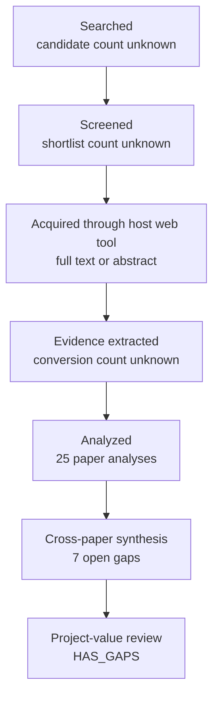

# Research Report: Direct Evidence for Cross-Thread Workplace Work-Matter Identity, Including Cross-Document Business Event Coreference, Enterprise Email/Chat Continuity, and Partial or Evolving Event Identity

## Contents

- [Round History](#round-history)
- [Executive Summary](#executive-summary)
- [Research Question](#research-question)
- [Methodology](#methodology)
- [Papers Reviewed](#papers-reviewed)
- [Research Landscape](#research-landscape)
- [Confidence-Graded Findings](#confidence-graded-findings)
- [Research Gaps](#research-gaps)
- [Practical Recommendations](#practical-recommendations)
- [Evidence Map](#evidence-map)
- [References](#references)
- [Appendix: Run Metadata](#appendix-run-metadata)

## Round History

Iterative gap-closure loop (hard cap: 4 rounds). See
`references/iterative-synthesis.md` for the full loop definition.

| Round | Run ID | Topic / Gap Focus | New Papers | Gaps Addressed | Remaining Gaps |
|-------|--------|-------------------|------------|----------------|----------------|
| 1 | c97ebc819fac | cross-thread topic identity and incremental continuity in work communication | 14 | initial shortlist | 4 academic, 3 engineering |
| 2 | 3a90c92ac2ec | direct evidence for cross-thread workplace work-matter identity, including cross-document business event coreference, enterprise email/chat continuity, and partial or evolving event identity | None | academic gaps of the previous round | 4 academic, 3 engineering |

**Stop reason**: another round runs while open academic gaps remain and new papers appear

## Executive Summary

This review investigated how a system can determine whether new workplace evidence continues an existing concrete work matter, starts a new matter, or should remain explicitly uncertain across independent messages, threads, documents, and sources. Across 25 reviewed analyses spanning cross-document event coreference, topic detection and tracking, new-event detection, incremental entity resolution, open-world/selective classification, process case correlation, and partial event identity, the strongest [HIGH] finding is that identity cannot safely be reduced to lexical, subject, entity-name, thread, or generic semantic similarity; reliable decisions require combinations of arguments, participants, time, contextual structure, and historical state [1906.01753] [2407.11988] [doi-10-1038-s41598-025-32765-6] [2011.12249]. The literature also strongly supports explicit rejection/abstention, incremental correction, and representations richer than a single flat transitive cluster [1412.5687] [1705.08500] [1402.4417] [manual-c43ffe3135]. The most significant unresolved gap is direct target-domain evidence: none of the reviewed studies establishes longitudinal work-matter identity accuracy across Outlook email and Microsoft Teams or an equivalent enterprise email/chat environment.

**Scope**: 25 analyses from 13 host/source domains over 1995–2026; the set includes two identifiers for the same Barhom et al. study, so it does not represent 25 independent studies.  
**Overall Confidence**: High for general design principles; Medium for transfer of specific mechanisms; Low for production-domain thresholds, calibration, and accuracy.  
**Verdict**: HAS_GAPS

## Research Question

The review investigated the following question:

> Given a new candidate matter, span, message group, attachment-derived item, or cross-source observation and a set of existing work-matter identities, what evidence justifies `CONTINUE existing Topic`, `NEW Topic`, or `UNCERTAIN relationship`, and what representation permits later `MERGE` or `SPLIT` correction without rewriting source history?

The in-scope problem is stable identity of a **concrete work matter across independent Groups and sources**, particularly when evidence arrives incrementally. Relevant evidence includes event/action semantics, participants and entities, objects, temporal compatibility, references, discourse/global context, source structure, state evolution, and retrieved historical evidence.

The following distinctions are treated as hard boundaries:

- Group or conversation membership is evidence, not Topic identity.
- Same subject, customer, project, participant set, or embedding neighborhood does not prove same matter.
- Semantic similarity is not equivalent to continuation.
- Low confidence in an existing match does not prove that the item is new.
- A generated Topic title is presentation metadata, not identity.
- One message can contain evidence concerning multiple existing Topics.
- Partial, subevent, evolving, or related-event structure may not be representable by strict equivalence-class clustering.
- Online assignments must be correctable as later evidence arrives.

Ordinary topic modeling, document-level similarity without identity labels, conversation reconstruction, within-document segmentation, and duplicate detection alone are out of scope except when they provide transferable evidence about identity decisions.

## Methodology

### Search Strategy

- **Sources**: The supplied corpus was accessed through the host's web tool. Hosts represented in the access record were arXiv, ACL Anthology, Bilkent University repository, Wiley Online Library, Claudio Di Ciccio's publication site, PubMed Central, ResearchGate, SpringerLink, SciSpace, UMass CIIR, SSRN, Carnegie Mellon University, and NIST.
- **Query variants**:
  - `direct evidence cross-thread workplace work-matter identity, including cross-document business event coreference, enterprise email/chat continuity, partial evolving`
  - `direct evidence cross-thread`
  - `direct workplace work-matter identity, including cross-document business event coreference, enterprise email/chat continuity, partial evolving`
  - `evidence workplace work-matter identity, including cross-document business event coreference, enterprise email/chat continuity, partial evolving`
  - `cross-thread workplace work-matter identity, including cross-document business event coreference, enterprise email/chat continuity, partial evolving`
  - `direct evidence cross-thread workplace work-matter`
  - `direct evidence cross-thread identity, including`
  - `direct evidence cross-thread cross-document business`
- **Time window**: 1995–2026.
- **Screening**: Exact candidate count, screening mechanism, and pre-review shortlist count were not supplied in the final-report input. The supplied reviewed corpus contains 25 analyses.
- **Evidence policy**: Direct target-domain evidence was distinguished from transfer evidence. News, Wikipedia, entity-resolution, image-recognition/open-world, record-linkage, process-mining, and general text results were used to justify mechanisms or evaluation ideas, not claims about production Outlook/Teams accuracy.
- **Access policy**: Papers were read through the host's web tool at the access levels recorded below. Abstract-only sources were not treated as sufficient evidence for detailed methodological or reproducibility claims.

### Paper Access Levels

| Paper | Access level | Host/source |
|---|---|---|
| [1402.4417] | full_text | arXiv |
| [1412.5687] | full_text | arXiv |
| [1705.08500] | full_text | arXiv |
| [1906.01753] | full_text | arXiv |
| [2011.12249] | full_text | ACL Anthology |
| [2104.05022] | full_text | arXiv |
| [2407.11988] | full_text | arXiv |
| [doi-10-1002-asi-21264] | full_text | Bilkent University repository |
| [doi-10-1002-sim-4780140510] | abstract_only | Wiley Online Library |
| [doi-10-1007-978-3-030-33223-5-12] | full_text | Author-hosted preprint |
| [doi-10-1007-978-3-030-49461-2-23] | full_text | PubMed Central |
| [doi-10-1007-978-3-540-27868-9-84] | full_text | ResearchGate |
| [doi-10-1007-s10115-019-01430-6] | full_text | SpringerLink |
| [doi-10-1038-s41598-025-32765-6] | full_text | PubMed Central |
| [doi-10-1145-290941-290953] | abstract_only | SciSpace |
| [doi-10-1145-354756-354843] | full_text | UMass CIIR |
| [doi-10-18653-v1-2022-emnlp-main-58] | full_text | arXiv |
| [doi-10-18653-v1-2023-emnlp-main-294] | full_text | ACL Anthology |
| [doi-10-2139-ssrn-7284343] | abstract_only | SSRN |
| [doi-10-3115-1220575-1220591] | full_text | ACL Anthology |
| [manual-35bac66e3c] | full_text | Carnegie Mellon University |
| [manual-5c20fb0229] | abstract_only | NIST |
| [manual-c43ffe3135] | full_text | arXiv |
| [manual-e988e24127] | full_text | arXiv |
| [manual-f56d02b8f9] | abstract_only | ACL Anthology |

A useful decision-theoretic formulation for msgloom is to make assignment depend on the expected application loss rather than raw similarity. For observation $x$, candidate decision $d$, true relation $y$, and application cost $C(d,y)$:

$R(d\mid x)=\sum_y P(y\mid x)\,C(d,y)$

An `UNCERTAIN` decision is appropriate when the estimated minimum assignment risk remains greater than the cost of abstaining:

$\min_{d\in\{\mathrm{CONTINUE},\mathrm{NEW}\}}R(d\mid x)>C_{\mathrm{UNCERTAIN}}$

The literature supports the *existence* of rejection/risk-coverage mechanisms [1412.5687] [1705.08500], but it does not supply msgloom's $C(d,y)$, $C_{\mathrm{UNCERTAIN}}$, calibrated probabilities, or production thresholds.

### Pipeline Summary

| Metric | Count |
|--------|-------|
| Total candidates | unknown |
| After screening | unknown |
| Downloaded | unknown |
| Successfully converted | unknown |
| Deeply analyzed | 25 |
| Iterations (if system-building) | 2 |

## Papers Reviewed

Quality scores were not supplied by the pipeline and are therefore reported as `unknown` rather than reconstructed.

| # | Title | Authors | Year | Venue | Quality Score | Relevance |
|---|-------|---------|------|-------|--------------|-----------|
| 1 | Multimodal Cross-Document Event Coreference Resolution via Contrastive Evidence Reasoning [doi-10-2139-ssrn-7284343] | Xue Qiao, Fei Li, Yanfeng Hu et al. | 2026 | SSRN | unknown | MEDIUM |
| 2 | A Study of Retrospective and On-Line Event Detection [doi-10-1145-290941-290953] | Yiming Yang, Thomas Pierce, Jaime G. Carbonell | 1998 | unknown | unknown | HIGH |
| 3 | Generating Harder Cross-document Event Coreference Resolution Datasets using Metaphoric Paraphrasing [2407.11988] | Shafiuddin Rehan Ahmed, Zhiyong Eric Wang, George Arthur Baker et al. | 2024 | arXiv | unknown | HIGH |
| 4 | Argument centric causal intervention for cross document event coreference resolution [doi-10-1038-s41598-025-32765-6] | Long Yao, Wenzhong Yang, Yabo Yin et al. | 2025 | Scientific Reports | unknown | HIGH |
| 5 | A Two-Stage Classifier with Reject Option for Text Categorisation [doi-10-1007-978-3-540-27868-9-84] | Giorgio Fumera, Ignazio Pillai, Fabio Roli | 2004 | unknown | unknown | MEDIUM |
| 6 | New event detection and topic tracking in Turkish [doi-10-1002-asi-21264] | Fazli Can, Seyit Kocberber, Ozgur Baglioglu et al. | 2010 | unknown | unknown | HIGH |
| 7 | Using Names and Topics for New Event Detection [doi-10-3115-1220575-1220591] | Giridhar Kumaran, James Allan | 2005 | unknown | unknown | HIGH |
| 8 | Detecting Subevent Structure for Event Coreference Resolution [manual-35bac66e3c] | Jun Araki, Zhengzhong Liu, Eduard Hovy et al. | 2014 | unknown | unknown | HIGH |
| 9 | Cross-document Event Coreference Resolution on Discourse Structure [doi-10-18653-v1-2023-emnlp-main-294] | Xinyu Chen, Sheng Xu, Peifeng Li et al. | 2023 | EMNLP | unknown | HIGH |
| 10 | Revisiting Joint Modeling of Cross-document Entity and Event Coreference Resolution [1906.01753] | Shany Barhom, Vered Shwartz, Alon Eirew et al. | 2019 | unknown | unknown | HIGH |
| 11 | A Probabilistic Approach to Event-Case Correlation for Process Mining [doi-10-1007-978-3-030-33223-5-12] | Dina Bayomie, Claudio Di Ciccio, Marcello La Rosa et al. | 2019 | unknown | unknown | HIGH |
| 12 | Topic Detection and Tracking Evaluation Overview [manual-5c20fb0229] | Jonathan G. Fiscus, George R. Doddington | 2002 | NIST | unknown | HIGH |
| 13 | Cross-document Event Identity via Dense Annotation [manual-c43ffe3135] | Adithya Pratapa, Zhengzhong Liu, Kimihiro Hasegawa et al. | 2021 | arXiv | unknown | HIGH |
| 14 | Using a sledgehammer to crack a nut? Lexical diversity and event coreference resolution [manual-f56d02b8f9] | Agata Cybulska, Piek Vossen | 2014 | unknown | unknown | HIGH |
| 15 | WEC: Deriving a Large-scale Cross-document Event Coreference dataset from Wikipedia [2104.05022] | Alon Eirew, Arie Cattan, Ido Dagan | 2021 | arXiv | unknown | HIGH |
| 16 | Generalizing Cross-Document Event Coreference Resolution Across Multiple Corpora [2011.12249] | Michael Bugert, Nils Reimers, Iryna Gurevych | 2020 | unknown | unknown | HIGH |
| 17 | First Story Detection In TDT Is Hard [doi-10-1145-354756-354843] | James Allan, Victor Lavrenko, Hubert Jin | 2000 | unknown | unknown | HIGH |
| 18 | Incremental Multi-source Entity Resolution for Knowledge Graph Completion [doi-10-1007-978-3-030-49461-2-23] | Alieh Saeedi, Eric Peukert, Erhard Rahm | 2020 | unknown | unknown | HIGH |
| 19 | Towards Open World Recognition [1412.5687] | Abhijit Bendale, Terrance E. Boult | 2014 | arXiv | unknown | MEDIUM |
| 20 | Incremental Entity Resolution from Linked Documents [1402.4417] | Pankaj Malhotra, Puneet Agarwal, Gautam Shroff | 2014 | arXiv | unknown | HIGH |
| 21 | Probabilistic linkage of large public health data files [doi-10-1002-sim-4780140510] | Matthew A. Jaro | 1995 | Statistics in Medicine | unknown | MEDIUM |
| 22 | Revisiting Joint Modeling of Cross-document Entity and Event Coreference Resolution [manual-e988e24127] | Shany Barhom, Vered Shwartz, Alon Eirew et al. | 2019 | unknown | unknown | HIGH |
| 23 | Selective Classification for Deep Neural Networks [1705.08500] | Yonatan Geifman, Ran El-Yaniv | 2017 | arXiv | unknown | MEDIUM |
| 24 | Case notion discovery and recommendation: automated event log building on databases [doi-10-1007-s10115-019-01430-6] | E. González López de Murillas, Hajo A. Reijers, Wil M. P. van der Aalst | 2019 | Knowledge and Information Systems | unknown | MEDIUM |
| 25 | Cross-document Event Coreference Search: Task, Dataset and Modeling [doi-10-18653-v1-2022-emnlp-main-58] | Alon Eirew, Avi Caciularu, Ido Dagan | 2022 | EMNLP | unknown | HIGH |

## Research Landscape

### Theme 1: Identity Is Structured Compatibility, Not Surface Similarity

**Coverage**: 6 analyses | **Confidence**: High  
**Supporting papers**: [1906.01753], [2407.11988], [doi-10-1038-s41598-025-32765-6], [doi-10-3115-1220575-1220591], [2011.12249], [manual-f56d02b8f9]

The event-coreference and new-event-detection literature consistently rejects a simplistic identity rule based on wording overlap. Same-event mentions can differ lexically, while different events can reuse names, event triggers, entities, and topical vocabulary. Argument structure, participants, event/action semantics, and other contextual features provide stronger evidence when combined [1906.01753] [2407.11988] [doi-10-1038-s41598-025-32765-6]. Names and topic information can help candidate discrimination in new-event detection, but neither is sufficient as a universal identity criterion [doi-10-3115-1220575-1220591].

Key findings:

1. [HIGH] Same wording or highly similar semantic representations do not establish same-event identity; hard paraphrases and lexically overlapping non-coreferent events expose both false-split and false-merge risks [2407.11988] [manual-f56d02b8f9].
2. [HIGH] Participant and argument compatibility materially improves identity discrimination, supporting explicitly structured evidence rather than a single similarity score [1906.01753] [doi-10-1038-s41598-025-32765-6].
3. [HIGH] Feature importance changes across corpora, so no literature-derived universal weighting of action, participant, time, location, name, or context should be treated as production truth [2011.12249].

### Theme 2: Global and Retrieved Context Can Resolve Locally Ambiguous Identity

**Coverage**: 2 papers | **Confidence**: High  
**Supporting papers**: [doi-10-18653-v1-2023-emnlp-main-294], [doi-10-18653-v1-2022-emnlp-main-58]

Local mention-pair evidence is not always sufficient. Discourse-aware models use global document structure and paths through shared participants, while cross-document event-coreference search explicitly frames retrieval of supporting mentions as part of resolving identity [doi-10-18653-v1-2023-emnlp-main-294] [doi-10-18653-v1-2022-emnlp-main-58].

Key findings:

1. [HIGH] Global discourse information can provide identity evidence unavailable in the isolated local pair [doi-10-18653-v1-2023-emnlp-main-294].
2. [MEDIUM] Retrieval of additional historical evidence is a plausible Phase 2 mechanism for msgloom, but the reviewed papers do not establish msgloom-specific retrieval bounds, stopping criteria, or latency/decision-quality trade-offs [doi-10-18653-v1-2022-emnlp-main-58].

### Theme 3: New-Event Detection Requires Explicit Rejection

**Coverage**: 6 papers | **Confidence**: High  
**Supporting papers**: [doi-10-1145-354756-354843], [doi-10-1145-290941-290953], [doi-10-1002-asi-21264], [doi-10-3115-1220575-1220591], [1412.5687], [1705.08500]

First-story/new-event detection is fundamentally asymmetric with matching against an already established identity. Recognizing that an item belongs to a known event can exploit positive history, whereas proving that it is a genuinely unseen event requires reasoning against an open and evolving set [doi-10-1145-354756-354843] [doi-10-1145-290941-290953]. Open-world recognition and selective classification provide a separate theoretical basis for refusing unsupported assignments [1412.5687] [1705.08500].

Key findings:

1. [HIGH] New-event detection is harder than ordinary continuation/tracking, so `low similarity to existing Topics` must not be equated mechanically with `NEW` [doi-10-1145-354756-354843] [doi-10-1145-290941-290953].
2. [HIGH] Explicit abstention is preferable to forced assignment when model risk is excessive [1412.5687] [1705.08500].
3. [MEDIUM] Selective-risk methods provide an evaluation framework for coverage-versus-error trade-offs, but representative calibration assumptions are not validated for non-stationary workplace communication [1705.08500].

### Theme 4: Identity Must Be Incremental and Correctable

**Coverage**: 3 papers | **Confidence**: High  
**Supporting papers**: [1402.4417], [doi-10-1007-978-3-030-49461-2-23], [doi-10-1002-asi-21264]

Incremental entity-resolution methods show that historical clusters need not be immutable. New evidence can trigger local reconsideration or reclustering of affected neighborhoods rather than complete recomputation [1402.4417] [doi-10-1007-978-3-030-49461-2-23]. TDT also shows that topic representations can be adapted as a tracked topic evolves [doi-10-1002-asi-21264].

Key findings:

1. [HIGH] Earlier assignments can be revised locally as new evidence arrives, supporting versioned identity assessments and later correction [1402.4417] [doi-10-1007-978-3-030-49461-2-23].
2. [HIGH] Arrival-order effects are an engineering concern and should be tested explicitly rather than assuming first assignment is final [doi-10-1007-978-3-030-49461-2-23].
3. [HIGH] A compact fused Topic summary is insufficient as the only retained state because correction requires access to historical evidence and linkage structure [1402.4417].

### Theme 5: Partial and Evolving Identity Is Not Always an Equivalence Relation

**Coverage**: 4 papers | **Confidence**: High  
**Supporting papers**: [manual-35bac66e3c], [manual-c43ffe3135], [doi-10-1002-asi-21264], [doi-10-3115-1220575-1220591]

Subevent and dense event-identity studies distinguish full identity from weaker structural relationships, including subevent, membership, sister-event, and spatiotemporal-continuity relations [manual-35bac66e3c] [manual-c43ffe3135]. Some such relationships are non-transitive. TDT, by contrast, may treat a seminal event and directly related later developments as one evolving topic [doi-10-1002-asi-21264]. These literatures therefore use different semantics for "continuity."

Key findings:

1. [HIGH] Relatedness and full identity must be represented separately; non-transitive relations cannot safely be collapsed into a single equivalence-class cluster [manual-c43ffe3135].
2. [HIGH] Subevent structure is useful evidence about event organization without implying full coreference [manual-35bac66e3c].
3. [MEDIUM] Whether an evolving workplace development should remain the same msgloom Topic or become a related-but-separate Topic is not answered by these papers.

### Theme 6: Target-Domain Transfer Is the Dominant Unresolved Risk

**Coverage**: 7 papers | **Confidence**: High  
**Supporting papers**: [2011.12249], [2104.05022], [1906.01753], [doi-10-18653-v1-2023-emnlp-main-294], [doi-10-1007-978-3-030-33223-5-12], [doi-10-1007-978-3-030-49461-2-23], [doi-10-1002-sim-4780140510]

The strongest direct identity literature in the corpus comes from news event coreference, Wikipedia, record linkage, knowledge graphs, and structured process logs. Cross-corpus event-coreference studies show that benchmark-specific structure can produce substantial transfer degradation [2011.12249] [2104.05022]. Process mining demonstrates that latent case identity can sometimes be reconstructed from structured business-event records, but its one-event-to-one-case assumptions are much narrower than msgloom's uncertain, multi-span, cross-source setting [doi-10-1007-978-3-030-33223-5-12].

Key findings:

1. [HIGH] Benchmark-specific topic partitions, lexical properties, and event distributions can materially distort apparent generality [2011.12249] [2104.05022] [2407.11988].
2. [HIGH] No reviewed paper validates longitudinal concrete work-matter identity across Outlook email and Microsoft Teams.
3. [LOW] Any numerical production accuracy, threshold, false-merge rate, or calibration expectation for msgloom would be unsupported by this corpus.

## Methodology Comparison

| Approach | Papers | Strengths | Weaknesses | Best For | Performance |
|----------|--------|-----------|------------|----------|-------------|
| Cross-document event coreference with entity/argument evidence | [1906.01753], [doi-10-1038-s41598-025-32765-6], [2011.12249] | Models event identity directly; separates arguments and event semantics; supports cross-document evidence | Mostly news-oriented; often assumes extracted mentions; benchmark structure can dominate | CONTINUE-vs-separate evidence design | Corpus-dependent; no transferable msgloom metric established |
| Discourse/global-context event coreference | [doi-10-18653-v1-2023-emnlp-main-294] | Uses information beyond local mention pair | Requires larger context; target-domain transfer unknown | Ambiguous cases where local evidence is insufficient | No msgloom baseline |
| Coreference search/retrieval | [doi-10-18653-v1-2022-emnlp-main-58] | Explicitly seeks additional identity evidence | Retrieval errors and stopping costs become part of decision | Phase 2 historical evidence seeking | No msgloom baseline |
| TDT/new-event detection | [doi-10-1145-290941-290953], [doi-10-1145-354756-354843], [doi-10-1002-asi-21264], [doi-10-3115-1220575-1220591] | Directly addresses online novelty and evolving representations | TDT "topic" can be broader than strict work-matter identity | NEW-vs-known evaluation and online tracking | New/first-story detection remains difficult; no target-domain metric |
| Open-world recognition/selective classification | [1412.5687], [1705.08500], [doi-10-1007-978-3-540-27868-9-84] | Supports explicit rejection and risk-coverage control | Calibration and task assumptions differ from workplace identity | `UNCERTAIN` and abstention policy | No msgloom-calibrated risk/coverage curve |
| Incremental entity resolution | [1402.4417], [doi-10-1007-978-3-030-49461-2-23] | Revises affected historical neighborhoods; supports incremental maintenance | Entity identity is not event/work-matter identity | MERGE/SPLIT repair architecture and arrival-order testing | Near-batch behavior reported in source tasks; no msgloom metric |
| Process event-case correlation | [doi-10-1007-978-3-030-33223-5-12], [doi-10-1007-s10115-019-01430-6] | Business-oriented latent case reconstruction; temporal/process constraints | Strong structural assumptions; may force one case assignment | Transfer ideas for structured business evidence | No enterprise-email/chat metric |
| Partial/subevent identity modeling | [manual-35bac66e3c], [manual-c43ffe3135] | Distinguishes full identity from related event structure | News/event semantics; workplace mapping undefined | Related-but-separate representation | No workplace baseline |
| Probabilistic record linkage | [doi-10-1002-sim-4780140510] | Explicit evidence combination rather than single similarity | Abstract-only access here; person-record identity differs from work matters | General evidence-weighting analogy | Not transferable numerically from supplied evidence |

## Confidence-Graded Findings

### 🟢 High Confidence (supported by 3+ papers with consistent results)

1. **[HIGH] Cross-document identity cannot safely be reduced to lexical, subject-like, entity-name, or generic semantic similarity.** Same-event mentions can use different expressions, while distinct events can share triggers, names, participants, and topical vocabulary. Argument and participant compatibility provides materially useful discrimination [1906.01753] [2407.11988] [doi-10-1038-s41598-025-32765-6] [doi-10-3115-1220575-1220591].

2. **[HIGH] Topic/document/thread structure is useful evidence or candidate generation, but is not identity.** Topic pre-clustering can improve within-benchmark event-coreference results, while cross-corpus work demonstrates serious generalization risk from benchmark-specific partitions and document links [1906.01753] [manual-e988e24127] [2011.12249].

3. **[HIGH] New-event detection is intrinsically harder than matching against an already known event, supporting an explicit `UNCERTAIN` outcome.** First-story/new-event detection results and open-world/selective-classification methods jointly argue against forced assignment [doi-10-1145-354756-354843] [doi-10-1145-290941-290953] [1412.5687] [1705.08500].

4. **[HIGH] Identity maintenance should permit later correction rather than freezing first decisions.** Incremental entity-resolution studies show that affected historical regions can be reconsidered and reclustered without full batch recomputation [1402.4417] [doi-10-1007-978-3-030-49461-2-23].

5. **[HIGH] Partial identity and related-event structure cannot always be represented by one transitive flat cluster.** Subevent, membership, sister-event, and spatiotemporal-continuity relations may be weaker than identity and may violate transitivity [manual-35bac66e3c] [manual-c43ffe3135].

6. **[HIGH] Evidence importance is corpus-dependent rather than universal.** Cross-dataset results show that action, participant, temporal, lexical, and structural features can behave differently by dataset, so fixed global weights should not be imported directly into msgloom [2011.12249] [1906.01753] [doi-10-1038-s41598-025-32765-6].

7. **[HIGH] The reviewed corpus does not establish production-domain Outlook/Teams accuracy.** News, Wikipedia, knowledge-graph, record-linkage, and structured process results are transfer evidence only [2011.12249] [2104.05022] [doi-10-1007-978-3-030-33223-5-12].

### 🟡 Medium Confidence (supported by 1-2 papers or with caveats)

1. **[MEDIUM] Bounded retrieval of historical evidence is likely useful when supplied local context is insufficient.** Coreference-search and discourse-structure work support evidence seeking, but no reviewed study establishes msgloom-specific retrieval depth, stopping policy, or decision improvement [doi-10-18653-v1-2022-emnlp-main-58] [doi-10-18653-v1-2023-emnlp-main-294].

2. **[MEDIUM] Adaptive representations are preferable to fixed representations for evolving matters.** Topic-tracking evidence supports adaptation, but TDT's topic semantics are broader than strict same-event identity [doi-10-1002-asi-21264].

3. **[MEDIUM] Structured process constraints can help infer latent business-case identity.** Process-mining evidence supports the general idea, but one-event-to-one-case partitioning and database structure make direct transfer to email/chat uncertain [doi-10-1007-978-3-030-33223-5-12].

4. **[MEDIUM] Selective risk/coverage is an appropriate conceptual evaluation framework for msgloom's `UNCERTAIN` outcome.** The mechanism is supported, but calibration under workplace distribution shift remains unresolved [1705.08500].

### 🔴 Low Confidence (preliminary, single-source, or contradicted)

1. **[LOW] Exact production thresholds for `CONTINUE`, `NEW`, and `UNCERTAIN` can be derived from the reviewed literature.** They cannot: no paper provides msgloom's loss function, acceptable false-merge rate, target-domain calibration, or Outlook/Teams operating characteristics.

2. **[LOW] A universal fixed weighting of subject, customer/project name, participant, temporal, action, reference, and source-structure features would generalize to workplace communication.** Cross-corpus evidence argues against this assumption [2011.12249].

3. **[LOW] News/Wikipedia event-coreference scores predict production work-matter accuracy.** Cross-dataset degradation and dataset-specific artifacts make this inference unsupported [2011.12249] [2104.05022].

## Trade-Off Analysis

| Decision | Option A | Option B | Recommendation |
|----------|----------|----------|----------------|
| Forced assignment vs abstention | Forced assignment simplifies state but converts uncertainty into false merges/splits; process correlation can enforce one-case assignment [doi-10-1007-978-3-030-33223-5-12] | Abstention preserves unsupported relationships as uncertain and aligns with open-world/selective classification [1412.5687] [1705.08500] | Prefer explicit `UNCERTAIN`, especially in Phase 1 |
| Flat identity clusters vs relation graph | Flat clusters simplify briefing/deduplication but assume transitive identity | Relation graph can preserve strict identity plus subevent/related/evolving links [manual-35bac66e3c] [manual-c43ffe3135] | Keep a strict identity layer and separate weaker relationship edges |
| Immutable online decisions vs corrective updates | Immutable assignments are operationally simple but encode arrival-order mistakes permanently | Local reassessment permits correction as evidence accumulates [1402.4417] [doi-10-1007-978-3-030-49461-2-23] | Version assessments and support MERGE/SPLIT correction |
| Similarity threshold vs structured evidence model | One threshold is simple and cheap but conflates identity with resemblance | Structured evidence separates action, participants, objects, time, references, context, and source structure [1906.01753] [2011.12249] | Use evidence decomposition; similarity only as one signal |
| Phase 1 supplied evidence vs Phase 2 retrieval | Phase 1 avoids retrieval cost but may leave ambiguity | Phase 2 can seek additional context [doi-10-18653-v1-2022-emnlp-main-58] | High-precision Phase 1 attachment; bounded Phase 2 retrieval for unresolved cases |
| Fixed Topic representation vs adaptive history | Fixed representations are stable but can become stale as a matter evolves | Adaptive representations reflect later evidence [doi-10-1002-asi-21264] | Preserve stable identity while allowing versioned descriptive/state representations |

## Points of Agreement **[EVIDENCE REQUIRED]**

1. **[HIGH] Identity is not surface similarity.** Event-coreference, harder-dataset, argument-centric, and new-event-detection evidence consistently shows that lexical or topical resemblance alone is insufficient [1906.01753] [2407.11988] [doi-10-1038-s41598-025-32765-6] [doi-10-3115-1220575-1220591].

2. **[HIGH] Multiple evidence dimensions are necessary.** Participants, arguments, temporal evidence, broader discourse, and structural context are complementary identity signals [1906.01753] [2011.12249] [doi-10-18653-v1-2023-emnlp-main-294].

3. **[HIGH] Novelty must be modeled explicitly.** New-event/first-story detection and open-world/selective-classification work agree that unknown/new cases cannot be handled reliably by ordinary closed-set assignment alone [doi-10-1145-354756-354843] [1412.5687] [1705.08500].

4. **[HIGH] Historical decisions should remain revisable.** Incremental resolution work supports updating locally affected state instead of treating early assignments as immutable [1402.4417] [doi-10-1007-978-3-030-49461-2-23].

5. **[HIGH] Target-domain generalization cannot be assumed.** Cross-corpus event-coreference studies show substantial sensitivity to dataset construction and event distribution [2011.12249] [2104.05022].

## Points of Contradiction **[EVIDENCE REQUIRED]**

1. **[HIGH] Topic/document pre-clustering as identity evidence**: ECB+-oriented work shows substantial benefit from topic pre-clustering [1906.01753] [manual-e988e24127], but cross-corpus analysis shows that dataset-specific document links and topic structure can overfit and transfer poorly [2011.12249].
   - **Possible explanation**: Benchmark-specific partitions can make candidate restriction easier without representing a general identity law.
   - **Implication**: Thread, conversation, topic, and source structure should be candidate-generation or supporting evidence, not a hard identity rule.

2. **[HIGH] Broad evolving-topic continuity versus strict event identity**: TDT permits a topic to contain a seminal event and directly related developments [doi-10-1002-asi-21264], while event-identity work distinguishes strict identity from subevents and other partial relations [manual-35bac66e3c] [manual-c43ffe3135].
   - **Possible explanation**: The literatures operationalize different target relations.
   - **Implication**: msgloom must explicitly define when an evolving development remains the same Topic and when it becomes related-but-separate.

3. **[HIGH] Forced assignment versus abstention**: Process event-case correlation assumes assignment into a case and can use fallback assignment [doi-10-1007-978-3-030-33223-5-12], while open-world/selective methods explicitly reject unsupported assignments [1412.5687] [1705.08500].
   - **Possible explanation**: Structured process logs assume a closed case universe or stronger process constraints than workplace communication.
   - **Implication**: msgloom's safety requirement is better aligned with explicit visible uncertainty.

4. **[HIGH] Flat transitive clustering versus non-transitive relatedness**: Conventional event coreference commonly models identity as transitive clusters [1906.01753] [2104.05022], while dense identity annotation reports weaker relations that can violate transitivity [manual-c43ffe3135].
   - **Possible explanation**: Strict coreference and partial event relatedness are different relations.
   - **Implication**: One cluster layer should not be overloaded to represent every form of continuity.

## Research Gaps

All seven gaps remain open. An unresolved gap is not treated as accepted or closed merely because adjacent literature provides mechanisms or analogies.

| # | Gap | Type | Severity | Impact on Goals |
|---|-----|------|----------|----------------|
| 1 | Concrete target-domain evidence combinations for continuity across workplace messages, threads, attachments, email, and Teams | [ACADEMIC] | HIGH | Directly controls false merges and false splits; literature has not answered it yet. Rounds searched: 1, 2. |
| 2 | Application-specific loss, false-merge/false-split cost, and thresholds for `CONTINUE`, `NEW`, `UNCERTAIN` | [ENGINEERING] | HIGH | Required before operating-point selection; literature has not answered msgloom's policy. Rounds searched/reviewed for transferable mechanisms: 1, 2. |
| 3 | Stable-ID, versioned-assessment, supersession, MERGE/SPLIT, and immutable-lineage model | [ENGINEERING] | HIGH | Required for recoverable correction; literature has not defined msgloom's history semantics. Rounds searched/reviewed for transferable mechanisms: 1, 2. |
| 4 | Direct longitudinal Outlook/Teams or equivalent enterprise email/chat work-matter benchmark | [ACADEMIC] | HIGH | Blocks claims about production representativeness, accuracy, thresholds, and calibration. Rounds searched: 1, 2. |
| 5 | Mapping partial/subevent/evolving/non-transitive relations to workplace Topic continuity semantics | [ACADEMIC] | HIGH | Determines whether related developments should CONTINUE, remain separate, MERGE, SPLIT, or use another relation. Round searched directly: 2; still open. |
| 6 | Phase 2 bounded historical evidence retrieval, stopping rules, latency, and decision-change evaluation | [ENGINEERING] | MEDIUM | Needed to prevent unlimited retrieval while demonstrating that extra evidence improves decisions. Rounds reviewed for transferable mechanisms: 1, 2. |
| 7 | Calibration and abstention under non-stationary workplace streams and concept drift | [ACADEMIC] | MEDIUM | Required for trustworthy selective assignment over time; reviewed literature has not answered it yet. Round searched directly: 2; still open. |

### Academic Gaps (require more papers)

1. **[ACADEMIC] [HIGH] Gap 1 — Target-domain identity evidence combinations**: Which combinations of subject, customer/project name, conversation ancestry, referenced artifacts, commitments, participants, objects, temporal compatibility, state compatibility, and cross-source references actually establish or refute one concrete work matter remains unanswered. Rounds already searched: 1 and 2. Suggested query: `("work item identity" OR "work matter identity" OR "business event coreference") AND (email OR "workplace communication" OR enterprise) AND (cross-thread OR cross-document OR cross-source)`.

2. **[ACADEMIC] [HIGH] Gap 4 — Direct enterprise longitudinal evidence**: No reviewed study evaluates concrete longitudinal work-matter identity across Outlook email and Microsoft Teams or an equivalent enterprise email/chat corpus. Rounds already searched: 1 and 2. Suggested query: `(enterprise OR workplace) AND (email OR "Microsoft Teams" OR chat) AND (cross-thread OR longitudinal OR cross-conversation) AND (topic identity OR task tracking OR case tracking OR event coreference)`.

3. **[ACADEMIC] [HIGH] Gap 5 — Workplace semantics of partial/evolving identity**: The literature establishes partial and potentially non-transitive event relationships [manual-35bac66e3c] [manual-c43ffe3135], but it has not answered when those relations should map to `CONTINUE`, related-but-separate, `MERGE`, `SPLIT`, or another msgloom-specific relation. Round searched directly: 2. Suggested query: `("partial event identity" OR "subevent relation" OR "event evolution" OR "non-transitive coreference") AND (workflow OR task OR case OR workplace)`.

4. **[ACADEMIC] [MEDIUM] Gap 7 — Calibration under non-stationary streams**: Selective-classification guarantees depend on representative calibration assumptions [1705.08500], while cross-corpus coreference results show distribution sensitivity [2011.12249] [2104.05022]. The literature reviewed has not answered reliable abstention under workplace concept drift. Round searched directly: 2. Suggested query: `("selective classification" OR abstention OR "confidence calibration") AND ("distribution shift" OR nonstationary OR streaming OR "concept drift") AND (text OR coreference OR clustering)`.

### Engineering Gaps (fillable without papers)

1. **[ENGINEERING] [HIGH] Gap 2 — Decision policy and loss function**: The relative cost of false merge, false split, mistaken `NEW`, mistaken `CONTINUE`, and abstention must be defined from msgloom's report-safety goals and evaluated empirically. Rounds already reviewed for transferable mechanisms: 1 and 2. Suggested resolution: define a cost matrix with false merges penalized especially strongly where they can suppress a due work item; measure decision-level and downstream briefing loss; calibrate thresholds only on independent development data.

2. **[ENGINEERING] [HIGH] Gap 3 — Stable Topic identity and correction state model**: Incremental ER supports local reassessment [1402.4417] [doi-10-1007-978-3-030-49461-2-23], but the literature does not define stable msgloom IDs, versioned assessments, immutable lineage, supersession, or general MERGE/SPLIT semantics. Rounds already reviewed: 1 and 2. Suggested resolution: model stable Topic IDs separately from generated labels and source IDs; append versioned relationship assessments; preserve source evidence; represent merge/split as new state transitions rather than destructive rewrite.

3. **[ENGINEERING] [MEDIUM] Gap 6 — Phase 2 evidence-seeking policy**: Coreference search and discourse-context research show that additional context can matter [doi-10-18653-v1-2022-emnlp-main-58] [doi-10-18653-v1-2023-emnlp-main-294], but operational bounds remain undefined. Rounds already reviewed: 1 and 2. Suggested resolution: benchmark bounded candidate retrieval with hard limits, stopping rules, latency measurement, retrieval recall, decision-change rate, corrected-error rate, and new-error rate.

## Reproducibility Notes

The review input supplied paper access levels but did not provide a systematic audit of code repositories, dataset release status, or licenses. Unknown fields are therefore left as `unknown`.

| Paper | Code Available | Data Available | Sufficient Detail | License |
|-------|---------------|----------------|-------------------|---------|
| [doi-10-2139-ssrn-7284343] | unknown | unknown | ❌ abstract-only in this review | unknown |
| [doi-10-1145-290941-290953] | unknown | unknown | ❌ abstract-only in this review | unknown |
| [2407.11988] | unknown | unknown | ⚠️ full text available; assets not audited | unknown |
| [doi-10-1038-s41598-025-32765-6] | unknown | unknown | ⚠️ full text available; assets not audited | unknown |
| [doi-10-1007-978-3-540-27868-9-84] | unknown | unknown | ⚠️ full text available; assets not audited | unknown |
| [doi-10-1002-asi-21264] | unknown | unknown | ⚠️ full text available; assets not audited | unknown |
| [doi-10-3115-1220575-1220591] | unknown | unknown | ⚠️ full text available; assets not audited | unknown |
| [manual-35bac66e3c] | unknown | unknown | ⚠️ full text available; assets not audited | unknown |
| [doi-10-18653-v1-2023-emnlp-main-294] | unknown | unknown | ⚠️ full text available; assets not audited | unknown |
| [1906.01753] | unknown | unknown | ⚠️ full text available; assets not audited | unknown |
| [doi-10-1007-978-3-030-33223-5-12] | unknown | unknown | ⚠️ full text available; assets not audited | unknown |
| [manual-5c20fb0229] | unknown | unknown | ❌ abstract-only in this review | unknown |
| [manual-c43ffe3135] | unknown | unknown | ⚠️ full text available; assets not audited | unknown |
| [manual-f56d02b8f9] | unknown | unknown | ❌ abstract-only in this review | unknown |
| [2104.05022] | unknown | unknown | ⚠️ full text available; assets not audited | unknown |
| [2011.12249] | unknown | unknown | ⚠️ full text available; assets not audited | unknown |
| [doi-10-1145-354756-354843] | unknown | unknown | ⚠️ full text available; assets not audited | unknown |
| [doi-10-1007-978-3-030-49461-2-23] | unknown | unknown | ⚠️ full text available; assets not audited | unknown |
| [1412.5687] | unknown | unknown | ⚠️ full text available; assets not audited | unknown |
| [1402.4417] | unknown | unknown | ⚠️ full text available; assets not audited | unknown |
| [doi-10-1002-sim-4780140510] | unknown | unknown | ❌ abstract-only in this review | unknown |
| [manual-e988e24127] | unknown | unknown | ⚠️ full text available; assets not audited | unknown |
| [1705.08500] | unknown | unknown | ⚠️ full text available; assets not audited | unknown |
| [doi-10-1007-s10115-019-01430-6] | unknown | unknown | ⚠️ full text available; assets not audited | unknown |
| [doi-10-18653-v1-2022-emnlp-main-58] | unknown | unknown | ⚠️ full text available; assets not audited | unknown |

## Practical Recommendations **[EVIDENCE REQUIRED]**

1. **Model identity as a structured evidence-combination decision rather than a single similarity threshold.** Keep separate features for participants/entities, action/event semantics, objects, temporal compatibility, references, discourse/global context, source/thread structure, and state compatibility [1906.01753] [2011.12249] [doi-10-1038-s41598-025-32765-6].  
   *Confidence*: High

2. **Do not allow subject lines, customer/project names, repeated participants, thread ancestry, embeddings, or trigger words to prove continuity individually.** Use them for candidate generation or supporting evidence because both different-wording/same-event and same-wording/different-event cases occur [2407.11988] [doi-10-3115-1220575-1220591] [manual-f56d02b8f9].  
   *Confidence*: High

3. **Implement `CONTINUE`, `NEW`, and `UNCERTAIN` as operationally distinct outcomes.** In particular, absence of a confident existing match should not automatically imply `NEW`; rejection is supported by open-world and selective-classification research [1412.5687] [1705.08500].  
   *Confidence*: High

4. **For Phase 1, optimize for high-precision attachment and visible uncertainty rather than aggressive merging.** The literature supports abstention but does not supply a universal threshold, so operating points must be selected against msgloom-specific false-merge and false-split costs [1705.08500] [doi-10-1145-354756-354843].  
   *Confidence*: High for policy direction; Low for threshold values

5. **For Phase 2, retrieve bounded historical evidence when local evidence is insufficient.** Evaluate retrieval by whether it changes identity decisions correctly, not only by retrieval recall or latency [doi-10-18653-v1-2022-emnlp-main-58] [doi-10-18653-v1-2023-emnlp-main-294].  
   *Confidence*: Medium

6. **Preserve historical evidence and relationship structure needed for correction.** Incremental resolution results support bounded historical reassessment; compacting a Topic to a single fused summary risks destroying the evidence necessary to repair earlier assignments [1402.4417] [doi-10-1007-978-3-030-49461-2-23].  
   *Confidence*: High

7. **Separate strict identity from weaker event relationships.** Subevent, membership, sister-event, or spatiotemporal-continuity links should not automatically merge stable Topic IDs because such relationships may not be transitive [manual-35bac66e3c] [manual-c43ffe3135].  
   *Confidence*: High

8. **Build adversarial evaluation fixtures around false-merge and false-split boundaries.** Include same-name/different-matter, different-wording/same-matter, changed participants, long gaps, reused project names, cross-thread references, evolving subevents, and altered arrival order [2407.11988] [doi-10-3115-1220575-1220591] [doi-10-1007-978-3-030-49461-2-23].  
   *Confidence*: High

9. **Do not rely on clustering F1 alone.** Measure false merges, false splits, `NEW`/`CONTINUE` confusion, abstention coverage, correction success, order sensitivity, and downstream disappearance or duplication of due work [manual-5c20fb0229] [1705.08500] [doi-10-1145-354756-354843].  
   *Confidence*: High

10. **Treat literature-derived feature weights as hypotheses to test, not fixed production constants.** Cross-corpus evidence shows material distribution dependence [2011.12249].  
    *Confidence*: High

## Future Directions

1. Search directly for longitudinal enterprise email/chat work-item, case, task, and event identity using the Gap 1 and Gap 4 queries, with strict admission criteria that require identity semantics rather than generic similarity.
2. Expand snowballing from workflow/case-correlation and enterprise communication literature to identify benchmarks involving one business matter across multiple channels or conversations.
3. Investigate work on partial event identity, event evolution, case evolution, and non-transitive event relations that can clarify the semantics of same-Topic versus related-but-separate developments.
4. Investigate selective classification and abstention under distribution shift, concept drift, and streaming text to address Gap 7.
5. Build an independent engineering gold set for `CONTINUE`, `NEW`, `UNCERTAIN`, `MERGE`, and `SPLIT`, including adversarial false-merge cases and arrival-order perturbations.
6. Define msgloom's application loss explicitly. A suitable evaluation objective should penalize downstream disappearance of due work, not merely pairwise identity mistakes.
7. Compare Phase 1 supplied-context decisions against Phase 2 bounded retrieval and measure the marginal error correction attributable to retrieved evidence.
8. Validate that stable Topic IDs and immutable source lineage survive repeated merge/split correction without changing historical evidence.

## Readiness Assessment (System-Building Mode)

### Verdict: HAS_GAPS

### Assessment Summary

The synthesis is sufficient to establish several architecture constraints: identity must be evidence-based rather than similarity-based; uncertainty must be explicit; historical decisions must be revisable; and strict identity should be separated from weaker event relationships. It is **not** sufficient to claim a production-ready work-matter identity model, because direct Outlook/Teams evidence, target-domain calibration, msgloom-specific costs and thresholds, and the correction-state model remain unresolved.

### Coverage Matrix

| Dimension | Status | Evidence |
|-----------|--------|----------|
| Architecture patterns | ⚠️ Partial | Structured evidence, abstention, incremental repair, and relation-layer principles are supported [1906.01753] [1705.08500] [1402.4417] [manual-c43ffe3135], but stable-ID semantics remain an engineering gap |
| Technology stack | ❌ Missing | The reviewed literature does not determine msgloom's implementation stack |
| Performance baselines | ❌ Missing | No target-domain Outlook/Teams baseline exists; cross-corpus transfer is unsafe [2011.12249] [2104.05022] |
| Security model | ❌ Missing | Security and permissions are outside the reviewed identity literature |
| Trade-off map | ⚠️ Partial | False assignment vs abstention, flat cluster vs relation graph, and immutable vs corrective identity are supported conceptually [1412.5687] [1705.08500] [1402.4417] [manual-c43ffe3135], but production costs are unknown |

### Gap Resolution Plan

| # | Gap | Type | Severity | Resolution |
|---|-----|------|----------|------------|
| 1 | Workplace evidence combinations | [ACADEMIC] | HIGH | Targeted enterprise/work-item literature search plus later domain evaluation; rounds searched: 1, 2 |
| 2 | Decision loss and thresholds | [ENGINEERING] | HIGH | Define independent gold, application cost matrix, false-merge/false-split metrics, and calibrated operating points |
| 3 | Stable identity/correction model | [ENGINEERING] | HIGH | Specify stable IDs, versioned assessments, evidence lineage, supersession, MERGE/SPLIT transitions, and recovery tests |
| 4 | Direct Outlook/Teams evidence | [ACADEMIC] | HIGH | Search enterprise email/chat/task/case tracking literature; do not substitute news benchmarks |
| 5 | Partial/evolving workplace identity semantics | [ACADEMIC] | HIGH | Target partial-event/evolution/workflow literature; preserve unresolved relation types meanwhile |
| 6 | Phase 2 evidence seeking | [ENGINEERING] | MEDIUM | Benchmark bounded retrieval, stopping rules, latency, decision-change rate, and corrected/new error counts |
| 7 | Non-stationary calibration | [ACADEMIC] | MEDIUM | Search selective classification/calibration under text-stream distribution shift and concept drift |

## Evidence Map

| Research Question Aspect | [1906.01753] | [2011.12249] | [doi-10-1145-354756-354843] | [1705.08500] | [1402.4417] | [manual-c43ffe3135] | [doi-10-18653-v1-2022-emnlp-main-58] |
|--------------------------|---------|---------|---------|---------|---------|---------|---------|
| Identity beyond lexical similarity | ✓ Introduction; Model; Results | ✓ Feature and cross-dataset analysis |  |  |  | ✓ event-identity analysis |  |
| Participant/argument/context evidence | ✓ | ✓ |  |  |  | ✓ | ✓ retrieved context |
| Candidate/topic structure vs identity | ✓ | ✓ generalization warning |  |  |  |  |  |
| NEW/novelty difficulty |  |  | ✓ FSD analysis |  |  |  |  |
| Explicit abstention/rejection |  |  | ✓ motivates difficulty | ✓ selective risk |  |  |  |
| Incremental correction |  |  |  |  | ✓ incremental ER |  |  |
| Partial/non-transitive identity |  |  |  |  |  | ✓ dense identity analysis |  |
| Phase 2 evidence retrieval |  |  |  |  |  |  | ✓ coreference search |
| Cross-domain transfer risk | ✓ dataset scope | ✓ cross-dataset generalization |  |  |  | ✓ news-oriented scope | ✓ event-coreference scope |

Additional evidence central to the map includes argument-centric identity [doi-10-1038-s41598-025-32765-6], harder lexical/paraphrase evaluation [2407.11988], local incremental multi-source reclustering [doi-10-1007-978-3-030-49461-2-23], evolving topic representations [doi-10-1002-asi-21264], subevent structure [manual-35bac66e3c], and discourse-global information [doi-10-18653-v1-2023-emnlp-main-294].

## References

1. [doi-10-2139-ssrn-7284343] — Multimodal Cross-Document Event Coreference Resolution via Contrastive Evidence Reasoning. Xue Qiao, Fei Li, Yanfeng Hu et al. 2026. SSRN.
2. [doi-10-1145-290941-290953] — A Study of Retrospective and On-Line Event Detection. Yiming Yang, Thomas Pierce, Jaime G. Carbonell. 1998. Venue unknown from supplied metadata.
3. [2407.11988] — Generating Harder Cross-document Event Coreference Resolution Datasets using Metaphoric Paraphrasing. Shafiuddin Rehan Ahmed, Zhiyong Eric Wang, George Arthur Baker et al. 2024. arXiv.
4. [doi-10-1038-s41598-025-32765-6] — Argument centric causal intervention for cross document event coreference resolution. Long Yao, Wenzhong Yang, Yabo Yin et al. 2025. Scientific Reports.
5. [doi-10-1007-978-3-540-27868-9-84] — A Two-Stage Classifier with Reject Option for Text Categorisation. Giorgio Fumera, Ignazio Pillai, Fabio Roli. 2004. Venue unknown from supplied metadata.
6. [doi-10-1002-asi-21264] — New event detection and topic tracking in Turkish. Fazli Can, Seyit Kocberber, Ozgur Baglioglu et al. 2010. Venue unknown from supplied metadata.
7. [doi-10-3115-1220575-1220591] — Using Names and Topics for New Event Detection. Giridhar Kumaran, James Allan. 2005. Venue unknown from supplied metadata.
8. [manual-35bac66e3c] — Detecting Subevent Structure for Event Coreference Resolution. Jun Araki, Zhengzhong Liu, Eduard Hovy et al. 2014. Venue unknown from supplied metadata.
9. [doi-10-18653-v1-2023-emnlp-main-294] — Cross-document Event Coreference Resolution on Discourse Structure. Xinyu Chen, Sheng Xu, Peifeng Li et al. 2023. EMNLP.
10. [1906.01753] — Revisiting Joint Modeling of Cross-document Entity and Event Coreference Resolution. Shany Barhom, Vered Shwartz, Alon Eirew et al. 2019. Venue unknown from supplied metadata.
11. [doi-10-1007-978-3-030-33223-5-12] — A Probabilistic Approach to Event-Case Correlation for Process Mining. Dina Bayomie, Claudio Di Ciccio, Marcello La Rosa et al. 2019. Venue unknown from supplied metadata.
12. [manual-5c20fb0229] — Topic Detection and Tracking Evaluation Overview. Jonathan G. Fiscus, George R. Doddington. 2002. NIST.
13. [manual-c43ffe3135] — Cross-document Event Identity via Dense Annotation. Adithya Pratapa, Zhengzhong Liu, Kimihiro Hasegawa et al. 2021. arXiv access copy.
14. [manual-f56d02b8f9] — Using a sledgehammer to crack a nut? Lexical diversity and event coreference resolution. Agata Cybulska, Piek Vossen. 2014. Venue unknown from supplied metadata.
15. [2104.05022] — WEC: Deriving a Large-scale Cross-document Event Coreference dataset from Wikipedia. Alon Eirew, Arie Cattan, Ido Dagan. 2021. arXiv.
16. [2011.12249] — Generalizing Cross-Document Event Coreference Resolution Across Multiple Corpora. Michael Bugert, Nils Reimers, Iryna Gurevych. 2020. Venue unknown from supplied metadata.
17. [doi-10-1145-354756-354843] — First Story Detection In TDT Is Hard. James Allan, Victor Lavrenko, Hubert Jin. 2000. Venue unknown from supplied metadata.
18. [doi-10-1007-978-3-030-49461-2-23] — Incremental Multi-source Entity Resolution for Knowledge Graph Completion. Alieh Saeedi, Eric Peukert, Erhard Rahm. 2020. Venue unknown from supplied metadata.
19. [1412.5687] — Towards Open World Recognition. Abhijit Bendale, Terrance E. Boult. 2014. arXiv.
20. [1402.4417] — Incremental Entity Resolution from Linked Documents. Pankaj Malhotra, Puneet Agarwal, Gautam Shroff. 2014. arXiv.
21. [doi-10-1002-sim-4780140510] — Probabilistic linkage of large public health data files. Matthew A. Jaro. 1995. Statistics in Medicine.
22. [manual-e988e24127] — Revisiting Joint Modeling of Cross-document Entity and Event Coreference Resolution. Shany Barhom, Vered Shwartz, Alon Eirew et al. 2019. Duplicate analysis/identifier for the study also represented by [1906.01753].
23. [1705.08500] — Selective Classification for Deep Neural Networks. Yonatan Geifman, Ran El-Yaniv. 2017. arXiv.
24. [doi-10-1007-s10115-019-01430-6] — Case notion discovery and recommendation: automated event log building on databases. E. González López de Murillas, Hajo A. Reijers, Wil M. P. van der Aalst. 2019. Knowledge and Information Systems.
25. [doi-10-18653-v1-2022-emnlp-main-58] — Cross-document Event Coreference Search: Task, Dataset and Modeling. Alon Eirew, Avi Caciularu, Ido Dagan. 2022. EMNLP.

## Appendix: Run Metadata

- **Run ID**: 3a90c92ac2ec
- **Sources**: arXiv; ACL Anthology; Bilkent University repository; Wiley Online Library; author-hosted publication site; PubMed Central; ResearchGate; SpringerLink; SciSpace; UMass CIIR; SSRN; Carnegie Mellon University; NIST
- **Pipeline version**: unknown
- **Date**: 2026-09-16
- **Artifacts**: `runs/3a90c92ac2ec/`
