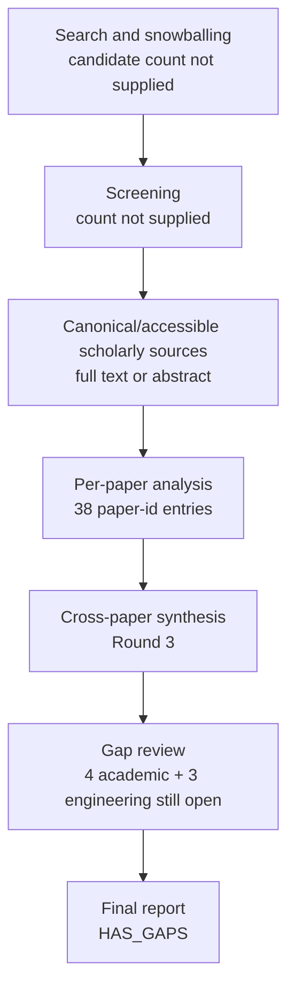

# Research Report: Direct Evidence for Cross-Thread Workplace Work-Matter Identity, Including Cross-Document Business Event Coreference, Enterprise Email/Chat Continuity, and Partial or Evolving Event Identity

## Contents

- [Round History](#round-history)
- [Executive Summary](#executive-summary)
- [Research Question](#research-question)
- [Methodology](#methodology)
- [Papers Reviewed](#papers-reviewed)
- [Research Landscape](#research-landscape)
- [Confidence-Graded Findings](#confidence-graded-findings)
- [Research Gaps](#research-gaps)
- [Practical Recommendations](#practical-recommendations)
- [Evidence Map](#evidence-map)
- [References](#references)
- [Appendix: Run Metadata](#appendix-run-metadata)

## Round History

Iterative gap-closure loop (hard cap: 4 rounds). See
`references/iterative-synthesis.md` for the full loop definition.

| Round | Run ID | Topic / Gap Focus | New Papers | Gaps Addressed | Remaining Gaps |
|-------|--------|-------------------|------------|----------------|----------------|
| 1 | c97ebc819fac | cross-thread topic identity and incremental continuity in work communication | 14 | initial shortlist | 4 academic, 3 engineering |
| 2 | 3a90c92ac2ec | direct evidence for cross-thread workplace work-matter identity, including cross-document business event coreference, enterprise email/chat continuity, and partial or evolving event identity | 25 | 0 resolved | 4 academic, 3 engineering |
| 3 | 5c3438274b84 | Direct enterprise communication evidence for cross-thread work-matter continuity, with emphasis on email/chat conversation linking, business-event coreference, and partial or evolving event identity in organizational workflows. | 13 | academic gaps of the previous round | 4 academic, 3 engineering |

**Stop reason**: another round runs while open academic gaps remain and new papers appear

## Executive Summary

This review investigated how a system can decide whether newly arriving workplace evidence continues an existing concrete work matter, represents a genuinely new matter, or should remain unresolved across independent messages, threads, documents, and communication sources. The 38 reviewed paper-id entries span cross-document event coreference, event identity, record linkage, incremental entity resolution, topic detection and tracking, selective prediction, process/event-case correlation, and limited enterprise email/task evidence. The strongest result is [HIGH] that identity should be established from multiple mutually compatible evidence dimensions rather than from subject, lexical similarity, participant overlap, topic similarity, or any other single signal, and that an explicit reject/uncertain state is methodologically better supported than forced assignment when evidence is weak [1906.01753] [manual-61a7e10e5f] [doi-10-1080-01621459-1969-10501049] [1705.08500]. The most important unresolved gap is [HIGH] that the reviewed literature still does not directly validate longitudinal concrete work-matter identity across enterprise email and chat such as Outlook and Microsoft Teams; therefore workplace-specific feature weights, thresholds, relation semantics, calibration, and production accuracy remain unknown [doi-10-1145-1111449-1111473] [doi-10-1007-s00778-010-0203-9] [doi-10-1109-access-2023-3284053].

**Scope**: 38 paper-id entries analyzed from arXiv, ACL Anthology, publisher sites, institutional repositories, PMC, NIST, conference sites, ResearchGate, SSRN, and other accessible scholarly web sources, covering 1969–2026.  
**Overall Confidence**: High for transfer-level architectural principles; Medium for direct application to msgloom; Low for production-domain accuracy or universal thresholds.  
**Verdict**: HAS_GAPS

## Research Question

The review investigated the following decision problem:

Given a new candidate work-matter span, message, group, attachment-derived item, or cross-source observation and a set of existing stable Topic identities, what evidence justifies one of the following outcomes?

- `CONTINUE` an existing Topic;
- create a `NEW` Topic;
- preserve an `UNCERTAIN` relationship while keeping identities separate;
- issue a later `MERGE` correction;
- issue a later `SPLIT` correction.

The scope includes cross-document event identity, event/entity coreference, event-case correlation, incremental clustering/entity resolution, new-event detection, open-set/selective rejection, partial and evolving event relations, enterprise email/task evidence, and retrieval of additional historical context.

The scope explicitly excludes treating email thread membership, generated Topic titles, subject equality, semantic similarity, ordinary latent-topic models, or participant overlap as Topic identity by definition. It also distinguishes exact identity from weaker relations such as subevent, membership, evolution, or related-but-separate associations.

For msgloom, false merges are particularly dangerous because merging two distinct work matters can remove one due matter from downstream briefing. The intended decision policy therefore requires asymmetrical loss. One useful abstraction is

$L = c_{FM}N_{FM} + c_{FS}N_{FS} + c_{MN}N_{MN} + c_{A}N_{A}$

where $N_{FM}$ is false merges, $N_{FS}$ false splits, $N_{MN}$ missed new matters, and $N_A$ abstentions. The literature supports the existence of such trade-offs but does not determine the msgloom-specific costs $c_{FM}, c_{FS}, c_{MN}, c_A$.

## Methodology

### Search Strategy

- **Sources**: host web search plus full-text or landing-page access through arXiv, ACL Anthology, Springer, ScienceDirect, Nature/Scientific Reports, Wiley, IEEE-related copies, ACM-related author copies, PMC, NIST, institutional repositories, conference sites, ResearchGate, SSRN, and author-hosted PDFs.
- **Query variants**:
  - `direct enterprise communication evidence cross-thread work-matter continuity, emphasis email/chat conversation linking, business-event coreference, partial evolving identity organizational workflows.`
  - `direct enterprise communication`
  - `direct evidence cross-thread work-matter continuity, emphasis email/chat conversation linking, business-event coreference, partial evolving identity organizational workflows.`
  - `enterprise evidence cross-thread work-matter continuity, emphasis email/chat conversation linking, business-event coreference, partial evolving identity organizational workflows.`
  - `communication evidence cross-thread work-matter continuity, emphasis email/chat conversation linking, business-event coreference, partial evolving identity organizational workflows.`
  - `direct enterprise communication evidence cross-thread`
  - `direct enterprise communication work-matter continuity,`
  - `direct enterprise communication emphasis email/chat`
- **Time window**: 1969–2026.
- **Screening**: exact screening implementation was not included in the supplied final-run metadata; no BM25/sub-agent configuration is asserted here.
- **Reading method**: papers were read through the host's web tool at the access levels recorded below. Findings relying on abstract-only papers were interpreted more conservatively than findings backed by full text.

### Access Levels

| Paper ID | Access |
|---|---|
| 1402.4417 | full_text |
| 1412.5687 | full_text |
| 1705.08500 | full_text |
| 1707.07344 | full_text |
| 1906.01753 | full_text |
| 2011.12249 | full_text |
| 2104.05022 | full_text |
| 2109.06417 | full_text |
| 2407.11988 | full_text |
| doi-10-1002-asi-21264 | full_text |
| doi-10-1002-sim-4780140510 | abstract_only |
| doi-10-1007-978-3-030-33223-5-12 | full_text |
| doi-10-1007-978-3-030-49461-2-23 | full_text |
| doi-10-1007-978-3-540-27868-9-84 | full_text |
| doi-10-1007-s00778-010-0203-9 | abstract_only |
| doi-10-1007-s10115-019-01430-6 | full_text |
| doi-10-1016-j-ipm-2025-104085 | full_text |
| doi-10-1038-s41598-025-32765-6 | full_text |
| doi-10-1038-s41598-026-40637-w | full_text |
| doi-10-1080-01621459-1969-10501049 | full_text |
| doi-10-1109-access-2023-3284053 | full_text |
| doi-10-1109-icpm57379-2022-9980684 | full_text |
| doi-10-1145-1111449-1111473 | full_text |
| doi-10-1145-290941-290953 | abstract_only |
| doi-10-1145-354756-354843 | full_text |
| doi-10-18653-v1-2020-coling-main-275 | full_text |
| doi-10-18653-v1-2022-emnlp-main-58 | full_text |
| doi-10-18653-v1-2023-emnlp-main-294 | full_text |
| doi-10-2139-ssrn-7284343 | abstract_only |
| doi-10-3115-1220575-1220591 | full_text |
| doi-10-3115-v1-w14-2910 | full_text |
| manual-03d6dfa532 | full_text |
| manual-35bac66e3c | full_text |
| manual-5c20fb0229 | abstract_only |
| manual-61a7e10e5f | full_text |
| manual-c43ffe3135 | full_text |
| manual-e988e24127 | full_text |
| manual-f56d02b8f9 | abstract_only |

### Pipeline Summary

| Metric | Count |
|--------|-------|
| Total candidates | Unknown; not supplied in final-run metadata |
| After screening | Unknown; not supplied |
| Downloaded | Unknown; access was via the host web tool and supplied source URLs |
| Successfully converted | Unknown; conversion count not supplied |
| Deeply analyzed | 38 paper-id entries represented in the synthesis |
| Iterations (if system-building) | 3 completed rounds of a maximum 4 |

Two duplicate work pairs are present among the 38 identifiers: [1906.01753] and [manual-e988e24127] refer to the same titled Barhom et al. work, while [2109.06417] and [manual-c43ffe3135] refer to the same titled Pratapa et al. work. The count therefore represents reviewed paper-id entries, not 38 independent publications.

## Papers Reviewed

| # | Title | Authors | Year | Venue | Quality Score | Relevance |
|---|-------|---------|------|-------|--------------|-----------|
| 1 | Event correlation for process discovery from Web service interaction logs [doi-10-1007-s00778-010-0203-9] | Hamid Reza Motahari-Nezhad, Regis Saint-Paul, Fabio Casati et al. | 2011 | VLDB Journal | Not supplied | MEDIUM |
| 2 | Evaluation for Partial Event Coreference [doi-10-3115-v1-w14-2910] | Jun Araki, Eduard Hovy, Teruko Mitamura | 2014 | ACL workshop proceedings | Not supplied | HIGH |
| 3 | Cross-document Event Identity via Dense Annotation [2109.06417] | Adithya Pratapa, Zhengzhong Liu, Kimihiro Hasegawa et al. | 2021 | Not supplied | Not supplied | HIGH |
| 4 | Conformal selective prediction with cost aware deferral for safe clinical triage under distribution shift [doi-10-1038-s41598-026-40637-w] | Hyun Kwon, Dae-Jin Kim | 2026 | Scientific Reports | Not supplied | MEDIUM |
| 5 | Event Coreference Resolution with their Paraphrases and Argument-aware Embeddings [doi-10-18653-v1-2020-coling-main-275] | Yutao Zeng, Xiaolong Jin, Saiping Guan et al. | 2020 | COLING | Not supplied | HIGH |
| 6 | Improving Accuracy and Explainability in Event-Case Correlation via Rule Mining [doi-10-1109-icpm57379-2022-9980684] | Dina Sayed Bayomie Sobh, Kate Revoredo, Claudio Di Ciccio et al. | 2022 | ICPM | Not supplied | HIGH |
| 7 | Step-by-Step Case ID Identification Based on Activity Connection for Cross-Organizational Process Mining [doi-10-1109-access-2023-3284053] | Kazuki Tajima, Bojian Du, Yoshiaki Narusue et al. | 2023 | IEEE Access | Not supplied | HIGH |
| 8 | A hybrid learning system for recognizing user tasks from desktop activities and email messages [doi-10-1145-1111449-1111473] | Jianqiang Shen, Lida Li, Thomas G. Dietterich et al. | 2006 | ACM IUI | Not supplied | HIGH |
| 9 | Post-Hoc Uncertainty Calibration for Domain Drift Scenarios [manual-03d6dfa532] | Christian Tomani, Sebastian Gruber, Muhammed Ebrar Erdem et al. | 2021 | Not supplied | Not supplied | MEDIUM |
| 10 | Event Coreference Resolution by Iteratively Unfolding Inter-dependencies among Events [1707.07344] | Prafulla Kumar Choubey, Ruihong Huang | 2017 | Not supplied | Not supplied | HIGH |
| 11 | Improving cross-document event coreference resolution by discourse coherence and structure [doi-10-1016-j-ipm-2025-104085] | Xinyu Chen, Peifeng Li, Qiaoming Zhu | 2025 | Information Processing & Management | Not supplied | HIGH |
| 12 | A Theory for Record Linkage [doi-10-1080-01621459-1969-10501049] | Ivan P. Fellegi, Alan B. Sunter | 1969 | Journal of the American Statistical Association | Not supplied | HIGH |
| 13 | Semantic Relations between Events and their Time, Locations and Participants for Event Coreference Resolution [manual-61a7e10e5f] | Agata Cybulska, Piek Vossen | 2013 | Not supplied | Not supplied | HIGH |
| 14 | Topic Detection and Tracking Evaluation Overview [manual-5c20fb0229] | Jonathan G. Fiscus, George R. Doddington | 2002 | NIST publication | Not supplied | HIGH |
| 15 | Cross-document Event Identity via Dense Annotation [manual-c43ffe3135] | Adithya Pratapa, Zhengzhong Liu, Kimihiro Hasegawa et al. | 2021 | Not supplied | Not supplied | HIGH |
| 16 | Using a sledgehammer to crack a nut? Lexical diversity and event coreference resolution [manual-f56d02b8f9] | Agata Cybulska, Piek Vossen | 2014 | Not supplied | Not supplied | HIGH |
| 17 | WEC: Deriving a Large-scale Cross-document Event Coreference dataset from Wikipedia [2104.05022] | Alon Eirew, Arie Cattan, Ido Dagan | 2021 | Not supplied | Not supplied | HIGH |
| 18 | Generalizing Cross-Document Event Coreference Resolution Across Multiple Corpora [2011.12249] | Michael Bugert, Nils Reimers, Iryna Gurevych | 2020 | Computational Linguistics / ACL-hosted version | Not supplied | HIGH |
| 19 | First Story Detection In TDT Is Hard [doi-10-1145-354756-354843] | James Allan, Victor Lavrenko, Hubert Jin | 2000 | ACM proceedings | Not supplied | HIGH |
| 20 | Incremental Multi-source Entity Resolution for Knowledge Graph Completion [doi-10-1007-978-3-030-49461-2-23] | Alieh Saeedi, Eric Peukert, Erhard Rahm | 2020 | Springer proceedings | Not supplied | HIGH |
| 21 | Towards Open World Recognition [1412.5687] | Abhijit Bendale, Terrance E. Boult | 2014 | Not supplied | Not supplied | HIGH |
| 22 | Incremental Entity Resolution from Linked Documents [1402.4417] | Pankaj Malhotra, Puneet Agarwal, Gautam Shroff | 2014 | Not supplied | Not supplied | HIGH |
| 23 | Probabilistic linkage of large public health data files [doi-10-1002-sim-4780140510] | Matthew A. Jaro | 1995 | Statistics in Medicine | Not supplied | MEDIUM |
| 24 | Revisiting Joint Modeling of Cross-document Entity and Event Coreference Resolution [manual-e988e24127] | Shany Barhom, Vered Shwartz, Alon Eirew et al. | 2019 | Not supplied | Not supplied | HIGH |
| 25 | Selective Classification for Deep Neural Networks [1705.08500] | Yonatan Geifman, Ran El-Yaniv | 2017 | Not supplied | Not supplied | HIGH |
| 26 | Case notion discovery and recommendation: automated event log building on databases [doi-10-1007-s10115-019-01430-6] | E. González López de Murillas, Hajo A. Reijers, Wil M. P. van der Aalst | 2019 | Knowledge and Information Systems | Not supplied | MEDIUM |
| 27 | Cross-document Event Coreference Search: Task, Dataset and Modeling [doi-10-18653-v1-2022-emnlp-main-58] | Alon Eirew, Avi Caciularu, Ido Dagan | 2022 | EMNLP | Not supplied | HIGH |
| 28 | Multimodal Cross-Document Event Coreference Resolution via Contrastive Evidence Reasoning [doi-10-2139-ssrn-7284343] | Xue Qiao, Fei Li, Yanfeng Hu et al. | 2026 | SSRN preprint | Not supplied | MEDIUM |
| 29 | A Study of Retrospective and On-Line Event Detection [doi-10-1145-290941-290953] | Yiming Yang, Thomas Pierce, Jaime G. Carbonell | 1998 | ACM proceedings | Not supplied | HIGH |
| 30 | Generating Harder Cross-document Event Coreference Resolution Datasets using Metaphoric Paraphrasing [2407.11988] | Shafiuddin Rehan Ahmed, Zhiyong Eric Wang, George Arthur Baker et al. | 2024 | Not supplied | Not supplied | HIGH |
| 31 | Argument centric causal intervention for cross document event coreference resolution [doi-10-1038-s41598-025-32765-6] | Long Yao, Wenzhong Yang, Yabo Yin et al. | 2025 | Scientific Reports | Not supplied | HIGH |
| 32 | A Two-Stage Classifier with Reject Option for Text Categorisation [doi-10-1007-978-3-540-27868-9-84] | Giorgio Fumera, Ignazio Pillai, Fabio Roli | 2004 | Springer proceedings | Not supplied | HIGH |
| 33 | New event detection and topic tracking in Turkish [doi-10-1002-asi-21264] | Fazli Can, Seyit Kocberber, Ozgur Baglioglu et al. | 2010 | Journal of the American Society for Information Science and Technology | Not supplied | HIGH |
| 34 | Using Names and Topics for New Event Detection [doi-10-3115-1220575-1220591] | Giridhar Kumaran, James Allan | 2005 | ACL proceedings | Not supplied | HIGH |
| 35 | Detecting Subevent Structure for Event Coreference Resolution [manual-35bac66e3c] | Jun Araki, Zhengzhong Liu, Eduard Hovy et al. | 2014 | LREC-related publication | Not supplied | HIGH |
| 36 | Cross-Document Event Coreference Resolution on Discourse Structure [doi-10-18653-v1-2023-emnlp-main-294] | Xinyu Chen, Sheng Xu, Peifeng Li et al. | 2023 | EMNLP | Not supplied | HIGH |
| 37 | Revisiting Joint Modeling of Cross-document Entity and Event Coreference Resolution [1906.01753] | Shany Barhom, Vered Shwartz, Alon Eirew et al. | 2019 | Not supplied | Not supplied | HIGH |
| 38 | A Probabilistic Approach to Event-Case Correlation for Process Mining [doi-10-1007-978-3-030-33223-5-12] | Dina Bayomie, Claudio Di Ciccio, Marcello La Rosa et al. | 2019 | Springer proceedings | Not supplied | HIGH |

## Research Landscape

### Theme 1: Multi-Signal Evidence for Identity

**Coverage**: multiple event-coreference, new-event, record-linkage, and process-correlation papers | **Confidence**: High  
**Supporting papers**: [1906.01753], [doi-10-3115-1220575-1220591], [manual-61a7e10e5f], [doi-10-1109-icpm57379-2022-9980684]

Across several research traditions, exact identity is not reliably reducible to semantic or lexical resemblance. Cross-document event coreference benefits from interactions among event triggers, arguments, entities, participants, time, location, and broader cluster context [1906.01753] [manual-61a7e10e5f]. New-event detection similarly benefits from combining named entities with topical evidence rather than relying on either alone [doi-10-3115-1220575-1220591]. Process-correlation research adds structured association and mined-rule evidence, showing that constraints external to surface wording can improve correlation decisions [doi-10-1109-icpm57379-2022-9980684].

Key findings:

1. [HIGH] Event/work-matter identity should be modeled as compatibility over multiple evidence dimensions, not as a single similarity score derived only from wording [1906.01753] [manual-61a7e10e5f].
2. [HIGH] Names, participants, or topic information can help, but they remain evidence rather than identity keys because superficially similar observations may refer to distinct events [doi-10-3115-1220575-1220591] [1906.01753].
3. [MEDIUM] Workflow/process rules are plausible additional evidence for enterprise work-matter identity, although the reviewed process-correlation tasks are not direct email/chat identity benchmarks [doi-10-1109-icpm57379-2022-9980684].

### Theme 2: Cross-Document and Global Context

**Coverage**: 3 central papers plus supporting retrieval work | **Confidence**: High  
**Supporting papers**: [1707.07344], [doi-10-18653-v1-2023-emnlp-main-294], [doi-10-1016-j-ipm-2025-104085], [doi-10-18653-v1-2022-emnlp-main-58]

Local mention/sentence representations leave useful identity evidence unused. Iterative propagation can expose dependencies among related events and arguments [1707.07344]. Cross-document discourse structures provide context beyond individual event sentences [doi-10-18653-v1-2023-emnlp-main-294] [doi-10-1016-j-ipm-2025-104085]. Search-oriented event-coreference work further supports retrieving additional evidence relevant to an event query rather than assuming all evidence is already locally available [doi-10-18653-v1-2022-emnlp-main-58].

Key findings:

1. [HIGH] Cross-document context can improve identity inference beyond purely local representations [1707.07344] [doi-10-18653-v1-2023-emnlp-main-294] [doi-10-1016-j-ipm-2025-104085].
2. [MEDIUM] Phase 2 evidence retrieval is technically well motivated, but its msgloom-specific retrieval horizon, stopping policy, and incremental decision value remain unvalidated [doi-10-18653-v1-2022-emnlp-main-58] [1707.07344].

### Theme 3: Explicit Uncertainty, Rejection, and Open-World Decisions

**Coverage**: classical linkage, open-world recognition, selective classification, reject-option text classification | **Confidence**: High  
**Supporting papers**: [doi-10-1080-01621459-1969-10501049], [1412.5687], [1705.08500], [doi-10-1007-978-3-540-27868-9-84]

The literature provides strong support for a decision region between positive identity and definite non-identity. Classical record linkage explicitly separates link, possible link, and non-link regions [doi-10-1080-01621459-1969-10501049]. Open-world recognition and selective classification formalize withholding decisions when unknown-class or error risk is high [1412.5687] [1705.08500]. Text classification with a reject option demonstrates the same mechanism in a textual setting [doi-10-1007-978-3-540-27868-9-84].

A generic selective rule can be represented as

$\hat{y}(x)=
\begin{cases}
\arg\max_y p(y\mid x), & \max_y p(y\mid x)\ge \tau \\
\text{UNCERTAIN}, & \text{otherwise}
\end{cases}$

but the literature does not determine msgloom's threshold $\tau$ or whether a single scalar threshold is sufficient.

Key findings:

1. [HIGH] UNCERTAIN/reject should be first-class, not an implementation failure state [doi-10-1080-01621459-1969-10501049] [1412.5687] [1705.08500].
2. [HIGH] Lower accepted-decision risk generally trades against lower coverage, so an abstention policy must be evaluated jointly on risk and coverage rather than accuracy alone [1705.08500].
3. [MEDIUM] The exact mapping from selective-prediction confidence to `CONTINUE`, `NEW`, and `UNCERTAIN` remains application-specific.

### Theme 4: Incremental Identity and Later Repair

**Coverage**: 2 central incremental entity-resolution papers | **Confidence**: High  
**Supporting papers**: [1402.4417], [doi-10-1007-978-3-030-49461-2-23]

Incremental entity-resolution systems demonstrate that incoming evidence need not trigger complete batch recomputation. Existing state can be updated locally, and prior assignments can be merged or reclustered when new evidence changes the best explanation [1402.4417] [doi-10-1007-978-3-030-49461-2-23].

Key findings:

1. [HIGH] Incremental resolution with local repair is feasible and compatible with stable higher-level identities [1402.4417] [doi-10-1007-978-3-030-49461-2-23].
2. [MEDIUM] These papers support the mechanism of revision but do not specify msgloom's stable Topic-ID, assessment-version, supersession, or immutable-lineage semantics.

### Theme 5: NEW Is Harder Than CONTINUE

**Coverage**: classic TDT and new-event detection work | **Confidence**: High  
**Supporting papers**: [doi-10-1145-290941-290953], [doi-10-1145-354756-354843], [doi-10-1002-asi-21264], [manual-5c20fb0229]

Topic detection and tracking distinguishes detection of a previously unseen event from tracking an event whose identity is already represented. First-story detection is particularly difficult [doi-10-1145-354756-354843], and work comparing detection with tracking supports different operating characteristics for these tasks [doi-10-1145-290941-290953] [doi-10-1002-asi-21264].

Key findings:

1. [HIGH] Failure to find a confident existing match does not prove that the item is a new matter [doi-10-1145-354756-354843] [doi-10-1002-asi-21264].
2. [HIGH] `NEW` and `UNCERTAIN` therefore require distinct evaluation rather than treating `NEW` as the complement of `CONTINUE`.

### Theme 6: Partial, Evolving, and Non-Transitive Event Relations

**Coverage**: dense event identity, partial coreference, and subevent research | **Confidence**: High  
**Supporting papers**: [2109.06417], [manual-c43ffe3135], [manual-35bac66e3c], [doi-10-3115-v1-w14-2910]

Dense event-identity annotation and partial-coreference research show that event relationships include more than full equivalence. Membership, subevent, and spatiotemporal-continuity relations can express meaningful relatedness without satisfying flat transitive identity [2109.06417] [manual-35bac66e3c] [doi-10-3115-v1-w14-2910].

Key findings:

1. [HIGH] Exact identity must be kept semantically separate from subevent, membership, evolution/continuity, and related-but-separate relations [2109.06417] [manual-35bac66e3c].
2. [HIGH] Unrestricted transitive closure across heterogeneous relations is unsafe [doi-10-3115-v1-w14-2910] [2109.06417].
3. [LOW] The correct mapping from these academic relation types to concrete workplace `CONTINUE`, `RELATED-BUT-SEPARATE`, `MERGE`, or `SPLIT` semantics is not established by the reviewed literature.

### Theme 7: Benchmark Difficulty, Hard Negatives, and Lexical Diversity

**Coverage**: several event-coreference robustness studies | **Confidence**: High  
**Supporting papers**: [1906.01753], [2407.11988], [doi-10-1038-s41598-025-32765-6], [manual-f56d02b8f9]

Strong performance on conventional event-coreference benchmarks can depend heavily on dataset structure and lexical regularity. Harder paraphrasing and argument-focused evaluations expose cases where the same or similar trigger corresponds to different events and cases where the same event is described with different wording [2407.11988] [doi-10-1038-s41598-025-32765-6]. This reinforces earlier concerns over lexical diversity [manual-f56d02b8f9].

Key findings:

1. [HIGH] Benchmark evaluation should contain both same-surface/different-identity hard negatives and different-surface/same-identity positives [2407.11988] [doi-10-1038-s41598-025-32765-6].
2. [HIGH] Lexical agreement is useful evidence but cannot safely establish work-matter identity [1906.01753] [manual-f56d02b8f9].

### Theme 8: Domain Shift and Calibration

**Coverage**: cross-corpus event coreference plus calibration/selective-prediction studies | **Confidence**: High for transfer principle, Medium for msgloom-specific behavior  
**Supporting papers**: [2011.12249], [manual-03d6dfa532], [doi-10-1038-s41598-026-40637-w]

Cross-corpus coreference evaluation demonstrates substantial generalization problems when systems move between datasets [2011.12249]. Calibration work shows that probabilities calibrated under one distribution can become overconfident under domain drift [manual-03d6dfa532]. More recent selective/conformal work reinforces the need to account for distribution shift when deferral decisions have unequal cost [doi-10-1038-s41598-026-40637-w].

Key findings:

1. [HIGH] Thresholds or confidence mappings learned on ECB+, Wikipedia, news, process logs, or unrelated domains should not be transferred unchanged to workplace streams [2011.12249] [manual-03d6dfa532].
2. [MEDIUM] Drift-aware or conformal mechanisms are promising for controlling selective decisions, but guarantees established in other tasks do not automatically transfer to evolving workplace clustering [doi-10-1038-s41598-026-40637-w].

### Theme 9: Enterprise and Workflow Evidence

**Coverage**: enterprise email task recognition plus business-process/event-case correlation | **Confidence**: Medium  
**Supporting papers**: [doi-10-1145-1111449-1111473], [doi-10-1007-978-3-030-33223-5-12], [doi-10-1109-access-2023-3284053], [doi-10-1109-icpm57379-2022-9980684], [doi-10-1007-s00778-010-0203-9]

The closest enterprise evidence shows that sender, recipient, subject, temporal activity relations, process structure, and mined business rules can be predictive or useful for correlation [doi-10-1145-1111449-1111473] [doi-10-1109-access-2023-3284053] [doi-10-1109-icpm57379-2022-9980684]. However, task classification, process case correlation, and Web-service process discovery have different label semantics from longitudinal concrete work-matter identity.

Key findings:

1. [MEDIUM] Communication metadata and workflow relations are credible candidate features for msgloom [doi-10-1145-1111449-1111473] [doi-10-1109-access-2023-3284053].
2. [LOW] The literature does not show that these features are sufficient for cross-thread Outlook/Teams matter identity.
3. [LOW] No reviewed paper directly establishes production accuracy for a work matter moving between independent enterprise email threads, chat, and attachments.

## Methodology Comparison

| Approach | Papers | Strengths | Weaknesses | Best For | Performance |
|----------|--------|-----------|------------|----------|-------------|
| Pairwise/joint event coreference | [1906.01753] [doi-10-18653-v1-2020-coling-main-275] [1707.07344] | Rich semantic and argument evidence; models identity directly | Benchmark/domain dependence; often assumes detected/gold event mentions | Exact cross-document event identity | Metrics vary across corpora; no directly comparable unified baseline in supplied synthesis |
| Discourse/global-context coreference | [doi-10-18653-v1-2023-emnlp-main-294] [doi-10-1016-j-ipm-2025-104085] | Exploits cross-document structure beyond local sentences | More context and candidate-management complexity | Cases where local evidence is insufficient | Reported improvements are paper-specific; not directly transferable to workplace streams |
| Classical probabilistic record linkage | [doi-10-1080-01621459-1969-10501049] [doi-10-1002-sim-4780140510] | Explicit evidence weighting and possible-link region | Feature independence/model assumptions may not fit language-rich event identity | Conservative link/non-link/possible-link decisions | No msgloom-specific measurements |
| Selective/reject/open-world classification | [1412.5687] [1705.08500] [doi-10-1007-978-3-540-27868-9-84] | Direct mechanism for abstention and risk/coverage control | Does not itself determine semantic identity or feature design | UNCERTAIN/reject policy | Transfer-level support only |
| Incremental entity resolution | [1402.4417] [doi-10-1007-978-3-030-49461-2-23] | Incremental updates and local repair | Entity-resolution semantics differ from work matters | Stable incremental identity with later correction | Can approach batch behavior in studied domains; exact msgloom performance unknown |
| New-event detection / TDT | [doi-10-1145-290941-290953] [doi-10-1145-354756-354843] [doi-10-1002-asi-21264] | Explicitly separates first-story detection from tracking | News-topic/event semantics differ from workplace matters | `NEW` versus known-matter tracking | Strong qualitative evidence that first-story detection is harder |
| Partial/subevent relation modeling | [2109.06417] [doi-10-3115-v1-w14-2910] [manual-35bac66e3c] | Represents meaningful non-equivalence relations | Requires richer relation schema and evaluation | Evolving/partial work matters | No workplace mapping available |
| Event-case/process correlation | [doi-10-1007-978-3-030-33223-5-12] [doi-10-1109-icpm57379-2022-9980684] [doi-10-1109-access-2023-3284053] | Uses workflow structure, rules, temporal/activity constraints | Often assumes process structure and may force case assignment | Structured business-process evidence | Domain/task-specific results; not a direct work-matter benchmark |
| Enterprise task recognition | [doi-10-1145-1111449-1111473] | Directly involves enterprise email and desktop activity | Predicts predefined user task labels, not cross-thread identity | Candidate enterprise metadata features | Not comparable to identity/coreference metrics |
| Retrieval-oriented coreference | [doi-10-18653-v1-2022-emnlp-main-58] | Supports evidence seeking beyond initial local context | Retrieval errors, latency, bounds, and stopping require evaluation | Phase 2 investigation | msgloom-specific decision gain unknown |

## Confidence-Graded Findings

### 🟢 High Confidence (supported by 3+ papers with consistent results)

1. **[HIGH] Concrete event identity is better supported by multiple compatible evidence dimensions than by lexical, topical, participant, or action similarity in isolation.** Arguments/entities, names plus topical context, temporal/spatial compatibility, and structured constraints repeatedly contribute useful evidence [1906.01753] [doi-10-3115-1220575-1220591] [manual-61a7e10e5f] [doi-10-1109-icpm57379-2022-9980684].

2. **[HIGH] Cross-document context can improve identity resolution beyond the local event mention or sentence.** Propagated arguments, global discourse structure, and cross-document discourse add useful context [1707.07344] [doi-10-18653-v1-2023-emnlp-main-294] [doi-10-1016-j-ipm-2025-104085].

3. **[HIGH] An explicit unresolved/reject state is better supported than forced assignment under insufficient evidence.** Link/possible-link/non-link decisions, open-world rejection, selective classification, and reject-option text classification all support this pattern [doi-10-1080-01621459-1969-10501049] [1412.5687] [1705.08500] [doi-10-1007-978-3-540-27868-9-84].

4. **[HIGH] Incremental resolution can revise earlier assignments without requiring full recomputation.** Local reclustering and merging provide a credible transfer mechanism for later `MERGE`/`SPLIT` repair [1402.4417] [doi-10-1007-978-3-030-49461-2-23].

5. **[HIGH] Detecting a genuinely new event is harder than tracking an already established event/topic.** Therefore `NEW` must not be treated as the automatic complement of a failed `CONTINUE` match [doi-10-1145-290941-290953] [doi-10-1145-354756-354843] [doi-10-1002-asi-21264].

6. **[HIGH] Partial, membership, subevent, and spatiotemporal-continuity relations cannot safely be collapsed into flat transitive identity.** These relations encode relatedness that may not be equivalence [2109.06417] [manual-35bac66e3c] [doi-10-3115-v1-w14-2910].

7. **[HIGH] Hard negatives and lexical diversity are essential for realistic identity evaluation.** Systems can exploit benchmark structure or lexical regularity and then deteriorate on paraphrased or superficially similar-but-distinct events [1906.01753] [2407.11988] [doi-10-1038-s41598-025-32765-6] [manual-f56d02b8f9].

8. **[HIGH] Event-identity models and confidence estimates are vulnerable to domain shift.** Cross-corpus performance and post-hoc calibration both degrade when distributions change [2011.12249] [manual-03d6dfa532] [doi-10-1038-s41598-026-40637-w].

### 🟡 Medium Confidence (supported by 1-2 papers or with caveats)

1. **[MEDIUM] Enterprise communication metadata and business-process structure are useful candidate evidence for work-matter continuity.** Sender, recipient, subject, temporal/activity connections, and workflow rules are useful in adjacent enterprise tasks, but those tasks do not directly label cross-thread work-matter identity [doi-10-1145-1111449-1111473] [doi-10-1109-access-2023-3284053] [doi-10-1109-icpm57379-2022-9980684].

2. **[MEDIUM] Phase 2 evidence seeking should be able to improve some ambiguous identity decisions.** Coreference search and global-context methods demonstrate that relevant evidence may exist outside the initially observed item, but msgloom-specific retrieval benefit is unmeasured [doi-10-18653-v1-2022-emnlp-main-58] [1707.07344].

3. **[MEDIUM] Stable Topic IDs plus versioned corrections are compatible with the literature's incremental-repair mechanisms.** The transfer mechanism is supported, but the exact persistence model is an engineering design rather than a result directly established by these papers [1402.4417] [doi-10-1007-978-3-030-49461-2-23].

### 🔴 Low Confidence (preliminary, single-source, contradicted, or unsupported in the target domain)

1. **[LOW] Any claim that particular evidence weights or thresholds will achieve acceptable production accuracy on Outlook/Teams work-matter identity is unsupported.** No reviewed paper directly evaluates that target task [doi-10-1145-1111449-1111473] [doi-10-1007-s00778-010-0203-9] [doi-10-1109-access-2023-3284053].

2. **[LOW] A universal rule mapping partial or evolving event relations to `CONTINUE`, `RELATED-BUT-SEPARATE`, `MERGE`, or `SPLIT` is not established.** The relation types are well motivated, but workplace semantics remain unresolved [2109.06417] [manual-35bac66e3c] [doi-10-3115-v1-w14-2910].

3. **[LOW] Calibration guarantees from unrelated image, clinical, news, or general classification settings cannot be assumed to hold for evolving workplace identity streams.** They provide mechanisms and hypotheses, not production guarantees [1412.5687] [manual-03d6dfa532] [doi-10-1038-s41598-026-40637-w].

## Trade-Off Analysis

| Decision | Option A | Option B | Recommendation |
|----------|----------|----------|----------------|
| Weak identity evidence | Force best existing Topic or NEW; maximizes coverage but risks false merges and false novelty | Preserve `UNCERTAIN`; lowers automatic coverage but protects identity integrity [doi-10-1080-01621459-1969-10501049] [1705.08500] | Prefer explicit `UNCERTAIN` when evidence does not justify identity |
| Conversation/thread relationship | Treat thread/group as identity key; simple and cheap | Treat ancestry as one evidence dimension only | Use as evidence only; group membership ≠ work-matter identity |
| Semantic similarity | Use embedding/similarity threshold as identity | Combine action/object, entities, time, references, state, and structure [1906.01753] [manual-61a7e10e5f] | Use similarity for candidate generation, not identity proof |
| New-matter decision | `NEW = not CONTINUE` | Evaluate `NEW` independently and retain unresolved region [doi-10-1145-354756-354843] | Separate `NEW`, `CONTINUE`, and `UNCERTAIN` |
| Cluster representation | One flat transitive equivalence relation | Exact identity plus typed weaker relations [2109.06417] [doi-10-3115-v1-w14-2910] | Separate exact identity from evolution/subevent/member relations |
| Incremental updates | Rewrite existing history | Append new assessments and repair links; preserve prior evidence | Stable IDs plus versioned assessments |
| Phase 2 retrieval | Retrieve broad history for every item | Retrieve bounded history when local evidence is insufficient [doi-10-18653-v1-2022-emnlp-main-58] | Conditional bounded retrieval |
| Calibration | Reuse benchmark confidence threshold | Recalibrate under workplace drift and measure risk/coverage [2011.12249] [manual-03d6dfa532] | Domain- and time-aware calibration |
| Evaluation objective | Aggregate cluster F1 only | False merges, false splits, missed NEW, abstention, correction quality, due-work loss | Use asymmetric decision-oriented evaluation |

## Points of Agreement **[EVIDENCE REQUIRED]**

1. **[HIGH] Identity requires evidence beyond surface similarity.** Argument/entity compatibility, names, topic information, temporal/spatial relations, and structural constraints repeatedly provide useful identity evidence [1906.01753] [manual-61a7e10e5f] [doi-10-3115-1220575-1220591].

2. **[HIGH] Uncertainty should be representable explicitly.** Classical linkage, open-world recognition, selective classification, and reject-option text classification all support withholding a positive assignment when evidence is inadequate [doi-10-1080-01621459-1969-10501049] [1412.5687] [1705.08500] [doi-10-1007-978-3-540-27868-9-84].

3. **[HIGH] NEW detection is a separate and difficult problem.** First-story/new-event detection is not equivalent to ordinary known-topic tracking [doi-10-1145-354756-354843] [doi-10-1145-290941-290953] [doi-10-1002-asi-21264].

4. **[HIGH] Incremental systems can support later correction.** New evidence can motivate local reclustering or merging rather than requiring a permanent first decision [1402.4417] [doi-10-1007-978-3-030-49461-2-23].

5. **[HIGH] Benchmark structure matters materially.** Easy topical partitioning, lexical regularity, and corpus-specific assumptions can overstate generalization [1906.01753] [2011.12249] [2407.11988].

6. **[HIGH] Partial/evolving relations require richer semantics than ordinary equivalence clustering.** Subevent, membership, and continuity relations may be meaningful without being fully transitive identity [2109.06417] [manual-35bac66e3c] [doi-10-3115-v1-w14-2910].

## Points of Contradiction **[EVIDENCE REQUIRED]**

1. **[HIGH] Topic pre-clustering: powerful continuity signal versus benchmark-specific overfitting**: strong topic partitioning can substantially simplify event-coreference decisions on ECB+-like data [1906.01753] [manual-e988e24127], while cross-corpus evaluation shows that corpus-specific document-link/topic assumptions generalize poorly [2011.12249].
   - **Possible explanation**: the apparent effectiveness of topic partitioning depends on benchmark structure and candidate distributions.
   - **Implication**: conversation grouping or coarse topical grouping can be used for candidate generation, but should not define Topic identity.

2. **[HIGH] Forced assignment versus explicit uncertainty**: process event-case correlation can formulate assignment so every event enters a case [doi-10-1007-978-3-030-33223-5-12], whereas linkage and selective/open-world approaches explicitly permit possible-link or rejected observations [doi-10-1080-01621459-1969-10501049] [1412.5687] [1705.08500].
   - **Possible explanation**: the process-correlation setting assumes a constrained process population, whereas open-world identity problems admit genuinely unresolved or unseen classes.
   - **Implication**: msgloom should follow the latter formulation because false merges have asymmetric product cost.

3. **[MEDIUM] Simple communication metadata can be highly predictive, but task classification is not identity**: enterprise task recognition found strong predictive value in sender, recipient, and subject [doi-10-1145-1111449-1111473], while event-coreference/new-event work warns that names, topics, and lexical similarity cannot prove identity [doi-10-3115-1220575-1220591] [1906.01753].
   - **Possible explanation**: predefined task classification and concrete instance identity are different label spaces.
   - **Implication**: metadata may be valuable, but feature sufficiency must not be transferred from task classification into work-matter identity.

4. **[HIGH] Flat transitive clusters versus non-transitive partial identity**: mainstream event-coreference datasets and models represent identity through clusters [2104.05022] [1906.01753], while dense/partial identity studies document subevent, membership, and continuity relationships that need not behave as equivalence relations [2109.06417] [manual-c43ffe3135] [manual-35bac66e3c].
   - **Possible explanation**: the two lines of work model different semantic relations.
   - **Implication**: msgloom needs typed relations rather than applying transitive closure indiscriminately.

5. **[MEDIUM] Process constraints can improve correlation but may not uniquely determine identity**: process-conformance information can improve event-case correlation [doi-10-1007-978-3-030-33223-5-12], whereas process discovery from interaction logs permits multiple plausible views/correlations [doi-10-1007-s00778-010-0203-9].
   - **Possible explanation**: structural knowledge is strongest when a trustworthy process model already exists.
   - **Implication**: workflow/state constraints should provide evidence rather than become absolute identity rules.

6. **[HIGH] Strong lexical baselines versus lexical fragility**: lexical/lemma-based strategies can appear surprisingly strong under favorable benchmark partitioning [1906.01753], but paraphrase diversity and argument-centric hard cases expose major weaknesses [2407.11988] [doi-10-1038-s41598-025-32765-6] [manual-f56d02b8f9].
   - **Possible explanation**: benchmark lexical regularity rewards shortcuts that do not encode event identity robustly.
   - **Implication**: msgloom evaluation must deliberately include terminology drift and same-wording/different-matter adversarial cases.

## Research Gaps

All seven gaps remain open. The literature has not answered them yet.

| # | Gap | Type | Severity | Impact on Goals |
|---|-----|------|----------|----------------|
| 1 | **[ACADEMIC] Target-domain evidence combinations for cross-thread work-matter continuity remain unknown.** Rounds searched: 1 (broad baseline), 2, 3. | ACADEMIC | HIGH | Without direct evidence, Phase 1 cannot know which combinations of subject, entities, references, commitments, state, ancestry, and time are sufficient to justify `CONTINUE`. |
| 2 | **[ENGINEERING] msgloom-specific loss function and thresholds remain undefined.** Rounds searched: 1 (broad baseline), 2. | ENGINEERING | HIGH | Determines false-merge/false-split/abstention behavior and therefore report completeness and due-work safety. |
| 3 | **[ENGINEERING] Stable Topic-ID and correction/history semantics remain undefined.** Rounds searched: 1 (broad baseline), 2. | ENGINEERING | HIGH | Required to support append-only evidence, later `MERGE`/`SPLIT`, lineage, and recovery without rewriting source history. |
| 4 | **[ACADEMIC] No direct longitudinal Outlook/Teams-equivalent work-matter identity benchmark has been found.** Rounds searched: 1 (broad baseline), 2, 3. | ACADEMIC | HIGH | Production representativeness and achievable accuracy remain unknown. |
| 5 | **[ACADEMIC] Mapping partial/evolving/non-transitive event relations to workplace work-matter semantics remains unresolved.** Rounds searched: 1 (broad baseline), 2, 3. | ACADEMIC | HIGH | Incorrect mapping can create false merges or false splits when a matter evolves, forks, or contains subevents. |
| 6 | **[ENGINEERING] Operational Phase 2 retrieval policy remains unresolved.** Rounds searched: 1 (broad baseline), 2. | ENGINEERING | MEDIUM | Candidate bounds, latency, stopping, and causal decision benefit must be measured before retrieval can be relied upon. |
| 7 | **[ACADEMIC] Calibration and abstention under non-stationary workplace streams remain unresolved.** Rounds searched: 1 (broad baseline), 2, 3. | ACADEMIC | MEDIUM | Confidence thresholds may become unsafe as projects, vocabulary, teams, or communication behavior change. |

### Academic Gaps (require more papers)

1. **[ACADEMIC][HIGH] Gap 1 — direct evidence combinations for workplace continuity remain unanswered.** Adjacent literature supports arguments/entities, temporal and discourse evidence, metadata, and workflow constraints, but no reviewed study validates the required combination for independent workplace messages and sources [1906.01753] [manual-61a7e10e5f] [doi-10-1145-1111449-1111473] [doi-10-1109-icpm57379-2022-9980684]. Rounds already searched: 1 (broad baseline), 2, 3. Suggested query: `"work item identity" OR "work matter identity" OR "business event coreference" OR "cross-document event coreference"` combined with `email`, `"workplace communication"`, `enterprise`, `cross-thread`, `cross-document`, or `cross-source`.

2. **[ACADEMIC][HIGH] Gap 4 — direct longitudinal enterprise email/chat identity evidence remains unanswered.** The reviewed corpus contains enterprise email task recognition and business-process correlation but no direct benchmark for one concrete matter crossing independent email threads and enterprise chat [doi-10-1145-1111449-1111473] [doi-10-1007-s00778-010-0203-9] [doi-10-1109-access-2023-3284053]. Rounds already searched: 1 (broad baseline), 2, 3. Suggested query: `(enterprise OR workplace OR organizational) AND (email OR "Microsoft Teams" OR "enterprise chat" OR "workplace chat") AND (cross-thread OR longitudinal OR cross-conversation) AND ("topic identity" OR "task tracking" OR "case tracking" OR "event coreference" OR "conversation linking")`.

3. **[ACADEMIC][HIGH] Gap 5 — workplace semantics for partial/evolving identity remain unanswered.** Partial identity, subevents, membership, and spatiotemporal continuity are supported, but no reviewed paper establishes when these relations should map to `CONTINUE`, `RELATED-BUT-SEPARATE`, `MERGE`, or `SPLIT` in organizational work [2109.06417] [manual-35bac66e3c] [doi-10-3115-v1-w14-2910]. Rounds already searched: 1 (broad baseline), 2, 3. Suggested query: `("partial event identity" OR "partial coreference" OR "subevent relation" OR "event evolution" OR "event membership" OR "non-transitive coreference") AND (workflow OR task OR case OR workplace OR enterprise)`.

4. **[ACADEMIC][MEDIUM] Gap 7 — calibration under workplace stream drift remains unanswered.** The literature shows calibration deterioration under shift and supports shift-aware/selective techniques, but no reviewed study establishes reliable coverage or abstention thresholds for evolving workplace coreference/clustering [2011.12249] [manual-03d6dfa532] [doi-10-1038-s41598-026-40637-w]. Rounds already searched: 1 (broad baseline), 2, 3. Suggested query: `("selective classification" OR abstention OR "confidence calibration" OR "selective prediction") AND ("distribution shift" OR nonstationary OR streaming OR "concept drift") AND (text OR NLP OR coreference OR clustering)`.

### Engineering Gaps (fillable without papers)

1. **[ENGINEERING][HIGH] Gap 2 — decision loss and thresholds.** The literature has not answered msgloom's exact false-merge cost, false-split cost, or `CONTINUE`/`NEW`/`UNCERTAIN` thresholds. Rounds already searched: 1 (broad baseline), 2. Suggested resolution: build an independent gold set with deliberately asymmetric decision costs; measure false merges, false splits, new-versus-uncertain errors, abstention, and downstream lost-due-work impact. Select operating points by explicit cost/risk criteria rather than aggregate F1.

2. **[ENGINEERING][HIGH] Gap 3 — stable identity and correction semantics.** The literature has not answered how msgloom should persist Topic identity. Rounds already searched: 1 (broad baseline), 2. Suggested resolution: define immutable Topic IDs independent of labels/thread IDs, append-only identity assessments, typed relation records, supersession, auditable `MERGE`/`SPLIT` corrections, and source/evidence lineage. Test replay and reconstruction from event history.

3. **[ENGINEERING][MEDIUM] Gap 6 — Phase 2 evidence-seeking policy.** The literature has not answered msgloom's candidate bounds, retrieval horizon, stopping rule, or acceptable latency. Rounds already searched: 1 (broad baseline), 2. Suggested resolution: benchmark bounded candidate retrieval under controlled histories and score the marginal identity-decision improvement attributable to retrieved evidence, not retrieval recall alone.

## Reproducibility Notes

The supplied synthesis did not systematically record repository URLs, benchmark download status, or software/data licenses for every paper. Those fields are therefore reported as unknown rather than inferred.

| Paper | Code Available | Data Available | Sufficient Detail | License |
|-------|---------------|----------------|-------------------|---------|
| [1906.01753] | Not established in supplied synthesis | Not established | Full text available | Not established |
| [2011.12249] | Not established | Not established | Full text available | Not established |
| [2104.05022] | Not established | Dataset paper; exact access metadata not supplied here | Full text available | Not established |
| [2109.06417] | Not established | Dataset/annotation details discussed; exact access metadata not supplied here | Full text available | Not established |
| [2407.11988] | Not established | Not established | Full text available | Not established |
| [1402.4417] | Not established | Not established | Full text available | Not established |
| [doi-10-1007-978-3-030-49461-2-23] | Not established | Not established | Full text available | Not established |
| [doi-10-18653-v1-2022-emnlp-main-58] | Not established | Dataset/task details available in full text; distribution metadata not supplied here | Full text available | Not established |
| [doi-10-1109-icpm57379-2022-9980684] | Not established | Not established | Full text available | Not established |
| [doi-10-1145-1111449-1111473] | Not established | Not established | Full text available | Not established |
| [doi-10-1080-01621459-1969-10501049] | Not applicable/unknown | Not applicable/unknown | Full text available | Not established |
| [1705.08500] | Not established | Not established | Full text available | Not established |

For msgloom engineering evaluation, reproducibility should additionally require deterministic fixtures, independent gold labels, clean-workspace replay, explicit source versions, preserved prediction inputs, and regression/mutation tests so that later identity-policy changes can be evaluated against exactly the same evidence.

## Practical Recommendations **[EVIDENCE REQUIRED]**

1. **[HIGH] Require explicit positive evidence before `CONTINUE`; otherwise preserve `UNCERTAIN`.** Do not interpret low similarity to existing Topics as proof of `NEW`. This follows classical possible-link regions and modern selective/reject formulations [doi-10-1080-01621459-1969-10501049] [1412.5687] [1705.08500].

2. **[HIGH] Treat thread ancestry, subject, customer/project names, participant overlap, lexical similarity, and generated Topic titles only as evidence features.** None should be an identity key [doi-10-3115-1220575-1220591] [1906.01753] [2011.12249].

3. **[HIGH] Maintain independently inspectable evidence dimensions.** At minimum, represent action/object semantics, participant/entity compatibility, temporal compatibility, references/artifacts, discourse/reference links, and workflow/state consistency separately so conflicts remain visible [1906.01753] [manual-61a7e10e5f] [doi-10-18653-v1-2023-emnlp-main-294].

4. **[HIGH] Separate exact identity from weaker typed relations.** Preserve subevent, membership, evolution/continuity, and related-but-separate relationships without applying identity transitivity to them [2109.06417] [manual-35bac66e3c] [doi-10-3115-v1-w14-2910].

5. **[MEDIUM] Use stable Topic IDs plus append-only/versioned identity assessments.** New evidence should generate a new assessment and, when required, explicit `MERGE` or `SPLIT` correction links rather than rewriting prior evidence. Incremental entity-resolution research supports local repair as the underlying operational pattern [1402.4417] [doi-10-1007-978-3-030-49461-2-23].

6. **[HIGH] Evaluate `NEW` separately from `CONTINUE`.** Include an explicit unknown/uncertain operating region, because new-event/first-story detection is materially harder than tracking known events [doi-10-1145-354756-354843] [doi-10-1002-asi-21264].

7. **[HIGH] Construct adversarial identity fixtures.** Include same subject/name/participants but different work matters, as well as the same matter with changed thread, terminology, participants, or channel [1906.01753] [2407.11988] [doi-10-1038-s41598-025-32765-6].

8. **[MEDIUM] In Phase 2, retrieve additional historical candidates only when supplied evidence is insufficient.** Measure whether retrieved context changes the final identity decision correctly, not merely whether retrieval returns a historically relevant document [doi-10-18653-v1-2022-emnlp-main-58] [1707.07344].

9. **[HIGH] Do not transfer confidence thresholds from news, Wikipedia, ECB+, process logs, image recognition, or clinical prediction directly into workplace operation.** Recalibration and drift monitoring are necessary [2011.12249] [manual-03d6dfa532] [doi-10-1038-s41598-026-40637-w].

10. **[HIGH] Make false merges a first-class evaluation metric.** Aggregate coreference/clustering scores are insufficient for msgloom because one false merge can cause a distinct due matter to disappear. Report false merges, false splits, `NEW`/`UNCERTAIN` confusion, correction behavior, and downstream lost-work impact [doi-10-3115-v1-w14-2910] [2109.06417].

11. **[MEDIUM] Use workflow or process constraints as supporting evidence, not absolute identity rules.** They can improve correlation when trustworthy but do not uniquely determine a matter in all enterprise settings [doi-10-1007-978-3-030-33223-5-12] [doi-10-1007-s00778-010-0203-9].

12. **[HIGH] Keep Phase 1 conservative and defer evidence seeking to Phase 2.** Phase 1 should link only when supplied evidence positively supports continuation; unresolved candidates should remain separately visible so downstream briefing does not silently lose possible work matters.

## Future Directions

1. Conduct the fourth targeted academic round on direct longitudinal enterprise email/chat work-item or case identity, using strict admission criteria that reject ordinary conversation-thread reconstruction and generic topical similarity.

2. Search workflow/case-management and enterprise collaboration literature for explicit cross-channel case/work-item identifiers, partial-case evolution, task handoff, or case continuity semantics that may use terminology outside NLP coreference.

3. Design a workplace-specific relation ontology separating exact identity, continuation/evolution, submatter/subevent, related-but-separate, supersession, and unresolved relation.

4. Build an independent adversarial benchmark before tuning thresholds. It should include false-merge traps, false-split traps, new-matter cases, multi-matter messages, cross-thread/channel continuation, changing participants, terminology drift, and delayed evidence.

5. Establish a selective decision objective using risk and coverage. For acceptance set $A_\tau=\{x:c(x)\ge\tau\}$, report

$\text{Coverage}(\tau)=\frac{|A_\tau|}{N}$

and

$\text{SelectiveRisk}(\tau)=\frac{1}{|A_\tau|}\sum_{x\in A_\tau}\ell(\hat y(x),y(x))$

with a loss $\ell$ that penalizes false merges more heavily than benign abstention.

6. Evaluate correction quality separately from initial assignment quality: whether later evidence produces the correct merge/split, whether prior history remains reconstructible, and whether reports before and after correction preserve every due matter.

7. Evaluate Phase 2 retrieval causally: compare identity decisions with and without each retrieved evidence unit and quantify useful decision changes versus additional latency and false evidence.

## Readiness Assessment (System-Building Mode)

### Verdict: HAS_GAPS

### Assessment Summary

The synthesis is sufficient to define a conservative architecture and an engineering validation programme, but it is not sufficient to claim production-ready workplace identity accuracy. The literature strongly supports multi-signal evidence, explicit uncertainty, separate NEW detection, incremental repair, typed non-equivalence relations, and drift-aware evaluation. Direct enterprise email/chat identity evidence, workplace relation semantics, msgloom-specific loss/thresholds, and production calibration remain open.

### Coverage Matrix

| Dimension | Status | Evidence |
|-----------|--------|----------|
| Architecture patterns | ✅ Sufficient at transfer level | Multi-signal identity [1906.01753], rejection [doi-10-1080-01621459-1969-10501049], incremental repair [1402.4417], typed partial relations [2109.06417] |
| Technology stack | ❌ Missing / not a literature question answered here | Reviewed papers do not determine msgloom implementation stack |
| Performance baselines | ⚠️ Partial | Cross-corpus/coreference/TDT results establish difficulty, but there is no target-domain Outlook/Teams baseline [2011.12249] [doi-10-1145-354756-354843] |
| Security model | ❌ Missing / outside this Topic's evidence | No reviewed paper establishes msgloom permissions/security architecture |
| Trade-off map | ✅ Sufficient conceptually, ⚠️ uncalibrated operationally | Reject/risk trade-offs [1705.08500], linkage decision regions [doi-10-1080-01621459-1969-10501049], domain-shift concerns [manual-03d6dfa532] |
| Enterprise-domain representativeness | ❌ Missing | Enterprise evidence is adjacent rather than direct [doi-10-1145-1111449-1111473] [doi-10-1109-access-2023-3284053] |
| Correction semantics | ⚠️ Partial | Incremental repair exists [1402.4417] [doi-10-1007-978-3-030-49461-2-23], but msgloom history semantics are not defined |
| Uncertainty/abstention mechanism | ✅ Sufficient conceptually | [doi-10-1080-01621459-1969-10501049] [1412.5687] [1705.08500] |
| Partial/evolving identity model | ⚠️ Partial | Relation phenomenon established [2109.06417] [doi-10-3115-v1-w14-2910], workplace mapping unresolved |

### Gap Resolution Plan

| # | Gap | Type | Severity | Resolution |
|---|-----|------|----------|------------|
| 1 | **[ACADEMIC] Workplace evidence combinations** | ACADEMIC | HIGH | Fourth-round targeted search plus strict admission for actual cross-thread/cross-source work-item identity evidence |
| 2 | **[ENGINEERING] Decision loss and thresholds** | ENGINEERING | HIGH | Build independent gold/adversarial fixtures; optimize asymmetric false-merge-aware decision risk and coverage |
| 3 | **[ENGINEERING] Stable IDs and correction history** | ENGINEERING | HIGH | Specify append-only identity-assessment model, typed links, supersession, merge/split, lineage, replay tests |
| 4 | **[ACADEMIC] Direct Outlook/Teams-equivalent longitudinal evidence** | ACADEMIC | HIGH | Target enterprise collaboration, work-item tracking, case management, cross-channel enterprise communication literature |
| 5 | **[ACADEMIC] Partial/evolving relation semantics** | ACADEMIC | HIGH | Search workflow/task/case literature for event evolution and partial identity; preserve unresolved mappings until evidence or project decisions exist |
| 6 | **[ENGINEERING] Bounded Phase 2 retrieval** | ENGINEERING | MEDIUM | Measure candidate generation, stopping, latency, and causal effect on identity correctness |
| 7 | **[ACADEMIC] Calibration under workplace drift** | ACADEMIC | MEDIUM | Target streaming NLP/coreference/selective-prediction drift literature; then validate empirically on workplace-like sequential data |

## Evidence Map

| Research Question Aspect | Core Evidence | Supporting Evidence | Status |
|--------------------------|---------------|---------------------|--------|
| What establishes same-event identity across documents? | [1906.01753] [manual-61a7e10e5f] | [doi-10-18653-v1-2020-coling-main-275] [doi-10-3115-1220575-1220591] | Strong transfer evidence; workplace-specific combination open |
| Identity versus similarity | [1906.01753] [2407.11988] | [doi-10-1038-s41598-025-32765-6] [manual-f56d02b8f9] | Strong |
| Use of global/cross-document context | [1707.07344] [doi-10-18653-v1-2023-emnlp-main-294] | [doi-10-1016-j-ipm-2025-104085] | Strong |
| `CONTINUE` versus uncertainty/rejection | [doi-10-1080-01621459-1969-10501049] [1705.08500] | [1412.5687] [doi-10-1007-978-3-540-27868-9-84] | Strong transfer evidence |
| `NEW` detection | [doi-10-1145-354756-354843] [doi-10-1145-290941-290953] | [doi-10-1002-asi-21264] [manual-5c20fb0229] | Strong transfer evidence |
| Incremental assignment and repair | [1402.4417] [doi-10-1007-978-3-030-49461-2-23] | — | Strong mechanism, product semantics open |
| Merge/split history semantics | [1402.4417] | [doi-10-1007-978-3-030-49461-2-23] | Engineering gap |
| Partial/evolving/non-transitive identity | [2109.06417] [doi-10-3115-v1-w14-2910] | [manual-35bac66e3c] [manual-c43ffe3135] | Relation phenomenon strong; workplace mapping open |
| Participant/entity evidence | [1906.01753] [manual-61a7e10e5f] | [doi-10-3115-1220575-1220591] | Strong transfer evidence |
| Temporal/location evidence | [manual-61a7e10e5f] | [doi-10-1109-access-2023-3284053] | Moderate-to-strong transfer evidence |
| Process/workflow constraints | [doi-10-1109-icpm57379-2022-9980684] [doi-10-1007-978-3-030-33223-5-12] | [doi-10-1007-s00778-010-0203-9] | Useful but not uniquely identifying |
| Enterprise communication metadata | [doi-10-1145-1111449-1111473] | [doi-10-1109-access-2023-3284053] | Adjacent evidence only |
| Direct cross-thread enterprise work-matter identity | — | [doi-10-1145-1111449-1111473] [doi-10-1007-s00778-010-0203-9] | Open academic gap |
| Phase 2 historical evidence retrieval | [doi-10-18653-v1-2022-emnlp-main-58] | [1707.07344] [doi-10-18653-v1-2023-emnlp-main-294] | Transfer support; operational policy open |
| Hard-negative evaluation | [2407.11988] [doi-10-1038-s41598-025-32765-6] | [1906.01753] [manual-f56d02b8f9] | Strong |
| Cross-corpus generalization | [2011.12249] | [1906.01753] | Strong concern |
| Calibration under drift | [manual-03d6dfa532] [doi-10-1038-s41598-026-40637-w] | [1705.08500] | Strong transfer concern; workplace validation open |
| False-merge-aware evaluation | [doi-10-3115-v1-w14-2910] [2109.06417] | [doi-10-1080-01621459-1969-10501049] | Strong design implication |
| Stable identity independent of title/thread | [1402.4417] [doi-10-1007-978-3-030-49461-2-23] | broader project requirement | Transfer support; exact persistence design open |

## References

1. [doi-10-1007-s00778-010-0203-9] — Event correlation for process discovery from Web service interaction logs. Hamid Reza Motahari-Nezhad, Regis Saint-Paul, Fabio Casati et al. 2011. VLDB Journal.
2. [doi-10-3115-v1-w14-2910] — Evaluation for Partial Event Coreference. Jun Araki, Eduard Hovy, Teruko Mitamura. 2014. ACL workshop proceedings.
3. [2109.06417] — Cross-document Event Identity via Dense Annotation. Adithya Pratapa, Zhengzhong Liu, Kimihiro Hasegawa et al. 2021. Venue not supplied.
4. [doi-10-1038-s41598-026-40637-w] — Conformal selective prediction with cost aware deferral for safe clinical triage under distribution shift. Hyun Kwon, Dae-Jin Kim. 2026. Scientific Reports.
5. [doi-10-18653-v1-2020-coling-main-275] — Event Coreference Resolution with their Paraphrases and Argument-aware Embeddings. Yutao Zeng, Xiaolong Jin, Saiping Guan et al. 2020. COLING.
6. [doi-10-1109-icpm57379-2022-9980684] — Improving Accuracy and Explainability in Event-Case Correlation via Rule Mining. Dina Sayed Bayomie Sobh, Kate Revoredo, Claudio Di Ciccio et al. 2022. ICPM.
7. [doi-10-1109-access-2023-3284053] — Step-by-Step Case ID Identification Based on Activity Connection for Cross-Organizational Process Mining. Kazuki Tajima, Bojian Du, Yoshiaki Narusue et al. 2023. IEEE Access.
8. [doi-10-1145-1111449-1111473] — A hybrid learning system for recognizing user tasks from desktop activities and email messages. Jianqiang Shen, Lida Li, Thomas G. Dietterich et al. 2006. ACM IUI.
9. [manual-03d6dfa532] — Post-Hoc Uncertainty Calibration for Domain Drift Scenarios. Christian Tomani, Sebastian Gruber, Muhammed Ebrar Erdem et al. 2021. Venue not supplied.
10. [1707.07344] — Event Coreference Resolution by Iteratively Unfolding Inter-dependencies among Events. Prafulla Kumar Choubey, Ruihong Huang. 2017. Venue not supplied.
11. [doi-10-1016-j-ipm-2025-104085] — Improving cross-document event coreference resolution by discourse coherence and structure. Xinyu Chen, Peifeng Li, Qiaoming Zhu. 2025. Information Processing & Management.
12. [doi-10-1080-01621459-1969-10501049] — A Theory for Record Linkage. Ivan P. Fellegi, Alan B. Sunter. 1969. Journal of the American Statistical Association.
13. [manual-61a7e10e5f] — Semantic Relations between Events and their Time, Locations and Participants for Event Coreference Resolution. Agata Cybulska, Piek Vossen. 2013. Venue not supplied.
14. [manual-5c20fb0229] — Topic Detection and Tracking Evaluation Overview. Jonathan G. Fiscus, George R. Doddington. 2002. NIST publication.
15. [manual-c43ffe3135] — Cross-document Event Identity via Dense Annotation. Adithya Pratapa, Zhengzhong Liu, Kimihiro Hasegawa et al. 2021. Duplicate reviewed identifier for the work also represented by [2109.06417].
16. [manual-f56d02b8f9] — Using a sledgehammer to crack a nut? Lexical diversity and event coreference resolution. Agata Cybulska, Piek Vossen. 2014. Venue not supplied.
17. [2104.05022] — WEC: Deriving a Large-scale Cross-document Event Coreference dataset from Wikipedia. Alon Eirew, Arie Cattan, Ido Dagan. 2021. Venue not supplied.
18. [2011.12249] — Generalizing Cross-Document Event Coreference Resolution Across Multiple Corpora. Michael Bugert, Nils Reimers, Iryna Gurevych. 2020. ACL-hosted full-text version.
19. [doi-10-1145-354756-354843] — First Story Detection In TDT Is Hard. James Allan, Victor Lavrenko, Hubert Jin. 2000. ACM proceedings.
20. [doi-10-1007-978-3-030-49461-2-23] — Incremental Multi-source Entity Resolution for Knowledge Graph Completion. Alieh Saeedi, Eric Peukert, Erhard Rahm. 2020. Springer proceedings.
21. [1412.5687] — Towards Open World Recognition. Abhijit Bendale, Terrance E. Boult. 2014. Venue not supplied.
22. [1402.4417] — Incremental Entity Resolution from Linked Documents. Pankaj Malhotra, Puneet Agarwal, Gautam Shroff. 2014. Venue not supplied.
23. [doi-10-1002-sim-4780140510] — Probabilistic linkage of large public health data files. Matthew A. Jaro. 1995. Statistics in Medicine.
24. [manual-e988e24127] — Revisiting Joint Modeling of Cross-document Entity and Event Coreference Resolution. Shany Barhom, Vered Shwartz, Alon Eirew et al. 2019. Duplicate reviewed identifier for the work also represented by [1906.01753].
25. [1705.08500] — Selective Classification for Deep Neural Networks. Yonatan Geifman, Ran El-Yaniv. 2017. Venue not supplied.
26. [doi-10-1007-s10115-019-01430-6] — Case notion discovery and recommendation: automated event log building on databases. E. González López de Murillas, Hajo A. Reijers, Wil M. P. van der Aalst. 2019. Knowledge and Information Systems.
27. [doi-10-18653-v1-2022-emnlp-main-58] — Cross-document Event Coreference Search: Task, Dataset and Modeling. Alon Eirew, Avi Caciularu, Ido Dagan. 2022. EMNLP.
28. [doi-10-2139-ssrn-7284343] — Multimodal Cross-Document Event Coreference Resolution via Contrastive Evidence Reasoning. Xue Qiao, Fei Li, Yanfeng Hu et al. 2026. SSRN preprint.
29. [doi-10-1145-290941-290953] — A Study of Retrospective and On-Line Event Detection. Yiming Yang, Thomas Pierce, Jaime G. Carbonell. 1998. ACM proceedings.
30. [2407.11988] — Generating Harder Cross-document Event Coreference Resolution Datasets using Metaphoric Paraphrasing. Shafiuddin Rehan Ahmed, Zhiyong Eric Wang, George Arthur Baker et al. 2024. Venue not supplied.
31. [doi-10-1038-s41598-025-32765-6] — Argument centric causal intervention for cross document event coreference resolution. Long Yao, Wenzhong Yang, Yabo Yin et al. 2025. Scientific Reports.
32. [doi-10-1007-978-3-540-27868-9-84] — A Two-Stage Classifier with Reject Option for Text Categorisation. Giorgio Fumera, Ignazio Pillai, Fabio Roli. 2004. Springer proceedings.
33. [doi-10-1002-asi-21264] — New event detection and topic tracking in Turkish. Fazli Can, Seyit Kocberber, Ozgur Baglioglu et al. 2010. Journal of the American Society for Information Science and Technology.
34. [doi-10-3115-1220575-1220591] — Using Names and Topics for New Event Detection. Giridhar Kumaran, James Allan. 2005. ACL proceedings.
35. [manual-35bac66e3c] — Detecting Subevent Structure for Event Coreference Resolution. Jun Araki, Zhengzhong Liu, Eduard Hovy et al. 2014. LREC-related publication.
36. [doi-10-18653-v1-2023-emnlp-main-294] — Cross-Document Event Coreference Resolution on Discourse Structure. Xinyu Chen, Sheng Xu, Peifeng Li et al. 2023. EMNLP.
37. [1906.01753] — Revisiting Joint Modeling of Cross-document Entity and Event Coreference Resolution. Shany Barhom, Vered Shwartz, Alon Eirew et al. 2019. Venue not supplied.
38. [doi-10-1007-978-3-030-33223-5-12] — A Probabilistic Approach to Event-Case Correlation for Process Mining. Dina Bayomie, Claudio Di Ciccio, Marcello La Rosa et al. 2019. Springer proceedings.

## Appendix: Run Metadata

- **Run ID**: `5c3438274b84`
- **Round**: 3 of at most 4
- **Sources**: host web tool; arXiv; ACL Anthology; Springer; ScienceDirect; Nature/Scientific Reports; Wiley; PMC; NIST; ResearchGate; SSRN; institutional repositories; author-hosted PDFs; conference-hosted PDFs.
- **Pipeline version**: not supplied
- **Date**: 2026-09-16
- **Artifacts**: `runs/5c3438274b84/`
- **Reviewed entries**: 38 paper IDs, including duplicate identifiers for at least two underlying works.
- **Academic gaps still open**: 4
- **Engineering gaps still open**: 3
- **Overall result**: the transfer-level architecture is well supported, but direct longitudinal enterprise email/chat work-matter identity evidence remains insufficient for a production-accuracy claim.
