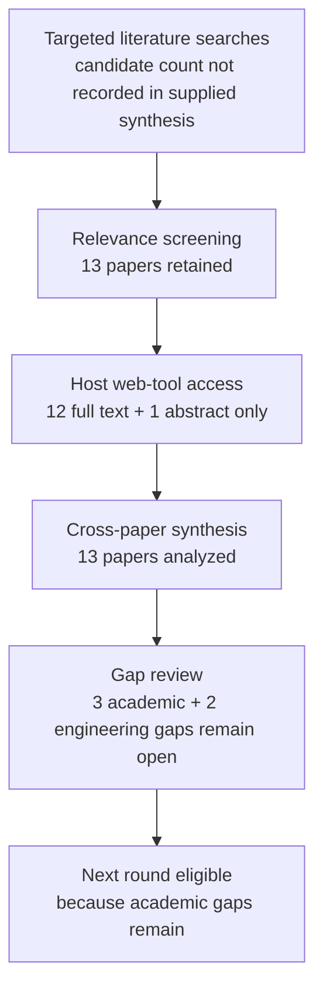

# Research Report: Empirical reply-to-proposition alignment in email and dialogue, focusing on partial replies, multiple questions, unanswered questions, and multi-proposition antecedents

## Contents

- [Round History](#round-history)
- [Executive Summary](#executive-summary)
- [Research Question](#research-question)
- [Methodology](#methodology)
- [Papers Reviewed](#papers-reviewed)
- [Research Landscape](#research-landscape)
- [Confidence-Graded Findings](#confidence-graded-findings)
- [Research Gaps](#research-gaps)
- [Practical Recommendations](#practical-recommendations)
- [Evidence Map](#evidence-map)
- [References](#references)
- [Appendix: Run Metadata](#appendix-run-metadata)

## Round History

Iterative gap-closure loop (hard cap: 4 rounds). See
`references/iterative-synthesis.md` for the full loop definition.

| Round | Run ID | Topic / Gap Focus | New Papers | Gaps Addressed | Remaining Gaps |
|-------|--------|-------------------|------------|----------------|----------------|
| 1 | 769bfc7cfebf | reference resolution to propositions and the semantic scope of replies in work communication | 13 | initial shortlist | 3 academic, 2 engineering |
| 2 | f72f7f513e9d | empirical reply-to-proposition alignment in email and dialogue, focusing on partial replies, multiple questions, unanswered questions, and multi-proposition antecedents | None | academic gaps of the previous round | 3 academic, 2 engineering |

**Stop reason**: another round runs while open academic gaps remain and new papers appear

## Executive Summary

This review investigated whether existing work can support proposition-level interpretation of replies in which a response answers, approves, rejects, clarifies, or otherwise targets only some of the propositions in preceding email or dialogue. Thirteen papers establish a strong conceptual and transfer-method foundation: discourse reference can target propositions, events, facts, situations, utterances, and composite discourse objects, while formal question semantics supports partial rather than all-or-nothing answerhood [doi-10-1162-coli-a-00327] [doi-10-18653-v1-2022-emnlp-main-778] [doi-10-3765-sp-5-6] [doi-10-1007-bf00351935]. [HIGH] The strongest finding is that whole-message or single-entity reference is an unsafe representation for Topic 04 because exact antecedent selection and antecedent boundaries are themselves difficult empirical problems [doi-10-1162-coli-a-00327] [doi-10-18653-v1-2022-emnlp-main-778] [doi-10-18653-v1-2021-naacl-main-329]. [HIGH] The most significant gap is that none of the reviewed papers directly evaluates exact proposition-level reply scope in authentic workplace email or enterprise chat, particularly partial approvals, multiple-question replies, unanswered questions, or composite proposition targets. [HIGH]

**Scope**: 13 papers analyzed from arXiv, ACL Anthology, journal/publisher or author-hosted academic copies, and institutional repositories over 1977–2022  
**Overall Confidence**: High for the conceptual and transfer-method conclusions; Low for production-domain accuracy claims  
**Verdict**: HAS_GAPS

## Research Question

The review asked:

> What empirical and theoretical evidence supports resolving a reply in email or dialogue to one or more exact antecedent propositions or spans, while distinguishing exact, partial, ambiguous, unsupported, and unresolved response scope, especially when a preceding message contains multiple questions, requests, alternatives, or propositions?

In scope were discourse deixis, abstract/propositional/event anaphora, antecedent-span identification, question–answer structure, partial answerhood, split or composite antecedents, and methods that inform conservative proposition-level linking.

Out of scope were ordinary named-entity coreference by itself, quotation/source attribution already owned by Topic 01, Topic segmentation owned by Topic 02, speech-act classification without target scope, whole-message sentiment or NLI without proposition localization, and downstream action/state extraction except where reference correctness directly affects them.

The product-specific target is a representation of the form

$$
r \rightarrow \{(a_i,\rho_i,s_i,u_i)\}_{i=1}^{k}
$$

where $r$ is a response span, $a_i$ is an antecedent proposition or span, $\rho_i$ is a relation such as answer, agreement, rejection, clarification, condition, or reference, $s_i$ describes semantic scope, and $u_i$ represents uncertainty. The representation must also permit $k=0$ when no supported antecedent is available.

## Methodology

### Search Strategy

- **Sources**: arXiv; ACL Anthology; Springer/journal and publisher records; author-hosted or university-hosted academic PDFs; institutional repositories.
- **Query variants**:
  - `empirical reply-to-proposition alignment email dialogue, focusing partial replies, multiple questions, unanswered multi-proposition antecedents`
  - `empirical reply-to-proposition alignment`
  - `empirical email dialogue, focusing partial replies, multiple questions, unanswered multi-proposition antecedents`
  - `reply-to-proposition email dialogue, focusing partial replies, multiple questions, unanswered multi-proposition antecedents`
  - `alignment email dialogue, focusing partial replies, multiple questions, unanswered multi-proposition antecedents`
  - `empirical reply-to-proposition alignment email dialogue,`
  - `empirical reply-to-proposition alignment focusing partial`
  - `empirical reply-to-proposition alignment replies, multiple`
- **Time window**: 1977–2022 for the reviewed corpus.
- **Screening**: iterative literature-review pipeline with strict relevance to proposition/discourse reference, response scope, question resolution, or directly transferable antecedent-linking methods.
- **Reading method**: all papers were read through the host's web tool. Twelve were available at full-text level and one only at abstract level.
- **Access levels**:
  - `1706.02256` — full_text
  - `doi-10-1007-bf00351935` — full_text
  - `doi-10-1007-bf00983299` — abstract_only
  - `doi-10-1162-coli-a-00327` — full_text
  - `doi-10-18653-v1-2021-codi-sharedtask-1` — full_text
  - `doi-10-18653-v1-2021-naacl-main-329` — full_text
  - `doi-10-18653-v1-2022-emnlp-main-778` — full_text
  - `doi-10-18653-v1-p17-1009` — full_text
  - `doi-10-3115-v1-d14-1056` — full_text
  - `doi-10-3765-sp-5-6` — full_text
  - `manual-555fa5b6e8` — full_text
  - `manual-5c0971730d` — full_text
  - `manual-8b8a394daa` — full_text

### Pipeline Summary

| Metric | Count |
|--------|-------|
| Total candidates | Unknown from supplied run artifacts |
| After screening | 13 reviewed papers |
| Downloaded | Not recorded as a distinct pipeline metric |
| Successfully converted | Not recorded as a distinct pipeline metric |
| Deeply analyzed | 13, with 1 source limited to abstract-only access |
| Iterations (if system-building) | 2 completed rounds |

The methodology intentionally distinguishes direct target-domain evidence from transfer evidence. Dialogue, news, event-coreference, and abstract-anaphora results can justify representations, candidate-generation strategies, or benchmark design, but cannot establish production accuracy for Outlook email or Microsoft Teams.

## Papers Reviewed

| # | Title | Authors | Year | Venue | Quality Score | Relevance |
|---|-------|---------|------|-------|--------------|-----------|
| 1 | Stay Together: A System for Single and Split-antecedent Anaphora Resolution [doi-10-18653-v1-2021-naacl-main-329] | Juntao Yu, Nafise Sadat Moosavi, Silviu Paun et al. | 2021 | NAACL | Unknown | HIGH |
| 2 | Syntax and semantics of questions [doi-10-1007-bf00351935] | Lauri Karttunen | 1977 | Journal article | Unknown | HIGH |
| 3 | Resolving abstract anaphors in Spanish discourse: Underspecification and mereological structures [manual-8b8a394daa] | Iker Zulaica-Hernández | 2018 | Institutional publication | Unknown | HIGH |
| 4 | Information Structure: Towards an integrated formal theory of pragmatics [doi-10-3765-sp-5-6] | Craige Roberts | 2012 | Semantics and Pragmatics | Unknown | HIGH |
| 5 | A Mention-Ranking Model for Abstract Anaphora Resolution [1706.02256] | Ana Marasović, Leo Born, Juri Opitz et al. | 2017 | Academic paper | Unknown | HIGH |
| 6 | End-to-End Neural Discourse Deixis Resolution in Dialogue [doi-10-18653-v1-2022-emnlp-main-778] | Shengjie Li, Vincent Ng | 2022 | EMNLP | Unknown | HIGH |
| 7 | A Twin-Candidate Based Approach for Event Pronoun Resolution using Composite Kernel [manual-5c0971730d] | Bin Chen, Jian Su, Chew Lim Tan | 2010 | ACL-family conference paper | Unknown | MEDIUM |
| 8 | Resolving Shell Nouns [doi-10-3115-v1-d14-1056] | Varada Kolhatkar, Graeme Hirst | 2014 | EMNLP | Unknown | HIGH |
| 9 | Resolving questions, II [doi-10-1007-bf00983299] | Jonathan Ginzburg | 1995 | Journal article | Unknown | MEDIUM |
| 10 | Resolving Event Noun Phrases to Their Verbal Mentions [manual-555fa5b6e8] | Bin Chen, Jian Su, Chew Lim Tan | 2010 | ACL-family conference paper | Unknown | MEDIUM |
| 11 | Anaphora With Non-nominal Antecedents in Computational Linguistics: a Survey [doi-10-1162-coli-a-00327] | Varada Kolhatkar, Adam Roussel, Stefanie Dipper et al. | 2018 | Computational Linguistics | Unknown | HIGH |
| 12 | Joint Learning for Event Coreference Resolution [doi-10-18653-v1-p17-1009] | Jing Lu, Vincent Ng | 2017 | ACL | Unknown | MEDIUM |
| 13 | The CODI-CRAC 2021 Shared Task on Anaphora, Bridging, and Discourse Deixis in Dialogue [doi-10-18653-v1-2021-codi-sharedtask-1] | Sopan Khosla, Juntao Yu, Ramesh Manuvinakurike et al. | 2021 | CODI shared task | Unknown | HIGH |

## Research Landscape

### Theme 1: Non-nominal and propositional antecedents

**Coverage**: 6 papers | **Confidence**: High  
**Supporting papers**: [doi-10-1162-coli-a-00327], [doi-10-18653-v1-2022-emnlp-main-778], [1706.02256], [doi-10-3115-v1-d14-1056], [manual-555fa5b6e8], [manual-8b8a394daa]

The reviewed literature treats non-nominal reference as materially different from ordinary entity coreference. Antecedents may denote events, propositions, facts, situations, utterances, speech acts, or other abstract discourse objects rather than conventional noun-phrase entities [doi-10-1162-coli-a-00327] [doi-10-18653-v1-2022-emnlp-main-778]. [HIGH] This directly supports Topic 04's requirement to represent semantic targets below the whole-message level and independently from entity identity.

Antecedent boundaries are also non-trivial. The survey literature documents clausal, multi-sentence, and potentially discontinuous antecedents, while practical dialogue systems sometimes simplify the task to utterance-level antecedents for tractability [doi-10-1162-coli-a-00327] [doi-10-18653-v1-2022-emnlp-main-778]. [HIGH]

Key findings:

1. [HIGH] A Topic 04 resolver must permit proposition-, event-, fact-, situation-, utterance-, and speech-act-level antecedents rather than assuming nominal entities [doi-10-1162-coli-a-00327] [doi-10-18653-v1-2022-emnlp-main-778].
2. [HIGH] Antecedent span boundaries should be represented explicitly and with uncertainty because whole-utterance targets are an operational simplification, not a demonstrated semantic optimum [doi-10-1162-coli-a-00327] [doi-10-18653-v1-2022-emnlp-main-778].
3. [MEDIUM] Composite abstract discourse referents are linguistically plausible and can be formed from multiple propositions [manual-8b8a394daa].

### Theme 2: Antecedent selection as a distinct empirical bottleneck

**Coverage**: 7 papers | **Confidence**: High  
**Supporting papers**: [doi-10-18653-v1-2022-emnlp-main-778], [doi-10-18653-v1-2021-naacl-main-329], [1706.02256], [doi-10-18653-v1-p17-1009], [manual-555fa5b6e8], [manual-5c0971730d], [doi-10-3115-v1-d14-1056]

Detection of a referring expression and selection of its target are separate problems. In discourse deixis, gains can come primarily from better antecedent linking rather than better anaphor recognition, and split-antecedent work shows that candidate filtering can eliminate legitimate antecedents before final resolution [doi-10-18653-v1-2022-emnlp-main-778] [doi-10-18653-v1-2021-naacl-main-329]. [HIGH]

The literature also shows that useful signals differ by construction. Lexical compatibility, syntax, semantic class, discourse structure, position, distance, and candidate-pair interactions can all contribute, but strict structural rules may exclude valid targets [doi-10-3115-v1-d14-1056] [1706.02256] [manual-555fa5b6e8]. [HIGH]

Key findings:

1. [HIGH] Candidate generation and semantic relation classification should be evaluated separately because valid targets may be lost before the final classifier runs [doi-10-18653-v1-2021-naacl-main-329] [doi-10-18653-v1-p17-1009].
2. [HIGH] Hard syntactic exclusion rules are unsafe across heterogeneous constructions; syntax is better treated as defeasible evidence [doi-10-3115-v1-d14-1056] [1706.02256].
3. [HIGH] Joint modeling can help linked subtasks but its benefit is task- and architecture-dependent rather than universal [doi-10-18653-v1-p17-1009] [doi-10-18653-v1-2021-naacl-main-329].

### Theme 3: Partial answers and multiple unresolved questions

**Coverage**: 3 papers | **Confidence**: High for the formal distinction; Low for workplace empirical validation  
**Supporting papers**: [doi-10-1007-bf00351935], [doi-10-3765-sp-5-6], [doi-10-1007-bf00983299]

Formal question semantics and Question Under Discussion theory provide a principled basis for distinguishing a complete resolution from a contribution that addresses only part of the current issue [doi-10-1007-bf00351935] [doi-10-3765-sp-5-6]. [HIGH] This supports keeping multiple propositions or questions independently open rather than treating any reply as closing the complete antecedent message.

The corpus does not, however, provide a validated empirical method for mapping actual workplace replies to individual questions and determining which neighboring questions remain unanswered. [HIGH] The reviewed question-theoretic papers supply formal structure rather than an enterprise email benchmark.

Key findings:

1. [HIGH] Partial answerhood is a legitimate discourse phenomenon; a relevant response need not resolve the entire Question Under Discussion [doi-10-3765-sp-5-6].
2. [HIGH] Multiple questions and answer propositions can coexist structurally, so reply scope should not be forced into a one-message/one-answer abstraction [doi-10-1007-bf00351935] [doi-10-3765-sp-5-6].
3. [LOW] No production-domain accuracy claim can be made for unanswered-question detection in workplace communication from these sources alone [doi-10-1007-bf00351935] [doi-10-3765-sp-5-6] [doi-10-1007-bf00983299].

### Theme 4: Locality, recency, and long-distance reference

**Coverage**: 3 papers | **Confidence**: High  
**Supporting papers**: [doi-10-18653-v1-2022-emnlp-main-778], [manual-555fa5b6e8], [manual-5c0971730d]

Recency is strongly predictive in some dialogue discourse-deixis data: more than 90% of antecedents in one analyzed setting occurred within four utterances [doi-10-18653-v1-2022-emnlp-main-778]. [HIGH] Event-reference work, however, documents materially longer-distance links and weak behavior from simplistic nearest-candidate baselines [manual-555fa5b6e8] [manual-5c0971730d]. [HIGH]

The combined evidence argues for a soft prior rather than a universal cutoff:

$$
P(a \mid r) \propto P_{\text{semantic}}(a,r)\,P_{\text{discourse}}(a,r)\,P_{\text{recency}}(a,r)
$$

where $P_{\text{recency}}$ influences ranking but does not assign zero probability to semantically viable older antecedents.

Key findings:

1. [HIGH] Recency is useful evidence but cannot safely be a hard global search-window rule [doi-10-18653-v1-2022-emnlp-main-778] [manual-555fa5b6e8] [manual-5c0971730d].
2. [HIGH] Forced nearest-candidate linking is unsafe when context is incomplete or when the true antecedent is long-distance [manual-555fa5b6e8] [manual-5c0971730d].

### Theme 5: Composite and split antecedents

**Coverage**: 3 papers | **Confidence**: Medium  
**Supporting papers**: [manual-8b8a394daa], [doi-10-18653-v1-2021-naacl-main-329], [doi-10-1162-coli-a-00327]

Theoretical work on abstract anaphora supports discourse referents composed from multiple propositions, while split-antecedent computational work independently demonstrates that a resolver may need to point to more than one prior source rather than force a single antecedent [manual-8b8a394daa] [doi-10-18653-v1-2021-naacl-main-329]. [MEDIUM]

This is not yet direct evidence that a workplace reply such as “approved” or “yes, those two” should be modeled as a composite-proposition target. [HIGH] It is sufficient to justify representation capacity and benchmark cases, but not production behavior.

Key findings:

1. [MEDIUM] Topic 04's data model should be capable of representing zero, one, or multiple proposition targets [manual-8b8a394daa] [doi-10-18653-v1-2021-naacl-main-329].
2. [LOW] The optimal semantics and evaluation criteria for multi-proposition workplace reply scope remain unvalidated [manual-8b8a394daa] [doi-10-18653-v1-2021-naacl-main-329].

### Theme 6: Domain-transfer limitation

**Coverage**: 5 papers | **Confidence**: High  
**Supporting papers**: [doi-10-18653-v1-2021-codi-sharedtask-1], [doi-10-18653-v1-2022-emnlp-main-778], [doi-10-1162-coli-a-00327], [manual-555fa5b6e8], [doi-10-18653-v1-2021-naacl-main-329]

The empirical benchmarks represented in this corpus are primarily dialogue, news/general text, event reference, or broad anaphora resources rather than authentic workplace email or enterprise chat [doi-10-18653-v1-2021-codi-sharedtask-1] [doi-10-18653-v1-2022-emnlp-main-778] [manual-555fa5b6e8]. [HIGH]

No reviewed study directly evaluates whether a workplace response applies to exactly one proposition, some propositions, all propositions, or no supported proposition in a preceding work message. [HIGH] Consequently, the literature can justify a conservative architecture and benchmark design but not production-domain correctness.

Key findings:

1. [HIGH] There is no direct validation in the corpus for proposition-level agreement, rejection, approval, clarification, or commitment scope in authentic workplace email or enterprise chat [doi-10-18653-v1-2021-codi-sharedtask-1] [doi-10-18653-v1-2022-emnlp-main-778].
2. [LOW] Any quantitative claim about msgloom's expected workplace accuracy would be unsupported by the reviewed evidence.

## Methodology Comparison

| Approach | Papers | Strengths | Weaknesses | Best For | Performance |
|----------|--------|-----------|------------|----------|-------------|
| Non-nominal antecedent modeling / abstract anaphora | [doi-10-1162-coli-a-00327], [1706.02256], [doi-10-3115-v1-d14-1056] | Models propositions, clauses, events, and abstract content; exposes antecedent-boundary issues | Benchmarks differ from workplace replies; some constructions are highly domain-specific | Candidate representations and span-level linking | Cross-paper numerical comparison is not valid because tasks and metrics differ |
| End-to-end discourse deixis resolution | [doi-10-18653-v1-2022-emnlp-main-778], [doi-10-18653-v1-2021-codi-sharedtask-1] | Jointly addresses detection and antecedent linking in dialogue; directly relevant to discourse reference | Often simplifies antecedents to utterance-level units; no business approval/answer scope | Dialogue antecedent linking | Direct values not reproduced here because they are not comparable to Topic 04's target metric |
| Split/multiple antecedent resolution | [doi-10-18653-v1-2021-naacl-main-329] | Demonstrates computational need for multi-source antecedent representations | Split entity/anaphora setting is analogical, not proposition-level workplace reply scope | Representation design and multi-target candidate evaluation | Transfer evidence only |
| Event reference / event coreference | [manual-5c0971730d], [manual-555fa5b6e8], [doi-10-18653-v1-p17-1009] | Tests long-distance links, pairwise candidate features, and joint modeling | Event identity is not equivalent to semantic reply scope | Candidate generation and distance-policy transfer | Not directly comparable across tasks |
| Formal question semantics / QUD | [doi-10-1007-bf00351935], [doi-10-3765-sp-5-6], [doi-10-1007-bf00983299] | Provides principled distinctions among questions, answers, subquestions, and partial resolution | Mostly formal theory rather than empirical workplace benchmark | Defining answered versus still-open propositions | No directly comparable proposition-alignment benchmark |
| Mereological/composite abstract reference | [manual-8b8a394daa] | Supplies a semantic mechanism for composite discourse referents | Qualitative/theoretical evidence; no workplace evaluation | Multi-proposition representation design | No direct target-domain performance evidence |

## Confidence-Graded Findings

### 🟢 High Confidence (supported by 3+ papers with consistent results)

1. **[HIGH] Proposition-level reference cannot be reduced to ordinary entity coreference.** Antecedents can denote propositions, events, facts, situations, utterances, or speech acts rather than nominal entities [doi-10-1162-coli-a-00327] [doi-10-18653-v1-2022-emnlp-main-778] [1706.02256].

2. **[HIGH] Exact antecedent selection and antecedent boundaries are first-class sources of error.** The reviewed literature repeatedly identifies candidate generation, linking, span definition, parsing, distance, or context as limiting factors rather than treating reference resolution as only an anaphor-detection problem [doi-10-1162-coli-a-00327] [doi-10-18653-v1-2022-emnlp-main-778] [doi-10-18653-v1-2021-naacl-main-329].

3. **[HIGH] Whole-message response scope is not justified by the literature.** Non-nominal antecedents can be clausal or multi-sentence, while formal question theory permits responses that contribute only partially to an outstanding issue [doi-10-1162-coli-a-00327] [doi-10-3765-sp-5-6] [doi-10-1007-bf00351935].

4. **[HIGH] Partial answerhood should be representable without automatically closing neighboring questions.** A response may advance the current Question Under Discussion without completely resolving it [doi-10-3765-sp-5-6] [doi-10-1007-bf00351935].

5. **[HIGH] Recency is useful but unsafe as an absolute antecedent cutoff.** Dialogue discourse deixis strongly favors local antecedents, while event-reference evidence includes substantially longer-distance links and weak nearest-candidate heuristics [doi-10-18653-v1-2022-emnlp-main-778] [manual-555fa5b6e8] [manual-5c0971730d].

6. **[HIGH] Syntax and structure should act as defeasible evidence rather than universal hard filters.** Constraints that help narrowly defined constructions can exclude valid antecedents in broader abstract-anaphora settings [doi-10-3115-v1-d14-1056] [1706.02256] [manual-555fa5b6e8].

7. **[HIGH] No reviewed paper directly establishes proposition-level reply-scope correctness in authentic workplace email or enterprise chat.** Existing dialogue and general-language datasets are transfer evidence only [doi-10-18653-v1-2021-codi-sharedtask-1] [doi-10-18653-v1-2022-emnlp-main-778] [manual-555fa5b6e8].

### 🟡 Medium Confidence (supported by 1-2 papers or with caveats)

1. **[MEDIUM] A workplace reply resolver should be able to represent composite or multiple proposition antecedents.** Composite abstract discourse referents are theoretically motivated, and split-antecedent resolution demonstrates the broader computational need for multi-source linking [manual-8b8a394daa] [doi-10-18653-v1-2021-naacl-main-329]. The caveat is that neither source directly evaluates multi-proposition workplace response scope.

2. **[MEDIUM] Joint modeling may improve detection/linking interactions, but should not be assumed superior.** Joint event modeling improved linked event tasks, whereas joint split-antecedent training did not outperform the stronger pre-trained configuration in the broader anaphora system [doi-10-18653-v1-p17-1009] [doi-10-18653-v1-2021-naacl-main-329].

### 🔴 Low Confidence (preliminary, single-source, or contradicted)

1. **[LOW] The optimal representation for a reply that semantically targets a structured combination of several workplace propositions is unknown.** The corpus supports the possibility of composite antecedents but contains no direct workplace evaluation [manual-8b8a394daa] [doi-10-18653-v1-2021-naacl-main-329].

2. **[LOW] Production accuracy, calibration, and acceptable false-link rates for authentic Outlook email or Microsoft Teams cannot be inferred from this corpus.** No included study evaluates the target domain directly [doi-10-18653-v1-2021-codi-sharedtask-1] [doi-10-18653-v1-2022-emnlp-main-778].

## Trade-Off Analysis

| Decision | Option A | Option B | Recommendation |
|----------|----------|----------|----------------|
| Antecedent granularity | Whole message/utterance: simpler candidate space but risks over-broad scope | Proposition/span targets: harder segmentation and boundary uncertainty but preserves semantic scope | Use proposition/span targets with explicit uncertain boundaries; whole utterances may remain fallback candidates [doi-10-1162-coli-a-00327] [doi-10-18653-v1-2022-emnlp-main-778] |
| Candidate distance | Fixed local cutoff: efficient and effective for highly local dialogue | Soft recency prior with long-distance fallback: larger search space but accommodates event-like links | Use recency as a weighted prior rather than a universal cutoff [doi-10-18653-v1-2022-emnlp-main-778] [manual-555fa5b6e8] |
| Number of antecedents | Exactly one target: simple inference and evaluation | Zero/one/multiple targets: supports missing context, ambiguity, and composite scope | Permit zero, one, or multiple proposition targets [manual-8b8a394daa] [doi-10-18653-v1-2021-naacl-main-329] |
| Structural constraints | Hard syntactic filters: reduce candidate load | Defeasible syntax combined with lexical, semantic, and discourse evidence | Prefer defeasible evidence because rigid constraints exclude valid cases [doi-10-3115-v1-d14-1056] [1706.02256] |
| Multi-question state | Any reply closes parent message | Maintain state independently for each question/proposition | Maintain per-proposition open/resolved state [doi-10-3765-sp-5-6] [doi-10-1007-bf00351935] |
| Low-confidence link | Force nearest/best antecedent | Abstain or leave unresolved and request/retrieve context | Prefer unresolved status when evidence is insufficient; exact threshold requires engineering validation [manual-5c0971730d] [manual-555fa5b6e8] |

For msgloom, the product risk is asymmetric. A useful benchmark should therefore not optimize only aggregate link accuracy. One possible engineering objective is

$$
L = \lambda_{\mathrm{broad}}E_{\mathrm{broad}}
+\lambda_{\mathrm{miss}}E_{\mathrm{miss}}
+\lambda_{\mathrm{wrong}}E_{\mathrm{wrong}}
+\lambda_{\mathrm{abstain}}E_{\mathrm{abstain}}
$$

with the $\lambda$ values determined from product-risk experiments rather than inferred from the reviewed literature. In particular, $\lambda_{\mathrm{broad}}$ may need to be high when an over-broad approval or commitment changes downstream work state, but the corpus does not validate the correct cost ratios.

## Points of Agreement **[EVIDENCE REQUIRED]**

1. **[HIGH] Non-nominal antecedents are genuine reference targets and cannot be handled as ordinary entity coreference alone.** This is consistent across the survey, dialogue discourse-deixis work, abstract-anaphora models, and event-reference literature [doi-10-1162-coli-a-00327] [doi-10-18653-v1-2022-emnlp-main-778] [1706.02256] [manual-555fa5b6e8].

2. **[HIGH] Antecedent linking deserves separate modeling and evaluation from mention/anaphor detection.** Candidate ranking and filtering materially affect final resolution quality [doi-10-18653-v1-2022-emnlp-main-778] [doi-10-18653-v1-2021-naacl-main-329] [doi-10-18653-v1-p17-1009].

3. **[HIGH] Single, rigid structural assumptions are insufficient for the full phenomenon.** The literature documents variable span boundaries, long-distance cases, discontinuous or multi-sentence content, and multi-source antecedents [doi-10-1162-coli-a-00327] [manual-555fa5b6e8] [doi-10-18653-v1-2021-naacl-main-329].

4. **[HIGH] Partial contribution to an outstanding question is semantically legitimate.** Question semantics and QUD theory therefore support preserving unresolved neighboring questions [doi-10-1007-bf00351935] [doi-10-3765-sp-5-6].

5. **[HIGH] Direct production-domain evidence is absent.** None of the reviewed benchmark papers establishes exact reply-to-proposition scope for authentic enterprise email or chat [doi-10-18653-v1-2021-codi-sharedtask-1] [doi-10-18653-v1-2022-emnlp-main-778].

## Points of Contradiction **[EVIDENCE REQUIRED]**

1. **[HIGH] How strongly antecedent search should be constrained by recency**: dialogue discourse-deixis evidence strongly favors nearby antecedents [doi-10-18653-v1-2022-emnlp-main-778], while event-reference work documents longer-distance links and weak simple recency heuristics [manual-555fa5b6e8] [manual-5c0971730d].
   - **Possible explanation**: the studies model different discourse phenomena and genres rather than conducting a controlled experiment on the same target task.
   - **Implication**: msgloom should use recency as a domain-sensitive prior, not a fixed global cutoff.

2. **[HIGH] Value of explicit syntactic constraints**: shell-noun syntax can be useful for tightly constrained constructions [doi-10-3115-v1-d14-1056], while broader abstract-anaphora ranking shows that explicit syntactic information or restrictive patterns can be less useful or harmful [1706.02256].
   - **Possible explanation**: predictive syntax is construction-dependent.
   - **Implication**: syntactic signals should contribute evidence without categorically deleting semantically plausible candidates.

3. **[HIGH] Whether joint training improves linked subtasks**: joint event-trigger, anaphoricity, and coreference modeling improves the event tasks in one architecture [doi-10-18653-v1-p17-1009], whereas joint split-antecedent training is weaker than the alternative pre-trained configuration in another system [doi-10-18653-v1-2021-naacl-main-329].
   - **Possible explanation**: the tasks, supervision densities, architectures, and candidate structures differ.
   - **Implication**: joint modeling should be treated as an experimental hypothesis, not an architecture requirement.

4. **[HIGH] Whether one contiguous textual unit is an adequate antecedent representation**: one dialogue resolver operationalizes antecedents as whole utterances for tractability [doi-10-18653-v1-2022-emnlp-main-778], whereas broader work identifies clausal, discontinuous, multi-sentence, and composite antecedents [doi-10-1162-coli-a-00327] [manual-8b8a394daa].
   - **Possible explanation**: utterance-level modeling is a benchmark simplification rather than a claim of semantic completeness.
   - **Implication**: Topic 04 should not make whole-utterance granularity an irreversible data-model assumption.

## Research Gaps

All five inherited gaps remain open. The literature has not answered them yet.

| # | Gap | Type | Severity | Impact on Goals |
|---|-----|------|----------|----------------|
| 1 | Direct empirical evidence for proposition-level agreement, rejection, approval, clarification, and answer scope in authentic workplace email or enterprise chat is missing, especially where a short response applies to only part of a preceding message. Searched in rounds 1 and 2; still open. | [ACADEMIC] | HIGH | Without it, transfer evidence cannot establish that msgloom will avoid over-broad approvals, answers, rejections, or commitments. |
| 2 | A validated annotation and evaluation scheme for exact, partial, ambiguous, unsupported, discontinuous, and multiple proposition targets has not been established for the workplace task. Searched in rounds 1 and 2; still open. | [ENGINEERING] | HIGH | Without explicit gold semantics, model comparisons could hide the exact false-broad-link errors that matter to downstream state. |
| 3 | Direct evidence is still missing for aligning one reply to one or more questions when a work message contains multiple questions, requests, or alternatives, including identifying unanswered questions. Searched in rounds 1 and 2; still open. | [ACADEMIC] | HIGH | A system could incorrectly mark an entire message resolved after only one question was answered. |
| 4 | It remains unknown how workplace responses should be modeled when they target a composite or multi-proposition antecedent. Searched in rounds 1 and 2; still open. | [ACADEMIC] | MEDIUM | A single-target model may be unable to express “the first two are approved” or analogous multi-proposition scope without distortion. |
| 5 | The abstention, ambiguity, missing-antecedent, and over-broad-link cost policy for msgloom remains unvalidated. Searched in rounds 1 and 2; still open. | [ENGINEERING] | HIGH | The product needs an explicit risk trade-off between false commitments and unresolved links rather than an arbitrary score threshold. |

### Academic Gaps (require more papers)

1. **[ACADEMIC] HIGH — Direct workplace proposition-level response scope**: The literature has not answered whether existing methods accurately resolve agreement, rejection, approval, clarification, or answer scope to exact propositions in authentic workplace email or enterprise chat. Already searched in rounds 1 and 2. Suggested query: `"reply scope" email dialogue proposition agreement approval rejection workplace communication`.

2. **[ACADEMIC] HIGH — Multi-question reply alignment and unanswered-question detection**: The literature has not answered how well systems align real replies to individual questions or requests when several are present, nor how reliably they identify those left unanswered. Already searched in rounds 1 and 2. Suggested query: `"question answer alignment" dialogue "multiple questions" partial answer unanswered questions`.

3. **[ACADEMIC] MEDIUM — Composite/multi-proposition response targets**: The literature has not answered whether and how a work reply should resolve to a structured combination of propositions. Existing support is theoretical or analogical, not direct. Already searched in rounds 1 and 2. Suggested query: `"multi-antecedent" propositional anaphora dialogue composite discourse referent reply`.

### Engineering Gaps (fillable without papers)

1. **[ENGINEERING] HIGH — Annotation and evaluation contract**: The literature has not supplied the complete gold scheme msgloom needs. Already searched in rounds 1 and 2. Suggested resolution: create an independent proposition-level benchmark in which prediction inputs are separated from gold; permit zero, one, and multiple targets; annotate exact, partial, ambiguous, unsupported, discontinuous, and missing-context outcomes; and score candidate generation separately from semantic relation classification.

2. **[ENGINEERING] HIGH — Abstention and product-risk cost model**: The literature has not determined the appropriate threshold for forcing a link versus abstaining. Already searched in rounds 1 and 2. Suggested resolution: construct adversarial fixtures and later authorized work-domain samples to estimate the operational costs of false-broad, false-specific, missed, and abstained links. Keep missing-context cases unresolved and hand retrieval needs to Topic 07.

## Reproducibility Notes

The supplied synthesis does not include a verified code repository, dataset-availability field, or license audit for every paper. Unknown values are therefore left explicitly unknown rather than inferred.

| Paper | Code Available | Data Available | Sufficient Detail | License |
|-------|---------------|----------------|-------------------|---------|
| [1706.02256] | Unknown | Unknown | Full text available; methodological detail assessable | Unknown |
| [doi-10-1007-bf00351935] | Not applicable / unknown | Not applicable / unknown | Full text available | Unknown |
| [doi-10-1007-bf00983299] | Unknown | Unknown | ⚠️ Abstract-only access in this review | Unknown |
| [doi-10-1162-coli-a-00327] | Unknown | Unknown | Full survey text available | Unknown |
| [doi-10-18653-v1-2021-codi-sharedtask-1] | Unknown | Unknown | Full text available | Unknown |
| [doi-10-18653-v1-2021-naacl-main-329] | Unknown | Unknown | Full text available | Unknown |
| [doi-10-18653-v1-2022-emnlp-main-778] | Unknown | Unknown | Full text available | Unknown |
| [doi-10-18653-v1-p17-1009] | Unknown | Unknown | Full text available | Unknown |
| [doi-10-3115-v1-d14-1056] | Unknown | Unknown | Full text available | Unknown |
| [doi-10-3765-sp-5-6] | Not applicable / unknown | Not applicable / unknown | Full text available | Unknown |
| [manual-555fa5b6e8] | Unknown | Unknown | Full text available | Unknown |
| [manual-5c0971730d] | Unknown | Unknown | Full text available | Unknown |
| [manual-8b8a394daa] | Unknown | Unknown | Full text available | Unknown |

## Practical Recommendations **[EVIDENCE REQUIRED]**

1. **[HIGH] Represent response scope as a relation from a response span to one or more exact proposition/span targets, not as a whole-message relation.** Allow clausal, multi-sentence, discontinuous, and composite target structures where evidence requires them [doi-10-1162-coli-a-00327] [manual-8b8a394daa].
   *Confidence*: High

2. **[HIGH] Maintain independent per-proposition state for messages containing several questions, requests, proposals, or conditions.** Resolving one proposition must not implicitly close its neighbors because partial answerhood is semantically legitimate [doi-10-3765-sp-5-6] [doi-10-1007-bf00351935].
   *Confidence*: High

3. **[HIGH] Separate candidate generation from semantic relation classification in both architecture and evaluation.** Measure whether the correct target entered the candidate set before judging the final answer/agreement/rejection classifier [doi-10-18653-v1-2021-naacl-main-329] [doi-10-18653-v1-p17-1009].
   *Confidence*: High

4. **[HIGH] Use recency as a weighted prior rather than a hard cutoff.** Dialogue evidence supports strong locality, but event-reference evidence shows that valid antecedents can occur much farther away [doi-10-18653-v1-2022-emnlp-main-778] [manual-555fa5b6e8].
   *Confidence*: High

5. **[HIGH] Treat lexical, syntactic, semantic, discourse, and rhetorical signals as defeasible evidence.** A single syntactic pattern should not eliminate a semantically plausible target [doi-10-3115-v1-d14-1056] [1706.02256] [manual-8b8a394daa].
   *Confidence*: High

6. **[MEDIUM] Design the data model and benchmark to permit zero, one, or multiple antecedent propositions.** Multiple/non-contiguous reference is supported by abstract- and split-antecedent work, although direct workplace validation is still absent [doi-10-1162-coli-a-00327] [doi-10-18653-v1-2021-naacl-main-329] [manual-8b8a394daa].
   *Confidence*: Medium

7. **[HIGH] Score over-broad links as a dedicated error class rather than hiding them inside aggregate coreference or link F1.** Dialogue benchmarks establish the difficulty of target linking, but msgloom's downstream state semantics make false broad approval especially consequential [doi-10-18653-v1-2021-codi-sharedtask-1] [doi-10-18653-v1-2022-emnlp-main-778].
   *Confidence*: High

8. **[HIGH] Do not force an antecedent when the relevant context is missing or support is insufficient.** Leave the relation unresolved and hand a missing-context need to Topic 07 rather than selecting the nearest candidate by default [manual-5c0971730d] [manual-555fa5b6e8].
   *Confidence*: High

9. **[LOW] Do not treat the reviewed literature as evidence of production accuracy on Outlook email or Microsoft Teams.** The empirical datasets are transfer domains rather than direct evaluations of the target environment [doi-10-18653-v1-2021-codi-sharedtask-1] [doi-10-18653-v1-2022-emnlp-main-778].
   *Confidence*: High that the limitation exists; Low confidence in any unmeasured production-accuracy claim.

## Future Directions

1. Run a narrowly targeted third academic search for empirical multi-question response alignment, unanswered-question detection, and reply scope rather than repeating broad anaphora searches.
2. Search specifically for workplace email/dialogue corpora in which response targets are annotated at clause, proposition, question, request, proposal, or decision level.
3. Investigate whether dialogue-disentanglement, conversational discourse parsing, adjacency-pair, response-to, and dialogue-act-relation datasets contain latent proposition-level target annotations useful for Topic 04.
4. Build an independent engineering benchmark with explicit multi-question, partial-approval, conditional-approval, correction, clarification, ambiguous-reference, missing-context, and composite-target fixtures.
5. Add separate metrics for candidate recall, exact target precision/recall, over-broad scope, under-broad scope, unresolved-but-resolvable cases, justified abstention, and question-state closure accuracy.
6. Later validate on authorized production-domain data without claiming representativeness from synthetic or transfer benchmarks.
7. Coordinate missing-antecedent retrieval with Topic 07 and attachment/table references with Topic 08 instead of expanding Topic 04 beyond its ownership boundary.

## Readiness Assessment (System-Building Mode)

### Verdict: HAS_GAPS

### Assessment Summary

The synthesis is sufficient to define a conservative Topic 04 data model and to build an engineering benchmark, but it is not sufficient to validate a production proposition-level reply resolver. [HIGH] The literature strongly supports non-nominal targets, uncertain boundaries, partial answerhood, multi-target representational capacity, candidate-generation evaluation, and abstention-friendly design, but the three academic gaps and two engineering gaps remain unresolved.

### Coverage Matrix

| Dimension | Status | Evidence |
|-----------|--------|----------|
| Architecture patterns | ✅ Sufficient for a provisional conservative design | Non-nominal target modeling [doi-10-1162-coli-a-00327], dialogue linking [doi-10-18653-v1-2022-emnlp-main-778], split antecedents [doi-10-18653-v1-2021-naacl-main-329] |
| Technology stack | ❌ Missing | The corpus studies methods and theory, not msgloom implementation technology |
| Performance baselines | ⚠️ Partial | Transfer-task baselines exist, but they are not directly comparable with workplace reply-to-proposition scope [doi-10-18653-v1-2022-emnlp-main-778] [1706.02256] |
| Security model | ❌ Missing | Not part of the reviewed research question; governed elsewhere in the project |
| Trade-off map | ⚠️ Partial | Recency, structural constraints, joint modeling, and target granularity have evidence, but product-specific error costs remain unvalidated [doi-10-3115-v1-d14-1056] [doi-10-18653-v1-p17-1009] |
| Proposition-level workplace scope | ❌ Missing | No direct authentic workplace benchmark in the corpus [doi-10-18653-v1-2021-codi-sharedtask-1] [doi-10-18653-v1-2022-emnlp-main-778] |
| Multiple-question / unanswered-question handling | ⚠️ Partial | Formal basis exists; empirical work-domain validation is missing [doi-10-1007-bf00351935] [doi-10-3765-sp-5-6] |
| Composite proposition targets | ⚠️ Partial | Theoretical/analogical support only [manual-8b8a394daa] [doi-10-18653-v1-2021-naacl-main-329] |
| Abstention / ambiguity policy | ❌ Missing | No product-specific cost model is supplied by the corpus |

### Gap Resolution Plan

| # | Gap | Type | Severity | Resolution |
|---|-----|------|----------|------------|
| 1 | Direct authentic-workplace proposition-level response scope remains unvalidated; searched in rounds 1 and 2 | [ACADEMIC] | HIGH | Run targeted literature search for exact reply/response scope, workplace email, enterprise dialogue, partial approval/agreement/rejection, and proposition alignment |
| 2 | Annotation/evaluation contract is not validated; searched in rounds 1 and 2 | [ENGINEERING] | HIGH | Build independent proposition-level gold with zero/one/multiple targets, exact/partial/ambiguous/unsupported/missing-context states, and separate candidate-recall metrics |
| 3 | Multiple-question reply alignment and unanswered-question detection remain empirically unvalidated; searched in rounds 1 and 2 | [ACADEMIC] | HIGH | Target empirical dialogue datasets and models that align responses to individual questions and retain unresolved questions |
| 4 | Multi-proposition response targets remain directly untested; searched in rounds 1 and 2 | [ACADEMIC] | MEDIUM | Search composite/multi-antecedent proposition reference and add controlled multi-target benchmark cases |
| 5 | Abstention and false-broad-link cost policy remains unvalidated; searched in rounds 1 and 2 | [ENGINEERING] | HIGH | Define a product-risk loss function, run sensitivity tests, and select thresholds using independent gold rather than model-generated labels |

## Evidence Map

| Research Question Aspect | Evidence |
|--------------------------|----------|
| Propositions/events/facts as antecedents | ✓ [doi-10-1162-coli-a-00327] §§3.2.1, 6; ✓ [doi-10-18653-v1-2022-emnlp-main-778] introduction/task formulation |
| Exact antecedent boundaries | ✓ [doi-10-1162-coli-a-00327] §§4.1, 4.3, 6; ✓ [doi-10-18653-v1-2022-emnlp-main-778] limitations/antecedent modeling |
| Candidate generation and linking bottlenecks | ✓ [doi-10-18653-v1-2022-emnlp-main-778] §5.1; ✓ [doi-10-18653-v1-2021-naacl-main-329] analysis; ✓ [doi-10-18653-v1-p17-1009] event-coreference modeling |
| Partial answers | ✓ [doi-10-3765-sp-5-6] relevance; ✓ [doi-10-1007-bf00351935] question semantics |
| Multiple questions | ✓ [doi-10-1007-bf00351935] multiple wh-questions; ✓ [doi-10-3765-sp-5-6] questions/discourse strategies |
| Empirical unanswered-question detection in workplace messages | Missing; formal transfer evidence only [doi-10-1007-bf00351935] [doi-10-3765-sp-5-6] |
| Composite proposition antecedents | ✓ theoretical [manual-8b8a394daa]; ✓ analogical multi-antecedent computation [doi-10-18653-v1-2021-naacl-main-329] |
| Recency/locality | ✓ strong local dialogue pattern [doi-10-18653-v1-2022-emnlp-main-778]; ✓ longer event links [manual-555fa5b6e8] [manual-5c0971730d] |
| Hard versus defeasible syntax | ✓ [doi-10-3115-v1-d14-1056]; ✓ [1706.02256] |
| Joint modeling | ✓ beneficial in event model [doi-10-18653-v1-p17-1009]; ✓ not uniformly beneficial in split-antecedent system [doi-10-18653-v1-2021-naacl-main-329] |
| Dialogue benchmark transfer evidence | ✓ [doi-10-18653-v1-2021-codi-sharedtask-1]; ✓ [doi-10-18653-v1-2022-emnlp-main-778] |
| Authentic workplace proposition-level approval/rejection/answer scope | Missing in reviewed corpus [doi-10-18653-v1-2021-codi-sharedtask-1] [doi-10-18653-v1-2022-emnlp-main-778] |
| Abstention/product-risk cost model | Missing; antecedent fallibility demonstrated but product costs not established [doi-10-18653-v1-2022-emnlp-main-778] [doi-10-18653-v1-2021-naacl-main-329] [manual-5c0971730d] |

## References

1. [doi-10-18653-v1-2021-naacl-main-329] — Stay Together: A System for Single and Split-antecedent Anaphora Resolution. Juntao Yu, Nafise Sadat Moosavi, Silviu Paun et al. 2021. NAACL.
2. [doi-10-1007-bf00351935] — Syntax and semantics of questions. Lauri Karttunen. 1977.
3. [manual-8b8a394daa] — Resolving abstract anaphors in Spanish discourse: Underspecification and mereological structures. Iker Zulaica-Hernández. 2018.
4. [doi-10-3765-sp-5-6] — Information Structure: Towards an integrated formal theory of pragmatics. Craige Roberts. 2012. Semantics and Pragmatics.
5. [1706.02256] — A Mention-Ranking Model for Abstract Anaphora Resolution. Ana Marasović, Leo Born, Juri Opitz et al. 2017.
6. [doi-10-18653-v1-2022-emnlp-main-778] — End-to-End Neural Discourse Deixis Resolution in Dialogue. Shengjie Li, Vincent Ng. 2022. EMNLP.
7. [manual-5c0971730d] — A Twin-Candidate Based Approach for Event Pronoun Resolution using Composite Kernel. Bin Chen, Jian Su, Chew Lim Tan. 2010.
8. [doi-10-3115-v1-d14-1056] — Resolving Shell Nouns. Varada Kolhatkar, Graeme Hirst. 2014.
9. [doi-10-1007-bf00983299] — Resolving questions, II. Jonathan Ginzburg. 1995.
10. [manual-555fa5b6e8] — Resolving Event Noun Phrases to Their Verbal Mentions. Bin Chen, Jian Su, Chew Lim Tan. 2010.
11. [doi-10-1162-coli-a-00327] — Anaphora With Non-nominal Antecedents in Computational Linguistics: a Survey. Varada Kolhatkar, Adam Roussel, Stefanie Dipper et al. 2018. Computational Linguistics.
12. [doi-10-18653-v1-p17-1009] — Joint Learning for Event Coreference Resolution. Jing Lu, Vincent Ng. 2017. ACL.
13. [doi-10-18653-v1-2021-codi-sharedtask-1] — The CODI-CRAC 2021 Shared Task on Anaphora, Bridging, and Discourse Deixis in Dialogue. Sopan Khosla, Juntao Yu, Ramesh Manuvinakurike et al. 2021. CODI shared task.

## Appendix: Run Metadata

- **Run ID**: f72f7f513e9d
- **Round**: 2 of at most 4
- **Sources**: arXiv; ACL Anthology; journal/publisher or author-hosted academic copies; institutional repositories
- **Paper count**: 13
- **Access summary**: 12 full-text papers; 1 abstract-only paper
- **Pipeline version**: Unknown from supplied run artifacts
- **Date**: 2026-09-16
- **Artifacts**: `runs/f72f7f513e9d/`
- **Open academic gaps**: 3
- **Open engineering gaps**: 2
- **Next-round condition**: another round runs while open academic gaps remain and new papers appear
