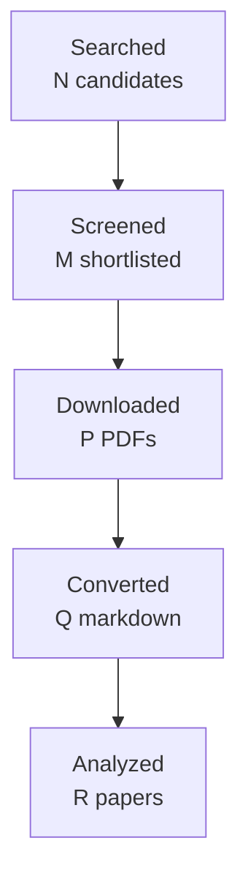

You are one worker inside an automated literature-review pipeline.
A script, not a person, reads your reply. Follow these rules exactly:
- Do the task completely in this single reply. Do not ask questions and do not
  wait for confirmation.
- Reply with the requested artifact block(s) only: no preamble, no commentary
  outside the blocks. Each block starts with a line `===BEGIN <name>===` and
  ends with a line `===END <name>===`; the content between those lines is
  written to a file verbatim.
- Never invent papers, identifiers, numbers, or quotes. Leave unknown fields
  out or mark them as unknown.
- Do not use your code tool, canvas, or connectors; plain text is enough.

# Task: write the final research report

Research topic: **empirical reply-to-proposition alignment in email and dialogue, focusing on partial replies, multiple questions, unanswered questions, and multi-proposition antecedents**
Run id: `347e4c36d5de`  Round: 4 of at most 4

Write the final report in Markdown following the template below exactly:
same section names in the same order, `[HIGH]`/`[MEDIUM]`/`[LOW]` confidence
tags on every finding, `[ACADEMIC]`/`[ENGINEERING]` labels on every gap, at
least one Mermaid `flowchart TD` diagram, LaTeX (`$...$`) for formulas, and
evidence citations as `[paper_id]`. Cite only the paper ids listed under
"Papers reviewed". In Methodology state that the papers were read through
the host's web tool and give the access level of each paper. Leave no
template placeholder in the output. Do not write a line that starts with
`===` inside the report.

Round History: use exactly these rows (they are computed by the pipeline):
| 1 | 769bfc7cfebf | reference resolution to propositions and the semantic scope of replies in work communication | 13 | initial shortlist | 3 academic, 2 engineering |
| 2 | f72f7f513e9d | empirical reply-to-proposition alignment in email and dialogue, focusing on partial replies, multiple questions, unanswered questions, and multi-proposition antecedents | 13 | 0 resolved | 3 academic, 2 engineering |
| 3 | 5633fba0b695 | proposition-level response scope in workplace email and dialogue, with emphasis on partial replies to multi-question or multi-proposition antecedents, unanswered subquestions, approval/rejection scope, and multi-antecedent response links | 12 | 0 resolved | 3 academic, 2 engineering |
| 4 | 347e4c36d5de | direct empirical studies of proposition-level partial reply scope in workplace email or enterprise dialogue, especially multi-question messages, unanswered subquestions, scoped approval/rejection, and responses linked jointly to multiple antecedent propositions | 9 | academic gaps of the previous round | 3 academic, 2 engineering |
Stop reason line: 4-round cap reached

Research Gaps: list every gap that is still open with its classification,
priority, and the rounds that already searched for it. An unresolved gap is
never presented as accepted or closed; say plainly that the literature has
not answered it yet.

Query variants used:
- direct empirical studies proposition-level partial reply workplace email enterprise dialogue, especially multi-question messages, unanswered subquestions, scoped approval/rejection, responses linked jointly multiple antecedent propositions
- direct empirical studies
- direct proposition-level partial reply workplace email enterprise dialogue, especially multi-question messages, unanswered subquestions, scoped approval/rejection, responses linked jointly multiple antecedent propositions
- empirical proposition-level partial reply workplace email enterprise dialogue, especially multi-question messages, unanswered subquestions, scoped approval/rejection, responses linked jointly multiple antecedent propositions
- studies proposition-level partial reply workplace email enterprise dialogue, especially multi-question messages, unanswered subquestions, scoped approval/rejection, responses linked jointly multiple antecedent propositions
- direct empirical studies proposition-level partial
- direct empirical studies reply workplace
- direct empirical studies email enterprise

## Project context you must work within

This is the project's own description of the problem, its boundaries,
and the distinctions it needs preserved. It governs what counts as
relevant; the academic task names alone do not.

# Topic 04 context — Reference resolution and response scope

## Why this Topic exists

Business communication contains short expressions whose meaning depends on prior propositions, events, proposals, questions, attachments, or specific spans: “this”, “that proposal”, “same as below”, “approved”, “agreed”, “yes”, “not that part”, “see row 4”, “please do the first two”. Entity coreference alone does not solve these cases.

A reply may answer only one of several questions, agree with a proposal but not its condition, approve an amount but not a date, or reject one clause while accepting the rest. If msgloom attaches a response too broadly, it can invent commitments or close work that remains open.

Topic 04 owns **reference resolution to propositional/event/content antecedents and the semantic scope of responses**.

## Direct handoffs from earlier Topics

Topic 01 hands off semantic reply/partial-agreement scope after it has identified quotation/source spans. Topic 02 hands off semantic response scope after it has identified Topic-related spans. These are explicit boundaries: Topic 04 should use those structural outputs rather than re-research quotation extraction or Topic segmentation.

## Core research object

Resolve a current expression/response to one or more exact antecedent spans or structured propositions, with uncertainty where needed:

```text
response span
   → antecedent proposition/span(s)
   → relation: answer / agreement / rejection / clarification / condition / reference
   → scope: exact, partial, ambiguous, unsupported
```

## Product and phase relevance

This capability affects Phase 1 semantic triage whenever supplied group context contains replies, approvals, and references. Phase 2 may retrieve additional evidence when the antecedent is outside the supplied context or uncertain. Missing antecedents must remain unresolved rather than guessed.

## Relationships to other Topics

| Topic | Relationship |
| --- | --- |
| 01 | Provides quote/source-span and message relationship evidence; Topic 04 decides semantic response target/scope. |
| 02 | Provides work-matter span membership; Topic 04 can constrain antecedent candidates to relevant Topic evidence. |
| 03 | Stable Topic identity narrows historical antecedent candidates across threads/sources. |
| 05 | Topic 04 determines what an approval/request/commitment applies to; Topic 05 classifies/extracts the action or speech act itself. |
| 06 | State changes such as approved/revoked depend on correct response scope. |
| 07 | If the antecedent is missing, Topic 07 can turn the unresolved reference into a targeted evidence need. |
| 08 | References to tables, screenshots, attachments, cells/pages, or visual regions require Topic 08 grounding. |
| 10 | General calibration/attribution evaluation belongs to Topic 10; Topic 04 owns domain-specific reference/response correctness. |

## Key conceptual distinctions

- Entity coreference ≠ propositional/discourse reference.
- Quote source ≠ what the response semantically answers.
- Agreement detection ≠ agreement scope.
- Question answering ≠ deciding which prior question a reply addresses.
- A short “yes” may resolve one proposition while leaving other requests open.
- Unsupported antecedent ≠ absent antecedent; the correct result may be uncertainty.

## High-value academic terminology

- discourse deixis; discourse-deictic reference;
- abstract anaphora; propositional anaphora; event anaphora;
- anaphora/coreference to events, propositions, facts, situations;
- conversational coreference; dialogue reference resolution;
- dialogue discourse parsing; conversational discourse relations;
- response-to / reply-to discourse relation;
- question–answer alignment; question resolution; answer scope;
- partial answer detection; multi-question answering in dialogue;
- agreement/disagreement detection; stance with target identification;
- dialogue act / speech-act relation; adjacency pairs;
- entailment/contradiction relative to a proposition (transfer evidence);
- reference resolution to document/table/visual objects (handoff to Topic 08).

## Query families

- `"discourse deixis" dialogue resolution`
- `"abstract anaphora" dialogue`
- `"propositional anaphora" conversation`
- `"event anaphora" email dialogue`
- `"dialogue discourse parsing" response relation`
- `"question answer alignment" dialogue multiple questions`
- `"partial answer" dialogue question`
- `agreement target identification dialogue`
- `"agreement scope" conversation`
- `email reply response scope approval`
- `business email partial approval response`

## False friends / exclusions

Do not treat these alone as sufficient:

- named-entity coreference;
- generic sentiment/stance without target span;
- Topic 01 quote attribution;
- Topic 05 speech-act label without antecedent scope;
- whole-message NLI that cannot locate the affected proposition;
- answer correctness benchmarks where the antecedent question is supplied as gold and no reference resolution is required.

## Gap-evaluation guidance

Prioritize gaps that could make msgloom state a broader approval, answer, rejection, or commitment than the evidence supports. Partial-scope errors are decision-critical. Prefer methods/evaluation that return exact antecedent spans, multiple candidate antecedents, or abstention rather than forcing one message-level label. When missing context is the real problem, hand the evidence need to Topic 07 rather than treating it as a reference-model failure.

## How to use this file

This file is the self-contained research context for this Topic. A future AI research agent should read **this file first**, then `BRIEF.md`, then any existing `CURRENT_STATUS.md`, gap decisions, reports, manifests, and prior-round artifacts in this folder. The aim is that an agent given only this Topic folder can reconstruct the project intent, Topic boundary, dependencies, search vocabulary, and gap-prioritization logic without relying on the original ChatGPT conversation.

If the full repository is available, the authoritative product documents remain `../../docs/design-brief.md`, `../../docs/design-principles.md`, `../../docs/design.md`, and `../../docs/phase-roadmap.md`. This file explains how those product constraints apply to this research Topic; it does not replace or approve changes to those design documents.

## Shared msgloom background

msgloom is a personal work-information system for one user. It is intended to process very large daily volumes of work communication, initially Outlook email and Microsoft Teams, while ensuring that **work requiring the user's response is not missed** and reducing how much the user must read to stay current.

The product is organized around **Topics**, not message summaries. A Topic is a concrete work matter described by information from one or more sources. One message can contain several Topics; one Topic can span many messages, conversations, attachments, groups, and eventually multiple sources. A conversation or Group is therefore not automatically one Topic.

The report contract is the ultimate product pressure on all ten research Topics. Reports must preserve every due Topic and the decision-relevant information needed to act on it, including developments, actions, deadlines, conditions, risks, uncertainty, and links back to exact source evidence. Missing or conflicting information must remain visible rather than being silently filled in.

The design decision order is important when evaluating research gaps: user permissions are fixed; then preserve correct meaning and report coverage; then traceability and recovery; then usability/maintenance; finally speed, brevity, and token savings. A method that is faster but loses a condition, deadline, branch, source relation, or important Topic is not an improvement for msgloom.

Important persistent principles:

- Use deterministic code for reliable mechanical relationships and AI for language understanding/judgement.
- Preserve source bytes, versions, stage history, identities, and lineage. New assessments do not erase old evidence.
- Group only on reliable relationships. Similar subjects, participants, wording, or model labels are not enough to prove Topic identity.
- Keep uncertain relationships separate and make the reason for uncertainty visible.
- Brevity must come from concise wording and layered detail, never from omitting decision-essential information.
- User-reviewed examples, missed important work, false alerts, wrong grouping, lost actions/deadlines, and evidence that changes a decision matter more than paper count or message throughput.

## Research-programme relationship

The ten Topics form a dependency network rather than ten independent literature reviews. A useful conceptual flow is:

```text
01 source/conversation structure
        ↓
02 within-message Topic spans/membership
        ↓
03 cross-thread/source Topic identity
        ↓
04 reference and response scope
        ↓
05 actions / requests / commitments / decisions
        ↓
06 state / factuality / time / revision
        ↓
07 retrieve missing context when needed
        ↘
08 understand attachments / tables / images
        ↓
09 incremental personalized briefing
        ↓
10 evidence, completeness, calibration, reliability evaluation
```

This is not a strict processing pipeline. Several Topics feed each other, and Topic 10 is cross-cutting. The numbering primarily gives a research order and ownership boundary so that one Topic does not silently absorb the whole product problem.

## Gap-evaluation rules inherited from Topics 01 and 02

The Research Pipeline must evaluate gaps using **project value**, not just academic novelty. The following rules are part of the context for every Topic:

1. A machine-classified `HIGH` or `ACADEMIC` gap does **not** automatically authorize another literature round.
2. After each academic round, perform a human/project-value review: decide whether the uncertainty is best addressed by more papers, engineering experiments, a later Topic, production-domain data, candidate-method selection, or no further current work.
3. Prefer targeted academic follow-up over broad searching. Do not fill paper quotas with weakly related literature.
4. Distinguish direct target-domain evidence from transfer methods/evaluation evidence. Transfer evidence can justify a mechanism or experiment, not production-email accuracy.
5. Engineering validation may use independent synthetic/adversarial fixtures and public data. Lack of production mailbox examples is not a reason to stop work that can be validly completed without them.
6. Never claim production representativeness from synthetic or transfer evidence. Record it as deferred until suitable authorized domain data exists.
7. If a gap belongs to another Topic, hand it off explicitly rather than duplicating research.
8. Research closure means **everything actionable at the current stage is complete and remaining work is explicitly deferred/handed off**. It does not mean literature exhaustion, production accuracy, or architecture approval.
9. For new academic work, use terminology refinement, strict paper admission, manual/controlled canonical acquisition, corpus freeze, fresh isolated Pipeline runs, direct-vs-transfer labels, independent review, strict validation, and post-round gap review. These are lessons learned from Topics 01 and 02.
10. For engineering research, keep gold independent from the component under test; structurally separate prediction inputs from evaluation gold/future context; count false positives and false negatives in end-to-end denominators; use clean-workspace reproducibility, mutation/regression tests, and fresh independent methodological review.


Papers reviewed:
- paper_id `doi-10-1145-3209978-3210046` — Characterizing and Supporting Question Answering in Human-to-Human Communication (Xiao Yang, Ahmed Hassan Awadallah, Madian Khabsa et al.; 2018)
- paper_id `manual-849c5f1c6d` — Automatically Selecting Answer Templates to Respond to Customer Emails (Rahul Malik, L. Venkata Subramaniam, Saroj Kaushik; 2007)
- paper_id `doi-10-1016-j-pragma-2010-04-002` — A coding scheme for question–response sequences in conversation (Tanya Stivers, N. J. Enfield; 2010)
- paper_id `doi-10-5087-dad-2020-104` — Modelling Structures for Situated Discourse (Nicholas Asher, Julie Hunter, Kate Thompson; 2020)
- paper_id `doi-10-1515-text-2003-021` — Multi-unit questions in institutional interactions: Sequential organizations and communicative functions (Per Linell, Johan Hofvendahl, Camilla Lindholm; 2003)
- paper_id `doi-10-15760-mcnair-2019-13-1-2` — Abstract Pronominal Anaphora in Three Registers of English (Dominique H. O'Donnell; 2019)
- paper_id `2306.15103` — Structured Dialogue Discourse Parsing (Ta-Chung Chi, Alexander I. Rudnicky; 2022)
- paper_id `manual-e4d6ad7ca1` — Anaphoric Annotation in the ARRAU Corpus (Massimo Poesio, Ron Artstein; 2008)
- paper_id `manual-b0133009f6` — The CODI-CRAC 2022 Shared Task on Anaphora, Bridging, and Discourse Deixis in Dialogue (Juntao Yu, Sopan Khosla, Ramesh Manuvinakurike et al.; 2022)
- paper_id `doi-10-18653-v1-2021-naacl-main-329` — Stay Together: A System for Single and Split-antecedent Anaphora Resolution (Juntao Yu, Nafise Sadat Moosavi, Silviu Paun et al.; 2021)
- paper_id `doi-10-1007-bf00351935` — Syntax and semantics of questions (Lauri Karttunen; 1977)
- paper_id `manual-8b8a394daa` — Resolving abstract anaphors in Spanish discourse: Underspecification and mereological structures (Iker Zulaica-Hernández; 2018)
- paper_id `doi-10-3765-sp-5-6` — Information Structure: Towards an integrated formal theory of pragmatics (Craige Roberts; 2012)
- paper_id `1706.02256` — A Mention-Ranking Model for Abstract Anaphora Resolution (Ana Marasović, Leo Born, Juri Opitz et al.; 2017)
- paper_id `doi-10-18653-v1-2022-emnlp-main-778` — End-to-End Neural Discourse Deixis Resolution in Dialogue (Shengjie Li, Vincent Ng; 2022)
- paper_id `manual-5c0971730d` — A Twin-Candidate Based Approach for Event Pronoun Resolution using Composite Kernel (Bin Chen, Jian Su, Chew Lim Tan; 2010)
- paper_id `doi-10-3115-v1-d14-1056` — Resolving Shell Nouns (Varada Kolhatkar, Graeme Hirst; 2014)
- paper_id `doi-10-1007-bf00983299` — Resolving questions, II (Jonathan Ginzburg; 1995)
- paper_id `manual-555fa5b6e8` — Resolving Event Noun Phrases to Their Verbal Mentions (Bin Chen, Jian Su, Chew Lim Tan; 2010)
- paper_id `doi-10-1162-coli-a-00327` — Anaphora With Non-nominal Antecedents in Computational Linguistics: a Survey (Varada Kolhatkar, Adam Roussel, Stefanie Dipper et al.; 2018)
- paper_id `doi-10-18653-v1-p17-1009` — Joint Learning for Event Coreference Resolution (Jing Lu, Vincent Ng; 2017)
- paper_id `doi-10-18653-v1-2021-codi-sharedtask-1` — The CODI-CRAC 2021 Shared Task on Anaphora, Bridging, and Discourse Deixis in Dialogue (Sopan Khosla, Juntao Yu, Ramesh Manuvinakurike et al.; 2021)
- paper_id `manual-a6314f615a` — Detection of Question-Answer Pairs in Email Conversations (Lokesh Shrestha, Kathleen McKeown; 2004)
- paper_id `doi-10-1609-aaai-v33i01-3301134` — Learning to Align Question and Answer Utterances in Customer Service Conversation with Recurrent Pointer Networks (Shizhu He, Kang Liu, Weiting An; 2019)
- paper_id `doi-10-1109-icaicta63815-2024-10762999` — Automatic Question-Answer Alignment for Japanese Diverse Local Assembly Minutes (Yoshiki Higashiyama, Tomoyosi Akiba; 2024)
- paper_id `doi-10-1016-j-pragma-2007-07-011` — Multiple questions in oral proficiency interviews (Gabriele Kasper, Steven J. Ross; 2007)
- paper_id `manual-5a32708675` — Overview of the NTCIR-16 QA Lab-PoliInfo-3 Task (Yasutomo Kimura, Hideyuki Shibuki, Hokuto Ototake et al.; 2022)
- paper_id `doi-10-3233-aic-2012-0516` — Detection of imperative and declarative question–answer pairs in email conversations (Helen Kwong, Neil Yorke-Smith; 2012)
- paper_id `manual-be69c3aa17` — Annotating Abstract Pronominal Anaphora in the DAD Project (Costanza Navarretta, Sussi Olsen; 2008)
- paper_id `doi-10-18653-v1-2023-eacl-main-247` — A simple but effective model for attachment in discourse parsing with multi-task learning for relation labeling (Zineb Bennis, Julie Hunter, Nicholas Asher; 2023)
- paper_id `manual-7743c50805` — Identifying reference to abstract objects in dialogue (Ron Artstein, Massimo Poesio; 2006)
- paper_id `doi-10-18653-v1-s15-1035` — Resolving Discourse-Deictic Pronouns: A Two-Stage Approach to Do It (Sujay Kumar Jauhar, Raul Guerra, Edgar Gonzàlez Pellicer et al.; 2015)
- paper_id `doi-10-1007-s10489-013-0481-1` — Towards identifying unresolved discussions in student online forums (Jihie Kim, Jeon Hyung Kang; 2014)
- paper_id `doi-10-18653-v1-d15-1109` — Discourse parsing for multi-party chat dialogues (Stergos Afantenos, Eric Kow, Nicholas Asher et al.; 2015)
- paper_id `doi-10-1093-jos-17-1-51` — Dialogue Acts, Synchronizing Units, and Anaphora Resolution (Miriam Eckert, Michael Strube; 2000)
- paper_id `doi-10-1016-j-pragma-2018-03-015` — ‘But what is the reason why you know such things?’: Question and response patterns in the LADO interview (Alison Channon, Paul Foulkes, Traci Sue Walker; 2018)
- paper_id `doi-10-3115-1708376-1708429` — Contrasting the Interaction Structure of an Email and a Telephone Corpus: A Machine Learning Approach to Annotation of Dialogue Function Units (Jun Hu, Rebecca Passonneau, Owen Rambow; 2009)
- paper_id `doi-10-5210-dad-2022-203` — Characterizing the Response Space of Questions: data and theory (Jonathan Ginzburg, Zulipiye Yusupujiang, Chuyuan Li et al.; 2022)
- paper_id `doi-10-18653-v1-2023-findings-acl-710` — Discourse Analysis via Questions and Answers: Parsing Dependency Structures of Questions Under Discussion (Wei-Jen Ko, Yating Wu, Cutter Dalton et al.; 2023)
- paper_id `doi-10-3115-1220355-1220483` — Detection of Question-Answer Pairs in Email Conversations (Lokesh Shrestha, Kathleen McKeown; 2004)
- paper_id `doi-10-15398-jlm-v4i2-173` — Query responses (Paweł Łupkowski, Jonathan Ginzburg; 2017)
- paper_id `doi-10-5210-dad-2023-201` — Scoring Coreference Chains with Split-Antecedent Anaphors (Silviu Paun, Juntao Yu, Nafise Sadat Moosavi et al.; 2023)
- paper_id `2403.16609` — Conversational Grounding: Annotation and Analysis of Grounding Acts and Grounding Units (Biswesh Mohapatra, Seemab Hassan, Laurent Romary et al.; 2024)
- paper_id `manual-ad98de9372` — The DAD Parallel Corpora and their Uses (Costanza Navarretta; 2010)
- paper_id `manual-e1981ecd9a` — Answering Clarification Questions (Matthew Purver, Patrick G.T. Healey, James King et al.; 2003)
- paper_id `doi-10-1177-002383099603900306` — Inferring Acceptance and Rejection in Dialogue by Default Rules of Inference (Marilyn A. Walker; 1996)
- paper_id `doi-10-1515-ling-2018-0008` — Resolving abstract anaphors in Spanish discourse: Underspecification and mereological structures (Iker Zulaica Hernández; 2018)

Access level per paper:
- `1706.02256`: full_text via https://arxiv.org/html/1706.02256
- `2306.15103`: full_text via https://arxiv.org/html/2306.15103
- `2403.16609`: full_text via https://arxiv.org/html/2403.16609
- `doi-10-1007-bf00351935`: full_text via https://semantics.uchicago.edu/kennedy/classes/s08/semantics2/karttunen77.pdf
- `doi-10-1007-bf00983299`: abstract_only via https://www.asc.ohio-state.edu/roberts.21/QUDbib/RetrievingMeaning.html
- `doi-10-1007-s10489-013-0481-1`: abstract_only via https://pure.dongguk.edu/en/publications/towards-identifying-unresolved-discussions-in-student-online-foru/
- `doi-10-1016-j-pragma-2007-07-011`: abstract_only via https://www.sciencedirect.com/science/article/pii/S0378216607001312
- `doi-10-1016-j-pragma-2010-04-002`: full_text via https://www.researchgate.net/publication/50435655_A_coding_scheme_for_question-response_sequences_in_conversation
- `doi-10-1016-j-pragma-2018-03-015`: full_text via https://eprints.whiterose.ac.uk/id/eprint/129996/1/Problems_in_the_LADO_Interview_final_with_full_refs.pdf
- `doi-10-1093-jos-17-1-51`: abstract_only via https://academic.oup.com/jos/article-abstract/17/1/51/1613717
- `doi-10-1109-icaicta63815-2024-10762999`: full_text via https://easychair.org/publications/preprint/Z92k/open
- `doi-10-1145-3209978-3210046`: full_text via https://www.microsoft.com/en-us/research/uploads/prod/2018/04/EmailQA_SIGIR18.pdf
- `doi-10-1162-coli-a-00327`: full_text via https://aclanthology.org/J18-3007.pdf
- `doi-10-1177-002383099603900306`: full_text via https://arxiv.org/pdf/cmp-lg/9609002
- `doi-10-1515-ling-2018-0008`: full_text via https://scholarworks.indianapolis.iu.edu/bitstream/1805/18711/1/Zulaica_2018_resolving.pdf
- `doi-10-1515-text-2003-021`: full_text via https://www.researchgate.net/publication/250974735_Multi-unit_questions_in_institutional_interactions_Sequential_organizations_and_communicative_functions
- `doi-10-15398-jlm-v4i2-173`: full_text via https://jlm.ipipan.waw.pl/index.php/JLM/article/download/173/147/1278
- `doi-10-15760-mcnair-2019-13-1-2`: abstract_only via https://pdxscholar.library.pdx.edu/mcnair/vol13/iss1/2/
- `doi-10-1609-aaai-v33i01-3301134`: full_text via https://nlpr.ia.ac.cn/cip/~liukang/liukangPageFile/aaai2019_he.pdf
- `doi-10-18653-v1-2021-codi-sharedtask-1`: full_text via https://aclanthology.org/2021.codi-sharedtask.1.pdf
- `doi-10-18653-v1-2021-naacl-main-329`: full_text via https://aclanthology.org/2021.naacl-main.329.pdf
- `doi-10-18653-v1-2022-emnlp-main-778`: full_text via https://arxiv.org/html/2211.15980
- `doi-10-18653-v1-2023-eacl-main-247`: full_text via https://aclanthology.org/2023.eacl-main.247.pdf
- `doi-10-18653-v1-2023-findings-acl-710`: full_text via https://arxiv.org/html/2210.05905
- `doi-10-18653-v1-d15-1109`: full_text via https://aclanthology.org/D15-1109.pdf
- `doi-10-18653-v1-p17-1009`: full_text via https://aclanthology.org/P17-1009.pdf
- `doi-10-18653-v1-s15-1035`: full_text via https://aclanthology.org/S15-1035.pdf
- `doi-10-3115-1220355-1220483`: full_text via https://aclanthology.org/C04-1128.pdf
- `doi-10-3115-1708376-1708429`: full_text via https://aclanthology.org/W09-3953.pdf
- `doi-10-3115-v1-d14-1056`: full_text via https://aclanthology.org/D14-1056.pdf
- `doi-10-3233-aic-2012-0516`: full_text via https://starlab.ewi.tudelft.nl/papers/n99.pdf
- `doi-10-3765-sp-5-6`: full_text via https://semprag.org/index.php/sp/article/download/sp.5.6/pdf/5868
- `doi-10-5087-dad-2020-104`: full_text via https://aclanthology.org/2020.dnd-11.6.pdf
- `doi-10-5210-dad-2022-203`: full_text via https://aclanthology.org/2022.dnd-13.1.pdf
- `doi-10-5210-dad-2023-201`: full_text via https://aclanthology.org/2023.dnd-14.3.pdf
- `manual-555fa5b6e8`: full_text via https://aclanthology.org/D10-1085.pdf
- `manual-5a32708675`: full_text via https://research.nii.ac.jp/ntcir/workshop/OnlineProceedings16/pdf/ntcir/01-NTCIR16-OV-QALAB-KimuraY.pdf
- `manual-5c0971730d`: full_text via https://aclanthology.org/C10-1022.pdf
- `manual-7743c50805`: full_text via https://www.semdial.org/anthology/semdial2006_brandial_proceedings.pdf
- `manual-849c5f1c6d`: full_text via https://www.ijcai.org/Proceedings/07/Papers/268.pdf
- `manual-8b8a394daa`: full_text via https://scholarworks.indianapolis.iu.edu/bitstream/1805/18711/1/Zulaica_2018_resolving.pdf
- `manual-a6314f615a`: full_text via https://aclanthology.org/C04-1128.pdf
- `manual-ad98de9372`: full_text via https://www.researchgate.net/publication/220746973_The_DAD_Parallel_Corpora_and_their_Uses
- `manual-b0133009f6`: full_text via https://aclanthology.org/2022.codi-crac.1.pdf
- `manual-be69c3aa17`: full_text via https://www.researchgate.net/publication/220746223_Annotating_Abstract_Pronominal_Anaphora_in_the_DAD_Project
- `manual-e1981ecd9a`: full_text via https://aclanthology.org/W03-2103.pdf
- `manual-e4d6ad7ca1`: full_text via https://www.researchgate.net/publication/220745830_Anaphoric_Annotation_in_the_ARRAU_Corpus

Cross-paper synthesis (the source of findings, gaps, and themes):
{
 "topic": "direct empirical studies of proposition-level partial reply scope in workplace email or enterprise dialogue, especially multi-question messages, unanswered subquestions, scoped approval/rejection, and responses linked jointly to multiple antecedent propositions",
 "paper_count": 47,
 "executive_summary": "Across 47 papers, the strongest cross-paper result is that reply semantics cannot safely be represented as one message-to-message edge. Natural dialogue, email, and customer-service data contain partial answers, unanswered questions, non-adjacent replies, one-to-many answer links, multi-parent discourse attachments, and abstract references to composite proposition sets. Multiple interrogatives also need structural interpretation because they may be reformulations or narrowing moves rather than independent obligations. Annotation studies further show that exact antecedent boundaries and answer scope are genuinely ambiguous, while explicit no-link and alternative antecedent representations are empirically justified. However, direct workplace evidence remains concentrated on question-answer alignment, not proposition-level approval, rejection, agreement, or clarification scope. Therefore the literature supports msgloom's representational requirements, but not production thresholds or domain-accuracy claims. The remaining high-value work is workplace-oriented annotation/evaluation plus calibrated, asymmetric abstention and scope-error testing.",
 "themes": [
  "Partial response coverage is a real discourse property: a response may address only one component of a multi-question message while leaving other components unresolved [doi-10-1016-j-pragma-2010-04-002] [manual-849c5f1c6d].",
  "Unanswered questions and explicit no-link outcomes must be represented rather than silently attached to the nearest plausible response [doi-10-3115-1220355-1220483] [doi-10-3115-1708376-1708429] [doi-10-15398-jlm-v4i2-173].",
  "Message adjacency and email reply structure are insufficient proxies for semantic response scope because replies can target older material and concurrent threads [doi-10-3115-1220355-1220483] [2403.16609] [doi-10-18653-v1-d15-1109].",
  "One response can legitimately target several antecedents, and several propositions can jointly form a composite antecedent [doi-10-1609-aaai-v33i01-3301134] [doi-10-18653-v1-2023-eacl-main-247] [doi-10-5087-dad-2020-104] [doi-10-1515-ling-2018-0008].",
  "Exact non-nominal antecedent boundaries are difficult and sometimes intrinsically ambiguous, motivating clause-level constraints, alternative antecedent sets, and partial-credit evaluation [doi-10-1162-coli-a-00327] [manual-7743c50805] [manual-e4d6ad7ca1] [doi-10-5210-dad-2023-201].",
  "Multiple interrogatives do not automatically create multiple independent obligations because later questions can reformulate, particularize, repair, or replace an earlier question [doi-10-1016-j-pragma-2007-07-011] [doi-10-1515-text-2003-021] [doi-10-1016-j-pragma-2018-03-015].",
  "Agreement and rejection are proposition-sensitive rather than simple utterance-level polar labels: a response can accept a weaker subproposition while rejecting stronger content [doi-10-1177-002383099603900306].",
  "Response attachment and relation labeling are interdependent, while speaker, turn, and dialogue-structure signals materially improve discourse-link prediction [2306.15103] [doi-10-18653-v1-2023-eacl-main-247].",
  "Recency is useful but domain dependent: some dialogue phenomena are highly local, whereas asynchronous email and multi-thread dialogue contain important non-local links [doi-10-18653-v1-2022-emnlp-main-778] [manual-e1981ecd9a] [doi-10-3115-1220355-1220483]."
 ],
 "findings": [
  {
   "statement": "Multi-question messages frequently receive selective rather than exhaustive responses, so response coverage must be evaluated per component question instead of assuming that a reply resolves the whole message.",
   "confidence": "HIGH",
   "evidence": [
    {
     "paper_id": "doi-10-1016-j-pragma-2010-04-002",
     "section": "Key findings"
    },
    {
     "paper_id": "manual-849c5f1c6d",
     "section": "Key findings"
    },
    {
     "paper_id": "doi-10-1016-j-pragma-2018-03-015",
     "section": "Key findings"
    }
   ]
  },
  {
   "statement": "Question-level unresolved status is an empirically necessary output: questions, requests, and clarification attempts can remain unanswered even when later discourse is locally coherent.",
   "confidence": "HIGH",
   "evidence": [
    {
     "paper_id": "doi-10-3115-1220355-1220483",
     "section": "Key findings"
    },
    {
     "paper_id": "doi-10-3115-1708376-1708429",
     "section": "Key findings"
    },
    {
     "paper_id": "doi-10-15398-jlm-v4i2-173",
     "section": "Key findings"
    },
    {
     "paper_id": "manual-e1981ecd9a",
     "section": "Key findings"
    }
   ]
  },
  {
   "statement": "Semantic reply scope cannot be inferred reliably from adjacency, Reply/Reply-All structure, or nearest-turn heuristics because email and dialogue contain non-adjacent answers, concurrent threads, and replies to older contributions.",
   "confidence": "HIGH",
   "evidence": [
    {
     "paper_id": "doi-10-3115-1220355-1220483",
     "section": "Key findings"
    },
    {
     "paper_id": "2403.16609",
     "section": "Key findings"
    },
    {
     "paper_id": "doi-10-18653-v1-d15-1109",
     "section": "Key findings"
    }
   ]
  },
  {
   "statement": "Non-bijective alignment is a core requirement: one answer may respond to multiple prior questions, one question may receive multiple answer links, and one conversational move may have multiple discourse parents.",
   "confidence": "HIGH",
   "evidence": [
    {
     "paper_id": "doi-10-1609-aaai-v33i01-3301134",
     "section": "Key findings"
    },
    {
     "paper_id": "doi-10-3233-aic-2012-0516",
     "section": "Key findings"
    },
    {
     "paper_id": "doi-10-18653-v1-2023-eacl-main-247",
     "section": "Key findings"
    },
    {
     "paper_id": "doi-10-18653-v1-d15-1109",
     "section": "Key findings"
    }
   ]
  },
  {
   "statement": "Composite proposition-level antecedents are linguistically and discourse-structurally supported: coherent sets of propositions or discourse units can jointly function as the target of a later reference or response.",
   "confidence": "HIGH",
   "evidence": [
    {
     "paper_id": "doi-10-1515-ling-2018-0008",
     "section": "Key findings"
    },
    {
     "paper_id": "manual-8b8a394daa",
     "section": "Key findings"
    },
    {
     "paper_id": "doi-10-5087-dad-2020-104",
     "section": "Key findings"
    },
    {
     "paper_id": "doi-10-18653-v1-d15-1109",
     "section": "Key findings"
    }
   ]
  },
  {
   "statement": "Exact proposition or discourse-segment boundaries are often substantially harder to agree on than the general antecedent region, so exact-span evaluation should coexist with partial-overlap credit and explicit ambiguity representation.",
   "confidence": "HIGH",
   "evidence": [
    {
     "paper_id": "doi-10-1162-coli-a-00327",
     "section": "Key findings"
    },
    {
     "paper_id": "manual-7743c50805",
     "section": "Key findings"
    },
    {
     "paper_id": "manual-e4d6ad7ca1",
     "section": "Key findings"
    },
    {
     "paper_id": "doi-10-5210-dad-2023-201",
     "section": "Key findings"
    }
   ]
  },
  {
   "statement": "A sequence containing several questions must first be interpreted structurally because apparent component questions may be reformulations, particularizations, repairs, or collateral independent questions; simply counting interrogatives can overstate unresolved obligations.",
   "confidence": "HIGH",
   "evidence": [
    {
     "paper_id": "doi-10-1016-j-pragma-2007-07-011",
     "section": "Key findings"
    },
    {
     "paper_id": "doi-10-1515-text-2003-021",
     "section": "Key findings"
    },
    {
     "paper_id": "doi-10-1016-j-pragma-2018-03-015",
     "section": "Key findings"
    }
   ]
  },
  {
   "statement": "Acceptance and rejection can have narrower semantic scope than the preceding utterance as a whole: a response may accept an entailed or weaker proposition while rejecting stronger or omitted content.",
   "confidence": "MEDIUM",
   "evidence": [
    {
     "paper_id": "doi-10-1177-002383099603900306",
     "section": "Key findings"
    }
   ]
  },
  {
   "statement": "Recency should be treated as a strong prior rather than a hard candidate cutoff: discourse deixis and clarification answers are often highly local, but asynchronous email and multi-thread conversation show materially important long-range response links.",
   "confidence": "HIGH",
   "evidence": [
    {
     "paper_id": "doi-10-18653-v1-2022-emnlp-main-778",
     "section": "Key findings"
    },
    {
     "paper_id": "manual-e1981ecd9a",
     "section": "Key findings"
    },
    {
     "paper_id": "doi-10-3115-1220355-1220483",
     "section": "Key findings"
    },
    {
     "paper_id": "manual-555fa5b6e8",
     "section": "Key findings"
    }
   ]
  },
  {
   "statement": "The literature supports separating response/anaphor detection, antecedent selection, attachment, and relation labeling while allowing information to flow between them, because errors arise at each stage and joint modeling can improve structurally coupled decisions.",
   "confidence": "MEDIUM",
   "evidence": [
    {
     "paper_id": "manual-b0133009f6",
     "section": "Key findings"
    },
    {
     "paper_id": "doi-10-18653-v1-s15-1035",
     "section": "Key findings"
    },
    {
     "paper_id": "2306.15103",
     "section": "Key findings"
    },
    {
     "paper_id": "doi-10-18653-v1-2023-eacl-main-247",
     "section": "Key findings"
    },
    {
     "paper_id": "doi-10-18653-v1-p17-1009",
     "section": "Key findings"
    }
   ]
  }
 ],
 "contradictions": [
  {
   "topic": "Locality of antecedents and answers",
   "papers": [
    "doi-10-18653-v1-2022-emnlp-main-778",
    "manual-e1981ecd9a",
    "doi-10-3115-1220355-1220483",
    "2403.16609",
    "doi-10-18653-v1-d15-1109"
   ],
   "note": "Dialogue discourse-deixis and clarification studies report very strong locality, whereas email and multi-thread dialogue document semantically valid links to older material. This is best interpreted as genre and relation dependence rather than a factual contradiction; it argues against a universal hard recency window."
  },
  {
   "topic": "Stack-shaped versus partially ordered issue structure",
   "papers": [
    "doi-10-3765-sp-5-6",
    "doi-10-15398-jlm-v4i2-173"
   ],
   "note": "The QUD framework models unresolved questions with a stack, while the query-response analysis argues that some response classes require multiple simultaneously accessible issues organized as a partial order. For msgloom, the latter warns against assuming strict last-in-first-out resolution when several work questions remain active."
  },
  {
   "topic": "Tree-constrained discourse attachment versus genuine multi-parent structure",
   "papers": [
    "2306.15103",
    "doi-10-18653-v1-2023-eacl-main-247",
    "doi-10-18653-v1-d15-1109",
    "doi-10-5087-dad-2020-104"
   ],
   "note": "A globally structured spanning-tree parser achieves strong benchmark results, but several STAC-based studies explicitly document multi-parent and non-tree relations. The conflict is between useful modeling constraint and representational completeness, not between the empirical observations themselves."
  },
  {
   "topic": "One-to-one alignment assumptions versus observed one-to-many response scope",
   "papers": [
    "doi-10-1109-icaicta63815-2024-10762999",
    "doi-10-1609-aaai-v33i01-3301134",
    "doi-10-3233-aic-2012-0516"
   ],
   "note": "The assembly-minutes work uses a one-to-one alignment algorithm and still shows substantial residual alignment error with gold segmentation, whereas customer-service and email studies explicitly observe one answer aligned to multiple questions. The evidence cautions against imposing one-to-one matching unless the domain annotation contract guarantees it."
  },
  {
   "topic": "Usefulness of syntactic constraints",
   "papers": [
    "1706.02256",
    "doi-10-3115-v1-d14-1056",
    "manual-555fa5b6e8"
   ],
   "note": "Syntactic information helps some shell-noun configurations but hurts broader unrestricted abstract-anaphora transfer, and more elaborate event-antecedent syntactic expansions can add noise. The consistent interpretation is that syntax is useful as a selective feature, not a universally reliable hard constraint."
  }
 ],
 "gaps": [
  {
   "id": "gap-1",
   "description": "Direct empirical evidence is still missing for proposition-level agreement, rejection, approval, clarification, and answer scope in authentic workplace email or enterprise chat, especially short responses applying to only part of a preceding message. Existing workplace-email studies primarily cover question-answer linkage, while proposition-sensitive acceptance/rejection evidence comes from broader dialogue work [doi-10-1145-3209978-3210046] [doi-10-3115-1220355-1220483] [doi-10-1177-002383099603900306].",
   "classification": "ACADEMIC",
   "priority": "HIGH",
   "suggested_query": "\"partial reply\" OR \"response scope\" email workplace dialogue proposition agreement rejection approval"
  },
  {
   "id": "gap-2",
   "description": "A validated combined msgloom annotation and evaluation scheme is still missing for exact proposition/span targets with exact, partial, ambiguous, unsupported, discontinuous, multiple-antecedent, composite, and explicit no-link outcomes. The literature validates many ingredients separately but not the combined workplace contract [manual-e4d6ad7ca1] [manual-be69c3aa17] [doi-10-5210-dad-2023-201] [2403.16609].",
   "classification": "ENGINEERING",
   "priority": "HIGH"
  },
  {
   "id": "gap-3",
   "description": "Direct evidence for multi-question partial replies is now materially stronger, including email cases where only a subset of questions is answered and answer sentences can map to several questions, but the corpus still does not fully validate proposition-level handling of mixed workplace questions, requests, and alternatives together or a complete unresolved-subquestion detector [manual-849c5f1c6d] [doi-10-3233-aic-2012-0516] [doi-10-3115-1220355-1220483].",
   "classification": "ACADEMIC",
   "priority": "HIGH",
   "suggested_query": "\"multiple questions\" \"partial answer\" dialogue email question answer alignment unanswered subquestions"
  },
  {
   "id": "gap-4",
   "description": "It remains open how authentic workplace systems should distinguish one response independently targeting several antecedent propositions from one response targeting a single composite multi-proposition discourse object. Both structures are supported in dialogue and abstract-reference research, but direct workplace evaluation of this distinction is missing [doi-10-1609-aaai-v33i01-3301134] [doi-10-5087-dad-2020-104] [doi-10-1515-ling-2018-0008] [doi-10-18653-v1-d15-1109].",
   "classification": "ACADEMIC",
   "priority": "MEDIUM",
   "suggested_query": "\"multi-antecedent\" dialogue response \"composite antecedent\" proposition discourse email"
  },
  {
   "id": "gap-5",
   "description": "The msgloom policy for abstention, ambiguity, missing antecedents, and asymmetric error costs remains unvalidated. Explicit no-link, ambiguous alternatives, future-context dependence, and partial-credit scoring are supported, but no paper establishes thresholds appropriate to the product cost of inventing an approval or commitment versus leaving a link unresolved [2403.16609] [manual-e4d6ad7ca1] [doi-10-3115-1708376-1708429] [doi-10-5210-dad-2023-201].",
   "classification": "ENGINEERING",
   "priority": "HIGH"
  }
 ],
 "actionable_insights": [
  "Represent semantic response structure below the message level: segment candidate questions, propositions, requests, conditions, and decisions, then allow each response span to link to zero, one, or multiple antecedent spans [manual-849c5f1c6d] [doi-10-1609-aaai-v33i01-3301134] [doi-10-18653-v1-d15-1109].",
  "Make unresolved/no-link a first-class outcome. Never force every response onto an antecedent or mark every earlier question closed merely because a later message exists [doi-10-3115-1220355-1220483] [doi-10-3115-1708376-1708429] [doi-10-15398-jlm-v4i2-173].",
  "For a multi-question turn, first classify the internal relationship among components—independent/collateral, reformulation, particularization, repair, or replacement—before creating separate open obligations [doi-10-1016-j-pragma-2007-07-011] [doi-10-1515-text-2003-021] [doi-10-1016-j-pragma-2018-03-015].",
  "Support both multiple independent antecedent edges and a composite-antecedent object; do not collapse the two representations because the literature provides evidence for each [doi-10-5087-dad-2020-104] [doi-10-1515-ling-2018-0008] [doi-10-18653-v1-2023-eacl-main-247].",
  "Store ambiguity explicitly as candidate antecedent sets or alternative analyses rather than selecting a single target when annotators or context cannot distinguish them [2403.16609] [manual-be69c3aa17] [manual-e4d6ad7ca1].",
  "Use recency and thread structure as ranking features, not hard semantic constraints; asynchronous email can answer material several messages back and dialogue can contain crossing thread dependencies [doi-10-3115-1220355-1220483] [doi-10-18653-v1-d15-1109].",
  "Evaluate at proposition/link level with exact-match and partial-overlap measures, explicit zero-link scoring, multi-antecedent partial credit, and separate false-positive and false-negative counts [doi-10-5210-dad-2023-201] [manual-7743c50805] [manual-e4d6ad7ca1].",
  "Weight over-broad positive links separately from unresolved links in engineering evaluation, because the academic literature establishes ambiguity and no-link cases but does not determine msgloom's asymmetric business cost function [2403.16609] [doi-10-3115-1708376-1708429].",
  "Keep missing-context failures distinct from semantic-resolution failures: when the antecedent is absent from supplied evidence, preserve the unresolved reference for Topic 07 rather than hallucinating a target; discourse studies explicitly contain cases with no identifiable linguistic antecedent or interpretation dependent on later context [doi-10-1093-jos-17-1-51] [2403.16609].",
  "Use component-level error analysis for response detection, antecedent selection, attachment, relation labeling, and scope classification even if the implementation later trains some components jointly [manual-b0133009f6] [doi-10-18653-v1-s15-1035] [2306.15103]."
 ],
 "confidence_summary": "Confidence is HIGH that msgloom needs proposition-level, zero-or-many, non-adjacent, ambiguity-preserving response links and explicit unresolved-question state because these requirements recur across email, customer-service, dialogue-discourse, question-response, and abstract-anaphora studies [doi-10-3115-1220355-1220483] [doi-10-1609-aaai-v33i01-3301134] [2403.16609] [doi-10-1162-coli-a-00327]. Confidence is MEDIUM for transferring specific parsing architectures or locality assumptions across domains [2306.15103] [doi-10-18653-v1-2022-emnlp-main-778]. Confidence is LOW-to-MEDIUM for claims about real workplace proposition-level approval/rejection scope because that exact target remains sparsely studied; the strongest direct workplace evidence concerns QA alignment rather than approval or commitment semantics [doi-10-1145-3209978-3210046] [doi-10-3115-1708376-1708429].",
 "limitations": [
  "The corpus contains much stronger direct evidence for question-answer alignment than for workplace approval, rejection, agreement, condition, or clarification scope; transferring the latter from general dialogue remains indirect [doi-10-1177-002383099603900306] [doi-10-1145-3209978-3210046].",
  "Several strong structural results come from task-oriented, game, interview, parliamentary, forum, or customer-service dialogue rather than authentic enterprise email or Teams-style communication [2306.15103] [doi-10-5087-dad-2020-104] [doi-10-1109-icaicta63815-2024-10762999].",
  "The supplied per-paper material is reduced to research questions and top findings, so this synthesis cannot independently inspect annotation manuals, error categories, dataset sampling, or detailed experimental sections beyond those summaries.",
  "Some papers address discourse deixis or abstract anaphora rather than replies themselves; they support antecedent representation, ambiguity, and span evaluation but do not establish workplace reply-scope accuracy [doi-10-1162-coli-a-00327] [manual-e4d6ad7ca1].",
  "Reported metrics are not directly comparable because tasks range from answer alignment and discourse attachment to anaphora resolution and thread-level unresolved-discussion classification [doi-10-1609-aaai-v33i01-3301134] [2306.15103] [doi-10-1007-s10489-013-0481-1].",
  "The literature does not quantify msgloom's asymmetric downstream harm from a false broad approval/commitment link versus an unresolved link, so production decision thresholds cannot be derived from these papers [2403.16609] [doi-10-5210-dad-2023-201]."
 ],
 "gap_status": [
  {
   "id": "gap-1",
   "status": "open",
   "note": "The corpus adds useful direct workplace-email QA evidence and strong general-dialogue evidence for proposition-sensitive acceptance/rejection, but no included study directly validates exact partial agreement, rejection, approval, clarification, and answer scope together in authentic workplace email or enterprise chat.",
   "evidence": [
    "doi-10-1145-3209978-3210046",
    "doi-10-3115-1220355-1220483",
    "doi-10-3115-1708376-1708429",
    "doi-10-1177-002383099603900306"
   ]
  },
  {
   "id": "gap-2",
   "status": "open",
   "note": "The corpus supports nearly every required representational ingredient separately, including exact spans, ambiguity, alternative antecedents, multi-antecedents, no-link outcomes, and partial-credit scoring, but does not validate the combined msgloom annotation/evaluation contract.",
   "evidence": [
    "manual-e4d6ad7ca1",
    "manual-be69c3aa17",
    "doi-10-5210-dad-2023-201",
    "2403.16609",
    "doi-10-3115-1708376-1708429"
   ]
  },
  {
   "id": "gap-3",
   "status": "open",
   "note": "The new corpus materially narrows this gap: direct email evidence shows multi-question messages, incomplete first replies, unanswered questions, and one answer linked to multiple questions. It still does not fully close the broader workplace requirement covering mixed questions, requests, alternatives, and complete proposition-level unresolved-subquestion detection.",
   "evidence": [
    "manual-849c5f1c6d",
    "doi-10-3233-aic-2012-0516",
    "doi-10-3115-1220355-1220483",
    "doi-10-1016-j-pragma-2010-04-002"
   ]
  },
  {
   "id": "gap-4",
   "status": "open",
   "note": "The corpus now strongly establishes both multi-parent response links and composite abstract antecedents, including one-to-many QA alignment, but does not directly evaluate the semantic distinction between independent multiple targets and one composite multi-proposition target in authentic workplace communication.",
   "evidence": [
    "doi-10-1609-aaai-v33i01-3301134",
    "doi-10-5087-dad-2020-104",
    "doi-10-1515-ling-2018-0008",
    "doi-10-18653-v1-d15-1109",
    "doi-10-18653-v1-2023-eacl-main-247"
   ]
  },
  {
   "id": "gap-5",
   "status": "open",
   "note": "Explicit ambiguity, no-link states, later-context dependence, and partial-credit evaluation are empirically supported, but the literature does not establish msgloom-specific confidence thresholds, abstention rules, or asymmetric costs for over-broad commitments versus unresolved links.",
   "evidence": [
    "2403.16609",
    "manual-e4d6ad7ca1",
    "doi-10-3115-1708376-1708429",
    "doi-10-5210-dad-2023-201"
   ]
  }
 ]
}

Report template:
## Final Research Report Template

The final report MUST follow this structure. Every section is required
unless marked (optional). Sections marked **[EVIDENCE REQUIRED]** must
cite specific papers with `[arxiv_id]` or `[Author, Year]` references.

````markdown
# Research Report: [Topic]

## Contents

- [Round History](#round-history)
- [Executive Summary](#executive-summary)
- [Research Question](#research-question)
- [Methodology](#methodology)
- [Papers Reviewed](#papers-reviewed)
- [Research Landscape](#research-landscape)
- [Confidence-Graded Findings](#confidence-graded-findings)
- [Research Gaps](#research-gaps)
- [Practical Recommendations](#practical-recommendations)
- [Evidence Map](#evidence-map)
- [References](#references)
- [Appendix: Run Metadata](#appendix-run-metadata)

## Round History

Iterative gap-closure loop (hard cap: 4 rounds). See
`references/iterative-synthesis.md` for the full loop definition.

| Round | Run ID | Topic / Gap Focus | New Papers | Gaps Addressed | Remaining Gaps |
|-------|--------|-------------------|------------|----------------|----------------|
| 1 | <run-id-1> | <original topic> | N | initial shortlist | A academic, E engineering |
| 2 | <run-id-2> | <academic gap focus> | N | … | … |

**Stop reason**: [converged — no open gaps | 4-round cap reached |
new search returned 0 relevant papers | remaining gaps marked out-of-scope]

## Executive Summary

[3-5 sentences: research question, scope (N papers from M sources),
key conclusion, and confidence level. Must mention the strongest finding
and the most significant gap.]

**Scope**: N papers analyzed from [sources] over [date range]
**Overall Confidence**: High / Medium / Low
**Verdict**: [IMPLEMENTATION_READY | HAS_GAPS | NOT_APPLICABLE]

## Research Question

[Precise statement of what was investigated. Include scope boundaries:
what's in vs. out.]

## Methodology

### Search Strategy
- **Sources**: [arXiv, Google Scholar, Semantic Scholar, ...]
- **Query variants**: [list the key queries used]
- **Time window**: [date range]
- **Screening**: [BM25 + sub-agent / BM25 only]

### Pipeline Summary



| Metric | Count |
|--------|-------|
| Total candidates | N |
| After screening | M |
| Downloaded | P |
| Successfully converted | Q |
| Deeply analyzed | R |
| Iterations (if system-building) | I |

## Papers Reviewed

| # | Title | Authors | Year | Venue | Quality Score | Relevance |
|---|-------|---------|------|-------|--------------|-----------|
| 1 | [Title] [arxiv_id] | First Author et al. | YYYY | Venue | X.X/5 | HIGH / MEDIUM / LOW |

## Research Landscape

### Theme 1: [Theme Name]

**Coverage**: N papers | **Confidence**: High / Medium / Low
**Supporting papers**: [arxiv_id_1], [arxiv_id_2], ...

[Narrative description of the theme with evidence citations.] **[EVIDENCE REQUIRED]**

Key findings:
1. [Finding with citation: "Paper A [arxiv_id] demonstrated X with Y% improvement"]
2. [Finding with citation]

### Theme 2: [Theme Name]
[Same structure as Theme 1]

## Methodology Comparison

| Approach | Papers | Strengths | Weaknesses | Best For | Performance |
|----------|--------|-----------|------------|----------|-------------|
| [Approach A] | [ids] | ... | ... | ... | [metric if available] |
| [Approach B] | [ids] | ... | ... | ... | [metric if available] |

## Confidence-Graded Findings

### 🟢 High Confidence (supported by 3+ papers with consistent results)

1. **[Finding]** — Supported by [paper_1], [paper_2], [paper_3].
   [Brief evidence summary with specific numbers if available.]

### 🟡 Medium Confidence (supported by 1-2 papers or with caveats)

1. **[Finding]** — Reported by [paper_1]. [Caveat or limitation.]

### 🔴 Low Confidence (preliminary, single-source, or contradicted)

1. **[Finding]** — Only reported by [paper_1]. [Why confidence is low.]

## Trade-Off Analysis

| Decision | Option A | Option B | Recommendation |
|----------|----------|----------|----------------|
| [Design choice] | [Pros/cons with evidence] | [Pros/cons with evidence] | [Which and why] |

## Points of Agreement **[EVIDENCE REQUIRED]**

1. [Consensus finding] — Confirmed by [paper_1], [paper_2], [paper_3].

## Points of Contradiction **[EVIDENCE REQUIRED]**

1. **[Topic]**: [Paper A] claims X, but [Paper B] shows Y.
   - **Possible explanation**: [Why they disagree — different datasets, metrics, scope]
   - **Implication**: [What this means for the reader]

## Research Gaps

| # | Gap | Type | Severity | Impact on Goals |
|---|-----|------|----------|----------------|
| 1 | [What's missing] | ACADEMIC / ENGINEERING | HIGH / MEDIUM / LOW | [Why it matters] |

### Academic Gaps (require more papers)

1. **[Gap]**: [Description]. Suggested queries: `"query 1"`, `"query 2"`.

### Engineering Gaps (fillable without papers)

1. **[Gap]**: [Description]. Suggested resolution: [approach].

## Reproducibility Notes

| Paper | Code Available | Data Available | Sufficient Detail | License |
|-------|---------------|----------------|-------------------|---------|
| [arxiv_id] | ✅ [link] / ❌ | ✅ [link] / ❌ | ✅ / ⚠️ / ❌ | [license] |

## Practical Recommendations **[EVIDENCE REQUIRED]**

1. **[Recommendation]** — Based on [evidence from papers].
   *Confidence*: High / Medium / Low

## Future Directions

1. [Research direction enabled by current findings]

## Readiness Assessment (System-Building Mode)

### Verdict: [IMPLEMENTATION_READY | HAS_GAPS | NOT_APPLICABLE]

### Assessment Summary
[2-3 sentences: Is the synthesis sufficient to design and build the system?]

### Coverage Matrix

| Dimension | Status | Evidence |
|-----------|--------|----------|
| Architecture patterns | ✅ Sufficient / ⚠️ Partial / ❌ Missing | [papers] |
| Technology stack | ✅ / ⚠️ / ❌ | [papers] |
| Performance baselines | ✅ / ⚠️ / ❌ | [papers] |
| Security model | ✅ / ⚠️ / ❌ | [papers] |
| Trade-off map | ✅ / ⚠️ / ❌ | [papers] |

### Gap Resolution Plan

| # | Gap | Type | Severity | Resolution |
|---|-----|------|----------|------------|
| 1 | ... | ENGINEERING / ACADEMIC | HIGH / MEDIUM / LOW | [action] |

## Evidence Map

| Research Question Aspect | Paper 1 | Paper 2 | Paper 3 | ... |
|--------------------------|---------|---------|---------|-----|
| [Aspect 1]               | ✓ (§3)  |         | ✓ (§4)  | ... |
| [Aspect 2]               |         | ✓ (§2)  |         | ... |

## References

1. [arxiv_id] — [Title]. [Authors]. [Year]. [Venue].
2. ...

## Appendix: Run Metadata

- **Run ID**: <RUN_ID>
- **Sources**: [list]
- **Pipeline version**: [version]
- **Date**: [date]
- **Artifacts**: `runs/<RUN_ID>/`
````


Reply format (one block containing the whole report):
===BEGIN msgloom-topic-04-reference-and-response-scope-research-report.md===
<content>
===END msgloom-topic-04-reference-and-response-scope-research-report.md===
