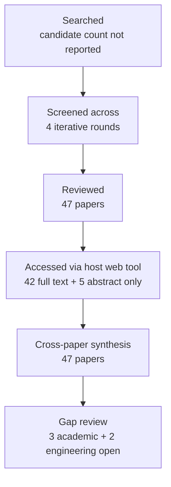

# Research Report: Empirical Reply-to-Proposition Alignment in Email and Dialogue

## Contents

- [Round History](#round-history)
- [Executive Summary](#executive-summary)
- [Research Question](#research-question)
- [Methodology](#methodology)
- [Papers Reviewed](#papers-reviewed)
- [Research Landscape](#research-landscape)
- [Confidence-Graded Findings](#confidence-graded-findings)
- [Research Gaps](#research-gaps)
- [Practical Recommendations](#practical-recommendations)
- [Evidence Map](#evidence-map)
- [References](#references)
- [Appendix: Run Metadata](#appendix-run-metadata)

## Round History

Iterative gap-closure loop (hard cap: 4 rounds). See `references/iterative-synthesis.md` for the full loop definition.

| Round | Run ID | Topic / Gap Focus | New Papers | Gaps Addressed | Remaining Gaps |
|-------|--------|-------------------|------------|----------------|----------------|
| 1 | 769bfc7cfebf | reference resolution to propositions and the semantic scope of replies in work communication | 13 | initial shortlist | 3 academic, 2 engineering |
| 2 | f72f7f513e9d | empirical reply-to-proposition alignment in email and dialogue, focusing on partial replies, multiple questions, unanswered questions, and multi-proposition antecedents | 13 | 0 resolved | 3 academic, 2 engineering |
| 3 | 5633fba0b695 | proposition-level response scope in workplace email and dialogue, with emphasis on partial replies to multi-question or multi-proposition antecedents, unanswered subquestions, approval/rejection scope, and multi-antecedent response links | 12 | 0 resolved | 3 academic, 2 engineering |
| 4 | 347e4c36d5de | direct empirical studies of proposition-level partial reply scope in workplace email or enterprise dialogue, especially multi-question messages, unanswered subquestions, scoped approval/rejection, and responses linked jointly to multiple antecedent propositions | 9 | academic gaps of the previous round | 3 academic, 2 engineering |

**Stop reason**: 4-round cap reached

## Executive Summary

This review examined whether replies in email and dialogue can be safely aligned at message level, or whether systems such as msgloom require proposition-level response scope with explicit handling of partial replies, multiple questions, unanswered components, and multiple or composite antecedents. Across 47 reviewed papers, the strongest [HIGH] finding is that a single message-to-message edge is insufficient: empirical studies document selective answers, explicit unanswered questions, non-adjacent replies, one-to-many and many-to-one alignments, multi-parent discourse relations, and references whose antecedent is a composite of several propositions [doi-10-1016-j-pragma-2010-04-002] [doi-10-3115-1220355-1220483] [doi-10-1609-aaai-v33i01-3301134] [doi-10-5087-dad-2020-104]. The evidence also strongly supports explicit ambiguity and no-link outcomes rather than forced attachment [manual-e4d6ad7ca1] [2403.16609] [doi-10-5210-dad-2023-201]. The most significant unresolved gap is direct validation of proposition-level approval, rejection, agreement, clarification, and mixed request/question scope in authentic workplace email or enterprise chat; existing workplace evidence is substantially stronger for question-answer alignment than for these broader response relations [doi-10-1145-3209978-3210046] [doi-10-3115-1220355-1220483] [doi-10-1177-002383099603900306].

**Scope**: 47 papers analyzed from publisher, anthology, preprint, institutional-repository, and author/research-hosted sources over 1977–2024  
**Overall Confidence**: Medium  
**Verdict**: HAS_GAPS

## Research Question

The review investigated the following question:

> What empirical and computational evidence supports resolving replies in email and dialogue to exact antecedent propositions or proposition sets, particularly when a message contains multiple questions or requests, only some components are answered, questions remain unanswered, approval or rejection has limited scope, or one response depends on multiple antecedent propositions?

The in-scope representation is:

\[
L \subseteq R \times P
\]

where $R$ is the set of response spans and $P$ is the set of antecedent propositions or structured discourse spans. A response may therefore have zero, one, or multiple links rather than exactly one.

Each candidate link additionally requires a relation such as answer, agreement, rejection, clarification, condition, or reference, together with scope such as exact, partial, ambiguous, or unsupported.

Included evidence covers workplace email, customer-service conversation, institutional dialogue, dialogue discourse parsing, question-response organization, discourse deixis, abstract/propositional anaphora, event reference, and acceptance/rejection where these bear directly on response-target representation.

Excluded as independently sufficient evidence are named-entity coreference, quotation/source attribution, generic stance without target identification, speech-act classification without antecedent scope, whole-message NLI without target localization, and QA benchmarks where the antecedent question is supplied as gold and alignment is not part of the task.

## Methodology

### Search Strategy

- **Sources**: Papers were read through the host's web tool using arXiv, ACL Anthology, publisher pages, institutional repositories, ResearchGate-hosted copies, author/research-group sites, workshop sites, and other URLs listed in the run artifacts.
- **Query variants**:
  - `direct empirical studies proposition-level partial reply workplace email enterprise dialogue, especially multi-question messages, unanswered subquestions, scoped approval/rejection, responses linked jointly multiple antecedent propositions`
  - `direct empirical studies`
  - `direct proposition-level partial reply workplace email enterprise dialogue, especially multi-question messages, unanswered subquestions, scoped approval/rejection, responses linked jointly multiple antecedent propositions`
  - `empirical proposition-level partial reply workplace email enterprise dialogue, especially multi-question messages, unanswered subquestions, scoped approval/rejection, responses linked jointly multiple antecedent propositions`
  - `studies proposition-level partial reply workplace email enterprise dialogue, especially multi-question messages, unanswered subquestions, scoped approval/rejection, responses linked jointly multiple antecedent propositions`
  - `direct empirical studies proposition-level partial`
  - `direct empirical studies reply workplace`
  - `direct empirical studies email enterprise`
- **Time window**: 1977–2024.
- **Screening**: Iterative topic- and gap-focused screening over four rounds. The supplied run artifacts do not report whether candidate ranking used BM25 alone or BM25 plus a sub-agent, so that implementation detail remains unknown.
- **Admission principle**: Direct target-domain evidence was preferred. Transfer literature was retained where it supplied evidence about proposition-level antecedents, ambiguity, response attachment, discourse structure, or evaluation that was directly relevant to the msgloom representation.

### Access Level of Reviewed Papers

All papers were read through the host's web tool at the following access levels:

| Paper | Access level |
|---|---|
| [1706.02256] | full_text |
| [2306.15103] | full_text |
| [2403.16609] | full_text |
| [doi-10-1007-bf00351935] | full_text |
| [doi-10-1007-bf00983299] | abstract_only |
| [doi-10-1007-s10489-013-0481-1] | abstract_only |
| [doi-10-1016-j-pragma-2007-07-011] | abstract_only |
| [doi-10-1016-j-pragma-2010-04-002] | full_text |
| [doi-10-1016-j-pragma-2018-03-015] | full_text |
| [doi-10-1093-jos-17-1-51] | abstract_only |
| [doi-10-1109-icaicta63815-2024-10762999] | full_text |
| [doi-10-1145-3209978-3210046] | full_text |
| [doi-10-1162-coli-a-00327] | full_text |
| [doi-10-1177-002383099603900306] | full_text |
| [doi-10-1515-ling-2018-0008] | full_text |
| [doi-10-1515-text-2003-021] | full_text |
| [doi-10-15398-jlm-v4i2-173] | full_text |
| [doi-10-15760-mcnair-2019-13-1-2] | abstract_only |
| [doi-10-1609-aaai-v33i01-3301134] | full_text |
| [doi-10-18653-v1-2021-codi-sharedtask-1] | full_text |
| [doi-10-18653-v1-2021-naacl-main-329] | full_text |
| [doi-10-18653-v1-2022-emnlp-main-778] | full_text |
| [doi-10-18653-v1-2023-eacl-main-247] | full_text |
| [doi-10-18653-v1-2023-findings-acl-710] | full_text |
| [doi-10-18653-v1-d15-1109] | full_text |
| [doi-10-18653-v1-p17-1009] | full_text |
| [doi-10-18653-v1-s15-1035] | full_text |
| [doi-10-3115-1220355-1220483] | full_text |
| [doi-10-3115-1708376-1708429] | full_text |
| [doi-10-3115-v1-d14-1056] | full_text |
| [doi-10-3233-aic-2012-0516] | full_text |
| [doi-10-3765-sp-5-6] | full_text |
| [doi-10-5087-dad-2020-104] | full_text |
| [doi-10-5210-dad-2022-203] | full_text |
| [doi-10-5210-dad-2023-201] | full_text |
| [manual-555fa5b6e8] | full_text |
| [manual-5a32708675] | full_text |
| [manual-5c0971730d] | full_text |
| [manual-7743c50805] | full_text |
| [manual-849c5f1c6d] | full_text |
| [manual-8b8a394daa] | full_text |
| [manual-a6314f615a] | full_text |
| [manual-ad98de9372] | full_text |
| [manual-b0133009f6] | full_text |
| [manual-be69c3aa17] | full_text |
| [manual-e1981ecd9a] | full_text |
| [manual-e4d6ad7ca1] | full_text |

### Pipeline Summary

| Metric | Count |
|--------|-------|
| Total candidates | unknown |
| After screening | 47 reviewed papers |
| Downloaded | unknown; access was through the host web tool |
| Successfully converted | unknown |
| Deeply analyzed / synthesized | 47 |
| Full-text access | 42 |
| Abstract-only access | 5 |
| Iterations | 4 |

## Papers Reviewed

Quality scores were not supplied by the pipeline and are therefore reported as unknown rather than reconstructed retrospectively.

| # | Title | Authors | Year | Venue | Quality Score | Relevance |
|---|-------|---------|------|-------|--------------|-----------|
| 1 | Characterizing and Supporting Question Answering in Human-to-Human Communication [doi-10-1145-3209978-3210046] | Xiao Yang, Ahmed Hassan Awadallah, Madian Khabsa et al. | 2018 | unknown in supplied metadata | unknown | HIGH |
| 2 | Automatically Selecting Answer Templates to Respond to Customer Emails [manual-849c5f1c6d] | Rahul Malik, L. Venkata Subramaniam, Saroj Kaushik | 2007 | unknown in supplied metadata | unknown | HIGH |
| 3 | A coding scheme for question–response sequences in conversation [doi-10-1016-j-pragma-2010-04-002] | Tanya Stivers, N. J. Enfield | 2010 | unknown in supplied metadata | unknown | HIGH |
| 4 | Modelling Structures for Situated Discourse [doi-10-5087-dad-2020-104] | Nicholas Asher, Julie Hunter, Kate Thompson | 2020 | unknown in supplied metadata | unknown | HIGH |
| 5 | Multi-unit questions in institutional interactions: Sequential organizations and communicative functions [doi-10-1515-text-2003-021] | Per Linell, Johan Hofvendahl, Camilla Lindholm | 2003 | unknown in supplied metadata | unknown | HIGH |
| 6 | Abstract Pronominal Anaphora in Three Registers of English [doi-10-15760-mcnair-2019-13-1-2] | Dominique H. O'Donnell | 2019 | unknown in supplied metadata | unknown | MEDIUM |
| 7 | Structured Dialogue Discourse Parsing [2306.15103] | Ta-Chung Chi, Alexander I. Rudnicky | 2022 | unknown in supplied metadata | unknown | HIGH |
| 8 | Anaphoric Annotation in the ARRAU Corpus [manual-e4d6ad7ca1] | Massimo Poesio, Ron Artstein | 2008 | unknown in supplied metadata | unknown | HIGH |
| 9 | The CODI-CRAC 2022 Shared Task on Anaphora, Bridging, and Discourse Deixis in Dialogue [manual-b0133009f6] | Juntao Yu, Sopan Khosla, Ramesh Manuvinakurike et al. | 2022 | unknown in supplied metadata | unknown | HIGH |
| 10 | Stay Together: A System for Single and Split-antecedent Anaphora Resolution [doi-10-18653-v1-2021-naacl-main-329] | Juntao Yu, Nafise Sadat Moosavi, Silviu Paun et al. | 2021 | unknown in supplied metadata | unknown | HIGH |
| 11 | Syntax and semantics of questions [doi-10-1007-bf00351935] | Lauri Karttunen | 1977 | unknown in supplied metadata | unknown | MEDIUM |
| 12 | Resolving abstract anaphors in Spanish discourse: Underspecification and mereological structures [manual-8b8a394daa] | Iker Zulaica-Hernández | 2018 | unknown in supplied metadata | unknown | HIGH |
| 13 | Information Structure: Towards an integrated formal theory of pragmatics [doi-10-3765-sp-5-6] | Craige Roberts | 2012 | unknown in supplied metadata | unknown | HIGH |
| 14 | A Mention-Ranking Model for Abstract Anaphora Resolution [1706.02256] | Ana Marasović, Leo Born, Juri Opitz et al. | 2017 | unknown in supplied metadata | unknown | MEDIUM |
| 15 | End-to-End Neural Discourse Deixis Resolution in Dialogue [doi-10-18653-v1-2022-emnlp-main-778] | Shengjie Li, Vincent Ng | 2022 | unknown in supplied metadata | unknown | HIGH |
| 16 | A Twin-Candidate Based Approach for Event Pronoun Resolution using Composite Kernel [manual-5c0971730d] | Bin Chen, Jian Su, Chew Lim Tan | 2010 | unknown in supplied metadata | unknown | MEDIUM |
| 17 | Resolving Shell Nouns [doi-10-3115-v1-d14-1056] | Varada Kolhatkar, Graeme Hirst | 2014 | unknown in supplied metadata | unknown | MEDIUM |
| 18 | Resolving questions, II [doi-10-1007-bf00983299] | Jonathan Ginzburg | 1995 | unknown in supplied metadata | unknown | MEDIUM |
| 19 | Resolving Event Noun Phrases to Their Verbal Mentions [manual-555fa5b6e8] | Bin Chen, Jian Su, Chew Lim Tan | 2010 | unknown in supplied metadata | unknown | MEDIUM |
| 20 | Anaphora With Non-nominal Antecedents in Computational Linguistics: a Survey [doi-10-1162-coli-a-00327] | Varada Kolhatkar, Adam Roussel, Stefanie Dipper et al. | 2018 | unknown in supplied metadata | unknown | HIGH |
| 21 | Joint Learning for Event Coreference Resolution [doi-10-18653-v1-p17-1009] | Jing Lu, Vincent Ng | 2017 | unknown in supplied metadata | unknown | MEDIUM |
| 22 | The CODI-CRAC 2021 Shared Task on Anaphora, Bridging, and Discourse Deixis in Dialogue [doi-10-18653-v1-2021-codi-sharedtask-1] | Sopan Khosla, Juntao Yu, Ramesh Manuvinakurike et al. | 2021 | unknown in supplied metadata | unknown | HIGH |
| 23 | Detection of Question-Answer Pairs in Email Conversations [manual-a6314f615a] | Lokesh Shrestha, Kathleen McKeown | 2004 | unknown in supplied metadata | unknown | HIGH |
| 24 | Learning to Align Question and Answer Utterances in Customer Service Conversation with Recurrent Pointer Networks [doi-10-1609-aaai-v33i01-3301134] | Shizhu He, Kang Liu, Weiting An | 2019 | unknown in supplied metadata | unknown | HIGH |
| 25 | Automatic Question-Answer Alignment for Japanese Diverse Local Assembly Minutes [doi-10-1109-icaicta63815-2024-10762999] | Yoshiki Higashiyama, Tomoyosi Akiba | 2024 | unknown in supplied metadata | unknown | MEDIUM |
| 26 | Multiple questions in oral proficiency interviews [doi-10-1016-j-pragma-2007-07-011] | Gabriele Kasper, Steven J. Ross | 2007 | unknown in supplied metadata | unknown | HIGH |
| 27 | Overview of the NTCIR-16 QA Lab-PoliInfo-3 Task [manual-5a32708675] | Yasutomo Kimura, Hideyuki Shibuki, Hokuto Ototake et al. | 2022 | unknown in supplied metadata | unknown | MEDIUM |
| 28 | Detection of imperative and declarative question–answer pairs in email conversations [doi-10-3233-aic-2012-0516] | Helen Kwong, Neil Yorke-Smith | 2012 | unknown in supplied metadata | unknown | HIGH |
| 29 | Annotating Abstract Pronominal Anaphora in the DAD Project [manual-be69c3aa17] | Costanza Navarretta, Sussi Olsen | 2008 | unknown in supplied metadata | unknown | HIGH |
| 30 | A simple but effective model for attachment in discourse parsing with multi-task learning for relation labeling [doi-10-18653-v1-2023-eacl-main-247] | Zineb Bennis, Julie Hunter, Nicholas Asher | 2023 | unknown in supplied metadata | unknown | HIGH |
| 31 | Identifying reference to abstract objects in dialogue [manual-7743c50805] | Ron Artstein, Massimo Poesio | 2006 | unknown in supplied metadata | unknown | HIGH |
| 32 | Resolving Discourse-Deictic Pronouns: A Two-Stage Approach to Do It [doi-10-18653-v1-s15-1035] | Sujay Kumar Jauhar, Raul Guerra, Edgar Gonzàlez Pellicer et al. | 2015 | unknown in supplied metadata | unknown | HIGH |
| 33 | Towards identifying unresolved discussions in student online forums [doi-10-1007-s10489-013-0481-1] | Jihie Kim, Jeon Hyung Kang | 2014 | unknown in supplied metadata | unknown | MEDIUM |
| 34 | Discourse parsing for multi-party chat dialogues [doi-10-18653-v1-d15-1109] | Stergos Afantenos, Eric Kow, Nicholas Asher et al. | 2015 | unknown in supplied metadata | unknown | HIGH |
| 35 | Dialogue Acts, Synchronizing Units, and Anaphora Resolution [doi-10-1093-jos-17-1-51] | Miriam Eckert, Michael Strube | 2000 | unknown in supplied metadata | unknown | MEDIUM |
| 36 | ‘But what is the reason why you know such things?’: Question and response patterns in the LADO interview [doi-10-1016-j-pragma-2018-03-015] | Alison Channon, Paul Foulkes, Traci Sue Walker | 2018 | unknown in supplied metadata | unknown | HIGH |
| 37 | Contrasting the Interaction Structure of an Email and a Telephone Corpus: A Machine Learning Approach to Annotation of Dialogue Function Units [doi-10-3115-1708376-1708429] | Jun Hu, Rebecca Passonneau, Owen Rambow | 2009 | unknown in supplied metadata | unknown | HIGH |
| 38 | Characterizing the Response Space of Questions: data and theory [doi-10-5210-dad-2022-203] | Jonathan Ginzburg, Zulipiye Yusupujiang, Chuyuan Li et al. | 2022 | unknown in supplied metadata | unknown | HIGH |
| 39 | Discourse Analysis via Questions and Answers: Parsing Dependency Structures of Questions Under Discussion [doi-10-18653-v1-2023-findings-acl-710] | Wei-Jen Ko, Yating Wu, Cutter Dalton et al. | 2023 | unknown in supplied metadata | unknown | HIGH |
| 40 | Detection of Question-Answer Pairs in Email Conversations [doi-10-3115-1220355-1220483] | Lokesh Shrestha, Kathleen McKeown | 2004 | unknown in supplied metadata | unknown | HIGH |
| 41 | Query responses [doi-10-15398-jlm-v4i2-173] | Paweł Łupkowski, Jonathan Ginzburg | 2017 | unknown in supplied metadata | unknown | HIGH |
| 42 | Scoring Coreference Chains with Split-Antecedent Anaphors [doi-10-5210-dad-2023-201] | Silviu Paun, Juntao Yu, Nafise Sadat Moosavi et al. | 2023 | unknown in supplied metadata | unknown | HIGH |
| 43 | Conversational Grounding: Annotation and Analysis of Grounding Acts and Grounding Units [2403.16609] | Biswesh Mohapatra, Seemab Hassan, Laurent Romary et al. | 2024 | unknown in supplied metadata | unknown | HIGH |
| 44 | The DAD Parallel Corpora and their Uses [manual-ad98de9372] | Costanza Navarretta | 2010 | unknown in supplied metadata | unknown | MEDIUM |
| 45 | Answering Clarification Questions [manual-e1981ecd9a] | Matthew Purver, Patrick G.T. Healey, James King et al. | 2003 | unknown in supplied metadata | unknown | HIGH |
| 46 | Inferring Acceptance and Rejection in Dialogue by Default Rules of Inference [doi-10-1177-002383099603900306] | Marilyn A. Walker | 1996 | unknown in supplied metadata | unknown | HIGH |
| 47 | Resolving abstract anaphors in Spanish discourse: Underspecification and mereological structures [doi-10-1515-ling-2018-0008] | Iker Zulaica Hernández | 2018 | unknown in supplied metadata | unknown | HIGH |

## Research Landscape

### Theme 1: Partial Replies, Multiple Questions, and Unresolved Components

**Coverage**: multiple direct email and dialogue studies | **Confidence**: High  
**Supporting papers**: [doi-10-1016-j-pragma-2010-04-002], [manual-849c5f1c6d], [doi-10-3115-1220355-1220483], [doi-10-3233-aic-2012-0516], [doi-10-1016-j-pragma-2018-03-015]

The literature rejects an implicit assumption that one reply exhaustively resolves the content of a preceding message. Conversation coding distinguishes response types at the level of individual questions, while email studies identify messages containing multiple questions, incomplete responses, unanswered questions, and mappings in which answer material aligns only to a subset of preceding questions [doi-10-1016-j-pragma-2010-04-002] [manual-849c5f1c6d] [doi-10-3115-1220355-1220483].

Key findings:

1. [HIGH] Multi-question messages can receive selective rather than exhaustive responses; therefore closure should be determined per component rather than per message [doi-10-1016-j-pragma-2010-04-002] [manual-849c5f1c6d] [doi-10-1016-j-pragma-2018-03-015].
2. [HIGH] Explicit unanswered status is needed because subsequent coherent discourse does not imply that every prior question was answered [doi-10-3115-1220355-1220483] [doi-10-3115-1708376-1708429] [doi-10-15398-jlm-v4i2-173].

### Theme 2: Non-Local and Non-Bijective Response Alignment

**Coverage**: email, customer service, multi-party dialogue, grounding | **Confidence**: High  
**Supporting papers**: [doi-10-3115-1220355-1220483], [doi-10-1609-aaai-v33i01-3301134], [doi-10-3233-aic-2012-0516], [doi-10-18653-v1-d15-1109], [2403.16609]

Response alignment is not reliably recoverable from adjacency or transport-level reply structure. Email and multi-thread dialogue can contain semantically valid responses to older material, and several studies support structures where one response links to more than one prior question or discourse unit [doi-10-3115-1220355-1220483] [doi-10-1609-aaai-v33i01-3301134] [doi-10-18653-v1-d15-1109].

Key findings:

1. [HIGH] Adjacency, nearest-turn, and Reply/Reply-All structure are insufficient as semantic scope rules [doi-10-3115-1220355-1220483] [2403.16609] [doi-10-18653-v1-d15-1109].
2. [HIGH] Response structure is fundamentally non-bijective: one response can address several antecedents and one antecedent can receive several response links [doi-10-1609-aaai-v33i01-3301134] [doi-10-3233-aic-2012-0516] [doi-10-18653-v1-2023-eacl-main-247].

### Theme 3: Composite and Abstract Antecedents

**Coverage**: discourse deixis, abstract anaphora, split antecedents, structured discourse | **Confidence**: High  
**Supporting papers**: [doi-10-1515-ling-2018-0008], [manual-8b8a394daa], [doi-10-5087-dad-2020-104], [doi-10-1162-coli-a-00327], [doi-10-5210-dad-2023-201]

Abstract-reference research shows that a target need not correspond to one nominal mention or one contiguous clause. Sets of propositions or discourse units can jointly create an abstract antecedent, while split-antecedent evaluation explicitly addresses cases in which several antecedent elements jointly support one anaphoric interpretation [doi-10-1515-ling-2018-0008] [doi-10-5087-dad-2020-104] [doi-10-5210-dad-2023-201].

Key findings:

1. [HIGH] Coherent sets of propositions can jointly constitute the antecedent of a later expression or response [doi-10-1515-ling-2018-0008] [doi-10-5087-dad-2020-104] [doi-10-18653-v1-d15-1109].
2. [HIGH] Multiple independent antecedent edges and one composite antecedent are distinct representations that both need to remain available [doi-10-18653-v1-2023-eacl-main-247] [doi-10-5087-dad-2020-104] [doi-10-1515-ling-2018-0008].

### Theme 4: Antecedent Boundary Ambiguity and Evaluation

**Coverage**: abstract anaphora, ARRAU/DAD annotation, split antecedents | **Confidence**: High  
**Supporting papers**: [doi-10-1162-coli-a-00327], [manual-7743c50805], [manual-e4d6ad7ca1], [manual-be69c3aa17], [doi-10-5210-dad-2023-201]

Exact non-nominal antecedent boundaries are difficult to annotate consistently. The problem is not merely model error: annotations can contain genuine ambiguity over the exact span or alternative antecedent analysis [manual-7743c50805] [manual-e4d6ad7ca1]. This supports evaluation that distinguishes exact matches from partial overlap rather than mapping every disagreement to a binary failure [doi-10-5210-dad-2023-201].

Key findings:

1. [HIGH] Exact proposition or discourse-segment boundaries are harder than identifying the broader antecedent region [doi-10-1162-coli-a-00327] [manual-7743c50805] [manual-e4d6ad7ca1].
2. [HIGH] Alternative antecedents, ambiguity, and partial-credit evaluation are empirically justified [manual-be69c3aa17] [manual-e4d6ad7ca1] [doi-10-5210-dad-2023-201].

### Theme 5: Structural Interpretation of Multiple Questions

**Coverage**: institutional interaction, oral interviews, LADO interviews | **Confidence**: High  
**Supporting papers**: [doi-10-1016-j-pragma-2007-07-011], [doi-10-1515-text-2003-021], [doi-10-1016-j-pragma-2018-03-015]

A sequence containing several interrogatives cannot safely be converted into the same number of independent open work items. Later questions can reformulate, particularize, repair, narrow, or replace an earlier question [doi-10-1016-j-pragma-2007-07-011] [doi-10-1515-text-2003-021].

Key findings:

1. [HIGH] Counting interrogatives can overstate the number of unresolved obligations [doi-10-1016-j-pragma-2007-07-011] [doi-10-1515-text-2003-021] [doi-10-1016-j-pragma-2018-03-015].
2. [HIGH] Internal relations among question components should be resolved before independent open-question states are created [doi-10-1515-text-2003-021] [doi-10-1016-j-pragma-2018-03-015].

### Theme 6: Proposition-Sensitive Acceptance and Rejection

**Coverage**: general dialogue | **Confidence**: Medium  
**Supporting papers**: [doi-10-1177-002383099603900306]

Acceptance and rejection cannot always be treated as utterance-level polar labels. A response can accept content entailed by or weaker than a prior contribution while failing to accept, or actively rejecting, stronger content [doi-10-1177-002383099603900306].

Key findings:

1. [MEDIUM] Acceptance and rejection may have narrower semantic scope than the preceding utterance as a whole [doi-10-1177-002383099603900306].
2. [LOW] The reviewed corpus does not establish how accurately this phenomenon can be detected for authentic workplace approvals, commitments, or mixed request/condition structures.

### Theme 7: Attachment, Relation Labeling, and Structural Signals

**Coverage**: structured dialogue discourse parsing, discourse attachment, event/anaphora models | **Confidence**: Medium  
**Supporting papers**: [2306.15103], [doi-10-18653-v1-2023-eacl-main-247], [doi-10-18653-v1-s15-1035], [doi-10-18653-v1-p17-1009]

Attachment and relation labeling are structurally coupled. Models benefit from speaker, turn, and dialogue-context information, while joint or multi-task approaches can exploit shared structure [2306.15103] [doi-10-18653-v1-2023-eacl-main-247].

Key findings:

1. [MEDIUM] Response/anaphor detection, antecedent selection, attachment, and relation labeling should remain separately observable even if some are trained jointly [manual-b0133009f6] [doi-10-18653-v1-s15-1035] [2306.15103].
2. [MEDIUM] Structural signals such as speaker and dialogue topology can improve candidate ranking, but no reviewed paper establishes a workplace-optimal architecture [2306.15103] [doi-10-18653-v1-2023-eacl-main-247].

## Methodology Comparison

| Approach | Papers | Strengths | Weaknesses | Best For | Performance |
|----------|--------|-----------|------------|----------|-------------|
| Question-answer alignment | [doi-10-3115-1220355-1220483], [doi-10-3233-aic-2012-0516], [doi-10-1609-aaai-v33i01-3301134] | Directly models which prior question a response answers; includes non-adjacent and one-to-many structures | Primarily interrogatives; does not fully cover approval, rejection, condition, or mixed request semantics | Email/customer-service question resolution | Metrics not normalized across studies |
| Dialogue discourse parsing | [2306.15103], [doi-10-18653-v1-2023-eacl-main-247], [doi-10-18653-v1-d15-1109] | Jointly represents attachment and discourse relation; captures non-local structure | Tree-constrained approaches can omit genuine multi-parent relations | Response attachment and structural candidate generation | Benchmarks are not directly comparable to email QA |
| Discourse deixis / abstract anaphora | [doi-10-18653-v1-2022-emnlp-main-778], [manual-e4d6ad7ca1], [doi-10-1162-coli-a-00327], [manual-7743c50805] | Exact/partial span targets, ambiguity, non-nominal antecedents | Reference resolution is not equivalent to reply scope | Antecedent representation and ambiguity handling | Metrics vary by corpus and antecedent definition |
| Split/multiple antecedent modeling | [doi-10-18653-v1-2021-naacl-main-329], [doi-10-5210-dad-2023-201] | Represents antecedents composed from multiple mentions; supports partial-credit evaluation | Mostly coreference/anaphora rather than response semantics | Composite antecedent objects and scoring | Not directly comparable with response alignment |
| Conversation-analysis coding | [doi-10-1016-j-pragma-2010-04-002], [doi-10-1515-text-2003-021], [doi-10-1016-j-pragma-2018-03-015] | Fine-grained empirical account of response and question structure | Usually not an end-to-end computational system | Gold taxonomy and adversarial test design | Computational performance not applicable |
| Acceptance/rejection inference | [doi-10-1177-002383099603900306] | Explicitly proposition-sensitive | Limited direct enterprise evidence | Scoped agreement/rejection semantics | Workplace performance unknown |

## Confidence-Graded Findings

### 🟢 High Confidence (supported by 3+ papers with consistent results)

1. **[HIGH] Multi-question messages frequently receive selective rather than exhaustive responses, so coverage must be represented per component question or proposition.** Supported by [doi-10-1016-j-pragma-2010-04-002], [manual-849c5f1c6d], and [doi-10-1016-j-pragma-2018-03-015].

2. **[HIGH] Unresolved/no-link status is an empirically necessary output.** Questions and clarification attempts can remain unanswered despite subsequent discourse [doi-10-3115-1220355-1220483] [doi-10-3115-1708376-1708429] [doi-10-15398-jlm-v4i2-173] [manual-e1981ecd9a].

3. **[HIGH] Semantic response scope cannot be inferred reliably from adjacency or transport-level reply structure.** Email and dialogue contain non-adjacent responses and concurrent threads [doi-10-3115-1220355-1220483] [2403.16609] [doi-10-18653-v1-d15-1109].

4. **[HIGH] Non-bijective alignment is a core representational requirement.** One response may target multiple antecedents, one antecedent may receive multiple responses, and discourse units can have multiple parents [doi-10-1609-aaai-v33i01-3301134] [doi-10-3233-aic-2012-0516] [doi-10-18653-v1-2023-eacl-main-247] [doi-10-18653-v1-d15-1109].

5. **[HIGH] Composite proposition-level antecedents are linguistically supported.** Several propositions or discourse units can jointly constitute one later target [doi-10-1515-ling-2018-0008] [manual-8b8a394daa] [doi-10-5087-dad-2020-104] [doi-10-18653-v1-d15-1109].

6. **[HIGH] Exact antecedent boundaries require ambiguity-aware and partial-overlap evaluation.** Exact spans are often substantially harder to determine than general antecedent regions [doi-10-1162-coli-a-00327] [manual-7743c50805] [manual-e4d6ad7ca1] [doi-10-5210-dad-2023-201].

7. **[HIGH] Multiple interrogatives must be structurally interpreted before creating independent unresolved obligations.** Reformulation, particularization, repair, replacement, and collateral-question structures are documented [doi-10-1016-j-pragma-2007-07-011] [doi-10-1515-text-2003-021] [doi-10-1016-j-pragma-2018-03-015].

8. **[HIGH] Recency is a useful prior but should not be a hard semantic cutoff.** Strongly local phenomena coexist with valid long-distance email and dialogue links [doi-10-18653-v1-2022-emnlp-main-778] [manual-e1981ecd9a] [doi-10-3115-1220355-1220483] [manual-555fa5b6e8].

### 🟡 Medium Confidence (supported by 1-2 papers or with caveats)

1. **[MEDIUM] Acceptance and rejection can have narrower scope than the entire preceding utterance.** Proposition-sensitive inference is directly developed in [doi-10-1177-002383099603900306], but corresponding workplace approval/rejection evidence is sparse.

2. **[MEDIUM] Separating detection, antecedent selection, attachment, relation labeling, and scope classification is a useful engineering decomposition even when some components are modeled jointly.** Evidence comes from shared-task, discourse-deixis, structured-parsing, and event-coreference work [manual-b0133009f6] [doi-10-18653-v1-s15-1035] [2306.15103] [doi-10-18653-v1-2023-eacl-main-247] [doi-10-18653-v1-p17-1009].

### 🔴 Low Confidence (preliminary, single-source, or contradicted)

1. **[LOW] Existing literature can directly determine production thresholds for workplace approval, rejection, commitment, or clarification scope.** The reviewed evidence does not support this claim; direct workplace studies concentrate primarily on question-answer linkage [doi-10-1145-3209978-3210046] [doi-10-3115-1220355-1220483].

2. **[LOW] A single universal locality window can safely constrain antecedent search across email and dialogue.** Evidence is genre- and relation-dependent and points in different directions [doi-10-18653-v1-2022-emnlp-main-778] [manual-e1981ecd9a] [doi-10-3115-1220355-1220483] [2403.16609].

## Trade-Off Analysis

| Decision | Option A | Option B | Recommendation |
|----------|----------|----------|----------------|
| Response representation | One message-to-message edge: simple but over-broad for partial replies | Proposition/span-level zero-or-many links: more complex but supported by QA, discourse, and anaphora evidence | Use proposition/span-level links [doi-10-3115-1220355-1220483] [doi-10-1609-aaai-v33i01-3301134] |
| Uncertain target | Force best antecedent: maximizes link coverage but creates unsupported commitments | Preserve no-link/ambiguity: lowers forced coverage but maintains evidential correctness | Preserve no-link and alternatives [manual-e4d6ad7ca1] [2403.16609] |
| Recency | Hard window: efficient but can exclude valid older links | Ranking prior: retains non-local candidates | Treat recency as a prior, not a hard cutoff [doi-10-18653-v1-2022-emnlp-main-778] [doi-10-3115-1220355-1220483] |
| Multiple antecedents | Force one antecedent or flatten all spans | Support independent edges plus composite objects | Support both structures [doi-10-5087-dad-2020-104] [doi-10-1515-ling-2018-0008] |
| Question decomposition | Every interrogative becomes an obligation | First determine reformulation/repair/particularization/independence | Interpret structure before opening obligations [doi-10-1515-text-2003-021] [doi-10-1016-j-pragma-2018-03-015] |
| Evaluation | Binary exact-match only | Exact + overlap + no-link + multi-antecedent partial credit | Use layered link-level scoring [manual-e4d6ad7ca1] [doi-10-5210-dad-2023-201] |
| Error policy | Equal FP/FN cost | Product-specific asymmetric error cost | Validate asymmetric policy empirically; literature does not supply msgloom thresholds [2403.16609] [doi-10-5210-dad-2023-201] |

A suitable engineering loss should therefore permit asymmetric costs:

\[
C = \lambda_{\mathrm{FP}} FP + \lambda_{\mathrm{FN}} FN + \lambda_{\mathrm{scope}} E_{\mathrm{scope}}
\]

where $E_{\mathrm{scope}}$ measures over-broad or otherwise incorrect scope. The literature supports distinguishing these errors, but it does not determine the appropriate msgloom values of $\lambda_{\mathrm{FP}}$, $\lambda_{\mathrm{FN}}$, or $\lambda_{\mathrm{scope}}$ [2403.16609] [doi-10-5210-dad-2023-201].

## Points of Agreement **[EVIDENCE REQUIRED]**

1. [HIGH] **Reply scope must be represented below whole-message level when the antecedent contains multiple questions or propositions.** Confirmed by email, customer-service, and conversation studies [manual-849c5f1c6d] [doi-10-3115-1220355-1220483] [doi-10-1609-aaai-v33i01-3301134] [doi-10-1016-j-pragma-2010-04-002].

2. [HIGH] **No-link/unresolved outcomes cannot be treated as annotation failure.** They reflect real unanswered or unsupported cases [doi-10-3115-1220355-1220483] [doi-10-15398-jlm-v4i2-173] [2403.16609].

3. [HIGH] **Multiple antecedents are legitimate.** Both dialogue attachment and abstract-anaphora literature support structures involving more than one antecedent unit [doi-10-18653-v1-d15-1109] [doi-10-5087-dad-2020-104] [doi-10-5210-dad-2023-201].

4. [HIGH] **Ambiguity should survive into representation and evaluation rather than being silently collapsed.** Annotation work explicitly motivates alternative candidates or partial overlap [manual-e4d6ad7ca1] [manual-be69c3aa17] [manual-7743c50805].

5. [HIGH] **Message adjacency is an imperfect semantic proxy.** Valid links may cross intervening turns or messages [doi-10-3115-1220355-1220483] [doi-10-18653-v1-d15-1109] [2403.16609].

## Points of Contradiction **[EVIDENCE REQUIRED]**

1. **[HIGH] Locality of antecedents and answers**: discourse-deixis and clarification studies indicate strong locality [doi-10-18653-v1-2022-emnlp-main-778] [manual-e1981ecd9a], whereas asynchronous email and multi-thread dialogue contain semantically valid links to older material [doi-10-3115-1220355-1220483] [2403.16609] [doi-10-18653-v1-d15-1109].
   - **Possible explanation**: Genre and relation type differ substantially.
   - **Implication**: Recency should influence ranking but should not define a universal hard search window.

2. **[HIGH] Stack-shaped versus partially ordered issue structure**: QUD-based work models unresolved questions using stack-like organization [doi-10-3765-sp-5-6], while query-response analysis argues that some response classes require several simultaneously accessible issues organized less strictly than LIFO [doi-10-15398-jlm-v4i2-173].
   - **Possible explanation**: Different response phenomena require different accessibility structures.
   - **Implication**: msgloom should not assume that the most recently raised unresolved item is the only available response target.

3. **[HIGH] Tree-constrained attachment versus genuine multi-parent structure**: globally structured tree parsing is computationally useful [2306.15103], while STAC-related work documents multi-parent/non-tree relations [doi-10-18653-v1-2023-eacl-main-247] [doi-10-18653-v1-d15-1109] [doi-10-5087-dad-2020-104].
   - **Possible explanation**: A useful benchmark constraint is not necessarily a complete ontology of discourse structure.
   - **Implication**: A tree parser may be used as a candidate mechanism, but the persistent representation should not prohibit multiple parents.

4. **[HIGH] One-to-one alignment assumptions versus observed one-to-many scope**: assembly-minutes alignment uses a one-to-one algorithm [doi-10-1109-icaicta63815-2024-10762999], whereas customer-service and email studies explicitly allow or observe one answer aligned to multiple questions [doi-10-1609-aaai-v33i01-3301134] [doi-10-3233-aic-2012-0516].
   - **Possible explanation**: Annotation contracts and genres differ.
   - **Implication**: One-to-one matching should not be imposed unless the application ontology guarantees it.

5. **[MEDIUM] Usefulness of syntactic constraints**: syntax benefits some shell-noun configurations [doi-10-3115-v1-d14-1056], while broader abstract-anaphora and event-antecedent work shows that unrestricted syntactic expansions can hurt or add noise [1706.02256] [manual-555fa5b6e8].
   - **Possible explanation**: Syntax is informative for some constructions but not universally aligned with semantic antecedent scope.
   - **Implication**: Syntax should be a selective feature rather than a hard global constraint.

## Research Gaps

All five gaps remain open. The literature has not answered them yet.

| # | Gap | Type | Severity | Rounds Already Searched / Tracked | Impact on Goals |
|---|-----|------|----------|-----------------------------------|----------------|
| 1 | Direct empirical evidence for exact proposition-level agreement, rejection, approval, clarification, and answer scope in authentic workplace email or enterprise chat remains missing [doi-10-1145-3209978-3210046] [doi-10-3115-1220355-1220483] [doi-10-1177-002383099603900306]. | ACADEMIC | HIGH | Rounds 2–4 targeted the relevant workplace proposition-scope problem; Round 4 explicitly targeted academic gaps from the preceding round. | Without this evidence, direct production-domain accuracy claims for approval/commitment scope are unsupported. |
| 2 | A validated combined msgloom annotation/evaluation scheme for exact, partial, ambiguous, unsupported, discontinuous, multiple-antecedent, composite, and no-link outcomes remains missing [manual-e4d6ad7ca1] [manual-be69c3aa17] [doi-10-5210-dad-2023-201] [2403.16609]. | ENGINEERING | HIGH | Tracked across the synthesis; it is not a literature-search closure target because the required combined contract is msgloom-specific. | Without it, model comparison can reward structurally unsafe behavior or hide over-broad links. |
| 3 | Direct evidence for multi-question partial replies is materially stronger, but mixed workplace questions, requests, alternatives, and complete proposition-level unresolved-subquestion detection are not yet validated together [manual-849c5f1c6d] [doi-10-3233-aic-2012-0516] [doi-10-3115-1220355-1220483]. | ACADEMIC | HIGH | Rounds 2–4 searched this area, with Round 4 explicitly focused on multi-question and unanswered-subquestion evidence. | Missing mixed-act validation can cause open work to be incorrectly closed. |
| 4 | It remains unresolved how authentic workplace systems should distinguish one response independently targeting several propositions from one response targeting a single composite multi-proposition discourse object [doi-10-1609-aaai-v33i01-3301134] [doi-10-5087-dad-2020-104] [doi-10-1515-ling-2018-0008] [doi-10-18653-v1-d15-1109]. | ACADEMIC | MEDIUM | Rounds 3–4 directly emphasized multi-antecedent and multi-proposition response links. | The distinction affects lineage, state updates, explanation, and downstream action scope. |
| 5 | msgloom-specific abstention, ambiguity, missing-antecedent, and asymmetric error-cost policies remain unvalidated [2403.16609] [manual-e4d6ad7ca1] [doi-10-3115-1708376-1708429] [doi-10-5210-dad-2023-201]. | ENGINEERING | HIGH | Tracked across the synthesis; not separately closable by additional literature because the product cost function is application-specific. | Incorrect thresholds can convert uncertainty into invented approval or commitment. |

### Academic Gaps (require more papers)

1. **[ACADEMIC][HIGH] Workplace proposition-level approval/rejection/agreement scope**: The literature has not yet answered whether authentic workplace email or enterprise chat exhibits and supports accurate automatic resolution of partial approval, rejection, agreement, clarification, and answer scope at exact proposition level. Suggested query: `"partial reply" OR "response scope" email workplace dialogue proposition agreement rejection approval`.

2. **[ACADEMIC][HIGH] Mixed multi-question/request partial replies**: The literature has not yet fully answered how to detect unresolved components when authentic work messages mix questions, requests, alternatives, conditions, and other obligations rather than containing only interrogatives. Suggested query: `"multiple questions" "partial answer" dialogue email question answer alignment unanswered subquestions`.

3. **[ACADEMIC][MEDIUM] Independent multi-target versus composite target**: The literature has not yet answered how reliably authentic workplace responses can be classified as independently targeting several propositions versus targeting one composite discourse object. Suggested query: `"multi-antecedent" dialogue response "composite antecedent" proposition discourse email`.

### Engineering Gaps (fillable without papers)

1. **[ENGINEERING][HIGH] Combined msgloom annotation and evaluation contract**: The literature supplies ingredients but not the complete required scheme. Suggested resolution: define an independent gold protocol with exact/partial/ambiguous/unsupported/no-link status; allow discontinuous spans, multiple independent links, composite antecedent objects, and alternative analyses; evaluate exact links, span overlap, zero-link outcomes, and multi-antecedent partial credit separately [manual-e4d6ad7ca1] [doi-10-5210-dad-2023-201].

2. **[ENGINEERING][HIGH] Abstention and asymmetric error policy**: The literature has not answered what confidence threshold msgloom should use. Suggested resolution: create independent synthetic/adversarial and later authorized workplace evaluation sets, measure false broad-link and unresolved-link errors separately, and choose thresholds against an explicit cost function such as
   \[
   C=\lambda_{\mathrm{broad}}E_{\mathrm{broad}}+\lambda_{\mathrm{miss}}E_{\mathrm{miss}}+\lambda_{\mathrm{wrong}}E_{\mathrm{wrong}}
   \]
   without treating literature-derived benchmark scores as production thresholds [2403.16609] [doi-10-5210-dad-2023-201].

## Reproducibility Notes

The supplied corpus records access level but does not provide a systematic audit of code repositories, dataset licenses, or executable environments. Unknown fields are therefore left unknown rather than inferred.

| Paper | Code Available | Data Available | Sufficient Detail | License |
|-------|---------------|----------------|-------------------|---------|
| [doi-10-3115-1220355-1220483] | unknown | unknown | full text reviewed | unknown |
| [doi-10-1609-aaai-v33i01-3301134] | unknown | unknown | full text reviewed | unknown |
| [2306.15103] | unknown | unknown | full text reviewed | unknown |
| [doi-10-18653-v1-2023-eacl-main-247] | unknown | unknown | full text reviewed | unknown |
| [doi-10-18653-v1-2022-emnlp-main-778] | unknown | unknown | full text reviewed | unknown |
| [manual-e4d6ad7ca1] | unknown | unknown | full text reviewed | unknown |
| [doi-10-5210-dad-2023-201] | unknown | unknown | full text reviewed | unknown |
| [2403.16609] | unknown | unknown | full text reviewed | unknown |
| [doi-10-1177-002383099603900306] | unknown | unknown | full text reviewed | unknown |
| [doi-10-1016-j-pragma-2010-04-002] | unknown | unknown | full text reviewed | unknown |
| [doi-10-1007-bf00983299] | unknown | unknown | abstract only; insufficient for reproducibility assessment | unknown |
| [doi-10-1016-j-pragma-2007-07-011] | unknown | unknown | abstract only; insufficient for reproducibility assessment | unknown |
| [doi-10-1093-jos-17-1-51] | unknown | unknown | abstract only; insufficient for reproducibility assessment | unknown |
| [doi-10-1007-s10489-013-0481-1] | unknown | unknown | abstract only; insufficient for reproducibility assessment | unknown |
| [doi-10-15760-mcnair-2019-13-1-2] | unknown | unknown | abstract only; insufficient for reproducibility assessment | unknown |

## Practical Recommendations **[EVIDENCE REQUIRED]**

1. **[HIGH] Represent response structure below message level.** Segment candidate questions, propositions, requests, conditions, and decisions, and permit every response span to link to zero, one, or multiple antecedent spans [manual-849c5f1c6d] [doi-10-1609-aaai-v33i01-3301134] [doi-10-18653-v1-d15-1109].  
   *Confidence*: High

2. **[HIGH] Make unresolved/no-link a first-class state.** Do not attach every response to a plausible antecedent or close every earlier question merely because a later message exists [doi-10-3115-1220355-1220483] [doi-10-3115-1708376-1708429] [doi-10-15398-jlm-v4i2-173].  
   *Confidence*: High

3. **[HIGH] Interpret multi-question structure before creating open obligations.** Distinguish independent/collateral questions from reformulation, particularization, repair, and replacement [doi-10-1016-j-pragma-2007-07-011] [doi-10-1515-text-2003-021] [doi-10-1016-j-pragma-2018-03-015].  
   *Confidence*: High

4. **[HIGH] Support both multiple independent antecedent links and composite-antecedent objects.** The two structures should not be collapsed into a single representation [doi-10-5087-dad-2020-104] [doi-10-1515-ling-2018-0008] [doi-10-18653-v1-2023-eacl-main-247].  
   *Confidence*: High

5. **[HIGH] Preserve alternative analyses explicitly.** Store candidate antecedent sets or ambiguity state rather than forcing a single target when evidence cannot distinguish them [2403.16609] [manual-be69c3aa17] [manual-e4d6ad7ca1].  
   *Confidence*: High

6. **[HIGH] Use recency and thread metadata for ranking, not semantic exclusion.** Asynchronous email and multi-thread dialogue contain valid non-local links [doi-10-3115-1220355-1220483] [doi-10-18653-v1-d15-1109].  
   *Confidence*: High

7. **[HIGH] Evaluate at proposition/link level.** Include exact-match, partial-overlap, explicit zero-link scoring, multi-antecedent partial credit, and separate false-positive/false-negative counts [doi-10-5210-dad-2023-201] [manual-7743c50805] [manual-e4d6ad7ca1].  
   *Confidence*: High

8. **[MEDIUM] Weight over-broad positive links separately from unresolved links.** The literature supports the underlying distinction but does not determine msgloom's business cost ratios [2403.16609] [doi-10-3115-1708376-1708429].  
   *Confidence*: Medium

9. **[HIGH] Keep missing-context failures separate from semantic-resolution failures.** If the antecedent is absent from supplied evidence, retain an unresolved reference for Topic 07 rather than inventing a target [doi-10-1093-jos-17-1-51] [2403.16609].  
   *Confidence*: High

10. **[MEDIUM] Keep component-level error analysis even if modeling is joint.** Report errors separately for response detection, antecedent selection, attachment, relation labeling, and scope classification [manual-b0133009f6] [doi-10-18653-v1-s15-1035] [2306.15103].  
    *Confidence*: Medium

## Future Directions

1. Run a controlled workplace-oriented annotation study targeting short answers such as “yes”, “approved”, “not that part”, “the first two”, and replies that combine agreement with unresolved conditions. This addresses [ACADEMIC][HIGH] gap-1.

2. Build an independent msgloom gold schema covering exact, partial, ambiguous, unsupported, discontinuous, no-link, multiple-independent-antecedent, and composite-antecedent outcomes. This addresses [ENGINEERING][HIGH] gap-2.

3. Construct mixed-act fixtures where a single message contains questions, requests, alternatives, deadlines, and conditions, then evaluate unresolved-component detection independently from whole-message response classification. This addresses [ACADEMIC][HIGH] gap-3 and can begin as engineering validation without claiming workplace representativeness.

4. Compare two explicit representations for multi-proposition targeting: a set of independent edges versus one composite discourse object. Measure whether downstream action/state conclusions differ. This addresses [ACADEMIC][MEDIUM] gap-4.

5. Calibrate abstention using asymmetric cost curves rather than generic accuracy. False broad approvals or commitments should be counted separately from unresolved references. This addresses [ENGINEERING][HIGH] gap-5.

6. Hand missing-antecedent retrieval to Topic 07 and attachment/table/image grounding to Topic 08 rather than expanding Topic 04 into retrieval or multimodal grounding.

## Readiness Assessment (System-Building Mode)

### Verdict: HAS_GAPS

### Assessment Summary

The synthesis is sufficient to establish the core representation and evaluation direction: msgloom should use proposition-level, zero-or-many, ambiguity-preserving response links with explicit unresolved state rather than message-level closure. It is not sufficient to set production thresholds or claim workplace accuracy for scoped approval, rejection, agreement, commitment, or mixed-act resolution because those direct empirical gaps remain open.

### Coverage Matrix

| Dimension | Status | Evidence |
|-----------|--------|----------|
| Architecture patterns | ⚠️ Partial | Structural requirements are supported, but no workplace-optimal architecture is established [2306.15103] [doi-10-18653-v1-2023-eacl-main-247] [doi-10-18653-v1-d15-1109]. |
| Technology stack | ❌ Missing | The reviewed literature does not determine msgloom's implementation stack. |
| Performance baselines | ⚠️ Partial | Task-specific benchmarks exist, but metrics span different tasks and cannot establish workplace production thresholds [doi-10-1609-aaai-v33i01-3301134] [2306.15103] [doi-10-18653-v1-2022-emnlp-main-778]. |
| Security model | ❌ Missing | Security is outside the reviewed research question. |
| Trade-off map | ✅ Sufficient for initial engineering | Strong evidence supports no-link, non-bijective links, ambiguity preservation, soft recency, and multi-level evaluation [doi-10-3115-1220355-1220483] [manual-e4d6ad7ca1] [doi-10-5210-dad-2023-201]. |

### Gap Resolution Plan

| # | Gap | Type | Severity | Resolution |
|---|-----|------|----------|------------|
| 1 | Workplace proposition-level approval/rejection/agreement/clarification scope | ACADEMIC | HIGH | Future targeted literature plus controlled workplace-oriented annotation/evaluation; do not claim direct domain accuracy before evidence exists. |
| 2 | Combined annotation/evaluation contract | ENGINEERING | HIGH | Define msgloom-specific gold schema and independent scorer with exact/partial/ambiguous/no-link/multi-antecedent outcomes. |
| 3 | Mixed multi-question/request partial replies | ACADEMIC | HIGH | Continue targeted empirical work; meanwhile use synthetic/adversarial engineering fixtures without claiming representativeness. |
| 4 | Independent multi-target versus composite target | ACADEMIC | MEDIUM | Preserve both representations initially and evaluate downstream differences; seek direct workplace evidence later. |
| 5 | Abstention and asymmetric error cost | ENGINEERING | HIGH | Calibrate on independent validation sets with separate over-broad-link, wrong-link, and unresolved-link costs. |

## Evidence Map

| Research Question Aspect | Paper 1 | Paper 2 | Paper 3 | Paper 4 | Paper 5 |
|--------------------------|---------|---------|---------|---------|---------|
| Partial replies to multi-question messages | [doi-10-1016-j-pragma-2010-04-002] ✓ | [manual-849c5f1c6d] ✓ | [doi-10-1016-j-pragma-2018-03-015] ✓ | [doi-10-3233-aic-2012-0516] ✓ | [doi-10-3115-1220355-1220483] ✓ |
| Explicit unanswered/no-link state | [doi-10-3115-1220355-1220483] ✓ | [doi-10-3115-1708376-1708429] ✓ | [doi-10-15398-jlm-v4i2-173] ✓ | [manual-e1981ecd9a] ✓ | [2403.16609] ✓ |
| Non-adjacent response links | [doi-10-3115-1220355-1220483] ✓ | [doi-10-18653-v1-d15-1109] ✓ | [2403.16609] ✓ |  |  |
| One-to-many / many-to-one alignment | [doi-10-1609-aaai-v33i01-3301134] ✓ | [doi-10-3233-aic-2012-0516] ✓ | [doi-10-18653-v1-2023-eacl-main-247] ✓ | [doi-10-18653-v1-d15-1109] ✓ |  |
| Composite antecedents | [doi-10-5087-dad-2020-104] ✓ | [doi-10-1515-ling-2018-0008] ✓ | [manual-8b8a394daa] ✓ | [doi-10-5210-dad-2023-201] ✓ |  |
| Ambiguous or variable antecedent boundaries | [manual-e4d6ad7ca1] ✓ | [manual-be69c3aa17] ✓ | [manual-7743c50805] ✓ | [doi-10-1162-coli-a-00327] ✓ | [doi-10-5210-dad-2023-201] ✓ |
| Structural interpretation of multiple questions | [doi-10-1016-j-pragma-2007-07-011] ✓ | [doi-10-1515-text-2003-021] ✓ | [doi-10-1016-j-pragma-2018-03-015] ✓ |  |  |
| Scoped acceptance/rejection | [doi-10-1177-002383099603900306] ✓ |  |  |  |  |
| Attachment/relation interdependence | [2306.15103] ✓ | [doi-10-18653-v1-2023-eacl-main-247] ✓ | [doi-10-18653-v1-s15-1035] ✓ | [doi-10-18653-v1-p17-1009] ✓ |  |
| Soft rather than hard recency | [doi-10-18653-v1-2022-emnlp-main-778] ✓ locality | [manual-e1981ecd9a] ✓ locality | [doi-10-3115-1220355-1220483] ✓ non-local | [doi-10-18653-v1-d15-1109] ✓ non-local | [2403.16609] ✓ non-local/grounding |
| Direct workplace approval/rejection validation | [doi-10-1145-3209978-3210046] QA only | [doi-10-3115-1220355-1220483] QA only | [doi-10-1177-002383099603900306] non-workplace dialogue |  |  |

## References

1. [doi-10-1145-3209978-3210046] — Characterizing and Supporting Question Answering in Human-to-Human Communication. Xiao Yang, Ahmed Hassan Awadallah, Madian Khabsa et al. 2018.
2. [manual-849c5f1c6d] — Automatically Selecting Answer Templates to Respond to Customer Emails. Rahul Malik, L. Venkata Subramaniam, Saroj Kaushik. 2007.
3. [doi-10-1016-j-pragma-2010-04-002] — A coding scheme for question–response sequences in conversation. Tanya Stivers, N. J. Enfield. 2010.
4. [doi-10-5087-dad-2020-104] — Modelling Structures for Situated Discourse. Nicholas Asher, Julie Hunter, Kate Thompson. 2020.
5. [doi-10-1515-text-2003-021] — Multi-unit questions in institutional interactions: Sequential organizations and communicative functions. Per Linell, Johan Hofvendahl, Camilla Lindholm. 2003.
6. [doi-10-15760-mcnair-2019-13-1-2] — Abstract Pronominal Anaphora in Three Registers of English. Dominique H. O'Donnell. 2019.
7. [2306.15103] — Structured Dialogue Discourse Parsing. Ta-Chung Chi, Alexander I. Rudnicky. 2022.
8. [manual-e4d6ad7ca1] — Anaphoric Annotation in the ARRAU Corpus. Massimo Poesio, Ron Artstein. 2008.
9. [manual-b0133009f6] — The CODI-CRAC 2022 Shared Task on Anaphora, Bridging, and Discourse Deixis in Dialogue. Juntao Yu, Sopan Khosla, Ramesh Manuvinakurike et al. 2022.
10. [doi-10-18653-v1-2021-naacl-main-329] — Stay Together: A System for Single and Split-antecedent Anaphora Resolution. Juntao Yu, Nafise Sadat Moosavi, Silviu Paun et al. 2021.
11. [doi-10-1007-bf00351935] — Syntax and semantics of questions. Lauri Karttunen. 1977.
12. [manual-8b8a394daa] — Resolving abstract anaphors in Spanish discourse: Underspecification and mereological structures. Iker Zulaica-Hernández. 2018.
13. [doi-10-3765-sp-5-6] — Information Structure: Towards an integrated formal theory of pragmatics. Craige Roberts. 2012.
14. [1706.02256] — A Mention-Ranking Model for Abstract Anaphora Resolution. Ana Marasović, Leo Born, Juri Opitz et al. 2017.
15. [doi-10-18653-v1-2022-emnlp-main-778] — End-to-End Neural Discourse Deixis Resolution in Dialogue. Shengjie Li, Vincent Ng. 2022.
16. [manual-5c0971730d] — A Twin-Candidate Based Approach for Event Pronoun Resolution using Composite Kernel. Bin Chen, Jian Su, Chew Lim Tan. 2010.
17. [doi-10-3115-v1-d14-1056] — Resolving Shell Nouns. Varada Kolhatkar, Graeme Hirst. 2014.
18. [doi-10-1007-bf00983299] — Resolving questions, II. Jonathan Ginzburg. 1995.
19. [manual-555fa5b6e8] — Resolving Event Noun Phrases to Their Verbal Mentions. Bin Chen, Jian Su, Chew Lim Tan. 2010.
20. [doi-10-1162-coli-a-00327] — Anaphora With Non-nominal Antecedents in Computational Linguistics: a Survey. Varada Kolhatkar, Adam Roussel, Stefanie Dipper et al. 2018.
21. [doi-10-18653-v1-p17-1009] — Joint Learning for Event Coreference Resolution. Jing Lu, Vincent Ng. 2017.
22. [doi-10-18653-v1-2021-codi-sharedtask-1] — The CODI-CRAC 2021 Shared Task on Anaphora, Bridging, and Discourse Deixis in Dialogue. Sopan Khosla, Juntao Yu, Ramesh Manuvinakurike et al. 2021.
23. [manual-a6314f615a] — Detection of Question-Answer Pairs in Email Conversations. Lokesh Shrestha, Kathleen McKeown. 2004.
24. [doi-10-1609-aaai-v33i01-3301134] — Learning to Align Question and Answer Utterances in Customer Service Conversation with Recurrent Pointer Networks. Shizhu He, Kang Liu, Weiting An. 2019.
25. [doi-10-1109-icaicta63815-2024-10762999] — Automatic Question-Answer Alignment for Japanese Diverse Local Assembly Minutes. Yoshiki Higashiyama, Tomoyosi Akiba. 2024.
26. [doi-10-1016-j-pragma-2007-07-011] — Multiple questions in oral proficiency interviews. Gabriele Kasper, Steven J. Ross. 2007.
27. [manual-5a32708675] — Overview of the NTCIR-16 QA Lab-PoliInfo-3 Task. Yasutomo Kimura, Hideyuki Shibuki, Hokuto Ototake et al. 2022.
28. [doi-10-3233-aic-2012-0516] — Detection of imperative and declarative question–answer pairs in email conversations. Helen Kwong, Neil Yorke-Smith. 2012.
29. [manual-be69c3aa17] — Annotating Abstract Pronominal Anaphora in the DAD Project. Costanza Navarretta, Sussi Olsen. 2008.
30. [doi-10-18653-v1-2023-eacl-main-247] — A simple but effective model for attachment in discourse parsing with multi-task learning for relation labeling. Zineb Bennis, Julie Hunter, Nicholas Asher. 2023.
31. [manual-7743c50805] — Identifying reference to abstract objects in dialogue. Ron Artstein, Massimo Poesio. 2006.
32. [doi-10-18653-v1-s15-1035] — Resolving Discourse-Deictic Pronouns: A Two-Stage Approach to Do It. Sujay Kumar Jauhar, Raul Guerra, Edgar Gonzàlez Pellicer et al. 2015.
33. [doi-10-1007-s10489-013-0481-1] — Towards identifying unresolved discussions in student online forums. Jihie Kim, Jeon Hyung Kang. 2014.
34. [doi-10-18653-v1-d15-1109] — Discourse parsing for multi-party chat dialogues. Stergos Afantenos, Eric Kow, Nicholas Asher et al. 2015.
35. [doi-10-1093-jos-17-1-51] — Dialogue Acts, Synchronizing Units, and Anaphora Resolution. Miriam Eckert, Michael Strube. 2000.
36. [doi-10-1016-j-pragma-2018-03-015] — ‘But what is the reason why you know such things?’: Question and response patterns in the LADO interview. Alison Channon, Paul Foulkes, Traci Sue Walker. 2018.
37. [doi-10-3115-1708376-1708429] — Contrasting the Interaction Structure of an Email and a Telephone Corpus: A Machine Learning Approach to Annotation of Dialogue Function Units. Jun Hu, Rebecca Passonneau, Owen Rambow. 2009.
38. [doi-10-5210-dad-2022-203] — Characterizing the Response Space of Questions: data and theory. Jonathan Ginzburg, Zulipiye Yusupujiang, Chuyuan Li et al. 2022.
39. [doi-10-18653-v1-2023-findings-acl-710] — Discourse Analysis via Questions and Answers: Parsing Dependency Structures of Questions Under Discussion. Wei-Jen Ko, Yating Wu, Cutter Dalton et al. 2023.
40. [doi-10-3115-1220355-1220483] — Detection of Question-Answer Pairs in Email Conversations. Lokesh Shrestha, Kathleen McKeown. 2004.
41. [doi-10-15398-jlm-v4i2-173] — Query responses. Paweł Łupkowski, Jonathan Ginzburg. 2017.
42. [doi-10-5210-dad-2023-201] — Scoring Coreference Chains with Split-Antecedent Anaphors. Silviu Paun, Juntao Yu, Nafise Sadat Moosavi et al. 2023.
43. [2403.16609] — Conversational Grounding: Annotation and Analysis of Grounding Acts and Grounding Units. Biswesh Mohapatra, Seemab Hassan, Laurent Romary et al. 2024.
44. [manual-ad98de9372] — The DAD Parallel Corpora and their Uses. Costanza Navarretta. 2010.
45. [manual-e1981ecd9a] — Answering Clarification Questions. Matthew Purver, Patrick G.T. Healey, James King et al. 2003.
46. [doi-10-1177-002383099603900306] — Inferring Acceptance and Rejection in Dialogue by Default Rules of Inference. Marilyn A. Walker. 1996.
47. [doi-10-1515-ling-2018-0008] — Resolving abstract anaphors in Spanish discourse: Underspecification and mereological structures. Iker Zulaica Hernández. 2018.

## Appendix: Run Metadata

- **Run ID**: 347e4c36d5de
- **Round**: 4 of at most 4
- **Sources**: host web tool access to arXiv, ACL Anthology, publisher pages, institutional repositories, ResearchGate-hosted copies, author/research-group sites, and workshop/publication repositories listed in the paper-access records
- **Pipeline version**: unknown
- **Date**: 2026-09-16
- **Artifacts**: `runs/347e4c36d5de/`
- **Paper count**: 47
- **Full-text access**: 42
- **Abstract-only access**: 5
- **Open gaps**: 3 academic, 2 engineering
- **Stop reason**: 4-round cap reached
- **Final status**: HAS_GAPS
