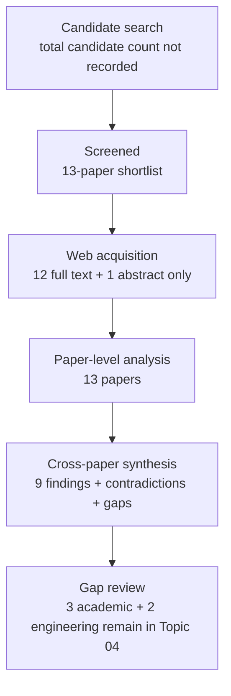

# Research Report: Reference Resolution to Propositions and the Semantic Scope of Replies in Work Communication

## Contents

- [Round History](#round-history)
- [Executive Summary](#executive-summary)
- [Research Question](#research-question)
- [Methodology](#methodology)
- [Papers Reviewed](#papers-reviewed)
- [Research Landscape](#research-landscape)
- [Confidence-Graded Findings](#confidence-graded-findings)
- [Research Gaps](#research-gaps)
- [Practical Recommendations](#practical-recommendations)
- [Evidence Map](#evidence-map)
- [References](#references)
- [Appendix: Run Metadata](#appendix-run-metadata)

## Round History

Iterative gap-closure loop (hard cap: 4 rounds). See
`references/iterative-synthesis.md` for the full loop definition.

| Round | Run ID | Topic / Gap Focus | New Papers | Gaps Addressed | Remaining Gaps |
|-------|--------|-------------------|------------|----------------|----------------|
| 1 | 769bfc7cfebf | reference resolution to propositions and the semantic scope of replies in work communication | None | initial shortlist | 3 academic, 2 engineering |

**Stop reason**: another round runs while open academic gaps remain and new papers appear

## Executive Summary

This review investigated how a work-communication system can resolve references and short responses to the exact propositions, events, questions, or discourse spans they concern, rather than treating a whole preceding message as the response target. Across 13 papers from six web-source domains, the strongest result is that proposition-, event-, fact-, situation-, and discourse-level reference is materially different from ordinary nominal/entity coreference, with antecedent selection and boundary identification remaining central difficulties [doi-10-1162-coli-a-00327] [doi-10-18653-v1-2022-emnlp-main-778]. Candidate-ranking, cluster-ranking, pairwise-comparison, and joint models demonstrate useful mechanisms, while formal question and QUD work provides a conceptual foundation for partial answers and subordinate questions [1706.02256] [doi-10-18653-v1-2021-naacl-main-329] [manual-555fa5b6e8] [manual-5c0971730d] [doi-10-3765-sp-5-6]. The most significant gap is direct empirical evidence for proposition-level agreement, rejection, approval, clarification, and multi-question reply scope in authentic workplace email or enterprise chat; the reviewed literature has not answered that question yet. Consequently, the literature is sufficient to motivate an architecture and targeted experiments, but not to treat workplace response-scope behavior or its operational error costs as empirically settled.

**Scope**: 13 papers analyzed from arXiv, ACL Anthology, Semantics & Pragmatics, author-hosted academic material, an institutional repository, and an abstract-index page over 1977–2022  
**Overall Confidence**: Medium  
**Verdict**: HAS_GAPS

## Research Question

The review investigated the following question:

> How should a work-information system resolve a response or referring expression to one or more exact antecedent propositions, events, questions, or discourse spans, determine the semantic relation between the response and those antecedents, and represent exact, partial, ambiguous, unsupported, discontinuous, or multiple-target scope without inventing commitments?

The intended output can be represented as:

$\text{response span} \rightarrow \text{antecedent span/proposition(s)} \rightarrow \text{relation} \rightarrow \text{scope}$

where relation may include answer, agreement, rejection, clarification, condition, or reference.

In scope are discourse deixis, abstract/propositional/event anaphora, non-nominal antecedents, question–answer structure, partial answers, antecedent boundaries, multi-antecedent representations, and computational antecedent selection. Out of scope are named-entity coreference alone, quotation extraction already owned by Topic 01, Topic segmentation owned by Topic 02, generic speech-act classification without antecedent scope, attachment/visual grounding owned by Topic 08, and downstream work-state transition semantics owned primarily by Topic 06.

## Methodology

### Search Strategy

- **Sources**: arXiv, ACL Anthology, Semantics & Pragmatics, author-hosted academic PDFs, an institutional repository, and an academic abstract/index page.
- **Query variants**:
  - `reference resolution propositions semantic scope replies work communication`
  - `reference resolution propositions`
  - `reference semantic scope replies work communication`
  - `resolution semantic scope replies work communication`
  - `propositions semantic scope replies work communication`
  - `reference resolution propositions semantic scope`
  - `reference resolution propositions replies work`
  - `reference resolution propositions communication`
- **Time window**: 1977–2022.
- **Screening**: The supplied pipeline provided a 13-paper shortlist and cross-paper synthesis. The exact candidate-pool size and BM25/sub-agent screening configuration were not recorded in the supplied run metadata.
- **Reading method**: The papers were read through the host's web tool. Twelve papers were available at full-text level and one was available at abstract-only level.

Access level for each reviewed paper:

| Paper | Access level | Access source |
|---|---|---|
| [1706.02256] | full_text | arXiv HTML |
| [doi-10-1007-bf00351935] | full_text | author/university-hosted PDF |
| [doi-10-1007-bf00983299] | abstract_only | academic abstract/index page |
| [doi-10-1162-coli-a-00327] | full_text | ACL Anthology PDF |
| [doi-10-18653-v1-2021-codi-sharedtask-1] | full_text | ACL Anthology PDF |
| [doi-10-18653-v1-2021-naacl-main-329] | full_text | ACL Anthology PDF |
| [doi-10-18653-v1-2022-emnlp-main-778] | full_text | arXiv HTML |
| [doi-10-18653-v1-p17-1009] | full_text | ACL Anthology PDF |
| [doi-10-3115-v1-d14-1056] | full_text | ACL Anthology PDF |
| [doi-10-3765-sp-5-6] | full_text | Semantics & Pragmatics PDF |
| [manual-555fa5b6e8] | full_text | ACL Anthology PDF |
| [manual-5c0971730d] | full_text | ACL Anthology PDF |
| [manual-8b8a394daa] | full_text | institutional-repository PDF |

### Pipeline Summary

| Metric | Count |
|--------|-------|
| Total candidates | Not recorded in supplied run metadata |
| After screening | 13 |
| Downloaded | Not applicable as a uniform metric; papers were accessed through the host's web tool |
| Successfully converted | Not applicable as a uniform metric |
| Deeply analyzed | 13, with one constrained to abstract-only evidence |
| Iterations (if system-building) | 1 |

## Papers Reviewed

No paper-quality scores were supplied by the review pipeline, so none are invented here.

| # | Title | Authors | Year | Venue | Quality Score | Relevance |
|---|-------|---------|------|-------|--------------|-----------|
| 1 | Stay Together: A System for Single and Split-antecedent Anaphora Resolution [doi-10-18653-v1-2021-naacl-main-329] | Juntao Yu, Nafise Sadat Moosavi, Silviu Paun et al. | 2021 | NAACL | Not scored | MEDIUM |
| 2 | Syntax and semantics of questions [doi-10-1007-bf00351935] | Lauri Karttunen | 1977 | Venue not recorded in supplied metadata | Not scored | MEDIUM |
| 3 | Resolving abstract anaphors in Spanish discourse: Underspecification and mereological structures [manual-8b8a394daa] | Iker Zulaica-Hernández | 2018 | Institutional repository / scholarly work | Not scored | MEDIUM |
| 4 | Information Structure: Towards an integrated formal theory of pragmatics [doi-10-3765-sp-5-6] | Craige Roberts | 2012 | Semantics & Pragmatics | Not scored | HIGH |
| 5 | A Mention-Ranking Model for Abstract Anaphora Resolution [1706.02256] | Ana Marasović, Leo Born, Juri Opitz et al. | 2017 | Venue not recorded in supplied metadata | Not scored | HIGH |
| 6 | End-to-End Neural Discourse Deixis Resolution in Dialogue [doi-10-18653-v1-2022-emnlp-main-778] | Shengjie Li, Vincent Ng | 2022 | EMNLP | Not scored | HIGH |
| 7 | A Twin-Candidate Based Approach for Event Pronoun Resolution using Composite Kernel [manual-5c0971730d] | Bin Chen, Jian Su, Chew Lim Tan | 2010 | Venue not recorded in supplied metadata | Not scored | MEDIUM |
| 8 | Resolving Shell Nouns [doi-10-3115-v1-d14-1056] | Varada Kolhatkar, Graeme Hirst | 2014 | Venue not recorded in supplied metadata | Not scored | MEDIUM |
| 9 | Resolving questions, II [doi-10-1007-bf00983299] | Jonathan Ginzburg | 1995 | Venue not recorded in supplied metadata | Not scored | MEDIUM |
| 10 | Resolving Event Noun Phrases to Their Verbal Mentions [manual-555fa5b6e8] | Bin Chen, Jian Su, Chew Lim Tan | 2010 | Venue not recorded in supplied metadata | Not scored | MEDIUM |
| 11 | Anaphora With Non-nominal Antecedents in Computational Linguistics: a Survey [doi-10-1162-coli-a-00327] | Varada Kolhatkar, Adam Roussel, Stefanie Dipper et al. | 2018 | Computational Linguistics | Not scored | HIGH |
| 12 | Joint Learning for Event Coreference Resolution [doi-10-18653-v1-p17-1009] | Jing Lu, Vincent Ng | 2017 | ACL | Not scored | MEDIUM |
| 13 | The CODI-CRAC 2021 Shared Task on Anaphora, Bridging, and Discourse Deixis in Dialogue [doi-10-18653-v1-2021-codi-sharedtask-1] | Sopan Khosla, Juntao Yu, Ramesh Manuvinakurike et al. | 2021 | CODI Shared Task | Not scored | HIGH |

## Research Landscape

### Theme 1: Non-Nominal Reference Is a Distinct Semantic Problem

**Coverage**: 4 papers | **Confidence**: High  
**Supporting papers**: [doi-10-1162-coli-a-00327], [doi-10-18653-v1-2022-emnlp-main-778], [1706.02256], [manual-8b8a394daa]

Non-nominal anaphora can target events, propositions, facts, situations, descriptions, speech acts, or other abstract discourse material. Unlike ordinary entity coreference, the antecedent can lack a clean noun-phrase boundary, may require semantic interpretation, and may support different abstract interpretations depending on context [doi-10-1162-coli-a-00327]. Dialogue discourse-deixis work similarly treats references to prior utterance content as a distinct resolution problem and acknowledges that true antecedent spans can be smaller than the utterance-level units used by the model [doi-10-18653-v1-2022-emnlp-main-778].

Key findings:

1. [HIGH] Entity-coreference machinery alone does not capture proposition-, event-, fact-, situation-, or speech-act reference because antecedent type and boundary are materially different [doi-10-1162-coli-a-00327] [doi-10-18653-v1-2022-emnlp-main-778].
2. [HIGH] Boundary identification is itself part of the resolution problem rather than a trivial preprocessing step [doi-10-1162-coli-a-00327] [doi-10-18653-v1-2022-emnlp-main-778].
3. [MEDIUM] Composite or multi-part discourse material may form an abstract antecedent, but the reviewed support is primarily theoretical or adjacent-task evidence rather than workplace-response evidence [manual-8b8a394daa] [doi-10-1162-coli-a-00327].

### Theme 2: Candidate Comparison Is a Recurring Computational Pattern

**Coverage**: 5 papers | **Confidence**: High  
**Supporting papers**: [1706.02256], [doi-10-18653-v1-p17-1009], [doi-10-18653-v1-2021-naacl-main-329], [manual-555fa5b6e8], [manual-5c0971730d]

Several systems explicitly compare candidate antecedents rather than collapsing resolution into one whole-message label. The reviewed approaches include mention ranking for abstract anaphora, antecedent scoring in event coreference, cluster ranking for split antecedents, and twin-candidate pairwise comparison for event reference [1706.02256] [doi-10-18653-v1-p17-1009] [doi-10-18653-v1-2021-naacl-main-329] [manual-555fa5b6e8] [manual-5c0971730d].

A msgloom-oriented candidate formulation could therefore be expressed as:

$\hat{a}=\arg\max_{a\in A(r)\cup\{\varnothing\}} s(r,a)$

where $r$ is the current response, $A(r)$ is the set of candidate antecedent spans or propositions, and $\varnothing$ represents an unresolved outcome. This formula is an engineering abstraction motivated by the reviewed model families, not a claim that the literature has validated this exact formulation for workplace communication.

Key findings:

1. [HIGH] Multiple successful systems operationalize resolution through explicit candidate ranking or comparison [1706.02256] [doi-10-18653-v1-p17-1009] [doi-10-18653-v1-2021-naacl-main-329] [manual-555fa5b6e8] [manual-5c0971730d].
2. [HIGH] The corpus does not establish that candidate ranking is universally superior to every alternative formulation.
3. [HIGH] Candidate generation, mention detection, and upstream representation quality materially affect end-to-end reference quality [doi-10-18653-v1-2021-naacl-main-329] [doi-10-18653-v1-2022-emnlp-main-778] [doi-10-18653-v1-p17-1009].

### Theme 3: Locality Is Useful but Reference-Type Dependent

**Coverage**: 4 papers | **Confidence**: High  
**Supporting papers**: [doi-10-18653-v1-2022-emnlp-main-778], [manual-555fa5b6e8], [manual-5c0971730d], [doi-10-18653-v1-2021-codi-sharedtask-1]

Dialogue discourse-deixis exhibits strong locality in the reviewed CODI-CRAC setting: more than 90 percent of evaluated discourse-deictic antecedents occurred within four utterances [doi-10-18653-v1-2022-emnlp-main-778]. That result does not generalize to every non-nominal reference type. Event-NP reference contains longer-distance links, while a simple most-recent-verb baseline is inadequate for event pronoun resolution [manual-555fa5b6e8] [manual-5c0971730d].

Key findings:

1. [HIGH] Recency is a strong feature in some dialogue-reference datasets [doi-10-18653-v1-2022-emnlp-main-778].
2. [HIGH] A hard universal locality assumption is unsupported because other event-reference tasks exhibit materially longer-distance antecedents [manual-555fa5b6e8] [manual-5c0971730d].
3. [HIGH] Locality should therefore be treated as conditional evidence rather than a universal semantic rule.

### Theme 4: Exact, Discontinuous, and Composite Antecedents

**Coverage**: 3 papers | **Confidence**: Medium  
**Supporting papers**: [doi-10-1162-coli-a-00327], [manual-8b8a394daa], [doi-10-18653-v1-2021-naacl-main-329]

The survey identifies multi-sentence and discontinuous antecedents as under-modeled and describes substantial annotation difficulties around non-nominal antecedent boundaries [doi-10-1162-coli-a-00327]. The Spanish theoretical analysis allows coherent sums of propositions to form abstract discourse referents [manual-8b8a394daa]. Split-antecedent coreference demonstrates computational machinery capable of associating an anaphor with multiple antecedent clusters, but this concerns entity reference and therefore supplies transfer evidence only [doi-10-18653-v1-2021-naacl-main-329].

Key findings:

1. [HIGH] Exact antecedent boundaries are a material annotation and modeling problem [doi-10-1162-coli-a-00327] [doi-10-18653-v1-2022-emnlp-main-778].
2. [MEDIUM] A representation allowing discontinuous or composite proposition targets is plausible and evidence-aligned, but direct workplace-response validation is absent [doi-10-1162-coli-a-00327] [manual-8b8a394daa].
3. [MEDIUM] Split-antecedent entity-coreference methods show that multiple antecedent structures are computationally feasible, but they do not establish multi-proposition response scope [doi-10-18653-v1-2021-naacl-main-329].

### Theme 5: Question Structure Supports Partial Answering but Not Workplace Approval Scope

**Coverage**: 3 papers | **Confidence**: High for the formal concept, Low for workplace transfer  
**Supporting papers**: [doi-10-3765-sp-5-6], [doi-10-1007-bf00351935], [doi-10-1007-bf00983299]

The QUD framework provides the clearest support in this corpus for partial response scope. An assertion may be relevant because it provides a partial answer, and a subordinate question may matter because answering it contributes to a strategy for answering a broader question [doi-10-3765-sp-5-6]. Karttunen supplies a compositional treatment of question meanings in relation to answer propositions [doi-10-1007-bf00351935]. Ginzburg's abstract distinguishes questions, propositions, and facts and treats question resolution as context-sensitive [doi-10-1007-bf00983299].

Key findings:

1. [HIGH] Partial answers have a formal discourse role and do not imply that every issue in the preceding discourse has been resolved [doi-10-3765-sp-5-6].
2. [HIGH] Structured question semantics supports modeling the target of an answer more finely than whole-message response classification [doi-10-1007-bf00351935] [doi-10-3765-sp-5-6].
3. [LOW] The reviewed corpus does not establish how “yes”, “approved”, “agreed”, or similar short workplace replies scope over multiple preceding requests, conditions, or alternatives.

### Theme 6: Syntax Helps, but Hard Syntactic Constraints Are Unsafe

**Coverage**: 4 papers | **Confidence**: High  
**Supporting papers**: [manual-555fa5b6e8], [manual-5c0971730d], [doi-10-3115-v1-d14-1056], [1706.02256]

Structured syntactic information improves the two reviewed event-reference approaches, and shell-noun-specific syntactic cues help in some constructions [manual-555fa5b6e8] [manual-5c0971730d] [doi-10-3115-v1-d14-1056]. However, stricter shell-noun family constraints can hurt versatile constructions, while syntax ablations in broader abstract-anaphora evaluation do not support a universal benefit [doi-10-3115-v1-d14-1056] [1706.02256].

Key findings:

1. [HIGH] Syntax can provide useful evidence for antecedent selection [manual-555fa5b6e8] [manual-5c0971730d].
2. [HIGH] Syntax should not be elevated to an unconditional hard constraint across heterogeneous abstract-reference phenomena [doi-10-3115-v1-d14-1056] [1706.02256].

### Theme 7: Joint Modeling Benefits Are Architecture Dependent

**Coverage**: 2 papers | **Confidence**: High within the reviewed tasks  
**Supporting papers**: [doi-10-18653-v1-p17-1009], [doi-10-18653-v1-2021-naacl-main-329]

Joint event-trigger, anaphoricity, and antecedent learning improved the event tasks studied by Lu and Ng [doi-10-18653-v1-p17-1009]. In contrast, joint optimization in the reviewed split-antecedent architecture did not improve the ordinary single-antecedent and non-referring components and was generally weaker than the pre-trained configuration [doi-10-18653-v1-2021-naacl-main-329].

Key findings:

1. [HIGH] Joint learning can improve related reference decisions in some architectures [doi-10-18653-v1-p17-1009].
2. [HIGH] The reviewed evidence rejects a universal rule that tighter joint optimization is always preferable [doi-10-18653-v1-2021-naacl-main-329].

## Methodology Comparison

| Approach | Papers | Strengths | Weaknesses | Best For | Performance |
|----------|--------|-----------|------------|----------|-------------|
| Mention ranking | [1706.02256] | Explicit candidate comparison; naturally supports antecedent scoring | Depends on candidate generation and span representation | Abstract anaphora baselines and candidate-ranking experiments | Task-specific results; no common cross-paper workplace metric |
| Event-coreference antecedent scoring / joint learning | [doi-10-18653-v1-p17-1009] | Couples trigger, anaphoricity, and antecedent decisions | Joint benefits are task- and architecture-dependent | Event-oriented antecedent resolution | Improved the three evaluated event tasks; exact values not supplied in synthesis |
| Cluster ranking for split antecedents | [doi-10-18653-v1-2021-naacl-main-329] | Represents multiple antecedent clusters | Evidence concerns entity split antecedents, not proposition-level reply scope | Transfer experiments for multi-target representations | Pre-trained configuration generally stronger than reviewed joint variant |
| Twin-candidate comparison | [manual-555fa5b6e8] [manual-5c0971730d] | Directly compares alternatives; structured features can matter | Older task-specific formulation; not workplace dialogue | Event-NP and event-pronoun antecedent selection | Task-specific; no directly comparable workplace metric |
| End-to-end discourse deixis resolution | [doi-10-18653-v1-2022-emnlp-main-778] | Dialogue-specific; integrates mention/antecedent decisions | Uses utterance-level targets even when gold semantics may be sub-utterance | Dialogue discourse deixis | More than 90% of evaluated antecedents were within four utterances; this is a locality statistic, not a universal performance baseline |
| Shell-noun resolution | [doi-10-3115-v1-d14-1056] | Exploits construction-specific syntactic/semantic cues | Hard construction constraints can fail for versatile nouns | Shell-noun antecedent interpretation | Results vary by noun family and constraint choice |
| Formal question / QUD models | [doi-10-1007-bf00351935] [doi-10-3765-sp-5-6] [doi-10-1007-bf00983299] | Explains partial answers, discourse relevance, and structured questions | Primarily formal/conceptual rather than workplace empirical evaluation | Response-scope representation and multi-question reasoning concepts | No workplace empirical performance baseline |

## Confidence-Graded Findings

### 🟢 High Confidence (supported by 3+ papers with consistent results)

1. **[HIGH] Non-nominal reference is not equivalent to ordinary entity coreference.** Candidate antecedents can denote events, propositions, facts, situations, descriptions, or speech acts, and their boundaries may be unclear [doi-10-1162-coli-a-00327] [doi-10-18653-v1-2022-emnlp-main-778] [1706.02256].

2. **[HIGH] Explicit antecedent-candidate comparison is a well-supported computational pattern.** Mention ranking, cluster ranking, antecedent scoring, and twin-candidate comparison all appear successfully in the reviewed corpus [1706.02256] [doi-10-18653-v1-p17-1009] [doi-10-18653-v1-2021-naacl-main-329] [manual-555fa5b6e8] [manual-5c0971730d]. The evidence does not establish one formulation as universally superior.

3. **[HIGH] Proximity is useful but cannot be treated as a universal resolution rule.** More than 90% of discourse-deictic antecedents in one dialogue evaluation were within four utterances, while event-reference studies contain longer-distance behavior and weak simple-recency baselines [doi-10-18653-v1-2022-emnlp-main-778] [manual-555fa5b6e8] [manual-5c0971730d].

4. **[HIGH] Exact antecedent boundaries materially affect reference modeling and evaluation.** Annotation disagreement, sub-utterance antecedents, and multi-sentence antecedents prevent a simple assumption that a preceding whole message is always the correct semantic unit [doi-10-1162-coli-a-00327] [doi-10-18653-v1-2022-emnlp-main-778].

5. **[HIGH] Syntax is useful but defeasible.** Structured syntactic evidence helps some event-reference and shell-noun systems, while hard syntactic constraints or explicit syntactic information can be neutral or harmful in broader settings [manual-555fa5b6e8] [manual-5c0971730d] [doi-10-3115-v1-d14-1056] [1706.02256].

6. **[HIGH] Partial-answer structure is supported by formal question/QUD theory.** An assertion can partially address a question without resolving all open issues, and subordinate questions can be part of a strategy for addressing a broader question [doi-10-3765-sp-5-6] [doi-10-1007-bf00351935].

7. **[HIGH] End-to-end quality depends on upstream representation and candidate decisions as well as the final antecedent classifier.** Mention detection, candidate construction, trigger detection, and antecedent scoring interact materially [doi-10-18653-v1-2021-naacl-main-329] [doi-10-18653-v1-p17-1009] [doi-10-18653-v1-2022-emnlp-main-778].

8. **[HIGH] The current empirical literature is insufficient to infer production workplace behavior.** The reviewed dialogue and reference datasets do not directly evaluate approval scope, multi-question email replies, or the work-state consequences required by msgloom [doi-10-18653-v1-2021-codi-sharedtask-1] [doi-10-18653-v1-2022-emnlp-main-778] [doi-10-1162-coli-a-00327].

### 🟡 Medium Confidence (supported by 1-2 papers or with caveats)

1. **[MEDIUM] A response representation capable of multiple, discontinuous, or composite proposition targets is justified as an engineering hypothesis.** The survey and theoretical analysis support complex abstract antecedents, while split-antecedent entity resolution supplies only analogous computational evidence [doi-10-1162-coli-a-00327] [manual-8b8a394daa] [doi-10-18653-v1-2021-naacl-main-329].

2. **[MEDIUM] Separating semantic relation from semantic scope is appropriate for msgloom.** QUD evidence supports partial answering, but the exact schema `relation + target + scope` is a product design extrapolation rather than a directly evaluated workplace representation [doi-10-3765-sp-5-6].

### 🔴 Low Confidence (preliminary, single-source, or contradicted)

1. **[LOW] Production workplace approval, agreement, rejection, clarification, and commitment scope can be inferred from the reviewed benchmarks.** This is not established: no reviewed paper directly evaluates that target behavior [doi-10-18653-v1-2021-codi-sharedtask-1] [doi-10-18653-v1-2022-emnlp-main-778].

2. **[LOW] A short workplace answer such as “yes” can be reliably mapped to the correct one of several preceding questions using the reviewed evidence alone.** Formal theory motivates the distinction, but direct multi-question workplace evidence is absent [doi-10-3765-sp-5-6] [doi-10-1007-bf00351935].

3. **[LOW] False broadening of approval or commitment is empirically more costly than abstention.** The product context makes this a critical risk hypothesis, but the reviewed literature does not establish the cost ordering [doi-10-1162-coli-a-00327] [doi-10-18653-v1-2021-codi-sharedtask-1].

## Trade-Off Analysis

| Decision | Option A | Option B | Recommendation |
|----------|----------|----------|----------------|
| Antecedent granularity | Whole utterance/message: simpler, but may over-broaden scope | Exact clause/span/proposition: more faithful but harder to annotate and resolve | Prefer proposition/sub-message targets when decision-critical; allow coarser fallbacks only with explicit uncertainty [doi-10-1162-coli-a-00327] [doi-10-18653-v1-2022-emnlp-main-778] |
| Recency | Hard candidate window: efficient but can miss long-distance links | Soft recency feature: preserves distant candidates at higher cost | Use recency as a strong feature, not an unvalidated universal hard cutoff [doi-10-18653-v1-2022-emnlp-main-778] [manual-555fa5b6e8] [manual-5c0971730d] |
| Syntax | Hard syntactic constraints: precise in narrow constructions | Defeasible syntactic features: more robust across heterogeneous cases | Prefer syntax as scored evidence rather than an unconditional filter [doi-10-3115-v1-d14-1056] [1706.02256] |
| Antecedent cardinality | Exactly one target: simpler schema | Multiple/composite targets: supports complex discourse at added complexity | Make the representation multi-target-capable, but treat workplace multi-proposition scope as unvalidated [doi-10-1162-coli-a-00327] [manual-8b8a394daa] [doi-10-18653-v1-2021-naacl-main-329] |
| Resolution policy | Force one target | Permit ambiguity/unresolved outcome | Implement abstention capability for evaluation; threshold/cost policy remains an open engineering gap [doi-10-1162-coli-a-00327] [doi-10-18653-v1-2022-emnlp-main-778] |
| Model integration | One tightly joint model | Staged candidate generation plus semantic scoring | Keep interfaces separable initially because joint-learning gains are architecture-dependent [doi-10-18653-v1-p17-1009] [doi-10-18653-v1-2021-naacl-main-329] |

## Points of Agreement **[EVIDENCE REQUIRED]**

1. **[HIGH] Non-nominal antecedent resolution needs semantic treatment beyond ordinary entity coreference.** This is supported by the broad survey, dialogue discourse-deixis work, and abstract-anaphora modeling [doi-10-1162-coli-a-00327] [doi-10-18653-v1-2022-emnlp-main-778] [1706.02256].

2. **[HIGH] Candidate identification and antecedent selection are central components of the task.** Candidate-ranking, cluster-ranking, event-coreference, and dialogue systems all depend materially on these upstream decisions [1706.02256] [doi-10-18653-v1-2021-naacl-main-329] [doi-10-18653-v1-p17-1009] [doi-10-18653-v1-2022-emnlp-main-778].

3. **[HIGH] Exact antecedent scope cannot safely be assumed to equal a whole nearby message or utterance.** The survey documents difficult span boundaries and discontinuous/multi-sentence antecedents, while dialogue work explicitly acknowledges sub-utterance antecedents [doi-10-1162-coli-a-00327] [doi-10-18653-v1-2022-emnlp-main-778].

4. **[HIGH] Question structure supports responses that address only part of the currently relevant issue structure.** QUD relevance and question semantics provide the formal basis for this conclusion [doi-10-3765-sp-5-6] [doi-10-1007-bf00351935].

## Points of Contradiction **[EVIDENCE REQUIRED]**

1. **[HIGH] Locality of antecedents**: Dialogue discourse deixis is strongly local in the evaluated CODI-CRAC setting, whereas event-reference studies show materially longer-distance links or poor performance from simple most-recent heuristics [doi-10-18653-v1-2022-emnlp-main-778] [manual-555fa5b6e8] [manual-5c0971730d].
   - **Possible explanation**: The studies address different reference types, genres, candidate units, and datasets.
   - **Implication**: Msgloom should not impose one universal antecedent window without domain validation.

2. **[HIGH] Value of syntactic constraints**: Structured syntactic representations improve the reviewed event-reference systems, and construction-specific cues help some shell nouns, but strict shell-noun constraints can hurt versatile nouns and explicit syntax does not universally help broad abstract-anaphora resolution [manual-555fa5b6e8] [manual-5c0971730d] [doi-10-3115-v1-d14-1056] [1706.02256].
   - **Possible explanation**: Syntax has different predictive value across constructions and datasets.
   - **Implication**: Treat syntax as defeasible evidence rather than a universally binding constraint.

3. **[HIGH] Benefits of joint learning**: Joint learning improves the event trigger, anaphoricity, and coreference tasks in one study, whereas joint optimization in the split-antecedent architecture does not improve its ordinary components and is generally weaker than the pre-trained setup [doi-10-18653-v1-p17-1009] [doi-10-18653-v1-2021-naacl-main-329].
   - **Possible explanation**: Component coupling, task structure, supervision density, and optimization differ.
   - **Implication**: Msgloom should test staged and joint designs rather than assuming one is inherently superior.

4. **[MEDIUM] Semantic ontology of questions**: Karttunen analyzes questions through answer propositions, while Ginzburg explicitly distinguishes questions from propositions and facts rather than reducing questions to their answers [doi-10-1007-bf00351935] [doi-10-1007-bf00983299].
   - **Possible explanation**: The papers adopt different formal objectives and ontological commitments.
   - **Implication**: Product representations should preserve the distinction between an open question and any particular answer proposition rather than assuming one formal ontology.

## Research Gaps

Every gap below remains open. The literature reviewed in Round 1 has not answered these questions yet.

| # | Gap | Type | Severity | Rounds Searched | Impact on Goals |
|---|-----|------|----------|-----------------|----------------|
| G1 | [ACADEMIC] Direct evidence for proposition-level agreement, rejection, approval, clarification, and answer scope in authentic workplace email or enterprise chat is missing. | ACADEMIC | HIGH | 1 | Without this evidence, msgloom cannot claim validated workplace behavior for partial replies or approvals. |
| G2 | [ENGINEERING] A validated annotation/evaluation scheme for exact, partial, ambiguous, unsupported, discontinuous, and multiple antecedent targets is missing. | ENGINEERING | HIGH | 1 | Without a benchmark, false broadening and target-boundary failures cannot be measured reliably. |
| G3 | [ACADEMIC] Direct evidence for aligning replies to one or more questions in multi-question workplace messages, including identifying questions left unanswered, is insufficient. | ACADEMIC | HIGH | 1 | A system could incorrectly close unanswered work or attach a short answer to the wrong question. |
| G4 | [ACADEMIC] Direct evaluation of a workplace response targeting a composite or multi-proposition antecedent is absent. | ACADEMIC | MEDIUM | 1 | The representation may need multi-target semantics, but the product behavior is not empirically validated. |
| G5 | [ENGINEERING] The abstention, ambiguity, missing-antecedent, and false-broadening cost policy has not been validated. | ENGINEERING | HIGH | 1 | Thresholds cannot be justified from the literature, especially when choosing between broadening and unresolved output. |
| G6 | [ACADEMIC] The effect of reference-scope errors on downstream approved/rejected/revoked/completed/still-open state transitions remains unanswered; its original classification is OUT_OF_SCOPE for Topic 04 and it is handed to Topic 06. | OUT_OF_SCOPE / Topic 06 handoff | HIGH | 1 | Incorrect scope may induce incorrect work-state changes, but validating that propagation belongs primarily to Topic 06. |

### Academic Gaps (require more papers)

1. **[ACADEMIC] G1 — Workplace proposition-level response scope**: The literature has not answered whether existing methods reliably identify what an approval, rejection, agreement, clarification, or short answer applies to in authentic workplace email or enterprise chat. Suggested queries: `"agreement scope" email dialogue proposition`, `"partial agreement" workplace communication`, `"reply scope" email approval`.

2. **[ACADEMIC] G3 — Multi-question answer alignment**: Formal QUD work supports partial answers conceptually, but the literature reviewed so far has not answered how to align one reply to one or more questions in workplace messages or how to detect questions that remain unanswered. Suggested queries: `"multiple questions" dialogue answer alignment`, `"partial answer detection" dialogue`, `email "question answer alignment"`.

3. **[ACADEMIC] G4 — Composite proposition targets**: The literature has not answered whether workplace responses should be modeled as targeting composite or multiple propositions. Suggested queries: `"abstract anaphora" multiple antecedents dialogue`, `"propositional anaphora" composite antecedent`, `"agreement target" multiple propositions`.

4. **[ACADEMIC] G6 — Topic 06 handoff**: The literature reviewed for Topic 04 has not answered how reference-scope errors propagate into downstream work-state transitions. This gap is explicitly out of scope for further Topic 04 searching and should be investigated under Topic 06 rather than duplicated here.

### Engineering Gaps (fillable without papers)

1. **[ENGINEERING] G2 — Annotation and evaluation scheme**: The literature has not supplied a validated msgloom-specific benchmark. Build independent fixtures that annotate response span, exact antecedent proposition/span, relation, scope class, alternate candidates, missing-context status, and gold unresolved outcomes. Score target identity and boundary quality separately.

2. **[ENGINEERING] G5 — Abstention and risk policy**: The literature has not established the relative cost of false broadening versus unresolved output. Define a product cost model and measure both. A possible decision-oriented metric is:

   $L = c_b N_b + c_m N_m + c_u N_u$

   where $N_b$ is false broadening, $N_m$ is missed supported resolution, $N_u$ is inappropriate unresolved output, and the coefficients $c_b,c_m,c_u$ must come from product requirements or validation rather than being inferred from the reviewed papers.

## Reproducibility Notes

The review did not audit repositories, dataset licenses, or executable environments. Unknown values are therefore reported as unknown rather than inferred.

| Paper | Code Available | Data Available | Sufficient Detail | License |
|-------|---------------|----------------|-------------------|---------|
| [doi-10-18653-v1-2021-naacl-main-329] | Unknown from supplied review | Unknown from supplied review | Full text available; implementation reproducibility not audited | Unknown |
| [doi-10-1007-bf00351935] | Not applicable/unknown | Not applicable/unknown | Full text available; formal analysis | Unknown |
| [manual-8b8a394daa] | Unknown | Unknown | Full text available; proposed procedure is primarily theoretical | Unknown |
| [doi-10-3765-sp-5-6] | Not applicable/unknown | Not applicable/unknown | Full text available; formal/pragmatic theory | Unknown |
| [1706.02256] | Unknown from supplied review | Unknown from supplied review | Full text available; reproducibility assets not audited | Unknown |
| [doi-10-18653-v1-2022-emnlp-main-778] | Unknown from supplied review | Unknown from supplied review | Full text available; reproducibility assets not audited | Unknown |
| [manual-5c0971730d] | Unknown | Unknown | Full text available; reproducibility assets not audited | Unknown |
| [doi-10-3115-v1-d14-1056] | Unknown | Unknown | Full text available; reproducibility assets not audited | Unknown |
| [doi-10-1007-bf00983299] | Unknown | Unknown | Insufficient for reproducibility assessment because review access was abstract-only | Unknown |
| [manual-555fa5b6e8] | Unknown | Unknown | Full text available; reproducibility assets not audited | Unknown |
| [doi-10-1162-coli-a-00327] | Not applicable/unknown | Not applicable/unknown | Full-text survey; underlying referenced resources not audited here | Unknown |
| [doi-10-18653-v1-p17-1009] | Unknown from supplied review | Unknown from supplied review | Full text available; reproducibility assets not audited | Unknown |
| [doi-10-18653-v1-2021-codi-sharedtask-1] | Unknown from supplied review | Unknown from supplied review | Full text available; shared-task resources not independently audited here | Unknown |

## Practical Recommendations **[EVIDENCE REQUIRED]**

1. **Use explicit antecedent candidates rather than treating a whole preceding message as the only target.** Candidate-ranking, cluster-ranking, event-coreference, and pairwise systems demonstrate that explicit alternatives are a viable modeling pattern [1706.02256] [doi-10-18653-v1-2021-naacl-main-329] [doi-10-18653-v1-p17-1009] [manual-555fa5b6e8] [manual-5c0971730d].  
   *Confidence*: High

2. **Use Topic 01 source/quote spans and Topic 02 Topic spans as candidate-generation constraints instead of rediscovering those structures inside Topic 04.** This is a project-level engineering recommendation consistent with evidence that candidate generation and upstream representations materially affect end-to-end resolution [doi-10-18653-v1-2021-naacl-main-329] [doi-10-18653-v1-p17-1009] [doi-10-18653-v1-2022-emnlp-main-778].  
   *Confidence*: High

3. **Treat recency as a strong feature, not as an unvalidated universal cutoff.** Dialogue discourse deixis is often local, but event-reference evidence shows longer-distance cases and weak simple-recency baselines [doi-10-18653-v1-2022-emnlp-main-778] [manual-555fa5b6e8] [manual-5c0971730d].  
   *Confidence*: High

4. **Represent proposition/sub-message targets when decision consequences depend on exact scope.** Whole-utterance targets are sometimes computationally convenient but can be coarser than the true semantic antecedent [doi-10-1162-coli-a-00327] [doi-10-18653-v1-2022-emnlp-main-778].  
   *Confidence*: High

5. **Keep response relation and response scope as separate fields.** An `agreement` or `answer` label should not by itself imply which proposition was agreed with or answered. QUD evidence supports partial-answer structure, although this exact schema remains a msgloom engineering design [doi-10-3765-sp-5-6].  
   *Confidence*: Medium

6. **Make the internal representation capable of multiple or composite antecedents without assuming they are common.** Survey and theoretical evidence supports discontinuous/composite abstract referents, while split-antecedent coreference demonstrates related multi-target machinery; direct workplace evidence remains absent [doi-10-1162-coli-a-00327] [manual-8b8a394daa] [doi-10-18653-v1-2021-naacl-main-329].  
   *Confidence*: Medium

7. **Support ambiguity and an unresolved outcome.** Difficult antecedent boundaries and candidate selection justify evaluating abstention-capable systems, but the operational threshold and error-cost asymmetry have not been established by these papers [doi-10-1162-coli-a-00327] [doi-10-18653-v1-2022-emnlp-main-778]. Missing-context cases should be handed to Topic 07 rather than guessed.  
   *Confidence*: Medium

8. **Do not infer that false broadening is empirically more expensive than abstention merely because it is a product concern.** Define the asymmetry explicitly and measure false broadening, missed supported resolution, and inappropriate abstention separately [doi-10-1162-coli-a-00327] [doi-10-18653-v1-2021-codi-sharedtask-1].  
   *Confidence*: High about the evidence limitation; cost ordering remains unvalidated

9. **Build adversarial fixtures that isolate failure classes.** At minimum, distinguish wrong antecedent, wrong span boundary, wrong semantic relation, partial-scope broadening, supported-but-unresolved reference, unsupported antecedent, multiple-target reference, and unanswered-question coverage. Existing work shows that mention and candidate errors materially affect end-to-end behavior but does not supply this workplace-specific benchmark [doi-10-18653-v1-2021-naacl-main-329] [doi-10-18653-v1-2022-emnlp-main-778].  
   *Confidence*: High as an engineering recommendation

## Future Directions

1. Run a targeted academic follow-up for G1 using workplace agreement/approval/rejection and partial-agreement terminology rather than another broad abstract-anaphora search.

2. Run a targeted academic follow-up for G3 using multi-question answer alignment, partial-answer detection, unanswered-question detection, and email/dialogue QA terminology.

3. Search G4 separately for composite propositional antecedents and multiple-target response scope; do not treat split-antecedent entity coreference as direct validation.

4. Design the G2 benchmark independently of the system under test, with gold antecedents and future context structurally separated from prediction input.

5. Define G5's cost model before selecting an abstention threshold. Report class-specific false broadening and false non-resolution rather than hiding them inside aggregate accuracy.

6. Transfer G6 explicitly to Topic 06 and evaluate whether Topic 04 scope errors produce incorrect approved, rejected, revoked, completed, or open state transitions.

7. Where the antecedent is absent from supplied context rather than merely difficult to resolve, pass a targeted evidence need to Topic 07 rather than forcing a Topic 04 prediction.

## Readiness Assessment (System-Building Mode)

### Verdict: HAS_GAPS

### Assessment Summary

The synthesis is sufficient to design a conservative Topic 04 representation, candidate-generation interface, baseline experiments, and an independent evaluation harness. It is not sufficient to claim validated workplace accuracy for partial approvals, multi-question replies, composite proposition scope, abstention policy, or downstream state transitions. Additional targeted academic work on G1/G3/G4 and engineering work on G2/G5 is required before the research programme can treat this topic as closed.

### Coverage Matrix

| Dimension | Status | Evidence |
|-----------|--------|----------|
| Architecture patterns | ⚠️ Partial | Candidate ranking/comparison and multi-antecedent patterns are supported, but workplace response-scope architecture is not directly validated [1706.02256] [doi-10-18653-v1-2021-naacl-main-329] [doi-10-18653-v1-p17-1009] |
| Technology stack | ❌ Missing | The reviewed literature does not establish a msgloom implementation stack |
| Performance baselines | ⚠️ Partial | Reference-task results and locality evidence exist, but there is no workplace proposition-scope baseline [doi-10-18653-v1-2022-emnlp-main-778] [doi-10-18653-v1-2021-codi-sharedtask-1] |
| Security model | ❌ Missing | Security was outside the reviewed research question |
| Trade-off map | ⚠️ Partial | Locality, syntax, target granularity, joint learning, and abstention-related design tensions are identifiable, but several workplace costs remain unmeasured [doi-10-1162-coli-a-00327] [doi-10-3115-v1-d14-1056] [doi-10-18653-v1-p17-1009] |

### Gap Resolution Plan

| # | Gap | Type | Severity | Resolution |
|---|-----|------|----------|------------|
| G1 | [ACADEMIC] Workplace proposition-level agreement/approval/rejection/clarification scope | ACADEMIC | HIGH | Targeted Round 2 search focused on workplace/email/enterprise response scope |
| G2 | [ENGINEERING] Exact/partial/ambiguous/unsupported/discontinuous/multiple-target annotation and evaluation | ENGINEERING | HIGH | Build independent gold fixtures and evaluation metrics before model selection |
| G3 | [ACADEMIC] Multi-question response alignment and unanswered-question detection | ACADEMIC | HIGH | Targeted Round 2 search on multi-question dialogue/email and partial answers |
| G4 | [ACADEMIC] Composite or multi-proposition workplace response targets | ACADEMIC | MEDIUM | Targeted search; admit only direct or clearly identified transfer evidence |
| G5 | [ENGINEERING] Abstention, ambiguity, missing-context, and false-broadening policy | ENGINEERING | HIGH | Define product loss model; benchmark thresholds and candidate-preservation behavior |
| G6 | [ACADEMIC] Downstream state-transition propagation, originally OUT_OF_SCOPE for Topic 04 | ACADEMIC / Topic 06 handoff | HIGH | Transfer to Topic 06; do not duplicate the research inside Topic 04 |

## Evidence Map

| Research Question Aspect | Evidence |
|--------------------------|----------|
| Non-nominal reference differs from entity coreference | [doi-10-1162-coli-a-00327] [doi-10-18653-v1-2022-emnlp-main-778] [1706.02256] |
| Explicit candidate ranking/comparison | [1706.02256] [doi-10-18653-v1-p17-1009] [doi-10-18653-v1-2021-naacl-main-329] [manual-555fa5b6e8] [manual-5c0971730d] |
| Locality / recency | [doi-10-18653-v1-2022-emnlp-main-778] [manual-555fa5b6e8] [manual-5c0971730d] [doi-10-18653-v1-2021-codi-sharedtask-1] |
| Exact antecedent boundaries | [doi-10-1162-coli-a-00327] [doi-10-18653-v1-2022-emnlp-main-778] |
| Discontinuous/composite antecedents | [doi-10-1162-coli-a-00327] [manual-8b8a394daa] |
| Multiple antecedent computational representation | [doi-10-18653-v1-2021-naacl-main-329] |
| Question semantics | [doi-10-1007-bf00351935] [doi-10-1007-bf00983299] |
| Partial answers and discourse strategy | [doi-10-3765-sp-5-6] |
| Syntax as resolution evidence | [doi-10-3115-v1-d14-1056] [1706.02256] [manual-555fa5b6e8] [manual-5c0971730d] |
| Joint-learning trade-offs | [doi-10-18653-v1-p17-1009] [doi-10-18653-v1-2021-naacl-main-329] |
| Candidate/upstream error effects | [doi-10-18653-v1-2021-naacl-main-329] [doi-10-18653-v1-2022-emnlp-main-778] [doi-10-18653-v1-p17-1009] |
| Direct workplace approval/rejection scope | No reviewed paper directly answers this; G1 remains open |
| Direct multi-question workplace alignment | No reviewed paper directly answers this; G3 remains open |
| Workplace composite response target | No reviewed paper directly answers this; G4 remains open |
| Abstention/error-cost policy | No reviewed paper directly answers this; G5 remains open |
| Downstream work-state propagation | No reviewed paper directly answers this; G6 remains open and is handed to Topic 06 |

## References

1. [doi-10-18653-v1-2021-naacl-main-329] — *Stay Together: A System for Single and Split-antecedent Anaphora Resolution*. Juntao Yu, Nafise Sadat Moosavi, Silviu Paun et al. 2021. NAACL.
2. [doi-10-1007-bf00351935] — *Syntax and semantics of questions*. Lauri Karttunen. 1977. Venue not recorded in supplied metadata.
3. [manual-8b8a394daa] — *Resolving abstract anaphors in Spanish discourse: Underspecification and mereological structures*. Iker Zulaica-Hernández. 2018. Institutional-repository scholarly work.
4. [doi-10-3765-sp-5-6] — *Information Structure: Towards an integrated formal theory of pragmatics*. Craige Roberts. 2012. Semantics & Pragmatics.
5. [1706.02256] — *A Mention-Ranking Model for Abstract Anaphora Resolution*. Ana Marasović, Leo Born, Juri Opitz et al. 2017. Venue not recorded in supplied metadata.
6. [doi-10-18653-v1-2022-emnlp-main-778] — *End-to-End Neural Discourse Deixis Resolution in Dialogue*. Shengjie Li, Vincent Ng. 2022. EMNLP.
7. [manual-5c0971730d] — *A Twin-Candidate Based Approach for Event Pronoun Resolution using Composite Kernel*. Bin Chen, Jian Su, Chew Lim Tan. 2010. Venue not recorded in supplied metadata.
8. [doi-10-3115-v1-d14-1056] — *Resolving Shell Nouns*. Varada Kolhatkar, Graeme Hirst. 2014. Venue not recorded in supplied metadata.
9. [doi-10-1007-bf00983299] — *Resolving questions, II*. Jonathan Ginzburg. 1995. Venue not recorded in supplied metadata.
10. [manual-555fa5b6e8] — *Resolving Event Noun Phrases to Their Verbal Mentions*. Bin Chen, Jian Su, Chew Lim Tan. 2010. Venue not recorded in supplied metadata.
11. [doi-10-1162-coli-a-00327] — *Anaphora With Non-nominal Antecedents in Computational Linguistics: a Survey*. Varada Kolhatkar, Adam Roussel, Stefanie Dipper et al. 2018. Computational Linguistics.
12. [doi-10-18653-v1-p17-1009] — *Joint Learning for Event Coreference Resolution*. Jing Lu, Vincent Ng. 2017. ACL.
13. [doi-10-18653-v1-2021-codi-sharedtask-1] — *The CODI-CRAC 2021 Shared Task on Anaphora, Bridging, and Discourse Deixis in Dialogue*. Sopan Khosla, Juntao Yu, Ramesh Manuvinakurike et al. 2021. CODI Shared Task.

## Appendix: Run Metadata

- **Run ID**: 769bfc7cfebf
- **Round**: 1 of at most 4
- **Topic**: reference resolution to propositions and the semantic scope of replies in work communication
- **Sources**: arXiv; ACL Anthology; Semantics & Pragmatics; semantics.uchicago.edu; asc.ohio-state.edu; scholarworks.indianapolis.iu.edu
- **Access**: 12 full-text papers and 1 abstract-only paper, read through the host's web tool
- **Pipeline version**: Not recorded in supplied run metadata
- **Date**: 2026-09-16
- **Artifacts**: `runs/769bfc7cfebf/`
- **Query variants used**:
  - `reference resolution propositions semantic scope replies work communication`
  - `reference resolution propositions`
  - `reference semantic scope replies work communication`
  - `resolution semantic scope replies work communication`
  - `propositions semantic scope replies work communication`
  - `reference resolution propositions semantic scope`
  - `reference resolution propositions replies work`
  - `reference resolution propositions communication`
- **Open gap status**:
  - G1: [ACADEMIC], HIGH, searched in Round 1, still open; the literature has not answered it yet.
  - G2: [ENGINEERING], HIGH, searched/reviewed in Round 1, still open; the literature has not supplied the required benchmark yet.
  - G3: [ACADEMIC], HIGH, searched in Round 1, still open; the literature has not answered it yet.
  - G4: [ACADEMIC], MEDIUM, searched in Round 1, still open; the literature has not answered it yet.
  - G5: [ENGINEERING], HIGH, searched/reviewed in Round 1, still open; the literature has not established the required product-risk policy.
  - G6: [ACADEMIC] label for report tracking, originally classified OUT_OF_SCOPE for Topic 04, HIGH, searched/reviewed in Round 1, still open; the literature has not answered it and the issue is handed to Topic 06.
