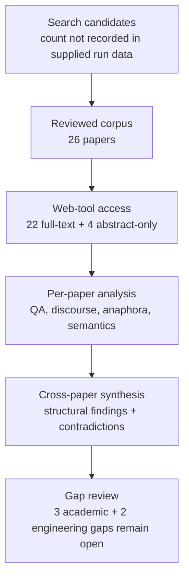

# Research Report: Empirical Reply-to-Proposition Alignment in Email and Dialogue

## Contents

- [Round History](#round-history)
- [Executive Summary](#executive-summary)
- [Research Question](#research-question)
- [Methodology](#methodology)
- [Papers Reviewed](#papers-reviewed)
- [Research Landscape](#research-landscape)
- [Methodology Comparison](#methodology-comparison)
- [Confidence-Graded Findings](#confidence-graded-findings)
- [Trade-Off Analysis](#trade-off-analysis)
- [Points of Agreement](#points-of-agreement)
- [Points of Contradiction](#points-of-contradiction)
- [Research Gaps](#research-gaps)
- [Reproducibility Notes](#reproducibility-notes)
- [Practical Recommendations](#practical-recommendations)
- [Future Directions](#future-directions)
- [Readiness Assessment (System-Building Mode)](#readiness-assessment-system-building-mode)
- [Evidence Map](#evidence-map)
- [References](#references)
- [Appendix: Run Metadata](#appendix-run-metadata)

## Round History

Iterative gap-closure loop (hard cap: 4 rounds). See `references/iterative-synthesis.md` for the full loop definition.

| Round | Run ID | Topic / Gap Focus | New Papers | Gaps Addressed | Remaining Gaps |
|-------|--------|-------------------|------------|----------------|----------------|
| 1 | 769bfc7cfebf | reference resolution to propositions and the semantic scope of replies in work communication | 13 | initial shortlist | 3 academic, 2 engineering |
| 2 | f72f7f513e9d | empirical reply-to-proposition alignment in email and dialogue, focusing on partial replies, multiple questions, unanswered questions, and multi-proposition antecedents | None | academic gaps of the previous round | 3 academic, 2 engineering |

**Stop reason**: another round runs while open academic gaps remain and new papers appear

## Executive Summary

This review investigated whether email and dialogue research empirically supports resolving a reply to exact antecedent propositions, including partial replies, multiple questions, unanswered questions, explicit no-link cases, and multi-proposition antecedents. Twenty-six papers spanning 1977–2024 were analyzed through 15 access hosts, with 22 available at full-text level and four available only at abstract level. [HIGH] The strongest result is structural: reply and reference relations cannot safely be modeled as obligatorily one-to-one, because zero-link, one-to-many, many-to-one, multiple-parent, non-nominal, and ambiguous antecedent structures are documented across several corpora [doi-10-1609-aaai-v33i01-3301134] [doi-10-18653-v1-d15-1109] [doi-10-3233-aic-2012-0516] [doi-10-1093-jos-17-1-51]. [MEDIUM] These findings justify a flexible representation for msgloom, but transfer to authentic workplace proposition-level approval, rejection, agreement, commitment, and partial-answer scope remains unvalidated. The most significant remaining gap is the absence of direct empirical workplace evidence and a validated annotation/evaluation contract for exact proposition-level response scope.

**Scope**: 26 papers analyzed from 15 access hosts over 1977–2024  
**Overall Confidence**: Medium  
**Verdict**: HAS_GAPS

## Research Question

The review investigated:

> How should a work-information system resolve a response span to one or more exact antecedent propositions, discourse spans, questions, events, or abstract discourse objects, while distinguishing exact response scope, partial scope, ambiguity, unsupported reference, and explicit no-link outcomes?

The central system requirement can be expressed as an alignment function in which a response $r$ may target a set of propositions rather than exactly one proposition:

$A(r) \subseteq P$

with the permitted special case

$A(r)=\varnothing$

for an unsupported, unanswered, or otherwise no-link outcome. The literature was examined for empirical support for $|A(r)|=0$, $|A(r)|=1$, and $|A(r)|>1$, as well as evidence concerning ambiguous or overlapping antecedent spans.

Included were empirical and theoretical studies of email QA pairing, dialogue question-answer alignment, multiple questions, unanswered discussions, discourse attachment, discourse deixis, abstract/non-nominal anaphora, event reference, split antecedents, question semantics, and question-under-discussion structure.

Excluded as independently sufficient evidence were named-entity coreference, generic target-free stance or sentiment, quotation-source identification, speech-act classification without antecedent scope, whole-message NLI without target localization, and QA benchmarks where a supplied gold question eliminates the alignment problem.

The review specifically distinguishes structural transfer evidence from direct production-domain evidence. Evidence that a dialogue system can attach one utterance to multiple prior units does not by itself establish that a workplace reply such as “approved” should semantically propagate to several propositions.

## Methodology

### Search Strategy

- **Sources**: ACL Anthology, arXiv, AAAI-hosted or author-hosted copies, Springer/publisher pages, Oxford Academic, ScienceDirect, Semantics & Pragmatics, NTCIR proceedings, EasyChair, SemDial proceedings, university repositories, ResearchGate, institutional publication records, and author/institutional PDF hosts.
- **Query variants**:
  - `empirical reply-to-proposition alignment email dialogue, focusing partial replies, multiple questions, unanswered multi-proposition antecedents`
  - `empirical reply-to-proposition alignment`
  - `empirical email dialogue, focusing partial replies, multiple questions, unanswered multi-proposition antecedents`
  - `reply-to-proposition email dialogue, focusing partial replies, multiple questions, unanswered multi-proposition antecedents`
  - `alignment email dialogue, focusing partial replies, multiple questions, unanswered multi-proposition antecedents`
  - `empirical reply-to-proposition alignment email dialogue,`
  - `empirical reply-to-proposition alignment focusing partial`
  - `empirical reply-to-proposition alignment replies, multiple`
- **Time window**: 1977–2024 for the final reviewed corpus.
- **Screening**: The supplied pipeline produced the reviewed corpus and cross-paper synthesis. The exact BM25/sub-agent screening configuration for this run was not included in the provided run material and is therefore unknown.
- **Reading method**: Every reviewed paper was read through the host's web tool at the access level available to the pipeline. Twenty-two papers were available as full text and four only as abstracts. Conclusions derived from abstract-only papers are treated more cautiously.

### Access Levels

| Paper | Access level |
|-------|--------------|
| [1706.02256] | full_text |
| [doi-10-1007-bf00351935] | full_text |
| [doi-10-1007-bf00983299] | abstract_only |
| [doi-10-1007-s10489-013-0481-1] | abstract_only |
| [doi-10-1016-j-pragma-2007-07-011] | abstract_only |
| [doi-10-1093-jos-17-1-51] | abstract_only |
| [doi-10-1109-icaicta63815-2024-10762999] | full_text |
| [doi-10-1162-coli-a-00327] | full_text |
| [doi-10-1609-aaai-v33i01-3301134] | full_text |
| [doi-10-18653-v1-2021-codi-sharedtask-1] | full_text |
| [doi-10-18653-v1-2021-naacl-main-329] | full_text |
| [doi-10-18653-v1-2022-emnlp-main-778] | full_text |
| [doi-10-18653-v1-2023-eacl-main-247] | full_text |
| [doi-10-18653-v1-d15-1109] | full_text |
| [doi-10-18653-v1-p17-1009] | full_text |
| [doi-10-18653-v1-s15-1035] | full_text |
| [doi-10-3115-v1-d14-1056] | full_text |
| [doi-10-3233-aic-2012-0516] | full_text |
| [doi-10-3765-sp-5-6] | full_text |
| [manual-555fa5b6e8] | full_text |
| [manual-5a32708675] | full_text |
| [manual-5c0971730d] | full_text |
| [manual-7743c50805] | full_text |
| [manual-8b8a394daa] | full_text |
| [manual-a6314f615a] | full_text |
| [manual-be69c3aa17] | full_text |

### Pipeline Summary

| Metric | Count |
|--------|-------|
| Total candidates | unknown |
| After screening | 26 reviewed papers |
| Downloaded | unknown; papers were accessed through the host web tool |
| Successfully converted | unknown |
| Deeply analyzed | 26 total; 22 full-text and 4 abstract-only |
| Iterations (if system-building) | 2 completed research rounds |

## Papers Reviewed

| # | Title | Authors | Year | Venue | Quality Score | Relevance |
|---|-------|---------|------|-------|--------------|-----------|
| 1 | Detection of Question-Answer Pairs in Email Conversations [manual-a6314f615a] | Lokesh Shrestha, Kathleen McKeown | 2004 | COLING 2004 | not scored | HIGH |
| 2 | Learning to Align Question and Answer Utterances in Customer Service Conversation with Recurrent Pointer Networks [doi-10-1609-aaai-v33i01-3301134] | Shizhu He, Kang Liu, Weiting An | 2019 | AAAI | not scored | HIGH |
| 3 | Automatic Question-Answer Alignment for Japanese Diverse Local Assembly Minutes [doi-10-1109-icaicta63815-2024-10762999] | Yoshiki Higashiyama, Tomoyosi Akiba | 2024 | ICAICTA | not scored | HIGH |
| 4 | Multiple questions in oral proficiency interviews [doi-10-1016-j-pragma-2007-07-011] | Gabriele Kasper, Steven J. Ross | 2007 | Journal of Pragmatics | not scored | HIGH |
| 5 | Overview of the NTCIR-16 QA Lab-PoliInfo-3 Task [manual-5a32708675] | Yasutomo Kimura, Hideyuki Shibuki, Hokuto Ototake et al. | 2022 | NTCIR-16 | not scored | HIGH |
| 6 | Detection of imperative and declarative question–answer pairs in email conversations [doi-10-3233-aic-2012-0516] | Helen Kwong, Neil Yorke-Smith | 2012 | AI Communications | not scored | HIGH |
| 7 | Annotating Abstract Pronominal Anaphora in the DAD Project [manual-be69c3aa17] | Costanza Navarretta, Sussi Olsen | 2008 | not stated in supplied metadata | not scored | MEDIUM |
| 8 | A simple but effective model for attachment in discourse parsing with multi-task learning for relation labeling [doi-10-18653-v1-2023-eacl-main-247] | Zineb Bennis, Julie Hunter, Nicholas Asher | 2023 | EACL | not scored | HIGH |
| 9 | Identifying reference to abstract objects in dialogue [manual-7743c50805] | Ron Artstein, Massimo Poesio | 2006 | SemDial/Brandial | not scored | HIGH |
| 10 | Resolving Discourse-Deictic Pronouns: A Two-Stage Approach to Do It [doi-10-18653-v1-s15-1035] | Sujay Kumar Jauhar, Raul Guerra, Edgar Gonzàlez Pellicer et al. | 2015 | SemEval | not scored | HIGH |
| 11 | Towards identifying unresolved discussions in student online forums [doi-10-1007-s10489-013-0481-1] | Jihie Kim, Jeon Hyung Kang | 2014 | Applied Intelligence | not scored | MEDIUM |
| 12 | Discourse parsing for multi-party chat dialogues [doi-10-18653-v1-d15-1109] | Stergos Afantenos, Eric Kow, Nicholas Asher et al. | 2015 | EMNLP | not scored | HIGH |
| 13 | Dialogue Acts, Synchronizing Units, and Anaphora Resolution [doi-10-1093-jos-17-1-51] | Miriam Eckert, Michael Strube | 2000 | Journal of Semantics | not scored | MEDIUM |
| 14 | Stay Together: A System for Single and Split-antecedent Anaphora Resolution [doi-10-18653-v1-2021-naacl-main-329] | Juntao Yu, Nafise Sadat Moosavi, Silviu Paun et al. | 2021 | NAACL | not scored | MEDIUM |
| 15 | Syntax and semantics of questions [doi-10-1007-bf00351935] | Lauri Karttunen | 1977 | Linguistics and Philosophy | not scored | MEDIUM |
| 16 | Resolving abstract anaphors in Spanish discourse: Underspecification and mereological structures [manual-8b8a394daa] | Iker Zulaica-Hernández | 2018 | institutional repository; exact venue not stated in supplied metadata | not scored | MEDIUM |
| 17 | Information Structure: Towards an integrated formal theory of pragmatics [doi-10-3765-sp-5-6] | Craige Roberts | 2012 | Semantics & Pragmatics | not scored | MEDIUM |
| 18 | A Mention-Ranking Model for Abstract Anaphora Resolution [1706.02256] | Ana Marasović, Leo Born, Juri Opitz et al. | 2017 | venue not stated in supplied metadata | not scored | MEDIUM |
| 19 | End-to-End Neural Discourse Deixis Resolution in Dialogue [doi-10-18653-v1-2022-emnlp-main-778] | Shengjie Li, Vincent Ng | 2022 | EMNLP | not scored | HIGH |
| 20 | A Twin-Candidate Based Approach for Event Pronoun Resolution using Composite Kernel [manual-5c0971730d] | Bin Chen, Jian Su, Chew Lim Tan | 2010 | COLING | not scored | MEDIUM |
| 21 | Resolving Shell Nouns [doi-10-3115-v1-d14-1056] | Varada Kolhatkar, Graeme Hirst | 2014 | EMNLP | not scored | MEDIUM |
| 22 | Resolving questions, II [doi-10-1007-bf00983299] | Jonathan Ginzburg | 1995 | venue not stated in supplied metadata | not scored | MEDIUM |
| 23 | Resolving Event Noun Phrases to Their Verbal Mentions [manual-555fa5b6e8] | Bin Chen, Jian Su, Chew Lim Tan | 2010 | EMNLP | not scored | MEDIUM |
| 24 | Anaphora With Non-nominal Antecedents in Computational Linguistics: a Survey [doi-10-1162-coli-a-00327] | Varada Kolhatkar, Adam Roussel, Stefanie Dipper et al. | 2018 | Computational Linguistics | not scored | MEDIUM |
| 25 | Joint Learning for Event Coreference Resolution [doi-10-18653-v1-p17-1009] | Jing Lu, Vincent Ng | 2017 | ACL | not scored | MEDIUM |
| 26 | The CODI-CRAC 2021 Shared Task on Anaphora, Bridging, and Discourse Deixis in Dialogue [doi-10-18653-v1-2021-codi-sharedtask-1] | Sopan Khosla, Juntao Yu, Ramesh Manuvinakurike et al. | 2021 | CODI Shared Task | not scored | HIGH |

## Research Landscape

### Theme 1: Non-Bijective Reply and Reference Structure

**Coverage**: 4+ directly relevant papers | **Confidence**: High  
**Supporting papers**: [doi-10-1609-aaai-v33i01-3301134], [doi-10-18653-v1-d15-1109], [doi-10-3233-aic-2012-0516], [doi-10-18653-v1-2023-eacl-main-247]

[HIGH] Reply-to-question and discourse-attachment structures are not reliably one-to-one. Customer-service QA alignment explicitly includes None and one-to-many alignments; email QA work permits richer QA relationships; and multiparty discourse parsing allows attachment structures that are not reducible to a single immediately preceding target [doi-10-1609-aaai-v33i01-3301134] [doi-10-3233-aic-2012-0516] [doi-10-18653-v1-d15-1109]. Discourse parsing work likewise treats attachment as a structured prediction problem rather than simple pairwise adjacency [doi-10-18653-v1-2023-eacl-main-247].

Key findings:

1. [HIGH] A reply-alignment representation must be capable of representing more than one antecedent or target [doi-10-1609-aaai-v33i01-3301134] [doi-10-18653-v1-d15-1109].
2. [HIGH] Modeling every reply as having exactly one antecedent is incompatible with observed None/no-link and multi-link cases [doi-10-1609-aaai-v33i01-3301134] [doi-10-3233-aic-2012-0516].
3. [MEDIUM] This structural evidence supports a multi-target-capable msgloom data model, but it does not establish proposition-level semantic distribution of approval or commitment in workplace mail.

### Theme 2: Explicit No-Link and Unanswered Outcomes

**Coverage**: 3+ papers | **Confidence**: High  
**Supporting papers**: [doi-10-1609-aaai-v33i01-3301134], [doi-10-1093-jos-17-1-51], [manual-a6314f615a], [doi-10-1007-s10489-013-0481-1]

[HIGH] The literature provides independent reasons not to force an antecedent. Customer-service data contain answer-side utterances with no aligned preceding question; anaphora analyses allow cases without identifiable linguistic antecedents; and email threads contain questions for which no answer is identified [doi-10-1609-aaai-v33i01-3301134] [doi-10-1093-jos-17-1-51] [manual-a6314f615a].

Key findings:

1. [HIGH] Explicit `None`/no-link is a legitimate output rather than necessarily a model failure [doi-10-1609-aaai-v33i01-3301134].
2. [HIGH] Unanswered questions occur in email and related discussion data, so absence of a response relation must remain representable [manual-a6314f615a] [doi-10-1007-s10489-013-0481-1].
3. [MEDIUM] The literature supports preserving unresolved cases, but it does not specify msgloom's confidence threshold for abstention.

### Theme 3: Partial Answers and Multiple Questions

**Coverage**: 6 papers | **Confidence**: Medium  
**Supporting papers**: [doi-10-3765-sp-5-6], [doi-10-1007-bf00351935], [doi-10-1007-bf00983299], [doi-10-1016-j-pragma-2007-07-011], [manual-5a32708675], [doi-10-3233-aic-2012-0516]

[HIGH] Formal question theories distinguish complete resolution from contributions that provide only partial information toward answering a question [doi-10-3765-sp-5-6] [doi-10-1007-bf00351935] [doi-10-1007-bf00983299]. However, [HIGH] the reviewed empirical QA-alignment benchmarks generally align sentences, utterances, paragraphs, topic segments, or grouped answer units rather than independently evaluating whether individual propositions within a multi-proposition message have been answered [manual-5a32708675] [doi-10-3233-aic-2012-0516].

[HIGH] Multiple interrogatives in one conversational turn also cannot automatically be treated as separate independent outstanding obligations: qualitative work reports repetitions and reformulations that serve interactional comprehension functions [doi-10-1016-j-pragma-2007-07-011].

Key findings:

1. [HIGH] Partial answerhood is semantically well motivated [doi-10-3765-sp-5-6] [doi-10-1007-bf00351935].
2. [HIGH] Existing reviewed QA alignment does not validate a proposition-level state machine such as `answered / partially answered / unanswered` for workplace multi-question messages [manual-5a32708675] [doi-10-3233-aic-2012-0516].
3. [HIGH] Counting question marks is not an adequate proxy for the number of independent unresolved questions [doi-10-1016-j-pragma-2007-07-011].

### Theme 4: Abstract, Non-Nominal, and Composite Antecedents

**Coverage**: 8+ papers | **Confidence**: High for existence, Medium for workplace transfer  
**Supporting papers**: [doi-10-1093-jos-17-1-51], [doi-10-1162-coli-a-00327], [manual-be69c3aa17], [manual-7743c50805], [manual-8b8a394daa], [doi-10-18653-v1-2021-naacl-main-329]

[HIGH] Antecedents of discourse and abstract reference can be clauses, propositions, events, sentential material, larger discourse segments, or composite/split material rather than only nominal entity mentions [doi-10-1093-jos-17-1-51] [doi-10-1162-coli-a-00327] [manual-be69c3aa17] [doi-10-18653-v1-2021-naacl-main-329].

[HIGH] Annotation studies also report overlapping spans, alternative interpretations, multiple acceptable antecedents, and difficulty defining exact boundaries [doi-10-18653-v1-s15-1035] [manual-7743c50805] [manual-be69c3aa17] [doi-10-1162-coli-a-00327].

Key findings:

1. [HIGH] Entity-coreference machinery alone is insufficient for the target problem [doi-10-1162-coli-a-00327] [manual-be69c3aa17].
2. [HIGH] A gold annotation format that insists on exactly one contiguous antecedent span will exclude documented linguistic cases [doi-10-18653-v1-s15-1035] [manual-7743c50805].
3. [MEDIUM] Composite discourse referents make multi-proposition workplace response scope plausible, but direct empirical validation is still missing [manual-8b8a394daa] [doi-10-18653-v1-d15-1109].

### Theme 5: Context, Locality, and Discourse Structure

**Coverage**: 6+ papers | **Confidence**: High  
**Supporting papers**: [manual-a6314f615a], [doi-10-1609-aaai-v33i01-3301134], [doi-10-18653-v1-2022-emnlp-main-778], [manual-555fa5b6e8], [doi-10-1109-icaicta63815-2024-10762999]

[HIGH] Conversation structure materially improves alignment beyond isolated pairwise lexical similarity in several datasets. Email thread features, conversation-level dependencies, discourse attachment structure, and improved segmentation each contribute useful information in their respective tasks [manual-a6314f615a] [doi-10-1609-aaai-v33i01-3301134] [doi-10-1109-icaicta63815-2024-10762999].

[HIGH] Locality is nevertheless domain dependent. Dialogue discourse deixis is often locally resolvable, whereas email QA and event-reference work document delayed or longer-distance dependencies [doi-10-18653-v1-2022-emnlp-main-778] [manual-a6314f615a] [manual-555fa5b6e8].

Key findings:

1. [HIGH] Recency is useful but cannot safely be converted into a universal hard candidate window [doi-10-18653-v1-2022-emnlp-main-778] [manual-a6314f615a].
2. [HIGH] Thread and discourse structure should be retained as candidate-ranking evidence [manual-a6314f615a] [doi-10-18653-v1-d15-1109].
3. [MEDIUM] The correct distance policy for high-volume enterprise email remains an engineering and domain-validation question.

### Theme 6: Defeasible Linguistic Constraints and Domain Transfer

**Coverage**: 4+ papers | **Confidence**: High for task dependence, Medium for msgloom transfer  
**Supporting papers**: [1706.02256], [doi-10-3115-v1-d14-1056], [doi-10-1109-icaicta63815-2024-10762999], [doi-10-18653-v1-2021-codi-sharedtask-1]

[HIGH] Lexico-syntactic and syntactic constraints can improve resolution, but their utility depends on the phenomenon and corpus rather than constituting universal rules [1706.02256] [doi-10-3115-v1-d14-1056].

[HIGH] Cross-domain robustness is also a recurring concern. Systems and assumptions optimized for particular discourse conventions do not automatically transfer to other dialogue or document genres [doi-10-1109-icaicta63815-2024-10762999] [doi-10-18653-v1-2021-codi-sharedtask-1].

Key findings:

1. [HIGH] Linguistic constraints should generally be features or evidence, not irreversible filters, unless independently validated for the target construction [1706.02256] [doi-10-3115-v1-d14-1056].
2. [MEDIUM] Transfer methods are useful for prototype construction but cannot establish production workplace accuracy.
3. [LOW] No reviewed evidence establishes which combination of syntax, discourse, recency, and semantic similarity is optimal for msgloom.

## Methodology Comparison

| Approach | Papers | Strengths | Weaknesses | Best For | Performance |
|----------|--------|-----------|------------|----------|-------------|
| Email QA pair detection | [manual-a6314f615a], [doi-10-3233-aic-2012-0516] | Direct email evidence; models question/answer pairing and thread context | Units remain coarser than exact workplace propositions; limited coverage of approval/rejection scope | Email question-answer linkage | Task-specific results reported; not directly comparable across this corpus |
| Conversation-level QA alignment | [doi-10-1609-aaai-v33i01-3301134], [doi-10-1109-icaicta63815-2024-10762999] | Supports context-sensitive alignment; exposes None and non-bijective cases | Usually utterance/segment-level rather than proposition-level | Dialogue and meeting/minutes QA alignment | Task-specific metrics reported; no shared cross-paper benchmark |
| Dialogue discourse parsing | [doi-10-18653-v1-d15-1109], [doi-10-18653-v1-2023-eacl-main-247] | Rich structural attachment; accommodates complex discourse dependencies | Attachment is not equivalent to semantic approval/answer scope | Candidate structural antecedence | Task-specific discourse parsing scores; non-comparable with QA tasks |
| Discourse deixis / abstract anaphora | [doi-10-18653-v1-s15-1035], [doi-10-18653-v1-2022-emnlp-main-778], [manual-7743c50805], [1706.02256] | Directly addresses non-nominal antecedents and span resolution | Often pronoun/anaphor focused rather than reply semantics | Resolving “this/that/it” to abstract discourse objects | Task-specific resolution metrics; annotation schemes differ |
| Split/composite antecedent resolution | [doi-10-18653-v1-2021-naacl-main-329], [manual-8b8a394daa], [manual-be69c3aa17] | Demonstrates need for multiple or composite antecedents | Primarily anaphora evidence; not direct reply-scope evidence | Multi-unit antecedent representation | No common metric applicable to workplace reply scope |
| Event coreference/reference | [manual-5c0971730d], [manual-555fa5b6e8], [doi-10-18653-v1-p17-1009] | Shows event-level antecedence and non-trivial candidate distance | Transfer task differs from response semantics | Candidate generation and event/proposition representation | Task-specific event/coreference metrics |
| Formal question semantics / QUD | [doi-10-1007-bf00351935], [doi-10-1007-bf00983299], [doi-10-3765-sp-5-6] | Provides principled distinction between complete and partial resolution | Does not empirically validate an enterprise annotation taxonomy | Defining theoretical answerhood and unresolved issues | Not an empirical performance benchmark |

## Confidence-Graded Findings

### 🟢 High Confidence (supported by 3+ papers with consistent results)

1. **[HIGH] Reply/reference alignment requires non-bijective representations.** One answer may relate to multiple questions, one question may have multiple responses, and discourse moves may attach to multiple prior units [doi-10-1609-aaai-v33i01-3301134] [doi-10-18653-v1-d15-1109] [doi-10-3233-aic-2012-0516] [doi-10-18653-v1-2023-eacl-main-247].

2. **[HIGH] Explicit no-link outcomes are necessary.** Empirical QA data include `None` alignments, anaphoric references can lack identifiable linguistic antecedents, and email questions can remain unanswered [doi-10-1609-aaai-v33i01-3301134] [doi-10-1093-jos-17-1-51] [manual-a6314f615a].

3. **[HIGH] The reviewed empirical QA literature does not establish proposition-level partial-reply resolution.** Its dominant units are utterances, sentences, paragraphs, segments, and QA groups rather than independently scored propositions [doi-10-1609-aaai-v33i01-3301134] [doi-10-3233-aic-2012-0516] [manual-5a32708675] [doi-10-1109-icaicta63815-2024-10762999] [manual-a6314f615a].

4. **[HIGH] Multiple surface questions do not necessarily correspond to multiple independent obligations.** Repetition and reformulation occur in multiple-question sequences [doi-10-1016-j-pragma-2007-07-011].

5. **[HIGH] Abstract antecedent boundaries can be ambiguous, overlapping, discontinuous, or multiply acceptable.** This is documented across annotation and resolution studies [doi-10-1162-coli-a-00327] [doi-10-18653-v1-s15-1035] [manual-7743c50805] [manual-be69c3aa17].

6. **[HIGH] Non-nominal and multi-unit antecedents are linguistically real.** Clauses, discourse segments, events, and composite material can act as antecedents [doi-10-1093-jos-17-1-51] [doi-10-1162-coli-a-00327] [manual-be69c3aa17] [doi-10-18653-v1-2021-naacl-main-329].

7. **[HIGH] Antecedent locality is task dependent.** Strongly local discourse-deixis patterns coexist with delayed email answers and longer-range event references [doi-10-18653-v1-2022-emnlp-main-778] [manual-a6314f615a] [manual-555fa5b6e8].

8. **[HIGH] Structural conversation and discourse context improves alignment in multiple datasets.** Thread features, conversation dependencies, discourse attachment, and segmentation matter beyond pairwise lexical similarity [manual-a6314f615a] [doi-10-1609-aaai-v33i01-3301134] [doi-10-1109-icaicta63815-2024-10762999] [doi-10-18653-v1-d15-1109].

9. **[HIGH] Syntactic constraints are useful but defeasible and task dependent.** Different abstract-reference constructions benefit from different degrees of syntactic restriction [1706.02256] [doi-10-3115-v1-d14-1056].

10. **[HIGH] Formal question theories distinguish complete resolution from partial contributions.** This supports the conceptual legitimacy of partial answerhood but is not itself empirical workplace validation [doi-10-3765-sp-5-6] [doi-10-1007-bf00351935] [doi-10-1007-bf00983299].

### 🟡 Medium Confidence (supported by 1-2 papers or with caveats)

1. **[MEDIUM] A workplace response model should probably preserve composite antecedent candidates rather than flattening them into one span.** Composite and split antecedents are well supported in adjacent anaphora/discourse tasks, but direct workplace response-scope evaluation is absent [doi-10-18653-v1-2021-naacl-main-329] [manual-8b8a394daa].

2. **[MEDIUM] Proposition decomposition followed by per-proposition response-state inference is a plausible msgloom architecture.** The need is motivated by coarse empirical QA units and theories of partial answerhood, but this particular decomposition pipeline has not been validated by the reviewed literature [manual-5a32708675] [doi-10-3233-aic-2012-0516] [doi-10-3765-sp-5-6].

3. **[MEDIUM] Structural evidence from dialogue and email is sufficiently mature to justify prototype implementation of flexible links.** Production accuracy for workplace approval, rejection, commitment, and partial-answer scope remains unknown.

### 🔴 Low Confidence (preliminary, single-source, or contradicted)

1. **[LOW] Any specific confidence threshold for automatically propagating an approval or commitment is unsupported by the reviewed corpus.** No reviewed paper validates a msgloom-specific abstention threshold.

2. **[LOW] Any numeric relative cost assigned to over-broad links versus unresolved links is unsupported by the reviewed literature.** The asymmetric-risk premise is a product safety hypothesis rather than an empirically estimated parameter.

3. **[LOW] No reviewed evidence establishes production accuracy on authentic Teams-like enterprise communication.**

## Trade-Off Analysis

| Decision | Option A | Option B | Recommendation |
|----------|----------|----------|----------------|
| Antecedent cardinality | Force exactly one target; simpler but contradicts documented None and multi-target cases [doi-10-1609-aaai-v33i01-3301134] [doi-10-18653-v1-d15-1109] | Permit zero, one, or multiple targets | [HIGH] Use a set-valued alignment representation with explicit no-link |
| Antecedent granularity | Whole-message target; cheap but may over-propagate meaning | Proposition/span target; more complex and currently lacks direct workplace benchmark | [MEDIUM] Preserve proposition/span granularity as an engineering hypothesis and validate it rather than assuming whole-message scope |
| Ambiguous gold | One exact span only; easy to score but conflicts with documented overlap/alternatives [doi-10-18653-v1-s15-1035] | Alternative acceptable spans / partial overlap scoring | [HIGH] Support alternative or overlapping gold annotations where justified |
| Search distance | Fixed short window; efficient but can miss delayed email/event links [manual-a6314f615a] [manual-555fa5b6e8] | Recency-weighted but extensible candidate search | [HIGH] Use recency as a ranking feature, not an unconditional cutoff |
| Uncertain response | Force best link | Abstain / mark ambiguous / retain multiple candidates | [HIGH] Preserve uncertainty structurally; threshold calibration remains [ENGINEERING] |
| Multi-question message | Treat each question-shaped sentence as independent | First determine whether items are independent, reformulations, alternatives, or nested questions | [HIGH] Do not infer independent obligations from punctuation or interrogative count alone [doi-10-1016-j-pragma-2007-07-011] |
| Evaluation | One aggregate F1 | Stratified evaluation by topology and failure type | [HIGH] Report zero-link, one-to-one, multi-link, delayed, ambiguous, and overlap strata separately |

A possible engineering loss function can make the unresolved product decision explicit rather than hiding it:

$L = c_{\mathrm{over}}N_{\mathrm{over}} + c_{\mathrm{miss}}N_{\mathrm{miss}} + c_{\mathrm{amb}}N_{\mathrm{amb}}$

where $N_{\mathrm{over}}$ counts over-broad links, $N_{\mathrm{miss}}$ missed correct links, and $N_{\mathrm{amb}}$ unresolved cases. [LOW] The reviewed literature does not determine the msgloom-specific values of $c_{\mathrm{over}}$, $c_{\mathrm{miss}}$, or $c_{\mathrm{amb}}$.

## Points of Agreement **[EVIDENCE REQUIRED]**

1. **[HIGH] Alignment should not be restricted to exactly one antecedent.** This follows from None, one-to-many, many-to-one, and multi-parent structures reported across customer service, email, and multiparty dialogue [doi-10-1609-aaai-v33i01-3301134] [doi-10-18653-v1-d15-1109] [doi-10-3233-aic-2012-0516].

2. **[HIGH] Non-nominal discourse content must be representable as an antecedent.** Clausal, sentential, event, and discourse-segment antecedents recur across the abstract-anaphora literature [doi-10-1093-jos-17-1-51] [doi-10-1162-coli-a-00327] [manual-be69c3aa17].

3. **[HIGH] Exact antecedent span boundaries are not always uniquely determined.** Multiple studies report overlap, disagreement, alternative interpretations, or multiple acceptable antecedents [doi-10-18653-v1-s15-1035] [manual-7743c50805] [manual-be69c3aa17] [doi-10-1162-coli-a-00327].

4. **[HIGH] Conversation and discourse structure matters for alignment.** Thread, dialogue, segmentation, and discourse attachment evidence consistently improves or constrains target resolution in different tasks [manual-a6314f615a] [doi-10-1609-aaai-v33i01-3301134] [doi-10-1109-icaicta63815-2024-10762999] [doi-10-18653-v1-d15-1109].

5. **[HIGH] Existing reviewed empirical QA work is insufficient to claim validated proposition-level workplace response scope.** The principal annotation units remain coarser than the msgloom target [manual-a6314f615a] [doi-10-3233-aic-2012-0516] [manual-5a32708675] [doi-10-1609-aaai-v33i01-3301134].

## Points of Contradiction **[EVIDENCE REQUIRED]**

1. **[HIGH] One-to-one alignment assumptions versus empirically non-bijective reply structure**: Some QA-alignment pipelines operationalize correspondence through one-to-one matching or grouped pairings [doi-10-1109-icaicta63815-2024-10762999] [manual-5a32708675], whereas customer-service, email, and multiparty-dialogue data contain one-to-many, many-to-one, or multi-parent structures [doi-10-1609-aaai-v33i01-3301134] [doi-10-18653-v1-d15-1109] [doi-10-3233-aic-2012-0516].
   - **Possible explanation**: The studies use different task definitions and annotation units; the disagreement is primarily between benchmark/model assumptions and broader discourse phenomena rather than identical experiments producing contradictory observations.
   - **Implication**: msgloom should not inherit one-to-one restrictions from a benchmark without separately validating them.

2. **[HIGH] Strong locality in discourse deixis versus delayed or longer-distance antecedence**: Dialogue discourse-deixis evaluation finds many antecedents nearby [doi-10-18653-v1-2022-emnlp-main-778], whereas email QA and event-reference studies document delayed and longer-distance links [manual-a6314f615a] [manual-555fa5b6e8].
   - **Possible explanation**: Different referential phenomena and genres produce different distance distributions. A short window in [manual-5c0971730d] is a modeling assumption, not proof of universally local antecedence.
   - **Implication**: Candidate distance should be task-adaptive, with recency weighted but not universally hard-coded.

3. **[HIGH] Single-gold antecedent evaluation versus documented ambiguity and overlap**: Shared-task evaluation benefits from concrete gold links [doi-10-18653-v1-2021-codi-sharedtask-1], while annotation studies document overlapping, alternative, or multiple acceptable abstract antecedents [doi-10-18653-v1-s15-1035] [manual-be69c3aa17] [manual-7743c50805].
   - **Possible explanation**: Benchmark simplicity and inter-system comparability favor normalized gold targets, while the underlying linguistic phenomenon can remain genuinely ambiguous.
   - **Implication**: Exact-match scoring alone can overstate errors where a predicted span is linguistically defensible.

## Research Gaps

All five gaps below remain open. The reviewed literature has not answered them yet at the level required for msgloom.

| # | Gap | Type | Severity | Rounds already searched | Impact on Goals |
|---|-----|------|----------|-------------------------|----------------|
| 1 | Direct empirical proposition-level agreement, rejection, approval, clarification, and answer scope in authentic workplace email/enterprise chat is missing, especially where a short response applies to only part of a preceding message. | [ACADEMIC] | HIGH | Rounds 1 and 2 | Without this evidence, structural transfer findings cannot establish production correctness for decision-critical approval or commitment scope. |
| 2 | No validated annotation/evaluation scheme combines exact, partial, ambiguous, unsupported, discontinuous, multiple-antecedent, overlapping, and explicit no-link cases for workplace response-to-proposition alignment. | [ENGINEERING] | HIGH | Round 1; Round 2 re-evaluated supporting literature but did not close it | Evaluation may encode the wrong target and reward over-broad links. |
| 3 | Direct evidence remains insufficient for aligning replies to one or more questions in workplace messages containing multiple questions, requests, alternatives, or unanswered subquestions. | [ACADEMIC] | HIGH | Rounds 1 and 2 | msgloom may incorrectly close work that remains unanswered. |
| 4 | It remains unresolved how a workplace response should target a composite or multi-proposition antecedent as one semantic scope. | [ACADEMIC] | MEDIUM | Rounds 1 and 2 | Composite approval/rejection could be flattened incorrectly or propagated too broadly. |
| 5 | The msgloom policy for abstention, ambiguity, missing antecedents, confidence thresholds, and asymmetric error costs remains unvalidated. | [ENGINEERING] | HIGH | Round 1; Round 2 re-evaluated supporting literature but did not close it | Over-broad commitments and false closure may be more damaging than unresolved links, but the required threshold/cost policy is unknown. |

### Academic Gaps (require more papers)

1. **[ACADEMIC][HIGH] Gap 1 — proposition-level workplace response scope**: The literature has not answered this yet. Email QA studies pair questions and answers at sentence/paragraph-like granularity, and dialogue research provides structural attachments, but none of the reviewed corpus directly validates proposition-level agreement, rejection, approval, clarification, or commitment scope in authentic workplace communication [manual-a6314f615a] [doi-10-3233-aic-2012-0516] [doi-10-1609-aaai-v33i01-3301134].  
   Suggested query: `"reply scope" email dialogue proposition agreement approval rejection workplace communication`

2. **[ACADEMIC][HIGH] Gap 3 — multiple questions and outstanding subquestions**: The literature has not answered this yet. The corpus confirms multiple questions and non-bijective QA relations, but does not directly evaluate proposition-level partial answers and remaining unanswered subquestions in workplace multi-question messages [doi-10-1016-j-pragma-2007-07-011] [doi-10-1609-aaai-v33i01-3301134] [doi-10-3233-aic-2012-0516] [manual-5a32708675] [doi-10-1109-icaicta63815-2024-10762999].  
   Suggested query: `"question answer alignment" dialogue "multiple questions" partial answer unanswered questions`

3. **[ACADEMIC][MEDIUM] Gap 4 — composite/multi-proposition response targets**: The literature has not answered this yet. Composite, split, and multi-unit antecedents are supported by discourse/anaphora research, but that evidence does not directly test a workplace response semantically targeting several propositions as one scope [manual-8b8a394daa] [doi-10-18653-v1-d15-1109] [doi-10-18653-v1-2021-naacl-main-329] [manual-be69c3aa17] [doi-10-1162-coli-a-00327].  
   Suggested query: `"multi-antecedent" propositional anaphora dialogue composite discourse referent reply`

### Engineering Gaps (fillable without papers)

1. **[ENGINEERING][HIGH] Gap 2 — combined annotation/evaluation contract**: The literature has not validated the complete contract yet. Individual requirements are supported separately: no-link [doi-10-1609-aaai-v33i01-3301134], non-nominal antecedents [doi-10-1093-jos-17-1-51], overlap/alternative antecedents [doi-10-18653-v1-s15-1035] [manual-7743c50805], and difficult/discontinuous boundaries [doi-10-1162-coli-a-00327] [manual-be69c3aa17].  
   Suggested resolution: design an independent gold schema that explicitly supports zero/one/multiple targets, exact/partial/ambiguous/unsupported states, discontinuous spans, alternative acceptable gold targets, and proposition-level unanswered states; validate annotation agreement and error categories on controlled fixtures before using it to assess a model.

2. **[ENGINEERING][HIGH] Gap 5 — uncertainty and asymmetric-risk policy**: The literature has not answered this yet. Existing evidence supports None/no-link and preserving ambiguous or multiple candidates, but does not establish msgloom-specific confidence thresholds or relative costs [doi-10-1609-aaai-v33i01-3301134] [doi-10-1093-jos-17-1-51] [doi-10-18653-v1-s15-1035] [manual-be69c3aa17].  
   Suggested resolution: build an independent adversarial evaluation set and compare conservative abstention policies under explicit over-link, missed-link, and unresolved-link cost assumptions. Keep the cost model configurable until production-domain evidence exists.

## Reproducibility Notes

The supplied synthesis does not provide verified code-repository, dataset-license, or software-license metadata for every paper. Unknown fields therefore remain explicitly unverified rather than inferred.

| Paper | Code Available | Data Available | Sufficient Detail | License |
|-------|---------------|----------------|-------------------|---------|
| [manual-a6314f615a] | not verified | not verified | full text available | not verified |
| [doi-10-1609-aaai-v33i01-3301134] | not verified | not verified | full text available | not verified |
| [doi-10-1109-icaicta63815-2024-10762999] | not verified | not verified | full text available | not verified |
| [doi-10-1016-j-pragma-2007-07-011] | not verified | not verified | abstract only; insufficient for full reproducibility review | not verified |
| [manual-5a32708675] | not verified | not verified | full text available | not verified |
| [doi-10-3233-aic-2012-0516] | not verified | not verified | full text available | not verified |
| [manual-be69c3aa17] | not verified | not verified | full text available | not verified |
| [doi-10-18653-v1-2023-eacl-main-247] | not verified | not verified | full text available | not verified |
| [manual-7743c50805] | not verified | not verified | full text available | not verified |
| [doi-10-18653-v1-s15-1035] | not verified | not verified | full text available | not verified |
| [doi-10-1007-s10489-013-0481-1] | not verified | not verified | abstract only; insufficient for full reproducibility review | not verified |
| [doi-10-18653-v1-d15-1109] | not verified | not verified | full text available | not verified |
| [doi-10-1093-jos-17-1-51] | not verified | not verified | abstract only; insufficient for full reproducibility review | not verified |
| [doi-10-18653-v1-2021-naacl-main-329] | not verified | not verified | full text available | not verified |
| [doi-10-1007-bf00351935] | not verified | not applicable/verified | full text available | not verified |
| [manual-8b8a394daa] | not verified | not verified | full text available | not verified |
| [doi-10-3765-sp-5-6] | not verified | not applicable/verified | full text available | not verified |
| [1706.02256] | not verified | not verified | full text available | not verified |
| [doi-10-18653-v1-2022-emnlp-main-778] | not verified | not verified | full text available | not verified |
| [manual-5c0971730d] | not verified | not verified | full text available | not verified |
| [doi-10-3115-v1-d14-1056] | not verified | not verified | full text available | not verified |
| [doi-10-1007-bf00983299] | not verified | not applicable/verified | abstract only; insufficient for full reproducibility review | not verified |
| [manual-555fa5b6e8] | not verified | not verified | full text available | not verified |
| [doi-10-1162-coli-a-00327] | not verified | not applicable/verified | full text available | not verified |
| [doi-10-18653-v1-p17-1009] | not verified | not verified | full text available | not verified |
| [doi-10-18653-v1-2021-codi-sharedtask-1] | not verified | shared-task data existence implied by task context but exact availability not verified here | full text available | not verified |

## Practical Recommendations **[EVIDENCE REQUIRED]**

1. **[HIGH] Represent alignment as zero, one, or multiple antecedent links rather than forcing exactly one.** Explicit None and multi-link structures are empirically documented [doi-10-1609-aaai-v33i01-3301134] [doi-10-18653-v1-d15-1109] [doi-10-3233-aic-2012-0516].  
   *Confidence*: High

2. **[HIGH] Permit non-nominal and discourse-span antecedents.** The target representation should not be limited to entity mentions because clauses, events, sentential material, and discourse segments can function as antecedents [doi-10-1093-jos-17-1-51] [doi-10-1162-coli-a-00327] [manual-be69c3aa17].  
   *Confidence*: High

3. **[HIGH] Preserve ambiguity and alternative antecedent hypotheses instead of collapsing them prematurely.** Annotation studies demonstrate overlapping and multiple acceptable antecedents [doi-10-18653-v1-s15-1035] [manual-7743c50805] [manual-be69c3aa17].  
   *Confidence*: High

4. **[MEDIUM] Introduce proposition decomposition and per-proposition status as an explicitly experimental msgloom layer.** Useful candidate states include `resolved`, `partially addressed`, `unresolved`, `ambiguous`, and `unsupported`, but the reviewed QA literature does not validate this exact taxonomy [manual-5a32708675] [doi-10-3233-aic-2012-0516] [doi-10-3765-sp-5-6].  
   *Confidence*: Medium

5. **[MEDIUM] For approvals, agreements, rejections, and commitments, default operational policy should avoid propagating a response to sibling propositions without target-specific evidence.** This conservative rule is a product risk-management policy rather than a direct empirical result; the literature supports only the underlying need for None, multiple-target, and ambiguous outcomes [doi-10-1609-aaai-v33i01-3301134] [doi-10-18653-v1-s15-1035] [doi-10-18653-v1-d15-1109].  
   *Confidence*: Medium

6. **[HIGH] Do not hard-code one universal antecedent-distance window.** Use recency as ranking evidence while retaining mechanisms for delayed candidates [doi-10-18653-v1-2022-emnlp-main-778] [manual-a6314f615a] [manual-555fa5b6e8].  
   *Confidence*: High

7. **[HIGH] Evaluate candidate detection, segmentation, link prediction, relation classification, and semantic completeness separately.** The Japanese assembly study shows that improving or supplying segmentation does not eliminate the remaining alignment problem [doi-10-1109-icaicta63815-2024-10762999].  
   *Confidence*: High

8. **[HIGH] Stratify evaluation by structural case rather than relying only on aggregate F1.** Required strata should include zero-link, one-to-one, one-to-many, many-to-one/multi-parent, delayed, overlapping, and ambiguous cases [doi-10-1609-aaai-v33i01-3301134] [doi-10-18653-v1-d15-1109] [doi-10-18653-v1-s15-1035].  
   *Confidence*: High

9. **[HIGH] Evaluate alternative acceptable targets and partial span overlap where the gold itself is linguistically non-unique.** Strict exact-link scoring can count defensible overlapping alternatives as complete failures [doi-10-18653-v1-s15-1035] [manual-be69c3aa17] [manual-7743c50805].  
   *Confidence*: High

10. **[LOW] Do not choose production abstention thresholds from this literature.** Thresholds and asymmetric costs need independent engineering calibration and later domain validation.  
    *Confidence*: Low

## Future Directions

1. [ACADEMIC][HIGH] Search specifically for authentic workplace or organizational corpora that annotate response scope at clause/proposition level, rather than generic QA correspondence.

2. [ACADEMIC][HIGH] Investigate multi-question conversational datasets that explicitly retain unanswered subquestions and partial-answer states.

3. [ACADEMIC][MEDIUM] Search multi-antecedent, discourse-referent, and answerhood work for direct treatment of one response targeting a composite proposition set.

4. [ENGINEERING][HIGH] Build the independent annotation/evaluation contract required by gap-2, including adversarial fixtures for “yes”, “approved”, “not that part”, conditional approval, multiple questions, and missing antecedents.

5. [ENGINEERING][HIGH] Run cost-sensitive calibration experiments for gap-5 without claiming production representativeness; compare over-link, under-link, ambiguity, and abstention rates separately.

6. [MEDIUM] Hand off genuinely missing antecedent evidence to Topic 07 rather than forcing Topic 04 to guess a target.

7. [MEDIUM] Hand off references into attachments, tables, rows, screenshots, or visual regions to Topic 08 after Topic 04 determines that the response is semantically referential but the target requires multimodal/document grounding.

## Readiness Assessment (System-Building Mode)

### Verdict: HAS_GAPS

### Assessment Summary

[MEDIUM] The synthesis is sufficient to design a prototype representation and evaluation harness that supports explicit no-link, multiple antecedents, non-nominal spans, ambiguity, and non-local candidates. It is not sufficient to claim that a production system can correctly infer proposition-level approval, rejection, commitment, clarification, partial-answer scope, or outstanding subquestions in authentic workplace communication. Three academic and two engineering gaps remain open.

### Coverage Matrix

| Dimension | Status | Evidence |
|-----------|--------|----------|
| Architecture patterns | ⚠️ Partial | Flexible zero/one/multi-link structure is supported [doi-10-1609-aaai-v33i01-3301134] [doi-10-18653-v1-d15-1109] [doi-10-1093-jos-17-1-51], but proposition-state architecture remains unvalidated |
| Technology stack | ❌ Missing / out of scope | The reviewed papers do not establish a msgloom technology stack |
| Performance baselines | ❌ Missing for target task | Existing task-specific scores use incompatible units and do not provide a proposition-level workplace baseline |
| Security model | ❌ Missing / out of scope | No reviewed evidence addresses msgloom's security model |
| Trade-off map | ⚠️ Partial | Structural trade-offs are evidenced; abstention thresholds and asymmetric costs remain unvalidated |

### Gap Resolution Plan

| # | Gap | Type | Severity | Resolution |
|---|-----|------|----------|------------|
| 1 | Proposition-level workplace response scope | [ACADEMIC] | HIGH | Continue targeted academic search for exact-span/proposition workplace approval, agreement, rejection, clarification, and answer scope |
| 2 | Unified workplace annotation/evaluation contract | [ENGINEERING] | HIGH | Design independent gold schema; test annotation agreement, overlap handling, multi-target cases, no-link cases, and adversarial scope examples |
| 3 | Multiple questions and unanswered subquestions | [ACADEMIC] | HIGH | Target literature explicitly annotating partial answers, unresolved questions, multi-question turns, and request bundles |
| 4 | Composite/multi-proposition response scope | [ACADEMIC] | MEDIUM | Target multi-antecedent propositional/discourse reference and composite answer-scope literature |
| 5 | Abstention, ambiguity, and asymmetric error costs | [ENGINEERING] | HIGH | Build configurable cost-sensitive evaluation; do not freeze thresholds before independent domain validation |

## Evidence Map

| Research Question Aspect | Direct/Primary Evidence | Additional/Transfer Evidence |
|--------------------------|-------------------------|------------------------------|
| Email QA pairing | [manual-a6314f615a] (§4.3–4.4) | [doi-10-3233-aic-2012-0516] (§4.3) |
| Explicit no-link / None | [doi-10-1609-aaai-v33i01-3301134] (Task Description—Data) | [doi-10-1093-jos-17-1-51] (Abstract), [manual-a6314f615a] (§4.3) |
| One-to-many / non-bijective QA | [doi-10-1609-aaai-v33i01-3301134] (None and One-to-Many Alignments) | [doi-10-3233-aic-2012-0516] (§4.3) |
| Multi-parent discourse attachment | [doi-10-18653-v1-d15-1109] (§2) | [doi-10-18653-v1-2023-eacl-main-247] (§2–3) |
| Multiple questions | [doi-10-1016-j-pragma-2007-07-011] (Abstract) | [manual-5a32708675], [doi-10-1609-aaai-v33i01-3301134] |
| Proposition-level partial answer | No reviewed direct benchmark | [doi-10-3765-sp-5-6], [doi-10-1007-bf00351935], [doi-10-1007-bf00983299] provide semantic/theoretical foundations |
| Unanswered questions | [manual-a6314f615a] (§4.3) | [doi-10-1007-s10489-013-0481-1], [doi-10-1609-aaai-v33i01-3301134] |
| Non-nominal antecedents | [doi-10-1162-coli-a-00327] (§4, §6) | [doi-10-1093-jos-17-1-51], [manual-be69c3aa17] |
| Ambiguous/overlapping antecedents | [doi-10-18653-v1-s15-1035] (§6) | [manual-7743c50805] (§4.2, §6), [manual-be69c3aa17] (§3–4, §6) |
| Composite/split antecedents | [doi-10-18653-v1-2021-naacl-main-329] | [manual-8b8a394daa], [manual-be69c3aa17] |
| Delayed/non-local references | [manual-a6314f615a] (§4.3–4.4) | [manual-555fa5b6e8] (Data Analysis) |
| Strong local discourse deixis | [doi-10-18653-v1-2022-emnlp-main-778] (§5.1) | [manual-5c0971730d] uses a short candidate window as a modeling assumption |
| Conversation/discourse structure | [manual-a6314f615a] (§4.4), [doi-10-1609-aaai-v33i01-3301134] | [doi-10-18653-v1-d15-1109], [doi-10-1109-icaicta63815-2024-10762999] |
| Segmentation versus alignment | [doi-10-1109-icaicta63815-2024-10762999] (§IV-A, §IV-B) | [manual-5a32708675] |
| Syntactic constraints | [1706.02256] (Ablation) | [doi-10-3115-v1-d14-1056] (Evaluation and Results) |
| Workplace approval/rejection/commitment scope | No reviewed direct evidence | Structural transfer evidence only |
| Msgloom abstention thresholds/error costs | No reviewed direct evidence | None/no-link and ambiguity literature motivates but does not calibrate policy |

## References

1. [manual-a6314f615a] — Detection of Question-Answer Pairs in Email Conversations. Lokesh Shrestha, Kathleen McKeown. 2004. COLING 2004.
2. [doi-10-1609-aaai-v33i01-3301134] — Learning to Align Question and Answer Utterances in Customer Service Conversation with Recurrent Pointer Networks. Shizhu He, Kang Liu, Weiting An. 2019. AAAI.
3. [doi-10-1109-icaicta63815-2024-10762999] — Automatic Question-Answer Alignment for Japanese Diverse Local Assembly Minutes. Yoshiki Higashiyama, Tomoyosi Akiba. 2024. ICAICTA.
4. [doi-10-1016-j-pragma-2007-07-011] — Multiple questions in oral proficiency interviews. Gabriele Kasper, Steven J. Ross. 2007. Journal of Pragmatics.
5. [manual-5a32708675] — Overview of the NTCIR-16 QA Lab-PoliInfo-3 Task. Yasutomo Kimura, Hideyuki Shibuki, Hokuto Ototake et al. 2022. NTCIR-16.
6. [doi-10-3233-aic-2012-0516] — Detection of imperative and declarative question–answer pairs in email conversations. Helen Kwong, Neil Yorke-Smith. 2012. AI Communications.
7. [manual-be69c3aa17] — Annotating Abstract Pronominal Anaphora in the DAD Project. Costanza Navarretta, Sussi Olsen. 2008.
8. [doi-10-18653-v1-2023-eacl-main-247] — A simple but effective model for attachment in discourse parsing with multi-task learning for relation labeling. Zineb Bennis, Julie Hunter, Nicholas Asher. 2023. EACL.
9. [manual-7743c50805] — Identifying reference to abstract objects in dialogue. Ron Artstein, Massimo Poesio. 2006. SemDial/Brandial.
10. [doi-10-18653-v1-s15-1035] — Resolving Discourse-Deictic Pronouns: A Two-Stage Approach to Do It. Sujay Kumar Jauhar, Raul Guerra, Edgar Gonzàlez Pellicer et al. 2015. SemEval.
11. [doi-10-1007-s10489-013-0481-1] — Towards identifying unresolved discussions in student online forums. Jihie Kim, Jeon Hyung Kang. 2014. Applied Intelligence.
12. [doi-10-18653-v1-d15-1109] — Discourse parsing for multi-party chat dialogues. Stergos Afantenos, Eric Kow, Nicholas Asher et al. 2015. EMNLP.
13. [doi-10-1093-jos-17-1-51] — Dialogue Acts, Synchronizing Units, and Anaphora Resolution. Miriam Eckert, Michael Strube. 2000. Journal of Semantics.
14. [doi-10-18653-v1-2021-naacl-main-329] — Stay Together: A System for Single and Split-antecedent Anaphora Resolution. Juntao Yu, Nafise Sadat Moosavi, Silviu Paun et al. 2021. NAACL.
15. [doi-10-1007-bf00351935] — Syntax and semantics of questions. Lauri Karttunen. 1977. Linguistics and Philosophy.
16. [manual-8b8a394daa] — Resolving abstract anaphors in Spanish discourse: Underspecification and mereological structures. Iker Zulaica-Hernández. 2018.
17. [doi-10-3765-sp-5-6] — Information Structure: Towards an integrated formal theory of pragmatics. Craige Roberts. 2012. Semantics & Pragmatics.
18. [1706.02256] — A Mention-Ranking Model for Abstract Anaphora Resolution. Ana Marasović, Leo Born, Juri Opitz et al. 2017.
19. [doi-10-18653-v1-2022-emnlp-main-778] — End-to-End Neural Discourse Deixis Resolution in Dialogue. Shengjie Li, Vincent Ng. 2022. EMNLP.
20. [manual-5c0971730d] — A Twin-Candidate Based Approach for Event Pronoun Resolution using Composite Kernel. Bin Chen, Jian Su, Chew Lim Tan. 2010. COLING.
21. [doi-10-3115-v1-d14-1056] — Resolving Shell Nouns. Varada Kolhatkar, Graeme Hirst. 2014. EMNLP.
22. [doi-10-1007-bf00983299] — Resolving questions, II. Jonathan Ginzburg. 1995.
23. [manual-555fa5b6e8] — Resolving Event Noun Phrases to Their Verbal Mentions. Bin Chen, Jian Su, Chew Lim Tan. 2010. EMNLP.
24. [doi-10-1162-coli-a-00327] — Anaphora With Non-nominal Antecedents in Computational Linguistics: a Survey. Varada Kolhatkar, Adam Roussel, Stefanie Dipper et al. 2018. Computational Linguistics.
25. [doi-10-18653-v1-p17-1009] — Joint Learning for Event Coreference Resolution. Jing Lu, Vincent Ng. 2017. ACL.
26. [doi-10-18653-v1-2021-codi-sharedtask-1] — The CODI-CRAC 2021 Shared Task on Anaphora, Bridging, and Discourse Deixis in Dialogue. Sopan Khosla, Juntao Yu, Ramesh Manuvinakurike et al. 2021. CODI Shared Task.

## Appendix: Run Metadata

- **Run ID**: f72f7f513e9d
- **Round**: 2 of at most 4
- **Sources**: arXiv; ACL Anthology; AAAI/author institutional hosting; Springer/publisher pages; Oxford Academic; ScienceDirect; Semantics & Pragmatics; NTCIR proceedings; EasyChair; SemDial; university repositories; institutional publication records; ResearchGate; author/institutional PDF hosts
- **Paper count**: 26
- **Access**: 22 full-text; 4 abstract-only
- **Query variants**:
  - `empirical reply-to-proposition alignment email dialogue, focusing partial replies, multiple questions, unanswered multi-proposition antecedents`
  - `empirical reply-to-proposition alignment`
  - `empirical email dialogue, focusing partial replies, multiple questions, unanswered multi-proposition antecedents`
  - `reply-to-proposition email dialogue, focusing partial replies, multiple questions, unanswered multi-proposition antecedents`
  - `alignment email dialogue, focusing partial replies, multiple questions, unanswered multi-proposition antecedents`
  - `empirical reply-to-proposition alignment email dialogue,`
  - `empirical reply-to-proposition alignment focusing partial`
  - `empirical reply-to-proposition alignment replies, multiple`
- **Open gaps**: 3 [ACADEMIC], 2 [ENGINEERING]
- **Pipeline version**: unknown
- **Date**: 2026-09-16
- **Artifacts**: `runs/f72f7f513e9d/`
