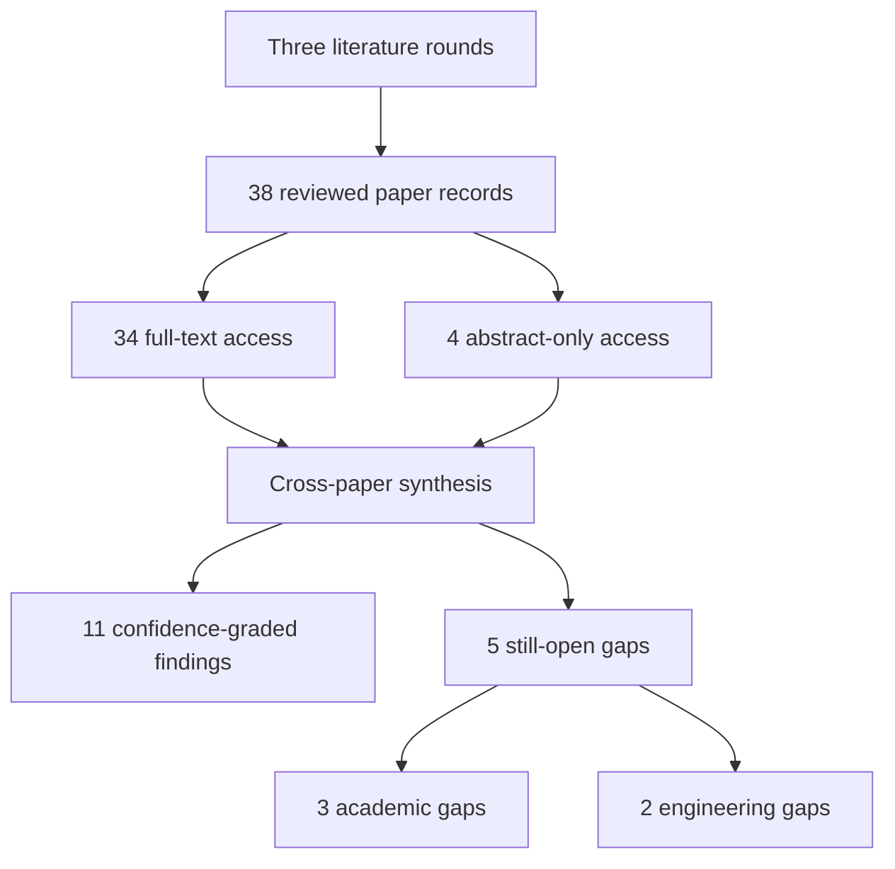

# Research Report: Empirical Reply-to-Proposition Alignment in Email and Dialogue

## Contents

- [Round History](#round-history)
- [Executive Summary](#executive-summary)
- [Research Question](#research-question)
- [Methodology](#methodology)
- [Papers Reviewed](#papers-reviewed)
- [Research Landscape](#research-landscape)
- [Confidence-Graded Findings](#confidence-graded-findings)
- [Research Gaps](#research-gaps)
- [Practical Recommendations](#practical-recommendations)
- [Evidence Map](#evidence-map)
- [References](#references)
- [Appendix: Run Metadata](#appendix-run-metadata)

## Round History

Iterative gap-closure loop (hard cap: 4 rounds). See
`references/iterative-synthesis.md` for the full loop definition.

| Round | Run ID | Topic / Gap Focus | New Papers | Gaps Addressed | Remaining Gaps |
|-------|--------|-------------------|------------|----------------|----------------|
| 1 | 769bfc7cfebf | reference resolution to propositions and the semantic scope of replies in work communication | 13 | initial shortlist | 3 academic, 2 engineering |
| 2 | f72f7f513e9d | empirical reply-to-proposition alignment in email and dialogue, focusing on partial replies, multiple questions, unanswered questions, and multi-proposition antecedents | 13 | 0 resolved | 3 academic, 2 engineering |
| 3 | 5633fba0b695 | proposition-level response scope in workplace email and dialogue, with emphasis on partial replies to multi-question or multi-proposition antecedents, unanswered subquestions, approval/rejection scope, and multi-antecedent response links | 12 | academic gaps of the previous round | 3 academic, 2 engineering |

**Stop reason**: another round runs while open academic gaps remain and new papers appear

## Executive Summary

This review investigated how replies in email and dialogue should be aligned to the exact propositions, questions, requests, or discourse segments they semantically address, with particular attention to partial answers, multiple questions, unanswered material, approval/rejection scope, and composite antecedents. Across 38 reviewed paper records, the strongest [HIGH] conclusion is that semantic response scope cannot safely be reduced to a single whole-message or nearest-turn parent: zero-link, one-to-many, many-to-one, many-to-many, non-adjacent, composite, and ambiguous structures are empirically supported across email, dialogue, discourse parsing, grounding, question-response alignment, and abstract-anaphora research [doi-10-1609-aaai-v33i01-3301134] [doi-10-18653-v1-d15-1109] [doi-10-3233-aic-2012-0516] [2403.16609]. A second [HIGH] conclusion is that unanswered questions and partially resolved issues must remain explicit rather than being inferred as closed merely because a later reply exists [doi-10-3115-1220355-1220483] [doi-10-3115-1708376-1708429] [doi-10-15398-jlm-v4i2-173]. The most significant unresolved issue is the absence of direct empirical validation of proposition-level approval, rejection, agreement, clarification, and partial-answer scope in authentic workplace email or enterprise chat. Consequently, the evidence is sufficient to justify a conservative graph-based response-scope architecture and an engineering annotation pilot, but not to claim production-ready accuracy for Outlook/Teams-like communication.

**Scope**: 38 paper records analyzed from 17 access hosts over 1977–2024  
**Overall Confidence**: High for structural representation requirements; Medium for transfer to enterprise communication  
**Verdict**: HAS_GAPS

## Research Question

The investigation asked:

> How should a work-information system resolve a current reply, reference, answer, agreement, rejection, clarification, or approval to the exact prior proposition(s), question(s), event(s), or discourse span(s) that it semantically targets, while preserving partial scope, multiple antecedents, unanswered material, ambiguity, missing antecedents, and explicit no-link outcomes?

The in-scope object is a proposition- or span-level mapping:

$\text{response span} \rightarrow \{\text{antecedent proposition/span}\}_{0..n} \rightarrow \text{relation} \rightarrow \text{scope}$

where relation may include answer, agreement, rejection, clarification, condition, or reference, and scope may be exact, partial, ambiguous, unsupported, or unresolved.

In scope are semantic response target identification, answer/question alignment, agreement/rejection scope, discourse deixis and abstract/non-nominal antecedents, split or composite antecedents, unanswered questions, and uncertainty in antecedent choice. Out of scope are generic named-entity coreference, quote-source extraction already owned by Topic 01, Topic segmentation owned by Topic 02, downstream speech-act extraction owned by Topic 05, attachment/table/visual grounding owned by Topic 08, and generic whole-message NLI that cannot identify the affected proposition.

## Methodology

### Search Strategy

- **Sources**: Papers were read through the host's web tool from 17 supplied access hosts, including arXiv, ACL Anthology, publisher/journal pages, university repositories, workshop proceedings, ResearchGate, and institutional publication repositories. The supplied final-stage artifacts do not identify the discovery search engines separately, so no unsupported discovery-source attribution is made.
- **Query variants**:
  - `proposition-level response scope workplace email dialogue, emphasis partial replies multi-question multi-proposition antecedents, unanswered subquestions, approval/rejection scope, multi-antecedent response links`
  - `proposition-level response scope`
  - `proposition-level workplace email dialogue, emphasis partial replies multi-question multi-proposition antecedents, unanswered subquestions, approval/rejection scope, multi-antecedent response links`
  - `response workplace email dialogue, emphasis partial replies multi-question multi-proposition antecedents, unanswered subquestions, approval/rejection scope, multi-antecedent response links`
  - `scope workplace email dialogue, emphasis partial replies multi-question multi-proposition antecedents, unanswered subquestions, approval/rejection scope, multi-antecedent response links`
  - `proposition-level response scope workplace email`
  - `proposition-level response scope dialogue, emphasis`
  - `proposition-level response scope partial replies`
- **Time window**: Reviewed literature spans 1977–2024.
- **Screening**: The supplied report-stage artifacts do not state whether screening used BM25 alone or BM25 plus sub-agent review. No unsupported screening mechanism is inferred.
- **Reading procedure**: Every listed paper was read through the host's web tool at the access level recorded below. Thirty-four paper records had full-text access and four had abstract-only access.
- **Evidence policy**: Direct workplace/email evidence was distinguished from transfer evidence from dialogue, customer service, interviews, parliamentary proceedings, formal pragmatics, discourse parsing, and abstract anaphora.

### Pipeline Summary

| Metric | Count |
|--------|-------|
| Total candidates | Unknown from supplied report-stage artifacts |
| After screening | Unknown from supplied report-stage artifacts |
| Downloaded | Not established; papers were read through the host web tool |
| Successfully converted | Not established; conversion counts were not supplied |
| Deeply analyzed / included in synthesis | 38 |
| Iterations | 3 completed rounds |

### Per-Paper Access Audit

| Paper ID | Access level | Access host / route |
|---|---|---|
| [1706.02256] | full_text | arxiv.org |
| [2403.16609] | full_text | arxiv.org |
| [doi-10-1007-bf00351935] | full_text | semantics.uchicago.edu |
| [doi-10-1007-bf00983299] | abstract_only | asc.ohio-state.edu |
| [doi-10-1007-s10489-013-0481-1] | abstract_only | pure.dongguk.edu |
| [doi-10-1016-j-pragma-2007-07-011] | abstract_only | sciencedirect.com |
| [doi-10-1016-j-pragma-2018-03-015] | full_text | eprints.whiterose.ac.uk |
| [doi-10-1093-jos-17-1-51] | abstract_only | academic.oup.com |
| [doi-10-1109-icaicta63815-2024-10762999] | full_text | easychair.org |
| [doi-10-1162-coli-a-00327] | full_text | aclanthology.org |
| [doi-10-1177-002383099603900306] | full_text | arxiv.org |
| [doi-10-1515-ling-2018-0008] | full_text | scholarworks.indianapolis.iu.edu |
| [doi-10-15398-jlm-v4i2-173] | full_text | jlm.ipipan.waw.pl |
| [doi-10-1609-aaai-v33i01-3301134] | full_text | nlpr.ia.ac.cn |
| [doi-10-18653-v1-2021-codi-sharedtask-1] | full_text | aclanthology.org |
| [doi-10-18653-v1-2021-naacl-main-329] | full_text | aclanthology.org |
| [doi-10-18653-v1-2022-emnlp-main-778] | full_text | arxiv.org |
| [doi-10-18653-v1-2023-eacl-main-247] | full_text | aclanthology.org |
| [doi-10-18653-v1-2023-findings-acl-710] | full_text | arxiv.org |
| [doi-10-18653-v1-d15-1109] | full_text | aclanthology.org |
| [doi-10-18653-v1-p17-1009] | full_text | aclanthology.org |
| [doi-10-18653-v1-s15-1035] | full_text | aclanthology.org |
| [doi-10-3115-1220355-1220483] | full_text | aclanthology.org |
| [doi-10-3115-1708376-1708429] | full_text | aclanthology.org |
| [doi-10-3115-v1-d14-1056] | full_text | aclanthology.org |
| [doi-10-3233-aic-2012-0516] | full_text | starlab.ewi.tudelft.nl |
| [doi-10-3765-sp-5-6] | full_text | semprag.org |
| [doi-10-5210-dad-2022-203] | full_text | aclanthology.org |
| [doi-10-5210-dad-2023-201] | full_text | aclanthology.org |
| [manual-555fa5b6e8] | full_text | aclanthology.org |
| [manual-5a32708675] | full_text | research.nii.ac.jp |
| [manual-5c0971730d] | full_text | aclanthology.org |
| [manual-7743c50805] | full_text | semdial.org |
| [manual-8b8a394daa] | full_text | scholarworks.indianapolis.iu.edu |
| [manual-a6314f615a] | full_text | aclanthology.org |
| [manual-ad98de9372] | full_text | researchgate.net |
| [manual-be69c3aa17] | full_text | researchgate.net |
| [manual-e1981ecd9a] | full_text | aclanthology.org |

## Papers Reviewed

No numerical quality scores were supplied by the pipeline, so the report does not manufacture them. Relevance below describes topical relationship to Topic 04 rather than methodological quality.

| # | Title | Authors | Year | Venue | Quality Score | Relevance |
|---|-------|---------|------|-------|--------------|-----------|
| 1 | ‘But what is the reason why you know such things?’: Question and response patterns in the LADO interview [doi-10-1016-j-pragma-2018-03-015] | Alison Channon, Paul Foulkes, Traci Sue Walker | 2018 | Not supplied | Not scored | HIGH |
| 2 | Contrasting the Interaction Structure of an Email and a Telephone Corpus: A Machine Learning Approach to Annotation of Dialogue Function Units [doi-10-3115-1708376-1708429] | Jun Hu, Rebecca Passonneau, Owen Rambow | 2009 | Not supplied | Not scored | HIGH |
| 3 | Characterizing the Response Space of Questions: data and theory [doi-10-5210-dad-2022-203] | Jonathan Ginzburg, Zulipiye Yusupujiang, Chuyuan Li et al. | 2022 | Not supplied | Not scored | HIGH |
| 4 | Discourse Analysis via Questions and Answers: Parsing Dependency Structures of Questions Under Discussion [doi-10-18653-v1-2023-findings-acl-710] | Wei-Jen Ko, Yating Wu, Cutter Dalton et al. | 2023 | Not supplied | Not scored | HIGH |
| 5 | Detection of Question-Answer Pairs in Email Conversations [doi-10-3115-1220355-1220483] | Lokesh Shrestha, Kathleen McKeown | 2004 | Not supplied | Not scored | HIGH |
| 6 | Query responses [doi-10-15398-jlm-v4i2-173] | Paweł Łupkowski, Jonathan Ginzburg | 2017 | Not supplied | Not scored | HIGH |
| 7 | Scoring Coreference Chains with Split-Antecedent Anaphors [doi-10-5210-dad-2023-201] | Silviu Paun, Juntao Yu, Nafise Sadat Moosavi et al. | 2023 | Not supplied | Not scored | MEDIUM |
| 8 | Conversational Grounding: Annotation and Analysis of Grounding Acts and Grounding Units [2403.16609] | Biswesh Mohapatra, Seemab Hassan, Laurent Romary et al. | 2024 | Not supplied | Not scored | HIGH |
| 9 | The DAD Parallel Corpora and their Uses [manual-ad98de9372] | Costanza Navarretta | 2010 | Not supplied | Not scored | MEDIUM |
| 10 | Answering Clarification Questions [manual-e1981ecd9a] | Matthew Purver, Patrick G.T. Healey, James King et al. | 2003 | Not supplied | Not scored | HIGH |
| 11 | Inferring Acceptance and Rejection in Dialogue by Default Rules of Inference [doi-10-1177-002383099603900306] | Marilyn A. Walker | 1996 | Not supplied | Not scored | HIGH |
| 12 | Resolving abstract anaphors in Spanish discourse: Underspecification and mereological structures [doi-10-1515-ling-2018-0008] | Iker Zulaica Hernández | 2018 | Not supplied | Not scored | MEDIUM |
| 13 | Stay Together: A System for Single and Split-antecedent Anaphora Resolution [doi-10-18653-v1-2021-naacl-main-329] | Juntao Yu, Nafise Sadat Moosavi, Silviu Paun et al. | 2021 | Not supplied | Not scored | MEDIUM |
| 14 | Syntax and semantics of questions [doi-10-1007-bf00351935] | Lauri Karttunen | 1977 | Not supplied | Not scored | MEDIUM |
| 15 | Resolving abstract anaphors in Spanish discourse: Underspecification and mereological structures [manual-8b8a394daa] | Iker Zulaica-Hernández | 2018 | Not supplied | Not scored | MEDIUM |
| 16 | Information Structure: Towards an integrated formal theory of pragmatics [doi-10-3765-sp-5-6] | Craige Roberts | 2012 | Not supplied | Not scored | HIGH |
| 17 | A Mention-Ranking Model for Abstract Anaphora Resolution [1706.02256] | Ana Marasović, Leo Born, Juri Opitz et al. | 2017 | Not supplied | Not scored | MEDIUM |
| 18 | End-to-End Neural Discourse Deixis Resolution in Dialogue [doi-10-18653-v1-2022-emnlp-main-778] | Shengjie Li, Vincent Ng | 2022 | Not supplied | Not scored | HIGH |
| 19 | A Twin-Candidate Based Approach for Event Pronoun Resolution using Composite Kernel [manual-5c0971730d] | Bin Chen, Jian Su, Chew Lim Tan | 2010 | Not supplied | Not scored | MEDIUM |
| 20 | Resolving Shell Nouns [doi-10-3115-v1-d14-1056] | Varada Kolhatkar, Graeme Hirst | 2014 | Not supplied | Not scored | MEDIUM |
| 21 | Resolving questions, II [doi-10-1007-bf00983299] | Jonathan Ginzburg | 1995 | Not supplied | Not scored | MEDIUM |
| 22 | Resolving Event Noun Phrases to Their Verbal Mentions [manual-555fa5b6e8] | Bin Chen, Jian Su, Chew Lim Tan | 2010 | Not supplied | Not scored | MEDIUM |
| 23 | Anaphora With Non-nominal Antecedents in Computational Linguistics: a Survey [doi-10-1162-coli-a-00327] | Varada Kolhatkar, Adam Roussel, Stefanie Dipper et al. | 2018 | Not supplied | Not scored | HIGH |
| 24 | Joint Learning for Event Coreference Resolution [doi-10-18653-v1-p17-1009] | Jing Lu, Vincent Ng | 2017 | Not supplied | Not scored | MEDIUM |
| 25 | The CODI-CRAC 2021 Shared Task on Anaphora, Bridging, and Discourse Deixis in Dialogue [doi-10-18653-v1-2021-codi-sharedtask-1] | Sopan Khosla, Juntao Yu, Ramesh Manuvinakurike et al. | 2021 | Not supplied | Not scored | MEDIUM |
| 26 | Detection of Question-Answer Pairs in Email Conversations [manual-a6314f615a] | Lokesh Shrestha, Kathleen McKeown | 2004 | Not supplied | Not scored | HIGH |
| 27 | Learning to Align Question and Answer Utterances in Customer Service Conversation with Recurrent Pointer Networks [doi-10-1609-aaai-v33i01-3301134] | Shizhu He, Kang Liu, Weiting An | 2019 | Not supplied | Not scored | HIGH |
| 28 | Automatic Question-Answer Alignment for Japanese Diverse Local Assembly Minutes [doi-10-1109-icaicta63815-2024-10762999] | Yoshiki Higashiyama, Tomoyosi Akiba | 2024 | Not supplied | Not scored | HIGH |
| 29 | Multiple questions in oral proficiency interviews [doi-10-1016-j-pragma-2007-07-011] | Gabriele Kasper, Steven J. Ross | 2007 | Not supplied | Not scored | HIGH |
| 30 | Overview of the NTCIR-16 QA Lab-PoliInfo-3 Task [manual-5a32708675] | Yasutomo Kimura, Hideyuki Shibuki, Hokuto Ototake et al. | 2022 | Not supplied | Not scored | HIGH |
| 31 | Detection of imperative and declarative question–answer pairs in email conversations [doi-10-3233-aic-2012-0516] | Helen Kwong, Neil Yorke-Smith | 2012 | Not supplied | Not scored | HIGH |
| 32 | Annotating Abstract Pronominal Anaphora in the DAD Project [manual-be69c3aa17] | Costanza Navarretta, Sussi Olsen | 2008 | Not supplied | Not scored | MEDIUM |
| 33 | A simple but effective model for attachment in discourse parsing with multi-task learning for relation labeling [doi-10-18653-v1-2023-eacl-main-247] | Zineb Bennis, Julie Hunter, Nicholas Asher | 2023 | Not supplied | Not scored | HIGH |
| 34 | Identifying reference to abstract objects in dialogue [manual-7743c50805] | Ron Artstein, Massimo Poesio | 2006 | Not supplied | Not scored | HIGH |
| 35 | Resolving Discourse-Deictic Pronouns: A Two-Stage Approach to Do It [doi-10-18653-v1-s15-1035] | Sujay Kumar Jauhar, Raul Guerra, Edgar Gonzàlez Pellicer et al. | 2015 | Not supplied | Not scored | MEDIUM |
| 36 | Towards identifying unresolved discussions in student online forums [doi-10-1007-s10489-013-0481-1] | Jihie Kim, Jeon Hyung Kang | 2014 | Not supplied | Not scored | MEDIUM |
| 37 | Discourse parsing for multi-party chat dialogues [doi-10-18653-v1-d15-1109] | Stergos Afantenos, Eric Kow, Nicholas Asher et al. | 2015 | Not supplied | Not scored | HIGH |
| 38 | Dialogue Acts, Synchronizing Units, and Anaphora Resolution [doi-10-1093-jos-17-1-51] | Miriam Eckert, Michael Strube | 2000 | Not supplied | Not scored | HIGH |

## Research Landscape

### Theme 1: Response Scope Is a Graph, Not a Single Parent Link

**Coverage**: multiple email, dialogue, grounding, and QA-alignment studies | **Confidence**: High  
**Supporting papers**: [doi-10-1609-aaai-v33i01-3301134], [doi-10-18653-v1-d15-1109], [doi-10-3233-aic-2012-0516], [2403.16609]

The literature consistently undermines a one-response/one-antecedent assumption. Customer-service QA alignment permits one answer utterance to link to multiple questions; multi-party dialogue discourse structures allow multiple parents; email question-answer work contains non-trivial linkage structures; and grounding units may involve several contributions rather than a single adjacent turn [doi-10-1609-aaai-v33i01-3301134] [doi-10-18653-v1-d15-1109] [doi-10-3233-aic-2012-0516] [2403.16609].

Key findings:

1. [HIGH] A response may legitimately have zero, one, or several antecedents, so the semantic structure is non-bijective rather than one-to-one [doi-10-1609-aaai-v33i01-3301134] [doi-10-18653-v1-d15-1109].
2. [HIGH] Multiple responses may also attach to the same antecedent, making many-to-one and many-to-many discourse structures relevant [doi-10-18653-v1-d15-1109] [2403.16609].
3. [HIGH] Message/thread membership provides useful candidate constraints but is not itself a semantic scope decision [doi-10-3115-1708376-1708429] [doi-10-3115-1220355-1220483].

A suitable abstract representation is therefore:

$G=(P,R,E)$

where $P$ is the set of antecedent propositions or spans, $R$ is the set of response spans, and

$E \subseteq R \times P \times T \times S$

records a relation type $T$ and scope status $S$ for each supported response-to-proposition edge.

### Theme 2: Unanswered and Partially Resolved Issues Are First-Class Discourse State

**Coverage**: email QA, query-response theory, clarification, grounding, multiple-question interaction | **Confidence**: High  
**Supporting papers**: [doi-10-3115-1220355-1220483], [doi-10-3115-1708376-1708429], [doi-10-15398-jlm-v4i2-173], [manual-e1981ecd9a], [doi-10-1016-j-pragma-2018-03-015]

Email and dialogue studies both show that a reply need not resolve all prior questions or requests. Question-response theory distinguishes response types that do not settle a query, while email interaction structures contain questions without detected answers. Multiple-question interaction further shows that a respondent can answer a recent or specific component while earlier/broader material remains unresolved [doi-10-3115-1220355-1220483] [doi-10-15398-jlm-v4i2-173] [doi-10-1016-j-pragma-2018-03-015].

Key findings:

1. [HIGH] A subsequent reply does not imply closure of every outstanding issue in the preceding message [doi-10-3115-1220355-1220483] [doi-10-3115-1708376-1708429].
2. [HIGH] Partial responses and clarification exchanges require open issues to survive across turns [doi-10-15398-jlm-v4i2-173] [manual-e1981ecd9a].
3. [HIGH] Multiple interrogatives cannot automatically be interpreted as multiple independent obligations, because some are reformulations or refinements of one issue [doi-10-1016-j-pragma-2007-07-011] [doi-10-1016-j-pragma-2018-03-015].

For msgloom, the safe state transition is therefore not

$\text{message replied to} \Rightarrow \text{all contained obligations resolved}$,

but proposition-specific:

$\text{resolved}(p_i) \iff \exists r_j : E(r_j,p_i)$ with a relation and scope sufficient to resolve $p_i$.

### Theme 3: Acceptance, Rejection, and Answerhood Have Proposition-Level Scope

**Coverage**: acceptance/rejection inference, question-response theory, grounding | **Confidence**: High for dialogue; Low-to-Medium for direct enterprise transfer  
**Supporting papers**: [doi-10-1177-002383099603900306], [doi-10-15398-jlm-v4i2-173], [2403.16609]

Walker demonstrates that conversational acceptance and rejection are sensitive to the content being accepted or rejected rather than merely to the response utterance as a whole. Acceptance of a weaker or entailed component can coexist with rejection of a stronger proposition, while omission or substitution can participate in rejection inference [doi-10-1177-002383099603900306]. Query-response and grounding work likewise treats response interpretation as relational to active content [doi-10-15398-jlm-v4i2-173] [2403.16609].

Key findings:

1. [HIGH] A response can accept one component while failing to accept, or actively rejecting, another component of related antecedent content [doi-10-1177-002383099603900306].
2. [HIGH] Whole-message labels such as "approved" or "rejected" are therefore unsafe when the antecedent contains separable propositions [doi-10-1177-002383099603900306].
3. [LOW] The reviewed corpus does not establish how frequently these partial-scope acceptance/rejection patterns occur in authentic enterprise Outlook or Teams communication; direct workplace validation remains absent.

### Theme 4: Proposition, Event, and Discourse-Segment Antecedents Are Different From Entity Coreference

**Coverage**: abstract anaphora, discourse deixis, shell nouns, event reference, surveys | **Confidence**: High  
**Supporting papers**: [doi-10-1162-coli-a-00327], [manual-7743c50805], [manual-be69c3aa17], [doi-10-1093-jos-17-1-51], [doi-10-18653-v1-2022-emnlp-main-778]

Non-nominal reference may target clauses, propositions, events, facts, situations, or larger discourse segments. The literature repeatedly distinguishes this from ordinary nominal/coreference resolution, and exact antecedent delimitation can be substantially harder than locating the approximate region [doi-10-1162-coli-a-00327] [manual-7743c50805] [manual-be69c3aa17].

Key findings:

1. [HIGH] Entity-coreference machinery alone is insufficient for "this", "that", "yes", or similar forms when the intended target is propositional or event-like [doi-10-1162-coli-a-00327] [doi-10-1093-jos-17-1-51].
2. [HIGH] Exact antecedent boundaries can be uncertain even when annotators agree on the rough discourse region [manual-7743c50805] [manual-be69c3aa17].
3. [MEDIUM] Locality is useful as a candidate prior in some dialogue-deixis benchmarks, but should not become a universal hard window for asynchronous work communication [doi-10-18653-v1-2022-emnlp-main-778] [manual-555fa5b6e8] [doi-10-3115-1220355-1220483].

### Theme 5: Composite and Split Antecedents Need Native Representation

**Coverage**: abstract anaphora, split-antecedent resolution/scoring, discourse parsing | **Confidence**: High for representation; Medium for workplace-response transfer  
**Supporting papers**: [doi-10-1515-ling-2018-0008], [manual-8b8a394daa], [doi-10-5210-dad-2023-201], [doi-10-18653-v1-2021-naacl-main-329], [doi-10-18653-v1-d15-1109]

Some later expressions obtain their interpretation from several earlier discourse units jointly. Split-antecedent work formalizes multi-source reference and scoring, while discourse parsing independently permits multi-parent structures [doi-10-1515-ling-2018-0008] [doi-10-5210-dad-2023-201] [doi-10-18653-v1-d15-1109].

Key findings:

1. [HIGH] Composite antecedents are linguistically justified and should not be forced into an arbitrary single span [doi-10-1515-ling-2018-0008] [manual-8b8a394daa].
2. [HIGH] Evaluation must expose multi-antecedent behavior explicitly rather than allowing rare split cases to disappear inside aggregate scores [doi-10-5210-dad-2023-201].
3. [MEDIUM] A workplace response may plausibly target a coherent set of several business propositions, but the reviewed literature does not directly validate this exact use case.

### Theme 6: Ambiguity, No-Link, and Revision Are Legitimate Outcomes

**Coverage**: grounding, abstract anaphora annotation, QA alignment, email interaction | **Confidence**: High  
**Supporting papers**: [2403.16609], [manual-be69c3aa17], [doi-10-1609-aaai-v33i01-3301134], [doi-10-3115-1708376-1708429], [doi-10-15398-jlm-v4i2-173]

Some responses cannot be reliably assigned to one antecedent, some have no supported antecedent in the available context, and later context may clarify earlier interpretation [2403.16609] [manual-be69c3aa17] [doi-10-15398-jlm-v4i2-173].

Key findings:

1. [HIGH] Explicit no-link and alternative-antecedent outcomes are preferable to forced attachment when evidence is insufficient [2403.16609] [doi-10-1609-aaai-v33i01-3301134].
2. [HIGH] Missing antecedent evidence and genuine ambiguity must be distinguished; neither should be silently converted into a broad message-level link [manual-be69c3aa17] [doi-10-3115-1708376-1708429].
3. [MEDIUM] Incremental systems should permit scope judgments to remain provisional and to be revised when later context changes interpretation [2403.16609] [doi-10-15398-jlm-v4i2-173].

## Methodology Comparison

| Approach | Papers | Strengths | Weaknesses | Best For | Performance |
|----------|--------|-----------|------------|----------|-------------|
| Question-answer alignment | [doi-10-3115-1220355-1220483], [doi-10-3233-aic-2012-0516], [doi-10-1609-aaai-v33i01-3301134], [doi-10-1109-icaicta63815-2024-10762999], [manual-5a32708675] | Directly models response-to-question links; some work permits multiple links | Often utterance/sentence-level rather than exact proposition-level; task formulations differ | Candidate QA linkage and unanswered-question detection | Metrics are heterogeneous and not directly comparable in supplied synthesis |
| Dialogue discourse parsing / attachment | [doi-10-18653-v1-d15-1109], [doi-10-18653-v1-2023-eacl-main-247], [doi-10-18653-v1-2023-findings-acl-710] | Handles non-adjacency, attachment structure, relation types, sometimes multi-parent graphs | Dialogue units do not necessarily equal business propositions | Structural antecedent attachment and relation labeling | No common comparable metric supplied |
| Abstract anaphora / discourse deixis | [1706.02256], [doi-10-18653-v1-2022-emnlp-main-778], [doi-10-18653-v1-s15-1035], [manual-7743c50805], [doi-10-1162-coli-a-00327] | Direct support for non-nominal/propositional antecedents and uncertain spans | Reference tasks do not automatically establish answer/agreement semantics | Propositional/event antecedent candidate resolution | One dialogue-deixis benchmark reports more than 90% of antecedents within four utterances [doi-10-18653-v1-2022-emnlp-main-778]; not transferable as a universal work-email rule |
| Split/composite antecedent resolution | [doi-10-18653-v1-2021-naacl-main-329], [doi-10-5210-dad-2023-201], [doi-10-1515-ling-2018-0008] | Native handling of several antecedents and partial-credit scoring | Sparse cases; not directly response-scope evaluation | Composite target representation and evaluation | Aggregate scores can obscure rare split-antecedent failures [doi-10-5210-dad-2023-201] |
| Grounding / QUD / response-space models | [2403.16609], [doi-10-3765-sp-5-6], [doi-10-15398-jlm-v4i2-173], [doi-10-5210-dad-2022-203] | Rich model of open issues, response types, grounding, and unresolved questions | Formal/discourse models require operationalization for enterprise pipelines | Maintaining unresolved issues and response semantics | Not expressed as a directly comparable production metric |
| Acceptance/rejection inference | [doi-10-1177-002383099603900306] | Explicitly demonstrates proposition-sensitive acceptance/rejection behavior | Single older dialogue line of evidence; not enterprise-email validation | Mixed accept/reject and partial approval cases | No directly comparable production metric supplied |

## Confidence-Graded Findings

### 🟢 High Confidence (supported by 3+ papers with consistent results)

1. **[HIGH] A single response cannot generally be assumed to resolve exactly one preceding unit.** One-to-many, many-to-one, many-to-many, and multi-parent structures occur across customer-service dialogue, multi-party dialogue, email, and grounding research [doi-10-1609-aaai-v33i01-3301134] [doi-10-18653-v1-d15-1109] [doi-10-3233-aic-2012-0516] [2403.16609].

2. **[HIGH] Unanswered questions and requests are genuine discourse states.** A later message or locally coherent reply does not establish that every prior issue was answered [doi-10-3115-1220355-1220483] [doi-10-3115-1708376-1708429] [doi-10-15398-jlm-v4i2-173] [manual-e1981ecd9a].

3. **[HIGH] Nearest-turn or reply-thread structure is insufficient as the semantic scope boundary.** Answers and references can target older, parallel, or non-adjacent material [doi-10-3115-1220355-1220483] [doi-10-3115-1708376-1708429] [doi-10-18653-v1-d15-1109] [2403.16609].

4. **[HIGH] A response can apply to only part of antecedent propositional content.** Acceptance of a weaker or entailed component can coexist with rejection or non-acceptance of a stronger proposition [doi-10-1177-002383099603900306].

5. **[HIGH] Multi-question turns do not imply all questions will be answered together.** Respondents may answer the most recent or specific question while earlier/broader material remains open, and some multiple interrogatives function as reformulations rather than separate issues [doi-10-1016-j-pragma-2018-03-015] [doi-10-1016-j-pragma-2007-07-011] [2403.16609].

6. **[HIGH] Proposition-, event-, and discourse-segment antecedents form an important class distinct from ordinary nominal coreference.** Exact boundary identification is often harder than rough localization [doi-10-1093-jos-17-1-51] [doi-10-1162-coli-a-00327] [manual-7743c50805] [manual-be69c3aa17].

7. **[HIGH] Composite antecedents are linguistically and computationally justified.** Several propositions or discourse units may jointly constitute one later target, subject to discourse-coherence constraints [doi-10-1515-ling-2018-0008] [manual-8b8a394daa] [doi-10-18653-v1-d15-1109].

8. **[HIGH] Ambiguity, no-link, and alternative-antecedent outcomes must be representable.** Forcing one antecedent where evidence is insufficient risks turning uncertainty into a false approval, answer, or commitment [2403.16609] [manual-be69c3aa17] [doi-10-1609-aaai-v33i01-3301134] [doi-10-3115-1708376-1708429].

9. **[HIGH] Multi-antecedent evaluation requires explicit visibility and partial credit.** Aggregate metrics can conceal poor behavior on rare but structurally important split-antecedent cases [doi-10-5210-dad-2023-201] [doi-10-18653-v1-2023-eacl-main-247].

### 🟡 Medium Confidence (supported by 1-2 papers or with caveats)

1. **[MEDIUM] Response interpretation should be revisable as later context arrives.** Grounding and response-space evidence supports keeping some first-pass scope judgments provisional rather than irrevocably final [2403.16609] [doi-10-15398-jlm-v4i2-173].

2. **[MEDIUM] Candidate identification, attachment, and relation labeling should be modeled jointly or tightly coupled.** Evidence from discourse attachment, event coreference, and discourse-deictic resolution shows material interaction between target selection and relation classification [doi-10-18653-v1-2023-eacl-main-247] [doi-10-18653-v1-p17-1009] [doi-10-18653-v1-s15-1035].

### 🔴 Low Confidence (preliminary, single-source, or contradicted)

1. **[LOW] Any fixed locality window is suitable for workplace response resolution.** One dialogue-deixis benchmark finds more than 90% of antecedents within four utterances, but email, event-reference, and multi-party data show materially longer or cross-thread dependencies; the reviewed literature does not justify a universal workplace window [doi-10-18653-v1-2022-emnlp-main-778] [manual-555fa5b6e8] [doi-10-3115-1220355-1220483] [doi-10-18653-v1-d15-1109].

2. **[LOW] Existing published methods have validated production-level proposition-scope accuracy for enterprise Outlook/Teams communication.** The supplied corpus contains no direct study establishing that claim; this remains the central academic gap.

## Trade-Off Analysis

| Decision | Option A | Option B | Recommendation |
|----------|----------|----------|----------------|
| Response representation | One parent/message-level link: simple and cheap, but cannot represent partial, zero-link, or multi-target scope | Proposition/span graph with zero-to-many links: more complex but matches observed structures | Use proposition/span graph; evidence consistently rejects universal one-to-one scope [doi-10-1609-aaai-v33i01-3301134] [doi-10-18653-v1-d15-1109] |
| Candidate locality | Hard short recency window: efficient but risks missing asynchronous/non-adjacent targets | Locality prior plus escape path to older/cross-thread candidates | Use locality as a feature, not a hard constraint [doi-10-18653-v1-2022-emnlp-main-778] [doi-10-3115-1220355-1220483] |
| Uncertainty handling | Force best antecedent | Allow exact, partial, ambiguous, unsupported, and no-link states | Preserve uncertainty; false broad links are more dangerous for msgloom state tracking [2403.16609] [manual-be69c3aa17] |
| Multi-question state | Mark containing message resolved after any answer | Track each question/request proposition independently | Track obligations independently [doi-10-3115-1220355-1220483] [doi-10-15398-jlm-v4i2-173] |
| Composite target | Collapse to one nearest span | Represent a coherent set of antecedent spans | Support structured composite antecedents, with coherence constraints [doi-10-1515-ling-2018-0008] [doi-10-5210-dad-2023-201] |
| Attachment and relation modeling | Fully independent stages | Shared/tightly coupled candidate and relation reasoning | Keep modular interfaces but allow semantic coupling [doi-10-18653-v1-2023-eacl-main-247] [doi-10-18653-v1-p17-1009] |
| Error objective | Symmetric link accuracy | Separate cost for over-broad commitments vs unresolved links | Engineer and validate an asymmetric loss; literature does not supply msgloom-specific weights |

For engineering evaluation, a suitable form is:

$L = \lambda_{\text{broad}} FP_{\text{broad}} + \lambda_{\text{miss}} FN_{\text{link}} + \lambda_{\text{wrong-rel}} E_{\text{relation}} + \lambda_{\text{scope}} E_{\text{scope}}$

with the $\lambda$ values determined empirically rather than imported from the reviewed literature.

## Points of Agreement **[EVIDENCE REQUIRED]**

1. **[HIGH] Semantic response scope is not equivalent to reply/thread structure.** Email and dialogue both contain non-adjacent or structurally complex response links [doi-10-3115-1220355-1220483] [doi-10-3115-1708376-1708429] [doi-10-18653-v1-d15-1109].

2. **[HIGH] Unresolved issues must remain visible.** A response may fail to answer a question, only partially answer it, or trigger clarification rather than closure [doi-10-15398-jlm-v4i2-173] [manual-e1981ecd9a] [doi-10-3115-1220355-1220483].

3. **[HIGH] Non-nominal antecedents require dedicated treatment.** Propositions, events, facts, situations, and discourse spans are legitimate antecedent types not reducible to entity coreference [doi-10-1162-coli-a-00327] [manual-7743c50805] [manual-be69c3aa17].

4. **[HIGH] Multiple antecedents cannot be treated as annotation noise.** Split/composite reference and multi-parent discourse structures are supported across distinct research traditions [doi-10-1515-ling-2018-0008] [doi-10-18653-v1-2021-naacl-main-329] [doi-10-18653-v1-d15-1109].

5. **[HIGH] Relation type matters in addition to target identification.** Answer, acceptance, rejection, clarification, grounding, and discourse attachment describe different semantic relationships to antecedent content [doi-10-1177-002383099603900306] [manual-e1981ecd9a] [2403.16609] [doi-10-18653-v1-2023-eacl-main-247].

## Points of Contradiction **[EVIDENCE REQUIRED]**

1. **[MEDIUM] How local antecedent search should be**: [doi-10-18653-v1-2022-emnlp-main-778] reports strongly local dialogue-deixis behavior, with more than 90% of antecedents within four utterances, whereas event-reference, email, and multi-party dialogue evidence permits substantially longer-distance or cross-thread dependencies [manual-555fa5b6e8] [doi-10-3115-1220355-1220483] [doi-10-18653-v1-d15-1109].
   - **Possible explanation**: different genres, discourse relations, candidate definitions, and synchrony.
   - **Implication**: locality should be a learned or weighted prior, not a hard universal cutoff.

2. **[MEDIUM] Whether unresolved issues fit a simple QUD stack**: the integrated pragmatics framework in [doi-10-3765-sp-5-6] uses a QUD stack, whereas empirical query-response analysis in [doi-10-15398-jlm-v4i2-173] motivates multiple simultaneously accessible issues organized more flexibly than a simple stack.
   - **Possible explanation**: theoretical abstraction versus empirical response classes requiring concurrent issue accessibility.
   - **Implication**: msgloom should permit several independently open questions/requests rather than assuming strict LIFO resolution.

3. **[MEDIUM] Single-target versus multi-target alignment assumptions**: some alignment tasks operationalize correspondence using one-to-one or grouped mappings [doi-10-1109-icaicta63815-2024-10762999] [manual-5a32708675], whereas customer-service and email evidence explicitly permits answer utterances associated with multiple questions [doi-10-1609-aaai-v33i01-3301134] [doi-10-3233-aic-2012-0516].
   - **Possible explanation**: different task definitions rather than direct disagreement about conversational behavior.
   - **Implication**: a one-to-one matcher is too restrictive as msgloom's general semantic representation.

4. **[MEDIUM] Whether exact abstract-antecedent boundaries are reliably annotatable**: the DAD annotation work reports substantial success under structured annotation constraints [manual-be69c3aa17], whereas less constrained abstract-object span selection shows only moderate convergence and the survey identifies antecedent delimitation as a recurring difficulty [manual-7743c50805] [doi-10-1162-coli-a-00327].
   - **Possible explanation**: annotation guidelines, candidate constraints, corpus genre, and unit definition.
   - **Implication**: msgloom must empirically validate exact-span annotation rather than assume it is reliably reproducible.

5. **[MEDIUM] Whether syntactic constraints consistently improve abstract-reference resolution**: explicit syntax helps in some shell-noun and event-reference settings [doi-10-3115-v1-d14-1056] [manual-555fa5b6e8], while broader abstract-anaphora work shows that rigid constraints can be noisy or harmful [1706.02256].
   - **Possible explanation**: syntax is more informative for some referent classes than others.
   - **Implication**: use syntax as one feature or candidate signal rather than a universal admissibility rule.

## Research Gaps

All five gaps remain open. The literature has not answered them yet at the level required by msgloom.

| # | Gap | Type | Severity | Rounds already searched / evaluated | Impact on Goals |
|---|-----|------|----------|--------------------------------------|-----------------|
| 1 | Direct empirical evidence for proposition-level agreement, rejection, approval, clarification, and answer scope in authentic workplace email or enterprise chat is still missing, especially short replies applying to only part of a prior message. | [ACADEMIC] | HIGH | 1, 2, 3 | Without direct domain evidence, transfer literature cannot establish production accuracy for decision-critical approval/commitment scope. |
| 2 | A validated workplace annotation/evaluation scheme covering exact, partial, ambiguous, unsupported, discontinuous, multi-antecedent, and no-link scope is still missing. | [ENGINEERING] | HIGH | 1, 2, 3 evidence reviewed; no validation completed | Incorrect gold design could make model scores misleading and conceal over-broad links. |
| 3 | Direct proposition-level evidence remains insufficient for determining which questions/requests remain unanswered after a partial reply to a multi-question workplace message. | [ACADEMIC] | HIGH | 1, 2, 3 | msgloom could falsely close work requiring the user's response. |
| 4 | It remains unresolved how workplace replies should target composite or multi-proposition antecedents. | [ACADEMIC] | MEDIUM | 1, 2, 3 | A single-span representation may lose valid scope, while unconstrained composites may over-link unrelated content. |
| 5 | Confidence thresholds, abstention rules, ambiguity policy, missing-antecedent handling, and asymmetric costs for false broad commitments versus unresolved links remain unvalidated. | [ENGINEERING] | HIGH | 1, 2, 3 evidence reviewed; no validation completed | This determines whether uncertainty becomes a false business decision or remains safely unresolved. |

### Academic Gaps (require more papers)

1. **[ACADEMIC][HIGH] Gap 1 — authentic workplace proposition-level approval/rejection scope**: Direct empirical evidence remains missing for short workplace replies that accept, reject, approve, clarify, or answer only part of an earlier multi-proposition message. The literature has not answered this yet. Rounds searched: 1, 2, 3. Suggested queries: `"reply scope" email dialogue proposition agreement approval rejection workplace communication`, `"partial approval" email proposition scope`, `"agreement scope" enterprise chat`.

2. **[ACADEMIC][HIGH] Gap 3 — partial replies to multiple workplace questions/requests**: Existing work establishes multiple-question behavior, unanswered questions, and multi-link QA alignment, but not an exact proposition-level evaluation identifying which subquestions in a workplace message remain open after the reply. The literature has not answered this yet. Rounds searched: 1, 2, 3. Suggested queries: `"question answer alignment" dialogue "multiple questions" partial answer unanswered questions`, `"partial answer" email multiple questions`, `"unanswered subquestion" dialogue`.

3. **[ACADEMIC][MEDIUM] Gap 4 — multi-proposition workplace reply targets**: Composite discourse referents and multi-unit antecedents are well motivated, but direct evidence for short workplace responses whose scope jointly covers several business propositions is still absent. The literature has not answered this yet. Rounds searched: 1, 2, 3. Suggested queries: `"multi-antecedent" propositional anaphora dialogue composite discourse referent reply`, `"composite antecedent" response scope`, `"multi-proposition" reply dialogue`.

### Engineering Gaps (fillable without papers)

1. **[ENGINEERING][HIGH] Gap 2 — annotation and evaluation contract**: Build an independent annotation pilot in which gold targets are exact proposition/span units and permitted outputs include exact, partial, ambiguous, unsupported, discontinuous, multiple-antecedent, and explicit no-link. Include adversarial cases containing multiple questions, mixed approve/reject replies, partial yes/no answers, non-adjacent targets, discontinuous targets, missing antecedents, and abstention. Measure target-link precision/recall, relation accuracy, scope correctness, unresolved-question recall, and dedicated multi-antecedent metrics. The literature has not validated this combined contract yet [manual-be69c3aa17] [manual-7743c50805] [doi-10-5210-dad-2023-201] [2403.16609].

2. **[ENGINEERING][HIGH] Gap 5 — abstention and asymmetric error policy**: Define independent gold and measure over-broad approval/rejection/commitment false positives separately from conservative unresolved outcomes. Tune abstention only against held-out data, preserving ambiguity and missing-context states. The literature supports explicit ambiguity/no-link handling but does not establish msgloom-specific confidence thresholds or cost ratios [2403.16609] [doi-10-1609-aaai-v33i01-3301134] [manual-be69c3aa17] [doi-10-5210-dad-2023-201].

## Reproducibility Notes

The supplied synthesis did not include a systematic code, dataset, or license audit. Those fields are therefore marked unknown rather than inferred.

| Paper | Code Available | Data Available | Sufficient Detail | License |
|-------|---------------|----------------|-------------------|---------|
| [doi-10-3115-1220355-1220483] | Unknown from supplied artifacts | Unknown from supplied artifacts | Full text available for inspection | Unknown |
| [doi-10-1609-aaai-v33i01-3301134] | Unknown from supplied artifacts | Unknown from supplied artifacts | Full text available for inspection | Unknown |
| [doi-10-18653-v1-2022-emnlp-main-778] | Unknown from supplied artifacts | Unknown from supplied artifacts | Full text available for inspection | Unknown |
| [doi-10-18653-v1-2023-eacl-main-247] | Unknown from supplied artifacts | Unknown from supplied artifacts | Full text available for inspection | Unknown |
| [doi-10-5210-dad-2023-201] | Unknown from supplied artifacts | Unknown from supplied artifacts | Full text available for inspection | Unknown |
| [2403.16609] | Unknown from supplied artifacts | Unknown from supplied artifacts | Full text available for inspection | Unknown |
| [manual-be69c3aa17] | Unknown from supplied artifacts | Unknown from supplied artifacts | Full text available for inspection | Unknown |
| [doi-10-1177-002383099603900306] | Unknown from supplied artifacts | Unknown from supplied artifacts | Full text available for inspection | Unknown |

## Practical Recommendations **[EVIDENCE REQUIRED]**

1. **Represent response scope as a graph over proposition/span units, not a single message-level parent.** Permit zero, one, or multiple antecedent links and multiple responses to the same antecedent [doi-10-1609-aaai-v33i01-3301134] [doi-10-18653-v1-d15-1109] [doi-10-3233-aic-2012-0516].  
   *Confidence*: High

2. **Keep every question/request proposition independently addressable.** A reply to one subquestion must not close sibling questions or the containing message [doi-10-3115-1220355-1220483] [doi-10-15398-jlm-v4i2-173] [doi-10-1016-j-pragma-2018-03-015].  
   *Confidence*: High

3. **Separate structural candidate generation from semantic scope judgment.** Topic 01's thread/quote evidence and Topic 02's Topic spans should constrain candidate search, but neither should determine semantic answer or approval scope [doi-10-3115-1708376-1708429] [doi-10-3115-1220355-1220483].  
   *Confidence*: High

4. **Store relation-specific edges.** At minimum distinguish answer, agreement, rejection, clarification, condition, and reference, because target attachment alone cannot state how the response affects the antecedent [doi-10-1177-002383099603900306] [manual-e1981ecd9a] [doi-10-18653-v1-2023-eacl-main-247].  
   *Confidence*: High

5. **Make exact, partial, ambiguous, unsupported, and no-link explicit output states.** Do not coerce uncertainty into whole-message approval or commitment [2403.16609] [manual-be69c3aa17] [doi-10-1609-aaai-v33i01-3301134].  
   *Confidence*: High

6. **Support composite antecedents as structured sets of proposition spans.** Require discourse coherence or relation evidence rather than allowing arbitrary span unions [doi-10-1515-ling-2018-0008] [doi-10-5210-dad-2023-201] [doi-10-18653-v1-d15-1109].  
   *Confidence*: High for representation; Medium for workplace applicability

7. **Persist unresolved questions and requests as first-class downstream state.** Topic 05/06 action and state processing should only close the proposition actually supported by response-scope evidence [doi-10-3115-1220355-1220483] [doi-10-15398-jlm-v4i2-173].  
   *Confidence*: High

8. **Permit revision of scope judgments while preserving earlier evidence and lineage.** Later turns can alter the interpretation of grounding or response scope [2403.16609] [doi-10-15398-jlm-v4i2-173].  
   *Confidence*: Medium

9. **Evaluate partial-scope and multi-antecedent cases separately from aggregate metrics.** Rare decision-critical over-broad links must remain visible even if overall attachment accuracy is strong [doi-10-5210-dad-2023-201] [doi-10-18653-v1-2023-eacl-main-247].  
   *Confidence*: High

10. **Treat recency as a prior, not a hard cutoff.** Local dialogue evidence can make a short window efficient, but email and multi-thread dialogue require escape paths to older candidates [doi-10-18653-v1-2022-emnlp-main-778] [doi-10-3115-1220355-1220483] [doi-10-18653-v1-d15-1109].  
    *Confidence*: High

11. **Run the gap-2 annotation pilot before treating the architecture as validated.** Use gold created independently from the component under test and include adversarial multi-question, mixed approve/reject, missing-context, discontinuous-target, and explicit-abstention fixtures [manual-be69c3aa17] [manual-7743c50805] [doi-10-5210-dad-2023-201].  
    *Confidence*: High

12. **Measure asymmetric business risk explicitly.** False broad approval/rejection/commitment edges and conservative unresolved edges should have separate denominators and costs; the reviewed literature does not provide msgloom-specific thresholds [2403.16609] [manual-be69c3aa17].  
    *Confidence*: Medium

## Future Directions

1. Conduct a final targeted academic search for authentic workplace email/enterprise-chat studies of agreement, approval, rejection, clarification, and proposition-level response scope.
2. Search specifically for corpora containing multi-question workplace messages with annotated partial answers and unanswered subquestions.
3. Search for response-specific composite-antecedent studies rather than generic split-anaphora work.
4. Build the independent gap-2 annotation pilot regardless of whether the next academic round finds additional papers; this is an engineering validation problem.
5. Derive and validate a decision-sensitive loss function for over-broad commitments, incorrect relation labels, missed links, and unnecessary abstention.
6. Hand missing-context retrieval to Topic 07 when the correct antecedent is outside available context rather than treating every unresolved case as a Topic 04 model error.
7. Hand references into tables, screenshots, attachments, rows, cells, and visual regions to Topic 08 while retaining Topic 04's semantic target/scope relation.
8. Use production-domain evaluation only after appropriate authorized workplace examples exist; synthetic/adversarial fixtures can validate mechanics but cannot establish enterprise representativeness.

## Readiness Assessment (System-Building Mode)

### Verdict: HAS_GAPS

### Assessment Summary

The synthesis is sufficient to determine several architecture invariants: msgloom should use proposition/span-level zero-to-many response links, preserve unresolved and ambiguous states, support composite antecedents, and avoid equating thread adjacency with semantic scope. It is not sufficient to claim production-level accuracy or finalize confidence/abstention policy because direct enterprise-domain evidence and the msgloom-specific annotation/evaluation contract remain unresolved.

### Coverage Matrix

| Dimension | Status | Evidence |
|-----------|--------|----------|
| Architecture patterns | ✅ Sufficient | Multi-parent/multi-link discourse and QA evidence [doi-10-1609-aaai-v33i01-3301134] [doi-10-18653-v1-d15-1109] [2403.16609] |
| Technology stack | ❌ Missing | Reviewed papers do not determine msgloom implementation stack |
| Performance baselines | ⚠️ Partial | Individual task metrics/locality observations exist, but datasets and units are not directly comparable [doi-10-18653-v1-2022-emnlp-main-778] |
| Security model | ❌ Missing | Outside this research question |
| Trade-off map | ⚠️ Partial | Representation and uncertainty trade-offs are supported, but msgloom-specific error costs are unvalidated [doi-10-5210-dad-2023-201] [manual-be69c3aa17] |

### Gap Resolution Plan

| # | Gap | Type | Severity | Resolution |
|---|-----|------|----------|------------|
| 1 | Direct workplace proposition-level agreement/rejection/approval evidence | [ACADEMIC] | HIGH | One final targeted search emphasizing authentic workplace/enterprise corpora and partial-scope annotation |
| 2 | Combined annotation/evaluation contract | [ENGINEERING] | HIGH | Independent annotation pilot with exact/partial/ambiguous/no-link/multi-antecedent gold and adversarial fixtures |
| 3 | Multi-question partial replies and unanswered subquestions | [ACADEMIC] | HIGH | Targeted search for multi-question workplace QA alignment and proposition-level unresolved-question annotation |
| 4 | Composite multi-proposition reply scope | [ACADEMIC] | MEDIUM | Target response-specific composite antecedent literature; otherwise defer empirical validation to annotation pilot |
| 5 | Abstention, confidence thresholds, and asymmetric error costs | [ENGINEERING] | HIGH | Evaluate separate over-broad-link, missed-link, relation, scope, and abstention costs on independent held-out gold |

## Evidence Map

| Research Question Aspect | Representative Evidence | Coverage |
|--------------------------|-------------------------|----------|
| Email question-answer linkage | [doi-10-3115-1220355-1220483], [doi-10-3233-aic-2012-0516], [doi-10-3115-1708376-1708429] | Direct email evidence |
| Multi-question / partial response behavior | [doi-10-1016-j-pragma-2018-03-015], [doi-10-1016-j-pragma-2007-07-011], [2403.16609] | Strong transfer evidence; workplace proposition scope still open |
| Unanswered questions | [doi-10-3115-1220355-1220483], [doi-10-15398-jlm-v4i2-173], [manual-e1981ecd9a] | Direct email plus dialogue theory |
| Agreement / rejection scope | [doi-10-1177-002383099603900306] | Strong conceptual/dialogue evidence; direct workplace gap remains |
| Non-adjacent response links | [doi-10-3115-1220355-1220483], [doi-10-18653-v1-d15-1109], [2403.16609] | Strong |
| Non-nominal / propositional antecedents | [doi-10-1162-coli-a-00327], [manual-7743c50805], [manual-be69c3aa17], [doi-10-1093-jos-17-1-51] | Strong representation evidence |
| Discourse deixis resolution | [doi-10-18653-v1-2022-emnlp-main-778], [doi-10-18653-v1-s15-1035], [doi-10-18653-v1-2021-codi-sharedtask-1] | Strong transfer evidence |
| Composite / split antecedents | [doi-10-1515-ling-2018-0008], [doi-10-18653-v1-2021-naacl-main-329], [doi-10-5210-dad-2023-201] | Strong representational evidence; workplace reply gap remains |
| Multi-parent discourse structure | [doi-10-18653-v1-d15-1109], [doi-10-18653-v1-2023-eacl-main-247] | Strong |
| Candidate attachment + relation coupling | [doi-10-18653-v1-2023-eacl-main-247], [doi-10-18653-v1-p17-1009], [doi-10-18653-v1-s15-1035] | Medium |
| Ambiguity / no-link | [2403.16609], [manual-be69c3aa17], [doi-10-1609-aaai-v33i01-3301134] | Strong |
| Incremental revision | [2403.16609], [doi-10-15398-jlm-v4i2-173] | Medium |
| Exact antecedent boundaries | [manual-be69c3aa17], [manual-7743c50805], [doi-10-1162-coli-a-00327] | Mixed annotation evidence |
| Locality assumptions | [doi-10-18653-v1-2022-emnlp-main-778], [manual-555fa5b6e8], [doi-10-3115-1220355-1220483] | Genre-dependent |
| Evaluation of rare multi-antecedent structures | [doi-10-5210-dad-2023-201], [doi-10-18653-v1-2023-eacl-main-247] | Strong methodological support |
| Authentic enterprise proposition-level approval/rejection | No reviewed paper directly resolves this requirement | Open [ACADEMIC] gap |
| Msgloom abstention/error-cost calibration | No reviewed paper directly resolves this requirement | Open [ENGINEERING] gap |

## References

1. [doi-10-1016-j-pragma-2018-03-015] — ‘But what is the reason why you know such things?’: Question and response patterns in the LADO interview. Alison Channon, Paul Foulkes, Traci Sue Walker. 2018.
2. [doi-10-3115-1708376-1708429] — Contrasting the Interaction Structure of an Email and a Telephone Corpus: A Machine Learning Approach to Annotation of Dialogue Function Units. Jun Hu, Rebecca Passonneau, Owen Rambow. 2009.
3. [doi-10-5210-dad-2022-203] — Characterizing the Response Space of Questions: data and theory. Jonathan Ginzburg, Zulipiye Yusupujiang, Chuyuan Li et al. 2022.
4. [doi-10-18653-v1-2023-findings-acl-710] — Discourse Analysis via Questions and Answers: Parsing Dependency Structures of Questions Under Discussion. Wei-Jen Ko, Yating Wu, Cutter Dalton et al. 2023.
5. [doi-10-3115-1220355-1220483] — Detection of Question-Answer Pairs in Email Conversations. Lokesh Shrestha, Kathleen McKeown. 2004.
6. [doi-10-15398-jlm-v4i2-173] — Query responses. Paweł Łupkowski, Jonathan Ginzburg. 2017.
7. [doi-10-5210-dad-2023-201] — Scoring Coreference Chains with Split-Antecedent Anaphors. Silviu Paun, Juntao Yu, Nafise Sadat Moosavi et al. 2023.
8. [2403.16609] — Conversational Grounding: Annotation and Analysis of Grounding Acts and Grounding Units. Biswesh Mohapatra, Seemab Hassan, Laurent Romary et al. 2024.
9. [manual-ad98de9372] — The DAD Parallel Corpora and their Uses. Costanza Navarretta. 2010.
10. [manual-e1981ecd9a] — Answering Clarification Questions. Matthew Purver, Patrick G.T. Healey, James King et al. 2003.
11. [doi-10-1177-002383099603900306] — Inferring Acceptance and Rejection in Dialogue by Default Rules of Inference. Marilyn A. Walker. 1996.
12. [doi-10-1515-ling-2018-0008] — Resolving abstract anaphors in Spanish discourse: Underspecification and mereological structures. Iker Zulaica Hernández. 2018.
13. [doi-10-18653-v1-2021-naacl-main-329] — Stay Together: A System for Single and Split-antecedent Anaphora Resolution. Juntao Yu, Nafise Sadat Moosavi, Silviu Paun et al. 2021.
14. [doi-10-1007-bf00351935] — Syntax and semantics of questions. Lauri Karttunen. 1977.
15. [manual-8b8a394daa] — Resolving abstract anaphors in Spanish discourse: Underspecification and mereological structures. Iker Zulaica-Hernández. 2018.
16. [doi-10-3765-sp-5-6] — Information Structure: Towards an integrated formal theory of pragmatics. Craige Roberts. 2012.
17. [1706.02256] — A Mention-Ranking Model for Abstract Anaphora Resolution. Ana Marasović, Leo Born, Juri Opitz et al. 2017.
18. [doi-10-18653-v1-2022-emnlp-main-778] — End-to-End Neural Discourse Deixis Resolution in Dialogue. Shengjie Li, Vincent Ng. 2022.
19. [manual-5c0971730d] — A Twin-Candidate Based Approach for Event Pronoun Resolution using Composite Kernel. Bin Chen, Jian Su, Chew Lim Tan. 2010.
20. [doi-10-3115-v1-d14-1056] — Resolving Shell Nouns. Varada Kolhatkar, Graeme Hirst. 2014.
21. [doi-10-1007-bf00983299] — Resolving questions, II. Jonathan Ginzburg. 1995.
22. [manual-555fa5b6e8] — Resolving Event Noun Phrases to Their Verbal Mentions. Bin Chen, Jian Su, Chew Lim Tan. 2010.
23. [doi-10-1162-coli-a-00327] — Anaphora With Non-nominal Antecedents in Computational Linguistics: a Survey. Varada Kolhatkar, Adam Roussel, Stefanie Dipper et al. 2018.
24. [doi-10-18653-v1-p17-1009] — Joint Learning for Event Coreference Resolution. Jing Lu, Vincent Ng. 2017.
25. [doi-10-18653-v1-2021-codi-sharedtask-1] — The CODI-CRAC 2021 Shared Task on Anaphora, Bridging, and Discourse Deixis in Dialogue. Sopan Khosla, Juntao Yu, Ramesh Manuvinakurike et al. 2021.
26. [manual-a6314f615a] — Detection of Question-Answer Pairs in Email Conversations. Lokesh Shrestha, Kathleen McKeown. 2004.
27. [doi-10-1609-aaai-v33i01-3301134] — Learning to Align Question and Answer Utterances in Customer Service Conversation with Recurrent Pointer Networks. Shizhu He, Kang Liu, Weiting An. 2019.
28. [doi-10-1109-icaicta63815-2024-10762999] — Automatic Question-Answer Alignment for Japanese Diverse Local Assembly Minutes. Yoshiki Higashiyama, Tomoyosi Akiba. 2024.
29. [doi-10-1016-j-pragma-2007-07-011] — Multiple questions in oral proficiency interviews. Gabriele Kasper, Steven J. Ross. 2007.
30. [manual-5a32708675] — Overview of the NTCIR-16 QA Lab-PoliInfo-3 Task. Yasutomo Kimura, Hideyuki Shibuki, Hokuto Ototake et al. 2022.
31. [doi-10-3233-aic-2012-0516] — Detection of imperative and declarative question–answer pairs in email conversations. Helen Kwong, Neil Yorke-Smith. 2012.
32. [manual-be69c3aa17] — Annotating Abstract Pronominal Anaphora in the DAD Project. Costanza Navarretta, Sussi Olsen. 2008.
33. [doi-10-18653-v1-2023-eacl-main-247] — A simple but effective model for attachment in discourse parsing with multi-task learning for relation labeling. Zineb Bennis, Julie Hunter, Nicholas Asher. 2023.
34. [manual-7743c50805] — Identifying reference to abstract objects in dialogue. Ron Artstein, Massimo Poesio. 2006.
35. [doi-10-18653-v1-s15-1035] — Resolving Discourse-Deictic Pronouns: A Two-Stage Approach to Do It. Sujay Kumar Jauhar, Raul Guerra, Edgar Gonzàlez Pellicer et al. 2015.
36. [doi-10-1007-s10489-013-0481-1] — Towards identifying unresolved discussions in student online forums. Jihie Kim, Jeon Hyung Kang. 2014.
37. [doi-10-18653-v1-d15-1109] — Discourse parsing for multi-party chat dialogues. Stergos Afantenos, Eric Kow, Nicholas Asher et al. 2015.
38. [doi-10-1093-jos-17-1-51] — Dialogue Acts, Synchronizing Units, and Anaphora Resolution. Miriam Eckert, Michael Strube. 2000.

## Appendix: Run Metadata

- **Run ID**: 5633fba0b695
- **Round**: 3 of at most 4
- **Sources**: Host web tool; 17 supplied access hosts including arXiv, ACL Anthology, journal/publisher sites, university repositories, workshop proceedings, ResearchGate, and institutional repositories
- **Access summary**: 34 full-text records; 4 abstract-only records
- **Reviewed corpus**: 38 paper records
- **Date range of literature**: 1977–2024
- **Pipeline version**: Not supplied in the report-stage artifacts
- **Date**: 2026-09-16
- **Artifacts**: `runs/5633fba0b695/`
- **Open gaps**: 5 total — 3 [ACADEMIC], 2 [ENGINEERING]
- **Stop reason**: another round runs while open academic gaps remain and new papers appear
