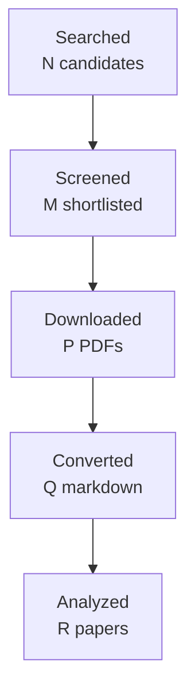

You are one worker inside an automated literature-review pipeline.
A script, not a person, reads your reply. Follow these rules exactly:
- Do the task completely in this single reply. Do not ask questions and do not
  wait for confirmation.
- Reply with the requested artifact block(s) only: no preamble, no commentary
  outside the blocks. Each block starts with a line `===BEGIN <name>===` and
  ends with a line `===END <name>===`; the content between those lines is
  written to a file verbatim.
- Never invent papers, identifiers, numbers, or quotes. Leave unknown fields
  out or mark them as unknown.
- Do not use your code tool, canvas, or connectors; plain text is enough.

# Task: write the final research report

Research topic: **authentic workplace email and enterprise-chat extraction of structured action and decision arguments, with emphasis on implicit or group assignees, deadline-to-action relations, condition/negation/modality attachment, and exact evidence-span annotation**
Run id: `5060d000e7b4`  Round: 4 of at most 4

Write the final report in Markdown following the template below exactly:
same section names in the same order, `[HIGH]`/`[MEDIUM]`/`[LOW]` confidence
tags on every finding, `[ACADEMIC]`/`[ENGINEERING]` labels on every gap, at
least one Mermaid `flowchart TD` diagram, LaTeX (`$...$`) for formulas, and
evidence citations as `[paper_id]`. Cite only the paper ids listed under
"Papers reviewed". In Methodology state that the papers were read through
the host's web tool and give the access level of each paper. Leave no
template placeholder in the output. Do not write a line that starts with
`===` inside the report.

Round History: use exactly these rows (they are computed by the pipeline):
| 1 | a109ca6369e7 | action items, requests, commitments, and decisions in workplace email and chat: extracting action, owner, object, deadline, conditions, and speech act with evidence | 17 | initial shortlist | 5 academic, 4 engineering |
| 2 | fb59b34c3d44 | empirical workplace email and chat studies on structured action and decision extraction, focusing on owner assignment, deadline-to-action binding, conditional or negated obligations, and evidence-span annotation | 12 | 0 resolved | 5 academic, 4 engineering |
| 3 | 950e68ab52e0 | authentic workplace email and enterprise-chat extraction of structured action and decision arguments, with emphasis on implicit or group assignees, deadline-to-action relations, condition/negation/modality attachment, and exact evidence-span annotation | 10 | 0 resolved | 5 academic, 4 engineering |
| 4 | 5060d000e7b4 | authentic workplace email and enterprise-chat benchmarks for structured action/decision extraction, focusing specifically on implicit and group assignees, action-to-deadline binding, condition/negation/modality scope, and exact argument evidence spans | 9 | academic gaps of the previous round | 5 academic, 4 engineering |
Stop reason line: 4-round cap reached

Research Gaps: list every gap that is still open with its classification,
priority, and the rounds that already searched for it. An unresolved gap is
never presented as accepted or closed; say plainly that the literature has
not answered it yet.

Query variants used:
- authentic workplace email enterprise-chat structured action/decision extraction, focusing specifically implicit group assignees, action-to-deadline binding, condition/negation/modality scope, exact argument evidence spans
- authentic workplace email
- authentic enterprise-chat structured action/decision extraction, focusing specifically implicit group assignees, action-to-deadline binding, condition/negation/modality scope, exact argument evidence spans
- workplace enterprise-chat structured action/decision extraction, focusing specifically implicit group assignees, action-to-deadline binding, condition/negation/modality scope, exact argument evidence spans
- email enterprise-chat structured action/decision extraction, focusing specifically implicit group assignees, action-to-deadline binding, condition/negation/modality scope, exact argument evidence spans
- authentic workplace email enterprise-chat structured
- authentic workplace email action/decision extraction,
- authentic workplace email focusing specifically

## Project context you must work within

This is the project's own description of the problem, its boundaries,
and the distinctions it needs preserved. It governs what counts as
relevant; the academic task names alone do not.

# Topic 05 context — Action items, requests, commitments, and decisions

## Why this Topic exists

msgloom's primary success criterion is not generic summarization quality: it is avoiding missed work that requires the user's response. That requires identifying what someone is asking for, promising, deciding, approving, assigning, or expecting — including owner, object, deadline, conditions, prerequisites, and evidence.

Business language is often indirect: “Can you take a look?”, “I’ll get this over once Finance confirms”, “We should proceed”, “Approved up to 50k”, “John to send by Friday”, or “No action needed unless X happens”. A system that extracts only verbs or dates can create false obligations or lose conditions.

Topic 05 owns **the semantic extraction and classification of action/commitment/decision content**, not its later state over time.

## Core research object

Represent work-relevant speech acts/events with explicit arguments and uncertainty, for example:

```text
type: request | commitment | decision | approval | proposal | action item
actor / owner
object / target
recipient / beneficiary
status/modality at utterance time
original deadline wording + normalized time if justified
conditions / prerequisites / exceptions
source span(s)
confidence / unresolved fields
```

Missing owner or deadline must remain unknown rather than be invented to make an action executable.

## Product and phase relevance

Topic 05 directly supports Phase 1 A3 triage outputs: actions, deadlines, risks, and required responses. Phase 3 A6 later consumes accepted Topic information to prepare drafts/proposals, but Topic 05 research must not cross into executing actions. A reviewed draft is not approval.

## Direct handoffs from earlier Topics

Topic 04 (completed 2026-09-16, 47 papers, 4 rounds) resolved **what a response is about**: the exact proposition, question or request an approval, rejection, answer or commitment applies to, including partial and multi-antecedent scope. It explicitly does **not** classify the act itself. Topic 05 owns the speech-act label and takes the antecedent scope as given. Topic 04's open ACADEMIC gap 1 is directly relevant: direct empirical evidence for proposition-level approval, rejection and agreement scope in authentic workplace mail or chat is still missing, so a Topic 05 act label must not be read as evidence that its scope is correct.

**The full text of every inherited handoff is in [`INHERITED_HANDOFFS.md`](INHERITED_HANDOFFS.md)**, including what each sending Topic established, what it left open, and where the ownership boundary lies. Read it before planning; you do not need to open an earlier Topic's folder.

## Relationships to other Topics

| Topic | Relationship |
| --- | --- |
| 02 | Supplies correct Topic scope so extracted actions/conditions attach to the right work matter. |
| 04 | Resolves what “approved”, “agreed”, or “please do that” refers to before Topic 05 interprets the speech act/action. |
| 06 | Topic 05 extracts the event/commitment; Topic 06 tracks whether it is planned, confirmed, revoked, completed, contradicted, etc. |
| 07 | Missing owner/object/context can become an explicit retrieval gap in Phase 2. |
| 08 | Action evidence may live in attachments/tables/screenshots; Topic 08 supplies grounded content. |
| 09 | Briefing uses action/deadline/decision outputs to decide what must remain visible. |
| 10 | Reliability evaluation checks evidence support and missed actions; generic calibration belongs there. |

## Key conceptual distinctions

- Request ≠ commitment.
- Proposal/intention ≠ decision.
- Mentioned action ≠ assigned action item.
- Capability (“can do”) ≠ promise (“will do”).
- Conditional commitment ≠ unconditional commitment.
- Deadline mention ≠ deadline for this action.
- Owner inferred from context must remain distinguished from explicitly stated owner.
- Extracting an action is not the same as determining its later state (Topic 06).

## High-value academic terminology

- action item extraction / detection;
- task extraction; to-do extraction; task-oriented information extraction;
- email speech act classification; dialogue act classification;
- request detection / request identification;
- commissive speech acts; commitment extraction/detection;
- promise detection; obligation detection; deontic modality;
- intention detection; intent-to-act;
- decision extraction / decision detection; meeting decision detection;
- event extraction; event argument extraction; semantic role labeling;
- implicit argument resolution; zero anaphora / omitted argument recovery (transfer);
- conditionality detection; hedge/speculation/modality detection;
- temporal expression extraction and normalization; deadline extraction;
- responsibility/owner assignment; assignee extraction;
- email action-item / request-response corpora.

## Query families

- `"action item extraction" email`
- `"task extraction" business email`
- `email "speech act classification" request commitment`
- `"commitment detection" dialogue email`
- `"commissive" speech act NLP commitment`
- `"decision extraction" meeting email`
- `"event argument extraction" implicit argument owner`
- `"deontic modality" obligation NLP`
- `deadline extraction email temporal normalization`
- `conditional commitment detection NLP`
- `request detection workplace communication`

## False friends / exclusions

- generic intent classification with no action arguments;
- calendar/event extraction that treats every date as a deadline;
- sentiment or urgency classification;
- Topic 06 factuality/state tracking;
- recommendation generation / drafting (Phase 3 A6);
- action execution / tool invocation (Phase 4 A7).

## Gap-evaluation guidance

Give highest priority to gaps that cause missed user-response obligations, false obligations, wrong owners, wrong deadlines, or lost conditions. Evaluate argument-level preservation rather than only speech-act accuracy. Direct business-email evidence is especially valuable, but strong transfer evidence from meetings/dialogue can justify representations or experiments if labeled as transfer. Engineering tests should include implicit owner, multiple actions in one sentence, shared deadlines, conditional/negated actions, and ambiguous references resolved by Topic 04.

## How to use this file

This file is the self-contained research context for this Topic. A future AI research agent should read **this file first**, then `BRIEF.md`, then any existing `CURRENT_STATUS.md`, gap decisions, reports, manifests, and prior-round artifacts in this folder. The aim is that an agent given only this Topic folder can reconstruct the project intent, Topic boundary, dependencies, search vocabulary, and gap-prioritization logic without relying on the original ChatGPT conversation.

If the full repository is available, the authoritative product documents remain `../../docs/design-brief.md`, `../../docs/design-principles.md`, `../../docs/design.md`, and `../../docs/phase-roadmap.md`. This file explains how those product constraints apply to this research Topic; it does not replace or approve changes to those design documents.

## Shared msgloom background

msgloom is a personal work-information system for one user. It is intended to process very large daily volumes of work communication, initially Outlook email and Microsoft Teams, while ensuring that **work requiring the user's response is not missed** and reducing how much the user must read to stay current.

The product is organized around **Topics**, not message summaries. A Topic is a concrete work matter described by information from one or more sources. One message can contain several Topics; one Topic can span many messages, conversations, attachments, groups, and eventually multiple sources. A conversation or Group is therefore not automatically one Topic.

The report contract is the ultimate product pressure on all ten research Topics. Reports must preserve every due Topic and the decision-relevant information needed to act on it, including developments, actions, deadlines, conditions, risks, uncertainty, and links back to exact source evidence. Missing or conflicting information must remain visible rather than being silently filled in.

The design decision order is important when evaluating research gaps: user permissions are fixed; then preserve correct meaning and report coverage; then traceability and recovery; then usability/maintenance; finally speed, brevity, and token savings. A method that is faster but loses a condition, deadline, branch, source relation, or important Topic is not an improvement for msgloom.

Important persistent principles:

- Use deterministic code for reliable mechanical relationships and AI for language understanding/judgement.
- Preserve source bytes, versions, stage history, identities, and lineage. New assessments do not erase old evidence.
- Group only on reliable relationships. Similar subjects, participants, wording, or model labels are not enough to prove Topic identity.
- Keep uncertain relationships separate and make the reason for uncertainty visible.
- Brevity must come from concise wording and layered detail, never from omitting decision-essential information.
- User-reviewed examples, missed important work, false alerts, wrong grouping, lost actions/deadlines, and evidence that changes a decision matter more than paper count or message throughput.

## Research-programme relationship

The ten Topics form a dependency network rather than ten independent literature reviews. A useful conceptual flow is:

```text
01 source/conversation structure
        ↓
02 within-message Topic spans/membership
        ↓
03 cross-thread/source Topic identity
        ↓
04 reference and response scope
        ↓
05 actions / requests / commitments / decisions
        ↓
06 state / factuality / time / revision
        ↓
07 retrieve missing context when needed
        ↘
08 understand attachments / tables / images
        ↓
09 incremental personalized briefing
        ↓
10 evidence, completeness, calibration, reliability evaluation
```

This is not a strict processing pipeline. Several Topics feed each other, and Topic 10 is cross-cutting. The numbering primarily gives a research order and ownership boundary so that one Topic does not silently absorb the whole product problem.

## Gap-evaluation rules inherited from Topics 01 and 02

The Research Pipeline must evaluate gaps using **project value**, not just academic novelty. The following rules are part of the context for every Topic:

1. A machine-classified `HIGH` or `ACADEMIC` gap does **not** automatically authorize another literature round.
2. After each academic round, perform a human/project-value review: decide whether the uncertainty is best addressed by more papers, engineering experiments, a later Topic, production-domain data, candidate-method selection, or no further current work.
3. Prefer targeted academic follow-up over broad searching. Do not fill paper quotas with weakly related literature.
4. Distinguish direct target-domain evidence from transfer methods/evaluation evidence. Transfer evidence can justify a mechanism or experiment, not production-email accuracy.
5. Engineering validation may use independent synthetic/adversarial fixtures and public data. Lack of production mailbox examples is not a reason to stop work that can be validly completed without them.
6. Never claim production representativeness from synthetic or transfer evidence. Record it as deferred until suitable authorized domain data exists.
7. If a gap belongs to another Topic, hand it off explicitly rather than duplicating research.
8. Research closure means **everything actionable at the current stage is complete and remaining work is explicitly deferred/handed off**. It does not mean literature exhaustion, production accuracy, or architecture approval.
9. For new academic work, use terminology refinement, strict paper admission, manual/controlled canonical acquisition, corpus freeze, fresh isolated Pipeline runs, direct-vs-transfer labels, independent review, strict validation, and post-round gap review. These are lessons learned from Topics 01 and 02.
10. For engineering research, keep gold independent from the component under test; structurally separate prediction inputs from evaluation gold/future context; count false positives and false negatives in end-to-end denominators; use clean-workspace reproducibility, mutation/regression tests, and fresh independent methodological review.

## Work handed to this topic by an earlier one

Treat each entry as a starting condition, not as something to
rediscover. Where a sending topic left a gap open it is still open:
do not report it as established. Respect the stated ownership
boundary and do not absorb what the sender still owns.

# Inherited handoffs

Everything an earlier Topic explicitly handed to this one, copied in full so
that this folder is enough on its own. You do not need to open an earlier
Topic's documents to start work here.

Each entry states what was handed over, what the sending Topic still owns, and
what it had established or left open at the time. A handoff is not a finding:
where the sender left a gap open, it is still open.

## From Topic 04 — Reference resolution and response scope

*Completed 2026-09-16. 4 rounds, 47 papers, report validated PASS,
faithfulness 0.91. Five gaps left open, none downgraded.*

**Handed to Topic 05.** Topic 04 resolves **what a response is about**: the
exact proposition, question or request that an approval, rejection, answer or
commitment applies to, including partial scope and links to several
antecedents at once. It explicitly does not classify the act. Topic 05 owns
the speech-act label and takes the antecedent scope as given.

**What Topic 04 established.** Direct evidence for multi-question partial
replies is materially stronger than for the other scope questions. Response
scope is routinely partial: a reply commonly addresses some propositions in a
message and leaves others unresolved, and systems that force one
message-level label lose that distinction.

**What Topic 04 left open, and that Topic 05 must not treat as settled:**

- *(ACADEMIC, HIGH)* Direct empirical evidence for exact proposition-level
  agreement, rejection, approval, clarification and answer scope in authentic
  workplace email or enterprise chat is still missing. **A Topic 05 act label
  must therefore not be read as evidence that its scope is correct.**
- *(ACADEMIC, HIGH)* Workplace messages that mix questions, requests,
  alternatives and conditions are not yet validated together with complete
  unresolved-subquestion detection. Missing mixed-act validation can cause
  open work to be closed incorrectly, which is directly a Topic 05 risk.
- *(ACADEMIC, MEDIUM)* Whether a response independently targets several
  propositions or targets one composite object is unresolved. This affects
  how many action items one reply should produce.

**Boundary.** If Topic 05 finds itself deciding which proposition an action
applies to, that is Topic 04's question and its evidence, including its open
gaps, applies.


Papers reviewed:
- paper_id `2305.13469` — MailEx: Email Event and Argument Extraction (Saurabh Srivastava, Gaurav Singh, Shou Matsumoto et al.; 2023)
- paper_id `doi-10-1145-3594536-3595162` — Computable Contracts by Extracting Obligation Logic Graphs (Sergio Servantez, Nedim Lipka, Alexa Siu et al.; 2023)
- paper_id `2109.09393` — Modality and Negation in Event Extraction (Sander Bijl de Vroe, Liane Guillou, Miloš Stanojević et al.; 2021)
- paper_id `1606.07965` — Summarizing Decisions in Spoken Meetings (Lu Wang, Claire Cardie; 2011)
- paper_id `2104.05919` — Document-Level Event Argument Extraction by Conditional Generation (Sha Li, Heng Ji, Jiawei Han; 2021)
- paper_id `doi-10-18653-v1-n18-1076` — Implicit Argument Prediction with Event Knowledge (Pengxiang Cheng, Katrin Erk; 2018)
- paper_id `1911.03766` — Multi-Sentence Argument Linking (Seth Ebner, Patrick Xia, Ryan Culkin et al.; 2020)
- paper_id `doi-10-1162-coli-a-00110` — Semantic Role Labeling of Implicit Arguments for Nominal Predicates (Matthew Gerber, Joyce Y. Chai; 2012)
- paper_id `doi-10-26615-978-954-452-092-2-076` — Reading between the Lines: Information Extraction from Industry Requirements (Ole Magnus Holter, Basil Ell; 2023)
- paper_id `manual-fde6beef40` — Classifying Action Items for Semantic Email (Simon Scerri, Gerhard Gossen, Brian Davis et al.; 2010)
- paper_id `manual-ee40d588e3` — *SEM 2012 Shared Task: Resolving the Scope and Focus of Negation (Roser Morante, Eduardo Blanco; 2012)
- paper_id `manual-cd3fa58e4c` — Detecting Emails Containing Requests for Action (Andrew Lampert, Robert Dale, Cecile Paris; 2010)
- paper_id `doi-10-1007-11965152-18` — Detecting Action Items in Multi-party Meetings: Annotation and Initial Experiments (Matthew Purver, Patrick Ehlen, John Niekrasz; 2006)
- paper_id `doi-10-18653-v1-2007-sigdial-1-4` — Detecting and Summarizing Action Items in Multi-Party Dialogue (Matthew Purver, John Dowding, John Niekrasz et al.; 2007)
- paper_id `doi-10-3115-1564535-1564540` — Shallow Discourse Structure for Action Item Detection (Matthew Purver, Patrick Ehlen, John Niekrasz; 2006)
- paper_id `doi-10-3115-1708376-1708410` — Extracting Decisions from Multi-Party Dialogue Using Directed Graphical Models and Semantic Similarity (Trung Bui, Matthew Frampton, John Dowding et al.; 2009)
- paper_id `2303.16763` — Meeting Action Item Detection with Regularized Context Modeling (Jiaqing Liu, Chong Deng, Qinglin Zhang et al.; 2023)
- paper_id `manual-0839b98ee7` — Can Requests-for-Action and Commitments-to-Act be Reliably Identified in Email Messages? (Andrew Lampert, Cécile Paris, Robert Dale; 2007)
- paper_id `manual-20b8cd2fdd` — Requests and Commitments in Email are More Complex Than You Think: Eight Reasons to be Cautious (Andrew Lampert, Robert Dale, Cécile Paris; 2008)
- paper_id `manual-d19b0f6f1e` — The nature of requests and commitments in email messages (Andrew Lampert, Robert Dale, Cécile Paris; 2008)
- paper_id `doi-10-1109-hicss-2006-528` — Using Speech Acts to Categorize Email and Identify Email Genres (Jade Goldstein, Roberta Evans Sabin; 2006)
- paper_id `manual-1e8332286e` — TimeML: Robust Specification of Event and Temporal Expressions in Text (James Pustejovsky, José Castaño, Robert Ingria et al.; 2003)
- paper_id `manual-01c535c108` — Dialogue act modeling for automatic tagging and recognition of conversational speech (Andreas Stolcke, Klaus Ries, Noah Coccaro et al.; 2000)
- paper_id `doi-10-1145-1076034-1076094` — On the collective classification of email "speech acts" (Vitor R. Carvalho, William W. Cohen; 2005)
- paper_id `doi-10-1145-1076034-1076140` — Detecting Action-Items in E-mail (Paul N. Bennett, Jaime G. Carbonell; 2005)
- paper_id `2106.08037` — The Possible, the Plausible, and the Desirable: Event-Based Modality Detection for Language Processing (Valentina Pyatkin, Shoval Sadde, Aynat Rubinstein et al.; 2021)
- paper_id `2005.13084` — Learning with Weak Supervision for Email Intent Detection (Kai Shu, Subhabrata Mukherjee, Guoqing Zheng et al.; 2020)
- paper_id `doi-10-1145-3331184-3331260` — Context-Aware Intent Identification in Email Conversations (Wei Wang, Saghar Hosseini, Ahmed Hassan Awadallah et al.; 2019)
- paper_id `doi-10-1145-3289600-3290984` — Domain Adaptation for Commitment Detection in Email (Hosein Azarbonyad, Robert Sim, Ryen W. White; 2019)
- paper_id `doi-10-1109-scc-2013-62` — Monitoring Commitments in People-Driven Service Engagements (Anup K. Kalia, Hamid R. Motahari-Nezhad, Claudio Bartolini et al.; 2013)
- paper_id `1909.10094` — Deep Structured Neural Network for Event Temporal Relation Extraction (Rujun Han, I-Hung Hsu, Mu Yang et al.; 2019)
- paper_id `doi-10-1186-1471-2105-9-s11-s9` — The BioScope corpus: biomedical texts annotated for uncertainty, negation and their scopes (Veronika Vincze, György Szarvas, Richárd Farkas et al.; 2008)
- paper_id `doi-10-18653-v1-2020-coling-main-164` — Lin: Unsupervised Extraction of Tasks from Textual Communication (Parth Diwanji, Hui Guo, Munindar Singh et al.; 2020)
- paper_id `doi-10-18653-v1-w18-6104` — Assigning people to tasks identified in email: The EPA dataset for addressee tagging for detected task intent (Revanth Rameshkumar, Peter Bailey, Abhishek Jha et al.; 2018)
- paper_id `2202.12109` — Prompt for Extraction? PAIE: Prompting Argument Interaction for Event Argument Extraction (Yubo Ma, Zehao Wang, Yixin Cao et al.; 2022)
- paper_id `1410.4868` — A Modality Lexicon and its use in Automatic Tagging (Kathryn Baker, Michael Bloodgood, Bonnie J. Dorr et al.; 2010)
- paper_id `2312.05471` — Fine-Grained Analysis of Team Collaborative Dialogue (Ian Perera, Matthew Johnson, Carson Wilber; 2023)
- paper_id `2410.03594` — Explicit, Implicit, and Scattered: Revisiting Event Extraction to Capture Complex Arguments (Omar Sharif, Joseph Gatto, Madhusudan Basak et al.; 2024)
- paper_id `doi-10-18653-v1-2023-findings-acl-378` — LEDA: a Large-Organization Email-Based Decision-Dialogue-Act Analysis Dataset (Vanja Mladen Karan, Prashant Khare, Ravi Shekhar et al.; 2023)
- paper_id `doi-10-18653-v1-d16-1078` — Speculation and Negation Scope Detection via Convolutional Neural Networks (Zhong Qian, Peifeng Li, Qiaoming Zhu et al.; 2016)
- paper_id `manual-69bc2555ab` — Predicate-specific Annotations for Implicit Role Binding: Corpus Annotation, Data Analysis and Evaluation Experiments (Tatjana Moor, Michael Roth, Anette Frank; 2013)
- paper_id `doi-10-18653-v1-2020-acl-main-667` — A Two-Step Approach for Implicit Event Argument Detection (Zhisong Zhang, Xiang Kong, Zhengzhong Liu et al.; 2020)
- paper_id `2409.18602` — Do LLMs suffer from Multi-Party Hangover? A Diagnostic Approach to Addressee Recognition and Response Selection in Conversations (Nicolò Penzo, Maryam Sajedinia, Bruno Lepri et al.; 2024)
- paper_id `manual-e6bb5aee88` — Extraction de tâches dans les e-mails : une approche fondée sur les rôles sémantiques (Melissa Mekaoui, Guillaume Tisserant, Mathieu Dodard et al.; 2020)
- paper_id `1909.03546` — Entity, Relation, and Event Extraction with Contextualized Span Representations (David Wadden, Ulme Wennberg, Yi Luan et al.; 2019)
- paper_id `manual-90280d2776` — Decision Detection Using Hierarchical Graphical Models (Trung H. Bui, Stanley Peters; 2010)
- paper_id `doi-10-1162-tacl-a-00006` — Event Time Extraction with a Decision Tree of Neural Classifiers (Nils Reimers, Nazanin Dehghani, Iryna Gurevych; 2018)
- paper_id `1606.07849` — Focused Meeting Summarization via Unsupervised Relation Extraction (Lu Wang, Claire Cardie; 2012)

Access level per paper:
- `1410.4868`: full_text via https://arxiv.org/html/1410.4868
- `1606.07849`: full_text via https://arxiv.org/html/1606.07849
- `1606.07965`: full_text via https://arxiv.org/html/1606.07965
- `1909.03546`: full_text via https://arxiv.org/html/1909.03546
- `1909.10094`: full_text via https://arxiv.org/html/1909.10094
- `1911.03766`: full_text via https://arxiv.org/html/1911.03766
- `2005.13084`: full_text via https://arxiv.org/html/2005.13084
- `2104.05919`: full_text via https://arxiv.org/html/2104.05919
- `2106.08037`: full_text via https://arxiv.org/html/2106.08037
- `2109.09393`: full_text via https://arxiv.org/html/2109.09393
- `2202.12109`: full_text via https://arxiv.org/html/2202.12109
- `2303.16763`: full_text via https://arxiv.org/html/2303.16763
- `2305.13469`: full_text via https://arxiv.org/pdf/2305.13469
- `2312.05471`: full_text via https://arxiv.org/html/2312.05471
- `2409.18602`: full_text via https://arxiv.org/pdf/2409.18602
- `2410.03594`: full_text via https://arxiv.org/html/2410.03594
- `doi-10-1007-11965152-18`: full_text via https://www.researchgate.net/publication/221040314_Detecting_Action_Items_in_Multi-party_Meetings_Annotation_and_Initial_Experiments
- `doi-10-1109-hicss-2006-528`: full_text via https://www.researchgate.net/publication/259703374_Using_Speech_Acts_to_Categorize_Email_and_Identify_Email_Genres
- `doi-10-1109-scc-2013-62`: full_text via https://www.csc2.ncsu.edu/faculty/mpsingh/papers/societal/SCC-13-people.pdf
- `doi-10-1145-1076034-1076094`: full_text via https://www.cs.cmu.edu/~vitor/papers/sigir05.pdf
- `doi-10-1145-1076034-1076140`: full_text via https://www.cs.cmu.edu/~pbennett/papers/action-item-detection-poster.pdf
- `doi-10-1145-3289600-3290984`: full_text via https://www.microsoft.com/en-us/research/wp-content/uploads/2019/01/AzarbonyadWSDM2019.pdf
- `doi-10-1145-3331184-3331260`: full_text via https://www.microsoft.com/en-us/research/wp-content/uploads/2019/05/Wang_SIGIR19.pdf
- `doi-10-1145-3594536-3595162`: abstract_only via https://ai.updf.com/paper-detail/computable-contracts-by-extracting-obligation-logic-graphs-servantez-lipka-bc5f13e846cb4a2b80475b642a9b93d8aa1ccc1e
- `doi-10-1162-coli-a-00110`: full_text via https://aclanthology.org/J12-4003.pdf
- `doi-10-1162-tacl-a-00006`: full_text via https://aclanthology.org/Q18-1006.pdf
- `doi-10-1186-1471-2105-9-s11-s9`: full_text via https://link.springer.com/article/10.1186/1471-2105-9-S11-S9
- `doi-10-18653-v1-2007-sigdial-1-4`: full_text via https://aclanthology.org/2007.sigdial-1.4.pdf
- `doi-10-18653-v1-2020-acl-main-667`: full_text via https://aclanthology.org/2020.acl-main.667.pdf
- `doi-10-18653-v1-2020-coling-main-164`: full_text via https://aclanthology.org/2020.coling-main.164.pdf
- `doi-10-18653-v1-2023-findings-acl-378`: full_text via https://aclanthology.org/2023.findings-acl.378.pdf
- `doi-10-18653-v1-d16-1078`: full_text via https://aclanthology.org/D16-1078.pdf
- `doi-10-18653-v1-n18-1076`: full_text via https://aclanthology.org/N18-1076.pdf
- `doi-10-18653-v1-w18-6104`: full_text via https://aclanthology.org/W18-6104.pdf
- `doi-10-26615-978-954-452-092-2-076`: full_text via https://aclanthology.org/2023.ranlp-1.76.pdf
- `doi-10-3115-1564535-1564540`: full_text via https://aclanthology.org/W06-3405.pdf
- `doi-10-3115-1708376-1708410`: full_text via https://aclanthology.org/W09-3934.pdf
- `manual-01c535c108`: full_text via https://arxiv.org/html/cs/0006023
- `manual-0839b98ee7`: full_text via https://www.researchgate.net/publication/228649541_Can_requests-for-action_and_commitments-to-act_be_reliably_identified_in_email_messages
- `manual-1e8332286e`: full_text via https://staffwww.dcs.shef.ac.uk/people/R.Gaizauskas/research/papers/iwcs03.pdf
- `manual-20b8cd2fdd`: full_text via https://aclanthology.org/U08-1009.pdf
- `manual-69bc2555ab`: full_text via https://aclanthology.org/W13-0211.pdf
- `manual-90280d2776`: full_text via https://aclanthology.org/P10-2057.pdf
- `manual-cd3fa58e4c`: full_text via https://aclanthology.org/N10-1142.pdf
- `manual-d19b0f6f1e`: full_text via https://www.researchgate.net/publication/228627908_The_nature_of_requests_and_commitments_in_email_messages
- `manual-e6bb5aee88`: full_text via https://editions-rnti.fr/render_pdf.php?p=1002573
- `manual-ee40d588e3`: full_text via https://aclanthology.org/S12-1035.pdf
- `manual-fde6beef40`: full_text via https://www.researchgate.net/publication/220746717_Classifying_Action_Items_for_Semantic_Email

Cross-paper synthesis (the source of findings, gaps, and themes):
{
 "topic": "authentic workplace email and enterprise-chat benchmarks for structured action/decision extraction, focusing specifically on implicit and group assignees, action-to-deadline binding, condition/negation/modality scope, and exact argument evidence spans",
 "paper_count": 48,
 "executive_summary": "Across 48 papers, the evidence supports structured treatment of workplace actions beyond message-level intent labels. Authentic email and Slack studies show that requests, commitments, assignments, proposals, and decisions are context-sensitive, often coexist within one message, and can depend on preceding turns, participant roles, or recipient metadata. Owner extraction is particularly difficult because responsibility may be implicit, plural, or absent from listed recipients. Explicit argument spans are feasible for stated arguments, but adjacent-domain event research shows that implicit and scattered arguments cannot always be represented by one contiguous evidence span. Temporal, modality, negation, and conditionality research provides useful transfer evidence for relation and scope modeling, but direct workplace evaluation remains sparse. No paper in the corpus jointly evaluates act type, owner, object, deadline, conditions, and exact provenance in authentic workplace communication.",
 "themes": [
  "Context-sensitive extraction in authentic workplace communication",
  "Structured action items as multi-argument and sometimes multi-utterance objects",
  "Implicit, plural, and context-dependent responsibility assignment",
  "Action-to-time relations rather than date detection alone",
  "Condition, negation, and modality scope over actions and commitments",
  "Exact evidence spans versus implicit and scattered arguments",
  "Multiple acts and multiple actions within one message or sentence",
  "Proposal, decision, commitment, and request distinctions",
  "Domain variation and error propagation in end-to-end extraction"
 ],
 "findings": [
  {
   "statement": "Authentic workplace email and Slack studies show that surrounding message or conversation context can materially improve classification or extraction of actionable intents, event arguments, and dialogue acts compared with isolated-sentence or isolated-message processing.",
   "confidence": "HIGH",
   "evidence": [
    {
     "paper_id": "doi-10-1145-3331184-3331260",
     "section": "Key findings"
    },
    {
     "paper_id": "2305.13469",
     "section": "Key findings"
    },
    {
     "paper_id": "2312.05471",
     "section": "Key findings"
    }
   ]
  },
  {
   "statement": "Context is not uniformly beneficial across tasks: collective thread modeling degraded the Deliver act in one email experiment, different context configurations were optimal on different meeting corpora, and predicted upstream contextual structure can propagate errors into downstream extraction.",
   "confidence": "HIGH",
   "evidence": [
    {
     "paper_id": "doi-10-1145-1076034-1076094",
     "section": "Key findings"
    },
    {
     "paper_id": "2303.16763",
     "section": "Key findings"
    },
    {
     "paper_id": "2106.08037",
     "section": "Key findings"
    }
   ]
  },
  {
   "statement": "Responsibility assignment is empirically difficult: meeting action-item studies report owner as one of the hardest components, while the EPA email benchmark shows that a task owner may be implicit, plural, or not among candidate recipients at all.",
   "confidence": "HIGH",
   "evidence": [
    {
     "paper_id": "doi-10-1007-11965152-18",
     "section": "Key findings"
    },
    {
     "paper_id": "doi-10-3115-1564535-1564540",
     "section": "Key findings"
    },
    {
     "paper_id": "doi-10-18653-v1-w18-6104",
     "section": "Key findings"
    }
   ]
  },
  {
   "statement": "Workplace communication can contain several actionable intents or actions in the same message or sentence: one enterprise-email study found substantial multi-intent messages, a task extractor explicitly handles coordinated task verbs, and a Slack annotation scheme permits multiple acts at clause or fragment granularity.",
   "confidence": "HIGH",
   "evidence": [
    {
     "paper_id": "doi-10-1145-3331184-3331260",
     "section": "Key findings"
    },
    {
     "paper_id": "doi-10-18653-v1-2020-coling-main-164",
     "section": "Key findings"
    },
    {
     "paper_id": "2312.05471",
     "section": "Key findings"
    }
   ]
  },
  {
   "statement": "For explicitly stated event arguments, span-based extraction and offset-based evaluation are well established, but complex-argument research shows that implicit arguments may have no direct source span and scattered arguments may require several discontinuous pieces of discourse evidence.",
   "confidence": "HIGH",
   "evidence": [
    {
     "paper_id": "1909.03546",
     "section": "Key findings"
    },
    {
     "paper_id": "2202.12109",
     "section": "Key findings"
    },
    {
     "paper_id": "2410.03594",
     "section": "Key findings"
    }
   ]
  },
  {
   "statement": "Conditionality, negation, and modality can be represented as relations between cues and the events or propositions they modify, but the strongest scope evaluations in this corpus come largely from biomedical or general event-processing domains; workplace-email studies additionally report conditional commitments and offers as recurrent annotation ambiguities.",
   "confidence": "MEDIUM",
   "evidence": [
    {
     "paper_id": "1410.4868",
     "section": "Key findings"
    },
    {
     "paper_id": "2109.09393",
     "section": "Key findings"
    },
    {
     "paper_id": "doi-10-1186-1471-2105-9-s11-s9",
     "section": "Key findings"
    },
    {
     "paper_id": "manual-0839b98ee7",
     "section": "Key findings"
    },
    {
     "paper_id": "manual-d19b0f6f1e",
     "section": "Key findings"
    }
   ]
  },
  {
   "statement": "Action-item and temporal-relation studies treat time as something linked to an action or event rather than as an isolated expression: meeting work annotates timeframe as an action-item component, and event-time work finds that relation text and document-wide temporal evidence materially affect correct anchoring.",
   "confidence": "MEDIUM",
   "evidence": [
    {
     "paper_id": "doi-10-18653-v1-2007-sigdial-1-4",
     "section": "Key findings"
    },
    {
     "paper_id": "doi-10-1162-tacl-a-00006",
     "section": "Key findings"
    },
    {
     "paper_id": "manual-1e8332286e",
     "section": "Key findings"
    }
   ]
  },
  {
   "statement": "Authentic organizational email evidence distinguishes proposed actions from stated decisions, while meeting research represents decisions as multi-utterance processes containing issues, proposals, restatements, and agreement rather than as a single binary utterance label.",
   "confidence": "HIGH",
   "evidence": [
    {
     "paper_id": "doi-10-18653-v1-2023-findings-acl-378",
     "section": "Key findings"
    },
    {
     "paper_id": "manual-90280d2776",
     "section": "Key findings"
    },
    {
     "paper_id": "1606.07965",
     "section": "Key findings"
    }
   ]
  },
  {
   "statement": "End-to-end event-argument extraction remains substantially harder than extraction with gold triggers or candidate spans: MAILEX reports low workplace-email argument F1 and strong gains from gold triggers, while RAMS results show a large drop when argument spans must be discovered rather than supplied.",
   "confidence": "HIGH",
   "evidence": [
    {
     "paper_id": "2305.13469",
     "section": "Key findings"
    },
    {
     "paper_id": "1911.03766",
     "section": "Key findings"
    }
   ]
  },
  {
   "statement": "Commitment detection exhibits measurable corpus dependence across authentic email collections: within-corpus performance exceeds unadapted cross-corpus transfer, although adaptation and weak-supervision methods recover some of the lost performance.",
   "confidence": "HIGH",
   "evidence": [
    {
     "paper_id": "doi-10-1145-3289600-3290984",
     "section": "Key findings"
    },
    {
     "paper_id": "2005.13084",
     "section": "Key findings"
    }
   ]
  }
 ],
 "contradictions": [
  {
   "topic": "Whether more conversational context consistently improves extraction",
   "papers": [
    "doi-10-1145-3331184-3331260",
    "2305.13469",
    "2312.05471",
    "doi-10-1145-1076034-1076094",
    "2303.16763",
    "2106.08037"
   ],
   "note": "Several studies report gains from fuller message or conversation context, but collective email context degraded the Deliver class, optimal context configurations differed between meeting corpora, and noisy predicted contextual structure sometimes reduced downstream performance. These are task- and corpus-specific results rather than a single universal effect."
  },
  {
   "topic": "Sentence-level versus message-level annotation granularity",
   "papers": [
    "doi-10-1145-1076034-1076140",
    "manual-20b8cd2fdd",
    "manual-d19b0f6f1e"
   ],
   "note": "Sentence-level action-item annotation improved automatic document detection in one study, whereas workplace request/commitment annotation achieved higher human agreement at message level and attributed part of the improvement to avoiding sentence-locus ambiguity. The experiments optimize different outcomes and therefore do not establish one universally superior granularity."
  },
  {
   "topic": "Exact argument spans versus semantically recoverable implicit arguments",
   "papers": [
    "1909.03546",
    "2202.12109",
    "2410.03594",
    "doi-10-18653-v1-2020-acl-main-667"
   ],
   "note": "Span-based event extraction treats explicit argument offsets as the target representation, while complex-argument research demonstrates cases in which the semantic argument is implicit or distributed and therefore has no single contiguous gold span. The two lines of work support different subsets of argument realization."
  },
  {
   "topic": "Surface or recipient-based owner inference versus contextual ownership",
   "papers": [
    "doi-10-18653-v1-2020-coling-main-164",
    "manual-e6bb5aee88",
    "doi-10-18653-v1-w18-6104",
    "2312.05471"
   ],
   "note": "Some task extractors use grammatical person, dependency structure, or recipient identity as owner cues, whereas the EPA email benchmark and workplace Slack analysis show owners that are implicit, plural, absent from candidate recipients, or dependent on participant role and project responsibility. Surface cues therefore cover only part of the observed ownership problem."
  },
  {
   "topic": "Operational simplicity of commitments versus observed conditional ambiguity",
   "papers": [
    "doi-10-1109-scc-2013-62",
    "manual-0839b98ee7",
    "manual-d19b0f6f1e",
    "manual-20b8cd2fdd"
   ],
   "note": "The service-engagement commitment model formally permits conditional commitments but operationally treats most examined interactions as unconditional, whereas workplace-email annotation studies identify conditional offers and commitments as major sources of disagreement and explicitly model optional conditions. The corpus therefore contains differing empirical emphasis on conditionality."
  }
 ],
 "gaps": [
  {
   "id": "gap-1",
   "description": "There is no direct modern workplace email/chat benchmark in this corpus that jointly annotates speech-act type, owner/assignee, action object, deadline, conditions/exceptions, and exact evidence spans.",
   "classification": "ACADEMIC",
   "priority": "HIGH",
   "suggested_query": "\"action item extraction\" (email OR Slack OR \"workplace chat\" OR \"enterprise chat\") assignee deadline condition \"evidence span\" corpus"
  },
  {
   "id": "gap-2",
   "description": "Direct empirical evidence for extracting decisions, approvals, rejections, and proposals with structured arguments from authentic workplace email or chat is still missing from this corpus.",
   "classification": "ACADEMIC",
   "priority": "HIGH",
   "suggested_query": "(\"decision extraction\" OR \"decision detection\" OR \"proposal extraction\") (\"workplace email\" OR \"enterprise chat\" OR Slack) approval rejection proposal \"argument extraction\""
  },
  {
   "id": "gap-3",
   "description": "Owner/assignee extraction remains weakly evidenced, especially for implicit owners, group ownership, multiple actions with different owners, and owners recoverable only from organizational or conversation context.",
   "classification": "ACADEMIC",
   "priority": "HIGH",
   "suggested_query": "(\"assignee prediction\" OR \"assignee extraction\" OR \"responsibility extraction\" OR \"action owner\") (email OR Slack OR \"workplace chat\") implicit owner group owner context"
  },
  {
   "id": "gap-4",
   "description": "The corpus does not establish reliable deadline binding in workplace communication: distinguishing a deadline for a particular action from a merely mentioned date, shared date, scheduling expression, or conditional future time remains open.",
   "classification": "ACADEMIC",
   "priority": "HIGH",
   "suggested_query": "(\"deadline extraction\" OR \"due date extraction\" OR \"deadline detection\") (email OR \"workplace communication\" OR Slack) \"action item\" temporal relation event argument"
  },
  {
   "id": "gap-5",
   "description": "Direct workplace evidence is insufficient for attaching conditions, exceptions, negation, and modality to the correct action when several actions or clauses occur together.",
   "classification": "ACADEMIC",
   "priority": "HIGH",
   "suggested_query": "(\"conditional commitment\" OR \"deontic modality\" OR \"negation scope\" OR \"condition extraction\") (email OR \"workplace communication\" OR Slack) action attachment obligation"
  },
  {
   "id": "gap-6",
   "description": "Build an independent argument-level benchmark and adversarial fixture suite covering implicit owners, multiple actions in one sentence, shared deadlines, conditional and negated actions, overlapping request/commitment labels, quoted-history contamination, and attachment references; score false positives, false negatives, and each argument separately.",
   "classification": "ENGINEERING",
   "priority": "HIGH"
  },
  {
   "id": "gap-7",
   "description": "Compare sentence-local, message-level, and selectively expanded thread-context extraction with controlled ablations, because the literature shows both context gains and context-induced degradation.",
   "classification": "ENGINEERING",
   "priority": "HIGH"
  },
  {
   "id": "gap-8",
   "description": "Test author/quoted/forwarded content zoning while preserving provenance, and measure whether zoning improves act and argument extraction without losing obligations whose interpretation depends on prior-message context.",
   "classification": "ENGINEERING",
   "priority": "HIGH"
  },
  {
   "id": "gap-9",
   "description": "Evaluate an uncertainty-preserving structured output in which owner, deadline, condition, or act subtype can remain unresolved, and measure whether this reduces false obligations and wrong argument assignments without unacceptable recall loss.",
   "classification": "ENGINEERING",
   "priority": "HIGH"
  },
  {
   "id": "boundary-1",
   "description": "Exact proposition-level scope for approvals, rejections, agreements, answers, and commitments remains an inherited Topic 04 problem; this synthesis does not establish that an extracted Topic 05 act label has the correct antecedent scope.",
   "classification": "OUT_OF_SCOPE",
   "priority": "HIGH"
  }
 ],
 "actionable_insights": [
  "Synthesis-derived recommendation: represent each extracted work-relevant act with separately nullable fields for act type, actor or owner, object, recipient or beneficiary, deadline wording and normalized time, conditions or exceptions, source evidence, and uncertainty rather than forcing every field to be populated.",
  "Synthesis-derived recommendation: distinguish explicitly stated owners from contextually inferred owners, support multiple or group assignees, and permit a no-owner or unresolved-owner outcome.",
  "Synthesis-derived recommendation: model deadlines and conditions as relations attached to particular actions rather than as message-level attributes; a shared expression may link to several actions, while proximity alone should not establish that relation.",
  "Synthesis-derived recommendation: preserve exact source spans for explicit arguments, but represent implicit arguments as inferred values with separate supporting-context provenance instead of fabricating a nonexistent exact span.",
  "Synthesis-derived recommendation: evaluate speech-act classification and every structured argument independently, including false-positive and false-negative counts for owner, object, deadline, condition, and evidence support.",
  "Synthesis-derived recommendation: compare sentence-local, full-message, and selectively expanded thread context under controlled ablations rather than assuming that more context always improves extraction.",
  "Synthesis-derived recommendation: evaluate quoted-message and forwarded-content zoning separately from contextual expansion so that contamination reduction and loss of necessary historical evidence are measured independently.",
  "Synthesis-derived recommendation: keep proposal, intention, request, commitment, decision, approval, and rejection distinctions explicit instead of treating all actionable language as a single action-item class.",
  "Synthesis-derived recommendation: keep Topic 04 antecedent-scope resolution separate from Topic 05 act classification, and keep later commitment or decision state changes separate for Topic 06."
 ],
 "confidence_summary": "The corpus provides well-supported design principles around context sensitivity, multi-intent communication, structured argument representations, owner ambiguity, end-to-end error propagation, and the distinction between explicit-span extraction and implicit argument recovery. Confidence is highest where authentic Enron, Avocado, organizational email, or Slack data directly support the claim. Evidence for deadline binding and condition/negation/modality attachment is weaker for the target domain because much of the strongest empirical work comes from meetings, news, biomedical text, contracts, or general event extraction. The individual components have substantial empirical support, but no admitted paper validates the complete combined scheme in authentic workplace email or enterprise chat.",
 "limitations": [
  "The corpus mixes authentic workplace email and Slack with scenario-driven meetings, telephone dialogue, news, biomedical text, contracts, industry requirements, and other transfer domains; results from those domains do not establish production workplace accuracy.",
  "No admitted benchmark jointly evaluates all target fields, so evidence for individual components cannot be interpreted as validation of their combination.",
  "Several older email studies use relatively small datasets, hand-engineered features, or annotation schemes that differ from modern structured extraction tasks.",
  "Owner, request, commitment, and action-item annotations show nontrivial annotator disagreement, so some apparent model errors may reflect genuine task ambiguity.",
  "Exact-span metrics favor explicitly realized arguments and cannot by themselves evaluate implicit arguments that have no literal source span.",
  "Meeting decision studies demonstrate multi-utterance decision structure but do not establish equivalent behavior in authentic enterprise email or chat.",
  "The synthesis relies on the supplied per-paper analyses rather than re-reading the original papers, so it cannot resolve omissions or interpretation errors in those analyses.",
  "The inherited Topic 04 uncertainty about exact proposition-level approval, rejection, agreement, and answer scope remains outside this synthesis and must not be inferred from Topic 05 act labels."
 ],
 "gap_status": [
  {
   "id": "gap-1",
   "status": "open",
   "note": "MAILEX supplies authentic workplace-email event and argument extraction, EPA supplies email assignees, and several email studies supply speech-act labels, but no paper jointly annotates and evaluates act type, owner, object, deadline, conditions or exceptions, and exact argument provenance.",
   "evidence": [
    "2305.13469",
    "doi-10-18653-v1-w18-6104",
    "manual-d19b0f6f1e",
    "doi-10-1145-3331184-3331260"
   ]
  },
  {
   "id": "gap-2",
   "status": "open",
   "note": "LEDA directly distinguishes proposals and decisions in organizational email, while several meeting papers model decision structure, but the corpus still lacks structured argument extraction for decisions, approvals, rejections, and proposals in authentic workplace email or enterprise chat.",
   "evidence": [
    "doi-10-18653-v1-2023-findings-acl-378",
    "manual-90280d2776",
    "doi-10-3115-1708376-1708410",
    "1606.07965"
   ]
  },
  {
   "id": "gap-3",
   "status": "open",
   "note": "EPA directly establishes implicit, plural, and no-one assignees in email, and Slack and meeting studies show contextual responsibility cues and owner difficulty, but reliable extraction for implicit owners, groups, several actions with different owners, and organization-dependent ownership remains unestablished.",
   "evidence": [
    "doi-10-18653-v1-w18-6104",
    "2312.05471",
    "doi-10-1007-11965152-18",
    "doi-10-3115-1564535-1564540"
   ]
  },
  {
   "id": "gap-4",
   "status": "open",
   "note": "Meeting action-item and general temporal-relation studies provide evidence for timeframe extraction and event-time linking, but no admitted workplace email/chat benchmark directly measures whether a particular date is the deadline of the correct action under multiple, shared, scheduling, or conditional temporal expressions.",
   "evidence": [
    "doi-10-18653-v1-2007-sigdial-1-4",
    "doi-10-1162-tacl-a-00006",
    "doi-10-1109-scc-2013-62",
    "manual-1e8332286e"
   ]
  },
  {
   "id": "gap-5",
   "status": "open",
   "note": "The corpus contains direct workplace evidence that conditional commitments are difficult and substantial transfer evidence for negation and modality scope, but it does not directly validate correct attachment of conditions, exceptions, negation, and modality to several co-occurring workplace actions.",
   "evidence": [
    "manual-0839b98ee7",
    "manual-d19b0f6f1e",
    "1410.4868",
    "2109.09393",
    "doi-10-18653-v1-d16-1078"
   ]
  },
  {
   "id": "gap-6",
   "status": "open",
   "note": "The literature identifies the component failure modes, but it does not perform the project-specific independent argument-level and adversarial evaluation described by this engineering gap.",
   "evidence": [
    "doi-10-18653-v1-w18-6104",
    "doi-10-18653-v1-2020-coling-main-164",
    "manual-0839b98ee7",
    "manual-cd3fa58e4c",
    "2410.03594"
   ]
  },
  {
   "id": "gap-7",
   "status": "open",
   "note": "Published results establish that context can help and can also hurt depending on task and corpus, but the required controlled comparison of sentence-local, message-level, and selectively expanded thread context has not been carried out for the project.",
   "evidence": [
    "doi-10-1145-3331184-3331260",
    "doi-10-1145-1076034-1076094",
    "2303.16763",
    "2305.13469"
   ]
  },
  {
   "id": "gap-8",
   "status": "open",
   "note": "Email zoning improves request detection, while conversational history improves event extraction, but the corpus does not jointly evaluate provenance-preserving zoning against loss of obligations that depend on quoted or earlier-message context.",
   "evidence": [
    "manual-cd3fa58e4c",
    "2305.13469",
    "manual-20b8cd2fdd"
   ]
  },
  {
   "id": "gap-9",
   "status": "open",
   "note": "Several papers expose unresolved owners, difficult implicit arguments, annotator ambiguity, and systems insufficient for unattended annotation, but none evaluates the project-specific effect of nullable structured fields on false obligations, wrong assignments, and recall.",
   "evidence": [
    "doi-10-18653-v1-w18-6104",
    "manual-fde6beef40",
    "2410.03594",
    "manual-0839b98ee7"
   ]
  }
 ]
}

Report template:
## Final Research Report Template

The final report MUST follow this structure. Every section is required
unless marked (optional). Sections marked **[EVIDENCE REQUIRED]** must
cite specific papers with `[arxiv_id]` or `[Author, Year]` references.

````markdown
# Research Report: [Topic]

## Contents

- [Round History](#round-history)
- [Executive Summary](#executive-summary)
- [Research Question](#research-question)
- [Methodology](#methodology)
- [Papers Reviewed](#papers-reviewed)
- [Research Landscape](#research-landscape)
- [Confidence-Graded Findings](#confidence-graded-findings)
- [Research Gaps](#research-gaps)
- [Practical Recommendations](#practical-recommendations)
- [Evidence Map](#evidence-map)
- [References](#references)
- [Appendix: Run Metadata](#appendix-run-metadata)

## Round History

Iterative gap-closure loop (hard cap: 4 rounds). See
`references/iterative-synthesis.md` for the full loop definition.

| Round | Run ID | Topic / Gap Focus | New Papers | Gaps Addressed | Remaining Gaps |
|-------|--------|-------------------|------------|----------------|----------------|
| 1 | <run-id-1> | <original topic> | N | initial shortlist | A academic, E engineering |
| 2 | <run-id-2> | <academic gap focus> | N | … | … |

**Stop reason**: [converged — no open gaps | 4-round cap reached |
new search returned 0 relevant papers | remaining gaps marked out-of-scope]

## Executive Summary

[3-5 sentences: research question, scope (N papers from M sources),
key conclusion, and confidence level. Must mention the strongest finding
and the most significant gap.]

**Scope**: N papers analyzed from [sources] over [date range]
**Overall Confidence**: High / Medium / Low
**Verdict**: [IMPLEMENTATION_READY | HAS_GAPS | NOT_APPLICABLE]

## Research Question

[Precise statement of what was investigated. Include scope boundaries:
what's in vs. out.]

## Methodology

### Search Strategy
- **Sources**: [arXiv, Google Scholar, Semantic Scholar, ...]
- **Query variants**: [list the key queries used]
- **Time window**: [date range]
- **Screening**: [BM25 + sub-agent / BM25 only]

### Pipeline Summary



| Metric | Count |
|--------|-------|
| Total candidates | N |
| After screening | M |
| Downloaded | P |
| Successfully converted | Q |
| Deeply analyzed | R |
| Iterations (if system-building) | I |

## Papers Reviewed

| # | Title | Authors | Year | Venue | Quality Score | Relevance |
|---|-------|---------|------|-------|--------------|-----------|
| 1 | [Title] [arxiv_id] | First Author et al. | YYYY | Venue | X.X/5 | HIGH / MEDIUM / LOW |

## Research Landscape

### Theme 1: [Theme Name]

**Coverage**: N papers | **Confidence**: High / Medium / Low
**Supporting papers**: [arxiv_id_1], [arxiv_id_2], ...

[Narrative description of the theme with evidence citations.] **[EVIDENCE REQUIRED]**

Key findings:
1. [Finding with citation: "Paper A [arxiv_id] demonstrated X with Y% improvement"]
2. [Finding with citation]

### Theme 2: [Theme Name]
[Same structure as Theme 1]

## Methodology Comparison

| Approach | Papers | Strengths | Weaknesses | Best For | Performance |
|----------|--------|-----------|------------|----------|-------------|
| [Approach A] | [ids] | ... | ... | ... | [metric if available] |
| [Approach B] | [ids] | ... | ... | ... | [metric if available] |

## Confidence-Graded Findings

### 🟢 High Confidence (supported by 3+ papers with consistent results)

1. **[Finding]** — Supported by [paper_1], [paper_2], [paper_3].
   [Brief evidence summary with specific numbers if available.]

### 🟡 Medium Confidence (supported by 1-2 papers or with caveats)

1. **[Finding]** — Reported by [paper_1]. [Caveat or limitation.]

### 🔴 Low Confidence (preliminary, single-source, or contradicted)

1. **[Finding]** — Only reported by [paper_1]. [Why confidence is low.]

## Trade-Off Analysis

| Decision | Option A | Option B | Recommendation |
|----------|----------|----------|----------------|
| [Design choice] | [Pros/cons with evidence] | [Pros/cons with evidence] | [Which and why] |

## Points of Agreement **[EVIDENCE REQUIRED]**

1. [Consensus finding] — Confirmed by [paper_1], [paper_2], [paper_3].

## Points of Contradiction **[EVIDENCE REQUIRED]**

1. **[Topic]**: [Paper A] claims X, but [Paper B] shows Y.
   - **Possible explanation**: [Why they disagree — different datasets, metrics, scope]
   - **Implication**: [What this means for the reader]

## Research Gaps

| # | Gap | Type | Severity | Impact on Goals |
|---|-----|------|----------|----------------|
| 1 | [What's missing] | ACADEMIC / ENGINEERING | HIGH / MEDIUM / LOW | [Why it matters] |

### Academic Gaps (require more papers)

1. **[Gap]**: [Description]. Suggested queries: `"query 1"`, `"query 2"`.

### Engineering Gaps (fillable without papers)

1. **[Gap]**: [Description]. Suggested resolution: [approach].

## Reproducibility Notes

| Paper | Code Available | Data Available | Sufficient Detail | License |
|-------|---------------|----------------|-------------------|---------|
| [arxiv_id] | ✅ [link] / ❌ | ✅ [link] / ❌ | ✅ / ⚠️ / ❌ | [license] |

## Practical Recommendations **[EVIDENCE REQUIRED]**

1. **[Recommendation]** — Based on [evidence from papers].
   *Confidence*: High / Medium / Low

## Future Directions

1. [Research direction enabled by current findings]

## Readiness Assessment (System-Building Mode)

### Verdict: [IMPLEMENTATION_READY | HAS_GAPS | NOT_APPLICABLE]

### Assessment Summary
[2-3 sentences: Is the synthesis sufficient to design and build the system?]

### Coverage Matrix

| Dimension | Status | Evidence |
|-----------|--------|----------|
| Architecture patterns | ✅ Sufficient / ⚠️ Partial / ❌ Missing | [papers] |
| Technology stack | ✅ / ⚠️ / ❌ | [papers] |
| Performance baselines | ✅ / ⚠️ / ❌ | [papers] |
| Security model | ✅ / ⚠️ / ❌ | [papers] |
| Trade-off map | ✅ / ⚠️ / ❌ | [papers] |

### Gap Resolution Plan

| # | Gap | Type | Severity | Resolution |
|---|-----|------|----------|------------|
| 1 | ... | ENGINEERING / ACADEMIC | HIGH / MEDIUM / LOW | [action] |

## Evidence Map

| Research Question Aspect | Paper 1 | Paper 2 | Paper 3 | ... |
|--------------------------|---------|---------|---------|-----|
| [Aspect 1]               | ✓ (§3)  |         | ✓ (§4)  | ... |
| [Aspect 2]               |         | ✓ (§2)  |         | ... |

## References

1. [arxiv_id] — [Title]. [Authors]. [Year]. [Venue].
2. ...

## Appendix: Run Metadata

- **Run ID**: <RUN_ID>
- **Sources**: [list]
- **Pipeline version**: [version]
- **Date**: [date]
- **Artifacts**: `runs/<RUN_ID>/`
````


Reply format (one block containing the whole report):
===BEGIN msgloom-topic-05-action-items-and-commitments-research-report.md===
<content>
===END msgloom-topic-05-action-items-and-commitments-research-report.md===
