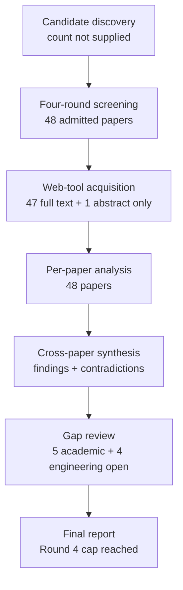

# Research Report: Authentic Workplace Action, Commitment, and Decision Argument Extraction

## Contents

- [Round History](#round-history)
- [Executive Summary](#executive-summary)
- [Research Question](#research-question)
- [Methodology](#methodology)
- [Papers Reviewed](#papers-reviewed)
- [Research Landscape](#research-landscape)
- [Confidence-Graded Findings](#confidence-graded-findings)
- [Research Gaps](#research-gaps)
- [Practical Recommendations](#practical-recommendations)
- [Evidence Map](#evidence-map)
- [References](#references)
- [Appendix: Run Metadata](#appendix-run-metadata)

## Round History

Iterative gap-closure loop (hard cap: 4 rounds). See `references/iterative-synthesis.md` for the full loop definition.

| Round | Run ID | Topic / Gap Focus | New Papers | Gaps Addressed | Remaining Gaps |
|-------|--------|-------------------|------------|----------------|----------------|
| 1 | a109ca6369e7 | action items, requests, commitments, and decisions in workplace email and chat: extracting action, owner, object, deadline, conditions, and speech act with evidence | 17 | initial shortlist | 5 academic, 4 engineering |
| 2 | fb59b34c3d44 | empirical workplace email and chat studies on structured action and decision extraction, focusing on owner assignment, deadline-to-action binding, conditional or negated obligations, and evidence-span annotation | 12 | 0 resolved | 5 academic, 4 engineering |
| 3 | 950e68ab52e0 | authentic workplace email and enterprise-chat extraction of structured action and decision arguments, with emphasis on implicit or group assignees, deadline-to-action relations, condition/negation/modality attachment, and exact evidence-span annotation | 10 | 0 resolved | 5 academic, 4 engineering |
| 4 | 5060d000e7b4 | authentic workplace email and enterprise-chat benchmarks for structured action/decision extraction, focusing specifically on implicit and group assignees, action-to-deadline binding, condition/negation/modality scope, and exact argument evidence spans | 9 | academic gaps of the previous round | 5 academic, 4 engineering |

**Stop reason**: 4-round cap reached

## Executive Summary

This review investigated whether authentic workplace email and enterprise-chat research is sufficient to extract work-relevant requests, commitments, action items, proposals, decisions, approvals, and related structured arguments while preserving owner, object, deadline, conditions, modality, negation, and exact supporting evidence. Across 48 reviewed papers, the strongest conclusion is [HIGH] that workplace action extraction cannot safely be reduced to message-level intent classification: surrounding context, multiple co-occurring acts, ambiguous ownership, and structured event arguments materially affect the interpretation [doi-10-1145-3331184-3331260] [2305.13469] [2312.05471]. The evidence also strongly supports [HIGH] preserving a distinction between explicit source spans and inferred or scattered arguments, because implicit arguments may have no literal span and complex arguments may require discontinuous evidence [1909.03546] [2202.12109] [2410.03594]. The most significant unresolved gap is [ACADEMIC][HIGH] that no reviewed authentic workplace email/chat benchmark jointly evaluates speech-act type, assignee, action object, deadline, conditions/exceptions, and exact provenance. Consequently, the component evidence is strong enough to guide an implementation and evaluation architecture, but not to claim production-domain validation of the complete extraction scheme.

**Scope**: 48 papers analyzed from 10 host/source domains over 2000–2024  
**Overall Confidence**: Medium  
**Verdict**: HAS_GAPS

## Research Question

The review asked:

> How should msgloom identify and represent work-relevant requests, commitments, actions, proposals, decisions, approvals, and related speech acts in authentic workplace email and enterprise chat while preserving the correct owner or assignee, action object, deadline relation, conditions/exceptions, negation/modality, evidence provenance, and uncertainty?

The in-scope object is semantic extraction at utterance time: act type, actor/owner, object/target, recipient/beneficiary, deadline wording and justified normalization, conditions/prerequisites/exceptions, evidence spans or supporting context, and unresolved fields.

The review explicitly preserves the following distinctions:

- request ≠ commitment;
- proposal or intention ≠ decision;
- mentioned action ≠ assigned action item;
- capability ≠ promise;
- conditional commitment ≠ unconditional commitment;
- a mentioned date ≠ a deadline for the current action;
- explicitly stated owner ≠ owner inferred from context;
- action extraction ≠ later action/commitment state tracking.

Topic 04 remains responsible for resolving which antecedent proposition, question, request, or alternative a response applies to. Topic 05 must therefore not interpret a correctly classified act as proof that its proposition-level scope is correct. Topic 06 remains responsible for subsequent confirmation, revocation, completion, contradiction, and state changes.

## Methodology

### Search Strategy

- **Sources**: arXiv, ACL Anthology, ResearchGate-hosted papers, Microsoft Research, Springer, Carnegie Mellon University, North Carolina State University, University of Sheffield, RNTI/Éditions RNTI, and the UPDF paper index.
- **Query variants**:
  - `authentic workplace email enterprise-chat structured action/decision extraction, focusing specifically implicit group assignees, action-to-deadline binding, condition/negation/modality scope, exact argument evidence spans`
  - `authentic workplace email`
  - `authentic enterprise-chat structured action/decision extraction, focusing specifically implicit group assignees, action-to-deadline binding, condition/negation/modality scope, exact argument evidence spans`
  - `workplace enterprise-chat structured action/decision extraction, focusing specifically implicit group assignees, action-to-deadline binding, condition/negation/modality scope, exact argument evidence spans`
  - `email enterprise-chat structured action/decision extraction, focusing specifically implicit group assignees, action-to-deadline binding, condition/negation/modality scope, exact argument evidence spans`
  - `authentic workplace email enterprise-chat structured`
  - `authentic workplace email action/decision extraction,`
  - `authentic workplace email focusing specifically`
- **Time window**: 2000–2024 among the admitted papers.
- **Screening**: The supplied run metadata does not specify whether the shortlist was produced by BM25 alone or BM25 plus sub-agent screening; no unsupported screening mechanism is inferred here.
- **Reading method**: Papers were read through the host's web tool. Forty-seven papers were available at full-text level; one paper, [doi-10-1145-3594536-3595162], was available only as an abstract-level source.
- **Synthesis method**: Four iterative rounds progressively narrowed from general action/request/commitment/decision extraction to authentic workplace benchmarks for assignees, deadline relations, condition/modality scope, and exact argument evidence.

Access levels used in the review:

- **Full text**: [1410.4868], [1606.07849], [1606.07965], [1909.03546], [1909.10094], [1911.03766], [2005.13084], [2104.05919], [2106.08037], [2109.09393], [2202.12109], [2303.16763], [2305.13469], [2312.05471], [2409.18602], [2410.03594], [doi-10-1007-11965152-18], [doi-10-1109-hicss-2006-528], [doi-10-1109-scc-2013-62], [doi-10-1145-1076034-1076094], [doi-10-1145-1076034-1076140], [doi-10-1145-3289600-3290984], [doi-10-1145-3331184-3331260], [doi-10-1162-coli-a-00110], [doi-10-1162-tacl-a-00006], [doi-10-1186-1471-2105-9-s11-s9], [doi-10-18653-v1-2007-sigdial-1-4], [doi-10-18653-v1-2020-acl-main-667], [doi-10-18653-v1-2020-coling-main-164], [doi-10-18653-v1-2023-findings-acl-378], [doi-10-18653-v1-d16-1078], [doi-10-18653-v1-n18-1076], [doi-10-18653-v1-w18-6104], [doi-10-26615-978-954-452-092-2-076], [doi-10-3115-1564535-1564540], [doi-10-3115-1708376-1708410], [manual-01c535c108], [manual-0839b98ee7], [manual-1e8332286e], [manual-20b8cd2fdd], [manual-69bc2555ab], [manual-90280d2776], [manual-cd3fa58e4c], [manual-d19b0f6f1e], [manual-e6bb5aee88], [manual-ee40d588e3], [manual-fde6beef40].
- **Abstract only**: [doi-10-1145-3594536-3595162].

### Pipeline Summary

| Metric | Count |
|--------|-------|
| Total candidates | Not supplied |
| After screening | 48 admitted papers |
| Downloaded | Not tracked as a separate metric; papers were accessed through the host web tool |
| Successfully converted | Not tracked as a separate metric |
| Deeply analyzed | 48 per-paper analyses; 47 full-text access, 1 abstract-only access |
| Iterations (if system-building) | 4 |

For argument-level evaluation, a suitable field-specific formulation is:

$P_f = \frac{TP_f}{TP_f+FP_f}$

$R_f = \frac{TP_f}{TP_f+FN_f}$

$F1_f = \frac{2P_fR_f}{P_f+R_f}$

where $f$ is separately instantiated for act type, owner, object, deadline relation, condition/modality attachment, and evidence support. A single aggregate action-item score is insufficient to expose which argument is failing.

## Papers Reviewed

No independent numeric paper-quality score was supplied by the pipeline, so the `Quality Score` field is reported as `not scored` rather than invented. `Relevance` distinguishes direct workplace evidence from transfer evidence used to support representations or experiments.

| # | Title | Authors | Year | Venue | Quality Score | Relevance |
|---|-------|---------|------|-------|--------------|-----------|
| 1 | MailEx: Email Event and Argument Extraction [2305.13469] | Saurabh Srivastava, Gaurav Singh, Shou Matsumoto et al. | 2023 | unknown | not scored | HIGH — direct workplace email |
| 2 | Computable Contracts by Extracting Obligation Logic Graphs [doi-10-1145-3594536-3595162] | Sergio Servantez, Nedim Lipka, Alexa Siu et al. | 2023 | unknown | not scored | MEDIUM — obligation transfer evidence |
| 3 | Modality and Negation in Event Extraction [2109.09393] | Sander Bijl de Vroe, Liane Guillou, Miloš Stanojević et al. | 2021 | unknown | not scored | MEDIUM — modality/negation transfer |
| 4 | Summarizing Decisions in Spoken Meetings [1606.07965] | Lu Wang, Claire Cardie | 2011 | unknown | not scored | MEDIUM — decision transfer |
| 5 | Document-Level Event Argument Extraction by Conditional Generation [2104.05919] | Sha Li, Heng Ji, Jiawei Han | 2021 | unknown | not scored | MEDIUM — argument extraction transfer |
| 6 | Implicit Argument Prediction with Event Knowledge [doi-10-18653-v1-n18-1076] | Pengxiang Cheng, Katrin Erk | 2018 | unknown | not scored | MEDIUM — implicit argument transfer |
| 7 | Multi-Sentence Argument Linking [1911.03766] | Seth Ebner, Patrick Xia, Ryan Culkin et al. | 2020 | unknown | not scored | MEDIUM — cross-sentence argument transfer |
| 8 | Semantic Role Labeling of Implicit Arguments for Nominal Predicates [doi-10-1162-coli-a-00110] | Matthew Gerber, Joyce Y. Chai | 2012 | unknown | not scored | MEDIUM — implicit role transfer |
| 9 | Reading between the Lines: Information Extraction from Industry Requirements [doi-10-26615-978-954-452-092-2-076] | Ole Magnus Holter, Basil Ell | 2023 | unknown | not scored | MEDIUM — industry-language transfer |
| 10 | Classifying Action Items for Semantic Email [manual-fde6beef40] | Simon Scerri, Gerhard Gossen, Brian Davis et al. | 2010 | unknown | not scored | HIGH — direct email |
| 11 | *SEM 2012 Shared Task: Resolving the Scope and Focus of Negation [manual-ee40d588e3] | Roser Morante, Eduardo Blanco | 2012 | *SEM shared task | not scored | MEDIUM — negation-scope transfer |
| 12 | Detecting Emails Containing Requests for Action [manual-cd3fa58e4c] | Andrew Lampert, Robert Dale, Cecile Paris | 2010 | unknown | not scored | HIGH — direct email |
| 13 | Detecting Action Items in Multi-party Meetings: Annotation and Initial Experiments [doi-10-1007-11965152-18] | Matthew Purver, Patrick Ehlen, John Niekrasz | 2006 | unknown | not scored | MEDIUM — meeting transfer |
| 14 | Detecting and Summarizing Action Items in Multi-Party Dialogue [doi-10-18653-v1-2007-sigdial-1-4] | Matthew Purver, John Dowding, John Niekrasz et al. | 2007 | SIGDIAL | not scored | MEDIUM — dialogue transfer |
| 15 | Shallow Discourse Structure for Action Item Detection [doi-10-3115-1564535-1564540] | Matthew Purver, Patrick Ehlen, John Niekrasz | 2006 | unknown | not scored | MEDIUM — meeting transfer |
| 16 | Extracting Decisions from Multi-Party Dialogue Using Directed Graphical Models and Semantic Similarity [doi-10-3115-1708376-1708410] | Trung Bui, Matthew Frampton, John Dowding et al. | 2009 | unknown | not scored | MEDIUM — decision transfer |
| 17 | Meeting Action Item Detection with Regularized Context Modeling [2303.16763] | Jiaqing Liu, Chong Deng, Qinglin Zhang et al. | 2023 | unknown | not scored | MEDIUM — context/action transfer |
| 18 | Can Requests-for-Action and Commitments-to-Act be Reliably Identified in Email Messages? [manual-0839b98ee7] | Andrew Lampert, Cécile Paris, Robert Dale | 2007 | unknown | not scored | HIGH — direct email |
| 19 | Requests and Commitments in Email are More Complex Than You Think: Eight Reasons to be Cautious [manual-20b8cd2fdd] | Andrew Lampert, Robert Dale, Cécile Paris | 2008 | unknown | not scored | HIGH — direct email |
| 20 | The nature of requests and commitments in email messages [manual-d19b0f6f1e] | Andrew Lampert, Robert Dale, Cécile Paris | 2008 | unknown | not scored | HIGH — direct email |
| 21 | Using Speech Acts to Categorize Email and Identify Email Genres [doi-10-1109-hicss-2006-528] | Jade Goldstein, Roberta Evans Sabin | 2006 | HICSS | not scored | HIGH — direct email |
| 22 | TimeML: Robust Specification of Event and Temporal Expressions in Text [manual-1e8332286e] | James Pustejovsky, José Castaño, Robert Ingria et al. | 2003 | unknown | not scored | MEDIUM — temporal representation transfer |
| 23 | Dialogue act modeling for automatic tagging and recognition of conversational speech [manual-01c535c108] | Andreas Stolcke, Klaus Ries, Noah Coccaro et al. | 2000 | unknown | not scored | MEDIUM — dialogue-act transfer |
| 24 | On the collective classification of email "speech acts" [doi-10-1145-1076034-1076094] | Vitor R. Carvalho, William W. Cohen | 2005 | SIGIR | not scored | HIGH — direct email |
| 25 | Detecting Action-Items in E-mail [doi-10-1145-1076034-1076140] | Paul N. Bennett, Jaime G. Carbonell | 2005 | SIGIR | not scored | HIGH — direct email |
| 26 | The Possible, the Plausible, and the Desirable: Event-Based Modality Detection for Language Processing [2106.08037] | Valentina Pyatkin, Shoval Sadde, Aynat Rubinstein et al. | 2021 | unknown | not scored | MEDIUM — modality transfer |
| 27 | Learning with Weak Supervision for Email Intent Detection [2005.13084] | Kai Shu, Subhabrata Mukherjee, Guoqing Zheng et al. | 2020 | unknown | not scored | HIGH — direct email |
| 28 | Context-Aware Intent Identification in Email Conversations [doi-10-1145-3331184-3331260] | Wei Wang, Saghar Hosseini, Ahmed Hassan Awadallah et al. | 2019 | SIGIR | not scored | HIGH — direct email |
| 29 | Domain Adaptation for Commitment Detection in Email [doi-10-1145-3289600-3290984] | Hosein Azarbonyad, Robert Sim, Ryen W. White | 2019 | WSDM | not scored | HIGH — direct email |
| 30 | Monitoring Commitments in People-Driven Service Engagements [doi-10-1109-scc-2013-62] | Anup K. Kalia, Hamid R. Motahari-Nezhad, Claudio Bartolini et al. | 2013 | SCC | not scored | MEDIUM — commitment transfer |
| 31 | Deep Structured Neural Network for Event Temporal Relation Extraction [1909.10094] | Rujun Han, I-Hung Hsu, Mu Yang et al. | 2019 | unknown | not scored | MEDIUM — temporal-relation transfer |
| 32 | The BioScope corpus: biomedical texts annotated for uncertainty, negation and their scopes [doi-10-1186-1471-2105-9-s11-s9] | Veronika Vincze, György Szarvas, Richárd Farkas et al. | 2008 | BMC Bioinformatics | not scored | MEDIUM — scope-annotation transfer |
| 33 | Lin: Unsupervised Extraction of Tasks from Textual Communication [doi-10-18653-v1-2020-coling-main-164] | Parth Diwanji, Hui Guo, Munindar Singh et al. | 2020 | COLING | not scored | HIGH — textual communication/task extraction |
| 34 | Assigning people to tasks identified in email: The EPA dataset for addressee tagging for detected task intent [doi-10-18653-v1-w18-6104] | Revanth Rameshkumar, Peter Bailey, Abhishek Jha et al. | 2018 | ACL Anthology workshop paper | not scored | HIGH — direct email assignee evidence |
| 35 | Prompt for Extraction? PAIE: Prompting Argument Interaction for Event Argument Extraction [2202.12109] | Yubo Ma, Zehao Wang, Yixin Cao et al. | 2022 | unknown | not scored | MEDIUM — argument extraction transfer |
| 36 | A Modality Lexicon and its use in Automatic Tagging [1410.4868] | Kathryn Baker, Michael Bloodgood, Bonnie J. Dorr et al. | 2010 | unknown | not scored | MEDIUM — modality transfer |
| 37 | Fine-Grained Analysis of Team Collaborative Dialogue [2312.05471] | Ian Perera, Matthew Johnson, Carson Wilber | 2023 | unknown | not scored | HIGH — workplace Slack/team dialogue |
| 38 | Explicit, Implicit, and Scattered: Revisiting Event Extraction to Capture Complex Arguments [2410.03594] | Omar Sharif, Joseph Gatto, Madhusudan Basak et al. | 2024 | unknown | not scored | MEDIUM — complex-argument transfer |
| 39 | LEDA: a Large-Organization Email-Based Decision-Dialogue-Act Analysis Dataset [doi-10-18653-v1-2023-findings-acl-378] | Vanja Mladen Karan, Prashant Khare, Ravi Shekhar et al. | 2023 | Findings of ACL | not scored | HIGH — direct organizational email |
| 40 | Speculation and Negation Scope Detection via Convolutional Neural Networks [doi-10-18653-v1-d16-1078] | Zhong Qian, Peifeng Li, Qiaoming Zhu et al. | 2016 | ACL Anthology | not scored | MEDIUM — negation/speculation transfer |
| 41 | Predicate-specific Annotations for Implicit Role Binding: Corpus Annotation, Data Analysis and Evaluation Experiments [manual-69bc2555ab] | Tatjana Moor, Michael Roth, Anette Frank | 2013 | ACL Anthology workshop paper | not scored | MEDIUM — implicit-role transfer |
| 42 | A Two-Step Approach for Implicit Event Argument Detection [doi-10-18653-v1-2020-acl-main-667] | Zhisong Zhang, Xiang Kong, Zhengzhong Liu et al. | 2020 | ACL | not scored | MEDIUM — implicit-argument transfer |
| 43 | Do LLMs suffer from Multi-Party Hangover? A Diagnostic Approach to Addressee Recognition and Response Selection in Conversations [2409.18602] | Nicolò Penzo, Maryam Sajedinia, Bruno Lepri et al. | 2024 | unknown | not scored | MEDIUM — multi-party addressee transfer |
| 44 | Extraction de tâches dans les e-mails : une approche fondée sur les rôles sémantiques [manual-e6bb5aee88] | Melissa Mekaoui, Guillaume Tisserant, Mathieu Dodard et al. | 2020 | RNTI | not scored | HIGH — direct email |
| 45 | Entity, Relation, and Event Extraction with Contextualized Span Representations [1909.03546] | David Wadden, Ulme Wennberg, Yi Luan et al. | 2019 | unknown | not scored | MEDIUM — span extraction transfer |
| 46 | Decision Detection Using Hierarchical Graphical Models [manual-90280d2776] | Trung H. Bui, Stanley Peters | 2010 | ACL Anthology | not scored | MEDIUM — meeting decision transfer |
| 47 | Event Time Extraction with a Decision Tree of Neural Classifiers [doi-10-1162-tacl-a-00006] | Nils Reimers, Nazanin Dehghani, Iryna Gurevych | 2018 | TACL | not scored | MEDIUM — temporal-relation transfer |
| 48 | Focused Meeting Summarization via Unsupervised Relation Extraction [1606.07849] | Lu Wang, Claire Cardie | 2012 | unknown | not scored | MEDIUM — meeting/decision transfer |

## Research Landscape

### Theme 1: Context-sensitive extraction in authentic workplace communication

**Coverage**: 6 central papers plus related email/dialogue studies | **Confidence**: High  
**Supporting papers**: [doi-10-1145-3331184-3331260], [2305.13469], [2312.05471], [doi-10-1145-1076034-1076094], [2303.16763], [2106.08037]

Workplace acts cannot be assumed to be self-contained in one sentence. Authentic email and Slack evidence shows that conversation history, message context, participants, recipient metadata, and prior discourse can materially change classification or argument extraction [doi-10-1145-3331184-3331260] [2305.13469] [2312.05471]. At the same time, context expansion is not monotonically beneficial: collective email classification degraded at least one act class, meeting datasets preferred different context configurations, and predicted contextual structures can propagate errors [doi-10-1145-1076034-1076094] [2303.16763] [2106.08037].

Key findings:

1. [HIGH] Surrounding workplace context can materially improve actionable-intent, event-argument, or dialogue-act processing compared with isolated input [doi-10-1145-3331184-3331260] [2305.13469] [2312.05471].
2. [HIGH] More context is not universally better; the optimal context boundary depends on task, corpus, and the reliability of upstream contextual predictions [doi-10-1145-1076034-1076094] [2303.16763] [2106.08037].
3. [HIGH] A production extractor should therefore treat context selection as an empirical design variable rather than defaulting to either sentence-only or whole-thread input.

### Theme 2: Structured action items as multi-argument and sometimes multi-utterance objects

**Coverage**: 8+ papers | **Confidence**: High  
**Supporting papers**: [2305.13469], [doi-10-1007-11965152-18], [doi-10-18653-v1-2007-sigdial-1-4], [1911.03766], [2104.05919], [2202.12109]

Action items are better modeled as structured semantic objects than as binary labels. Meeting research decomposes actions into components such as description, owner, and timeframe [doi-10-1007-11965152-18] [doi-10-18653-v1-2007-sigdial-1-4], while MAILEX directly applies event-and-argument extraction to workplace email [2305.13469]. General event-argument work further demonstrates document-level and multi-sentence argument linking [1911.03766] [2104.05919].

Key findings:

1. [HIGH] A useful extraction target contains separately identifiable arguments rather than a single `action=true` decision [2305.13469] [doi-10-1007-11965152-18] [doi-10-18653-v1-2007-sigdial-1-4].
2. [HIGH] Arguments may be located outside the trigger sentence, making document- or context-level linking relevant [1911.03766] [2104.05919].
3. [HIGH] End-to-end extraction is materially harder than argument classification under gold trigger/candidate assumptions [2305.13469] [1911.03766].

### Theme 3: Implicit, plural, and context-dependent responsibility assignment

**Coverage**: 8 papers | **Confidence**: High  
**Supporting papers**: [doi-10-18653-v1-w18-6104], [doi-10-1007-11965152-18], [doi-10-3115-1564535-1564540], [2312.05471], [doi-10-18653-v1-2020-coling-main-164], [manual-e6bb5aee88]

Responsibility is one of the least safely inferable action arguments. Meeting work reports owner identification as a difficult component [doi-10-1007-11965152-18] [doi-10-3115-1564535-1564540]. The EPA email dataset directly shows cases where task responsibility is implicit, plural, or not represented by an obvious candidate recipient [doi-10-18653-v1-w18-6104]. Slack collaboration analysis adds participant-role and project-context effects [2312.05471].

Key findings:

1. [HIGH] Owner extraction is empirically difficult across both meeting and authentic email settings [doi-10-1007-11965152-18] [doi-10-3115-1564535-1564540] [doi-10-18653-v1-w18-6104].
2. [HIGH] Recipient lists and grammatical subject cues are insufficient as a general owner model because authentic communication includes implicit, plural, and context-dependent responsibility [doi-10-18653-v1-w18-6104] [2312.05471].
3. [HIGH] An unresolved-owner state is semantically necessary; forcing a single assignee would fabricate information in cases unsupported by the message.

### Theme 4: Action-to-time relations rather than date detection alone

**Coverage**: 6 papers | **Confidence**: Medium  
**Supporting papers**: [doi-10-18653-v1-2007-sigdial-1-4], [doi-10-1162-tacl-a-00006], [manual-1e8332286e], [1909.10094], [doi-10-1109-scc-2013-62]

Meeting action-item work treats timeframe as a component of an action rather than as a free-floating date [doi-10-18653-v1-2007-sigdial-1-4]. Temporal-information research likewise represents events, times, and relations explicitly [manual-1e8332286e] and shows that event-time anchoring depends on relation context rather than merely recognizing a time expression [doi-10-1162-tacl-a-00006] [1909.10094].

Key findings:

1. [MEDIUM] A deadline should be modeled as a relation between a temporal expression and a particular action/event, not as a message-level date attribute [doi-10-18653-v1-2007-sigdial-1-4] [doi-10-1162-tacl-a-00006] [manual-1e8332286e].
2. [MEDIUM] Correct temporal anchoring can require surrounding relation text and broader temporal context [doi-10-1162-tacl-a-00006] [1909.10094].
3. [LOW] The reviewed corpus does not establish target-domain reliability for distinguishing true workplace deadlines from merely mentioned dates, scheduling expressions, shared dates, or conditional future times.

### Theme 5: Condition, negation, and modality scope over actions and commitments

**Coverage**: 9 papers | **Confidence**: Medium  
**Supporting papers**: [1410.4868], [2109.09393], [2106.08037], [doi-10-1186-1471-2105-9-s11-s9], [doi-10-18653-v1-d16-1078], [manual-ee40d588e3], [manual-0839b98ee7], [manual-d19b0f6f1e]

Transfer literature provides mature representations for modality, speculation, negation, cue-to-event relations, and scope [1410.4868] [2109.09393] [2106.08037] [doi-10-1186-1471-2105-9-s11-s9] [doi-10-18653-v1-d16-1078] [manual-ee40d588e3]. Workplace email research independently reports conditional offers and conditional commitments as meaningful annotation difficulties [manual-0839b98ee7] [manual-d19b0f6f1e].

Key findings:

1. [MEDIUM] Negation and modality should be attached to the event/proposition whose status they alter instead of collapsed into message-level metadata [2109.09393] [doi-10-18653-v1-d16-1078] [manual-ee40d588e3].
2. [MEDIUM] Conditional commitments are empirically relevant in email and contribute to annotator ambiguity [manual-0839b98ee7] [manual-d19b0f6f1e].
3. [LOW] Direct workplace evidence remains insufficient for correctly attaching several simultaneous conditions, exceptions, negations, or modal operators to multiple co-occurring actions.

### Theme 6: Exact evidence spans versus implicit and scattered arguments

**Coverage**: 9 papers | **Confidence**: High  
**Supporting papers**: [1909.03546], [2202.12109], [2410.03594], [doi-10-18653-v1-2020-acl-main-667], [doi-10-18653-v1-n18-1076], [doi-10-1162-coli-a-00110]

Span-based extraction provides a strong representation for explicit text-supported arguments [1909.03546] [2202.12109]. However, implicit-argument research shows that required semantic roles may have no overt textual realization [doi-10-18653-v1-n18-1076] [doi-10-1162-coli-a-00110] [doi-10-18653-v1-2020-acl-main-667], while newer complex-event work explicitly distinguishes explicit, implicit, and scattered arguments [2410.03594].

Key findings:

1. [HIGH] Exact character/token spans are appropriate provenance for explicitly realized arguments [1909.03546] [2202.12109].
2. [HIGH] An implicit argument may have no exact literal evidence span [doi-10-18653-v1-2020-acl-main-667] [doi-10-18653-v1-n18-1076] [doi-10-1162-coli-a-00110].
3. [HIGH] Some semantic arguments require multiple discontinuous supporting pieces rather than one contiguous span [2410.03594].
4. [HIGH] Therefore, a provenance model should distinguish `explicit_span`, `supporting_context`, and `inferred_value` rather than fabricating an exact span for every extracted field.

### Theme 7: Multiple acts and multiple actions within one message or sentence

**Coverage**: 7 papers | **Confidence**: High  
**Supporting papers**: [doi-10-1145-3331184-3331260], [doi-10-18653-v1-2020-coling-main-164], [2312.05471], [manual-20b8cd2fdd], [manual-d19b0f6f1e]

Authentic workplace communication frequently violates a one-message/one-act assumption. Enterprise email research reports multi-intent messages [doi-10-1145-3331184-3331260], task extraction work explicitly handles coordinated action predicates [doi-10-18653-v1-2020-coling-main-164], and Slack dialogue-act annotation permits multiple clause- or fragment-level acts [2312.05471].

Key findings:

1. [HIGH] One message can contain multiple actionable intents or action structures [doi-10-1145-3331184-3331260] [doi-10-18653-v1-2020-coling-main-164] [2312.05471].
2. [HIGH] Message-level classification alone can therefore conceal independent owners, objects, deadlines, or conditions.
3. [HIGH] Evaluation should count each action structure and each argument separately instead of treating a partially correct multi-action message as wholly correct.

### Theme 8: Proposal, decision, commitment, and request distinctions

**Coverage**: 10 papers | **Confidence**: High  
**Supporting papers**: [doi-10-18653-v1-2023-findings-acl-378], [manual-90280d2776], [1606.07965], [doi-10-3115-1708376-1708410], [manual-0839b98ee7], [manual-d19b0f6f1e]

LEDA provides direct organizational-email evidence distinguishing proposal-related and decision-related dialogue acts [doi-10-18653-v1-2023-findings-acl-378]. Meeting-decision research further treats decisions as multi-utterance processes involving issues, proposals, agreement, and restatement rather than a single isolated binary decision token [manual-90280d2776] [1606.07965] [doi-10-3115-1708376-1708410]. Email request/commitment work separately demonstrates that requesting another actor to act and committing oneself to act are distinct communicative phenomena [manual-0839b98ee7] [manual-d19b0f6f1e].

Key findings:

1. [HIGH] Proposal and decision should remain separate labels in workplace extraction [doi-10-18653-v1-2023-findings-acl-378] [manual-90280d2776] [1606.07965].
2. [HIGH] Request and commitment should remain separate because they assign different responsibility and response expectations [manual-0839b98ee7] [manual-d19b0f6f1e].
3. [MEDIUM] A decision may require evidence from multiple utterances, so extracting only the sentence containing agreement or decision language may omit its substantive content [manual-90280d2776] [1606.07965].

### Theme 9: Domain variation and error propagation in end-to-end extraction

**Coverage**: 7 papers | **Confidence**: High  
**Supporting papers**: [2305.13469], [1911.03766], [doi-10-1145-3289600-3290984], [2005.13084]

MAILEX and RAMS-style evidence shows that argument extraction degrades substantially when triggers or candidate spans must themselves be discovered rather than supplied [2305.13469] [1911.03766]. Email commitment detection additionally exhibits corpus dependence: within-corpus performance is stronger than unadapted cross-corpus transfer, while adaptation and weak-supervision techniques can recover part of the loss [doi-10-1145-3289600-3290984] [2005.13084].

Key findings:

1. [HIGH] Gold-trigger or gold-candidate experiments materially overstate the difficulty solved by an end-to-end workplace extractor [2305.13469] [1911.03766].
2. [HIGH] Commitment-detection performance is corpus dependent even within authentic email [doi-10-1145-3289600-3290984] [2005.13084].
3. [HIGH] Evaluation for msgloom must therefore be end-to-end and target-domain aware.

## Methodology Comparison

| Approach | Papers | Strengths | Weaknesses | Best For | Performance |
|----------|--------|-----------|------------|----------|-------------|
| Message-level email speech-act / intent classification | [doi-10-1145-1076034-1076094], [doi-10-1109-hicss-2006-528], [2005.13084] | Direct workplace evidence; comparatively simple supervision | Does not by itself recover owner, object, deadline, condition, or evidence span; multi-intent messages can be collapsed | Initial act candidate detection | Corpus-dependent; exact comparable metrics not synthesized here |
| Context-aware email intent/event extraction | [doi-10-1145-3331184-3331260], [2305.13469] | Uses conversational history and context; closer to actual email interpretation | Context may add contamination or propagate upstream errors | Thread-aware act and argument extraction | [HIGH] evidence of context benefit in some tasks, but not universally |
| Structured meeting action-item extraction | [doi-10-1007-11965152-18], [doi-10-18653-v1-2007-sigdial-1-4], [doi-10-3115-1564535-1564540] | Explicit action components including owner/timeframe; captures multi-utterance behavior | Transfer domain; meeting discourse differs from email/chat | Representation design and adversarial cases | Owner remains difficult |
| Email assignee prediction | [doi-10-18653-v1-w18-6104] | Direct evidence for implicit, plural, and absent-recipient owners | Does not solve the complete action schema | Owner/assignee modeling | Demonstrates unresolved ownership classes; full production reliability remains open |
| Span-based event argument extraction | [1909.03546], [2202.12109], [2104.05919] | Exact provenance for explicit arguments; mature event extraction formulation | Cannot alone represent omitted arguments or discontinuous evidence | Explicit owner/object/action evidence | Strong transfer methodology; target-domain validation incomplete |
| Implicit/scattered argument recovery | [doi-10-18653-v1-n18-1076], [doi-10-18653-v1-2020-acl-main-667], [2410.03594] | Handles semantic arguments absent from local literal spans | Inference risk; provenance is more complex; transfer domains dominate | Contextually inferred owner/object roles | Demonstrates feasibility, not workplace production accuracy |
| Temporal relation extraction | [manual-1e8332286e], [doi-10-1162-tacl-a-00006], [1909.10094] | Represents event-time relations rather than isolated dates | Does not directly solve workplace deadline semantics | Deadline relation architecture | [MEDIUM] transfer evidence |
| Negation/modality/scope modeling | [1410.4868], [2109.09393], [doi-10-18653-v1-d16-1078], [manual-ee40d588e3] | Explicit cue-to-event/proposition scope | Strongest results are outside workplace communication | Condition/modality/negation attachment | [MEDIUM] transfer evidence |
| Decision-process modeling | [doi-10-18653-v1-2023-findings-acl-378], [manual-90280d2776], [1606.07965] | Preserves proposal-versus-decision distinction and multi-utterance structure | Structured argument extraction remains weak in authentic email/chat | Decision representation | Direct act evidence plus transfer structural evidence |

## Confidence-Graded Findings

### 🟢 High Confidence (supported by 3+ papers with consistent results)

1. [HIGH] **Authentic workplace actions require context-sensitive processing.** Surrounding message, conversation, participant, or recipient context can materially change actionable-intent, event-argument, or dialogue-act interpretation [doi-10-1145-3331184-3331260] [2305.13469] [2312.05471].

2. [HIGH] **Responsibility assignment cannot safely be reduced to recipient identity or local grammatical subject.** Meeting studies identify owner extraction as difficult, and the EPA email benchmark directly contains implicit, plural, and no-obvious-recipient assignments [doi-10-1007-11965152-18] [doi-10-3115-1564535-1564540] [doi-10-18653-v1-w18-6104].

3. [HIGH] **Workplace messages can contain several actionable intents or actions.** Enterprise email, textual communication, and Slack evidence all support multi-act or multi-action structures [doi-10-1145-3331184-3331260] [doi-10-18653-v1-2020-coling-main-164] [2312.05471].

4. [HIGH] **Explicit argument provenance and inferred argument provenance are not the same object.** Span-based event extraction supports exact offsets for literal arguments, while implicit/scattered-argument studies demonstrate semantic arguments without one contiguous source span [1909.03546] [2202.12109] [2410.03594] [doi-10-18653-v1-2020-acl-main-667].

5. [HIGH] **Proposal, decision, request, and commitment distinctions should be preserved rather than collapsed into one generic action class.** Direct organizational email and meeting-decision studies support proposal/decision distinctions, while email request/commitment studies establish distinct communicative categories [doi-10-18653-v1-2023-findings-acl-378] [manual-90280d2776] [1606.07965] [manual-0839b98ee7] [manual-d19b0f6f1e].

6. [HIGH] **End-to-end argument extraction is materially harder than extraction under gold triggers or candidate spans.** MAILEX and multi-sentence event-argument results both expose substantial upstream-error effects [2305.13469] [1911.03766].

7. [HIGH] **Workplace commitment detection is corpus dependent.** Cross-corpus email transfer loses performance relative to within-corpus training, although adaptation and weak supervision recover some of the loss [doi-10-1145-3289600-3290984] [2005.13084].

8. [HIGH] **More context does not consistently improve every task or class.** Context gains coexist with observed degradation, corpus-specific optimal configurations, and error propagation from predicted structure [doi-10-1145-1076034-1076094] [2303.16763] [2106.08037].

### 🟡 Medium Confidence (supported by 1-2 papers or with caveats)

1. [MEDIUM] **Deadline extraction should be formulated as action-to-time relation extraction rather than date detection.** Meeting action-item and temporal-event work support relational representations, but direct workplace email/chat deadline-binding evaluation remains missing [doi-10-18653-v1-2007-sigdial-1-4] [doi-10-1162-tacl-a-00006] [manual-1e8332286e].

2. [MEDIUM] **Conditions, exceptions, negation, and modality should attach to the specific action or commitment whose status they modify.** This follows from mature scope/event modeling and direct email evidence that conditional commitments create annotation ambiguity, but most detailed scope benchmarks are transfer-domain evidence [1410.4868] [2109.09393] [doi-10-1186-1471-2105-9-s11-s9] [manual-0839b98ee7] [manual-d19b0f6f1e].

3. [MEDIUM] **Decisions can be multi-utterance semantic objects rather than isolated decision sentences.** Meeting evidence strongly supports this structure, while direct authentic-email evidence mainly establishes dialogue-act distinctions rather than complete structured decision arguments [manual-90280d2776] [1606.07965] [doi-10-18653-v1-2023-findings-acl-378].

### 🔴 Low Confidence (preliminary, single-source, or contradicted)

1. [LOW] **A single best context window exists for workplace action extraction.** The literature does not support this proposition; different tasks and corpora show different optima and sometimes context-related degradation [doi-10-1145-1076034-1076094] [2303.16763] [doi-10-1145-3331184-3331260].

2. [LOW] **A nearby temporal expression can reliably be treated as the deadline of the nearest action.** No reviewed authentic workplace benchmark establishes this; available evidence instead supports explicit event-time relation modeling [doi-10-1162-tacl-a-00006] [manual-1e8332286e].

3. [LOW] **A single contiguous evidence span is sufficient for every structured argument.** This is contradicted by implicit and scattered-argument research [2410.03594] [doi-10-18653-v1-2020-acl-main-667].

## Trade-Off Analysis

| Decision | Option A | Option B | Recommendation |
|----------|----------|----------|----------------|
| Context boundary | Sentence-local processing reduces contamination but misses discourse-dependent information [2305.13469] | Full-thread processing supplies context but can hurt some classes or propagate noise [doi-10-1145-1076034-1076094] [2303.16763] | Use selectively expanded context and validate it against sentence/message/full-thread ablations |
| Owner representation | Force one recipient/subject as owner | Nullable explicit/inferred/group owner representation supported by EPA-style ambiguity [doi-10-18653-v1-w18-6104] | Preserve explicitness and allow `unknown`, multiple owners, and group ownership |
| Deadline representation | Extract any detected date as message deadline | Link a temporal expression to one or more specific actions using an explicit relation [doi-10-18653-v1-2007-sigdial-1-4] [doi-10-1162-tacl-a-00006] | Use action-to-time edges; proximity alone is insufficient |
| Argument provenance | Require one contiguous span per field | Exact span for explicit values; contextual evidence plus inference status for implicit/scattered values [2410.03594] | Use heterogeneous provenance rather than fabricated spans |
| Act taxonomy | Collapse actionable language into one action-item label | Preserve request, commitment, proposal, decision, approval/rejection distinctions | Preserve separate act labels because responsibility and state implications differ [manual-0839b98ee7] [doi-10-18653-v1-2023-findings-acl-378] |
| Uncertain fields | Fill every owner/deadline/condition to create a complete record | Permit unresolved/null fields | Preserve uncertainty; project-specific impact requires engineering evaluation |
| Evaluation | One overall action-item F1 | Per-act and per-argument precision/recall/F1 plus end-to-end FP/FN | Evaluate every field separately and retain end-to-end denominators |

## Points of Agreement **[EVIDENCE REQUIRED]**

1. [HIGH] **Actionable workplace language is context sensitive.** Direct email and Slack evidence agrees that broader discourse or conversational information can affect interpretation [doi-10-1145-3331184-3331260] [2305.13469] [2312.05471].

2. [HIGH] **Action extraction should preserve structured arguments.** Email event extraction, meeting action-item studies, and general event-argument research all support decomposing an action into semantically distinct arguments rather than storing only a binary label [2305.13469] [doi-10-1007-11965152-18] [2104.05919].

3. [HIGH] **Owner assignment is not always locally explicit.** Email assignee, meeting, Slack, and implicit-argument work consistently demonstrate missing or context-dependent semantic roles [doi-10-18653-v1-w18-6104] [doi-10-1007-11965152-18] [2312.05471] [doi-10-18653-v1-2020-acl-main-667].

4. [HIGH] **Multi-action and multi-act structures must be supported.** Email, textual communication, and Slack studies all reject a universal one-message/one-act simplification [doi-10-1145-3331184-3331260] [doi-10-18653-v1-2020-coling-main-164] [2312.05471].

5. [HIGH] **Explicit spans and implicit semantic values need different provenance treatment.** Span extraction and implicit/scattered-argument research converge on this distinction [1909.03546] [2202.12109] [2410.03594].

6. [MEDIUM] **Temporal, negation, modality, and condition information should be relationally scoped to actions/events.** The strongest evidence is largely transfer-domain rather than authentic workplace benchmarks [manual-1e8332286e] [2109.09393] [manual-ee40d588e3].

## Points of Contradiction **[EVIDENCE REQUIRED]**

1. [HIGH] **Whether more conversational context consistently improves extraction**: [doi-10-1145-3331184-3331260], [2305.13469], and [2312.05471] report benefits from broader message/conversation context, but [doi-10-1145-1076034-1076094], [2303.16763], and [2106.08037] show class-specific degradation, corpus-dependent context choices, or downstream damage from noisy predicted structure.
   - **Possible explanation**: The studies optimize different tasks, datasets, context representations, and upstream components.
   - **Implication**: Context size and selection must be experimentally controlled rather than assumed to be monotonic.

2. [HIGH] **Sentence-level versus message-level annotation granularity**: [doi-10-1145-1076034-1076140] found sentence-level action-item annotation useful for document detection, whereas [manual-20b8cd2fdd] and [manual-d19b0f6f1e] report better human agreement for request/commitment annotation at message level and identify sentence-locus ambiguity as a problem.
   - **Possible explanation**: One line of work optimizes automatic localization of action content; the other optimizes reliable human labeling of communicative acts.
   - **Implication**: msgloom should not adopt one universal annotation unit; act classification and argument localization may legitimately use different granularities.

3. [HIGH] **Exact argument spans versus semantically recoverable implicit arguments**: [1909.03546] and [2202.12109] use explicit span-oriented argument extraction, while [2410.03594] and [doi-10-18653-v1-2020-acl-main-667] demonstrate implicit or distributed semantic arguments without a single literal span.
   - **Possible explanation**: The approaches target different argument-realization types rather than disagreeing about the same examples.
   - **Implication**: Exact spans should remain mandatory when they exist but must not be fabricated for implicit fields.

4. [HIGH] **Surface or recipient-based owner inference versus contextual ownership**: [doi-10-18653-v1-2020-coling-main-164] and [manual-e6bb5aee88] use syntactic/person/role cues, whereas [doi-10-18653-v1-w18-6104] and [2312.05471] expose implicit, plural, role-dependent, or non-recipient ownership.
   - **Possible explanation**: Surface heuristics cover frequent explicit cases but not the full responsibility distribution of authentic collaboration.
   - **Implication**: Such cues are useful features but cannot be treated as authoritative owner assignment.

5. [MEDIUM] **Operational simplicity of commitments versus observed conditional ambiguity**: [doi-10-1109-scc-2013-62] formally permits conditional commitments but operationally emphasizes largely unconditional cases, while [manual-0839b98ee7], [manual-d19b0f6f1e], and [manual-20b8cd2fdd] identify conditional offers and commitments as recurring workplace-email ambiguities.
   - **Possible explanation**: Service-engagement and unconstrained workplace-email corpora differ in communicative conventions and annotation objectives.
   - **Implication**: msgloom cannot safely assume commitments are unconditional unless conditions are absent or explicitly resolved.

## Research Gaps

All nine project-relevant gaps remain open. The four-round search did not establish closure of any academic gap, and the engineering gaps require project-specific experimentation rather than additional paper count. The literature has **not answered these gaps yet**.

| # | Gap | Type | Severity | Rounds Already Searched / Evaluated | Impact on Goals |
|---|-----|------|----------|-------------------------------------|-----------------|
| 1 | No authentic workplace benchmark jointly annotates act type, owner, object, deadline, conditions/exceptions, and exact evidence provenance | [ACADEMIC] | HIGH | Academic follow-up searched in Rounds 2, 3, 4 after identification in Round 1 | Prevents direct validation of msgloom's complete structured action schema |
| 2 | Structured extraction of decisions, approvals, rejections, and proposals from authentic workplace email/chat remains insufficiently evidenced | [ACADEMIC] | HIGH | Academic follow-up searched in Rounds 2, 3, 4 after identification in Round 1 | Risks confusing proposals with decisions or losing decision arguments |
| 3 | Reliable implicit/group/multi-action owner extraction remains unestablished | [ACADEMIC] | HIGH | Academic follow-up searched in Rounds 2, 3, 4 after identification in Round 1 | Wrong owners can create false obligations or hide required responses |
| 4 | Reliable action-to-deadline binding in workplace communication remains unestablished | [ACADEMIC] | HIGH | Academic follow-up searched in Rounds 2, 3, 4 after identification in Round 1 | A mentioned date can be incorrectly surfaced as a due date |
| 5 | Correct workplace attachment of conditions, exceptions, negation, and modality across several actions remains unvalidated | [ACADEMIC] | HIGH | Academic follow-up searched in Rounds 2, 3, 4 after identification in Round 1 | Lost scope can turn conditional or negated work into false unconditional obligations |
| 6 | Independent argument-level/adversarial benchmark for msgloom has not been built | [ENGINEERING] | HIGH | Not a literature-closure target; identified in Round 1 and carried through Round 4 | Required to measure project-specific missed work, false alerts, and argument errors |
| 7 | Sentence-local vs message-level vs selectively expanded thread context has not been experimentally compared for msgloom | [ENGINEERING] | HIGH | Not a literature-closure target; evidence reviewed throughout Rounds 1–4 | Context can help or hurt; wrong choice can increase both misses and contamination |
| 8 | Provenance-preserving zoning of authored, quoted, and forwarded content has not been tested against loss of necessary history | [ENGINEERING] | HIGH | Not a literature-closure target; evidence reviewed throughout Rounds 1–4 | Quoted text can create duplicate/false actions, while removing it can erase needed context |
| 9 | Nullable uncertainty-preserving output has not been evaluated for false-obligation reduction versus recall loss | [ENGINEERING] | HIGH | Not a literature-closure target; identified in Round 1 and carried through Round 4 | Forcing uncertain fields can invent owners, deadlines, or act subtypes |

### Academic Gaps (require more papers)

1. [ACADEMIC][HIGH] **Joint workplace structured-action benchmark remains missing.** MAILEX contributes authentic email event/argument extraction [2305.13469], EPA contributes assignee annotations [doi-10-18653-v1-w18-6104], and email act datasets contribute request/commitment or intent labels [manual-d19b0f6f1e] [doi-10-1145-3331184-3331260], but no reviewed benchmark jointly evaluates act type, owner, object, deadline, conditions/exceptions, and exact provenance. This gap remains open after academic searching in Rounds 2–4. Suggested query: `"action item extraction" (email OR Slack OR "workplace chat" OR "enterprise chat") assignee deadline condition "evidence span" corpus`.

2. [ACADEMIC][HIGH] **Structured decision/approval/rejection/proposal extraction remains missing in the target domain.** LEDA directly distinguishes proposal and decision dialogue acts in organizational email [doi-10-18653-v1-2023-findings-acl-378], and meeting work models decision processes [manual-90280d2776] [doi-10-3115-1708376-1708410] [1606.07965], but structured arguments for these acts in authentic workplace email/chat remain unestablished. This gap remains open after academic searching in Rounds 2–4. Suggested query: `("decision extraction" OR "decision detection" OR "proposal extraction") ("workplace email" OR "enterprise chat" OR Slack) approval rejection proposal "argument extraction"`.

3. [ACADEMIC][HIGH] **Implicit and group assignee extraction remains weakly evidenced.** EPA directly establishes implicit, plural, and no-obvious-recipient cases [doi-10-18653-v1-w18-6104], while Slack and meeting studies demonstrate contextual responsibility and owner difficulty [2312.05471] [doi-10-1007-11965152-18] [doi-10-3115-1564535-1564540]. Reliable extraction across groups, several actions with different owners, and organization-dependent responsibility remains open after academic searching in Rounds 2–4. Suggested query: `("assignee prediction" OR "assignee extraction" OR "responsibility extraction" OR "action owner") (email OR Slack OR "workplace chat") implicit owner group owner context`.

4. [ACADEMIC][HIGH] **Action-to-deadline binding remains unvalidated in authentic workplace communication.** Meeting and general temporal-relation work supports timeframe/event-time linking [doi-10-18653-v1-2007-sigdial-1-4] [doi-10-1162-tacl-a-00006] [manual-1e8332286e], but no admitted email/chat benchmark directly measures whether the correct date is attached to the correct action under multiple, shared, scheduling, or conditional temporal expressions. This gap remains open after academic searching in Rounds 2–4. Suggested query: `("deadline extraction" OR "due date extraction" OR "deadline detection") (email OR "workplace communication" OR Slack) "action item" temporal relation event argument`.

5. [ACADEMIC][HIGH] **Condition, exception, negation, and modality attachment remains unvalidated for multi-action workplace text.** Direct email research demonstrates conditional-commitment ambiguity [manual-0839b98ee7] [manual-d19b0f6f1e], and transfer work supplies scope mechanisms [1410.4868] [2109.09393] [doi-10-18653-v1-d16-1078], but direct workplace evaluation of attachment to several co-occurring actions is still absent. This gap remains open after academic searching in Rounds 2–4. Suggested query: `("conditional commitment" OR "deontic modality" OR "negation scope" OR "condition extraction") (email OR "workplace communication" OR Slack) action attachment obligation`.

The inherited Topic 04 boundary also remains unresolved: exact proposition-level scope for approvals, rejections, agreements, answers, and commitments has not been established by this Topic. It is not reclassified as a Topic 05 research gap because Topic 04 retains ownership of that problem.

### Engineering Gaps (fillable without papers)

1. [ENGINEERING][HIGH] **Independent argument-level benchmark and adversarial fixture suite.** Build gold data independently from the component under test, covering implicit owners, group owners, multiple actions per sentence, different owners per action, shared deadlines, conditional/negated actions, overlapping request/commitment labels, quoted-history contamination, and attachment references. Suggested resolution: measure end-to-end false positives, false negatives, and per-field $P_f$, $R_f$, and $F1_f$ for act, owner, object, deadline relation, condition, and evidence.

2. [ENGINEERING][HIGH] **Controlled context-boundary ablation.** The literature shows both context gains and context-induced degradation [doi-10-1145-3331184-3331260] [doi-10-1145-1076034-1076094] [2303.16763] [2305.13469]. Suggested resolution: compare sentence-local, current-message, selectively expanded history, and full-thread configurations on exactly the same independent gold set.

3. [ENGINEERING][HIGH] **Authored/quoted/forwarded content zoning evaluation.** Email zoning helps request detection [manual-cd3fa58e4c], while historical context can help event extraction [2305.13469]. Suggested resolution: preserve provenance for every zone and independently measure contamination reduction and recall loss when quoted/forwarded content is excluded or selectively supplied.

4. [ENGINEERING][HIGH] **Uncertainty-preserving structured output.** Existing literature exposes unresolved owners, implicit arguments, annotation ambiguity, and systems that are not adequate for unattended interpretation [doi-10-18653-v1-w18-6104] [manual-fde6beef40] [2410.03594] [manual-0839b98ee7]. Suggested resolution: allow owner, deadline, condition, and act subtype to remain null or unresolved and compare false-obligation rate, wrong-owner rate, deadline-assignment error, and action recall against a forced-completion baseline.

## Reproducibility Notes

The supplied synthesis did not systematically record source-code URLs, dataset licenses, or public-release status. Those fields are therefore marked `unknown` rather than inferred.

| Paper | Code Available | Data Available | Sufficient Detail | License |
|-------|---------------|----------------|-------------------|---------|
| [2305.13469] | unknown from supplied analysis | unknown from supplied analysis | Full text reviewed | unknown |
| [doi-10-18653-v1-w18-6104] | unknown from supplied analysis | Dataset described; public-release status not established here | Full text reviewed | unknown |
| [doi-10-18653-v1-2023-findings-acl-378] | unknown from supplied analysis | Dataset described; public-release status not established here | Full text reviewed | unknown |
| [2312.05471] | unknown from supplied analysis | unknown from supplied analysis | Full text reviewed | unknown |
| [doi-10-1145-3331184-3331260] | unknown from supplied analysis | unknown from supplied analysis | Full text reviewed | unknown |
| [doi-10-1145-3289600-3290984] | unknown from supplied analysis | unknown from supplied analysis | Full text reviewed | unknown |
| [doi-10-18653-v1-2020-coling-main-164] | unknown from supplied analysis | unknown from supplied analysis | Full text reviewed | unknown |
| [2410.03594] | unknown from supplied analysis | unknown from supplied analysis | Full text reviewed | unknown |
| [2109.09393] | unknown from supplied analysis | unknown from supplied analysis | Full text reviewed | unknown |
| [doi-10-1162-tacl-a-00006] | unknown from supplied analysis | unknown from supplied analysis | Full text reviewed | unknown |
| [doi-10-1145-3594536-3595162] | unknown from supplied analysis | unknown from supplied analysis | Abstract-only access | unknown |

## Practical Recommendations **[EVIDENCE REQUIRED]**

1. **Use a nullable structured record for every work-relevant act.** Represent at least `type`, `actor/owner`, `object/target`, `recipient/beneficiary`, original deadline wording, normalized time when justified, conditions/exceptions, source evidence, and unresolved/uncertain fields. Multi-argument event and action-item research supports decomposed representations [2305.13469] [doi-10-1007-11965152-18] [2104.05919].  
   *Confidence*: High

2. **Separate explicit owners from inferred owners and permit group, multiple, or unresolved responsibility.** EPA and workplace Slack evidence make a forced one-recipient owner model unsafe [doi-10-18653-v1-w18-6104] [2312.05471].  
   *Confidence*: High

3. **Attach deadlines to specific actions through explicit relations.** Do not promote every nearby date to a deadline. Meeting and temporal-relation research supports event-time linking rather than unbound date extraction [doi-10-18653-v1-2007-sigdial-1-4] [doi-10-1162-tacl-a-00006] [manual-1e8332286e].  
   *Confidence*: Medium

4. **Represent conditions, exceptions, negation, and modality as scoped modifiers of particular actions.** Conditional email commitments and transfer-domain scope work show why message-level flags are insufficient [manual-0839b98ee7] [manual-d19b0f6f1e] [2109.09393] [manual-ee40d588e3].  
   *Confidence*: Medium

5. **Keep exact source spans for explicit arguments but never invent spans for implicit values.** For implicit or scattered values, store the inferred value plus supporting-context provenance and an explicit inference status [1909.03546] [2202.12109] [2410.03594] [doi-10-18653-v1-2020-acl-main-667].  
   *Confidence*: High

6. **Support several independent acts and actions per message or sentence.** Multi-intent enterprise email, task extraction, and Slack evidence make one-record-per-message unsafe [doi-10-1145-3331184-3331260] [doi-10-18653-v1-2020-coling-main-164] [2312.05471].  
   *Confidence*: High

7. **Keep request, commitment, proposal, decision, approval, and rejection distinctions explicit.** These categories imply different responsibility, response, and downstream state semantics [manual-0839b98ee7] [manual-d19b0f6f1e] [doi-10-18653-v1-2023-findings-acl-378].  
   *Confidence*: High

8. **Evaluate context selection through controlled ablation instead of defaulting to full threads.** Published evidence contains both improvements and degradation [doi-10-1145-3331184-3331260] [doi-10-1145-1076034-1076094] [2303.16763].  
   *Confidence*: High

9. **Evaluate authored-text zoning independently from context retrieval.** Request-detection work supports zoning [manual-cd3fa58e4c], but contextual event extraction shows that earlier material may still be needed [2305.13469].  
   *Confidence*: Medium

10. **Score act classification and every argument independently, while retaining end-to-end denominators.** Gold-trigger results can overestimate end-to-end performance [2305.13469] [1911.03766]. The production metric should expose both false obligations and missed obligations rather than hiding them in one aggregate score.  
    *Confidence*: High

11. **Preserve Topic boundaries.** Topic 05 should consume Topic 04 antecedent scope rather than recomputing it, and it should emit utterance-time semantic events for Topic 06 instead of deciding whether they later remain valid.  
    *Confidence*: High

## Future Directions

1. [ACADEMIC][HIGH] Search for or construct a modern authentic enterprise benchmark that jointly annotates act type, owner, object, deadline relation, conditions/exceptions, and provenance; four search rounds did not locate one.

2. [ACADEMIC][HIGH] Extend direct target-domain evidence beyond requests and commitments to structured decisions, approvals, rejections, and proposals.

3. [ACADEMIC][HIGH] Investigate organizational-context-aware assignee extraction, including teams, role references, collective responsibility, omitted actors, and one message containing several independently owned actions.

4. [ACADEMIC][HIGH] Develop or identify workplace deadline datasets that annotate the relation between each action and each candidate temporal expression, including shared and conditional deadlines.

5. [ACADEMIC][HIGH] Validate negation, conditionality, exception, and deontic-modality attachment on authentic email/chat containing several simultaneous actions.

6. [ENGINEERING][HIGH] Build a project-specific benchmark whose gold labels are independent of the production extractor and which explicitly over-samples costly failure modes.

7. [ENGINEERING][HIGH] Use controlled context and zoning ablations to determine when thread history improves recall and when it creates contamination.

8. [ENGINEERING][HIGH] Compare forced-complete structured extraction against nullable uncertainty-preserving output using false-obligation and missed-obligation metrics.

9. Coordinate with Topic 04 so approval/rejection/agreement act extraction never silently substitutes for proposition-level response-scope resolution.

10. Hand accepted Topic 05 events to Topic 06 for later state/revision tracking rather than extending the extraction component into lifecycle inference.

## Readiness Assessment (System-Building Mode)

### Verdict: HAS_GAPS

### Assessment Summary

The literature is sufficient to design and begin implementing a conservative structured extraction architecture: multi-act records, nullable arguments, heterogeneous provenance, scoped temporal/modality relations, and context-aware processing all have empirical support. It is not sufficient to claim target-domain completeness or unattended reliability because no benchmark jointly evaluates all required fields, and the highest-impact unresolved problems—implicit ownership, deadline binding, condition/modality attachment, and structured decision extraction—remain open in authentic workplace communication.

### Coverage Matrix

| Dimension | Status | Evidence |
|-----------|--------|----------|
| Architecture patterns | ✅ Sufficient for prototype design | Structured action/event arguments [2305.13469] [doi-10-1007-11965152-18]; contextual processing [doi-10-1145-3331184-3331260]; explicit/implicit provenance [2410.03594] |
| Technology stack | ❌ Missing | The reviewed literature does not establish a msgloom implementation stack; this is an engineering/design decision rather than a literature result |
| Performance baselines | ⚠️ Partial | Direct benchmarks exist for component tasks [2305.13469] [doi-10-18653-v1-w18-6104] [doi-10-18653-v1-2023-findings-acl-378], but no joint target benchmark exists |
| Security model | ❌ Missing | Not investigated by Topic 05 and outside its semantic-extraction scope |
| Trade-off map | ✅ Sufficient for experimental planning | Context benefits/harms [doi-10-1145-3331184-3331260] [doi-10-1145-1076034-1076094]; annotation-granularity conflict [doi-10-1145-1076034-1076140] [manual-d19b0f6f1e]; explicit vs implicit evidence [2410.03594] |

### Gap Resolution Plan

| # | Gap | Type | Severity | Resolution |
|---|-----|------|----------|------------|
| 1 | Joint structured workplace benchmark | [ACADEMIC] | HIGH | Literature has not answered it after Rounds 2–4; retain as open and consider future corpus construction rather than more broad searching |
| 2 | Structured decision/approval/rejection/proposal extraction | [ACADEMIC] | HIGH | Retain as open; future work should target authentic workplace argument annotations rather than generic decision detection |
| 3 | Implicit/group assignee extraction | [ACADEMIC] | HIGH | Retain as open; combine EPA-style owner classes with contextual and organizational-role experiments |
| 4 | Action-to-deadline binding | [ACADEMIC] | HIGH | Retain as open; annotate action-time relations including negative candidate dates |
| 5 | Condition/negation/modality attachment | [ACADEMIC] | HIGH | Retain as open; build direct workplace multi-action scope evaluation |
| 6 | Argument-level adversarial benchmark | [ENGINEERING] | HIGH | Build independent gold fixtures and score FP/FN plus each structured field |
| 7 | Context ablation | [ENGINEERING] | HIGH | Compare sentence, message, selective history, and full thread using fixed gold |
| 8 | Provenance-preserving zoning | [ENGINEERING] | HIGH | Separate authored/quoted/forwarded zones and measure contamination vs recall |
| 9 | Nullable uncertainty output | [ENGINEERING] | HIGH | Compare forced completion with unresolved fields using false-obligation and recall metrics |

## Evidence Map

| Research Question Aspect | Paper 1 | Paper 2 | Paper 3 | Paper 4 |
|--------------------------|---------|---------|---------|---------|
| Context-sensitive email/chat interpretation | [doi-10-1145-3331184-3331260] ✓ | [2305.13469] ✓ | [2312.05471] ✓ | [doi-10-1145-1076034-1076094] mixed effect |
| Structured workplace event/action arguments | [2305.13469] ✓ | [doi-10-1007-11965152-18] ✓ | [doi-10-18653-v1-2007-sigdial-1-4] ✓ | [2104.05919] transfer |
| Implicit/group assignees | [doi-10-18653-v1-w18-6104] ✓ direct | [2312.05471] ✓ contextual | [doi-10-1007-11965152-18] owner difficulty | [doi-10-18653-v1-2020-acl-main-667] implicit-role transfer |
| Multiple actions/acts | [doi-10-1145-3331184-3331260] ✓ | [doi-10-18653-v1-2020-coling-main-164] ✓ | [2312.05471] ✓ | [manual-20b8cd2fdd] ✓ complexity |
| Deadline/action temporal linking | [doi-10-18653-v1-2007-sigdial-1-4] timeframe | [doi-10-1162-tacl-a-00006] event-time relation | [manual-1e8332286e] temporal representation | [1909.10094] temporal relations |
| Conditions and conditional commitments | [manual-0839b98ee7] ✓ direct | [manual-d19b0f6f1e] ✓ direct | [doi-10-1109-scc-2013-62] transfer | [manual-20b8cd2fdd] ✓ ambiguity |
| Negation/modality scope | [2109.09393] ✓ | [doi-10-18653-v1-d16-1078] ✓ | [manual-ee40d588e3] ✓ | [1410.4868] modality |
| Exact explicit spans | [1909.03546] ✓ | [2202.12109] ✓ | [2104.05919] ✓ | [2305.13469] workplace arguments |
| Implicit/scattered evidence | [2410.03594] ✓ | [doi-10-18653-v1-2020-acl-main-667] ✓ | [doi-10-18653-v1-n18-1076] ✓ | [doi-10-1162-coli-a-00110] ✓ |
| Proposal versus decision | [doi-10-18653-v1-2023-findings-acl-378] direct | [manual-90280d2776] meeting | [1606.07965] meeting | [doi-10-3115-1708376-1708410] meeting |
| Request versus commitment | [manual-0839b98ee7] ✓ | [manual-d19b0f6f1e] ✓ | [manual-20b8cd2fdd] ✓ | [doi-10-1145-3289600-3290984] commitment |
| End-to-end error propagation | [2305.13469] ✓ | [1911.03766] ✓ | [2106.08037] contextual structure | [2303.16763] context choice |
| Cross-corpus/domain dependence | [doi-10-1145-3289600-3290984] ✓ | [2005.13084] ✓ | [manual-0839b98ee7] annotation ambiguity | [2305.13469] workplace event extraction |

## References

1. [2305.13469] — MailEx: Email Event and Argument Extraction. Saurabh Srivastava, Gaurav Singh, Shou Matsumoto et al. 2023.
2. [doi-10-1145-3594536-3595162] — Computable Contracts by Extracting Obligation Logic Graphs. Sergio Servantez, Nedim Lipka, Alexa Siu et al. 2023.
3. [2109.09393] — Modality and Negation in Event Extraction. Sander Bijl de Vroe, Liane Guillou, Miloš Stanojević et al. 2021.
4. [1606.07965] — Summarizing Decisions in Spoken Meetings. Lu Wang, Claire Cardie. 2011.
5. [2104.05919] — Document-Level Event Argument Extraction by Conditional Generation. Sha Li, Heng Ji, Jiawei Han. 2021.
6. [doi-10-18653-v1-n18-1076] — Implicit Argument Prediction with Event Knowledge. Pengxiang Cheng, Katrin Erk. 2018.
7. [1911.03766] — Multi-Sentence Argument Linking. Seth Ebner, Patrick Xia, Ryan Culkin et al. 2020.
8. [doi-10-1162-coli-a-00110] — Semantic Role Labeling of Implicit Arguments for Nominal Predicates. Matthew Gerber, Joyce Y. Chai. 2012.
9. [doi-10-26615-978-954-452-092-2-076] — Reading between the Lines: Information Extraction from Industry Requirements. Ole Magnus Holter, Basil Ell. 2023.
10. [manual-fde6beef40] — Classifying Action Items for Semantic Email. Simon Scerri, Gerhard Gossen, Brian Davis et al. 2010.
11. [manual-ee40d588e3] — *SEM 2012 Shared Task: Resolving the Scope and Focus of Negation. Roser Morante, Eduardo Blanco. 2012.
12. [manual-cd3fa58e4c] — Detecting Emails Containing Requests for Action. Andrew Lampert, Robert Dale, Cecile Paris. 2010.
13. [doi-10-1007-11965152-18] — Detecting Action Items in Multi-party Meetings: Annotation and Initial Experiments. Matthew Purver, Patrick Ehlen, John Niekrasz. 2006.
14. [doi-10-18653-v1-2007-sigdial-1-4] — Detecting and Summarizing Action Items in Multi-Party Dialogue. Matthew Purver, John Dowding, John Niekrasz et al. 2007.
15. [doi-10-3115-1564535-1564540] — Shallow Discourse Structure for Action Item Detection. Matthew Purver, Patrick Ehlen, John Niekrasz. 2006.
16. [doi-10-3115-1708376-1708410] — Extracting Decisions from Multi-Party Dialogue Using Directed Graphical Models and Semantic Similarity. Trung Bui, Matthew Frampton, John Dowding et al. 2009.
17. [2303.16763] — Meeting Action Item Detection with Regularized Context Modeling. Jiaqing Liu, Chong Deng, Qinglin Zhang et al. 2023.
18. [manual-0839b98ee7] — Can Requests-for-Action and Commitments-to-Act be Reliably Identified in Email Messages? Andrew Lampert, Cécile Paris, Robert Dale. 2007.
19. [manual-20b8cd2fdd] — Requests and Commitments in Email are More Complex Than You Think: Eight Reasons to be Cautious. Andrew Lampert, Robert Dale, Cécile Paris. 2008.
20. [manual-d19b0f6f1e] — The nature of requests and commitments in email messages. Andrew Lampert, Robert Dale, Cécile Paris. 2008.
21. [doi-10-1109-hicss-2006-528] — Using Speech Acts to Categorize Email and Identify Email Genres. Jade Goldstein, Roberta Evans Sabin. 2006.
22. [manual-1e8332286e] — TimeML: Robust Specification of Event and Temporal Expressions in Text. James Pustejovsky, José Castaño, Robert Ingria et al. 2003.
23. [manual-01c535c108] — Dialogue act modeling for automatic tagging and recognition of conversational speech. Andreas Stolcke, Klaus Ries, Noah Coccaro et al. 2000.
24. [doi-10-1145-1076034-1076094] — On the collective classification of email "speech acts". Vitor R. Carvalho, William W. Cohen. 2005.
25. [doi-10-1145-1076034-1076140] — Detecting Action-Items in E-mail. Paul N. Bennett, Jaime G. Carbonell. 2005.
26. [2106.08037] — The Possible, the Plausible, and the Desirable: Event-Based Modality Detection for Language Processing. Valentina Pyatkin, Shoval Sadde, Aynat Rubinstein et al. 2021.
27. [2005.13084] — Learning with Weak Supervision for Email Intent Detection. Kai Shu, Subhabrata Mukherjee, Guoqing Zheng et al. 2020.
28. [doi-10-1145-3331184-3331260] — Context-Aware Intent Identification in Email Conversations. Wei Wang, Saghar Hosseini, Ahmed Hassan Awadallah et al. 2019.
29. [doi-10-1145-3289600-3290984] — Domain Adaptation for Commitment Detection in Email. Hosein Azarbonyad, Robert Sim, Ryen W. White. 2019.
30. [doi-10-1109-scc-2013-62] — Monitoring Commitments in People-Driven Service Engagements. Anup K. Kalia, Hamid R. Motahari-Nezhad, Claudio Bartolini et al. 2013.
31. [1909.10094] — Deep Structured Neural Network for Event Temporal Relation Extraction. Rujun Han, I-Hung Hsu, Mu Yang et al. 2019.
32. [doi-10-1186-1471-2105-9-s11-s9] — The BioScope corpus: biomedical texts annotated for uncertainty, negation and their scopes. Veronika Vincze, György Szarvas, Richárd Farkas et al. 2008.
33. [doi-10-18653-v1-2020-coling-main-164] — Lin: Unsupervised Extraction of Tasks from Textual Communication. Parth Diwanji, Hui Guo, Munindar Singh et al. 2020.
34. [doi-10-18653-v1-w18-6104] — Assigning people to tasks identified in email: The EPA dataset for addressee tagging for detected task intent. Revanth Rameshkumar, Peter Bailey, Abhishek Jha et al. 2018.
35. [2202.12109] — Prompt for Extraction? PAIE: Prompting Argument Interaction for Event Argument Extraction. Yubo Ma, Zehao Wang, Yixin Cao et al. 2022.
36. [1410.4868] — A Modality Lexicon and its use in Automatic Tagging. Kathryn Baker, Michael Bloodgood, Bonnie J. Dorr et al. 2010.
37. [2312.05471] — Fine-Grained Analysis of Team Collaborative Dialogue. Ian Perera, Matthew Johnson, Carson Wilber. 2023.
38. [2410.03594] — Explicit, Implicit, and Scattered: Revisiting Event Extraction to Capture Complex Arguments. Omar Sharif, Joseph Gatto, Madhusudan Basak et al. 2024.
39. [doi-10-18653-v1-2023-findings-acl-378] — LEDA: a Large-Organization Email-Based Decision-Dialogue-Act Analysis Dataset. Vanja Mladen Karan, Prashant Khare, Ravi Shekhar et al. 2023.
40. [doi-10-18653-v1-d16-1078] — Speculation and Negation Scope Detection via Convolutional Neural Networks. Zhong Qian, Peifeng Li, Qiaoming Zhu et al. 2016.
41. [manual-69bc2555ab] — Predicate-specific Annotations for Implicit Role Binding: Corpus Annotation, Data Analysis and Evaluation Experiments. Tatjana Moor, Michael Roth, Anette Frank. 2013.
42. [doi-10-18653-v1-2020-acl-main-667] — A Two-Step Approach for Implicit Event Argument Detection. Zhisong Zhang, Xiang Kong, Zhengzhong Liu et al. 2020.
43. [2409.18602] — Do LLMs suffer from Multi-Party Hangover? A Diagnostic Approach to Addressee Recognition and Response Selection in Conversations. Nicolò Penzo, Maryam Sajedinia, Bruno Lepri et al. 2024.
44. [manual-e6bb5aee88] — Extraction de tâches dans les e-mails : une approche fondée sur les rôles sémantiques. Melissa Mekaoui, Guillaume Tisserant, Mathieu Dodard et al. 2020.
45. [1909.03546] — Entity, Relation, and Event Extraction with Contextualized Span Representations. David Wadden, Ulme Wennberg, Yi Luan et al. 2019.
46. [manual-90280d2776] — Decision Detection Using Hierarchical Graphical Models. Trung H. Bui, Stanley Peters. 2010.
47. [doi-10-1162-tacl-a-00006] — Event Time Extraction with a Decision Tree of Neural Classifiers. Nils Reimers, Nazanin Dehghani, Iryna Gurevych. 2018.
48. [1606.07849] — Focused Meeting Summarization via Unsupervised Relation Extraction. Lu Wang, Claire Cardie. 2012.

## Appendix: Run Metadata

- **Run ID**: `5060d000e7b4`
- **Round**: 4 of at most 4
- **Sources**: arXiv, ACL Anthology, ResearchGate, Microsoft Research, Springer, Carnegie Mellon University, North Carolina State University, University of Sheffield, RNTI/Éditions RNTI, UPDF paper index
- **Pipeline version**: not supplied
- **Date**: 2026-09-16
- **Artifacts**: `runs/5060d000e7b4/`
- **Papers in final synthesis**: 48
- **Full-text access**: 47
- **Abstract-only access**: 1
- **Open academic gaps**: 5
- **Open engineering gaps**: 4
- **Stop reason**: 4-round cap reached
- **Inherited boundary**: Topic 04 retains proposition-level response-scope resolution; Topic 05 act labels do not establish correct antecedent scope.
- **Research status**: The component literature supports implementation-oriented representation and evaluation choices, but the literature has not answered the five open academic gaps, and the four project-specific engineering validations have not yet been performed.
