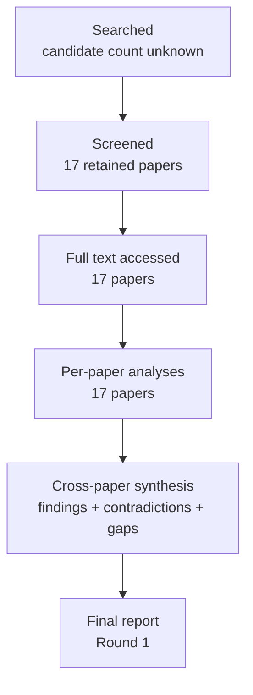

# Research Report: action items, requests, commitments, and decisions in workplace email and chat: extracting action, owner, object, deadline, conditions, and speech act with evidence

## Contents

- [Round History](#round-history)
- [Executive Summary](#executive-summary)
- [Research Question](#research-question)
- [Methodology](#methodology)
- [Papers Reviewed](#papers-reviewed)
- [Research Landscape](#research-landscape)
- [Confidence-Graded Findings](#confidence-graded-findings)
- [Research Gaps](#research-gaps)
- [Practical Recommendations](#practical-recommendations)
- [Evidence Map](#evidence-map)
- [References](#references)
- [Appendix: Run Metadata](#appendix-run-metadata)

## Round History

Iterative gap-closure loop (hard cap: 4 rounds). See `references/iterative-synthesis.md` for the full loop definition.

| Round | Run ID | Topic / Gap Focus | New Papers | Gaps Addressed | Remaining Gaps |
|-------|--------|-------------------|------------|----------------|----------------|
| 1 | a109ca6369e7 | action items, requests, commitments, and decisions in workplace email and chat: extracting action, owner, object, deadline, conditions, and speech evidence | 17 | initial shortlist | 5 academic, 4 engineering |

**Stop reason**: another round runs while open academic gaps remain and new papers appear

## Executive Summary

This review investigates how workplace communication can be converted into evidence-grounded structured records of requests, commitments, action items, decisions, approvals, proposals, deadlines, conditions, and responsible parties. Across 17 papers, the strongest [HIGH] finding is that flat “action/no-action” classification is insufficient: requests, commitments, proposals, deliveries, decisions, and related acts need to remain distinguishable, while structured action representations should preserve arguments such as owner, task description, timeframe, conditions, and supporting evidence [doi-10-1109-hicss-2006-528] [doi-10-1145-1076034-1076094] [manual-20b8cd2fdd] [doi-10-1007-11965152-18]. The evidence also strongly supports explicit handling of indirectness, conditionality, negation/modality, contextual evidence, quoted-message contamination, and ambiguity rather than relying on surface verbs or dates [manual-0839b98ee7] [manual-d19b0f6f1e] [manual-cd3fa58e4c] [2106.08037] [manual-ee40d588e3].

The most significant gap is that no reviewed paper jointly validates speech-act type, owner, action object, deadline, conditions/exceptions, and exact evidence spans on authentic modern workplace email or enterprise chat. Direct workplace-email evidence is strongest for request/commitment distinctions, message zoning, annotation ambiguity, and conditional or indirect acts; meeting and dialogue research supplies useful but transfer-only evidence for structured action items, decisions, context modeling, owners, and timeframes. The complete proposed extraction schema is therefore [MEDIUM] confidence, while claims about production accuracy on contemporary Outlook or Microsoft Teams remain [LOW] confidence until direct domain evaluation is performed.

**Scope**: 17 papers analyzed from 5 source/host families over 2000–2023  
**Overall Confidence**: Medium  
**Verdict**: HAS_GAPS

## Research Question

The review asks:

> What representation and extraction strategy is supported by empirical NLP research for identifying work-relevant requests, commitments, action items, decisions, approvals, proposals, and related acts in workplace email or chat while preserving actor/owner, action object, recipient or beneficiary, deadline/timeframe, conditions or exceptions, modality, and exact source evidence?

The target representation can be expressed as:

$E = (y, a, o, r, d, c, m, s, q)$

where:

- $y$ = speech-act/event type;
- $a$ = actor or owner;
- $o$ = action object or task description;
- $r$ = recipient, beneficiary, or target;
- $d$ = original and, when justified, normalized deadline/timeframe;
- $c$ = conditions, prerequisites, or exceptions;
- $m$ = modality/status at utterance time;
- $s$ = source evidence span or spans;
- $q$ = confidence and unresolved-field metadata.

A missing field should remain explicitly unresolved, represented conceptually as $\bot$, rather than being filled by unsupported inference.

Included scope covers semantic extraction and classification at utterance/message time. It includes action-item detection, request/commitment recognition, decision-related dialogue acts, action arguments, conditionality, modality, negation, temporal linkage, message zoning, and contextual evidence. It excludes later lifecycle-state tracking such as whether an accepted action was subsequently completed, revoked, contradicted, or superseded. It also excludes action execution and draft generation.

Antecedent/reference scope is treated as an upstream input: identifying an act such as “approved” does not by itself establish which proposition was approved.

## Methodology

### Search Strategy

- **Sources**: arXiv, ACL Anthology, ResearchGate-hosted full text, CMU-hosted author PDFs, and University of Sheffield-hosted author material.
- **Query variants**:
  - `action items, requests, commitments, decisions workplace email chat: extracting action, owner, object, deadline, conditions, speech evidence`
  - `action items, requests,`
  - `action commitments, decisions workplace email chat: extracting action, owner, object, deadline, conditions, speech evidence`
  - `items, commitments, decisions workplace email chat: extracting action, owner, object, deadline, conditions, speech evidence`
  - `requests, commitments, decisions workplace email chat: extracting action, owner, object, deadline, conditions, speech evidence`
  - `action items, requests, commitments, decisions`
  - `action items, requests, workplace email`
  - `action items, requests, chat: extracting`
- **Time window**: 2000–2023 among the 17 reviewed papers.
- **Screening**: 17 papers were retained for deep analysis. The exact candidate-pool size and retrieval-ranking procedure were not supplied in the final-report input and are therefore recorded as unknown rather than reconstructed.
- **Evidence handling**: the pipeline's per-paper analyses were produced from reads performed through the host's web tool. The supplied access records report `full_text` access for every reviewed paper. This final report synthesizes the supplied per-paper analyses and cross-paper synthesis; it did not independently re-read the papers during the report-writing step.

Access level by paper:

| Paper ID | Access Level | Host/source used by pipeline |
|---|---|---|
| `manual-fde6beef40` | full_text | ResearchGate |
| `manual-ee40d588e3` | full_text | ACL Anthology |
| `manual-cd3fa58e4c` | full_text | ACL Anthology |
| `doi-10-1007-11965152-18` | full_text | ResearchGate |
| `doi-10-18653-v1-2007-sigdial-1-4` | full_text | ACL Anthology |
| `doi-10-3115-1564535-1564540` | full_text | ACL Anthology |
| `doi-10-3115-1708376-1708410` | full_text | ACL Anthology |
| `2303.16763` | full_text | arXiv |
| `manual-0839b98ee7` | full_text | ResearchGate |
| `manual-20b8cd2fdd` | full_text | ACL Anthology |
| `manual-d19b0f6f1e` | full_text | ResearchGate |
| `doi-10-1109-hicss-2006-528` | full_text | ResearchGate |
| `manual-1e8332286e` | full_text | University of Sheffield |
| `manual-01c535c108` | full_text | arXiv |
| `doi-10-1145-1076034-1076094` | full_text | CMU author-hosted PDF |
| `doi-10-1145-1076034-1076140` | full_text | CMU author-hosted PDF |
| `2106.08037` | full_text | arXiv |

### Pipeline Summary

| Metric | Count |
|--------|-------|
| Total candidates | unknown |
| After screening | 17 retained for review |
| Downloaded | unknown; full text was accessible for all 17 |
| Successfully converted | unknown |
| Deeply analyzed | 17 |
| Iterations (if system-building) | 1 |

The synthesis distinguishes direct target-domain evidence from transfer and component evidence. Workplace-email studies are treated as direct evidence for the phenomena they annotate. Meeting and spoken-dialogue studies are treated as transfer evidence when used to motivate action-item or decision structures. TimeML, modality, and negation work are treated as component evidence rather than validation of a complete workplace-action extractor.

## Papers Reviewed

| # | Title | Authors | Year | Venue | Quality Score | Relevance |
|---|-------|---------|------|-------|--------------|-----------|
| 1 | Classifying Action Items for Semantic Email [manual-fde6beef40] | Simon Scerri, Gerhard Gossen, Brian Davis et al. | 2010 | unknown | unknown | HIGH |
| 2 | *SEM 2012 Shared Task: Resolving the Scope and Focus of Negation [manual-ee40d588e3] | Roser Morante, Eduardo Blanco | 2012 | *SEM 2012 Shared Task | unknown | MEDIUM |
| 3 | Detecting Emails Containing Requests for Action [manual-cd3fa58e4c] | Andrew Lampert, Robert Dale, Cecile Paris | 2010 | unknown | unknown | HIGH |
| 4 | Detecting Action Items in Multi-party Meetings: Annotation and Initial Experiments [doi-10-1007-11965152-18] | Matthew Purver, Patrick Ehlen, John Niekrasz | 2006 | unknown | unknown | HIGH |
| 5 | Detecting and Summarizing Action Items in Multi-Party Dialogue [doi-10-18653-v1-2007-sigdial-1-4] | Matthew Purver, John Dowding, John Niekrasz et al. | 2007 | unknown | unknown | HIGH |
| 6 | Shallow Discourse Structure for Action Item Detection [doi-10-3115-1564535-1564540] | Matthew Purver, Patrick Ehlen, John Niekrasz | 2006 | unknown | unknown | HIGH |
| 7 | Extracting Decisions from Multi-Party Dialogue Using Directed Graphical Models and Semantic Similarity [doi-10-3115-1708376-1708410] | Trung Bui, Matthew Frampton, John Dowding et al. | 2009 | unknown | unknown | HIGH |
| 8 | Meeting Action Item Detection with Regularized Context Modeling [2303.16763] | Jiaqing Liu, Chong Deng, Qinglin Zhang et al. | 2023 | unknown | unknown | HIGH |
| 9 | Can Requests-for-Action and Commitments-to-Act be Reliably Identified in Email Messages? [manual-0839b98ee7] | Andrew Lampert, Cécile Paris, Robert Dale | 2007 | unknown | unknown | HIGH |
| 10 | Requests and Commitments in Email are More Complex Than You Think: Eight Reasons to be Cautious [manual-20b8cd2fdd] | Andrew Lampert, Robert Dale, Cécile Paris | 2008 | unknown | unknown | HIGH |
| 11 | The nature of requests and commitments in email messages [manual-d19b0f6f1e] | Andrew Lampert, Robert Dale, Cécile Paris | 2008 | unknown | unknown | HIGH |
| 12 | Using Speech Acts to Categorize Email and Identify Email Genres [doi-10-1109-hicss-2006-528] | Jade Goldstein, Roberta Evans Sabin | 2006 | unknown | unknown | HIGH |
| 13 | TimeML: Robust Specification of Event and Temporal Expressions in Text [manual-1e8332286e] | James Pustejovsky, José Castaño, Robert Ingria et al. | 2003 | unknown | unknown | MEDIUM |
| 14 | Dialogue act modeling for automatic tagging and recognition of conversational speech [manual-01c535c108] | Andreas Stolcke, Klaus Ries, Noah Coccaro et al. | 2000 | unknown | unknown | MEDIUM |
| 15 | On the collective classification of email "speech acts" [doi-10-1145-1076034-1076094] | Vitor R. Carvalho, William W. Cohen | 2005 | unknown | unknown | HIGH |
| 16 | Detecting Action-Items in E-mail [doi-10-1145-1076034-1076140] | Paul N. Bennett, Jaime G. Carbonell | 2005 | unknown | unknown | HIGH |
| 17 | The Possible, the Plausible, and the Desirable: Event-Based Modality Detection for Language Processing [2106.08037] | Valentina Pyatkin, Shoval Sadde, Aynat Rubinstein et al. | 2021 | unknown | unknown | MEDIUM |

## Research Landscape

### Theme 1: Speech-act type and action arguments are distinct problems

**Coverage**: 6 directly relevant papers | **Confidence**: High  
**Supporting papers**: [doi-10-1109-hicss-2006-528], [doi-10-1145-1076034-1076094], [manual-20b8cd2fdd], [manual-0839b98ee7], [manual-d19b0f6f1e], [manual-fde6beef40]

[HIGH] Email research does not support reducing work-relevant communication to one flat “action” category. Different taxonomies distinguish requests, commitments, proposals and other communicative acts, and one communicative episode may legitimately participate in more than one functional interpretation [doi-10-1109-hicss-2006-528] [doi-10-1145-1076034-1076094] [manual-20b8cd2fdd].

This matters for msgloom because a request made to the user and a commitment made by somebody else can refer to similar underlying work while imposing very different obligations. A third-party commitment may also function pragmatically as a request to another recipient, so forcing a single mutually exclusive label can discard relevant information [manual-20b8cd2fdd].

Key findings:

1. [HIGH] Requests and commitments should remain distinct act types rather than being collapsed into an undifferentiated action class [manual-0839b98ee7] [manual-d19b0f6f1e] [manual-20b8cd2fdd].
2. [HIGH] Multi-label or otherwise non-exclusive representation is justified for cases where one communicative unit performs overlapping functions [doi-10-1145-1076034-1076094] [manual-20b8cd2fdd].
3. [MEDIUM] Action-item detection can complement speech-act classification, but detecting an actionable sentence does not by itself supply all semantic arguments required by the target schema [manual-fde6beef40] [doi-10-1145-1076034-1076140].

### Theme 2: Structured action representations are more informative than flat labels

**Coverage**: 4 papers | **Confidence**: High  
**Supporting papers**: [doi-10-1007-11965152-18], [doi-10-3115-1564535-1564540], [doi-10-18653-v1-2007-sigdial-1-4], [2303.16763]

[HIGH] Meeting action-item research repeatedly separates the existence of an action item from its internal components, including task description, responsible person, timeframe, and agreement or commitment evidence. Evidence for a single action may be distributed across multiple utterances rather than expressed in one self-contained sentence [doi-10-1007-11965152-18] [doi-10-3115-1564535-1564540] [doi-10-18653-v1-2007-sigdial-1-4].

The transfer implication is that an evidence-preserving workplace extractor should expose separately assessable arguments rather than produce only a binary action label. However, these meeting results are not direct validation on Outlook or Teams.

Key findings:

1. [HIGH] Task description, owner, timeframe, and agreement/commitment are useful separable components of an action item [doi-10-1007-11965152-18] [doi-10-18653-v1-2007-sigdial-1-4].
2. [HIGH] Evidence from nearby discourse structure can be necessary to construct the complete action representation [doi-10-3115-1564535-1564540] [doi-10-18653-v1-2007-sigdial-1-4].
3. [HIGH] Owner identification is a persistent weak point and should not be silently inferred merely to create a complete record [doi-10-1007-11965152-18] [doi-10-3115-1564535-1564540].

### Theme 3: Context helps, but indiscriminate context expansion is unsafe

**Coverage**: 4 papers | **Confidence**: High  
**Supporting papers**: [2303.16763], [manual-01c535c108], [doi-10-1145-1076034-1076094], [manual-20b8cd2fdd]

[HIGH] Context can materially improve classification where acts are indirect, discourse-dependent, or spread over several turns, but the benefit varies by task, act type, and dataset. Meeting action-item detection and general dialogue-act tagging benefit from contextual modeling in several settings [2303.16763] [manual-01c535c108]. In contrast, collective email-act classification shows that contextual information can degrade particular classes, and different meeting datasets favor different context configurations [doi-10-1145-1076034-1076094] [2303.16763].

Key findings:

1. [HIGH] Sentence-local extraction alone is insufficient for some indirect or distributed requests and commitments [manual-20b8cd2fdd] [manual-0839b98ee7].
2. [HIGH] More context is not monotonically better; context policy should be evaluated per act and argument [2303.16763] [doi-10-1145-1076034-1076094].
3. [MEDIUM] A context-gating architecture is better motivated by the evidence than unconditional whole-thread expansion, but the exact gate remains an engineering question rather than a validated literature result.

### Theme 4: Localization and whole-message judgment solve different problems

**Coverage**: 2 papers | **Confidence**: High  
**Supporting papers**: [doi-10-1145-1076034-1076140], [manual-20b8cd2fdd]

[HIGH] Fine-grained localization is valuable because it identifies the text supporting an action, yet the linguistic locus of a request or commitment can be ambiguous. Sentence-level action-item classification improved document detection in one email study, while later request/commitment annotation found higher reliability at message level because one underlying act can be realized across multiple sentences [doi-10-1145-1076034-1076140] [manual-20b8cd2fdd].

Key findings:

1. [HIGH] Message-level act judgment and span-level evidence localization should be treated as complementary objectives, not competing alternatives [doi-10-1145-1076034-1076140] [manual-20b8cd2fdd].
2. [HIGH] Exact supporting evidence may comprise multiple spans rather than one sentence [manual-20b8cd2fdd].
3. [MEDIUM] A production schema should therefore support one semantic event linked to multiple evidence spans.

### Theme 5: Conditionality, modality, and negation must be attached to the affected event

**Coverage**: 5 papers | **Confidence**: High  
**Supporting papers**: [manual-0839b98ee7], [manual-20b8cd2fdd], [manual-d19b0f6f1e], [2106.08037], [manual-ee40d588e3]

[HIGH] Conditional offers, implicit requests, exceptions, modality, and negation are not peripheral details because they can change whether an apparent action constitutes an obligation. Email studies identify conditional and implicit cases as sources of disagreement and show that the governing condition may occur outside the same sentence as the request or commitment [manual-0839b98ee7] [manual-20b8cd2fdd] [manual-d19b0f6f1e].

Component research independently shows that detecting a modal or negation cue is easier than resolving its semantic contribution and scope. Event-based modality detection becomes harder when moving beyond a small closed trigger list, while negation scope/focus resolution is substantially richer than cue detection [2106.08037] [manual-ee40d588e3].

Key findings:

1. [HIGH] Conditionality should be represented as an argument or modifier of the governed action, not as detached surrounding text [manual-0839b98ee7] [manual-d19b0f6f1e].
2. [HIGH] A negation or modal trigger should not independently determine whether an obligation exists without resolving what event it governs [2106.08037] [manual-ee40d588e3].
3. [HIGH] Conditional and negated actions require tests that bind semantic scope to the correct action when several actions occur together.

### Theme 6: Temporal extraction is necessary but does not equal deadline extraction

**Coverage**: 3 papers | **Confidence**: Medium  
**Supporting papers**: [manual-1e8332286e], [doi-10-18653-v1-2007-sigdial-1-4], [manual-d19b0f6f1e]

[MEDIUM] TimeML provides machinery for representing events, temporal expressions, and relations between them, while meeting action-item research uses temporal information for timeframe extraction [manual-1e8332286e] [doi-10-18653-v1-2007-sigdial-1-4]. Direct email request/commitment work, however, did not establish a complete deadline-extraction solution and explicitly leaves deadline-related extension work outside its validated results [manual-d19b0f6f1e].

A robust pipeline therefore needs to distinguish four operations:

1. [HIGH] detect a temporal expression;
2. [MEDIUM] normalize it where justified;
3. [MEDIUM] link it to the relevant action/event;
4. [LOW] determine whether that linked time semantically functions as a deadline in contemporary workplace communication.

Only the earlier component operations receive substantial support from the reviewed corpus.

### Theme 7: Message zoning reduces contamination but cannot replace provenance

**Coverage**: 2 papers | **Confidence**: High  
**Supporting papers**: [manual-cd3fa58e4c], [manual-20b8cd2fdd]

[HIGH] Separating newly authored message content from quoted history, forwards, signatures, and other non-author zones materially improved request-containing-email detection in the reviewed email work [manual-cd3fa58e4c]. Nevertheless, zoning errors, implicit requests, attachments, and cross-message interpretation remain failure modes [manual-cd3fa58e4c] [manual-20b8cd2fdd].

Key findings:

1. [HIGH] Quoted-history contamination can cause false action detection and should be modeled explicitly [manual-cd3fa58e4c].
2. [HIGH] Prior-message text should remain available with provenance because context can still be necessary to interpret the current author's act [manual-20b8cd2fdd].
3. [MEDIUM] Irreversible deletion of quoted/history text is therefore poorly aligned with an evidence-preserving architecture.

### Theme 8: Decisions benefit from structured dialogue modeling, but direct email evidence is thin

**Coverage**: 2 papers | **Confidence**: Medium  
**Supporting papers**: [doi-10-3115-1708376-1708410], [doi-10-1109-hicss-2006-528]

[HIGH] In meeting dialogue, decision extraction benefited from modeling Issue, Resolution Proposal, Resolution Restatement, and Agreement as related discourse states [doi-10-3115-1708376-1708410]. Email speech-act taxonomies demonstrate that decision-related communicative distinctions exist in email, but the reviewed corpus does not directly validate structured extraction of decision, approval, rejection, or proposal arguments from authentic modern workplace email/chat [doi-10-1109-hicss-2006-528].

Key findings:

1. [HIGH] Decision understanding can require relations among proposal, restatement, and agreement rather than keyword detection [doi-10-3115-1708376-1708410].
2. [LOW] Direct production claims for structured approvals, rejections, or decisions in current enterprise email/chat are not supported by the reviewed corpus.

### Theme 9: Evaluation quality is constrained by sparse classes and ambiguous gold

**Coverage**: 6 papers | **Confidence**: High  
**Supporting papers**: [manual-0839b98ee7], [2303.16763], [2106.08037], [doi-10-1145-1076034-1076140], [doi-10-3115-1564535-1564540], [manual-20b8cd2fdd]

[HIGH] Annotation uncertainty is itself an important empirical result. Request presence can be comparatively reliable, but commitments, strength judgments, action components, and locus decisions can be harder to agree on [manual-0839b98ee7] [manual-20b8cd2fdd] [2303.16763]. Modality error analysis further shows that apparent model failures may sometimes expose annotation omissions or annotation errors [2106.08037].

Key findings:

1. [HIGH] Overall message accuracy is an inadequate sole metric where actionable positives are sparse or arguments have different difficulty [doi-10-1145-1076034-1076140] [doi-10-3115-1564535-1564540].
2. [HIGH] False obligations, missed obligations, wrong owners, wrong deadlines, and lost conditions should be separately measurable failure classes.
3. [MEDIUM] Evaluation gold should allow adjudicated uncertainty rather than requiring artificial certainty in genuinely ambiguous cases.

## Methodology Comparison

| Approach | Papers | Strengths | Weaknesses | Best For | Performance |
|----------|--------|-----------|------------|----------|-------------|
| Email speech-act classification | [doi-10-1109-hicss-2006-528], [doi-10-1145-1076034-1076094] | Distinguishes communicative functions; can use relational/contextual structure | Does not by itself extract full action arguments | Act-type identification | Results are dataset/class dependent; no single comparable metric supplied here |
| Email action-item classification | [doi-10-1145-1076034-1076140], [manual-fde6beef40] | Localizes actionable content; useful for document triage | Flat labels can omit owner, conditions and deadline semantics | Candidate action detection | Quantitative values not reproduced in supplied synthesis |
| Request/commitment annotation and detection | [manual-0839b98ee7], [manual-20b8cd2fdd], [manual-d19b0f6f1e], [manual-cd3fa58e4c] | Direct workplace-email evidence; exposes indirectness, conditionality, locus ambiguity and zoning effects | Mostly older email datasets; limited structured argument coverage | Request/commitment semantics in email | Annotation and detection difficulty varies by act and phenomenon |
| Structured meeting action-item extraction | [doi-10-1007-11965152-18], [doi-10-3115-1564535-1564540], [doi-10-18653-v1-2007-sigdial-1-4], [2303.16763] | Explicit task/owner/timeframe/agreement components; multi-utterance evidence | Transfer domain; owner remains difficult; context settings vary | Schema design and transfer experiments | Context can help, but gains are dataset dependent |
| Structured decision-dialogue modeling | [doi-10-3115-1708376-1708410] | Models issue/proposal/restatement/agreement relations | Does not extract target owner/deadline/condition schema; meeting transfer domain | Decision-discourse structure | Improved over the comparison model reported in the paper |
| Temporal event relation modeling | [manual-1e8332286e] | Separates events, temporal expressions, normalization and relations | Does not decide whether a workplace date is a deadline | Temporal component representation | Not a workplace-deadline benchmark |
| Event-based modality modeling | [2106.08037] | Attaches modality to events rather than relying only on narrow triggers | Broad trigger detection is difficult; not workplace specific | Capability/intention/possibility distinctions | Component-level evidence only |
| Negation cue/scope/focus modeling | [manual-ee40d588e3] | Makes scope explicit | Full scope/focus resolution is harder than cue detection; not workplace specific | Negated/exceptional action semantics | Component-level evidence only |
| General dialogue-act context modeling | [manual-01c535c108] | Demonstrates utility of sequential/discourse context | Spoken-dialogue transfer domain | Context-model design | Context improves tagging in the studied conversational setting |

## Confidence-Graded Findings

### 🟢 High Confidence (supported by 3+ papers with consistent results)

1. **[HIGH] Requests, commitments, proposals, deliveries, and related communicative acts should not be collapsed into one undifferentiated action label.** Email taxonomies distinguish these functions, and overlapping acts can legitimately occur [doi-10-1109-hicss-2006-528] [doi-10-1145-1076034-1076094] [manual-20b8cd2fdd].

2. **[HIGH] Structured action representations should separate the action description from owner, timeframe, and agreement/commitment evidence.** Meeting studies repeatedly employ these components and combine evidence across utterances [doi-10-1007-11965152-18] [doi-10-3115-1564535-1564540] [doi-10-18653-v1-2007-sigdial-1-4].

3. **[HIGH] Owner/assignee identification is a difficult argument-level problem rather than a trivial by-product of action detection.** The reviewed action-item work exposes weaker owner identification than the existence of an action itself [doi-10-1007-11965152-18] [doi-10-3115-1564535-1564540] [doi-10-18653-v1-2007-sigdial-1-4].

4. **[HIGH] Context is often necessary but should not be assumed to improve every act or dataset.** Meeting action-item and general dialogue-act studies show gains from context, while email collective classification and cross-dataset meeting results show that the best context policy varies [2303.16763] [manual-01c535c108] [doi-10-1145-1076034-1076094].

5. **[HIGH] Conditional and indirect requests or commitments require explicit representation and can depend on evidence outside the act sentence.** Conditional offers and implicit requests are documented sources of annotation and interpretation difficulty [manual-0839b98ee7] [manual-20b8cd2fdd] [manual-d19b0f6f1e].

6. **[HIGH] Author/quoted/history zoning is useful for reducing false request detection but must preserve provenance and recoverable context.** Direct email evidence supports zoning while also identifying context-dependent and attachment-related failures [manual-cd3fa58e4c] [manual-20b8cd2fdd].

7. **[HIGH] Modality and negation require event/scope linkage rather than trigger-only semantics.** The component literature shows that identifying a modal or negation cue is materially simpler than determining what semantic event or scope it governs [2106.08037] [manual-ee40d588e3].

8. **[HIGH] Gold annotation ambiguity is a material part of the problem and should be reflected in evaluation design.** Difficult commitment, locus, action-item, and modality cases expose disagreement or annotation error rather than a universally objective easy label [manual-0839b98ee7] [manual-20b8cd2fdd] [2303.16763] [2106.08037].

9. **[HIGH] No reviewed paper jointly validates the complete target structure of act type, owner, object, deadline, conditions, and exact evidence spans on authentic workplace email or chat.** The direct and transfer studies each cover only subsets of the target representation [manual-d19b0f6f1e] [manual-cd3fa58e4c] [2303.16763] [doi-10-3115-1708376-1708410] [manual-1e8332286e].

### 🟡 Medium Confidence (supported by 1-2 papers or with caveats)

1. **[MEDIUM] Temporal expressions should be detected, normalized, and linked to actions before deciding that they constitute deadlines.** TimeML provides temporal relation machinery and meeting action-item research uses timeframe information, but direct workplace deadline binding is not validated [manual-1e8332286e] [doi-10-18653-v1-2007-sigdial-1-4].

2. **[MEDIUM] Message-level act judgment and evidence-span localization should be separate but linked outputs.** Sentence-level localization can aid detection, while message-level annotation can be more reliable for distributed requests or commitments [doi-10-1145-1076034-1076140] [manual-20b8cd2fdd].

3. **[MEDIUM] Structured Issue/Proposal/Restatement/Agreement modeling is a promising transfer pattern for workplace decisions.** It is supported in decision-dialogue research but not directly validated on enterprise email or chat [doi-10-3115-1708376-1708410].

4. **[MEDIUM] The complete proposed workplace-action schema is well motivated as a design representation but not yet directly validated as one end-to-end extraction task.** Its components receive support from different subliteratures rather than one unified benchmark [doi-10-1007-11965152-18] [manual-d19b0f6f1e] [manual-1e8332286e] [2106.08037].

### 🔴 Low Confidence (preliminary, single-source, or contradicted)

1. **[LOW] Any claim that the reviewed methods establish production accuracy for contemporary Outlook or Microsoft Teams would be weakly supported.** Direct email evidence is concentrated in older corpora, and the reviewed meeting/dialogue work is transfer evidence rather than modern enterprise-chat validation [manual-cd3fa58e4c] [manual-d19b0f6f1e] [2303.16763].

2. **[LOW] Automatic owner recovery from organizational or conversational context when the owner is omitted is not established by this corpus.** Owner identification is already difficult when structured action-item evidence is available, and implicit-owner recovery is an open gap [doi-10-1007-11965152-18] [doi-10-3115-1564535-1564540].

3. **[LOW] Reliable semantic binding of a date to the correct workplace action as its deadline is not established.** Temporal representation is supported, but action-specific deadline semantics remain insufficiently evidenced [manual-1e8332286e] [doi-10-18653-v1-2007-sigdial-1-4] [manual-d19b0f6f1e].

## Trade-Off Analysis

| Decision | Option A | Option B | Recommendation |
|----------|----------|----------|----------------|
| Flat action label vs structured event | Flat classification is simpler but loses owner, timeframe, conditions, and evidence semantics | Structured event keeps arguments independently assessable but requires more annotation and evaluation | [HIGH] Use a structured event representation with unresolved fields permitted [doi-10-1007-11965152-18] [doi-10-18653-v1-2007-sigdial-1-4] |
| Single label vs overlapping speech acts | One label simplifies downstream logic but can erase legitimate multifunctionality | Multi-label or layered act representation preserves overlapping pragmatic functions | [HIGH] Preserve distinguishable and, where justified, overlapping acts [doi-10-1145-1076034-1076094] [manual-20b8cd2fdd] |
| Sentence-only vs whole-thread context | Sentence-only reduces noise but misses indirect/distributed evidence | Whole-thread context adds evidence but can introduce irrelevant material and degrade some classes | [HIGH] Benchmark selective context expansion rather than fixing either extreme [2303.16763] [doi-10-1145-1076034-1076094] [manual-20b8cd2fdd] |
| Sentence annotation vs message judgment | Sentence-level annotation supports localization | Message-level judgment can better capture distributed acts and improve annotation agreement | [HIGH] Maintain message/event judgment plus one or more supporting spans [doi-10-1145-1076034-1076140] [manual-20b8cd2fdd] |
| Drop quoted history vs preserve everything equally | Dropping history reduces false positives but can remove required context | Treating all text equally invites quoted-message contamination | [HIGH] Zone content deterministically while preserving quoted/history text and provenance for selective retrieval [manual-cd3fa58e4c] [manual-20b8cd2fdd] |
| Trigger-based modality/negation vs event-scoped semantics | Trigger rules are simpler but overgeneralize | Scope/event linkage better captures whether the action is governed by capability, uncertainty, or negation | [HIGH] Link modality and negation to affected events [2106.08037] [manual-ee40d588e3] |
| Every date as deadline vs staged temporal interpretation | Direct date-to-deadline mapping is simple but creates false obligations | Detect, normalize, link, then classify deadline semantics | [MEDIUM] Use staged temporal interpretation and preserve uncertainty [manual-1e8332286e] [doi-10-18653-v1-2007-sigdial-1-4] |
| Fill missing fields vs preserve unknowns | Forced completion creates apparently executable but unsupported records | Explicit unknowns reduce false owner/deadline assignments at the cost of incomplete records | [MEDIUM] Preserve unknowns and evaluate recall impact in engineering tests [manual-0839b98ee7] [doi-10-1007-11965152-18] |

## Points of Agreement **[EVIDENCE REQUIRED]**

1. **[HIGH] Action semantics require distinctions among communicative functions rather than one flat action label.** This is supported by email speech-act classification and request/commitment analyses [doi-10-1109-hicss-2006-528] [doi-10-1145-1076034-1076094] [manual-20b8cd2fdd].

2. **[HIGH] Structured action-item representations should expose more than action existence.** Meeting studies repeatedly model description, owner, timeframe, and agreement/commitment separately [doi-10-1007-11965152-18] [doi-10-3115-1564535-1564540] [doi-10-18653-v1-2007-sigdial-1-4].

3. **[HIGH] Context can carry essential evidence outside a local sentence.** Indirect email requests, conditional acts, meeting action items, and dialogue acts all provide examples where wider discourse matters [manual-0839b98ee7] [manual-20b8cd2fdd] [2303.16763] [manual-01c535c108].

4. **[HIGH] Conditionality cannot safely be discarded when identifying work obligations.** Multiple email studies identify conditional offers or conditions as a source of complexity and annotation disagreement [manual-0839b98ee7] [manual-20b8cd2fdd] [manual-d19b0f6f1e].

5. **[HIGH] Argument-level evaluation is necessary because some components are harder than action detection itself.** Owner extraction and annotation ambiguity demonstrate why an aggregate label metric is insufficient [doi-10-1007-11965152-18] [doi-10-3115-1564535-1564540] [2303.16763].

6. **[HIGH] Evidence preprocessing affects semantic extraction quality.** Message zoning changes email request detection, while discourse/segmentation choices influence dialogue-based action or decision detection [manual-cd3fa58e4c] [doi-10-18653-v1-2007-sigdial-1-4] [doi-10-3115-1708376-1708410].

## Points of Contradiction **[EVIDENCE REQUIRED]**

1. **[HIGH] Whether additional discourse or thread context reliably improves classification**: contextual modeling improves action-item and dialogue-act results in several experiments [2303.16763] [manual-01c535c108], but collective email classification shows degradation for at least some email-act classes, and the strongest meeting-context configuration varies between datasets [doi-10-1145-1076034-1076094] [2303.16763].
   - **Possible explanation**: the usefulness of context depends on act type, dataset structure, local-vs-global evidence, and the amount of irrelevant material introduced.
   - **Implication**: context should be experimentally gated rather than globally assumed beneficial.

2. **[HIGH] Sentence-level versus message-level granularity**: sentence-level action-item classification improved document detection in one email experiment [doi-10-1145-1076034-1076140], while later request/commitment annotation found more reliable message-level judgments because the locus of a single act can span several sentences [manual-20b8cd2fdd].
   - **Possible explanation**: localization and semantic judgment optimize different objectives.
   - **Implication**: msgloom should not choose one granularity exclusively; it should link event-level judgments to evidence spans.

3. **[MEDIUM] Effect of speech-recognition errors on structured detection**: action-item detection degraded from manual transcripts to ASR in one multi-party dialogue study [doi-10-18653-v1-2007-sigdial-1-4], whereas some decision-dialogue configurations produced similar or higher ASR results, with the authors attributing the behavior partly to segmentation and sparsity differences [doi-10-3115-1708376-1708410].
   - **Possible explanation**: task labels, segmentation, dataset sparsity, and model assumptions differ.
   - **Implication**: ASR robustness from meeting transfer studies should not be generalized to chat/email or across extraction tasks.

## Research Gaps

All nine gaps below remain open after Round 1. The reviewed literature has not answered or closed them yet. The five academic gaps justify targeted literature follow-up; the four engineering gaps can be investigated experimentally without waiting for additional papers.

| # | Gap | Type | Severity | Rounds Already Searched | Impact on Goals |
|---|-----|------|----------|-------------------------|----------------|
| G1 | No direct modern workplace email/chat benchmark jointly annotates speech-act type, owner/assignee, action object, deadline, conditions/exceptions, and exact evidence spans | ACADEMIC | HIGH | Round 1 | Prevents direct validation of the complete target schema and production-domain recall |
| G2 | Direct empirical evidence for structured decisions, approvals, rejections, and proposals in authentic workplace email/chat is missing | ACADEMIC | HIGH | Round 1 | Risks false or missed decision obligations and incorrect interpretation of approvals |
| G3 | Owner/assignee extraction is weakly evidenced for implicit owners, group ownership, multiple owners/actions, and context-dependent responsibility | ACADEMIC | HIGH | Round 1 | Wrong owners can create false obligations or hide work requiring the user's response |
| G4 | Reliable binding of deadlines to the correct workplace action is not established | ACADEMIC | HIGH | Round 1 | A mentioned date can be falsely promoted to a deadline or attached to the wrong action |
| G5 | Direct workplace evidence is insufficient for attaching conditions, exceptions, negation, and modality to the correct action in multi-action text | ACADEMIC | HIGH | Round 1 | Lost scope can convert conditional/non-actions into false obligations |
| G6 | Independent argument-level/adversarial benchmark covering product-critical failure modes has not yet been built | ENGINEERING | HIGH | Round 1 | End-to-end false positives, false negatives, and per-argument failures cannot yet be measured for msgloom |
| G7 | Sentence-local, message-level, and selectively expanded thread-context extraction have not yet been compared under controlled ablations | ENGINEERING | HIGH | Round 1 | Context may either recover indirect acts or introduce false associations |
| G8 | Author/quoted/forwarded zoning has not yet been validated with provenance-preserving msgloom extraction | ENGINEERING | HIGH | Round 1 | Zoning can reduce contamination but may also hide context-dependent obligations |
| G9 | Uncertainty-preserving outputs with unresolved act/owner/deadline/condition fields have not yet been evaluated for recall versus false-obligation trade-offs | ENGINEERING | HIGH | Round 1 | Forced field completion can invent actionable structure, while excessive abstention can miss work |

### Academic Gaps (require more papers)

1. **[ACADEMIC] [HIGH] G1 — Complete modern workplace action schema benchmark**: The literature has not yet answered whether an authentic modern workplace email/chat benchmark exists that jointly annotates act type, owner, object, deadline, conditions/exceptions, and exact evidence spans. Round 1 searched this gap. Suggested query: `"action item extraction" workplace email chat owner assignee deadline condition span corpus` [manual-d19b0f6f1e] [manual-cd3fa58e4c] [2303.16763].

2. **[ACADEMIC] [HIGH] G2 — Structured decisions, approvals, rejections, and proposals**: The literature reviewed so far has not established direct structured extraction of these acts and their arguments in authentic workplace email/chat. Round 1 searched this gap. Suggested query: `"decision extraction" email workplace approval rejection proposal dialogue act` [doi-10-3115-1708376-1708410] [doi-10-1109-hicss-2006-528].

3. **[ACADEMIC] [HIGH] G3 — Owner/assignee extraction**: The literature has not yet answered how reliably implicit owners, collective owners, multiple actions with different owners, and context-recoverable responsibility can be extracted in the target domain. Round 1 searched this gap. Suggested query: `"assignee extraction" OR "owner extraction" action item email implicit argument responsibility` [doi-10-1007-11965152-18] [doi-10-3115-1564535-1564540] [manual-0839b98ee7].

4. **[ACADEMIC] [HIGH] G4 — Deadline binding**: The literature has not yet answered how to distinguish an action deadline from an unrelated date, shared temporal expression, scheduling mention, or conditional future time in workplace communication. Round 1 searched this gap. Suggested query: `"deadline extraction" email temporal relation action item due date event argument` [manual-1e8332286e] [doi-10-18653-v1-2007-sigdial-1-4] [manual-d19b0f6f1e].

5. **[ACADEMIC] [HIGH] G5 — Condition/modality/negation attachment in multi-action workplace text**: The reviewed literature has not yet directly established reliable attachment of conditions, exceptions, negation, and modality to the correct workplace action when multiple clauses/actions coexist. Round 1 searched this gap. Suggested query: `"conditional commitment" workplace email negation scope deontic modality action extraction` [manual-d19b0f6f1e] [manual-20b8cd2fdd] [2106.08037] [manual-ee40d588e3].

### Engineering Gaps (fillable without papers)

1. **[ENGINEERING] [HIGH] G6 — Independent argument-level benchmark**: This gap remains open after Round 1. Build gold independently from the system under test. Include implicit owners, multiple actions in one sentence, different owners, shared deadlines, conditional and negated actions, overlapping request/commitment labels, quoted-history contamination, ambiguous references, and attachment references. Score each argument separately plus end-to-end false positives and false negatives [manual-20b8cd2fdd] [manual-0839b98ee7] [doi-10-3115-1564535-1564540] [manual-cd3fa58e4c].

2. **[ENGINEERING] [HIGH] G7 — Context ablation**: This gap remains open after Round 1. Compare sentence-local, authored-message, bounded conversation window, and selectively expanded thread context using the same gold set. Measure which errors are recovered and which are introduced at every context level [2303.16763] [doi-10-1145-1076034-1076094] [manual-20b8cd2fdd].

3. **[ENGINEERING] [HIGH] G8 — Provenance-preserving zoning**: This gap remains open after Round 1. Test deterministic author/quoted/forwarded/signature zoning while keeping every original span recoverable. Measure both reductions in quoted-history false positives and losses caused by hiding context required for current-message interpretation [manual-cd3fa58e4c] [manual-20b8cd2fdd].

4. **[ENGINEERING] [HIGH] G9 — Uncertainty-preserving structured output**: This gap remains open after Round 1. Permit owner, deadline, condition, recipient, or act subtype to remain unresolved and compare this against forced completion. Measure false obligations, missed obligations, wrong owners, wrong deadlines, condition loss, and abstention rate [manual-0839b98ee7] [doi-10-1007-11965152-18] [2303.16763].

## Reproducibility Notes

The supplied per-paper analyses establish full-text access but do not supply a systematic audit of repository availability, dataset downloadability, or software/data licenses. Unknown fields are therefore left unknown rather than inferred.

| Paper | Code Available | Data Available | Sufficient Detail | License |
|-------|---------------|----------------|-------------------|---------|
| [manual-fde6beef40] | unknown | unknown | unknown | unknown |
| [manual-ee40d588e3] | unknown | unknown | unknown | unknown |
| [manual-cd3fa58e4c] | unknown | unknown | unknown | unknown |
| [doi-10-1007-11965152-18] | unknown | unknown | unknown | unknown |
| [doi-10-18653-v1-2007-sigdial-1-4] | unknown | unknown | unknown | unknown |
| [doi-10-3115-1564535-1564540] | unknown | unknown | unknown | unknown |
| [doi-10-3115-1708376-1708410] | unknown | unknown | unknown | unknown |
| [2303.16763] | unknown | unknown | unknown | unknown |
| [manual-0839b98ee7] | unknown | unknown | unknown | unknown |
| [manual-20b8cd2fdd] | unknown | unknown | unknown | unknown |
| [manual-d19b0f6f1e] | unknown | unknown | unknown | unknown |
| [doi-10-1109-hicss-2006-528] | unknown | unknown | unknown | unknown |
| [manual-1e8332286e] | unknown | unknown | unknown | unknown |
| [manual-01c535c108] | unknown | unknown | unknown | unknown |
| [doi-10-1145-1076034-1076094] | unknown | unknown | unknown | unknown |
| [doi-10-1145-1076034-1076140] | unknown | unknown | unknown | unknown |
| [2106.08037] | unknown | unknown | unknown | unknown |

For msgloom engineering, reproducibility should additionally require independent gold construction, separation of prediction inputs from evaluation-only future/context information, clean-workspace reruns, regression fixtures, and mutation tests. These requirements are project evaluation constraints rather than claims that the reviewed papers already implement them.

## Practical Recommendations **[EVIDENCE REQUIRED]**

1. **[HIGH] Keep request, commitment, proposal/decision-related acts, and action-item concepts distinguishable, with overlapping labels allowed where justified.** Email evidence demonstrates distinct communicative functions and legitimate multifunctional cases [doi-10-1109-hicss-2006-528] [doi-10-1145-1076034-1076094] [manual-20b8cd2fdd].  
   *Confidence*: High

2. **[HIGH] Store action records as separately assessable arguments rather than one generated sentence.** At minimum preserve act type, owner, object/action description, recipient/target when present, timeframe/deadline candidate, conditions/exceptions, modality, evidence spans, and uncertainty. Meeting action-item work supports explicit action components, while owner difficulty argues against silently completing missing fields [doi-10-1007-11965152-18] [doi-10-3115-1564535-1564540] [doi-10-18653-v1-2007-sigdial-1-4].  
   *Confidence*: High

3. **[HIGH] Preserve unknown values instead of inventing an owner, deadline, or act subtype.** Annotation ambiguity and owner difficulty make forced completion especially risky [manual-0839b98ee7] [doi-10-1007-11965152-18] [2303.16763].  
   *Confidence*: High for the need to represent uncertainty; Medium for the unmeasured product trade-off.

4. **[HIGH] Use context gating rather than unconditional whole-thread expansion.** Start with the local authored candidate and expand to message/thread context when indirectness, conditionality, owner resolution, or act disambiguation requires it. Benchmark each expansion level because more context does not uniformly help [2303.16763] [doi-10-1145-1076034-1076094] [manual-20b8cd2fdd].  
   *Confidence*: High

5. **[HIGH] Represent one semantic event with multiple evidence spans where necessary.** Message-level acts may be realized across more than one sentence, while local evidence remains important for traceability [doi-10-1145-1076034-1076140] [manual-20b8cd2fdd].  
   *Confidence*: High

6. **[HIGH] Attach conditions and exceptions to the action they govern, even when the condition appears elsewhere in the message.** Conditional offers and distributed conditions are documented sources of disagreement and semantic error [manual-0839b98ee7] [manual-d19b0f6f1e] [manual-20b8cd2fdd].  
   *Confidence*: High

7. **[HIGH] Attach modality and negation to affected events/scopes rather than interpreting cue presence as sufficient semantics.** Modality and negation component research shows why trigger-only methods are inadequate [2106.08037] [manual-ee40d588e3].  
   *Confidence*: High at component level

8. **[MEDIUM] Split deadline processing into temporal mention detection, normalization, event linking, and deadline-role classification.** The reviewed evidence directly supports temporal representation and timeframe extraction more strongly than the final semantic judgment that a time is a workplace deadline [manual-1e8332286e] [doi-10-18653-v1-2007-sigdial-1-4] [manual-d19b0f6f1e].  
   *Confidence*: Medium

9. **[HIGH] Apply deterministic message zoning without discarding source material.** Mark author-written, quoted, forwarded, signature, and attachment-reference regions; run default action extraction primarily against current authored content but retain previous regions for contextual retrieval and audit [manual-cd3fa58e4c] [manual-20b8cd2fdd].  
   *Confidence*: High

10. **[HIGH] Evaluate product-critical errors at argument level.** In addition to act-type precision/recall, explicitly measure missed obligations, false obligations, wrong owners, wrong action objects, wrong deadlines, lost conditions, incorrect negation/modality attachment, and unsupported evidence spans [doi-10-1145-1076034-1076140] [doi-10-3115-1564535-1564540] [2303.16763].  
    *Confidence*: High

A suitable structured evaluation loss can be conceptualized as:

$L = w_yL_y + w_aL_a + w_oL_o + w_dL_d + w_cL_c + w_sL_s$

where the component losses correspond respectively to act type, owner, object, deadline, condition, and evidence support. The weights $w_i$ should be product-defined rather than copied from the literature; no numerical values are established by this review.

11. **[MEDIUM] Keep semantic extraction separate from later lifecycle-state tracking.** An utterance-time commitment record should preserve what was said without prematurely deciding whether the work was later completed, revoked, or superseded. This is a project-scope boundary; the reviewed papers do not establish a complete downstream lifecycle architecture.  
    *Confidence*: Medium as a synthesis boundary, not an empirical performance claim.

12. **[HIGH] Do not interpret a correctly classified act as proof that its antecedent scope is correct.** Approval, rejection, agreement, or commitment labels still require correctly resolved proposition/reference scope supplied by upstream processing.  
    *Confidence*: High as a project integration requirement; not an independently validated finding of this Topic's paper corpus.

## Future Directions

1. Run a targeted academic round for modern workplace email/chat datasets that expose complete structured action arguments and exact evidence spans, prioritizing G1 over broad additional action-item literature.

2. Search specifically for structured extraction of decisions, approvals, rejections, and proposals in authentic enterprise communication, rather than relying further on generic dialogue-act taxonomies.

3. Search implicit-argument, semantic-role, assignee/responsibility, and organizational-context literature for evidence relevant to implicit owner recovery.

4. Search deadline-specific event-relation and temporal-role literature rather than generic temporal-expression extraction alone.

5. Search condition, exception, deontic-modality, and negation attachment literature with multi-event examples, while keeping direct workplace evidence distinct from transfer evidence.

6. Build the G6 independent benchmark before architecture commitment. Its adversarial cases should include:
   - implicit owner;
   - group owner;
   - multiple actions with different owners;
   - multiple actions sharing one deadline;
   - dates that are not deadlines;
   - conditional commitments;
   - conditional non-actions;
   - negated actions;
   - capability without commitment;
   - proposal without decision;
   - reviewed draft without approval;
   - overlapping request and commitment;
   - quoted prior obligations;
   - attachment-dependent requests;
   - multi-span evidence.

7. Run controlled context ablations for G7 and report both recovered obligations and context-induced false positives.

8. Evaluate uncertainty preservation for G9 using product-critical risk, not only aggregate extraction F-score.

## Readiness Assessment (System-Building Mode)

### Verdict: HAS_GAPS

### Assessment Summary

The synthesis is sufficient to define a defensible initial semantic representation and a rigorous engineering evaluation programme, but it is not sufficient to claim validated production extraction for modern workplace email/chat. The literature strongly supports separating act types, arguments, conditions, evidence, and uncertainty; however, owner extraction, deadline binding, structured decision-related acts, multi-action scope, and complete target-domain benchmarking remain unresolved.

Implementation can proceed as an experimentally validated prototype if unresolved fields remain explicit and the engineering gaps are treated as pre-production gates. Literature closure has not been reached because all five [ACADEMIC] gaps remain open after Round 1.

### Coverage Matrix

| Dimension | Status | Evidence |
|-----------|--------|----------|
| Architecture patterns | ⚠️ Partial | Structured action arguments, context modeling, message zoning, decision discourse, temporal/event components are motivated [doi-10-1007-11965152-18] [manual-cd3fa58e4c] [doi-10-3115-1708376-1708410] [manual-1e8332286e] |
| Technology stack | ❌ Missing | The reviewed synthesis does not establish a production implementation stack |
| Performance baselines | ⚠️ Partial | Individual studies provide task-specific experimental baselines, but there is no directly comparable full-schema modern workplace benchmark [2303.16763] [manual-cd3fa58e4c] [manual-d19b0f6f1e] |
| Security model | ❌ Missing | Security/privacy architecture is outside this literature review's empirical scope |
| Trade-off map | ✅ Sufficient for prototype experiments | Context, granularity, zoning, uncertainty, modality/negation, and structured-vs-flat representation have evidence-backed trade-offs [manual-20b8cd2fdd] [doi-10-1145-1076034-1076094] [manual-cd3fa58e4c] [2106.08037] |
| Act-type coverage | ⚠️ Partial | Requests/commitments and general email acts are directly evidenced; structured workplace approvals/rejections/decisions remain open [manual-0839b98ee7] [doi-10-1109-hicss-2006-528] |
| Owner extraction | ⚠️ Partial | Structured meeting work identifies the owner component but also its difficulty [doi-10-1007-11965152-18] [doi-10-3115-1564535-1564540] |
| Deadline extraction | ⚠️ Partial | Temporal and timeframe components exist, but semantic workplace deadline binding remains open [manual-1e8332286e] [doi-10-18653-v1-2007-sigdial-1-4] |
| Condition/modality/negation | ⚠️ Partial | Strong component and email-edge-case evidence; direct multi-action workplace attachment remains open [manual-d19b0f6f1e] [2106.08037] [manual-ee40d588e3] |
| Evidence traceability | ⚠️ Partial | Locus ambiguity and zoning motivate evidence spans/provenance, but complete span-grounded target benchmark is absent [manual-20b8cd2fdd] [manual-cd3fa58e4c] |
| Modern Outlook/Teams representativeness | ❌ Missing | No reviewed study validates the complete task on these production domains |

### Gap Resolution Plan

| # | Gap | Type | Severity | Resolution |
|---|-----|------|----------|------------|
| G1 | Complete modern workplace action-schema benchmark | ACADEMIC | HIGH | Round 2 targeted search for joint act/owner/object/deadline/condition/evidence-span datasets and systems |
| G2 | Structured workplace decisions/approvals/rejections/proposals | ACADEMIC | HIGH | Round 2 targeted decision/approval extraction search in email and enterprise chat |
| G3 | Owner/assignee extraction | ACADEMIC | HIGH | Search assignee extraction, responsibility extraction, implicit arguments, semantic roles, and organizational-context recovery |
| G4 | Deadline binding | ACADEMIC | HIGH | Search deadline-role extraction and event-time argument linking in email/task communication |
| G5 | Multi-action condition/modality/negation attachment | ACADEMIC | HIGH | Search workplace conditional commitments, deontic modality, exception/scope attachment, and event-scoped negation |
| G6 | Independent argument-level benchmark | ENGINEERING | HIGH | Build independent gold/adversarial fixture suite and report per-field plus end-to-end FP/FN |
| G7 | Context policy | ENGINEERING | HIGH | Controlled sentence/message/thread/selective-context ablation |
| G8 | Provenance-preserving zoning | ENGINEERING | HIGH | Compare extraction with and without deterministic authored/quoted/forwarded zoning while retaining all source spans |
| G9 | Uncertainty-preserving output | ENGINEERING | HIGH | Compare unresolved-field representation against forced completion using missed-work and false-obligation outcomes |

## Evidence Map

| Research Question Aspect | Direct Workplace Email Evidence | Meeting / Dialogue Transfer Evidence | Component Evidence | Current Coverage |
|--------------------------|---------------------------------|--------------------------------------|-------------------|------------------|
| Request vs commitment distinction | [manual-0839b98ee7], [manual-20b8cd2fdd], [manual-d19b0f6f1e], [doi-10-1109-hicss-2006-528] | — | — | Strong |
| Overlapping speech acts | [doi-10-1145-1076034-1076094], [manual-20b8cd2fdd] | — | — | Strong |
| Action-item detection | [manual-fde6beef40], [doi-10-1145-1076034-1076140] | [doi-10-1007-11965152-18], [doi-10-3115-1564535-1564540], [doi-10-18653-v1-2007-sigdial-1-4], [2303.16763] | — | Strong for detection; partial for complete arguments |
| Action object / task description | Partial evidence from action-item email studies [manual-fde6beef40] | Explicit action-item component [doi-10-1007-11965152-18] [doi-10-18653-v1-2007-sigdial-1-4] | — | Partial |
| Owner / assignee | Limited direct evidence [manual-0839b98ee7] | Explicit but difficult component [doi-10-1007-11965152-18] [doi-10-3115-1564535-1564540] | — | Weak-to-partial |
| Implicit owner | No adequate direct evidence identified | No adequate target-domain validation identified | — | Open G3 |
| Deadline / timeframe | Direct email work does not establish complete solution [manual-d19b0f6f1e] | Timeframe component [doi-10-18653-v1-2007-sigdial-1-4] | Event/time linking [manual-1e8332286e] | Partial; open G4 |
| Conditionality | Strong direct edge-case evidence [manual-0839b98ee7] [manual-20b8cd2fdd] [manual-d19b0f6f1e] | — | — | Strong need; attachment mechanics still open |
| Modality | Indirectly relevant to request/commitment interpretation [manual-d19b0f6f1e] | — | Event-based modality [2106.08037] | Partial |
| Negation | No complete workplace extraction evidence identified | — | Cue/scope/focus modeling [manual-ee40d588e3] | Partial |
| Message/thread context | Contextual email-act evidence [doi-10-1145-1076034-1076094] [manual-20b8cd2fdd] | Contextual action/dialogue evidence [2303.16763] [manual-01c535c108] | — | Strong evidence for trade-off; engineering policy open |
| Message zoning | Directly studied [manual-cd3fa58e4c] | — | — | Strong |
| Evidence-span localization | Locus ambiguity and sentence-level detection [manual-20b8cd2fdd] [doi-10-1145-1076034-1076140] | Distributed evidence [doi-10-3115-1564535-1564540] | — | Partial |
| Decision extraction | Email speech-act taxonomy only [doi-10-1109-hicss-2006-528] | Structured decision dialogue [doi-10-3115-1708376-1708410] | — | Transfer-supported; direct gap G2 |
| Approval / rejection / proposal arguments | Taxonomic/direct-email evidence incomplete [doi-10-1109-hicss-2006-528] | Proposal/agreement structure [doi-10-3115-1708376-1708410] | — | Open G2 |
| Exact complete target schema | No joint benchmark identified [manual-d19b0f6f1e] [manual-cd3fa58e4c] | Subsets only [2303.16763] [doi-10-3115-1708376-1708410] | Subcomponents only [manual-1e8332286e] [2106.08037] | Open G1 |
| Annotation ambiguity | Directly evidenced [manual-0839b98ee7] [manual-20b8cd2fdd] | Evidenced in action-item annotation [2303.16763] | Annotation-error evidence [2106.08037] | Strong |
| Modern enterprise chat | No adequate direct evidence identified | Meeting transfer only [2303.16763] | — | Open |

## References

1. [manual-fde6beef40] — Classifying Action Items for Semantic Email. Simon Scerri, Gerhard Gossen, Brian Davis et al. 2010.
2. [manual-ee40d588e3] — *SEM 2012 Shared Task: Resolving the Scope and Focus of Negation. Roser Morante, Eduardo Blanco. 2012.
3. [manual-cd3fa58e4c] — Detecting Emails Containing Requests for Action. Andrew Lampert, Robert Dale, Cecile Paris. 2010.
4. [doi-10-1007-11965152-18] — Detecting Action Items in Multi-party Meetings: Annotation and Initial Experiments. Matthew Purver, Patrick Ehlen, John Niekrasz. 2006.
5. [doi-10-18653-v1-2007-sigdial-1-4] — Detecting and Summarizing Action Items in Multi-Party Dialogue. Matthew Purver, John Dowding, John Niekrasz et al. 2007.
6. [doi-10-3115-1564535-1564540] — Shallow Discourse Structure for Action Item Detection. Matthew Purver, Patrick Ehlen, John Niekrasz. 2006.
7. [doi-10-3115-1708376-1708410] — Extracting Decisions from Multi-Party Dialogue Using Directed Graphical Models and Semantic Similarity. Trung Bui, Matthew Frampton, John Dowding et al. 2009.
8. [2303.16763] — Meeting Action Item Detection with Regularized Context Modeling. Jiaqing Liu, Chong Deng, Qinglin Zhang et al. 2023.
9. [manual-0839b98ee7] — Can Requests-for-Action and Commitments-to-Act be Reliably Identified in Email Messages? Andrew Lampert, Cécile Paris, Robert Dale. 2007.
10. [manual-20b8cd2fdd] — Requests and Commitments in Email are More Complex Than You Think: Eight Reasons to be Cautious. Andrew Lampert, Robert Dale, Cécile Paris. 2008.
11. [manual-d19b0f6f1e] — The nature of requests and commitments in email messages. Andrew Lampert, Robert Dale, Cécile Paris. 2008.
12. [doi-10-1109-hicss-2006-528] — Using Speech Acts to Categorize Email and Identify Email Genres. Jade Goldstein, Roberta Evans Sabin. 2006.
13. [manual-1e8332286e] — TimeML: Robust Specification of Event and Temporal Expressions in Text. James Pustejovsky, José Castaño, Robert Ingria et al. 2003.
14. [manual-01c535c108] — Dialogue act modeling for automatic tagging and recognition of conversational speech. Andreas Stolcke, Klaus Ries, Noah Coccaro et al. 2000.
15. [doi-10-1145-1076034-1076094] — On the collective classification of email "speech acts". Vitor R. Carvalho, William W. Cohen. 2005.
16. [doi-10-1145-1076034-1076140] — Detecting Action-Items in E-mail. Paul N. Bennett, Jaime G. Carbonell. 2005.
17. [2106.08037] — The Possible, the Plausible, and the Desirable: Event-Based Modality Detection for Language Processing. Valentina Pyatkin, Shoval Sadde, Aynat Rubinstein et al. 2021.

## Appendix: Run Metadata

- **Run ID**: a109ca6369e7
- **Round**: 1 of at most 4
- **Topic**: action items, requests, commitments, and decisions in workplace email and chat: extracting action, owner, object, deadline, conditions, and speech act with evidence
- **Papers reviewed**: 17
- **Open gaps after Round 1**: 5 academic, 4 engineering
- **Sources**: arXiv, ACL Anthology, ResearchGate, CMU-hosted author PDFs, University of Sheffield-hosted author material
- **Access**: all 17 reviewed papers recorded as `full_text` through the host's web tool
- **Pipeline version**: unknown
- **Date**: 2026-09-16
- **Artifacts**: `runs/a109ca6369e7/`
- **Stop reason**: another round runs while open academic gaps remain and new papers appear
- **Important evidence boundary**: direct workplace-email evidence, meeting/dialogue transfer evidence, and temporal/modality/negation component evidence are not treated as interchangeable.
- **Readiness**: HAS_GAPS; sufficient for an uncertainty-preserving prototype representation and engineering benchmark design, insufficient for claims of validated production accuracy on contemporary Outlook or Microsoft Teams.
