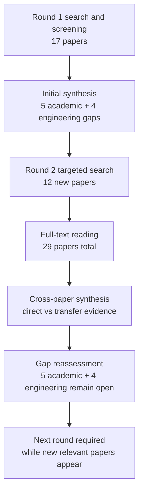

# Research Report: Empirical Workplace Email and Chat Studies on Structured Action and Decision Extraction

## Contents

- [Round History](#round-history)
- [Executive Summary](#executive-summary)
- [Research Question](#research-question)
- [Methodology](#methodology)
- [Papers Reviewed](#papers-reviewed)
- [Research Landscape](#research-landscape)
- [Confidence-Graded Findings](#confidence-graded-findings)
- [Research Gaps](#research-gaps)
- [Practical Recommendations](#practical-recommendations)
- [Evidence Map](#evidence-map)
- [References](#references)
- [Appendix: Run Metadata](#appendix-run-metadata)

## Round History

Iterative gap-closure loop (hard cap: 4 rounds). See
`references/iterative-synthesis.md` for the full loop definition.

| Round | Run ID | Topic / Gap Focus | New Papers | Gaps Addressed | Remaining Gaps |
|-------|--------|-------------------|------------|----------------|----------------|
| 1 | a109ca6369e7 | action items, requests, commitments, and decisions in workplace email and chat: extracting action, owner, object, deadline, conditions, and speech act with evidence | 17 | initial shortlist | 5 academic, 4 engineering |
| 2 | fb59b34c3d44 | empirical workplace email and chat studies on structured action and decision extraction, focusing owner assignment, deadline-to-action binding, conditional or negated obligations, evidence-span annotation | 12 | academic gaps of the previous round | 5 academic, 4 engineering |

**Stop reason**: another round runs while open academic gaps remain and new papers appear

## Executive Summary

This review investigates whether empirical NLP research supports extracting work-relevant requests, commitments, action items, proposals, approvals, decisions, owners, deadlines, conditions, polarity, and exact evidence from workplace email and chat. Across 29 papers published from 2000 through 2024, the strongest direct evidence shows that request, commitment, action-item, contextual-intent, and assignee detection are feasible in workplace email, while meeting and adjacent-domain studies provide useful transfer evidence for structured action components, temporal relations, modality, negation scope, and event arguments [2005.13084] [doi-10-1145-3289600-3290984] [doi-10-1145-3331184-3331260] [doi-10-18653-v1-w18-6104] [doi-10-1007-11965152-18]. [HIGH]

The strongest finding is that a workplace action cannot safely be represented as only a message-level intent label: responsibility, action content, temporal information, conditions, modality/polarity, and provenance are separable arguments, and multiple actions or overlapping acts may occur within one message [doi-10-1007-11965152-18] [doi-10-1145-3331184-3331260] [doi-10-18653-v1-w18-6104] [manual-20b8cd2fdd]. [HIGH] The most significant unresolved gap is that no reviewed study jointly validates speech-act type, owner, action object, deadline-to-action relation, conditions/exceptions, polarity, and exact provenance in authentic modern workplace email or enterprise chat. [HIGH]

Transfer evidence is considerably stronger than direct workplace evidence for negation scope, modality, temporal relations, scattered/implicit arguments, and structured decision extraction, so these mechanisms are suitable for design hypotheses and engineering tests but do not establish production-email accuracy [doi-10-1186-1471-2105-9-s11-s9] [manual-ee40d588e3] [manual-1e8332286e] [2410.03594] [doi-10-3115-1708376-1708410]. [HIGH] Topic 04's proposition-scope result remains an external prerequisite: a correct Topic 05 act label must not be interpreted as proof that the act was attached to the correct antecedent proposition. [HIGH]

**Scope**: 29 papers analyzed from 7 access-source/domain families over 2000-2024  
**Overall Confidence**: Medium  
**Verdict**: HAS_GAPS

## Research Question

The review investigated:

> What empirical evidence supports structured extraction of work-relevant actions, requests, commitments, proposals, approvals, rejections, and decisions from workplace email and chat, with particular emphasis on owner assignment, deadline-to-action binding, conditional or negated obligations, and exact evidence provenance?

The target representation is an argument-bearing event rather than a flat intent label:

\[
E =
(\text{type},\text{owner},\text{object},\text{recipient},
\text{deadline},\text{conditions},\text{polarity/modality},
\text{evidence},\text{confidence})
\]

Each field may be unresolved. In particular, an absent owner or deadline must remain unknown rather than being invented.

In scope:

- requests, commitments, promises, assignments, action items, decisions, approvals, rejections, and proposals;
- explicit and implicit owner/assignee identification;
- multiple actions or multiple speech acts in one message;
- action-specific deadline relations rather than generic date extraction;
- conditionality, prerequisites, exceptions, prohibitions, modality, and negation;
- direct, discontinuous, scattered, or inferred provenance;
- contextual interpretation across sentence, message, and selectively used conversation context;
- direct workplace email/chat evidence and clearly labeled transfer evidence from meetings, dialogue, temporal/event extraction, modality, and negation research.

Out of scope:

- deciding which antecedent proposition an approval, answer, rejection, or commitment applies to; that remains Topic 04;
- tracking whether an extracted commitment is later completed, revoked, contradicted, or superseded; that belongs to Topic 06;
- executing extracted actions;
- generic urgency or sentiment classification;
- treating every temporal expression as a deadline;
- treating a proposal or intention as a confirmed decision.

## Methodology

### Search Strategy

- **Sources**: arXiv, ACL Anthology, ACM-hosted or author-hosted publication copies, Microsoft Research, Springer, ResearchGate, and university-hosted author PDFs.
- **Query variants**:
  - `empirical workplace email chat studies structured decision extraction, focusing owner assignment, deadline-to-action binding, conditional negated obligations, evidence-span annotation`
  - `empirical workplace email`
  - `empirical chat studies structured decision extraction, focusing owner assignment, deadline-to-action binding, conditional negated obligations, evidence-span annotation`
  - `workplace chat studies structured decision extraction, focusing owner assignment, deadline-to-action binding, conditional negated obligations, evidence-span annotation`
  - `email chat studies structured decision extraction, focusing owner assignment, deadline-to-action binding, conditional negated obligations, evidence-span annotation`
  - `empirical workplace email chat studies`
  - `empirical workplace email structured decision`
  - `empirical workplace email extraction, focusing`
- **Time window**: 2000-2024 for the reviewed corpus.
- **Screening**: iterative literature-review pipeline with targeted gap follow-up; Round 2 specifically targeted the academic gaps carried from Round 1.
- **Evidence policy**: direct authentic workplace email/chat evidence was distinguished from transfer evidence. Transfer evidence was used to motivate representations and experiments, not to claim production workplace accuracy.
- **Reading method**: all reviewed papers were read through the host's web tool. The access level supplied by the pipeline was `full_text` for every paper.

### Paper Access Levels

| Paper | Access Level | Access Route |
|---|---|---|
| [1410.4868] | full_text | arXiv HTML |
| [1909.10094] | full_text | arXiv HTML |
| [2005.13084] | full_text | arXiv HTML |
| [2106.08037] | full_text | arXiv HTML |
| [2202.12109] | full_text | arXiv HTML |
| [2303.16763] | full_text | arXiv HTML |
| [2312.05471] | full_text | arXiv HTML |
| [2410.03594] | full_text | arXiv HTML |
| [doi-10-1007-11965152-18] | full_text | ResearchGate |
| [doi-10-1109-hicss-2006-528] | full_text | ResearchGate |
| [doi-10-1109-scc-2013-62] | full_text | NCSU author-hosted PDF |
| [doi-10-1145-1076034-1076094] | full_text | CMU author-hosted PDF |
| [doi-10-1145-1076034-1076140] | full_text | CMU author-hosted PDF |
| [doi-10-1145-3289600-3290984] | full_text | Microsoft Research PDF |
| [doi-10-1145-3331184-3331260] | full_text | Microsoft Research PDF |
| [doi-10-1186-1471-2105-9-s11-s9] | full_text | Springer |
| [doi-10-18653-v1-2007-sigdial-1-4] | full_text | ACL Anthology PDF |
| [doi-10-18653-v1-2020-coling-main-164] | full_text | ACL Anthology PDF |
| [doi-10-18653-v1-w18-6104] | full_text | ACL Anthology PDF |
| [doi-10-3115-1564535-1564540] | full_text | ACL Anthology PDF |
| [doi-10-3115-1708376-1708410] | full_text | ACL Anthology PDF |
| [manual-01c535c108] | full_text | arXiv HTML |
| [manual-0839b98ee7] | full_text | ResearchGate |
| [manual-1e8332286e] | full_text | University-hosted PDF |
| [manual-20b8cd2fdd] | full_text | ACL Anthology PDF |
| [manual-cd3fa58e4c] | full_text | ACL Anthology PDF |
| [manual-d19b0f6f1e] | full_text | ResearchGate |
| [manual-ee40d588e3] | full_text | ACL Anthology PDF |
| [manual-fde6beef40] | full_text | ResearchGate |

### Pipeline Summary

| Metric | Count |
|--------|-------|
| Total candidates | Unknown from supplied round artifacts |
| After screening | 29 reviewed papers |
| Downloaded | Not separately reported |
| Successfully converted | Not separately reported |
| Deeply analyzed | 29 |
| Iterations | 2 completed rounds |

The synthesis step did not independently re-read the source papers; it synthesized the supplied per-paper analyses. The final report inherits that limitation.

## Papers Reviewed

Quality scores were not supplied by the pipeline and are therefore marked `unknown` rather than inferred.

| # | Title | Authors | Year | Venue | Quality Score | Relevance |
|---|-------|---------|------|-------|--------------|-----------|
| 1 | Learning with Weak Supervision for Email Intent Detection [2005.13084] | Kai Shu, Subhabrata Mukherjee, Guoqing Zheng et al. | 2020 | Unknown from supplied metadata | unknown | HIGH |
| 2 | Context-Aware Intent Identification in Email Conversations [doi-10-1145-3331184-3331260] | Wei Wang, Saghar Hosseini, Ahmed Hassan Awadallah et al. | 2019 | Unknown from supplied metadata | unknown | HIGH |
| 3 | Domain Adaptation for Commitment Detection in Email [doi-10-1145-3289600-3290984] | Hosein Azarbonyad, Robert Sim, Ryen W. White | 2019 | Unknown from supplied metadata | unknown | HIGH |
| 4 | Monitoring Commitments in People-Driven Service Engagements [doi-10-1109-scc-2013-62] | Anup K. Kalia, Hamid R. Motahari-Nezhad, Claudio Bartolini et al. | 2013 | Unknown from supplied metadata | unknown | HIGH |
| 5 | Deep Structured Neural Network for Event Temporal Relation Extraction [1909.10094] | Rujun Han, I-Hung Hsu, Mu Yang et al. | 2019 | Unknown from supplied metadata | unknown | MEDIUM |
| 6 | The BioScope corpus: biomedical texts annotated for uncertainty, negation and their scopes [doi-10-1186-1471-2105-9-s11-s9] | Veronika Vincze, György Szarvas, Richárd Farkas et al. | 2008 | BMC Bioinformatics | unknown | MEDIUM |
| 7 | Lin: Unsupervised Extraction of Tasks from Textual Communication [doi-10-18653-v1-2020-coling-main-164] | Parth Diwanji, Hui Guo, Munindar Singh et al. | 2020 | COLING | unknown | HIGH |
| 8 | Assigning people to tasks identified in email: The EPA dataset for addressee tagging for detected task intent [doi-10-18653-v1-w18-6104] | Revanth Rameshkumar, Peter Bailey, Abhishek Jha et al. | 2018 | ACL workshop proceedings | unknown | HIGH |
| 9 | Prompt for Extraction? PAIE: Prompting Argument Interaction for Event Argument Extraction [2202.12109] | Yubo Ma, Zehao Wang, Yixin Cao et al. | 2022 | Unknown from supplied metadata | unknown | MEDIUM |
| 10 | A Modality Lexicon and its use in Automatic Tagging [1410.4868] | Kathryn Baker, Michael Bloodgood, Bonnie J. Dorr et al. | 2010 | Unknown from supplied metadata | unknown | MEDIUM |
| 11 | Fine-Grained Analysis of Team Collaborative Dialogue [2312.05471] | Ian Perera, Matthew Johnson, Carson Wilber | 2023 | Unknown from supplied metadata | unknown | HIGH |
| 12 | Explicit, Implicit, and Scattered: Revisiting Event Extraction to Capture Complex Arguments [2410.03594] | Omar Sharif, Joseph Gatto, Madhusudan Basak et al. | 2024 | Unknown from supplied metadata | unknown | MEDIUM |
| 13 | Classifying Action Items for Semantic Email [manual-fde6beef40] | Simon Scerri, Gerhard Gossen, Brian Davis et al. | 2010 | Unknown from supplied metadata | unknown | HIGH |
| 14 | *SEM 2012 Shared Task: Resolving the Scope and Focus of Negation [manual-ee40d588e3] | Roser Morante, Eduardo Blanco | 2012 | *SEM shared task | unknown | MEDIUM |
| 15 | Detecting Emails Containing Requests for Action [manual-cd3fa58e4c] | Andrew Lampert, Robert Dale, Cecile Paris | 2010 | Unknown from supplied metadata | unknown | HIGH |
| 16 | Detecting Action Items in Multi-party Meetings: Annotation and Initial Experiments [doi-10-1007-11965152-18] | Matthew Purver, Patrick Ehlen, John Niekrasz | 2006 | Unknown from supplied metadata | unknown | HIGH |
| 17 | Detecting and Summarizing Action Items in Multi-Party Dialogue [doi-10-18653-v1-2007-sigdial-1-4] | Matthew Purver, John Dowding, John Niekrasz et al. | 2007 | SIGDIAL | unknown | HIGH |
| 18 | Shallow Discourse Structure for Action Item Detection [doi-10-3115-1564535-1564540] | Matthew Purver, Patrick Ehlen, John Niekrasz | 2006 | Unknown from supplied metadata | unknown | HIGH |
| 19 | Extracting Decisions from Multi-Party Dialogue Using Directed Graphical Models and Semantic Similarity [doi-10-3115-1708376-1708410] | Trung Bui, Matthew Frampton, John Dowding et al. | 2009 | Unknown from supplied metadata | unknown | HIGH |
| 20 | Meeting Action Item Detection with Regularized Context Modeling [2303.16763] | Jiaqing Liu, Chong Deng, Qinglin Zhang et al. | 2023 | Unknown from supplied metadata | unknown | HIGH |
| 21 | Can Requests-for-Action and Commitments-to-Act be Reliably Identified in Email Messages? [manual-0839b98ee7] | Andrew Lampert, Cécile Paris, Robert Dale | 2007 | Unknown from supplied metadata | unknown | HIGH |
| 22 | Requests and Commitments in Email are More Complex Than You Think: Eight Reasons to be Cautious [manual-20b8cd2fdd] | Andrew Lampert, Robert Dale, Cécile Paris | 2008 | Unknown from supplied metadata | unknown | HIGH |
| 23 | The nature of requests and commitments in email messages [manual-d19b0f6f1e] | Andrew Lampert, Robert Dale, Cécile Paris | 2008 | Unknown from supplied metadata | unknown | HIGH |
| 24 | Using Speech Acts to Categorize Email and Identify Email Genres [doi-10-1109-hicss-2006-528] | Jade Goldstein, Roberta Evans Sabin | 2006 | HICSS | unknown | HIGH |
| 25 | TimeML: Robust Specification of Event and Temporal Expressions in Text [manual-1e8332286e] | James Pustejovsky, José Castaño, Robert Ingria et al. | 2003 | Unknown from supplied metadata | unknown | MEDIUM |
| 26 | Dialogue act modeling for automatic tagging and recognition of conversational speech [manual-01c535c108] | Andreas Stolcke, Klaus Ries, Noah Coccaro et al. | 2000 | Unknown from supplied metadata | unknown | MEDIUM |
| 27 | On the collective classification of email "speech acts" [doi-10-1145-1076034-1076094] | Vitor R. Carvalho, William W. Cohen | 2005 | SIGIR | unknown | HIGH |
| 28 | Detecting Action-Items in E-mail [doi-10-1145-1076034-1076140] | Paul N. Bennett, Jaime G. Carbonell | 2005 | SIGIR | unknown | HIGH |
| 29 | The Possible, the Plausible, and the Desirable: Event-Based Modality Detection for Language Processing [2106.08037] | Valentina Pyatkin, Shoval Sadde, Aynat Rubinstein et al. | 2021 | Unknown from supplied metadata | unknown | MEDIUM |

## Research Landscape

### Theme 1: Direct Workplace Action and Commitment Detection

**Coverage**: 12+ directly relevant email/chat papers | **Confidence**: High  
**Supporting papers**: [2005.13084], [doi-10-1145-3289600-3290984], [doi-10-1145-3331184-3331260], [doi-10-1145-1076034-1076140], [manual-cd3fa58e4c], [manual-0839b98ee7], [manual-20b8cd2fdd], [manual-d19b0f6f1e]

Workplace-email studies consistently establish that action-bearing communication is detectable, including requests, commitments, action items, and related intent classes [2005.13084] [doi-10-1145-3289600-3290984] [doi-10-1145-3331184-3331260] [doi-10-1145-1076034-1076140]. [HIGH] However, these direct studies typically predict message-, sentence-, or span-level intent/presence labels rather than jointly extracting all semantic arguments required by msgloom.

The annotation literature also shows that authentic email is semantically difficult. Conditional offers, implicit requests, relationship context, and overlapping acts generate disagreement, demonstrating that actionability is not equivalent to detecting an imperative verb or future-tense predicate [manual-0839b98ee7] [manual-d19b0f6f1e] [manual-20b8cd2fdd]. [HIGH]

Key findings:

1. **[HIGH] Requests and commitments are empirically detectable, but useful performance does not imply a complete structured action record.** [2005.13084] [doi-10-1145-3289600-3290984] [doi-10-1145-3331184-3331260] [doi-10-1145-1076034-1076140]
2. **[HIGH] Indirectness, conditionality, and conversational relationship context are recurring sources of annotation and extraction ambiguity.** [manual-0839b98ee7] [manual-d19b0f6f1e] [manual-20b8cd2fdd]
3. **[HIGH] One email may contain multiple intents, so a mutually exclusive message-level class is insufficient for all workplace cases.** [doi-10-1145-3331184-3331260] [doi-10-1145-1076034-1076094] [manual-20b8cd2fdd]

### Theme 2: Owner and Assignee Resolution

**Coverage**: 5 principal papers | **Confidence**: High for difficulty; Medium for a complete solution  
**Supporting papers**: [doi-10-18653-v1-w18-6104], [doi-10-1007-11965152-18], [doi-10-3115-1564535-1564540], [doi-10-18653-v1-2007-sigdial-1-4], [2312.05471]

Meeting studies explicitly decompose action items into description, owner, timeframe, and agreement, establishing owner as a separate semantic component rather than a property that should be guessed from the sender or addressee [doi-10-1007-11965152-18] [doi-10-3115-1564535-1564540] [doi-10-18653-v1-2007-sigdial-1-4]. [HIGH] Early experiments reported owner as the weakest component, underscoring the difficulty of responsibility resolution.

The EPA email dataset gives direct workplace evidence that owner identification cannot be reduced to choosing exactly one recipient. Its task permits multiple responsible people and a no-one outcome, and implicit responsibility remains difficult [doi-10-18653-v1-w18-6104]. [HIGH]

Key findings:

1. **[HIGH] Owner/assignee should be represented as an independent argument.** [doi-10-18653-v1-w18-6104] [doi-10-1007-11965152-18] [doi-10-18653-v1-2007-sigdial-1-4]
2. **[HIGH] A single-recipient assumption is invalid because responsibility can be plural, implicit, or absent.** [doi-10-18653-v1-w18-6104]
3. **[MEDIUM] Dialogue-act labels such as assignment and ownership can help describe responsibility in collaborative chat, but the reviewed chat evidence does not establish full owner extraction for arbitrary enterprise messages.** [2312.05471]

### Theme 3: Context, Granularity, and Message Structure

**Coverage**: 7 principal papers | **Confidence**: High  
**Supporting papers**: [doi-10-1145-3331184-3331260], [2312.05471], [2303.16763], [doi-10-1145-1076034-1076094], [manual-cd3fa58e4c], [manual-0839b98ee7], [doi-10-1145-3289600-3290984]

Several studies show that context can materially improve interpretation: full-message context improves request recall and intent classification in workplace email; longer conversational context improves dialogue-act classification in workplace Slack; contextual modeling improves meeting action-item detection [doi-10-1145-3331184-3331260] [2312.05471] [2303.16763]. [HIGH]

The result is not universal. Collective email classification degraded some act types under contextual modeling, and optimal meeting context varied by corpus [doi-10-1145-1076034-1076094] [2303.16763]. [HIGH] Message segmentation and quoted-history handling also affect outcomes: author-versus-quoted-content zoning improved request detection, while other evidence shows prior context may still be needed to interpret the current text [manual-cd3fa58e4c] [doi-10-1145-3331184-3331260]. [HIGH]

Key findings:

1. **[HIGH] Context is often useful but should be selected rather than maximized blindly.** [doi-10-1145-3331184-3331260] [2312.05471] [2303.16763] [doi-10-1145-1076034-1076094]
2. **[HIGH] Domain shift materially affects commitment detection across Enron and Avocado.** [doi-10-1145-3289600-3290984]
3. **[HIGH] Preprocessing is semantically consequential: quoted-history zoning and sentence segmentation can alter observed extraction performance.** [manual-cd3fa58e4c] [manual-0839b98ee7]

### Theme 4: Deadline Binding, Conditionality, Negation, and Modality

**Coverage**: 10 principal papers | **Confidence**: High for component difficulty; Low for an integrated workplace solution  
**Supporting papers**: [doi-10-18653-v1-2007-sigdial-1-4], [manual-1e8332286e], [1909.10094], [1410.4868], [2106.08037], [doi-10-1186-1471-2105-9-s11-s9], [manual-ee40d588e3], [manual-0839b98ee7], [manual-d19b0f6f1e], [manual-20b8cd2fdd]

Temporal-expression and temporal-relation modeling are mature enough to establish that time is relational rather than merely lexical. TimeML represents relations between events and temporal expressions, while meeting action-item work includes timeframe information [manual-1e8332286e] [doi-10-18653-v1-2007-sigdial-1-4]. [HIGH] Yet none of the reviewed direct workplace studies demonstrates reliable binding of a date to the correct action in messages containing multiple dates or actions. [HIGH]

Conditionality and negation are similarly relational. Direct Enron annotation identifies conditional commitments and conditional offers as difficult cases [manual-0839b98ee7] [manual-d19b0f6f1e] [manual-20b8cd2fdd]. [HIGH] Adjacent-domain work shows that cue detection is easier than correct scope resolution: BioScope explicitly annotates cue-to-scope relations and the *SEM negation task shows that complete negation resolution is harder than identifying the cue itself [doi-10-1186-1471-2105-9-s11-s9] [manual-ee40d588e3]. [HIGH]

Key findings:

1. **[HIGH] Deadline extraction should be represented as a relation $R(\text{action},\text{time})$, not as a message-level list of dates.** [manual-1e8332286e] [doi-10-18653-v1-2007-sigdial-1-4]
2. **[HIGH] Negation and modality require correct scope attachment, not merely cue detection.** [doi-10-1186-1471-2105-9-s11-s9] [manual-ee40d588e3] [1410.4868]
3. **[HIGH] Direct workplace email evidence confirms conditionality as a recurring ambiguity, but does not validate robust action-specific condition binding.** [manual-0839b98ee7] [manual-d19b0f6f1e] [manual-20b8cd2fdd]

### Theme 5: Provenance, Complex Arguments, and Structured Decisions

**Coverage**: 7 principal papers | **Confidence**: High for provenance requirements; Medium for transfer to workplace decisions  
**Supporting papers**: [doi-10-1145-3331184-3331260], [2202.12109], [2410.03594], [doi-10-3115-1708376-1708410], [2312.05471], [doi-10-1007-11965152-18], [doi-10-18653-v1-2007-sigdial-1-4]

Enterprise-email work demonstrates span supervision for selected intents, and generic event extraction demonstrates explicit argument-span extraction [doi-10-1145-3331184-3331260] [2202.12109]. [HIGH] However, newer event-extraction work explicitly identifies arguments that are implicit or scattered across text, challenging any provenance design that requires every semantic field to map to one contiguous span [2410.03594]. [HIGH]

Structured decision extraction is empirically studied more deeply in meeting dialogue than in authentic enterprise messaging. Meeting work distinguishes Issue, Resolution Proposal, Resolution Restatement, and Agreement; workplace Slack data distinguishes proposal, acceptance, rejection, assignment, and ownership acts [doi-10-3115-1708376-1708410] [2312.05471]. [HIGH] Neither establishes a complete structured workplace decision record with actor, object, conditions, scope, and evidence. [HIGH]

Key findings:

1. **[HIGH] Provenance should support one or more direct evidence spans and a distinct inferred/reconstructed state.** [doi-10-1145-3331184-3331260] [2202.12109] [2410.03594]
2. **[HIGH] A single contiguous span is insufficient for every semantic argument.** [2410.03594]
3. **[MEDIUM] Meeting and workplace-chat dialogue-act evidence supports a structured decomposition of proposals, decisions, agreements, assignments, and ownership, but direct enterprise email/chat argument extraction remains under-validated.** [doi-10-3115-1708376-1708410] [2312.05471]

## Methodology Comparison

| Approach | Papers | Strengths | Weaknesses | Best For | Performance |
|----------|--------|-----------|------------|----------|-------------|
| Message/sentence intent classification | [2005.13084], [doi-10-1145-3289600-3290984], [doi-10-1145-1076034-1076140], [manual-cd3fa58e4c] | Direct workplace evidence; relatively simple target | Does not jointly recover owner, object, deadline, conditions, provenance | Initial action/request/commitment detection | Paper-specific metrics exist; not directly comparable |
| Context-aware email/chat classification | [doi-10-1145-3331184-3331260], [doi-10-1145-1076034-1076094], [2312.05471] | Captures contextual and multi-act signals | Context may introduce noise; optimal window varies by task/corpus | Ambiguous or context-dependent acts | Context gains are task-dependent |
| Structured action-item annotation | [doi-10-1007-11965152-18], [doi-10-3115-1564535-1564540], [doi-10-18653-v1-2007-sigdial-1-4] | Separates action description, owner, timeframe, agreement | Primarily meeting evidence; owner remained difficult | Designing argument schema | Owner was weakest early component |
| Assignee prediction | [doi-10-18653-v1-w18-6104] | Direct email owner evidence; supports multiple/no owner | Candidate constraints; implicit ownership remains difficult | Explicit responsibility modeling | Moderate annotation agreement and imperfect transfer reported |
| Temporal relation extraction | [manual-1e8332286e], [1909.10094] | Explicit event-time relation representation | Not a workplace deadline benchmark | Deadline relation design | No direct workplace deadline-binding baseline |
| Modality/negation scope extraction | [1410.4868], [2106.08037], [doi-10-1186-1471-2105-9-s11-s9], [manual-ee40d588e3] | Explicit treatment of modality, cue, scope, focus | Mostly transfer domains | Conditions, exceptions, negated obligations | Scope resolution harder than cue detection |
| Event-argument extraction | [2202.12109], [2410.03594] | Explicit argument extraction; handles complex argument phenomena | Not directly evaluated on enterprise action items | Provenance and argument decomposition | No workplace end-to-end baseline |
| Decision/dialogue-act modeling | [doi-10-3115-1708376-1708410], [2312.05471] | Represents proposals, agreements, rejections, assignment/ownership | Meeting/chat evidence does not provide complete enterprise decision arguments | Decision schema design | No directly comparable complete structured metric |
| Symbolic commitment monitoring | [doi-10-1109-scc-2013-62] | Makes commitment state and cancellation semantics explicit | Assumes extracted structures; not a complete modern messaging extractor | Downstream formal monitoring concepts | Not a direct Topic 05 extraction benchmark |

## Confidence-Graded Findings

### 🟢 High Confidence (supported by 3+ papers with consistent results)

1. **[HIGH] Direct workplace-email studies show that requests, commitments, promise actions, and action-item-bearing text can be detected, but the dominant tasks stop short of jointly extracting owner, action object, deadline, conditions, and exact provenance.** Supported by [2005.13084], [doi-10-1145-3289600-3290984], [doi-10-1145-3331184-3331260], [doi-10-1145-1076034-1076140].

2. **[HIGH] Action items are more faithfully represented by multiple semantic components than by a single binary label.** Meeting annotation decomposes action items into description, owner, timeframe, and agreement; hierarchical/discourse-aware experiments use this structure explicitly [doi-10-1007-11965152-18] [doi-10-3115-1564535-1564540] [doi-10-18653-v1-2007-sigdial-1-4].

3. **[HIGH] Owner assignment is a distinct and difficult extraction problem.** Direct email evidence permits multiple responsible people and no-one outcomes, while meeting evidence reports owner as a difficult component [doi-10-18653-v1-w18-6104] [doi-10-1007-11965152-18] [doi-10-18653-v1-2007-sigdial-1-4].

4. **[HIGH] Context materially affects action/speech-act interpretation, but more context is not universally better.** Gains occur in Avocado email, workplace Slack, and meeting action-item detection, while some collective email classes degrade and optimal context windows differ between meeting corpora [doi-10-1145-3331184-3331260] [2312.05471] [2303.16763] [doi-10-1145-1076034-1076094].

5. **[HIGH] Conditionality and indirectness are real annotation problems in authentic email rather than hypothetical edge cases.** Enron studies repeatedly identify conditional offers, commitments, implicit requests, and missing relationship context as sources of disagreement [manual-0839b98ee7] [manual-d19b0f6f1e] [manual-20b8cd2fdd].

6. **[HIGH] Negation/modality must be attached to the correct semantic scope.** BioScope, *SEM negation work, modality annotation, and temporal-error analysis all support separating cue detection from target/scope interpretation [doi-10-1186-1471-2105-9-s11-s9] [manual-ee40d588e3] [1410.4868] [1909.10094].

7. **[HIGH] The reviewed literature does not establish direct workplace deadline-to-action binding.** Meeting studies include timeframe information and TimeML formalizes event-time relations, but direct email task definitions leave deadline assignment outside the evaluated structured task [doi-10-18653-v1-2007-sigdial-1-4] [manual-1e8332286e] [doi-10-18653-v1-w18-6104] [manual-d19b0f6f1e] [doi-10-1109-scc-2013-62].

8. **[HIGH] Evidence provenance cannot always be reduced to one contiguous span.** Email intent spans and event-argument spans demonstrate explicit grounding, while complex event extraction documents implicit and scattered semantic arguments [doi-10-1145-3331184-3331260] [2202.12109] [2410.03594].

9. **[HIGH] Multiple and overlapping acts occur in workplace communication.** Email studies contain multiple intents and multi-label speech acts, task extraction permits coordinated task verbs, and request/commitment annotations include overlap [doi-10-1145-3331184-3331260] [doi-10-18653-v1-2020-coling-main-164] [manual-20b8cd2fdd] [doi-10-1145-1076034-1076094].

10. **[HIGH] Domain shift and preprocessing materially affect observed workplace extraction performance.** Cross-domain Enron/Avocado commitment detection degrades without adaptation, quoted-content zoning changes request detection, and sentence segmentation itself introduces errors [doi-10-1145-3289600-3290984] [manual-cd3fa58e4c] [manual-0839b98ee7].

11. **[HIGH] Structured decision-related dialogue acts are empirically extractable, but direct complete structured decision extraction in authentic workplace messaging remains unvalidated.** Meeting dialogue distinguishes issue/proposal/restatement/agreement, and workplace Slack distinguishes proposal, acceptance, rejection, assignment, and ownership [doi-10-3115-1708376-1708410] [2312.05471].

### 🟡 Medium Confidence (supported by 1-2 papers or with caveats)

1. **[MEDIUM] A multi-valued owner representation is preferable to a mandatory single owner.** The strongest direct evidence is the EPA email dataset, which allows multiple responsible people and no-one; broader generalization to diverse organizations remains unvalidated [doi-10-18653-v1-w18-6104].

2. **[MEDIUM] Discontinuous or inferred provenance should be first-class rather than treated as annotation failure.** The strongest explicit evidence for scattered/implicit semantic arguments comes from generic event extraction rather than workplace email [2410.03594].

3. **[MEDIUM] Meeting decision models can inform a workplace decision schema.** The transfer is plausible because meeting dialogue explicitly models proposal/agreement structure, but direct enterprise-email argument validation is absent [doi-10-3115-1708376-1708410].

4. **[MEDIUM] A selective context-retrieval policy is likely safer than always using the full thread.** This follows from consistent evidence that context can help but the best amount varies by task/corpus [doi-10-1145-3331184-3331260] [2303.16763].

### 🔴 Low Confidence (preliminary, single-source, or contradicted)

1. **[LOW] Any claim that the complete msgloom event schema has already been empirically validated in workplace communication is unsupported.** No reviewed paper jointly evaluates act type, owner, object, action-specific deadline, conditions/exceptions, polarity/modality, and evidence provenance.

2. **[LOW] Any universal rule that questions are not task-bearing is unsupported.** Lin excludes questions from task extraction, while direct email request work treats information-seeking questions as response obligations [doi-10-18653-v1-2020-coling-main-164] [manual-d19b0f6f1e] [doi-10-1109-hicss-2006-528].

3. **[LOW] Any universal rule that negated action language simply means "not an action" is unsupported.** One task extractor filters negated imperatives, while commitment-monitoring work can interpret negated matching actions as cancellation; negation corpora separately represent cue and scope [doi-10-18653-v1-2020-coling-main-164] [doi-10-1109-scc-2013-62] [manual-ee40d588e3] [doi-10-1186-1471-2105-9-s11-s9].

## Trade-Off Analysis

| Decision | Option A | Option B | Recommendation |
|----------|----------|----------|----------------|
| Flat intent vs structured event | Flat intent is simpler and directly supported by many email studies, but loses owner/deadline/conditions | Structured event preserves decision-essential arguments but requires new benchmark work | Use structured event representation; retain act classifier outputs as one field [doi-10-1007-11965152-18] [doi-10-18653-v1-w18-6104] |
| Mandatory owner vs nullable/multi-valued owner | Easy downstream execution but invents responsibility when evidence is missing | Explicit/multiple/unknown owner preserves uncertainty | Use nullable multi-valued ownership with provenance [doi-10-18653-v1-w18-6104] |
| Date extraction vs action-date relation | Easy to detect dates but risks wrong deadlines | Explicit relation requires harder argument linking | Model $R(\text{action},\text{time})$ and retain original wording [manual-1e8332286e] [doi-10-18653-v1-2007-sigdial-1-4] |
| Message-wide condition flag vs scoped relation | Simpler but wrong when several actions coexist | Attaches condition/negation to affected action | Use scoped relations [manual-ee40d588e3] [doi-10-1186-1471-2105-9-s11-s9] |
| Single span provenance vs richer provenance | Easy to display and score | Cannot represent implicit/scattered arguments | Support span list plus inferred/reconstructed provenance state [2202.12109] [2410.03594] |
| Full thread context vs selective context | Maximizes available evidence but can add noise/quoted-history contamination | Limits noise but can omit antecedent evidence | Evaluate sentence, message, and selective thread expansion separately [doi-10-1145-3331184-3331260] [2303.16763] [doi-10-1145-1076034-1076094] |
| Single-label vs multi-label acts | Simpler classifier | Represents request/commitment overlap and multiple intents | Permit multiple act instances/labels [manual-20b8cd2fdd] [doi-10-1145-1076034-1076094] |
| Delete quoted history vs provenance-preserving zoning | Reduces contamination but destroys contextual evidence | Separates zones while keeping lineage | Zone rather than delete [manual-cd3fa58e4c] [doi-10-1145-3331184-3331260] |

For engineering evaluation, argument-level scores should be separated rather than hidden inside one end-to-end number. For an argument type $a$:

\[
F1_a = \frac{2P_aR_a}{P_a+R_a}
\]

and a complete-record metric should be reported separately because high act classification accuracy can coexist with wrong owners or deadlines.

## Points of Agreement

1. **[HIGH] Workplace actionability cannot be reduced to keyword or verb detection.** Direct email and meeting evidence repeatedly requires context, discourse structure, or semantic decomposition [manual-0839b98ee7] [doi-10-1145-3331184-3331260] [doi-10-1007-11965152-18].

2. **[HIGH] Owner/responsibility is an independent semantic problem.** Email assignee prediction and meeting action-item annotations both separate responsibility from action detection [doi-10-18653-v1-w18-6104] [doi-10-1007-11965152-18] [doi-10-18653-v1-2007-sigdial-1-4].

3. **[HIGH] Context matters, although the optimal context policy varies.** [doi-10-1145-3331184-3331260] [2312.05471] [2303.16763] [doi-10-1145-1076034-1076094].

4. **[HIGH] Conditionality, modality, and negation require semantic attachment or scope.** [manual-0839b98ee7] [manual-d19b0f6f1e] [doi-10-1186-1471-2105-9-s11-s9] [manual-ee40d588e3].

5. **[HIGH] Multi-act and multi-action communication exists and should not be forced into one mutually exclusive message label.** [doi-10-1145-3331184-3331260] [manual-20b8cd2fdd] [doi-10-1145-1076034-1076094].

6. **[HIGH] Preprocessing and domain choice materially affect measured extraction quality.** [doi-10-1145-3289600-3290984] [manual-cd3fa58e4c] [manual-0839b98ee7].

## Points of Contradiction

1. **[HIGH] Whether more conversational context reliably improves act extraction**: [doi-10-1145-3331184-3331260], [2312.05471], and [2303.16763] report gains from contextual modeling, but [doi-10-1145-1076034-1076094] reports degradation for some email-act classes, and [2303.16763] finds different preferred context configurations across meeting corpora.
   - **Possible explanation**: the studies use different act taxonomies, corpora, context windows, and classification objectives.
   - **Implication**: context selection should be empirically ablated per act and argument rather than globally maximized.

2. **[HIGH] Sentence-level versus message-level granularity**: [doi-10-1145-1076034-1076140] finds sentence-level action-item classifiers useful for document detection, while [manual-20b8cd2fdd] reports higher annotation agreement at message level because the exact locus of requests/commitments may be ambiguous.
   - **Possible explanation**: one result concerns automatic detection performance, the other annotation reliability.
   - **Implication**: msgloom should not treat one granularity as universally authoritative; event evidence may span clauses while message context supplies interpretation.

3. **[HIGH] Whether questions count as task-bearing requests**: [doi-10-18653-v1-2020-coling-main-164] assumes questions do not indicate tasks, while [manual-d19b0f6f1e] explicitly includes questions that impose an informational response obligation. [doi-10-1109-hicss-2006-528] distinguishes information requests from directives before combining classes for experimentation.
   - **Possible explanation**: the studies operationalize "task" and "request" differently.
   - **Implication**: interrogative form must not automatically exclude a message from required-response detection.

4. **[HIGH] Operational meaning of negated action language**: [doi-10-18653-v1-2020-coling-main-164] filters negated imperatives from positive task extraction, whereas [doi-10-1109-scc-2013-62] can interpret certain negated matching actions as cancellation of an existing commitment. [manual-ee40d588e3] and [doi-10-1186-1471-2105-9-s11-s9] model negation cue/scope without assigning workplace lifecycle semantics.
   - **Possible explanation**: task presence, cancellation, and linguistic negation are different semantic layers.
   - **Implication**: Topic 05 should extract polarity/scope without collapsing it into Topic 06 lifecycle state.

5. **[HIGH] Definition of an action item**: [doi-10-1007-11965152-18] and [doi-10-3115-1564535-1564540] use a structured meeting definition requiring concrete future action, responsible person, agreement, and a reasonably specific timeframe, while [doi-10-1145-1076034-1076140] uses a broader email notion focused on eliciting action or response.
   - **Possible explanation**: meeting-management action items and email-response obligations optimize for different workflows.
   - **Implication**: reported performance across these studies is not directly comparable without normalizing the annotation target.

6. **[HIGH] Mutually exclusive versus overlapping speech-act labels**: [doi-10-1109-hicss-2006-528] collapses categories into a multiclass experimental setup, while [manual-20b8cd2fdd] identifies simultaneous commitment/request cases and [doi-10-1145-1076034-1076094] uses multi-label email acts.
   - **Possible explanation**: classifier convenience and corpus sparsity drive some mutually exclusive taxonomies.
   - **Implication**: msgloom should not assume semantic exclusivity from an experimental multiclass setup.

## Research Gaps

All nine gaps remain open. The literature has not answered the five academic gaps yet, and the four engineering gaps require project-specific experiments rather than additional papers alone.

| # | Gap | Type | Severity | Rounds Already Searched | Impact on Goals |
|---|-----|------|----------|-------------------------|----------------|
| 1 | No modern workplace benchmark jointly annotates act type, owner, object, deadline, conditions/exceptions, and exact provenance | ACADEMIC | HIGH | Rounds 1-2 | Prevents validation of the complete Topic 05 record and creates risk of hidden argument-level failures |
| 2 | Structured extraction of decisions, approvals, rejections, and proposals from authentic workplace email/chat remains missing | ACADEMIC | HIGH | Rounds 1-2 | Risks confusing proposal/intention with confirmed decision or approval |
| 3 | Owner extraction remains weakly evidenced for implicit owners, groups, multiple actions, and organizational/context recovery | ACADEMIC | HIGH | Rounds 1-2 | Wrong owner creates false responsibility or missed required work |
| 4 | Workplace deadline-to-action binding remains unevaluated | ACADEMIC | HIGH | Rounds 1-2 | A correct date attached to the wrong action is operationally dangerous |
| 5 | Correct attachment of conditions, exceptions, negation, and modality to one of several workplace actions remains unevaluated | ACADEMIC | HIGH | Rounds 1-2 | Lost or mis-scoped conditions create false obligations |
| 6 | Independent argument-level benchmark and adversarial fixture suite has not been built | ENGINEERING | HIGH | Rounds 1-2 literature informed requirements; project test remains undone | End-to-end quality cannot be measured against msgloom's actual failure modes |
| 7 | Sentence-local vs message vs selective-thread context has not been controlled for the project setting | ENGINEERING | HIGH | Rounds 1-2 literature reviewed; project ablation remains undone | Too little context misses implicit actions; too much can create contamination |
| 8 | Provenance-preserving zoning of author/quoted/forwarded material has not been experimentally validated for structured arguments | ENGINEERING | HIGH | Rounds 1-2 literature reviewed; project experiment remains undone | Deleting history may lose context; retaining it indiscriminately may create false actions |
| 9 | Uncertainty-preserving output has not been compared against forced assignment | ENGINEERING | HIGH | Rounds 1-2 literature reviewed; project experiment remains undone | Forced owners/deadlines/conditions can create false obligations |

### Academic Gaps (require more papers)

1. **[ACADEMIC][HIGH] Joint structured workplace benchmark**: The literature has not yet answered whether a modern authentic workplace email/chat benchmark exists that jointly annotates speech-act type, owner/assignee, action object, deadline relation, conditions/exceptions, polarity/modality, and exact provenance. Rounds searched: 1-2. Suggested query: `"action item extraction" workplace email chat owner assignee deadline condition span corpus`.

2. **[ACADEMIC][HIGH] Structured workplace decision extraction**: The literature has not yet answered how reliably approvals, rejections, proposals, and decisions can be extracted with structured arguments from authentic workplace email or enterprise chat. Rounds searched: 1-2. Suggested query: `"decision extraction" workplace email approval rejection proposal structured argument dialogue act`.

3. **[ACADEMIC][HIGH] Implicit and complex ownership**: The literature has not yet answered owner extraction for implicit responsibility, group ownership, multiple actions with distinct owners, and owners requiring organizational or conversation context. Rounds searched: 1-2. Suggested query: `("assignee extraction" OR "owner extraction" OR "responsibility extraction") email action item implicit argument workplace`.

4. **[ACADEMIC][HIGH] Deadline-to-action relation extraction**: The literature has not yet answered how reliably workplace systems distinguish the deadline of a specific action from unrelated dates, scheduling expressions, shared dates, or conditional future times. Rounds searched: 1-2. Suggested query: `"deadline extraction" email action item temporal relation due date event argument workplace`.

5. **[ACADEMIC][HIGH] Condition/exception/negation attachment**: The literature has not yet answered how accurately conditions, exceptions, negation, and modality can be attached to the correct action when several workplace actions or clauses coexist. Rounds searched: 1-2. Suggested query: `("conditional commitment" OR "deontic modality") workplace email negation scope condition action extraction`.

### Engineering Gaps (fillable without papers)

1. **[ENGINEERING][HIGH] Independent argument-level benchmark**: Build gold data independent from the extraction system, including implicit owners, multiple actions in one sentence, shared deadlines, conditional/negated actions, overlapping request/commitment labels, quoted-history contamination, attachment references, and unresolved fields. Rounds searched: 1-2 literature review; engineering work remains open. Suggested resolution: score act type and every argument separately, plus false positives and false negatives in end-to-end denominators.

2. **[ENGINEERING][HIGH] Context-policy ablation**: Compare sentence-local, current-message, and selectively expanded conversation context. Rounds searched: 1-2 literature review; experiment remains open. Suggested resolution: use identical gold records and report per-act/per-argument precision, recall, F1, wrong-owner rate, and wrong-deadline rate.

3. **[ENGINEERING][HIGH] Provenance-preserving message zoning**: Test author text, quoted history, forwarded content, signatures, and attachment references as separate zones while keeping lineage. Rounds searched: 1-2 literature review; experiment remains open. Suggested resolution: compare no zoning, destructive stripping, and provenance-preserving zoning with contextual retrieval.

4. **[ENGINEERING][HIGH] Uncertainty-preserving structured output**: Evaluate allowing owner, deadline, condition, act subtype, or provenance to remain unresolved instead of forcing a value. Rounds searched: 1-2 literature review; experiment remains open. Suggested resolution: compare forced and nullable outputs on false obligations, wrong assignments, recall, and downstream briefing coverage.

## Reproducibility Notes

The synthesis did not systematically verify code repositories, dataset licenses, or executable reproduction packages for each paper. Unknown fields are therefore reported as unknown rather than inferred.

| Paper | Code Available | Data Available | Sufficient Detail | License |
|-------|---------------|----------------|-------------------|---------|
| [2005.13084] | unknown | Dataset described; availability not established here | ⚠️ | unknown |
| [doi-10-1145-3331184-3331260] | unknown | Avocado-based experimental data described; access not established here | ⚠️ | unknown |
| [doi-10-1145-3289600-3290984] | unknown | Enron/Avocado experiments described; access not established here | ⚠️ | unknown |
| [doi-10-1109-scc-2013-62] | unknown | unknown | ⚠️ | unknown |
| [1909.10094] | unknown | Benchmarks described; availability not established here | ⚠️ | unknown |
| [doi-10-1186-1471-2105-9-s11-s9] | unknown | Corpus described | ✅ | unknown |
| [doi-10-18653-v1-2020-coling-main-164] | unknown | Data details described; availability not established here | ⚠️ | unknown |
| [doi-10-18653-v1-w18-6104] | unknown | EPA dataset described | ✅ | unknown |
| [2202.12109] | unknown | Benchmarks described; availability not established here | ⚠️ | unknown |
| [1410.4868] | unknown | Lexicon/annotation described; availability not established here | ⚠️ | unknown |
| [2312.05471] | unknown | Workplace Slack corpus described; availability not established here | ⚠️ | unknown |
| [2410.03594] | unknown | DiscourseEE described; availability not established here | ⚠️ | unknown |
| [manual-fde6beef40] | unknown | unknown | ⚠️ | unknown |
| [manual-ee40d588e3] | unknown | Shared-task resources described | ✅ | unknown |
| [manual-cd3fa58e4c] | unknown | Enron-derived data described; availability not established here | ⚠️ | unknown |
| [doi-10-1007-11965152-18] | unknown | Meeting data described; availability not established here | ⚠️ | unknown |
| [doi-10-18653-v1-2007-sigdial-1-4] | unknown | Meeting data described; availability not established here | ⚠️ | unknown |
| [doi-10-3115-1564535-1564540] | unknown | Meeting data described; availability not established here | ⚠️ | unknown |
| [doi-10-3115-1708376-1708410] | unknown | Scenario-driven meeting data described | ⚠️ | unknown |
| [2303.16763] | unknown | Meeting benchmarks described; availability not established here | ⚠️ | unknown |
| [manual-0839b98ee7] | unknown | Enron annotation study described | ⚠️ | unknown |
| [manual-20b8cd2fdd] | unknown | Enron annotation study described | ⚠️ | unknown |
| [manual-d19b0f6f1e] | unknown | Enron annotation study described | ⚠️ | unknown |
| [doi-10-1109-hicss-2006-528] | unknown | Email corpus described; availability not established here | ⚠️ | unknown |
| [manual-1e8332286e] | unknown | Annotation specification described | ✅ | unknown |
| [manual-01c535c108] | unknown | Dialogue corpus/task described | ⚠️ | unknown |
| [doi-10-1145-1076034-1076094] | unknown | Email data described; availability not established here | ⚠️ | unknown |
| [doi-10-1145-1076034-1076140] | unknown | Email data described; availability not established here | ⚠️ | unknown |
| [2106.08037] | unknown | Modality datasets described; availability not established here | ⚠️ | unknown |

## Practical Recommendations

1. **[HIGH] Represent every extracted work item as a typed event with independently nullable arguments.** A suitable minimum schema is `type`, `owner`, `object`, `recipient`, `deadline`, `conditions/exceptions`, `polarity/modality`, `source evidence`, and `confidence`. Meeting action-item decomposition and direct email owner studies support separating these roles rather than treating actionability as one label [doi-10-1007-11965152-18] [doi-10-18653-v1-2007-sigdial-1-4] [doi-10-18653-v1-w18-6104].  
   *Confidence*: High

2. **[HIGH] Permit multiple action records and overlapping act labels within one message.** Workplace email contains multiple intents, multi-label speech acts, coordinated tasks, and cases that can be interpreted simultaneously as request and commitment [doi-10-1145-3331184-3331260] [doi-10-1145-1076034-1076094] [manual-20b8cd2fdd] [doi-10-18653-v1-2020-coling-main-164].  
   *Confidence*: High

3. **[HIGH] Treat owner assignment as multi-valued and uncertainty-preserving.** Distinguish explicit owner, contextually inferred owner, group/multiple owners, no identified owner, and unresolved owner rather than defaulting responsibility to sender or recipient [doi-10-18653-v1-w18-6104] [doi-10-1007-11965152-18].  
   *Confidence*: High

4. **[HIGH] Model deadlines as explicit action-time relations.** Preserve the original wording and normalize a temporal value only when justified. The core object should be a relation such as $R(a_i,t_j)$, because generic temporal extraction does not establish that $t_j$ is the deadline of $a_i$ [manual-1e8332286e] [doi-10-18653-v1-2007-sigdial-1-4].  
   *Confidence*: High

5. **[HIGH] Represent conditions, prerequisites, exceptions, prohibitions, and negation as scoped relations to an action.** Do not use one message-level `conditional=true` or `negated=true` flag when several actions may coexist [manual-0839b98ee7] [manual-d19b0f6f1e] [manual-ee40d588e3] [doi-10-1186-1471-2105-9-s11-s9].  
   *Confidence*: High

6. **[HIGH] Preserve two provenance modes: direct evidence spans and explicitly marked inferred/reconstructed arguments.** Direct spans are preferable where available, but event extraction evidence shows that implicit or scattered semantic arguments cannot always be represented by one contiguous span [doi-10-1145-3331184-3331260] [2202.12109] [2410.03594].  
   *Confidence*: High

7. **[HIGH] Evaluate sentence-local, message-level, and selectively expanded thread context separately.** Literature supports contextual gains but not a universal maximum-context strategy [doi-10-1145-3331184-3331260] [2312.05471] [2303.16763] [doi-10-1145-1076034-1076094].  
   *Confidence*: High

8. **[HIGH] Zone author text, quoted history, forwarded material, signatures, and other regions without destroying lineage.** Request detection benefits from zoning, while contextual studies show that prior text can still be necessary for interpretation [manual-cd3fa58e4c] [doi-10-1145-3331184-3331260].  
   *Confidence*: High

9. **[HIGH] Keep Topic 04 antecedent scope and Topic 05 act classification as separate outputs.** An approval, rejection, request, or commitment label must not itself imply that the correct proposition was selected. Topic 05 should consume a scope relation when available and preserve uncertainty when it is not.

10. **[HIGH] Build adversarial evaluation around combinations rather than isolated phenomena.** Cases should combine multiple actions, different owners, shared or competing dates, conditional clauses, negation, indirect requests, quoted history, attachment references, and missing fields because the literature usually evaluates these components separately [doi-10-18653-v1-w18-6104] [manual-20b8cd2fdd] [manual-cd3fa58e4c] [2410.03594].  
    *Confidence*: High

11. **[HIGH] Report argument-level false positives and false negatives in addition to act classification metrics.** A system that correctly detects an action but assigns the wrong owner or deadline can be more harmful than a system that abstains. The literature's heterogeneous task definitions make one aggregate F1 inadequate for msgloom's risk model [doi-10-1007-11965152-18] [doi-10-1145-1076034-1076140] [doi-10-18653-v1-w18-6104].  
    *Confidence*: High

## Future Directions

1. Run another targeted academic round while new relevant papers continue to appear, concentrating on the five open academic gaps rather than broad action-item literature.
2. Search specifically for recent enterprise-chat, Microsoft Teams, Slack, business-process, conversational event-extraction, and task-management corpora that jointly annotate semantic arguments.
3. Investigate whether newer information-extraction benchmarks contain due-date/deadline roles that can be mapped to workplace action-event relations.
4. Search for responsibility, assignee, or implicit-agent extraction work from business-process mining and enterprise NLP while maintaining a direct-vs-transfer distinction.
5. Search for deontic-scope and conditional-event relation work that links modality/conditions to individual event arguments rather than only sentences.
6. Build the independent engineering benchmark in parallel; literature search alone cannot resolve gaps 6-9.
7. Evaluate abstention and unresolved fields as first-class outcomes rather than treating them as extraction failures.
8. Preserve Topic 04 proposition-scope uncertainty in the benchmark so act correctness and antecedent-scope correctness can be scored independently.
9. Hand later-state questions such as completion, cancellation, revocation, and contradiction to Topic 06 rather than expanding Topic 05 beyond its ownership boundary.

## Readiness Assessment (System-Building Mode)

### Verdict: HAS_GAPS

### Assessment Summary

The literature is sufficient to design a defensible Topic 05 representation and to begin controlled engineering experiments, but it is not sufficient to claim that the complete structured extractor has been validated for modern workplace email or enterprise chat. The project should proceed with an uncertainty-preserving schema and an independent benchmark while keeping all five academic gaps open and continuing targeted literature search.

### Coverage Matrix

| Dimension | Status | Evidence |
|-----------|--------|----------|
| Architecture patterns | ✅ Sufficient for schema design | Structured action components [doi-10-1007-11965152-18] [doi-10-18653-v1-2007-sigdial-1-4], owner argument [doi-10-18653-v1-w18-6104], event arguments [2202.12109] [2410.03594] |
| Technology stack | ❌ Missing / not a literature objective | Reviewed papers do not establish a project implementation stack |
| Performance baselines | ⚠️ Partial | Intent/action detection baselines exist [2005.13084] [doi-10-1145-3289600-3290984] [doi-10-1145-3331184-3331260], but no complete structured benchmark |
| Security model | ❌ Missing / out of scope for this literature topic | No reviewed evidence establishes msgloom's security model |
| Trade-off map | ✅ Sufficient for initial experiments | Context [doi-10-1145-3331184-3331260] [2303.16763], granularity [doi-10-1145-1076034-1076140] [manual-20b8cd2fdd], zoning [manual-cd3fa58e4c], provenance [2410.03594] |
| Owner extraction | ⚠️ Partial | Direct EPA evidence exists but complex ownership remains unresolved [doi-10-18653-v1-w18-6104] |
| Deadline binding | ❌ Missing direct workplace validation | Temporal relation transfer only [manual-1e8332286e] [doi-10-18653-v1-2007-sigdial-1-4] |
| Condition/negation attachment | ⚠️ Partial transfer evidence | Direct conditional ambiguity plus transfer scope work [manual-0839b98ee7] [manual-ee40d588e3] [doi-10-1186-1471-2105-9-s11-s9] |
| Structured decisions | ⚠️ Partial | Meeting and Slack evidence [doi-10-3115-1708376-1708410] [2312.05471] |
| Provenance model | ⚠️ Partial | Direct spans plus implicit/scattered arguments [doi-10-1145-3331184-3331260] [2202.12109] [2410.03594] |

### Gap Resolution Plan

| # | Gap | Type | Severity | Resolution |
|---|-----|------|----------|------------|
| 1 | Joint structured workplace benchmark | ACADEMIC | HIGH | Continue targeted literature search for recent email/chat corpora with full argument annotation |
| 2 | Structured decisions/approvals/rejections/proposals | ACADEMIC | HIGH | Target enterprise decision and dialogue-act extraction literature |
| 3 | Complex owner extraction | ACADEMIC | HIGH | Search assignee/responsibility/implicit-agent enterprise NLP and business-process literature |
| 4 | Deadline-to-action binding | ACADEMIC | HIGH | Search due-date/deadline relation and event-argument work in workplace communication |
| 5 | Conditions/exceptions/negation attachment | ACADEMIC | HIGH | Search conditional commitment, deontic scope, and event-specific negation/modality extraction |
| 6 | Independent project benchmark | ENGINEERING | HIGH | Build gold records and adversarial fixtures independent from the extractor |
| 7 | Context-policy evaluation | ENGINEERING | HIGH | Controlled sentence/message/selective-thread ablation |
| 8 | Provenance-preserving zoning | ENGINEERING | HIGH | Compare no zoning, stripping, and lineage-preserving zoning |
| 9 | Uncertainty-preserving output | ENGINEERING | HIGH | Compare nullable versus forced fields on false obligations and missed work |

## Evidence Map

| Research Question Aspect | Direct Workplace Evidence | Meeting/Dialogue Evidence | Adjacent/Transfer Evidence | Status |
|--------------------------|---------------------------|---------------------------|----------------------------|--------|
| Request detection | [2005.13084], [doi-10-1145-3331184-3331260], [manual-cd3fa58e4c], [manual-0839b98ee7] | — | — | Strong direct evidence |
| Commitment detection | [doi-10-1145-3289600-3290984], [manual-0839b98ee7], [manual-d19b0f6f1e] | [doi-10-1109-scc-2013-62] | — | Strong direct detection evidence |
| Action-item detection | [doi-10-1145-1076034-1076140], [manual-fde6beef40] | [doi-10-1007-11965152-18], [doi-10-18653-v1-2007-sigdial-1-4], [2303.16763] | — | Strong detection, incomplete arguments |
| Structured action decomposition | [doi-10-18653-v1-w18-6104] for owner component | [doi-10-1007-11965152-18], [doi-10-3115-1564535-1564540], [doi-10-18653-v1-2007-sigdial-1-4] | [2202.12109] | Partial |
| Owner/assignee | [doi-10-18653-v1-w18-6104] | [doi-10-1007-11965152-18], [2312.05471] | — | Partial; gap remains |
| Multiple/group/no owner | [doi-10-18653-v1-w18-6104] | [2312.05471] | — | Partial; gap remains |
| Deadline/timeframe | — | [doi-10-18653-v1-2007-sigdial-1-4] | [manual-1e8332286e], [1909.10094] | Workplace binding missing |
| Conditional commitments | [manual-0839b98ee7], [manual-d19b0f6f1e], [manual-20b8cd2fdd] | — | [1410.4868], [2106.08037] | Direct difficulty established; extraction gap remains |
| Negation scope | — | — | [manual-ee40d588e3], [doi-10-1186-1471-2105-9-s11-s9] | Transfer only |
| Multiple/overlapping acts | [doi-10-1145-3331184-3331260], [manual-20b8cd2fdd], [doi-10-1145-1076034-1076094] | — | — | Strong direct evidence |
| Context use | [doi-10-1145-3331184-3331260], [doi-10-1145-1076034-1076094] | [2312.05471], [2303.16763] | — | Strong but non-universal |
| Quoted-history zoning | [manual-cd3fa58e4c] | — | — | Direct but limited |
| Domain adaptation | [doi-10-1145-3289600-3290984] | — | — | Direct evidence |
| Evidence spans | [doi-10-1145-3331184-3331260] | — | [2202.12109] | Partial |
| Implicit/scattered evidence | — | — | [2410.03594] | Transfer only |
| Decision extraction | — | [doi-10-3115-1708376-1708410], [2312.05471] | — | Workplace structured arguments missing |
| Dialogue-act foundation | [doi-10-1109-hicss-2006-528], [doi-10-1145-1076034-1076094] | [manual-01c535c108] | — | Established classification foundation |
| Complete Topic 05 schema | No reviewed paper | No reviewed paper | No reviewed paper | Open academic gap |

## References

1. [2005.13084] — Learning with Weak Supervision for Email Intent Detection. Kai Shu, Subhabrata Mukherjee, Guoqing Zheng et al. 2020.
2. [doi-10-1145-3331184-3331260] — Context-Aware Intent Identification in Email Conversations. Wei Wang, Saghar Hosseini, Ahmed Hassan Awadallah et al. 2019.
3. [doi-10-1145-3289600-3290984] — Domain Adaptation for Commitment Detection in Email. Hosein Azarbonyad, Robert Sim, Ryen W. White. 2019.
4. [doi-10-1109-scc-2013-62] — Monitoring Commitments in People-Driven Service Engagements. Anup K. Kalia, Hamid R. Motahari-Nezhad, Claudio Bartolini et al. 2013.
5. [1909.10094] — Deep Structured Neural Network for Event Temporal Relation Extraction. Rujun Han, I-Hung Hsu, Mu Yang et al. 2019.
6. [doi-10-1186-1471-2105-9-s11-s9] — The BioScope corpus: biomedical texts annotated for uncertainty, negation and their scopes. Veronika Vincze, György Szarvas, Richárd Farkas et al. 2008.
7. [doi-10-18653-v1-2020-coling-main-164] — Lin: Unsupervised Extraction of Tasks from Textual Communication. Parth Diwanji, Hui Guo, Munindar Singh et al. 2020.
8. [doi-10-18653-v1-w18-6104] — Assigning people to tasks identified in email: The EPA dataset for addressee tagging for detected task intent. Revanth Rameshkumar, Peter Bailey, Abhishek Jha et al. 2018.
9. [2202.12109] — Prompt for Extraction? PAIE: Prompting Argument Interaction for Event Argument Extraction. Yubo Ma, Zehao Wang, Yixin Cao et al. 2022.
10. [1410.4868] — A Modality Lexicon and its use in Automatic Tagging. Kathryn Baker, Michael Bloodgood, Bonnie J. Dorr et al. 2010.
11. [2312.05471] — Fine-Grained Analysis of Team Collaborative Dialogue. Ian Perera, Matthew Johnson, Carson Wilber. 2023.
12. [2410.03594] — Explicit, Implicit, and Scattered: Revisiting Event Extraction to Capture Complex Arguments. Omar Sharif, Joseph Gatto, Madhusudan Basak et al. 2024.
13. [manual-fde6beef40] — Classifying Action Items for Semantic Email. Simon Scerri, Gerhard Gossen, Brian Davis et al. 2010.
14. [manual-ee40d588e3] — *SEM 2012 Shared Task: Resolving the Scope and Focus of Negation. Roser Morante, Eduardo Blanco. 2012.
15. [manual-cd3fa58e4c] — Detecting Emails Containing Requests for Action. Andrew Lampert, Robert Dale, Cecile Paris. 2010.
16. [doi-10-1007-11965152-18] — Detecting Action Items in Multi-party Meetings: Annotation and Initial Experiments. Matthew Purver, Patrick Ehlen, John Niekrasz. 2006.
17. [doi-10-18653-v1-2007-sigdial-1-4] — Detecting and Summarizing Action Items in Multi-Party Dialogue. Matthew Purver, John Dowding, John Niekrasz et al. 2007.
18. [doi-10-3115-1564535-1564540] — Shallow Discourse Structure for Action Item Detection. Matthew Purver, Patrick Ehlen, John Niekrasz. 2006.
19. [doi-10-3115-1708376-1708410] — Extracting Decisions from Multi-Party Dialogue Using Directed Graphical Models and Semantic Similarity. Trung Bui, Matthew Frampton, John Dowding et al. 2009.
20. [2303.16763] — Meeting Action Item Detection with Regularized Context Modeling. Jiaqing Liu, Chong Deng, Qinglin Zhang et al. 2023.
21. [manual-0839b98ee7] — Can Requests-for-Action and Commitments-to-Act be Reliably Identified in Email Messages? Andrew Lampert, Cécile Paris, Robert Dale. 2007.
22. [manual-20b8cd2fdd] — Requests and Commitments in Email are More Complex Than You Think: Eight Reasons to be Cautious. Andrew Lampert, Robert Dale, Cécile Paris. 2008.
23. [manual-d19b0f6f1e] — The nature of requests and commitments in email messages. Andrew Lampert, Robert Dale, Cécile Paris. 2008.
24. [doi-10-1109-hicss-2006-528] — Using Speech Acts to Categorize Email and Identify Email Genres. Jade Goldstein, Roberta Evans Sabin. 2006.
25. [manual-1e8332286e] — TimeML: Robust Specification of Event and Temporal Expressions in Text. James Pustejovsky, José Castaño, Robert Ingria et al. 2003.
26. [manual-01c535c108] — Dialogue act modeling for automatic tagging and recognition of conversational speech. Andreas Stolcke, Klaus Ries, Noah Coccaro et al. 2000.
27. [doi-10-1145-1076034-1076094] — On the collective classification of email "speech acts". Vitor R. Carvalho, William W. Cohen. 2005.
28. [doi-10-1145-1076034-1076140] — Detecting Action-Items in E-mail. Paul N. Bennett, Jaime G. Carbonell. 2005.
29. [2106.08037] — The Possible, the Plausible, and the Desirable: Event-Based Modality Detection for Language Processing. Valentina Pyatkin, Shoval Sadde, Aynat Rubinstein et al. 2021.

## Appendix: Run Metadata

- **Run ID**: `fb59b34c3d44`
- **Round**: 2 of at most 4
- **Sources**: arXiv, ACL Anthology, ACM/author-hosted publication copies, Microsoft Research, Springer, ResearchGate, university-hosted author PDFs
- **Pipeline version**: unknown
- **Date**: 2026-09-16
- **Artifacts**: `runs/fb59b34c3d44/`
- **Papers in cumulative synthesis**: 29
- **New papers in this round**: 12
- **Open gaps after this round**: 5 academic, 4 engineering
- **Direct-vs-transfer policy**: authentic workplace email/chat evidence is treated as direct; meetings, telephone/task dialogue, biomedical text, generic event extraction, temporal corpora, and other domains are transfer evidence unless otherwise stated.
- **Inherited boundary**: Topic 04 resolves proposition/reference scope; Topic 05 classifies and structures the act. Topic 05 must not treat act classification as proof of correct antecedent scope.
- **Key limitation**: the final synthesis combines 29 supplied per-paper analyses; the source papers were not independently re-read during the synthesis step.
- **Confidence summary**: [HIGH] for the descriptive conclusions that workplace request/commitment/action detection is feasible, context matters, multiple acts occur, and owner assignment/conditionality/domain shift/preprocessing are non-trivial; [MEDIUM] for transferring meeting and adjacent-domain mechanisms into enterprise communication; [LOW] for any claim that the full combined Topic 05 schema is already empirically validated in workplace email or chat.
