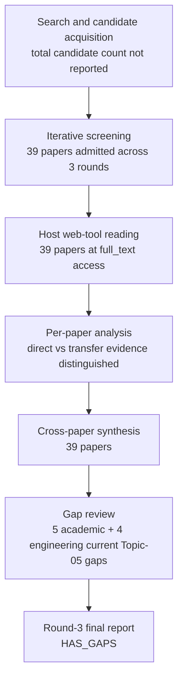

# Research Report: Authentic Workplace Email and Enterprise-Chat Extraction of Structured Action and Decision Arguments

## Contents

- [Round History](#round-history)
- [Executive Summary](#executive-summary)
- [Research Question](#research-question)
- [Methodology](#methodology)
- [Papers Reviewed](#papers-reviewed)
- [Research Landscape](#research-landscape)
- [Methodology Comparison](#methodology-comparison)
- [Confidence-Graded Findings](#confidence-graded-findings)
- [Trade-Off Analysis](#trade-off-analysis)
- [Points of Agreement](#points-of-agreement)
- [Points of Contradiction](#points-of-contradiction)
- [Research Gaps](#research-gaps)
- [Reproducibility Notes](#reproducibility-notes)
- [Practical Recommendations](#practical-recommendations)
- [Future Directions](#future-directions)
- [Readiness Assessment (System-Building Mode)](#readiness-assessment-system-building-mode)
- [Evidence Map](#evidence-map)
- [References](#references)
- [Appendix: Run Metadata](#appendix-run-metadata)

## Round History

Iterative gap-closure loop (hard cap: 4 rounds). See `references/iterative-synthesis.md` for the full loop definition.

| Round | Run ID | Topic / Gap Focus | New Papers | Gaps Addressed | Remaining Gaps |
|-------|--------|-------------------|------------|----------------|----------------|
| 1 | a109ca6369e7 | action items, requests, commitments, and decisions in workplace email and chat: extracting action, owner, object, deadline, conditions, and speech act with evidence | 17 | initial shortlist | 5 academic, 4 engineering |
| 2 | fb59b34c3d44 | empirical workplace email and chat studies on structured action and decision extraction, focusing on owner assignment, deadline-to-action binding, conditional or negated obligations, and evidence-span annotation | 12 | 0 resolved | 5 academic, 4 engineering |
| 3 | 950e68ab52e0 | authentic workplace email and enterprise-chat extraction of structured action and decision arguments, with emphasis on implicit or group assignees, deadline-to-action relations, condition/negation/modality attachment, and exact evidence-span annotation | 10 | academic gaps of the previous round | 5 academic, 4 engineering |

**Stop reason**: another round runs while open academic gaps remain and new papers appear

## Executive Summary

This review investigated extraction of work-relevant requests, commitments, action items, proposals, decisions, owners, objects, deadlines, conditions, modality, negation, and evidence provenance from authentic workplace email and enterprise chat, using adjacent meeting, event-extraction, temporal, modality, and negation research only as explicitly identified transfer evidence. Across 39 papers, the strongest result is that useful workplace-action representations are not adequately modeled as one message-level label: direct email/chat evidence and meeting transfer evidence support separating act type from arguments such as action, responsible party, timeframe, and conditions, while owner assignment is particularly difficult because responsibility can be implicit, plural, role-dependent, or absent from the recipient list [doi-10-1007-11965152-18] [doi-10-18653-v1-w18-6104] [2312.05471]. Context frequently improves extraction, but the effect is task- and corpus-dependent and can reverse for particular classes, so unlimited context is not an empirically justified default [doi-10-1145-3331184-3331260] [2303.16763] [doi-10-1145-1076034-1076094] [2312.05471]. The most significant unresolved issue is that no admitted modern workplace benchmark jointly validates the complete target representation—speech-act type, owner, object, deadline, conditions/exceptions, and exact evidence spans—while direct evidence for deadline binding, complex owner resolution, and action-specific condition/modality attachment remains incomplete.

**Scope**: 39 papers analyzed from 8 access-host families over publication years 2000–2024  
**Overall Confidence**: Medium  
**Verdict**: HAS_GAPS

## Research Question

The review asked:

> How reliably can authentic workplace email and enterprise-chat content be converted into structured representations of requests, commitments, action items, proposals, decisions, approvals, and related work-relevant acts, with explicit extraction of responsible actor or assignee, action object, deadline or temporal relation, conditions/exceptions, negation/modality, and exact supporting evidence?

The target representation is approximately:

```text
type: request | commitment | decision | approval | proposal | action item
actor / owner
object / target
recipient / beneficiary
status/modality at utterance time
original deadline wording
normalized time if justified
conditions / prerequisites / exceptions
source span(s)
confidence / unresolved fields
```

The review specifically includes authentic workplace email and enterprise chat, with meetings and general NLP tasks admitted as transfer evidence where they illuminate action structure, event arguments, temporal attachment, implicit arguments, modality, conditionality, or negation.

The following are outside Topic 05's ownership boundary:

- determining which antecedent proposition an approval, answer, rejection, or commitment refers to; that is Topic 04;
- tracking whether an extracted action is later completed, revoked, contradicted, superseded, or otherwise changes state; that is Topic 06;
- executing actions or generating operational commands;
- generic intent classification that does not preserve work-relevant arguments;
- treating arbitrary temporal expressions as deadlines without establishing an action-to-time relation;
- attachment interpretation itself, which belongs to Topic 08.

A Topic 05 act label must therefore not be interpreted as proof that Topic 04's antecedent scope has been resolved correctly.

## Methodology

### Search Strategy

- **Sources/access hosts**: arXiv, ACL Anthology, ResearchGate, Microsoft Research, Springer, North Carolina State University, Carnegie Mellon University, and RNTI. The supplied run metadata does not identify the complete discovery-service mix separately from these access hosts.
- **Query variants**:
  - `authentic workplace email enterprise-chat extraction structured decision arguments, emphasis implicit group assignees, deadline-to-action relations, condition/negation/modality attachment, exact evidence-span annotation`
  - `authentic workplace email`
  - `authentic enterprise-chat extraction structured decision arguments, emphasis implicit group assignees, deadline-to-action relations, condition/negation/modality attachment, exact evidence-span annotation`
  - `workplace enterprise-chat extraction structured decision arguments, emphasis implicit group assignees, deadline-to-action relations, condition/negation/modality attachment, exact evidence-span annotation`
  - `email enterprise-chat extraction structured decision arguments, emphasis implicit group assignees, deadline-to-action relations, condition/negation/modality attachment, exact evidence-span annotation`
  - `authentic workplace email enterprise-chat extraction`
  - `authentic workplace email structured decision`
  - `authentic workplace email arguments, emphasis`
- **Time window**: publications represented in the admitted corpus span 2000–2024.
- **Screening**: iterative shortlist and gap-focused admission across three rounds. The supplied run artifacts do not state whether retrieval screening used BM25 alone or BM25 plus sub-agents, so no unsupported screening mechanism is asserted.
- **Domain discipline**: direct workplace email/chat evidence was distinguished from transfer evidence from meetings, general dialogue, event extraction, temporal-relation extraction, modality, negation, and biomedical scope annotation.

The pipeline reports that the admitted papers were read through the host's web tool. All 39 papers listed below had **full_text** access. The report synthesizes the supplied cross-paper analysis rather than claiming new independent experimental replication.

### Pipeline Summary



| Metric | Count |
|--------|-------|
| Total candidates | Not reported |
| After screening / admitted | 39 |
| Downloaded | Not separately reported |
| Successfully converted | Not separately reported |
| Deeply analyzed | 39 |
| Iterations completed | 3 |

For engineering evaluation, argument-level precision and recall should be distinguished from strict whole-item correctness. For argument type $a$:

$P_a = \frac{TP_a}{TP_a + FP_a}$

$R_a = \frac{TP_a}{TP_a + FN_a}$

$F_{1,a} = \frac{2P_aR_a}{P_a + R_a}$

A strict structured-item score can additionally require every required field to match the gold representation:

$\mathrm{StrictCorrect}(x)=\mathbb{1}[\hat{Y}_x=Y_x]$

This distinction matters because a system can detect an action correctly while assigning the wrong owner, deadline, condition, or evidence span.

## Papers Reviewed

All access levels below are `full_text`, read through the host's web tool.

| # | Title | Authors | Year | Venue | Quality Score | Relevance | Access |
|---|-------|---------|------|-------|---------------|-----------|--------|
| 1 | LEDA: a Large-Organization Email-Based Decision-Dialogue-Act Analysis Dataset [doi-10-18653-v1-2023-findings-acl-378] | Vanja Mladen Karan, Prashant Khare, Ravi Shekhar et al. | 2023 | Findings of ACL | Not scored | HIGH — direct workplace email | full_text |
| 2 | Speculation and Negation Scope Detection via Convolutional Neural Networks [doi-10-18653-v1-d16-1078] | Zhong Qian, Peifeng Li, Qiaoming Zhu et al. | 2016 | Venue not supplied | Not scored | MEDIUM — scope transfer | full_text |
| 3 | Predicate-specific Annotations for Implicit Role Binding: Corpus Annotation, Data Analysis and Evaluation Experiments [manual-69bc2555ab] | Tatjana Moor, Michael Roth, Anette Frank | 2013 | Venue not supplied | Not scored | MEDIUM — implicit-argument transfer | full_text |
| 4 | A Two-Step Approach for Implicit Event Argument Detection [doi-10-18653-v1-2020-acl-main-667] | Zhisong Zhang, Xiang Kong, Zhengzhong Liu et al. | 2020 | ACL | Not scored | MEDIUM — implicit-argument transfer | full_text |
| 5 | Do LLMs suffer from Multi-Party Hangover? A Diagnostic Approach to Addressee Recognition and Response Selection in Conversations [2409.18602] | Nicolò Penzo, Maryam Sajedinia, Bruno Lepri et al. | 2024 | arXiv manuscript | Not scored | MEDIUM — addressee-transfer evidence | full_text |
| 6 | Extraction de tâches dans les e-mails : une approche fondée sur les rôles sémantiques [manual-e6bb5aee88] | Melissa Mekaoui, Guillaume Tisserant, Mathieu Dodard et al. | 2020 | RNTI publication | Not scored | HIGH — professional email task extraction | full_text |
| 7 | Entity, Relation, and Event Extraction with Contextualized Span Representations [1909.03546] | David Wadden, Ulme Wennberg, Yi Luan et al. | 2019 | arXiv manuscript | Not scored | MEDIUM — span extraction transfer | full_text |
| 8 | Decision Detection Using Hierarchical Graphical Models [manual-90280d2776] | Trung H. Bui, Stanley Peters | 2010 | Venue not supplied | Not scored | MEDIUM — meeting-decision transfer | full_text |
| 9 | Event Time Extraction with a Decision Tree of Neural Classifiers [doi-10-1162-tacl-a-00006] | Nils Reimers, Nazanin Dehghani, Iryna Gurevych | 2018 | TACL | Not scored | MEDIUM — temporal transfer | full_text |
| 10 | Focused Meeting Summarization via Unsupervised Relation Extraction [1606.07849] | Lu Wang, Claire Cardie | 2012 | Venue not supplied | Not scored | MEDIUM — meeting transfer | full_text |
| 11 | Classifying Action Items for Semantic Email [manual-fde6beef40] | Simon Scerri, Gerhard Gossen, Brian Davis et al. | 2010 | Venue not supplied | Not scored | HIGH — direct email action items | full_text |
| 12 | *SEM 2012 Shared Task: Resolving the Scope and Focus of Negation [manual-ee40d588e3] | Roser Morante, Eduardo Blanco | 2012 | *SEM | Not scored | MEDIUM — negation-scope transfer | full_text |
| 13 | Detecting Emails Containing Requests for Action [manual-cd3fa58e4c] | Andrew Lampert, Robert Dale, Cecile Paris | 2010 | Venue not supplied | Not scored | HIGH — direct email requests | full_text |
| 14 | Detecting Action Items in Multi-party Meetings: Annotation and Initial Experiments [doi-10-1007-11965152-18] | Matthew Purver, Patrick Ehlen, John Niekrasz | 2006 | Venue not supplied | Not scored | MEDIUM — structured-action transfer | full_text |
| 15 | Detecting and Summarizing Action Items in Multi-Party Dialogue [doi-10-18653-v1-2007-sigdial-1-4] | Matthew Purver, John Dowding, John Niekrasz et al. | 2007 | SIGDIAL | Not scored | MEDIUM — structured-action transfer | full_text |
| 16 | Shallow Discourse Structure for Action Item Detection [doi-10-3115-1564535-1564540] | Matthew Purver, Patrick Ehlen, John Niekrasz | 2006 | Venue not supplied | Not scored | MEDIUM — action-item transfer | full_text |
| 17 | Extracting Decisions from Multi-Party Dialogue Using Directed Graphical Models and Semantic Similarity [doi-10-3115-1708376-1708410] | Trung Bui, Matthew Frampton, John Dowding et al. | 2009 | Venue not supplied | Not scored | MEDIUM — decision transfer | full_text |
| 18 | Meeting Action Item Detection with Regularized Context Modeling [2303.16763] | Jiaqing Liu, Chong Deng, Qinglin Zhang et al. | 2023 | arXiv manuscript | Not scored | MEDIUM — context/action-item transfer | full_text |
| 19 | Can Requests-for-Action and Commitments-to-Act be Reliably Identified in Email Messages? [manual-0839b98ee7] | Andrew Lampert, Cécile Paris, Robert Dale | 2007 | Venue not supplied | Not scored | HIGH — direct workplace email | full_text |
| 20 | Requests and Commitments in Email are More Complex Than You Think: Eight Reasons to be Cautious [manual-20b8cd2fdd] | Andrew Lampert, Robert Dale, Cécile Paris | 2008 | Venue not supplied | Not scored | HIGH — direct workplace email | full_text |
| 21 | The nature of requests and commitments in email messages [manual-d19b0f6f1e] | Andrew Lampert, Robert Dale, Cécile Paris | 2008 | Venue not supplied | Not scored | HIGH — direct workplace email | full_text |
| 22 | Using Speech Acts to Categorize Email and Identify Email Genres [doi-10-1109-hicss-2006-528] | Jade Goldstein, Roberta Evans Sabin | 2006 | HICSS | Not scored | HIGH — direct email | full_text |
| 23 | TimeML: Robust Specification of Event and Temporal Expressions in Text [manual-1e8332286e] | James Pustejovsky, José Castaño, Robert Ingria et al. | 2003 | Venue not supplied | Not scored | MEDIUM — temporal-representation transfer | full_text |
| 24 | Dialogue act modeling for automatic tagging and recognition of conversational speech [manual-01c535c108] | Andreas Stolcke, Klaus Ries, Noah Coccaro et al. | 2000 | Venue not supplied | Not scored | MEDIUM — dialogue-act transfer | full_text |
| 25 | On the collective classification of email "speech acts" [doi-10-1145-1076034-1076094] | Vitor R. Carvalho, William W. Cohen | 2005 | SIGIR | Not scored | HIGH — direct email speech acts | full_text |
| 26 | Detecting Action-Items in E-mail [doi-10-1145-1076034-1076140] | Paul N. Bennett, Jaime G. Carbonell | 2005 | SIGIR | Not scored | HIGH — direct email action items | full_text |
| 27 | The Possible, the Plausible, and the Desirable: Event-Based Modality Detection for Language Processing [2106.08037] | Valentina Pyatkin, Shoval Sadde, Aynat Rubinstein et al. | 2021 | arXiv manuscript | Not scored | MEDIUM — modality transfer | full_text |
| 28 | Learning with Weak Supervision for Email Intent Detection [2005.13084] | Kai Shu, Subhabrata Mukherjee, Guoqing Zheng et al. | 2020 | arXiv manuscript | Not scored | HIGH — email-domain evidence | full_text |
| 29 | Context-Aware Intent Identification in Email Conversations [doi-10-1145-3331184-3331260] | Wei Wang, Saghar Hosseini, Ahmed Hassan Awadallah et al. | 2019 | SIGIR | Not scored | HIGH — direct email context evidence | full_text |
| 30 | Domain Adaptation for Commitment Detection in Email [doi-10-1145-3289600-3290984] | Hosein Azarbonyad, Robert Sim, Ryen W. White | 2019 | WSDM | Not scored | HIGH — direct email commitment evidence | full_text |
| 31 | Monitoring Commitments in People-Driven Service Engagements [doi-10-1109-scc-2013-62] | Anup K. Kalia, Hamid R. Motahari-Nezhad, Claudio Bartolini et al. | 2013 | SCC | Not scored | MEDIUM — commitment-model transfer | full_text |
| 32 | Deep Structured Neural Network for Event Temporal Relation Extraction [1909.10094] | Rujun Han, I-Hung Hsu, Mu Yang et al. | 2019 | arXiv manuscript | Not scored | MEDIUM — temporal-relation transfer | full_text |
| 33 | The BioScope corpus: biomedical texts annotated for uncertainty, negation and their scopes [doi-10-1186-1471-2105-9-s11-s9] | Veronika Vincze, György Szarvas, Richárd Farkas et al. | 2008 | BMC Bioinformatics | Not scored | MEDIUM — scope-annotation transfer | full_text |
| 34 | Lin: Unsupervised Extraction of Tasks from Textual Communication [doi-10-18653-v1-2020-coling-main-164] | Parth Diwanji, Hui Guo, Munindar Singh et al. | 2020 | COLING | Not scored | MEDIUM — task-extraction evidence | full_text |
| 35 | Assigning people to tasks identified in email: The EPA dataset for addressee tagging for detected task intent [doi-10-18653-v1-w18-6104] | Revanth Rameshkumar, Peter Bailey, Abhishek Jha et al. | 2018 | ACL Anthology workshop paper | Not scored | HIGH — direct email assignee evidence | full_text |
| 36 | Prompt for Extraction? PAIE: Prompting Argument Interaction for Event Argument Extraction [2202.12109] | Yubo Ma, Zehao Wang, Yixin Cao et al. | 2022 | arXiv manuscript | Not scored | MEDIUM — exact-span argument transfer | full_text |
| 37 | A Modality Lexicon and its use in Automatic Tagging [1410.4868] | Kathryn Baker, Michael Bloodgood, Bonnie J. Dorr et al. | 2010 | arXiv-hosted manuscript | Not scored | MEDIUM — modality transfer | full_text |
| 38 | Fine-Grained Analysis of Team Collaborative Dialogue [2312.05471] | Ian Perera, Matthew Johnson, Carson Wilber | 2023 | arXiv manuscript | Not scored | HIGH — direct team-chat evidence | full_text |
| 39 | Explicit, Implicit, and Scattered: Revisiting Event Extraction to Capture Complex Arguments [2410.03594] | Omar Sharif, Joseph Gatto, Madhusudan Basak et al. | 2024 | arXiv manuscript | Not scored | MEDIUM — complex-argument transfer | full_text |

## Research Landscape

### Theme 1: Structured Actions Are Multi-Argument Objects

**Coverage**: 8 representative papers | **Confidence**: High  
**Supporting papers**: [doi-10-1007-11965152-18], [doi-10-3115-1564535-1564540], [doi-10-18653-v1-2007-sigdial-1-4], [manual-e6bb5aee88], [manual-0839b98ee7], [manual-d19b0f6f1e], [doi-10-18653-v1-2023-findings-acl-378], [2312.05471]

The literature supports separating detection of a work-relevant act from extraction of its semantic arguments. Meeting action-item studies explicitly represent action items through components including task description, responsible party, timeframe, and agreement, sometimes distributed across several utterances [doi-10-1007-11965152-18] [doi-10-3115-1564535-1564540] [doi-10-18653-v1-2007-sigdial-1-4]. Professional-email task extraction similarly uses semantic-role information rather than a single undifferentiated task flag [manual-e6bb5aee88]. Direct email research on requests and commitments shows that apparently simple labels conceal difficult distinctions such as conditional offers and implicit obligations [manual-0839b98ee7] [manual-d19b0f6f1e].

Key findings:

1. **[HIGH]** Action items are better represented as structured objects containing separately recoverable components than as a flat binary label when downstream use requires responsibility, timing, and task content [doi-10-1007-11965152-18] [doi-10-3115-1564535-1564540] [doi-10-18653-v1-2007-sigdial-1-4].
2. **[HIGH]** Requests and commitments are empirically distinguishable in workplace email, but commitment annotation becomes difficult for conditional, implicit, or group-directed cases [manual-0839b98ee7] [manual-20b8cd2fdd] [manual-d19b0f6f1e].
3. **[HIGH]** Proposal and decision-related language should not automatically be collapsed into one state: large-organization email and meeting decision work distinguish proposed action, stated decision, agreement, restatement, and related stages [doi-10-18653-v1-2023-findings-acl-378] [doi-10-3115-1708376-1708410] [manual-90280d2776].

### Theme 2: Context Helps, but More Context Is Not Always Better

**Coverage**: 4 primary papers | **Confidence**: High  
**Supporting papers**: [doi-10-1145-3331184-3331260], [2312.05471], [2303.16763], [doi-10-1145-1076034-1076094]

Context outside the target sentence frequently improves email intent, team-dialogue, meeting action-item, and email speech-act classification. However, the effect is not monotonic: some configurations or classes degrade when additional context is introduced, and the strongest context design changes across corpora [doi-10-1145-3331184-3331260] [2303.16763] [doi-10-1145-1076034-1076094] [2312.05471].

Key findings:

1. **[HIGH]** Conversational context is often informative for workplace act extraction, so sentence-isolated processing loses useful evidence [doi-10-1145-3331184-3331260] [2312.05471] [2303.16763].
2. **[HIGH]** The corpus does not justify a universal "maximum context" strategy because context can degrade particular classes or behave differently across datasets [doi-10-1145-1076034-1076094] [2303.16763].
3. **[HIGH]** Context selection therefore needs to be treated as an empirical system variable rather than a fixed assumption.

### Theme 3: Owner and Assignee Resolution Is a Distinct Hard Problem

**Coverage**: 4 representative papers | **Confidence**: High  
**Supporting papers**: [doi-10-18653-v1-w18-6104], [2312.05471], [doi-10-1007-11965152-18], [manual-e6bb5aee88]

Direct email and enterprise-chat evidence shows that an action's responsible party cannot safely be equated with the message recipient. EPA reports cases involving plural, implicit, and candidate-recipient-external responsible parties [doi-10-18653-v1-w18-6104]. Team collaborative dialogue adds role and project-responsibility information to the ownership problem [2312.05471], while meeting action-item research reports owner detection as one of the weaker action-item component tasks [doi-10-1007-11965152-18].

Key findings:

1. **[HIGH]** Responsible actors can be implicit, plural, role-dependent, or absent from the recipient candidate set [doi-10-18653-v1-w18-6104] [2312.05471].
2. **[HIGH]** Owner extraction should remain separate from detection that an action exists [doi-10-1007-11965152-18] [doi-10-18653-v1-w18-6104].
3. **[HIGH]** Recipient-based heuristics are operationally useful in some constrained extraction settings but are not complete models of workplace responsibility [manual-e6bb5aee88] [doi-10-18653-v1-w18-6104].

### Theme 4: Deadline, Condition, Modality, and Negation Are Attachment Problems

**Coverage**: 10 representative papers | **Confidence**: Medium  
**Supporting papers**: [doi-10-18653-v1-2007-sigdial-1-4], [doi-10-1162-tacl-a-00006], [1909.10094], [manual-1e8332286e], [manual-d19b0f6f1e], [manual-0839b98ee7], [1410.4868], [2106.08037], [manual-ee40d588e3], [doi-10-1186-1471-2105-9-s11-s9]

Temporal extraction research distinguishes finding a temporal expression from establishing its relation to a specific event [doi-10-1162-tacl-a-00006] [1909.10094] [manual-1e8332286e]. Likewise, modality and negation literature distinguishes cue detection from identifying the proposition or event affected by the cue [1410.4868] [2106.08037] [manual-ee40d588e3] [doi-10-1186-1471-2105-9-s11-s9]. Direct email request/commitment studies reinforce the importance of conditionality and implicit obligation in the target domain [manual-d19b0f6f1e] [manual-0839b98ee7].

Key findings:

1. **[MEDIUM]** A detected date should not become an action deadline unless the action-to-time relation is supported [doi-10-18653-v1-2007-sigdial-1-4] [doi-10-1162-tacl-a-00006].
2. **[MEDIUM]** Negation, speculation, modality, and conditionality require resolving scope or target, not merely recognizing lexical cues [manual-d19b0f6f1e] [1410.4868] [manual-ee40d588e3] [2106.08037].
3. **[MEDIUM]** Transfer research supplies plausible mechanisms for these relations, but direct workplace validation of action-specific attachment remains incomplete.

### Theme 5: Evidence Provenance Needs More Than One Representation Regime

**Coverage**: 6 papers | **Confidence**: Medium  
**Supporting papers**: [2202.12109], [1909.03546], [2410.03594], [doi-10-18653-v1-2020-acl-main-667], [manual-69bc2555ab], [doi-10-18653-v1-w18-6104]

Span-based extraction provides a strong provenance mechanism when an argument is explicitly realized in text [2202.12109] [1909.03546]. However, implicit-event-argument and complex-argument research shows that some arguments are absent as explicit text spans or scattered across non-contiguous evidence [doi-10-18653-v1-2020-acl-main-667] [manual-69bc2555ab] [2410.03594]. That creates a direct design constraint for msgloom: exact quotation evidence and inferred argument support must be distinguished rather than forcing every field into a fabricated contiguous span.

Key findings:

1. **[MEDIUM]** Exact offset spans are appropriate provenance for explicitly expressed arguments [2202.12109] [1909.03546].
2. **[MEDIUM]** Implicit and scattered arguments may not possess one valid contiguous source span [2410.03594] [doi-10-18653-v1-2020-acl-main-667] [manual-69bc2555ab].
3. **[MEDIUM]** A unified project representation therefore needs to support explicit spans, multiple spans, and unresolved or inferred arguments as distinct cases.

### Theme 6: Multi-Act Messages and Domain Variation Are Normal, Not Edge Cases

**Coverage**: 7 representative papers | **Confidence**: High  
**Supporting papers**: [doi-10-1145-3331184-3331260], [2312.05471], [doi-10-18653-v1-2020-coling-main-164], [doi-10-1145-3289600-3290984], [2005.13084], [doi-10-18653-v1-2023-findings-acl-378], [doi-10-1145-1076034-1076094]

Workplace messages and collaborative dialogue can contain several intents or task predicates, so forcing one label per message discards relevant structure [doi-10-1145-3331184-3331260] [2312.05471] [doi-10-18653-v1-2020-coling-main-164]. Domain adaptation results for commitment detection and weakly supervised email intent detection further show that model behavior depends on corpus and supervision regime [doi-10-1145-3289600-3290984] [2005.13084].

Key findings:

1. **[HIGH]** Systems must permit multiple work-relevant acts or task predicates within one sentence or message [doi-10-1145-3331184-3331260] [2312.05471] [doi-10-18653-v1-2020-coling-main-164].
2. **[HIGH]** Email-domain differences materially affect commitment and intent extraction [doi-10-1145-3289600-3290984] [2005.13084].
3. **[HIGH]** Production accuracy cannot be inferred solely from cross-domain or organization-specific research.

## Methodology Comparison

| Approach | Papers | Strengths | Weaknesses | Best For | Performance |
|----------|--------|-----------|------------|----------|-------------|
| Message/sentence speech-act classification | [doi-10-1145-1076034-1076094], [doi-10-1109-hicss-2006-528], [manual-0839b98ee7] | Directly targets communicative function; substantial workplace-email evidence | Can lose argument structure; granularity effects vary | Initial act-type detection | Useful but corpus- and class-dependent |
| Context-aware email/dialogue classification | [doi-10-1145-3331184-3331260], [2303.16763], [2312.05471] | Recovers conversational evidence outside local sentence | Extra context can introduce noise or class-specific degradation | Ambiguous acts requiring surrounding conversation | Improvements reported, but not universally |
| Multi-component action-item modeling | [doi-10-1007-11965152-18], [doi-10-3115-1564535-1564540], [doi-10-18653-v1-2007-sigdial-1-4] | Explicit task, owner, timeframe, agreement structure | Mostly meeting-domain transfer; owner remains difficult | Structured work-item representation | Component performance is uneven |
| Semantic-role email task extraction | [manual-e6bb5aee88] | Direct professional-email structure; links predicates to semantic roles | Operational assumptions about recipient/Agent do not cover all ownership cases | Explicit email task requests | Direct but limited in ownership coverage |
| Assignee/addressee resolution | [doi-10-18653-v1-w18-6104], [2409.18602], [2312.05471] | Directly targets responsible/addressee identity | Implicit, plural, role-based, and external owners remain difficult | Owner/recipient resolution | Harder than task existence detection |
| Span-based event argument extraction | [1909.03546], [2202.12109] | Precise textual provenance for explicit arguments | Single contiguous spans cannot represent all implicit/scattered arguments | Explicit action/object/participant evidence | Strong transfer mechanism, not workplace validation |
| Implicit/scattered argument modeling | [manual-69bc2555ab], [doi-10-18653-v1-2020-acl-main-667], [2410.03594] | Handles omitted or discourse-distributed arguments | Harder task; evidence may lack direct text span | Context-inferred owners or arguments | Substantially harder than explicit extraction |
| Temporal-expression/event relation extraction | [doi-10-1162-tacl-a-00006], [1909.10094], [manual-1e8332286e] | Separates time detection from event-time relation | Transfer domain; not direct deadline benchmark | Deadline-to-action candidate relations | Mechanistically relevant; target-domain accuracy unknown |
| Modality/negation scope modeling | [1410.4868], [2106.08037], [manual-ee40d588e3], [doi-10-1186-1471-2105-9-s11-s9], [doi-10-18653-v1-d16-1078] | Models target/scope rather than cue presence only | Predominantly non-workplace transfer evidence | Conditionality, negation, speculation, modality | Scope remains harder than cue recognition |
| Decision-dialogue modeling | [doi-10-18653-v1-2023-findings-acl-378], [doi-10-3115-1708376-1708410], [manual-90280d2776] | Distinguishes proposal, decision, agreement, and decision-process stages | Structured argument extraction in authentic workplace channels remains incomplete | Decision-state classification | Direct act labels exist; full argument scheme unvalidated |

## Confidence-Graded Findings

### 🟢 High Confidence (supported by 3+ papers with consistent results)

1. **[HIGH] Direct workplace-email annotation shows that requests and commitments can be identified, but commitments are harder to annotate consistently, particularly for conditional offers, implicit obligations, and group-directed messages.** Supported by [manual-0839b98ee7], [manual-20b8cd2fdd], and [manual-d19b0f6f1e].

2. **[HIGH] Conversational context often improves workplace act extraction, but the effect is task-, class-, corpus-, and context-configuration-dependent.** Supported by [doi-10-1145-3331184-3331260], [2312.05471], [2303.16763], and [doi-10-1145-1076034-1076094].

3. **[HIGH] Action items are more informatively modeled as multi-component and sometimes multi-utterance structures containing task description, owner, timeframe, and agreement than as one flat label.** Supported by [doi-10-1007-11965152-18], [doi-10-3115-1564535-1564540], and [doi-10-18653-v1-2007-sigdial-1-4].

4. **[HIGH] Owner/assignee resolution is materially harder than detecting that an action exists because responsibility can be implicit, plural, recipient-external, or role-dependent.** Supported by [doi-10-18653-v1-w18-6104], [2312.05471], and [doi-10-1007-11965152-18].

5. **[HIGH] Workplace communication can contain multiple intents, acts, or task predicates in the same sentence or message, so single-label-per-message representations are insufficient for complete work-item extraction.** Supported by [doi-10-1145-3331184-3331260], [2312.05471], and [doi-10-18653-v1-2020-coling-main-164].

6. **[HIGH] Proposal, stated decision, agreement, restatement, request, and commitment should not be assumed to be semantically interchangeable.** Large-organization email and meeting decision studies distinguish these categories or stages [doi-10-18653-v1-2023-findings-acl-378] [doi-10-3115-1708376-1708410] [manual-90280d2776].

7. **[HIGH] Domain and corpus variation materially affect email commitment and intent extraction, so target-domain performance cannot be inferred directly from another email collection.** Supported by [doi-10-1145-3289600-3290984] and [2005.13084], with complementary evidence from differing transfer regimes.

### 🟡 Medium Confidence (supported by transfer evidence or with important caveats)

1. **[MEDIUM] Temporal expressions must be explicitly related to the affected action or event; detecting a date alone is insufficient evidence that it is a deadline for that action.** Supported by meeting action-item and general temporal-event evidence [doi-10-18653-v1-2007-sigdial-1-4] [doi-10-1162-tacl-a-00006]. Direct workplace deadline-binding validation remains open.

2. **[MEDIUM] Conditionality, modality, speculation, and negation require target/scope resolution rather than lexical cue detection alone.** Direct email evidence establishes difficult conditional commitments, while adjacent scope research supplies the stronger attachment evidence [manual-d19b0f6f1e] [manual-0839b98ee7] [1410.4868] [doi-10-1186-1471-2105-9-s11-s9] [manual-ee40d588e3] [2106.08037].

3. **[MEDIUM] Exact spans are an appropriate provenance representation for explicit arguments, but implicit and scattered arguments require a different representation because no single contiguous source span may exist.** Supported by [2202.12109], [1909.03546], [2410.03594], and [doi-10-18653-v1-2020-acl-main-667].

### 🔴 Low Confidence (preliminary, single-source, or contradicted)

No cross-paper finding in the supplied synthesis was assigned LOW confidence. This report therefore does not manufacture a LOW-confidence substantive claim merely to populate the category.

## Trade-Off Analysis

| Decision | Option A | Option B | Recommendation |
|----------|----------|----------|----------------|
| Flat act label vs structured work item | Flat labels are simple but lose owner, object, deadline, conditions, and provenance | Typed act plus explicit arguments preserves downstream decision-relevant structure | Use structured work items; evidence strongly favors argument-level representation [doi-10-1007-11965152-18] [doi-10-18653-v1-w18-6104] |
| Force owner vs permit unresolved owner | Produces executable-looking records but risks false assignment | Unknown/inferred owner states preserve uncertainty | Permit unresolved owners and distinguish explicit from inferred ownership [doi-10-18653-v1-w18-6104] [2312.05471] |
| Recipient equals owner vs independent assignee resolution | Cheap deterministic heuristic | Handles implicit, plural, and non-recipient owners | Do not equate recipient with owner except as an explicit constrained hypothesis [manual-e6bb5aee88] [doi-10-18653-v1-w18-6104] |
| Treat every date as a deadline vs bind time to action | Higher apparent recall but produces false deadlines | Requires action-time relation and supports unresolved relation | Represent deadline as an action-to-time relation [doi-10-1162-tacl-a-00006] [doi-10-18653-v1-2007-sigdial-1-4] |
| Message-level condition flag vs scoped attachment | Simpler representation but fails with several actions | Preserves which action is conditioned, negated, or modalized | Use scoped relations [manual-ee40d588e3] [2106.08037] [manual-d19b0f6f1e] |
| Single evidence span vs flexible provenance | Simple offsets | Supports contiguous, multiple, implicit, and inferred evidence regimes | Preserve exact spans where they exist; never fabricate one for implicit arguments [1909.03546] [2410.03594] |
| Maximum thread context vs controlled context | Maximizes available text but can import noise | Sentence/message/selective-thread modes can be compared empirically | Use controlled context expansion rather than unconditional full-thread input [doi-10-1145-3331184-3331260] [doi-10-1145-1076034-1076094] [2303.16763] |
| Collapse proposal/intention/decision vs preserve distinctions | Simpler ontology | Avoids turning suggestions into decisions or commitments | Preserve distinctions until project evidence justifies any collapse [doi-10-18653-v1-2023-findings-acl-378] [manual-90280d2776] |
| Couple extraction with lifecycle tracking vs separate concerns | Fewer components but conflates utterance semantics with later state | Topic 05 captures uttered act; Topic 06 tracks later state | Keep the boundaries separate |

## Points of Agreement

1. **[HIGH] Work-relevant acts need richer structure than one binary action flag.** Meeting action-item research, email task extraction, and email request/commitment studies converge on multi-component or semantically differentiated representations [doi-10-1007-11965152-18] [doi-10-18653-v1-2007-sigdial-1-4] [manual-e6bb5aee88] [manual-0839b98ee7].

2. **[HIGH] Owner resolution is a separate semantic problem.** Responsibility may be plural, implicit, role-sensitive, or external to the obvious recipient candidates [doi-10-18653-v1-w18-6104] [2312.05471] [doi-10-1007-11965152-18].

3. **[HIGH] Context matters.** Several email, meeting, and enterprise-dialogue studies show that non-local context can improve act or action extraction, even though the optimal amount varies [doi-10-1145-3331184-3331260] [2303.16763] [2312.05471].

4. **[MEDIUM] Scope/attachment matters for time, modality, negation, and conditions.** Temporal and modality/negation work consistently separates recognizing a cue from resolving what event or proposition the cue modifies [doi-10-1162-tacl-a-00006] [1410.4868] [manual-ee40d588e3] [2106.08037].

5. **[HIGH] Multi-act content must be preserved.** Workplace email and team-dialogue evidence supports multiple intents or tasks within one communicative unit [doi-10-1145-3331184-3331260] [2312.05471] [doi-10-18653-v1-2020-coling-main-164].

6. **[MEDIUM] Exact spans are valuable but not universally available.** Span extraction and implicit/scattered argument research jointly imply that provenance needs explicit and inferred evidence regimes [1909.03546] [2202.12109] [doi-10-18653-v1-2020-acl-main-667] [2410.03594].

## Points of Contradiction

1. **[HIGH] Whether more conversational context reliably improves extraction**: [doi-10-1145-3331184-3331260], [2312.05471], and [2303.16763] report useful context effects in their settings, while [doi-10-1145-1076034-1076094] shows that collective thread context can degrade the Deliver act, and [2303.16763] reports corpus-dependent preferred context configurations.
   - **Possible explanation**: datasets, label inventories, context-selection strategies, and target acts differ.
   - **Implication**: context should be experimentally selected, not maximized by default.

2. **[HIGH] Sentence-level versus message-level granularity**: [doi-10-1145-1076034-1076140] finds sentence-level action-item classifiers useful for document-level detection, whereas the request/commitment annotation line reports higher human agreement at message level [manual-20b8cd2fdd] [manual-d19b0f6f1e].
   - **Possible explanation**: one result concerns model discrimination and the other annotation reliability, so the outcomes are not directly equivalent.
   - **Implication**: msgloom should separate evidence-span granularity from final work-item granularity rather than choosing one universal unit.

3. **[MEDIUM] Contiguous exact spans versus implicit/scattered arguments**: [2202.12109] and [1909.03546] successfully use span-based argument extraction for explicit arguments, whereas [2410.03594] and [doi-10-18653-v1-2020-acl-main-667] address arguments that may be implicit or not representable as one contiguous span.
   - **Possible explanation**: the studies operate under different event-argument assumptions.
   - **Implication**: one contiguous `source_span` field is not sufficient for every argument.

4. **[HIGH] Whether responsible actors can be restricted to recipients**: [manual-e6bb5aee88] uses a recipient-corresponding Agent as part of its operational action-request filter, while [doi-10-18653-v1-w18-6104] explicitly observes plural, implicit, and recipient-external responsible people.
   - **Possible explanation**: the French extractor imposes a task-specific operational constraint; EPA studies a broader ownership problem.
   - **Implication**: recipient identity may be a feature or candidate source, not a complete owner model.

5. **[MEDIUM] Operational interpretation of negated action language**: [doi-10-18653-v1-2020-coling-main-164] excludes negated imperatives from positive task extraction, [doi-10-1109-scc-2013-62] uses negative dependency evidence primarily in commitment cancellation, while [manual-e6bb5aee88] permits negative requested actions.
   - **Possible explanation**: "negated action" can denote different semantic objects—absence of a task, cancellation of an existing commitment, or a genuine request not to perform an action.
   - **Implication**: msgloom must classify the semantic effect of negation instead of applying a global exclusion rule.

6. **[HIGH] Cross-domain transfer robustness**: [doi-10-1145-3289600-3290984] reports cross-corpus degradation in commitment detection without adaptation, whereas [2005.13084] obtains useful Avocado-to-Enron zero-shot behavior under a different weak-supervision intent setup.
   - **Possible explanation**: the studies differ in task definition, supervision, corpora, and evaluation metrics.
   - **Implication**: transfer is possible, but domain invariance is not established.

## Research Gaps

Every gap below remains open. None is presented as accepted, resolved, or empirically closed.

| # | Gap | Type | Severity | Rounds already searched/evaluated | Impact on Goals |
|---|-----|------|----------|-----------------------------------|-----------------|
| 1 | No direct modern workplace email/chat benchmark jointly annotates act type, owner, action object, deadline, conditions/exceptions, and exact evidence spans | [ACADEMIC] | HIGH | Rounds 1–3 | Prevents direct validation of the complete target representation |
| 2 | Structured extraction of decisions, approvals, rejections, and proposals from authentic workplace email/chat remains insufficiently evidenced | [ACADEMIC] | HIGH | Rounds 1–3 | Risks conflating proposal, decision, approval, and rejection |
| 3 | Implicit/group/multi-action owner extraction and ownership requiring organizational context remain weakly evidenced | [ACADEMIC] | HIGH | Rounds 1–3 | Wrong owner can create a false obligation for the user |
| 4 | Reliable deadline-to-action binding against distractor dates, shared dates, scheduling expressions, and conditional future times remains unvalidated | [ACADEMIC] | HIGH | Rounds 1–3 | Wrong deadline attachment can create false urgency or miss due work |
| 5 | Direct workplace validation of condition, exception, negation, and modality attachment to the correct action remains insufficient | [ACADEMIC] | HIGH | Rounds 1–3 | Lost conditions can reverse the operational meaning of an obligation |
| 6 | Independent project benchmark and adversarial fixture suite has not been built | [ENGINEERING] | HIGH | Literature reviewed in rounds 1–3; engineering experiment not performed | Prevents argument-level measurement of false/missed obligations |
| 7 | Controlled comparison of sentence-local, message-level, and selectively expanded thread context has not been performed | [ENGINEERING] | HIGH | Literature reviewed in rounds 1–3; engineering experiment not performed | Context can help or harm, so the project needs its own selection evidence |
| 8 | Quoted/forwarded-content zoning with preserved provenance and context-dependent obligation recall has not been tested | [ENGINEERING] | HIGH | Literature reviewed in rounds 1–3; engineering experiment not performed | Quoted history can create false obligations or hide necessary antecedent context |
| 9 | Uncertainty-preserving structured output has not been evaluated for false-obligation reduction versus recall loss | [ENGINEERING] | HIGH | Literature reviewed in rounds 1–3; engineering experiment not performed | Forcing missing fields can produce confident but wrong owners/deadlines |
| 10 | Exact proposition-level scope for approval, rejection, agreement, clarification, and answers in authentic workplace email/chat remains unresolved in inherited Topic 04 evidence | [ACADEMIC] — inherited and out of Topic 05 ownership | HIGH | Topic 04 rounds 1–4; not closed by Topic 05 | Correct act type still does not prove the act was attached to the correct proposition |

### Academic Gaps (require more papers)

1. **[ACADEMIC] [HIGH] Complete modern structured workplace benchmark**: The literature has not answered whether one authentic modern workplace email/chat corpus can support joint evaluation of act type, owner, action object, deadline, conditions/exceptions, and exact evidence spans.  
   Suggested query: `"action item extraction" (email OR Slack OR workplace chat) assignee deadline condition "evidence span" corpus`.

2. **[ACADEMIC] [HIGH] Structured decision/approval/rejection/proposal extraction**: Large-organization email work distinguishes `ProposeAction` and `StateDecision`, and meeting work models decision-discussion structure, but the literature reviewed here has not answered direct structured-argument extraction for these act types in authentic workplace mail/chat [doi-10-18653-v1-2023-findings-acl-378] [doi-10-3115-1708376-1708410] [manual-90280d2776].  
   Suggested query: `("decision extraction" OR "decision detection") (workplace email OR enterprise chat OR Slack) proposal approval rejection argument extraction`.

3. **[ACADEMIC] [HIGH] Complex owner/assignee extraction**: Direct studies establish that ownership can be implicit, plural, recipient-external, and role-dependent, but the literature has not answered robust extraction across those cases, especially when one message contains several actions with different owners [doi-10-18653-v1-w18-6104] [2312.05471] [doi-10-1007-11965152-18].  
   Suggested query: `("assignee prediction" OR "assignee extraction" OR "responsibility extraction") email workplace implicit owner group owner action item`.

4. **[ACADEMIC] [HIGH] Deadline binding**: Temporal research supports explicit event-time relations, but the literature has not answered direct workplace deadline-to-action binding against distractor and shared dates [doi-10-1162-tacl-a-00006] [doi-10-18653-v1-2007-sigdial-1-4].  
   Suggested query: `("deadline extraction" OR "due date extraction") (email OR workplace communication) action item temporal relation event argument`.

5. **[ACADEMIC] [HIGH] Condition/exception/negation/modality attachment**: Workplace email establishes difficult conditional commitments, and transfer literature models scope, but the literature has not answered multi-action workplace attachment directly [manual-d19b0f6f1e] [manual-0839b98ee7] [1410.4868] [manual-ee40d588e3].  
   Suggested query: `("conditional commitment" OR "deontic modality" OR "negation scope") (email OR workplace communication) action extraction condition attachment`.

6. **[ACADEMIC] [HIGH] Inherited Topic 04 proposition scope**: Exact proposition-level scope for approval, rejection, agreement, clarification, and answers remains open. Topic 05 must consume that relationship rather than silently infer it from an act label. This gap was already searched through Topic 04's four rounds and remains unanswered by the literature available to that Topic.

### Engineering Gaps (fillable without papers)

1. **[ENGINEERING] [HIGH] Independent argument-level benchmark**: Build gold fixtures independently from the component under test. Include implicit owners, plural/group owners, multiple actions in one sentence, distinct owners for different actions, shared deadlines, distractor dates, conditional and negated actions, overlapping request/commitment cases, quoted-history contamination, and attachment references. Score item detection plus owner, object, deadline, condition, modality, and evidence independently.

2. **[ENGINEERING] [HIGH] Context ablation**: Compare sentence-local, whole-message, bounded-thread, and selectively retrieved context using the same fixtures and model. Measure both improvements and context-induced false positives.

3. **[ENGINEERING] [HIGH] Quoted/forwarded zoning**: Separate newly authored content from quoted/forwarded material while preserving provenance and allowing prior-message text to be retrieved where interpretation genuinely depends on it. Evaluate both false obligation suppression and recall.

4. **[ENGINEERING] [HIGH] Uncertainty-preserving output**: Permit unresolved values such as `owner=unknown`, `deadline_relation=unresolved`, or `act_subtype=ambiguous`; distinguish explicit from inferred fields. Compare false obligations, wrong assignments, and recall against a forced-completion baseline.

## Reproducibility Notes

The supplied synthesis does not report code availability, dataset release status, implementation sufficiency, or licensing consistently enough to make paper-by-paper positive claims. Unknown values are therefore preserved as unknown rather than inferred from publication venue or access URL.

| Paper | Code Available | Data Available | Sufficient Detail | License |
|-------|---------------|----------------|-------------------|---------|
| [doi-10-18653-v1-2023-findings-acl-378] | Unknown | Unknown from supplied synthesis | Unknown | Unknown |
| [doi-10-18653-v1-d16-1078] | Unknown | Unknown | Unknown | Unknown |
| [manual-69bc2555ab] | Unknown | Unknown | Unknown | Unknown |
| [doi-10-18653-v1-2020-acl-main-667] | Unknown | Unknown | Unknown | Unknown |
| [2409.18602] | Unknown | Unknown | Unknown | Unknown |
| [manual-e6bb5aee88] | Unknown | Unknown | Unknown | Unknown |
| [1909.03546] | Unknown | Unknown | Unknown | Unknown |
| [manual-90280d2776] | Unknown | Unknown | Unknown | Unknown |
| [doi-10-1162-tacl-a-00006] | Unknown | Unknown | Unknown | Unknown |
| [1606.07849] | Unknown | Unknown | Unknown | Unknown |
| [manual-fde6beef40] | Unknown | Unknown | Unknown | Unknown |
| [manual-ee40d588e3] | Unknown | Unknown | Unknown | Unknown |
| [manual-cd3fa58e4c] | Unknown | Unknown | Unknown | Unknown |
| [doi-10-1007-11965152-18] | Unknown | Unknown | Unknown | Unknown |
| [doi-10-18653-v1-2007-sigdial-1-4] | Unknown | Unknown | Unknown | Unknown |
| [doi-10-3115-1564535-1564540] | Unknown | Unknown | Unknown | Unknown |
| [doi-10-3115-1708376-1708410] | Unknown | Unknown | Unknown | Unknown |
| [2303.16763] | Unknown | Unknown | Unknown | Unknown |
| [manual-0839b98ee7] | Unknown | Unknown | Unknown | Unknown |
| [manual-20b8cd2fdd] | Unknown | Unknown | Unknown | Unknown |
| [manual-d19b0f6f1e] | Unknown | Unknown | Unknown | Unknown |
| [doi-10-1109-hicss-2006-528] | Unknown | Unknown | Unknown | Unknown |
| [manual-1e8332286e] | Unknown | Unknown | Unknown | Unknown |
| [manual-01c535c108] | Unknown | Unknown | Unknown | Unknown |
| [doi-10-1145-1076034-1076094] | Unknown | Unknown | Unknown | Unknown |
| [doi-10-1145-1076034-1076140] | Unknown | Unknown | Unknown | Unknown |
| [2106.08037] | Unknown | Unknown | Unknown | Unknown |
| [2005.13084] | Unknown | Unknown | Unknown | Unknown |
| [doi-10-1145-3331184-3331260] | Unknown | Unknown | Unknown | Unknown |
| [doi-10-1145-3289600-3290984] | Unknown | Unknown | Unknown | Unknown |
| [doi-10-1109-scc-2013-62] | Unknown | Unknown | Unknown | Unknown |
| [1909.10094] | Unknown | Unknown | Unknown | Unknown |
| [doi-10-1186-1471-2105-9-s11-s9] | Unknown | Unknown | Unknown | Unknown |
| [doi-10-18653-v1-2020-coling-main-164] | Unknown | Unknown | Unknown | Unknown |
| [doi-10-18653-v1-w18-6104] | Unknown | Unknown | Unknown | Unknown |
| [2202.12109] | Unknown | Unknown | Unknown | Unknown |
| [1410.4868] | Unknown | Unknown | Unknown | Unknown |
| [2312.05471] | Unknown | Unknown | Unknown | Unknown |
| [2410.03594] | Unknown | Unknown | Unknown | Unknown |

## Practical Recommendations

1. **Use a typed work-event object with separately addressable arguments and provenance.** A request, commitment, proposal, decision, or action item should not be stored only as a message-level label; owner, action/object, beneficiary, timeframe, conditions, and evidence should be independently representable [doi-10-1007-11965152-18] [doi-10-18653-v1-2007-sigdial-1-4] [manual-e6bb5aee88].  
   *Confidence*: High

2. **Do not force missing fields to appear complete.** If owner, deadline, condition, or subtype cannot be supported, preserve the value as unresolved instead of inventing an operationally convenient value. Direct assignee evidence demonstrates why forced ownership is unsafe [doi-10-18653-v1-w18-6104] [2312.05471].  
   *Confidence*: High

3. **Distinguish explicit owner evidence from inferred ownership.** Support one owner, several owners, a group owner, an inferred role-based owner, and no resolved owner. Do not treat To/Cc membership as proof of responsibility [doi-10-18653-v1-w18-6104] [2312.05471].  
   *Confidence*: High

4. **Represent deadlines relationally.** Store both the original temporal wording and any normalized time, but create a deadline only when the relation between the temporal expression and the particular action is supported [doi-10-1162-tacl-a-00006] [doi-10-18653-v1-2007-sigdial-1-4] [manual-1e8332286e].  
   *Confidence*: Medium

5. **Attach conditions, exceptions, modality, and negation to individual actions or propositions rather than the entire message.** Scope-oriented evidence shows why cue-only or message-global flags are semantically unsafe [manual-ee40d588e3] [1410.4868] [2106.08037] [manual-d19b0f6f1e].  
   *Confidence*: Medium

6. **Support multiple work items per sentence and per message.** Coordinated predicates and multi-intent communication must not be forced into one record [doi-10-1145-3331184-3331260] [2312.05471] [doi-10-18653-v1-2020-coling-main-164].  
   *Confidence*: High

7. **Use flexible provenance.** Explicit arguments should carry exact offsets; distributed arguments can carry multiple spans; implicit arguments should carry inference/support metadata rather than fabricated quotation spans [1909.03546] [2202.12109] [doi-10-18653-v1-2020-acl-main-667] [2410.03594].  
   *Confidence*: Medium

8. **Evaluate context experimentally.** Implement sentence-local, message-level, and selectively expanded thread modes and compare them under controlled ablations instead of assuming maximum context is optimal [doi-10-1145-3331184-3331260] [2303.16763] [doi-10-1145-1076034-1076094] [2312.05471].  
   *Confidence*: High

9. **Experiment with author/quoted/forwarded zoning while retaining source lineage.** Email zoning has direct support for request detection, but prior-message text must remain recoverable when it is necessary to resolve the action [manual-cd3fa58e4c] [manual-20b8cd2fdd].  
   *Confidence*: Medium

10. **Keep proposal, intention, decision, approval, request, and commitment distinct until project evidence supports collapsing any categories.** The existing literature distinguishes multiple decision and commitment stages [doi-10-18653-v1-2023-findings-acl-378] [doi-10-3115-1708376-1708410] [manual-90280d2776].  
    *Confidence*: High

11. **Keep Topic 05 act extraction separate from Topic 04 antecedent scope and Topic 06 lifecycle state.** Correctly labeling an utterance as an approval or commitment does not establish which proposition it applies to, nor whether the commitment later becomes completed or revoked.  
    *Confidence*: High for the architectural boundary; the inherited proposition-scope evidence gap itself remains open.

12. **Evaluate errors at argument level as well as item level.** Count false positive obligations, missed obligations, wrong owners, wrong action objects, wrong deadline relations, lost conditions, and evidence-provenance errors separately. Meeting-component and email-assignee studies show why a single action-item accuracy number can hide severe downstream errors [doi-10-1007-11965152-18] [doi-10-18653-v1-w18-6104].  
    *Confidence*: High

## Future Directions

1. Run the fourth literature round against the five open Topic-05 academic gaps, with strict admission preference for authentic workplace email or enterprise chat and without filling the corpus with weak transfer papers.

2. Prioritize discovery of a corpus or benchmark that jointly annotates act type plus owner, action/object, deadline, condition/exception, and evidence provenance. If no such benchmark appears after the fourth round, record the absence explicitly rather than treating separate task corpora as equivalent to joint validation.

3. Search specifically for deadline-to-action relation annotation, not merely temporal-expression extraction, because the operational error of concern is incorrect binding.

4. Search specifically for assignee extraction involving implicit/group/role-based ownership and multiple actions with different owners.

5. Search specifically for workplace conditionality, deontic modality, negation, and exception attachment where several candidate actions occur in the same message.

6. In parallel with academic search, build the engineering benchmark because gaps 6–9 do not require more papers to begin. Literature supplies failure modes; project-specific experiments must determine the appropriate context, zoning, uncertainty, and provenance policies.

7. Preserve the inherited Topic 04 proposition-scope gap as a separate dependency. Topic 05 should consume scope outputs but must not silently claim that act classification solved reference scope.

8. Defer later completion/revocation/contradiction/supersession semantics to Topic 06 so that Topic 05 can remain focused on the meaning of the uttered work event at extraction time.

## Readiness Assessment (System-Building Mode)

### Verdict: HAS_GAPS

### Assessment Summary

The evidence is sufficient to design a provisional structured extraction representation and a rigorous engineering evaluation programme: typed acts, separately represented arguments, relational deadlines and conditions, flexible provenance, unresolved fields, multi-action support, and controlled context are all supported by converging evidence. It is not sufficient to claim that the full msgloom representation has been validated for authentic workplace email and Teams-like enterprise chat because owner resolution, deadline binding, complex condition/modality attachment, structured decisions/approvals, and the combined representation remain open academic gaps.

### Coverage Matrix

| Dimension | Status | Evidence |
|-----------|--------|----------|
| Architecture patterns | ⚠️ Partial | Structured action/event arguments are supported [doi-10-1007-11965152-18] [doi-10-18653-v1-w18-6104] [1909.03546], but the combined target representation is unvalidated |
| Technology stack | ❌ Missing | The corpus addresses NLP methods and representations, not msgloom's implementation stack |
| Performance baselines | ⚠️ Partial | Task-specific results exist across email, meetings, event extraction, and scope tasks, but metrics and datasets are not directly aggregable |
| Security model | ❌ Missing | Not investigated by the admitted Topic-05 literature and outside this research question |
| Trade-off map | ✅ Sufficient for experiment design | Context, granularity, owner assumptions, span provenance, domain transfer, and negation operationalization all expose concrete trade-offs [doi-10-1145-3331184-3331260] [doi-10-18653-v1-w18-6104] [2410.03594] |
| Target-domain joint validation | ❌ Missing | No modern workplace benchmark jointly covers act, owner, object, deadline, conditions, and spans |
| Owner/assignee evidence | ⚠️ Partial | Direct evidence exists but difficult implicit/group cases remain open [doi-10-18653-v1-w18-6104] [2312.05471] |
| Deadline binding | ⚠️ Partial | Temporal transfer evidence exists; direct workplace benchmark missing [doi-10-1162-tacl-a-00006] |
| Condition/modality/negation attachment | ⚠️ Partial | Strong transfer mechanisms plus limited direct email evidence; multi-action workplace attachment unvalidated |
| Evidence provenance | ⚠️ Partial | Explicit spans well motivated; unified explicit/implicit/scattered representation not jointly validated [1909.03546] [2410.03594] |

### Gap Resolution Plan

| # | Gap | Type | Severity | Resolution |
|---|-----|------|----------|------------|
| 1 | Joint workplace structured benchmark | [ACADEMIC] | HIGH | Target round-4 search; if absent, document literature absence and build independent project benchmark |
| 2 | Structured decision/approval/rejection/proposal arguments | [ACADEMIC] | HIGH | Target authentic workplace decision corpora and argument extraction |
| 3 | Implicit/group/multi-action ownership | [ACADEMIC] | HIGH | Search assignee/responsibility extraction plus organizational-context literature |
| 4 | Deadline-to-action binding | [ACADEMIC] | HIGH | Search deadline/due-date relation corpora rather than generic date extraction |
| 5 | Condition/exception/negation/modality attachment | [ACADEMIC] | HIGH | Search direct workplace conditional/deontic/action-scope studies |
| 6 | Independent argument benchmark | [ENGINEERING] | HIGH | Build gold fixtures with independent annotation and per-field metrics |
| 7 | Context-selection comparison | [ENGINEERING] | HIGH | Run controlled sentence/message/thread-context ablations |
| 8 | Quoted/forwarded-content zoning | [ENGINEERING] | HIGH | Test zoning with source preservation and context-dependent recall |
| 9 | Uncertainty-preserving output | [ENGINEERING] | HIGH | Compare unresolved-field representation against forced-completion baseline |
| 10 | Proposition-level response scope | [ACADEMIC] inherited/out-of-scope | HIGH | Keep Topic 04 handoff explicit; do not claim Topic 05 closes it |

## Evidence Map

| Research Question Aspect | Direct / Primary Evidence | Additional / Transfer Evidence | Status |
|--------------------------|---------------------------|--------------------------------|--------|
| Request detection in email | [manual-cd3fa58e4c], [manual-0839b98ee7], [manual-d19b0f6f1e] | — | Strong |
| Commitment detection in email | [manual-0839b98ee7], [manual-20b8cd2fdd], [doi-10-1145-3289600-3290984] | [doi-10-1109-scc-2013-62] | Strong for detection; structured arguments partial |
| Action-item detection | [manual-fde6beef40], [doi-10-1145-1076034-1076140], [manual-e6bb5aee88] | [doi-10-1007-11965152-18], [doi-10-18653-v1-2007-sigdial-1-4], [2303.16763] | Strong for detection; structured completeness partial |
| Multiple intents/actions | [doi-10-1145-3331184-3331260], [2312.05471] | [doi-10-18653-v1-2020-coling-main-164] | Strong |
| Owner/assignee extraction | [doi-10-18653-v1-w18-6104], [2312.05471] | [doi-10-1007-11965152-18], [2409.18602] | Partial; open hard cases |
| Recipient ≠ owner | [doi-10-18653-v1-w18-6104] | [manual-e6bb5aee88] provides contrasting operational restriction | Established as a design risk |
| Decision/proposal distinction | [doi-10-18653-v1-2023-findings-acl-378] | [doi-10-3115-1708376-1708410], [manual-90280d2776] | Act distinction supported; structured workplace arguments open |
| Deadline/time relation | [manual-e6bb5aee88] | [doi-10-1162-tacl-a-00006], [1909.10094], [manual-1e8332286e], [doi-10-18653-v1-2007-sigdial-1-4] | Direct binding benchmark missing |
| Conditional commitments | [manual-d19b0f6f1e], [manual-0839b98ee7] | [1410.4868], [2106.08037] | Difficulty established; exact attachment open |
| Negation scope | Limited direct workplace evidence | [manual-ee40d588e3], [doi-10-18653-v1-d16-1078], [doi-10-1186-1471-2105-9-s11-s9] | Transfer-supported |
| Modality attachment | Limited direct workplace evidence | [1410.4868], [2106.08037] | Transfer-supported |
| Exact evidence spans | No joint workplace benchmark identified | [1909.03546], [2202.12109] | Strong mechanism for explicit arguments |
| Implicit arguments | [doi-10-18653-v1-w18-6104] exposes ownership cases | [manual-69bc2555ab], [doi-10-18653-v1-2020-acl-main-667], [2410.03594] | Open for robust workplace extraction |
| Scattered/non-contiguous evidence | No direct workplace benchmark identified | [2410.03594] | Transfer evidence only |
| Context selection | [doi-10-1145-3331184-3331260], [2312.05471], [doi-10-1145-1076034-1076094] | [2303.16763] | Context useful but configuration-dependent |
| Domain adaptation | [doi-10-1145-3289600-3290984], [2005.13084] | — | Domain sensitivity established |
| Joint act+owner+object+deadline+condition+span extraction | No admitted paper | Components distributed across corpus | Open |

## References

1. [doi-10-18653-v1-2023-findings-acl-378] — *LEDA: a Large-Organization Email-Based Decision-Dialogue-Act Analysis Dataset*. Vanja Mladen Karan, Prashant Khare, Ravi Shekhar et al. 2023. Findings of ACL.
2. [doi-10-18653-v1-d16-1078] — *Speculation and Negation Scope Detection via Convolutional Neural Networks*. Zhong Qian, Peifeng Li, Qiaoming Zhu et al. 2016. Venue not supplied.
3. [manual-69bc2555ab] — *Predicate-specific Annotations for Implicit Role Binding: Corpus Annotation, Data Analysis and Evaluation Experiments*. Tatjana Moor, Michael Roth, Anette Frank. 2013. Venue not supplied.
4. [doi-10-18653-v1-2020-acl-main-667] — *A Two-Step Approach for Implicit Event Argument Detection*. Zhisong Zhang, Xiang Kong, Zhengzhong Liu et al. 2020. ACL.
5. [2409.18602] — *Do LLMs suffer from Multi-Party Hangover? A Diagnostic Approach to Addressee Recognition and Response Selection in Conversations*. Nicolò Penzo, Maryam Sajedinia, Bruno Lepri et al. 2024. arXiv manuscript.
6. [manual-e6bb5aee88] — *Extraction de tâches dans les e-mails : une approche fondée sur les rôles sémantiques*. Melissa Mekaoui, Guillaume Tisserant, Mathieu Dodard et al. 2020. RNTI publication.
7. [1909.03546] — *Entity, Relation, and Event Extraction with Contextualized Span Representations*. David Wadden, Ulme Wennberg, Yi Luan et al. 2019. arXiv manuscript.
8. [manual-90280d2776] — *Decision Detection Using Hierarchical Graphical Models*. Trung H. Bui, Stanley Peters. 2010. Venue not supplied.
9. [doi-10-1162-tacl-a-00006] — *Event Time Extraction with a Decision Tree of Neural Classifiers*. Nils Reimers, Nazanin Dehghani, Iryna Gurevych. 2018. TACL.
10. [1606.07849] — *Focused Meeting Summarization via Unsupervised Relation Extraction*. Lu Wang, Claire Cardie. 2012. Venue not supplied.
11. [manual-fde6beef40] — *Classifying Action Items for Semantic Email*. Simon Scerri, Gerhard Gossen, Brian Davis et al. 2010. Venue not supplied.
12. [manual-ee40d588e3] — **SEM 2012 Shared Task: Resolving the Scope and Focus of Negation*. Roser Morante, Eduardo Blanco. 2012. *SEM.
13. [manual-cd3fa58e4c] — *Detecting Emails Containing Requests for Action*. Andrew Lampert, Robert Dale, Cecile Paris. 2010. Venue not supplied.
14. [doi-10-1007-11965152-18] — *Detecting Action Items in Multi-party Meetings: Annotation and Initial Experiments*. Matthew Purver, Patrick Ehlen, John Niekrasz. 2006. Venue not supplied.
15. [doi-10-18653-v1-2007-sigdial-1-4] — *Detecting and Summarizing Action Items in Multi-Party Dialogue*. Matthew Purver, John Dowding, John Niekrasz et al. 2007. SIGDIAL.
16. [doi-10-3115-1564535-1564540] — *Shallow Discourse Structure for Action Item Detection*. Matthew Purver, Patrick Ehlen, John Niekrasz. 2006. Venue not supplied.
17. [doi-10-3115-1708376-1708410] — *Extracting Decisions from Multi-Party Dialogue Using Directed Graphical Models and Semantic Similarity*. Trung Bui, Matthew Frampton, John Dowding et al. 2009. Venue not supplied.
18. [2303.16763] — *Meeting Action Item Detection with Regularized Context Modeling*. Jiaqing Liu, Chong Deng, Qinglin Zhang et al. 2023. arXiv manuscript.
19. [manual-0839b98ee7] — *Can Requests-for-Action and Commitments-to-Act be Reliably Identified in Email Messages?*. Andrew Lampert, Cécile Paris, Robert Dale. 2007. Venue not supplied.
20. [manual-20b8cd2fdd] — *Requests and Commitments in Email are More Complex Than You Think: Eight Reasons to be Cautious*. Andrew Lampert, Robert Dale, Cécile Paris. 2008. Venue not supplied.
21. [manual-d19b0f6f1e] — *The nature of requests and commitments in email messages*. Andrew Lampert, Robert Dale, Cécile Paris. 2008. Venue not supplied.
22. [doi-10-1109-hicss-2006-528] — *Using Speech Acts to Categorize Email and Identify Email Genres*. Jade Goldstein, Roberta Evans Sabin. 2006. HICSS.
23. [manual-1e8332286e] — *TimeML: Robust Specification of Event and Temporal Expressions in Text*. James Pustejovsky, José Castaño, Robert Ingria et al. 2003. Venue not supplied.
24. [manual-01c535c108] — *Dialogue act modeling for automatic tagging and recognition of conversational speech*. Andreas Stolcke, Klaus Ries, Noah Coccaro et al. 2000. Venue not supplied.
25. [doi-10-1145-1076034-1076094] — *On the collective classification of email "speech acts"*. Vitor R. Carvalho, William W. Cohen. 2005. SIGIR.
26. [doi-10-1145-1076034-1076140] — *Detecting Action-Items in E-mail*. Paul N. Bennett, Jaime G. Carbonell. 2005. SIGIR.
27. [2106.08037] — *The Possible, the Plausible, and the Desirable: Event-Based Modality Detection for Language Processing*. Valentina Pyatkin, Shoval Sadde, Aynat Rubinstein et al. 2021. arXiv manuscript.
28. [2005.13084] — *Learning with Weak Supervision for Email Intent Detection*. Kai Shu, Subhabrata Mukherjee, Guoqing Zheng et al. 2020. arXiv manuscript.
29. [doi-10-1145-3331184-3331260] — *Context-Aware Intent Identification in Email Conversations*. Wei Wang, Saghar Hosseini, Ahmed Hassan Awadallah et al. 2019. SIGIR.
30. [doi-10-1145-3289600-3290984] — *Domain Adaptation for Commitment Detection in Email*. Hosein Azarbonyad, Robert Sim, Ryen W. White. 2019. WSDM.
31. [doi-10-1109-scc-2013-62] — *Monitoring Commitments in People-Driven Service Engagements*. Anup K. Kalia, Hamid R. Motahari-Nezhad, Claudio Bartolini et al. 2013. SCC.
32. [1909.10094] — *Deep Structured Neural Network for Event Temporal Relation Extraction*. Rujun Han, I-Hung Hsu, Mu Yang et al. 2019. arXiv manuscript.
33. [doi-10-1186-1471-2105-9-s11-s9] — *The BioScope corpus: biomedical texts annotated for uncertainty, negation and their scopes*. Veronika Vincze, György Szarvas, Richárd Farkas et al. 2008. BMC Bioinformatics.
34. [doi-10-18653-v1-2020-coling-main-164] — *Lin: Unsupervised Extraction of Tasks from Textual Communication*. Parth Diwanji, Hui Guo, Munindar Singh et al. 2020. COLING.
35. [doi-10-18653-v1-w18-6104] — *Assigning people to tasks identified in email: The EPA dataset for addressee tagging for detected task intent*. Revanth Rameshkumar, Peter Bailey, Abhishek Jha et al. 2018. ACL Anthology workshop paper.
36. [2202.12109] — *Prompt for Extraction? PAIE: Prompting Argument Interaction for Event Argument Extraction*. Yubo Ma, Zehao Wang, Yixin Cao et al. 2022. arXiv manuscript.
37. [1410.4868] — *A Modality Lexicon and its use in Automatic Tagging*. Kathryn Baker, Michael Bloodgood, Bonnie J. Dorr et al. 2010. arXiv-hosted manuscript.
38. [2312.05471] — *Fine-Grained Analysis of Team Collaborative Dialogue*. Ian Perera, Matthew Johnson, Carson Wilber. 2023. arXiv manuscript.
39. [2410.03594] — *Explicit, Implicit, and Scattered: Revisiting Event Extraction to Capture Complex Arguments*. Omar Sharif, Joseph Gatto, Madhusudan Basak et al. 2024. arXiv manuscript.

## Appendix: Run Metadata

- **Run ID**: `950e68ab52e0`
- **Round**: 3 of at most 4
- **Research topic**: authentic workplace email and enterprise-chat extraction of structured action and decision arguments, with emphasis on implicit or group assignees, deadline-to-action relations, condition/negation/modality attachment, and exact evidence-span annotation
- **Sources/access hosts**: arXiv, ACL Anthology, ResearchGate, Microsoft Research, Springer, North Carolina State University, Carnegie Mellon University, RNTI
- **Papers analyzed**: 39
- **Publication range represented**: 2000–2024
- **Paper access**: all 39 admitted papers at `full_text` level through the host's web tool
- **Pipeline version**: not supplied
- **Date**: 2026-09-16
- **Artifacts**: `runs/950e68ab52e0/`
- **Current verdict**: `HAS_GAPS`
- **Current open Topic-05 gap count**: 5 academic, 4 engineering
- **Inherited dependency**: Topic 04 exact proposition-level approval/rejection/agreement/clarification/answer scope remains open and is not resolved by Topic 05 act classification
- **Stop reason**: another round runs while open academic gaps remain and new papers appear
- **Key limitation**: the corpus validates many individual components of structured work-event extraction but does not validate the full combined speech-act-plus-owner-plus-object-plus-deadline-plus-condition-plus-provenance representation in one authentic modern workplace email/chat benchmark.
