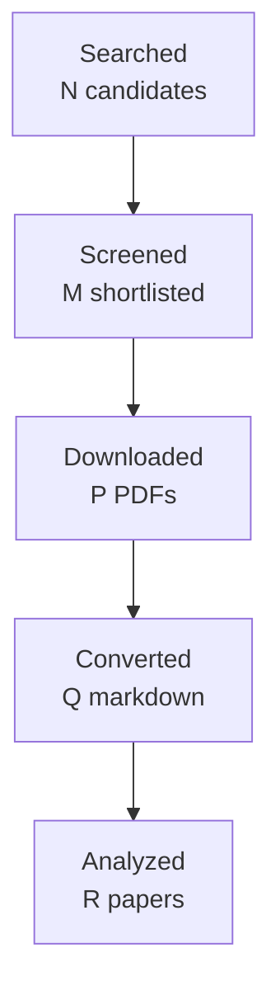

You are one worker inside an automated literature-review pipeline.
A script, not a person, reads your reply. Follow these rules exactly:
- Do the task completely in this single reply. Do not ask questions and do not
  wait for confirmation.
- Reply with the requested artifact block(s) only: no preamble, no commentary
  outside the blocks. Each block starts with a line `===BEGIN <name>===` and
  ends with a line `===END <name>===`; the content between those lines is
  written to a file verbatim.
- Never invent papers, identifiers, numbers, or quotes. Leave unknown fields
  out or mark them as unknown.
- Do not use your code tool, canvas, or connectors; plain text is enough.

# Task: write the final research report

Research topic: **work-item state, event factuality, temporal reasoning, and conflicting revisions in workplace communication: tracking whether an event is planned, confirmed, revoked, completed, or contradicted**
Run id: `0ecdd7e4a549`  Round: 4 of at most 4

Write the final report in Markdown following the template below exactly:
same section names in the same order, `[HIGH]`/`[MEDIUM]`/`[LOW]` confidence
tags on every finding, `[ACADEMIC]`/`[ENGINEERING]` labels on every gap, at
least one Mermaid `flowchart TD` diagram, LaTeX (`$...$`) for formulas, and
evidence citations as `[paper_id]`. Cite only the paper ids listed under
"Papers reviewed". In Methodology state that the papers were read through
the host's web tool and give the access level of each paper. Leave no
template placeholder in the output. Do not write a line that starts with
`===` inside the report.

Round History: use exactly these rows (they are computed by the pipeline):
| 1 | 8096ea3adc6c | work-item state, event factuality, temporal reasoning, and conflicting revisions in workplace communication: tracking whether an event is planned, confirmed, revoked, completed, or contradicted | 13 | initial shortlist | 5 academic, 3 engineering |
| 2 | 9537e966ca79 | Longitudinal event and work-item state transitions in dialogue and operational communication, with emphasis on supersession, correction, contradiction, reopening, source-relative factuality, evidential confirmation, and preservation of historical state. | 9 | 0 resolved | 5 academic, 3 engineering |
| 3 | 95d3525d59e7 | Natural-language longitudinal work-item revision in workplace and operational communication: distinguishing supersession, correction, supplementation, contradiction, reopening, unresolved conflict, and claimed versus independently confirmed completion. | 9 | 0 resolved | 5 academic, 3 engineering |
| 4 | 0ecdd7e4a549 | Direct empirical NLP methods for longitudinal work-item revision in workplace or operational communication, especially relation labeling for supersession/correction/supplementation/reopening/conflict and evidence models separating claimed completion from independently corroborated completion. | 7 | academic gaps of the previous round | 5 academic, 3 engineering |
Stop reason line: 4-round cap reached

Research Gaps: list every gap that is still open with its classification,
priority, and the rounds that already searched for it. An unresolved gap is
never presented as accepted or closed; say plainly that the literature has
not answered it yet.

Query variants used:
- direct empirical nlp longitudinal work-item revision workplace operational communication, especially relation labeling supersession/correction/supplementation/reopening/conflict evidence separating claimed independently corroborated completion.
- direct empirical nlp
- direct longitudinal work-item revision workplace operational communication, especially relation labeling supersession/correction/supplementation/reopening/conflict evidence separating claimed independently corroborated completion.
- empirical longitudinal work-item revision workplace operational communication, especially relation labeling supersession/correction/supplementation/reopening/conflict evidence separating claimed independently corroborated completion.
- nlp longitudinal work-item revision workplace operational communication, especially relation labeling supersession/correction/supplementation/reopening/conflict evidence separating claimed independently corroborated completion.
- direct empirical nlp longitudinal work-item
- direct empirical nlp revision workplace
- direct empirical nlp operational communication,

## Project context you must work within

This is the project's own description of the problem, its boundaries,
and the distinctions it needs preserved. It governs what counts as
relevant; the academic task names alone do not.

# Topic 06 context — Work-item state, event factuality, time, and conflicting revisions

## Why this Topic exists

Knowing that an action or decision was mentioned is not enough. msgloom must know its current evidence-backed state: requested, proposed, planned, approved, completed, revoked, superseded, disputed, conditional, or still unresolved. Business communication contains future plans, retrospective reports, corrections, contradictions, changing deadlines, and statements with different effective times.

A dangerous failure is converting “we plan to send Friday” into “sent”, or treating an old approval as current after a revocation. Topic 06 therefore owns **state evolution and temporal/factual reasoning over Topic evidence**.

## Core research object

Maintain an evidence-backed timeline/state model that distinguishes:

- utterance/message time;
- event/effective time;
- deadline/constraint time;
- observed collection time/version;
- factuality/modality (planned, asserted, confirmed, negated, hypothetical, conditional);
- supersession, supplementation, contradiction, and unresolved conflict;
- current accepted assessment versus historical assessments.

The model must preserve evidence rather than overwrite history.

## Product and phase relevance

Phase 1 triage needs current-enough actions, deadlines, risks, and limitations from supplied evidence. Phase 2 investigation can obtain more history/evidence to resolve uncertain state. Reports must not present stale accepted assessments as current when newer input is pending.

## Relationships to other Topics

| Topic | Relationship |
| --- | --- |
| 03 | Stable Topic identity determines which evidence belongs in the same longitudinal state history. |
| 04 | Correct reference/response scope determines what was approved, revoked, answered, or changed. |
| 05 | Supplies extracted actions, commitments, decisions, deadlines, and conditions whose state evolves. |
| 07 | Retrieves missing evidence when current state cannot be resolved from available sources. |
| 08 | State evidence may come from document versions, tables, attachments, or screenshots. |
| 09 | Briefing must distinguish new developments from still-open state and avoid repeating superseded facts. |
| 10 | Evaluates current-state correctness, contradiction handling, evidence support, and uncertainty. |

## Key conceptual distinctions

- Mentioned event ≠ factual event.
- Planned ≠ completed.
- Asserted complete ≠ independently confirmed complete.
- Message timestamp ≠ event/effective time.
- Later message ≠ automatically superseding message.
- Contradiction ≠ supersession.
- Absence of new evidence ≠ completion.
- Correction creates a new assessment and lineage; it does not erase prior source records.

## High-value academic terminology

- event factuality prediction; factuality profiling;
- event modality; event certainty; event veridicality;
- negation detection; speculation/hedging detection;
- temporal information extraction; temporal relation extraction;
- event temporal ordering; temporal relation classification;
- TimeML / temporal graphs / temporal constraint reasoning;
- event status tracking; state tracking; dialogue state tracking (transfer only where semantics match);
- event evolution / event update / timeline extraction;
- contradiction detection; natural language inference (NLI);
- belief revision; truth maintenance systems (TMS); assumption-based truth maintenance;
- knowledge-base revision; temporal knowledge graphs;
- document/version supersession; revision tracking; change detection;
- provenance-aware state / event sourcing (engineering/background literature).

## Query families

- `"event factuality prediction" NLP`
- `event modality certainty negation speculation`
- `"temporal relation extraction" event ordering`
- `"event temporal ordering" document`
- `"event status tracking" text`
- `"belief revision" natural language evidence`
- `"truth maintenance" conflicting evidence`
- `contradiction supersession document revisions`
- `temporal knowledge graph event state update`
- `business email deadline change completion status`

## False friends / exclusions

- pure date extraction without event relation;
- Topic 05 action extraction alone;
- generic NLI benchmarks where the system is not maintaining a longitudinal state;
- latest-message-wins heuristics;
- workflow-engine state machines with no language/evidence uncertainty;
- update summarization (Topic 09), which consumes state rather than defines its truth semantics.

## Gap-evaluation guidance

Prioritize errors that can mark open work complete, resurrect superseded work, lose a changed deadline, or resolve contradictions without evidence. Prefer explicit state transitions with provenance over one opaque “current summary”. When the unresolved state is caused by missing evidence rather than reasoning limitations, hand off an evidence need to Topic 07.

## How to use this file

This file is the self-contained research context for this Topic. A future AI research agent should read **this file first**, then `BRIEF.md`, then any existing `CURRENT_STATUS.md`, gap decisions, reports, manifests, and prior-round artifacts in this folder. The aim is that an agent given only this Topic folder can reconstruct the project intent, Topic boundary, dependencies, search vocabulary, and gap-prioritization logic without relying on the original ChatGPT conversation.

If the full repository is available, the authoritative product documents remain `../../docs/design-brief.md`, `../../docs/design-principles.md`, `../../docs/design.md`, and `../../docs/phase-roadmap.md`. This file explains how those product constraints apply to this research Topic; it does not replace or approve changes to those design documents.

## Shared msgloom background

msgloom is a personal work-information system for one user. It is intended to process very large daily volumes of work communication, initially Outlook email and Microsoft Teams, while ensuring that **work requiring the user's response is not missed** and reducing how much the user must read to stay current.

The product is organized around **Topics**, not message summaries. A Topic is a concrete work matter described by information from one or more sources. One message can contain several Topics; one Topic can span many messages, conversations, attachments, groups, and eventually multiple sources. A conversation or Group is therefore not automatically one Topic.

The report contract is the ultimate product pressure on all ten research Topics. Reports must preserve every due Topic and the decision-relevant information needed to act on it, including developments, actions, deadlines, conditions, risks, uncertainty, and links back to exact source evidence. Missing or conflicting information must remain visible rather than being silently filled in.

The design decision order is important when evaluating research gaps: user permissions are fixed; then preserve correct meaning and report coverage; then traceability and recovery; then usability/maintenance; finally speed, brevity, and token savings. A method that is faster but loses a condition, deadline, branch, source relation, or important Topic is not an improvement for msgloom.

Important persistent principles:

- Use deterministic code for reliable mechanical relationships and AI for language understanding/judgement.
- Preserve source bytes, versions, stage history, identities, and lineage. New assessments do not erase old evidence.
- Group only on reliable relationships. Similar subjects, participants, wording, or model labels are not enough to prove Topic identity.
- Keep uncertain relationships separate and make the reason for uncertainty visible.
- Brevity must come from concise wording and layered detail, never from omitting decision-essential information.
- User-reviewed examples, missed important work, false alerts, wrong grouping, lost actions/deadlines, and evidence that changes a decision matter more than paper count or message throughput.

## Research-programme relationship

The ten Topics form a dependency network rather than ten independent literature reviews. A useful conceptual flow is:

```text
01 source/conversation structure
        ↓
02 within-message Topic spans/membership
        ↓
03 cross-thread/source Topic identity
        ↓
04 reference and response scope
        ↓
05 actions / requests / commitments / decisions
        ↓
06 state / factuality / time / revision
        ↓
07 retrieve missing context when needed
        ↘
08 understand attachments / tables / images
        ↓
09 incremental personalized briefing
        ↓
10 evidence, completeness, calibration, reliability evaluation
```

This is not a strict processing pipeline. Several Topics feed each other, and Topic 10 is cross-cutting. The numbering primarily gives a research order and ownership boundary so that one Topic does not silently absorb the whole product problem.

## Gap-evaluation rules inherited from Topics 01 and 02

The Research Pipeline must evaluate gaps using **project value**, not just academic novelty. The following rules are part of the context for every Topic:

1. A machine-classified `HIGH` or `ACADEMIC` gap does **not** automatically authorize another literature round.
2. After each academic round, perform a human/project-value review: decide whether the uncertainty is best addressed by more papers, engineering experiments, a later Topic, production-domain data, candidate-method selection, or no further current work.
3. Prefer targeted academic follow-up over broad searching. Do not fill paper quotas with weakly related literature.
4. Distinguish direct target-domain evidence from transfer methods/evaluation evidence. Transfer evidence can justify a mechanism or experiment, not production-email accuracy.
5. Engineering validation may use independent synthetic/adversarial fixtures and public data. Lack of production mailbox examples is not a reason to stop work that can be validly completed without them.
6. Never claim production representativeness from synthetic or transfer evidence. Record it as deferred until suitable authorized domain data exists.
7. If a gap belongs to another Topic, hand it off explicitly rather than duplicating research.
8. Research closure means **everything actionable at the current stage is complete and remaining work is explicitly deferred/handed off**. It does not mean literature exhaustion, production accuracy, or architecture approval.
9. For new academic work, use terminology refinement, strict paper admission, manual/controlled canonical acquisition, corpus freeze, fresh isolated Pipeline runs, direct-vs-transfer labels, independent review, strict validation, and post-round gap review. These are lessons learned from Topics 01 and 02.
10. For engineering research, keep gold independent from the component under test; structurally separate prediction inputs from evaluation gold/future context; count false positives and false negatives in end-to-end denominators; use clean-workspace reproducibility, mutation/regression tests, and fresh independent methodological review.

## Work handed to this topic by an earlier one

Treat each entry as a starting condition, not as something to
rediscover. Where a sending topic left a gap open it is still open:
do not report it as established. Respect the stated ownership
boundary and do not absorb what the sender still owns.

**None of this is evidence for your own report.** It scopes your
work; it does not support a finding or a gap. Only papers this
topic admitted can do that.

# Inherited handoffs

Everything an earlier Topic explicitly handed to this one, copied in full so
that this folder is enough on its own. You do not need to open an earlier
Topic's documents to start work here.

Each entry states what was handed over, what the sending Topic still owns, and
what it had established or left open at the time. A handoff is not a finding:
where the sender left a gap open, it is still open.

## From Topic 05 — Action items, requests, commitments and decisions

*Completed 2026-09-16. 4 rounds, 48 papers, review accepted at faithfulness
0.93. Nine gaps left open, none downgraded.*

**Handed to Topic 06.** Whether an extracted commitment is later confirmed,
revoked, completed or contradicted. Topic 05 emits the **utterance-time**
semantic event — what was said, by whom, about what, with which deadline and
conditions — and explicitly does not decide whether it stays valid. Its
report states the boundary: Topic 05 should "emit utterance-time semantic
events for Topic 06 instead of deciding whether they later remain valid".

**What Topic 05 established.** Extraction quality depends jointly on act
classification and argument attachment; a correct act label with the wrong
owner or deadline is not a usable event. Context helps and also hurts:
the literature shows both gains and context-induced degradation, which is why
Topic 05 leaves the context window an open engineering question.

**What Topic 05 left open, and Topic 06 must not treat as settled:**

- *(ACADEMIC, HIGH)* Owner and assignee extraction is weakly evidenced,
  above all for implicit owners, group ownership and owners recoverable only
  from organisational context. An event arriving without a confident owner is
  the normal case, not an error.
- *(ACADEMIC, HIGH)* Deadline binding is unresolved: a date in a message is
  not necessarily that action's deadline.
- *(ACADEMIC, HIGH)* Attaching conditions, negation and modality to the right
  action when several occur together. A conditional commitment that Topic 06
  tracks as firm would be wrong from the start.

**Boundary.** Topic 06 owns state and revision over time. Topic 05 owns what
the event *is* at the moment it was uttered, and its open gaps travel with
the event.


Papers reviewed:
- paper_id `2103.08541` — Get Your Vitamin C! Robust Fact Verification with Contrastive Evidence (Tal Schuster, Adam Fisch, Regina Barzilay; 2021)
- paper_id `2606.18037` — ProvenanceGuard: Source-Aware Factuality Verification for MCP-Based LLM Agents (Ander Alvarez, Santhiya Rajan, Samuel Mugel et al.; 2026)
- paper_id `2210.15067` — arXivEdits: Understanding the Human Revision Process in Scientific Writing (Chao Jiang, Wei Xu, Samuel Stevens; 2022)
- paper_id `2007.14864` — How and Why is An Answer (Still) Correct? Maintaining Provenance in Dynamic Knowledge Graphs (Garima Gaur, Arnab Bhattacharya, Srikanta Bedathur; 2020)
- paper_id `2406.19764` — Belief Revision: The Adaptability of Large Language Models Reasoning (Bryan Wilie, Samuel Cahyawijaya, Etsuko Ishii et al.; 2024)
- paper_id `2110.08222` — DialFact: A Benchmark for Fact-Checking in Dialogue (Prakhar Gupta, Chien-Sheng Wu, Wenhao Liu et al.; 2022)
- paper_id `manual-d574dff39d` — Email Task Management: An Iterative Relational Learning Approach (Rinat Khoussainov, Nicholas Kushmerick; 2005)
- paper_id `doi-10-1016-j-knosys-2016-07-032` — Cross-document event ordering through temporal, lexical and distributional knowledge (Borja Navarro-Colorado, Estela Saquete; 2016)
- paper_id `doi-10-1007-s10579-009-9089-9` — FactBank: a corpus annotated with event factuality (Roser Saurí, James Pustejovsky; 2009)
- paper_id `doi-10-1016-j-ipm-2021-102836` — End-to-end event factuality prediction using directional labeled graph recurrent network (Xiao Liu, Heyan Huang, Yue Zhang; 2022)
- paper_id `doi-10-1007-s11390-024-2655-1` — Document-Level Event Factuality Identification via Reinforced Semantic Learning Network (Zhong Qian, Pei-Feng Li, Qiao-Ming Zhu et al.; 2025)
- paper_id `doi-10-18653-v1-2021-emnlp-main-815` — Utilizing Relative Event Time to Enhance Event-Event Temporal Relation Extraction (Haoyang Wen, Heng Ji; 2021)
- paper_id `manual-eef7a0219f` — More than Classification: A Unified Framework for Event Temporal Relation Extraction (Quzhe Huang, Yutong Hu, Shengqi Zhu et al.; 2023)
- paper_id `doi-10-1007-s10458-012-9202-0` — Representing and monitoring social commitments using the event calculus (Federico Chesani, Paola Mello, Marco Montali et al.; 2012)
- paper_id `1909.05360` — Joint Event and Temporal Relation Extraction with Shared Representations and Structured Prediction (Rujun Han, Qiang Ning, Nanyun Peng; 2019)
- paper_id `doi-10-1162-tacl-a-00182` — Dense Event Ordering with a Multi-Pass Architecture (Nathanael Chambers, Taylor Cassidy, Bill McDowell et al.; 2014)
- paper_id `1909.00429` — An Improved Neural Baseline for Temporal Relation Extraction (Qiang Ning, Sanjay Subramanian, Dan Roth; 2019)
- paper_id `doi-10-18653-v1-d18-1155` — Temporal Information Extraction by Predicting Relative Time-lines (Artuur Leeuwenberg, Marie-Francine Moens; 2018)
- paper_id `doi-10-1016-j-artint-2003-08-003` — Weakening conflicting information for iterated revision and knowledge integration (Salem Benferhat, Souhila Kaci, Daniel Le Berre et al.; 2004)
- paper_id `1804.06020` — Improving Temporal Relation Extraction with a Globally Acquired Statistical Resource (Qiang Ning, Hao Wu, Haoruo Peng et al.; 2018)
- paper_id `doi-10-1017-cbo9780511526664-007` — On the difference between updating a knowledge base and revising it (Hirofumi Katsuno, Alberto O. Mendelzon; 1992)
- paper_id `doi-10-18653-v1-2023-findings-acl-44` — Towards Generative Event Factuality Prediction (John Murzaku, Tyler Osborne, Amittai Aviram et al.; 2023)
- paper_id `2104.01146` — An Empirical Characterization of Event Sourced Systems and Their Schema Evolution -- Lessons from Industry (Michiel Overeem, Marten Spoor, Slinger Jansen et al.; 2021)
- paper_id `doi-10-1093-jos-ffn013` — Agreement, Disputes and Commitments in Dialogue (Alex Lascarides, Nicholas Asher; 2009)
- paper_id `doi-10-1016-0020-0255-94-90059-0` — Resolution of time concepts in temporal databases (Sharma Chakravarthy, Seung-Kyum Kim; 1994)
- paper_id `doi-10-1145-1082473-1082754` — Layered message semantics using social commitments (Roberto A. Flores, Philippe Pasquier, Brahim Chaib-draa; 2005)
- paper_id `doi-10-1007-3-540-44503-x-20` — Why and Where: A Characterization of Data Provenance (Peter Buneman, Sanjeev Khanna, Wang-Chiew Tan; 2001)
- paper_id `doi-10-1023-a-1010318403544` — The Problem of Retraction in Critical Discussion (Erik C. W. Krabbe; 2001)
- paper_id `doi-10-1016-j-ipm-2026-104709` — HeterMV: Multi-view reasoning over source-aware heterogeneous evidence graph for multi-source fact verification (Junnan Gu, Weimin Li, Fangfang Liu et al.; 2026)
- paper_id `manual-2362cbe877` — ProPara-CRTS: Canonical Referent Tracking for Reliable Evaluation of Entity State Tracking in Process Narratives (Bingyang Ye, Timothy Obiso, Jingxuan Tu et al.; 2025)
- paper_id `1805.06975` — Tracking State Changes in Procedural Text: A Challenge Dataset and Models for Process Paragraph Comprehension (Bhavana Dalvi Mishra, Lifu Huang, Niket Tandon et al.; 2018)
- paper_id `2608.20116` — When Text and Numbers Disagree: Evidence Arbitration in Large Language Models (Mattia Carletti, Edward Phillips, Fredrik K. Gustafsson et al.; 2026)
- paper_id `2406.00197` — Re3: A Holistic Framework and Dataset for Modeling Collaborative Document Revision (Qian Ruan, Ilia Kuznetsov, Iryna Gurevych; 2024)
- paper_id `doi-10-1016-0004-3702-86-90080-9` — An assumption-based TMS (Johan de Kleer; 1986)
- paper_id `manual-b3703967d3` — Joint Inference for Event Timeline Construction (Quang Do, Wei Lu, Dan Roth; 2012)
- paper_id `doi-10-18653-v1-2021-acl-long-122` — Factuality Assessment as Modal Dependency Parsing (Jiarui Yao, Haoling Qiu, Jin Zhao et al.; 2021)
- paper_id `2011.03088` — HoVer: A Dataset for Many-Hop Fact Extraction And Claim Verification (Yichen Jiang, Shikha Bordia, Zheng Zhong et al.; 2020)
- paper_id `doi-10-18653-v1-p19-1412` — Do You Know That Florence Is Packed with Visitors? Evaluating State-of-the-art Models of Speaker Commitment (Nanjiang Jiang, Marie-Catherine de Marneffe; 2019)

Access level per paper:
- `1804.06020`: full_text via https://arxiv.org/html/1804.06020
- `1805.06975`: full_text via https://arxiv.org/html/1805.06975
- `1909.00429`: full_text via https://arxiv.org/html/1909.00429
- `1909.05360`: full_text via https://arxiv.org/html/1909.05360
- `2007.14864`: full_text via https://arxiv.org/pdf/2007.14864
- `2011.03088`: full_text via https://arxiv.org/html/2011.03088
- `2103.08541`: full_text via https://arxiv.org/html/2103.08541
- `2104.01146`: full_text via https://arxiv.org/html/2104.01146
- `2110.08222`: full_text via https://arxiv.org/html/2110.08222
- `2210.15067`: full_text via https://arxiv.org/html/2210.15067
- `2406.00197`: full_text via https://arxiv.org/html/2406.00197
- `2406.19764`: full_text via https://arxiv.org/html/2406.19764
- `2606.18037`: full_text via https://arxiv.org/html/2606.18037
- `2608.20116`: full_text via https://arxiv.org/html/2608.20116
- `doi-10-1007-3-540-44503-x-20`: full_text via https://homepages.inf.ed.ac.uk/opb/papers/ICDT2001.pdf
- `doi-10-1007-s10458-012-9202-0`: full_text via https://www.researchgate.net/publication/235736562_Representing_and_Monitoring_Social_Commitments_using_the_Event_Calculus
- `doi-10-1007-s10579-009-9089-9`: full_text via https://www.researchgate.net/publication/220147734_FactBank_A_corpus_annotated_with_event_factuality
- `doi-10-1007-s11390-024-2655-1`: full_text via https://jcst.ict.ac.cn/cn/article/doi/10.1007/s11390-024-2655-1
- `doi-10-1016-0004-3702-86-90080-9`: full_text via https://www.researchgate.net/profile/Johan-Kleer/publication/220546361_An_assumption-based_TMS/links/5c0df74b4585157ac1b6bf72/An-assumption-based-TMS.pdf
- `doi-10-1016-0020-0255-94-90059-0`: abstract_only via https://www.sciencedirect.com/science/article/pii/0020025594900590
- `doi-10-1016-j-artint-2003-08-003`: full_text via https://www.cril.univ-artois.fr/~leberre/hdr.pdf
- `doi-10-1016-j-ipm-2021-102836`: full_text via https://frcchang.github.io/pub/end-to-end-xiao-liu.pdf
- `doi-10-1016-j-ipm-2026-104709`: abstract_only via https://www.sciencedirect.com/science/article/abs/pii/S0306457326001007
- `doi-10-1016-j-knosys-2016-07-032`: full_text via https://rua.ua.es/server/api/core/bitstreams/34915b7c-1b35-4684-b298-eff8bb439446/content
- `doi-10-1017-cbo9780511526664-007`: abstract_only via https://www.cambridge.org/core/books/abs/belief-revision/on-the-difference-between-updating-a-knowledge-base-and-revising-it/8ADFFF65FA776C21E8646D6F4D2434AB
- `doi-10-1023-a-1010318403544`: full_text via https://www.phil.uu.nl/ozsl/articles/krabbe03.pdf
- `doi-10-1093-jos-ffn013`: full_text via https://homepages.inf.ed.ac.uk/alex/papers/dialogue_jos.pdf
- `doi-10-1145-1082473-1082754`: full_text via https://www.researchgate.net/publication/221456697_Layered_message_semantics_using_social_commitments
- `doi-10-1162-tacl-a-00182`: full_text via https://aclanthology.org/anthology-files/pdf/Q/Q14/Q14-1022.pdf
- `doi-10-18653-v1-2021-acl-long-122`: full_text via https://aclanthology.org/2021.acl-long.122.pdf
- `doi-10-18653-v1-2021-emnlp-main-815`: full_text via https://aclanthology.org/anthology-files/pdf/emnlp/2021.emnlp-main.815.pdf
- `doi-10-18653-v1-2023-findings-acl-44`: full_text via https://aclanthology.org/2023.findings-acl.44.pdf
- `doi-10-18653-v1-d18-1155`: full_text via https://arxiv.org/html/1808.09401
- `doi-10-18653-v1-p19-1412`: full_text via https://aclanthology.org/P19-1412.pdf
- `manual-2362cbe877`: full_text via https://aclanthology.org/2025.iwcs-main.22.pdf
- `manual-b3703967d3`: full_text via https://aclanthology.org/D12-1062.pdf
- `manual-d574dff39d`: full_text via https://studylib.net/doc/8259168/email-task-management--an-iterative-relational-learning-a...
- `manual-eef7a0219f`: full_text via https://arxiv.org/html/2305.17607

Cross-paper synthesis (the source of findings, gaps, and themes):
{
 "topic": "Direct empirical NLP methods for longitudinal work-item revision in workplace or operational communication, especially relation labeling for supersession/correction/supplementation/reopening/conflict and evidence models separating claimed completion from independently corroborated completion.",
 "paper_count": 38,
 "executive_summary": "The 38-paper corpus provides strong component-level evidence for source-relative factuality, temporal ordering, longitudinal state tracking, revision alignment, provenance, contradiction handling, and evidence-based verification, but it does not directly validate the target task as an integrated workplace-communication problem. Empirical NLP results show that broader context and structured reasoning can improve temporal and state predictions, while revision datasets demonstrate recoverable alignments between successive document versions. Formal commitment, dialogue, belief-revision, and provenance work supplies precise distinctions among cancellation, correction, conflict, reopening, support, and historical persistence. However, workplace-domain evidence is narrow, no admitted study jointly labels the required revision relations across successive operational messages, and no study directly separates a completion claim from independently corroborated completion within such a longitudinal state model. All eight carried gaps therefore remain open.",
 "themes": [
  "Source-relative factuality and speaker commitment are distinct from objective or independently verified truth.",
  "Longitudinal state and temporal interpretation often benefit from document-level context, global constraints, or propagated relational information.",
  "Revision can be represented through explicit alignment, edit intention, correction, retraction, and reopening rather than by overwriting prior content.",
  "Provenance research preserves source responsibility, alternative derivations, and historical support as evidence changes.",
  "Evidence retrieval and source attribution are major bottlenecks for verification under multiple or changing sources.",
  "Formal belief-update and dialogue models preserve distinctions that current empirical NLP models do not jointly implement.",
  "Direct workplace-email evidence exists for task and message-relation learning, but not for the complete longitudinal state-revision problem studied here.",
  "Transfer evidence dominates the corpus, so performance on news, scientific documents, procedural text, synthetic reasoning, and formal dialogue does not establish workplace production accuracy."
 ],
 "findings": [
  {
   "statement": "Event factuality is explicitly modeled in the admitted factuality literature as a source-relative judgment involving polarity and certainty or commitment, rather than as direct determination of objective real-world truth.",
   "confidence": "HIGH",
   "evidence": [
    {
     "paper_id": "doi-10-1007-s10579-009-9089-9"
    },
    {
     "paper_id": "doi-10-18653-v1-2023-findings-acl-44"
    },
    {
     "paper_id": "doi-10-18653-v1-2021-acl-long-122"
    }
   ]
  },
  {
   "statement": "Speaker-commitment models generalize imperfectly to naturally occurring discourse, with especially weak results for no-commitment cases and systematic difficulty on constructions including conditionals, questions, modality, and neg-raising.",
   "confidence": "HIGH",
   "evidence": [
    {
     "paper_id": "doi-10-18653-v1-p19-1412"
    }
   ]
  },
  {
   "statement": "Across several temporal-relation benchmarks, contextual information, temporal commonsense priors, global inference, or propagated relative-time information improve temporal-relation prediction, although the size and source of the gain vary across systems and datasets.",
   "confidence": "HIGH",
   "evidence": [
    {
     "paper_id": "1804.06020"
    },
    {
     "paper_id": "1909.00429"
    },
    {
     "paper_id": "doi-10-1162-tacl-a-00182"
    },
    {
     "paper_id": "doi-10-18653-v1-2021-emnlp-main-815"
    },
    {
     "paper_id": "manual-b3703967d3"
    }
   ]
  },
  {
   "statement": "In procedural text, document-level state modeling substantially outperforms sentence-local modeling for several state-tracking measures, and referent ambiguity and incomplete transition annotation are themselves substantial sources of error.",
   "confidence": "HIGH",
   "evidence": [
    {
     "paper_id": "1805.06975"
    },
    {
     "paper_id": "manual-2362cbe877"
    }
   ]
  },
  {
   "statement": "Formal commitment and dialogue models distinguish lifecycle states such as active, satisfied, canceled, and violated, and separately model correction, retraction, persistent undisputed content, and reopening of earlier commitments.",
   "confidence": "HIGH",
   "evidence": [
    {
     "paper_id": "doi-10-1007-s10458-012-9202-0"
    },
    {
     "paper_id": "doi-10-1093-jos-ffn013"
    },
    {
     "paper_id": "doi-10-1023-a-1010318403544"
    },
    {
     "paper_id": "doi-10-1145-1082473-1082754"
    }
   ]
  },
  {
   "statement": "Scientific-document revision datasets demonstrate that successive versions can be aligned at sentence or finer granularity and that revision intent can be classified; they also show that one explicit revision request may correspond to multiple realized edits.",
   "confidence": "HIGH",
   "evidence": [
    {
     "paper_id": "2210.15067"
    },
    {
     "paper_id": "2406.00197"
    }
   ]
  },
  {
   "statement": "Provenance mechanisms can retain multiple supporting derivations or source locations as data changes, while source-aware verification models can explicitly evaluate whether a claim is supported by the correct source rather than merely by some semantically related evidence.",
   "confidence": "HIGH",
   "evidence": [
    {
     "paper_id": "doi-10-1007-3-540-44503-x-20"
    },
    {
     "paper_id": "2007.14864"
    },
    {
     "paper_id": "2606.18037"
    },
    {
     "paper_id": "doi-10-1016-j-ipm-2026-104709"
    }
   ]
  },
  {
   "statement": "Fact-verification accuracy is strongly constrained by evidence retrieval: verification degrades substantially when required evidence is not available, and retrieval becomes markedly harder as evidence chains span more documents or dialogue context.",
   "confidence": "HIGH",
   "evidence": [
    {
     "paper_id": "2011.03088"
    },
    {
     "paper_id": "2110.08222"
    }
   ]
  },
  {
   "statement": "Current language models show substantial difficulty with belief revision and conflicting-evidence arbitration, including update-versus-maintain trade-offs, presentation-order effects, modality preferences, and strong use of temporal recency as an arbitration cue.",
   "confidence": "HIGH",
   "evidence": [
    {
     "paper_id": "2406.19764"
    },
    {
     "paper_id": "2608.20116"
    }
   ]
  },
  {
   "statement": "A direct email study shows that relational information between messages and speech acts can improve task identification and message-relation prediction, while free-text work email exhibits fuzzy task boundaries that can be difficult even for human annotation.",
   "confidence": "HIGH",
   "evidence": [
    {
     "paper_id": "manual-d574dff39d"
    }
   ]
  },
  {
   "statement": "Formal temporal and belief-change work distinguishes multiple kinds of change: event time, valid time, and transaction time are used to represent retroactive, proactive, corrected, and delayed information, while belief-update theory distinguishes changes in the represented world from revisions to beliefs about a static world.",
   "confidence": "HIGH",
   "evidence": [
    {
     "paper_id": "doi-10-1016-0020-0255-94-90059-0"
    },
    {
     "paper_id": "doi-10-1017-cbo9780511526664-007"
    }
   ]
  }
 ],
 "contradictions": [
  {
   "topic": "Value of explicit transitivity constraints in temporal reasoning",
   "papers": [
    "doi-10-1162-tacl-a-00182",
    "1909.05360"
   ],
   "note": "CAEVO reports a large improvement when transitive inference is added in dense temporal ordering, whereas the structured joint model reports no gain from its transitivity constraint on TB-Dense and only 0.1 F1 on MATRES. The results come from different architectures and inference setups, so the corpus does not support a universal claim that explicit transitivity constraints will help."
  },
  {
   "topic": "Joint versus pipeline learning",
   "papers": [
    "1909.05360",
    "doi-10-1016-j-ipm-2021-102836",
    "doi-10-18653-v1-2021-acl-long-122"
   ],
   "note": "Joint or multi-task learning improves end-to-end temporal extraction in 1909.05360 and degrades when removed from DLGRN in doi-10-1016-j-ipm-2021-102836, but modal dependency parsing reports virtually identical event-extraction F1 for joint and pipeline models and slightly better gold-mention attachment for the pipeline, while joint learning helps when mentions are automatic. The benefit is therefore task- and error-regime-dependent."
  },
  {
   "topic": "Direct timeline prediction versus relation-based temporal representations",
   "papers": [
    "doi-10-18653-v1-d18-1155",
    "manual-eef7a0219f"
   ],
   "note": "Direct contextual timeline prediction outperforms indirect conversion on the TE3 split in doi-10-18653-v1-d18-1155, but loses to indirect TL2RTL on its TimeBank-Dense-derived split. Separately, manual-eef7a0219f reports gains from a logical endpoint decomposition over direct relation classification on TB-Dense and MATRES. These results do not identify one temporal representation as uniformly superior."
  },
  {
   "topic": "Benefit of explicit source-aware modeling for verification",
   "papers": [
    "2606.18037",
    "doi-10-1016-j-ipm-2026-104709"
   ],
   "note": "HeterMV reports multi-source verification gains from heterogeneous source-aware modeling, while ProvenanceGuard finds a source-blind MiniCheck baseline statistically competitive on binary rejection and identifies explicit source attribution, rather than binary rejection alone, as its distinctive advantage. The results use different tasks and metrics and should not be averaged into a single source-awareness accuracy claim."
  },
  {
   "topic": "Temporal recency versus semantic correction structure",
   "papers": [
    "2608.20116",
    "doi-10-1093-jos-ffn013"
   ],
   "note": "The evidence-arbitration experiments show that models often give strong weight to temporal recency, whereas the dialogue semantics formalization treats correction as selectively removing disavowed commitments while retaining undisputed material and can restore earlier material when a correction is itself corrected. This is a tension between observed model behavior and a formal account of revision semantics, not a head-to-head empirical comparison."
  }
 ],
 "gaps": [
  {
   "id": "gap-1",
   "description": "No admitted paper directly evaluates longitudinal state tracking across workplace messages in which one work item moves among requested, proposed, planned, approved, completed, revoked, superseded, disputed, conditional, and unresolved states while retaining historical assessments.",
   "classification": "ACADEMIC",
   "priority": "HIGH",
   "suggested_query": "workplace email enterprise chat longitudinal work item lifecycle state tracking requested planned approved completed revoked superseded disputed unresolved",
   "evidence": [
    "1805.06975",
    "doi-10-1007-s10458-012-9202-0",
    "manual-d574dff39d"
   ]
  },
  {
   "id": "gap-2",
   "description": "The corpus provides formal treatments of correction, retraction, persistence, and reopening and empirical work on document revision, but does not establish a natural-language method evaluated across successive operational communications for distinguishing supersession, correction, supplementation, contradiction, reopening, and unresolved conflict.",
   "classification": "ACADEMIC",
   "priority": "HIGH",
   "suggested_query": "natural language dialogue revision relation classification supersession correction supplementation contradiction reopening unresolved conflict longitudinal",
   "evidence": [
    "doi-10-1093-jos-ffn013",
    "doi-10-1023-a-1010318403544",
    "2210.15067",
    "2406.00197",
    "2103.08541"
   ]
  },
  {
   "id": "gap-3",
   "description": "No admitted paper jointly evaluates source-relative factuality, temporal ordering, lifecycle state, contradiction, and provenance as one longitudinal model; the admitted studies validate separate components and their combination remains untested.",
   "classification": "ACADEMIC",
   "priority": "HIGH",
   "suggested_query": "\"event factuality\" temporal relation contradiction provenance lifecycle longitudinal joint model",
   "evidence": [
    "doi-10-1007-s10579-009-9089-9",
    "1909.00429",
    "doi-10-1007-s10458-012-9202-0",
    "2606.18037",
    "2608.20116"
   ]
  },
  {
   "id": "gap-4",
   "description": "Direct target-task evidence for workplace email, Teams-like dialogue, or comparable operational communication remains absent. One admitted workplace-email study evaluates task and message-relation learning, but not longitudinal factuality, lifecycle revision, supersession, or evidence-backed current-state resolution.",
   "classification": "ACADEMIC",
   "priority": "HIGH",
   "suggested_query": "workplace email enterprise chat operational communication task state tracking revision factuality temporal commitment",
   "evidence": [
    "manual-d574dff39d",
    "2110.08222"
   ]
  },
  {
   "id": "gap-5",
   "description": "The admitted factuality literature models what a source presents or commits to, and the fact-verification literature evaluates corroborating evidence, but no admitted paper establishes how to distinguish an author's assertion that work is complete from independent confirmation or stronger evidential verification of completion in longitudinal operational communication.",
   "classification": "ACADEMIC",
   "priority": "HIGH",
   "suggested_query": "dialogue event factuality evidentiality source attribution claimed completion independent confirmation corroboration longitudinal",
   "evidence": [
    "doi-10-1007-s10579-009-9089-9",
    "doi-10-18653-v1-2023-findings-acl-44",
    "2011.03088",
    "2110.08222",
    "2606.18037",
    "doi-10-1016-j-ipm-2026-104709"
   ]
  },
  {
   "id": "gap-6",
   "description": "Evaluation is still needed on adversarial longitudinal sequences such as plan-to-cancel, approve-to-revoke, deadline changes, contradictory same-time updates, out-of-order ingestion, stale messages arriving late, and completion claims later corrected.",
   "classification": "ENGINEERING",
   "priority": "HIGH",
   "evidence": [
    "2103.08541",
    "2406.19764",
    "2608.20116",
    "doi-10-1093-jos-ffn013"
   ]
  },
  {
   "id": "gap-7",
   "description": "The combined representation of message time, event or effective time, deadline or constraint time, and observed collection or version time has not been benchmarked for the target state-resolution task; the corpus contains related temporal formalisms and temporal NLP evaluations rather than such a combined benchmark.",
   "classification": "ENGINEERING",
   "priority": "HIGH",
   "evidence": [
    "doi-10-1016-0020-0255-94-90059-0",
    "doi-10-18653-v1-d18-1155",
    "doi-10-18653-v1-2021-emnlp-main-815"
   ]
  },
  {
   "id": "gap-8",
   "description": "The corpus does not evaluate a provenance-preserving implementation for this target state-resolution task that stores immutable source observations and successive assessments while exposing a separately derived current-state view.",
   "classification": "ENGINEERING",
   "priority": "HIGH",
   "evidence": [
    "2007.14864",
    "doi-10-1007-3-540-44503-x-20",
    "2104.01146",
    "2606.18037"
   ]
  }
 ],
 "actionable_insights": [
  "Synthesis-derived recommendation: represent source observations, interpreted assessments, and any derived current-state view as separate layers so that later reinterpretation does not overwrite historical evidence.",
  "Synthesis-derived recommendation: represent longitudinal revision as explicit relation edges such as supersedes, corrects, supplements, reopens, conflicts-with, and unresolved, with an abstention or unknown state rather than inferring revision from message recency alone.",
  "Synthesis-derived recommendation: keep source-relative claimed factuality separate from an evidence-strength or corroboration dimension, so that a statement of completion and independent confirmation of completion are not encoded as the same property.",
  "Synthesis-derived recommendation: preserve distinct message time, event or effective time, deadline or constraint time, and collection or version time when those values are available, rather than collapsing them into one timestamp.",
  "Synthesis-derived recommendation: evaluate the state model with adversarial longitudinal sequences, including late ingestion, changed deadlines, cancellation after planning, revocation after approval, contradictory same-time evidence, and corrected completion claims.",
  "Synthesis-derived recommendation: permit incompatible assessments to coexist with explicit provenance until the available evidence justifies a resolved current assessment, rather than deleting a conflicting historical record.",
  "Synthesis-derived recommendation: treat global consistency, transitivity, and joint inference as candidate mechanisms to benchmark rather than assumptions, because the admitted empirical results show architecture- and dataset-dependent gains.",
  "Synthesis-derived recommendation: require target-domain evaluation on workplace or operational communication before making production-accuracy claims, because most component evidence in this corpus comes from news, procedural text, scientific revision, formal dialogue, synthetic reasoning, or general fact verification."
 ],
 "confidence_summary": "Confidence is high in the component-level findings because multiple distinct literatures independently establish source-relative factuality, temporal-relation modeling, longitudinal state tracking, revision alignment, provenance, and evidence-retrieval effects. Confidence is medium for transferring those mechanisms to operational communication because only one admitted study directly uses workplace email and it addresses task/message relations rather than longitudinal state revision. Confidence is low for the integrated target problem: no admitted paper evaluates the full combination of revision-relation labeling, state lifecycle, factuality, time, conflict, provenance, and independent corroboration in successive workplace messages. The corpus therefore supports well-supported design principles and candidate mechanisms, not a validated combined production model.",
 "limitations": [
  "The synthesis is based on the supplied reduced per-paper analyses rather than fresh inspection of the full papers, so details not retained in those analyses cannot be recovered here.",
  "Most empirical NLP evidence comes from news, procedural narratives, scientific-document revision, fact verification, or synthetic reasoning; those results are transfer evidence rather than direct workplace-state-tracking evidence.",
  "Formal dialogue, commitment, truth-maintenance, temporal-database, and belief-revision papers establish semantic distinctions or algorithms but do not by themselves demonstrate NLP classification accuracy on operational communication.",
  "The workplace-email study directly supports message/task relational learning but does not evaluate the longitudinal lifecycle and revision labels required by this topic.",
  "Several apparent contradictions compare different corpora, architectures, annotation schemes, or metrics; they establish that effects are not universal, not that one paper invalidates another.",
  "The component papers do not jointly validate a combined scheme. Factuality, temporal relations, state tracking, provenance, verification, and revision alignment have largely been evaluated separately.",
  "The inherited Topic 05 handoff and project context were treated only as scoping conditions and were not used as evidence for any finding or for closing any gap.",
  "No duplicate titles are apparent among the 38 supplied analyses, but the reduced records do not provide enough bibliographic metadata to independently rule out differently titled or differently identified duplicate publications."
 ],
 "gap_status": [
  {
   "id": "gap-1",
   "status": "open",
   "note": "Procedural state tracking, formal commitment lifecycles, and email task-relation learning cover separate portions of the problem, but no admitted paper evaluates the specified multi-state work-item lifecycle across successive workplace messages while retaining historical assessments.",
   "evidence": [
    "1805.06975",
    "doi-10-1007-s10458-012-9202-0",
    "manual-d574dff39d"
   ]
  },
  {
   "id": "gap-2",
   "status": "open",
   "note": "Formal dialogue work distinguishes correction, retraction, persistence, and reopening, while scientific revision datasets align and classify document edits, but no admitted empirical NLP study classifies the complete operational relation set across successive communications.",
   "evidence": [
    "doi-10-1093-jos-ffn013",
    "doi-10-1023-a-1010318403544",
    "2210.15067",
    "2406.00197",
    "2103.08541"
   ]
  },
  {
   "id": "gap-3",
   "status": "open",
   "note": "Separate admitted studies evaluate factuality, temporal relations, lifecycle or commitment state, conflicting evidence, and provenance, but none evaluates all of these jointly as one longitudinal model.",
   "evidence": [
    "doi-10-1007-s10579-009-9089-9",
    "1909.00429",
    "doi-10-1007-s10458-012-9202-0",
    "2606.18037",
    "2608.20116"
   ]
  },
  {
   "id": "gap-4",
   "status": "open",
   "note": "manual-d574dff39d supplies direct workplace-email evidence for task and message-relation learning, so workplace email is not wholly absent from the corpus; however, it does not evaluate the target longitudinal state, factuality, supersession, correction, or corroboration task. Direct target-task operational evidence therefore remains open.",
   "evidence": [
    "manual-d574dff39d",
    "2110.08222"
   ]
  },
  {
   "id": "gap-5",
   "status": "open",
   "note": "Source-relative factuality and evidence-based verification are both represented in the corpus, but no admitted paper evaluates the specific distinction between a longitudinal work-item completion assertion and independent corroboration of that completion in operational communication.",
   "evidence": [
    "doi-10-1007-s10579-009-9089-9",
    "doi-10-18653-v1-2023-findings-acl-44",
    "2011.03088",
    "2110.08222",
    "2606.18037",
    "doi-10-1016-j-ipm-2026-104709"
   ]
  },
  {
   "id": "gap-6",
   "status": "open",
   "note": "Revision-aware fact verification, belief revision, conflict arbitration, and formal correction semantics each cover selected adversarial changes, but no admitted study evaluates the specified end-to-end longitudinal adversarial suite.",
   "evidence": [
    "2103.08541",
    "2406.19764",
    "2608.20116",
    "doi-10-1093-jos-ffn013"
   ]
  },
  {
   "id": "gap-7",
   "status": "open",
   "note": "The temporal-database literature supplies a related event/valid/transaction-time formalization and temporal NLP studies evaluate event ordering, but no admitted benchmark combines message, effective, deadline, and collection/version time for the target state-resolution task.",
   "evidence": [
    "doi-10-1016-0020-0255-94-90059-0",
    "doi-10-18653-v1-d18-1155",
    "doi-10-18653-v1-2021-emnlp-main-815"
   ]
  },
  {
   "id": "gap-8",
   "status": "open",
   "note": "Provenance and event-sourcing studies demonstrate relevant storage and update mechanisms, but they do not evaluate a provenance-preserving implementation of this specific NLP state-resolution task with immutable observations, successive assessments, and a derived current-state view.",
   "evidence": [
    "2007.14864",
    "doi-10-1007-3-540-44503-x-20",
    "2104.01146",
    "2606.18037"
   ]
  }
 ]
}

Report template:
## Final Research Report Template

The final report MUST follow this structure. Every section is required
unless marked (optional). Sections marked **[EVIDENCE REQUIRED]** must
cite specific papers with `[arxiv_id]` or `[Author, Year]` references.

````markdown
# Research Report: [Topic]

## Contents

- [Round History](#round-history)
- [Executive Summary](#executive-summary)
- [Research Question](#research-question)
- [Methodology](#methodology)
- [Papers Reviewed](#papers-reviewed)
- [Research Landscape](#research-landscape)
- [Confidence-Graded Findings](#confidence-graded-findings)
- [Research Gaps](#research-gaps)
- [Practical Recommendations](#practical-recommendations)
- [Evidence Map](#evidence-map)
- [References](#references)
- [Appendix: Run Metadata](#appendix-run-metadata)

## Round History

Iterative gap-closure loop (hard cap: 4 rounds). See
`references/iterative-synthesis.md` for the full loop definition.

| Round | Run ID | Topic / Gap Focus | New Papers | Gaps Addressed | Remaining Gaps |
|-------|--------|-------------------|------------|----------------|----------------|
| 1 | <run-id-1> | <original topic> | N | initial shortlist | A academic, E engineering |
| 2 | <run-id-2> | <academic gap focus> | N | … | … |

**Stop reason**: [converged — no open gaps | 4-round cap reached |
new search returned 0 relevant papers | remaining gaps marked out-of-scope]

## Executive Summary

[3-5 sentences: research question, scope (N papers from M sources),
key conclusion, and confidence level. Must mention the strongest finding
and the most significant gap.]

**Scope**: N papers analyzed from [sources] over [date range]
**Overall Confidence**: High / Medium / Low
**Verdict**: [IMPLEMENTATION_READY | HAS_GAPS | NOT_APPLICABLE]

## Research Question

[Precise statement of what was investigated. Include scope boundaries:
what's in vs. out.]

## Methodology

### Search Strategy
- **Sources**: [arXiv, Google Scholar, Semantic Scholar, ...]
- **Query variants**: [list the key queries used]
- **Time window**: [date range]
- **Screening**: [BM25 + sub-agent / BM25 only]

### Pipeline Summary



| Metric | Count |
|--------|-------|
| Total candidates | N |
| After screening | M |
| Downloaded | P |
| Successfully converted | Q |
| Deeply analyzed | R |
| Iterations (if system-building) | I |

## Papers Reviewed

| # | Title | Authors | Year | Venue | Quality Score | Relevance |
|---|-------|---------|------|-------|--------------|-----------|
| 1 | [Title] [arxiv_id] | First Author et al. | YYYY | Venue | X.X/5 | HIGH / MEDIUM / LOW |

## Research Landscape

### Theme 1: [Theme Name]

**Coverage**: N papers | **Confidence**: High / Medium / Low
**Supporting papers**: [arxiv_id_1], [arxiv_id_2], ...

[Narrative description of the theme with evidence citations.] **[EVIDENCE REQUIRED]**

Key findings:
1. [Finding with citation: "Paper A [arxiv_id] demonstrated X with Y% improvement"]
2. [Finding with citation]

### Theme 2: [Theme Name]
[Same structure as Theme 1]

## Methodology Comparison

| Approach | Papers | Strengths | Weaknesses | Best For | Performance |
|----------|--------|-----------|------------|----------|-------------|
| [Approach A] | [ids] | ... | ... | ... | [metric if available] |
| [Approach B] | [ids] | ... | ... | ... | [metric if available] |

## Confidence-Graded Findings

### 🟢 High Confidence (supported by 3+ papers with consistent results)

1. **[Finding]** — Supported by [paper_1], [paper_2], [paper_3].
   [Brief evidence summary with specific numbers if available.]

### 🟡 Medium Confidence (supported by 1-2 papers or with caveats)

1. **[Finding]** — Reported by [paper_1]. [Caveat or limitation.]

### 🔴 Low Confidence (preliminary, single-source, or contradicted)

1. **[Finding]** — Only reported by [paper_1]. [Why confidence is low.]

## Trade-Off Analysis

| Decision | Option A | Option B | Recommendation |
|----------|----------|----------|----------------|
| [Design choice] | [Pros/cons with evidence] | [Pros/cons with evidence] | [Which and why] |

## Points of Agreement **[EVIDENCE REQUIRED]**

1. [Consensus finding] — Confirmed by [paper_1], [paper_2], [paper_3].

## Points of Contradiction **[EVIDENCE REQUIRED]**

1. **[Topic]**: [Paper A] claims X, but [Paper B] shows Y.
   - **Possible explanation**: [Why they disagree — different datasets, metrics, scope]
   - **Implication**: [What this means for the reader]

## Research Gaps

| # | Gap | Type | Severity | Impact on Goals |
|---|-----|------|----------|----------------|
| 1 | [What's missing] | ACADEMIC / ENGINEERING | HIGH / MEDIUM / LOW | [Why it matters] |

### Academic Gaps (require more papers)

1. **[Gap]**: [Description]. Suggested queries: `"query 1"`, `"query 2"`.

### Engineering Gaps (fillable without papers)

1. **[Gap]**: [Description]. Suggested resolution: [approach].

## Reproducibility Notes

| Paper | Code Available | Data Available | Sufficient Detail | License |
|-------|---------------|----------------|-------------------|---------|
| [arxiv_id] | ✅ [link] / ❌ | ✅ [link] / ❌ | ✅ / ⚠️ / ❌ | [license] |

## Practical Recommendations **[EVIDENCE REQUIRED]**

1. **[Recommendation]** — Based on [evidence from papers].
   *Confidence*: High / Medium / Low

## Future Directions

1. [Research direction enabled by current findings]

## Readiness Assessment (System-Building Mode)

### Verdict: [IMPLEMENTATION_READY | HAS_GAPS | NOT_APPLICABLE]

### Assessment Summary
[2-3 sentences: Is the synthesis sufficient to design and build the system?]

### Coverage Matrix

| Dimension | Status | Evidence |
|-----------|--------|----------|
| Architecture patterns | ✅ Sufficient / ⚠️ Partial / ❌ Missing | [papers] |
| Technology stack | ✅ / ⚠️ / ❌ | [papers] |
| Performance baselines | ✅ / ⚠️ / ❌ | [papers] |
| Security model | ✅ / ⚠️ / ❌ | [papers] |
| Trade-off map | ✅ / ⚠️ / ❌ | [papers] |

### Gap Resolution Plan

| # | Gap | Type | Severity | Resolution |
|---|-----|------|----------|------------|
| 1 | ... | ENGINEERING / ACADEMIC | HIGH / MEDIUM / LOW | [action] |

## Evidence Map

| Research Question Aspect | Paper 1 | Paper 2 | Paper 3 | ... |
|--------------------------|---------|---------|---------|-----|
| [Aspect 1]               | ✓ (§3)  |         | ✓ (§4)  | ... |
| [Aspect 2]               |         | ✓ (§2)  |         | ... |

## References

1. [arxiv_id] — [Title]. [Authors]. [Year]. [Venue].
2. ...

## Appendix: Run Metadata

- **Run ID**: <RUN_ID>
- **Sources**: [list]
- **Pipeline version**: [version]
- **Date**: [date]
- **Artifacts**: `runs/<RUN_ID>/`
````


Reply format (one block containing the whole report):
===BEGIN msgloom-topic-06-item-state-and-temporal-reasoning-research-report.md===
<content>
===END msgloom-topic-06-item-state-and-temporal-reasoning-research-report.md===
