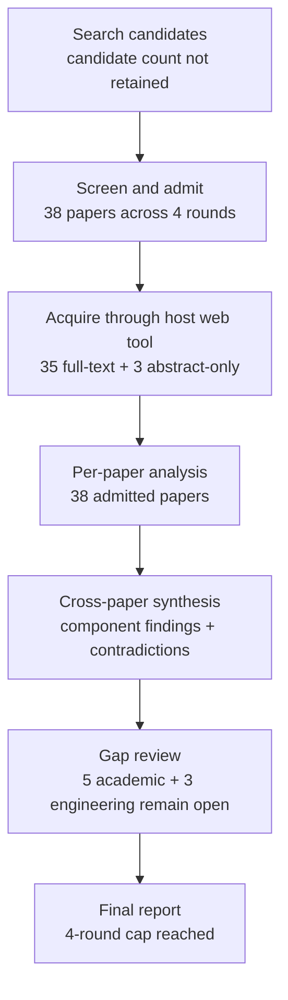

# Research Report: Work-item state, event factuality, temporal reasoning, and conflicting revisions in workplace communication

## Contents

- [Round History](#round-history)
- [Executive Summary](#executive-summary)
- [Research Question](#research-question)
- [Methodology](#methodology)
- [Papers Reviewed](#papers-reviewed)
- [Research Landscape](#research-landscape)
- [Confidence-Graded Findings](#confidence-graded-findings)
- [Research Gaps](#research-gaps)
- [Practical Recommendations](#practical-recommendations)
- [Evidence Map](#evidence-map)
- [References](#references)
- [Appendix: Run Metadata](#appendix-run-metadata)

## Round History

Iterative gap-closure loop (hard cap: 4 rounds). See
`references/iterative-synthesis.md` for the full loop definition.

| Round | Run ID | Topic / Gap Focus | New Papers | Gaps Addressed | Remaining Gaps |
|-------|--------|-------------------|------------|----------------|----------------|
| 1 | 8096ea3adc6c | work-item state, event factuality, temporal reasoning, and conflicting revisions in workplace communication: tracking whether an event is planned, confirmed, revoked, completed, or contradicted | 13 | initial shortlist | 5 academic, 3 engineering |
| 2 | 9537e966ca79 | Longitudinal event and work-item state transitions in dialogue and operational communication, with emphasis on supersession, correction, contradiction, reopening, source-relative factuality, evidential confirmation, and preservation of historical state. | 9 | 0 resolved | 5 academic, 3 engineering |
| 3 | 95d3525d59e7 | Natural-language longitudinal work-item revision in workplace and operational communication: distinguishing supersession, correction, supplementation, contradiction, reopening, unresolved conflict, and claimed versus independently confirmed completion. | 9 | 0 resolved | 5 academic, 3 engineering |
| 4 | 0ecdd7e4a549 | Direct empirical NLP methods for longitudinal work-item revision in workplace or operational communication, especially relation labeling for supersession/correction/supplementation/reopening/conflict and evidence models separating claimed completion from independently corroborated completion. | 7 | academic gaps of the previous round | 5 academic, 3 engineering |

**Stop reason**: 4-round cap reached

## Executive Summary

This review investigated how a work-information system can maintain evidence-backed longitudinal state for actions, commitments, decisions, deadlines, and related events rather than treating each new message as an isolated fact. Across 38 papers, the strongest result is [HIGH] that source-relative factuality, temporal ordering, lifecycle/state representations, revision semantics, provenance, and evidence verification are all separately supported by substantial research, and several literatures show advantages from broader context or structured reasoning [doi-10-1007-s10579-009-9089-9] [1804.06020] [1805.06975] [doi-10-1007-s10458-012-9202-0] [2007.14864]. The most significant unresolved issue is that no admitted study evaluates the required integrated task in successive workplace or operational communications: explicit lifecycle state plus supersession/correction/supplementation/reopening/conflict, temporal dimensions, provenance, and a distinction between claimed completion and independently corroborated completion. The literature therefore gives strong component-level design guidance but does not establish production accuracy for the combined msgloom Topic 06 problem.

**Scope**: 38 papers analyzed from 12 access hosts/source domains over 1986–2026  
**Overall Confidence**: Medium  
**Verdict**: HAS_GAPS

## Research Question

The review asked:

> How can an NLP-based work-information system maintain an evidence-backed longitudinal model of a work item across workplace or operational communication, distinguishing what was merely mentioned, planned, asserted, confirmed, completed, revoked, superseded, disputed, conditional, or unresolved, while preserving temporal distinctions, conflicting revisions, provenance, and historical assessments?

The target object is not a single-message classifier. It is a longitudinal state history in which source observations are retained and later evidence can modify the current assessment without erasing what earlier sources actually said.

An implementation-oriented abstraction is:

$\tau_i=(t_{message},t_{event},t_{deadline},t_{collection})$

for the relevant time dimensions of observation $i$, with a separate assessment:

$a_i=(state_i,factuality_i,provenance_i)$.

A derived current view can then be represented conceptually as:

$S_{current}=g(O_{\leq t},R,\tau,P)$,

where $O$ is immutable source observation history, $R$ contains revision or evidence relations, $\tau$ contains temporal information, and $P$ contains provenance. This notation is a synthesis aid, not a joint model validated by any admitted paper.

Included in scope were event factuality and speaker commitment, temporal relation extraction and ordering, state tracking, social-commitment lifecycle semantics, revision and retraction, belief revision, provenance, source-aware fact verification, evidence arbitration, and direct workplace-email task/message-relation work.

Excluded as sufficient answers were pure date extraction, action extraction without subsequent state evolution, latest-message-wins heuristics, generic workflow-state machines without linguistic uncertainty, and summarization systems that consume state without defining its truth or revision semantics.

## Methodology

### Search Strategy

- **Sources**: arXiv, ACL Anthology, publisher pages, institutional author-hosted copies, ResearchGate, StudyLib, and other scholarly full-text hosts represented in the admitted corpus. All papers were read through the host's web tool at the access level recorded below.
- **Query variants**:
  - `direct empirical nlp longitudinal work-item revision workplace operational communication, especially relation labeling supersession/correction/supplementation/reopening/conflict evidence separating claimed independently corroborated completion.`
  - `direct empirical nlp`
  - `direct longitudinal work-item revision workplace operational communication, especially relation labeling supersession/correction/supplementation/reopening/conflict evidence separating claimed independently corroborated completion.`
  - `empirical longitudinal work-item revision workplace operational communication, especially relation labeling supersession/correction/supplementation/reopening/conflict evidence separating claimed independently corroborated completion.`
  - `nlp longitudinal work-item revision workplace operational communication, especially relation labeling supersession/correction/supplementation/reopening/conflict evidence separating claimed independently corroborated completion.`
  - `direct empirical nlp longitudinal work-item`
  - `direct empirical nlp revision workplace`
  - `direct empirical nlp operational communication,`
- **Time window**: 1986–2026 in the final admitted corpus.
- **Screening**: The supplied run artifacts preserve the admitted corpus and four-round synthesis but do not retain enough information to identify the screening implementation as BM25-only versus BM25 plus sub-agent. No unsupported screening mechanism is inferred here.
- **Round policy**: four iterative rounds, with later rounds targeted at unresolved academic gaps rather than paper-count expansion.

### Paper Access Levels

The papers were read through the host's web tool. Access was full text for 35 papers and abstract only for 3 papers.

| Paper | Access level |
|---|---|
| [1804.06020] | full_text |
| [1805.06975] | full_text |
| [1909.00429] | full_text |
| [1909.05360] | full_text |
| [2007.14864] | full_text |
| [2011.03088] | full_text |
| [2103.08541] | full_text |
| [2104.01146] | full_text |
| [2110.08222] | full_text |
| [2210.15067] | full_text |
| [2406.00197] | full_text |
| [2406.19764] | full_text |
| [2606.18037] | full_text |
| [2608.20116] | full_text |
| [doi-10-1007-3-540-44503-x-20] | full_text |
| [doi-10-1007-s10458-012-9202-0] | full_text |
| [doi-10-1007-s10579-009-9089-9] | full_text |
| [doi-10-1007-s11390-024-2655-1] | full_text |
| [doi-10-1016-0004-3702-86-90080-9] | full_text |
| [doi-10-1016-0020-0255-94-90059-0] | abstract_only |
| [doi-10-1016-j-artint-2003-08-003] | full_text |
| [doi-10-1016-j-ipm-2021-102836] | full_text |
| [doi-10-1016-j-ipm-2026-104709] | abstract_only |
| [doi-10-1016-j-knosys-2016-07-032] | full_text |
| [doi-10-1017-cbo9780511526664-007] | abstract_only |
| [doi-10-1023-a-1010318403544] | full_text |
| [doi-10-1093-jos-ffn013] | full_text |
| [doi-10-1145-1082473-1082754] | full_text |
| [doi-10-1162-tacl-a-00182] | full_text |
| [doi-10-18653-v1-2021-acl-long-122] | full_text |
| [doi-10-18653-v1-2021-emnlp-main-815] | full_text |
| [doi-10-18653-v1-2023-findings-acl-44] | full_text |
| [doi-10-18653-v1-d18-1155] | full_text |
| [doi-10-18653-v1-p19-1412] | full_text |
| [manual-2362cbe877] | full_text |
| [manual-b3703967d3] | full_text |
| [manual-d574dff39d] | full_text |
| [manual-eef7a0219f] | full_text |

### Pipeline Summary

| Metric | Count |
|--------|-------|
| Total candidates | Not retained in supplied run artifacts |
| After screening | 38 admitted papers |
| Downloaded | Not separately retained; acquisition included HTML, PDF, and publisher-hosted access |
| Successfully converted | Not separately retained |
| Deeply analyzed | 38 |
| Iterations | 4 |

## Papers Reviewed

No paper-quality scores were supplied by the pipeline, so the report does not fabricate them. “Not scored” indicates missing evaluation data rather than a low score.

| # | Title | Authors | Year | Venue | Quality Score | Relevance |
|---|-------|---------|------|-------|--------------|-----------|
| 1 | Get Your Vitamin C! Robust Fact Verification with Contrastive Evidence [2103.08541] | Tal Schuster, Adam Fisch, Regina Barzilay | 2021 | Venue not retained | Not scored | HIGH |
| 2 | ProvenanceGuard: Source-Aware Factuality Verification for MCP-Based LLM Agents [2606.18037] | Ander Alvarez, Santhiya Rajan, Samuel Mugel et al. | 2026 | arXiv | Not scored | HIGH |
| 3 | arXivEdits: Understanding the Human Revision Process in Scientific Writing [2210.15067] | Chao Jiang, Wei Xu, Samuel Stevens | 2022 | arXiv | Not scored | HIGH |
| 4 | How and Why is An Answer (Still) Correct? Maintaining Provenance in Dynamic Knowledge Graphs [2007.14864] | Garima Gaur, Arnab Bhattacharya, Srikanta Bedathur | 2020 | arXiv | Not scored | HIGH |
| 5 | Belief Revision: The Adaptability of Large Language Models Reasoning [2406.19764] | Bryan Wilie, Samuel Cahyawijaya, Etsuko Ishii et al. | 2024 | arXiv | Not scored | HIGH |
| 6 | DialFact: A Benchmark for Fact-Checking in Dialogue [2110.08222] | Prakhar Gupta, Chien-Sheng Wu, Wenhao Liu et al. | 2022 | Venue not retained | Not scored | HIGH |
| 7 | Email Task Management: An Iterative Relational Learning Approach [manual-d574dff39d] | Rinat Khoussainov, Nicholas Kushmerick | 2005 | Venue not retained | Not scored | HIGH |
| 8 | Cross-document event ordering through temporal, lexical and distributional knowledge [doi-10-1016-j-knosys-2016-07-032] | Borja Navarro-Colorado, Estela Saquete | 2016 | Knowledge-Based Systems | Not scored | HIGH |
| 9 | FactBank: a corpus annotated with event factuality [doi-10-1007-s10579-009-9089-9] | Roser Saurí, James Pustejovsky | 2009 | Language Resources and Evaluation | Not scored | HIGH |
| 10 | End-to-end event factuality prediction using directional labeled graph recurrent network [doi-10-1016-j-ipm-2021-102836] | Xiao Liu, Heyan Huang, Yue Zhang | 2022 | Information Processing & Management | Not scored | HIGH |
| 11 | Document-Level Event Factuality Identification via Reinforced Semantic Learning Network [doi-10-1007-s11390-024-2655-1] | Zhong Qian, Pei-Feng Li, Qiao-Ming Zhu et al. | 2025 | Journal of Computer Science and Technology | Not scored | HIGH |
| 12 | Utilizing Relative Event Time to Enhance Event-Event Temporal Relation Extraction [doi-10-18653-v1-2021-emnlp-main-815] | Haoyang Wen, Heng Ji | 2021 | EMNLP | Not scored | HIGH |
| 13 | More than Classification: A Unified Framework for Event Temporal Relation Extraction [manual-eef7a0219f] | Quzhe Huang, Yutong Hu, Shengqi Zhu et al. | 2023 | Venue not retained | Not scored | HIGH |
| 14 | Representing and monitoring social commitments using the event calculus [doi-10-1007-s10458-012-9202-0] | Federico Chesani, Paola Mello, Marco Montali et al. | 2012 | Autonomous Agents and Multi-Agent Systems | Not scored | HIGH |
| 15 | Joint Event and Temporal Relation Extraction with Shared Representations and Structured Prediction [1909.05360] | Rujun Han, Qiang Ning, Nanyun Peng | 2019 | arXiv | Not scored | HIGH |
| 16 | Dense Event Ordering with a Multi-Pass Architecture [doi-10-1162-tacl-a-00182] | Nathanael Chambers, Taylor Cassidy, Bill McDowell et al. | 2014 | TACL | Not scored | HIGH |
| 17 | An Improved Neural Baseline for Temporal Relation Extraction [1909.00429] | Qiang Ning, Sanjay Subramanian, Dan Roth | 2019 | arXiv | Not scored | HIGH |
| 18 | Temporal Information Extraction by Predicting Relative Time-lines [doi-10-18653-v1-d18-1155] | Artuur Leeuwenberg, Marie-Francine Moens | 2018 | EMNLP | Not scored | HIGH |
| 19 | Weakening conflicting information for iterated revision and knowledge integration [doi-10-1016-j-artint-2003-08-003] | Salem Benferhat, Souhila Kaci, Daniel Le Berre et al. | 2004 | Artificial Intelligence | Not scored | MEDIUM |
| 20 | Improving Temporal Relation Extraction with a Globally Acquired Statistical Resource [1804.06020] | Qiang Ning, Hao Wu, Haoruo Peng et al. | 2018 | arXiv | Not scored | HIGH |
| 21 | On the difference between updating a knowledge base and revising it [doi-10-1017-cbo9780511526664-007] | Hirofumi Katsuno, Alberto O. Mendelzon | 1992 | Book chapter | Not scored | MEDIUM |
| 22 | Towards Generative Event Factuality Prediction [doi-10-18653-v1-2023-findings-acl-44] | John Murzaku, Tyler Osborne, Amittai Aviram et al. | 2023 | Findings of ACL | Not scored | HIGH |
| 23 | An Empirical Characterization of Event Sourced Systems and Their Schema Evolution -- Lessons from Industry [2104.01146] | Michiel Overeem, Marten Spoor, Slinger Jansen et al. | 2021 | arXiv | Not scored | MEDIUM |
| 24 | Agreement, Disputes and Commitments in Dialogue [doi-10-1093-jos-ffn013] | Alex Lascarides, Nicholas Asher | 2009 | Journal of Semantics | Not scored | HIGH |
| 25 | Resolution of time concepts in temporal databases [doi-10-1016-0020-0255-94-90059-0] | Sharma Chakravarthy, Seung-Kyum Kim | 1994 | Information Sciences | Not scored | MEDIUM |
| 26 | Layered message semantics using social commitments [doi-10-1145-1082473-1082754] | Roberto A. Flores, Philippe Pasquier, Brahim Chaib-draa | 2005 | Venue not retained | Not scored | HIGH |
| 27 | Why and Where: A Characterization of Data Provenance [doi-10-1007-3-540-44503-x-20] | Peter Buneman, Sanjeev Khanna, Wang-Chiew Tan | 2001 | Venue not retained | Not scored | HIGH |
| 28 | The Problem of Retraction in Critical Discussion [doi-10-1023-a-1010318403544] | Erik C. W. Krabbe | 2001 | Venue not retained | Not scored | MEDIUM |
| 29 | HeterMV: Multi-view reasoning over source-aware heterogeneous evidence graph for multi-source fact verification [doi-10-1016-j-ipm-2026-104709] | Junnan Gu, Weimin Li, Fangfang Liu et al. | 2026 | Information Processing & Management | Not scored | HIGH |
| 30 | ProPara-CRTS: Canonical Referent Tracking for Reliable Evaluation of Entity State Tracking in Process Narratives [manual-2362cbe877] | Bingyang Ye, Timothy Obiso, Jingxuan Tu et al. | 2025 | Venue not retained | Not scored | HIGH |
| 31 | Tracking State Changes in Procedural Text: A Challenge Dataset and Models for Process Paragraph Comprehension [1805.06975] | Bhavana Dalvi Mishra, Lifu Huang, Niket Tandon et al. | 2018 | arXiv | Not scored | HIGH |
| 32 | When Text and Numbers Disagree: Evidence Arbitration in Large Language Models [2608.20116] | Mattia Carletti, Edward Phillips, Fredrik K. Gustafsson et al. | 2026 | arXiv | Not scored | HIGH |
| 33 | Re3: A Holistic Framework and Dataset for Modeling Collaborative Document Revision [2406.00197] | Qian Ruan, Ilia Kuznetsov, Iryna Gurevych | 2024 | arXiv | Not scored | HIGH |
| 34 | An assumption-based TMS [doi-10-1016-0004-3702-86-90080-9] | Johan de Kleer | 1986 | Artificial Intelligence | Not scored | MEDIUM |
| 35 | Joint Inference for Event Timeline Construction [manual-b3703967d3] | Quang Do, Wei Lu, Dan Roth | 2012 | Venue not retained | Not scored | HIGH |
| 36 | Factuality Assessment as Modal Dependency Parsing [doi-10-18653-v1-2021-acl-long-122] | Jiarui Yao, Haoling Qiu, Jin Zhao et al. | 2021 | ACL | Not scored | HIGH |
| 37 | HoVer: A Dataset for Many-Hop Fact Extraction And Claim Verification [2011.03088] | Yichen Jiang, Shikha Bordia, Zheng Zhong et al. | 2020 | arXiv | Not scored | HIGH |
| 38 | Do You Know That Florence Is Packed with Visitors? Evaluating State-of-the-art Models of Speaker Commitment [doi-10-18653-v1-p19-1412] | Nanjiang Jiang, Marie-Catherine de Marneffe | 2019 | ACL | Not scored | HIGH |

## Research Landscape

### Theme 1: Source-relative factuality is not independently verified truth

**Coverage**: 4 directly relevant factuality/commitment papers plus verification literature | **Confidence**: High  
**Supporting papers**: [doi-10-1007-s10579-009-9089-9], [doi-10-18653-v1-2023-findings-acl-44], [doi-10-18653-v1-2021-acl-long-122], [doi-10-18653-v1-p19-1412]

The factuality literature treats event factuality as a judgment associated with what a source presents, including polarity, certainty, modality, and commitment, rather than direct access to objective real-world truth [doi-10-1007-s10579-009-9089-9] [doi-10-18653-v1-2023-findings-acl-44] [doi-10-18653-v1-2021-acl-long-122]. This distinction is directly relevant to a workplace statement such as “the deployment is complete”: the statement can be strongly asserted by its author while independent confirmation remains absent.

Key findings:

1. [HIGH] Event factuality is source-relative and commonly incorporates polarity and certainty or commitment rather than objective verification [doi-10-1007-s10579-009-9089-9] [doi-10-18653-v1-2023-findings-acl-44] [doi-10-18653-v1-2021-acl-long-122].
2. [HIGH] Naturally occurring speaker-commitment prediction remains difficult, particularly for no-commitment cases and constructions involving conditionals, questions, modality, and neg-raising [doi-10-18653-v1-p19-1412].
3. [MEDIUM] For Topic 06, claimed state and corroborated state should therefore be represented separately; this is strongly motivated by the combination of factuality and verification evidence, but the combined target representation has not itself been empirically validated.

### Theme 2: Temporal state benefits from context and relational structure

**Coverage**: 8 temporal-reasoning papers | **Confidence**: High  
**Supporting papers**: [1804.06020], [1909.00429], [1909.05360], [doi-10-1162-tacl-a-00182], [doi-10-18653-v1-2021-emnlp-main-815], [manual-b3703967d3], [doi-10-18653-v1-d18-1155], [manual-eef7a0219f]

Temporal-relation research repeatedly shows that event ordering is not reliably reducible to isolated sentence-local date extraction. Systems benefit in several benchmarks from contextual information, temporal priors, relative-time propagation, joint inference, or other structured representations [1804.06020] [doi-10-1162-tacl-a-00182] [doi-10-18653-v1-2021-emnlp-main-815] [manual-b3703967d3].

Key findings:

1. [HIGH] Contextual, global, propagated, or commonsense temporal information improves temporal-relation prediction in multiple admitted studies, though gains vary by dataset and architecture [1804.06020] [1909.00429] [doi-10-1162-tacl-a-00182] [doi-10-18653-v1-2021-emnlp-main-815] [manual-b3703967d3].
2. [HIGH] No one temporal representation is universally dominant: direct timelines, pairwise relations, endpoint decompositions, and structured inference perform differently under different benchmark conditions [doi-10-18653-v1-d18-1155] [manual-eef7a0219f].
3. [MEDIUM] Topic 06 should therefore benchmark candidate temporal mechanisms rather than assume that a globally constrained or direct-timeline representation is automatically superior.

### Theme 3: Longitudinal state is a document-level problem, not only a sentence problem

**Coverage**: 2 process-state papers plus commitment lifecycle work | **Confidence**: High  
**Supporting papers**: [1805.06975], [manual-2362cbe877], [doi-10-1007-s10458-012-9202-0]

Procedural-text work demonstrates that state tracking can materially depend on document-level context rather than local sentences alone [1805.06975]. Later evaluation work also highlights referent ambiguity and annotation incompleteness as important sources of apparent state-tracking error [manual-2362cbe877].

Key findings:

1. [HIGH] Document-level state modeling substantially outperforms sentence-local modeling on several procedural state-tracking measures [1805.06975].
2. [HIGH] Referent ambiguity and incomplete transition annotation can materially distort evaluation of state tracking [manual-2362cbe877].
3. [MEDIUM] These results support maintaining cross-message context for work-item state, but they are transfer evidence from process narratives rather than direct workplace-message validation.

### Theme 4: Correction, retraction, cancellation, conflict, and reopening are different relations

**Coverage**: 6 formal/revision papers | **Confidence**: High  
**Supporting papers**: [doi-10-1007-s10458-012-9202-0], [doi-10-1093-jos-ffn013], [doi-10-1023-a-1010318403544], [doi-10-1145-1082473-1082754], [2210.15067], [2406.00197]

Formal social-commitment and dialogue work explicitly distinguishes lifecycle and revision phenomena that a recency-only system would collapse. Commitments may be active, satisfied, canceled, or violated; corrections may selectively remove previously accepted content while preserving undisputed material; earlier commitments can be reopened; and retraction has semantics distinct from ordinary contradiction [doi-10-1007-s10458-012-9202-0] [doi-10-1093-jos-ffn013] [doi-10-1023-a-1010318403544] [doi-10-1145-1082473-1082754].

Scientific-document revision research adds empirical evidence that successive versions can be aligned and revision intent classified rather than represented as replacement of an undifferentiated text blob [2210.15067] [2406.00197].

Key findings:

1. [HIGH] Formal models distinguish active, satisfied, canceled, violated, corrected, retracted, persistent, and reopened commitment/content states [doi-10-1007-s10458-012-9202-0] [doi-10-1093-jos-ffn013] [doi-10-1023-a-1010318403544] [doi-10-1145-1082473-1082754].
2. [HIGH] Successive document versions can be explicitly aligned and revision intent classified [2210.15067] [2406.00197].
3. [HIGH] One explicit revision request can correspond to multiple realized edits, so one-to-one update assumptions are unsafe [2406.00197].
4. [MEDIUM] The literature strongly supports explicit relation types instead of “newer wins,” but no admitted empirical NLP paper evaluates the complete relation inventory required for operational messages.

### Theme 5: Provenance and verification should survive change

**Coverage**: 7 provenance and verification papers | **Confidence**: High  
**Supporting papers**: [doi-10-1007-3-540-44503-x-20], [2007.14864], [2606.18037], [doi-10-1016-j-ipm-2026-104709], [2011.03088], [2110.08222], [2104.01146]

Provenance research provides mechanisms for retaining where information came from and, in dynamic settings, why an answer remains supported as underlying data changes [doi-10-1007-3-540-44503-x-20] [2007.14864]. Source-aware verification extends this by distinguishing support from the right source from generic semantic compatibility [2606.18037] [doi-10-1016-j-ipm-2026-104709].

Key findings:

1. [HIGH] Provenance can retain multiple derivations and supporting source locations instead of collapsing all evidence into one untraceable result [doi-10-1007-3-540-44503-x-20] [2007.14864].
2. [HIGH] Source-aware verification can explicitly ask whether the designated source supports a claim rather than merely whether some evidence supports it [2606.18037] [doi-10-1016-j-ipm-2026-104709].
3. [HIGH] Verification quality is constrained by evidence retrieval; performance degrades when required evidence is unavailable, and multi-document/dialogue evidence chains increase retrieval difficulty [2011.03088] [2110.08222].
4. [MEDIUM] Event-sourcing practice provides a relevant engineering analogue for immutable history and evolving projections, but it is not a validated NLP state-resolution model [2104.01146].

### Theme 6: Conflicting evidence and belief revision remain difficult for language models

**Coverage**: 4 conflict/belief-revision papers | **Confidence**: High  
**Supporting papers**: [2406.19764], [2608.20116], [doi-10-1016-j-artint-2003-08-003], [doi-10-1016-0004-3702-86-90080-9]

Belief-revision and evidence-arbitration studies indicate that language models can struggle to decide when to maintain a belief versus update it and can be influenced by presentation order, modality, and temporal recency [2406.19764] [2608.20116]. Formal belief-revision and truth-maintenance work instead treats contradictory information as something whose assumptions and dependencies must be managed explicitly [doi-10-1016-j-artint-2003-08-003] [doi-10-1016-0004-3702-86-90080-9].

Key findings:

1. [HIGH] Current language models show meaningful weaknesses in belief revision and evidence arbitration, including update-versus-maintain trade-offs, order effects, modality preferences, and strong recency cues [2406.19764] [2608.20116].
2. [MEDIUM] Formal truth-maintenance and belief-revision frameworks provide useful conceptual machinery for retaining incompatible assumptions and dependencies, but direct empirical NLP transfer to workplace state tracking remains unvalidated [doi-10-1016-j-artint-2003-08-003] [doi-10-1016-0004-3702-86-90080-9].

### Theme 7: Direct workplace evidence is narrow

**Coverage**: 1 direct workplace-email paper plus dialogue transfer evidence | **Confidence**: High for the limitation; Medium for transfer  
**Supporting papers**: [manual-d574dff39d], [2110.08222]

The corpus contains direct workplace-email evidence, but only for task identification and message-relation learning rather than the full longitudinal state/revision task [manual-d574dff39d]. The study also reports fuzzy task boundaries in free-text email, including cases difficult for human annotation.

Key findings:

1. [HIGH] Relational information between messages and speech acts can improve email task identification and message-relation prediction [manual-d574dff39d].
2. [HIGH] Free-text work email can contain fuzzy task boundaries that are difficult even for human annotation [manual-d574dff39d].
3. [LOW] No admitted paper establishes production accuracy for the integrated Topic 06 task in workplace email, Teams-like dialogue, or comparable operational communication.

### Theme 8: Different time concepts and different kinds of revision should not be collapsed

**Coverage**: 2 foundational temporal/belief-change papers plus NLP temporal work | **Confidence**: Medium  
**Supporting papers**: [doi-10-1016-0020-0255-94-90059-0], [doi-10-1017-cbo9780511526664-007]

Temporal-database work distinguishes event/valid/transaction-related temporal concepts relevant to retroactive, proactive, corrected, and delayed information [doi-10-1016-0020-0255-94-90059-0]. Belief-change theory separately distinguishes updating a knowledge base because the world changed from revising beliefs about a world assumed static [doi-10-1017-cbo9780511526664-007].

Key findings:

1. [MEDIUM] Different temporal dimensions are semantically meaningful and can represent different kinds of delayed or corrected information [doi-10-1016-0020-0255-94-90059-0].
2. [MEDIUM] Updating because circumstances changed and revising because earlier belief was wrong are conceptually different operations [doi-10-1017-cbo9780511526664-007].
3. [LOW] The corpus does not validate a single operational benchmark combining message time, effective/event time, deadline time, and collection/version time.

## Methodology Comparison

| Approach | Papers | Strengths | Weaknesses | Best For | Performance |
|----------|--------|-----------|------------|----------|-------------|
| Source-relative factuality / modal parsing | [doi-10-1007-s10579-009-9089-9], [doi-10-18653-v1-2021-acl-long-122], [doi-10-18653-v1-2023-findings-acl-44] | Separates polarity, certainty, modality, and source commitment | Does not independently establish whether the event really occurred | Encoding what a speaker/source claims | Validated on factuality tasks, not Topic 06 end-to-end |
| Speaker commitment | [doi-10-18653-v1-p19-1412] | Models strength of source commitment in natural discourse | Weak no-commitment handling; difficult linguistic constructions | Distinguishing assertion from weaker or non-committal language | Direct natural-discourse evaluation; target transfer unvalidated |
| Pairwise/global temporal relation extraction | [1804.06020], [1909.00429], [1909.05360], [doi-10-1162-tacl-a-00182], [manual-b3703967d3] | Rich temporal ordering; can incorporate global constraints and priors | Global constraints do not consistently improve all settings | Ordering events across context | Dataset- and architecture-dependent |
| Relative timeline / endpoint representations | [doi-10-18653-v1-d18-1155], [manual-eef7a0219f] | Can encode temporal geometry more explicitly than direct labels | No representation is uniformly superior across benchmarks | Dense temporal structure | Mixed comparative results across corpora |
| Procedural state tracking | [1805.06975], [manual-2362cbe877] | Explicit longitudinal entity/state changes | Domain semantics differ materially from workplace actions and commitments | State evolution across text | Strong document-context evidence; transfer only |
| Formal commitment lifecycle | [doi-10-1007-s10458-012-9202-0], [doi-10-1145-1082473-1082754] | Precise lifecycle semantics such as active/satisfied/canceled/violated | Assumes structured semantics more explicit than ordinary work messages | Designing lifecycle ontology and constraints | Formal validation, not workplace NLP benchmark |
| Dialogue correction/retraction semantics | [doi-10-1093-jos-ffn013], [doi-10-1023-a-1010318403544] | Preserves persistence, correction, reopening, and retraction distinctions | Lacks an empirical classifier over target operational relation inventory | Revision semantics | Strong formal distinctions; no target classifier benchmark |
| Document revision alignment | [2210.15067], [2406.00197] | Aligns successive versions and classifies edit/revision intent | Scientific collaborative documents differ from email/Teams messages | Detecting revision correspondence | Empirical transfer evidence |
| Provenance | [doi-10-1007-3-540-44503-x-20], [2007.14864] | Retains source derivations and historical support | Does not resolve linguistic factuality or contradiction by itself | Evidence lineage and auditability | Formal/graph validation; no Topic 06 benchmark |
| Source-aware verification | [2606.18037], [doi-10-1016-j-ipm-2026-104709] | Tests support against source identity and multi-source evidence | Retrieval and source coverage remain bottlenecks | Independent corroboration and source responsibility | Positive component evidence; task/metric differences |
| Multi-hop/dialogue fact verification | [2011.03088], [2110.08222] | Explicit evidence retrieval and verification | Missing evidence sharply limits resolution | Corroborating claims across distributed evidence | Strong retrieval bottleneck evidence |
| Belief revision / evidence arbitration | [2406.19764], [2608.20116], [doi-10-1016-j-artint-2003-08-003] | Directly studies conflicting information and updating | LLM behavior may follow recency/order cues instead of correct revision semantics | Adversarial conflict handling | Demonstrates substantial weaknesses in current models |
| Workplace relational learning | [manual-d574dff39d] | Directly evaluated on email; exploits message/task relations | Does not model factuality, lifecycle revision, corroboration, or full temporal semantics | Topic/task linkage in work email | Direct domain evidence but incomplete target coverage |

## Confidence-Graded Findings

### 🟢 High Confidence (supported by 3+ papers with consistent results)

1. **[HIGH] Event factuality should be treated as source-relative rather than equivalent to independently verified truth.** Source-relative factuality, modality, polarity, and speaker commitment are explicitly represented in multiple admitted models and resources [doi-10-1007-s10579-009-9089-9] [doi-10-18653-v1-2021-acl-long-122] [doi-10-18653-v1-2023-findings-acl-44].

2. **[HIGH] Temporal interpretation benefits from information beyond isolated event pairs in multiple benchmark settings.** Context, temporal commonsense, relative-time propagation, and global inference all show benefits in at least some evaluations [1804.06020] [1909.00429] [doi-10-1162-tacl-a-00182] [doi-10-18653-v1-2021-emnlp-main-815] [manual-b3703967d3].

3. **[HIGH] Longitudinal state should not be reduced to sentence-local classification.** Procedural-text evidence shows substantial value from document-level state modeling, and subsequent evaluation work identifies referent resolution and transition annotation as critical [1805.06975] [manual-2362cbe877].

4. **[HIGH] Cancellation, correction, retraction, contradiction, persistence, and reopening are not interchangeable state transitions.** Formal commitment and dialogue research gives them materially different semantics [doi-10-1007-s10458-012-9202-0] [doi-10-1093-jos-ffn013] [doi-10-1023-a-1010318403544] [doi-10-1145-1082473-1082754].

5. **[HIGH] Revision need not erase previous evidence.** Scientific revision datasets support explicit alignment between versions, while provenance work preserves source derivation and historical support [2210.15067] [2406.00197] [doi-10-1007-3-540-44503-x-20] [2007.14864].

6. **[HIGH] Evidence retrieval is a first-order limitation on verification.** When necessary evidence is unavailable or distributed across more documents/context, verification becomes materially harder [2011.03088] [2110.08222].

7. **[HIGH] Current language models cannot be assumed to resolve conflicting revisions correctly.** Belief-revision and evidence-arbitration experiments expose recency, presentation-order, modality, and update-versus-maintain weaknesses [2406.19764] [2608.20116].

### 🟡 Medium Confidence (supported by 1-2 papers or with caveats)

1. **[MEDIUM] Distinct message, effective/event, deadline, and collection/version times are a defensible implementation model.** Temporal-database distinctions support multiple times, and temporal NLP confirms that event ordering needs richer structure, but the exact four-time Topic 06 representation has not been benchmarked [doi-10-1016-0020-0255-94-90059-0] [doi-10-18653-v1-d18-1155] [doi-10-18653-v1-2021-emnlp-main-815].

2. **[MEDIUM] Immutable observations plus derived state projections are a strong architectural candidate.** Dynamic provenance and event-sourcing literature support preserving historical information and deriving updated views, but the pattern is not experimentally validated for the full NLP task [2007.14864] [2104.01146].

3. **[MEDIUM] Explicit source-aware evidence modeling is likely useful when independent corroboration matters.** Source-aware verification provides relevant evidence, but task definitions and metrics differ and do not directly establish operational-completion verification accuracy [2606.18037] [doi-10-1016-j-ipm-2026-104709].

### 🔴 Low Confidence (preliminary, single-source, or contradicted)

1. **[LOW] Any claim that the complete Topic 06 task is already solved by an existing model would be unsupported.** No admitted paper jointly evaluates lifecycle state, factuality, temporal reasoning, revision relations, provenance, contradiction, and independent corroboration over successive workplace messages [doi-10-1007-s10579-009-9089-9] [1909.00429] [doi-10-1007-s10458-012-9202-0] [2606.18037] [2608.20116].

2. **[LOW] “Latest message wins” is not supported as a reliable general revision rule.** Empirical LLM work finds substantial recency effects, while formal dialogue semantics shows that correction selectively changes content and can preserve or restore earlier commitments [2608.20116] [doi-10-1093-jos-ffn013].

3. **[LOW] No production-accuracy estimate for workplace email or Teams-like communication can be derived from this corpus.** The direct email study concerns task/message relations, not the integrated longitudinal state task [manual-d574dff39d].

## Trade-Off Analysis

| Decision | Option A | Option B | Recommendation |
|----------|----------|----------|----------------|
| Historical storage | Overwrite current record when newer evidence arrives | Preserve immutable observations plus successive assessments | Preserve history. Provenance and event-sourcing work support retained derivation/history, while revision semantics shows newer evidence need not simply erase earlier content [2007.14864] [doi-10-1007-3-540-44503-x-20] [2104.01146] |
| Revision semantics | Recency-based replacement | Explicit edges: supersedes, corrects, supplements, reopens, conflicts-with, unresolved | Use explicit relations with an unknown/unresolved outcome because revision semantics are structurally heterogeneous [doi-10-1093-jos-ffn013] [doi-10-1023-a-1010318403544] [2210.15067] [2406.00197] |
| Completion representation | One Boolean “completed” | Separate claimed completion and corroboration/evidence dimension | Separate them. Factuality and verification literatures represent different questions [doi-10-1007-s10579-009-9089-9] [2011.03088] [2606.18037] |
| Time representation | One timestamp | Distinct message/effective/deadline/collection times | Preserve separate times when available; collapsing them loses distinctions needed for delayed or corrected evidence [doi-10-1016-0020-0255-94-90059-0] |
| Contradiction resolution | Force one winner immediately | Allow incompatible assessments until evidence justifies resolution | Preserve unresolved conflict with provenance. Current models exhibit unreliable arbitration, and TMS/belief-revision work provides mechanisms for dependency-aware coexistence [2406.19764] [2608.20116] [doi-10-1016-0004-3702-86-90080-9] |
| Temporal reasoning | Assume global transitivity always helps | Benchmark local, global, and joint alternatives | Benchmark. Empirical effects of transitivity and joint inference differ across datasets and architectures [doi-10-1162-tacl-a-00182] [1909.05360] |
| Deployment confidence | Transfer benchmark accuracy as workplace accuracy | Require target-domain evaluation | Require target-domain validation because most evidence is from other domains [manual-d574dff39d] [1805.06975] [2210.15067] |

## Points of Agreement **[EVIDENCE REQUIRED]**

1. [HIGH] **Factuality is not identical to objective truth.** FactBank, modal dependency parsing, and generative factuality work all model the source's stance, certainty, or commitment rather than independent world verification [doi-10-1007-s10579-009-9089-9] [doi-10-18653-v1-2021-acl-long-122] [doi-10-18653-v1-2023-findings-acl-44].

2. [HIGH] **Context and relational structure matter for temporal/state reasoning.** Multiple temporal systems and state-tracking studies find useful information outside the immediate event or sentence [1804.06020] [doi-10-1162-tacl-a-00182] [doi-10-18653-v1-2021-emnlp-main-815] [1805.06975].

3. [HIGH] **Historical evidence should remain traceable after change.** Provenance, dynamic knowledge-graph, event-sourcing, and revision work all motivate retaining lineage rather than destructive replacement [doi-10-1007-3-540-44503-x-20] [2007.14864] [2104.01146] [2210.15067].

4. [HIGH] **Revision requires more semantics than recency.** Formal correction/retraction work and empirical document revision both represent explicit relationships among versions or commitments [doi-10-1093-jos-ffn013] [doi-10-1023-a-1010318403544] [2210.15067] [2406.00197].

5. [HIGH] **Missing evidence limits factual resolution.** Multi-hop and dialogue verification studies both identify retrieval/evidence availability as a major bottleneck [2011.03088] [2110.08222].

6. [HIGH] **Conflict resolution by general-purpose language models remains unreliable.** Belief-revision and evidence-arbitration studies independently show systematic failure modes [2406.19764] [2608.20116].

## Points of Contradiction **[EVIDENCE REQUIRED]**

1. **[HIGH] Value of explicit transitivity constraints in temporal reasoning**: CAEVO reports a large improvement when transitive inference is added in dense event ordering, while the structured joint model reports no gain from its transitivity constraint on TB-Dense and only 0.1 F1 on MATRES [doi-10-1162-tacl-a-00182] [1909.05360].
   - **Possible explanation**: architectures, inference procedures, corpora, and constraint integration differ.
   - **Implication**: explicit transitivity should be benchmarked, not hard-coded as a universally beneficial modeling assumption.

2. **[HIGH] Joint versus pipeline learning**: joint or multi-task learning improves end-to-end temporal extraction in [1909.05360] and is important to the event-factuality DLGRN system [doi-10-1016-j-ipm-2021-102836], whereas modal dependency parsing reports almost identical event-extraction performance for joint and pipeline variants and slightly better gold-mention attachment for the pipeline, with joint learning helping more when mentions are automatic [doi-10-18653-v1-2021-acl-long-122].
   - **Possible explanation**: benefits depend on upstream error propagation and which subtasks share useful representations.
   - **Implication**: Topic 06 should compare pipeline and joint approaches under realistic automatic-input conditions rather than assume one architecture.

3. **[HIGH] Direct timeline prediction versus relation-based representations**: direct contextual timeline prediction beats indirect conversion on one TE3 split but loses to indirect TL2RTL on a TimeBank-Dense-derived split [doi-10-18653-v1-d18-1155]; endpoint decomposition separately improves over direct relation classification on TB-Dense and MATRES [manual-eef7a0219f].
   - **Possible explanation**: representation quality interacts with annotation scheme and evaluation corpus.
   - **Implication**: temporal representation should remain an empirical design choice.

4. **[MEDIUM] Benefit of explicit source-aware modeling for verification**: HeterMV reports gains from heterogeneous source-aware modeling [doi-10-1016-j-ipm-2026-104709], while ProvenanceGuard finds a source-blind MiniCheck baseline statistically competitive for binary rejection and identifies explicit attribution as its distinctive advantage [2606.18037].
   - **Possible explanation**: the studies optimize different targets and use different metrics.
   - **Implication**: evaluate source attribution separately from binary support/rejection.

5. **[HIGH] Temporal recency versus semantic correction structure**: evidence-arbitration experiments show that models can strongly weight temporal recency [2608.20116], while dialogue semantics models correction as selective removal of disavowed commitments, retention of undisputed content, and possible restoration of earlier material if a correction is itself corrected [doi-10-1093-jos-ffn013].
   - **Possible explanation**: one result describes observed model behavior while the other gives a semantic theory of how revision should operate.
   - **Implication**: recency may be a useful feature but is not sufficient revision semantics.

## Research Gaps

All eight gaps remain open. The four-round literature search did not resolve any of them. An unresolved gap below is not an accepted design fact: the literature has not answered it yet.

| # | Gap | Type | Severity | Rounds already searched | Impact on Goals |
|---|-----|------|----------|-------------------------|-----------------|
| 1 | No direct evaluation of a multi-state work-item lifecycle across successive workplace messages while preserving historical assessments | [ACADEMIC] | HIGH | 1, 2, 3, 4 | Without this, direct workplace lifecycle accuracy is unknown |
| 2 | No empirical operational-message classifier for supersession, correction, supplementation, contradiction, reopening, and unresolved conflict as one relation inventory | [ACADEMIC] | HIGH | 1, 2, 3, 4 | Incorrect relation semantics could resurrect or erase work |
| 3 | No joint model evaluation combining factuality, temporal ordering, lifecycle state, contradiction, and provenance | [ACADEMIC] | HIGH | 1, 2, 3, 4 | Component success does not establish integrated correctness |
| 4 | Direct target-task evidence for workplace email, Teams-like dialogue, or comparable operational communication remains absent | [ACADEMIC] | HIGH | 1, 2, 3, 4 | Transfer evidence cannot establish production-domain performance |
| 5 | No admitted method distinguishes claimed completion from independently corroborated completion inside a longitudinal operational state model | [ACADEMIC] | HIGH | 1, 2, 3, 4 | A false “completed” state could hide work still requiring action |
| 6 | No end-to-end adversarial longitudinal evaluation suite for cancellation, revocation, deadline change, late ingestion, same-time contradiction, and corrected completion | [ENGINEERING] | HIGH | 1, 2, 3; carried but not an academic search target in round 4 | Failure modes most likely to corrupt current state remain unmeasured |
| 7 | No benchmark combines message time, event/effective time, deadline/constraint time, and collection/version time for target state resolution | [ENGINEERING] | HIGH | 1, 2, 3; carried but not an academic search target in round 4 | Temporal collapse can make stale or retroactive information appear current |
| 8 | No evaluated target implementation stores immutable source observations and successive assessments while exposing a separately derived current-state projection | [ENGINEERING] | HIGH | 1, 2, 3; carried but not an academic search target in round 4 | Provenance loss would make corrections and audit/recovery unsafe |

### Academic Gaps (require more papers)

1. **[ACADEMIC] [HIGH] Gap 1 — Longitudinal workplace lifecycle state tracking remains unanswered.** Procedural state tracking, formal commitment lifecycles, and workplace email relation learning cover separate portions of the problem, but no admitted paper directly evaluates requested/proposed/planned/approved/completed/revoked/superseded/disputed/conditional/unresolved state evolution across successive workplace messages while retaining historical assessments [1805.06975] [doi-10-1007-s10458-012-9202-0] [manual-d574dff39d].  
   **Rounds searched**: 1, 2, 3, 4.  
   **Suggested query**: `workplace email enterprise chat longitudinal work item lifecycle state tracking requested planned approved completed revoked superseded disputed unresolved`.

2. **[ACADEMIC] [HIGH] Gap 2 — Operational revision-relation labeling remains unanswered.** Formal work distinguishes correction, retraction, persistence, and reopening, while scientific revision datasets align and classify edits, but no admitted empirical NLP study labels the full operational set of supersession, correction, supplementation, contradiction, reopening, and unresolved conflict over successive communications [doi-10-1093-jos-ffn013] [doi-10-1023-a-1010318403544] [2210.15067] [2406.00197] [2103.08541].  
   **Rounds searched**: 1, 2, 3, 4.  
   **Suggested query**: `natural language dialogue revision relation classification supersession correction supplementation contradiction reopening unresolved conflict longitudinal`.

3. **[ACADEMIC] [HIGH] Gap 3 — Integrated longitudinal factuality/state/provenance modeling remains unanswered.** Separate studies evaluate factuality, temporal relations, commitment state, provenance, and conflicting evidence, but none jointly evaluates them as one model [doi-10-1007-s10579-009-9089-9] [1909.00429] [doi-10-1007-s10458-012-9202-0] [2606.18037] [2608.20116].  
   **Rounds searched**: 1, 2, 3, 4.  
   **Suggested query**: `"event factuality" temporal relation contradiction provenance lifecycle longitudinal joint model`.

4. **[ACADEMIC] [HIGH] Gap 4 — Direct target-domain evidence remains unanswered.** Workplace email is represented by [manual-d574dff39d], but that study does not evaluate longitudinal factuality, lifecycle revision, supersession, correction, or evidence-backed state resolution; dialogue fact verification is also not the same target task [2110.08222].  
   **Rounds searched**: 1, 2, 3, 4.  
   **Suggested query**: `workplace email enterprise chat operational communication task state tracking revision factuality temporal commitment`.

5. **[ACADEMIC] [HIGH] Gap 5 — Claimed versus independently corroborated completion remains unanswered.** Factuality work models source stance and verification work models evidence support, but no admitted paper combines them to distinguish a work-item completion assertion from stronger independent confirmation in longitudinal operational communication [doi-10-1007-s10579-009-9089-9] [doi-10-18653-v1-2023-findings-acl-44] [2011.03088] [2110.08222] [2606.18037] [doi-10-1016-j-ipm-2026-104709].  
   **Rounds searched**: 1, 2, 3, 4.  
   **Suggested query**: `dialogue event factuality evidentiality source attribution claimed completion independent confirmation corroboration longitudinal`.

### Engineering Gaps (fillable without papers)

1. **[ENGINEERING] [HIGH] Gap 6 — Adversarial longitudinal evaluation remains open.** The literature has not answered the end-to-end target question for plan→cancel, approve→revoke, deadline changes, contradictory same-time updates, out-of-order ingestion, stale late-arriving evidence, and completion claims later corrected [2103.08541] [2406.19764] [2608.20116] [doi-10-1093-jos-ffn013].  
   **Rounds searched**: 1, 2, 3; round 4 focused on academic gaps.  
   **Suggested resolution**: build an independent gold fixture suite in which future evidence is hidden from prediction input, measure both false completion and failure-to-close errors, include shuffled ingestion order, and require preservation of the full evidence lineage.

2. **[ENGINEERING] [HIGH] Gap 7 — Four-time temporal representation benchmark remains open.** Related literature distinguishes multiple temporal concepts and evaluates event ordering, but the target combination of message time, effective/event time, deadline/constraint time, and collection/version time has not been benchmarked [doi-10-1016-0020-0255-94-90059-0] [doi-10-18653-v1-d18-1155] [doi-10-18653-v1-2021-emnlp-main-815].  
   **Rounds searched**: 1, 2, 3; round 4 focused on academic gaps.  
   **Suggested resolution**: construct fixtures where these four times deliberately disagree, test retroactive corrections, delayed ingestion, future plans, changed deadlines, and stale replays, and evaluate current-state reconstruction at multiple observation cutoffs.

3. **[ENGINEERING] [HIGH] Gap 8 — Provenance-preserving target implementation remains open.** Provenance and event-sourcing papers demonstrate relevant mechanisms, but no admitted study evaluates the exact Topic 06 storage model with immutable observations, successive assessments, and a separately derived current-state view [2007.14864] [doi-10-1007-3-540-44503-x-20] [2104.01146] [2606.18037].  
   **Rounds searched**: 1, 2, 3; round 4 focused on academic gaps.  
   **Suggested resolution**: prototype append-only observations and assessments, derive current projections reproducibly, test replay from an empty state, test correction and rollback without source mutation, and add mutation/regression tests proving that historical evidence cannot be silently overwritten.

## Reproducibility Notes

The supplied research artifacts did not systematically record repository URLs, dataset availability, or licenses. Those fields are therefore marked unknown rather than inferred.

| Paper | Code Available | Data Available | Sufficient Detail | License |
|-------|---------------|----------------|-------------------|---------|
| [2103.08541] | Unknown | Unknown | Full text inspected | Unknown |
| [2606.18037] | Unknown | Unknown | Full text inspected | Unknown |
| [2210.15067] | Unknown | Unknown | Full text inspected | Unknown |
| [2007.14864] | Unknown | Unknown | Full text inspected | Unknown |
| [2406.19764] | Unknown | Unknown | Full text inspected | Unknown |
| [2110.08222] | Unknown | Unknown | Full text inspected | Unknown |
| [manual-d574dff39d] | Unknown | Unknown | Full text inspected | Unknown |
| [doi-10-1016-j-knosys-2016-07-032] | Unknown | Unknown | Full text inspected | Unknown |
| [doi-10-1007-s10579-009-9089-9] | Unknown | Unknown | Full text inspected | Unknown |
| [doi-10-1016-j-ipm-2021-102836] | Unknown | Unknown | Full text inspected | Unknown |
| [doi-10-1007-s11390-024-2655-1] | Unknown | Unknown | Full text inspected | Unknown |
| [doi-10-18653-v1-2021-emnlp-main-815] | Unknown | Unknown | Full text inspected | Unknown |
| [manual-eef7a0219f] | Unknown | Unknown | Full text inspected | Unknown |
| [doi-10-1007-s10458-012-9202-0] | Unknown | Unknown | Full text inspected | Unknown |
| [1909.05360] | Unknown | Unknown | Full text inspected | Unknown |
| [doi-10-1162-tacl-a-00182] | Unknown | Unknown | Full text inspected | Unknown |
| [1909.00429] | Unknown | Unknown | Full text inspected | Unknown |
| [doi-10-18653-v1-d18-1155] | Unknown | Unknown | Full text inspected | Unknown |
| [doi-10-1016-j-artint-2003-08-003] | Unknown | Unknown | Full text inspected | Unknown |
| [1804.06020] | Unknown | Unknown | Full text inspected | Unknown |
| [doi-10-1017-cbo9780511526664-007] | Unknown | Unknown | Abstract-only access; insufficient for implementation reproduction | Unknown |
| [doi-10-18653-v1-2023-findings-acl-44] | Unknown | Unknown | Full text inspected | Unknown |
| [2104.01146] | Unknown | Unknown | Full text inspected | Unknown |
| [doi-10-1093-jos-ffn013] | Unknown | Unknown | Full text inspected | Unknown |
| [doi-10-1016-0020-0255-94-90059-0] | Unknown | Unknown | Abstract-only access; insufficient for implementation reproduction | Unknown |
| [doi-10-1145-1082473-1082754] | Unknown | Unknown | Full text inspected | Unknown |
| [doi-10-1007-3-540-44503-x-20] | Unknown | Unknown | Full text inspected | Unknown |
| [doi-10-1023-a-1010318403544] | Unknown | Unknown | Full text inspected | Unknown |
| [doi-10-1016-j-ipm-2026-104709] | Unknown | Unknown | Abstract-only access; insufficient for implementation reproduction | Unknown |
| [manual-2362cbe877] | Unknown | Unknown | Full text inspected | Unknown |
| [1805.06975] | Unknown | Unknown | Full text inspected | Unknown |
| [2608.20116] | Unknown | Unknown | Full text inspected | Unknown |
| [2406.00197] | Unknown | Unknown | Full text inspected | Unknown |
| [doi-10-1016-0004-3702-86-90080-9] | Unknown | Unknown | Full text inspected | Unknown |
| [manual-b3703967d3] | Unknown | Unknown | Full text inspected | Unknown |
| [doi-10-18653-v1-2021-acl-long-122] | Unknown | Unknown | Full text inspected | Unknown |
| [2011.03088] | Unknown | Unknown | Full text inspected | Unknown |
| [doi-10-18653-v1-p19-1412] | Unknown | Unknown | Full text inspected | Unknown |

## Practical Recommendations **[EVIDENCE REQUIRED]**

1. **[HIGH] Preserve source observations separately from interpreted assessments and the derived current-state projection.** Provenance research preserves derivations as data changes, dynamic knowledge-graph work tracks continuing support, and event-sourcing research provides an engineering analogue for immutable event history [doi-10-1007-3-540-44503-x-20] [2007.14864] [2104.01146].  
   *Confidence*: High for the architectural principle; Medium for direct target-task validation.

2. **[HIGH] Represent revision with explicit typed relations rather than message recency alone.** At minimum, the target representation should support `supersedes`, `corrects`, `supplements`, `reopens`, `conflicts_with`, and an unresolved/unknown outcome. Formal dialogue and retraction work demonstrates that these semantic operations are different, while empirical revision datasets show explicit alignment is feasible [doi-10-1093-jos-ffn013] [doi-10-1023-a-1010318403544] [2210.15067] [2406.00197].  
   *Confidence*: High for preserving distinctions; Medium for the exact target label inventory.

3. **[HIGH] Separate source-relative claimed factuality from independent evidence strength.** A message saying “done” should not become equivalent to independently corroborated completion. Factuality papers model source commitment, while verification papers model evidence support and source attribution [doi-10-1007-s10579-009-9089-9] [doi-10-18653-v1-2023-findings-acl-44] [2011.03088] [2606.18037].  
   *Confidence*: High for the conceptual separation; Low for any claim that a validated workplace model already implements it.

4. **[MEDIUM] Preserve distinct temporal fields when available.** Use separate message, event/effective, deadline/constraint, and collection/version times rather than forcing them into one canonical timestamp. Multi-time database semantics and temporal NLP provide supporting foundations, but the exact combined target representation still needs engineering validation [doi-10-1016-0020-0255-94-90059-0] [doi-10-18653-v1-d18-1155] [doi-10-18653-v1-2021-emnlp-main-815].  
   *Confidence*: Medium.

5. **[HIGH] Allow incompatible assessments to coexist until evidence justifies resolution.** LLMs show substantial conflict-arbitration weaknesses, and truth-maintenance/belief-revision work demonstrates alternative ways to retain assumptions and dependency structure [2406.19764] [2608.20116] [doi-10-1016-0004-3702-86-90080-9] [doi-10-1016-j-artint-2003-08-003].  
   *Confidence*: High for avoiding forced resolution; Medium for the optimal arbitration algorithm.

6. **[HIGH] Treat evidence retrieval as part of state resolution, not a separate convenience layer.** If required corroborating or contradictory evidence is missing, the state should remain uncertain and trigger an evidence need rather than be silently completed [2011.03088] [2110.08222].  
   *Confidence*: High.

7. **[HIGH] Build an adversarial longitudinal fixture suite before trusting current-state output.** The suite should include plan→cancel, approve→revoke, deadline replacement, same-time conflict, late stale ingestion, reopened work, and completion→correction sequences. Conflict and revision studies show these are precisely the kinds of conditions under which naïve update behavior is unsafe [2103.08541] [2406.19764] [2608.20116] [doi-10-1093-jos-ffn013].  
   *Confidence*: High as an engineering requirement.

8. **[MEDIUM] Benchmark local, global, joint, and pipeline reasoning rather than choosing by theoretical appeal.** Explicit transitivity and joint learning help in some studies but not uniformly [doi-10-1162-tacl-a-00182] [1909.05360] [doi-10-1016-j-ipm-2021-102836] [doi-10-18653-v1-2021-acl-long-122].  
   *Confidence*: High that effects are task-dependent; Medium regarding which candidate will work best for msgloom.

9. **[HIGH] Do not transfer benchmark accuracy from news, scientific revision, procedural narratives, or formal dialogue into a workplace production claim.** The direct email paper supports relational task learning but does not evaluate Topic 06's target state problem [manual-d574dff39d].  
   *Confidence*: High.

## Future Directions

1. [HIGH] Create a target-domain annotation scheme that separates observation, source-relative factuality, lifecycle state, revision relation, temporal fields, evidence strength, and current assessment rather than collapsing them into one label.

2. [HIGH] Build a longitudinal benchmark with successive workplace-like messages and explicit historical cutoffs so a model is evaluated on what could have been known at each point in time, preventing future-evidence leakage.

3. [HIGH] Add independent corroboration tasks in which the same completion assertion is paired with zero, weak, conflicting, or strong external evidence.

4. [HIGH] Include relation labels for correction, supersession, supplementation, reopening, contradiction, and unresolved conflict, with cases in which the newest message does not supersede the older one.

5. [MEDIUM] Compare pairwise, graph-based, timeline-based, event-calculus-inspired, and LLM-assisted reasoning on the same target fixtures rather than across incompatible external benchmarks.

6. [HIGH] Evaluate evidence retrieval jointly with state resolution so unresolved states can emit explicit missing-evidence requirements to Topic 07 rather than hallucinating closure.

7. [HIGH] Add replay tests for provenance: rebuilding the entire current-state projection from immutable observations should deterministically reproduce the persisted current assessment unless the interpretation model/version deliberately changes.

8. [HIGH] Require later target-domain validation before making workplace production-accuracy claims.

## Readiness Assessment (System-Building Mode)

### Verdict: HAS_GAPS

### Assessment Summary

The literature is sufficient to design a defensible experimental architecture and to reject several unsafe simplifications, especially conflating asserted with verified completion, overwriting history, collapsing time dimensions, or using latest-message-wins as revision semantics. It is not sufficient to claim that an integrated Topic 06 model has been validated for workplace communication. Five academic gaps and three engineering gaps remain open at the four-round cap.

### Coverage Matrix

| Dimension | Status | Evidence |
|-----------|--------|----------|
| Architecture patterns | ⚠️ Partial | Provenance, event sourcing, commitment lifecycle, and revision research provide strong components but not an integrated target architecture [2007.14864] [2104.01146] [doi-10-1007-s10458-012-9202-0] [2406.00197] |
| Technology stack | ❌ Missing | The admitted corpus does not establish a msgloom-specific technology stack |
| Performance baselines | ❌ Missing for target task | Component benchmarks exist, but no target longitudinal workplace benchmark exists [manual-d574dff39d] [1805.06975] [doi-10-1007-s10579-009-9089-9] |
| Security model | ❌ Missing | Security is outside the admitted Topic 06 evidence |
| Trade-off map | ⚠️ Partial | Temporal/global inference, joint-vs-pipeline, source-aware verification, and conflict-arbitration trade-offs are documented but dataset-dependent [1909.05360] [doi-10-18653-v1-2021-acl-long-122] [2606.18037] [2608.20116] |

### Gap Resolution Plan

| # | Gap | Type | Severity | Resolution |
|---|-----|------|----------|------------|
| 1 | Multi-state lifecycle across workplace messages | [ACADEMIC] | HIGH | Retain as unresolved after rounds 1–4; seek direct workplace/operational empirical work in future research rather than infer from process narratives |
| 2 | Operational revision relation labeling | [ACADEMIC] | HIGH | Retain as unresolved after rounds 1–4; future search should require explicit evaluated relation labels, not generic revision or NLI |
| 3 | Joint factuality/time/state/conflict/provenance model | [ACADEMIC] | HIGH | Retain as unresolved; treat current literature as component evidence only |
| 4 | Direct target-domain validation | [ACADEMIC] | HIGH | Retain as unresolved; require future email/enterprise-chat/operational benchmark evidence |
| 5 | Claimed versus independently corroborated completion | [ACADEMIC] | HIGH | Retain as unresolved; search explicitly for evidentiality/source-attribution plus longitudinal task state |
| 6 | Adversarial longitudinal evaluation | [ENGINEERING] | HIGH | Build independent fixtures and end-to-end regression tests now |
| 7 | Four-time representation benchmark | [ENGINEERING] | HIGH | Implement competing temporal representations and benchmark on deliberately conflicting time cases |
| 8 | Provenance-preserving target implementation | [ENGINEERING] | HIGH | Prototype append-only observation/assessment history with deterministic derived projections and replay/mutation testing |

## Evidence Map

| Research Question Aspect | Primary evidence | Additional evidence | Coverage assessment |
|--------------------------|------------------|---------------------|--------------------|
| Source-relative factuality | [doi-10-1007-s10579-009-9089-9] | [doi-10-18653-v1-2021-acl-long-122], [doi-10-18653-v1-2023-findings-acl-44] | Strong component evidence |
| Speaker commitment and non-commitment | [doi-10-18653-v1-p19-1412] | [doi-10-1093-jos-ffn013] | Strong semantic evidence; difficult empirical cases |
| Event temporal ordering | [1804.06020], [1909.00429] | [doi-10-1162-tacl-a-00182], [doi-10-18653-v1-2021-emnlp-main-815], [manual-b3703967d3] | Strong component evidence |
| Alternative temporal representations | [doi-10-18653-v1-d18-1155] | [manual-eef7a0219f] | Mixed comparative results |
| Longitudinal state tracking | [1805.06975] | [manual-2362cbe877] | Strong transfer evidence; not workplace task |
| Commitment lifecycle | [doi-10-1007-s10458-012-9202-0] | [doi-10-1145-1082473-1082754] | Strong formal semantics |
| Correction/retraction/reopening | [doi-10-1093-jos-ffn013] | [doi-10-1023-a-1010318403544] | Strong formal distinctions; empirical target gap |
| Successive-version revision | [2210.15067] | [2406.00197] | Strong scientific-document transfer evidence |
| Provenance preservation | [doi-10-1007-3-540-44503-x-20] | [2007.14864], [2104.01146] | Strong architecture/provenance evidence |
| Source-aware verification | [2606.18037] | [doi-10-1016-j-ipm-2026-104709] | Useful component evidence; differing tasks/metrics |
| Evidence retrieval | [2011.03088] | [2110.08222] | Strong evidence that retrieval limits verification |
| Conflicting evidence / belief revision | [2406.19764] | [2608.20116], [doi-10-1016-j-artint-2003-08-003], [doi-10-1016-0004-3702-86-90080-9] | Strong evidence of current-model weakness |
| Multiple temporal concepts | [doi-10-1016-0020-0255-94-90059-0] | [doi-10-1017-cbo9780511526664-007] | Conceptual support; target benchmark absent |
| Workplace email task relations | [manual-d574dff39d] | — | Direct domain evidence but incomplete target coverage |
| Claimed versus independently confirmed completion | [doi-10-1007-s10579-009-9089-9] | [2011.03088], [2110.08222], [2606.18037] | Components exist; integrated distinction remains open |
| Full Topic 06 integrated model | — | Component evidence throughout corpus | Not established |

## References

1. [2103.08541] — *Get Your Vitamin C! Robust Fact Verification with Contrastive Evidence*. Tal Schuster, Adam Fisch, Regina Barzilay. 2021.
2. [2606.18037] — *ProvenanceGuard: Source-Aware Factuality Verification for MCP-Based LLM Agents*. Ander Alvarez, Santhiya Rajan, Samuel Mugel et al. 2026.
3. [2210.15067] — *arXivEdits: Understanding the Human Revision Process in Scientific Writing*. Chao Jiang, Wei Xu, Samuel Stevens. 2022.
4. [2007.14864] — *How and Why is An Answer (Still) Correct? Maintaining Provenance in Dynamic Knowledge Graphs*. Garima Gaur, Arnab Bhattacharya, Srikanta Bedathur. 2020.
5. [2406.19764] — *Belief Revision: The Adaptability of Large Language Models Reasoning*. Bryan Wilie, Samuel Cahyawijaya, Etsuko Ishii et al. 2024.
6. [2110.08222] — *DialFact: A Benchmark for Fact-Checking in Dialogue*. Prakhar Gupta, Chien-Sheng Wu, Wenhao Liu et al. 2022.
7. [manual-d574dff39d] — *Email Task Management: An Iterative Relational Learning Approach*. Rinat Khoussainov, Nicholas Kushmerick. 2005.
8. [doi-10-1016-j-knosys-2016-07-032] — *Cross-document event ordering through temporal, lexical and distributional knowledge*. Borja Navarro-Colorado, Estela Saquete. 2016.
9. [doi-10-1007-s10579-009-9089-9] — *FactBank: a corpus annotated with event factuality*. Roser Saurí, James Pustejovsky. 2009.
10. [doi-10-1016-j-ipm-2021-102836] — *End-to-end event factuality prediction using directional labeled graph recurrent network*. Xiao Liu, Heyan Huang, Yue Zhang. 2022.
11. [doi-10-1007-s11390-024-2655-1] — *Document-Level Event Factuality Identification via Reinforced Semantic Learning Network*. Zhong Qian, Pei-Feng Li, Qiao-Ming Zhu et al. 2025.
12. [doi-10-18653-v1-2021-emnlp-main-815] — *Utilizing Relative Event Time to Enhance Event-Event Temporal Relation Extraction*. Haoyang Wen, Heng Ji. 2021.
13. [manual-eef7a0219f] — *More than Classification: A Unified Framework for Event Temporal Relation Extraction*. Quzhe Huang, Yutong Hu, Shengqi Zhu et al. 2023.
14. [doi-10-1007-s10458-012-9202-0] — *Representing and monitoring social commitments using the event calculus*. Federico Chesani, Paola Mello, Marco Montali et al. 2012.
15. [1909.05360] — *Joint Event and Temporal Relation Extraction with Shared Representations and Structured Prediction*. Rujun Han, Qiang Ning, Nanyun Peng. 2019.
16. [doi-10-1162-tacl-a-00182] — *Dense Event Ordering with a Multi-Pass Architecture*. Nathanael Chambers, Taylor Cassidy, Bill McDowell et al. 2014.
17. [1909.00429] — *An Improved Neural Baseline for Temporal Relation Extraction*. Qiang Ning, Sanjay Subramanian, Dan Roth. 2019.
18. [doi-10-18653-v1-d18-1155] — *Temporal Information Extraction by Predicting Relative Time-lines*. Artuur Leeuwenberg, Marie-Francine Moens. 2018.
19. [doi-10-1016-j-artint-2003-08-003] — *Weakening conflicting information for iterated revision and knowledge integration*. Salem Benferhat, Souhila Kaci, Daniel Le Berre et al. 2004.
20. [1804.06020] — *Improving Temporal Relation Extraction with a Globally Acquired Statistical Resource*. Qiang Ning, Hao Wu, Haoruo Peng et al. 2018.
21. [doi-10-1017-cbo9780511526664-007] — *On the difference between updating a knowledge base and revising it*. Hirofumi Katsuno, Alberto O. Mendelzon. 1992.
22. [doi-10-18653-v1-2023-findings-acl-44] — *Towards Generative Event Factuality Prediction*. John Murzaku, Tyler Osborne, Amittai Aviram et al. 2023.
23. [2104.01146] — *An Empirical Characterization of Event Sourced Systems and Their Schema Evolution -- Lessons from Industry*. Michiel Overeem, Marten Spoor, Slinger Jansen et al. 2021.
24. [doi-10-1093-jos-ffn013] — *Agreement, Disputes and Commitments in Dialogue*. Alex Lascarides, Nicholas Asher. 2009.
25. [doi-10-1016-0020-0255-94-90059-0] — *Resolution of time concepts in temporal databases*. Sharma Chakravarthy, Seung-Kyum Kim. 1994.
26. [doi-10-1145-1082473-1082754] — *Layered message semantics using social commitments*. Roberto A. Flores, Philippe Pasquier, Brahim Chaib-draa. 2005.
27. [doi-10-1007-3-540-44503-x-20] — *Why and Where: A Characterization of Data Provenance*. Peter Buneman, Sanjeev Khanna, Wang-Chiew Tan. 2001.
28. [doi-10-1023-a-1010318403544] — *The Problem of Retraction in Critical Discussion*. Erik C. W. Krabbe. 2001.
29. [doi-10-1016-j-ipm-2026-104709] — *HeterMV: Multi-view reasoning over source-aware heterogeneous evidence graph for multi-source fact verification*. Junnan Gu, Weimin Li, Fangfang Liu et al. 2026.
30. [manual-2362cbe877] — *ProPara-CRTS: Canonical Referent Tracking for Reliable Evaluation of Entity State Tracking in Process Narratives*. Bingyang Ye, Timothy Obiso, Jingxuan Tu et al. 2025.
31. [1805.06975] — *Tracking State Changes in Procedural Text: A Challenge Dataset and Models for Process Paragraph Comprehension*. Bhavana Dalvi Mishra, Lifu Huang, Niket Tandon et al. 2018.
32. [2608.20116] — *When Text and Numbers Disagree: Evidence Arbitration in Large Language Models*. Mattia Carletti, Edward Phillips, Fredrik K. Gustafsson et al. 2026.
33. [2406.00197] — *Re3: A Holistic Framework and Dataset for Modeling Collaborative Document Revision*. Qian Ruan, Ilia Kuznetsov, Iryna Gurevych. 2024.
34. [doi-10-1016-0004-3702-86-90080-9] — *An assumption-based TMS*. Johan de Kleer. 1986.
35. [manual-b3703967d3] — *Joint Inference for Event Timeline Construction*. Quang Do, Wei Lu, Dan Roth. 2012.
36. [doi-10-18653-v1-2021-acl-long-122] — *Factuality Assessment as Modal Dependency Parsing*. Jiarui Yao, Haoling Qiu, Jin Zhao et al. 2021.
37. [2011.03088] — *HoVer: A Dataset for Many-Hop Fact Extraction And Claim Verification*. Yichen Jiang, Shikha Bordia, Zheng Zhong et al. 2020.
38. [doi-10-18653-v1-p19-1412] — *Do You Know That Florence Is Packed with Visitors? Evaluating State-of-the-art Models of Speaker Commitment*. Nanjiang Jiang, Marie-Catherine de Marneffe. 2019.

## Appendix: Run Metadata

- **Run ID**: `0ecdd7e4a549`
- **Sources**: host web tool access to arXiv, ACL Anthology, publisher sites, institutional/author-hosted scholarly copies, ResearchGate, StudyLib, and other scholarly hosts represented in the access manifest
- **Pipeline version**: Not specified in supplied run artifacts
- **Date**: 2026-09-17
- **Artifacts**: `runs/0ecdd7e4a549/`
- **Round count**: 4
- **Final admitted corpus**: 38 papers
- **Access profile**: 35 full-text, 3 abstract-only
- **Final gap status**: 5 [ACADEMIC] HIGH gaps open; 3 [ENGINEERING] HIGH gaps open
- **Stop reason**: 4-round cap reached
- **Interpretive boundary**: project context and the Topic 05 handoff were used only to define scope and required distinctions; they were not treated as evidence for findings or gap closure
- **Confidence boundary**: component-level findings are well supported; transfer to workplace operational communication is less certain; the full integrated target problem remains unvalidated
