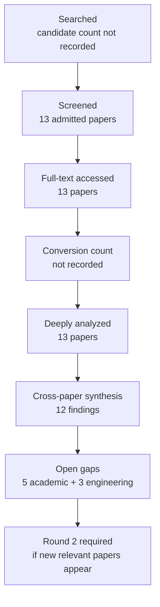

# Research Report: Work-item state, event factuality, temporal reasoning, and conflicting revisions in workplace communication

## Contents

- [Round History](#round-history)
- [Executive Summary](#executive-summary)
- [Research Question](#research-question)
- [Methodology](#methodology)
- [Papers Reviewed](#papers-reviewed)
- [Research Landscape](#research-landscape)
- [Methodology Comparison](#methodology-comparison)
- [Confidence-Graded Findings](#confidence-graded-findings)
- [Trade-Off Analysis](#trade-off-analysis)
- [Points of Agreement](#points-of-agreement)
- [Points of Contradiction](#points-of-contradiction)
- [Research Gaps](#research-gaps)
- [Reproducibility Notes](#reproducibility-notes)
- [Practical Recommendations](#practical-recommendations)
- [Future Directions](#future-directions)
- [Readiness Assessment (System-Building Mode)](#readiness-assessment-system-building-mode)
- [Evidence Map](#evidence-map)
- [References](#references)
- [Appendix: Run Metadata](#appendix-run-metadata)

## Round History

Iterative gap-closure loop (hard cap: 4 rounds). See
`references/iterative-synthesis.md` for the full loop definition.

| Round | Run ID | Topic / Gap Focus | New Papers | Gaps Addressed | Remaining Gaps |
|-------|--------|-------------------|------------|----------------|----------------|
| 1 | 8096ea3adc6c | work-item state, event factuality, temporal reasoning, and conflicting revisions in workplace communication: tracking whether an event is planned, confirmed, revoked, completed, or contradicted | 13 | initial shortlist | 5 academic, 3 engineering |

**Stop reason**: another round runs while open academic gaps remain and new papers appear

## Executive Summary

This review investigates how a workplace-information system can maintain an evidence-backed state history for work items whose factuality, timing, lifecycle status, and interpretation change across communications. Thirteen papers spanning 2004–2025 were analyzed from seven full-text access hosts, covering event factuality, temporal-relation extraction and ordering, relative timelines, commitment lifecycle monitoring, belief revision, and cross-document event ordering. [HIGH] The strongest supported conclusion is that factuality, temporal ordering, lifecycle state, and provenance must remain distinct dimensions: textual assertion or temporal mention alone does not establish that an event actually occurred or that work is complete [doi-10-1007-s10579-009-9089-9] [doi-10-18653-v1-d18-1155] [doi-10-1007-s10458-012-9202-0]. [MEDIUM] The most significant gap is that none of the reviewed papers evaluates the complete longitudinal workplace problem combining source-relative factuality, multiple time axes, lifecycle transitions, supersession, contradiction, provenance, and preservation of historical assessments. Component mechanisms are well supported, but transfer to workplace email and Teams-like communication and their integration into msgloom remain unvalidated.

**Scope**: 13 papers analyzed from 7 full-text access hosts over 2004–2025  
**Overall Confidence**: Medium  
**Verdict**: HAS_GAPS

## Research Question

The research question is:

> How should msgloom represent and reason over successive evidence about a work item so that it can distinguish requested, proposed, planned, approved, completed, revoked, superseded, disputed, conditional, and unresolved states while preserving factuality, temporal structure, conflicting revisions, provenance, and historical assessments?

The in-scope problem includes event factuality and modality, temporal ordering and multiple temporal axes, lifecycle/state transitions, contradiction and conflict handling, revision and supersession semantics, and provenance-preserving derivation of a current assessment.

The review explicitly does **not** treat the following as solved within Topic 06:

- Topic 05 extraction of event identity at utterance time, including owner/assignee, deadline binding, conditions, negation, and modality.
- Topic 03 cross-thread and cross-source Topic/work-item identity.
- Topic 07 retrieval of missing evidence needed to resolve uncertain state.
- Topic 08 extraction of state-changing evidence from attachment versions, tables, images, and screenshots.
- Topic 09 presentation of state in incremental briefings.
- Topic 10 evaluation of completeness, calibration, evidence support, and reliability.

A useful conceptual representation is to distinguish immutable observations $E$ from derived assessments $A$. For collection/version point $v$:

$A_v = f(E_{\leq v}, T, F, L, R, P)$

where $T$ is temporal structure, $F$ is factuality/modality, $L$ is lifecycle semantics, $R$ is revision/conflict structure, and $P$ is provenance. A later $A_{v+1}$ may replace the **current assessment**, but must not erase $E_{\leq v}$ or historical $A_v$.

## Methodology

### Search Strategy

- **Sources**: Search-index sources were not recorded in the supplied round artifact. The 13 admitted papers were read through the host's web tool using full-text pages hosted by arXiv, ACL Anthology, ResearchGate, JCST, CRIL/Université d'Artois, an author-hosted GitHub Pages site, and the University of Alicante repository.
- **Query variants**:
  - `work-item state, event factuality, temporal reasoning, conflicting revisions workplace communication: tracking whether event planned, confirmed, revoked, completed, contradicted`
  - `work-item state, event`
  - `work-item factuality, temporal reasoning, conflicting revisions workplace communication: tracking whether event planned, confirmed, revoked, completed, contradicted`
  - `state, factuality, temporal reasoning, conflicting revisions workplace communication: tracking whether event planned, confirmed, revoked, completed, contradicted`
  - `event factuality, temporal reasoning, conflicting revisions workplace communication: tracking whether event planned, confirmed, revoked, completed, contradicted`
  - `work-item state, event factuality, temporal`
  - `work-item state, event reasoning, conflicting`
  - `work-item state, event revisions workplace`
- **Time window**: 2004–2025 for the admitted corpus.
- **Screening**: The exact screening implementation was not supplied in the round artifact; 13 papers were admitted to deep analysis.
- **Evidence restriction**: Findings in this report use only the 13 reviewed papers and the supplied cross-paper synthesis. No external papers have been added.

All reviewed papers were read through the host's web tool. The recorded access level for every admitted paper was `full_text`:

| Paper | Access level | Full-text host |
|---|---|---|
| [1804.06020] | full_text | arXiv |
| [1909.00429] | full_text | arXiv |
| [1909.05360] | full_text | arXiv |
| [doi-10-1007-s10458-012-9202-0] | full_text | ResearchGate |
| [doi-10-1007-s10579-009-9089-9] | full_text | ResearchGate |
| [doi-10-1007-s11390-024-2655-1] | full_text | JCST |
| [doi-10-1016-j-artint-2003-08-003] | full_text | CRIL / Université d'Artois |
| [doi-10-1016-j-ipm-2021-102836] | full_text | author-hosted PDF |
| [doi-10-1016-j-knosys-2016-07-032] | full_text | University of Alicante repository |
| [doi-10-1162-tacl-a-00182] | full_text | ACL Anthology |
| [doi-10-18653-v1-2021-emnlp-main-815] | full_text | ACL Anthology |
| [doi-10-18653-v1-d18-1155] | full_text | arXiv |
| [manual-eef7a0219f] | full_text | arXiv |

### Pipeline Summary

| Metric | Count |
|--------|-------|
| Total candidates | Not recorded |
| After screening | 13 admitted |
| Downloaded | Not recorded |
| Full-text accessed | 13 |
| Successfully converted | Not recorded |
| Deeply analyzed | 13 |
| Iterations completed | 1 |

## Papers Reviewed

Quality scores were not supplied by the pipeline and are therefore reported as `unknown` rather than reconstructed.

| # | Title | Authors | Year | Venue | Quality Score | Relevance |
|---|-------|---------|------|-------|--------------|-----------|
| 1 | Cross-document event ordering through temporal, lexical and distributional knowledge [doi-10-1016-j-knosys-2016-07-032] | Borja Navarro-Colorado, Estela Saquete | 2016 | Not supplied | unknown | HIGH |
| 2 | FactBank: a corpus annotated with event factuality [doi-10-1007-s10579-009-9089-9] | Roser Saurí, James Pustejovsky | 2009 | Not supplied | unknown | HIGH |
| 3 | End-to-end event factuality prediction using directional labeled graph recurrent network [doi-10-1016-j-ipm-2021-102836] | Xiao Liu, Heyan Huang, Yue Zhang | 2022 | Not supplied | unknown | HIGH |
| 4 | Document-Level Event Factuality Identification via Reinforced Semantic Learning Network [doi-10-1007-s11390-024-2655-1] | Zhong Qian, Pei-Feng Li, Qiao-Ming Zhu et al. | 2025 | Not supplied | unknown | HIGH |
| 5 | Utilizing Relative Event Time to Enhance Event-Event Temporal Relation Extraction [doi-10-18653-v1-2021-emnlp-main-815] | Haoyang Wen, Heng Ji | 2021 | EMNLP 2021 | unknown | HIGH |
| 6 | More than Classification: A Unified Framework for Event Temporal Relation Extraction [manual-eef7a0219f] | Quzhe Huang, Yutong Hu, Shengqi Zhu et al. | 2023 | Not supplied | unknown | HIGH |
| 7 | Representing and monitoring social commitments using the event calculus [doi-10-1007-s10458-012-9202-0] | Federico Chesani, Paola Mello, Marco Montali et al. | 2012 | Not supplied | unknown | HIGH |
| 8 | Joint Event and Temporal Relation Extraction with Shared Representations and Structured Prediction [1909.05360] | Rujun Han, Qiang Ning, Nanyun Peng | 2019 | Not supplied | unknown | HIGH |
| 9 | Dense Event Ordering with a Multi-Pass Architecture [doi-10-1162-tacl-a-00182] | Nathanael Chambers, Taylor Cassidy, Bill McDowell et al. | 2014 | Not supplied | unknown | HIGH |
| 10 | An Improved Neural Baseline for Temporal Relation Extraction [1909.00429] | Qiang Ning, Sanjay Subramanian, Dan Roth | 2019 | Not supplied | unknown | HIGH |
| 11 | Temporal Information Extraction by Predicting Relative Time-lines [doi-10-18653-v1-d18-1155] | Artuur Leeuwenberg, Marie-Francine Moens | 2018 | Not supplied | unknown | HIGH |
| 12 | Weakening conflicting information for iterated revision and knowledge integration [doi-10-1016-j-artint-2003-08-003] | Salem Benferhat, Souhila Kaci, Daniel Le Berre et al. | 2004 | Not supplied | unknown | HIGH |
| 13 | Improving Temporal Relation Extraction with a Globally Acquired Statistical Resource [1804.06020] | Qiang Ning, Hao Wu, Haoruo Peng et al. | 2018 | Not supplied | unknown | HIGH |

## Research Landscape

### Theme 1: Source-relative event factuality and uncertainty

**Coverage**: 3 papers | **Confidence**: High  
**Supporting papers**: [doi-10-1007-s10579-009-9089-9], [doi-10-1016-j-ipm-2021-102836], [doi-10-1007-s11390-024-2655-1]

[HIGH] FactBank provides direct evidence that event factuality is not adequately represented as a single binary "happened/not happened" value. It annotates factuality relative to discourse sources and combines polarity with epistemic certainty, while also recognizing that factuality may evolve as discourse progresses [doi-10-1007-s10579-009-9089-9].

[HIGH] Neural work supports automatic prediction of factuality from richer syntactic and contextual representations. DLGRN jointly identifies event anchors and predicts scalar factuality, with its reported ablations showing substantial value from labeled syntactic information [doi-10-1016-j-ipm-2021-102836]. RSLN extends the task to document-level context and reports gains from event encoding, topic context, and sentence selection [doi-10-1007-s11390-024-2655-1].

[MEDIUM] For msgloom, these results justify preserving source commitment and uncertainty, but they do not establish a workplace-specific mapping from "Alice says task X is complete" to independently verified completion. The distinction between asserted completion and externally confirmed completion remains open.

Key findings:

1. [HIGH] Event factuality should preserve both polarity and uncertainty rather than reducing all positive mentions to facts [doi-10-1007-s10579-009-9089-9].
2. [HIGH] Contextual and syntactic structure can materially improve factuality prediction on existing benchmarks [doi-10-1016-j-ipm-2021-102836] [doi-10-1007-s11390-024-2655-1].
3. [MEDIUM] A single document-level factuality label is potentially too coarse for longitudinal state tracking where local factuality changes over time [doi-10-1007-s10579-009-9089-9] [doi-10-1007-s11390-024-2655-1].

### Theme 2: Temporal relation extraction and event ordering

**Coverage**: 8 papers | **Confidence**: High  
**Supporting papers**: [1804.06020], [1909.00429], [1909.05360], [doi-10-1162-tacl-a-00182], [doi-10-18653-v1-d18-1155], [doi-10-18653-v1-2021-emnlp-main-815], [manual-eef7a0219f], [doi-10-1016-j-knosys-2016-07-032]

[HIGH] Temporal-relation literature provides several viable representations: pairwise event relations, global relation graphs, relative timelines, learned relative timestamps, and endpoint constraints. Corpus-derived priors and contextual neural models improve pairwise classification [1804.06020] [1909.00429], while joint event/relation extraction improves end-to-end scores relative to the baselines reported by Han et al. [1909.05360].

[HIGH] Relative-timeline models offer an alternative to independent pairwise classification. Leeuwenberg and Moens directly predict consistent relative timelines with linear prediction complexity, although their comparison with relation-to-timeline conversion is dataset-dependent [doi-10-18653-v1-d18-1155]. Wen and Ji show that relative-event-time supervision improves relation extraction, while also documenting limitations around VAGUE relations and the non-calendar nature of learned timestamps [doi-10-18653-v1-2021-emnlp-main-815].

[HIGH] Endpoint-based logical decomposition improves relation classification, reduces many VAGUE-associated errors, and improves low-resource/cross-definition transfer in the reported experiments [manual-eef7a0219f].

Key findings:

1. [HIGH] Temporal reasoning benefits from representations richer than independent event-pair labels [doi-10-18653-v1-d18-1155] [manual-eef7a0219f].
2. [HIGH] Learned global or corpus-level temporal information can improve local temporal classification [1804.06020] [1909.00429].
3. [HIGH] Upstream event-detection failures propagate directly into missing or incorrect temporal relations [1909.05360].
4. [HIGH] Temporal ordering does not itself prove factual occurrence: an event may be temporally located while remaining planned, hypothetical, denied, or uncertain [doi-10-1007-s10579-009-9089-9] [doi-10-18653-v1-2021-emnlp-main-815].

### Theme 3: Global consistency and transitivity

**Coverage**: 2 directly comparative papers plus related structured models | **Confidence**: Medium  
**Supporting papers**: [doi-10-1162-tacl-a-00182], [1909.05360], [manual-eef7a0219f]

[HIGH] CAEVO reports a substantial contribution from transitive inference on TimeBank-Dense, including an ablation difference from 32.1 to 39.8 F1 [doi-10-1162-tacl-a-00182].

[HIGH] Han et al., however, report no additional F1 from their added transitivity constraint on TB-Dense and only 0.1 F1 on MATRES [1909.05360].

[MEDIUM] The evidence therefore supports architecture- and benchmark-dependent value from global transitivity, not a general rule that adding transitive closure will improve a system. For msgloom, global consistency mechanisms should be treated as candidate components to benchmark, not an assumed improvement.

Key findings:

1. [HIGH] Global temporal constraints can produce large gains in some architectures [doi-10-1162-tacl-a-00182].
2. [HIGH] The same general class of constraint can provide negligible incremental value in another structured model [1909.05360].
3. [MEDIUM] msgloom should separately test consistency enforcement, candidate generation, and local classification because observed gains cannot be attributed to "transitivity" in isolation.

### Theme 4: Explicit commitment lifecycle monitoring

**Coverage**: 1 paper | **Confidence**: Medium  
**Supporting papers**: [doi-10-1007-s10458-012-9202-0]

[HIGH] The Event Calculus commitment framework demonstrates that explicit lifecycle states can be represented and monitored incrementally. Its formalism distinguishes active, satisfied, canceled, violated, detached, expired, released, and replaced commitments [doi-10-1007-s10458-012-9202-0].

[MEDIUM] This is structurally close to msgloom's need to distinguish active, completed, canceled, superseded, and unresolved work, but the framework assumes structured operations rather than deriving those operations from noisy workplace language. It therefore supports lifecycle semantics more strongly than it supports natural-language state inference.

Key findings:

1. [HIGH] Explicit lifecycle states and transition rules are executable rather than merely descriptive [doi-10-1007-s10458-012-9202-0].
2. [HIGH] Simultaneous conflicting lifecycle operations are deliberately left without a universal precedence rule [doi-10-1007-s10458-012-9202-0].
3. [MEDIUM] The formalism is useful as a state-model reference but is not evidence of workplace-language extraction accuracy.

### Theme 5: Conflict resolution and belief revision

**Coverage**: 1 paper | **Confidence**: Medium  
**Supporting papers**: [doi-10-1016-j-artint-2003-08-003]

[HIGH] Disjunctive Maxi-Adjustment shows that a ranked propositional knowledge base can respond to inconsistency by weakening conflicting formulas rather than simply deleting them, thereby retaining consequences that ordinary Maxi-Adjustment may lose [doi-10-1016-j-artint-2003-08-003].

[MEDIUM] This supplies a useful principle for msgloom: a conflict need not force destructive removal of prior information. However, the method assumes explicit propositions and priorities and does not infer temporal priority, source reliability, supersession, or provenance from workplace messages [doi-10-1016-j-artint-2003-08-003].

Key findings:

1. [HIGH] Conflict resolution can preserve useful information rather than choosing one conflicting statement and deleting the other [doi-10-1016-j-artint-2003-08-003].
2. [MEDIUM] Ranked belief revision does not answer how msgloom should infer rank or precedence from natural-language evidence.

### Theme 6: Cross-document event identity and timeline construction

**Coverage**: 1 direct cross-document paper plus temporal extraction evidence | **Confidence**: Medium  
**Supporting papers**: [doi-10-1016-j-knosys-2016-07-032], [1909.05360]

[HIGH] Cross-document event-ordering experiments show gains from combining temporal, lexical-semantic, and distributional-semantic information [doi-10-1016-j-knosys-2016-07-032].

[HIGH] Manual entity-coreference annotations improve recall in those experiments, exposing event/entity identity as an important upstream dependency for timeline quality [doi-10-1016-j-knosys-2016-07-032].

[MEDIUM] This supports msgloom's Topic 03/Topic 06 boundary: state reasoning is meaningful only after enough identity evidence exists to justify placing observations in the same longitudinal work-item history.

Key findings:

1. [HIGH] Cross-document timeline construction depends materially on upstream coreference and identity quality [doi-10-1016-j-knosys-2016-07-032].
2. [MEDIUM] Topic 06 should consume identity uncertainty rather than silently merging similar events.

## Methodology Comparison

| Approach | Papers | Strengths | Weaknesses | Best For | Performance |
|----------|--------|-----------|------------|----------|-------------|
| Source-relative factuality annotation/prediction | [doi-10-1007-s10579-009-9089-9], [doi-10-1016-j-ipm-2021-102836], [doi-10-1007-s11390-024-2655-1] | Separates polarity from certainty; models source commitment; supports local and document context | Does not establish independent completion verification; workplace transfer untested | Planned/asserted/negated/uncertain event semantics | Reported improvements over each paper's comparison systems; exact cross-paper metric is not comparable |
| Pairwise temporal classification with priors/context | [1804.06020], [1909.00429] | Strong benchmark evidence; easy to attach to explicit event pairs | Pairwise predictions may be globally inconsistent; dependent on event candidates | BEFORE/AFTER/SIMULTANEOUS-style relation inference | Both papers report improvements from global/corpus-derived temporal information |
| Joint event + temporal structured prediction | [1909.05360] | Addresses event detection and temporal relations together | Missed events force relations to NONE; rare labels remain difficult | End-to-end temporal extraction | Improves reported event and relation F1 over compared baselines |
| Multi-pass/global temporal inference | [doi-10-1162-tacl-a-00182] | Can use transitivity to recover additional relations | Gains are not reproduced uniformly across architectures | Dense document timelines | Transitive inference ablation reported as 32.1 to 39.8 F1 on TimeBank-Dense |
| Direct relative timeline prediction | [doi-10-18653-v1-d18-1155] | Internally consistent outputs; linear prediction complexity | Dataset-dependent advantage; relative rather than business-calendar semantics | Coherent relative event ordering | Direct model wins on TE3 evaluation; indirect TL2RTL wins on smaller TimeBank-Dense-derived split |
| Relative-event-time auxiliary supervision | [doi-10-18653-v1-2021-emnlp-main-815] | Adds latent temporal structure useful to relation extraction | VAGUE relations difficult; timestamps are relative, not calibrated calendar times | Event-event temporal relation extraction | Reported improvements on MATRES |
| Endpoint logical constraints | [manual-eef7a0219f] | Structured relation representation; fewer VAGUE-related errors; better low-resource/definition transfer | Does not solve factuality or lifecycle state | Robust temporal relation representation | Improves reported F1 over matched direct-classification baseline |
| Event Calculus lifecycle monitoring | [doi-10-1007-s10458-012-9202-0] | Explicit, executable lifecycle states and transitions | Requires structured operations; no universal rule for simultaneous conflicts | Commitment lifecycle/state machine semantics | Formal monitoring behavior rather than NLP benchmark score |
| Ranked belief revision | [doi-10-1016-j-artint-2003-08-003] | Preserves information under conflict through weakening | Requires explicit propositions and priorities; no NLP/provenance extraction | Reasoning once priorities and conflicts are known | Formal comparative examples; not directly comparable with NLP F1 |
| Cross-document event ordering | [doi-10-1016-j-knosys-2016-07-032] | Integrates temporal and semantic evidence across documents | Sensitive to event/entity coreference quality | Multi-document timeline construction | Combined information improves reported timeline performance |

## Confidence-Graded Findings

### 🟢 High Confidence (supported by 3+ papers with consistent results)

1. [HIGH] **Factuality, temporal order, and lifecycle state are distinct semantic dimensions and should not be collapsed into a single event-status label.** Factuality work separates certainty/polarity [doi-10-1007-s10579-009-9089-9] [doi-10-1016-j-ipm-2021-102836], temporal work separately models event ordering [doi-10-18653-v1-d18-1155] [manual-eef7a0219f], and commitment work separately models lifecycle fluents [doi-10-1007-s10458-012-9202-0].

2. [HIGH] **Structured context improves component-level event reasoning, but different kinds of context solve different problems.** Syntactic context improves factuality prediction [doi-10-1016-j-ipm-2021-102836]; document/topic context contributes to document-level factuality [doi-10-1007-s11390-024-2655-1]; corpus/global temporal knowledge improves temporal-relation extraction [1804.06020] [1909.00429]; and structured endpoint constraints improve temporal classification [manual-eef7a0219f].

3. [HIGH] **Upstream event detection, identity, and coreference errors propagate into temporal and longitudinal reasoning.** Missed events eliminate associated relations in joint extraction [1909.05360], while manual coreference improves recall in cross-document ordering [doi-10-1016-j-knosys-2016-07-032].

4. [HIGH] **The reviewed literature does not support a generic latest-message-wins rule.** Factuality is source-sensitive and can change across discourse [doi-10-1007-s10579-009-9089-9]; lifecycle systems admit multiple explicit operations including cancellation and replacement [doi-10-1007-s10458-012-9202-0]; and belief-revision work handles conflicts through explicit priorities rather than recency alone [doi-10-1016-j-artint-2003-08-003].

### 🟡 Medium Confidence (supported by 1-2 papers or with caveats)

1. [MEDIUM] **An explicit event/commitment lifecycle is a strong candidate abstraction for msgloom state tracking.** The Event Calculus framework provides active, satisfied, canceled, violated, detached, expired, released, and replaced states [doi-10-1007-s10458-012-9202-0]. The caveat is that the paper assumes structured operations rather than noisy workplace-language extraction.

2. [MEDIUM] **A relative timeline is useful for internal consistency but cannot replace explicit business time fields.** Relative timelines are internally coherent [doi-10-18653-v1-d18-1155], while learned relative timestamps are not calibrated calendar times [doi-10-18653-v1-2021-emnlp-main-815]. Msgloom still needs separate message time, effective/event time, deadlines, and collection/version time.

3. [MEDIUM] **Conflict-preserving revision is preferable to destructive overwrite when priorities are uncertain.** DMA demonstrates information-preserving weakening under explicit rankings [doi-10-1016-j-artint-2003-08-003], but the literature does not show how workplace systems should infer those rankings.

4. [MEDIUM] **Cross-document ordering mechanisms transfer conceptually to cross-message work-item history but have not been validated in the workplace domain.** The news-domain evidence supports timeline construction and exposes coreference dependencies [doi-10-1016-j-knosys-2016-07-032].

### 🔴 Low Confidence (preliminary, single-source, or contradicted)

1. [LOW] **Global temporal transitivity will materially improve msgloom.** CAEVO reports a large gain [doi-10-1162-tacl-a-00182], but the structured joint model reports zero added F1 on TB-Dense and only 0.1 on MATRES [1909.05360]. Architecture and candidate-edge behavior appear to matter.

2. [LOW] **A single document-level factuality value is an adequate target for longitudinal workplace state.** RSLN successfully predicts one document-level factuality value [doi-10-1007-s11390-024-2655-1], but FactBank explicitly models source-relative factuality and notes discourse-level change [doi-10-1007-s10579-009-9089-9]. The appropriate target for workplace revisions remains unresolved.

3. [LOW] **Any particular combined architecture has already been validated for msgloom.** No reviewed paper jointly evaluates event identity, source-relative factuality, multiple temporal axes, lifecycle transition, supersession, contradiction, provenance, and historical/current assessment separation.

## Trade-Off Analysis

| Decision | Option A | Option B | Recommendation |
|----------|----------|----------|----------------|
| State persistence | Overwrite one mutable current state | Preserve immutable observations and append assessments | [MEDIUM] Prefer append-only observations plus derived current assessment; this is consistent with changing factuality, lifecycle operations, and non-destructive conflict reasoning [doi-10-1007-s10579-009-9089-9] [doi-10-1007-s10458-012-9202-0] [doi-10-1016-j-artint-2003-08-003] |
| Time representation | One timestamp per work item | Separate message, event/effective, deadline, and collection/version time | [MEDIUM] Use separate fields; temporal papers model ordering separately from factuality, and relative timestamps are not calendar timestamps [doi-10-18653-v1-d18-1155] [doi-10-18653-v1-2021-emnlp-main-815] |
| Temporal model | Independent pairwise relations | Structured/global/relative representation | [MEDIUM] Preserve a graph-capable representation and benchmark alternatives; structured methods can improve consistency, but global constraints are architecture-dependent [doi-10-1162-tacl-a-00182] [1909.05360] [manual-eef7a0219f] |
| Conflict handling | Latest message wins | Explicit contradiction/supersession/correction relations with unresolved state allowed | [MEDIUM] Prefer explicit relations and allow unresolved conflict; available literature provides no basis for universal recency precedence [doi-10-1007-s10458-012-9202-0] [doi-10-1016-j-artint-2003-08-003] |
| Factuality target | Binary occurred/not occurred | Source-relative polarity + certainty + evidence status | [HIGH] Preserve source-relative factuality and uncertainty [doi-10-1007-s10579-009-9089-9] [doi-10-1016-j-ipm-2021-102836] |
| Event identity uncertainty | Force merge into one timeline | Propagate uncertain identity and keep histories separate until justified | [MEDIUM] Prefer uncertainty-preserving separation because cross-document ordering is sensitive to coreference errors [doi-10-1016-j-knosys-2016-07-032] |

## Points of Agreement **[EVIDENCE REQUIRED]**

1. [HIGH] **Event reasoning requires richer structure than surface mention detection.** Factuality, temporal, and cross-document models all gain from syntactic, contextual, semantic, or structured information [doi-10-1016-j-ipm-2021-102836] [1804.06020] [1909.00429] [doi-10-1016-j-knosys-2016-07-032].

2. [HIGH] **Temporal relation extraction is materially affected by representation choice.** Pairwise contextual models, relative timelines, relative timestamps, global inference, and endpoint constraints all produce different behaviors and reported gains [doi-10-1162-tacl-a-00182] [doi-10-18653-v1-d18-1155] [doi-10-18653-v1-2021-emnlp-main-815] [manual-eef7a0219f].

3. [HIGH] **Upstream extraction quality matters to downstream state/timeline quality.** Event-detection misses force missing temporal relations [1909.05360], and coreference quality affects cross-document timeline recall [doi-10-1016-j-knosys-2016-07-032].

4. [HIGH] **Conflict does not imply that old evidence should be erased.** Source-relative factuality preserves multiple perspectives [doi-10-1007-s10579-009-9089-9], lifecycle monitoring keeps explicit state transitions [doi-10-1007-s10458-012-9202-0], and DMA demonstrates non-destructive weakening under conflict [doi-10-1016-j-artint-2003-08-003].

## Points of Contradiction **[EVIDENCE REQUIRED]**

1. [HIGH] **Incremental value of global temporal transitivity**: CAEVO reports transitive inference as a major contributor on TimeBank-Dense, including an ablation increase from 32.1 to 39.8 F1 [doi-10-1162-tacl-a-00182], whereas Han et al. report zero additional F1 from their transitivity constraint on TB-Dense and only 0.1 F1 on MATRES [1909.05360].
   - **Possible explanation**: The systems differ in architecture, candidate-edge generation, constraint application, and benchmark formulation.
   - **Implication**: msgloom should benchmark global temporal constraints rather than assuming they automatically improve accuracy.

2. [HIGH] **Sentence/source-relative versus single document-level factuality target**: FactBank models factuality relative to discourse sources and explicitly recognizes that factuality may change as discourse progresses [doi-10-1007-s10579-009-9089-9], whereas the RSLN task assigns one document-level factuality value despite differing sentence-level factualities [doi-10-1007-s11390-024-2655-1].
   - **Possible explanation**: The papers optimize different task definitions rather than directly competing on the same longitudinal state problem.
   - **Implication**: Neither task definition can simply be adopted as msgloom's longitudinal state target without further evaluation.

3. [MEDIUM] **Conflict-resolution assumptions**: The Event Calculus commitment framework does not impose a universal ordering over simultaneous conflicting commitment operations [doi-10-1007-s10458-012-9202-0], while Disjunctive Maxi-Adjustment resolves inconsistent information when an explicit stratified priority ordering is available [doi-10-1016-j-artint-2003-08-003].
   - **Possible explanation**: One framework treats precedence as domain-dependent, while the other assumes priorities are already supplied.
   - **Implication**: The literature does not establish how msgloom should infer precedence among conflicting natural-language updates.

4. [HIGH] **DLGRN parameter-count claim**: The DLGRN paper's prose states that the model has fewer parameters than all baselines, but the paper's own tables list BERT at 109.5M parameters and DLGRN at 119.7M [doi-10-1016-j-ipm-2021-102836].
   - **Possible explanation**: The narrative claim and numerical table are internally inconsistent.
   - **Implication**: The prose parameter-efficiency claim should not be relied upon; the tabulated values should be preserved as the conflicting evidence.

## Research Gaps

All gaps below remain open. Round 1 searched the academic corpus for the Topic 06 problem. No unresolved gap is treated as accepted, closed, or validated merely because a component mechanism exists.

The five `[ACADEMIC]` and three `[ENGINEERING]` in-scope gaps are the gaps counted in the Round History. Four additional `[OUT_OF_SCOPE]` dependencies are recorded because they remain open but belong to other Topics or upstream components.

| # | Gap | Type | Severity | Rounds searched | Impact on Goals |
|---|-----|------|----------|-----------------|----------------|
| G06-01 | No direct evaluation of longitudinal workplace work-item state transitions while preserving historical assessments | [ACADEMIC] | HIGH | 1 | Core current-state correctness is not yet validated |
| G06-02 | Supersession, correction, supplementation, contradiction, reopening, and unresolved conflict are not jointly defined/evaluated for successive natural-language communications | [ACADEMIC] | HIGH | 1 | Wrong revision semantics could resurrect or discard work incorrectly |
| G06-03 | No joint evaluation of source-relative factuality, temporal ordering, lifecycle state, contradiction, and provenance | [ACADEMIC] | HIGH | 1 | Component success does not establish integrated system reliability |
| G06-04 | Direct workplace email/Teams-like evidence is absent | [ACADEMIC] | HIGH | 1 | Transfer from news/formal domains may not hold in operational communication |
| G06-05 | Assertion of completion versus independent confirmation/verification remains unresolved | [ACADEMIC] | HIGH | 1 | A reported completion could be incorrectly treated as confirmed fact |
| G06-06 | Adversarial longitudinal sequences have not been evaluated | [ENGINEERING] | HIGH | 1 | Critical state errors may escape ordinary component benchmarks |
| G06-07 | Multiple time axes have not been benchmarked together for product state resolution | [ENGINEERING] | HIGH | 1 | Deadline changes and late/out-of-order evidence can be misinterpreted |
| G06-08 | Provenance-preserving immutable observations plus successive assessments/current view have not been evaluated as an implementation | [ENGINEERING] | HIGH | 1 | History or evidence may be overwritten, harming auditability and recovery |
| G06-09 | Topic 05 owner/assignee, deadline binding, condition, negation, and modality uncertainty remains unresolved | [OUT_OF_SCOPE] | HIGH | 1 | Incorrect utterance-time events contaminate all later state reasoning |
| G06-10 | Reliable cross-thread/cross-source work-item identity remains unresolved upstream | [OUT_OF_SCOPE] | HIGH | 1 | Evidence may be attached to the wrong longitudinal history |
| G06-11 | Retrieval of missing historical evidence required to resolve uncertain state remains unresolved here | [OUT_OF_SCOPE] | MEDIUM | 1 | State may remain uncertain when required evidence is absent |
| G06-12 | State-changing evidence in attachment versions, tables, images, and screenshots is not covered by this corpus | [OUT_OF_SCOPE] | MEDIUM | 1 | Current state may be wrong when decisive evidence is non-textual or versioned |

### Academic Gaps (require more papers)

1. **[ACADEMIC] [HIGH] G06-01 — Longitudinal workplace state tracking**: The literature has not answered whether a model can reliably track a single workplace work item through requested, proposed, planned, approved, completed, revoked, superseded, disputed, conditional, and unresolved states while retaining historical assessments. **Rounds already searched: 1.** Suggested query: `"event status tracking" longitudinal email dialogue planned completed canceled revision`.

2. **[ACADEMIC] [HIGH] G06-02 — Revision relation semantics**: The literature has not answered how to distinguish supersession, correction, supplementation, contradiction, reopening, and unresolved conflict across successive natural-language updates. **Rounds already searched: 1.** Suggested query: `supersession correction contradiction revision tracking natural language event state`.

3. **[ACADEMIC] [HIGH] G06-03 — Integrated longitudinal model**: The literature has not answered whether source-relative factuality, temporal order, lifecycle state, contradiction, provenance, and historical/current-state separation can be jointly modeled effectively. **Rounds already searched: 1.** Suggested query: `"event factuality" temporal relation state tracking provenance contradiction`.

4. **[ACADEMIC] [HIGH] G06-04 — Workplace-domain validation**: The literature has not answered how these methods perform on workplace email, Teams-like dialogue, or comparable operational communication. **Rounds already searched: 1.** Suggested query: `workplace email event factuality temporal revision commitment status tracking dialogue`.

5. **[ACADEMIC] [HIGH] G06-05 — Asserted versus independently confirmed completion**: The literature has not answered how to distinguish a source's completion assertion from stronger independent confirmation or evidential verification. **Rounds already searched: 1.** Suggested query: `event factuality evidentiality source reliability confirmation reported completed verification`.

### Engineering Gaps (fillable without papers)

1. **[ENGINEERING] [HIGH] G06-06 — Adversarial longitudinal benchmark**: The literature has not answered product behavior on plan→cancel, approve→revoke, deadline changes, simultaneous contradictions, out-of-order ingestion, stale late-arriving messages, and corrected completion claims. **Rounds already searched: 1.** Suggested resolution: build independent synthetic/adversarial gold sequences in which future evidence is structurally separated from model input and measure both false completion and false persistence errors.

2. **[ENGINEERING] [HIGH] G06-07 — Multi-axis time model**: The literature has not benchmarked the product's combined use of message/utterance time, event/effective time, deadline/constraint time, and observed collection/version time. **Rounds already searched: 1.** Suggested resolution: implement these as separate fields, create fixtures that vary them independently, and test invariance under ingestion reordering.

3. **[ENGINEERING] [HIGH] G06-08 — Provenance-preserving state store**: The literature has not evaluated msgloom's required implementation pattern of immutable source observations plus successive assessments and a separately derived current-state view. **Rounds already searched: 1.** Suggested resolution: prototype an append-only evidence/assessment ledger, mutation-test historical preservation, and verify that recomputation can recover the same current assessment.

### Open dependencies outside Topic 06

1. **[OUT_OF_SCOPE] [HIGH] G06-09 — Topic 05 utterance-time extraction**: Owner/assignee extraction, deadline binding, and attachment of conditions, negation, and modality remain unresolved. **Rounds already checked in Topic 06: 1.** Ownership remains with Topic 05; Topic 06 must propagate this uncertainty rather than claim it solved.

2. **[OUT_OF_SCOPE] [HIGH] G06-10 — Topic/work-item identity**: Cross-thread and cross-source identity remains unresolved upstream. **Rounds already checked in Topic 06: 1.** Ownership remains with Topic 03.

3. **[OUT_OF_SCOPE] [MEDIUM] G06-11 — Missing-evidence retrieval**: The literature reviewed here has not answered how to retrieve missing historical evidence when state cannot be resolved. **Rounds already checked in Topic 06: 1.** Ownership remains with Topic 07.

4. **[OUT_OF_SCOPE] [MEDIUM] G06-12 — Multimodal/versioned evidence**: The reviewed corpus has not answered how attachment versions, tables, images, or screenshots participate in longitudinal state revision. **Rounds already checked in Topic 06: 1.** Ownership remains with Topic 08.

## Reproducibility Notes

The supplied analyses establish full-text access but do not provide a systematic audit of code repositories, dataset availability, implementation completeness, or licenses. Unknown fields are therefore retained as `not assessed`.

| Paper | Code Available | Data Available | Sufficient Detail | License |
|-------|---------------|----------------|-------------------|---------|
| [doi-10-1016-j-knosys-2016-07-032] | not assessed | not assessed | not assessed | not assessed |
| [doi-10-1007-s10579-009-9089-9] | not assessed | not assessed | not assessed | not assessed |
| [doi-10-1016-j-ipm-2021-102836] | not assessed | not assessed | not assessed | not assessed |
| [doi-10-1007-s11390-024-2655-1] | not assessed | not assessed | not assessed | not assessed |
| [doi-10-18653-v1-2021-emnlp-main-815] | not assessed | not assessed | not assessed | not assessed |
| [manual-eef7a0219f] | not assessed | not assessed | not assessed | not assessed |
| [doi-10-1007-s10458-012-9202-0] | not assessed | not assessed | not assessed | not assessed |
| [1909.05360] | not assessed | not assessed | not assessed | not assessed |
| [doi-10-1162-tacl-a-00182] | not assessed | not assessed | not assessed | not assessed |
| [1909.00429] | not assessed | not assessed | not assessed | not assessed |
| [doi-10-18653-v1-d18-1155] | not assessed | not assessed | not assessed | not assessed |
| [doi-10-1016-j-artint-2003-08-003] | not assessed | not assessed | not assessed | not assessed |
| [1804.06020] | not assessed | not assessed | not assessed | not assessed |

## Practical Recommendations **[EVIDENCE REQUIRED]**

1. **[HIGH] Preserve factuality/modality separately from lifecycle state.** An event being positively mentioned or temporally ordered must not imply that it occurred or that a work item is complete. FactBank supports source-relative polarity and certainty [doi-10-1007-s10579-009-9089-9], while temporal models independently represent event order [doi-10-18653-v1-d18-1155] [manual-eef7a0219f].  
   *Confidence*: High

2. **[MEDIUM] Store immutable observations and append new assessments rather than overwriting historical evidence.** Source-relative factuality can evolve [doi-10-1007-s10579-009-9089-9], commitment operations alter lifecycle state explicitly [doi-10-1007-s10458-012-9202-0], and conflict-revision work demonstrates that useful information can be retained despite inconsistency [doi-10-1016-j-artint-2003-08-003].  
   *Confidence*: Medium

3. **[MEDIUM] Maintain message/utterance time, event/effective time, deadline/constraint time, and collection/version time as separate fields.** Relative-timeline and relative-time approaches show that ordering and learned temporal coordinates are distinct from actual calendar timestamps [doi-10-18653-v1-d18-1155] [doi-10-18653-v1-2021-emnlp-main-815].  
   *Confidence*: Medium

4. **[MEDIUM] Represent temporal state as a graph-capable structure rather than only independent pairwise labels.** Global inference, relative timelines, and endpoint constraints each provide mechanisms for enforcing or learning coherent temporal structure [doi-10-1162-tacl-a-00182] [doi-10-18653-v1-d18-1155] [manual-eef7a0219f]. Because transitivity gains vary by architecture, the exact mechanism must be benchmarked [1909.05360].  
   *Confidence*: Medium

5. **[MEDIUM] Model correction, contradiction, supplementation, and supersession as different relations instead of treating a newer message as automatically authoritative.** The commitment framework does not define universal precedence for simultaneous conflicts [doi-10-1007-s10458-012-9202-0], while belief revision requires explicit priority assumptions [doi-10-1016-j-artint-2003-08-003].  
   *Confidence*: Medium

6. **[MEDIUM] Preserve unresolved conflict when evidence does not justify one accepted assessment.** The reviewed literature supports explicit uncertainty, explicit lifecycle operations, and non-destructive conflict reasoning but does not provide a universal workplace precedence rule [doi-10-1007-s10579-009-9089-9] [doi-10-1007-s10458-012-9202-0] [doi-10-1016-j-artint-2003-08-003].  
   *Confidence*: Medium

7. **[HIGH] Propagate upstream uncertainty rather than converting uncertain event identity or extraction into firm state transitions.** Joint extraction shows that upstream event decisions directly affect temporal relations [1909.05360], and cross-document ordering is sensitive to coreference quality [doi-10-1016-j-knosys-2016-07-032].  
   *Confidence*: High

8. **[MEDIUM] Build an adversarial longitudinal evaluation before selecting a production state-resolution strategy.** The literature provides component benchmarks but no end-to-end workplace benchmark covering revocation, changed deadlines, stale late messages, contradictory updates, partial confirmation, and corrected completion claims. The disagreement over global transitivity further argues for comparative product-level testing [doi-10-1162-tacl-a-00182] [1909.05360].  
   *Confidence*: Medium

9. **[MEDIUM] Keep Topic 06's ownership boundary explicit.** State tracking should consume Topic 03 identity and Topic 05 utterance-time event evidence with uncertainty attached; the cross-document and joint-extraction evidence shows why errors in those upstream components must remain visible [doi-10-1016-j-knosys-2016-07-032] [1909.05360].  
   *Confidence*: Medium

## Future Directions

1. Run a targeted academic search for longitudinal event/status tracking in email, dialogue, collaborative work, and business-process communication to address G06-01 and G06-04.

2. Search revision-oriented NLP literature specifically for correction, supersession, retraction, reopening, contradiction, and belief update to address G06-02.

3. Search for integrated factuality-temporal-provenance or temporal knowledge-graph models that maintain changing event state rather than predicting one static relation to address G06-03.

4. Search evidentiality, source reliability, reported-event verification, and confirmation literature to distinguish asserted completion from independently corroborated completion for G06-05.

5. In parallel with academic searching, build the G06-06 adversarial longitudinal benchmark and use it to compare simple deterministic rules, structured state-transition models, LLM-assisted assessment, and hybrid approaches.

6. Prototype the G06-07 multi-time-axis data model and verify behavior under late-arriving evidence, changed deadlines, events effective before their message timestamp, and versioned evidence observed after its effective date.

7. Prototype G06-08 as an append-only provenance model in which an observation, an assessment, and a derived current-state view are separate entities. Test recomputation, mutation resistance, and preservation of superseded assessments.

8. Coordinate explicit interfaces with Topics 03, 05, 07, and 08 so that uncertain identity, uncertain utterance semantics, evidence retrieval needs, and multimodal/versioned evidence are carried into Topic 06 without silently becoming certainty.

## Readiness Assessment (System-Building Mode)

### Verdict: HAS_GAPS

### Assessment Summary

The synthesis is sufficient to define several safe architectural constraints and to begin controlled engineering experiments, but it is not sufficient to claim a validated production state-resolution architecture. Component-level literature supports source-sensitive factuality, structured temporal reasoning, explicit lifecycle semantics, and non-destructive conflict handling, while the most important integrated and workplace-domain questions remain unanswered.

### Coverage Matrix

| Dimension | Status | Evidence |
|-----------|--------|----------|
| Architecture patterns | ⚠️ Partial | Component patterns from factuality, temporal graphs/timelines, Event Calculus, and belief revision [doi-10-1007-s10579-009-9089-9] [doi-10-18653-v1-d18-1155] [doi-10-1007-s10458-012-9202-0] [doi-10-1016-j-artint-2003-08-003] |
| Technology stack | ❌ Missing | Reviewed papers do not establish a msgloom implementation stack |
| Performance baselines | ⚠️ Partial | Strong component benchmarks exist, but no longitudinal workplace benchmark [1909.05360] [doi-10-1162-tacl-a-00182] [doi-10-1016-j-ipm-2021-102836] |
| Security model | ❌ Missing | Outside the reviewed literature and Topic 06 scope |
| Trade-off map | ⚠️ Partial | Temporal consistency trade-offs and representation tensions are evidenced, but integrated workplace trade-offs are not [doi-10-1162-tacl-a-00182] [1909.05360] [doi-10-1007-s10579-009-9089-9] [doi-10-1007-s11390-024-2655-1] |

### Gap Resolution Plan

| # | Gap | Type | Severity | Resolution |
|---|-----|------|----------|------------|
| G06-01 | Longitudinal workplace state tracking | [ACADEMIC] | HIGH | Target event-status/state-tracking literature in email/dialogue/workflow communication; Round 1 already searched |
| G06-02 | Revision relation semantics | [ACADEMIC] | HIGH | Target correction/supersession/retraction/contradiction literature; Round 1 already searched |
| G06-03 | Integrated factuality/time/state/provenance model | [ACADEMIC] | HIGH | Search temporal KG, evolving-event, provenance-aware factuality and belief-update work; Round 1 already searched |
| G06-04 | Workplace-domain evidence | [ACADEMIC] | HIGH | Target email, enterprise chat, collaborative-work and process communication corpora; Round 1 already searched |
| G06-05 | Assertion versus independent confirmation | [ACADEMIC] | HIGH | Search evidentiality/source reliability/verification literature; Round 1 already searched |
| G06-06 | Adversarial longitudinal evaluation | [ENGINEERING] | HIGH | Build independent synthetic/adversarial gold benchmark and end-to-end error accounting; identified in Round 1 |
| G06-07 | Multiple time axes | [ENGINEERING] | HIGH | Implement separate time fields and adversarial ordering/re-ingestion tests; identified in Round 1 |
| G06-08 | Provenance-preserving state implementation | [ENGINEERING] | HIGH | Prototype append-only observations/assessments plus derived current-state view and mutation/regression tests; identified in Round 1 |
| G06-09 | Upstream Topic 05 event uncertainty | [OUT_OF_SCOPE] | HIGH | Keep uncertainty interface; do not duplicate Topic 05 ownership |
| G06-10 | Work-item identity | [OUT_OF_SCOPE] | HIGH | Consume Topic 03 identity with confidence/provenance |
| G06-11 | Missing evidence retrieval | [OUT_OF_SCOPE] | MEDIUM | Hand unresolved evidence need to Topic 07 |
| G06-12 | Attachment/table/image/version evidence | [OUT_OF_SCOPE] | MEDIUM | Consume Topic 08 evidence with source/version provenance |

## Evidence Map

| Research Question Aspect | Supporting Papers | Evidence |
|--------------------------|------------------|----------|
| Source-relative factuality | [doi-10-1007-s10579-009-9089-9], [doi-10-1016-j-ipm-2021-102836], [doi-10-1007-s11390-024-2655-1] | Source-relative polarity/certainty, scalar factuality prediction, document-context factuality |
| Pairwise temporal relations | [1804.06020], [1909.00429] | Corpus-derived priors and contextual neural temporal classification |
| Joint event + temporal extraction | [1909.05360] | Joint structured model; upstream missed events eliminate relations |
| Dense/global temporal reasoning | [doi-10-1162-tacl-a-00182], [1909.05360] | Conflicting evidence on marginal benefit of transitivity |
| Relative timelines | [doi-10-18653-v1-d18-1155] | Internally consistent direct timeline prediction and linear prediction complexity |
| Relative-event-time supervision | [doi-10-18653-v1-2021-emnlp-main-815] | Improved MATRES relation extraction; limitations on VAGUE and calendar calibration |
| Endpoint/logical temporal representation | [manual-eef7a0219f] | Improved relation F1, VAGUE-associated errors, low-resource and definition transfer |
| Explicit lifecycle semantics | [doi-10-1007-s10458-012-9202-0] | Active/satisfied/canceled/violated/detached/expired/released/replaced commitments |
| Conflict/belief revision | [doi-10-1016-j-artint-2003-08-003] | Information-preserving weakening under explicit ranked priorities |
| Cross-document event ordering | [doi-10-1016-j-knosys-2016-07-032] | Combined temporal/semantic evidence and coreference dependence |
| Historical assessment preservation | [doi-10-1007-s10579-009-9089-9], [doi-10-1007-s10458-012-9202-0], [doi-10-1016-j-artint-2003-08-003] | Indirect component support only; no direct longitudinal workplace evaluation |
| Supersession versus contradiction | [doi-10-1007-s10458-012-9202-0], [doi-10-1016-j-artint-2003-08-003] | Partial formal mechanisms only; natural-language distinction remains open |
| Asserted versus confirmed completion | [doi-10-1007-s10579-009-9089-9], [doi-10-1016-j-ipm-2021-102836] | Textual source commitment modeled; independent verification not established |
| Workplace-domain validation | None of the 13 papers directly evaluates the required workplace setting | Open [ACADEMIC] gap G06-04 |
| Complete integrated longitudinal model | None of the 13 papers jointly evaluates all required dimensions | Open [ACADEMIC] gap G06-03 |

## References

1. [doi-10-1016-j-knosys-2016-07-032] — *Cross-document event ordering through temporal, lexical and distributional knowledge*. Borja Navarro-Colorado, Estela Saquete. 2016.
2. [doi-10-1007-s10579-009-9089-9] — *FactBank: a corpus annotated with event factuality*. Roser Saurí, James Pustejovsky. 2009.
3. [doi-10-1016-j-ipm-2021-102836] — *End-to-end event factuality prediction using directional labeled graph recurrent network*. Xiao Liu, Heyan Huang, Yue Zhang. 2022.
4. [doi-10-1007-s11390-024-2655-1] — *Document-Level Event Factuality Identification via Reinforced Semantic Learning Network*. Zhong Qian, Pei-Feng Li, Qiao-Ming Zhu et al. 2025.
5. [doi-10-18653-v1-2021-emnlp-main-815] — *Utilizing Relative Event Time to Enhance Event-Event Temporal Relation Extraction*. Haoyang Wen, Heng Ji. 2021. EMNLP.
6. [manual-eef7a0219f] — *More than Classification: A Unified Framework for Event Temporal Relation Extraction*. Quzhe Huang, Yutong Hu, Shengqi Zhu et al. 2023.
7. [doi-10-1007-s10458-012-9202-0] — *Representing and monitoring social commitments using the event calculus*. Federico Chesani, Paola Mello, Marco Montali et al. 2012.
8. [1909.05360] — *Joint Event and Temporal Relation Extraction with Shared Representations and Structured Prediction*. Rujun Han, Qiang Ning, Nanyun Peng. 2019.
9. [doi-10-1162-tacl-a-00182] — *Dense Event Ordering with a Multi-Pass Architecture*. Nathanael Chambers, Taylor Cassidy, Bill McDowell et al. 2014.
10. [1909.00429] — *An Improved Neural Baseline for Temporal Relation Extraction*. Qiang Ning, Sanjay Subramanian, Dan Roth. 2019.
11. [doi-10-18653-v1-d18-1155] — *Temporal Information Extraction by Predicting Relative Time-lines*. Artuur Leeuwenberg, Marie-Francine Moens. 2018.
12. [doi-10-1016-j-artint-2003-08-003] — *Weakening conflicting information for iterated revision and knowledge integration*. Salem Benferhat, Souhila Kaci, Daniel Le Berre et al. 2004.
13. [1804.06020] — *Improving Temporal Relation Extraction with a Globally Acquired Statistical Resource*. Qiang Ning, Hao Wu, Haoruo Peng et al. 2018.

## Appendix: Run Metadata

- **Run ID**: 8096ea3adc6c
- **Round**: 1 of at most 4
- **Topic**: work-item state, event factuality, temporal reasoning, and conflicting revisions in workplace communication: tracking whether an event is planned, confirmed, revoked, completed, or contradicted
- **Sources**: full-text access through arXiv, ACL Anthology, ResearchGate, JCST, CRIL/Université d'Artois, author-hosted GitHub Pages, and University of Alicante repository; original search-index sources were not supplied
- **Access method**: all 13 papers were read through the host's web tool
- **Access level**: full_text for all 13 admitted papers
- **Pipeline version**: unknown
- **Date**: 2026-09-17
- **New papers in this round**: 13
- **In-scope open gaps**: 5 academic, 3 engineering
- **Open out-of-scope dependencies**: 4
- **Artifacts**: `runs/8096ea3adc6c/`
- **Stop reason**: another round runs while open academic gaps remain and new papers appear
