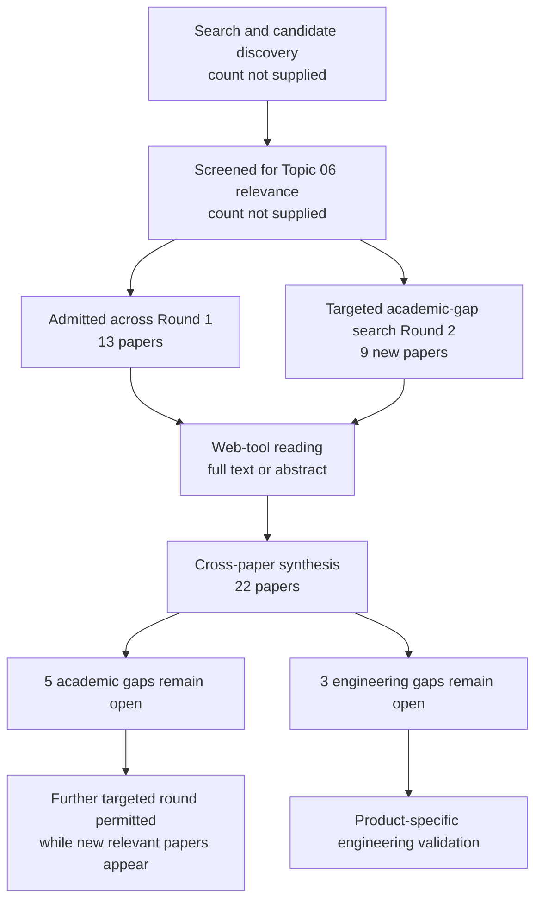

# Research Report: Work-item state, event factuality, temporal reasoning, and conflicting revisions in workplace communication

## Contents

- [Round History](#round-history)
- [Executive Summary](#executive-summary)
- [Research Question](#research-question)
- [Methodology](#methodology)
- [Papers Reviewed](#papers-reviewed)
- [Research Landscape](#research-landscape)
- [Methodology Comparison](#methodology-comparison)
- [Confidence-Graded Findings](#confidence-graded-findings)
- [Trade-Off Analysis](#trade-off-analysis)
- [Points of Agreement](#points-of-agreement)
- [Points of Contradiction](#points-of-contradiction)
- [Research Gaps](#research-gaps)
- [Reproducibility Notes](#reproducibility-notes)
- [Practical Recommendations](#practical-recommendations)
- [Future Directions](#future-directions)
- [Readiness Assessment (System-Building Mode)](#readiness-assessment-system-building-mode)
- [Evidence Map](#evidence-map)
- [References](#references)
- [Appendix: Run Metadata](#appendix-run-metadata)

## Round History

Iterative gap-closure loop (hard cap: 4 rounds). See `references/iterative-synthesis.md` for the full loop definition.

| Round | Run ID | Topic / Gap Focus | New Papers | Gaps Addressed | Remaining Gaps |
|-------|--------|-------------------|------------|----------------|----------------|
| 1 | 8096ea3adc6c | work-item state, event factuality, temporal reasoning, and conflicting revisions in workplace communication: tracking whether an event is planned, confirmed, revoked, completed, or contradicted | 13 | initial shortlist | 5 academic, 3 engineering |
| 2 | 9537e966ca79 | Longitudinal event and work-item state transitions in dialogue and operational communication, with emphasis on supersession, correction, contradiction, reopening, source-relative factuality, evidential confirmation, and preservation of historical state. | 9 | academic gaps of the previous round | 5 academic, 3 engineering |

**Stop reason**: another round runs while open academic gaps remain and new papers appear

## Executive Summary

This review investigated how a system can maintain an evidence-backed longitudinal assessment of workplace work items when communications express plans, approvals, completion claims, cancellations, corrections, contradictions, changed deadlines, reopening, and other revisions. Across 22 papers, the strongest evidence supports keeping source-relative factuality, temporal relations, commitment lifecycle state, belief revision, and historical provenance as distinguishable dimensions rather than collapsing them into a single mutable status [doi-10-1007-s10579-009-9089-9] [doi-10-1007-s10458-012-9202-0] [doi-10-1093-jos-ffn013] [doi-10-1007-3-540-44503-x-20] [2104.01146]. [HIGH] The literature also provides mechanisms for temporal ordering, correction/retraction, conflict management, provenance, and historical-state retention, but those mechanisms have principally been tested in news, formal dialogue, databases, belief-revision settings, event-sourced software, or adjacent fact-verification domains rather than longitudinal workplace communication. [HIGH] The most significant unresolved gap is that no admitted paper evaluates the complete target task: successive operational messages changing one work item's state while jointly reasoning over source-relative factuality, time, contradiction/supersession, evidential confirmation, and preserved historical assessments. [HIGH]

**Scope**: 22 papers analyzed from 11 listed web source hosts, covering publications from 1992 through 2026  
**Overall Confidence**: Medium  
**Verdict**: HAS_GAPS

The overall confidence is Medium because several component-level conclusions are strongly supported, but direct empirical transfer to workplace email and Teams-like operational communication remains unvalidated.

## Research Question

The investigation asked:

> How should a workplace-information system represent and reason about the evolving evidence-backed state of a work item when successive communications can request, propose, plan, approve, complete, revoke, supersede, dispute, condition, correct, reopen, or contradict earlier information, while preserving historical evidence and distinguishing message time, event/effective time, deadlines, collection/version time, source-relative factuality, and independent confirmation?

The scope includes:

- event factuality, modality, certainty, negation, and source attribution;
- temporal ordering and temporal-relation extraction;
- commitment lifecycle semantics;
- correction, retraction, cancellation, persistence, and reopening;
- belief revision and conflict handling;
- historical-state preservation, event sourcing, and provenance;
- multi-source corroboration where relevant to evidential confirmation;
- cross-document event ordering where relevant to longitudinal identity and time.

The scope excludes pure date extraction, action/request extraction without longitudinal state evolution, generic NLI without persistent state, workflow state machines without linguistic/evidential uncertainty, and incremental briefing generation itself.

A useful synthesis-level decomposition is:

$O_i = (\text{source},\text{utterance},t_m,t_e,t_d,t_c)$

where $t_m$ is message time, $t_e$ event/effective time, $t_d$ deadline or constraint time, and $t_c$ collection/version observation time.

A derived assessment at observation step $k$ can then be conceptualized as:

$A_k = f(O_{\leq k},F_{\leq k},R_{\leq k},P_{\leq k})$

where $F$ contains source-relative factuality assessments, $R$ contains revision/temporal relations, and $P$ contains provenance. This formula is a synthesis-derived product representation, not a model directly evaluated by any admitted paper.

Critically, the intended semantics are not equivalent to:

$\text{current state} = \text{state asserted by latest message}$.

The literature reviewed provides multiple reasons why message recency alone cannot establish supersession, factual completion, or evidential confirmation [doi-10-1093-jos-ffn013] [doi-10-1017-cbo9780511526664-007] [doi-10-1007-s10579-009-9089-9].

## Methodology

### Search Strategy

- **Sources**: host web access to arXiv, ACL Anthology, ResearchGate, Cambridge Core, ScienceDirect, Springer/journal or conference pages, university repositories, author-hosted PDFs, and institutional publication repositories.
- **Query variants**:
  - `longitudinal event work-item transitions dialogue operational communication, emphasis supersession, correction, contradiction, reopening, source-relative factuality, evidential confirmation, preservation historical state.`
  - `longitudinal event work-item`
  - `longitudinal transitions dialogue operational communication, emphasis supersession, correction, contradiction, reopening, source-relative factuality, evidential confirmation, preservation historical state.`
  - `event transitions dialogue operational communication, emphasis supersession, correction, contradiction, reopening, source-relative factuality, evidential confirmation, preservation historical state.`
  - `work-item transitions dialogue operational communication, emphasis supersession, correction, contradiction, reopening, source-relative factuality, evidential confirmation, preservation historical state.`
  - `longitudinal event work-item transitions dialogue`
  - `longitudinal event work-item operational communication,`
  - `longitudinal event work-item emphasis supersession,`
- **Time window**: 1992–2026.
- **Screening**: iterative research-pipeline screening was used, but the supplied run artifacts do not state whether the implementation was specifically BM25-only or BM25 plus sub-agent; therefore that detail is recorded as unknown rather than inferred.
- **Evidence policy**: project context and inherited Topic 05 handoffs were used only to determine relevance and ownership boundaries. They were not treated as academic evidence.
- **Reading method**: all admitted papers were read through the host's web tool at the access levels recorded below. Full-text claims were distinguished from abstract-only evidence.

### Paper Access Levels

| Paper | Access level | Host/source used |
|---|---|---|
| [1804.06020] | full_text | arXiv HTML |
| [1909.00429] | full_text | arXiv HTML |
| [1909.05360] | full_text | arXiv HTML |
| [2104.01146] | full_text | arXiv HTML |
| [doi-10-1007-3-540-44503-x-20] | full_text | University of Edinburgh PDF |
| [doi-10-1007-s10458-012-9202-0] | full_text | ResearchGate |
| [doi-10-1007-s10579-009-9089-9] | full_text | ResearchGate |
| [doi-10-1007-s11390-024-2655-1] | full_text | Journal of Computer Science and Technology site |
| [doi-10-1016-0020-0255-94-90059-0] | abstract_only | ScienceDirect |
| [doi-10-1016-j-artint-2003-08-003] | full_text | institutional/author-hosted PDF |
| [doi-10-1016-j-ipm-2021-102836] | full_text | author-hosted PDF |
| [doi-10-1016-j-ipm-2026-104709] | abstract_only | ScienceDirect |
| [doi-10-1016-j-knosys-2016-07-032] | full_text | University of Alicante repository |
| [doi-10-1017-cbo9780511526664-007] | abstract_only | Cambridge Core |
| [doi-10-1023-a-1010318403544] | full_text | Utrecht University PDF |
| [doi-10-1093-jos-ffn013] | full_text | University of Edinburgh PDF |
| [doi-10-1145-1082473-1082754] | full_text | ResearchGate |
| [doi-10-1162-tacl-a-00182] | full_text | ACL Anthology PDF |
| [doi-10-18653-v1-2021-emnlp-main-815] | full_text | ACL Anthology PDF |
| [doi-10-18653-v1-2023-findings-acl-44] | full_text | ACL Anthology PDF |
| [doi-10-18653-v1-d18-1155] | full_text | arXiv HTML |
| [manual-eef7a0219f] | full_text | arXiv HTML |

### Pipeline Summary

| Metric | Count |
|--------|-------|
| Total candidates | unknown |
| After screening | unknown |
| Downloaded | not applicable as a uniform metric; papers were accessed through the host web tool |
| Successfully converted | not applicable/unknown |
| Deeply analyzed | 22 |
| Iterations (if system-building) | 2 completed rounds |

## Papers Reviewed

| # | Title | Authors | Year | Venue | Quality Score | Relevance |
|---|-------|---------|------|-------|--------------|-----------|
| 1 | On the difference between updating a knowledge base and revising it [doi-10-1017-cbo9780511526664-007] | Hirofumi Katsuno, Alberto O. Mendelzon | 1992 | *Belief Revision* book chapter | unknown | HIGH |
| 2 | Towards Generative Event Factuality Prediction [doi-10-18653-v1-2023-findings-acl-44] | John Murzaku, Tyler Osborne, Amittai Aviram et al. | 2023 | Findings of ACL | unknown | HIGH |
| 3 | An Empirical Characterization of Event Sourced Systems and Their Schema Evolution -- Lessons from Industry [2104.01146] | Michiel Overeem, Marten Spoor, Slinger Jansen et al. | 2021 | arXiv-accessed publication | unknown | HIGH |
| 4 | Agreement, Disputes and Commitments in Dialogue [doi-10-1093-jos-ffn013] | Alex Lascarides, Nicholas Asher | 2009 | Journal of Semantics | unknown | HIGH |
| 5 | Resolution of time concepts in temporal databases [doi-10-1016-0020-0255-94-90059-0] | Sharma Chakravarthy, Seung-Kyum Kim | 1994 | Information Sciences | unknown | HIGH |
| 6 | Layered message semantics using social commitments [doi-10-1145-1082473-1082754] | Roberto A. Flores, Philippe Pasquier, Brahim Chaib-draa | 2005 | ACM proceedings | unknown | HIGH |
| 7 | Why and Where: A Characterization of Data Provenance [doi-10-1007-3-540-44503-x-20] | Peter Buneman, Sanjeev Khanna, Wang-Chiew Tan | 2001 | ICDT | unknown | HIGH |
| 8 | The Problem of Retraction in Critical Discussion [doi-10-1023-a-1010318403544] | Erik C. W. Krabbe | 2001 | unknown | unknown | HIGH |
| 9 | HeterMV: Multi-view reasoning over source-aware heterogeneous evidence graph for multi-source fact verification [doi-10-1016-j-ipm-2026-104709] | Junnan Gu, Weimin Li, Fangfang Liu et al. | 2026 | Information Processing & Management | unknown | MEDIUM |
| 10 | Cross-document event ordering through temporal, lexical and distributional knowledge [doi-10-1016-j-knosys-2016-07-032] | Borja Navarro-Colorado, Estela Saquete | 2016 | Knowledge-Based Systems | unknown | HIGH |
| 11 | FactBank: a corpus annotated with event factuality [doi-10-1007-s10579-009-9089-9] | Roser Saurí, James Pustejovsky | 2009 | Language Resources and Evaluation | unknown | HIGH |
| 12 | End-to-end event factuality prediction using directional labeled graph recurrent network [doi-10-1016-j-ipm-2021-102836] | Xiao Liu, Heyan Huang, Yue Zhang | 2022 | Information Processing & Management | unknown | HIGH |
| 13 | Document-Level Event Factuality Identification via Reinforced Semantic Learning Network [doi-10-1007-s11390-024-2655-1] | Zhong Qian, Pei-Feng Li, Qiao-Ming Zhu et al. | 2025 | Journal of Computer Science and Technology | unknown | HIGH |
| 14 | Utilizing Relative Event Time to Enhance Event-Event Temporal Relation Extraction [doi-10-18653-v1-2021-emnlp-main-815] | Haoyang Wen, Heng Ji | 2021 | EMNLP | unknown | HIGH |
| 15 | More than Classification: A Unified Framework for Event Temporal Relation Extraction [manual-eef7a0219f] | Quzhe Huang, Yutong Hu, Shengqi Zhu et al. | 2023 | arXiv-accessed publication | unknown | HIGH |
| 16 | Representing and monitoring social commitments using the event calculus [doi-10-1007-s10458-012-9202-0] | Federico Chesani, Paola Mello, Marco Montali et al. | 2012 | Autonomous Agents and Multi-Agent Systems | unknown | HIGH |
| 17 | Joint Event and Temporal Relation Extraction with Shared Representations and Structured Prediction [1909.05360] | Rujun Han, Qiang Ning, Nanyun Peng | 2019 | arXiv-accessed publication | unknown | HIGH |
| 18 | Dense Event Ordering with a Multi-Pass Architecture [doi-10-1162-tacl-a-00182] | Nathanael Chambers, Taylor Cassidy, Bill McDowell et al. | 2014 | Transactions of the Association for Computational Linguistics | unknown | HIGH |
| 19 | An Improved Neural Baseline for Temporal Relation Extraction [1909.00429] | Qiang Ning, Sanjay Subramanian, Dan Roth | 2019 | arXiv-accessed publication | unknown | HIGH |
| 20 | Temporal Information Extraction by Predicting Relative Time-lines [doi-10-18653-v1-d18-1155] | Artuur Leeuwenberg, Marie-Francine Moens | 2018 | EMNLP | unknown | HIGH |
| 21 | Weakening conflicting information for iterated revision and knowledge integration [doi-10-1016-j-artint-2003-08-003] | Salem Benferhat, Souhila Kaci, Daniel Le Berre et al. | 2004 | Artificial Intelligence | unknown | HIGH |
| 22 | Improving Temporal Relation Extraction with a Globally Acquired Statistical Resource [1804.06020] | Qiang Ning, Hao Wu, Haoruo Peng et al. | 2018 | arXiv-accessed publication | unknown | HIGH |

No numerical paper-quality scores were supplied by the research run, so the Quality Score column is explicitly left as `unknown` rather than retrospectively inventing scores.

## Research Landscape

### Theme 1: Source-relative factuality is not independent verification

**Coverage**: 4 papers | **Confidence**: High  
**Supporting papers**: [doi-10-1007-s10579-009-9089-9], [doi-10-18653-v1-2023-findings-acl-44], [doi-10-1016-j-ipm-2021-102836], [doi-10-1007-s11390-024-2655-1]

The factuality literature treats factuality principally as the degree or polarity of commitment expressed by a textual source toward an event. FactBank explicitly associates events with sources and factuality values rather than treating one extracted status as an independently established real-world fact [doi-10-1007-s10579-009-9089-9]. Generative and graph-based factuality work builds prediction models on this linguistic notion of factuality [doi-10-18653-v1-2023-findings-acl-44] [doi-10-1016-j-ipm-2021-102836]. Document-level work shows that one event can have locally differing factuality presentations even when the task eventually produces one document-level label [doi-10-1007-s11390-024-2655-1].

Key findings:

1. [HIGH] Event factuality should be understood as a source-relative textual assessment unless independent corroboration is separately available; it is not evidence by itself that the event objectively occurred [doi-10-1007-s10579-009-9089-9] [doi-10-18653-v1-2023-findings-acl-44].
2. [HIGH] Different mentions or sources can support different factuality assessments of what appears to be the same event, so preserving per-source/per-mention assessments is semantically meaningful [doi-10-1007-s10579-009-9089-9] [doi-10-1007-s11390-024-2655-1].
3. [MEDIUM] Document-level aggregation is a legitimate task formulation, but it should not be assumed to preserve the source-relative distinctions required by longitudinal workplace state tracking [doi-10-1007-s11390-024-2655-1].

### Theme 2: Temporal ordering requires relations, context, and sometimes global reasoning

**Coverage**: 8 papers | **Confidence**: High  
**Supporting papers**: [1804.06020], [1909.00429], [1909.05360], [doi-10-1162-tacl-a-00182], [doi-10-18653-v1-2021-emnlp-main-815], [manual-eef7a0219f], [doi-10-18653-v1-d18-1155], [doi-10-1016-j-knosys-2016-07-032]

Temporal-relation research shows that event ordering is richer than identifying dates. Models exploit linguistic context, relative event times, temporal commonsense/statistical knowledge, structured prediction, and graph-level consistency [1804.06020] [1909.00429] [1909.05360] [doi-10-18653-v1-2021-emnlp-main-815]. Dense ordering and timeline approaches further show that local pairwise predictions can be embedded into broader temporal structures [doi-10-1162-tacl-a-00182] [doi-10-18653-v1-d18-1155] [manual-eef7a0219f].

Cross-document event ordering additionally shows that event identity and entity/coreference quality affect downstream temporal recall [doi-10-1016-j-knosys-2016-07-032].

Key findings:

1. [HIGH] Temporal ordering benefits from structured temporal information beyond isolated local classification, including relative-time features, global knowledge, or graph/timeline representations [1804.06020] [1909.05360] [doi-10-18653-v1-2021-emnlp-main-815] [manual-eef7a0219f].
2. [HIGH] Temporal identity/coreference errors propagate into downstream event ordering, making reliable work-item identity a prerequisite rather than an optional enhancement [doi-10-1016-j-knosys-2016-07-032].
3. [HIGH] The value of particular global constraints is architecture- and dataset-dependent; transitivity cannot be assumed to improve every temporal model [doi-10-1162-tacl-a-00182] [1909.05360].
4. [MEDIUM] Direct timeline prediction and relation-first approaches each have settings in which they perform better, so representation choice should be evaluated on the target data rather than selected from one benchmark result [doi-10-18653-v1-d18-1155].

### Theme 3: Commitment state has a lifecycle richer than active versus inactive

**Coverage**: 3 papers | **Confidence**: High  
**Supporting papers**: [doi-10-1007-s10458-012-9202-0], [doi-10-1145-1082473-1082754], [doi-10-1093-jos-ffn013]

Social-commitment approaches explicitly distinguish states and transitions such as conditional commitment, detachment, satisfaction, cancellation, violation, and other changes driven by later events [doi-10-1007-s10458-012-9202-0]. Layered message semantics similarly treats communicative messages as creating and manipulating social commitments rather than merely communicating static labels [doi-10-1145-1082473-1082754]. Dialogue theory adds the effect of agreement, dispute, denial, correction, and continuing commitments [doi-10-1093-jos-ffn013].

Key findings:

1. [HIGH] Cancellation and violation are semantically different outcomes and should not be collapsed into one generic inactive state [doi-10-1007-s10458-012-9202-0].
2. [HIGH] Conditional commitments can change state as their antecedent conditions become satisfied, fail, or expire; they therefore require explicit condition-sensitive lifecycle semantics [doi-10-1007-s10458-012-9202-0].
3. [HIGH] Commitment state can be updated incrementally in response to incoming events, supporting a longitudinal rather than one-shot interpretation [doi-10-1007-s10458-012-9202-0] [doi-10-1145-1082473-1082754].

### Theme 4: Correction and retraction modify current commitments without erasing history

**Coverage**: 3 papers | **Confidence**: High  
**Supporting papers**: [doi-10-1023-a-1010318403544], [doi-10-1093-jos-ffn013], [doi-10-1016-j-artint-2003-08-003]

Dialogue work distinguishes withdrawing or correcting a commitment from pretending that the earlier contribution never occurred. It also examines how undenied material persists and how corrections of corrections can restore earlier content [doi-10-1093-jos-ffn013]. Retraction theory treats withdrawal as a structured conversational operation rather than destructive deletion of the dialogue record [doi-10-1023-a-1010318403544]. Belief-revision work independently shows that inconsistency handling can preserve useful information rather than deleting every proposition involved in conflict [doi-10-1016-j-artint-2003-08-003].

Key findings:

1. [HIGH] A correction or retraction changes the active assessment but does not justify deletion of the historical utterance that created the previous assessment [doi-10-1023-a-1010318403544] [doi-10-1093-jos-ffn013].
2. [HIGH] Previously displaced commitments may become relevant again after later correction, which motivates explicit lineage between successive assessments [doi-10-1093-jos-ffn013].
3. [MEDIUM] Conflict-resolution mechanisms that weaken rather than simply delete conflicting information provide a useful formal analogy for evidence-preserving workplace state resolution, although this transfer has not been evaluated directly [doi-10-1016-j-artint-2003-08-003].

### Theme 5: Changed-world updates and corrected beliefs are different operations

**Coverage**: 2 papers | **Confidence**: High  
**Supporting papers**: [doi-10-1017-cbo9780511526664-007], [doi-10-1016-j-artint-2003-08-003]

Belief-change theory distinguishes two important cases: updating beliefs because the represented world itself changed, versus revising beliefs because new information changes what should be believed about a world treated as static [doi-10-1017-cbo9780511526664-007]. Iterated revision work further examines how conflicts can be weakened while preserving non-conflicting consequences [doi-10-1016-j-artint-2003-08-003].

Key findings:

1. [HIGH] A later workplace statement can represent either a real state transition or a correction of an earlier understanding; treating the two operations as identical loses meaningful semantics [doi-10-1017-cbo9780511526664-007].
2. [HIGH] Conflict resolution need not imply wholesale deletion of the losing information; preservation of non-conflicting information is formally supported by revision work [doi-10-1016-j-artint-2003-08-003].

### Theme 6: Historical time and provenance require explicit retained records

**Coverage**: 3 papers | **Confidence**: High  
**Supporting papers**: [doi-10-1016-0020-0255-94-90059-0], [doi-10-1007-3-540-44503-x-20], [2104.01146]

Temporal-database research distinguishes multiple temporal dimensions needed to describe when facts apply and when they become known or recorded [doi-10-1016-0020-0255-94-90059-0]. Provenance research distinguishes why a result exists from where its contributing values came from [doi-10-1007-3-540-44503-x-20]. Industrial event-sourcing evidence shows that retaining state-changing events is used for auditability and historical reconstruction, while also documenting practical schema-evolution challenges [2104.01146].

Key findings:

1. [MEDIUM] Event/valid/transaction-style temporal distinctions provide a strong conceptual precedent for separately representing event time and observation/history time, but the reviewed temporal-database evidence was available only at abstract level [doi-10-1016-0020-0255-94-90059-0].
2. [HIGH] Provenance has multiple semantics; explaining why an assessment exists is different from identifying the exact source location from which particular values were copied [doi-10-1007-3-540-44503-x-20].
3. [HIGH] Event-sourced systems demonstrate practical value in retaining state-change history, but real systems do not universally maintain perfect immutability or complete audit histories [2104.01146].

### Theme 7: Multi-source corroboration is useful but not equivalent to longitudinal state tracking

**Coverage**: 1 paper | **Confidence**: Medium  
**Supporting papers**: [doi-10-1016-j-ipm-2026-104709]

Heterogeneous evidence graphs can preserve distinctions between evidence sources during multi-source fact verification, with reported benefits on the paper's Check-COVID and FEVEROUS-S evaluations [doi-10-1016-j-ipm-2026-104709]. The result is relevant to evidential confirmation, but its task is claim verification rather than successive lifecycle transitions in workplace communication.

Key findings:

1. [MEDIUM] Preserving source roles in a heterogeneous evidence representation can benefit multi-source fact verification [doi-10-1016-j-ipm-2026-104709].
2. [MEDIUM] This evidence does not establish how a system should distinguish a colleague's statement that work is complete from independently confirmed completion over a longitudinal work-item history [doi-10-1016-j-ipm-2026-104709].

## Methodology Comparison

| Approach | Papers | Strengths | Weaknesses | Best For | Performance |
|----------|--------|-----------|------------|----------|-------------|
| Source-relative event factuality | [doi-10-1007-s10579-009-9089-9], [doi-10-18653-v1-2023-findings-acl-44], [doi-10-1016-j-ipm-2021-102836], [doi-10-1007-s11390-024-2655-1] | Explicitly represents whether textual sources commit to events; supports negation/uncertainty reasoning | Does not establish independent real-world verification; mostly news-derived | Distinguishing asserted, negated, uncertain, or reported events | Multiple task-specific factuality results reported; metrics are not directly comparable across models |
| Pairwise/structured temporal relation extraction | [1804.06020], [1909.00429], [1909.05360], [doi-10-1162-tacl-a-00182], [doi-10-18653-v1-2021-emnlp-main-815] | Mature representation of BEFORE/AFTER/etc.; can exploit global structure and temporal knowledge | Performance of constraints varies by benchmark and architecture | Event ordering within documents or event graphs | Reported improvements vary; transitivity ranges from substantial benefit in one setup to essentially no benefit in another |
| Timeline-oriented temporal representation | [doi-10-18653-v1-d18-1155], [manual-eef7a0219f] | Represents events on broader relative timelines; can reduce dependence on isolated relation labels | Dataset characteristics materially affect results | Global temporal organization | Direct versus indirect approaches reverse ordering across evaluated splits in [doi-10-18653-v1-d18-1155] |
| Cross-document event ordering | [doi-10-1016-j-knosys-2016-07-032] | Combines temporal and semantic compatibility across documents | Sensitive to upstream identity/coreference errors; news domain | Cross-source timelines after event identity is established | Manual-coreference analysis shows upstream coreference materially constrains recall |
| Social-commitment lifecycle | [doi-10-1007-s10458-012-9202-0], [doi-10-1145-1082473-1082754] | Explicit state-transition semantics; distinguishes cancellation, violation, conditions, discharge | Formal/multi-agent settings rather than workplace NLP benchmarks | Modeling commitments and lifecycle transitions | Formal/implemented monitoring evidence; no target workplace benchmark |
| Dialogue commitment/retraction semantics | [doi-10-1093-jos-ffn013], [doi-10-1023-a-1010318403544] | Captures dispute, correction, persistence, retraction, and restoration | Primarily formal/theoretical rather than large-scale extraction models | Revision semantics and historical commitment lineage | No directly comparable workplace extraction metric |
| Belief revision/update | [doi-10-1017-cbo9780511526664-007], [doi-10-1016-j-artint-2003-08-003] | Distinguishes world change from corrected belief; principled conflict handling | Propositional/formal assumptions do not directly solve language grounding | Deciding semantics of change and inconsistency | Formal comparison rather than target-domain empirical performance |
| Temporal database model | [doi-10-1016-0020-0255-94-90059-0] | Provides multiple temporal dimensions and historical update semantics | Abstract-only access in this review; database rather than language domain | Storage semantics for effective and recorded time | Not a workplace NLP benchmark |
| Provenance model | [doi-10-1007-3-540-44503-x-20] | Separates different provenance questions and derivation relationships | Database model does not define conversational supersession | Explaining source lineage of derived assessments | Formal provenance characterization |
| Event sourcing | [2104.01146] | Real industrial evidence on audit/history retention and schema evolution | Event immutability/history completeness are not universal in practice | Durable implementation architecture and audit history | Empirical industry characterization, not language-understanding accuracy |
| Multi-source heterogeneous verification | [doi-10-1016-j-ipm-2026-104709] | Preserves source/evidence roles while combining evidence | Claim verification differs from lifecycle tracking; abstract-only access | Independent corroboration experiments | Reported benchmark gains on Check-COVID and FEVEROUS-S, exact figures not reproduced here |

## Confidence-Graded Findings

### 🟢 High Confidence (supported by 3+ papers with consistent results)

1. **[HIGH] Source-relative factuality must not be equated with independent confirmation.** FactBank explicitly represents factuality relative to sources, and later event-factuality work predicts that linguistic status rather than directly observing external reality [doi-10-1007-s10579-009-9089-9] [doi-10-18653-v1-2023-findings-acl-44] [doi-10-1016-j-ipm-2021-102836].

2. **[HIGH] Event/work-item state should not be collapsed into a binary active/inactive field.** Commitment, dialogue, and retraction work distinguish cancellation, violation, conditionality, correction, dispute, persistence, and withdrawal [doi-10-1007-s10458-012-9202-0] [doi-10-1145-1082473-1082754] [doi-10-1093-jos-ffn013] [doi-10-1023-a-1010318403544].

3. **[HIGH] Historical evidence should be preserved when the current assessment changes.** Dialogue correction/retraction semantics, provenance theory, and event-sourcing practice all support preserving earlier records or their derivation/history rather than overwriting the past [doi-10-1093-jos-ffn013] [doi-10-1007-3-540-44503-x-20] [2104.01146].

4. **[HIGH] Temporal reasoning requires more than extracting dates.** Multiple temporal-relation studies show utility from relation structure, contextual/commonsense temporal information, relative event time, global inference, or timeline representations [1804.06020] [1909.00429] [1909.05360] [doi-10-1162-tacl-a-00182] [doi-10-18653-v1-2021-emnlp-main-815] [manual-eef7a0219f].

5. **[HIGH] A later communication should not automatically be interpreted as superseding an earlier communication.** The reviewed dialogue, belief-revision, and factuality traditions distinguish correction, changed state, disagreement, source-relative commitment, and retraction, so recency alone lacks sufficient semantics [doi-10-1093-jos-ffn013] [doi-10-1017-cbo9780511526664-007] [doi-10-1007-s10579-009-9089-9].

6. **[HIGH] Update caused by world change and revision caused by corrected information are conceptually distinct.** This distinction is explicit in belief-change theory and is directly relevant to differentiating "the deadline changed" from "the earlier deadline was reported incorrectly" [doi-10-1017-cbo9780511526664-007] [doi-10-1016-j-artint-2003-08-003].

### 🟡 Medium Confidence (supported by 1-2 papers or with caveats)

1. **[MEDIUM] A multi-time representation should include an observation/history dimension distinct from event/effective time.** Temporal-database work gives a closely related precedent, but the relevant paper was only available at abstract level and does not test the product's exact four-time representation [doi-10-1016-0020-0255-94-90059-0].

2. **[MEDIUM] Source-aware heterogeneous evidence graphs are promising for distinguishing corroborating evidence roles.** HeterMV reports benefits in multi-source fact verification, but its evaluation is not longitudinal workplace state tracking [doi-10-1016-j-ipm-2026-104709].

3. **[MEDIUM] A document-level factuality label may be unsuitable as the only stored representation when source-relative disagreements matter.** ExDLEF deliberately produces a single document-level value despite differing local factualities, while FactBank explicitly preserves source-relative distinctions [doi-10-1007-s11390-024-2655-1] [doi-10-1007-s10579-009-9089-9].

4. **[MEDIUM] The exact value of global temporal constraints must be established empirically for the target architecture.** The reviewed results disagree substantially about the benefit of transitivity [doi-10-1162-tacl-a-00182] [1909.05360].

5. **[MEDIUM] Cross-document ordering cannot compensate for poor event/work-item identity.** Manual-coreference experiments indicate substantial downstream dependence on upstream identity, but the evidence is from news rather than workplace communication [doi-10-1016-j-knosys-2016-07-032].

### 🔴 Low Confidence (preliminary, single-source, or contradicted)

No substantive synthesis finding is assigned [LOW] confidence. Findings supported only by weak transfer or abstract-only evidence were retained at [MEDIUM] rather than overstated.

## Trade-Off Analysis

| Decision | Option A | Option B | Recommendation |
|----------|----------|----------|----------------|
| Current-state storage | Replace one mutable status whenever a new message arrives | Preserve immutable observations and successive assessments, then derive a current view | [HIGH] Prefer preserved observations plus a derived current view. This aligns with provenance, dialogue-history, and event-sourcing evidence [doi-10-1007-3-540-44503-x-20] [doi-10-1093-jos-ffn013] [2104.01146]. |
| Factuality representation | Store one global factuality label | Store source-relative factuality and derive consolidation separately | [HIGH] Preserve source-relative assessments because factuality literature explicitly models source dependence [doi-10-1007-s10579-009-9089-9]. |
| Later conflicting messages | Latest-message-wins | Classify relation first: correction, supersession, supplementation, contradiction, reopening, or unresolved | [HIGH] Do not assume supersession solely from time ordering; relation semantics must be established separately [doi-10-1093-jos-ffn013] [doi-10-1017-cbo9780511526664-007]. |
| Completion | Treat confident textual completion statement as completed | Separate asserted completion from independently confirmed completion | [HIGH] Keep them separate because factuality predicts textual source commitment, not external verification [doi-10-1007-s10579-009-9089-9] [doi-10-18653-v1-2023-findings-acl-44]. |
| Temporal representation | One timestamp per item | Distinguish message, event/effective, deadline/constraint, and observation/version time | [MEDIUM] Use separate temporal dimensions as an engineering hypothesis and benchmark it; related temporal/database literature supports the distinction but not the exact target schema [doi-10-1016-0020-0255-94-90059-0]. |
| Temporal inference | Assume transitivity/global constraints always improve consistency | Evaluate local versus global inference empirically | [HIGH] Benchmark both because reported gains differ sharply by architecture and dataset [doi-10-1162-tacl-a-00182] [1909.05360]. |
| Conflict handling | Delete the losing proposition | Preserve conflicting source records and weaken/revise only derived acceptance | [HIGH] Preserve history; belief-revision and dialogue literature explicitly support non-destructive treatment of prior commitments [doi-10-1016-j-artint-2003-08-003] [doi-10-1093-jos-ffn013]. |
| State taxonomy | Binary open/closed | Explicit lifecycle including conditional, completed, cancelled/revoked, violated/disputed, and unresolved states | [HIGH] Explicit lifecycle semantics better match commitment formalisms [doi-10-1007-s10458-012-9202-0]. |

## Points of Agreement

1. [HIGH] **Factuality is not simply objective truth.** Event-factuality work consistently models what a source presents or commits to about an event, making attribution essential [doi-10-1007-s10579-009-9089-9] [doi-10-18653-v1-2023-findings-acl-44] [doi-10-1016-j-ipm-2021-102836].

2. [HIGH] **Temporal structure matters beyond explicit timestamp extraction.** Relative-time signals, temporal commonsense/statistical knowledge, structured prediction, and timeline representations all provide useful information for event ordering [1804.06020] [1909.05360] [doi-10-18653-v1-2021-emnlp-main-815] [manual-eef7a0219f].

3. [HIGH] **Commitments change through semantically distinct lifecycle operations.** Cancellation, violation, detachment, correction, dispute, and retraction cannot be represented faithfully by one generic "changed" transition [doi-10-1007-s10458-012-9202-0] [doi-10-1145-1082473-1082754] [doi-10-1093-jos-ffn013] [doi-10-1023-a-1010318403544].

4. [HIGH] **Historical information has continuing value after revision.** Provenance research, dialogue-revision semantics, belief revision, and event-sourcing practice each preserve distinctions that destructive overwrite would lose [doi-10-1007-3-540-44503-x-20] [doi-10-1093-jos-ffn013] [doi-10-1016-j-artint-2003-08-003] [2104.01146].

5. [HIGH] **Identity errors propagate into longitudinal reasoning.** Cross-document ordering results show that coreference/event-identity errors materially limit downstream event recall, reinforcing the dependency on reliable Topic/work-item identity [doi-10-1016-j-knosys-2016-07-032].

## Points of Contradiction

1. [HIGH] **Measured value of global temporal transitivity**: CAEVO reports a large gain when transitive inference is added in its dense temporal-ordering setup [doi-10-1162-tacl-a-00182], whereas the structured joint model reports no gain from its transitivity constraint on TB-Dense and only a 0.1 F1 increase on MATRES [1909.05360].
   - **Possible explanation**: the studies use different architectures, candidate graphs, inference mechanisms, datasets, and evaluation settings.
   - **Implication**: transitivity should be evaluated as a target-system design choice rather than assumed to be universally beneficial.

2. [HIGH] **Direct timeline prediction versus indirect relation-to-timeline conversion**: within the same study, contextual direct timeline prediction outperforms TL2RTL on the TE3 split, while TL2RTL outperforms the direct model on the smaller TimeBank-Dense-derived split [doi-10-18653-v1-d18-1155].
   - **Possible explanation**: the paper attributes the reversal partly to differences in dataset size, density, and class balance.
   - **Implication**: timeline representation should be chosen through target-domain evaluation rather than a universal benchmark ranking.

3. [HIGH] **Single document-level factuality versus preservation of source- or mention-relative assessments**: ExDLEF defines one document-level factuality value even when local sentence-level factualities differ [doi-10-1007-s11390-024-2655-1], whereas FactBank-based work explicitly represents factuality relative to sources [doi-10-1007-s10579-009-9089-9] [doi-10-18653-v1-2023-findings-acl-44].
   - **Possible explanation**: these are different task definitions rather than necessarily incompatible empirical claims.
   - **Implication**: msgloom should not infer from document-level factuality research that one consolidated value is sufficient for a provenance-sensitive longitudinal state history.

4. [MEDIUM] **DLGRN parameter-count claim**: the narrative statement that DLGRN uses fewer parameters than all compared baselines conflicts with the paper's own tables, which report BERT at 109.5M parameters and DLGRN at 119.7M [doi-10-1016-j-ipm-2021-102836].
   - **Possible explanation**: the prose claim may be an editorial or comparison error.
   - **Implication**: the reported factuality results can still be considered, but the paper's parameter-efficiency claim should not be relied upon.

## Research Gaps

All eight gaps below remain open after Rounds 1 and 2. The literature reviewed so far has not answered them. No unresolved gap is treated as accepted, closed, or validated.

| # | Gap | Type | Severity | Rounds Searched | Impact on Goals |
|---|-----|------|----------|-----------------|----------------|
| 1 | No admitted paper directly evaluates the full longitudinal workplace work-item lifecycle while retaining historical assessments. | [ACADEMIC] | [HIGH] | 1, 2 | The central target task lacks direct empirical validation. |
| 2 | No evaluated natural-language method distinguishes supersession, correction, supplementation, contradiction, reopening, and unresolved conflict across successive operational communications. | [ACADEMIC] | [HIGH] | 1, 2 | Wrong relation assignment could silently replace valid prior state or resurrect obsolete state. |
| 3 | No admitted experiment jointly evaluates source-relative factuality, temporal ordering, lifecycle state, contradiction handling, and provenance in one longitudinal model. | [ACADEMIC] | [HIGH] | 1, 2 | Component evidence does not prove the integrated system behaves correctly. |
| 4 | Direct workplace email, Teams-like dialogue, or comparable operational-communication evidence is absent. | [ACADEMIC] | [HIGH] | 1, 2 | News/formal-domain accuracy cannot be claimed as production-email accuracy. |
| 5 | No admitted paper establishes how to separate an author's assertion of completion from independent evidential confirmation of completion in longitudinal workplace communication. | [ACADEMIC] | [HIGH] | 1, 2 | A system could incorrectly mark work complete from an unsupported textual assertion. |
| 6 | No adversarial benchmark covers plan→cancel, approve→revoke, deadline changes, same-time contradictions, out-of-order ingestion, stale late arrivals, and corrected completion claims. | [ENGINEERING] | [HIGH] | 1, 2 | These sequences directly target dangerous false-completion and stale-state failures. |
| 7 | The exact four-way product representation of message time, event/effective time, deadline/constraint time, and observed collection/version time has not been benchmarked. | [ENGINEERING] | [HIGH] | 1, 2 | Temporal conflation can lose changed deadlines or misinterpret late evidence. |
| 8 | No implementation has been evaluated for this task that combines immutable source observations, successive assessments, lineage, and a separately derived current-state view. | [ENGINEERING] | [HIGH] | 1, 2 | The proposed audit/recovery architecture remains an engineering hypothesis. |

### Academic Gaps (require more papers)

1. **[ACADEMIC] [HIGH] Full longitudinal workplace state tracking**: The literature has not yet answered whether a model can reliably track a single workplace work item through requested, proposed, planned, approved, completed, revoked, superseded, disputed, conditional, and unresolved states while retaining prior assessments. Rounds searched: 1 and 2. Suggested query: `"longitudinal event state tracking dialogue email requested planned approved completed revoked superseded"`.

2. **[ACADEMIC] [HIGH] Revision-relation classification**: The literature has not yet established an evaluated natural-language method across successive operational messages for distinguishing supersession, correction, supplementation, contradiction, reopening, and unresolved conflict. Rounds searched: 1 and 2. Suggested query: `"natural language supersession correction contradiction revision reopening dialogue event state"`.

3. **[ACADEMIC] [HIGH] Integrated longitudinal model**: The literature has not yet jointly evaluated source-relative factuality, temporal reasoning, lifecycle state, contradiction handling, and provenance as one system. Rounds searched: 1 and 2. Suggested query: `"event factuality" temporal relation contradiction provenance longitudinal state tracking`.

4. **[ACADEMIC] [HIGH] Target-domain empirical evidence**: The literature has not yet supplied direct workplace email, Teams-like dialogue, or comparable operational-communication evaluation for this task. Rounds searched: 1 and 2. Suggested query: `"workplace email dialogue event factuality temporal revision commitment status tracking"`.

5. **[ACADEMIC] [HIGH] Assertion versus independent confirmation**: The literature has not yet established how a completion assertion should be related to stronger corroborating evidence or independent confirmation in longitudinal workplace communication. Rounds searched: 1 and 2. Suggested query: `"event factuality evidentiality source attribution independent confirmation verification reported completion"`.

### Engineering Gaps (fillable without papers)

1. **[ENGINEERING] [HIGH] Adversarial longitudinal benchmark**: The literature has not supplied the product-specific benchmark needed to test dangerous transition sequences. Rounds searched: 1 and 2. Suggested resolution: construct independent gold fixtures for at least plan→cancel, approve→revoke, plan→complete, complete→correct-not-complete, deadline A→deadline B, contradictory same-effective-time statements, out-of-order ingestion, stale late-arriving messages, correction-of-correction, and unresolved multi-source disagreement.

2. **[ENGINEERING] [HIGH] Four-time temporal representation benchmark**: The literature has not tested the product's intended separation of message time, effective/event time, deadline/constraint time, and observation/version time. Rounds searched: 1 and 2. Suggested resolution: implement competing schemas and evaluate whether each representation correctly preserves state under delayed ingestion, retroactive corrections, future-effective changes, and multiple deadlines.

3. **[ENGINEERING] [HIGH] Provenance-preserving state implementation**: The literature has not evaluated the target architecture of immutable observations plus versioned assessments plus a derived current-state view. Rounds searched: 1 and 2. Suggested resolution: build a minimal event/provenance model, exercise it with mutation/regression tests, and verify that current-state recomputation preserves source lineage and all superseded assessments.

## Reproducibility Notes

The review did not independently audit repositories, dataset licenses, or code releases for all papers. Unknown values are therefore recorded as unknown rather than inferred from publication venue.

| Paper | Code Available | Data Available | Sufficient Detail | License |
|-------|---------------|----------------|-------------------|---------|
| [doi-10-1017-cbo9780511526664-007] | unknown | not applicable/unknown | ⚠️ abstract-only access in this review | unknown |
| [doi-10-18653-v1-2023-findings-acl-44] | unknown | unknown | ✅ full text inspected | unknown |
| [2104.01146] | unknown | unknown | ✅ full text inspected | unknown |
| [doi-10-1093-jos-ffn013] | unknown | unknown | ✅ full text inspected | unknown |
| [doi-10-1016-0020-0255-94-90059-0] | unknown | unknown | ⚠️ abstract-only access in this review | unknown |
| [doi-10-1145-1082473-1082754] | unknown | unknown | ✅ full text inspected | unknown |
| [doi-10-1007-3-540-44503-x-20] | unknown | unknown | ✅ full text inspected | unknown |
| [doi-10-1023-a-1010318403544] | unknown | unknown | ✅ full text inspected | unknown |
| [doi-10-1016-j-ipm-2026-104709] | unknown | unknown | ⚠️ abstract-only access in this review | unknown |
| [doi-10-1016-j-knosys-2016-07-032] | unknown | unknown | ✅ full text inspected | unknown |
| [doi-10-1007-s10579-009-9089-9] | unknown | unknown | ✅ full text inspected | unknown |
| [doi-10-1016-j-ipm-2021-102836] | unknown | unknown | ✅ full text inspected | unknown |
| [doi-10-1007-s11390-024-2655-1] | unknown | unknown | ✅ full text inspected | unknown |
| [doi-10-18653-v1-2021-emnlp-main-815] | unknown | unknown | ✅ full text inspected | unknown |
| [manual-eef7a0219f] | unknown | unknown | ✅ full text inspected | unknown |
| [doi-10-1007-s10458-012-9202-0] | unknown | unknown | ✅ full text inspected | unknown |
| [1909.05360] | unknown | unknown | ✅ full text inspected | unknown |
| [doi-10-1162-tacl-a-00182] | unknown | unknown | ✅ full text inspected | unknown |
| [1909.00429] | unknown | unknown | ✅ full text inspected | unknown |
| [doi-10-18653-v1-d18-1155] | unknown | unknown | ✅ full text inspected | unknown |
| [doi-10-1016-j-artint-2003-08-003] | unknown | unknown | ✅ full text inspected | unknown |
| [1804.06020] | unknown | unknown | ✅ full text inspected | unknown |

## Practical Recommendations

1. **[HIGH] Preserve source observations, source-relative assessments, and the derived current assessment as separate records.** FactBank's source-relative factuality, provenance distinctions, dialogue correction semantics, and event-sourcing evidence all argue against collapsing source evidence and current interpretation into one mutable row [doi-10-1007-s10579-009-9089-9] [doi-10-1007-3-540-44503-x-20] [doi-10-1093-jos-ffn013] [2104.01146].  
   *Confidence*: High

2. **[HIGH] Never infer completion merely because a message linguistically presents an event as completed.** Store at least an "asserted completion" assessment separately from any stronger independently corroborated state [doi-10-1007-s10579-009-9089-9] [doi-10-18653-v1-2023-findings-acl-44].  
   *Confidence*: High

3. **[HIGH] Keep temporal ordering and factual/lifecycle status as separate dimensions.** An event may be ordered relative to another event without being factual, completed, approved, or independently confirmed [doi-10-1162-tacl-a-00182] [doi-10-18653-v1-2021-emnlp-main-815] [doi-10-1007-s10579-009-9089-9].  
   *Confidence*: High

4. **[HIGH] Represent correction, supersession, supplementation, contradiction, reopening, and unresolved conflict as distinct candidate relations rather than mapping every newer message to `supersedes`.** Dialogue, retraction, commitment, and belief-revision work establish that materially different change semantics exist [doi-10-1093-jos-ffn013] [doi-10-1023-a-1010318403544] [doi-10-1007-s10458-012-9202-0] [doi-10-1017-cbo9780511526664-007]. The exact combined taxonomy is synthesis-derived and has not been evaluated end to end.  
   *Confidence*: High for the need to distinguish relations; Medium for the exact proposed taxonomy.

5. **[HIGH] Preserve disagreements between sources rather than forcing immediate consensus.** Source-relative factuality and dialogue-dispute work support retaining separate commitments; any consolidated state should be derived with provenance rather than destructively replacing source assessments [doi-10-1007-s10579-009-9089-9] [doi-10-1093-jos-ffn013].  
   *Confidence*: High

6. **[HIGH] Preserve historical state lineage through corrections and corrections-of-corrections.** Dialogue work explicitly supports continuing and potentially restored commitments, while event sourcing and provenance supply compatible storage concepts [doi-10-1093-jos-ffn013] [2104.01146] [doi-10-1007-3-540-44503-x-20].  
   *Confidence*: High

7. **[MEDIUM] Implement four temporal dimensions provisionally: message time, effective/event time, deadline/constraint time, and observed collection/version time.** Temporal database work supports multiple distinct times, but the exact four-way product schema remains unbenchmarked [doi-10-1016-0020-0255-94-90059-0].  
   *Confidence*: Medium

8. **[HIGH] Test global temporal constraints instead of assuming they improve accuracy.** The admitted temporal literature reports materially different effects for transitivity and global reasoning [doi-10-1162-tacl-a-00182] [1909.05360].  
   *Confidence*: High

9. **[HIGH] Make state resolution depend on reliable Topic/work-item identity.** Cross-document event ordering shows that upstream coreference errors materially degrade downstream event recall, so state evidence should not be merged merely because content looks similar [doi-10-1016-j-knosys-2016-07-032].  
   *Confidence*: High

10. **[HIGH] Build an adversarial longitudinal test suite before trusting current-state summaries.** The formal literature covers individual transition semantics but does not provide the required operational benchmark, so product-specific fixtures are necessary to expose false completion, stale-deadline resurrection, incorrect supersession, and late-ingestion errors [doi-10-1007-s10458-012-9202-0] [doi-10-1093-jos-ffn013] [doi-10-1016-0020-0255-94-90059-0].  
    *Confidence*: High

A synthesis-derived implementation invariant worth testing is:

$\text{source observation}_{i} \not\leftarrow \text{mutated by later evidence}$

while:

$\text{current assessment}_{k+1} = g(\text{history}_{\leq k+1})$

and every output assessment should retain a derivation path to the observations that support or challenge it. This architecture is recommended by synthesis, not directly validated as a complete system by the reviewed papers.

## Future Directions

1. [HIGH] Search specifically for longitudinal operational-dialogue datasets or models in which the same task or commitment changes state across multiple turns/messages, rather than broad event-factuality or temporal-relation literature.

2. [HIGH] Search for natural-language revision-relation work using explicit labels such as correction, supersession, update, retraction, contradiction, amendment, reopening, and replacement.

3. [HIGH] Search evidentiality and information-validation literature for distinctions between reported completion, witnessed/observed completion, system-record confirmation, and multi-source corroboration.

4. [HIGH] Construct a target-domain evaluation corpus independently of the model being tested, with gold labels for observation, factuality, revision relation, lifecycle transition, effective time, deadline, and derived current assessment.

5. [HIGH] Evaluate transition errors by operational harm, especially false completion, failure to revoke, resurrection of superseded deadlines, failure to preserve unresolved conflict, and incorrect cross-item evidence merging.

6. [MEDIUM] Compare pairwise temporal relations, timeline representations, and graph-based global inference on the same longitudinal work-item fixtures rather than importing performance assumptions from news benchmarks.

7. [MEDIUM] Evaluate whether source-aware heterogeneous evidence graphs improve independent-confirmation reasoning once suitable workplace-like corroborating evidence is available [doi-10-1016-j-ipm-2026-104709].

## Readiness Assessment (System-Building Mode)

### Verdict: HAS_GAPS

### Assessment Summary

The synthesis is sufficient to define a conservative prototype representation and an engineering evaluation programme, but it is not sufficient to claim that an integrated longitudinal workplace-state model is empirically validated. [HIGH] Component mechanisms for factuality, temporal ordering, commitment transitions, conflict revision, provenance, and historical-state retention are well supported individually, while five academic gaps and three engineering gaps remain open. [HIGH]

Implementation can therefore proceed only with explicit separation between literature-supported principles and product hypotheses, with the latter subjected to independent adversarial testing.

### Coverage Matrix

| Dimension | Status | Evidence |
|-----------|--------|----------|
| Architecture patterns | ⚠️ Partial | Provenance, event sourcing, temporal databases, and commitment-state models provide components, but not one integrated target architecture [doi-10-1007-3-540-44503-x-20] [2104.01146] [doi-10-1007-s10458-012-9202-0]. |
| Technology stack | ❌ Missing | The research question concerns semantic/state architecture; no admitted paper establishes a msgloom-specific technology stack. |
| Performance baselines | ⚠️ Partial | Temporal and factuality benchmarks exist, but they are predominantly news-derived and not longitudinal workplace benchmarks [doi-10-1162-tacl-a-00182] [doi-10-18653-v1-2023-findings-acl-44]. |
| Security model | ❌ Missing | Security architecture is outside this Topic's reviewed literature. |
| Trade-off map | ⚠️ Partial | Evidence supports several semantic trade-offs, but integrated workplace-level trade-offs remain untested [doi-10-1093-jos-ffn013] [doi-10-1017-cbo9780511526664-007] [1909.05360]. |

### Gap Resolution Plan

| # | Gap | Type | Severity | Resolution |
|---|-----|------|----------|------------|
| 1 | Full longitudinal workplace lifecycle benchmark absent | [ACADEMIC] | [HIGH] | Run targeted literature search for email/dialogue work-item state tracking; if still absent, retain as direct-evidence limitation. |
| 2 | Natural-language revision relation taxonomy not validated | [ACADEMIC] | [HIGH] | Search supersession/correction/amendment/retraction/reopening literature with longitudinal language focus. |
| 3 | Integrated factuality + time + lifecycle + contradiction + provenance model absent | [ACADEMIC] | [HIGH] | Search integrated event-state/provenance systems; do not infer integrated accuracy from separate components. |
| 4 | Workplace-domain empirical evidence absent | [ACADEMIC] | [HIGH] | Target workplace email, enterprise dialogue, issue tracking, incident communication, and operational coordination literature. |
| 5 | Completion assertion versus independent confirmation unresolved | [ACADEMIC] | [HIGH] | Search evidentiality, corroboration, source attribution, verification, and operational completion-confirmation work. |
| 6 | Adversarial longitudinal evaluation missing | [ENGINEERING] | [HIGH] | Build independent gold fixtures covering cancellation, revocation, changed deadlines, late evidence, contradictory updates, and correction-of-correction. |
| 7 | Four-time representation unbenchmarked | [ENGINEERING] | [HIGH] | Compare temporal schemas under controlled adversarial sequences and measure state-resolution errors. |
| 8 | Provenance-preserving state architecture untested | [ENGINEERING] | [HIGH] | Prototype immutable observations + versioned assessments + derived current view; validate recomputation, lineage, and regression behavior. |

## Evidence Map

| Research Question Aspect | Primary Evidence | Additional Evidence | Coverage |
|--------------------------|-----------------|--------------------|----------|
| Source-relative factuality | [doi-10-1007-s10579-009-9089-9] | [doi-10-18653-v1-2023-findings-acl-44], [doi-10-1016-j-ipm-2021-102836] | Strong component evidence |
| Differing mention/document factuality | [doi-10-1007-s11390-024-2655-1] | [doi-10-1007-s10579-009-9089-9] | Strong representational evidence; longitudinal integration absent |
| Temporal relation extraction | [doi-10-1162-tacl-a-00182] | [1804.06020], [1909.00429], [1909.05360], [doi-10-18653-v1-2021-emnlp-main-815] | Strong news-domain evidence |
| Timeline representations | [doi-10-18653-v1-d18-1155] | [manual-eef7a0219f] | Strong component evidence |
| Cross-document event ordering | [doi-10-1016-j-knosys-2016-07-032] | — | Strong single-paper evidence |
| Commitment lifecycle | [doi-10-1007-s10458-012-9202-0] | [doi-10-1145-1082473-1082754] | Strong formal evidence |
| Agreement/dispute/correction | [doi-10-1093-jos-ffn013] | [doi-10-1023-a-1010318403544] | Strong formal/dialogue evidence |
| Retraction | [doi-10-1023-a-1010318403544] | [doi-10-1093-jos-ffn013] | Strong conceptual evidence |
| Update versus revision | [doi-10-1017-cbo9780511526664-007] | [doi-10-1016-j-artint-2003-08-003] | Strong conceptual distinction; one source abstract-only |
| Conflict weakening/preservation | [doi-10-1016-j-artint-2003-08-003] | — | Strong formal evidence |
| Multiple temporal dimensions | [doi-10-1016-0020-0255-94-90059-0] | — | Relevant but abstract-only |
| Provenance semantics | [doi-10-1007-3-540-44503-x-20] | — | Strong foundational evidence |
| Historical state/event retention | [2104.01146] | [doi-10-1007-3-540-44503-x-20] | Strong adjacent engineering evidence |
| Multi-source corroboration | [doi-10-1016-j-ipm-2026-104709] | — | Adjacent-domain, abstract-only |
| Workplace longitudinal lifecycle | — | — | Missing |
| Supersession vs correction vs contradiction classification | [doi-10-1093-jos-ffn013] as partial formal evidence | [doi-10-1016-j-artint-2003-08-003] | Missing as evaluated natural-language target task |
| Assertion versus independent completion confirmation | [doi-10-1007-s10579-009-9089-9] as source-factuality basis | [doi-10-1016-j-ipm-2026-104709] as adjacent corroboration evidence | Missing direct evidence |
| Integrated state + factuality + temporal + provenance model | multiple separate component papers | — | Missing |
| Adversarial longitudinal benchmark | partial semantics across multiple papers | — | Missing |
| Four-time msgloom representation | [doi-10-1016-0020-0255-94-90059-0] as related precedent | — | Missing target evaluation |

## References

1. [doi-10-1017-cbo9780511526664-007] — *On the difference between updating a knowledge base and revising it*. Hirofumi Katsuno, Alberto O. Mendelzon. 1992. *Belief Revision*.
2. [doi-10-18653-v1-2023-findings-acl-44] — *Towards Generative Event Factuality Prediction*. John Murzaku, Tyler Osborne, Amittai Aviram et al. 2023. Findings of ACL.
3. [2104.01146] — *An Empirical Characterization of Event Sourced Systems and Their Schema Evolution -- Lessons from Industry*. Michiel Overeem, Marten Spoor, Slinger Jansen et al. 2021.
4. [doi-10-1093-jos-ffn013] — *Agreement, Disputes and Commitments in Dialogue*. Alex Lascarides, Nicholas Asher. 2009. Journal of Semantics.
5. [doi-10-1016-0020-0255-94-90059-0] — *Resolution of time concepts in temporal databases*. Sharma Chakravarthy, Seung-Kyum Kim. 1994. Information Sciences.
6. [doi-10-1145-1082473-1082754] — *Layered message semantics using social commitments*. Roberto A. Flores, Philippe Pasquier, Brahim Chaib-draa. 2005. ACM proceedings.
7. [doi-10-1007-3-540-44503-x-20] — *Why and Where: A Characterization of Data Provenance*. Peter Buneman, Sanjeev Khanna, Wang-Chiew Tan. 2001. ICDT.
8. [doi-10-1023-a-1010318403544] — *The Problem of Retraction in Critical Discussion*. Erik C. W. Krabbe. 2001. Venue unknown in supplied run metadata.
9. [doi-10-1016-j-ipm-2026-104709] — *HeterMV: Multi-view reasoning over source-aware heterogeneous evidence graph for multi-source fact verification*. Junnan Gu, Weimin Li, Fangfang Liu et al. 2026. Information Processing & Management.
10. [doi-10-1016-j-knosys-2016-07-032] — *Cross-document event ordering through temporal, lexical and distributional knowledge*. Borja Navarro-Colorado, Estela Saquete. 2016. Knowledge-Based Systems.
11. [doi-10-1007-s10579-009-9089-9] — *FactBank: a corpus annotated with event factuality*. Roser Saurí, James Pustejovsky. 2009. Language Resources and Evaluation.
12. [doi-10-1016-j-ipm-2021-102836] — *End-to-end event factuality prediction using directional labeled graph recurrent network*. Xiao Liu, Heyan Huang, Yue Zhang. 2022. Information Processing & Management.
13. [doi-10-1007-s11390-024-2655-1] — *Document-Level Event Factuality Identification via Reinforced Semantic Learning Network*. Zhong Qian, Pei-Feng Li, Qiao-Ming Zhu et al. 2025. Journal of Computer Science and Technology.
14. [doi-10-18653-v1-2021-emnlp-main-815] — *Utilizing Relative Event Time to Enhance Event-Event Temporal Relation Extraction*. Haoyang Wen, Heng Ji. 2021. EMNLP.
15. [manual-eef7a0219f] — *More than Classification: A Unified Framework for Event Temporal Relation Extraction*. Quzhe Huang, Yutong Hu, Shengqi Zhu et al. 2023.
16. [doi-10-1007-s10458-012-9202-0] — *Representing and monitoring social commitments using the event calculus*. Federico Chesani, Paola Mello, Marco Montali et al. 2012. Autonomous Agents and Multi-Agent Systems.
17. [1909.05360] — *Joint Event and Temporal Relation Extraction with Shared Representations and Structured Prediction*. Rujun Han, Qiang Ning, Nanyun Peng. 2019.
18. [doi-10-1162-tacl-a-00182] — *Dense Event Ordering with a Multi-Pass Architecture*. Nathanael Chambers, Taylor Cassidy, Bill McDowell et al. 2014. Transactions of the Association for Computational Linguistics.
19. [1909.00429] — *An Improved Neural Baseline for Temporal Relation Extraction*. Qiang Ning, Sanjay Subramanian, Dan Roth. 2019.
20. [doi-10-18653-v1-d18-1155] — *Temporal Information Extraction by Predicting Relative Time-lines*. Artuur Leeuwenberg, Marie-Francine Moens. 2018. EMNLP.
21. [doi-10-1016-j-artint-2003-08-003] — *Weakening conflicting information for iterated revision and knowledge integration*. Salem Benferhat, Souhila Kaci, Daniel Le Berre et al. 2004. Artificial Intelligence.
22. [1804.06020] — *Improving Temporal Relation Extraction with a Globally Acquired Statistical Resource*. Qiang Ning, Hao Wu, Haoruo Peng et al. 2018.

## Appendix: Run Metadata

- **Run ID**: 9537e966ca79
- **Round**: 2 of at most 4
- **Original Topic**: work-item state, event factuality, temporal reasoning, and conflicting revisions in workplace communication: tracking whether an event is planned, confirmed, revoked, completed, or contradicted
- **Round 2 Focus**: Longitudinal event and work-item state transitions in dialogue and operational communication, with emphasis on supersession, correction, contradiction, reopening, source-relative factuality, evidential confirmation, and preservation of historical state.
- **Papers analyzed cumulatively**: 22
- **New papers in Round 2**: 9
- **Open academic gaps**: 5
- **Open engineering gaps**: 3
- **Sources**: arXiv; ACL Anthology; ResearchGate; Cambridge Core; ScienceDirect; Journal of Computer Science and Technology site; University of Edinburgh; Utrecht University; University of Alicante repository; institutional/author-hosted publication pages; other listed publisher repositories
- **Access method**: papers were read through the host's web tool; 19 were available at full-text level and 3 at abstract-only level
- **Pipeline version**: unknown
- **Date**: 2026-09-17
- **Artifacts**: `runs/9537e966ca79/`
- **Stop reason**: another round runs while open academic gaps remain and new papers appear
- **Evidence boundary**: only admitted papers listed in this report were used as evidence. Project context and inherited Topic 05 handoffs scoped the research question but were not treated as evidence.
- **Readiness**: HAS_GAPS. Component-level evidence is strong, but the literature has not yet answered the five open academic gaps, and the three product-specific engineering gaps remain unvalidated.
