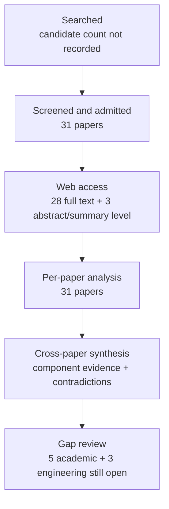

# Research Report: Work-item state, event factuality, temporal reasoning, and conflicting revisions in workplace communication

## Contents

- [Round History](#round-history)
- [Executive Summary](#executive-summary)
- [Research Question](#research-question)
- [Methodology](#methodology)
- [Papers Reviewed](#papers-reviewed)
- [Research Landscape](#research-landscape)
- [Confidence-Graded Findings](#confidence-graded-findings)
- [Research Gaps](#research-gaps)
- [Practical Recommendations](#practical-recommendations)
- [Evidence Map](#evidence-map)
- [References](#references)
- [Appendix: Run Metadata](#appendix-run-metadata)

## Round History

Iterative gap-closure loop (hard cap: 4 rounds). See `references/iterative-synthesis.md` for the full loop definition.

| Round | Run ID | Topic / Gap Focus | New Papers | Gaps Addressed | Remaining Gaps |
|-------|--------|-------------------|------------|----------------|----------------|
| 1 | 8096ea3adc6c | work-item state, event factuality, temporal reasoning, and conflicting revisions in workplace communication: tracking whether an event is planned, confirmed, revoked, completed, or contradicted | 13 | initial shortlist | 5 academic, 3 engineering |
| 2 | 9537e966ca79 | Longitudinal event and work-item state transitions in dialogue and operational communication, with emphasis on supersession, correction, contradiction, reopening, source-relative factuality, evidential confirmation, and preservation of historical state. | 9 | 0 resolved | 5 academic, 3 engineering |
| 3 | 95d3525d59e7 | Natural-language longitudinal work-item revision in workplace and operational communication: distinguishing supersession, correction, supplementation, contradiction, reopening, unresolved conflict, and claimed versus independently confirmed completion. | 9 | academic gaps of the previous round | 5 academic, 3 engineering |

**Stop reason**: another round runs while open academic gaps remain and new papers appear

## Executive Summary

This review investigated how a system can maintain an evidence-backed longitudinal state for work items whose status changes through plans, approvals, cancellations, corrections, completion claims, contradictions, and later revisions. The corpus contains 31 papers published from 1986 to 2026 and accessed through 11 distinct web-host domains; it provides strong component-level evidence for source-relative factuality, temporal ordering, explicit state trajectories, revision semantics, truth maintenance, provenance, and distributed-evidence verification, but no admitted paper directly evaluates the complete problem on longitudinal workplace email or enterprise chat. The strongest result is that source-relative assertion or speaker commitment must not be conflated with independently established truth, while structured/nonlocal reasoning and history-preserving revision mechanisms provide complementary support for temporal and state tracking [doi-10-1007-s10579-009-9089-9] [doi-10-18653-v1-2021-acl-long-122] [doi-10-18653-v1-p19-1412] [1805.06975] [doi-10-1016-0004-3702-86-90080-9]. The most significant unresolved gap is that no reviewed study jointly evaluates factuality, temporal relations, work-item lifecycle state, conflicting revisions, provenance, and independent completion verification across successive workplace communications.

**Scope**: 31 papers analyzed from arXiv, ACL Anthology, publisher pages, ResearchGate, university-hosted repositories, author-hosted material, and institutional journal sites over 1986–2026  
**Overall Confidence**: Medium  
**Verdict**: HAS_GAPS

## Research Question

The review asked:

> How should a workplace-information system represent and reason over successive natural-language observations so that a work item can move among states such as requested, proposed, planned, approved, completed, revoked, superseded, disputed, conditional, reopened, or unresolved without confusing source assertions with verified facts or destroying historical evidence?

The target representation must distinguish at least:

- message or utterance time;
- event or effective time;
- deadline or constraint time;
- collection/version observation time;
- source-relative factuality, modality, negation, uncertainty, and commitment;
- lifecycle state;
- relations such as supersession, correction, supplementation, contradiction, reopening, cancellation, and unresolved conflict;
- evidence provenance;
- current derived assessment versus historical observations and assessments.

A useful abstract decomposition is:

$A_t = f(O_{\le t}, R_{\le t}, T_m, T_e, T_d, T_c, P)$

where $O_{\le t}$ is the set of source observations available by collection time $t$, $R_{\le t}$ is the set of revision/temporal/evidential relations, $T_m$ is message time, $T_e$ event/effective time, $T_d$ deadline time, $T_c$ collection/version time, and $P$ provenance. The literature reviewed here supports several components of such a decomposition, but does not validate this combined model.

In scope were event factuality, source commitment, temporal relation extraction, temporal ordering, procedural state tracking, formal commitment lifecycle models, belief revision, truth-maintenance systems, provenance, document revision, event sourcing, contradiction/evidence arbitration, and multi-hop verification. Out of scope were pure date extraction, action extraction without longitudinal status evolution, generic workflow engines without linguistic uncertainty, and summarization systems that consume state without defining its truth semantics.

## Methodology

### Search Strategy

- **Sources**: arXiv, ACL Anthology, ScienceDirect/publisher pages, Cambridge Core, ResearchGate, university and institutional repositories, journal-hosted pages, and author-hosted full text.
- **Query variants**:
  - `natural-language longitudinal work-item revision workplace operational communication: distinguishing supersession, correction, supplementation, contradiction, reopening, unresolved conflict, claimed versus independently confirmed completion.`
  - `natural-language longitudinal work-item`
  - `natural-language revision workplace operational communication: distinguishing supersession, correction, supplementation, contradiction, reopening, unresolved conflict, claimed versus independently confirmed completion.`
  - `longitudinal revision workplace operational communication: distinguishing supersession, correction, supplementation, contradiction, reopening, unresolved conflict, claimed versus independently confirmed completion.`
  - `work-item revision workplace operational communication: distinguishing supersession, correction, supplementation, contradiction, reopening, unresolved conflict, claimed versus independently confirmed completion.`
  - `natural-language longitudinal work-item revision workplace`
  - `natural-language longitudinal work-item operational communication:`
  - `natural-language longitudinal work-item distinguishing supersession,`
- **Time window**: 1986–2026.
- **Screening**: iterative targeted literature search and admission across three rounds; the exact candidate count and mechanical screening implementation were not recorded in the supplied run metadata.
- **Evidence handling**: all admitted papers were read through the host's web tool at the access level recorded below. Twenty-eight papers were available as full text. Three were restricted to abstract/summary-level access: [doi-10-1016-0020-0255-94-90059-0], [doi-10-1016-j-ipm-2026-104709], and [doi-10-1017-cbo9780511526664-007]. Findings dependent on those restricted sources were therefore assigned additional caveats.
- **Admission boundary**: adjacent-domain results were treated as transfer evidence rather than evidence of production-email accuracy.

### Pipeline Summary

| Metric | Count |
|--------|-------|
| Total candidates | not recorded |
| After screening | 31 admitted |
| Downloaded | not recorded; papers were accessed through the host's web tool |
| Successfully converted | not recorded |
| Deeply analyzed | 31 |
| Iterations (if system-building) | 3 completed rounds |

## Papers Reviewed

| # | Title | Authors | Year | Venue | Quality Score | Relevance | Access level |
|---|-------|---------|------|-------|--------------|-----------|--------------|
| 1 | ProPara-CRTS: Canonical Referent Tracking for Reliable Evaluation of Entity State Tracking in Process Narratives [manual-2362cbe877] | Bingyang Ye, Timothy Obiso, Jingxuan Tu et al. | 2025 | not supplied | unknown | HIGH | full_text |
| 2 | Tracking State Changes in Procedural Text: A Challenge Dataset and Models for Process Paragraph Comprehension [1805.06975] | Bhavana Dalvi Mishra, Lifu Huang, Niket Tandon et al. | 2018 | not supplied | unknown | HIGH | full_text |
| 3 | When Text and Numbers Disagree: Evidence Arbitration in Large Language Models [2608.20116] | Mattia Carletti, Edward Phillips, Fredrik K. Gustafsson et al. | 2026 | not supplied | unknown | HIGH | full_text |
| 4 | Re3: A Holistic Framework and Dataset for Modeling Collaborative Document Revision [2406.00197] | Qian Ruan, Ilia Kuznetsov, Iryna Gurevych | 2024 | not supplied | unknown | HIGH | full_text |
| 5 | An assumption-based TMS [doi-10-1016-0004-3702-86-90080-9] | Johan de Kleer | 1986 | not supplied | unknown | HIGH | full_text |
| 6 | Joint Inference for Event Timeline Construction [manual-b3703967d3] | Quang Do, Wei Lu, Dan Roth | 2012 | not supplied | unknown | HIGH | full_text |
| 7 | Factuality Assessment as Modal Dependency Parsing [doi-10-18653-v1-2021-acl-long-122] | Jiarui Yao, Haoling Qiu, Jin Zhao et al. | 2021 | not supplied | unknown | HIGH | full_text |
| 8 | HoVer: A Dataset for Many-Hop Fact Extraction And Claim Verification [2011.03088] | Yichen Jiang, Shikha Bordia, Zheng Zhong et al. | 2020 | not supplied | unknown | MEDIUM | full_text |
| 9 | Do You Know That Florence Is Packed with Visitors? Evaluating State-of-the-art Models of Speaker Commitment [doi-10-18653-v1-p19-1412] | Nanjiang Jiang, Marie-Catherine de Marneffe | 2019 | not supplied | unknown | HIGH | full_text |
| 10 | Cross-document event ordering through temporal, lexical and distributional knowledge [doi-10-1016-j-knosys-2016-07-032] | Borja Navarro-Colorado, Estela Saquete | 2016 | not supplied | unknown | HIGH | full_text |
| 11 | FactBank: a corpus annotated with event factuality [doi-10-1007-s10579-009-9089-9] | Roser Saurí, James Pustejovsky | 2009 | not supplied | unknown | HIGH | full_text |
| 12 | End-to-end event factuality prediction using directional labeled graph recurrent network [doi-10-1016-j-ipm-2021-102836] | Xiao Liu, Heyan Huang, Yue Zhang | 2022 | not supplied | unknown | HIGH | full_text |
| 13 | Document-Level Event Factuality Identification via Reinforced Semantic Learning Network [doi-10-1007-s11390-024-2655-1] | Zhong Qian, Pei-Feng Li, Qiao-Ming Zhu et al. | 2025 | not supplied | unknown | HIGH | full_text |
| 14 | Utilizing Relative Event Time to Enhance Event-Event Temporal Relation Extraction [doi-10-18653-v1-2021-emnlp-main-815] | Haoyang Wen, Heng Ji | 2021 | not supplied | unknown | HIGH | full_text |
| 15 | More than Classification: A Unified Framework for Event Temporal Relation Extraction [manual-eef7a0219f] | Quzhe Huang, Yutong Hu, Shengqi Zhu et al. | 2023 | not supplied | unknown | HIGH | full_text |
| 16 | Representing and monitoring social commitments using the event calculus [doi-10-1007-s10458-012-9202-0] | Federico Chesani, Paola Mello, Marco Montali et al. | 2012 | not supplied | unknown | HIGH | full_text |
| 17 | Joint Event and Temporal Relation Extraction with Shared Representations and Structured Prediction [1909.05360] | Rujun Han, Qiang Ning, Nanyun Peng | 2019 | not supplied | unknown | HIGH | full_text |
| 18 | Dense Event Ordering with a Multi-Pass Architecture [doi-10-1162-tacl-a-00182] | Nathanael Chambers, Taylor Cassidy, Bill McDowell et al. | 2014 | not supplied | unknown | HIGH | full_text |
| 19 | An Improved Neural Baseline for Temporal Relation Extraction [1909.00429] | Qiang Ning, Sanjay Subramanian, Dan Roth | 2019 | not supplied | unknown | HIGH | full_text |
| 20 | Temporal Information Extraction by Predicting Relative Time-lines [doi-10-18653-v1-d18-1155] | Artuur Leeuwenberg, Marie-Francine Moens | 2018 | not supplied | unknown | HIGH | full_text |
| 21 | Weakening conflicting information for iterated revision and knowledge integration [doi-10-1016-j-artint-2003-08-003] | Salem Benferhat, Souhila Kaci, Daniel Le Berre et al. | 2004 | not supplied | unknown | HIGH | full_text |
| 22 | Improving Temporal Relation Extraction with a Globally Acquired Statistical Resource [1804.06020] | Qiang Ning, Hao Wu, Haoruo Peng et al. | 2018 | not supplied | unknown | HIGH | full_text |
| 23 | On the difference between updating a knowledge base and revising it [doi-10-1017-cbo9780511526664-007] | Hirofumi Katsuno, Alberto O. Mendelzon | 1992 | not supplied | unknown | HIGH | abstract_only |
| 24 | Towards Generative Event Factuality Prediction [doi-10-18653-v1-2023-findings-acl-44] | John Murzaku, Tyler Osborne, Amittai Aviram et al. | 2023 | not supplied | unknown | HIGH | full_text |
| 25 | An Empirical Characterization of Event Sourced Systems and Their Schema Evolution -- Lessons from Industry [2104.01146] | Michiel Overeem, Marten Spoor, Slinger Jansen et al. | 2021 | not supplied | unknown | MEDIUM | full_text |
| 26 | Agreement, Disputes and Commitments in Dialogue [doi-10-1093-jos-ffn013] | Alex Lascarides, Nicholas Asher | 2009 | not supplied | unknown | HIGH | full_text |
| 27 | Resolution of time concepts in temporal databases [doi-10-1016-0020-0255-94-90059-0] | Sharma Chakravarthy, Seung-Kyum Kim | 1994 | not supplied | unknown | MEDIUM | abstract_only |
| 28 | Layered message semantics using social commitments [doi-10-1145-1082473-1082754] | Roberto A. Flores, Philippe Pasquier, Brahim Chaib-draa | 2005 | not supplied | unknown | HIGH | full_text |
| 29 | Why and Where: A Characterization of Data Provenance [doi-10-1007-3-540-44503-x-20] | Peter Buneman, Sanjeev Khanna, Wang-Chiew Tan | 2001 | not supplied | unknown | MEDIUM | full_text |
| 30 | The Problem of Retraction in Critical Discussion [doi-10-1023-a-1010318403544] | Erik C. W. Krabbe | 2001 | not supplied | unknown | HIGH | full_text |
| 31 | HeterMV: Multi-view reasoning over source-aware heterogeneous evidence graph for multi-source fact verification [doi-10-1016-j-ipm-2026-104709] | Junnan Gu, Weimin Li, Fangfang Liu et al. | 2026 | not supplied | unknown | MEDIUM | abstract_only |

## Research Landscape

### Theme 1: Factuality, temporal structure, and longitudinal state trajectories

**Coverage**: 17 supporting papers | **Confidence**: High for component claims; Medium for workplace transfer  
**Supporting papers**: [doi-10-1007-s10579-009-9089-9], [doi-10-18653-v1-2021-acl-long-122], [doi-10-18653-v1-2023-findings-acl-44], [doi-10-1016-j-ipm-2021-102836], [doi-10-1007-s11390-024-2655-1], [doi-10-18653-v1-p19-1412], [1805.06975], [manual-2362cbe877], [1804.06020], [1909.05360], [doi-10-1162-tacl-a-00182], [manual-b3703967d3], [manual-eef7a0219f], [doi-10-18653-v1-2021-emnlp-main-815], [1909.00429], [doi-10-18653-v1-d18-1155], [doi-10-1016-j-knosys-2016-07-032].

Factuality work consistently treats factuality as an attributed linguistic judgment: whether an event is presented as certain, uncertain, negated, possible, or otherwise committed to by a source. That is materially different from independent verification that the event really happened [doi-10-1007-s10579-009-9089-9] [doi-10-18653-v1-2021-acl-long-122] [doi-10-18653-v1-2023-findings-acl-44] [doi-10-18653-v1-p19-1412]. This distinction is critical for a work-item tracker because “we have completed the migration” is evidence that a speaker asserted completion; it is not, without corroboration, equivalent to independently verified completion.

Temporal and procedural-state work separately demonstrates the value of representing relations across multiple events or state transitions rather than reducing all reasoning to sentence-local or independent pair decisions. ProPara-style tracking benefits from modeling process trajectories, while CRTS shows that referent canonicalization and explicit completion of omitted state transitions affect how state-tracking systems are evaluated [1805.06975] [manual-2362cbe877]. Several temporal-relation systems similarly benefit from global, structured, relative-time, or multi-pass reasoning, although individual constraints do not contribute consistently across datasets [1804.06020] [1909.05360] [doi-10-1162-tacl-a-00182] [manual-b3703967d3] [manual-eef7a0219f].

Key findings:

1. **[HIGH] Source-relative factuality is not independent truth verification.** FactBank and later factuality/commitment work model what a source presents or commits to, rather than independently proving occurrence [doi-10-1007-s10579-009-9089-9] [doi-10-18653-v1-2021-acl-long-122] [doi-10-18653-v1-2023-findings-acl-44] [doi-10-18653-v1-p19-1412].
2. **[HIGH] Broader state trajectories can outperform purely local transition reasoning in procedural state tracking, but this evidence is from process narratives, not workplace communication.** [1805.06975] [manual-2362cbe877].
3. **[HIGH] Structured or nonlocal temporal reasoning is useful in several benchmarks, but no single global constraint is uniformly beneficial.** [1804.06020] [1909.05360] [doi-10-1162-tacl-a-00182] [manual-b3703967d3] [manual-eef7a0219f].
4. **[HIGH] Linguistic environment and discourse distance remain difficult for factuality and commitment models, especially conditionals, no-commitment examples, neg-raising, and cross-sentence source attachment.** [doi-10-18653-v1-p19-1412] [doi-10-18653-v1-2021-acl-long-122].

### Theme 2: Revision semantics, provenance, conflict, and evidence preservation

**Coverage**: 14 supporting papers | **Confidence**: High for formal/component-level principles; Medium for operational-language transfer  
**Supporting papers**: [doi-10-1016-0004-3702-86-90080-9], [doi-10-1016-j-artint-2003-08-003], [doi-10-1017-cbo9780511526664-007], [doi-10-1093-jos-ffn013], [doi-10-1023-a-1010318403544], [doi-10-1007-s10458-012-9202-0], [doi-10-1145-1082473-1082754], [2406.00197], [doi-10-1007-3-540-44503-x-20], [2104.01146], [2011.03088], [doi-10-1016-j-ipm-2026-104709], [2608.20116], [doi-10-1016-0020-0255-94-90059-0].

Truth-maintenance, belief-revision, dialogue, and commitment formalisms reject the simplistic idea that every newer statement erases an earlier one. Assumption-based truth maintenance can retain alternative environments or hypotheses; dialogue theories explicitly model commitment, dispute, correction, and retraction; and Event Calculus commitment monitoring gives lifecycle semantics to satisfaction, cancellation, release, violation, replacement, detachment, and expiration [doi-10-1016-0004-3702-86-90080-9] [doi-10-1093-jos-ffn013] [doi-10-1023-a-1010318403544] [doi-10-1007-s10458-012-9202-0]. This supports a history-preserving approach, but these papers do not supply a tested natural-language classifier for the complete relation inventory required by msgloom.

Re3 adds empirical revision evidence from collaborative scientific writing: one request can correspond to multiple edits, explicit suggestions need not be implemented, and generated revision summaries can omit observed edits [2406.00197]. Provenance and event-sourcing work contributes complementary mechanisms for retaining derivational or event history [doi-10-1007-3-540-44503-x-20] [2104.01146]. Multi-hop fact verification and synthetic evidence conflict studies demonstrate that source roles, evidence distribution, order, recency, and modality can materially affect conclusions [2011.03088] [doi-10-1016-j-ipm-2026-104709] [2608.20116].

Key findings:

1. **[HIGH] Correction, retraction, contradiction, and changed support need not imply deletion of historical information.** Formal dialogue and truth-maintenance accounts preserve earlier commitments, assumptions, or alternatives while changing what is currently supported [doi-10-1023-a-1010318403544] [doi-10-1093-jos-ffn013] [doi-10-1016-0004-3702-86-90080-9].
2. **[HIGH] Commitment lifecycle semantics can distinguish materially different terminal and non-terminal outcomes rather than collapsing them into a binary open/closed status.** [doi-10-1007-s10458-012-9202-0].
3. **[HIGH] Revision evidence can be many-to-many: one request may yield several edits, and an explicit requested change may remain unimplemented.** [2406.00197].
4. **[HIGH] Distributed and heterogeneous evidence makes verification harder, and source-aware structure can matter.** [2011.03088] [doi-10-1016-j-ipm-2026-104709].
5. **[HIGH] In controlled conflicts, recency, evidence order, modality, and tool forecasts can systematically influence model arbitration; explicit unreliability cues do not automatically dominate recency.** [2608.20116].
6. **[MEDIUM] Event, valid, and transaction time are formally distinct and jointly useful for representing retroactive, proactive, delayed, and corrected information, but only abstract-level evidence for this paper was available in the review.** [doi-10-1016-0020-0255-94-90059-0].
7. **[MEDIUM] Belief revision and world update are formally different operations and should not automatically share one revision semantics; this review had only abstract/summary-level access to the foundational source.** [doi-10-1017-cbo9780511526664-007].

## Methodology Comparison

| Approach | Papers | Strengths | Weaknesses | Best For | Performance |
|----------|--------|-----------|------------|----------|-------------|
| Source-relative factuality / speaker commitment | [doi-10-1007-s10579-009-9089-9], [doi-10-18653-v1-2021-acl-long-122], [doi-10-18653-v1-2023-findings-acl-44], [doi-10-18653-v1-p19-1412] | Separates certainty, negation, modality, source commitment, and attribution | Does not independently establish whether a claimed event actually occurred; difficult cases include conditionals and distant source attachment | Representing what each source asserts or commits to | Multiple empirical benchmarks; exact cross-paper metric is not comparable |
| Procedural entity/state tracking | [1805.06975], [manual-2362cbe877] | Explicit trajectories and state changes; exposes missing-transition and referent problems | Process narratives differ substantially from email/chat work-item histories | State-transition representation and evaluation design | Broader trajectory modeling improves aggregate state tracking; CRTS changes evaluation behavior |
| Structured temporal-relation inference | [1804.06020], [1909.05360], [doi-10-1162-tacl-a-00182], [manual-b3703967d3], [manual-eef7a0219f], [doi-10-18653-v1-2021-emnlp-main-815], [doi-10-18653-v1-d18-1155] | Models ordering consistency and nonlocal temporal information | Constraint gains vary by architecture and dataset; rare relations remain difficult | Event/effective-time ordering and consistency checking | Mixed; e.g. transitivity added no gain on TB-Dense and only 0.1 F1 on MATRES in [1909.05360] |
| Formal revision / truth maintenance / dialogue commitment | [doi-10-1016-0004-3702-86-90080-9], [doi-10-1016-j-artint-2003-08-003], [doi-10-1017-cbo9780511526664-007], [doi-10-1093-jos-ffn013], [doi-10-1023-a-1010318403544], [doi-10-1007-s10458-012-9202-0] | Explicit semantics for retraction, incompatibility, persistence, lifecycle, alternatives, and belief change | Mostly formal rather than direct natural-language workplace evaluation | State-resolution semantics and conflict representation | Formal/component evidence; no unified workplace benchmark |
| Revision alignment | [2406.00197] | Empirical evidence for request-to-edit relationships and nontrivial revision realization | Scientific-document revision differs from operational status communication; no authentic completion-claim verification | Modeling requested versus realized change | Demonstrates many-to-many and unimplemented revision behavior |
| Provenance and event sourcing | [doi-10-1007-3-540-44503-x-20], [2104.01146] | Separates derivation/origin and preserves change history | Does not itself resolve linguistic factuality or contradictions; event immutability is not universal in studied systems | Evidence lineage and historical persistence | Architectural/empirical industry evidence rather than NLP accuracy |
| Multi-hop verification / evidence arbitration | [2011.03088], [doi-10-1016-j-ipm-2026-104709], [2608.20116] | Handles distributed, heterogeneous, or conflicting evidence | Verification is not the same as work-item lifecycle revision; retrieval failures compound reasoning failures | Independent corroboration and conflict analysis | HoVer retrieval worsens with increasing hops; conflict-arbitration behavior remains systematic |

## Confidence-Graded Findings

### 🟢 High Confidence (supported by 3+ papers with consistent results)

1. **[HIGH] Source-relative assertion, factuality, or commitment must be distinguished from independent verification of an event.** FactBank defines factuality around source presentation, modal-dependency work models source-linked factuality structure, generative factuality work retains this linguistic target, and speaker-commitment evaluation explicitly concerns what speakers commit to rather than externally verified truth [doi-10-1007-s10579-009-9089-9] [doi-10-18653-v1-2021-acl-long-122] [doi-10-18653-v1-2023-findings-acl-44] [doi-10-18653-v1-p19-1412].

2. **[HIGH] Nonlocal and structured context is often useful for state and temporal reasoning, although its specific benefit depends on dataset and inference formulation.** Procedural-state, global temporal-resource, structured prediction, multi-pass, timeline-construction, and unified temporal-relation studies all provide evidence that broader context or interdependent decisions can help relative to fully isolated local decisions [1805.06975] [1804.06020] [1909.05360] [doi-10-1162-tacl-a-00182] [manual-b3703967d3] [manual-eef7a0219f].

3. **[HIGH] Revision should not be modeled as automatic destruction of prior evidence.** Truth maintenance, dialogue commitment, and retraction formalisms support retaining earlier assumptions or commitments while changing their current support status [doi-10-1016-0004-3702-86-90080-9] [doi-10-1093-jos-ffn013] [doi-10-1023-a-1010318403544].

4. **[HIGH] Lifecycle outcomes require more than a binary completed/not-completed label.** Commitment monitoring explicitly distinguishes satisfaction, cancellation, violation, release, replacement, detachment, and expiration, while dialogue/revision work separately models disputes and retractions [doi-10-1007-s10458-012-9202-0] [doi-10-1093-jos-ffn013] [doi-10-1023-a-1010318403544].

5. **[HIGH] Evidence retrieval and arbitration remain separate failure points from state reasoning itself.** Multi-hop verification degrades as evidence becomes more distributed, heterogeneous-source modeling changes verification performance, and controlled conflict experiments expose systematic effects of recency, order, modality, and tool evidence [2011.03088] [doi-10-1016-j-ipm-2026-104709] [2608.20116].

### 🟡 Medium Confidence (supported by 1-2 papers or with caveats)

1. **[MEDIUM] A four-time representation for msgloom is justified conceptually but not directly benchmarked.** Temporal-database work distinguishes event, valid, and transaction time, while temporal NLP handles relative event time and ordering, but the exact combination of message time, effective time, deadline time, and collection/version time has not been evaluated for the target state-resolution problem [doi-10-1016-0020-0255-94-90059-0] [doi-10-18653-v1-2021-emnlp-main-815].

2. **[MEDIUM] Update and revision should be represented as semantically different operations when appropriate.** Foundational belief-change work distinguishes a changed world from changed beliefs about a static world, but the reviewed source was available only at abstract/summary level and does not test workplace language [doi-10-1017-cbo9780511526664-007].

3. **[MEDIUM] Provenance-preserving event history is a strong architectural analogue for longitudinal evidence state, but it is not itself validation of a natural-language state resolver.** Database provenance and industrial event-sourcing work motivate retained lineage/history while leaving linguistic interpretation unresolved [doi-10-1007-3-540-44503-x-20] [2104.01146].

### 🔴 Low Confidence (preliminary, single-source, or contradicted)

1. **[LOW] No low-confidence substantive production claim was accepted as established.** The corpus does not provide a defensible low-confidence basis for claiming that any unified architecture already solves longitudinal workplace state resolution; such a claim would exceed the reviewed evidence.

## Trade-Off Analysis

| Decision | Option A | Option B | Recommendation |
|----------|----------|----------|----------------|
| Current-state storage | Overwrite one current state when a new message arrives | Preserve source observations and successive assessments, deriving a current view | Prefer history preservation because revision/retraction formalisms retain prior information and provenance/event-sourcing work provides complementary lineage mechanisms [doi-10-1016-0004-3702-86-90080-9] [doi-10-1007-3-540-44503-x-20] [2104.01146] |
| Completion semantics | Treat a completion assertion as completed | Store asserted-complete separately from corroboration/verification | Prefer separation; factuality literature models source commitment rather than independent truth, while verification literature treats corroboration as another problem [doi-10-1007-s10579-009-9089-9] [doi-10-18653-v1-2021-acl-long-122] [2011.03088] |
| Revision precedence | Latest-message-wins | Explicit supersession/correction/contradiction/reopening relations | Prefer explicit relations; formal accounts distinguish revision operations and conflicting alternatives rather than assigning universal precedence [doi-10-1093-jos-ffn013] [doi-10-1023-a-1010318403544] [doi-10-1007-s10458-012-9202-0] |
| Temporal representation | One generic timestamp | Separate message, effective-event, deadline, and observation/version times | Prefer separate dimensions for testing; related temporal-database and temporal-NLP work shows these temporal notions are not interchangeable [doi-10-1016-0020-0255-94-90059-0] [doi-10-18653-v1-d18-1155] |
| Conflict handling | Force a single state immediately | Permit unresolved competing assessments with provenance | Prefer unresolved coexistence until evidence supports resolution; truth-maintenance and dialogue work explicitly retain alternatives/disputes [doi-10-1016-0004-3702-86-90080-9] [doi-10-1093-jos-ffn013] |
| Evidence acquisition | Assume available messages are complete | Distinguish reasoning uncertainty from missing-evidence uncertainty | Prefer separation because multi-hop verification shows retrieval itself is a major failure source [2011.03088] |
| Evaluation | Aggregate accuracy only | Per-state, macro, transition, temporal, contradiction, and end-to-end safety metrics | Prefer disaggregated metrics because rare factuality, temporal, and uncertainty states are harder and can be hidden by dominant labels [doi-10-1007-s10579-009-9089-9] [doi-10-18653-v1-p19-1412] |

## Points of Agreement **[EVIDENCE REQUIRED]**

1. **[HIGH] Factuality is source-relative rather than synonymous with externally verified truth.** This is consistent across factuality, modal-dependency, generative factuality, and speaker-commitment work [doi-10-1007-s10579-009-9089-9] [doi-10-18653-v1-2021-acl-long-122] [doi-10-18653-v1-2023-findings-acl-44] [doi-10-18653-v1-p19-1412].

2. **[HIGH] Long-range or globally structured context can matter for temporal/state inference.** The exact mechanisms differ, but multiple state-tracking and temporal studies support reasoning beyond independent sentence-local classifications [1805.06975] [1804.06020] [1909.05360] [doi-10-1162-tacl-a-00182] [manual-b3703967d3] [manual-eef7a0219f].

3. **[HIGH] Retraction or correction need not erase historical state.** Truth-maintenance, dialogue, and retraction literature all support distinguishing historical commitments/evidence from what is currently endorsed [doi-10-1016-0004-3702-86-90080-9] [doi-10-1093-jos-ffn013] [doi-10-1023-a-1010318403544].

4. **[HIGH] Revision realization is not reliably one-to-one.** Re3 demonstrates that one requested revision can result in multiple edits and that explicit suggestions need not be implemented, reinforcing the need to distinguish requested change from observed realization [2406.00197].

5. **[HIGH] Evidence-source structure matters when the system must establish or arbitrate claims rather than merely extract assertions.** Multi-hop retrieval, heterogeneous evidence graphs, and synthetic conflict experiments all show sensitivity to how evidence is distributed or presented [2011.03088] [doi-10-1016-j-ipm-2026-104709] [2608.20116].

## Points of Contradiction **[EVIDENCE REQUIRED]**

1. **[HIGH] Contribution of temporal transitivity constraints**: CAEVO reports transitive inference as a major contributor to dense temporal-ordering performance [doi-10-1162-tacl-a-00182], whereas the structured joint model reports no gain from its added transitivity constraint on TB-Dense and only 0.1 F1 on MATRES [1909.05360].
   - **Possible explanation**: the systems use different architectures, inference procedures, datasets, and handling of `NONE` predictions.
   - **Implication**: global consistency mechanisms should be evaluated as components rather than assumed beneficial by construction.

2. **[HIGH] Benefit of joint or multi-task learning**: DLGRN reports degradation when multi-task learning is removed [doi-10-1016-j-ipm-2021-102836], and structured joint event/relation inference improves end-to-end temporal extraction [1909.05360]. Modal-dependency parsing, however, reports essentially no event-extraction gain from joint learning and slightly worse labeled attachment than a pipeline with gold mentions, though joint learning helps when mentions are automatically extracted [doi-10-18653-v1-2021-acl-long-122].
   - **Possible explanation**: joint learning changes error propagation differently depending on whether upstream mentions are gold or predicted and whether tasks share useful representations.
   - **Implication**: a unified msgloom model should not be assumed superior to modular components without controlled ablation.

3. **[HIGH] Direct timeline prediction versus pairwise-relation conversion**: within the same study, direct contextual timeline prediction performs better on the TempEval-derived evaluation, while TL2RTL performs better on the smaller TimeBank-Dense-derived split [doi-10-18653-v1-d18-1155].
   - **Possible explanation**: the study attributes part of the reversal to differences in available training data.
   - **Implication**: representation choice should be benchmarked under the project's actual data regime.

4. **[HIGH] DLGRN parameter-count claim**: narrative text states that DLGRN has fewer parameters than all baselines, while the reported table lists BERT at 109.5M parameters and DLGRN at 119.7M [doi-10-1016-j-ipm-2021-102836].
   - **Possible explanation**: narrative/table inconsistency.
   - **Implication**: the parameter-efficiency statement should not be relied on.

5. **[HIGH] CRTS improvement-across-settings claim**: the paper broadly states that CRTS improves F1 in all settings except GPT-4o-mini sentence-level evaluation, but Table 2 also reports GPT-4o document-level F1 of 58.8 on CRTS versus 59.6 on original ProPara [manual-2362cbe877].
   - **Possible explanation**: over-broad narrative summary relative to the table.
   - **Implication**: CRTS should be treated as an evaluation refinement with nuanced model-specific effects, not as universally increasing measured F1.

## Research Gaps

All eight gaps remain open. The literature reviewed through Round 3 has not answered them yet. The five academic gaps require further direct or better-targeted evidence if another literature round is justified; the three engineering gaps can be tested without waiting for more papers.

| # | Gap | Type | Severity | Rounds searched | Impact on Goals |
|---|-----|------|----------|-----------------|----------------|
| 1 | No admitted paper directly evaluates a complete longitudinal workplace work-item lifecycle across requested, proposed, planned, approved, completed, revoked, superseded, disputed, conditional, and unresolved states while retaining historical assessments. The literature has not answered this yet. | [ACADEMIC] | HIGH | 1, 2, 3 | Direct production-domain validity remains unknown. |
| 2 | No admitted natural-language system is evaluated across successive operational communications for distinguishing supersession, correction, supplementation, contradiction, reopening, and unresolved conflict. The literature has not answered this yet. | [ACADEMIC] | HIGH | 1, 2, 3 | A wrong relation can resurrect stale work or suppress a valid current state. |
| 3 | No admitted paper jointly evaluates source-relative factuality, temporal ordering, lifecycle state, contradiction, and provenance as one longitudinal model. The literature has not answered this yet. | [ACADEMIC] | HIGH | 1, 2, 3 | Component success cannot establish correctness of the composition. |
| 4 | Direct evaluation on workplace email, Teams-like dialogue, or comparable operational communication is absent. The literature has not answered this yet. | [ACADEMIC] | HIGH | 1, 2, 3 | Transfer validity from news, process text, scientific revision, and formal dialogue remains unknown. |
| 5 | No admitted paper establishes how to distinguish an author's completion claim from independent confirmation of completion in longitudinal operational communication. The literature has not answered this yet. | [ACADEMIC] | HIGH | 1, 2, 3 | Conflating “asserted done” with “verified done” can prematurely close important work. |
| 6 | No admitted benchmark covers adversarial sequences including plan→cancel, approve→revoke, changed deadlines, simultaneous contradiction, out-of-order ingestion, stale late arrival, and corrected completion claims end to end. The literature has not answered this yet. | [ENGINEERING] | HIGH | 1, 2, 3 | Critical failure modes can remain invisible under ordinary test distributions. |
| 7 | The combination of message time, effective/event time, deadline/constraint time, and collection/version time has not been benchmarked for the product's state-resolution task. The literature has not answered this yet. | [ENGINEERING] | HIGH | 1, 2, 3 | Temporal conflation can make stale, future, or retroactive evidence look current. |
| 8 | No reviewed implementation evaluates immutable source observations plus successive assessments plus a separately derived current-state view for this natural-language state-resolution task. The literature has not answered this yet. | [ENGINEERING] | HIGH | 1, 2, 3 | The system needs proof that history preservation and current-state derivation remain correct under revisions. |

### Academic Gaps (require more papers)

1. **[ACADEMIC][HIGH] Direct workplace longitudinal state tracking**: No admitted study tests the specified work-item lifecycle across successive workplace communications. The literature has not answered this yet. Suggested query: `"workplace email dialogue longitudinal work item state tracking requested proposed planned approved completed revoked superseded disputed conditional unresolved"`.

2. **[ACADEMIC][HIGH] Natural-language revision-relation classification**: Formal work covers correction, retraction, persistence, and reopening, but no admitted natural-language operational benchmark covers the full distinction among supersession, correction, supplementation, contradiction, reopening, and unresolved conflict. The literature has not answered this yet. Suggested query: `"natural language longitudinal dialogue supersession correction supplementation contradiction reopening unresolved conflict classification"`.

3. **[ACADEMIC][HIGH] Unified factuality-temporal-lifecycle-provenance model**: Existing papers test the components separately. No admitted study jointly evaluates them in one longitudinal model. The literature has not answered this yet. Suggested query: `"event factuality" temporal relation contradiction provenance lifecycle longitudinal model`.

4. **[ACADEMIC][HIGH] Target-domain evidence**: No direct workplace email or enterprise-chat work-item history benchmark was admitted. The literature has not answered this yet. Suggested query: `"workplace email enterprise chat operational communication event state tracking factuality temporal revision commitment"`.

5. **[ACADEMIC][HIGH] Claimed versus independently confirmed completion**: Factuality work models source commitment and verification work models corroborating evidence, but no admitted paper evaluates this distinction for completion status across operational messages. The literature has not answered this yet. Suggested query: `"event factuality evidentiality source attribution independent confirmation corroboration completion dialogue longitudinal"`.

### Engineering Gaps (fillable without papers)

1. **[ENGINEERING][HIGH] Adversarial longitudinal evaluation**: The literature has not answered this yet for the product. Suggested resolution: build an independently authored gold suite covering cancellation, revocation, correction-of-correction, reopening, deadline replacement, out-of-order arrival, stale evidence, partial supplementation, contradictory same-time updates, and corrected completion claims. Evaluate false closure and stale-state resurrection explicitly.

2. **[ENGINEERING][HIGH] Four-time representation benchmark**: The literature has not answered whether the product's proposed temporal dimensions are sufficient or operationally usable. Suggested resolution: represent message time, effective/event time, deadline/constraint time, and collection/version time independently and mutation-test them with retroactive, proactive, late-arriving, and deadline-change sequences.

3. **[ENGINEERING][HIGH] Provenance-preserving state implementation**: The literature has not answered this for natural-language state resolution. Suggested resolution: implement append-only source observations, versioned assessments, evidence edges, revision relations, and a derived current-state projection; test replay, correction, rollback, stale arrival, conflicting observations, and deterministic reconstruction.

## Reproducibility Notes

The supplied synthesis did not record code repositories, dataset-download status, or software/data licenses for the reviewed papers. Those fields therefore remain `unknown` rather than being inferred. Full-text availability indicates inspectability, not reproducibility.

| Paper | Code Available | Data Available | Sufficient Detail | License |
|-------|---------------|----------------|-------------------|---------|
| [manual-2362cbe877] | unknown | unknown | full text reviewed; reproducibility not assessed | unknown |
| [1805.06975] | unknown | unknown | full text reviewed; reproducibility not assessed | unknown |
| [2608.20116] | unknown | unknown | full text reviewed; reproducibility not assessed | unknown |
| [2406.00197] | unknown | unknown | full text reviewed; reproducibility not assessed | unknown |
| [doi-10-1016-0004-3702-86-90080-9] | unknown | unknown | full text reviewed; reproducibility not assessed | unknown |
| [manual-b3703967d3] | unknown | unknown | full text reviewed; reproducibility not assessed | unknown |
| [doi-10-18653-v1-2021-acl-long-122] | unknown | unknown | full text reviewed; reproducibility not assessed | unknown |
| [2011.03088] | unknown | unknown | full text reviewed; reproducibility not assessed | unknown |
| [doi-10-18653-v1-p19-1412] | unknown | unknown | full text reviewed; reproducibility not assessed | unknown |
| [doi-10-1016-j-knosys-2016-07-032] | unknown | unknown | full text reviewed; reproducibility not assessed | unknown |
| [doi-10-1007-s10579-009-9089-9] | unknown | unknown | full text reviewed; reproducibility not assessed | unknown |
| [doi-10-1016-j-ipm-2021-102836] | unknown | unknown | full text reviewed; reproducibility not assessed | unknown |
| [doi-10-1007-s11390-024-2655-1] | unknown | unknown | full text reviewed; reproducibility not assessed | unknown |
| [doi-10-18653-v1-2021-emnlp-main-815] | unknown | unknown | full text reviewed; reproducibility not assessed | unknown |
| [manual-eef7a0219f] | unknown | unknown | full text reviewed; reproducibility not assessed | unknown |
| [doi-10-1007-s10458-012-9202-0] | unknown | unknown | full text reviewed; reproducibility not assessed | unknown |
| [1909.05360] | unknown | unknown | full text reviewed; reproducibility not assessed | unknown |
| [doi-10-1162-tacl-a-00182] | unknown | unknown | full text reviewed; reproducibility not assessed | unknown |
| [1909.00429] | unknown | unknown | full text reviewed; reproducibility not assessed | unknown |
| [doi-10-18653-v1-d18-1155] | unknown | unknown | full text reviewed; reproducibility not assessed | unknown |
| [doi-10-1016-j-artint-2003-08-003] | unknown | unknown | full text reviewed; reproducibility not assessed | unknown |
| [1804.06020] | unknown | unknown | full text reviewed; reproducibility not assessed | unknown |
| [doi-10-1017-cbo9780511526664-007] | unknown | unknown | abstract/summary-level access; insufficient for reproduction assessment | unknown |
| [doi-10-18653-v1-2023-findings-acl-44] | unknown | unknown | full text reviewed; reproducibility not assessed | unknown |
| [2104.01146] | unknown | unknown | full text reviewed; reproducibility not assessed | unknown |
| [doi-10-1093-jos-ffn013] | unknown | unknown | full text reviewed; reproducibility not assessed | unknown |
| [doi-10-1016-0020-0255-94-90059-0] | unknown | unknown | abstract-only access; insufficient for reproduction assessment | unknown |
| [doi-10-1145-1082473-1082754] | unknown | unknown | full text reviewed; reproducibility not assessed | unknown |
| [doi-10-1007-3-540-44503-x-20] | unknown | unknown | full text reviewed; reproducibility not assessed | unknown |
| [doi-10-1023-a-1010318403544] | unknown | unknown | full text reviewed; reproducibility not assessed | unknown |
| [doi-10-1016-j-ipm-2026-104709] | unknown | unknown | abstract-only access; insufficient for reproduction assessment | unknown |

## Practical Recommendations **[EVIDENCE REQUIRED]**

1. **Represent observations separately from assessments and current state.** Retain the original source observation, append later interpretations or revisions, and derive a current view rather than overwriting the historical record. Truth maintenance, dialogue retraction, provenance, and event sourcing all support the underlying separation of evidence history from current support [doi-10-1016-0004-3702-86-90080-9] [doi-10-1093-jos-ffn013] [doi-10-1007-3-540-44503-x-20] [2104.01146].  
   *Confidence*: Medium for the msgloom implementation choice; High for the underlying component rationale.

2. **Store “asserted complete” separately from “independently confirmed complete.”** Factuality and speaker-commitment models describe what a source presents as true, whereas verification requires additional evidence [doi-10-1007-s10579-009-9089-9] [doi-10-18653-v1-2021-acl-long-122] [doi-10-18653-v1-p19-1412] [2011.03088].  
   *Confidence*: High for the semantic distinction; Medium for target-domain implementation details.

3. **Do not implement a generic latest-message-wins rule.** Represent supersession, correction, supplementation, contradiction, reopening, cancellation, and unresolved conflict as explicit relations or evidence-bearing transitions [doi-10-1093-jos-ffn013] [doi-10-1023-a-1010318403544] [doi-10-1007-s10458-012-9202-0] [doi-10-1016-0004-3702-86-90080-9].  
   *Confidence*: Medium for the exact taxonomy; High that simple recency precedence is insufficient.

4. **Keep temporal dimensions independently addressable.** At minimum, msgloom should test separate fields for utterance/message time, effective/event time, deadline/constraint time, and observation/version time instead of forcing them into one timestamp [doi-10-1016-0020-0255-94-90059-0] [doi-10-18653-v1-d18-1155] [doi-10-18653-v1-2021-emnlp-main-815].  
   *Confidence*: Medium because the exact four-time scheme has not been benchmarked for the target problem.

5. **Permit unresolved competing assessments to coexist.** A contradiction should not silently become supersession. Preserve the evidence supporting each assessment until a justified resolution exists [doi-10-1016-0004-3702-86-90080-9] [doi-10-1093-jos-ffn013] [doi-10-1016-j-artint-2003-08-003].  
   *Confidence*: Medium for implementation; High for the formal rationale.

6. **Separate evidence completeness from state-resolution confidence.** A state can remain unresolved because needed evidence has not been retrieved; this is different from evidence positively supporting a negative or completed state. Multi-hop verification demonstrates that evidence acquisition itself can fail as required hops increase [2011.03088].  
   *Confidence*: Medium.

7. **Create an adversarial longitudinal test corpus before relying on production summaries.** Include cancellation, revocation, correction-of-correction, reopening, deadline replacement, out-of-order arrival, stale evidence, simultaneous contradiction, partial supplementation, and corrected completion claims. Conflict and commitment literature provides the failure categories but not this combined benchmark [2608.20116] [doi-10-1007-s10458-012-9202-0] [doi-10-1093-jos-ffn013].  
   *Confidence*: High as an engineering-validation recommendation.

8. **Report per-class and safety-relevant transition metrics, not aggregate accuracy alone.** Factuality, commitment, and temporal work shows that rare or difficult labels can behave materially worse than dominant categories [doi-10-1007-s10579-009-9089-9] [doi-10-18653-v1-p19-1412] [1909.05360].  
   *Confidence*: High.

9. **Validate the combined system rather than assuming component composition is correct.** Factuality, temporal ordering, provenance, revision, and verification have been evaluated mostly separately, and results about global or joint inference are not uniformly transferable across datasets [1909.05360] [doi-10-1162-tacl-a-00182] [doi-10-18653-v1-2021-acl-long-122].  
   *Confidence*: High.

## Future Directions

1. Conduct a fourth, tightly targeted academic search for longitudinal workplace/enterprise communication studies that explicitly classify revision relations or work-item lifecycle transitions.
2. Search evidentiality and corroboration literature specifically for natural-language distinctions between source claims and independently confirmed task completion.
3. Build a controlled work-item timeline benchmark with independently authored gold state, revision relation, provenance, and four-time annotations.
4. Compare modular versus joint architectures under identical inputs so that any gain from unified inference is separated from upstream-extraction effects.
5. Evaluate incremental replay: insert a new message, recompute current state, then verify that historical observations and earlier assessments remain retrievable.
6. Test out-of-order ingestion explicitly by permuting collection order while preserving original message/effective times.
7. Measure false closure, stale-state resurrection, lost deadline change, unjustified contradiction resolution, and missed reopening as first-class error categories.
8. Hand unresolved evidence-acquisition failures to the missing-context/retrieval layer rather than forcing Topic 06 to infer a state from absence.

## Readiness Assessment (System-Building Mode)

### Verdict: HAS_GAPS

### Assessment Summary

The synthesis is sufficient to justify several conservative design principles and to begin engineering experiments, but it is not sufficient to claim that a unified production state-resolution architecture has been validated. The primary risk is domain and composition validity: the corpus supports factuality, temporal reasoning, revision semantics, provenance, and verification separately, but does not directly establish their joint accuracy on longitudinal workplace email or enterprise chat.

### Coverage Matrix

| Dimension | Status | Evidence |
|-----------|--------|----------|
| Architecture patterns | ⚠️ Partial | History preservation, explicit commitments/revisions, provenance, and event sourcing have useful analogues [doi-10-1016-0004-3702-86-90080-9] [doi-10-1007-s10458-012-9202-0] [doi-10-1007-3-540-44503-x-20] [2104.01146], but no unified msgloom-like architecture is validated. |
| Technology stack | ❌ Missing | The admitted literature does not establish a production technology stack for this target system. |
| Performance baselines | ⚠️ Partial | Component benchmarks exist for factuality, state tracking, temporal extraction, revision, and fact verification [1805.06975] [doi-10-18653-v1-2021-acl-long-122] [1909.05360] [2406.00197] [2011.03088], but no comparable end-to-end workplace baseline exists. |
| Security model | ❌ Missing | Security and authorization are outside the evidence base of the admitted corpus. |
| Trade-off map | ⚠️ Partial | Global-vs-local, joint-vs-pipeline, timeline-vs-pairwise, and history-preservation trade-offs are evidenced, but target-domain trade-offs remain untested [1909.05360] [doi-10-18653-v1-2021-acl-long-122] [doi-10-18653-v1-d18-1155] [2104.01146]. |

### Gap Resolution Plan

| # | Gap | Type | Severity | Resolution |
|---|-----|------|----------|------------|
| 1 | Direct workplace longitudinal lifecycle evaluation | [ACADEMIC] | HIGH | Round-4 targeted search using workplace email/dialogue/work-item lifecycle terminology; admit only directly relevant longitudinal studies. |
| 2 | Natural-language classification of supersession/correction/supplementation/contradiction/reopening/unresolved conflict | [ACADEMIC] | HIGH | Search revision-relation, discourse-update, correction, and belief-revision NLP literature with operational-dialogue constraints. |
| 3 | Unified factuality + time + lifecycle + contradiction + provenance model | [ACADEMIC] | HIGH | Search explicitly for joint longitudinal models; if none appear, retain the gap and test modular composition experimentally. |
| 4 | Workplace/enterprise-chat domain evidence | [ACADEMIC] | HIGH | Search enterprise email/chat corpora and operational-dialogue benchmarks; do not infer production representativeness from transfer datasets. |
| 5 | Claimed versus independently confirmed completion | [ACADEMIC] | HIGH | Search evidentiality, source attribution, corroboration, task completion, and verification literature; preserve distinction until direct evidence exists. |
| 6 | Adversarial longitudinal sequence evaluation | [ENGINEERING] | HIGH | Construct independent gold fixtures and mutation sequences for cancellation, revocation, reopening, stale arrival, and corrected completion. |
| 7 | Four-time representation benchmark | [ENGINEERING] | HIGH | Implement independent message/effective/deadline/collection time fields and test temporal replay, retroactivity, and deadline replacement. |
| 8 | Provenance-preserving current-state projection | [ENGINEERING] | HIGH | Prototype append-only observations and assessments plus deterministic projection; test replay, conflicting evidence, and reconstruction. |

## Evidence Map

| Research Question Aspect | Evidence 1 | Evidence 2 | Evidence 3 | Evidence 4 |
|--------------------------|------------|------------|------------|------------|
| Source-relative factuality | [doi-10-1007-s10579-009-9089-9] (§2.2, §5) | [doi-10-18653-v1-2021-acl-long-122] (§2–3) | [doi-10-18653-v1-2023-findings-acl-44] (§1) | [doi-10-18653-v1-p19-1412] (§4–6) |
| Procedural state trajectories | [1805.06975] (§5) | [manual-2362cbe877] (§3–5, §7) |  |  |
| Structured temporal reasoning | [1804.06020] (§4.2.2) | [1909.05360] (§6.1, §6.4) | [doi-10-1162-tacl-a-00182] (§5–6) | [manual-b3703967d3] (§5.3) |
| Unified/relative temporal representation | [manual-eef7a0219f] (§5–6) | [doi-10-18653-v1-2021-emnlp-main-815] | [doi-10-18653-v1-d18-1155] | [1909.00429] |
| Retraction and historical preservation | [doi-10-1023-a-1010318403544] (§1–3) | [doi-10-1093-jos-ffn013] (§2–6) | [doi-10-1016-0004-3702-86-90080-9] (§4–5) | [doi-10-1016-j-artint-2003-08-003] |
| Commitment lifecycle | [doi-10-1007-s10458-012-9202-0] (§2.2, §2.4, §3–4) | [doi-10-1145-1082473-1082754] | [doi-10-1093-jos-ffn013] |  |
| Collaborative revision | [2406.00197] (§3, §5, §6, Limitations) |  |  |  |
| Provenance/history | [doi-10-1007-3-540-44503-x-20] (§4–6) | [2104.01146] (§4, §6–7) | [doi-10-1016-0004-3702-86-90080-9] |  |
| Distributed corroborating evidence | [2011.03088] (§5.2–5.6) | [doi-10-1016-j-ipm-2026-104709] (abstract/methodology/experiments available in supplied analysis) |  |  |
| Conflict arbitration | [2608.20116] (§4–5) | [doi-10-1016-j-artint-2003-08-003] | [doi-10-1016-0004-3702-86-90080-9] |  |
| Multiple temporal notions | [doi-10-1016-0020-0255-94-90059-0] (abstract) | [doi-10-18653-v1-d18-1155] | [doi-10-18653-v1-2021-emnlp-main-815] |  |
| Update versus revision | [doi-10-1017-cbo9780511526664-007] (summary/introduction-level evidence) | [doi-10-1016-j-artint-2003-08-003] |  |  |
| Claimed versus independently confirmed completion | [doi-10-1007-s10579-009-9089-9] (source factuality side) | [2011.03088] (verification side) | [doi-10-1016-j-ipm-2026-104709] (multi-source verification side) | No admitted paper evaluates the combined operational distinction |

## References

1. [manual-2362cbe877] — ProPara-CRTS: Canonical Referent Tracking for Reliable Evaluation of Entity State Tracking in Process Narratives. Bingyang Ye, Timothy Obiso, Jingxuan Tu et al. 2025. Venue not supplied.
2. [1805.06975] — Tracking State Changes in Procedural Text: A Challenge Dataset and Models for Process Paragraph Comprehension. Bhavana Dalvi Mishra, Lifu Huang, Niket Tandon et al. 2018. Venue not supplied.
3. [2608.20116] — When Text and Numbers Disagree: Evidence Arbitration in Large Language Models. Mattia Carletti, Edward Phillips, Fredrik K. Gustafsson et al. 2026. Venue not supplied.
4. [2406.00197] — Re3: A Holistic Framework and Dataset for Modeling Collaborative Document Revision. Qian Ruan, Ilia Kuznetsov, Iryna Gurevych. 2024. Venue not supplied.
5. [doi-10-1016-0004-3702-86-90080-9] — An assumption-based TMS. Johan de Kleer. 1986. Venue not supplied.
6. [manual-b3703967d3] — Joint Inference for Event Timeline Construction. Quang Do, Wei Lu, Dan Roth. 2012. Venue not supplied.
7. [doi-10-18653-v1-2021-acl-long-122] — Factuality Assessment as Modal Dependency Parsing. Jiarui Yao, Haoling Qiu, Jin Zhao et al. 2021. Venue not supplied.
8. [2011.03088] — HoVer: A Dataset for Many-Hop Fact Extraction And Claim Verification. Yichen Jiang, Shikha Bordia, Zheng Zhong et al. 2020. Venue not supplied.
9. [doi-10-18653-v1-p19-1412] — Do You Know That Florence Is Packed with Visitors? Evaluating State-of-the-art Models of Speaker Commitment. Nanjiang Jiang, Marie-Catherine de Marneffe. 2019. Venue not supplied.
10. [doi-10-1016-j-knosys-2016-07-032] — Cross-document event ordering through temporal, lexical and distributional knowledge. Borja Navarro-Colorado, Estela Saquete. 2016. Venue not supplied.
11. [doi-10-1007-s10579-009-9089-9] — FactBank: a corpus annotated with event factuality. Roser Saurí, James Pustejovsky. 2009. Venue not supplied.
12. [doi-10-1016-j-ipm-2021-102836] — End-to-end event factuality prediction using directional labeled graph recurrent network. Xiao Liu, Heyan Huang, Yue Zhang. 2022. Venue not supplied.
13. [doi-10-1007-s11390-024-2655-1] — Document-Level Event Factuality Identification via Reinforced Semantic Learning Network. Zhong Qian, Pei-Feng Li, Qiao-Ming Zhu et al. 2025. Venue not supplied.
14. [doi-10-18653-v1-2021-emnlp-main-815] — Utilizing Relative Event Time to Enhance Event-Event Temporal Relation Extraction. Haoyang Wen, Heng Ji. 2021. Venue not supplied.
15. [manual-eef7a0219f] — More than Classification: A Unified Framework for Event Temporal Relation Extraction. Quzhe Huang, Yutong Hu, Shengqi Zhu et al. 2023. Venue not supplied.
16. [doi-10-1007-s10458-012-9202-0] — Representing and monitoring social commitments using the event calculus. Federico Chesani, Paola Mello, Marco Montali et al. 2012. Venue not supplied.
17. [1909.05360] — Joint Event and Temporal Relation Extraction with Shared Representations and Structured Prediction. Rujun Han, Qiang Ning, Nanyun Peng. 2019. Venue not supplied.
18. [doi-10-1162-tacl-a-00182] — Dense Event Ordering with a Multi-Pass Architecture. Nathanael Chambers, Taylor Cassidy, Bill McDowell et al. 2014. Venue not supplied.
19. [1909.00429] — An Improved Neural Baseline for Temporal Relation Extraction. Qiang Ning, Sanjay Subramanian, Dan Roth. 2019. Venue not supplied.
20. [doi-10-18653-v1-d18-1155] — Temporal Information Extraction by Predicting Relative Time-lines. Artuur Leeuwenberg, Marie-Francine Moens. 2018. Venue not supplied.
21. [doi-10-1016-j-artint-2003-08-003] — Weakening conflicting information for iterated revision and knowledge integration. Salem Benferhat, Souhila Kaci, Daniel Le Berre et al. 2004. Venue not supplied.
22. [1804.06020] — Improving Temporal Relation Extraction with a Globally Acquired Statistical Resource. Qiang Ning, Hao Wu, Haoruo Peng et al. 2018. Venue not supplied.
23. [doi-10-1017-cbo9780511526664-007] — On the difference between updating a knowledge base and revising it. Hirofumi Katsuno, Alberto O. Mendelzon. 1992. Venue not supplied.
24. [doi-10-18653-v1-2023-findings-acl-44] — Towards Generative Event Factuality Prediction. John Murzaku, Tyler Osborne, Amittai Aviram et al. 2023. Venue not supplied.
25. [2104.01146] — An Empirical Characterization of Event Sourced Systems and Their Schema Evolution -- Lessons from Industry. Michiel Overeem, Marten Spoor, Slinger Jansen et al. 2021. Venue not supplied.
26. [doi-10-1093-jos-ffn013] — Agreement, Disputes and Commitments in Dialogue. Alex Lascarides, Nicholas Asher. 2009. Venue not supplied.
27. [doi-10-1016-0020-0255-94-90059-0] — Resolution of time concepts in temporal databases. Sharma Chakravarthy, Seung-Kyum Kim. 1994. Venue not supplied.
28. [doi-10-1145-1082473-1082754] — Layered message semantics using social commitments. Roberto A. Flores, Philippe Pasquier, Brahim Chaib-draa. 2005. Venue not supplied.
29. [doi-10-1007-3-540-44503-x-20] — Why and Where: A Characterization of Data Provenance. Peter Buneman, Sanjeev Khanna, Wang-Chiew Tan. 2001. Venue not supplied.
30. [doi-10-1023-a-1010318403544] — The Problem of Retraction in Critical Discussion. Erik C. W. Krabbe. 2001. Venue not supplied.
31. [doi-10-1016-j-ipm-2026-104709] — HeterMV: Multi-view reasoning over source-aware heterogeneous evidence graph for multi-source fact verification. Junnan Gu, Weimin Li, Fangfang Liu et al. 2026. Venue not supplied.

## Appendix: Run Metadata

- **Run ID**: `95d3525d59e7`
- **Round**: 3 of at most 4
- **Sources**: arXiv; ACL Anthology; ScienceDirect/publisher pages; Cambridge Core; ResearchGate; university-hosted repositories; author-hosted full text; institutional journal sites
- **Paper count**: 31
- **Access summary**: 28 full-text papers; 3 abstract/summary-level papers
- **Date range**: 1986–2026
- **Pipeline version**: unknown
- **Date**: 2026-09-17
- **Artifacts**: `runs/95d3525d59e7/`
- **Open gaps after Round 3**: 5 [ACADEMIC], 3 [ENGINEERING]
- **Research status**: All eight identified gaps remain open; none is presented as accepted or closed.
