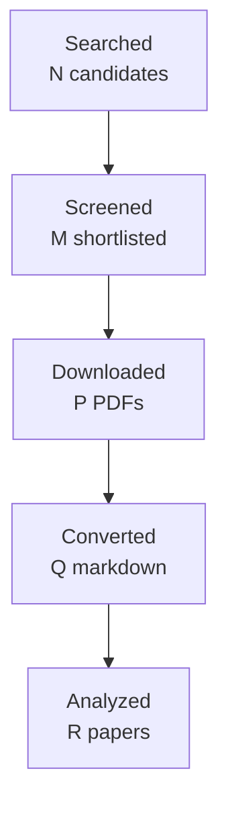

You are one worker inside an automated literature-review pipeline.
A script, not a person, reads your reply. Follow these rules exactly:
- Do the task completely in this single reply. Do not ask questions and do not
  wait for confirmation.
- Reply with the requested artifact block(s) only: no preamble, no commentary
  outside the blocks. Each block starts with a line `===BEGIN <name>===` and
  ends with a line `===END <name>===`; the content between those lines is
  written to a file verbatim.
- Never invent papers, identifiers, numbers, or quotes. Leave unknown fields
  out or mark them as unknown.
- Do not use your code tool, canvas, or connectors; plain text is enough.

# Task: write the final research report

Research topic: **evidence-gap-driven context retrieval and completion for workplace communication: turning an explicit evidence gap into bounded retrieval, deciding what to fetch next, and knowing when to stop, while preserving permissions, versions, temporal validity, cost and uncertainty**
Run id: `1d3def4db417`  Round: 4 of at most 4

Write the final report in Markdown following the template below exactly:
same section names in the same order, `[HIGH]`/`[MEDIUM]`/`[LOW]` confidence
tags on every finding, `[ACADEMIC]`/`[ENGINEERING]` labels on every gap, at
least one Mermaid `flowchart TD` diagram, LaTeX (`$...$`) for formulas, and
evidence citations as `[paper_id]`. Cite only the paper ids listed under
"Papers reviewed". In Methodology state that the papers were read through
the host's web tool and give the access level of each paper. Leave no
template placeholder in the output. Do not write a line that starts with
`===` inside the report.

Round History: use exactly these rows (they are computed by the pipeline):
| 1 | 9af0d6417416 | evidence-gap-driven context retrieval and completion for workplace communication: turning an explicit evidence gap into bounded retrieval, deciding what to fetch next, and knowing when to stop, while preserving permissions, versions, temporal validity, cost and uncertainty | 17 | initial shortlist | 4 academic, 4 engineering |
| 2 | 162dd36d17eb | Integrated adaptive retrieval controllers with structured evidence gaps, temporal and version-aware provenance, permission-aware access, and calibrated bounded-risk stopping | 17 | 0 resolved | 4 academic, 4 engineering |
| 3 | 1f23ec07113d | Joint adaptive RAG controllers for structured evidence-gap completion with temporal and version-aware provenance and calibrated risk-controlled stopping under distribution shift | 11 | 0 resolved | 4 academic, 4 engineering |
| 4 | 1d3def4db417 | Unified iterative RAG stopping and provenance control under distribution shift: search specifically for controllers that combine structured evidence sufficiency with temporal/version-aware provenance and calibrated or conformal risk-controlled stopping, including any systems that additionally integrate permission-aware access or bounded retrieval budgets. | 16 | academic gaps of the previous round | 4 academic, 4 engineering |
Stop reason line: 4-round cap reached

Research Gaps: list every gap that is still open with its classification,
priority, and the rounds that already searched for it. An unresolved gap is
never presented as accepted or closed; say plainly that the literature has
not answered it yet.

Query variants used:
- unified iterative rag provenance under distribution shift: search specifically controllers combine structured evidence sufficiency temporal/version-aware calibrated conformal risk-controlled stopping, including any systems additionally integrate permission-aware access bounded retrieval budgets.
- unified iterative rag
- unified provenance under distribution shift: search specifically controllers combine structured evidence sufficiency temporal/version-aware calibrated conformal risk-controlled stopping, including any systems additionally integrate permission-aware access bounded retrieval budgets.
- iterative provenance under distribution shift: search specifically controllers combine structured evidence sufficiency temporal/version-aware calibrated conformal risk-controlled stopping, including any systems additionally integrate permission-aware access bounded retrieval budgets.
- rag provenance under distribution shift: search specifically controllers combine structured evidence sufficiency temporal/version-aware calibrated conformal risk-controlled stopping, including any systems additionally integrate permission-aware access bounded retrieval budgets.
- unified iterative rag provenance under
- unified iterative rag distribution shift:
- unified iterative rag search specifically

## Project context you must work within

This is the project's own description of the problem, its boundaries,
and the distinctions it needs preserved. It governs what counts as
relevant; the academic task names alone do not.

# Topic 07 context — Evidence-gap-driven context retrieval and completion

## Why this Topic exists

A3 triage should interpret the information it is given, not autonomously roam through all sources. In Phase 2, however, selected Topics may require further evidence: an unresolved pronoun, missing earlier approval, referenced attachment version, unknown owner, prior decision, or conflicting historical state.

Topic 07 studies how msgloom turns an **explicit evidence gap** into bounded retrieval, decides what to fetch next, and knows when to stop. The objective is not generic RAG for richer answers; it is targeted evidence acquisition that preserves permissions, versions, temporal validity, cost, and uncertainty.

## Core research object

A retrieval loop should be representable as:

```text
current Topic + question + known evidence
    → explicit missing-information need
    → bounded query/read request
    → source-mapped evidence or explicit failure
    → reassess gap
    → stop when answered, limits exhausted, denied, or still unanswerable
```

Empty search, denied access, unavailable attachment, or exhausted budget must not be interpreted as proof that the issue does not exist.

## Product and phase relevance

This Topic primarily belongs to **Phase 2 A4 Investigation**. Phase 1 deliberately does not search for further evidence. A4 reuses A1 collection and A2 preparation rather than inventing a separate source client or parsing pipeline.

## Direct handoffs from earlier Topics

Topic 04 (completed 2026-09-16, 47 papers, 4 rounds) hands over the case where a reference has **no resolvable antecedent in the available material**. Its guidance is explicit: when missing context is the real problem, that is an evidence need for Topic 07, not a reference-model failure. Topic 04 leaves the unresolved reference marked as unresolved rather than forcing a link, so Topic 07 receives an explicit missing-antecedent signal to turn into a targeted retrieval.

Topic 03 (completed 2026-09-16, 50 papers, 4 rounds) leaves its Phase 2 evidence-seeking strategy open as an ENGINEERING gap: when the available material does not settle whether two messages concern the same work matter, what should be retrieved next. Topic 07 owns turning that unresolved identity question into a targeted evidence need; Topic 03 keeps ownership of what counts as continuity once the evidence arrives.

**The full text of every inherited handoff is in [`INHERITED_HANDOFFS.md`](INHERITED_HANDOFFS.md)**, including what each sending Topic established, what it left open, and where the ownership boundary lies. Read it before planning; you do not need to open an earlier Topic's folder.

## Relationships to other Topics

| Topic | Relationship |
| --- | --- |
| 03 | Uncertain Topic identity can generate a targeted historical-evidence request. |
| 04 | Missing/unsupported antecedents can become retrieval gaps. |
| 05 | Missing owner/object/prerequisite may require historical evidence. |
| 06 | Conflicting or incomplete state may require earlier/later evidence. |
| 08 | Retrieved documents/attachments require grounded extraction and multimodal interpretation. |
| 09 | Briefing should not wait forever for investigation; it can report an explicit unresolved gap. |
| 10 | Evaluates answerability, source attribution, completeness, calibration, and stopping reliability. |

## Key conceptual distinctions

- Retrieval need ≠ vague desire for more context.
- Query rewriting ≠ deciding whether retrieval is warranted.
- Retrieval success ≠ question answered.
- No results ≠ negative evidence unless the source/query semantics justify it.
- Latest document ≠ temporally valid document for the question.
- More retrieval ≠ better if it exceeds scope, cost, or adds irrelevant evidence.
- Phase 1 parsing of already collected attachments ≠ Phase 2 investigation retrieval.

## High-value academic terminology

- conversational query rewriting / query reformulation;
- query resolution / conversational search / context-aware search;
- question decontextualization;
- retrieval-augmented generation (RAG), especially adaptive/active/iterative retrieval;
- active retrieval augmented generation; self-directed retrieval;
- multi-hop retrieval / iterative multi-hop QA;
- retrieval planning; evidence acquisition; tool-use planning (read-only/bounded);
- query-focused evidence retrieval;
- temporal information retrieval; time-aware retrieval; recency/freshness-aware retrieval;
- version-aware retrieval; provenance-aware retrieval;
- unanswerability detection; answerability prediction;
- selective question answering; answer abstention;
- retrieval stopping criterion; budgeted retrieval; cost-aware retrieval;
- retrieval with access constraints / enterprise search (direct-domain candidates).

## Query families

- `"conversational query rewriting" retrieval`
- `question decontextualization conversational search`
- `"adaptive retrieval" RAG stopping`
- `"active retrieval augmented generation"`
- `"iterative retrieval" evidence acquisition`
- `"multi-hop retrieval" stopping criterion`
- `"temporal information retrieval" document versions`
- `"version-aware retrieval" provenance`
- `"unanswerability detection" retrieval augmented`
- `"answer abstention" retrieval`
- `budgeted retrieval evidence acquisition`
- `enterprise search missing context email investigation`

## False friends / exclusions

- generic vector-search benchmarking with no explicit evidence need;
- unlimited agent browsing;
- retrieval that discards source/version provenance;
- Topic 08 document parsing itself;
- Topic 10 general factuality evaluation;
- recommendation retrieval unrelated to answering a bounded Topic question.

## Gap-evaluation guidance

Prioritize whether the system can formulate the **right missing-evidence question**, retrieve within allowed scope, distinguish evidence from absence, and stop responsibly. Ranking improvements are secondary unless they materially affect missed evidence or cost. Engineering validation should include denied reads, empty search, stale versions, conflicting versions, partial attachment access, multi-hop dependency, and budget exhaustion.

## How to use this file

This file is the self-contained research context for this Topic. A future AI research agent should read **this file first**, then `BRIEF.md`, then any existing `CURRENT_STATUS.md`, gap decisions, reports, manifests, and prior-round artifacts in this folder. The aim is that an agent given only this Topic folder can reconstruct the project intent, Topic boundary, dependencies, search vocabulary, and gap-prioritization logic without relying on the original ChatGPT conversation.

If the full repository is available, the authoritative product documents remain `../../docs/design-brief.md`, `../../docs/design-principles.md`, `../../docs/design.md`, and `../../docs/phase-roadmap.md`. This file explains how those product constraints apply to this research Topic; it does not replace or approve changes to those design documents.

## Shared msgloom background

msgloom is a personal work-information system for one user. It is intended to process very large daily volumes of work communication, initially Outlook email and Microsoft Teams, while ensuring that **work requiring the user's response is not missed** and reducing how much the user must read to stay current.

The product is organized around **Topics**, not message summaries. A Topic is a concrete work matter described by information from one or more sources. One message can contain several Topics; one Topic can span many messages, conversations, attachments, groups, and eventually multiple sources. A conversation or Group is therefore not automatically one Topic.

The report contract is the ultimate product pressure on all ten research Topics. Reports must preserve every due Topic and the decision-relevant information needed to act on it, including developments, actions, deadlines, conditions, risks, uncertainty, and links back to exact source evidence. Missing or conflicting information must remain visible rather than being silently filled in.

The design decision order is important when evaluating research gaps: user permissions are fixed; then preserve correct meaning and report coverage; then traceability and recovery; then usability/maintenance; finally speed, brevity, and token savings. A method that is faster but loses a condition, deadline, branch, source relation, or important Topic is not an improvement for msgloom.

Important persistent principles:

- Use deterministic code for reliable mechanical relationships and AI for language understanding/judgement.
- Preserve source bytes, versions, stage history, identities, and lineage. New assessments do not erase old evidence.
- Group only on reliable relationships. Similar subjects, participants, wording, or model labels are not enough to prove Topic identity.
- Keep uncertain relationships separate and make the reason for uncertainty visible.
- Brevity must come from concise wording and layered detail, never from omitting decision-essential information.
- User-reviewed examples, missed important work, false alerts, wrong grouping, lost actions/deadlines, and evidence that changes a decision matter more than paper count or message throughput.

## Research-programme relationship

The ten Topics form a dependency network rather than ten independent literature reviews. A useful conceptual flow is:

```text
01 source/conversation structure
        ↓
02 within-message Topic spans/membership
        ↓
03 cross-thread/source Topic identity
        ↓
04 reference and response scope
        ↓
05 actions / requests / commitments / decisions
        ↓
06 state / factuality / time / revision
        ↓
07 retrieve missing context when needed
        ↘
08 understand attachments / tables / images
        ↓
09 incremental personalized briefing
        ↓
10 evidence, completeness, calibration, reliability evaluation
```

This is not a strict processing pipeline. Several Topics feed each other, and Topic 10 is cross-cutting. The numbering primarily gives a research order and ownership boundary so that one Topic does not silently absorb the whole product problem.

## Gap-evaluation rules inherited from Topics 01 and 02

The Research Pipeline must evaluate gaps using **project value**, not just academic novelty. The following rules are part of the context for every Topic:

1. A machine-classified `HIGH` or `ACADEMIC` gap does **not** automatically authorize another literature round.
2. After each academic round, perform a human/project-value review: decide whether the uncertainty is best addressed by more papers, engineering experiments, a later Topic, production-domain data, candidate-method selection, or no further current work.
3. Prefer targeted academic follow-up over broad searching. Do not fill paper quotas with weakly related literature.
4. Distinguish direct target-domain evidence from transfer methods/evaluation evidence. Transfer evidence can justify a mechanism or experiment, not production-email accuracy.
5. Engineering validation may use independent synthetic/adversarial fixtures and public data. Lack of production mailbox examples is not a reason to stop work that can be validly completed without them.
6. Never claim production representativeness from synthetic or transfer evidence. Record it as deferred until suitable authorized domain data exists.
7. If a gap belongs to another Topic, hand it off explicitly rather than duplicating research.
8. Research closure means **everything actionable at the current stage is complete and remaining work is explicitly deferred/handed off**. It does not mean literature exhaustion, production accuracy, or architecture approval.
9. For new academic work, use terminology refinement, strict paper admission, manual/controlled canonical acquisition, corpus freeze, fresh isolated Pipeline runs, direct-vs-transfer labels, independent review, strict validation, and post-round gap review. These are lessons learned from Topics 01 and 02.
10. For engineering research, keep gold independent from the component under test; structurally separate prediction inputs from evaluation gold/future context; count false positives and false negatives in end-to-end denominators; use clean-workspace reproducibility, mutation/regression tests, and fresh independent methodological review.

## Work handed to this topic by an earlier one

Treat each entry as a starting condition, not as something to
rediscover. Where a sending topic left a gap open it is still open:
do not report it as established. Respect the stated ownership
boundary and do not absorb what the sender still owns.

**None of this is evidence for your own report.** It scopes your
work; it does not support a finding or a gap. Only papers this
topic admitted can do that.

# Inherited handoffs

Everything an earlier Topic explicitly handed to this one, copied in full so
that this folder is enough on its own. You do not need to open an earlier
Topic's documents to start work here.

Each entry states what was handed over, what the sending Topic still owns, and
what it had established or left open at the time. A handoff is not a finding:
where the sender left a gap open, it is still open.

## From Topic 03 — Cross-thread Topic identity and incremental continuity

*Completed 2026-09-16. 4 rounds, 50 papers, report validated PASS 0.94. Seven
gaps left open.*

**Handed to Topic 07.** When the available material does not settle whether
two messages concern the same work matter, what should be retrieved next.
Topic 03 records this as an open ENGINEERING gap (MEDIUM): the operational
strategy for Phase 2 evidence seeking is unresolved.

**Boundary.** Topic 07 owns turning an unresolved identity question into a
targeted evidence need. Topic 03 keeps ownership of what counts as continuity
once the evidence arrives, and of the cost of a false merge against a false
split.

## From Topic 04 — Reference resolution and response scope

*Completed 2026-09-16. 4 rounds, 47 papers, report validated PASS.*

**Handed to Topic 07.** The case where a reference has **no resolvable
antecedent in the available material**. Topic 04's guidance is explicit: when
missing context is the real problem, that is an evidence need for Topic 07,
not a reference-model failure.

**What Topic 04 does with it.** It leaves the reference marked unresolved
rather than forcing a link, so Topic 07 receives an explicit
missing-antecedent signal rather than a wrong answer. Preserving that
distinction is deliberate: an invented link is more damaging than an admitted
gap.

**Boundary.** Topic 04 owns what the reference means once the material exists.
Topic 07 owns deciding what to fetch and stopping when enough has been
fetched.

## From Topic 05 — Action items, requests, commitments and decisions

*Completed 2026-09-16. 4 rounds, 48 papers.*

**Handed to Topic 07.** A missing owner, object or context becoming an
explicit retrieval need. Topic 05's uncertainty-preserving output leaves
owner, deadline, condition or act subtype **unresolved** rather than guessing,
which is its open engineering gap G9; each unresolved field is a concrete
evidence need for Topic 07.

**Boundary.** Topic 07 owns deciding what to fetch and when to stop. Topic 05
owns what the field means once the evidence arrives.

## From Topic 06 — Work-item state, event factuality, time, conflicting revisions

*Completed 2026-09-17. 4 rounds, 38 papers, no duplicate records. Every
round's synthesis was accepted by the independent review at the first attempt
— faithfulness 0.93 to 0.95 — which no earlier Topic managed. Stopped on
`round_cap_reached`. All eight gaps remain open and none was downgraded.*

**Handed to Topic 07.** An unresolved state becomes an explicit
missing-evidence requirement. Topic 06's report names this directly: evidence
retrieval should be evaluated jointly with state resolution "so unresolved
states can emit explicit missing-evidence requirements to Topic 07 rather
than hallucinating closure".

**What Topic 06 established.** Separate literatures cover factuality,
temporal ordering, commitment lifecycle, provenance and conflicting evidence,
and each works in its own setting. None of them was shown to work jointly.
An unresolved state is therefore the expected output, not a defect, and the
honest response to one is to ask for evidence rather than to guess.

**What Topic 06 left open, and Topic 07 must not treat as settled:**

- *(ACADEMIC, HIGH, Gap 3)* No joint evaluation of factuality, temporal
  ordering, lifecycle state, contradiction and provenance in one model.
  Component success does not establish integrated correctness.
- *(ACADEMIC, HIGH, Gap 5)* Nothing distinguishes a *claimed* completion from
  an independently corroborated one. A retrieval request built on a claimed
  state may be asking about work that is not actually done.
- *(ENGINEERING, HIGH, Gap 7)* Message time, effective time, deadline time
  and collection/version time have never been benchmarked together. A
  retrieval scoped by the wrong clock returns stale or retroactive evidence.

**Boundary.** Topic 07 owns deciding what to fetch, in what order, and when
to stop. Topic 06 owns what the state *is* once the evidence arrives, and
owns saying that it is still unresolved.

*Basis: Topic 06's report names Topic 07 explicitly (Future Directions 6);
the gaps are quoted from its Research Gaps table.*

## From Topic 08 — Email, image, table and attachment understanding

*Completed 2026-09-17. 4 rounds, 53 corpus records — **52 distinct papers**,
because one study was admitted twice under two identifiers. Rounds 2 and 4
were each rejected once and accepted after one repair; rounds 1 and 3 passed
at the first attempt. Stopped on `round_cap_reached`. All eight gaps remain
open and none was downgraded.*

**Handed to Topic 07.** A retrieved document, attachment or workbook still
has to be interpreted, and the evidence inside it located precisely. Topic 07
owns deciding what to fetch and when to stop; Topic 08 owns what the fetched
artefact says and where in it the claim sits — which page, region, cell or
version.

**What Topic 08 established.** Document-VQA work localises evidence to pages,
regions and answer spans; spreadsheet work localises to sheets, cells and
formulas; version-oriented work demonstrates version recovery, evolving
-document citation and version-aware retrieval. Each works in its own
setting. None was shown to work as one pipeline.

**What Topic 08 left open, and Topic 07 must not treat as settled:**

- *(ACADEMIC, HIGH, gap-1)* No complete method maintains evidence provenance
  across successive workplace attachment versions. A citation into "the
  attachment" is not yet a citation into a known version of it.
- *(ACADEMIC, HIGH, gap-4)* No admitted paper validates one end-to-end
  provenance representation identifying attachment version, page, document
  element and region together. Topic 07 cannot assume a retrieved span
  carries a usable address.
- *(ENGINEERING, HIGH, gap-5)* End-to-end behaviour when extraction or
  grounding is unsupported, incomplete or wrong is insufficiently exercised.
  A failed extraction must be distinguishable from an absent answer, which is
  a stopping-criterion concern as much as an extraction one.

**Boundary.** Topic 07 owns the retrieval decision and its budget. Topic 08
owns interpretation and grounding of whatever comes back.

*Basis: Topic 08's report names Topic 07 explicitly; the gaps are quoted from
its gaps.json.*


Papers reviewed:
- paper_id `2608.02195` — MEGRAG: Multi-Granular Evidence Graphs for Answer-Aware Multi-Hop RAG (Weidong Bao, Yingying Sun, Jun Yang et al.; 2026)
- paper_id `2607.06507` — DynaKRAG: A Unified Framework for Learnable Evidence Control in Multi-Hop Retrieval-Augmented Generation (Yaqi Wu, Xiaolei Guo, Chenyu Zhou et al.; 2026)
- paper_id `manual-2bb76a9136` — IDCR: Information-Directed Conformal Retrieval (Manas Nanivadekar, Jatin Khanijoan, Swayam Kothekar et al.; 2026)
- paper_id `2510.22344` — FAIR-RAG: Faithful Adaptive Iterative Refinement for Retrieval-Augmented Generation (Mohammad Aghajani Asl, Majid Asgari-Bidhendi, Behrooz Minaei-Bidgoli; 2025)
- paper_id `2505.02811` — Knowing You Don't Know: Learning When to Continue Search in Multi-round RAG through Self-Practicing (Diji Yang, Linda Zeng, Jinmeng Rao et al.; 2025)
- paper_id `2307.04642` — TRAQ: Trustworthy Retrieval Augmented Question Answering via Conformal Prediction (Shuo Li, Sangdon Park, Insup Lee et al.; 2024)
- paper_id `2506.05167` — ECoRAG: Evidentiality-guided Compression for Long Context RAG (Yeonseok Jeong, Jinsu Kim, Dohyeon Lee et al.; 2025)
- paper_id `2609.08364` — SentryLine: Evidence-Grounded Question Answering over Evolving Documents in Oncology Care (Tampu Ravi Kumar, Gaurav Najpande, Muhammad Ali Khan et al.; 2026)
- paper_id `2506.20978` — Response Quality Assessment for Retrieval-Augmented Generation via Conditional Conformal Factuality (Naihe Feng, Yi Sui, Shiyi Hou et al.; 2025)
- paper_id `2402.03181` — C-RAG: Certified Generation Risks for Retrieval-Augmented Language Models (Mintong Kang, Nezihe Merve Gürel, Ning Yu et al.; 2024)
- paper_id `2006.09462` — Selective Question Answering under Domain Shift (Amita Kamath, Robin Jia, Percy Liang; 2020)
- paper_id `2604.19899` — A Reproducibility Study of Metacognitive Retrieval-Augmented Generation (Gabriel Iturra-Bocaz, Petra Galuščáková; 2026)
- paper_id `2605.05245` — AdaGATE: Adaptive Gap-Aware Token-Efficient Evidence Assembly for Multi-Hop Retrieval-Augmented Generation (Yilin Guo, Yinshan Wang, Yixuan Wang; 2026)
- paper_id `2208.08401` — Conformal Inference for Online Prediction with Arbitrary Distribution Shifts (Isaac Gibbs, Emmanuel J. Candès; 2024)
- paper_id `2608.08512` — Time Present and Time Past: Benchmarking Large Language Models on Temporally Evolving Document Understanding (Mahbub E Sobhani, Md. Faiyaz Abdullah Sayeedi, Fahmid Hasan Chowdhury et al.; 2026)
- paper_id `doi-10-1016-0306-4379-96-00017-8` — Semantics of time-varying information (Christian S. Jensen, Richard T. Snodgrass; 1996)
- paper_id `2105.04166` — Few-Shot Conversational Dense Retrieval (Shi Yu, Zhenghao Liu, Chenyan Xiong et al.; 2021)
- paper_id `2406.19215` — SeaKR: Self-aware Knowledge Retrieval for Adaptive Retrieval Augmented Generation (Zijun Yao, Weijian Qi, Liangming Pan et al.; 2025)
- paper_id `2604.23783` — S2G-RAG: Structured Sufficiency and Gap Judging for Iterative Retrieval-Augmented QA (Minghan Li, Junjie Zou, Xinxuan Lv et al.; 2026)
- paper_id `2411.06037` — Sufficient Context: A New Lens on Retrieval Augmented Generation Systems (Hailey Joren, Jianyi Zhang, Chun-Sung Ferng et al.; 2025)
- paper_id `2305.06983` — Active Retrieval Augmented Generation (Zhengbao Jiang, Frank F. Xu, Luyu Gao et al.; 2023)
- paper_id `2608.13237` — When Should Multi-Round RAG Stop? Structured Stopping Judgments and Retrieval Reduction in Search-R1 (Weimeng Luo; 2026)
- paper_id `doi-10-18653-v1-2026-findings-acl-2090` — Beyond Single-Shot: Multi-step Tool Retrieval via Query Planning (Wei Fang, James R. Glass; 2026)
- paper_id `2604.25676` — CORAL: Adaptive Retrieval Loop for Culturally-Aligned Multilingual RAG (Nayeon Lee, Jiwoo Song, Byeongcheol Kang; 2026)
- paper_id `2212.10509` — Interleaving Retrieval with Chain-of-Thought Reasoning for Knowledge-Intensive Multi-Step Questions (Harsh Trivedi, Niranjan Balasubramanian, Tushar Khot et al.; 2023)
- paper_id `2112.08558` — CONQRR: Conversational Query Rewriting for Retrieval with Reinforcement Learning (Zeqiu Wu, Yi Luan, Hannah Rashkin et al.; 2022)
- paper_id `doi-10-1145-1247715-1247720` — Temporal profiles of queries (Rosie Jones, Fernando Diaz; 2007)
- paper_id `doi-10-1145-1571941-1572085` — Improving search relevance for implicitly temporal queries (Donald Metzler, Rosie Jones, Fuchun Peng et al.; 2009)
- paper_id `2403.10081` — DRAGIN: Dynamic Retrieval Augmented Generation based on the Information Needs of Large Language Models (Weihang Su, Yichen Tang, Qingyao Ai et al.; 2024)
- paper_id `2606.29090` — AB-RAG: Adaptive Budgeted Retrieval-Augmented Generation for Reliable Question Answering (Ansh Kamthan; 2026)
- paper_id `2606.29959` — Know Before You Fetch: Calibrated Retrieval-Budget Allocation for Retrieval-Augmented Generation (Zhe Dong, Fang Qin, Manish Shah et al.; 2026)
- paper_id `2210.03350` — Measuring and Narrowing the Compositionality Gap in Language Models (Ofir Press, Muru Zhang, Sewon Min et al.; 2023)
- paper_id `doi-10-1109-access-2025-3628960` — Permission-Aware RAG: Identity and Access Management (IAM)-Based Access Filtering in Multi-Resource Environments (Jooyoung Jeong, Sang Goo Lee; 2025)
- paper_id `2606.13814` — TASR: Training-Free Adaptive Stopping for Iterative Retrieval (Adrian Kieback, Uyiosa Philip Amadasun, Aman Chadha et al.; 2026)
- paper_id `2510.14337` — Stop-RAG: Value-Based Retrieval Control for Iterative RAG (Jaewan Park, Solbee Cho, Jay-Yoon Lee; 2025)
- paper_id `2406.10490` — Active, anytime-valid risk controlling prediction sets (Ziyu Xu, Nikos Karampatziakis, Paul Mineiro; 2024)
- paper_id `2609.16301` — CLEAR: Cross-Source Evidence Adjudication for Large Language Models in Medicine (Shuai Wang, Yize Zhao, Qingyu Chen; 2026)
- paper_id `2605.03534` — SURE-RAG: Sufficiency and Uncertainty-Aware Evidence Verification for Selective Retrieval-Augmented Generation (Jingxi Qiu, Zeyu Han, Cheng Huang; 2026)
- paper_id `doi-10-1038-s41598-026-71936-x` — Privacy-provisioned-permission-aware RAG in cloud using identity and access management, trust and large-language models (PPPARITL) (Urvashi Rahul Saxena, Samar Shailendra, Rajan Kadel et al.; 2026)
- paper_id `2412.15540` — MRAG: A Modular Retrieval Framework for Time-Sensitive Question Answering (Siyue Zhang, Yuxiang Xue, Yiming Zhang et al.; 2024)
- paper_id `2010.11915` — Challenges in Information-Seeking QA: Unanswerable Questions and Paragraph Retrieval (Akari Asai, Eunsol Choi; 2021)
- paper_id `2510.08109` — VersionRAG: Version-Aware Retrieval-Augmented Generation for Evolving Documents (Daniel Huwiler, Kurt Stockinger, Jonathan Fürst; 2025)
- paper_id `2607.24010` — When Should Active RAG Retrieve? A Budget-Aware Evaluation of Utility, Calibration, and Cost (Pin Qian, Su Wang, Chong Peng et al.; 2026)
- paper_id `doi-10-1145-181550-181560` — A Consensus Glossary of Temporal Database Concepts (Christian S. Jensen, James Clifford, Ramez Elmasri et al.; 1994)
- paper_id `2208.02814` — Conformal Risk Control (Anastasios N. Angelopoulos, Stephen Bates, Adam Fisch et al.; 2022)
- paper_id `1904.06019` — Conformal Prediction Under Covariate Shift (Ryan J. Tibshirani, Rina Foygel Barber, Emmanuel J. Candès et al.; 2019)
- paper_id `doi-10-1145-3786625` — HONEYBEE: Efficient Role-based Access Control for Vector Databases via Dynamic Partitioning (Hongbin Zhong, Matthew Lentz, Nina Narodytska et al.; 2026)
- paper_id `2601.19827` — When Iterative RAG Beats Ideal Evidence: A Diagnostic Study in Scientific Multi-hop Question Answering (Mahdi Astaraki, Mohammad Arshi Saloot, Ali Shiraee Kasmaee et al.; 2026)
- paper_id `2310.11511` — Self-RAG: Learning to Retrieve, Generate, and Critique through Self-Reflection (Akari Asai, Zeqiu Wu, Yizhong Wang et al.; 2023)
- paper_id `2508.01084` — Provably Secure Retrieval-Augmented Generation (Pengcheng Zhou, Yinglun Feng, Zhongliang Yang; 2025)
- paper_id `2604.01413` — Adaptive Stopping for Multi-Turn LLM Reasoning (Xiaofan Zhou, Huy Nguyen, Bo Yu et al.; 2026)
- paper_id `2606.05658` — Agent-Orchestrated Adaptive RAG: A Comparative Study on Structured and Multi-Hop Retrieval (Anuj Maharjan, Devinder Kaur, Richard Molyet; 2026)
- paper_id `2606.29054` — When Can Conformal Risk Control Certify LLM Outputs? Bounds, Impossibility, and Adaptation for Structured Generation (Varun Kotte; 2026)
- paper_id `doi-10-32604-cmc-2026-086343` — Do LLMs Know When Evidence is Insufficient? An Evidence Sufficiency Benchmark for Answer-Abstention Calibration in Retrieval-Augmented Generation (Hantian Zhang, Wentai Wu; 2026)
- paper_id `2510.13590` — RAG Meets Temporal Graphs: Time-Sensitive Modeling and Retrieval for Evolving Knowledge (Jiale Han, Austin Cheung, Yubai Wei et al.; 2025)
- paper_id `2603.28444` — Entropic Claim Resolution: Uncertainty-Driven Evidence Selection for RAG (Davide Di Gioia; 2026)
- paper_id `doi-10-18653-v1-2026-acl-long-1562` — RAG-on-a-Diet: A Reinforcement Learning-Based Dynamic Resource Optimization Framework for RAG (Hongwen Ding, Yizheng Zhao; 2026)
- paper_id `2606.15964` — PromptShift-CRC: Drift-Aware Conformal Risk Control for Foundation Models Under Prompt and Domain Shift (Jeffery Opoku, David Banahene; 2026)
- paper_id `2607.27726` — Baikal: Structured Search for Deep Research over Data Lakes (Dhruv Agarwal, Rishitha Guttapalle Mohan, Aarti Kumari et al.; 2026)
- paper_id `doi-10-1609-aaai-v39i14-33670` — Temporal Conjunctive Query Answering via Rewriting (Lukas Westhofen, Jean Christoph Jung, Daniel Neider; 2025)
- paper_id `2609.11572` — TimelyRAG: Semantic-Temporal Hybrid Retrieval for Time-Critical Question Answering in Overlapping-Evolving Documents (Youngeun Nam, Joeun Kim, Hwanjun Song et al.; 2026)

Access level per paper:
- `1904.06019`: full_text via https://arxiv.org/html/1904.06019
- `2006.09462`: full_text via https://arxiv.org/html/2006.09462
- `2010.11915`: full_text via https://arxiv.org/html/2010.11915
- `2105.04166`: full_text via https://arxiv.org/html/2105.04166
- `2112.08558`: full_text via https://arxiv.org/html/2112.08558
- `2208.02814`: full_text via https://arxiv.org/html/2208.02814
- `2208.08401`: full_text via https://arxiv.org/html/2208.08401
- `2210.03350`: full_text via https://arxiv.org/html/2210.03350
- `2212.10509`: full_text via https://arxiv.org/html/2212.10509
- `2305.06983`: full_text via https://arxiv.org/html/2305.06983
- `2307.04642`: full_text via https://arxiv.org/html/2307.04642
- `2310.11511`: full_text via https://arxiv.org/html/2310.11511
- `2402.03181`: full_text via https://arxiv.org/html/2402.03181
- `2403.10081`: full_text via https://arxiv.org/html/2403.10081
- `2406.10490`: full_text via https://arxiv.org/html/2406.10490
- `2406.19215`: full_text via https://arxiv.org/html/2406.19215
- `2411.06037`: full_text via https://arxiv.org/html/2411.06037
- `2412.15540`: full_text via https://arxiv.org/html/2412.15540
- `2505.02811`: full_text via https://arxiv.org/html/2505.02811
- `2506.05167`: full_text via https://arxiv.org/html/2506.05167
- `2506.20978`: full_text via https://arxiv.org/html/2506.20978
- `2508.01084`: full_text via https://arxiv.org/html/2508.01084
- `2510.08109`: full_text via https://arxiv.org/html/2510.08109
- `2510.13590`: full_text via https://arxiv.org/html/2510.13590
- `2510.14337`: full_text via https://arxiv.org/html/2510.14337
- `2510.22344`: full_text via https://arxiv.org/html/2510.22344
- `2601.19827`: full_text via https://arxiv.org/html/2601.19827
- `2603.28444`: full_text via https://arxiv.org/html/2603.28444
- `2604.01413`: full_text via https://arxiv.org/html/2604.01413
- `2604.19899`: full_text via https://arxiv.org/html/2604.19899
- `2604.23783`: full_text via https://arxiv.org/html/2604.23783
- `2604.25676`: full_text via https://aclanthology.org/2026.findings-acl.1356.pdf
- `2605.03534`: full_text via https://arxiv.org/html/2605.03534
- `2605.05245`: full_text via https://arxiv.org/html/2605.05245
- `2606.05658`: full_text via https://arxiv.org/html/2606.05658
- `2606.13814`: full_text via https://arxiv.org/html/2606.13814
- `2606.15964`: full_text via https://arxiv.org/html/2606.15964
- `2606.29054`: full_text via https://arxiv.org/html/2606.29054
- `2606.29090`: full_text via https://arxiv.org/html/2606.29090
- `2606.29959`: full_text via https://arxiv.org/html/2606.29959
- `2607.06507`: full_text via https://arxiv.org/html/2607.06507
- `2607.24010`: full_text via https://arxiv.org/html/2607.24010
- `2607.27726`: full_text via https://arxiv.org/html/2607.27726
- `2608.02195`: full_text via https://arxiv.org/html/2608.02195
- `2608.08512`: full_text via https://arxiv.org/html/2608.08512
- `2608.13237`: full_text via https://arxiv.org/html/2608.13237
- `2609.08364`: full_text via https://arxiv.org/html/2609.08364
- `2609.11572`: full_text via https://arxiv.org/html/2609.11572
- `2609.16301`: full_text via https://arxiv.org/html/2609.16301
- `doi-10-1016-0306-4379-96-00017-8`: full_text via https://people.cs.aau.dk/~csj/Thesis/pdf/chapter2.pdf
- `doi-10-1038-s41598-026-71936-x`: abstract_only via https://www.nature.com/articles/s41598-026-71936-x
- `doi-10-1109-access-2025-3628960`: full_text via https://www.researchgate.net/publication/397278007_Permission-Aware_RAG_Identity_and_Access_Management_IAM-Based_Access_Filtering_in_Multi-Resource_Environments
- `doi-10-1145-1247715-1247720`: full_text via https://841.io/doc/temporal-profiles-journal.pdf
- `doi-10-1145-1571941-1572085`: full_text via https://www.cs.cmu.edu/afs/cs/user/rosie/www/papers/yqq.pdf
- `doi-10-1145-181550-181560`: full_text via https://www2.cs.arizona.edu/~rts/pubs/SIGMODRecordMarch94p52.pdf
- `doi-10-1145-3786625`: full_text via https://arxiv.org/html/2505.01538
- `doi-10-1609-aaai-v39i14-33670`: full_text via https://ojs.aaai.org/index.php/AAAI/article/download/33670/35825
- `doi-10-18653-v1-2026-acl-long-1562`: full_text via https://aclanthology.org/2026.acl-long.1562.pdf
- `doi-10-18653-v1-2026-findings-acl-2090`: full_text via https://arxiv.org/html/2601.07782
- `doi-10-32604-cmc-2026-086343`: full_text via https://www.techscience.com/cmc/v89n1/68467/html
- `manual-2bb76a9136`: abstract_only via https://proceedings.mlr.press/v337/nanivadekar26a.html

Cross-paper synthesis (the source of findings, gaps, and themes):
{
 "topic": "Unified iterative RAG stopping and provenance control under distribution shift: controllers combining structured evidence sufficiency with temporal/version-aware provenance and calibrated or conformal risk-controlled stopping, including permission-aware access and bounded retrieval budgets",
 "paper_count": 61,
 "executive_summary": "The 61-paper corpus supports a modular picture rather than a validated unified controller. Structured sufficiency and gap representations can drive iterative retrieval and early stopping on multi-hop QA, while adaptive retrieval studies show that additional retrieval can be beneficial, neutral, or harmful depending on the query and evidence state. Separate conformal and selective-prediction work provides calibrated risk or coverage control, including several forms of distribution-shift adaptation. Temporal and version-aware systems improve retrieval over evolving documents, and separate permission-aware RAG systems enforce access constraints. Budget-aware controllers reduce calls, tokens, or latency in several benchmark settings. However, no admitted study combines structured evidence gaps, temporal/version lineage, permission-aware replenishment, calibrated stopping under shift, abstention, and total-cost control in one evaluated iterative retrieval loop. All eight prior gaps therefore remain open.",
 "themes": [
  "Structured evidence sufficiency, explicit gap representations, and gap-directed next-query generation",
  "Adaptive retrieval and stopping under heterogeneous retrieval benefit and retrieval harm",
  "Conformal risk control, selective prediction, calibration, and adaptation under distribution shift",
  "Temporal validity, evolving-document retrieval, version lineage, and source provenance",
  "Permission-aware retrieval and authorization-preserving candidate filtering",
  "Bounded retrieval, token budgets, retrieval-call budgets, and quality-cost trade-offs",
  "Separation between evidence sufficiency, answer confidence, retrieval coverage, and downstream reasoning quality"
 ],
 "findings": [
  {
   "statement": "On multi-hop QA benchmarks, several controllers explicitly represent unresolved evidence requirements and use them to determine subsequent retrieval; S2G-RAG, FAIR-RAG, AdaGATE, DynaKRAG, and MEGRAG report improvements in evidence or answer metrics relative to their evaluated baselines, while retaining explicit stopping or hard search bounds.",
   "confidence": "HIGH",
   "evidence": [
    {
     "paper_id": "2604.23783"
    },
    {
     "paper_id": "2510.22344"
    },
    {
     "paper_id": "2605.05245"
    },
    {
     "paper_id": "2607.06507"
    },
    {
     "paper_id": "2608.02195"
    }
   ]
  },
  {
   "statement": "The evaluated adaptive-RAG studies do not show monotonic benefit from additional retrieval: excessive, mistimed, irrelevant, or otherwise low-utility retrieval can reduce answer quality, and query-specific retrieval benefit varies substantially.",
   "confidence": "HIGH",
   "evidence": [
    {
     "paper_id": "2305.06983"
    },
    {
     "paper_id": "2403.10081"
    },
    {
     "paper_id": "2406.19215"
    },
    {
     "paper_id": "2607.24010"
    },
    {
     "paper_id": "2609.16301"
    }
   ]
  },
  {
   "statement": "Adaptive stopping can reduce retrieval calls, reasoning turns, tokens, or modeled cost in multiple QA settings, but stopping errors remain material in some evaluations; in the Search-R1 stopping study, 27 of 69 executed confirmatory early stops were classified as unsafe under its probe-based criterion.",
   "confidence": "HIGH",
   "evidence": [
    {
     "paper_id": "2606.13814"
    },
    {
     "paper_id": "2608.13237"
    },
    {
     "paper_id": "2606.29090"
    },
    {
     "paper_id": "2606.29959"
    },
    {
     "paper_id": "doi-10-18653-v1-2026-acl-long-1562"
    }
   ]
  },
  {
   "statement": "Conformal and risk-control studies provide finite-sample, expected-risk, or empirical coverage control under their stated assumptions, and separate work extends calibration to covariate, online, prompt, domain, or temporal/severity shifts; these results are demonstrated in separate formulations rather than as one provenance-aware iterative-RAG stopping system.",
   "confidence": "HIGH",
   "evidence": [
    {
     "paper_id": "1904.06019"
    },
    {
     "paper_id": "2208.02814"
    },
    {
     "paper_id": "2208.08401"
    },
    {
     "paper_id": "2307.04642"
    },
    {
     "paper_id": "2402.03181"
    },
    {
     "paper_id": "2406.10490"
    },
    {
     "paper_id": "2604.01413"
    },
    {
     "paper_id": "2606.15964"
    },
    {
     "paper_id": "2606.29054"
    }
   ]
  },
  {
   "statement": "Static confidence or calibration can degrade under distribution shift: selective QA reports overconfidence on unseen domains, ordinary split conformal loses coverage under covariate shift, and later drift-aware conformal studies report large differences between static and adaptive calibration under their evaluated shifts.",
   "confidence": "HIGH",
   "evidence": [
    {
     "paper_id": "2006.09462"
    },
    {
     "paper_id": "1904.06019"
    },
    {
     "paper_id": "2606.15964"
    },
    {
     "paper_id": "2606.29054"
    }
   ]
  },
  {
   "statement": "Temporal and version-aware retrieval methods improve evidence selection on evolving-document and time-sensitive benchmarks, while ordinary semantic retrieval can retrieve semantically relevant but temporally invalid or incomplete evidence.",
   "confidence": "HIGH",
   "evidence": [
    {
     "paper_id": "2412.15540"
    },
    {
     "paper_id": "2510.08109"
    },
    {
     "paper_id": "2510.13590"
    },
    {
     "paper_id": "2608.08512"
    },
    {
     "paper_id": "2609.08364"
    },
    {
     "paper_id": "2609.11572"
    }
   ]
  },
  {
   "statement": "The temporal literature distinguishes real-world validity from database-record time, and evaluated recent systems additionally represent version transitions, update status, superseding passages, or temporally conditioned retrieval; these mechanisms provide different forms of temporal provenance rather than one common end-to-end provenance model.",
   "confidence": "HIGH",
   "evidence": [
    {
     "paper_id": "doi-10-1016-0306-4379-96-00017-8"
    },
    {
     "paper_id": "doi-10-1145-181550-181560"
    },
    {
     "paper_id": "2510.08109"
    },
    {
     "paper_id": "2609.08364"
    }
   ]
  },
  {
   "statement": "Permission-aware retrieval has been evaluated through native-IAM authorization, pre-ranking access gates, user-isolated secure retrieval, and RBAC-aware vector indexing; these studies demonstrate access-control mechanisms but do not evaluate iterative sufficiency reassessment followed by permission-constrained replenishment.",
   "confidence": "HIGH",
   "evidence": [
    {
     "paper_id": "doi-10-1109-access-2025-3628960"
    },
    {
     "paper_id": "doi-10-1038-s41598-026-71936-x"
    },
    {
     "paper_id": "2508.01084"
    },
    {
     "paper_id": "doi-10-1145-3786625"
    }
   ]
  },
  {
   "statement": "Evidence sufficiency and answer confidence are empirically distinct signals: retrieved context can be insufficient despite confident answering, sufficiency-aware verification improves selective behavior in several settings, and different sufficiency judges can disagree substantially on the same retrieved evidence.",
   "confidence": "HIGH",
   "evidence": [
    {
     "paper_id": "2411.06037"
    },
    {
     "paper_id": "2605.03534"
    },
    {
     "paper_id": "2604.19899"
    },
    {
     "paper_id": "doi-10-32604-cmc-2026-086343"
    }
   ]
  },
  {
   "statement": "Retrieval cost is multidimensional: passage count, token count, retrieval-call count, planner or critic computation, and wall-clock latency can yield different policy rankings, and calibration of a retrieval-usage threshold does not necessarily transfer its nominal budget to held-out inputs.",
   "confidence": "HIGH",
   "evidence": [
    {
     "paper_id": "2606.29959"
    },
    {
     "paper_id": "2607.24010"
    },
    {
     "paper_id": "2606.05658"
    },
    {
     "paper_id": "2403.10081"
    },
    {
     "paper_id": "doi-10-1145-3786625"
    }
   ]
  }
 ],
 "contradictions": [
  {
   "topic": "Does Stop-RAG consistently outperform the unmodified iterative-RAG baseline across the reported benchmark settings?",
   "papers": [
    "2510.14337"
   ],
   "note": "The paper's broad claim of consistent outperformance is not supported by every reported result: on CoRAG HotpotQA, Stop-RAG is slightly below the unmodified CoRAG baseline and does not dominate LLM-Stop. This is an internal claim-versus-result contradiction within the same study."
  },
  {
   "topic": "Does MiCP consistently reduce prediction-set size relative to the no-early-stopping baseline?",
   "papers": [
    "2604.01413"
   ],
   "note": "The paper's statement of consistent prediction-set-size improvement is contradicted by several reported Table 1 rows, including GPT-4o-mini settings on HotpotQA and HotpotQA-ReAct where the proposed objective yields larger sets. This is an internal claim-versus-result contradiction within the same study."
  }
 ],
 "gaps": [
  {
   "id": "gap-1",
   "description": "Structured gap representations remain insufficiently validated for temporal constraints, multi-entity joins, and complex compositional evidence requirements; the corpus contains structured-gap, temporal-retrieval, and query-planning methods, but no admitted study evaluates these capabilities together.",
   "classification": "ACADEMIC",
   "priority": "HIGH",
   "suggested_query": "\"structured evidence gap\" temporal constraints multi-entity joins compositional retrieval iterative RAG"
  },
  {
   "id": "gap-2",
   "description": "No admitted study validates an iterative evidence-gap retrieval loop that jointly preserves document-version lineage, freshness or effective-time validity, and structured sufficiency decisions.",
   "classification": "ACADEMIC",
   "priority": "HIGH",
   "suggested_query": "\"version-aware retrieval\" temporal provenance iterative RAG document lineage freshness effective-time sufficiency"
  },
  {
   "id": "gap-3",
   "description": "Stopping reliability under domain shift remains open: sufficiency, confidence, conformal, stability, and drift-adaptive calibration signals are evaluated in separate studies, but no admitted study provides a general bounded-risk iterative-RAG stopping guarantee under distribution shift.",
   "classification": "ACADEMIC",
   "priority": "HIGH",
   "suggested_query": "\"iterative RAG\" calibrated stopping domain shift conformal risk control selective prediction adaptive retrieval"
  },
  {
   "id": "gap-4",
   "description": "The corpus does not test a bounded replenishment loop in which unauthorized candidates are filtered through native IAM, evidence sufficiency is reassessed, and another permission-constrained query is issued when authorized evidence remains incomplete.",
   "classification": "ENGINEERING",
   "priority": "HIGH"
  },
  {
   "id": "gap-5",
   "description": "The evaluated systems do not jointly distinguish empty retrieval, authorization denial, unavailable source, unsupported extraction, exhausted budget, and true negative evidence as separate terminal or retry conditions.",
   "classification": "ENGINEERING",
   "priority": "HIGH"
  },
  {
   "id": "gap-6",
   "description": "An end-to-end cost evaluation covering retrieval calls, retrieved passages or tokens, planner or judge inference, reranking, permission-check latency, and total wall-clock latency remains absent from the admitted corpus.",
   "classification": "ENGINEERING",
   "priority": "MEDIUM"
  },
  {
   "id": "gap-7",
   "description": "The corpus lacks a workplace-communication evaluation combining explicit evidence gaps with heterogeneous messages and documents, multi-hop dependencies, permission restrictions, stale or conflicting evidence, and bounded retrieval.",
   "classification": "ENGINEERING",
   "priority": "HIGH"
  },
  {
   "id": "gap-8",
   "description": "No admitted study validates a single controller that jointly handles structured evidence gaps, permission-aware source access, version lineage, temporal validity, calibrated stopping, abstention, and total-cost budgeting; the reported successes remain component-level or cover smaller subsets of these functions.",
   "classification": "ACADEMIC",
   "priority": "HIGH",
   "suggested_query": "\"adaptive RAG controller\" permission-aware provenance temporal version calibrated stopping abstention budget"
  }
 ],
 "actionable_insights": [
  "Synthesis-derived recommendation: represent each investigation state with explicit required findings, confirmed findings, unresolved gaps, and the evidence identifiers supporting each confirmation; include temporal constraints, entity or field targets, and source-scope constraints as structured fields rather than only free-text prompts.",
  "Synthesis-derived recommendation: keep the evidence-sufficiency decision separate from answer confidence and from the retrieval-policy decision, so each signal can be measured, calibrated, replaced, and audited independently.",
  "Synthesis-derived recommendation: use an explicit terminal-state taxonomy that separates answered, budget exhausted, authorization denied, source unavailable, empty search, extraction unsupported, conflicting evidence, and unresolved insufficiency instead of mapping these outcomes to a common no-answer state.",
  "Synthesis-derived recommendation: maintain document identity, version identity, effective or valid time, collection or transaction time, and exact evidence location through every retrieval round so later evidence cannot silently overwrite the provenance of earlier evidence.",
  "Synthesis-derived recommendation: enforce permission checks before evidence enters the reasoning context and exercise a bounded authorized-evidence replenishment path when filtered results leave an explicit gap unresolved.",
  "Synthesis-derived recommendation: combine a conservative hard retrieval budget with an adaptive stopping layer; treat the hard bound as a safety and cost limit rather than evidence that the remaining gap has been resolved.",
  "Synthesis-derived recommendation: evaluate stopping under controlled distribution shifts and recalibration scenarios rather than selecting a sufficiency or confidence threshold only on an in-distribution development set.",
  "Synthesis-derived recommendation: account separately for retrieval calls, documents or passages read, context tokens, planner and judge inference, reranking, authorization checks, and end-to-end latency because optimization on one resource measure can hide movement in another.",
  "Synthesis-derived recommendation: construct an engineering benchmark containing multi-hop evidence gaps, evolving versions, stale and conflicting evidence, permission denial, empty retrieval, unavailable sources, extraction failure, and budget exhaustion, with gold outcomes independent of the controller under test."
 ],
 "confidence_summary": "Confidence is HIGH for the component-level evidence: structured sufficiency control, adaptive retrieval, temporal/version-aware retrieval, permission enforcement, budget-aware retrieval, and conformal or selective risk control each have direct empirical support in their respective evaluated settings. Confidence is MEDIUM for transfer of these principles across domains because most experiments use QA, medical, tool-retrieval, evolving-document, or synthetic settings rather than workplace communication. Confidence is LOW that the corpus establishes an integrated controller: no admitted paper jointly evaluates structured gap reasoning, permission-aware access, temporal/version provenance, distribution-shift-aware calibrated stopping, abstention, and complete cost accounting. The corpus therefore supports well-supported component-level design principles but not an experimentally validated unified architecture.",
 "limitations": [
  "This synthesis uses the supplied per-paper analyses as its evidence base and does not independently re-read or re-verify the full text of all 61 papers.",
  "The inherited Topic 03, 04, 05, 06, and 08 handoffs are project context only and are not used as evidence for findings or gap closure.",
  "Most direct controller evaluations are on multi-hop or open-domain QA rather than Outlook email, Teams messages, workplace attachments, or cross-thread work-item investigation, so production-workplace claims are not supported by this corpus.",
  "Temporal/version studies, permission studies, structured-gap controllers, and conformal-risk studies generally evaluate different datasets, metrics, and system boundaries; success of those components separately does not validate their combination.",
  "Several evaluations rely on synthetic perturbations, controlled conflict injection, constructed enterprise permission settings, or benchmark-specific evidence proxies; these establish behavior in those test conditions rather than production representativeness.",
  "Cost reporting is heterogeneous across papers: some report retrieval calls, some tokens, some latency, some model cost, and some indexing or memory overhead, limiting direct cross-paper efficiency comparison.",
  "Apparent differences across retrieval, decomposition, reranking, and stopping methods were not labeled contradictions when the studies answer different questions, use different controller definitions, or operate under non-comparable datasets and conditions.",
  "No duplicate title was evident among the 61 supplied records; the manual IDCR record was treated as a distinct work because no supplied DOI record has the same title."
 ],
 "gap_status": [
  {
   "id": "gap-1",
   "status": "open",
   "note": "Structured-gap controllers now provide strong direct evidence for typed or enumerated missing findings, while temporal and query-planning papers cover temporal constraints or compositional retrieval separately. No admitted study evaluates structured gaps together with temporal constraints, multi-entity joins, and complex compositional requirements.",
   "evidence": [
    "2604.23783",
    "2510.22344",
    "2605.05245",
    "2607.06507",
    "2412.15540",
    "doi-10-18653-v1-2026-findings-acl-2090"
   ]
  },
  {
   "id": "gap-2",
   "status": "open",
   "note": "VersionRAG, temporal retrieval, Temporal GraphRAG, SentryLine, and TimelyRAG provide evidence for temporal or version-aware retrieval and provenance, while S2G-RAG and FAIR-RAG provide iterative structured sufficiency control. Their combination in one evaluated evidence-gap loop remains absent.",
   "evidence": [
    "2510.08109",
    "2510.13590",
    "2609.08364",
    "2609.11572",
    "2604.23783",
    "2510.22344"
   ]
  },
  {
   "id": "gap-3",
   "status": "open",
   "note": "MiCP provides conformally calibrated multi-turn stopping, and several conformal studies address covariate, online, prompt, domain, or temporal/severity shift. The corpus does not demonstrate a general iterative-RAG stopping controller whose bounded stopping risk remains controlled under distribution shift.",
   "evidence": [
    "2604.01413",
    "1904.06019",
    "2208.08401",
    "2606.15964",
    "2606.29054",
    "2402.03181"
   ]
  },
  {
   "id": "gap-4",
   "status": "open",
   "note": "Permission-aware RAG studies enforce native IAM, access gates, encrypted user isolation, or RBAC-safe retrieval, but none couples authorization filtering to repeated structured sufficiency reassessment and bounded permission-constrained replenishment.",
   "evidence": [
    "doi-10-1109-access-2025-3628960",
    "doi-10-1038-s41598-026-71936-x",
    "2508.01084",
    "doi-10-1145-3786625"
   ]
  },
  {
   "id": "gap-5",
   "status": "open",
   "note": "Several papers distinguish insufficiency, conflicts, budget exhaustion, or authorization, but no admitted system evaluates the full terminal-condition set of empty retrieval, denial, unavailable source, extraction failure, budget exhaustion, and true negative evidence.",
   "evidence": [
    "2608.02195",
    "doi-10-32604-cmc-2026-086343",
    "doi-10-1109-access-2025-3628960",
    "2506.05167"
   ]
  },
  {
   "id": "gap-6",
   "status": "open",
   "note": "The corpus contains separate measurements of retrieval calls, tokens, inference or routing overhead, latency, indexing cost, and permission-aware vector-search trade-offs, but no study measures all requested cost components end to end.",
   "evidence": [
    "2606.29959",
    "2607.24010",
    "2606.05658",
    "doi-10-18653-v1-2026-acl-long-1562",
    "doi-10-1145-3786625"
   ]
  },
  {
   "id": "gap-7",
   "status": "open",
   "note": "The admitted studies cover QA, evolving documents, medicine, tool retrieval, data lakes, and synthetic or constructed enterprise settings. No admitted evaluation covers the specified workplace-communication combination.",
   "evidence": [
    "2604.23783",
    "2609.08364",
    "doi-10-1109-access-2025-3628960",
    "2608.08512"
   ]
  },
  {
   "id": "gap-8",
   "status": "open",
   "note": "DynaKRAG and related controllers integrate multiple retrieval actions, sufficiency checks, stopping, and budgets, while separate papers provide temporal/version provenance, permissions, or conformal risk control. No admitted controller integrates the complete set in this gap.",
   "evidence": [
    "2607.06507",
    "2604.23783",
    "2510.08109",
    "2609.08364",
    "doi-10-1109-access-2025-3628960",
    "2604.01413",
    "2606.15964"
   ]
  }
 ]
}

Report template:
## Final Research Report Template

The final report MUST follow this structure. Every section is required
unless marked (optional). Sections marked **[EVIDENCE REQUIRED]** must
cite specific papers with `[arxiv_id]` or `[Author, Year]` references.

````markdown
# Research Report: [Topic]

## Contents

- [Round History](#round-history)
- [Executive Summary](#executive-summary)
- [Research Question](#research-question)
- [Methodology](#methodology)
- [Papers Reviewed](#papers-reviewed)
- [Research Landscape](#research-landscape)
- [Confidence-Graded Findings](#confidence-graded-findings)
- [Research Gaps](#research-gaps)
- [Practical Recommendations](#practical-recommendations)
- [Evidence Map](#evidence-map)
- [References](#references)
- [Appendix: Run Metadata](#appendix-run-metadata)

## Round History

Iterative gap-closure loop (hard cap: 4 rounds). See
`references/iterative-synthesis.md` for the full loop definition.

| Round | Run ID | Topic / Gap Focus | New Papers | Gaps Addressed | Remaining Gaps |
|-------|--------|-------------------|------------|----------------|----------------|
| 1 | <run-id-1> | <original topic> | N | initial shortlist | A academic, E engineering |
| 2 | <run-id-2> | <academic gap focus> | N | … | … |

**Stop reason**: [converged — no open gaps | 4-round cap reached |
new search returned 0 relevant papers | remaining gaps marked out-of-scope]

## Executive Summary

[3-5 sentences: research question, scope (N papers from M sources),
key conclusion, and confidence level. Must mention the strongest finding
and the most significant gap.]

**Scope**: N papers analyzed from [sources] over [date range]
**Overall Confidence**: High / Medium / Low
**Verdict**: [IMPLEMENTATION_READY | HAS_GAPS | NOT_APPLICABLE]

## Research Question

[Precise statement of what was investigated. Include scope boundaries:
what's in vs. out.]

## Methodology

### Search Strategy
- **Sources**: [arXiv, Google Scholar, Semantic Scholar, ...]
- **Query variants**: [list the key queries used]
- **Time window**: [date range]
- **Screening**: [BM25 + sub-agent / BM25 only]

### Pipeline Summary



| Metric | Count |
|--------|-------|
| Total candidates | N |
| After screening | M |
| Downloaded | P |
| Successfully converted | Q |
| Deeply analyzed | R |
| Iterations (if system-building) | I |

## Papers Reviewed

| # | Title | Authors | Year | Venue | Quality Score | Relevance |
|---|-------|---------|------|-------|--------------|-----------|
| 1 | [Title] [arxiv_id] | First Author et al. | YYYY | Venue | X.X/5 | HIGH / MEDIUM / LOW |

## Research Landscape

### Theme 1: [Theme Name]

**Coverage**: N papers | **Confidence**: High / Medium / Low
**Supporting papers**: [arxiv_id_1], [arxiv_id_2], ...

[Narrative description of the theme with evidence citations.] **[EVIDENCE REQUIRED]**

Key findings:
1. [Finding with citation: "Paper A [arxiv_id] demonstrated X with Y% improvement"]
2. [Finding with citation]

### Theme 2: [Theme Name]
[Same structure as Theme 1]

## Methodology Comparison

| Approach | Papers | Strengths | Weaknesses | Best For | Performance |
|----------|--------|-----------|------------|----------|-------------|
| [Approach A] | [ids] | ... | ... | ... | [metric if available] |
| [Approach B] | [ids] | ... | ... | ... | [metric if available] |

## Confidence-Graded Findings

### 🟢 High Confidence (supported by 3+ papers with consistent results)

1. **[Finding]** — Supported by [paper_1], [paper_2], [paper_3].
   [Brief evidence summary with specific numbers if available.]

### 🟡 Medium Confidence (supported by 1-2 papers or with caveats)

1. **[Finding]** — Reported by [paper_1]. [Caveat or limitation.]

### 🔴 Low Confidence (preliminary, single-source, or contradicted)

1. **[Finding]** — Only reported by [paper_1]. [Why confidence is low.]

## Trade-Off Analysis

| Decision | Option A | Option B | Recommendation |
|----------|----------|----------|----------------|
| [Design choice] | [Pros/cons with evidence] | [Pros/cons with evidence] | [Which and why] |

## Points of Agreement **[EVIDENCE REQUIRED]**

1. [Consensus finding] — Confirmed by [paper_1], [paper_2], [paper_3].

## Points of Contradiction **[EVIDENCE REQUIRED]**

1. **[Topic]**: [Paper A] claims X, but [Paper B] shows Y.
   - **Possible explanation**: [Why they disagree — different datasets, metrics, scope]
   - **Implication**: [What this means for the reader]

## Research Gaps

| # | Gap | Type | Severity | Impact on Goals |
|---|-----|------|----------|----------------|
| 1 | [What's missing] | ACADEMIC / ENGINEERING | HIGH / MEDIUM / LOW | [Why it matters] |

### Academic Gaps (require more papers)

1. **[Gap]**: [Description]. Suggested queries: `"query 1"`, `"query 2"`.

### Engineering Gaps (fillable without papers)

1. **[Gap]**: [Description]. Suggested resolution: [approach].

## Reproducibility Notes

| Paper | Code Available | Data Available | Sufficient Detail | License |
|-------|---------------|----------------|-------------------|---------|
| [arxiv_id] | ✅ [link] / ❌ | ✅ [link] / ❌ | ✅ / ⚠️ / ❌ | [license] |

## Practical Recommendations **[EVIDENCE REQUIRED]**

1. **[Recommendation]** — Based on [evidence from papers].
   *Confidence*: High / Medium / Low

## Future Directions

1. [Research direction enabled by current findings]

## Readiness Assessment (System-Building Mode)

### Verdict: [IMPLEMENTATION_READY | HAS_GAPS | NOT_APPLICABLE]

### Assessment Summary
[2-3 sentences: Is the synthesis sufficient to design and build the system?]

### Coverage Matrix

| Dimension | Status | Evidence |
|-----------|--------|----------|
| Architecture patterns | ✅ Sufficient / ⚠️ Partial / ❌ Missing | [papers] |
| Technology stack | ✅ / ⚠️ / ❌ | [papers] |
| Performance baselines | ✅ / ⚠️ / ❌ | [papers] |
| Security model | ✅ / ⚠️ / ❌ | [papers] |
| Trade-off map | ✅ / ⚠️ / ❌ | [papers] |

### Gap Resolution Plan

| # | Gap | Type | Severity | Resolution |
|---|-----|------|----------|------------|
| 1 | ... | ENGINEERING / ACADEMIC | HIGH / MEDIUM / LOW | [action] |

## Evidence Map

| Research Question Aspect | Paper 1 | Paper 2 | Paper 3 | ... |
|--------------------------|---------|---------|---------|-----|
| [Aspect 1]               | ✓ (§3)  |         | ✓ (§4)  | ... |
| [Aspect 2]               |         | ✓ (§2)  |         | ... |

## References

1. [arxiv_id] — [Title]. [Authors]. [Year]. [Venue].
2. ...

## Appendix: Run Metadata

- **Run ID**: <RUN_ID>
- **Sources**: [list]
- **Pipeline version**: [version]
- **Date**: [date]
- **Artifacts**: `runs/<RUN_ID>/`
````


Reply format (one block containing the whole report):
===BEGIN msgloom-topic-07-context-retrieval-and-completion-research-report.md===
<content>
===END msgloom-topic-07-context-retrieval-and-completion-research-report.md===
