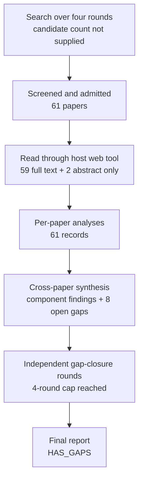

# Research Report: Evidence-Gap-Driven Context Retrieval and Completion for Workplace Communication

## Contents

- [Round History](#round-history)
- [Executive Summary](#executive-summary)
- [Research Question](#research-question)
- [Methodology](#methodology)
- [Papers Reviewed](#papers-reviewed)
- [Research Landscape](#research-landscape)
- [Confidence-Graded Findings](#confidence-graded-findings)
- [Research Gaps](#research-gaps)
- [Practical Recommendations](#practical-recommendations)
- [Evidence Map](#evidence-map)
- [References](#references)
- [Appendix: Run Metadata](#appendix-run-metadata)

## Round History

Iterative gap-closure loop (hard cap: 4 rounds). See `references/iterative-synthesis.md` for the full loop definition.

| Round | Run ID | Topic / Gap Focus | New Papers | Gaps Addressed | Remaining Gaps |
|-------|--------|-------------------|------------|----------------|----------------|
| 1 | 9af0d6417416 | evidence-gap-driven context retrieval and completion for workplace communication: turning an explicit evidence gap into bounded retrieval, deciding what to fetch next, and knowing when to stop, while preserving permissions, versions, temporal validity, cost and uncertainty | 17 | initial shortlist | 4 academic, 4 engineering |
| 2 | 162dd36d17eb | Integrated adaptive retrieval controllers with structured evidence gaps, temporal and version-aware provenance, permission-aware access, and calibrated bounded-risk stopping | 17 | 0 resolved | 4 academic, 4 engineering |
| 3 | 1f23ec07113d | Joint adaptive RAG controllers for structured evidence-gap completion with temporal and version-aware provenance and calibrated risk-controlled stopping under distribution shift | 11 | 0 resolved | 4 academic, 4 engineering |
| 4 | 1d3def4db417 | Unified iterative RAG stopping and provenance control under distribution shift: search specifically for controllers that combine structured evidence sufficiency with temporal/version-aware provenance and calibrated or conformal risk-controlled stopping, including any systems that additionally integrate permission-aware access or bounded retrieval budgets. | 16 | academic gaps of the previous round | 4 academic, 4 engineering |

**Stop reason**: 4-round cap reached

## Executive Summary

This review investigated how an explicit missing-information requirement can drive bounded, iterative evidence retrieval, with particular attention to evidence sufficiency, query planning, responsible stopping, temporal and version validity, permissions, cost, and uncertainty. The final corpus contains 61 papers accessed across 11 host domains and spanning 1994–2026. [HIGH] The strongest finding is that structured evidence-gap or sufficiency representations can successfully control iterative retrieval on multi-hop QA benchmarks, while adaptive retrieval evidence consistently shows that retrieving more material is not monotonically beneficial [2604.23783] [2510.22344] [2605.05245] [2607.06507] [2608.02195] [2305.06983] [2403.10081]. [LOW] The most significant unresolved issue is system-level integration: no admitted paper validates one controller that simultaneously handles structured evidence gaps, permission-aware access, temporal/version provenance, distribution-shift-aware calibrated stopping, abstention, and total-cost budgeting.

**Scope**: 61 papers analyzed from 11 host domains over 1994–2026  
**Overall Confidence**: Medium  
**Verdict**: HAS_GAPS

The literature is sufficiently mature to justify an engineering architecture assembled from separately validated components, but not to claim that such an integrated controller has itself been empirically validated. Transfer to Outlook email, Teams messages, workplace attachments, and cross-thread work-item investigation is especially uncertain because most controller studies use open-domain or multi-hop QA rather than workplace communication.

## Research Question

The review asked:

> How should a workplace communication system turn an explicit evidence gap into a bounded evidence-acquisition process, select what to retrieve next, preserve permissions and temporal/version provenance, distinguish retrieval failure from negative evidence, and stop when the gap has been answered or can no longer responsibly be pursued?

The in-scope research object was an iterative loop of the form:

$current\ state \rightarrow explicit\ gap \rightarrow bounded\ retrieval \rightarrow source\text{-}mapped\ evidence \rightarrow reassessment \rightarrow stop/retry$

A useful state abstraction for the target system is:

$S_t=(G_t,E_t,A_t,V_t,T_t,B_t)$

where $G_t$ is the set of unresolved evidence requirements, $E_t$ the confirmed evidence, $A_t$ the authorization state, $V_t$ the version/provenance state, $T_t$ the temporal-validity state, and $B_t$ the remaining retrieval budget.

The review explicitly distinguished:

- retrieval need from a vague desire for more context;
- query rewriting from the decision that retrieval is warranted;
- retrieval success from evidence sufficiency;
- empty retrieval from valid negative evidence;
- latest evidence from temporally valid evidence;
- confidence from evidence sufficiency;
- a hard budget limit from successful resolution;
- attachment retrieval from the downstream document-understanding problem.

Generic vector search without an explicit evidence need, unrestricted autonomous browsing, generic factuality evaluation, and attachment parsing by itself were outside the core research question.

## Methodology

### Search Strategy

- **Sources**: arXiv, ACL Anthology, PMLR, Nature, ResearchGate, AAAI, TechScience, and author/university-hosted full-text sources supplied by the research pipeline.
- **Query variants**:
  - `unified iterative rag provenance under distribution shift: search specifically controllers combine structured evidence sufficiency temporal/version-aware calibrated conformal risk-controlled stopping, including any systems additionally integrate permission-aware access bounded retrieval budgets.`
  - `unified iterative rag`
  - `unified provenance under distribution shift: search specifically controllers combine structured evidence sufficiency temporal/version-aware calibrated conformal risk-controlled stopping, including any systems additionally integrate permission-aware access bounded retrieval budgets.`
  - `iterative provenance under distribution shift: search specifically controllers combine structured evidence sufficiency temporal/version-aware calibrated conformal risk-controlled stopping, including any systems additionally integrate permission-aware access bounded retrieval budgets.`
  - `rag provenance under distribution shift: search specifically controllers combine structured evidence sufficiency temporal/version-aware calibrated conformal risk-controlled stopping, including any systems additionally integrate permission-aware access bounded retrieval budgets.`
  - `unified iterative rag provenance under`
  - `unified iterative rag distribution shift:`
  - `unified iterative rag search specifically`
- **Time window**: 1994–2026.
- **Screening**: exact candidate-ranking and screening implementation was not supplied in the final run metadata; no unsupported screening method is inferred here.
- **Admission emphasis**: iterative/adaptive retrieval, explicit evidence sufficiency or gap representation, stopping, answerability/abstention, temporal or version-aware retrieval, provenance, authorization, bounded cost, and calibration under shift.
- **Evidence discipline**: inherited Topic 03/04/05/06/08 handoffs were treated as project context, not as evidence for findings or gap closure.

The per-paper reading stage accessed the papers through the host's web tool. The recorded access level was **full_text for 59 papers** and **abstract_only for 2 papers**. This final reporting stage uses the supplied per-paper analyses and accepted cross-paper synthesis rather than independently re-reading every source.

### Pipeline Summary

| Metric | Count |
|--------|-------|
| Total candidates | unknown |
| After screening | 61 admitted papers |
| Downloaded | not applicable as a required count; papers were read through the host web tool |
| Successfully converted | unknown / not required for all web-accessed sources |
| Deeply analyzed | 61 |
| Iterations | 4 |

Recorded access levels:

| Paper | Access level |
|---|---|
| 1904.06019 | full_text |
| 2006.09462 | full_text |
| 2010.11915 | full_text |
| 2105.04166 | full_text |
| 2112.08558 | full_text |
| 2208.02814 | full_text |
| 2208.08401 | full_text |
| 2210.03350 | full_text |
| 2212.10509 | full_text |
| 2305.06983 | full_text |
| 2307.04642 | full_text |
| 2310.11511 | full_text |
| 2402.03181 | full_text |
| 2403.10081 | full_text |
| 2406.10490 | full_text |
| 2406.19215 | full_text |
| 2411.06037 | full_text |
| 2412.15540 | full_text |
| 2505.02811 | full_text |
| 2506.05167 | full_text |
| 2506.20978 | full_text |
| 2508.01084 | full_text |
| 2510.08109 | full_text |
| 2510.13590 | full_text |
| 2510.14337 | full_text |
| 2510.22344 | full_text |
| 2601.19827 | full_text |
| 2603.28444 | full_text |
| 2604.01413 | full_text |
| 2604.19899 | full_text |
| 2604.23783 | full_text |
| 2604.25676 | full_text |
| 2605.03534 | full_text |
| 2605.05245 | full_text |
| 2606.05658 | full_text |
| 2606.13814 | full_text |
| 2606.15964 | full_text |
| 2606.29054 | full_text |
| 2606.29090 | full_text |
| 2606.29959 | full_text |
| 2607.06507 | full_text |
| 2607.24010 | full_text |
| 2607.27726 | full_text |
| 2608.02195 | full_text |
| 2608.08512 | full_text |
| 2608.13237 | full_text |
| 2609.08364 | full_text |
| 2609.11572 | full_text |
| 2609.16301 | full_text |
| doi-10-1016-0306-4379-96-00017-8 | full_text |
| doi-10-1038-s41598-026-71936-x | abstract_only |
| doi-10-1109-access-2025-3628960 | full_text |
| doi-10-1145-1247715-1247720 | full_text |
| doi-10-1145-1571941-1572085 | full_text |
| doi-10-1145-181550-181560 | full_text |
| doi-10-1145-3786625 | full_text |
| doi-10-1609-aaai-v39i14-33670 | full_text |
| doi-10-18653-v1-2026-acl-long-1562 | full_text |
| doi-10-18653-v1-2026-findings-acl-2090 | full_text |
| doi-10-32604-cmc-2026-086343 | full_text |
| manual-2bb76a9136 | abstract_only |

## Papers Reviewed

Quality scores were not supplied by the pipeline and are therefore marked `unknown`. Relevance denotes relevance to this Topic's research question, not methodological quality.

| # | Title | Authors | Year | Venue | Quality Score | Relevance |
|---|-------|---------|------|-------|--------------|-----------|
| 1 | MEGRAG: Multi-Granular Evidence Graphs for Answer-Aware Multi-Hop RAG [2608.02195] | Weidong Bao, Yingying Sun, Jun Yang et al. | 2026 | unknown | unknown | HIGH |
| 2 | DynaKRAG: A Unified Framework for Learnable Evidence Control in Multi-Hop Retrieval-Augmented Generation [2607.06507] | Yaqi Wu, Xiaolei Guo, Chenyu Zhou et al. | 2026 | unknown | unknown | HIGH |
| 3 | IDCR: Information-Directed Conformal Retrieval [manual-2bb76a9136] | Manas Nanivadekar, Jatin Khanijoan, Swayam Kothekar et al. | 2026 | unknown | unknown | HIGH |
| 4 | FAIR-RAG: Faithful Adaptive Iterative Refinement for Retrieval-Augmented Generation [2510.22344] | Mohammad Aghajani Asl, Majid Asgari-Bidhendi, Behrooz Minaei-Bidgoli | 2025 | unknown | unknown | HIGH |
| 5 | Knowing You Don't Know: Learning When to Continue Search in Multi-round RAG through Self-Practicing [2505.02811] | Diji Yang, Linda Zeng, Jinmeng Rao et al. | 2025 | unknown | unknown | HIGH |
| 6 | TRAQ: Trustworthy Retrieval Augmented Question Answering via Conformal Prediction [2307.04642] | Shuo Li, Sangdon Park, Insup Lee et al. | 2024 | unknown | unknown | HIGH |
| 7 | ECoRAG: Evidentiality-guided Compression for Long Context RAG [2506.05167] | Yeonseok Jeong, Jinsu Kim, Dohyeon Lee et al. | 2025 | unknown | unknown | MEDIUM |
| 8 | SentryLine: Evidence-Grounded Question Answering over Evolving Documents in Oncology Care [2609.08364] | Tampu Ravi Kumar, Gaurav Najpande, Muhammad Ali Khan et al. | 2026 | unknown | unknown | HIGH |
| 9 | Response Quality Assessment for Retrieval-Augmented Generation via Conditional Conformal Factuality [2506.20978] | Naihe Feng, Yi Sui, Shiyi Hou et al. | 2025 | unknown | unknown | HIGH |
| 10 | C-RAG: Certified Generation Risks for Retrieval-Augmented Language Models [2402.03181] | Mintong Kang, Nezihe Merve Gürel, Ning Yu et al. | 2024 | unknown | unknown | HIGH |
| 11 | Selective Question Answering under Domain Shift [2006.09462] | Amita Kamath, Robin Jia, Percy Liang | 2020 | unknown | unknown | MEDIUM |
| 12 | A Reproducibility Study of Metacognitive Retrieval-Augmented Generation [2604.19899] | Gabriel Iturra-Bocaz, Petra Galuščáková | 2026 | unknown | unknown | MEDIUM |
| 13 | AdaGATE: Adaptive Gap-Aware Token-Efficient Evidence Assembly for Multi-Hop Retrieval-Augmented Generation [2605.05245] | Yilin Guo, Yinshan Wang, Yixuan Wang | 2026 | unknown | unknown | HIGH |
| 14 | Conformal Inference for Online Prediction with Arbitrary Distribution Shifts [2208.08401] | Isaac Gibbs, Emmanuel J. Candès | 2024 | unknown | unknown | MEDIUM |
| 15 | Time Present and Time Past: Benchmarking Large Language Models on Temporally Evolving Document Understanding [2608.08512] | Mahbub E Sobhani, Md. Faiyaz Abdullah Sayeedi, Fahmid Hasan Chowdhury et al. | 2026 | unknown | unknown | HIGH |
| 16 | Semantics of time-varying information [doi-10-1016-0306-4379-96-00017-8] | Christian S. Jensen, Richard T. Snodgrass | 1996 | unknown | unknown | MEDIUM |
| 17 | Few-Shot Conversational Dense Retrieval [2105.04166] | Shi Yu, Zhenghao Liu, Chenyan Xiong et al. | 2021 | unknown | unknown | MEDIUM |
| 18 | SeaKR: Self-aware Knowledge Retrieval for Adaptive Retrieval Augmented Generation [2406.19215] | Zijun Yao, Weijian Qi, Liangming Pan et al. | 2025 | unknown | unknown | HIGH |
| 19 | S2G-RAG: Structured Sufficiency and Gap Judging for Iterative Retrieval-Augmented QA [2604.23783] | Minghan Li, Junjie Zou, Xinxuan Lv et al. | 2026 | unknown | unknown | HIGH |
| 20 | Sufficient Context: A New Lens on Retrieval Augmented Generation Systems [2411.06037] | Hailey Joren, Jianyi Zhang, Chun-Sung Ferng et al. | 2025 | unknown | unknown | HIGH |
| 21 | Active Retrieval Augmented Generation [2305.06983] | Zhengbao Jiang, Frank F. Xu, Luyu Gao et al. | 2023 | unknown | unknown | HIGH |
| 22 | When Should Multi-Round RAG Stop? Structured Stopping Judgments and Retrieval Reduction in Search-R1 [2608.13237] | Weimeng Luo | 2026 | unknown | unknown | HIGH |
| 23 | Beyond Single-Shot: Multi-step Tool Retrieval via Query Planning [doi-10-18653-v1-2026-findings-acl-2090] | Wei Fang, James R. Glass | 2026 | unknown | unknown | HIGH |
| 24 | CORAL: Adaptive Retrieval Loop for Culturally-Aligned Multilingual RAG [2604.25676] | Nayeon Lee, Jiwoo Song, Byeongcheol Kang | 2026 | unknown | unknown | MEDIUM |
| 25 | Interleaving Retrieval with Chain-of-Thought Reasoning for Knowledge-Intensive Multi-Step Questions [2212.10509] | Harsh Trivedi, Niranjan Balasubramanian, Tushar Khot et al. | 2023 | unknown | unknown | HIGH |
| 26 | CONQRR: Conversational Query Rewriting for Retrieval with Reinforcement Learning [2112.08558] | Zeqiu Wu, Yi Luan, Hannah Rashkin et al. | 2022 | unknown | unknown | MEDIUM |
| 27 | Temporal profiles of queries [doi-10-1145-1247715-1247720] | Rosie Jones, Fernando Diaz | 2007 | unknown | unknown | MEDIUM |
| 28 | Improving search relevance for implicitly temporal queries [doi-10-1145-1571941-1572085] | Donald Metzler, Rosie Jones, Fuchun Peng et al. | 2009 | unknown | unknown | MEDIUM |
| 29 | DRAGIN: Dynamic Retrieval Augmented Generation based on the Information Needs of Large Language Models [2403.10081] | Weihang Su, Yichen Tang, Qingyao Ai et al. | 2024 | unknown | unknown | HIGH |
| 30 | AB-RAG: Adaptive Budgeted Retrieval-Augmented Generation for Reliable Question Answering [2606.29090] | Ansh Kamthan | 2026 | unknown | unknown | HIGH |
| 31 | Know Before You Fetch: Calibrated Retrieval-Budget Allocation for Retrieval-Augmented Generation [2606.29959] | Zhe Dong, Fang Qin, Manish Shah et al. | 2026 | unknown | unknown | HIGH |
| 32 | Measuring and Narrowing the Compositionality Gap in Language Models [2210.03350] | Ofir Press, Muru Zhang, Sewon Min et al. | 2023 | unknown | unknown | MEDIUM |
| 33 | Permission-Aware RAG: Identity and Access Management (IAM)-Based Access Filtering in Multi-Resource Environments [doi-10-1109-access-2025-3628960] | Jooyoung Jeong, Sang Goo Lee | 2025 | unknown | unknown | HIGH |
| 34 | TASR: Training-Free Adaptive Stopping for Iterative Retrieval [2606.13814] | Adrian Kieback, Uyiosa Philip Amadasun, Aman Chadha et al. | 2026 | unknown | unknown | HIGH |
| 35 | Stop-RAG: Value-Based Retrieval Control for Iterative RAG [2510.14337] | Jaewan Park, Solbee Cho, Jay-Yoon Lee | 2025 | unknown | unknown | HIGH |
| 36 | Active, anytime-valid risk controlling prediction sets [2406.10490] | Ziyu Xu, Nikos Karampatziakis, Paul Mineiro | 2024 | unknown | unknown | MEDIUM |
| 37 | CLEAR: Cross-Source Evidence Adjudication for Large Language Models in Medicine [2609.16301] | Shuai Wang, Yize Zhao, Qingyu Chen | 2026 | unknown | unknown | HIGH |
| 38 | SURE-RAG: Sufficiency and Uncertainty-Aware Evidence Verification for Selective Retrieval-Augmented Generation [2605.03534] | Jingxi Qiu, Zeyu Han, Cheng Huang | 2026 | unknown | unknown | HIGH |
| 39 | Privacy-provisioned-permission-aware RAG in cloud using identity and access management, trust and large-language models (PPPARITL) [doi-10-1038-s41598-026-71936-x] | Urvashi Rahul Saxena, Samar Shailendra, Rajan Kadel et al. | 2026 | unknown | unknown | HIGH |
| 40 | MRAG: A Modular Retrieval Framework for Time-Sensitive Question Answering [2412.15540] | Siyue Zhang, Yuxiang Xue, Yiming Zhang et al. | 2024 | unknown | unknown | HIGH |
| 41 | Challenges in Information-Seeking QA: Unanswerable Questions and Paragraph Retrieval [2010.11915] | Akari Asai, Eunsol Choi | 2021 | unknown | unknown | MEDIUM |
| 42 | VersionRAG: Version-Aware Retrieval-Augmented Generation for Evolving Documents [2510.08109] | Daniel Huwiler, Kurt Stockinger, Jonathan Fürst | 2025 | unknown | unknown | HIGH |
| 43 | When Should Active RAG Retrieve? A Budget-Aware Evaluation of Utility, Calibration, and Cost [2607.24010] | Pin Qian, Su Wang, Chong Peng et al. | 2026 | unknown | unknown | HIGH |
| 44 | A Consensus Glossary of Temporal Database Concepts [doi-10-1145-181550-181560] | Christian S. Jensen, James Clifford, Ramez Elmasri et al. | 1994 | unknown | unknown | MEDIUM |
| 45 | Conformal Risk Control [2208.02814] | Anastasios N. Angelopoulos, Stephen Bates, Adam Fisch et al. | 2022 | unknown | unknown | MEDIUM |
| 46 | Conformal Prediction Under Covariate Shift [1904.06019] | Ryan J. Tibshirani, Rina Foygel Barber, Emmanuel J. Candès et al. | 2019 | unknown | unknown | MEDIUM |
| 47 | HONEYBEE: Efficient Role-based Access Control for Vector Databases via Dynamic Partitioning [doi-10-1145-3786625] | Hongbin Zhong, Matthew Lentz, Nina Narodytska et al. | 2026 | unknown | unknown | HIGH |
| 48 | When Iterative RAG Beats Ideal Evidence: A Diagnostic Study in Scientific Multi-hop Question Answering [2601.19827] | Mahdi Astaraki, Mohammad Arshi Saloot, Ali Shiraee Kasmaee et al. | 2026 | unknown | unknown | HIGH |
| 49 | Self-RAG: Learning to Retrieve, Generate, and Critique through Self-Reflection [2310.11511] | Akari Asai, Zeqiu Wu, Yizhong Wang et al. | 2023 | unknown | unknown | HIGH |
| 50 | Provably Secure Retrieval-Augmented Generation [2508.01084] | Pengcheng Zhou, Yinglun Feng, Zhongliang Yang | 2025 | unknown | unknown | HIGH |
| 51 | Adaptive Stopping for Multi-Turn LLM Reasoning [2604.01413] | Xiaofan Zhou, Huy Nguyen, Bo Yu et al. | 2026 | unknown | unknown | HIGH |
| 52 | Agent-Orchestrated Adaptive RAG: A Comparative Study on Structured and Multi-Hop Retrieval [2606.05658] | Anuj Maharjan, Devinder Kaur, Richard Molyet | 2026 | unknown | unknown | MEDIUM |
| 53 | When Can Conformal Risk Control Certify LLM Outputs? Bounds, Impossibility, and Adaptation for Structured Generation [2606.29054] | Varun Kotte | 2026 | unknown | unknown | HIGH |
| 54 | Do LLMs Know When Evidence is Insufficient? An Evidence Sufficiency Benchmark for Answer-Abstention Calibration in Retrieval-Augmented Generation [doi-10-32604-cmc-2026-086343] | Hantian Zhang, Wentai Wu | 2026 | unknown | unknown | HIGH |
| 55 | RAG Meets Temporal Graphs: Time-Sensitive Modeling and Retrieval for Evolving Knowledge [2510.13590] | Jiale Han, Austin Cheung, Yubai Wei et al. | 2025 | unknown | unknown | HIGH |
| 56 | Entropic Claim Resolution: Uncertainty-Driven Evidence Selection for RAG [2603.28444] | Davide Di Gioia | 2026 | unknown | unknown | HIGH |
| 57 | RAG-on-a-Diet: A Reinforcement Learning-Based Dynamic Resource Optimization Framework for RAG [doi-10-18653-v1-2026-acl-long-1562] | Hongwen Ding, Yizheng Zhao | 2026 | unknown | unknown | HIGH |
| 58 | PromptShift-CRC: Drift-Aware Conformal Risk Control for Foundation Models Under Prompt and Domain Shift [2606.15964] | Jeffery Opoku, David Banahene | 2026 | unknown | unknown | HIGH |
| 59 | Baikal: Structured Search for Deep Research over Data Lakes [2607.27726] | Dhruv Agarwal, Rishitha Guttapalle Mohan, Aarti Kumari et al. | 2026 | unknown | unknown | MEDIUM |
| 60 | Temporal Conjunctive Query Answering via Rewriting [doi-10-1609-aaai-v39i14-33670] | Lukas Westhofen, Jean Christoph Jung, Daniel Neider | 2025 | unknown | unknown | MEDIUM |
| 61 | TimelyRAG: Semantic-Temporal Hybrid Retrieval for Time-Critical Question Answering in Overlapping-Evolving Documents [2609.11572] | Youngeun Nam, Joeun Kim, Hwanjun Song et al. | 2026 | unknown | unknown | HIGH |

## Research Landscape

### Theme 1: Structured Evidence Sufficiency, Explicit Gaps, and Next-Query Generation

**Coverage**: 8+ directly relevant papers | **Confidence**: High  
**Supporting papers**: [2604.23783], [2510.22344], [2605.05245], [2607.06507], [2608.02195], [doi-10-18653-v1-2026-findings-acl-2090], [2212.10509], [2505.02811]

[HIGH] Several recent multi-hop RAG systems move beyond undifferentiated "retrieve more" behavior by representing missing evidence, sufficiency, subquestions, or evidence states and using those representations to decide the next retrieval action [2604.23783] [2510.22344] [2605.05245] [2607.06507] [2608.02195]. Query-planning and interleaved reasoning work further supports decomposition of complex information needs into staged retrieval operations [doi-10-18653-v1-2026-findings-acl-2090] [2212.10509].

Key findings:

1. [HIGH] S2G-RAG, FAIR-RAG, AdaGATE, DynaKRAG, and MEGRAG report improvements in evidence or answer metrics relative to their evaluated baselines while retaining explicit stopping logic or hard search bounds [2604.23783] [2510.22344] [2605.05245] [2607.06507] [2608.02195].
2. [HIGH] Explicit evidence state is a more appropriate control variable for the Topic 07 problem than generic confidence alone because it can identify *what remains missing*, not only whether the model feels uncertain [2604.23783] [2411.06037] [2605.03534].
3. [MEDIUM] The evidence supports transfer of structured-gap concepts to workplace investigations, but not their production accuracy on email or Teams data because the direct evaluations are mostly QA benchmarks.

### Theme 2: Adaptive Retrieval and Responsible Stopping

**Coverage**: 14+ papers | **Confidence**: High  
**Supporting papers**: [2305.06983], [2403.10081], [2406.19215], [2505.02811], [2510.14337], [2606.13814], [2608.13237], [2606.29090], [2606.29959], [2607.24010], [2310.11511], [2601.19827]

[HIGH] Adaptive-RAG research consistently undermines the assumption that more retrieval is automatically better. Retrieval can help when evidence is missing, but irrelevant, redundant, mistimed, or low-utility retrieval can increase cost and sometimes lower answer quality [2305.06983] [2403.10081] [2406.19215] [2607.24010].

Key findings:

1. [HIGH] Retrieval should be conditional on unresolved information need rather than performed uniformly [2305.06983] [2403.10081] [2406.19215].
2. [HIGH] Adaptive stopping can materially reduce calls, turns, tokens, or modeled cost across multiple benchmark settings [2606.13814] [2608.13237] [2606.29090] [2606.29959] [doi-10-18653-v1-2026-acl-long-1562].
3. [HIGH] Stopping mistakes remain consequential: the Search-R1 stopping analysis classified 27 of 69 executed confirmatory early stops as unsafe under its probe-based criterion [2608.13237].
4. [MEDIUM] A hard retrieval cap remains valuable even with a learned stopping policy because empirical stopping is imperfect and resource policies can fail to transfer cleanly across inputs [2608.13237] [2606.29959].

### Theme 3: Calibration, Selective Prediction, and Distribution Shift

**Coverage**: 12+ papers | **Confidence**: High  
**Supporting papers**: [1904.06019], [2006.09462], [2208.02814], [2208.08401], [2307.04642], [2402.03181], [2406.10490], [2506.20978], [2604.01413], [2606.15964], [2606.29054], [manual-2bb76a9136]

[HIGH] Conformal prediction, conformal risk control, selective QA, and related approaches provide statistically motivated ways to control coverage or risk under stated assumptions, while newer work addresses various kinds of non-stationarity [1904.06019] [2208.02814] [2208.08401] [2307.04642] [2402.03181] [2406.10490].

Key findings:

1. [HIGH] Static confidence or calibration is vulnerable to domain and covariate shift [2006.09462] [1904.06019].
2. [HIGH] Online, anytime-valid, prompt-shift, domain-shift, and other adaptive risk-control methods demonstrate mechanisms for recalibration under changing conditions [2208.08401] [2406.10490] [2606.15964] [2606.29054].
3. [HIGH] These guarantees do not automatically become guarantees for an iterative RAG stopping loop; the papers make different assumptions and certify different outputs or risks [2307.04642] [2402.03181] [2604.01413] [2606.29054].
4. [LOW] No admitted evidence supports treating a single fixed sufficiency threshold learned on an in-distribution development set as a generally reliable workplace stopping rule under evolving communication patterns.

### Theme 4: Temporal Validity, Evolving Documents, Version Lineage, and Provenance

**Coverage**: 12+ papers | **Confidence**: High  
**Supporting papers**: [doi-10-1016-0306-4379-96-00017-8], [doi-10-1145-181550-181560], [doi-10-1145-1247715-1247720], [doi-10-1145-1571941-1572085], [2412.15540], [2510.08109], [2510.13590], [2608.08512], [2609.08364], [2609.11572]

[HIGH] Temporal and version-aware retrieval is a separate problem from semantic relevance. A passage can match the question semantically and still be invalid because it reflects the wrong effective time, superseded document state, or incomplete version history [2412.15540] [2510.08109] [2510.13590] [2608.08512] [2609.11572].

Key findings:

1. [HIGH] Temporal database literature distinguishes real-world validity time from database-record or transaction time, establishing that "when the fact is true" and "when the system learned/stored it" are different dimensions [doi-10-1016-0306-4379-96-00017-8] [doi-10-1145-181550-181560].
2. [HIGH] Version-aware and evolving-document systems explicitly model document revisions, update status, superseding passages, or temporally conditioned retrieval [2510.08109] [2609.08364] [2609.11572].
3. [HIGH] Temporal/version-aware retrieval improves evidence selection in the evaluated evolving-document and time-sensitive benchmarks compared with purely semantic approaches [2412.15540] [2510.08109] [2510.13590] [2609.11572].
4. [LOW] The corpus does not establish a common provenance representation that unifies document identity, version identity, effective time, collection time, and structured gap satisfaction through every retrieval round.

### Theme 5: Permission-Aware Retrieval

**Coverage**: 4 directly relevant papers | **Confidence**: High for access-control mechanisms, Medium for transfer to iterative investigation  
**Supporting papers**: [doi-10-1109-access-2025-3628960], [doi-10-1038-s41598-026-71936-x], [2508.01084], [doi-10-1145-3786625]

[HIGH] Permission-aware RAG and secure vector-retrieval work demonstrates that access constraints can be applied before unauthorized evidence reaches the reasoning context, including IAM-based authorization, role-based filtering, user isolation, and secure retrieval mechanisms [doi-10-1109-access-2025-3628960] [2508.01084] [doi-10-1145-3786625].

Key findings:

1. [HIGH] Access control must be part of retrieval semantics rather than an after-the-fact presentation filter if unauthorized evidence must not influence reasoning [doi-10-1109-access-2025-3628960] [2508.01084].
2. [MEDIUM] Permission-aware indexing and candidate filtering have measurable resource and retrieval trade-offs [doi-10-1145-3786625].
3. [LOW] No admitted paper validates the specific Topic 07 loop of authorization filtering, sufficiency reassessment, then bounded authorized-evidence replenishment when filtered evidence remains incomplete.

### Theme 6: Budgeted Retrieval and Multidimensional Cost

**Coverage**: 8+ papers | **Confidence**: High  
**Supporting papers**: [2606.29090], [2606.29959], [2607.24010], [2606.05658], [doi-10-18653-v1-2026-acl-long-1562], [2403.10081], [doi-10-1145-3786625]

[HIGH] Retrieval cost is multidimensional rather than reducible to one count. Papers separately optimize or report retrieval calls, retrieved tokens or passages, planner or critic computation, model inference, wall-clock latency, indexing overhead, or authorization-related cost [2606.29959] [2607.24010] [2606.05658] [doi-10-1145-3786625].

Key findings:

1. [HIGH] Budget-aware policies can reduce resource usage while maintaining competitive task performance in their evaluated settings [2606.29090] [2606.29959] [doi-10-18653-v1-2026-acl-long-1562].
2. [HIGH] Optimizing one resource measure does not guarantee improvement on another; fewer retrieval calls can still entail expensive judging, planning, or longer contexts [2606.29959] [2607.24010] [2606.05658].
3. [HIGH] A calibrated retrieval-use threshold does not necessarily make its nominal aggregate budget transfer exactly to held-out inputs [2606.29959].
4. [MEDIUM] Topic 07 therefore needs both adaptive stopping and a deterministic hard budget rather than assuming either mechanism subsumes the other.

### Theme 7: Sufficiency, Confidence, Retrieval Coverage, and Reasoning Quality Are Distinct

**Coverage**: 8+ papers | **Confidence**: High  
**Supporting papers**: [2411.06037], [2605.03534], [2604.19899], [doi-10-32604-cmc-2026-086343], [2601.19827], [2603.28444]

[HIGH] Evidence sufficiency is not equivalent to answer confidence. Models can answer confidently with insufficient context, and sufficiency-aware methods can improve selective behavior, yet judges can disagree on whether the same evidence is sufficient [2411.06037] [2605.03534] [2604.19899] [doi-10-32604-cmc-2026-086343].

Key findings:

1. [HIGH] A retrieval controller should not infer "gap resolved" from answer confidence alone [2411.06037] [doi-10-32604-cmc-2026-086343].
2. [HIGH] Retrieval quality, evidence sufficiency, and downstream answer/reasoning quality should be evaluated separately [2601.19827] [2605.03534].
3. [MEDIUM] Independent sufficiency, retrieval-policy, and answer-confidence modules are more auditable for msgloom than a single opaque scalar because disagreements can be recorded rather than hidden.

## Methodology Comparison

| Approach | Papers | Strengths | Weaknesses | Best For | Performance |
|----------|--------|-----------|------------|----------|-------------|
| Structured gap / sufficiency control | [2604.23783], [2510.22344], [2605.05245], [2607.06507], [2608.02195] | Represents what remains missing; supports directed next retrieval and explicit stopping | Mostly evaluated on QA; limited temporal/version/permission integration | Explicit evidence-gap investigation | Improvements over evaluated baselines reported; metrics are not directly comparable across papers |
| Active/adaptive retrieval | [2305.06983], [2403.10081], [2406.19215], [2310.11511] | Avoids unconditional retrieval; reacts to model/evidence state | Trigger errors and low-utility retrieval remain possible | Deciding whether another retrieval round is warranted | Multiple studies report quality/resource advantages over fixed retrieval policies |
| Learned/value-based stopping | [2505.02811], [2510.14337], [2606.13814], [2608.13237] | Can reduce unnecessary rounds | Stopping errors can prematurely terminate evidence acquisition | Multi-round search control | Retrieval reductions reported; [2608.13237] found 27/69 executed confirmatory early stops unsafe under its criterion |
| Budget-aware control | [2606.29090], [2606.29959], [2607.24010], [doi-10-18653-v1-2026-acl-long-1562] | Explicit quality-cost trade-off | Cost definitions vary; nominal budget calibration may not transfer | Hard/soft resource management | Reductions in retrieval/tokens/modeled cost reported in evaluated settings |
| Conformal/selective risk control | [1904.06019], [2208.02814], [2208.08401], [2307.04642], [2402.03181], [2406.10490], [2606.15964], [2606.29054] | Principled risk/coverage control under stated assumptions | Assumptions and certified quantities differ; not directly an evidence-gap controller | Abstention, calibration, shift robustness | Finite-sample, expected-risk, empirical, or adaptive guarantees depending on formulation |
| Temporal/version-aware retrieval | [2412.15540], [2510.08109], [2510.13590], [2609.08364], [2609.11572] | Prevents semantically relevant but temporally invalid evidence from being treated as current | Not integrated with calibrated iterative stopping and permissions | Evolving documents and historical-state questions | Improved temporal/version-sensitive evidence selection in evaluated benchmarks |
| Permission-aware retrieval | [doi-10-1109-access-2025-3628960], [2508.01084], [doi-10-1145-3786625] | Keeps unauthorized candidates out of reasoning context | No demonstrated structured-gap replenishment loop | Enterprise/workplace source access | Access enforcement demonstrated; full iterative sufficiency interaction unevaluated |
| Conversational/query reformulation | [2105.04166], [2112.08558], [doi-10-18653-v1-2026-findings-acl-2090] | Converts contextual or multi-step needs into retrievable requests | Does not itself decide whether retrieval is warranted or when enough evidence exists | Formulating bounded searches after a gap is identified | Retrieval improvements reported in their respective tasks |

## Confidence-Graded Findings

### 🟢 High Confidence (supported by 3+ papers with consistent results)

1. **[HIGH] Explicit evidence-gap and sufficiency representations can drive iterative retrieval and next-query selection.** Supported by [2604.23783], [2510.22344], [2605.05245], [2607.06507], and [2608.02195]. These studies report improvements in evidence or answer metrics against their evaluated baselines while maintaining explicit or bounded retrieval control.

2. **[HIGH] Additional retrieval is not monotonically beneficial.** Supported by [2305.06983], [2403.10081], [2406.19215], [2607.24010], and [2609.16301]. Retrieval benefit varies by query and evidence state; irrelevant or unnecessary retrieval can add cost and reduce quality.

3. **[HIGH] Adaptive stopping can reduce retrieval work, but stopping errors remain material.** Supported by [2606.13814], [2608.13237], [2606.29090], [2606.29959], and [doi-10-18653-v1-2026-acl-long-1562]. In [2608.13237], 27 of 69 executed confirmatory early stops were unsafe under that study's probe-based criterion.

4. **[HIGH] Static calibration degrades under important forms of distribution shift.** Supported by [2006.09462], [1904.06019], [2606.15964], and [2606.29054].

5. **[HIGH] Conformal/risk-control methods can control coverage or risk under their stated assumptions, including several shift-adaptive formulations.** Supported by [1904.06019], [2208.02814], [2208.08401], [2307.04642], [2402.03181], [2406.10490], [2604.01413], [2606.15964], and [2606.29054].

6. **[HIGH] Temporal and version-aware retrieval can outperform purely semantic retrieval on evolving/time-sensitive evidence tasks.** Supported by [2412.15540], [2510.08109], [2510.13590], [2608.08512], [2609.08364], and [2609.11572].

7. **[HIGH] Temporal provenance requires more than one clock.** Temporal-database work distinguishes validity/effective time from record/transaction time, while newer retrieval systems add version transitions and supersession state [doi-10-1016-0306-4379-96-00017-8] [doi-10-1145-181550-181560] [2510.08109] [2609.08364].

8. **[HIGH] Permission-aware retrieval mechanisms can enforce access restrictions before evidence reaches downstream reasoning.** Supported by [doi-10-1109-access-2025-3628960], [2508.01084], and [doi-10-1145-3786625], with additional permission-aware evidence from [doi-10-1038-s41598-026-71936-x].

9. **[HIGH] Evidence sufficiency and answer confidence are empirically distinct.** Supported by [2411.06037], [2605.03534], [2604.19899], and [doi-10-32604-cmc-2026-086343].

10. **[HIGH] Retrieval cost must be measured across multiple resource dimensions.** Supported by [2606.29959], [2607.24010], [2606.05658], [2403.10081], and [doi-10-1145-3786625].

### 🟡 Medium Confidence (supported by 1-2 papers or with caveats)

1. **[MEDIUM] A structured investigation state with required findings, confirmed findings, unresolved gaps, and supporting evidence IDs is a strong architecture pattern for msgloom.** The recommendation is synthesized from structured-gap controllers [2604.23783] [2605.05245] and provenance/version work [2510.08109] rather than directly validated on workplace communication.

2. **[MEDIUM] Hard budgets and adaptive stopping should coexist.** Adaptive stopping reduces unnecessary work, but its errors and transfer limitations mean a deterministic cap remains useful as a safety and cost boundary [2608.13237] [2606.29959].

3. **[MEDIUM] Evidence sufficiency, retrieval policy, and answer confidence should be separately inspectable control signals.** The distinction is empirically supported [2411.06037] [2605.03534], but the exact modular architecture has not been evaluated as a workplace system.

4. **[MEDIUM] A permission-filtered result set should be followed by explicit sufficiency reassessment rather than being treated automatically as complete.** Permission enforcement is supported [doi-10-1109-access-2025-3628960] [doi-10-1145-3786625], but the replenishment loop itself remains untested.

### 🔴 Low Confidence (preliminary, single-source, or contradicted)

1. **[LOW] A single unified controller can be assumed to retain the benefits of structured gaps, temporal/version provenance, permissions, calibration, abstention, and cost control when those components are composed.** The corpus provides no direct validation of this assumption; evidence exists only for separate components or smaller combinations [2607.06507] [2510.08109] [doi-10-1109-access-2025-3628960] [2604.01413].

2. **[LOW] Results from multi-hop QA directly predict production behavior on Outlook email, Teams messages, workplace attachments, and long-lived work Topics.** No admitted paper validates that transfer.

3. **[LOW] One static stopping threshold will remain reliable as document distributions, user behavior, source availability, or workplace vocabulary drift.** Shift studies provide evidence against relying on unadapted confidence/calibration [2006.09462] [1904.06019] [2606.15964].

## Trade-Off Analysis

| Decision | Option A | Option B | Recommendation |
|----------|----------|----------|----------------|
| Retrieval trigger | Retrieve routinely or at every reasoning step | Retrieve only when an explicit unresolved evidence need exists | [HIGH] Prefer explicit-gap-triggered retrieval; unnecessary retrieval can add cost and harm quality [2305.06983] [2403.10081] [2607.24010] |
| Stopping control | Learned/adaptive stopping only | Adaptive stopping plus deterministic hard limits | [MEDIUM] Use both: adaptive stopping reduces waste, hard bounds protect against controller failure and runaway cost [2608.13237] [2606.29959] |
| Sufficiency signal | Answer confidence alone | Separate evidence-sufficiency judgment | [HIGH] Keep separate; confidence and sufficiency are empirically distinct [2411.06037] [2605.03534] |
| Temporal retrieval | Latest or highest semantic similarity | Query-conditioned effective time/version lineage | [HIGH] Preserve validity time and version identity because latest/semantic-best can be historically wrong [2510.08109] [2609.11572] |
| Permission enforcement | Filter evidence after generation | Filter before evidence enters reasoning | [HIGH] Enforce authorization upstream of reasoning [doi-10-1109-access-2025-3628960] [2508.01084] |
| Empty retrieval | Treat as evidence of absence | Represent as a retrieval outcome requiring semantic interpretation | [MEDIUM] Treat as unresolved unless source/query semantics make absence evidential; the full taxonomy remains an engineering gap |
| Cost objective | Optimize retrieval-call count only | Track calls, passages, tokens, inference, authorization, reranking, latency | [HIGH] Use multidimensional cost accounting [2606.29959] [2607.24010] [2606.05658] |
| Calibration | Fixed development-set threshold | Shift monitoring and recalibration/adaptive risk control | [HIGH] Test and recalibrate under controlled shift [1904.06019] [2208.08401] [2606.15964] |
| Provenance storage | Keep only final answer citations | Preserve evidence IDs, versions, times, and round history | [MEDIUM] Preserve lineage throughout the loop; version/temporal studies show why later evidence must not silently replace earlier state [2510.08109] [2609.08364] |

## Points of Agreement **[EVIDENCE REQUIRED]**

1. **[HIGH] Retrieval should be selective rather than unconditional.** Active and adaptive retrieval studies agree that retrieval benefit is heterogeneous and that unnecessary retrieval can be wasteful or harmful [2305.06983] [2403.10081] [2406.19215] [2607.24010].

2. **[HIGH] Stopping is an explicit control problem rather than an incidental by-product of generation.** Multiple systems learn or calculate when to continue or stop [2505.02811] [2510.14337] [2606.13814] [2608.13237] [2606.29090].

3. **[HIGH] Evidence sufficiency is not interchangeable with model confidence.** Independent studies of sufficient context, sufficiency-aware verification, and abstention calibration converge on this distinction [2411.06037] [2605.03534] [doi-10-32604-cmc-2026-086343].

4. **[HIGH] Temporal semantics matter for retrieval over evolving information.** Classic temporal data models distinguish valid and transaction time, while recent systems show retrieval benefits from explicit temporal/version modeling [doi-10-1016-0306-4379-96-00017-8] [doi-10-1145-181550-181560] [2510.08109] [2609.11572].

5. **[HIGH] Calibration assumptions matter under distribution shift.** Selective QA and conformal work show that static calibration can fail under unseen domains or changed distributions and that adaptation is needed for some shift regimes [2006.09462] [1904.06019] [2208.08401] [2606.15964].

6. **[HIGH] Enterprise retrieval must respect authorization before downstream use of retrieved evidence.** Permission-aware RAG and secure retrieval systems implement access gating at retrieval/indexing layers [doi-10-1109-access-2025-3628960] [2508.01084] [doi-10-1145-3786625].

7. **[HIGH] Resource optimization cannot be evaluated using only answer quality.** Budget-aware RAG papers jointly consider retrieval or computation costs and task quality [2606.29090] [2606.29959] [2607.24010] [doi-10-18653-v1-2026-acl-long-1562].

## Points of Contradiction **[EVIDENCE REQUIRED]**

1. **[LOW] Stop-RAG's broad consistency claim versus its reported benchmark table**: [2510.14337] presents broad claims of consistent outperformance, but the supplied analysis identified a CoRAG HotpotQA result where Stop-RAG is slightly below the unmodified CoRAG baseline and does not dominate LLM-Stop.
   - **Possible explanation**: "consistent" may have been used at an aggregate or qualitative level rather than to mean every reported configuration.
   - **Implication**: value-based stopping should be evaluated on the exact workload rather than treated as universally dominant.

2. **[LOW] MiCP prediction-set-size consistency versus reported rows**: [2604.01413] states consistent prediction-set-size improvement, while the supplied analysis identified several Table 1 rows, including GPT-4o-mini settings on HotpotQA and HotpotQA-ReAct, where the proposed objective gives larger sets.
   - **Possible explanation**: aggregate or average improvement does not imply per-condition dominance.
   - **Implication**: calibration/stopping methods should be inspected across conditions rather than selected from summary claims alone.

No strong cross-paper contradiction was established for the main Topic 07 conclusions. Many apparent differences across retrieval, decomposition, reranking, calibration, and stopping methods arise from different datasets, risk definitions, controller boundaries, and metrics and therefore are not treated as direct contradictions.

## Research Gaps

All eight gaps remain open. The literature has **not** answered any of them yet. The four-round cap is an operational stop condition for this review, not evidence that the gaps are resolved.

| # | Gap | Type | Severity | Rounds already searched | Impact on Goals |
|---|-----|------|----------|-------------------------|----------------|
| 1 | Structured gap representations are not jointly validated for temporal constraints, multi-entity joins, and complex compositional evidence requirements | [ACADEMIC] | HIGH | 1, 2, 3, 4 | The controller may formulate incomplete or wrong evidence needs for real workplace investigations |
| 2 | No iterative evidence-gap loop jointly preserves document-version lineage, effective/freshness validity, and structured sufficiency decisions | [ACADEMIC] | HIGH | 1, 2, 3, 4 | A semantically relevant retrieval may satisfy the wrong document state or time |
| 3 | No general bounded-risk iterative-RAG stopping guarantee has been demonstrated under distribution shift | [ACADEMIC] | HIGH | 1, 2, 3, 4 | A stopping threshold may become unsafe as the communication distribution changes |
| 4 | No evaluated loop performs permission filtering, reassesses evidence sufficiency, and issues bounded permission-constrained replenishment | [ENGINEERING] | HIGH | 1, 2, 3, 4 | Authorized-but-incomplete evidence could be mistaken for complete evidence |
| 5 | No system jointly distinguishes empty retrieval, authorization denial, unavailable source, unsupported extraction, exhausted budget, and true negative evidence | [ENGINEERING] | HIGH | 1, 2, 3 | Failure states can be silently converted into false negative conclusions or false closure |
| 6 | No end-to-end evaluation accounts simultaneously for retrieval calls, passages/tokens, planner/judge inference, reranking, permission checks, and wall-clock latency | [ENGINEERING] | MEDIUM | 1, 2, 3, 4 | Resource optimization may merely shift cost between components |
| 7 | No workplace-communication benchmark combines explicit gaps, heterogeneous messages/documents, multi-hop dependencies, permissions, stale/conflicting evidence, and bounded retrieval | [ENGINEERING] | HIGH | 1, 2, 3 | Transfer from QA benchmarks to msgloom remains unvalidated |
| 8 | No single controller jointly handles structured gaps, permission-aware access, version lineage, temporal validity, calibrated stopping, abstention, and total-cost budgeting | [ACADEMIC] | HIGH | 1, 2, 3, 4 | Component-level success cannot be treated as integrated system correctness |

### Academic Gaps (require more papers)

1. **[ACADEMIC] [HIGH] Gap 1 — Structured gaps with temporal and compositional constraints**: Structured-gap controllers provide strong evidence for explicit missing findings, and temporal/query-planning papers handle some temporal or compositional retrieval separately, but the literature has not answered whether one structured representation can reliably express temporal constraints, multi-entity joins, and complex compositional evidence requirements together [2604.23783] [2510.22344] [2605.05245] [2412.15540] [doi-10-18653-v1-2026-findings-acl-2090]. Searched in rounds 1, 2, 3, and 4. Suggested query: `"structured evidence gap" temporal constraints multi-entity joins compositional retrieval iterative RAG`.

2. **[ACADEMIC] [HIGH] Gap 2 — Version/temporal provenance integrated with structured sufficiency**: VersionRAG and temporal systems support version- or time-aware evidence retrieval, while S2G-RAG and FAIR-RAG support structured iterative sufficiency, but the literature has not answered how to integrate these into one validated evidence-gap loop [2510.08109] [2510.13590] [2609.08364] [2609.11572] [2604.23783] [2510.22344]. Searched in rounds 1, 2, 3, and 4. Suggested query: `"version-aware retrieval" temporal provenance iterative RAG document lineage freshness effective-time sufficiency`.

3. **[ACADEMIC] [HIGH] Gap 3 — Stopping reliability under distribution shift**: Conformal and selective-prediction work handles several forms of shift, and [2604.01413] applies conformal ideas to multi-turn stopping, but the literature has not answered whether bounded stopping risk can be maintained generally for iterative RAG under distribution shift [2604.01413] [1904.06019] [2208.08401] [2606.15964] [2606.29054] [2402.03181]. Searched in rounds 1, 2, 3, and 4. Suggested query: `"iterative RAG" calibrated stopping domain shift conformal risk control selective prediction adaptive retrieval`.

4. **[ACADEMIC] [HIGH] Gap 8 — Unified controller**: DynaKRAG and related systems combine several retrieval-control functions, while other papers separately address temporal/version provenance, permissions, or conformal risk, but the literature has not answered whether the complete function set can be integrated and validated in one controller [2607.06507] [2604.23783] [2510.08109] [2609.08364] [doi-10-1109-access-2025-3628960] [2604.01413] [2606.15964]. Searched in rounds 1, 2, 3, and 4. Suggested query: `"adaptive RAG controller" permission-aware provenance temporal version calibrated stopping abstention budget`.

### Engineering Gaps (fillable without papers)

1. **[ENGINEERING] [HIGH] Gap 4 — Permission-constrained replenishment**: Permission-aware retrieval mechanisms exist, but the literature has not answered the engineering behavior of an iterative loop that filters candidates through native IAM, reassesses sufficiency, and issues another authorized query if required evidence remains missing [doi-10-1109-access-2025-3628960] [2508.01084] [doi-10-1145-3786625]. Searched in rounds 1, 2, 3, and 4. Suggested resolution: implement a bounded test harness with authorized, unauthorized, mixed, and permission-changing evidence sets; verify that unauthorized content never enters the model context and that filtered insufficiency remains visible.

2. **[ENGINEERING] [HIGH] Gap 5 — Terminal-state taxonomy**: The literature has not answered how one end-to-end controller should distinguish empty retrieval, authorization denial, source unavailability, unsupported extraction, exhausted budget, conflicting evidence, unresolved insufficiency, and true negative evidence [2608.02195] [doi-10-32604-cmc-2026-086343] [doi-10-1109-access-2025-3628960] [2506.05167]. Searched in rounds 1, 2, and 3. Suggested resolution: define deterministic terminal/retry codes and adversarial fixtures for every condition, with tests proving that none is silently mapped to "not found" or "resolved."

3. **[ENGINEERING] [MEDIUM] Gap 6 — End-to-end cost accounting**: Papers report different subsets of calls, tokens, inference overhead, latency, indexing overhead, and authorization cost, but the literature has not answered the full cost model needed by msgloom [2606.29959] [2607.24010] [2606.05658] [doi-10-18653-v1-2026-acl-long-1562] [doi-10-1145-3786625]. Searched in rounds 1, 2, 3, and 4. Suggested resolution: instrument retrieval calls, query generation, candidate count, passages read, context tokens, reranking, judge/planner tokens and calls, authorization checks, cache hits, and end-to-end latency independently.

4. **[ENGINEERING] [HIGH] Gap 7 — Workplace-communication evaluation**: The admitted corpus covers QA, medicine, evolving documents, data lakes, and constructed enterprise access settings, but the literature has not answered the target-domain problem using a workplace benchmark with all required failure modes [2604.23783] [2609.08364] [doi-10-1109-access-2025-3628960] [2608.08512]. Searched in rounds 1, 2, and 3. Suggested resolution: construct an independent benchmark using synthetic/adversarial and later authorized real-domain fixtures containing missing antecedents, owner/deadline gaps, multi-hop cross-thread evidence, stale revisions, superseded attachments, permission denials, extraction failures, and budget exhaustion.

## Reproducibility Notes

The supplied final synthesis does not provide verified code repositories, dataset availability, or license metadata for the individual papers. Those fields are therefore left as `unknown` rather than inferred from publication venue or source URL.

| Paper | Code Available | Data Available | Sufficient Detail | License |
|-------|---------------|----------------|-------------------|---------|
| 2604.23783 | unknown | unknown | full text available; reproducibility detail not independently scored | unknown |
| 2510.22344 | unknown | unknown | full text available; reproducibility detail not independently scored | unknown |
| 2605.05245 | unknown | unknown | full text available; reproducibility detail not independently scored | unknown |
| 2607.06507 | unknown | unknown | full text available; reproducibility detail not independently scored | unknown |
| 2608.02195 | unknown | unknown | full text available; reproducibility detail not independently scored | unknown |
| 2606.13814 | unknown | unknown | full text available; reproducibility detail not independently scored | unknown |
| 2608.13237 | unknown | unknown | full text available; reproducibility detail not independently scored | unknown |
| 2606.29959 | unknown | unknown | full text available; reproducibility detail not independently scored | unknown |
| 2510.08109 | unknown | unknown | full text available; reproducibility detail not independently scored | unknown |
| 2609.08364 | unknown | unknown | full text available; reproducibility detail not independently scored | unknown |
| doi-10-1109-access-2025-3628960 | unknown | unknown | full text available; reproducibility detail not independently scored | unknown |
| doi-10-1145-3786625 | unknown | unknown | full text available; reproducibility detail not independently scored | unknown |
| 2604.01413 | unknown | unknown | full text available; reproducibility detail not independently scored | unknown |
| 2606.15964 | unknown | unknown | full text available; reproducibility detail not independently scored | unknown |
| manual-2bb76a9136 | unknown | unknown | abstract only | unknown |
| doi-10-1038-s41598-026-71936-x | unknown | unknown | abstract only | unknown |

For all other reviewed papers, code, dataset, and license status are likewise unknown from the supplied final artifacts unless explicitly established in their original per-paper analyses; this report does not invent those fields.

## Practical Recommendations **[EVIDENCE REQUIRED]**

1. **[HIGH] Represent the investigation as explicit required findings, confirmed findings, unresolved gaps, and evidence IDs.** Structured-gap controllers demonstrate the value of representing missing evidence rather than issuing generic additional searches [2604.23783] [2605.05245] [2607.06507].
   *Confidence*: High

2. **[HIGH] Keep evidence sufficiency separate from answer confidence.** A confident model can still lack sufficient evidence, and sufficiency-aware verification improves selective behavior in evaluated settings [2411.06037] [2605.03534] [doi-10-32604-cmc-2026-086343].
   *Confidence*: High

3. **[MEDIUM] Keep retrieval-policy decisions separate from both sufficiency and answer confidence.** Adaptive retrieval evidence shows that whether another retrieval is worthwhile is a distinct question from whether the current evidence is sufficient or the model is confident [2305.06983] [2403.10081] [2607.24010].
   *Confidence*: Medium

4. **[MEDIUM] Use an explicit terminal-state taxonomy rather than one generic "no answer" state.** At minimum distinguish answered, unresolved insufficiency, budget exhausted, authorization denied, source unavailable, empty retrieval, extraction unsupported, and conflicting evidence. The need follows from the combination of sufficiency, authorization, conflict, and budget evidence, but the complete taxonomy remains an engineering gap [doi-10-32604-cmc-2026-086343] [doi-10-1109-access-2025-3628960] [2606.29090] [2609.16301].
   *Confidence*: Medium

5. **[HIGH] Preserve document identity, version identity, effective/valid time, collection/transaction time, and evidence location through all retrieval rounds.** Temporal database and evolving-document research shows that currentness, historical validity, and storage time are not interchangeable [doi-10-1016-0306-4379-96-00017-8] [doi-10-1145-181550-181560] [2510.08109] [2609.08364].
   *Confidence*: High

6. **[HIGH] Apply permission filtering before evidence enters the reasoning context.** Authorization should constrain retrieval, not merely hide citations after the model has already consumed unauthorized material [doi-10-1109-access-2025-3628960] [2508.01084] [doi-10-1145-3786625].
   *Confidence*: High

7. **[MEDIUM] After permission filtering, reassess sufficiency and allow a bounded authorized-evidence replenishment step.** This behavior is logically required by the Topic 07 goal but remains unvalidated as an integrated loop; implement and test it explicitly rather than assuming the first authorized result set is complete.
   *Confidence*: Medium

8. **[HIGH] Combine a conservative deterministic hard budget with adaptive stopping.** Adaptive controllers can reduce work, but stopping errors and budget-transfer failures mean the hard cap should remain a safety/resource boundary rather than a statement that the evidence gap is resolved [2608.13237] [2606.29959] [2606.29090].
   *Confidence*: High

9. **[HIGH] Evaluate stopping under controlled distribution shifts.** Thresholds selected only on an in-distribution development set should not be assumed reliable as source mix, vocabulary, document types, or user behavior change [2006.09462] [1904.06019] [2208.08401] [2606.15964].
   *Confidence*: High

10. **[HIGH] Measure cost as a vector, not one scalar.** Record retrieval calls, candidate/passages read, context tokens, planner/judge inference, reranking, authorization checks, and wall-clock latency because different policies move cost between these dimensions [2606.29959] [2607.24010] [2606.05658] [doi-10-1145-3786625].
    *Confidence*: High

11. **[MEDIUM] Treat empty search as an observation, not automatically as negative evidence.** Whether emptiness supports a negative conclusion depends on query completeness, source coverage, authorization, time scope, version scope, extraction support, and source semantics. The full distinction remains an open engineering gap.
    *Confidence*: Medium

12. **[HIGH] Build the Topic 07 engineering benchmark before claiming workplace readiness.** The current corpus is dominated by QA and adjacent domains and does not establish production representativeness for workplace communications.
    *Confidence*: High

A conservative implementation policy can be represented as:

$G_t = R_t \setminus C_t$

where $R_t$ is the set of required evidence findings and $C_t$ the confirmed findings at round $t$.

Retrieval should continue only while an unresolved gap remains and a permitted action exists within budget:

$continue_t = (G_t \neq \varnothing)\land permitted_t \land available_t \land (B_t > 0)$

A hard stop caused by $B_t=0$, authorization denial, source unavailability, or unsupported extraction must preserve $G_t\neq\varnothing$ rather than rewriting the state to "resolved."

## Future Directions

1. [HIGH] Develop and evaluate a typed evidence-gap representation that includes entity/field target, temporal constraint, required relation, source scope, provenance requirements, and satisfaction criteria, building on structured sufficiency work [2604.23783] [2605.05245].

2. [HIGH] Combine structured-gap retrieval with explicit version lineage and bitemporal/effective-time semantics, rather than treating temporal retrieval as a separate preprocessing concern [2510.08109] [doi-10-1016-0306-4379-96-00017-8].

3. [HIGH] Study calibrated stopping where the target risk is *premature evidence sufficiency* rather than only generation error, and test calibration under source/domain drift [2604.01413] [2606.15964] [2606.29054].

4. [MEDIUM] Evaluate permission-aware replenishment loops where denied candidates reduce available evidence but do not silently convert the investigation into a negative answer [doi-10-1109-access-2025-3628960] [doi-10-1145-3786625].

5. [HIGH] Construct a workplace-specific benchmark with independent gold evidence and separate prediction inputs, including missing antecedents, cross-thread dependencies, stale versions, conflicting revisions, access denial, extraction failure, and budget exhaustion.

6. [MEDIUM] Evaluate composite policies using Pareto surfaces across answer/evidence quality, false closure, unresolved-gap rate, retrieval calls, tokens, judge/planner cost, and latency rather than a single utility score.

7. [HIGH] Connect Topic 07 stopping outcomes to Topic 10 evaluation so that false closure, unnecessary retrieval, unsupported negative conclusions, and correct abstention are all represented in end-to-end denominators.

## Readiness Assessment (System-Building Mode)

### Verdict: HAS_GAPS

### Assessment Summary

The synthesis is sufficient to design and prototype a bounded evidence-gap retrieval subsystem using explicit gap state, iterative retrieval, temporal/version metadata, pre-reasoning authorization, adaptive stopping, and deterministic limits. It is **not** sufficient to claim that the resulting integrated controller is empirically validated, calibrated under workplace distribution shift, or production-representative. The appropriate next step is engineering integration and adversarial evaluation, while keeping the four academic gaps explicitly open.

### Coverage Matrix

| Dimension | Status | Evidence |
|-----------|--------|----------|
| Architecture patterns | ✅ Sufficient at component level | Structured gap and adaptive retrieval: [2604.23783] [2510.22344] [2607.06507] [2305.06983] |
| Technology stack | ⚠️ Partial | Papers provide algorithmic patterns, but no msgloom-specific stack is validated |
| Performance baselines | ⚠️ Partial | QA/resource benchmarks exist [2608.13237] [2606.29959] [2607.24010], but no workplace benchmark |
| Security model | ⚠️ Partial | Retrieval-time IAM/RBAC/security mechanisms exist [doi-10-1109-access-2025-3628960] [2508.01084] [doi-10-1145-3786625], but replenishment behavior is untested |
| Trade-off map | ✅ Sufficient for prototyping | Retrieval quality/cost/stopping evidence: [2606.29090] [2606.29959] [2607.24010] |
| Temporal/version model | ⚠️ Partial | Strong component evidence [2510.08109] [2609.08364] [2609.11572], no integrated sufficiency controller |
| Calibration under shift | ⚠️ Partial | Strong general risk-control evidence [1904.06019] [2208.08401] [2606.15964], no unified iterative-RAG guarantee |
| Failure-state semantics | ❌ Missing as integrated evaluation | Gap 5 remains open |
| Workplace representativeness | ❌ Missing | Gap 7 remains open |
| Unified controller validation | ❌ Missing | Gap 8 remains open |

### Gap Resolution Plan

| # | Gap | Type | Severity | Resolution |
|---|-----|------|----------|------------|
| 1 | Structured gaps with temporal constraints, joins, and compositional requirements | [ACADEMIC] | HIGH | Keep open for future targeted literature or direct controlled method study; do not assume existing structured-gap schemas are sufficient |
| 2 | Structured sufficiency plus version lineage and temporal validity | [ACADEMIC] | HIGH | Prototype explicit integration and retain academic gap until directly validated literature or internal controlled evidence exists |
| 3 | Bounded-risk stopping under distribution shift | [ACADEMIC] | HIGH | Benchmark shift scenarios and recalibration; maintain explicit uncertainty instead of claiming guarantee |
| 4 | Permission-filtered replenishment | [ENGINEERING] | HIGH | Implement IAM prefilter → sufficiency check → bounded authorized retry; adversarially test unauthorized and partial-access cases |
| 5 | Terminal-state taxonomy | [ENGINEERING] | HIGH | Define typed outcome codes and mutation/regression tests for every failure mode |
| 6 | End-to-end cost accounting | [ENGINEERING] | MEDIUM | Instrument every resource dimension and report per-investigation plus aggregate distributions |
| 7 | Workplace benchmark | [ENGINEERING] | HIGH | Build independent synthetic/adversarial fixtures first; later validate on suitably authorized production-domain examples without claiming representativeness prematurely |
| 8 | Unified controller | [ACADEMIC] | HIGH | Treat architecture as a hypothesis composed from supported modules, not as an established literature result |

## Evidence Map

| Research Question Aspect | Structured-gap evidence | Adaptive stopping / budget | Calibration / shift | Temporal / version | Permission / security | Status |
|--------------------------|-------------------------|----------------------------|--------------------|--------------------|----------------------|--------|
| Represent explicit missing evidence | [2604.23783], [2605.05245], [2607.06507], [2608.02195] |  |  |  |  | Strong component evidence |
| Decide what to fetch next | [2510.22344], [2608.02195], [doi-10-18653-v1-2026-findings-acl-2090] | [2305.06983], [2403.10081] |  |  |  | Strong component evidence |
| Decide whether retrieval is warranted | [2411.06037] | [2305.06983], [2406.19215], [2607.24010] |  |  |  | Strong component evidence |
| Stop iterative retrieval | [2604.23783] | [2505.02811], [2606.13814], [2608.13237], [2510.14337] | [2604.01413] |  |  | Strong but imperfect |
| Bound resource use |  | [2606.29090], [2606.29959], [doi-10-18653-v1-2026-acl-long-1562] |  |  |  | Strong component evidence |
| Preserve effective/valid time |  |  |  | [doi-10-1016-0306-4379-96-00017-8], [doi-10-1145-181550-181560], [2412.15540], [2609.11572] |  | Strong component evidence |
| Preserve version lineage |  |  |  | [2510.08109], [2609.08364] |  | Strong component evidence |
| Enforce access before reasoning |  |  |  |  | [doi-10-1109-access-2025-3628960], [2508.01084], [doi-10-1145-3786625] | Strong component evidence |
| Replenish after permission filtering |  |  |  |  | [doi-10-1109-access-2025-3628960], [doi-10-1145-3786625] | Gap remains open |
| Distinguish sufficiency from confidence | [2411.06037], [2605.03534], [doi-10-32604-cmc-2026-086343] |  | [2006.09462] |  |  | Strong component evidence |
| Calibrate under shift |  |  | [1904.06019], [2208.08401], [2406.10490], [2606.15964], [2606.29054] |  |  | Strong general evidence; iterative-RAG gap remains |
| Distinguish all terminal failure states | [2608.02195], [doi-10-32604-cmc-2026-086343] | [2606.29090] |  |  | [doi-10-1109-access-2025-3628960] | Gap remains open |
| Workplace-specific end-to-end evaluation |  |  |  |  |  | Gap remains open |
| Unified provenance + permission + calibrated stopping + budget controller | [2607.06507], [2604.23783] | [2606.29959] | [2604.01413], [2606.15964] | [2510.08109], [2609.08364] | [doi-10-1109-access-2025-3628960] | Gap remains open |

## References

1. [2608.02195] — MEGRAG: Multi-Granular Evidence Graphs for Answer-Aware Multi-Hop RAG. Weidong Bao, Yingying Sun, Jun Yang et al. 2026.
2. [2607.06507] — DynaKRAG: A Unified Framework for Learnable Evidence Control in Multi-Hop Retrieval-Augmented Generation. Yaqi Wu, Xiaolei Guo, Chenyu Zhou et al. 2026.
3. [manual-2bb76a9136] — IDCR: Information-Directed Conformal Retrieval. Manas Nanivadekar, Jatin Khanijoan, Swayam Kothekar et al. 2026.
4. [2510.22344] — FAIR-RAG: Faithful Adaptive Iterative Refinement for Retrieval-Augmented Generation. Mohammad Aghajani Asl, Majid Asgari-Bidhendi, Behrooz Minaei-Bidgoli. 2025.
5. [2505.02811] — Knowing You Don't Know: Learning When to Continue Search in Multi-round RAG through Self-Practicing. Diji Yang, Linda Zeng, Jinmeng Rao et al. 2025.
6. [2307.04642] — TRAQ: Trustworthy Retrieval Augmented Question Answering via Conformal Prediction. Shuo Li, Sangdon Park, Insup Lee et al. 2024.
7. [2506.05167] — ECoRAG: Evidentiality-guided Compression for Long Context RAG. Yeonseok Jeong, Jinsu Kim, Dohyeon Lee et al. 2025.
8. [2609.08364] — SentryLine: Evidence-Grounded Question Answering over Evolving Documents in Oncology Care. Tampu Ravi Kumar, Gaurav Najpande, Muhammad Ali Khan et al. 2026.
9. [2506.20978] — Response Quality Assessment for Retrieval-Augmented Generation via Conditional Conformal Factuality. Naihe Feng, Yi Sui, Shiyi Hou et al. 2025.
10. [2402.03181] — C-RAG: Certified Generation Risks for Retrieval-Augmented Language Models. Mintong Kang, Nezihe Merve Gürel, Ning Yu et al. 2024.
11. [2006.09462] — Selective Question Answering under Domain Shift. Amita Kamath, Robin Jia, Percy Liang. 2020.
12. [2604.19899] — A Reproducibility Study of Metacognitive Retrieval-Augmented Generation. Gabriel Iturra-Bocaz, Petra Galuščáková. 2026.
13. [2605.05245] — AdaGATE: Adaptive Gap-Aware Token-Efficient Evidence Assembly for Multi-Hop Retrieval-Augmented Generation. Yilin Guo, Yinshan Wang, Yixuan Wang. 2026.
14. [2208.08401] — Conformal Inference for Online Prediction with Arbitrary Distribution Shifts. Isaac Gibbs, Emmanuel J. Candès. 2024.
15. [2608.08512] — Time Present and Time Past: Benchmarking Large Language Models on Temporally Evolving Document Understanding. Mahbub E Sobhani, Md. Faiyaz Abdullah Sayeedi, Fahmid Hasan Chowdhury et al. 2026.
16. [doi-10-1016-0306-4379-96-00017-8] — Semantics of time-varying information. Christian S. Jensen, Richard T. Snodgrass. 1996.
17. [2105.04166] — Few-Shot Conversational Dense Retrieval. Shi Yu, Zhenghao Liu, Chenyan Xiong et al. 2021.
18. [2406.19215] — SeaKR: Self-aware Knowledge Retrieval for Adaptive Retrieval Augmented Generation. Zijun Yao, Weijian Qi, Liangming Pan et al. 2025.
19. [2604.23783] — S2G-RAG: Structured Sufficiency and Gap Judging for Iterative Retrieval-Augmented QA. Minghan Li, Junjie Zou, Xinxuan Lv et al. 2026.
20. [2411.06037] — Sufficient Context: A New Lens on Retrieval Augmented Generation Systems. Hailey Joren, Jianyi Zhang, Chun-Sung Ferng et al. 2025.
21. [2305.06983] — Active Retrieval Augmented Generation. Zhengbao Jiang, Frank F. Xu, Luyu Gao et al. 2023.
22. [2608.13237] — When Should Multi-Round RAG Stop? Structured Stopping Judgments and Retrieval Reduction in Search-R1. Weimeng Luo. 2026.
23. [doi-10-18653-v1-2026-findings-acl-2090] — Beyond Single-Shot: Multi-step Tool Retrieval via Query Planning. Wei Fang, James R. Glass. 2026.
24. [2604.25676] — CORAL: Adaptive Retrieval Loop for Culturally-Aligned Multilingual RAG. Nayeon Lee, Jiwoo Song, Byeongcheol Kang. 2026.
25. [2212.10509] — Interleaving Retrieval with Chain-of-Thought Reasoning for Knowledge-Intensive Multi-Step Questions. Harsh Trivedi, Niranjan Balasubramanian, Tushar Khot et al. 2023.
26. [2112.08558] — CONQRR: Conversational Query Rewriting for Retrieval with Reinforcement Learning. Zeqiu Wu, Yi Luan, Hannah Rashkin et al. 2022.
27. [doi-10-1145-1247715-1247720] — Temporal profiles of queries. Rosie Jones, Fernando Diaz. 2007.
28. [doi-10-1145-1571941-1572085] — Improving search relevance for implicitly temporal queries. Donald Metzler, Rosie Jones, Fuchun Peng et al. 2009.
29. [2403.10081] — DRAGIN: Dynamic Retrieval Augmented Generation based on the Information Needs of Large Language Models. Weihang Su, Yichen Tang, Qingyao Ai et al. 2024.
30. [2606.29090] — AB-RAG: Adaptive Budgeted Retrieval-Augmented Generation for Reliable Question Answering. Ansh Kamthan. 2026.
31. [2606.29959] — Know Before You Fetch: Calibrated Retrieval-Budget Allocation for Retrieval-Augmented Generation. Zhe Dong, Fang Qin, Manish Shah et al. 2026.
32. [2210.03350] — Measuring and Narrowing the Compositionality Gap in Language Models. Ofir Press, Muru Zhang, Sewon Min et al. 2023.
33. [doi-10-1109-access-2025-3628960] — Permission-Aware RAG: Identity and Access Management (IAM)-Based Access Filtering in Multi-Resource Environments. Jooyoung Jeong, Sang Goo Lee. 2025.
34. [2606.13814] — TASR: Training-Free Adaptive Stopping for Iterative Retrieval. Adrian Kieback, Uyiosa Philip Amadasun, Aman Chadha et al. 2026.
35. [2510.14337] — Stop-RAG: Value-Based Retrieval Control for Iterative RAG. Jaewan Park, Solbee Cho, Jay-Yoon Lee. 2025.
36. [2406.10490] — Active, anytime-valid risk controlling prediction sets. Ziyu Xu, Nikos Karampatziakis, Paul Mineiro. 2024.
37. [2609.16301] — CLEAR: Cross-Source Evidence Adjudication for Large Language Models in Medicine. Shuai Wang, Yize Zhao, Qingyu Chen. 2026.
38. [2605.03534] — SURE-RAG: Sufficiency and Uncertainty-Aware Evidence Verification for Selective Retrieval-Augmented Generation. Jingxi Qiu, Zeyu Han, Cheng Huang. 2026.
39. [doi-10-1038-s41598-026-71936-x] — Privacy-provisioned-permission-aware RAG in cloud using identity and access management, trust and large-language models (PPPARITL). Urvashi Rahul Saxena, Samar Shailendra, Rajan Kadel et al. 2026.
40. [2412.15540] — MRAG: A Modular Retrieval Framework for Time-Sensitive Question Answering. Siyue Zhang, Yuxiang Xue, Yiming Zhang et al. 2024.
41. [2010.11915] — Challenges in Information-Seeking QA: Unanswerable Questions and Paragraph Retrieval. Akari Asai, Eunsol Choi. 2021.
42. [2510.08109] — VersionRAG: Version-Aware Retrieval-Augmented Generation for Evolving Documents. Daniel Huwiler, Kurt Stockinger, Jonathan Fürst. 2025.
43. [2607.24010] — When Should Active RAG Retrieve? A Budget-Aware Evaluation of Utility, Calibration, and Cost. Pin Qian, Su Wang, Chong Peng et al. 2026.
44. [doi-10-1145-181550-181560] — A Consensus Glossary of Temporal Database Concepts. Christian S. Jensen, James Clifford, Ramez Elmasri et al. 1994.
45. [2208.02814] — Conformal Risk Control. Anastasios N. Angelopoulos, Stephen Bates, Adam Fisch et al. 2022.
46. [1904.06019] — Conformal Prediction Under Covariate Shift. Ryan J. Tibshirani, Rina Foygel Barber, Emmanuel J. Candès et al. 2019.
47. [doi-10-1145-3786625] — HONEYBEE: Efficient Role-based Access Control for Vector Databases via Dynamic Partitioning. Hongbin Zhong, Matthew Lentz, Nina Narodytska et al. 2026.
48. [2601.19827] — When Iterative RAG Beats Ideal Evidence: A Diagnostic Study in Scientific Multi-hop Question Answering. Mahdi Astaraki, Mohammad Arshi Saloot, Ali Shiraee Kasmaee et al. 2026.
49. [2310.11511] — Self-RAG: Learning to Retrieve, Generate, and Critique through Self-Reflection. Akari Asai, Zeqiu Wu, Yizhong Wang et al. 2023.
50. [2508.01084] — Provably Secure Retrieval-Augmented Generation. Pengcheng Zhou, Yinglun Feng, Zhongliang Yang. 2025.
51. [2604.01413] — Adaptive Stopping for Multi-Turn LLM Reasoning. Xiaofan Zhou, Huy Nguyen, Bo Yu et al. 2026.
52. [2606.05658] — Agent-Orchestrated Adaptive RAG: A Comparative Study on Structured and Multi-Hop Retrieval. Anuj Maharjan, Devinder Kaur, Richard Molyet. 2026.
53. [2606.29054] — When Can Conformal Risk Control Certify LLM Outputs? Bounds, Impossibility, and Adaptation for Structured Generation. Varun Kotte. 2026.
54. [doi-10-32604-cmc-2026-086343] — Do LLMs Know When Evidence is Insufficient? An Evidence Sufficiency Benchmark for Answer-Abstention Calibration in Retrieval-Augmented Generation. Hantian Zhang, Wentai Wu. 2026.
55. [2510.13590] — RAG Meets Temporal Graphs: Time-Sensitive Modeling and Retrieval for Evolving Knowledge. Jiale Han, Austin Cheung, Yubai Wei et al. 2025.
56. [2603.28444] — Entropic Claim Resolution: Uncertainty-Driven Evidence Selection for RAG. Davide Di Gioia. 2026.
57. [doi-10-18653-v1-2026-acl-long-1562] — RAG-on-a-Diet: A Reinforcement Learning-Based Dynamic Resource Optimization Framework for RAG. Hongwen Ding, Yizheng Zhao. 2026.
58. [2606.15964] — PromptShift-CRC: Drift-Aware Conformal Risk Control for Foundation Models Under Prompt and Domain Shift. Jeffery Opoku, David Banahene. 2026.
59. [2607.27726] — Baikal: Structured Search for Deep Research over Data Lakes. Dhruv Agarwal, Rishitha Guttapalle Mohan, Aarti Kumari et al. 2026.
60. [doi-10-1609-aaai-v39i14-33670] — Temporal Conjunctive Query Answering via Rewriting. Lukas Westhofen, Jean Christoph Jung, Daniel Neider. 2025.
61. [2609.11572] — TimelyRAG: Semantic-Temporal Hybrid Retrieval for Time-Critical Question Answering in Overlapping-Evolving Documents. Youngeun Nam, Joeun Kim, Hwanjun Song et al. 2026.

## Appendix: Run Metadata

- **Run ID**: `1d3def4db417`
- **Round**: 4 of at most 4
- **Stop reason**: 4-round cap reached
- **Topic**: evidence-gap-driven context retrieval and completion for workplace communication: turning an explicit evidence gap into bounded retrieval, deciding what to fetch next, and knowing when to stop, while preserving permissions, versions, temporal validity, cost and uncertainty
- **Round-4 focus**: Unified iterative RAG stopping and provenance control under distribution shift: search specifically for controllers that combine structured evidence sufficiency with temporal/version-aware provenance and calibrated or conformal risk-controlled stopping, including any systems that additionally integrate permission-aware access or bounded retrieval budgets.
- **Papers reviewed**: 61
- **Access**: 59 full_text; 2 abstract_only
- **Sources**: arXiv, ACL Anthology, PMLR, Nature, ResearchGate, AAAI, TechScience, and author/university-hosted scholarly copies
- **Date range of literature**: 1994–2026
- **Pipeline version**: unknown
- **Report date**: 2026-09-17
- **Artifacts**: `runs/1d3def4db417/`
- **Open gaps**: 4 [ACADEMIC], 4 [ENGINEERING]
- **Gap closure status**: 0 of the 8 tracked gaps resolved
- **Readiness verdict**: HAS_GAPS
- **Evidence limitation**: the final report is grounded in the supplied per-paper analyses and cross-paper synthesis. The host web tool was used during the paper-reading stage at the access levels recorded above; this final reporting stage did not independently re-read all 61 papers.
