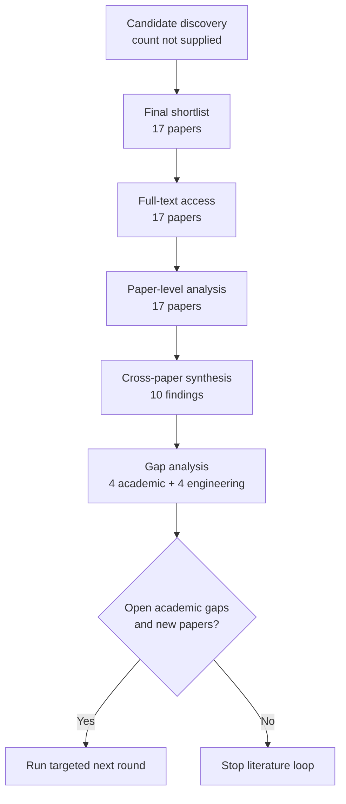

# Research Report: Evidence-gap-driven context retrieval and completion for workplace communication

## Contents

- [Round History](#round-history)
- [Executive Summary](#executive-summary)
- [Research Question](#research-question)
- [Methodology](#methodology)
- [Papers Reviewed](#papers-reviewed)
- [Research Landscape](#research-landscape)
- [Confidence-Graded Findings](#confidence-graded-findings)
- [Research Gaps](#research-gaps)
- [Practical Recommendations](#practical-recommendations)
- [Evidence Map](#evidence-map)
- [References](#references)
- [Appendix: Run Metadata](#appendix-run-metadata)

## Round History

Iterative gap-closure loop (hard cap: 4 rounds). See
`references/iterative-synthesis.md` for the full loop definition.

| Round | Run ID | Topic / Gap Focus | New Papers | Gaps Addressed | Remaining Gaps |
|-------|--------|-------------------|------------|----------------|----------------|
| 1 | 9af0d6417416 | evidence-gap-driven context retrieval and completion for workplace communication: turning an explicit evidence gap into bounded retrieval, deciding what to fetch next, and knowing when to stop, while preserving permissions, versions, temporal validity, cost and uncertainty | 17 | initial shortlist | 4 academic, 4 engineering |

**Stop reason**: another round runs while open academic gaps remain and new papers appear

## Executive Summary

This review investigated how an explicit missing-information need can be converted into bounded evidence retrieval, how successive retrieval actions should be selected, and how a system should decide that enough evidence has been obtained or that investigation must terminate without an answer. Seventeen distinct papers spanning 2007–2026 were reviewed, covering conversational query reformulation, iterative and active RAG, structured evidence-gap reasoning, sufficiency and abstention, cost-aware retrieval, permission-aware retrieval, and temporal search. [HIGH] The strongest cross-paper finding is that retrieval should be conditioned on the current information need and accumulated evidence rather than performed once, continuously, or according to a fixed retrieval schedule; iterative, contextual, and adaptive approaches repeatedly outperform less context-sensitive alternatives in their evaluated domains [2112.08558] [2305.06983] [2403.10081] [2212.10509] [2604.23783]. [HIGH] The most significant unresolved gap is that no admitted study validates a single bounded controller that combines structured evidence gaps, native permission enforcement, document/version lineage, temporal validity, calibrated stopping or abstention, and total-cost budgeting [2604.23783] [2606.29959] [doi-10-1109-access-2025-3628960].

**Scope**: 17 papers analyzed from four access-source families—arXiv, ACL Anthology, ResearchGate, and author-hosted PDFs—covering publications from 2007 through 2026.  
**Overall Confidence**: Medium. Component-level mechanisms have substantial support, but transfer to heterogeneous workplace communication and the integrated end-to-end loop remain incompletely validated.  
**Verdict**: HAS_GAPS

## Research Question

The review asked:

> How should a workplace communication system turn an explicit evidence gap—such as a missing antecedent, owner, decision, prerequisite, historical state, or referenced document—into a bounded retrieval process that decides what evidence to fetch next and when to stop, while preserving authorization boundaries, source/version identity, temporal validity, cost constraints, provenance, and uncertainty?

The in-scope problem is narrower than generic retrieval-augmented generation. It covers: explicit evidence-need representation; context-sensitive query generation or reformulation; iterative evidence acquisition; retrieval triggering; sufficiency assessment; abstention and stopping; retrieval budgets; permission-aware access; temporal relevance; and preservation of uncertainty when retrieval does not settle the question.

Out of scope are unrestricted autonomous browsing, generic vector-search optimization without an explicit evidence need, interpretation of attachment contents as an independent problem, and general factuality evaluation after evidence has already been collected. Phase-1 processing of already-collected data is also conceptually distinct from Phase-2 retrieval of additional evidence.

A useful abstraction is an iterative state transition:

$S_t=(Q,G_t,E_t,B_t,P_t)$

where $Q$ is the original question, $G_t$ is the current explicit evidence gap, $E_t$ is accumulated evidence, $B_t$ is remaining retrieval budget, and $P_t$ is the applicable permission and source scope. A bounded investigation chooses an action $a_t$, obtains an observable retrieval outcome $o_t$, updates the gap, and terminates only under an explicit stopping condition rather than treating retrieval failure as evidence of absence.

## Methodology

### Search Strategy

- **Sources**: arXiv, ACL Anthology, ResearchGate-hosted full text, author-hosted PDF copies, and the host's web-search/retrieval facilities used to access and read the supplied papers.
- **Reading method**: All 17 admitted papers were read through the host's web tool. Each paper was available at `full_text` access level through the supplied source.
- **Query variants**:
  - `evidence-gap-driven context retrieval completion workplace communication: turning explicit evidence gap bounded retrieval, deciding fetch next, knowing stop, preserving permissions, versions, temporal validity, cost uncertainty`
  - `evidence-gap-driven context retrieval`
  - `evidence-gap-driven completion workplace communication: turning explicit evidence gap bounded retrieval, deciding fetch next, knowing stop, preserving permissions, versions, temporal validity, cost uncertainty`
  - `context completion workplace communication: turning explicit evidence gap bounded retrieval, deciding fetch next, knowing stop, preserving permissions, versions, temporal validity, cost uncertainty`
  - `retrieval completion workplace communication: turning explicit evidence gap bounded retrieval, deciding fetch next, knowing stop, preserving permissions, versions, temporal validity, cost uncertainty`
  - `evidence-gap-driven context retrieval completion workplace`
  - `evidence-gap-driven context retrieval communication: turning`
  - `evidence-gap-driven context retrieval explicit evidence`
- **Time window**: 2007–2026 among the 17 admitted papers.
- **Screening**: The supplied final shortlist contained 17 distinct admitted papers. Counts for pre-shortlist candidates, BM25 screening, downloads, and intermediate conversion were not supplied and are therefore reported as unknown rather than reconstructed.

### Paper Access

| Paper | Access level | Access route |
|---|---|---|
| 2105.04166 | full_text | arXiv HTML |
| 2112.08558 | full_text | arXiv HTML |
| 2210.03350 | full_text | arXiv HTML |
| 2212.10509 | full_text | arXiv HTML |
| 2305.06983 | full_text | arXiv HTML |
| 2403.10081 | full_text | arXiv HTML |
| 2406.19215 | full_text | arXiv HTML |
| 2411.06037 | full_text | arXiv HTML |
| 2604.23783 | full_text | arXiv HTML |
| 2604.25676 | full_text | ACL Anthology PDF |
| 2606.29090 | full_text | arXiv HTML |
| 2606.29959 | full_text | arXiv HTML |
| 2608.13237 | full_text | arXiv HTML |
| doi-10-1109-access-2025-3628960 | full_text | ResearchGate-hosted full text |
| doi-10-1145-1247715-1247720 | full_text | author-hosted PDF |
| doi-10-1145-1571941-1572085 | full_text | author-hosted PDF |
| doi-10-18653-v1-2026-findings-acl-2090 | full_text | arXiv HTML |

### Pipeline Summary

| Metric | Count |
|--------|-------|
| Total candidates | unknown; not supplied |
| After screening | 17 admitted papers |
| Downloaded | unknown as a distinct pipeline stage |
| Successfully converted | unknown as a distinct pipeline stage |
| Deeply analyzed | 17 |
| Iterations | 1 completed round |

[HIGH] The methodology supports a component-level synthesis because every admitted paper was accessible at full-text level. [MEDIUM] It does not establish exhaustive coverage of the literature because the size and composition of the rejected candidate pool were not supplied.

## Papers Reviewed

| # | Title | Authors | Year | Venue | Quality Score | Relevance |
|---|-------|---------|------|-------|--------------|-----------|
| 1 | Few-Shot Conversational Dense Retrieval [2105.04166] | Shi Yu, Zhenghao Liu, Chenyan Xiong et al. | 2021 | arXiv manuscript | unknown | HIGH |
| 2 | SeaKR: Self-aware Knowledge Retrieval for Adaptive Retrieval Augmented Generation [2406.19215] | Zijun Yao, Weijian Qi, Liangming Pan et al. | 2025 | arXiv manuscript | unknown | HIGH |
| 3 | S2G-RAG: Structured Sufficiency and Gap Judging for Iterative Retrieval-Augmented QA [2604.23783] | Minghan Li, Junjie Zou, Xinxuan Lv et al. | 2026 | arXiv manuscript | unknown | HIGH |
| 4 | Sufficient Context: A New Lens on Retrieval Augmented Generation Systems [2411.06037] | Hailey Joren, Jianyi Zhang, Chun-Sung Ferng et al. | 2025 | arXiv manuscript | unknown | HIGH |
| 5 | Active Retrieval Augmented Generation [2305.06983] | Zhengbao Jiang, Frank F. Xu, Luyu Gao et al. | 2023 | arXiv manuscript | unknown | HIGH |
| 6 | When Should Multi-Round RAG Stop? Structured Stopping Judgments and Retrieval Reduction in Search-R1 [2608.13237] | Weimeng Luo | 2026 | arXiv manuscript | unknown | HIGH |
| 7 | Beyond Single-Shot: Multi-step Tool Retrieval via Query Planning [doi-10-18653-v1-2026-findings-acl-2090] | Wei Fang, James R. Glass | 2026 | Findings of ACL 2026 | unknown | HIGH |
| 8 | CORAL: Adaptive Retrieval Loop for Culturally-Aligned Multilingual RAG [2604.25676] | Nayeon Lee, Jiwoo Song, Byeongcheol Kang | 2026 | Findings of ACL 2026 | unknown | MEDIUM |
| 9 | Interleaving Retrieval with Chain-of-Thought Reasoning for Knowledge-Intensive Multi-Step Questions [2212.10509] | Harsh Trivedi, Niranjan Balasubramanian, Tushar Khot et al. | 2023 | arXiv manuscript | unknown | HIGH |
| 10 | CONQRR: Conversational Query Rewriting for Retrieval with Reinforcement Learning [2112.08558] | Zeqiu Wu, Yi Luan, Hannah Rashkin et al. | 2022 | arXiv manuscript | unknown | HIGH |
| 11 | Temporal profiles of queries [doi-10-1145-1247715-1247720] | Rosie Jones, Fernando Diaz | 2007 | ACM publication; venue not supplied | unknown | MEDIUM |
| 12 | Improving search relevance for implicitly temporal queries [doi-10-1145-1571941-1572085] | Donald Metzler, Rosie Jones, Fuchun Peng et al. | 2009 | ACM publication; venue not supplied | unknown | MEDIUM |
| 13 | DRAGIN: Dynamic Retrieval Augmented Generation based on the Information Needs of Large Language Models [2403.10081] | Weihang Su, Yichen Tang, Qingyao Ai et al. | 2024 | arXiv manuscript | unknown | HIGH |
| 14 | AB-RAG: Adaptive Budgeted Retrieval-Augmented Generation for Reliable Question Answering [2606.29090] | Ansh Kamthan | 2026 | arXiv manuscript | unknown | HIGH |
| 15 | Know Before You Fetch: Calibrated Retrieval-Budget Allocation for Retrieval-Augmented Generation [2606.29959] | Zhe Dong, Fang Qin, Manish Shah et al. | 2026 | arXiv manuscript | unknown | HIGH |
| 16 | Measuring and Narrowing the Compositionality Gap in Language Models [2210.03350] | Ofir Press, Muru Zhang, Sewon Min et al. | 2023 | arXiv manuscript | unknown | HIGH |
| 17 | Permission-Aware RAG: Identity and Access Management (IAM)-Based Access Filtering in Multi-Resource Environments [doi-10-1109-access-2025-3628960] | Jooyoung Jeong, Sang Goo Lee | 2025 | IEEE Access | unknown | HIGH |

No duplicate titles were identified among the 17 supplied records.

## Research Landscape

### Theme 1: Context-sensitive and feedback-conditioned query formulation

**Coverage**: 4 directly supporting papers plus related conversational-retrieval work | **Confidence**: High  
**Supporting papers**: [2112.08558], [2305.06983], [2403.10081], [doi-10-18653-v1-2026-findings-acl-2090]

[HIGH] Retrieval queries perform better in the evaluated systems when they are conditioned on conversational history, generation-time information needs, anticipated future needs, or the results of earlier retrieval rather than being treated as static copies of the user's latest utterance [2112.08558] [2305.06983] [2403.10081] [doi-10-18653-v1-2026-findings-acl-2090]. This is directly relevant to explicit evidence-gap retrieval because a missing owner, missing antecedent, or unresolved historical state should not be flattened into a generic topic query: the unresolved relation itself should constrain the next query.

[HIGH] The evidence does not identify one universally superior formulation mechanism. Reinforcement-learned conversational rewriting, forward-looking active retrieval, information-need-triggered retrieval, and multi-step query planning operate under different model assumptions and evaluation tasks [2112.08558] [2305.06983] [2403.10081] [doi-10-18653-v1-2026-findings-acl-2090].

Key findings:

1. [HIGH] Conversational context is useful for reformulating underspecified queries and handling topic-dependent retrieval needs [2112.08558].
2. [HIGH] Retrieval can be driven by anticipated or detected information need during generation rather than issued only before generation starts [2305.06983] [2403.10081].
3. [HIGH] Multi-step tool retrieval benefits from planning queries across steps rather than using a single-shot request [doi-10-18653-v1-2026-findings-acl-2090].

### Theme 2: Iterative retrieval and structured evidence-gap acquisition

**Coverage**: 3 principal papers | **Confidence**: High  
**Supporting papers**: [2210.03350], [2212.10509], [2604.23783]

[HIGH] Multi-step tasks benefit when reasoning and retrieval are interleaved. Successive reasoning can expose a missing fact, retrieve evidence for it, and then use the new evidence to determine the next unresolved dependency [2210.03350] [2212.10509] [2604.23783].

[HIGH] S2G-RAG is the most direct match to the project's core object because it explicitly judges evidence sufficiency and, when evidence is insufficient, emits structured unresolved gaps that are transformed into further retrieval queries [2604.23783]. Removing the gap/sufficiency judge materially harms the system in its reported ablation, supporting the architectural separation between "what is missing?" and "retrieve something" [2604.23783].

[HIGH] This evidence supports an iterative state machine rather than a recursive "search more" heuristic. At step $t$:

$G_t \rightarrow q_t \rightarrow E_{t+1} \rightarrow \operatorname{judge}(G_t,E_{t+1}) \rightarrow G_{t+1}$

where the gap can shrink, transform into a different dependency, remain unresolved, or terminate explicitly.

Key findings:

1. [HIGH] Interleaving reasoning and retrieval improves evidence acquisition on multi-hop tasks relative to less iterative alternatives in the evaluated settings [2212.10509] [2604.23783].
2. [HIGH] Decomposing a compositional problem into missing intermediate information can narrow a model's compositionality gap [2210.03350].
3. [HIGH] Explicit structured gap generation is viable, but temporal constraints and complex compositional relations remain limitations of the demonstrated schema [2604.23783].

### Theme 3: Adaptive retrieval timing and stopping

**Coverage**: 7 papers | **Confidence**: High  
**Supporting papers**: [2305.06983], [2403.10081], [2406.19215], [2411.06037], [2604.23783], [2606.29090], [2608.13237]

[HIGH] More retrieval is not monotonically better. FLARE reports plateaus or degradation when retrieval is too frequent; DRAGIN reports that fixed dynamic schedules can fail to improve over single-round retrieval; and SeaKR's always-retrieve ablation underperforms its adaptive policy [2305.06983] [2403.10081] [2406.19215].

[HIGH] Several papers therefore treat retrieval triggering or stopping as a decision problem, using uncertainty, sufficiency, structured judgments, or budget allocation [2406.19215] [2411.06037] [2604.23783] [2606.29090] [2608.13237].

[HIGH] Learned stopping remains fallible. Reported systems show over-retrieval, calibration error, and unsafe early termination; a generated answer or final-answer token cannot be treated as proof that the evidence is sufficient [2411.06037] [2604.23783] [2608.13237].

A bounded controller therefore needs both a learned assessment and deterministic limits. An abstract stopping rule can be written as:

$\operatorname{stop}_t = S(E_t,G_t)\lor B_t\leq 0\lor t\geq T_{\max}\lor X_t$

where $S$ denotes a sufficiency decision and $X_t$ covers explicit non-success terminal conditions such as a source becoming unavailable. Crucially, stopping does not imply that the original question has been answered.

Key findings:

1. [HIGH] Adaptive retrieval can outperform always-retrieve or fixed-schedule retrieval [2305.06983] [2403.10081] [2406.19215].
2. [HIGH] Sufficiency judgments can decide between answering, retrieving again, or abstaining [2411.06037] [2604.23783] [2608.13237].
3. [HIGH] Stopping signals remain imperfect and require conservative safeguards [2604.23783] [2608.13237].

### Theme 4: Sufficiency is different from correctness

**Coverage**: 2 principal papers | **Confidence**: High  
**Supporting papers**: [2411.06037], [doi-10-1109-access-2025-3628960]

[HIGH] Retrieved-context sufficiency and answer correctness are empirically distinct. A model can answer incorrectly despite receiving sufficient evidence, while prior knowledge can sometimes permit a correct answer when supplied context is judged insufficient [2411.06037].

[HIGH] Likewise, permission filtering is an access-control mechanism rather than an answerability mechanism. Removing unauthorized evidence from the generator's context does not itself guarantee that the system will abstain when the remaining authorized evidence is insufficient [doi-10-1109-access-2025-3628960].

This distinction is essential for an investigation loop. At least three predicates should remain separate:

$\operatorname{authorized}(E)$, $\operatorname{sufficient}(E,Q)$, and $\operatorname{correct}(A,E,Q)$.

Success of one predicate does not logically imply either of the others.

Key findings:

1. [HIGH] Sufficient evidence does not guarantee a correct generated answer [2411.06037].
2. [HIGH] Insufficient retrieved context does not imply that the generator is unable to produce an answer from parametric knowledge [2411.06037].
3. [HIGH] Permission enforcement alone cannot substitute for explicit sufficiency and abstention logic [doi-10-1109-access-2025-3628960].

### Theme 5: Budget-aware retrieval and multidimensional cost

**Coverage**: 4 principal papers | **Confidence**: High  
**Supporting papers**: [2604.25676], [2606.29090], [2606.29959], [2608.13237]

[HIGH] Retrieval-call count is an incomplete cost measure. Passage count, context length, planner or judge inference, reranking, and wall-clock latency can move independently [2604.25676] [2606.29959] [2608.13237].

[HIGH] Budget-aware approaches show that retrieval can be allocated selectively, but their benefit depends on model and retriever capability [2606.29090] [2606.29959]. A stronger reader may need less retrieval, while a weak retriever limits attainable accuracy even when additional budget is available [2606.29959].

For engineering evaluation, cost should therefore be decomposed rather than collapsed into "number of searches." One accounting model is:

$C_{\mathrm{total}} =
C_{\mathrm{retrieval}} +
C_{\mathrm{context}} +
C_{\mathrm{planner/judge}} +
C_{\mathrm{rerank}} +
C_{\mathrm{IAM}}$

with end-to-end latency $L_{\mathrm{e2e}}$ reported independently because latency is not commensurable with monetary or token cost.

Key findings:

1. [HIGH] Reducing retrieval calls does not necessarily reduce total compute or total latency [2606.29959] [2608.13237].
2. [HIGH] Adaptive budget allocation is sensitive to reader and retriever quality [2606.29090] [2606.29959].
3. [MEDIUM] Cost-aware results transfer conceptually to workplace retrieval, but the reviewed studies do not provide a complete enterprise cost model.

### Theme 6: Permission-aware evidence acquisition

**Coverage**: 1 direct paper plus iterative-retrieval comparison | **Confidence**: Medium  
**Supporting papers**: [doi-10-1109-access-2025-3628960], [2604.23783]

[HIGH] Permission-Aware RAG demonstrates that provider or resource-specific authorization decisions can be applied to semantically retrieved candidates before those candidates are placed into the LLM context [doi-10-1109-access-2025-3628960]. Its evaluated access filtering matched the experiment's permission ground truth [doi-10-1109-access-2025-3628960].

[MEDIUM] This validates access filtering as an architectural component but not a complete gap-driven retrieval loop. The reported retrieval procedure uses fixed top-$k$ filtering and does not evaluate a case where a necessary document is removed by authorization, the remaining evidence is judged insufficient, and the system issues another permission-constrained retrieval request [doi-10-1109-access-2025-3628960] [2604.23783].

Key findings:

1. [HIGH] Authorization can be applied before evidence reaches generation [doi-10-1109-access-2025-3628960].
2. [MEDIUM] Evidence replenishment after permission filtering remains unvalidated in the admitted corpus.
3. [HIGH] A denied document cannot safely be collapsed into "no evidence exists"; authorization state must remain observable.

### Theme 7: Temporal intent and temporal validity

**Coverage**: 2 direct temporal-search papers plus adaptive-retrieval work | **Confidence**: Medium  
**Supporting papers**: [doi-10-1145-1247715-1247720], [doi-10-1145-1571941-1572085], [2604.23783]

[HIGH] Temporal characteristics of an information need can affect retrieval relevance. Temporal profiles improve temporal-query classification in the evaluated collections, and temporal reranking improves retrieval for the strongest implicitly temporal query group, though gains depend on collection and classifier confidence [doi-10-1145-1247715-1247720] [doi-10-1145-1571941-1572085].

[MEDIUM] These results establish time as a relevance dimension but do not solve the workplace requirement of identifying which document revision or historical state was valid at the time relevant to the question. Publication or document timestamp, effective time, deadline time, and version lineage are not jointly represented in the reviewed evidence.

Key findings:

1. [HIGH] Implicit temporal intent can be detected and used for ranking [doi-10-1145-1247715-1247720] [doi-10-1145-1571941-1572085].
2. [MEDIUM] "Latest" and "valid for the question's effective time" remain different retrieval requirements.
3. [LOW] No evidence in the admitted corpus establishes a complete version- and effective-time-aware workplace investigation loop.

## Methodology Comparison

| Approach | Papers | Strengths | Weaknesses | Best For | Performance |
|----------|--------|-----------|------------|----------|-------------|
| Conversational query rewriting | [2105.04166] [2112.08558] | Resolves context dependence and reformulates underspecified turns | Does not itself decide whether more retrieval is warranted | Conversational and follow-up information needs | Improvements reported in evaluated conversational retrieval settings; exact cross-paper metric not normalized |
| Active/dynamic retrieval during generation | [2305.06983] [2403.10081] [2406.19215] | Retrieves when internal or generation-time signals indicate missing information | Depends on model internals/signals and can mis-trigger | Generation-time information needs | Adaptive policies outperform relevant fixed/always-retrieve baselines in reported settings |
| Iterative reasoning + retrieval | [2210.03350] [2212.10509] | Handles compositional and multi-hop dependencies | Can accumulate cost and error across steps | Multi-hop evidence acquisition | Evidence recall and downstream QA gains reported in tested settings |
| Structured sufficiency/gap controller | [2604.23783] | Explicitly represents missing evidence and converts gaps into next queries | Schema limitations for temporal constraints and complex relations | Explicit evidence-gap investigation | Large ablation degradation reported when judge is removed; exact value not supplied in synthesis |
| Sufficiency assessment | [2411.06037] | Separates contextual support from raw answer production | Sufficiency does not equal correctness | Answer/retrieve/abstain decisions | Demonstrates empirical separation between context sufficiency and answer correctness |
| Structured stopping | [2608.13237] | Reduces unnecessary multi-round retrieval and exposes stopping risk | Unsafe early stops remain possible | Bounded iterative RAG | Retrieval reductions reported; no general safe-stopping guarantee |
| Budget allocation | [2606.29090] [2606.29959] | Explicitly trades retrieval against answer utility and reader capability | Sensitive to model/retriever quality; cost is multidimensional | Budget-constrained retrieval | Adaptive allocation can reduce retrieval; smallest AB-RAG model shows no Exact Match improvement |
| Permission-aware filtering | [doi-10-1109-access-2025-3628960] | Enforces authorization before evidence reaches the generator | No iterative replenishment after filtered evidence is insufficient | Enterprise-style access control | Permission enforcement matched experimental permission ground truth |
| Temporal retrieval/reranking | [doi-10-1145-1247715-1247720] [doi-10-1145-1571941-1572085] | Makes temporal intent part of relevance | Does not model revision lineage/effective validity jointly | Time-sensitive search | Gains are collection- and confidence-dependent |
| Adaptive multilingual/cultural retrieval loop | [2604.25676] | Demonstrates another adaptive-loop setting | System-specific overhead and transfer limitations | Multilingual/culturally aligned RAG | Reported task-specific gains; not directly a workplace-evidence benchmark |

## Confidence-Graded Findings

### 🟢 High Confidence (supported by 3+ papers with consistent results)

1. **[HIGH] Context-sensitive query formulation is preferable to treating retrieval as a static one-shot query in the evaluated domains.** Conversational rewriting, active retrieval, dynamic information-need detection, and multi-step query planning all show value from conditioning the query or retrieval action on evolving context [2112.08558] [2305.06983] [2403.10081] [doi-10-18653-v1-2026-findings-acl-2090].

2. **[HIGH] Iterative evidence acquisition is useful for multi-hop and compositional questions.** Alternating reasoning or gap identification with retrieval improves evidence recall and often downstream QA compared with less iterative alternatives [2210.03350] [2212.10509] [2604.23783].

3. **[HIGH] More frequent retrieval is not monotonically beneficial.** Excess retrieval can plateau, inject irrelevant context, or perform worse than adaptive retrieval [2305.06983] [2403.10081] [2406.19215].

4. **[HIGH] Explicit sufficiency or confidence signals can support retrieve/answer/abstain decisions, but they are not perfectly calibrated.** Unsafe early stops and unnecessary additional retrieval remain observable failure modes [2411.06037] [2604.23783] [2606.29090] [2608.13237].

5. **[HIGH] Structured unresolved gaps can drive the next retrieval step.** S2G-RAG directly implements this pattern and reports a substantial ablation loss without its sufficiency/gap judge [2604.23783].

6. **[HIGH] Evidence sufficiency is not equivalent to answer correctness.** Correctness can fail with sufficient context, and models can sometimes answer with insufficient supplied context [2411.06037].

7. **[HIGH] Retrieval-call count alone is not a sufficient cost metric.** Passage/token volume, extra model inference, reranking, and latency must be treated separately [2604.25676] [2606.29959] [2608.13237].

8. **[HIGH] Temporal intent can affect relevance and should be represented rather than ignored.** Temporal-query modeling and reranking improve retrieval for time-sensitive query subsets [doi-10-1145-1247715-1247720] [doi-10-1145-1571941-1572085].

9. **[HIGH] Adaptive retrieval benefit depends on the capabilities of both the reader and the retriever.** Weak readers or weak retrievers can erase benefits that appear with stronger components [2606.29090] [2606.29959].

### 🟡 Medium Confidence (supported by 1-2 papers or with caveats)

1. **[MEDIUM] Permission filtering before generation is a viable component for enterprise retrieval.** The evaluated native-IAM approach preserves authorization decisions before evidence reaches the LLM, but only one directly relevant permission-aware study was admitted [doi-10-1109-access-2025-3628960].

2. **[MEDIUM] A workplace investigation controller should preserve the original evidence need while generating successive derivative queries.** This follows from converging query-reformulation and iterative-retrieval evidence, but the exact anchoring mechanism has not been directly compared in a workplace benchmark [2112.08558] [2604.23783].

3. **[MEDIUM] Component-level adaptive-RAG findings are transferable as design hypotheses for workplace communication, not as validated production accuracy estimates.** Most evidence comes from QA, Wikipedia retrieval, conversational search, or tool-retrieval tasks rather than email and Teams.

4. **[MEDIUM] Temporal signals should influence retrieval scope, but the literature reviewed here does not establish how to reconcile document time, effective time, deadline time, and version time in one controller** [doi-10-1145-1247715-1247720] [doi-10-1145-1571941-1572085].

### 🔴 Low Confidence (preliminary, single-source, or contradicted)

1. **[LOW] A combined enterprise controller integrating gap reasoning, permission enforcement, version lineage, temporal validity, calibrated stopping, abstention, and total-cost control is already reliable.** The admitted literature does not establish this; each component is evaluated separately or only partially [2604.23783] [2606.29959] [doi-10-1109-access-2025-3628960].

2. **[LOW] Current structured-gap schemas are sufficient for arbitrary temporal, multi-entity, and compositional workplace evidence needs.** The strongest directly relevant structured-gap paper explicitly identifies temporal constraints and complex compositional relations as limitations [2604.23783].

3. **[LOW] A learned stopping judgment alone is safe enough to replace deterministic retrieval limits.** Unsafe early stopping remains observed, and no reviewed paper supplies a general bounded-risk guarantee [2604.23783] [2608.13237].

## Trade-Off Analysis

| Decision | Option A | Option B | Recommendation |
|----------|----------|----------|----------------|
| Retrieval trigger | Always retrieve: simple, but may add noise and cost [2305.06983] [2406.19215] | Adaptive retrieval: lower unnecessary retrieval but introduces gating errors [2403.10081] [2406.19215] | [HIGH] Use adaptive triggering with deterministic hard bounds |
| Query strategy | One static query: cheap but weak for changing/multi-hop needs | Context/gap-conditioned iterative queries: better targeted but more complex [2112.08558] [2604.23783] | [HIGH] Generate each query from the explicit current gap while retaining the original question |
| Stopping | Fixed number of rounds: predictable but insensitive to sufficiency | Learned sufficiency/confidence: adaptive but fallible [2411.06037] [2608.13237] | [HIGH] Combine learned sufficiency with hard maximum rounds/budget |
| Authorization | Retrieve broadly then rely on generator behavior | Filter with native authorization before generation [doi-10-1109-access-2025-3628960] | [HIGH] Enforce authorization before evidence enters generation |
| Permission-filtered insufficiency | Stop after filtering | Reassess authorized evidence and search permitted alternatives | [MEDIUM] Implement bounded replenishment, but treat it as an engineering hypothesis requiring direct validation |
| Time handling | Prefer latest document | Query for evidence valid for the relevant temporal requirement | [MEDIUM] Carry temporal intent explicitly; do not equate latest with valid |
| Cost optimization | Optimize number of retrieval calls only | Track calls, passages/tokens, judging, reranking, IAM, and latency [2606.29959] [2608.13237] | [HIGH] Use multidimensional cost accounting |
| Retrieval failure | Collapse all failures into "not found" | Preserve no-match, denial, unavailable source, extraction failure, budget exhaustion, and supported-negative separately | [MEDIUM] Preserve typed outcomes; direct end-to-end validation remains an engineering gap |

## Points of Agreement **[EVIDENCE REQUIRED]**

1. **[HIGH] Retrieval should respond to changing information needs rather than operate as a single immutable lookup.** This is supported by conversational reformulation, active retrieval, dynamic retrieval, iterative reasoning/retrieval, and structured-gap work [2112.08558] [2305.06983] [2403.10081] [2212.10509] [2604.23783].

2. **[HIGH] Unrestricted additional retrieval is not inherently beneficial.** Adaptive methods can outperform always-retrieve or fixed schedules, and excess retrieval can add noise [2305.06983] [2403.10081] [2406.19215].

3. **[HIGH] Stopping requires a judgment about evidence state, not merely detecting that the model can emit an answer.** Sufficiency and stopping studies show that answer production, evidence sufficiency, and correctness are different concepts [2411.06037] [2604.23783] [2608.13237].

4. **[HIGH] Cost-sensitive retrieval must account for more than search count.** Budgeted retrieval and stopping work identify distinct costs from context size, extra inference, and latency [2606.29090] [2606.29959] [2608.13237].

5. **[HIGH] Retrieval effectiveness depends on upstream and downstream component quality.** Better allocation cannot compensate indefinitely for a poor retriever, and reader capability changes how much external retrieval is useful [2606.29090] [2606.29959].

## Points of Contradiction **[EVIDENCE REQUIRED]**

No direct paper-to-paper contradiction was recorded in the supplied cross-paper synthesis. The apparent tensions are conditional results rather than mutually exclusive claims.

1. **[HIGH] Retrieval frequency tension**: Active and iterative retrieval papers show benefits from additional retrieval when new information is needed [2305.06983] [2212.10509], while SeaKR, DRAGIN, and FLARE-related results show that retrieving too often can plateau or degrade performance [2305.06983] [2403.10081] [2406.19215].
   - **Possible explanation**: The papers vary retrieval timing, reader capability, retriever quality, datasets, and the relevance of added context.
   - **Implication**: "Retrieve more" and "retrieve less" are not competing universal rules. The relevant control variable is whether another retrieval is expected to resolve a specific current gap.

2. **[HIGH] Sufficiency-versus-answerability tension**: Explicit context sufficiency is useful for deciding whether retrieval is needed [2411.06037] [2604.23783], but sufficient retrieved context still does not guarantee correct answering, and an LLM can sometimes answer despite insufficient supplied context [2411.06037].
   - **Possible explanation**: Contextual evidence and model parametric knowledge contribute differently to answer generation.
   - **Implication**: Retrieval stopping and final answer validation should not be implemented as the same classifier.

3. **[HIGH] Budget-reduction tension**: Adaptive budget methods can reduce retrieval [2606.29090] [2606.29959], but lower retrieval-call counts do not necessarily mean lower total computation or latency because gating, judging, reranking, or larger contexts may offset savings [2606.29959] [2608.13237].
   - **Possible explanation**: Different studies measure different dimensions of "cost."
   - **Implication**: Engineering comparisons require a common end-to-end resource accounting model.

## Research Gaps

All eight gaps below remain open after Round 1. None is accepted as solved or closed. For each gap, the literature reviewed so far has not answered the stated question.

| # | Gap | Type | Severity | Rounds Searched | Impact on Goals |
|---|-----|------|----------|-----------------|-----------------|
| G1 | Structured gaps for temporal constraints, multi-entity joins, and complex compositional evidence | [ACADEMIC] | HIGH | 1 | The controller may formulate the wrong next evidence need for realistic workplace dependencies |
| G2 | Joint iterative retrieval with version lineage, freshness/effective-time validity, and sufficiency | [ACADEMIC] | HIGH | 1 | A retrieved document may be relevant but historically or version-wise invalid |
| G3 | Bounded-risk stopping under domain shift | [ACADEMIC] | HIGH | 1 | Miscalibration can cause unsafe early stopping or wasteful over-retrieval |
| G4 | Permission-aware bounded replenishment after IAM filtering | [ENGINEERING] | HIGH | 1 | Authorized evidence may remain incomplete after relevant unauthorized items are filtered |
| G5 | Typed terminal/retry states for empty, denied, unavailable, extraction-failed, exhausted, and true-negative outcomes | [ENGINEERING] | HIGH | 1 | Collapsing states can turn access or system failure into a false factual conclusion |
| G6 | Unified end-to-end cost measurement | [ENGINEERING] | MEDIUM | 1 | Optimizing search count alone can increase total cost or latency |
| G7 | Workplace-communication benchmark combining all major retrieval hazards | [ENGINEERING] | HIGH | 1 | Transfer from QA/search cannot establish production-domain reliability |
| G8 | One controller combining gaps, permissions, versions, temporal validity, stopping, abstention, and budgeting | [ACADEMIC] | HIGH | 1 | Component evidence does not establish integrated correctness |

### Academic Gaps (require more papers)

1. **[ACADEMIC] [HIGH] G1 — Structured representation of difficult evidence gaps**: The literature has not yet answered how a structured evidence-gap schema should represent temporal constraints, multi-entity joins, and complex compositional requirements with sufficient reliability for the target setting. S2G-RAG explicitly identifies temporal constraints and complex compositional relations as limitations [2604.23783].  
   **Rounds already searched**: 1.  
   **Suggested queries**: `"structured evidence gaps" temporal constraints multi-hop retrieval`, `"iterative retrieval" compositional gap representation`.

2. **[ACADEMIC] [HIGH] G2 — Version lineage plus temporal validity plus iterative sufficiency**: The literature has not yet answered how one iterative retrieval loop should jointly preserve document-version lineage, freshness/effective-time semantics, provenance, and structured sufficiency judgments. The current papers separately address gap retrieval, temporal relevance, and adaptive budgeting, but not the combination [2604.23783] [2604.25676] [2606.29959] [doi-10-1145-1247715-1247720] [doi-10-1145-1571941-1572085].  
   **Rounds already searched**: 1.  
   **Suggested queries**: `"version-aware retrieval" provenance temporal RAG iterative retrieval`, `"temporal validity" document versions retrieval augmented generation`.

3. **[ACADEMIC] [HIGH] G3 — Stopping reliability under domain shift**: The literature has not yet answered how to provide a general bounded-risk stopping policy when sufficiency or confidence calibration shifts between domains. Conservative over-retrieval, calibration error, and unsafe early stops remain reported risks [2411.06037] [2604.23783] [2606.29959] [2608.13237].  
   **Rounds already searched**: 1.  
   **Suggested queries**: `"RAG stopping" calibrated risk selective prediction domain shift`, `"safe early stopping" retrieval augmented generation`.

4. **[ACADEMIC] [HIGH] G8 — Fully integrated investigation controller**: The literature has not yet answered whether one controller can reliably combine structured gaps, permission-aware source access, version lineage, temporal validity, calibrated stopping, abstention, and total-cost budgeting. Existing evidence establishes individual components, not the complete composition [2604.23783] [2606.29959] [doi-10-1109-access-2025-3628960].  
   **Rounds already searched**: 1.  
   **Suggested queries**: `"enterprise RAG" iterative retrieval permissions provenance temporal version stopping`, `"permission-aware RAG" adaptive retrieval sufficiency`.

### Engineering Gaps (fillable without papers)

1. **[ENGINEERING] [HIGH] G4 — Permission-aware bounded replenishment**: The literature has not yet tested a loop in which native IAM removes retrieved candidates, the remaining authorized evidence is reassessed for sufficiency, and another permission-constrained query is issued if needed [doi-10-1109-access-2025-3628960] [2604.23783].  
   **Rounds already searched**: 1.  
   **Suggested resolution**: Build deterministic authorization-before-generation fixtures with cases where the highest-ranked evidence is denied but lower-ranked authorized evidence exists; verify that the controller retries within scope and never exposes denied content.

2. **[ENGINEERING] [HIGH] G5 — Typed retrieval failure and termination states**: The literature has not yet tested one controller that reliably distinguishes empty search, authorization denial, source unavailability, unsupported extraction, budget exhaustion, and evidence that actually supports a negative conclusion [doi-10-1109-access-2025-3628960] [2604.23783] [2608.13237].  
   **Rounds already searched**: 1.  
   **Suggested resolution**: Define explicit machine-readable outcome types and adversarially test every transition. No-result, denial, and failure states must never be converted into negative factual evidence without source semantics that justify that inference.

3. **[ENGINEERING] [MEDIUM] G6 — End-to-end cost accounting**: The literature has not yet supplied a complete evaluation across retrieval calls, passage/token volume, planner/judge inference, reranking, IAM checks, and wall-clock latency [2604.25676] [2606.29090] [2606.29959] [2608.13237] [doi-10-1109-access-2025-3628960].  
   **Rounds already searched**: 1.  
   **Suggested resolution**: Instrument each component separately and report both per-investigation resource vectors and end-to-end latency instead of collapsing performance into search count.

4. **[ENGINEERING] [HIGH] G7 — Workplace-communication evaluation**: The literature has not yet tested the complete target setting: explicit gaps over heterogeneous workplace messages and documents with multi-hop dependencies, stale/conflicting evidence, access restrictions, and bounded retrieval [2105.04166] [2212.10509] [2604.23783] [doi-10-1109-access-2025-3628960].  
   **Rounds already searched**: 1.  
   **Suggested resolution**: Create independent synthetic/adversarial fixtures containing unresolved references, missing owners, historical decisions, permission-restricted evidence, stale document versions, conflicting versions, partial access, and finite budgets. Keep evaluation gold structurally separate from controller inputs.

## Reproducibility Notes

The supplied synthesis did not include verified repository URLs, dataset-release URLs, or license details for each paper. Unknown values are therefore left explicitly unknown instead of inferred.

| Paper | Code Available | Data Available | Sufficient Detail | License |
|-------|---------------|----------------|-------------------|---------|
| 2105.04166 | unknown | unknown | full text available | unknown |
| 2406.19215 | unknown | unknown | full text available | unknown |
| 2604.23783 | unknown | unknown | full text available | unknown |
| 2411.06037 | unknown | unknown | full text available | unknown |
| 2305.06983 | unknown | unknown | full text available | unknown |
| 2608.13237 | unknown | unknown | full text available | unknown |
| doi-10-18653-v1-2026-findings-acl-2090 | unknown | unknown | full text available | unknown |
| 2604.25676 | unknown | unknown | full text available | unknown |
| 2212.10509 | unknown | unknown | full text available | unknown |
| 2112.08558 | unknown | unknown | full text available | unknown |
| doi-10-1145-1247715-1247720 | unknown | unknown | full text available | unknown |
| doi-10-1145-1571941-1572085 | unknown | unknown | full text available | unknown |
| 2403.10081 | unknown | unknown | full text available | unknown |
| 2606.29090 | unknown | unknown | full text available | unknown |
| 2606.29959 | unknown | unknown | full text available | unknown |
| 2210.03350 | unknown | unknown | full text available | unknown |
| doi-10-1109-access-2025-3628960 | unknown | unknown | full text available | unknown |

## Practical Recommendations **[EVIDENCE REQUIRED]**

1. **[HIGH] Represent each investigation as an explicit evidence gap, not merely a free-text search query.** The gap should identify what information is missing, why it matters to the current question, the permitted retrieval scope, and remaining budget. Structured gap judging directly supports iterative follow-up retrieval, while compositional work supports decomposing unresolved dependencies [2604.23783] [2210.03350].  
   *Confidence*: High

2. **[HIGH] Keep three decisions separately observable: whether more evidence is needed, what should be fetched next, and whether the resulting evidence is sufficient.** Context-sensitive retrieval and structured sufficiency work show that query generation, retrieval triggering, and stopping are related but distinct functions [2305.06983] [2403.10081] [2604.23783].  
   *Confidence*: High

3. **[HIGH] Preserve the original question as an invariant anchor while allowing iterative reformulation of the current retrieval query.** Conversational query rewriting and iterative query planning demonstrate the value of contextual reformulation, but successive retrieval feedback should not silently redefine the investigation objective [2112.08558] [doi-10-18653-v1-2026-findings-acl-2090].  
   *Confidence*: High for contextual reformulation; Medium for the exact anchoring implementation.

4. **[HIGH] Use adaptive retrieval rather than an always-retrieve policy, but impose a deterministic hard cap.** Additional retrieval is useful when evidence is genuinely missing, yet excessive retrieval can degrade performance and learned stopping can terminate too early [2305.06983] [2403.10081] [2406.19215] [2608.13237].  
   *Confidence*: High

5. **[HIGH] Do not equate "the model can answer" with "the evidence is sufficient."** Retrieved-context sufficiency and answer correctness are empirically different, so final-answer generation must not silently close an unresolved evidence gap [2411.06037].  
   *Confidence*: High

6. **[HIGH] Apply authorization before retrieved evidence reaches the generator.** Native-IAM filtering demonstrates that authorization can be preserved at the evidence boundary [doi-10-1109-access-2025-3628960]. After filtering, reassess sufficiency rather than assuming the remaining top-$k$ evidence is adequate.  
   *Confidence*: High for pre-generation authorization; Medium for iterative replenishment because that combination remains unvalidated.

7. **[MEDIUM] Treat permission-filtered insufficiency as a candidate for bounded replenishment, not as proof that the answer does not exist.** Permission-aware RAG validates filtering, while structured-gap retrieval provides the mechanism needed for another targeted search, but their integration remains an engineering gap [doi-10-1109-access-2025-3628960] [2604.23783].  
   *Confidence*: Medium

8. **[HIGH] Preserve typed retrieval outcomes.** At minimum, distinguish successful evidence, zero matches, access denied, source unavailable, unsupported/failed extraction, budget exhausted, and evidence supporting a negative conclusion. The reviewed permission and stopping literature does not justify collapsing these cases into one "not found" outcome [doi-10-1109-access-2025-3628960] [2608.13237].  
   *Confidence*: High as a safety-oriented design recommendation; direct combined validation is still missing.

9. **[MEDIUM] Carry temporal intent explicitly into retrieval constraints and ranking.** Temporal-search work shows that temporal characteristics materially affect relevance, but it does not establish version-lineage correctness [doi-10-1145-1247715-1247720] [doi-10-1145-1571941-1572085]. Consequently, "latest available" should not be treated as equivalent to "valid for the question's relevant time."  
   *Confidence*: Medium for the target workplace transfer.

10. **[HIGH] Measure total investigation cost as multiple independent dimensions.** Track retrieval calls, retrieved passages/tokens, planner/judge inference, reranking, IAM checks, and wall-clock latency. Adaptive retrieval can reduce one cost while increasing another [2606.29090] [2606.29959] [2608.13237].  
    *Confidence*: High

11. **[HIGH] Build adversarial engineering fixtures before relying on the controller for production investigation.** Required cases include denied reads, empty searches, stale versions, conflicting versions, partial document access, multi-hop dependencies, exhausted budgets, and unsafe early stopping. The current literature validates pieces of this problem, not their interaction [2604.23783] [2608.13237] [doi-10-1109-access-2025-3628960].  
    *Confidence*: High

## Future Directions

1. **[HIGH] Target G1 with literature on structured evidence-need representations for temporal and compositional multi-hop retrieval.** The next academic round should specifically test whether richer gap schemas exist beyond the limitations reported by S2G-RAG [2604.23783].

2. **[HIGH] Target G2 with version-aware and provenance-aware retrieval literature rather than generic temporal RAG.** Temporal-query ranking alone does not answer which historical document version was valid for a workplace question [doi-10-1145-1247715-1247720] [doi-10-1145-1571941-1572085].

3. **[HIGH] Target G3 with selective prediction, calibrated abstention, and risk-controlling stopping under domain shift.** The relevant unresolved problem is safe termination, not merely search reduction [2411.06037] [2608.13237].

4. **[HIGH] Target G8 with enterprise or agentic retrieval work that explicitly combines permissions, provenance/versioning, temporal constraints, adaptive retrieval, and stopping.** Component papers should not be counted as evidence of integrated correctness [2604.23783] [2606.29959] [doi-10-1109-access-2025-3628960].

5. **[HIGH] In parallel with literature search, resolve G4, G5, G6, and G7 through controlled engineering experiments.** These gaps can be productively investigated without claiming that synthetic fixtures represent production mailboxes.

## Readiness Assessment (System-Building Mode)

### Verdict: HAS_GAPS

### Assessment Summary

[HIGH] The literature is sufficient to design a conservative prototype architecture for explicit gap representation, adaptive iterative retrieval, pre-generation authorization, sufficiency assessment, deterministic budget limits, and explicit unresolved outcomes. [MEDIUM] It is not sufficient to claim that this architecture is reliable as a complete workplace investigation system because four academic gaps and four engineering gaps remain open, particularly around version/temporal validity, stopping safety, permission-aware replenishment, and integrated evaluation.

### Coverage Matrix

| Dimension | Status | Evidence |
|-----------|--------|----------|
| Architecture patterns | ✅ Sufficient at component level | [2112.08558] [2305.06983] [2212.10509] [2604.23783] |
| Technology stack | ⚠️ Partial | Mechanisms are described, but no single target-enterprise stack is validated |
| Performance baselines | ⚠️ Partial | [2305.06983] [2403.10081] [2606.29090] [2606.29959]; metrics are task-specific |
| Security model | ⚠️ Partial | [doi-10-1109-access-2025-3628960] validates IAM filtering, not iterative replenishment |
| Trade-off map | ✅ Sufficient for prototype hypotheses | [2406.19215] [2411.06037] [2606.29959] [2608.13237] |
| Structured gap representation | ⚠️ Partial | [2604.23783]; temporal/compositional limitations remain |
| Temporal relevance | ⚠️ Partial | [doi-10-1145-1247715-1247720] [doi-10-1145-1571941-1572085] |
| Version lineage | ❌ Missing as an integrated retrieval mechanism | No admitted paper validates it jointly with gap-driven retrieval |
| Stopping safety | ⚠️ Partial | [2411.06037] [2604.23783] [2608.13237] |
| End-to-end workplace validation | ❌ Missing | No admitted study covers the target combination |

### Gap Resolution Plan

| # | Gap | Type | Severity | Resolution |
|---|-----|------|----------|------------|
| G1 | Structured gap representation for temporal/compositional needs | [ACADEMIC] | HIGH | Targeted next-round literature search on structured evidence gaps and temporal/compositional multi-hop retrieval |
| G2 | Version lineage + temporal validity + sufficiency | [ACADEMIC] | HIGH | Target version/provenance-aware iterative retrieval literature |
| G3 | Safe stopping under domain shift | [ACADEMIC] | HIGH | Search calibrated selective prediction and risk-controlling retrieval stopping |
| G4 | Permission-aware replenishment | [ENGINEERING] | HIGH | Implement IAM-filter → sufficiency reassessment → bounded authorized retry fixtures |
| G5 | Typed terminal/retry outcomes | [ENGINEERING] | HIGH | Define explicit state enum and adversarial transition tests |
| G6 | End-to-end cost model | [ENGINEERING] | MEDIUM | Instrument calls, passages/tokens, model inference, IAM, reranking, and latency |
| G7 | Workplace benchmark | [ENGINEERING] | HIGH | Build independent synthetic/adversarial heterogeneous communication fixtures |
| G8 | Integrated controller evidence | [ACADEMIC] | HIGH | Search enterprise adaptive-RAG work combining permissions, provenance, temporal validity, stopping, and budgeting |

## Evidence Map

| Research Question Aspect | Supporting Papers | Evidence Status |
|--------------------------|-------------------|-----------------|
| Conversational/contextual query formulation | [2105.04166] [2112.08558] | [HIGH] Supported |
| Generation-time information-need retrieval | [2305.06983] [2403.10081] [2406.19215] | [HIGH] Supported |
| Multi-hop iterative retrieval | [2210.03350] [2212.10509] [2604.23783] | [HIGH] Supported |
| Explicit structured evidence gaps | [2604.23783] | [HIGH] Demonstrated in one directly relevant system; schema limitations remain |
| Sufficiency versus answer correctness | [2411.06037] | [HIGH] Supported |
| Structured stopping judgments | [2604.23783] [2608.13237] | [HIGH] Supported with calibration/safety caveats |
| Budget-aware retrieval | [2606.29090] [2606.29959] | [HIGH] Supported in evaluated QA settings |
| Multidimensional retrieval cost | [2604.25676] [2606.29959] [2608.13237] | [HIGH] Supported conceptually and empirically |
| Permission filtering before generation | [doi-10-1109-access-2025-3628960] | [HIGH] Directly demonstrated |
| Permission-aware iterative replenishment | [doi-10-1109-access-2025-3628960] [2604.23783] | [LOW] Component evidence only; integration untested |
| Temporal query intent | [doi-10-1145-1247715-1247720] [doi-10-1145-1571941-1572085] | [HIGH] Supported |
| Version-aware temporal validity | [2604.23783] [doi-10-1145-1247715-1247720] [doi-10-1145-1571941-1572085] | [LOW] Not jointly validated |
| Reader/retriever capability interaction | [2606.29090] [2606.29959] | [HIGH] Supported |
| Fully integrated workplace investigation loop | [2604.23783] [2606.29959] [doi-10-1109-access-2025-3628960] | [LOW] Not established |

## References

1. [2105.04166] — *Few-Shot Conversational Dense Retrieval*. Shi Yu, Zhenghao Liu, Chenyan Xiong et al. 2021.
2. [2406.19215] — *SeaKR: Self-aware Knowledge Retrieval for Adaptive Retrieval Augmented Generation*. Zijun Yao, Weijian Qi, Liangming Pan et al. 2025.
3. [2604.23783] — *S2G-RAG: Structured Sufficiency and Gap Judging for Iterative Retrieval-Augmented QA*. Minghan Li, Junjie Zou, Xinxuan Lv et al. 2026.
4. [2411.06037] — *Sufficient Context: A New Lens on Retrieval Augmented Generation Systems*. Hailey Joren, Jianyi Zhang, Chun-Sung Ferng et al. 2025.
5. [2305.06983] — *Active Retrieval Augmented Generation*. Zhengbao Jiang, Frank F. Xu, Luyu Gao et al. 2023.
6. [2608.13237] — *When Should Multi-Round RAG Stop? Structured Stopping Judgments and Retrieval Reduction in Search-R1*. Weimeng Luo. 2026.
7. [doi-10-18653-v1-2026-findings-acl-2090] — *Beyond Single-Shot: Multi-step Tool Retrieval via Query Planning*. Wei Fang, James R. Glass. 2026. Findings of ACL 2026.
8. [2604.25676] — *CORAL: Adaptive Retrieval Loop for Culturally-Aligned Multilingual RAG*. Nayeon Lee, Jiwoo Song, Byeongcheol Kang. 2026. Findings of ACL 2026.
9. [2212.10509] — *Interleaving Retrieval with Chain-of-Thought Reasoning for Knowledge-Intensive Multi-Step Questions*. Harsh Trivedi, Niranjan Balasubramanian, Tushar Khot et al. 2023.
10. [2112.08558] — *CONQRR: Conversational Query Rewriting for Retrieval with Reinforcement Learning*. Zeqiu Wu, Yi Luan, Hannah Rashkin et al. 2022.
11. [doi-10-1145-1247715-1247720] — *Temporal profiles of queries*. Rosie Jones, Fernando Diaz. 2007. ACM publication; specific venue not supplied.
12. [doi-10-1145-1571941-1572085] — *Improving search relevance for implicitly temporal queries*. Donald Metzler, Rosie Jones, Fuchun Peng et al. 2009. ACM publication; specific venue not supplied.
13. [2403.10081] — *DRAGIN: Dynamic Retrieval Augmented Generation based on the Information Needs of Large Language Models*. Weihang Su, Yichen Tang, Qingyao Ai et al. 2024.
14. [2606.29090] — *AB-RAG: Adaptive Budgeted Retrieval-Augmented Generation for Reliable Question Answering*. Ansh Kamthan. 2026.
15. [2606.29959] — *Know Before You Fetch: Calibrated Retrieval-Budget Allocation for Retrieval-Augmented Generation*. Zhe Dong, Fang Qin, Manish Shah et al. 2026.
16. [2210.03350] — *Measuring and Narrowing the Compositionality Gap in Language Models*. Ofir Press, Muru Zhang, Sewon Min et al. 2023.
17. [doi-10-1109-access-2025-3628960] — *Permission-Aware RAG: Identity and Access Management (IAM)-Based Access Filtering in Multi-Resource Environments*. Jooyoung Jeong, Sang Goo Lee. 2025. IEEE Access.

## Appendix: Run Metadata

- **Run ID**: 9af0d6417416
- **Round**: 1 of at most 4
- **Topic**: evidence-gap-driven context retrieval and completion for workplace communication: turning an explicit evidence gap into bounded retrieval, deciding what to fetch next, and knowing when to stop, while preserving permissions, versions, temporal validity, cost and uncertainty
- **Sources**: arXiv, ACL Anthology, ResearchGate-hosted full text, author-hosted PDFs; all papers read through the host's web tool
- **Access level**: full_text for all 17 admitted papers
- **Paper count**: 17 distinct supplied papers
- **Academic gaps still open**: 4 — G1, G2, G3, G8
- **Engineering gaps still open**: 4 — G4, G5, G6, G7
- **Rounds already searched for every currently identified gap**: Round 1
- **Pipeline version**: unknown; not supplied
- **Date**: 2026-09-17
- **Artifacts**: `runs/9af0d6417416/`
- **Evidence policy**: Only the 17 papers admitted to this topic were used as evidence. Inherited handoffs were treated as project scope and ownership context, not as evidentiary support.
- **Research-loop status**: Open academic gaps remain; another targeted round runs while open academic gaps remain and new papers appear.
