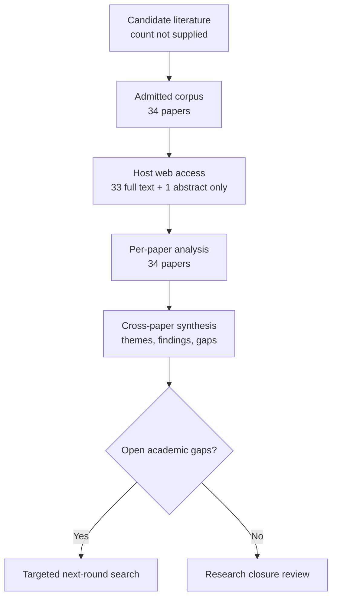

# Research Report: Evidence-Gap-Driven Context Retrieval and Completion for Workplace Communication

## Contents

- [Round History](#round-history)
- [Executive Summary](#executive-summary)
- [Research Question](#research-question)
- [Methodology](#methodology)
- [Papers Reviewed](#papers-reviewed)
- [Research Landscape](#research-landscape)
- [Methodology Comparison](#methodology-comparison)
- [Confidence-Graded Findings](#confidence-graded-findings)
- [Trade-Off Analysis](#trade-off-analysis)
- [Points of Agreement](#points-of-agreement)
- [Points of Contradiction](#points-of-contradiction)
- [Research Gaps](#research-gaps)
- [Reproducibility Notes](#reproducibility-notes)
- [Practical Recommendations](#practical-recommendations)
- [Future Directions](#future-directions)
- [Readiness Assessment (System-Building Mode)](#readiness-assessment-system-building-mode)
- [Evidence Map](#evidence-map)
- [References](#references)
- [Appendix: Run Metadata](#appendix-run-metadata)

## Round History

Iterative gap-closure loop (hard cap: 4 rounds). See
`references/iterative-synthesis.md` for the full loop definition.

| Round | Run ID | Topic / Gap Focus | New Papers | Gaps Addressed | Remaining Gaps |
|-------|--------|-------------------|------------|----------------|----------------|
| 1 | 9af0d6417416 | evidence-gap-driven context retrieval and completion for workplace communication: turning an explicit evidence gap into bounded retrieval, deciding what to fetch next, and knowing when to stop, while preserving permissions, versions, temporal validity, cost and uncertainty | 17 | initial shortlist | 4 academic, 4 engineering |
| 2 | 162dd36d17eb | Integrated adaptive retrieval controllers with structured evidence gaps, temporal and version-aware provenance, permission-aware access, and calibrated bounded-risk stopping | None | academic gaps of the previous round | 4 academic, 4 engineering |

**Stop reason**: another round runs while open academic gaps remain and new papers appear

## Executive Summary

This review investigates how an explicit missing-information need can be converted into a bounded evidence-acquisition loop that decides what to retrieve next, reassesses whether the gap has actually been answered, and stops without confusing retrieval failure, permission denial, stale evidence, or budget exhaustion with a factual negative. The 34-paper corpus provides [HIGH] confidence at the component level that adaptive retrieval, explicit sufficiency assessment, temporal/version-aware retrieval, permission gating, selective abstention, and budget-aware stopping each have useful empirical or theoretical foundations in their own settings [2305.06983] [2604.23783] [2412.15540] [2510.08109] [doi-10-1109-access-2025-3628960] [2208.02814]. The strongest finding is that indiscriminate retrieval is not reliably beneficial: controllers that condition retrieval on information need, sufficiency, uncertainty, value, or budget can reduce unnecessary retrieval and sometimes improve answer quality, while excessive retrieval can introduce irrelevant or misleading evidence [2305.06983] [2403.10081] [2607.24010] [2609.16301]. The most significant gap is that no admitted study validates one integrated controller combining structured evidence gaps, native permission enforcement, version lineage, temporal validity, calibrated stopping, abstention, and total-cost budgeting; therefore component success does not establish end-to-end correctness for workplace communication [2604.23783] [2510.08109] [2412.15540] [2208.02814] [2606.29959].

**Scope**: 34 papers analyzed from 7 web-access host domains over 1994–2026  
**Overall Confidence**: Medium  
**Verdict**: HAS_GAPS

The evidence is strong enough to support a conservative Phase 2 engineering architecture and controlled experiments, but not strong enough to claim that the full integrated controller is academically validated or production-ready for workplace communication.

## Research Question

The investigation asks:

> How should a workplace-information system transform an explicit evidence gap into bounded retrieval, choose the next evidence request, preserve permission and provenance constraints, distinguish successful evidence acquisition from failure or absence, and stop responsibly when the question is answered or further retrieval is no longer justified?

The in-scope control loop is:

1. receive a concrete unresolved information need rather than a generic desire for more context;
2. represent the missing relation, field, antecedent, state, document version, temporal condition, or dependency explicitly;
3. formulate a bounded query or read request;
4. enforce source and user-access constraints before retrieved evidence enters reasoning;
5. preserve source, version, evidence location, and temporal metadata;
6. determine whether the newly retrieved material actually resolves the gap;
7. either issue another justified retrieval request or terminate with an explicit outcome.

A useful engineering abstraction is a controller state

$G_t=(u_t,E_t,T_t,S_t,A_t,B_t)$,

where $u_t$ is the unresolved need, $E_t$ is accumulated evidence, $T_t$ is temporal scope, $S_t$ is permitted source scope, $A_t$ is authorization/access state, and $B_t$ is the remaining retrieval budget. If retrieval step $t$ consumes cost $c_t$, then

$B_{t+1}=B_t-c_t$,

and budget exhaustion is a termination condition, not evidence that the requested fact is false.

The investigation excludes generic vector-search benchmarking without an explicit evidence need, unlimited autonomous browsing, attachment interpretation itself, generic factuality evaluation, and recommendation retrieval unrelated to answering a bounded workplace question. Topic-level semantic decisions remain owned by the upstream topic that generated the gap; this topic owns evidence acquisition and stopping.

## Methodology

### Search Strategy

- **Sources**: arXiv, ACL Anthology, Nature, ResearchGate, author-hosted PDF sites, Carnegie Mellon-hosted PDFs, and University of Arizona-hosted PDFs. The admitted papers were read through the host's web tool at the access levels listed below.
- **Query variants**:
  - `integrated adaptive retrieval controllers structured evidence gaps, temporal version-aware provenance, permission-aware access, calibrated bounded-risk stopping`
  - `integrated adaptive retrieval`
  - `integrated controllers structured evidence gaps, temporal version-aware provenance, permission-aware access, calibrated bounded-risk stopping`
  - `adaptive controllers structured evidence gaps, temporal version-aware provenance, permission-aware access, calibrated bounded-risk stopping`
  - `retrieval controllers structured evidence gaps, temporal version-aware provenance, permission-aware access, calibrated bounded-risk stopping`
  - `integrated adaptive retrieval controllers structured`
  - `integrated adaptive retrieval evidence gaps,`
  - `integrated adaptive retrieval temporal version-aware`
- **Time window**: 1994–2026.
- **Screening**: supplied literature-review pipeline with relevance admission followed by per-paper analysis and independent cross-paper synthesis; exact retrieval-ranking implementation for this run is not specified in the supplied material.
- **Evidence discipline**: findings, themes, and gap status in this report come from the supplied cross-paper synthesis. Inherited handoffs from Topics 03, 04, 05, 06, and 08 are used only to define project boundaries and are not treated as evidence.
- **Final-report synthesis**: the per-paper analyses were produced from papers read through the host's web tool. This report synthesizes those analyses rather than independently rereading all 34 papers again.

### Access Levels

| Paper | Access level used by host web tool |
|---|---|
| [1904.06019] | full_text via arXiv HTML |
| [2010.11915] | full_text via arXiv HTML |
| [2105.04166] | full_text via arXiv HTML |
| [2112.08558] | full_text via arXiv HTML |
| [2208.02814] | full_text via arXiv HTML |
| [2210.03350] | full_text via arXiv HTML |
| [2212.10509] | full_text via arXiv HTML |
| [2305.06983] | full_text via arXiv HTML |
| [2310.11511] | full_text via arXiv HTML |
| [2403.10081] | full_text via arXiv HTML |
| [2406.10490] | full_text via arXiv HTML |
| [2406.19215] | full_text via arXiv HTML |
| [2411.06037] | full_text via arXiv HTML |
| [2412.15540] | full_text via arXiv HTML |
| [2508.01084] | full_text via arXiv HTML |
| [2510.08109] | full_text via arXiv HTML |
| [2510.14337] | full_text via arXiv HTML |
| [2601.19827] | full_text via arXiv HTML |
| [2604.23783] | full_text via arXiv HTML |
| [2604.25676] | full_text via ACL Anthology PDF |
| [2605.03534] | full_text via arXiv HTML |
| [2606.13814] | full_text via arXiv HTML |
| [2606.29090] | full_text via arXiv HTML |
| [2606.29959] | full_text via arXiv HTML |
| [2607.24010] | full_text via arXiv HTML |
| [2608.13237] | full_text via arXiv HTML |
| [2609.16301] | full_text via arXiv HTML |
| [doi-10-1038-s41598-026-71936-x] | abstract_only via Nature |
| [doi-10-1109-access-2025-3628960] | full_text via ResearchGate |
| [doi-10-1145-1247715-1247720] | full_text via author-hosted PDF |
| [doi-10-1145-1571941-1572085] | full_text via Carnegie Mellon-hosted PDF |
| [doi-10-1145-181550-181560] | full_text via University of Arizona-hosted PDF |
| [doi-10-1145-3786625] | full_text via arXiv HTML |
| [doi-10-18653-v1-2026-findings-acl-2090] | full_text via arXiv HTML |

The permission-aware PPPARITL paper is the sole abstract-only source in the admitted set [doi-10-1038-s41598-026-71936-x], so conclusions relying on that paper are kept below the confidence that would be justified by full-text inspection alone.

### Pipeline Summary

| Metric | Count |
|--------|-------|
| Total candidates | unknown |
| After screening | 34 admitted papers |
| Downloaded | unknown; papers were accessed through the host web tool rather than uniformly downloaded |
| Successfully converted | not uniformly applicable to web-read HTML/PDF sources |
| Deeply analyzed | 34 |
| Full-text access | 33 |
| Abstract-only access | 1 |
| Iterations completed | 2 |

## Papers Reviewed

Quality scores were not supplied by the pipeline and are therefore marked `unknown` rather than reconstructed after the fact.

| # | Title | Authors | Year | Venue | Quality Score | Relevance |
|---|-------|---------|------|-------|--------------|-----------|
| 1 | TASR: Training-Free Adaptive Stopping for Iterative Retrieval [2606.13814] | Adrian Kieback, Uyiosa Philip Amadasun, Aman Chadha et al. | 2026 | unknown | unknown | HIGH |
| 2 | Stop-RAG: Value-Based Retrieval Control for Iterative RAG [2510.14337] | Jaewan Park, Solbee Cho, Jay-Yoon Lee | 2025 | unknown | unknown | HIGH |
| 3 | Active, anytime-valid risk controlling prediction sets [2406.10490] | Ziyu Xu, Nikos Karampatziakis, Paul Mineiro | 2024 | unknown | unknown | MEDIUM |
| 4 | CLEAR: Cross-Source Evidence Adjudication for Large Language Models in Medicine [2609.16301] | Shuai Wang, Yize Zhao, Qingyu Chen | 2026 | unknown | unknown | MEDIUM |
| 5 | SURE-RAG: Sufficiency and Uncertainty-Aware Evidence Verification for Selective Retrieval-Augmented Generation [2605.03534] | Jingxi Qiu, Zeyu Han, Cheng Huang | 2026 | unknown | unknown | HIGH |
| 6 | Privacy-provisioned-permission-aware RAG in cloud using identity and access management, trust and large-language models (PPPARITL) [doi-10-1038-s41598-026-71936-x] | Urvashi Rahul Saxena, Samar Shailendra, Rajan Kadel et al. | 2026 | unknown | unknown | HIGH |
| 7 | MRAG: A Modular Retrieval Framework for Time-Sensitive Question Answering [2412.15540] | Siyue Zhang, Yuxiang Xue, Yiming Zhang et al. | 2024 | unknown | unknown | HIGH |
| 8 | Challenges in Information-Seeking QA: Unanswerable Questions and Paragraph Retrieval [2010.11915] | Akari Asai, Eunsol Choi | 2021 | unknown | unknown | HIGH |
| 9 | VersionRAG: Version-Aware Retrieval-Augmented Generation for Evolving Documents [2510.08109] | Daniel Huwiler, Kurt Stockinger, Jonathan Fürst | 2025 | unknown | unknown | HIGH |
| 10 | When Should Active RAG Retrieve? A Budget-Aware Evaluation of Utility, Calibration, and Cost [2607.24010] | Pin Qian, Su Wang, Chong Peng et al. | 2026 | unknown | unknown | HIGH |
| 11 | A Consensus Glossary of Temporal Database Concepts [doi-10-1145-181550-181560] | Christian S. Jensen, James Clifford, Ramez Elmasri et al. | 1994 | unknown | unknown | MEDIUM |
| 12 | Conformal Risk Control [2208.02814] | Anastasios N. Angelopoulos, Stephen Bates, Adam Fisch et al. | 2022 | unknown | unknown | MEDIUM |
| 13 | Conformal Prediction Under Covariate Shift [1904.06019] | Ryan J. Tibshirani, Rina Foygel Barber, Emmanuel J. Candès et al. | 2019 | unknown | unknown | MEDIUM |
| 14 | HONEYBEE: Efficient Role-based Access Control for Vector Databases via Dynamic Partitioning [doi-10-1145-3786625] | Hongbin Zhong, Matthew Lentz, Nina Narodytska et al. | 2026 | unknown | unknown | HIGH |
| 15 | When Iterative RAG Beats Ideal Evidence: A Diagnostic Study in Scientific Multi-hop Question Answering [2601.19827] | Mahdi Astaraki, Mohammad Arshi Saloot, Ali Shiraee Kasmaee et al. | 2026 | unknown | unknown | MEDIUM |
| 16 | Self-RAG: Learning to Retrieve, Generate, and Critique through Self-Reflection [2310.11511] | Akari Asai, Zeqiu Wu, Yizhong Wang et al. | 2023 | unknown | unknown | HIGH |
| 17 | Provably Secure Retrieval-Augmented Generation [2508.01084] | Pengcheng Zhou, Yinglun Feng, Zhongliang Yang | 2025 | unknown | unknown | MEDIUM |
| 18 | Few-Shot Conversational Dense Retrieval [2105.04166] | Shi Yu, Zhenghao Liu, Chenyan Xiong et al. | 2021 | unknown | unknown | MEDIUM |
| 19 | SeaKR: Self-aware Knowledge Retrieval for Adaptive Retrieval Augmented Generation [2406.19215] | Zijun Yao, Weijian Qi, Liangming Pan et al. | 2025 | unknown | unknown | HIGH |
| 20 | S2G-RAG: Structured Sufficiency and Gap Judging for Iterative Retrieval-Augmented QA [2604.23783] | Minghan Li, Junjie Zou, Xinxuan Lv et al. | 2026 | unknown | unknown | HIGH |
| 21 | Sufficient Context: A New Lens on Retrieval Augmented Generation Systems [2411.06037] | Hailey Joren, Jianyi Zhang, Chun-Sung Ferng et al. | 2025 | unknown | unknown | HIGH |
| 22 | Active Retrieval Augmented Generation [2305.06983] | Zhengbao Jiang, Frank F. Xu, Luyu Gao et al. | 2023 | unknown | unknown | HIGH |
| 23 | When Should Multi-Round RAG Stop? Structured Stopping Judgments and Retrieval Reduction in Search-R1 [2608.13237] | Weimeng Luo | 2026 | unknown | unknown | HIGH |
| 24 | Beyond Single-Shot: Multi-step Tool Retrieval via Query Planning [doi-10-18653-v1-2026-findings-acl-2090] | Wei Fang, James R. Glass | 2026 | Findings of ACL 2026 | unknown | MEDIUM |
| 25 | CORAL: Adaptive Retrieval Loop for Culturally-Aligned Multilingual RAG [2604.25676] | Nayeon Lee, Jiwoo Song, Byeongcheol Kang | 2026 | unknown | unknown | MEDIUM |
| 26 | Interleaving Retrieval with Chain-of-Thought Reasoning for Knowledge-Intensive Multi-Step Questions [2212.10509] | Harsh Trivedi, Niranjan Balasubramanian, Tushar Khot et al. | 2023 | unknown | unknown | HIGH |
| 27 | CONQRR: Conversational Query Rewriting for Retrieval with Reinforcement Learning [2112.08558] | Zeqiu Wu, Yi Luan, Hannah Rashkin et al. | 2022 | unknown | unknown | HIGH |
| 28 | Temporal profiles of queries [doi-10-1145-1247715-1247720] | Rosie Jones, Fernando Diaz | 2007 | unknown | unknown | MEDIUM |
| 29 | Improving search relevance for implicitly temporal queries [doi-10-1145-1571941-1572085] | Donald Metzler, Rosie Jones, Fuchun Peng et al. | 2009 | unknown | unknown | MEDIUM |
| 30 | DRAGIN: Dynamic Retrieval Augmented Generation based on the Information Needs of Large Language Models [2403.10081] | Weihang Su, Yichen Tang, Qingyao Ai et al. | 2024 | unknown | unknown | HIGH |
| 31 | AB-RAG: Adaptive Budgeted Retrieval-Augmented Generation for Reliable Question Answering [2606.29090] | Ansh Kamthan | 2026 | unknown | unknown | HIGH |
| 32 | Know Before You Fetch: Calibrated Retrieval-Budget Allocation for Retrieval-Augmented Generation [2606.29959] | Zhe Dong, Fang Qin, Manish Shah et al. | 2026 | unknown | unknown | HIGH |
| 33 | Measuring and Narrowing the Compositionality Gap in Language Models [2210.03350] | Ofir Press, Muru Zhang, Sewon Min et al. | 2023 | unknown | unknown | MEDIUM |
| 34 | Permission-Aware RAG: Identity and Access Management (IAM)-Based Access Filtering in Multi-Resource Environments [doi-10-1109-access-2025-3628960] | Jooyoung Jeong, Sang Goo Lee | 2025 | IEEE Access | unknown | HIGH |

## Research Landscape

### Theme 1: Adaptive Retrieval Instead of Indiscriminate Retrieval

**Coverage**: 8+ papers | **Confidence**: High  
**Supporting papers**: [2305.06983], [2310.11511], [2403.10081], [2406.19215], [2601.19827], [2606.29090], [2607.24010], [2609.16301]

[HIGH] The literature consistently supports making retrieval conditional rather than treating additional context as unconditionally beneficial. Active retrieval, self-reflective retrieval, information-need-driven retrieval, self-aware retrieval, and budget-aware evaluations all show that retrieval timing and selection materially affect downstream results [2305.06983] [2310.11511] [2403.10081] [2406.19215] [2607.24010]. Additional retrieval can also introduce irrelevant or misleading evidence, so retrieval depth cannot be justified merely by the availability of more searchable material [2305.06983] [2607.24010] [2609.16301].

Key findings:

1. [HIGH] Adaptive retrieval timing can outperform fixed or indiscriminate retrieval on several evaluated QA and generation settings [2305.06983] [2310.11511] [2403.10081] [2406.19215].
2. [HIGH] More retrieval is not monotonically better; harmful evidence and additional cost create a real stopping problem [2607.24010] [2609.16301].
3. [MEDIUM] Iterative retrieval can sometimes outperform presentation of static ideal evidence in scientific multi-hop QA, indicating that the retrieval/reasoning process itself can matter, not only the final evidence set [2601.19827].

### Theme 2: Structured Sufficiency and Explicit Evidence Gaps

**Coverage**: 3 core papers plus adjacent planning work | **Confidence**: High for benchmark QA; Medium for workplace transfer  
**Supporting papers**: [2604.23783], [2411.06037], [2010.11915], [doi-10-18653-v1-2026-findings-acl-2090]

[HIGH] S2G-RAG provides the closest direct academic analogue to the desired control abstraction: it converts judged insufficiency into structured gap items and uses those gaps to drive further retrieval; its reported ablation indicates that the sufficiency/gap judge is important to its benchmark performance [2604.23783]. Sufficient-context work independently supports separating "the retrieved material is inadequate" from "generation failed despite adequate context" [2411.06037]. Unanswerable-question analysis similarly shows that answerability is materially constrained by what evidence is actually available [2010.11915].

Key findings:

1. [HIGH] Explicit sufficiency and gap judgments can be operational control signals rather than mere post-hoc diagnostics [2604.23783].
2. [HIGH] Retrieval success and answerability are distinct: finding passages does not prove that the unresolved question has become answerable [2010.11915] [2411.06037].
3. [MEDIUM] Multi-step planning supports decomposed retrieval behavior, but does not close the problem of representing temporal, multi-entity, and complex compositional gaps [doi-10-18653-v1-2026-findings-acl-2090] [2604.23783].

### Theme 3: Stopping, Selective Answering, Calibration, and Risk

**Coverage**: 10 papers across RAG control and statistical risk control | **Confidence**: High for existence of useful mechanisms; Low for an integrated guarantee  
**Supporting papers**: [2510.14337], [2606.13814], [2606.29090], [2608.13237], [2605.03534], [2607.24010], [1904.06019], [2208.02814], [2406.10490], [2606.29959]

[HIGH] Multiple RAG systems use value, confidence, answer stability, uncertainty, or structured sufficiency to decide whether another retrieval round is worthwhile [2510.14337] [2606.13814] [2606.29090] [2608.13237] [2605.03534]. These mechanisms reduce retrieval or improve quality-cost trade-offs in the evaluated settings, but observed failures include unsafe early stopping, conservative over-retrieval, calibration drift, and model-dependent gains [2510.14337] [2607.24010] [2608.13237].

[HIGH] Separately, conformal methods provide formal finite-sample, shift-aware, or anytime-valid risk-control results under explicit statistical assumptions [1904.06019] [2208.02814] [2406.10490]. However, those guarantees have not been demonstrated for the integrated iterative-RAG controller required here.

Key findings:

1. [HIGH] A fixed universal confidence threshold is not supported by the evidence; threshold transfer can fail on held-out or shifted inputs [2607.24010].
2. [HIGH] Formal bounded-risk ideas exist, but their assumptions and guarantees cannot simply be inherited by a multi-stage evidence-gap RAG controller [1904.06019] [2208.02814] [2406.10490].
3. [HIGH] Stopping should therefore be treated as a deployment policy requiring empirical calibration and hard resource limits rather than as a solved theoretical component [2605.03534] [2607.24010] [2608.13237].

### Theme 4: Temporal Validity and Version-Aware Retrieval

**Coverage**: 6 papers spanning temporal IR, temporal databases, and evolving documents | **Confidence**: High at component level  
**Supporting papers**: [2412.15540], [2510.08109], [doi-10-1145-181550-181560], [doi-10-1145-1247715-1247720], [doi-10-1145-1571941-1572085]

[HIGH] Semantic relevance alone is insufficient when the answer depends on a specific point in time or on an evolving document. MRAG reports improved retrieval and QA behavior for time-sensitive questions, while VersionRAG improves version-sensitive QA compared with its reported baselines [2412.15540] [2510.08109]. Temporal-information-retrieval work establishes that queries may carry explicit or implicit temporal intent [doi-10-1145-1247715-1247720] [doi-10-1145-1571941-1572085], while temporal-database concepts distinguish valid time from transaction time, a distinction directly relevant to workplace evidence whose effective date and collection/version date can differ [doi-10-1145-181550-181560].

Key findings:

1. [HIGH] "Latest" is not an adequate general retrieval policy for time-sensitive questions [2412.15540] [doi-10-1145-181550-181560].
2. [HIGH] Evolving-document questions benefit from version-aware representations rather than treating all chunks as timeless interchangeable text [2510.08109].
3. [LOW] No admitted paper demonstrates that temporal validity, version lineage, and structured gap-driven stopping work correctly when integrated in one controller [2412.15540] [2510.08109] [2604.23783].

### Theme 5: Permission-Aware and Secure Retrieval

**Coverage**: 4 papers | **Confidence**: Medium  
**Supporting papers**: [doi-10-1109-access-2025-3628960], [doi-10-1038-s41598-026-71936-x], [2508.01084], [doi-10-1145-3786625]

[MEDIUM] Permission-aware retrieval can be enforced before evidence reaches the effective reasoning context through IAM checks, access filtering, authenticated or encrypted architectures, and RBAC-aware vector-index partitioning [doi-10-1109-access-2025-3628960] [2508.01084] [doi-10-1145-3786625]. PPPARITL also addresses IAM-centered permission-aware RAG, but this review had abstract-only access to that paper [doi-10-1038-s41598-026-71936-x].

Key findings:

1. [MEDIUM] Authorization should be part of retrieval execution, not a post-generation cleanup step [doi-10-1109-access-2025-3628960] [doi-10-1145-3786625].
2. [MEDIUM] Security mechanisms can prevent unauthorized material from becoming ordinary retrieved context in the evaluated architectures [2508.01084] [doi-10-1109-access-2025-3628960].
3. [LOW] The literature does not show a repeated evidence-gap loop that filters unauthorized candidates, reassesses sufficiency, and then issues another permission-constrained request when the authorized subset remains inadequate [doi-10-1109-access-2025-3628960] [2604.23783].

### Theme 6: Query Formulation and Retrieval Planning

**Coverage**: 7 papers | **Confidence**: High  
**Supporting papers**: [2105.04166], [2112.08558], [2604.23783], [2604.25676], [doi-10-18653-v1-2026-findings-acl-2090], [2212.10509], [2210.03350]

[HIGH] Query construction is itself a control variable. Conversational dense retrieval, reinforcement-learned rewriting, gap-derived queries, critique-driven reformulation, and multi-step planning can all improve evidence acquisition in their evaluated settings [2105.04166] [2112.08558] [2604.23783] [2604.25676] [doi-10-18653-v1-2026-findings-acl-2090]. At the same time, query rewriting can omit important context or introduce incorrect information [2112.08558], meaning that an evidence-gap controller must preserve the unresolved requirement separately from any generated search string.

Key findings:

1. [HIGH] Rewriting is useful but cannot safely become the sole representation of the evidence need [2112.08558].
2. [HIGH] Iterative planning and decomposition are useful for multi-hop evidence acquisition [2212.10509] [doi-10-18653-v1-2026-findings-acl-2090].
3. [MEDIUM] Gap-derived query construction is a promising direct mechanism for msgloom, but current validation is primarily QA rather than workplace communication [2604.23783].

### Theme 7: Cost Is Multidimensional

**Coverage**: 5 core papers | **Confidence**: High  
**Supporting papers**: [2607.24010], [2606.29959], [2606.29090], [2412.15540], [doi-10-1145-3786625]

[HIGH] Retrieval-policy quality cannot be summarized by answer accuracy alone. Existing work separately measures retrieval use, passage/token budgets, adaptive allocation, computational overhead, and authorization/index trade-offs [2607.24010] [2606.29959] [2606.29090] [2412.15540] [doi-10-1145-3786625]. Different metrics can change which controller appears preferable, and calibration selected from historical workloads may not preserve intended resource use on held-out inputs [2607.24010].

Key findings:

1. [HIGH] Retrieval-call count alone is an incomplete cost metric [2607.24010] [2412.15540].
2. [HIGH] Adaptive budget allocation can make retrieval effort query-dependent rather than uniform [2606.29090] [2606.29959].
3. [LOW] No admitted system reports one end-to-end accounting that simultaneously covers retrieval calls, retrieved passages/tokens, planner and judge inference, reranking, permission checks, parsing/grounding work, and wall-clock latency.

### Theme 8: Source Identity, Conflict, and Evidence Adjudication

**Coverage**: 1 direct cross-source paper plus adjacent retrieval work | **Confidence**: Medium  
**Supporting papers**: [2609.16301], [2010.11915], [2411.06037]

[MEDIUM] CLEAR demonstrates the value of preserving evidence-source identity while adjudicating among parametric, curated-local, and dynamically retrieved evidence; targeted follow-up retrieval can change some final answers, although only a minority of triggered follow-ups produce accepted revisions [2609.16301]. The result supports keeping source identity and disagreement visible rather than flattening all evidence into one undifferentiated context.

Key findings:

1. [MEDIUM] Cross-source agreement and conflict can itself be a trigger for additional targeted evidence acquisition [2609.16301].
2. [HIGH] Lack of usable evidence should remain distinguishable from evidence supporting a negative answer [2010.11915] [2411.06037].
3. [LOW] Cross-source adjudication has not been integrated with version lineage, permissions, temporal validity, and bounded stopping in the admitted corpus.

## Methodology Comparison

| Approach | Papers | Strengths | Weaknesses | Best For | Performance |
|----------|--------|-----------|------------|----------|-------------|
| Active / need-triggered retrieval | [2305.06983] [2403.10081] [2406.19215] [2310.11511] | Avoids unconditional retrieval; conditions retrieval on model state or information need | Trigger quality may be model-dependent; does not by itself represent explicit workplace evidence gaps | Deciding whether retrieval is needed during generation | Reported quality/retrieval-efficiency gains in evaluated QA/generation settings |
| Structured sufficiency + gap judging | [2604.23783] [2411.06037] | Makes missing evidence explicit and supports iterative reassessment | Current gap schema is not validated for all temporal, multi-entity, or compositional needs | Turning insufficiency into the next retrieval objective | Strong benchmark results and important ablation contribution reported for S2G-RAG |
| Learned/value-based stopping | [2510.14337] [2606.13814] [2608.13237] | Can reduce unnecessary iterations and optimize quality-cost trade-offs | Unsafe early stops, over-retrieval, transfer sensitivity | Multi-round retrieval termination | Reported retrieval reductions or quality-cost improvements, with documented exceptions |
| Confidence/budget allocation | [2606.29090] [2606.29959] [2607.24010] | Allocates retrieval effort selectively; exposes budget-performance frontier | Calibration may drift; simple uncertainty methods can sometimes be competitive | Explicit resource-constrained retrieval | Reported budget/utility trade-offs; no universal controller dominance |
| Temporal retrieval | [2412.15540] [doi-10-1145-1247715-1247720] [doi-10-1145-1571941-1572085] | Incorporates temporal intent beyond semantic similarity | Does not solve version lineage or permission-aware stopping | Time-sensitive evidence questions | Reported retrieval/QA improvements for temporal benchmarks |
| Version-aware retrieval | [2510.08109] | Represents evolving document states and version transitions | Not combined with IAM, sufficiency stopping, or temporal-validity control | Questions about changing documents | Reported substantial improvement over the paper's naive-RAG and GraphRAG baselines |
| Permission-aware filtering | [doi-10-1109-access-2025-3628960] [doi-10-1038-s41598-026-71936-x] [doi-10-1145-3786625] | Prevents unauthorized evidence from entering ordinary retrieval context | Replenishment after filtering is not evaluated | Enterprise/multi-resource access-controlled retrieval | Enforcement and efficiency evaluated in constructed/synthetic environments |
| Formal conformal risk control | [1904.06019] [2208.02814] [2406.10490] | Provides mathematically explicit guarantees under stated assumptions | Assumptions are not shown to hold for integrated iterative RAG | Statistical risk control and calibration research | Formal finite-sample/shift-aware/anytime-valid guarantees in their original settings |
| Conversational rewriting / planning | [2105.04166] [2112.08558] [doi-10-18653-v1-2026-findings-acl-2090] | Improves retrieval by carrying context and decomposing retrieval tasks | Rewrites can omit useful context or hallucinate details | Turning dialogue context into search actions | Reported retrieval improvements with documented rewrite errors |
| Cross-source adjudication | [2609.16301] | Keeps sources distinct and explicitly reasons over agreement/conflict | Medical domain; follow-up retrieval does not always alter final answers | Conflicting evidence and targeted follow-up | Aggregate gains reported in evaluated medical QA setting |

## Confidence-Graded Findings

### 🟢 High Confidence (supported by 3+ papers with consistent results)

1. **[HIGH] Adaptive retrieval is preferable to unconditional retrieval as the default control model.** — Supported by [2305.06983], [2310.11511], [2403.10081], [2406.19215], [2607.24010], and [2609.16301]. Across different QA and generation settings, retrieval benefit is heterogeneous, and additional retrieval can introduce both cost and harmful evidence.

2. **[HIGH] Evidence sufficiency must be assessed separately from retrieval occurrence.** — Supported by [2604.23783], [2010.11915], and [2411.06037]. Retrieving material does not imply that the unresolved question is answerable, and sufficient-context assessment can distinguish retrieval insufficiency from downstream reasoning/generation failure.

3. **[HIGH] Stopping is a substantive reliability problem, not merely a latency optimization.** — Supported by [2510.14337], [2606.13814], [2606.29090], [2608.13237], [2605.03534], and [2607.24010]. Useful stopping mechanisms exist, but unsafe early stops, conservative over-retrieval, and calibration-transfer failures remain observable.

4. **[HIGH] Time-sensitive and version-sensitive questions require more than ordinary semantic retrieval.** — Supported by [2412.15540], [2510.08109], [doi-10-1145-181550-181560], [doi-10-1145-1247715-1247720], and [doi-10-1145-1571941-1572085]. Temporal relevance, valid/effective time, collection/version time, and document evolution can materially change which evidence is appropriate.

5. **[HIGH] Query formulation materially affects retrieval quality and is itself a failure surface.** — Supported by [2105.04166], [2112.08558], [2604.23783], [2604.25676], and [doi-10-18653-v1-2026-findings-acl-2090]. Rewriting and planning can improve retrieval, but generated queries may omit needed context or introduce incorrect assumptions.

6. **[HIGH] Retrieval-system evaluation must include budget and cost dimensions in addition to answer quality.** — Supported by [2607.24010], [2606.29959], [2606.29090], and [2412.15540]. Different budgets, usage measures, and threshold-transfer behavior can materially change the apparent value of a controller.

7. **[HIGH] Formal statistical risk-control mechanisms exist, but do not establish a risk guarantee for integrated RAG stopping.** — Supported by [1904.06019], [2208.02814], and [2406.10490]. The formal results are meaningful within their own assumptions and settings; transfer to iterative evidence-gap retrieval remains unvalidated.

### 🟡 Medium Confidence (supported by 1-2 papers or with caveats)

1. **[MEDIUM] Permission-aware retrieval should enforce access before evidence becomes ordinary model context.** — Supported by [doi-10-1109-access-2025-3628960], [2508.01084], and [doi-10-1145-3786625], with additional abstract-only support from [doi-10-1038-s41598-026-71936-x]. The engineering principle is well aligned with the evidence, but repeated evidence-gap replenishment after authorization filtering has not been evaluated.

2. **[MEDIUM] Preserving distinct evidence-source identities is useful when sources agree or conflict.** — Reported by [2609.16301]. The study supports targeted follow-up retrieval after cross-source adjudication, but its medical setting limits direct workplace generalization.

3. **[MEDIUM] Typed evidence-gap objects are a plausible direct controller interface.** — Strongly supported in the S2G-RAG benchmark setting [2604.23783], but temporal constraints, complex multi-entity joins, and richer compositional requirements remain explicitly unvalidated.

4. **[MEDIUM] Iterative retrieval may improve outcomes even relative to static presentation of strong evidence in some multi-hop settings.** — Reported in scientific QA by [2601.19827]. This should not be generalized into a claim that more retrieval is normally better.

### 🔴 Low Confidence (preliminary, single-source, or not jointly validated)

1. **[LOW] A unified controller combining structured gaps, IAM filtering, temporal validity, version lineage, calibrated stopping, abstention, and cost budgeting is correct for workplace communication.** — No admitted paper establishes this. The literature supports the components separately [2604.23783] [doi-10-1109-access-2025-3628960] [2510.08109] [2412.15540] [2208.02814] [2606.29959].

2. **[LOW] Formal bounded-risk guarantees from conformal prediction directly apply to iterative RAG stopping under workload shift.** — Not established. Existing formal guarantees are in adjacent statistical settings [1904.06019] [2208.02814] [2406.10490], whereas RAG evaluations document calibration-transfer and stopping failures [2607.24010] [2608.13237].

3. **[LOW] The current literature establishes production accuracy for heterogeneous workplace email, Teams messages, attachments, revisions, access restrictions, and multi-hop evidence dependencies.** — No admitted study performs that evaluation.

## Trade-Off Analysis

| Decision | Option A | Option B | Recommendation |
|----------|----------|----------|----------------|
| Retrieval trigger | Retrieve on every potentially relevant step: high recall potential but greater noise/cost [2305.06983] | Retrieve only after explicit insufficiency/information-need signal [2403.10081] [2604.23783] | Prefer explicit need/sufficiency-driven retrieval, with a conservative fallback when uncertainty is high |
| Evidence-need representation | Use only a generated search query | Maintain a structured unresolved-gap object and derive queries from it [2604.23783] | Keep the gap object authoritative; treat queries as disposable retrieval actions |
| Stop policy | Fixed round count or universal confidence threshold | Adaptive sufficiency/value/uncertainty policy plus hard maximum budget [2510.14337] [2607.24010] [2608.13237] | Use adaptive stopping but always retain hard resource caps and unresolved termination |
| Temporal selection | Prefer newest evidence | Select evidence valid for the question's temporal scope [2412.15540] [doi-10-1145-181550-181560] | Store and evaluate multiple clocks rather than equating "latest" with "correct" |
| Version handling | Flatten all document versions into one searchable corpus | Preserve version identity and transitions [2510.08109] | Use version-aware retrieval and retain source/version lineage end to end |
| Permission handling | Retrieve broadly then remove unauthorized evidence later | Apply access filtering before evidence enters reasoning [doi-10-1109-access-2025-3628960] [doi-10-1145-3786625] | Enforce authorization inside the retrieval path |
| Empty results | Interpret no hit as absence | Treat empty retrieval as an explicit retrieval outcome requiring semantic interpretation [2010.11915] [2411.06037] | Never convert search failure into negative factual evidence without source/query semantics that justify it |
| Query rewriting | Replace original need with rewritten query | Preserve original need and separately record generated query [2112.08558] | Use rewrite/planning as retrieval machinery, not as the truth representation |
| Cost optimization | Optimize retrieval-call count only | Track calls, passages/tokens, planner/judge inference, authorization, grounding, and latency [2607.24010] [2412.15540] | Adopt end-to-end controller accounting |
| Failure state | Force a best answer at termination | Preserve unresolved/abstained outcome [2411.06037] [2605.03534] | Prefer explicit unresolved status over invented closure |

## Points of Agreement

1. **[HIGH] Retrieval should be conditional on need rather than automatic.** — Consistent evidence appears across active retrieval, self-reflective RAG, dynamic information-need retrieval, self-aware retrieval, and budget-aware evaluation [2305.06983] [2310.11511] [2403.10081] [2406.19215] [2607.24010].

2. **[HIGH] Additional retrieval has non-zero downside.** — Added evidence can consume budget and can introduce irrelevant or misleading information [2305.06983] [2607.24010] [2609.16301].

3. **[HIGH] Sufficiency is not equivalent to successful search execution.** — Explicit sufficiency work, unanswerability analysis, and sufficient-context annotation all distinguish evidence availability from eventual answer correctness [2604.23783] [2010.11915] [2411.06037].

4. **[HIGH] Stopping signals are imperfect and must be evaluated empirically.** — Value-based, confidence-based, stability-based, and structured stopping methods all show useful behavior alongside identifiable failure modes [2510.14337] [2606.13814] [2606.29090] [2608.13237].

5. **[HIGH] Temporal relevance is a distinct retrieval dimension.** — Temporal IR and time-sensitive QA work consistently show that semantic similarity alone does not capture all evidence relevance [doi-10-1145-1247715-1247720] [doi-10-1145-1571941-1572085] [2412.15540].

6. **[HIGH] Evolving documents require explicit treatment of version.** — VersionRAG shows that version-sensitive QA benefits from version-aware retrieval, while temporal database concepts provide a vocabulary for separating effective and recorded time [2510.08109] [doi-10-1145-181550-181560].

7. **[MEDIUM] Enterprise retrieval requires authorization-aware execution.** — Permission-aware RAG, secure RAG, and RBAC-aware vector indexing converge on enforcing access constraints around retrieval rather than assuming a globally visible corpus [doi-10-1109-access-2025-3628960] [2508.01084] [doi-10-1145-3786625].

8. **[HIGH] Cost must be treated as part of the controller objective.** — Budget-aware studies show that retrieval usage and answer quality trade off and that calibration does not automatically transfer across workloads [2607.24010] [2606.29090] [2606.29959].

## Points of Contradiction

No direct cross-paper contradiction was identified in the supplied synthesis. The important apparent tensions are differences of scope or experimental conditions rather than mutually exclusive factual claims.

1. **[MEDIUM] Iterative retrieval versus retrieval harm**: Iterative retrieval can outperform static ideal-evidence presentation in scientific multi-hop QA [2601.19827], while other work shows that excessive or poorly timed retrieval can reduce performance [2305.06983] [2607.24010] [2609.16301].
   - **Possible explanation**: the studies use different tasks, retrievers, evidence distributions, and retrieval policies.
   - **Implication**: neither "retrieve more" nor "retrieve less" is a generally valid policy; the controller must estimate the marginal value of another retrieval step.

2. **[MEDIUM] Learned stopping versus simple uncertainty signals**: Stop-RAG reports benefits for its learned value-based controller [2510.14337], while the budget-aware evaluation in [2607.24010] finds settings where simple uncertainty baselines can rival learned routing.
   - **Possible explanation**: controllers are evaluated with different backbones, workloads, budgets, and calibration protocols.
   - **Implication**: msgloom should benchmark learned and simpler policies on the same fixtures before adding model complexity.

3. **[MEDIUM] Stopping consistency claims versus within-paper exception**: Stop-RAG's broad positive stopping results include a CoRAG HotpotQA exception where the controller does not dominate compared baselines [2510.14337].
   - **Possible explanation**: controller benefit is workload- and backbone-dependent.
   - **Implication**: controller selection should be based on held-out target-like evaluation, not on a universal expectation of dominance.

## Research Gaps

All eight gaps remain open. None is accepted or closed. The literature has not yet answered them.

| # | Gap | Type | Severity | Rounds Already Searched | Impact on Goals |
|---|-----|------|----------|-------------------------|-----------------|
| 1 | **[ACADEMIC] Structured gap representations are not validated for temporal constraints, multi-entity joins, and complex compositional evidence requirements.** | [ACADEMIC] | HIGH | 1, 2 | Without this, a controller may be unable to faithfully encode important workplace missing-information needs before retrieval [2604.23783]. |
| 2 | **[ACADEMIC] No study jointly preserves document-version lineage, freshness/effective-time validity, and structured sufficiency decisions in one iterative evidence-gap loop.** | [ACADEMIC] | HIGH | 1, 2 | Retrieval can return the semantically right text from the wrong version or wrong time [2510.08109] [2412.15540] [2604.23783]. |
| 3 | **[ACADEMIC] General bounded-risk stopping under distribution shift remains unvalidated for iterative RAG.** | [ACADEMIC] | HIGH | 1, 2 | Unsafe early stopping can miss decision-essential evidence, while over-retrieval increases cost and noise [2608.13237] [2607.24010]. |
| 4 | **[ENGINEERING] No bounded replenishment evaluation combines native-IAM filtering, sufficiency reassessment, and another permission-constrained query when authorized evidence remains incomplete.** | [ENGINEERING] | HIGH | 1 | Authorization filtering could otherwise be mistaken for evidence absence [doi-10-1109-access-2025-3628960] [2604.23783]. |
| 5 | **[ENGINEERING] Existing systems do not jointly distinguish empty retrieval, authorization denial, unavailable source, unsupported extraction, exhausted budget, and justified negative evidence.** | [ENGINEERING] | HIGH | 1 | Collapsing these outcomes can silently convert infrastructure or permission failures into false factual conclusions [2010.11915] [2411.06037]. |
| 6 | **[ENGINEERING] Unified end-to-end cost accounting remains absent.** | [ENGINEERING] | MEDIUM | 1 | Without total cost accounting, controller comparisons can optimize one resource while shifting cost into judging, reranking, access checks, grounding, or latency [2607.24010] [2412.15540]. |
| 7 | **[ENGINEERING] There is no workplace-communication benchmark combining explicit evidence gaps, heterogeneous messages/documents, multi-hop dependencies, permissions, stale/conflicting evidence, and bounded retrieval.** | [ENGINEERING] | HIGH | 1 | Transfer evidence cannot establish production workplace reliability. |
| 8 | **[ACADEMIC] No single controller jointly handles structured gaps, permission-aware access, version lineage, temporal validity, calibrated stopping, abstention, and total-cost budgeting.** | [ACADEMIC] | HIGH | 1, 2 | Component-level success does not establish integrated correctness [2604.23783] [2510.08109] [2412.15540] [2208.02814] [2606.29959]. |

### Academic Gaps (require more papers)

1. **[ACADEMIC][HIGH] Rich structured evidence-gap schemas**: The literature has not answered whether a structured gap representation can reliably encode temporal predicates, joins over multiple entities, conditional requirements, or complex compositional dependencies. S2G-RAG directly identifies limitations in this direction rather than validating them [2604.23783].  
   **Rounds searched**: 1, 2.  
   **Suggested queries**: `"structured evidence gap" temporal constraints multi-entity compositional retrieval iterative RAG`.

2. **[ACADEMIC][HIGH] Joint temporal/version-aware sufficiency loop**: VersionRAG, MRAG, and S2G-RAG validate version-aware retrieval, temporal retrieval, and structured insufficiency separately; no admitted paper joins them [2510.08109] [2412.15540] [2604.23783]. The literature has not answered this gap yet.  
   **Rounds searched**: 1, 2.  
   **Suggested queries**: `"version-aware retrieval" temporal provenance iterative RAG document lineage freshness sufficiency`.

3. **[ACADEMIC][HIGH] Bounded-risk stopping under distribution shift**: RAG studies document unsafe early stopping, over-retrieval, and calibration-transfer failures [2608.13237] [2607.24010], while conformal studies provide guarantees only under adjacent statistical formulations [1904.06019] [2208.02814] [2406.10490]. The literature has not established a general bounded-risk iterative-RAG stopping guarantee under shift.  
   **Rounds searched**: 1, 2.  
   **Suggested queries**: `"adaptive retrieval" calibrated stopping domain shift selective prediction RAG risk`.

4. **[ACADEMIC][HIGH] Integrated controller correctness**: No admitted paper validates the complete combination of structured gaps, permissions, temporal and version provenance, calibrated stopping, abstention, and cost budgeting. The literature has not answered this integration problem yet [2604.23783] [doi-10-1109-access-2025-3628960] [2510.08109] [2412.15540] [2208.02814] [2606.29959].  
   **Rounds searched**: 1, 2.  
   **Suggested queries**: `"enterprise RAG" permission-aware provenance temporal adaptive retrieval calibrated stopping abstention`.

### Engineering Gaps (fillable without papers)

1. **[ENGINEERING][HIGH] Permission-constrained replenishment**: The literature has not tested the required behavior after access filtering removes candidates.  
   **Rounds searched**: 1.  
   **Suggested resolution**: construct a local fixture where relevant candidates include authorized and unauthorized resources; require the controller to filter before reasoning, reassess sufficiency, and issue another authorized query when needed. Gold evidence and authorization labels must remain outside controller inputs.

2. **[ENGINEERING][HIGH] Explicit terminal/failure taxonomy**: The literature has not jointly evaluated empty search, denied read, unavailable source, unsupported extraction, budget exhaustion, and evidence-backed negative results.  
   **Rounds searched**: 1.  
   **Suggested resolution**: represent each outcome as a distinct typed state and mutation-test that no state is silently mapped to `false`, `not found`, or `resolved`.

3. **[ENGINEERING][MEDIUM] Unified total-cost instrumentation**: The corpus has not supplied a complete controller-level cost model.  
   **Rounds searched**: 1.  
   **Suggested resolution**: instrument retrieval calls, returned passages/tokens, planner/judge tokens and latency, reranker work, authorization checks, parsing/grounding work, retries, and end-to-end wall-clock latency.

4. **[ENGINEERING][HIGH] Workplace communication benchmark**: No admitted paper provides the needed target-domain evaluation.  
   **Rounds searched**: 1.  
   **Suggested resolution**: build independent synthetic/adversarial fixtures and later authorized production-domain evaluation containing missing antecedents, uncertain owners, historical approvals, stale/conflicting document versions, denied reads, multi-hop dependencies, unavailable attachments, query-rewrite failures, and budget exhaustion. Synthetic results must not be described as production representativeness.

## Reproducibility Notes

The supplied analyses do not provide systematic code-repository, dataset-release, or license metadata. Those fields are therefore marked `unknown`; no availability is inferred merely from an arXiv or publisher page.

| Paper | Code Available | Data Available | Sufficient Detail | License |
|-------|---------------|----------------|-------------------|---------|
| [2606.13814] | unknown | unknown | unknown | unknown |
| [2510.14337] | unknown | unknown | unknown | unknown |
| [2406.10490] | unknown | unknown | unknown | unknown |
| [2609.16301] | unknown | unknown | unknown | unknown |
| [2605.03534] | unknown | unknown | unknown | unknown |
| [doi-10-1038-s41598-026-71936-x] | unknown | unknown | abstract-only access | unknown |
| [2412.15540] | unknown | unknown | unknown | unknown |
| [2010.11915] | unknown | unknown | unknown | unknown |
| [2510.08109] | unknown | unknown | unknown | unknown |
| [2607.24010] | unknown | unknown | unknown | unknown |
| [doi-10-1145-181550-181560] | unknown | unknown | unknown | unknown |
| [2208.02814] | unknown | unknown | unknown | unknown |
| [1904.06019] | unknown | unknown | unknown | unknown |
| [doi-10-1145-3786625] | unknown | unknown | unknown | unknown |
| [2601.19827] | unknown | unknown | unknown | unknown |
| [2310.11511] | unknown | unknown | unknown | unknown |
| [2508.01084] | unknown | unknown | unknown | unknown |
| [2105.04166] | unknown | unknown | unknown | unknown |
| [2406.19215] | unknown | unknown | unknown | unknown |
| [2604.23783] | unknown | unknown | unknown | unknown |
| [2411.06037] | unknown | unknown | unknown | unknown |
| [2305.06983] | unknown | unknown | unknown | unknown |
| [2608.13237] | unknown | unknown | unknown | unknown |
| [doi-10-18653-v1-2026-findings-acl-2090] | unknown | unknown | unknown | unknown |
| [2604.25676] | unknown | unknown | unknown | unknown |
| [2212.10509] | unknown | unknown | unknown | unknown |
| [2112.08558] | unknown | unknown | unknown | unknown |
| [doi-10-1145-1247715-1247720] | unknown | unknown | unknown | unknown |
| [doi-10-1145-1571941-1572085] | unknown | unknown | unknown | unknown |
| [2403.10081] | unknown | unknown | unknown | unknown |
| [2606.29090] | unknown | unknown | unknown | unknown |
| [2606.29959] | unknown | unknown | unknown | unknown |
| [2210.03350] | unknown | unknown | unknown | unknown |
| [doi-10-1109-access-2025-3628960] | unknown | unknown | unknown | unknown |

## Practical Recommendations

1. **[HIGH] Represent every investigation as a typed evidence-gap object, not a generic "find more context" request.** — S2G-RAG shows that explicit sufficiency and gap judgments can successfully drive iterative evidence acquisition [2604.23783], while sufficient-context work supports separating evidence inadequacy from downstream answer failure [2411.06037]. The object should retain the unresolved target, relation/slot, known evidence, temporal scope, source scope, authorization scope, and budget/retry state.  
   *Confidence*: High for the control principle; Medium for workplace transfer.

2. **[HIGH] Implement a bounded retrieve → reassess → retrieve-or-stop loop.** — Adaptive retrieval and stopping work consistently shows that retrieval timing matters and that unnecessary retrieval can hurt [2305.06983] [2403.10081] [2510.14337] [2607.24010]. Termination outcomes should include `answered`, `still_insufficient`, `budget_exhausted`, `access_denied`, `source_unavailable`, `extraction_unsupported`, and `search_empty`.  
   *Confidence*: High.

3. **[HIGH] Do not collapse retrieval failure into negative evidence.** — Unanswerability and sufficient-context studies show that absence of adequate accessible evidence is distinct from evidence establishing a negative proposition [2010.11915] [2411.06037]. Empty results, permission denial, and unavailable sources must remain epistemically separate.  
   *Confidence*: High.

4. **[MEDIUM] Enforce authorization before evidence enters the reasoning context.** — Permission-aware retrieval and RBAC-aware indexing support pre-context access filtering [doi-10-1109-access-2025-3628960] [doi-10-1145-3786625], with adjacent secure-RAG support [2508.01084]. If filtering leaves the gap unresolved, another authorized retrieval attempt should be allowed rather than interpreting excluded evidence as absent.  
   *Confidence*: Medium because the repeated replenishment loop itself is not evaluated.

5. **[HIGH] Preserve version and temporal provenance separately from semantic relevance.** — MRAG and VersionRAG show independent benefits for temporal and version-sensitive retrieval [2412.15540] [2510.08109], while temporal database concepts distinguish valid/effective time from transaction/recording time [doi-10-1145-181550-181560]. A provenance record should identify source/resource, source-local identifier, document or attachment version, evidence location, effective/valid time where available, and collection/version time.  
   *Confidence*: High for component need; Medium for the proposed combined representation.

6. **[HIGH] Preserve the evidence gap independently from generated search queries.** — Conversational query-rewriting work documents omission and incorrect-information errors in generated rewrites [2112.08558]. The authoritative need should remain immutable enough to detect whether reformulation has drifted away from the original unresolved requirement.  
   *Confidence*: High.

7. **[HIGH] Treat stopping thresholds as calibrated deployment parameters, not universal constants.** — Budget-aware evaluation documents threshold-transfer problems [2607.24010], while multi-round stopping work finds unsafe early-stop behavior [2608.13237]. Use held-out and shifted workloads, explicit abstention, and a hard maximum retrieval budget.  
   *Confidence*: High.

8. **[HIGH] Keep sufficiency, answer confidence, retrieval utility, and authorization state as separate controller signals.** — The literature treats these as distinct mechanisms [2604.23783] [2605.03534] [2510.14337] [doi-10-1109-access-2025-3628960]. Conflating them risks using confidence as a proxy for evidence completeness or using authorization filtering as a proxy for factual absence.  
   *Confidence*: High for separation; integrated validation remains open.

9. **[HIGH] Measure controller cost end to end.** — Budget-aware RAG work shows that retrieval usage, quality, and calibration interact [2607.24010] [2606.29959] [2606.29090], and MRAG explicitly considers computational overhead [2412.15540]. msgloom should include retrieval, tokens/passages, planning/judging, reranking, authorization, parsing/grounding, retries, and wall-clock latency.  
   *Confidence*: High.

10. **[HIGH] Preserve unresolved status when the bounded loop terminates without enough evidence.** — Selective-generation and answerability work supports withholding unsupported answers rather than treating insufficient context as resolved [2411.06037] [2605.03534] [2010.11915].  
    *Confidence*: High.

11. **[MEDIUM] Keep evidence-source identities separate when conflicting sources are available.** — CLEAR shows that explicit cross-source adjudication can identify cases for targeted follow-up retrieval [2609.16301]. For msgloom, source, version, time, and authorization should remain visible through the final state assessment.  
    *Confidence*: Medium because the direct evidence is medical QA.

12. **[HIGH] Build adversarial engineering fixtures before production use.** — The academic corpus reveals distinct failure modes for rewrite drift, stopping, budget calibration, temporal selection, version selection, and permission filtering [2112.08558] [2607.24010] [2608.13237] [2412.15540] [2510.08109] [doi-10-1109-access-2025-3628960]. Fixtures should independently vary each factor and keep gold evidence outside controller inputs.  
    *Confidence*: High as an evaluation recommendation, though direct workplace benchmark evidence remains absent.

## Future Directions

1. Search specifically for structured retrieval plans or evidence representations that encode temporal predicates, multi-entity relationships, prerequisites, conjunctions, and compositional missing-information requirements beyond the current S2G-RAG schema [2604.23783].

2. Search for systems that jointly combine evolving-document version lineage with effective-time validity and iterative sufficiency reassessment, rather than treating temporal and version retrieval as separate problems [2510.08109] [2412.15540].

3. Investigate whether conformal risk-control techniques can be reformulated for multi-round RAG stopping while accounting for adaptive retrieval, non-stationary workload shift, and non-independent controller decisions [1904.06019] [2208.02814] [2406.10490].

4. Build and evaluate a permission-constrained replenishment loop in which filtering unauthorized candidates can trigger a new scoped query without exposing the excluded evidence or treating it as negative evidence [doi-10-1109-access-2025-3628960] [doi-10-1145-3786625].

5. Define a typed failure/termination ontology and test it under empty search, denied access, source deletion, unsupported attachment extraction, stale version, conflicting versions, budget exhaustion, and legitimate negative evidence.

6. Develop an end-to-end cost model covering all controller-side work rather than only search calls or retrieved-token budgets [2607.24010] [2606.29959] [2412.15540].

7. Construct a workplace-communication evaluation corpus or controlled fixture suite that combines multi-thread messages, attachments, historical approvals, missing owners, references to previous decisions, temporal changes, access control, and bounded retrieval. Transfer evidence from QA should remain explicitly labeled as transfer evidence.

8. Keep Topic 07's ownership boundary narrow: once additional evidence is obtained, semantic resolution of topic identity, reference scope, action meaning, factual state, or document interpretation should return to the appropriate upstream/downstream topic rather than being silently absorbed into the retrieval controller.

## Readiness Assessment (System-Building Mode)

### Verdict: HAS_GAPS

### Assessment Summary

The literature is sufficient to design and prototype a conservative bounded investigation controller: explicit gap representation, need-triggered retrieval, authorization before reasoning, version/time provenance, iterative sufficiency reassessment, adaptive stopping, hard budgets, abstention, and detailed telemetry all have defensible component-level support [2604.23783] [2305.06983] [doi-10-1109-access-2025-3628960] [2510.08109] [2412.15540] [2608.13237]. It is not sufficient to claim end-to-end correctness or production readiness because no admitted study validates the integrated controller in workplace communication, and all eight gaps remain open.

### Coverage Matrix

| Dimension | Status | Evidence |
|-----------|--------|----------|
| Architecture patterns | ✅ Sufficient for prototype | Explicit gaps and iterative retrieval [2604.23783]; adaptive retrieval [2305.06983] [2403.10081]; stopping [2510.14337] [2608.13237] |
| Technology stack | ⚠️ Partial | Permission/IAM and vector-index patterns exist [doi-10-1109-access-2025-3628960] [doi-10-1145-3786625], but no complete msgloom-like stack is validated |
| Performance baselines | ⚠️ Partial | QA/RAG benchmarks provide transfer baselines [2604.23783] [2607.24010] [2510.08109] [2412.15540]; workplace baseline is missing |
| Security model | ⚠️ Partial | Permission enforcement and secure retrieval mechanisms exist [doi-10-1109-access-2025-3628960] [2508.01084] [doi-10-1145-3786625]; replenishment under filtering is untested |
| Trade-off map | ✅ Sufficient for experiment design | Retrieval utility/cost, stopping, calibration, and budget trade-offs are documented [2510.14337] [2607.24010] [2606.29959] |
| Structured evidence gaps | ⚠️ Partial | Direct support from [2604.23783], but richer temporal/multi-entity/compositional gaps remain open |
| Temporal validity | ⚠️ Partial | Temporal retrieval and temporal data concepts supported [2412.15540] [doi-10-1145-181550-181560], not integrated with full controller |
| Version lineage | ⚠️ Partial | Version-aware retrieval supported [2510.08109], not integrated with IAM and stopping |
| Abstention / unresolved outcome | ✅ Sufficient for prototype | Answerability and selective-generation evidence [2010.11915] [2411.06037] [2605.03534] |
| Formal bounded-risk stopping | ❌ Missing for integrated RAG | Adjacent guarantees exist [1904.06019] [2208.02814] [2406.10490], but transfer is unvalidated |
| Workplace-domain validation | ❌ Missing | No admitted paper evaluates the full target setting |

### Gap Resolution Plan

| # | Gap | Type | Severity | Resolution |
|---|-----|------|----------|------------|
| 1 | Rich structured evidence-gap schema | [ACADEMIC] | HIGH | Target temporal/compositional/multi-entity retrieval-planning literature in the next academic round |
| 2 | Joint version + time + sufficiency loop | [ACADEMIC] | HIGH | Search for temporal-provenance and evolving-document iterative RAG; if absent, retain as open integration research |
| 3 | Bounded-risk stopping under shift | [ACADEMIC] | HIGH | Target selective-prediction and sequential-risk literature that explicitly interfaces with adaptive RAG |
| 4 | IAM-aware replenishment loop | [ENGINEERING] | HIGH | Build a controlled permission fixture and test filter → reassess → retry behavior |
| 5 | Failure/terminal-state taxonomy | [ENGINEERING] | HIGH | Implement typed outcomes and adversarial regression/mutation tests |
| 6 | Unified end-to-end cost accounting | [ENGINEERING] | MEDIUM | Add controller telemetry covering all retrieval and reasoning stages |
| 7 | Workplace communication benchmark | [ENGINEERING] | HIGH | Build independent synthetic/adversarial fixtures, then validate later on authorized domain data |
| 8 | Integrated controller | [ACADEMIC] | HIGH | Continue targeted literature search; do not infer integrated correctness from component papers |

## Evidence Map

| Research Question Aspect | Primary Evidence | Evidence Contribution |
|--------------------------|------------------|-----------------------|
| Explicit evidence-gap representation | [2604.23783] | Structured sufficiency and typed gap-driven iterative retrieval |
| Distinguishing insufficient context from answer failure | [2411.06037] [2010.11915] | Context sufficiency and unanswerability |
| Adaptive retrieval timing | [2305.06983] [2403.10081] [2406.19215] [2310.11511] | Need-conditioned retrieval rather than fixed retrieval |
| Iterative/multi-step planning | [2212.10509] [doi-10-18653-v1-2026-findings-acl-2090] | Multi-hop and planned retrieval |
| Query rewriting risks | [2105.04166] [2112.08558] | Contextual retrieval plus rewrite omission/addition errors |
| Adaptive stopping | [2510.14337] [2606.13814] [2608.13237] | Learned value, stability, structured stopping, unsafe-stop analysis |
| Selective answering / uncertainty | [2605.03534] [2411.06037] | Sufficiency and uncertainty-aware selective generation |
| Budget-aware retrieval | [2606.29090] [2606.29959] [2607.24010] | Adaptive budgets, calibrated allocation, utility/cost evaluation |
| Formal risk control | [1904.06019] [2208.02814] [2406.10490] | Covariate-shift, bounded-risk, and anytime-valid statistical methods |
| Temporal query intent | [doi-10-1145-1247715-1247720] [doi-10-1145-1571941-1572085] | Explicit/implicit temporal relevance in search |
| Temporal retrieval | [2412.15540] | Time-sensitive retrieval and QA |
| Multiple temporal dimensions | [doi-10-1145-181550-181560] | Valid-time and transaction-time distinction |
| Version-aware retrieval | [2510.08109] | Retrieval over evolving document versions |
| Permission-aware access | [doi-10-1109-access-2025-3628960] [doi-10-1038-s41598-026-71936-x] | IAM-centered retrieval filtering |
| RBAC-aware indexing | [doi-10-1145-3786625] | Permission-aware vector-index partitioning |
| Secure retrieval architecture | [2508.01084] | Security-oriented RAG mechanism |
| Cross-source conflict and follow-up | [2609.16301] | Source-preserving adjudication and targeted follow-up retrieval |
| Iterative retrieval versus static evidence | [2601.19827] | Diagnostic evidence that process can matter in scientific multi-hop QA |
| Compositional multi-hop reasoning difficulty | [2210.03350] | Evidence on compositionality gaps relevant to multi-hop requirements |
| Integrated workplace controller | No admitted paper | Remains [ACADEMIC][HIGH] open gap |

## References

1. [2606.13814] — *TASR: Training-Free Adaptive Stopping for Iterative Retrieval*. Adrian Kieback, Uyiosa Philip Amadasun, Aman Chadha et al. 2026. Venue: unknown.
2. [2510.14337] — *Stop-RAG: Value-Based Retrieval Control for Iterative RAG*. Jaewan Park, Solbee Cho, Jay-Yoon Lee. 2025. Venue: unknown.
3. [2406.10490] — *Active, anytime-valid risk controlling prediction sets*. Ziyu Xu, Nikos Karampatziakis, Paul Mineiro. 2024. Venue: unknown.
4. [2609.16301] — *CLEAR: Cross-Source Evidence Adjudication for Large Language Models in Medicine*. Shuai Wang, Yize Zhao, Qingyu Chen. 2026. Venue: unknown.
5. [2605.03534] — *SURE-RAG: Sufficiency and Uncertainty-Aware Evidence Verification for Selective Retrieval-Augmented Generation*. Jingxi Qiu, Zeyu Han, Cheng Huang. 2026. Venue: unknown.
6. [doi-10-1038-s41598-026-71936-x] — *Privacy-provisioned-permission-aware RAG in cloud using identity and access management, trust and large-language models (PPPARITL)*. Urvashi Rahul Saxena, Samar Shailendra, Rajan Kadel et al. 2026. Venue: unknown.
7. [2412.15540] — *MRAG: A Modular Retrieval Framework for Time-Sensitive Question Answering*. Siyue Zhang, Yuxiang Xue, Yiming Zhang et al. 2024. Venue: unknown.
8. [2010.11915] — *Challenges in Information-Seeking QA: Unanswerable Questions and Paragraph Retrieval*. Akari Asai, Eunsol Choi. 2021. Venue: unknown.
9. [2510.08109] — *VersionRAG: Version-Aware Retrieval-Augmented Generation for Evolving Documents*. Daniel Huwiler, Kurt Stockinger, Jonathan Fürst. 2025. Venue: unknown.
10. [2607.24010] — *When Should Active RAG Retrieve? A Budget-Aware Evaluation of Utility, Calibration, and Cost*. Pin Qian, Su Wang, Chong Peng et al. 2026. Venue: unknown.
11. [doi-10-1145-181550-181560] — *A Consensus Glossary of Temporal Database Concepts*. Christian S. Jensen, James Clifford, Ramez Elmasri et al. 1994. Venue: unknown.
12. [2208.02814] — *Conformal Risk Control*. Anastasios N. Angelopoulos, Stephen Bates, Adam Fisch et al. 2022. Venue: unknown.
13. [1904.06019] — *Conformal Prediction Under Covariate Shift*. Ryan J. Tibshirani, Rina Foygel Barber, Emmanuel J. Candès et al. 2019. Venue: unknown.
14. [doi-10-1145-3786625] — *HONEYBEE: Efficient Role-based Access Control for Vector Databases via Dynamic Partitioning*. Hongbin Zhong, Matthew Lentz, Nina Narodytska et al. 2026. Venue: unknown.
15. [2601.19827] — *When Iterative RAG Beats Ideal Evidence: A Diagnostic Study in Scientific Multi-hop Question Answering*. Mahdi Astaraki, Mohammad Arshi Saloot, Ali Shiraee Kasmaee et al. 2026. Venue: unknown.
16. [2310.11511] — *Self-RAG: Learning to Retrieve, Generate, and Critique through Self-Reflection*. Akari Asai, Zeqiu Wu, Yizhong Wang et al. 2023. Venue: unknown.
17. [2508.01084] — *Provably Secure Retrieval-Augmented Generation*. Pengcheng Zhou, Yinglun Feng, Zhongliang Yang. 2025. Venue: unknown.
18. [2105.04166] — *Few-Shot Conversational Dense Retrieval*. Shi Yu, Zhenghao Liu, Chenyan Xiong et al. 2021. Venue: unknown.
19. [2406.19215] — *SeaKR: Self-aware Knowledge Retrieval for Adaptive Retrieval Augmented Generation*. Zijun Yao, Weijian Qi, Liangming Pan et al. 2025. Venue: unknown.
20. [2604.23783] — *S2G-RAG: Structured Sufficiency and Gap Judging for Iterative Retrieval-Augmented QA*. Minghan Li, Junjie Zou, Xinxuan Lv et al. 2026. Venue: unknown.
21. [2411.06037] — *Sufficient Context: A New Lens on Retrieval Augmented Generation Systems*. Hailey Joren, Jianyi Zhang, Chun-Sung Ferng et al. 2025. Venue: unknown.
22. [2305.06983] — *Active Retrieval Augmented Generation*. Zhengbao Jiang, Frank F. Xu, Luyu Gao et al. 2023. Venue: unknown.
23. [2608.13237] — *When Should Multi-Round RAG Stop? Structured Stopping Judgments and Retrieval Reduction in Search-R1*. Weimeng Luo. 2026. Venue: unknown.
24. [doi-10-18653-v1-2026-findings-acl-2090] — *Beyond Single-Shot: Multi-step Tool Retrieval via Query Planning*. Wei Fang, James R. Glass. 2026. Findings of ACL 2026.
25. [2604.25676] — *CORAL: Adaptive Retrieval Loop for Culturally-Aligned Multilingual RAG*. Nayeon Lee, Jiwoo Song, Byeongcheol Kang. 2026. Venue: unknown.
26. [2212.10509] — *Interleaving Retrieval with Chain-of-Thought Reasoning for Knowledge-Intensive Multi-Step Questions*. Harsh Trivedi, Niranjan Balasubramanian, Tushar Khot et al. 2023. Venue: unknown.
27. [2112.08558] — *CONQRR: Conversational Query Rewriting for Retrieval with Reinforcement Learning*. Zeqiu Wu, Yi Luan, Hannah Rashkin et al. 2022. Venue: unknown.
28. [doi-10-1145-1247715-1247720] — *Temporal profiles of queries*. Rosie Jones, Fernando Diaz. 2007. Venue: unknown.
29. [doi-10-1145-1571941-1572085] — *Improving search relevance for implicitly temporal queries*. Donald Metzler, Rosie Jones, Fuchun Peng et al. 2009. Venue: unknown.
30. [2403.10081] — *DRAGIN: Dynamic Retrieval Augmented Generation based on the Information Needs of Large Language Models*. Weihang Su, Yichen Tang, Qingyao Ai et al. 2024. Venue: unknown.
31. [2606.29090] — *AB-RAG: Adaptive Budgeted Retrieval-Augmented Generation for Reliable Question Answering*. Ansh Kamthan. 2026. Venue: unknown.
32. [2606.29959] — *Know Before You Fetch: Calibrated Retrieval-Budget Allocation for Retrieval-Augmented Generation*. Zhe Dong, Fang Qin, Manish Shah et al. 2026. Venue: unknown.
33. [2210.03350] — *Measuring and Narrowing the Compositionality Gap in Language Models*. Ofir Press, Muru Zhang, Sewon Min et al. 2023. Venue: unknown.
34. [doi-10-1109-access-2025-3628960] — *Permission-Aware RAG: Identity and Access Management (IAM)-Based Access Filtering in Multi-Resource Environments*. Jooyoung Jeong, Sang Goo Lee. 2025. IEEE Access.

## Appendix: Run Metadata

- **Run ID**: `162dd36d17eb`
- **Round**: 2 of at most 4
- **Research topic**: evidence-gap-driven context retrieval and completion for workplace communication: turning an explicit evidence gap into bounded retrieval, deciding what to fetch next, and knowing when to stop, while preserving permissions, versions, temporal validity, cost and uncertainty
- **Round-2 focus**: Integrated adaptive retrieval controllers with structured evidence gaps, temporal and version-aware provenance, permission-aware access, and calibrated bounded-risk stopping
- **Papers in synthesized corpus**: 34
- **Access**: 33 full-text, 1 abstract-only
- **Sources / access hosts**: arXiv, ACL Anthology, Nature, ResearchGate, author-hosted PDF, Carnegie Mellon-hosted PDF, University of Arizona-hosted PDF
- **Pipeline version**: unknown
- **Date**: 2026-09-17
- **Artifacts**: `runs/162dd36d17eb/`
- **Open gaps after this round**: 4 [ACADEMIC], 4 [ENGINEERING]
- **Overall evidence status**: [HIGH] confidence in individual component mechanisms, [MEDIUM] confidence in transfer of the component design principles to workplace communication, and [LOW] confidence that the literature has established the correctness of the fully integrated controller.
- **Important limitation**: the corpus is dominated by open-domain QA, RAG benchmarks, scientific and medical QA, tool retrieval, synthetic/constructed enterprise evaluations, and vector-database settings rather than direct workplace-communication evaluations.
- **Inherited handoff policy**: Topics 03, 04, 05, 06, and 08 define starting conditions and ownership boundaries only; their findings are not evidence for this report.
