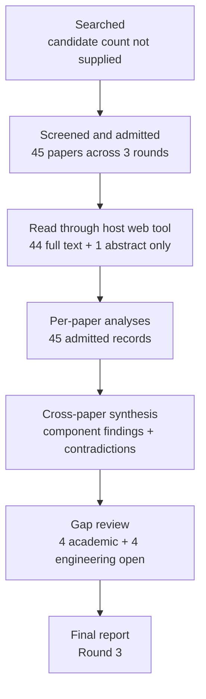

# Research Report: Evidence-gap-driven context retrieval and completion for workplace communication

## Contents

- [Round History](#round-history)
- [Executive Summary](#executive-summary)
- [Research Question](#research-question)
- [Methodology](#methodology)
- [Papers Reviewed](#papers-reviewed)
- [Research Landscape](#research-landscape)
- [Confidence-Graded Findings](#confidence-graded-findings)
- [Research Gaps](#research-gaps)
- [Practical Recommendations](#practical-recommendations)
- [Evidence Map](#evidence-map)
- [References](#references)
- [Appendix: Run Metadata](#appendix-run-metadata)

## Round History

Iterative gap-closure loop (hard cap: 4 rounds). See
`references/iterative-synthesis.md` for the full loop definition.

| Round | Run ID | Topic / Gap Focus | New Papers | Gaps Addressed | Remaining Gaps |
|-------|--------|-------------------|------------|----------------|----------------|
| 1 | 9af0d6417416 | evidence-gap-driven context retrieval and completion for workplace communication: turning an explicit evidence gap into bounded retrieval, deciding what to fetch next, and knowing when to stop, while preserving permissions, versions, temporal validity, cost and uncertainty | 17 | initial shortlist | 4 academic, 4 engineering |
| 2 | 162dd36d17eb | Integrated adaptive retrieval controllers with structured evidence gaps, temporal and version-aware provenance, permission-aware access, and calibrated bounded-risk stopping | 17 | 0 resolved | 4 academic, 4 engineering |
| 3 | 1f23ec07113d | Joint adaptive RAG controllers for structured evidence-gap completion with temporal and version-aware provenance and calibrated risk-controlled stopping under distribution shift | 11 | academic gaps of the previous round | 4 academic, 4 engineering |

**Stop reason**: another round runs while open academic gaps remain and new papers appear

## Executive Summary

This review investigated how an explicit missing-evidence requirement can drive bounded context retrieval, iterative evidence completion, and responsible stopping while retaining permission constraints, temporal validity, document-version identity, provenance, uncertainty, and cost. Across 45 admitted papers, the strongest [HIGH] evidence supports component mechanisms: adaptive or interleaved retrieval can outperform indiscriminate retrieval in knowledge-intensive QA, explicit temporal/version modeling improves retrieval over evolving corpora, and explicit sufficiency signals can improve selective answering and stopping decisions [2212.10509] [2305.06983] [2403.10081] [2510.08109] [2510.13590] [2604.23783]. Formal risk-control literature additionally shows that calibrated guarantees are possible under stated assumptions, while ordinary calibration can deteriorate under distribution shift [1904.06019] [2208.02814] [2406.10490] [2606.15964] [2606.29054]. The most significant [LOW] integrative conclusion is that the complete msgloom-style controller remains unvalidated: no admitted study jointly combines structured evidence gaps, permission-aware access, version lineage, temporal validity, calibrated stopping/abstention, distribution-shift handling, and total-cost accounting in heterogeneous workplace communication.

**Scope**: 45 papers analyzed from web-accessible arXiv, ACL Anthology, AAAI, TechScience, Nature, ResearchGate-hosted, ACM-related/institutional, and author-hosted sources over 1994–2026  
**Overall Confidence**: Medium  
**Verdict**: HAS_GAPS

## Research Question

The investigation asked:

> How should a workplace-information system turn an explicit evidence gap into a bounded, permission-preserving investigation; decide what evidence to retrieve next; distinguish retrieval failure from genuine negative evidence; preserve temporal and document-version validity; and stop, abstain, or continue under explicit risk and cost constraints?

The in-scope research object is an iterative controller of the form

$current\ topic + question + known\ evidence \rightarrow explicit\ gap \rightarrow bounded\ retrieval \rightarrow source\text{-}mapped\ result \rightarrow reassessment \rightarrow stop/retry/abstain$.

A useful synthesis-level state representation is

$s_t=(g_t,\ A_t,\ \tau_t,\ v_t,\ E_t,\ C_t,\ B_t)$,

where $g_t$ is the unresolved evidence requirement, $A_t$ the authorized source scope, $\tau_t$ temporal constraints, $v_t$ version/provenance constraints, $E_t$ accumulated evidence, $C_t$ unresolved conflicts, and $B_t$ the remaining investigation budget. This is a design abstraction derived from the reviewed components, not a jointly validated model.

In scope were adaptive/active/iterative retrieval, conversational query formulation, explicit evidence sufficiency, unanswerability, retrieval stopping, budget allocation, temporal and version-aware retrieval, permission-aware retrieval, provenance, contradiction handling, selective prediction, conformal risk control, and distribution shift.

Out of scope were generic retrieval benchmarking without an explicit information need, unlimited autonomous browsing, attachment parsing itself, general factuality evaluation detached from retrieval decisions, and recommendation retrieval unrelated to answering a bounded work question.

## Methodology

### Search Strategy

- **Sources**: The admitted papers were read through the host's web tool. Access endpoints included arXiv HTML, ACL Anthology PDF, AAAI PDF, TechScience HTML, Nature article pages, ResearchGate-hosted full text, institutional/author-hosted PDFs, and other supplied web-accessible scholarly copies.
- **Query variants**:
  - `joint adaptive rag controllers structured evidence-gap completion temporal version-aware provenance calibrated risk-controlled stopping under distribution shift`
  - `joint adaptive rag`
  - `joint controllers structured evidence-gap completion temporal version-aware provenance calibrated risk-controlled stopping under distribution shift`
  - `adaptive controllers structured evidence-gap completion temporal version-aware provenance calibrated risk-controlled stopping under distribution shift`
  - `rag controllers structured evidence-gap completion temporal version-aware provenance calibrated risk-controlled stopping under distribution shift`
  - `joint adaptive rag controllers structured`
  - `joint adaptive rag evidence-gap completion`
  - `joint adaptive rag temporal version-aware`
- **Time window**: 1994–2026.
- **Screening**: The exact candidate-screening implementation and total pre-screening candidate count are not supplied in the final run metadata. Forty-five papers were admitted across three rounds: 17 + 17 + 11.
- **Evidence discipline**: Inherited handoffs from Topics 03, 04, 05, 06, and 08 were used only to define scope and ownership boundaries. They were not used as evidence for findings or gap closure.
- **Access limitation**: 44 admitted papers had full-text access recorded; one paper, [doi-10-1038-s41598-026-71936-x], had abstract-only access. The final synthesis therefore gives lower weight to generalization from that record.
- **Synthesis limitation**: The supplied cross-paper synthesis was based on reduced per-paper analyses. Consequently, this final report does not invent unreported experimental metrics, code availability, licenses, or section-level evidence locations.

### Pipeline Summary

| Metric | Count |
|--------|-------|
| Total candidates | Unknown from supplied run metadata |
| After screening / admitted | 45 |
| Full-text access | 44 |
| Abstract-only access | 1 |
| Successfully converted | Unknown from supplied run metadata |
| Deeply analyzed | 45 admitted paper records |
| Iterations | 3 |

The recorded access level for every admitted paper was:

| Paper | Access level | Access endpoint |
|---|---|---|
| [1904.06019] | full_text | arXiv HTML |
| [2010.11915] | full_text | arXiv HTML |
| [2105.04166] | full_text | arXiv HTML |
| [2112.08558] | full_text | arXiv HTML |
| [2208.02814] | full_text | arXiv HTML |
| [2210.03350] | full_text | arXiv HTML |
| [2212.10509] | full_text | arXiv HTML |
| [2305.06983] | full_text | arXiv HTML |
| [2310.11511] | full_text | arXiv HTML |
| [2403.10081] | full_text | arXiv HTML |
| [2406.10490] | full_text | arXiv HTML |
| [2406.19215] | full_text | arXiv HTML |
| [2411.06037] | full_text | arXiv HTML |
| [2412.15540] | full_text | arXiv HTML |
| [2508.01084] | full_text | arXiv HTML |
| [2510.08109] | full_text | arXiv HTML |
| [2510.13590] | full_text | arXiv HTML |
| [2510.14337] | full_text | arXiv HTML |
| [2601.19827] | full_text | arXiv HTML |
| [2603.28444] | full_text | arXiv HTML |
| [2604.01413] | full_text | arXiv HTML |
| [2604.23783] | full_text | arXiv HTML |
| [2604.25676] | full_text | ACL Anthology PDF |
| [2605.03534] | full_text | arXiv HTML |
| [2606.05658] | full_text | arXiv HTML |
| [2606.13814] | full_text | arXiv HTML |
| [2606.15964] | full_text | arXiv HTML |
| [2606.29054] | full_text | arXiv HTML |
| [2606.29090] | full_text | arXiv HTML |
| [2606.29959] | full_text | arXiv HTML |
| [2607.24010] | full_text | arXiv HTML |
| [2607.27726] | full_text | arXiv HTML |
| [2608.13237] | full_text | arXiv HTML |
| [2609.11572] | full_text | arXiv HTML |
| [2609.16301] | full_text | arXiv HTML |
| [doi-10-1038-s41598-026-71936-x] | abstract_only | Nature article page |
| [doi-10-1109-access-2025-3628960] | full_text | ResearchGate-hosted full text |
| [doi-10-1145-1247715-1247720] | full_text | Author-hosted PDF |
| [doi-10-1145-1571941-1572085] | full_text | Institutional PDF |
| [doi-10-1145-181550-181560] | full_text | Institutional PDF |
| [doi-10-1145-3786625] | full_text | arXiv HTML |
| [doi-10-1609-aaai-v39i14-33670] | full_text | AAAI PDF |
| [doi-10-18653-v1-2026-acl-long-1562] | full_text | ACL Anthology PDF |
| [doi-10-18653-v1-2026-findings-acl-2090] | full_text | arXiv HTML |
| [doi-10-32604-cmc-2026-086343] | full_text | TechScience HTML |

## Papers Reviewed

Quality scores were not supplied by the pipeline, so none are invented below. Relevance is a synthesis-level assessment of proximity to Topic 07 rather than a paper-quality judgment.

| # | Title | Authors | Year | Venue | Quality Score | Relevance |
|---|-------|---------|------|-------|--------------|-----------|
| 1 | Adaptive Stopping for Multi-Turn LLM Reasoning [2604.01413] | Xiaofan Zhou, Huy Nguyen, Bo Yu et al. | 2026 | Not supplied | Not scored | HIGH |
| 2 | Agent-Orchestrated Adaptive RAG: A Comparative Study on Structured and Multi-Hop Retrieval [2606.05658] | Anuj Maharjan, Devinder Kaur, Richard Molyet | 2026 | Not supplied | Not scored | HIGH |
| 3 | When Can Conformal Risk Control Certify LLM Outputs? Bounds, Impossibility, and Adaptation for Structured Generation [2606.29054] | Varun Kotte | 2026 | Not supplied | Not scored | HIGH |
| 4 | Do LLMs Know When Evidence is Insufficient? An Evidence Sufficiency Benchmark for Answer-Abstention Calibration in Retrieval-Augmented Generation [doi-10-32604-cmc-2026-086343] | Hantian Zhang, Wentai Wu | 2026 | Not supplied | Not scored | HIGH |
| 5 | RAG Meets Temporal Graphs: Time-Sensitive Modeling and Retrieval for Evolving Knowledge [2510.13590] | Jiale Han, Austin Cheung, Yubai Wei et al. | 2025 | Not supplied | Not scored | HIGH |
| 6 | Entropic Claim Resolution: Uncertainty-Driven Evidence Selection for RAG [2603.28444] | Davide Di Gioia | 2026 | Not supplied | Not scored | HIGH |
| 7 | RAG-on-a-Diet: A Reinforcement Learning-Based Dynamic Resource Optimization Framework for RAG [doi-10-18653-v1-2026-acl-long-1562] | Hongwen Ding, Yizheng Zhao | 2026 | Not supplied | Not scored | HIGH |
| 8 | PromptShift-CRC: Drift-Aware Conformal Risk Control for Foundation Models Under Prompt and Domain Shift [2606.15964] | Jeffery Opoku, David Banahene | 2026 | Not supplied | Not scored | HIGH |
| 9 | Baikal: Structured Search for Deep Research over Data Lakes [2607.27726] | Dhruv Agarwal, Rishitha Guttapalle Mohan, Aarti Kumari et al. | 2026 | Not supplied | Not scored | MEDIUM |
| 10 | Temporal Conjunctive Query Answering via Rewriting [doi-10-1609-aaai-v39i14-33670] | Lukas Westhofen, Jean Christoph Jung, Daniel Neider | 2025 | Not supplied | Not scored | MEDIUM |
| 11 | TimelyRAG: Semantic-Temporal Hybrid Retrieval for Time-Critical Question Answering in Overlapping-Evolving Documents [2609.11572] | Youngeun Nam, Joeun Kim, Hwanjun Song et al. | 2026 | Not supplied | Not scored | HIGH |
| 12 | Few-Shot Conversational Dense Retrieval [2105.04166] | Shi Yu, Zhenghao Liu, Chenyan Xiong et al. | 2021 | Not supplied | Not scored | MEDIUM |
| 13 | SeaKR: Self-aware Knowledge Retrieval for Adaptive Retrieval Augmented Generation [2406.19215] | Zijun Yao, Weijian Qi, Liangming Pan et al. | 2025 | Not supplied | Not scored | HIGH |
| 14 | S2G-RAG: Structured Sufficiency and Gap Judging for Iterative Retrieval-Augmented QA [2604.23783] | Minghan Li, Junjie Zou, Xinxuan Lv et al. | 2026 | Not supplied | Not scored | HIGH |
| 15 | Sufficient Context: A New Lens on Retrieval Augmented Generation Systems [2411.06037] | Hailey Joren, Jianyi Zhang, Chun-Sung Ferng et al. | 2025 | Not supplied | Not scored | HIGH |
| 16 | Active Retrieval Augmented Generation [2305.06983] | Zhengbao Jiang, Frank F. Xu, Luyu Gao et al. | 2023 | Not supplied | Not scored | HIGH |
| 17 | When Should Multi-Round RAG Stop? Structured Stopping Judgments and Retrieval Reduction in Search-R1 [2608.13237] | Weimeng Luo | 2026 | Not supplied | Not scored | HIGH |
| 18 | Beyond Single-Shot: Multi-step Tool Retrieval via Query Planning [doi-10-18653-v1-2026-findings-acl-2090] | Wei Fang, James R. Glass | 2026 | Not supplied | Not scored | HIGH |
| 19 | CORAL: Adaptive Retrieval Loop for Culturally-Aligned Multilingual RAG [2604.25676] | Nayeon Lee, Jiwoo Song, Byeongcheol Kang | 2026 | Not supplied | Not scored | MEDIUM |
| 20 | Interleaving Retrieval with Chain-of-Thought Reasoning for Knowledge-Intensive Multi-Step Questions [2212.10509] | Harsh Trivedi, Niranjan Balasubramanian, Tushar Khot et al. | 2023 | Not supplied | Not scored | HIGH |
| 21 | CONQRR: Conversational Query Rewriting for Retrieval with Reinforcement Learning [2112.08558] | Zeqiu Wu, Yi Luan, Hannah Rashkin et al. | 2022 | Not supplied | Not scored | MEDIUM |
| 22 | Temporal profiles of queries [doi-10-1145-1247715-1247720] | Rosie Jones, Fernando Diaz | 2007 | Not supplied | Not scored | MEDIUM |
| 23 | Improving search relevance for implicitly temporal queries [doi-10-1145-1571941-1572085] | Donald Metzler, Rosie Jones, Fuchun Peng et al. | 2009 | Not supplied | Not scored | MEDIUM |
| 24 | DRAGIN: Dynamic Retrieval Augmented Generation based on the Information Needs of Large Language Models [2403.10081] | Weihang Su, Yichen Tang, Qingyao Ai et al. | 2024 | Not supplied | Not scored | HIGH |
| 25 | AB-RAG: Adaptive Budgeted Retrieval-Augmented Generation for Reliable Question Answering [2606.29090] | Ansh Kamthan | 2026 | Not supplied | Not scored | HIGH |
| 26 | Know Before You Fetch: Calibrated Retrieval-Budget Allocation for Retrieval-Augmented Generation [2606.29959] | Zhe Dong, Fang Qin, Manish Shah et al. | 2026 | Not supplied | Not scored | HIGH |
| 27 | Measuring and Narrowing the Compositionality Gap in Language Models [2210.03350] | Ofir Press, Muru Zhang, Sewon Min et al. | 2023 | Not supplied | Not scored | MEDIUM |
| 28 | Permission-Aware RAG: Identity and Access Management (IAM)-Based Access Filtering in Multi-Resource Environments [doi-10-1109-access-2025-3628960] | Jooyoung Jeong, Sang Goo Lee | 2025 | Not supplied | Not scored | HIGH |
| 29 | TASR: Training-Free Adaptive Stopping for Iterative Retrieval [2606.13814] | Adrian Kieback, Uyiosa Philip Amadasun, Aman Chadha et al. | 2026 | Not supplied | Not scored | HIGH |
| 30 | Stop-RAG: Value-Based Retrieval Control for Iterative RAG [2510.14337] | Jaewan Park, Solbee Cho, Jay-Yoon Lee | 2025 | Not supplied | Not scored | HIGH |
| 31 | Active, anytime-valid risk controlling prediction sets [2406.10490] | Ziyu Xu, Nikos Karampatziakis, Paul Mineiro | 2024 | Not supplied | Not scored | HIGH |
| 32 | CLEAR: Cross-Source Evidence Adjudication for Large Language Models in Medicine [2609.16301] | Shuai Wang, Yize Zhao, Qingyu Chen | 2026 | Not supplied | Not scored | MEDIUM |
| 33 | SURE-RAG: Sufficiency and Uncertainty-Aware Evidence Verification for Selective Retrieval-Augmented Generation [2605.03534] | Jingxi Qiu, Zeyu Han, Cheng Huang | 2026 | Not supplied | Not scored | HIGH |
| 34 | Privacy-provisioned-permission-aware RAG in cloud using identity and access management, trust and large-language models (PPPARITL) [doi-10-1038-s41598-026-71936-x] | Urvashi Rahul Saxena, Samar Shailendra, Rajan Kadel et al. | 2026 | Not supplied | Not scored | HIGH |
| 35 | MRAG: A Modular Retrieval Framework for Time-Sensitive Question Answering [2412.15540] | Siyue Zhang, Yuxiang Xue, Yiming Zhang et al. | 2024 | Not supplied | Not scored | HIGH |
| 36 | Challenges in Information-Seeking QA: Unanswerable Questions and Paragraph Retrieval [2010.11915] | Akari Asai, Eunsol Choi | 2021 | Not supplied | Not scored | HIGH |
| 37 | VersionRAG: Version-Aware Retrieval-Augmented Generation for Evolving Documents [2510.08109] | Daniel Huwiler, Kurt Stockinger, Jonathan Fürst | 2025 | Not supplied | Not scored | HIGH |
| 38 | When Should Active RAG Retrieve? A Budget-Aware Evaluation of Utility, Calibration, and Cost [2607.24010] | Pin Qian, Su Wang, Chong Peng et al. | 2026 | Not supplied | Not scored | HIGH |
| 39 | A Consensus Glossary of Temporal Database Concepts [doi-10-1145-181550-181560] | Christian S. Jensen, James Clifford, Ramez Elmasri et al. | 1994 | Not supplied | Not scored | MEDIUM |
| 40 | Conformal Risk Control [2208.02814] | Anastasios N. Angelopoulos, Stephen Bates, Adam Fisch et al. | 2022 | Not supplied | Not scored | HIGH |
| 41 | Conformal Prediction Under Covariate Shift [1904.06019] | Ryan J. Tibshirani, Rina Foygel Barber, Emmanuel J. Candès et al. | 2019 | Not supplied | Not scored | HIGH |
| 42 | HONEYBEE: Efficient Role-based Access Control for Vector Databases via Dynamic Partitioning [doi-10-1145-3786625] | Hongbin Zhong, Matthew Lentz, Nina Narodytska et al. | 2026 | Not supplied | Not scored | HIGH |
| 43 | When Iterative RAG Beats Ideal Evidence: A Diagnostic Study in Scientific Multi-hop Question Answering [2601.19827] | Mahdi Astaraki, Mohammad Arshi Saloot, Ali Shiraee Kasmaee et al. | 2026 | Not supplied | Not scored | HIGH |
| 44 | Self-RAG: Learning to Retrieve, Generate, and Critique through Self-Reflection [2310.11511] | Akari Asai, Zeqiu Wu, Yizhong Wang et al. | 2023 | Not supplied | Not scored | HIGH |
| 45 | Provably Secure Retrieval-Augmented Generation [2508.01084] | Pengcheng Zhou, Yinglun Feng, Zhongliang Yang | 2025 | Not supplied | Not scored | HIGH |

## Research Landscape

### Theme 1: Adaptive and Interleaved Evidence Acquisition

**Coverage**: 8 directly relevant papers | **Confidence**: High  
**Supporting papers**: [2212.10509], [2305.06983], [2310.11511], [2403.10081], [2406.19215], [2601.19827], [2606.05658], [2607.24010]

[HIGH] Adaptive, active, self-aware, or interleaved retrieval frequently improves evidence recall and/or final answer quality relative to fixed, one-shot, or indiscriminate retrieval in the evaluated knowledge-intensive and multi-hop QA settings [2212.10509] [2305.06983] [2403.10081] [2406.19215]. However, the benefit is heterogeneous: retrieval can add noise, the best routing behavior changes by dataset and reader, and some individual queries are harmed by additional evidence [2601.19827] [2607.24010].

Key findings:

1. [HIGH] Retrieval should be treated as an action whose expected utility depends on the current information state, rather than as a mandatory preprocessing step [2305.06983] [2403.10081] [2607.24010].
2. [HIGH] Interleaving reasoning and retrieval is useful for multi-hop evidence acquisition, supporting a loop that reassesses what remains missing after each evidence increment [2212.10509] [2606.05658].
3. [HIGH] More retrieval is not monotonically better; controller design must measure both missed evidence and retrieval-induced degradation [2601.19827] [2607.24010].

### Theme 2: Structured Sufficiency, Evidence Gaps, and Selective Answering

**Coverage**: 6 papers | **Confidence**: High  
**Supporting papers**: [2010.11915], [2411.06037], [2603.28444], [2604.23783], [2605.03534], [doi-10-32604-cmc-2026-086343]

[HIGH] Retrieval success and question answerability are distinct. A search can return passages without resolving the information need, while an apparently unanswerable question may merely reflect missing or unretrieved evidence [2010.11915] [2411.06037]. Structured sufficiency and gap models can explicitly represent unresolved targets and use them to drive subsequent retrieval [2604.23783].

Key findings:

1. [HIGH] Explicit context-sufficiency signals provide a stronger basis for selective generation than answer confidence alone in the reported QA settings [2411.06037] [2605.03534].
2. [HIGH] S2G-RAG demonstrates that typed unresolved evidence gaps can be converted into follow-up retrieval requests, providing direct component evidence for msgloom's “explicit gap → targeted retrieval → reassessment” pattern [2604.23783].
3. [MEDIUM] Conflicting evidence remains a major failure mode for sufficiency judgment; in the reported seven-model benchmark, every evaluated model over-answered more than 65% of conflicting-evidence cases [doi-10-32604-cmc-2026-086343].

### Theme 3: Temporal and Version-Aware Retrieval

**Coverage**: 7 papers | **Confidence**: High  
**Supporting papers**: [doi-10-1145-1247715-1247720], [doi-10-1145-1571941-1572085], [doi-10-1145-181550-181560], [2412.15540], [2510.08109], [2510.13590], [2609.11572]

[HIGH] Explicit temporal or version-aware representations improve retrieval and downstream answering on evolving-document and time-sensitive benchmarks relative to non-temporal, naive-RAG, or simpler temporal baselines [2412.15540] [2510.08109] [2510.13590] [2609.11572]. Earlier temporal-information-retrieval work independently establishes that temporal intent and temporal profiles can affect ranking [doi-10-1145-1247715-1247720] [doi-10-1145-1571941-1572085].

Key findings:

1. [HIGH] Semantic relevance alone is insufficient when evidence changes over time; temporal constraints must be represented explicitly [2412.15540] [2510.13590] [2609.11572].
2. [HIGH] Document-version identity is a separate retrieval dimension from ordinary recency, and version-aware modeling can improve answering over evolving documents [2510.08109].
3. [MEDIUM] Temporal-database distinctions provide a useful conceptual basis for separating different notions of time, but the reviewed RAG systems do not jointly benchmark all msgloom-relevant clocks [doi-10-1145-181550-181560].

### Theme 4: Permission-Aware and Secure Retrieval

**Coverage**: 4 papers | **Confidence**: Medium  
**Supporting papers**: [2508.01084], [doi-10-1038-s41598-026-71936-x], [doi-10-1109-access-2025-3628960], [doi-10-1145-3786625]

[MEDIUM] Permission-aware and secure RAG architectures demonstrate that authorization, isolation, or access filtering can be enforced before evidence enters generation context, including multi-resource or vector-database settings [2508.01084] [doi-10-1109-access-2025-3628960] [doi-10-1145-3786625]. The evidence does not establish a complete workplace evidence-gap controller, and one permission paper was available only at abstract level [doi-10-1038-s41598-026-71936-x].

Key findings:

1. [MEDIUM] Access control should be applied before unauthorized material becomes model context, rather than relying on post-generation suppression [2508.01084] [doi-10-1109-access-2025-3628960].
2. [MEDIUM] Permission-aware retrieval introduces system trade-offs involving recall, index organization, permission coverage, latency, and memory [doi-10-1109-access-2025-3628960] [doi-10-1145-3786625].
3. [LOW] The behavior of iterative sufficiency-driven retrieval when authorized evidence is incomplete is not established by these security papers.

### Theme 5: Calibrated Risk Control and Distribution Shift

**Coverage**: 5 core papers | **Confidence**: High  
**Supporting papers**: [1904.06019], [2208.02814], [2406.10490], [2606.15964], [2606.29054]

[HIGH] Conformal and related risk-control methods provide finite-sample, expected-risk, or anytime-valid guarantees under their stated assumptions [2208.02814] [2406.10490] [2606.29054]. At the same time, calibration built under one distribution need not retain target coverage after covariate, prompt, domain, or temporal shift; weighting or adaptive recalibration is required in the shifted settings studied [1904.06019] [2606.15964].

Key findings:

1. [HIGH] A numerical confidence score is not itself a transferable risk guarantee; its validity depends on calibration assumptions and deployment distribution [1904.06019] [2606.15964].
2. [HIGH] Risk-control machinery can support an explicit target such as $\mathbb{E}[R] \leq \alpha$ under the assumptions of the corresponding method [2208.02814] [2606.29054].
3. [LOW] No admitted paper proves that such a target remains valid for an iterative RAG stopping controller that simultaneously changes queries, evidence, permissions, and document versions under arbitrary workplace distribution shift.

### Theme 6: Stopping, Budgets, and Cost-Quality Trade-offs

**Coverage**: 8 papers | **Confidence**: Medium  
**Supporting papers**: [2510.14337], [2604.01413], [2606.13814], [2606.29090], [2606.29959], [2607.24010], [2608.13237], [doi-10-18653-v1-2026-acl-long-1562]

[MEDIUM] Learned value functions, confidence/stability criteria, structured stopping judgments, conformal ideas, budget allocators, and reinforcement-learning controllers can reduce retrieval turns, calls, token use, or cost while preserving benchmark-specific quality constraints or accepting explicit quality-cost trade-offs [2510.14337] [2606.13814] [2606.29959] [2608.13237] [doi-10-18653-v1-2026-acl-long-1562].

Key findings:

1. [HIGH] Retrieval budgets are reader- and dataset-dependent; stronger readers can skip substantially more retrieval in some settings, and router rankings change across datasets and budgets [2606.29959] [2607.24010].
2. [MEDIUM] Structured stopping can substantially reduce retrieval, but unsafe early stops remain a non-negligible operational risk in reported experiments [2608.13237].
3. [MEDIUM] Cost should not be represented by retrieval-call count alone because planner/judge inference, reranking, tokens, authorization checks, and latency can dominate in different deployments; the reviewed corpus measures only subsets of this total.

### Theme 7: Conflicting Evidence and Source Adjudication

**Coverage**: 3 direct papers | **Confidence**: Medium  
**Supporting papers**: [2603.28444], [2609.16301], [doi-10-32604-cmc-2026-086343]

[MEDIUM] Conflicting evidence is not equivalent to missing evidence. Source-separated adjudication and uncertainty-driven evidence selection can improve handling in specialized settings, while ordinary LLM sufficiency judgments often over-answer rather than preserve ambiguity [2603.28444] [2609.16301] [doi-10-32604-cmc-2026-086343].

Key findings:

1. [MEDIUM] Preserving source identity can help adjudicate contradictory evidence instead of collapsing evidence into a single undifferentiated context [2609.16301].
2. [MEDIUM] Contradictory evidence should produce an unresolved-conflict state when the available evidence cannot support a safe resolution [2603.28444] [doi-10-32604-cmc-2026-086343].
3. [LOW] The literature does not establish how contradiction adjudication should interact with version lineage, access restrictions, retrieval budgets, and calibrated stopping in one controller.

### Theme 8: Query Formulation and Retrieval Planning

**Coverage**: 5 papers | **Confidence**: High  
**Supporting papers**: [2105.04166], [2112.08558], [2210.03350], [doi-10-18653-v1-2026-findings-acl-2090], [2607.27726]

[HIGH] Query formulation materially changes retrieval outcomes. Contextual encoders, retrieval-reward-trained rewriting, decomposition, and explicit query planning all provide evidence that “what should be fetched next?” is a separate decision from simply issuing the latest utterance as a search query [2105.04166] [2112.08558] [doi-10-18653-v1-2026-findings-acl-2090].

Key findings:

1. [HIGH] Full-dialogue context can degrade retrieval after topic shifts, so unconstrained history concatenation is not a reliable substitute for explicit query resolution [2105.04166].
2. [HIGH] Generated rewrites can omit useful context or introduce misinterpretation, so a query rewrite is not proof that the underlying evidence need was correctly represented [2112.08558].
3. [MEDIUM] Multi-step planning and compositional decomposition are promising for compound evidence needs, but no admitted paper validates them together with msgloom's temporal, version, permission, and stopping requirements [2210.03350] [doi-10-18653-v1-2026-findings-acl-2090].

## Methodology Comparison

| Approach | Papers | Strengths | Weaknesses | Best For | Performance |
|----------|--------|-----------|------------|----------|-------------|
| Adaptive/interleaved retrieval | [2212.10509], [2305.06983], [2403.10081], [2406.19215] | Retrieves when information appears necessary; supports multi-hop evidence acquisition | Retrieval can add noise; utility varies by model and task | Evidence acquisition with changing information needs | [HIGH] Frequently improves recall and/or answer quality over fixed retrieval in evaluated QA settings |
| Structured sufficiency/gap judging | [2411.06037], [2604.23783], [2605.03534] | Makes missing information explicit; supports selective answering and follow-up retrieval | Judges can over-retrieve, transfer poorly, or stop unsafely | Explicit evidence-gap loops | [HIGH] Positive component-level QA results; no workplace joint validation |
| Query rewriting/planning | [2105.04166], [2112.08558], [doi-10-18653-v1-2026-findings-acl-2090] | Resolves context and decomposes multi-step retrieval | Rewrites can omit context or misinterpret intent | Turning a known gap into targeted searches | [HIGH] Material retrieval improvements reported in evaluated conversational/planning settings |
| Temporal/version-aware retrieval | [2412.15540], [2510.08109], [2510.13590], [2609.11572] | Distinguishes evolving evidence from purely semantic similarity | Separate systems use different temporal/version models; no joint provenance loop | Evolving documents and time-sensitive questions | [HIGH] Improvements over non-temporal/naive baselines reported |
| Permission-aware retrieval | [2508.01084], [doi-10-1109-access-2025-3628960], [doi-10-1145-3786625] | Filters unauthorized evidence before generation; supports user isolation | Evaluated separately from evidence-gap control and stopping | Enterprise/secured retrieval | [MEDIUM] Feasible with recall/latency/memory trade-offs |
| Calibrated risk control | [1904.06019], [2208.02814], [2406.10490], [2606.15964], [2606.29054] | Gives formal guarantees under defined assumptions; explicitly addresses shift in some methods | Guarantees can fail outside assumptions or calibration regime | Selective prediction and bounded-risk decisions | [HIGH] Formal component guarantees; [LOW] evidence for full adaptive-RAG integration |
| Stopping/budget control | [2510.14337], [2604.01413], [2606.13814], [2606.29959], [2608.13237] | Reduces unnecessary retrieval and exposes quality-cost trade-offs | Early-stop errors and transfer failures remain | Bounded iterative retrieval | [MEDIUM] Retrieval reductions reported with benchmark-specific trade-offs |
| Conflict adjudication | [2603.28444], [2609.16301], [doi-10-32604-cmc-2026-086343] | Preserves contradiction and source separation | Mostly specialized domains; weak integration with retrieval control | Conflicting retrieved evidence | [MEDIUM] Benefits reported, but over-answering remains severe |

A joint production objective could conceptually be written as

$J(\pi)=\mathbb{E}[L_{\mathrm{decision}}+\lambda_r C_{\mathrm{retrieval}}+\lambda_t C_{\mathrm{tokens}}+\lambda_l C_{\mathrm{latency}}]$

subject to authorization constraints and, where a calibrated method is valid, a risk requirement such as $\mathbb{E}[R]\leq\alpha$. [LOW] No reviewed paper validates this complete objective with all of msgloom's required state dimensions simultaneously.

## Confidence-Graded Findings

### 🟢 High Confidence (supported by 3+ papers with consistent results)

1. **[HIGH] Adaptive or interleaved retrieval frequently improves retrieval recall and/or answer quality over one-shot, fixed-interval, or indiscriminate retrieval in knowledge-intensive QA, but retrieval benefit is not universal.** Supported by [2212.10509], [2305.06983], [2403.10081], [2406.19215], and [2607.24010].

2. **[HIGH] Retrieval success is not equivalent to answerability or evidence sufficiency.** Unanswerability can reflect missing/unretrieved evidence, and explicit sufficiency signals improve selective answering in reported experiments [2010.11915] [2411.06037] [2605.03534].

3. **[HIGH] Explicit temporal and version-aware modeling materially improves retrieval on evolving or time-sensitive corpora relative to non-temporal, naive-RAG, or simpler temporal baselines.** Supported by [2412.15540], [2510.08109], [2510.13590], and [2609.11572].

4. **[HIGH] Calibration is distribution-dependent.** Conformal methods provide guarantees under explicit assumptions, while static calibration can lose coverage after covariate, prompt, domain, or temporal shift [1904.06019] [2208.02814] [2406.10490] [2606.15964] [2606.29054].

5. **[HIGH] Retrieval-budget allocation is conditional on the reader, task, dataset, and deployment threshold rather than a universal fixed number of searches.** Router performance and feasible retrieval skipping vary across settings [2606.29959] [2607.24010].

6. **[HIGH] Query formulation materially affects evidence retrieval.** Context-aware retrieval and retrieval-reward-trained rewriting outperform evaluated rewrite baselines in several conversational-search settings, while long dialogue context can become harmful after topic shifts [2105.04166] [2112.08558].

7. **[HIGH] A structured evidence gap can be operationalized as a follow-up retrieval target.** S2G-RAG provides direct evidence for typed gap judging and subsequent query generation, although the result has not been jointly validated with temporal/version/access constraints [2604.23783].

### 🟡 Medium Confidence (supported by 1-2 papers or with caveats)

1. **[MEDIUM] Permission-aware retrieval can enforce pre-generation authorization and user/resource isolation.** The evidence is encouraging but comes from separate secure-RAG or access-control systems and synthetic/constructed enterprise evaluations rather than the complete Topic 07 workflow [2508.01084] [doi-10-1109-access-2025-3628960] [doi-10-1145-3786625].

2. **[MEDIUM] Existing iterative-RAG stopping controllers can reduce turns, retrieval calls, or cost while preserving benchmark-specific quality constraints or accepting explicit quality loss.** Generalization is limited by transfer failures and unsafe early stops [2510.14337] [2606.13814] [2608.13237] [doi-10-18653-v1-2026-acl-long-1562].

3. **[MEDIUM] Source separation and explicit contradiction handling improve evidence adjudication in specialized settings, but conflicting evidence remains difficult for selective generation.** Supported by [2603.28444], [2609.16301], and [doi-10-32604-cmc-2026-086343].

### 🔴 Low Confidence (preliminary, single-source, or contradicted)

1. **[LOW] The complete joint controller would preserve its component-level gains after integrating structured gaps, permissions, version lineage, temporal validity, calibrated stopping, abstention, and cost constraints.** No admitted study evaluates that full combination, so component success cannot be composed into an empirical system-level guarantee.

2. **[LOW] A stopping threshold calibrated on one deployment regime will remain safe under future workplace drift without adaptation.** The risk-control literature instead shows that distribution shift can invalidate static calibration [1904.06019] [2606.15964].

3. **[LOW] “No result” from a permission-constrained, versioned retrieval loop can safely be interpreted as “the fact is false.”** No admitted controller distinguishes all relevant failure and absence states jointly.

## Trade-Off Analysis

| Decision | Option A | Option B | Recommendation |
|----------|----------|----------|----------------|
| Fixed vs. adaptive retrieval | Fixed retrieval is mechanically simple but can waste calls and introduce irrelevant evidence | Adaptive retrieval can skip unnecessary searches and target missing evidence, but requires a reliable controller | Prefer adaptive bounded retrieval for Phase 2 investigation, with deterministic limits and explicit failure states [2212.10509] [2305.06983] [2403.10081] |
| Free-form vs. structured evidence need | Free-form prompts are flexible but make unresolved requirements difficult to inspect or test | Structured gaps expose target, missing slots, constraints, and completion status | Represent the evidence need structurally while retaining original text for traceability [2604.23783] |
| Semantic-only vs. temporal/version-aware ranking | Simpler and often adequate for static corpora | Better aligned with evolving evidence but adds metadata and retrieval complexity | Preserve semantic relevance, temporal validity, and version identity as separate signals [2510.08109] [2510.13590] [2609.11572] |
| Post-generation filtering vs. pre-generation authorization | Risks unauthorized evidence entering model context | Prevents unauthorized retrieval/context exposure but may reduce available evidence | Enforce authorization before evidence enters generation context [2508.01084] [doi-10-1109-access-2025-3628960] |
| Fixed stopping threshold vs. calibrated/adaptive control | Operationally simple but can transfer poorly | Better risk control under validated assumptions, with added calibration complexity | Use calibrated thresholds only inside their validated regime and fall back conservatively under detected drift [1904.06019] [2208.02814] [2606.15964] |
| Aggressive continuation vs. early stopping | Higher chance of finding missing evidence but increases cost/noise | Lower cost but risks unsafe incomplete answers | Treat stopping as a risk-cost decision and preserve abstention/unresolved outcomes [2606.13814] [2608.13237] |
| Collapse failures into “not found” vs. explicit terminal states | Simpler API but semantically unsafe | Distinguishes empty, denied, unavailable, unsupported, conflicted, exhausted, and true-negative outcomes | Use explicit terminal/retry reasons; this remains an engineering requirement rather than a literature-validated integrated design |

## Points of Agreement **[EVIDENCE REQUIRED]**

1. **[HIGH] Retrieval should be conditional rather than indiscriminate.** Adaptive retrieval papers consistently show that retrieval need varies with the information state and that unnecessary retrieval can waste resources or hurt some queries [2212.10509] [2305.06983] [2403.10081] [2607.24010].

2. **[HIGH] Evidence sufficiency is distinct from model answer confidence.** Dedicated sufficiency and unanswerability work supports explicit assessment of whether the supplied context can answer the question [2010.11915] [2411.06037] [2605.03534].

3. **[HIGH] Evolving corpora require explicit temporal/version treatment.** Multiple independent systems report benefits from temporal filtering, temporal graphs, version transitions, or semantic-temporal reranking [2412.15540] [2510.08109] [2510.13590] [2609.11572].

4. **[HIGH] Calibration does not automatically transfer under distribution shift.** Covariate-, prompt-, and domain-shift work consistently requires weighting, adaptation, or other revised calibration machinery [1904.06019] [2606.15964].

5. **[MEDIUM] Authorization belongs in the retrieval path rather than only after generation.** Secure and permission-aware systems demonstrate filtering or isolation before evidence is exposed to generation [2508.01084] [doi-10-1109-access-2025-3628960] [doi-10-1145-3786625].

6. **[MEDIUM] Cost and answer quality form a genuine multi-objective trade-off.** Budget/stopping papers reduce retrieval but also expose reader-, dataset-, and threshold-dependent quality behavior [2606.29959] [2607.24010] [2608.13237].

## Points of Contradiction **[EVIDENCE REQUIRED]**

No robust direct cross-paper contradiction was established under identical datasets, models, metrics, and controller conditions. Most apparent disagreements are better explained by scope differences. Two explicit within-paper claim-versus-result inconsistencies were retained rather than averaged away:

1. **[MEDIUM] Consistency of Stop-RAG improvement over both compared stopping baselines**: [2510.14337] presents a broad claim of consistent improvement, while one reported CoRAG HotpotQA result places Stop-RAG slightly below unmodified CoRAG and does not establish dominance over LLM-Stop.
   - **Possible explanation**: The broad summary claim and individual benchmark row use different levels of aggregation or comparison scope.
   - **Implication**: Do not treat Stop-RAG as evidence that one stopping controller uniformly dominates across tasks.

2. **[MEDIUM] Consistency of MiCP prediction-set-size improvement**: [2604.01413] makes a general statement of consistent prediction-set-size improvement, while several reported rows produce larger sets than the no-early-stopping baseline.
   - **Possible explanation**: Aggregate performance may improve despite individual benchmark/configuration regressions.
   - **Implication**: Any stopping/calibration method adopted by msgloom should be evaluated per scenario and failure class, not only through an aggregate summary.

A broader cross-paper tension is not a contradiction but an important qualification: adaptive retrieval papers report frequent gains [2212.10509] [2305.06983] [2403.10081], whereas budget/diagnostic work shows retrieval can be unnecessary or harmful on some instances [2601.19827] [2607.24010]. [HIGH] These results jointly support conditional retrieval rather than either “always retrieve” or “never retrieve.”

## Research Gaps

All eight gaps below remain **open**. The literature reviewed through Round 3 has not answered them yet. Academic gaps were actively searched in all three rounds, with Round 3 specifically targeting the unresolved academic set. Engineering gaps were identified and retained during Rounds 1–2; Round 3's search focus was academic rather than an engineering validation campaign.

| # | Gap | Type | Severity | Rounds already searched/reviewed | Impact on Goals |
|---|-----|------|----------|----------------|----------------|
| 1 | Structured gap representations are not validated jointly for temporal constraints, multi-entity joins, and complex compositional evidence requirements | ACADEMIC | HIGH | 1, 2, 3 | Without this, an explicit gap may be too weak to express the exact evidence needed for complex work questions |
| 2 | No iterative gap loop jointly preserves version lineage, freshness/effective-time validity, and repeated structured sufficiency decisions | ACADEMIC | HIGH | 1, 2, 3 | Stale or wrong-version evidence could incorrectly close a gap |
| 3 | No general bounded-risk iterative-RAG stopping guarantee under distribution shift | ACADEMIC | HIGH | 1, 2, 3 | A calibrated stopper may become unsafe when workplace inputs drift |
| 4 | No bounded replenishment loop combines native IAM filtering, sufficiency reassessment, and another permission-constrained query | ENGINEERING | HIGH | 1, 2 | Authorized evidence may remain incomplete after denied candidates are removed |
| 5 | No controller jointly distinguishes empty retrieval, authorization denial, unavailable source, unsupported extraction, budget exhaustion, and true negative evidence | ENGINEERING | HIGH | 1, 2 | Collapsing these outcomes can turn retrieval failure into false factual absence |
| 6 | End-to-end cost accounting across retrieval, tokens/passages, planning/judging, reranking, permission checks, and wall-clock latency is absent | ENGINEERING | MEDIUM | 1, 2 | Optimization cannot be trusted if major costs are excluded |
| 7 | No workplace-communication benchmark combines explicit gaps, messages/documents, multi-hop dependencies, permissions, stale/conflicting evidence, and bounded retrieval | ENGINEERING | HIGH | 1, 2 | Transfer evidence does not establish email/Teams production behavior |
| 8 | No single controller jointly handles structured gaps, permissions, version lineage, temporal validity, calibrated stopping, abstention, and total-cost budgeting | ACADEMIC | HIGH | 1, 2, 3 | Component success does not establish end-to-end correctness |

### Academic Gaps (require more papers)

1. **[ACADEMIC] [HIGH] Gap 1 — Rich structured evidence-gap semantics remain open.** The literature has not answered whether one gap representation can reliably encode temporal constraints, multi-entity joins, and complex compositional requirements while driving iterative retrieval. S2G-RAG provides structured gaps, while temporal and query-planning papers cover adjacent dimensions separately [2604.23783] [2412.15540] [doi-10-18653-v1-2026-findings-acl-2090].  
   **Rounds searched**: 1, 2, 3.  
   Suggested queries: `"structured evidence gap" temporal constraints multi-entity joins compositional retrieval iterative RAG`, `"evidence sufficiency" compositional temporal retrieval planning`.

2. **[ACADEMIC] [HIGH] Gap 2 — Joint version-lineage + temporal-validity + sufficiency iteration remains open.** The literature has not answered how to maintain document lineage and effective-time validity through repeated evidence-gap reassessment in one loop. VersionRAG, temporal retrieval systems, and S2G-RAG solve separate parts [2510.08109] [2510.13590] [2609.11572] [2604.23783].  
   **Rounds searched**: 1, 2, 3.  
   Suggested queries: `"version-aware retrieval" temporal provenance iterative RAG document lineage freshness effective-time sufficiency`, `"temporal provenance" evidence sufficiency iterative retrieval`.

3. **[ACADEMIC] [HIGH] Gap 3 — Distribution-shift-safe iterative stopping remains open.** The literature has not answered how to provide a general bounded-risk stopping guarantee for iterative RAG when the data distribution changes. MiCP addresses adaptive stopping under its assumptions; PromptShift-CRC and related conformal methods address shift separately; empirical RAG stoppers still show transfer and unsafe-stop problems [2604.01413] [2606.15964] [2606.29054] [2606.13814] [2608.13237].  
   **Rounds searched**: 1, 2, 3.  
   Suggested queries: `"iterative RAG" calibrated stopping domain shift conformal risk control selective prediction adaptive retrieval`, `"adaptive retrieval" anytime risk control stopping distribution shift`.

4. **[ACADEMIC] [HIGH] Gap 8 — Full joint adaptive controller remains open.** The literature has not answered whether structured gaps, permission-aware access, temporal/version provenance, calibrated stopping, abstention, and total-cost budgeting can operate correctly in one controller. Each component has supporting literature, but the combination is not validated [2604.23783] [2510.08109] [doi-10-1109-access-2025-3628960] [2606.15964] [2606.29959].  
   **Rounds searched**: 1, 2, 3.  
   Suggested queries: `"adaptive RAG controller" permission-aware provenance temporal version calibrated stopping abstention budget`, `"joint adaptive RAG" access control version provenance conformal stopping`.

### Engineering Gaps (fillable without papers)

1. **[ENGINEERING] [HIGH] Gap 4 — Permission-constrained replenishment loop.** The literature has not answered this integrated behavior, but it can be tested engineering-first by constructing fixtures where top-ranked evidence includes allowed and denied items, filtering through the native authorization layer, reassessing the same explicit gap, and issuing another bounded search only over authorized scope [doi-10-1109-access-2025-3628960] [2604.23783].  
   **Rounds searched/reviewed**: 1, 2.  
   Suggested resolution: implement the loop behind modular interfaces and test completeness after authorization filtering without exposing denied content to the generator.

2. **[ENGINEERING] [HIGH] Gap 5 — Distinct terminal/retry semantics.** The literature has not answered the complete state taxonomy.  
   **Rounds searched/reviewed**: 1, 2.  
   Suggested resolution: encode at least `sufficient`, `empty_search`, `permission_denied`, `source_unavailable`, `extraction_unsupported`, `conflict_unresolved`, `budget_exhausted`, `calibrated_abstention`, and `supported_negative` as separate machine-visible outcomes; test that none is silently mapped into another.

3. **[ENGINEERING] [MEDIUM] Gap 6 — Complete cost accounting.** The literature has not provided the requested end-to-end cost model, although individual papers measure retrieval, model, token, reranking, or access-control subsets [2606.29959] [2607.24010] [doi-10-18653-v1-2026-acl-long-1562] [2609.11572] [doi-10-1145-3786625].  
   **Rounds searched/reviewed**: 1, 2.  
   Suggested resolution: instrument retrieval calls, candidate count, retrieved passages, input/output tokens, planner/judge calls, reranking, authorization-check latency, extraction work, retries, and end-to-end wall-clock latency.

4. **[ENGINEERING] [HIGH] Gap 7 — Workplace-communication validation.** The literature has not answered whether the component methods retain their behavior on heterogeneous email/Teams-style work evidence.  
   **Rounds searched/reviewed**: 1, 2.  
   Suggested resolution: build independent synthetic/adversarial fixtures first, then validate later on suitably authorized domain data without claiming synthetic fixtures are production-representative.

## Reproducibility Notes

The supplied analyses do not contain reliable per-paper code-repository, dataset-release, implementation-detail, or software-license metadata. Those fields are therefore marked unknown rather than inferred from titles or publication hosts.

| Paper | Code Available | Data Available | Sufficient Detail | License |
|-------|---------------|----------------|-------------------|---------|
| All 45 admitted papers | Unknown from supplied synthesis | Unknown from supplied synthesis | Not independently assessed for this final report | Unknown |

For this research programme, reproducibility of the **engineering evaluation** should therefore be established independently: fixed test fixtures, separate prediction input and evaluation gold, recorded controller traces, deterministic permission/version metadata, mutation/regression tests, and clean-workspace reruns.

## Practical Recommendations **[EVIDENCE REQUIRED]**

1. **Represent the investigation state explicitly rather than as an opaque chat history.** Store the unresolved gap, authorized scope, temporal constraints, version requirements, accumulated evidence, unresolved conflicts, remaining budget, and terminal reason. Structured gap judging, temporal/version retrieval, and permission-aware work provide component support for this decomposition [2604.23783] [2510.08109] [2510.13590] [doi-10-1109-access-2025-3628960].  
   *Confidence*: High for the component decomposition; Low for the untested integrated controller.

2. **Use explicit terminal and retry outcomes instead of a generic `not_found`.** Empty search, denied access, unavailable source, unsupported extraction, unresolved conflict, exhausted budget, sufficient evidence, and supported negative evidence have materially different semantics. Unanswerability and sufficiency literature establishes why retrieval failure and answerability must remain distinct [2010.11915] [2411.06037] [2605.03534].  
   *Confidence*: High as a safety-oriented design requirement; integrated empirical validation remains open.

3. **Authorize before generation context construction.** Evidence that the current user is not allowed to access should not enter the generator merely because the retriever found it [2508.01084] [doi-10-1109-access-2025-3628960] [doi-10-1145-3786625]. After filtering, reassess the evidence gap rather than treating fewer results as proof of absence.  
   *Confidence*: Medium.

4. **Keep semantic relevance, temporal validity, and document-version identity separately inspectable.** Do not compress them into a single similarity score or equate “latest” with “valid for the question.” Temporal and version-aware systems show material gains from explicit modeling [2412.15540] [2510.08109] [2510.13590] [2609.11572].  
   *Confidence*: High.

5. **Treat query formulation as a controlled consequence of the evidence gap.** Generate or plan bounded retrieval requests from the unresolved requirement, but retain the original gap because rewrites can drop context or misinterpret the request [2105.04166] [2112.08558] [2604.23783] [doi-10-18653-v1-2026-findings-acl-2090].  
   *Confidence*: High.

6. **Do not use a static stopping threshold as an unconditional production guarantee.** Calibrate on future-like held-out data, monitor shift, and fall back to conservative abstention/unresolved reporting when the deployment regime leaves the validated calibration envelope [1904.06019] [2208.02814] [2606.15964] [2606.29054].  
   *Confidence*: High for the calibration principle; Low for a complete Topic 07 stopping guarantee.

7. **Evaluate stopping against false early closure, not only average retrieval savings.** Report unsafe early stops, unresolved gaps incorrectly marked complete, and important evidence missed by the controller alongside calls/tokens/latency [2606.13814] [2608.13237] [2607.24010].  
   *Confidence*: High.

8. **Build the components behind modular interfaces and retain factorial ablations.** Adaptive retrieval, gap judging, permission filtering, temporal/version retrieval, and calibrated stopping have largely been evaluated separately; integration should therefore preserve the ability to disable and test each component independently [2604.23783] [2510.08109] [doi-10-1109-access-2025-3628960] [2606.15964].  
   *Confidence*: High as an engineering evaluation strategy.

9. **Instrument end-to-end cost rather than optimizing a single proxy.** Record retrieval calls, retrieved passages/tokens, planner and judge inference, reranking, permission checks, extraction work, retries, and total latency because existing studies expose only subsets of this cost surface [2606.29959] [2607.24010] [doi-10-18653-v1-2026-acl-long-1562] [doi-10-1145-3786625].  
   *Confidence*: Medium.

10. **Test conflict and absence separately.** Contradictory sources should remain an unresolved conflict until adjudicated; they should not be converted into either “answer found” or “no evidence.” Conflict-oriented work shows that ordinary models can over-answer under contradiction [2603.28444] [2609.16301] [doi-10-32604-cmc-2026-086343].  
    *Confidence*: Medium.

## Future Directions

1. Develop and evaluate structured evidence-gap schemas that can jointly express entity slots, temporal intervals, version constraints, multi-entity joins, prerequisites, and compositional subquestions.

2. Study an iterative controller where every evidence item carries a stable source identity, version identity, effective-time metadata, retrieval provenance, and authorization decision through every retrieval round.

3. Combine iterative-RAG stopping with shift-aware or anytime-valid risk control so that stopping guarantees can be evaluated under changing query, source, and document distributions [2406.10490] [2606.15964].

4. Evaluate permission-constrained replenishment: filter inaccessible candidates, expose only the denial state rather than denied content, reassess sufficiency, and search the remaining authorized scope.

5. Establish a formal outcome taxonomy distinguishing epistemic absence from operational failure: $empty \neq denied \neq unavailable \neq unsupported \neq exhausted \neq negative$.

6. Build a workplace-communication benchmark with cross-thread messages, attachments, historical revisions, stale evidence, conflicting evidence, partial access, missing antecedents, multi-hop dependencies, and bounded budgets.

7. Evaluate full-system cost with a multi-objective frontier rather than a single retrieval-count metric.

8. Conduct factorial ablations of the eventual controller so that benefits or regressions can be attributed to gap representation, query planning, temporal/version filtering, permission filtering, sufficiency judging, and stopping independently.

## Readiness Assessment (System-Building Mode)

### Verdict: HAS_GAPS

### Assessment Summary

The literature is sufficient to design and prototype a **modular bounded investigation controller**, because its major components each have credible precedent: adaptive retrieval, structured sufficiency, temporal/version-aware retrieval, permission gating, selective answering, stopping, and calibrated risk control. It is not sufficient to claim that the complete msgloom Phase 2 A4 controller is empirically validated or production-safe, because all four academic and all four engineering gaps remain open and the joint behavior has not been tested.

### Coverage Matrix

| Dimension | Status | Evidence |
|-----------|--------|----------|
| Architecture patterns | ⚠️ Partial | Adaptive/interleaved retrieval and structured gap loops are supported [2212.10509] [2305.06983] [2604.23783], but full joint architecture is unvalidated |
| Technology stack | ❌ Missing | The reviewed literature does not determine msgloom's concrete implementation stack |
| Performance baselines | ⚠️ Partial | QA/RAG benchmarks provide retrieval, stopping, and budget baselines [2606.13814] [2606.29959] [2607.24010], but not workplace end-to-end baselines |
| Security model | ⚠️ Partial | Permission-aware and secure retrieval mechanisms exist [2508.01084] [doi-10-1109-access-2025-3628960] [doi-10-1145-3786625], but no permission-constrained replenishment controller is validated |
| Temporal/version model | ⚠️ Partial | Strong component evidence for temporal/version-aware retrieval [2412.15540] [2510.08109] [2510.13590] [2609.11572], but no joint lineage+sufficiency loop |
| Stopping/risk model | ⚠️ Partial | Stopping and conformal-risk components exist [2208.02814] [2606.13814] [2606.15964] [2608.13237], but no general shifted iterative-RAG guarantee |
| Trade-off map | ⚠️ Partial | Retrieval utility, cost, calls, and quality trade-offs are documented [2606.29959] [2607.24010], but end-to-end cost accounting is absent |
| Workplace-domain validation | ❌ Missing | No admitted study evaluates the required heterogeneous workplace setting |

### Gap Resolution Plan

| # | Gap | Type | Severity | Resolution |
|---|-----|------|----------|------------|
| 1 | Structured gaps do not jointly cover temporal constraints, joins, and compositional requirements | ACADEMIC | HIGH | Round-4 targeted search on rich structured evidence-gap representations; if still unresolved, carry forward as a research limitation and validate candidate schemas experimentally |
| 2 | No iterative loop preserves version lineage + temporal validity + structured sufficiency | ACADEMIC | HIGH | Round-4 targeted search on version-aware/temporal provenance in iterative RAG; otherwise integrate candidate components and test via version-transition fixtures |
| 3 | No bounded-risk iterative-RAG stopping guarantee under distribution shift | ACADEMIC | HIGH | Round-4 targeted search combining conformal/selective prediction with iterative retrieval and drift |
| 4 | No IAM-filtered replenishment loop | ENGINEERING | HIGH | Implement and test authorization-before-context plus sufficiency reassessment and bounded retry |
| 5 | Failure/absence terminal states are not jointly modeled | ENGINEERING | HIGH | Define explicit state machine and adversarial tests for empty, denied, unavailable, unsupported, conflict, exhausted, abstained, and supported-negative outcomes |
| 6 | End-to-end cost accounting absent | ENGINEERING | MEDIUM | Add instrumentation covering retrieval, passages/tokens, inference, reranking, authorization, extraction, retry, and wall-clock cost |
| 7 | No workplace benchmark | ENGINEERING | HIGH | Create independent synthetic/adversarial fixtures, then later validate on suitably authorized domain data without overclaiming representativeness |
| 8 | No complete joint controller validation | ACADEMIC | HIGH | Round-4 targeted joint-controller search; regardless of outcome, require factorial integration experiments before production claims |

## Evidence Map

| Research Question Aspect | Supporting Papers | Evidence Contribution | Remaining Limitation |
|--------------------------|------------------|----------------------|----------------------|
| Whether retrieval should occur | [2305.06983], [2403.10081], [2406.19215], [2607.24010] | Adaptive/self-aware retrieval and utility-sensitive routing | No universal policy across workplace distributions |
| What to retrieve next | [2105.04166], [2112.08558], [2604.23783], [doi-10-18653-v1-2026-findings-acl-2090] | Context-aware queries, rewriting, structured gaps, multi-step planning | Rich temporal/join/compositional gap semantics remain open |
| Multi-hop evidence acquisition | [2212.10509], [2606.05658], [2601.19827] | Iterative/interleaved retrieval can support multi-step questions | Retrieval can still introduce noise or unnecessary steps |
| Evidence sufficiency | [2411.06037], [2604.23783], [2605.03534] | Explicit sufficiency and gap judgments support selection/retrieval | Transfer and unsafe stopping remain |
| Unanswerability vs retrieval failure | [2010.11915], [2411.06037] | Demonstrates distinction between missing evidence and answerability | Full operational terminal-state taxonomy absent |
| Temporal validity | [2412.15540], [2510.13590], [2609.11572] | Explicit temporal modeling improves evolving/time-critical retrieval | Multiple workplace clocks not jointly evaluated |
| Version lineage | [2510.08109] | Version-aware retrieval over evolving documents | Not integrated with iterative sufficiency and permissions |
| Permission control | [2508.01084], [doi-10-1109-access-2025-3628960], [doi-10-1145-3786625] | Pre-generation access filtering and isolation | No sufficiency-driven authorized replenishment loop |
| Selective answering / abstention | [2411.06037], [2605.03534], [doi-10-32604-cmc-2026-086343] | Sufficiency-aware selective generation; conflict exposes over-answering | No full workplace calibration |
| Stopping | [2510.14337], [2604.01413], [2606.13814], [2608.13237] | Learned/calibrated/stability/structured stopping mechanisms | Unsafe early stops and transfer problems remain |
| Distribution-shift risk | [1904.06019], [2208.02814], [2406.10490], [2606.15964], [2606.29054] | Formal risk-control foundations and shift adaptations | Not jointly applied to iterative RAG controller |
| Cost/budget | [2606.29090], [2606.29959], [2607.24010], [doi-10-18653-v1-2026-acl-long-1562] | Budget allocation and quality-cost trade-offs | No complete controller + permission + latency accounting |
| Conflicting evidence | [2603.28444], [2609.16301], [doi-10-32604-cmc-2026-086343] | Source separation, uncertainty, conflict benchmark | Not integrated with version/access/stopping control |
| Complete joint Topic 07 controller | [2604.23783], [2510.08109], [doi-10-1109-access-2025-3628960], [2606.15964], [2606.29959] | Component evidence only | No admitted study validates the complete combination |

## References

1. [2604.01413] — *Adaptive Stopping for Multi-Turn LLM Reasoning*. Xiaofan Zhou, Huy Nguyen, Bo Yu et al. 2026.
2. [2606.05658] — *Agent-Orchestrated Adaptive RAG: A Comparative Study on Structured and Multi-Hop Retrieval*. Anuj Maharjan, Devinder Kaur, Richard Molyet. 2026.
3. [2606.29054] — *When Can Conformal Risk Control Certify LLM Outputs? Bounds, Impossibility, and Adaptation for Structured Generation*. Varun Kotte. 2026.
4. [doi-10-32604-cmc-2026-086343] — *Do LLMs Know When Evidence is Insufficient? An Evidence Sufficiency Benchmark for Answer-Abstention Calibration in Retrieval-Augmented Generation*. Hantian Zhang, Wentai Wu. 2026.
5. [2510.13590] — *RAG Meets Temporal Graphs: Time-Sensitive Modeling and Retrieval for Evolving Knowledge*. Jiale Han, Austin Cheung, Yubai Wei et al. 2025.
6. [2603.28444] — *Entropic Claim Resolution: Uncertainty-Driven Evidence Selection for RAG*. Davide Di Gioia. 2026.
7. [doi-10-18653-v1-2026-acl-long-1562] — *RAG-on-a-Diet: A Reinforcement Learning-Based Dynamic Resource Optimization Framework for RAG*. Hongwen Ding, Yizheng Zhao. 2026.
8. [2606.15964] — *PromptShift-CRC: Drift-Aware Conformal Risk Control for Foundation Models Under Prompt and Domain Shift*. Jeffery Opoku, David Banahene. 2026.
9. [2607.27726] — *Baikal: Structured Search for Deep Research over Data Lakes*. Dhruv Agarwal, Rishitha Guttapalle Mohan, Aarti Kumari et al. 2026.
10. [doi-10-1609-aaai-v39i14-33670] — *Temporal Conjunctive Query Answering via Rewriting*. Lukas Westhofen, Jean Christoph Jung, Daniel Neider. 2025.
11. [2609.11572] — *TimelyRAG: Semantic-Temporal Hybrid Retrieval for Time-Critical Question Answering in Overlapping-Evolving Documents*. Youngeun Nam, Joeun Kim, Hwanjun Song et al. 2026.
12. [2105.04166] — *Few-Shot Conversational Dense Retrieval*. Shi Yu, Zhenghao Liu, Chenyan Xiong et al. 2021.
13. [2406.19215] — *SeaKR: Self-aware Knowledge Retrieval for Adaptive Retrieval Augmented Generation*. Zijun Yao, Weijian Qi, Liangming Pan et al. 2025.
14. [2604.23783] — *S2G-RAG: Structured Sufficiency and Gap Judging for Iterative Retrieval-Augmented QA*. Minghan Li, Junjie Zou, Xinxuan Lv et al. 2026.
15. [2411.06037] — *Sufficient Context: A New Lens on Retrieval Augmented Generation Systems*. Hailey Joren, Jianyi Zhang, Chun-Sung Ferng et al. 2025.
16. [2305.06983] — *Active Retrieval Augmented Generation*. Zhengbao Jiang, Frank F. Xu, Luyu Gao et al. 2023.
17. [2608.13237] — *When Should Multi-Round RAG Stop? Structured Stopping Judgments and Retrieval Reduction in Search-R1*. Weimeng Luo. 2026.
18. [doi-10-18653-v1-2026-findings-acl-2090] — *Beyond Single-Shot: Multi-step Tool Retrieval via Query Planning*. Wei Fang, James R. Glass. 2026.
19. [2604.25676] — *CORAL: Adaptive Retrieval Loop for Culturally-Aligned Multilingual RAG*. Nayeon Lee, Jiwoo Song, Byeongcheol Kang. 2026.
20. [2212.10509] — *Interleaving Retrieval with Chain-of-Thought Reasoning for Knowledge-Intensive Multi-Step Questions*. Harsh Trivedi, Niranjan Balasubramanian, Tushar Khot et al. 2023.
21. [2112.08558] — *CONQRR: Conversational Query Rewriting for Retrieval with Reinforcement Learning*. Zeqiu Wu, Yi Luan, Hannah Rashkin et al. 2022.
22. [doi-10-1145-1247715-1247720] — *Temporal profiles of queries*. Rosie Jones, Fernando Diaz. 2007.
23. [doi-10-1145-1571941-1572085] — *Improving search relevance for implicitly temporal queries*. Donald Metzler, Rosie Jones, Fuchun Peng et al. 2009.
24. [2403.10081] — *DRAGIN: Dynamic Retrieval Augmented Generation based on the Information Needs of Large Language Models*. Weihang Su, Yichen Tang, Qingyao Ai et al. 2024.
25. [2606.29090] — *AB-RAG: Adaptive Budgeted Retrieval-Augmented Generation for Reliable Question Answering*. Ansh Kamthan. 2026.
26. [2606.29959] — *Know Before You Fetch: Calibrated Retrieval-Budget Allocation for Retrieval-Augmented Generation*. Zhe Dong, Fang Qin, Manish Shah et al. 2026.
27. [2210.03350] — *Measuring and Narrowing the Compositionality Gap in Language Models*. Ofir Press, Muru Zhang, Sewon Min et al. 2023.
28. [doi-10-1109-access-2025-3628960] — *Permission-Aware RAG: Identity and Access Management (IAM)-Based Access Filtering in Multi-Resource Environments*. Jooyoung Jeong, Sang Goo Lee. 2025.
29. [2606.13814] — *TASR: Training-Free Adaptive Stopping for Iterative Retrieval*. Adrian Kieback, Uyiosa Philip Amadasun, Aman Chadha et al. 2026.
30. [2510.14337] — *Stop-RAG: Value-Based Retrieval Control for Iterative RAG*. Jaewan Park, Solbee Cho, Jay-Yoon Lee. 2025.
31. [2406.10490] — *Active, anytime-valid risk controlling prediction sets*. Ziyu Xu, Nikos Karampatziakis, Paul Mineiro. 2024.
32. [2609.16301] — *CLEAR: Cross-Source Evidence Adjudication for Large Language Models in Medicine*. Shuai Wang, Yize Zhao, Qingyu Chen. 2026.
33. [2605.03534] — *SURE-RAG: Sufficiency and Uncertainty-Aware Evidence Verification for Selective Retrieval-Augmented Generation*. Jingxi Qiu, Zeyu Han, Cheng Huang. 2026.
34. [doi-10-1038-s41598-026-71936-x] — *Privacy-provisioned-permission-aware RAG in cloud using identity and access management, trust and large-language models (PPPARITL)*. Urvashi Rahul Saxena, Samar Shailendra, Rajan Kadel et al. 2026.
35. [2412.15540] — *MRAG: A Modular Retrieval Framework for Time-Sensitive Question Answering*. Siyue Zhang, Yuxiang Xue, Yiming Zhang et al. 2024.
36. [2010.11915] — *Challenges in Information-Seeking QA: Unanswerable Questions and Paragraph Retrieval*. Akari Asai, Eunsol Choi. 2021.
37. [2510.08109] — *VersionRAG: Version-Aware Retrieval-Augmented Generation for Evolving Documents*. Daniel Huwiler, Kurt Stockinger, Jonathan Fürst. 2025.
38. [2607.24010] — *When Should Active RAG Retrieve? A Budget-Aware Evaluation of Utility, Calibration, and Cost*. Pin Qian, Su Wang, Chong Peng et al. 2026.
39. [doi-10-1145-181550-181560] — *A Consensus Glossary of Temporal Database Concepts*. Christian S. Jensen, James Clifford, Ramez Elmasri et al. 1994.
40. [2208.02814] — *Conformal Risk Control*. Anastasios N. Angelopoulos, Stephen Bates, Adam Fisch et al. 2022.
41. [1904.06019] — *Conformal Prediction Under Covariate Shift*. Ryan J. Tibshirani, Rina Foygel Barber, Emmanuel J. Candès et al. 2019.
42. [doi-10-1145-3786625] — *HONEYBEE: Efficient Role-based Access Control for Vector Databases via Dynamic Partitioning*. Hongbin Zhong, Matthew Lentz, Nina Narodytska et al. 2026.
43. [2601.19827] — *When Iterative RAG Beats Ideal Evidence: A Diagnostic Study in Scientific Multi-hop Question Answering*. Mahdi Astaraki, Mohammad Arshi Saloot, Ali Shiraee Kasmaee et al. 2026.
44. [2310.11511] — *Self-RAG: Learning to Retrieve, Generate, and Critique through Self-Reflection*. Akari Asai, Zeqiu Wu, Yizhong Wang et al. 2023.
45. [2508.01084] — *Provably Secure Retrieval-Augmented Generation*. Pengcheng Zhou, Yinglun Feng, Zhongliang Yang. 2025.

## Appendix: Run Metadata

- **Run ID**: `1f23ec07113d`
- **Research topic**: `Joint adaptive RAG controllers for structured evidence-gap completion with temporal and version-aware provenance and calibrated risk-controlled stopping under distribution shift`
- **Parent project topic**: `evidence-gap-driven context retrieval and completion for workplace communication: turning an explicit evidence gap into bounded retrieval, deciding what to fetch next, and knowing when to stop, while preserving permissions, versions, temporal validity, cost and uncertainty`
- **Round**: 3 of at most 4
- **Papers in accumulated corpus**: 45
- **New papers in this round**: 11
- **Open academic gaps**: 4
- **Open engineering gaps**: 4
- **Sources**: host web tool accessing arXiv, ACL Anthology, AAAI, TechScience, Nature, ResearchGate-hosted material, institutional/author-hosted PDFs, and supplied scholarly web copies
- **Full-text access records**: 44
- **Abstract-only access records**: 1
- **Pipeline version**: unknown from supplied metadata
- **Date**: 2026-09-17
- **Artifacts**: `runs/1f23ec07113d/`
- **Evidence rule**: Only the 45 admitted paper IDs listed in this report were used as research evidence. Inherited Topic handoffs were scope context, not evidence.
- **Current research status**: HAS_GAPS. All eight listed gaps remain open; the literature has not answered them yet.
- **Next-round condition**: another round runs while open academic gaps remain and new papers appear.
