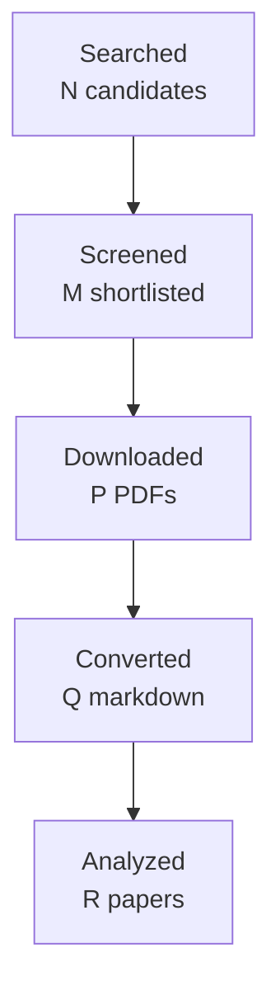

You are one worker inside an automated literature-review pipeline.
A script, not a person, reads your reply. Follow these rules exactly:
- Do the task completely in this single reply. Do not ask questions and do not
  wait for confirmation.
- Reply with the requested artifact block(s) only: no preamble, no commentary
  outside the blocks. Each block starts with a line `===BEGIN <name>===` and
  ends with a line `===END <name>===`; the content between those lines is
  written to a file verbatim.
- Never invent papers, identifiers, numbers, or quotes. Leave unknown fields
  out or mark them as unknown.
- Do not use your code tool, canvas, or connectors; plain text is enough.

# Task: write the final research report

Research topic: **email, image, table and attachment understanding in workplace communication: preserving multimodal and document structure, and grounding evidence back to precise source locations such as a cell, region, page or attachment version**
Run id: `6efd3430f24f`  Round: 4 of at most 4

Write the final report in Markdown following the template below exactly:
same section names in the same order, `[HIGH]`/`[MEDIUM]`/`[LOW]` confidence
tags on every finding, `[ACADEMIC]`/`[ENGINEERING]` labels on every gap, at
least one Mermaid `flowchart TD` diagram, LaTeX (`$...$`) for formulas, and
evidence citations as `[paper_id]`. Cite only the paper ids listed under
"Papers reviewed". In Methodology state that the papers were read through
the host's web tool and give the access level of each paper. Leave no
template placeholder in the output. Do not write a line that starts with
`===` inside the report.

Round History: use exactly these rows (they are computed by the pipeline):
| 1 | b251df112d0c | email, image, table and attachment understanding in workplace communication: preserving multimodal and document structure, and grounding evidence back to precise source locations such as a cell, region, page or attachment version | 14 | initial shortlist | 4 academic, 4 engineering |
| 2 | a274d1d20c2f | version-aware multimodal evidence provenance and reference grounding across revised workplace attachments, including cross-version region lineage, email-to-attachment referring expressions, workbook-level spreadsheet structure, and hierarchical provenance from attachment version through page, element, region or cell to answer span | 14 | 0 resolved | 4 academic, 4 engineering |
| 3 | 0e864e7fe398 | Cross-version multimodal document grounding: stable region and element lineage across revised attachments, message-to-attachment referring expressions, revised-workbook provenance, and end-to-end hierarchical evidence identifiers from version through page, region or cell to answer span. | 10 | 0 resolved | 4 academic, 4 engineering |
| 4 | 6efd3430f24f | Direct empirical methods for cross-version multimodal document element lineage and hierarchical provenance, with special attention to revised workbook provenance and message referring-expression grounding into versioned pages, regions, and cells. | None | academic gaps of the previous round | 4 academic, 4 engineering |
Stop reason line: 4-round cap reached

Research Gaps: list every gap that is still open with its classification,
priority, and the rounds that already searched for it. An unresolved gap is
never presented as accepted or closed; say plainly that the literature has
not answered it yet.

Query variants used:
- direct empirical cross-version multimodal document element lineage hierarchical provenance, special attention revised workbook message referring-expression grounding versioned pages, regions, cells.
- direct empirical
- direct cross-version multimodal document element lineage hierarchical provenance, special attention revised workbook message referring-expression grounding versioned pages, regions, cells.
- empirical cross-version multimodal document element lineage hierarchical provenance, special attention revised workbook message referring-expression grounding versioned pages, regions, cells.
- direct empirical cross-version multimodal
- direct empirical document element
- direct empirical lineage hierarchical
- direct empirical provenance, special

## Project context you must work within

This is the project's own description of the problem, its boundaries,
and the distinctions it needs preserved. It governs what counts as
relevant; the academic task names alone do not.

# Topic 08 context — Email, image, table, and attachment understanding

## Why this Topic exists

Important work information is not confined to plain message text. It appears in HTML layout, tables, screenshots, scanned PDFs, spreadsheets, Word documents, diagrams, inline images, and attachments with multiple versions. A message may say “see the highlighted row”, “numbers below”, “use attachment v2”, or “the red box is the issue”. Flattening everything into plain text can destroy relationships, units, coordinates, visual emphasis, or version identity.

Topic 08 owns **preserving and interpreting multimodal/document structure and grounding evidence back to precise source locations**.

## Product and phase relevance

Basic extraction of collected Excel/PDF/Word attachments is a Phase 1 A2 responsibility; failures and unsupported features must remain explicit. Topic 08 research goes beyond parser selection to the semantic question of whether tables/layout/images and cross-modal references can be understood without losing decision-relevant content. Phase 2 may retrieve additional attachments through Topic 07/A4, but retrieved content still uses A1/A2 preservation and parsing contracts.

## Direct handoffs from earlier Topics

Topic 04 (completed 2026-09-16, 47 papers, 4 rounds) covers reference resolution over text propositions only. References to tables, screenshots, attachments, cells, pages or visual regions were excluded from its corpus and are handed to Topic 08 for grounding. Topic 04 still owns the *scope* question once such an object is grounded: which proposition the response applies to.

**The full text of every inherited handoff is in [`INHERITED_HANDOFFS.md`](INHERITED_HANDOFFS.md)**, including what each sending Topic established, what it left open, and where the ownership boundary lies. Read it before planning; you do not need to open an earlier Topic's folder.

## Relationships to other Topics

| Topic | Relationship |
| --- | --- |
| 01 | HTML/layout/forwarded blocks can affect quote boundaries; Topic 01 owns email quotation provenance. |
| 02 | Extracted document spans/regions may belong to one or multiple Topics. |
| 04 | References such as “see row 4”, “this screenshot”, or “attachment version two” require multimodal grounding. |
| 05 | Actions/deadlines/decisions can reside in tables or attachments. |
| 06 | Versioned documents can supersede or contradict earlier state. |
| 07 | Retrieves missing attachments/documents; Topic 08 interprets their content. |
| 09 | Briefing must preserve critical structured evidence rather than summarizing only body text. |
| 10 | Evaluates extraction completeness, grounding/citation correctness, and omission of multimodal evidence. |

## Key conceptual distinctions

- Parsing success ≠ complete understanding.
- OCR text ≠ layout/table understanding.
- Text extraction ≠ reading order correctness.
- Table cell values ≠ table semantics/units/headers/merged relationships.
- Attachment filename ≠ document version identity.
- Visual grounding ≠ generic image captioning.
- A missing/unsupported region must be a limitation, not an empty successful result.

## High-value academic terminology

- document AI / document intelligence;
- visually rich document understanding (VRDU);
- document layout analysis; layout-aware language models;
- document information extraction;
- document visual question answering (DocVQA);
- multi-page document understanding / long-document multimodal understanding;
- OCR + layout understanding; reading order detection;
- table detection; table structure recognition (TSR); table understanding;
- table question answering; spreadsheet understanding;
- chart understanding / chart QA (when relevant);
- multimodal information extraction;
- multimodal coreference; cross-modal reference resolution;
- visual grounding / referring expression comprehension;
- document region grounding / citation localization;
- scanned document understanding;
- document version comparison / visual document differencing (supporting evidence).

## Query families

- `"visually rich document understanding" layout`
- `"document layout analysis" information extraction`
- `"document visual question answering" grounding`
- `"multi-page document understanding" multimodal`
- `"table structure recognition" business documents`
- `"table understanding" document AI`
- `spreadsheet understanding semantic table`
- `"multimodal coreference" document`
- `"visual grounding" document screenshot`
- `document region grounding citation`
- `scanned PDF information extraction layout`
- `document version comparison semantic change`

## False friends / exclusions

- OCR character accuracy alone;
- image captioning with no source-location grounding;
- generic VQA with no document structure;
- parser throughput benchmarks that do not measure meaning preservation;
- Topic 07 retrieval/search;
- Topic 04 language-only reference resolution when the referent is already textually available.

## Gap-evaluation guidance

Prioritize failure modes that hide or distort evidence that could change a decision: wrong table row/column associations, lost units, omitted scanned pages, unsupported embedded objects, wrong attachment version, or unresolved visual references. Performance is secondary to meaning preservation. Clearly separate Phase 1 extraction coverage from deeper semantic interpretation and from Phase 2 retrieval.

## How to use this file

This file is the self-contained research context for this Topic. A future AI research agent should read **this file first**, then `BRIEF.md`, then any existing `CURRENT_STATUS.md`, gap decisions, reports, manifests, and prior-round artifacts in this folder. The aim is that an agent given only this Topic folder can reconstruct the project intent, Topic boundary, dependencies, search vocabulary, and gap-prioritization logic without relying on the original ChatGPT conversation.

If the full repository is available, the authoritative product documents remain `../../docs/design-brief.md`, `../../docs/design-principles.md`, `../../docs/design.md`, and `../../docs/phase-roadmap.md`. This file explains how those product constraints apply to this research Topic; it does not replace or approve changes to those design documents.

## Shared msgloom background

msgloom is a personal work-information system for one user. It is intended to process very large daily volumes of work communication, initially Outlook email and Microsoft Teams, while ensuring that **work requiring the user's response is not missed** and reducing how much the user must read to stay current.

The product is organized around **Topics**, not message summaries. A Topic is a concrete work matter described by information from one or more sources. One message can contain several Topics; one Topic can span many messages, conversations, attachments, groups, and eventually multiple sources. A conversation or Group is therefore not automatically one Topic.

The report contract is the ultimate product pressure on all ten research Topics. Reports must preserve every due Topic and the decision-relevant information needed to act on it, including developments, actions, deadlines, conditions, risks, uncertainty, and links back to exact source evidence. Missing or conflicting information must remain visible rather than being silently filled in.

The design decision order is important when evaluating research gaps: user permissions are fixed; then preserve correct meaning and report coverage; then traceability and recovery; then usability/maintenance; finally speed, brevity, and token savings. A method that is faster but loses a condition, deadline, branch, source relation, or important Topic is not an improvement for msgloom.

Important persistent principles:

- Use deterministic code for reliable mechanical relationships and AI for language understanding/judgement.
- Preserve source bytes, versions, stage history, identities, and lineage. New assessments do not erase old evidence.
- Group only on reliable relationships. Similar subjects, participants, wording, or model labels are not enough to prove Topic identity.
- Keep uncertain relationships separate and make the reason for uncertainty visible.
- Brevity must come from concise wording and layered detail, never from omitting decision-essential information.
- User-reviewed examples, missed important work, false alerts, wrong grouping, lost actions/deadlines, and evidence that changes a decision matter more than paper count or message throughput.

## Research-programme relationship

The ten Topics form a dependency network rather than ten independent literature reviews. A useful conceptual flow is:

```text
01 source/conversation structure
        ↓
02 within-message Topic spans/membership
        ↓
03 cross-thread/source Topic identity
        ↓
04 reference and response scope
        ↓
05 actions / requests / commitments / decisions
        ↓
06 state / factuality / time / revision
        ↓
07 retrieve missing context when needed
        ↘
08 understand attachments / tables / images
        ↓
09 incremental personalized briefing
        ↓
10 evidence, completeness, calibration, reliability evaluation
```

This is not a strict processing pipeline. Several Topics feed each other, and Topic 10 is cross-cutting. The numbering primarily gives a research order and ownership boundary so that one Topic does not silently absorb the whole product problem.

## Gap-evaluation rules inherited from Topics 01 and 02

The Research Pipeline must evaluate gaps using **project value**, not just academic novelty. The following rules are part of the context for every Topic:

1. A machine-classified `HIGH` or `ACADEMIC` gap does **not** automatically authorize another literature round.
2. After each academic round, perform a human/project-value review: decide whether the uncertainty is best addressed by more papers, engineering experiments, a later Topic, production-domain data, candidate-method selection, or no further current work.
3. Prefer targeted academic follow-up over broad searching. Do not fill paper quotas with weakly related literature.
4. Distinguish direct target-domain evidence from transfer methods/evaluation evidence. Transfer evidence can justify a mechanism or experiment, not production-email accuracy.
5. Engineering validation may use independent synthetic/adversarial fixtures and public data. Lack of production mailbox examples is not a reason to stop work that can be validly completed without them.
6. Never claim production representativeness from synthetic or transfer evidence. Record it as deferred until suitable authorized domain data exists.
7. If a gap belongs to another Topic, hand it off explicitly rather than duplicating research.
8. Research closure means **everything actionable at the current stage is complete and remaining work is explicitly deferred/handed off**. It does not mean literature exhaustion, production accuracy, or architecture approval.
9. For new academic work, use terminology refinement, strict paper admission, manual/controlled canonical acquisition, corpus freeze, fresh isolated Pipeline runs, direct-vs-transfer labels, independent review, strict validation, and post-round gap review. These are lessons learned from Topics 01 and 02.
10. For engineering research, keep gold independent from the component under test; structurally separate prediction inputs from evaluation gold/future context; count false positives and false negatives in end-to-end denominators; use clean-workspace reproducibility, mutation/regression tests, and fresh independent methodological review.

## Work handed to this topic by an earlier one

Treat each entry as a starting condition, not as something to
rediscover. Where a sending topic left a gap open it is still open:
do not report it as established. Respect the stated ownership
boundary and do not absorb what the sender still owns.

**None of this is evidence for your own report.** It scopes your
work; it does not support a finding or a gap. Only papers this
topic admitted can do that.

# Inherited handoffs

Everything an earlier Topic explicitly handed to this one, copied in full so
that this folder is enough on its own. You do not need to open an earlier
Topic's documents to start work here.

Each entry states what was handed over, what the sending Topic still owns, and
what it had established or left open at the time. A handoff is not a finding:
where the sender left a gap open, it is still open.

## From Topic 04 — Reference resolution and response scope

*Completed 2026-09-16. 4 rounds, 47 papers, report validated PASS.*

**Handed to Topic 08.** References to tables, screenshots, attachments,
cells, pages and visual regions. Topic 04's corpus covers reference
resolution over text propositions only; these were excluded from it by
design, so Topic 04's evidence says nothing about them.

**Boundary.** Topic 08 owns grounding the referenced object. Topic 04 still
owns the scope question once it is grounded: which proposition the response
applies to. A grounded object is not yet a scoped response.

## From Topic 05 — Action items, requests, commitments and decisions

*Completed 2026-09-16. 4 rounds, 48 papers.*

**Handed to Topic 08.** Action evidence that lives in attachments, tables or
screenshots. Topic 05's corpus covers text; where the deadline or the object
of an action is only in an attached file, Topic 08 supplies the grounded
content and Topic 05 still owns what the action is.

**Related open gap.** Topic 05's G8 covers zoning author, quoted and forwarded
text while preserving provenance. Attachment references are part of that
surface and are not yet evidenced.

## From Topic 06 — Work-item state, event factuality, time, conflicting revisions

*Completed 2026-09-17. 4 rounds, 38 papers, no duplicate records. Every
round's synthesis was accepted by the independent review at the first attempt
— faithfulness 0.93 to 0.95 — which no earlier Topic managed. Stopped on
`round_cap_reached`. All eight gaps remain open and none was downgraded.*

**Handed to Topic 08.** State evidence that lives in a document version, a
table, an attachment or a screenshot rather than in message text. Topic 06
owns whether a later document supersedes or contradicts an earlier state;
Topic 08 owns recovering what the document actually says and where in it the
claim sits.

**What Topic 06 established.** Provenance and event-sourcing mechanisms exist
and are demonstrated, but no admitted study evaluates immutable source
observations with successive assessments and a separately derived
current-state view. A grounded extraction that loses its source location
cannot participate in a correction later.

**What Topic 06 left open, and Topic 08 must not treat as settled:**

- *(ACADEMIC, HIGH, Gap 2)* No empirical classifier labels supersession,
  correction, supplementation, contradiction, reopening and unresolved
  conflict as one relation inventory. "Version two supersedes version one" is
  not an evidenced decision procedure.
- *(ENGINEERING, HIGH, Gap 8)* No evaluated implementation preserves
  immutable observations alongside successive assessments. Provenance loss
  makes corrections and audit unsafe, which is a requirement on what Topic 08
  must carry with an extraction, not only on how Topic 06 stores it.

**Timing, recorded honestly.** Topic 06 and Topic 08 ran in parallel and
Topic 08's four rounds finished without this text. The handoff is written
here so the folder is complete, but it did not inform Topic 08's searches. If
its substance matters, the remedy is one more round on top of Topic 08's
finished report, not a re-run.

*Basis: the ownership map — Topic 06's relationship table entry for 08
("state evidence may come from document versions, tables, attachments or
screenshots") and Topic 08's entry for 06 ("versioned documents can supersede
or contradict earlier state") — plus Topic 06's Gaps 2 and 8. Topic 06's
report does not name Topic 08 by number.*


Papers reviewed:
- paper_id `manual-d896e242a6` — J-CRe3: A Japanese Conversation Dataset for Real-world Reference Resolution (Nobuhiro Ueda, Hideko Habe, Akishige Yuguchi et al.; 2024)
- paper_id `2404.05719` — Ferret-UI: Grounded Mobile UI Understanding with Multimodal LLMs (Keen You, Haotian Zhang, Eldon Schoop et al.; 2024)
- paper_id `doi-10-1109-icde-2002-994696` — Detecting Changes in XML Documents (Grégory Cobéna, Serge Abiteboul, Amélie Marian; 2002)
- paper_id `2404.19024` — Multi-Page Document Visual Question Answering using Self-Attention Scoring Mechanism (Lei Kang, Rubèn Tito, Ernest Valveny et al.; 2024)
- paper_id `manual-bc798b0eed` — GRAVL-BERT: Graphical Visual-Linguistic Representations for Multimodal Coreference Resolution (Danfeng Guo, Arpit Gupta, Sanchit Agarwal et al.; 2022)
- paper_id `manual-8444bbc95c` — Performance Evaluation and Error Analysis for Multimodal Reference Resolution in a Conversation System (Joyce Y. Chai, Zahar Prasov, Pengyu Hong; 2004)
- paper_id `1704.08476` — SpreadCluster: Recovering Versioned Spreadsheets through Similarity-Based Clustering (Liang Xu, Wensheng Dou, Chushu Gao et al.; 2017)
- paper_id `doi-10-1109-icse-2012-6227171` — Detecting and visualizing inter-worksheet smells in spreadsheets (Felienne Hermans, Martin Pinzger, Arie van Deursen; 2012)
- paper_id `doi-10-1145-357775-357777` — Tracing the lineage of view data in a warehousing environment (Yingwei Cui, Jennifer Widom, Janet L. Wiener; 2000)
- paper_id `doi-10-1007-3-540-48172-9-21` — The T-Recs Table Recognition and Analysis System (Thomas Kieninger, Andreas Dengel; 2026)
- paper_id `2410.05243` — Navigating the Digital World as Humans Do: Universal Visual Grounding for GUI Agents (Boyu Gou, Ruohan Wang, Boyuan Zheng et al.; 2024)
- paper_id `2604.13731` — Doc-V*: Coarse-to-Fine Interactive Visual Reasoning for Multi-Page Document VQA (Yuanlei Zheng, Pei Fu, Hang Li et al.; 2026)
- paper_id `doi-10-1145-2950290-2950359` — Detecting table clones and smells in spreadsheets (Wensheng Dou, Shing-Chi Cheung, Chushu Gao et al.; 2016)
- paper_id `doi-10-3390-app152312430` — Document Image Verification Based on Paragraph Alignment and Subtle Change Detection (Daoquan Li, Weifei Jia, Quanlin Yu et al.; 2025)
- paper_id `2506.21055` — Class-Agnostic Region-of-Interest Matching in Document Images (Demin Zhang, Jiahao Lyu, Zhijie Shen et al.; 2025)
- paper_id `1911.10683` — Image-based table recognition: data, model, and evaluation (Xu Zhong, Elaheh ShafieiBavani, Antonio Jimeno Yepes; 2020)
- paper_id `doi-10-1007-s00521-022-06948-5` — Reading order detection on handwritten documents (Lorenzo Quirós, Enrique Vidal; 2022)
- paper_id `2010.12537` — TUTA: Tree-based Transformers for Generally Structured Table Pre-training (Zhiruo Wang, Haoyu Dong, Ran Jia et al.; 2021)
- paper_id `2006.14806` — TURL: Table Understanding through Representation Learning (Xiang Deng, Huan Sun, Alyssa Lees et al.; 2020)
- paper_id `2111.07129` — Visual Understanding of Complex Table Structures from Document Images (Sachin Raja, Ajoy Mondal, C. V. Jawahar; 2022)
- paper_id `doi-10-18653-v1-2020-acl-main-398` — TaPas: Weakly Supervised Table Parsing via Pre-training (Jonathan Herzig, Pawel Krzysztof Nowak, Thomas Müller et al.; 2020)
- paper_id `manual-0661fc0cba` — M3Grounder: Mask-Based Multi-Span and Multi-Granular Grounding for Document QA (Venkata Kesav Venna, Sai Madhusudan Gunda, Jyothi Swaroopa Jinka et al.; 2026)
- paper_id `manual-1048d6caf2` — Scene-Text Oriented Referring Expression Comprehension (; 2026)
- paper_id `2503.23131` — RefChartQA: Grounding Visual Answer on Chart Images through Instruction Tuning (Alexander Vogel, Omar Moured, Yufan Chen et al.; 2025)
- paper_id `2212.05935` — Hierarchical multimodal transformers for Multi-Page DocVQA (Rubèn Tito, Dimosthenis Karatzas, Ernest Valveny; 2023)
- paper_id `2407.01523` — MMLongBench-Doc: Benchmarking Long-context Document Understanding with Visualizations (Yubo Ma, Yuhang Zang, Liangyu Chen et al.; 2024)
- paper_id `2412.18424` — LongDocURL: a Comprehensive Multimodal Long Document Benchmark Integrating Understanding, Reasoning, and Locating (Chao Deng, Jiale Yuan, Pi Bu et al.; 2025)
- paper_id `2106.11539` — DocFormer: End-to-End Transformer for Document Understanding (Srikar Appalaraju, Bhavan Jasani, Bhargava Urala Kota et al.; 2021)
- paper_id `2104.12756` — InfographicVQA (Minesh Mathew, Viraj Bagal, Rubèn Pérez Tito et al.; 2022)
- paper_id `2607.24651` — Evidence Attribution in Visual Document Understanding without Coordinates or Region Labels (Zhuchenyang Liu, Yao Zhang, Yu Xiao; 2026)
- paper_id `2510.08109` — VersionRAG: Version-Aware Retrieval-Augmented Generation for Evolving Documents (Daniel Huwiler, Kurt Stockinger, Jonathan Fürst; 2025)
- paper_id `2608.03292` — DocTrace: Towards Traceable Long Document VQA via Hierarchical Evidence Graph Reasoning (Le Xiang, Zhicheng Guan, Hong Chen et al.; 2026)
- paper_id `doi-10-18653-v1-2025-acl-long-547` — Disambiguating Reference in Visually Grounded Dialogues through Joint Modeling of Textual and Multimodal Semantic Structures (Shun Inadumi, Nobuhiro Ueda, Koichiro Yoshino; 2025)
- paper_id `2505.16470` — Benchmarking Retrieval-Augmented Multimomal Generation for Document Question Answering (Kuicai Dong, Yujing Chang, Shijie Huang et al.; 2025)
- paper_id `2606.29955` — SpreadsheetBench 2: Evaluating Agents on End-to-End Business Spreadsheet Workflows (; 2026)
- paper_id `doi-10-1109-tmm-2022-3219642` — Scene-Text Oriented Referring Expression Comprehension (Yuqi Bu, Liuwu Li, Jiayuan Xie et al.; 2022)
- paper_id `2607.14117` — Heterogeneous Element-Aware Cross-Version Differencing of Scientific Documents via Layout-Aware Alignment and Structure-Aware Reasoning (Zhen Yin, Wenkang An, Hao Wang et al.; 2026)
- paper_id `2609.08364` — SentryLine: Evidence-Grounded Question Answering over Evolving Documents in Oncology Care (Tampu Ravi Kumar, Gaurav Najpande, Muhammad Ali Khan et al.; 2026)
- paper_id `2604.12282` — Towards Robust Real-World Spreadsheet Understanding with Multi-Agent Multi-Format Reasoning (Houxing Ren, Mingjie Zhan, Zimu Lu et al.; 2026)
- paper_id `doi-10-18653-v1-2025-findings-naacl-295` — Where is this coming from? Making groundedness count in the evaluation of Document VQA models (Armineh Nourbakhsh, Siddharth Parekh, Pranav Shetty et al.; 2025)
- paper_id `manual-7fdf40b3c6` — TRH2TQA: Table Recognition with Hierarchical Relationships to Table Question-Answering on Business Table Images (Pongsakorn Jirachanchaisiri, Nam Tuan Ly, Atsuhiro Takasu; 2025)
- paper_id `2511.12003` — Look as You Think: Unifying Reasoning and Visual Evidence Attribution for Verifiable Document RAG via Reinforcement Learning (Shuochen Liu, Pengfei Luo, Chao Zhang et al.; 2026)
- paper_id `2401.00908` — DocLLM: A layout-aware generative language model for multimodal document understanding (Dongsheng Wang, Natraj Raman, Mathieu Sibue et al.; 2024)
- paper_id `2606.15906` — MAGE-RAG: Multigranular Adaptive Graph Evidence for Agentic Multimodal RAG in Long-Document QA (Yilong Zuo, Xunkai Li, Jing Yuan et al.; 2026)
- paper_id `2605.12882` — CiteVQA: Benchmarking Evidence Attribution for Trustworthy Document Intelligence (Dongsheng Ma, Jiayu Li, Zhengren Wang et al.; 2026)
- paper_id `2601.08741` — From Rows to Reasoning: A Retrieval-Augmented Multimodal Framework for Spreadsheet Understanding (Anmol Gulati, Sahil Sen, Waqar Sarguroh et al.; 2026)
- paper_id `2607.29638` — HierDoc: Hierarchical Page-to-Region Evidence Routing for Long-Document Visual Question Answering (Rongjian Gu, Wengang Zhou, Junyu Xiong et al.; 2026)
- paper_id `manual-ae200642f8` — Change-Centric Management of Versions in an XML Warehouse (Amélie Marian, Serge Abiteboul, Grégory Cobéna et al.; 2001)
- paper_id `doi-10-1002-spe-2305` — Bridging the gap between tracking and detecting changes in XML (Paolo Ciancarini, Angelo Di Iorio, Carlo Marchetti et al.; 2016)
- paper_id `doi-10-1007-978-3-540-30480-7-29` — Schema-less, semantics-based change detection for XML documents (Shuohao Zhang, Curtis Dyreson, Richard T. Snodgrass; 2004)
- paper_id `doi-10-18653-v1-2026-eacl-long-192` — Rethinking Reading Order: Toward Generalizable Document Understanding with LLM-based Relation Modeling (Weishi Wang, Hengchang Hu, Daniel Dahlmeier; 2026)
- paper_id `2203.09056` — Robust Table Detection and Structure Recognition from Heterogeneous Document Images (Chixiang Ma, Weihong Lin, Lei Sun et al.; 2023)
- paper_id `doi-10-1007-3-540-44503-x-20` — Why and Where: A Characterization of Data Provenance (Peter Buneman, Sanjeev Khanna, Wang-Chiew Tan; 2001)

Access level per paper:
- `1704.08476`: full_text via https://arxiv.org/pdf/1704.08476
- `1911.10683`: full_text via https://arxiv.org/html/1911.10683
- `2006.14806`: full_text via https://arxiv.org/pdf/2006.14806
- `2010.12537`: full_text via https://arxiv.org/html/2010.12537
- `2104.12756`: full_text via https://arxiv.org/html/2104.12756
- `2106.11539`: full_text via https://arxiv.org/html/2106.11539
- `2111.07129`: full_text via https://arxiv.org/html/2111.07129
- `2203.09056`: full_text via https://arxiv.org/html/2203.09056
- `2212.05935`: full_text via https://arxiv.org/html/2212.05935
- `2401.00908`: full_text via https://arxiv.org/html/2401.00908
- `2404.05719`: full_text via https://arxiv.org/html/2404.05719
- `2404.19024`: full_text via https://arxiv.org/html/2404.19024
- `2407.01523`: full_text via https://arxiv.org/html/2407.01523
- `2410.05243`: full_text via https://arxiv.org/html/2410.05243
- `2412.18424`: full_text via https://arxiv.org/html/2412.18424
- `2503.23131`: full_text via https://arxiv.org/html/2503.23131
- `2505.16470`: full_text via https://arxiv.org/html/2505.16470
- `2506.21055`: full_text via https://arxiv.org/html/2506.21055
- `2510.08109`: full_text via https://arxiv.org/html/2510.08109
- `2511.12003`: full_text via https://arxiv.org/html/2511.12003
- `2601.08741`: full_text via https://arxiv.org/html/2601.08741
- `2604.12282`: full_text via https://arxiv.org/html/2604.12282
- `2604.13731`: full_text via https://arxiv.org/html/2604.13731
- `2605.12882`: full_text via https://arxiv.org/html/2605.12882
- `2606.15906`: full_text via https://arxiv.org/html/2606.15906
- `2606.29955`: full_text via https://arxiv.org/html/2606.29955
- `2607.14117`: full_text via https://arxiv.org/html/2607.14117
- `2607.24651`: full_text via https://arxiv.org/html/2607.24651
- `2607.29638`: full_text via https://arxiv.org/html/2607.29638
- `2608.03292`: full_text via https://arxiv.org/html/2608.03292
- `2609.08364`: full_text via https://arxiv.org/html/2609.08364
- `doi-10-1002-spe-2305`: full_text via https://cris.unibo.it/retrieve/e1dcb338-468d-7715-e053-1705fe0a6cc9/SPE-JNDiff2_paper.pdf
- `doi-10-1007-3-540-44503-x-20`: full_text via https://www.pure.ed.ac.uk/ws/files/16509989/Why_and_Where_A_Characterization_of_Data_Provenance.pdf
- `doi-10-1007-3-540-48172-9-21`: full_text via https://www.researchgate.net/publication/220933063_The_T-Recs_Table_Recognition_and_Analysis_System
- `doi-10-1007-978-3-540-30480-7-29`: full_text via https://www.researchgate.net/publication/221194297_Schema-Less_Semantics-Based_Change_Detection_for_XML_Documents
- `doi-10-1007-s00521-022-06948-5`: full_text via https://link.springer.com/article/10.1007/s00521-022-06948-5
- `doi-10-1109-icde-2002-994696`: full_text via https://www.researchgate.net/publication/3943331_Detecting_changes_in_XML_documents
- `doi-10-1109-icse-2012-6227171`: full_text via https://pinzger.github.io/papers/Hermans2012-worksheetsmells.pdf
- `doi-10-1109-tmm-2022-3219642`: abstract_only via https://ieeexplore.ieee.org/document/9939075/
- `doi-10-1145-2950290-2950359`: full_text via https://wsdou.github.io/papers/2016-fse-tablecheck.pdf
- `doi-10-1145-357775-357777`: abstract_only via https://sigmod.org/publications/discs/2001/out/p_tracingthelineayijej.htm
- `doi-10-18653-v1-2020-acl-main-398`: full_text via https://aclanthology.org/2020.acl-main.398.pdf
- `doi-10-18653-v1-2025-acl-long-547`: full_text via https://arxiv.org/html/2505.11726
- `doi-10-18653-v1-2025-findings-naacl-295`: full_text via https://arxiv.org/html/2503.19120
- `doi-10-18653-v1-2026-eacl-long-192`: full_text via https://aclanthology.org/2026.eacl-long.192.pdf
- `doi-10-3390-app152312430`: full_text via https://www.mdpi.com/2076-3417/15/23/12430
- `manual-0661fc0cba`: abstract_only via https://openaccess.thecvf.com/content/CVPR2026/html/Venna_M3Grounder_Mask-Based_Multi-Span_and_Multi-Granular_Grounding_for_Document_QA_CVPR_2026_paper.html
- `manual-1048d6caf2`: abstract_only via https://research.polyu.edu.hk/en/publications/scene-text-oriented-referring-expression-comprehension/
- `manual-7fdf40b3c6`: abstract_only via https://openaccess.thecvf.com/content/WACV2025/html/Jirachanchaisiri_TRH2TQA_Table_Recognition_with_Hierarchical_Relationships_to_Table_Question-Answering_on_WACV_2025_paper.html
- `manual-8444bbc95c`: full_text via https://aclanthology.org/N04-4011.pdf
- `manual-ae200642f8`: full_text via https://www.vldb.org/conf/2001/P581.pdf
- `manual-bc798b0eed`: full_text via https://aclanthology.org/2022.coling-1.22.pdf
- `manual-d896e242a6`: full_text via https://arxiv.org/html/2403.19259

Cross-paper synthesis (the source of findings, gaps, and themes):
{
 "topic": "Direct empirical methods for cross-version multimodal document element lineage and hierarchical provenance, with special attention to revised workbook provenance and message referring-expression grounding into versioned pages, regions, and cells.",
 "paper_count": 52,
 "executive_summary": "Across 52 distinct studies, the corpus demonstrates strong but fragmented empirical support for document structure preservation, table and spreadsheet semantics, hierarchical evidence localization, multimodal referring-expression grounding, and several forms of version-aware provenance. Cross-version work includes spreadsheet-version clustering, persistent XML identities and reversible deltas, heterogeneous PDF element alignment, version-aware retrieval, and evolving-document QA with document/page/passage/update-status citations. Separately, document-QA studies show that page and region localization can materially affect answer quality and that correct answers can still carry incorrect or incomplete provenance. Spreadsheet studies preserve useful within-version cell, sheet, formula, and image locations but do not establish lineage across revised workbooks. Adjacent dialogue, GUI, and scene-text studies demonstrate useful reference-grounding mechanisms, but direct grounding of workplace-message references into versioned attachments remains unvalidated. All eight previously identified gaps therefore remain open.",
 "themes": [
  "Cross-version identity and change tracking are empirically demonstrated for several representation families, but at different granularities and in different domains.",
  "Hierarchical provenance increasingly links answers to document, page, element, region, or cell locations rather than treating answer correctness alone as sufficient.",
  "Preserving document layout, table hierarchy, visual semantics, and spreadsheet structure often improves downstream understanding compared with flatter representations.",
  "Table and spreadsheet reasoning depend on structural context such as headers, merged or spanning relations, formulas, sheet identity, and spatial organization.",
  "Long-document evidence acquisition benefits from hierarchical page-to-region selection, but distributed evidence and long contexts remain difficult.",
  "Multimodal reference grounding benefits from textual-reference structure, spatial scene structure, and specialized referring/grounding supervision in adjacent domains.",
  "Evaluation increasingly distinguishes answer correctness from evidence correctness and exposes ambiguity when more than one page or region can legitimately support an answer."
 ],
 "findings": [
  {
   "statement": "The corpus demonstrates several distinct forms of version-aware provenance: spreadsheet versions can be recovered probabilistically from structural and textual similarity; XML nodes can retain persistent logical identities across snapshots with invertible and composable deltas; revised scientific PDFs can be aligned and differenced at text, table, formula, and figure level; version-aware RAG can explicitly retrieve version-specific content and changes; and evolving-document QA can carry document, page, passage, citation-key, and update-status provenance while reporting temporal drift only when retrieved passages explicitly document a change. These studies cover different parts of version provenance rather than one jointly evaluated multimodal lineage scheme.",
   "confidence": "HIGH",
   "evidence": [
    {
     "paper_id": "1704.08476",
     "section": "versioned spreadsheet clustering results"
    },
    {
     "paper_id": "manual-ae200642f8",
     "section": "persistent XIDs and completed deltas"
    },
    {
     "paper_id": "2607.14117",
     "section": "cross-version heterogeneous element alignment and differencing"
    },
    {
     "paper_id": "2510.08109",
     "section": "version-aware retrieval and change-query evaluation"
    },
    {
     "paper_id": "2609.08364",
     "section": "structured citations and evidenced temporal drift"
    }
   ]
  },
  {
   "statement": "Explicit table structure is empirically useful for recovering and reasoning over complex tables. Image-table systems recover cells, row and column structure, spanning relations, and spatial boxes; structure-aware table pretraining improves cell and table classification; and table QA can associate predictions with selected cells. These results are demonstrated on document-image, web-table, and table-QA benchmarks rather than on revised workplace workbooks.",
   "confidence": "HIGH",
   "evidence": [
    {
     "paper_id": "1911.10683",
     "section": "PubTabNet structure and content recognition"
    },
    {
     "paper_id": "2111.07129",
     "section": "complex table cells, spanning relations, and spatial boxes"
    },
    {
     "paper_id": "2203.09056",
     "section": "table detection and structure recognition"
    },
    {
     "paper_id": "2010.12537",
     "section": "tree-structured table pretraining ablations"
    },
    {
     "paper_id": "doi-10-18653-v1-2020-acl-main-398",
     "section": "cell selection for table question answering"
    }
   ]
  },
  {
   "statement": "Long-document studies demonstrate that evidence localization can be modeled hierarchically from documents to pages and then to regions or elements. Page identification, learned region routing, structured evidence graphs, and answer-plus-region attribution improve localization or downstream QA in their respective benchmarks, while answer correctness and evidence correctness remain separable outcomes.",
   "confidence": "HIGH",
   "evidence": [
    {
     "paper_id": "2212.05935",
     "section": "answer-page identification in MP-DocVQA"
    },
    {
     "paper_id": "2607.29638",
     "section": "page-to-region hierarchical routing"
    },
    {
     "paper_id": "2608.03292",
     "section": "hierarchical evidence graph traceability"
    },
    {
     "paper_id": "2605.12882",
     "section": "strict attributed accuracy and hierarchical spatial evidence addresses"
    },
    {
     "paper_id": "2511.12003",
     "section": "answer generation with visual evidence attribution"
    }
   ]
  },
  {
   "statement": "Several experiments show downstream benefits from representations that preserve or enrich non-textual document structure. DocFormer gains from combining text, visual, and shared spatial features; DocLLM improves pretraining accuracy when spatial interactions are added; LongDocURL reports substantially better QA from structure-preserving parsing than from PyMuPDF text; and MMDocRAG reports better aggregate performance from detailed VLM-generated visual descriptions than from OCR text alone.",
   "confidence": "HIGH",
   "evidence": [
    {
     "paper_id": "2106.11539",
     "section": "multimodal and spatial-feature ablations"
    },
    {
     "paper_id": "2401.00908",
     "section": "spatial-attention ablations"
    },
    {
     "paper_id": "2412.18424",
     "section": "structure-preserving parsing comparison"
    },
    {
     "paper_id": "2505.16470",
     "section": "visual-description versus OCR comparison"
    }
   ]
  },
  {
   "statement": "Spreadsheet studies demonstrate useful within-workbook structural and provenance representations but also substantial remaining workflow difficulty. Retrieval over sheet locations, cell references, formulas, and image identifiers supports auditable single-workbook reasoning; explicit structural sketches and verification improve spreadsheet QA; and SpreadsheetBench 2 shows that high cell-level modification accuracy can coexist with much lower complete-task accuracy, with insufficient workbook inspection and wrong target-cell selection among dominant failures.",
   "confidence": "HIGH",
   "evidence": [
    {
     "paper_id": "2601.08741",
     "section": "multi-granular retrieval and within-workbook provenance"
    },
    {
     "paper_id": "2604.12282",
     "section": "structural sketches and verification ablations"
    },
    {
     "paper_id": "2606.29955",
     "section": "workflow accuracy and failure analysis"
    },
    {
     "paper_id": "doi-10-1109-icse-2012-6227171",
     "section": "inter-worksheet dependencies and formula inspection"
    }
   ]
  },
  {
   "statement": "Reading order is not fully captured by a single universal representation. Pairwise and hierarchical ordering models achieve very low ordering error on some handwritten-document collections but remain inadequate on a heterogeneous collection, while LLM-inferred global reading-order relations align poorly with adjacency-oriented human labels yet improve several downstream document-understanding results in the reported experiments.",
   "confidence": "MEDIUM",
   "evidence": [
    {
     "paper_id": "doi-10-1007-s00521-022-06948-5",
     "section": "reading-order accuracy and heterogeneous-dataset failure"
    },
    {
     "paper_id": "doi-10-18653-v1-2026-eacl-long-192",
     "section": "reading-order label alignment and downstream-task ablations"
    }
   ]
  },
  {
   "statement": "Adjacent-domain studies show that explicit textual-reference or coreference structure, spatial scene structure, and specialized UI referring/grounding supervision can improve reference grounding in their evaluated settings. Separately, J-CRe3 demonstrates that a multimodal reference dataset can represent and evaluate omitted or zero references and targets that are spatial regions rather than only discrete objects. The supplied analyses do not demonstrate improved grounding accuracy specifically for omitted references.",
   "confidence": "MEDIUM",
   "evidence": [
    {
     "paper_id": "doi-10-18653-v1-2025-acl-long-547",
     "section": "textual-reference modeling and pronoun grounding"
    },
    {
     "paper_id": "manual-bc798b0eed",
     "section": "scene relationships and reference-distance ablations"
    },
    {
     "paper_id": "2404.05719",
     "section": "UI referring and grounding supervision"
    },
    {
     "paper_id": "manual-d896e242a6",
     "section": "zero references, region targets, and multimodal annotations"
    },
    {
     "paper_id": "doi-10-1109-tmm-2022-3219642",
     "section": "scene-text-oriented referring-expression grounding"
    }
   ]
  },
  {
   "statement": "Evidence localization is not always uniquely represented by one annotated page or region. MP-DocVQA experiments identify questions that remain answerable from a page different from the annotated evidence page, RefChartQA annotation reveals samples with multiple defensible grounding regions, and CiteVQA explicitly includes multiple-gold evidence settings rather than assuming one unique supporting location.",
   "confidence": "MEDIUM",
   "evidence": [
    {
     "paper_id": "2404.19024",
     "section": "alternative answer-bearing pages in MP-DocVQA"
    },
    {
     "paper_id": "2503.23131",
     "section": "manual grounding validation and multiple defensible regions"
    },
    {
     "paper_id": "2605.12882",
     "section": "multi-document multiple-gold evidence evaluation"
    }
   ]
  },
  {
   "statement": "Answer accuracy alone overstates provenance reliability in document QA. MP-DocVQA reports cases with a correct answer but an incorrect predicted evidence page; CiteVQA reports substantially lower strict attributed accuracy than answer score for its strongest system; and RefChartQA reports cases where the correct visual elements are localized but subsequent mathematical reasoning still produces an incorrect answer.",
   "confidence": "HIGH",
   "evidence": [
    {
     "paper_id": "2212.05935",
     "section": "correct-answer but wrong-answer-page analysis"
    },
    {
     "paper_id": "2605.12882",
     "section": "answer score versus Strict Attributed Accuracy"
    },
    {
     "paper_id": "2503.23131",
     "section": "correct localization with incorrect reasoning"
    }
   ]
  }
 ],
 "contradictions": [
  {
   "topic": "Grounding-oriented interventions, access to correct evidence, and answer accuracy",
   "papers": [
    "2503.23131",
    "2511.12003",
    "2605.12882"
   ],
   "note": "These studies should not be treated as controlled tests of one identical intervention. RefChartQA directly tests grounding instruction tuning and finds large gains for some backbones but accuracy losses for others. LAT jointly trains reasoning and evidence attribution and reports gains in both answer and attribution metrics. CiteVQA's oracle analyses instead provide ground-truth pages or documents and show improved answering. The defensible synthesis is that grounding-oriented interventions or access to correct evidence can help answering in some settings, but the effect is not universally positive; differences across these papers are primarily intervention and task scope qualifications rather than a strict cross-paper contradiction."
  },
  {
   "topic": "Lossy OCR/plain-text representations versus structure- or visually enriched representations",
   "papers": [
    "2407.01523",
    "2505.16470",
    "2412.18424"
   ],
   "note": "MMLongBench-Doc directly reports that most evaluated LVLMs underperform LLMs supplied with lossy OCR text, with GPT-4o and GPT-4V as exceptions. MMDocRAG tests a different representation choice and finds detailed VLM-generated descriptions of visual evidence outperform OCR alone. LongDocURL tests parsing representations and finds structure-preserving Docmind text outperforming PyMuPDF text. These results do not establish a strict contradiction because the alternatives are not the same: native vision-language processing, visually enriched textual descriptions, and structure-preserving parsing are distinct interventions."
  }
 ],
 "gaps": [
  {
   "id": "gap-1",
   "description": "The corpus still does not establish a complete method for maintaining evidence provenance across successive workplace attachment revisions, including stable attachment identity, version-relative source locations, semantic changes between versions, and lineage from an older cited region to its later counterpart. Version-aware retrieval, scientific-PDF element alignment, XML persistent identity, spreadsheet-version clustering, and evolving-document QA with document/page/passage/update-status provenance demonstrate separate components, but exact multimodal old-to-new region or cell lineage remains unvalidated.",
   "classification": "ACADEMIC",
   "priority": "HIGH",
   "suggested_query": "\"document version alignment\" multimodal provenance region lineage semantic change revised document attachments"
  },
  {
   "id": "gap-2",
   "description": "Direct grounding of workplace-message referring expressions such as \"this screenshot\", \"the highlighted row\", \"numbers below\", or \"use attachment v2\" into attachment objects, pages, cells, or regions remains unvalidated. Scene-text grounding, situated-dialogue coreference, omitted-reference annotation, and GUI grounding provide adjacent-domain evidence but do not evaluate workplace-message-to-versioned-attachment grounding.",
   "classification": "ACADEMIC",
   "priority": "HIGH",
   "suggested_query": "\"referring expression grounding\" document multimodal attachment table cell screenshot coreference email"
  },
  {
   "id": "gap-3",
   "description": "Comprehensive spreadsheet understanding remains open for formulas, hidden rows and sheets, cross-sheet references, merged regions, formatting semantics, units, named ranges, and provenance across revised workbook versions. Current studies address retrieval, structure reconstruction, verification, dependency visualization, workflow completion, and within-state cell provenance but not this complete set.",
   "classification": "ACADEMIC",
   "priority": "HIGH",
   "suggested_query": "\"spreadsheet understanding\" workbook formulas hidden sheets named ranges merged cells cross-sheet provenance version"
  },
  {
   "id": "gap-4",
   "description": "No admitted paper validates one end-to-end provenance representation that jointly identifies attachment version, page, document element, exact region or spreadsheet cell, and answer span. Hierarchical document-region evidence addresses, cell-level table evidence, version-aware retrieval, and evolving-document page/passage/update-status citations cover overlapping subsets, but their combination remains untested.",
   "classification": "ACADEMIC",
   "priority": "HIGH",
   "suggested_query": "\"evidence provenance\" document question answering version page region cell answer span multimodal grounding"
  },
  {
   "id": "gap-5",
   "description": "End-to-end behavior when extraction or grounding is unsupported, incomplete, or wrong remains insufficiently exercised. The corpus contains unanswerable-question evaluation and parser, retrieval, OCR, localization, attribution, and grounding failure analyses, but not a complete engineering contract distinguishing genuine evidence absence from parser, OCR, layout, retrieval, or grounding failure.",
   "classification": "ENGINEERING",
   "priority": "HIGH"
  },
  {
   "id": "gap-6",
   "description": "Robustness of candidate extraction and structural-preservation pipelines on heterogeneous workplace-style documents remains an engineering gap. No admitted benchmark jointly exercises sparse tables, merged and hierarchical structures, OCR corruption, irregular reading order, embedded visual objects, scanned pages, and explicit extraction-completeness accounting.",
   "classification": "ENGINEERING",
   "priority": "HIGH"
  },
  {
   "id": "gap-7",
   "description": "Operational scaling remains open for long documents, large tables, and realistic workbooks. The corpus reports page-routing costs, evidence-graph overhead, parsing limits, workbook inspection failures, token and runtime trade-offs, and change-detection costs, but does not close system-level latency, memory, and throughput for the target workload.",
   "classification": "ENGINEERING",
   "priority": "MEDIUM"
  },
  {
   "id": "gap-8",
   "description": "The corpus lacks one evaluation that simultaneously measures semantic correctness, extraction completeness, exact provenance, unsupported-evidence handling, and preservation of tables, images, document hierarchy, and reading order on workplace-style attachments. Existing benchmarks and metrics evaluate overlapping subsets rather than this complete combination.",
   "classification": "ENGINEERING",
   "priority": "HIGH"
  }
 ],
 "actionable_insights": [
  "Synthesis-derived recommendation: represent source provenance as composable levels rather than one opaque citation, keeping attachment/version identity, page or sheet identity, element identity, region or cell location, and answer-span linkage as separately inspectable fields.",
  "Synthesis-derived recommendation: keep version identity separate from within-version coordinates so that a cell, page region, or element location is always interpreted relative to an explicit attachment version.",
  "Synthesis-derived recommendation: treat cross-version element matching as an explicit lineage relation with confidence and change metadata rather than silently reusing old coordinates after a revision.",
  "Synthesis-derived recommendation: preserve native spreadsheet addresses, sheet names, formulas, merged-range information, hidden-state metadata, named ranges, formatting cues, and embedded-object identifiers before any flattened textual representation is produced.",
  "Synthesis-derived recommendation: evaluate message-to-attachment reference grounding separately from downstream proposition or response-scope reasoning, and include explicit unresolved and ambiguous outcomes when more than one target remains defensible.",
  "Synthesis-derived recommendation: construct engineering fixtures in which parser failure, OCR failure, page omission, table-structure corruption, retrieval miss, grounding miss, true evidence absence, and multiple-valid-evidence cases are distinguishable in the gold data.",
  "Synthesis-derived recommendation: measure answer correctness and provenance correctness independently and add an end-to-end metric that only credits a result when both the semantic answer and its source lineage are valid.",
  "Synthesis-derived recommendation: benchmark operational scaling with realistic multi-sheet workbooks and long mixed-modality attachments while retaining the same provenance and completeness checks used in smaller correctness tests."
 ],
 "confidence_summary": "Confidence is HIGH that the corpus supports well-supported design principles around preserving spatial and structural information, separating answer correctness from evidence correctness, and retaining explicit within-document provenance. Confidence is MEDIUM for transfer from scientific PDFs, XML versioning, GUI grounding, scene-text grounding, situated dialogue, and benchmark spreadsheets to workplace-message attachments because those domains do not directly evaluate the target setting. Evidence for cross-version provenance is substantial at the component level but fragmented across different representations and tasks. No admitted study validates the complete revised-workbook lineage or workplace-message-to-versioned-attachment grounding problem, so confidence that the literature closes those target-domain questions is LOW.",
 "limitations": [
  "The 53 supplied analysis records represent 52 distinct studies because manual-1048d6caf2 and doi-10-1109-tmm-2022-3219642 are two records of the same Scene-Text Oriented Referring Expression Comprehension study; they are not counted as independent corroboration.",
  "The corpus is heterogeneous: it includes scientific PDFs, clinical guidelines, XML stores, web tables, business-document images, GUI screenshots, charts, situated dialogue, synthetic or benchmark spreadsheets, and long-document QA. Transfer findings from these domains do not establish production workplace-email accuracy.",
  "Several studies evaluate synthetic data, curated benchmarks, or benchmark-specific adaptations. Those results support mechanisms and evaluation ideas but not representativeness of real workplace attachments.",
  "The supplied analyses do not provide one direct experiment covering revised workbook identity, cell-level old-to-new correspondence, semantic change classification, and persistent provenance together.",
  "The supplied analyses do not evaluate natural workplace-message expressions that refer directly to attachment versions, spreadsheet cells, highlighted rows, screenshots, or document regions.",
  "Some manual records provide less quantitative detail than full paper analyses, limiting cross-paper numerical comparison.",
  "Inherited handoffs from Topics 04, 05, and 06 are project context only. They were not used as evidence for findings or to claim closure of any gap.",
  "Differences in benchmarks, evaluation metrics, model families, document lengths, and evidence annotations make many apparent disagreements scope qualifications rather than strict contradictions."
 ],
 "gap_status": [
  {
   "id": "gap-1",
   "status": "open",
   "note": "The corpus now includes evolving-document QA that carries document/page/passage/update-status provenance and reports temporal drift only when retrieved passages explicitly evidence a change. Together with PDF alignment, XML persistent identity, version-aware RAG, and spreadsheet-version clustering, this strengthens component coverage but still does not establish exact cross-version region or cell correspondence and old-to-new multimodal element lineage for workplace attachments.",
   "evidence": [
    "2609.08364",
    "2607.14117",
    "manual-ae200642f8",
    "2510.08109",
    "1704.08476"
   ]
  },
  {
   "id": "gap-2",
   "status": "open",
   "note": "Adjacent-domain grounding studies cover scene text, GUI regions, visual dialogue, pronouns, omitted references, and region targets, but none directly evaluates workplace-message references into versioned attachment objects, pages, rows, cells, or document regions.",
   "evidence": [
    "doi-10-18653-v1-2025-acl-long-547",
    "manual-d896e242a6",
    "manual-bc798b0eed",
    "2404.05719",
    "doi-10-1109-tmm-2022-3219642"
   ]
  },
  {
   "id": "gap-3",
   "status": "open",
   "note": "Spreadsheet retrieval, structural reconstruction, verification, dependency analysis, workflow execution, and within-state provenance are demonstrated, but the supplied corpus does not jointly validate formulas, hidden structures, merged ranges, formatting semantics, units, named ranges, cross-sheet relations, and provenance across revised workbook versions.",
   "evidence": [
    "2601.08741",
    "2604.12282",
    "2606.29955",
    "2010.12537",
    "doi-10-1109-icse-2012-6227171"
   ]
  },
  {
   "id": "gap-4",
   "status": "open",
   "note": "Document/page/region evidence addresses, answer-span grounding, table-cell selection, version-aware retrieval, and document/page/passage/update-status citations are each demonstrated in subsets, but no admitted study evaluates a single hierarchy spanning attachment version through page or sheet, element, exact region or cell, and answer span.",
   "evidence": [
    "2605.12882",
    "manual-0661fc0cba",
    "doi-10-18653-v1-2020-acl-main-398",
    "2510.08109",
    "2609.08364"
   ]
  },
  {
   "id": "gap-5",
   "status": "open",
   "note": "The corpus analyzes unanswerable cases and multiple retrieval, parsing, localization, and attribution failures, but does not provide the requested end-to-end failure contract that distinguishes evidence absence from failures at each processing stage.",
   "evidence": [
    "2511.12003",
    "2607.24651",
    "2606.15906",
    "2606.29955",
    "2404.19024"
   ]
  },
  {
   "id": "gap-6",
   "status": "open",
   "note": "Individual benchmarks cover sparse or complex tables, OCR-derived documents, reading-order variation, scanned images, and mixed visual content, but no single admitted evaluation jointly exercises all listed workplace-style structural failure modes with explicit completeness accounting.",
   "evidence": [
    "2111.07129",
    "2203.09056",
    "doi-10-1007-3-540-48172-9-21",
    "doi-10-1007-s00521-022-06948-5",
    "2407.01523"
   ]
  },
  {
   "id": "gap-7",
   "status": "open",
   "note": "Several papers quantify document-length degradation, page-exploration cost, graph-controller overhead, token use, runtime, and workbook-scale failures, but they do not establish target-workload latency, memory, and throughput end to end.",
   "evidence": [
    "2404.19024",
    "2604.13731",
    "2606.15906",
    "2510.08109",
    "2606.29955"
   ]
  },
  {
   "id": "gap-8",
   "status": "open",
   "note": "CiteVQA, SMuDGE, MMLongBench-Doc, LongDocURL, table benchmarks, and spreadsheet benchmarks measure important overlapping dimensions, but no one admitted evaluation simultaneously measures semantic correctness, completeness, exact provenance, unsupported-evidence behavior, multimodal preservation, document hierarchy, and reading order in workplace-style attachments.",
   "evidence": [
    "2605.12882",
    "doi-10-18653-v1-2025-findings-naacl-295",
    "2407.01523",
    "2412.18424",
    "2606.29955"
   ]
  }
 ]
}

Report template:
## Final Research Report Template

The final report MUST follow this structure. Every section is required
unless marked (optional). Sections marked **[EVIDENCE REQUIRED]** must
cite specific papers with `[arxiv_id]` or `[Author, Year]` references.

````markdown
# Research Report: [Topic]

## Contents

- [Round History](#round-history)
- [Executive Summary](#executive-summary)
- [Research Question](#research-question)
- [Methodology](#methodology)
- [Papers Reviewed](#papers-reviewed)
- [Research Landscape](#research-landscape)
- [Confidence-Graded Findings](#confidence-graded-findings)
- [Research Gaps](#research-gaps)
- [Practical Recommendations](#practical-recommendations)
- [Evidence Map](#evidence-map)
- [References](#references)
- [Appendix: Run Metadata](#appendix-run-metadata)

## Round History

Iterative gap-closure loop (hard cap: 4 rounds). See
`references/iterative-synthesis.md` for the full loop definition.

| Round | Run ID | Topic / Gap Focus | New Papers | Gaps Addressed | Remaining Gaps |
|-------|--------|-------------------|------------|----------------|----------------|
| 1 | <run-id-1> | <original topic> | N | initial shortlist | A academic, E engineering |
| 2 | <run-id-2> | <academic gap focus> | N | … | … |

**Stop reason**: [converged — no open gaps | 4-round cap reached |
new search returned 0 relevant papers | remaining gaps marked out-of-scope]

## Executive Summary

[3-5 sentences: research question, scope (N papers from M sources),
key conclusion, and confidence level. Must mention the strongest finding
and the most significant gap.]

**Scope**: N papers analyzed from [sources] over [date range]
**Overall Confidence**: High / Medium / Low
**Verdict**: [IMPLEMENTATION_READY | HAS_GAPS | NOT_APPLICABLE]

## Research Question

[Precise statement of what was investigated. Include scope boundaries:
what's in vs. out.]

## Methodology

### Search Strategy
- **Sources**: [arXiv, Google Scholar, Semantic Scholar, ...]
- **Query variants**: [list the key queries used]
- **Time window**: [date range]
- **Screening**: [BM25 + sub-agent / BM25 only]

### Pipeline Summary



| Metric | Count |
|--------|-------|
| Total candidates | N |
| After screening | M |
| Downloaded | P |
| Successfully converted | Q |
| Deeply analyzed | R |
| Iterations (if system-building) | I |

## Papers Reviewed

| # | Title | Authors | Year | Venue | Quality Score | Relevance |
|---|-------|---------|------|-------|--------------|-----------|
| 1 | [Title] [arxiv_id] | First Author et al. | YYYY | Venue | X.X/5 | HIGH / MEDIUM / LOW |

## Research Landscape

### Theme 1: [Theme Name]

**Coverage**: N papers | **Confidence**: High / Medium / Low
**Supporting papers**: [arxiv_id_1], [arxiv_id_2], ...

[Narrative description of the theme with evidence citations.] **[EVIDENCE REQUIRED]**

Key findings:
1. [Finding with citation: "Paper A [arxiv_id] demonstrated X with Y% improvement"]
2. [Finding with citation]

### Theme 2: [Theme Name]
[Same structure as Theme 1]

## Methodology Comparison

| Approach | Papers | Strengths | Weaknesses | Best For | Performance |
|----------|--------|-----------|------------|----------|-------------|
| [Approach A] | [ids] | ... | ... | ... | [metric if available] |
| [Approach B] | [ids] | ... | ... | ... | [metric if available] |

## Confidence-Graded Findings

### 🟢 High Confidence (supported by 3+ papers with consistent results)

1. **[Finding]** — Supported by [paper_1], [paper_2], [paper_3].
   [Brief evidence summary with specific numbers if available.]

### 🟡 Medium Confidence (supported by 1-2 papers or with caveats)

1. **[Finding]** — Reported by [paper_1]. [Caveat or limitation.]

### 🔴 Low Confidence (preliminary, single-source, or contradicted)

1. **[Finding]** — Only reported by [paper_1]. [Why confidence is low.]

## Trade-Off Analysis

| Decision | Option A | Option B | Recommendation |
|----------|----------|----------|----------------|
| [Design choice] | [Pros/cons with evidence] | [Pros/cons with evidence] | [Which and why] |

## Points of Agreement **[EVIDENCE REQUIRED]**

1. [Consensus finding] — Confirmed by [paper_1], [paper_2], [paper_3].

## Points of Contradiction **[EVIDENCE REQUIRED]**

1. **[Topic]**: [Paper A] claims X, but [Paper B] shows Y.
   - **Possible explanation**: [Why they disagree — different datasets, metrics, scope]
   - **Implication**: [What this means for the reader]

## Research Gaps

| # | Gap | Type | Severity | Impact on Goals |
|---|-----|------|----------|----------------|
| 1 | [What's missing] | ACADEMIC / ENGINEERING | HIGH / MEDIUM / LOW | [Why it matters] |

### Academic Gaps (require more papers)

1. **[Gap]**: [Description]. Suggested queries: `"query 1"`, `"query 2"`.

### Engineering Gaps (fillable without papers)

1. **[Gap]**: [Description]. Suggested resolution: [approach].

## Reproducibility Notes

| Paper | Code Available | Data Available | Sufficient Detail | License |
|-------|---------------|----------------|-------------------|---------|
| [arxiv_id] | ✅ [link] / ❌ | ✅ [link] / ❌ | ✅ / ⚠️ / ❌ | [license] |

## Practical Recommendations **[EVIDENCE REQUIRED]**

1. **[Recommendation]** — Based on [evidence from papers].
   *Confidence*: High / Medium / Low

## Future Directions

1. [Research direction enabled by current findings]

## Readiness Assessment (System-Building Mode)

### Verdict: [IMPLEMENTATION_READY | HAS_GAPS | NOT_APPLICABLE]

### Assessment Summary
[2-3 sentences: Is the synthesis sufficient to design and build the system?]

### Coverage Matrix

| Dimension | Status | Evidence |
|-----------|--------|----------|
| Architecture patterns | ✅ Sufficient / ⚠️ Partial / ❌ Missing | [papers] |
| Technology stack | ✅ / ⚠️ / ❌ | [papers] |
| Performance baselines | ✅ / ⚠️ / ❌ | [papers] |
| Security model | ✅ / ⚠️ / ❌ | [papers] |
| Trade-off map | ✅ / ⚠️ / ❌ | [papers] |

### Gap Resolution Plan

| # | Gap | Type | Severity | Resolution |
|---|-----|------|----------|------------|
| 1 | ... | ENGINEERING / ACADEMIC | HIGH / MEDIUM / LOW | [action] |

## Evidence Map

| Research Question Aspect | Paper 1 | Paper 2 | Paper 3 | ... |
|--------------------------|---------|---------|---------|-----|
| [Aspect 1]               | ✓ (§3)  |         | ✓ (§4)  | ... |
| [Aspect 2]               |         | ✓ (§2)  |         | ... |

## References

1. [arxiv_id] — [Title]. [Authors]. [Year]. [Venue].
2. ...

## Appendix: Run Metadata

- **Run ID**: <RUN_ID>
- **Sources**: [list]
- **Pipeline version**: [version]
- **Date**: [date]
- **Artifacts**: `runs/<RUN_ID>/`
````


Reply format (one block containing the whole report):
===BEGIN msgloom-topic-08-multimodal-content-understanding-research-report.md===
<content>
===END msgloom-topic-08-multimodal-content-understanding-research-report.md===
