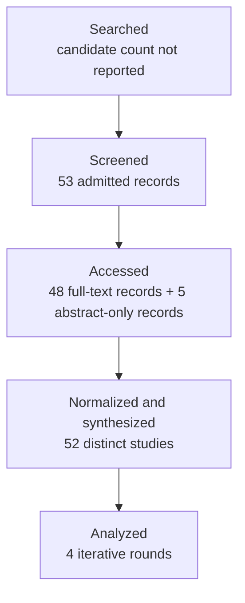

# Research Report: Email, image, table and attachment understanding in workplace communication: preserving multimodal and document structure, and grounding evidence back to precise source locations such as a cell, region, page or attachment version

## Contents

- [Round History](#round-history)
- [Executive Summary](#executive-summary)
- [Research Question](#research-question)
- [Methodology](#methodology)
- [Papers Reviewed](#papers-reviewed)
- [Research Landscape](#research-landscape)
- [Confidence-Graded Findings](#confidence-graded-findings)
- [Research Gaps](#research-gaps)
- [Practical Recommendations](#practical-recommendations)
- [Evidence Map](#evidence-map)
- [References](#references)
- [Appendix: Run Metadata](#appendix-run-metadata)

## Round History

Iterative gap-closure loop (hard cap: 4 rounds). See `references/iterative-synthesis.md` for the full loop definition.

| Round | Run ID | Topic / Gap Focus | New Papers | Gaps Addressed | Remaining Gaps |
|-------|--------|-------------------|------------|----------------|----------------|
| 1 | b251df112d0c | email, image, table and attachment understanding in workplace communication: preserving multimodal and document structure, and grounding evidence back to precise source locations such as a cell, region, page or attachment version | 14 | initial shortlist | 4 academic, 4 engineering |
| 2 | a274d1d20c2f | version-aware multimodal evidence provenance and reference grounding across revised workplace attachments, including cross-version region lineage, email-to-attachment referring expressions, workbook-level spreadsheet structure, and hierarchical provenance from attachment version through page, element, region or cell to answer span | 14 | 0 resolved | 4 academic, 4 engineering |
| 3 | 0e864e7fe398 | Cross-version multimodal document grounding: stable region and element lineage across revised attachments, message-to-attachment referring expressions, revised-workbook provenance, and end-to-end hierarchical evidence identifiers from version through page, region or cell to answer span. | 10 | 0 resolved | 4 academic, 4 engineering |
| 4 | 6efd3430f24f | Direct empirical methods for cross-version multimodal document element lineage and hierarchical provenance, with special attention to revised workbook provenance and message referring-expression grounding into versioned pages, regions, and cells. | None | academic gaps of the previous round | 4 academic, 4 engineering |

**Stop reason**: 4-round cap reached

## Executive Summary

This review investigated how multimodal workplace information can be understood without flattening away document structure and how extracted or generated claims can remain traceable to exact evidence locations. The corpus contains 53 analysis records representing 52 distinct studies and spans document AI, table and spreadsheet understanding, multimodal reference grounding, long-document QA, provenance, version differencing, and evolving-document retrieval. [HIGH] The strongest finding is that preserving structural or spatial information and evaluating evidence provenance separately from answer correctness are both empirically justified: a semantically correct answer can still point to the wrong page or region, while layout-, table-, and visual-aware representations repeatedly outperform flatter alternatives in their evaluated settings [2106.11539] [2401.00908] [2412.18424] [2212.05935] [2605.12882]. The most significant unresolved issue is that no admitted study validates the complete target contract: stable identity across successive workplace attachment versions, old-to-new region or cell lineage, message-to-versioned-attachment grounding, and a single provenance hierarchy from attachment version through page/sheet and region/cell to answer span. Consequently, the literature is sufficient to support a conservative architecture and a strong engineering evaluation programme, but not to claim that the target workplace problem has already been empirically solved.

**Scope**: 52 distinct studies analyzed from 13 web-host/source families over 2000–2026  
**Overall Confidence**: Medium  
**Verdict**: HAS_GAPS

## Research Question

The review investigated the following question:

> How should a workplace-information system preserve and interpret text, images, tables, spreadsheets, document layout, screenshots, scans, and versioned attachments so that decision-relevant meaning is not lost and every extracted or inferred claim can be grounded back to a precise, version-relative source location?

The in-scope concerns were document layout and reading order, table structure, spreadsheet semantics, multimodal referring expressions, visual/document-region grounding, long-document evidence localization, exact provenance, document or workbook versions, and cross-version alignment.

The review explicitly distinguished:

- parsing success from semantic understanding;
- OCR output from layout and table understanding;
- cell values from headers, units, formulas, merged relationships, and sheet context;
- a filename from a stable attachment/version identity;
- generic image captioning from reference grounding;
- answer correctness from evidence correctness;
- within-version coordinates from cross-version element lineage;
- genuine evidence absence from extraction, OCR, retrieval, localization, or grounding failure.

The review did not treat Topic 04's language-only proposition scope, Topic 05's action classification, Topic 06's supersession classification, or Topic 07's missing-document retrieval as substitutes for Topic 08 evidence. Those relationships are system dependencies rather than evidence for the findings reported here.

## Methodology

### Search Strategy

- **Sources**: arXiv, ACL Anthology, IEEE Xplore, Springer, ResearchGate, CVF Open Access, MDPI, VLDB, ACM/SIGMOD-hosted material, university repositories, and author-hosted publication copies. All papers were read through the host's web tool at the access levels recorded below.
- **Query variants**:
  - `direct empirical cross-version multimodal document element lineage hierarchical provenance, special attention revised workbook message referring-expression grounding versioned pages, regions, cells.`
  - `direct empirical`
  - `direct cross-version multimodal document element lineage hierarchical provenance, special attention revised workbook message referring-expression grounding versioned pages, regions, cells.`
  - `empirical cross-version multimodal document element lineage hierarchical provenance, special attention revised workbook message referring-expression grounding versioned pages, regions, cells.`
  - `direct empirical cross-version multimodal`
  - `direct empirical document element`
  - `direct empirical lineage hierarchical`
  - `direct empirical provenance, special`
- **Time window**: 2000–2026 based on the supplied paper metadata.
- **Screening**: iterative literature-review screening and synthesis; the supplied run artifacts do not provide a defensible numerical breakdown of BM25 versus sub-agent screening operations, so no such count is inferred.

### Paper Access Audit

Every reviewed record was accessed through the host's web tool. The access level supplied for each record was:

| Paper ID | Access level |
|---|---|
| `manual-d896e242a6` | full_text |
| `2404.05719` | full_text |
| `doi-10-1109-icde-2002-994696` | full_text |
| `2404.19024` | full_text |
| `manual-bc798b0eed` | full_text |
| `manual-8444bbc95c` | full_text |
| `1704.08476` | full_text |
| `doi-10-1109-icse-2012-6227171` | full_text |
| `doi-10-1145-357775-357777` | abstract_only |
| `doi-10-1007-3-540-48172-9-21` | full_text |
| `2410.05243` | full_text |
| `2604.13731` | full_text |
| `doi-10-1145-2950290-2950359` | full_text |
| `doi-10-3390-app152312430` | full_text |
| `2506.21055` | full_text |
| `1911.10683` | full_text |
| `doi-10-1007-s00521-022-06948-5` | full_text |
| `2010.12537` | full_text |
| `2006.14806` | full_text |
| `2111.07129` | full_text |
| `doi-10-18653-v1-2020-acl-main-398` | full_text |
| `manual-0661fc0cba` | abstract_only |
| `manual-1048d6caf2` | abstract_only |
| `2503.23131` | full_text |
| `2212.05935` | full_text |
| `2407.01523` | full_text |
| `2412.18424` | full_text |
| `2106.11539` | full_text |
| `2104.12756` | full_text |
| `2607.24651` | full_text |
| `2510.08109` | full_text |
| `2608.03292` | full_text |
| `doi-10-18653-v1-2025-acl-long-547` | full_text |
| `2505.16470` | full_text |
| `2606.29955` | full_text |
| `doi-10-1109-tmm-2022-3219642` | abstract_only |
| `2607.14117` | full_text |
| `2609.08364` | full_text |
| `2604.12282` | full_text |
| `doi-10-18653-v1-2025-findings-naacl-295` | full_text |
| `manual-7fdf40b3c6` | abstract_only |
| `2511.12003` | full_text |
| `2401.00908` | full_text |
| `2606.15906` | full_text |
| `2605.12882` | full_text |
| `2601.08741` | full_text |
| `2607.29638` | full_text |
| `manual-ae200642f8` | full_text |
| `doi-10-1002-spe-2305` | full_text |
| `doi-10-1007-978-3-540-30480-7-29` | full_text |
| `doi-10-18653-v1-2026-eacl-long-192` | full_text |
| `2203.09056` | full_text |
| `doi-10-1007-3-540-44503-x-20` | full_text |

There are 53 access records but 52 distinct studies because `manual-1048d6caf2` and `doi-10-1109-tmm-2022-3219642` refer to the same *Scene-Text Oriented Referring Expression Comprehension* study. They are not treated as independent corroboration.

### Pipeline Summary

| Metric | Count |
|--------|-------|
| Total candidates | Not reported in supplied artifacts |
| After screening | 53 admitted records / 52 distinct studies |
| Downloaded | Not separately reported |
| Successfully converted | Not separately reported |
| Deeply analyzed | 52 distinct studies |
| Iterations (if system-building) | 4 |

For provenance-sensitive evaluation, a useful strict metric is to count a result as correct only when both semantics and evidence are correct:

$SAA = \frac{1}{N}\sum_{i=1}^{N}\mathbf{1}[\hat{a}_i=a_i^* \land \hat{e}_i \in E_i^*]$

where $\hat{a}_i$ is the predicted answer, $a_i^*$ is the gold answer, $\hat{e}_i$ is the predicted evidence location, and $E_i^*$ is the set of defensible gold evidence locations. This formulation is particularly important because several papers show that answer correctness and evidence correctness can diverge [2212.05935] [2503.23131] [2605.12882].

## Papers Reviewed

Quality scores were not supplied by the pipeline, so the table reports them as `Not scored` rather than inventing numerical values. Relevance indicates directness to Topic 08 rather than paper quality.

| # | Title | Authors | Year | Venue | Quality Score | Relevance |
|---|-------|---------|------|-------|--------------|-----------|
| 1 | J-CRe3: A Japanese Conversation Dataset for Real-world Reference Resolution [manual-d896e242a6] | Nobuhiro Ueda, Hideko Habe, Akishige Yuguchi et al. | 2024 | Not specified | Not scored | MEDIUM |
| 2 | Ferret-UI: Grounded Mobile UI Understanding with Multimodal LLMs [2404.05719] | Keen You, Haotian Zhang, Eldon Schoop et al. | 2024 | arXiv record | Not scored | MEDIUM |
| 3 | Detecting Changes in XML Documents [doi-10-1109-icde-2002-994696] | Grégory Cobéna, Serge Abiteboul, Amélie Marian | 2002 | ICDE | Not scored | MEDIUM |
| 4 | Multi-Page Document Visual Question Answering using Self-Attention Scoring Mechanism [2404.19024] | Lei Kang, Rubèn Tito, Ernest Valveny et al. | 2024 | arXiv record | Not scored | HIGH |
| 5 | GRAVL-BERT: Graphical Visual-Linguistic Representations for Multimodal Coreference Resolution [manual-bc798b0eed] | Danfeng Guo, Arpit Gupta, Sanchit Agarwal et al. | 2022 | COLING | Not scored | MEDIUM |
| 6 | Performance Evaluation and Error Analysis for Multimodal Reference Resolution in a Conversation System [manual-8444bbc95c] | Joyce Y. Chai, Zahar Prasov, Pengyu Hong | 2004 | Not specified | Not scored | MEDIUM |
| 7 | SpreadCluster: Recovering Versioned Spreadsheets through Similarity-Based Clustering [1704.08476] | Liang Xu, Wensheng Dou, Chushu Gao et al. | 2017 | arXiv record | Not scored | HIGH |
| 8 | Detecting and visualizing inter-worksheet smells in spreadsheets [doi-10-1109-icse-2012-6227171] | Felienne Hermans, Martin Pinzger, Arie van Deursen | 2012 | ICSE | Not scored | HIGH |
| 9 | Tracing the lineage of view data in a warehousing environment [doi-10-1145-357775-357777] | Yingwei Cui, Jennifer Widom, Janet L. Wiener | 2000 | ACM publication | Not scored | MEDIUM |
| 10 | The T-Recs Table Recognition and Analysis System [doi-10-1007-3-540-48172-9-21] | Thomas Kieninger, Andreas Dengel | 2026 | Not specified | Not scored | HIGH |
| 11 | Navigating the Digital World as Humans Do: Universal Visual Grounding for GUI Agents [2410.05243] | Boyu Gou, Ruohan Wang, Boyuan Zheng et al. | 2024 | arXiv record | Not scored | MEDIUM |
| 12 | Doc-V*: Coarse-to-Fine Interactive Visual Reasoning for Multi-Page Document VQA [2604.13731] | Yuanlei Zheng, Pei Fu, Hang Li et al. | 2026 | arXiv record | Not scored | HIGH |
| 13 | Detecting table clones and smells in spreadsheets [doi-10-1145-2950290-2950359] | Wensheng Dou, Shing-Chi Cheung, Chushu Gao et al. | 2016 | ACM publication | Not scored | HIGH |
| 14 | Document Image Verification Based on Paragraph Alignment and Subtle Change Detection [doi-10-3390-app152312430] | Daoquan Li, Weifei Jia, Quanlin Yu et al. | 2025 | Applied Sciences | Not scored | HIGH |
| 15 | Class-Agnostic Region-of-Interest Matching in Document Images [2506.21055] | Demin Zhang, Jiahao Lyu, Zhijie Shen et al. | 2025 | arXiv record | Not scored | HIGH |
| 16 | Image-based table recognition: data, model, and evaluation [1911.10683] | Xu Zhong, Elaheh ShafieiBavani, Antonio Jimeno Yepes | 2020 | arXiv record | Not scored | HIGH |
| 17 | Reading order detection on handwritten documents [doi-10-1007-s00521-022-06948-5] | Lorenzo Quirós, Enrique Vidal | 2022 | Neural Computing and Applications | Not scored | HIGH |
| 18 | TUTA: Tree-based Transformers for Generally Structured Table Pre-training [2010.12537] | Zhiruo Wang, Haoyu Dong, Ran Jia et al. | 2021 | arXiv record | Not scored | HIGH |
| 19 | TURL: Table Understanding through Representation Learning [2006.14806] | Xiang Deng, Huan Sun, Alyssa Lees et al. | 2020 | arXiv record | Not scored | HIGH |
| 20 | Visual Understanding of Complex Table Structures from Document Images [2111.07129] | Sachin Raja, Ajoy Mondal, C. V. Jawahar | 2022 | arXiv record | Not scored | HIGH |
| 21 | TaPas: Weakly Supervised Table Parsing via Pre-training [doi-10-18653-v1-2020-acl-main-398] | Jonathan Herzig, Pawel Krzysztof Nowak, Thomas Müller et al. | 2020 | ACL | Not scored | HIGH |
| 22 | M3Grounder: Mask-Based Multi-Span and Multi-Granular Grounding for Document QA [manual-0661fc0cba] | Venkata Kesav Venna, Sai Madhusudan Gunda, Jyothi Swaroopa Jinka et al. | 2026 | CVPR | Not scored | HIGH |
| 23 | Scene-Text Oriented Referring Expression Comprehension [manual-1048d6caf2] | Authors not supplied in this record | 2026 | Not specified | Not scored | MEDIUM |
| 24 | RefChartQA: Grounding Visual Answer on Chart Images through Instruction Tuning [2503.23131] | Alexander Vogel, Omar Moured, Yufan Chen et al. | 2025 | arXiv record | Not scored | HIGH |
| 25 | Hierarchical multimodal transformers for Multi-Page DocVQA [2212.05935] | Rubèn Tito, Dimosthenis Karatzas, Ernest Valveny | 2023 | arXiv record | Not scored | HIGH |
| 26 | MMLongBench-Doc: Benchmarking Long-context Document Understanding with Visualizations [2407.01523] | Yubo Ma, Yuhang Zang, Liangyu Chen et al. | 2024 | arXiv record | Not scored | HIGH |
| 27 | LongDocURL: a Comprehensive Multimodal Long Document Benchmark Integrating Understanding, Reasoning, and Locating [2412.18424] | Chao Deng, Jiale Yuan, Pi Bu et al. | 2025 | arXiv record | Not scored | HIGH |
| 28 | DocFormer: End-to-End Transformer for Document Understanding [2106.11539] | Srikar Appalaraju, Bhavan Jasani, Bhargava Urala Kota et al. | 2021 | arXiv record | Not scored | HIGH |
| 29 | InfographicVQA [2104.12756] | Minesh Mathew, Viraj Bagal, Rubèn Pérez Tito et al. | 2022 | arXiv record | Not scored | HIGH |
| 30 | Evidence Attribution in Visual Document Understanding without Coordinates or Region Labels [2607.24651] | Zhuchenyang Liu, Yao Zhang, Yu Xiao | 2026 | arXiv record | Not scored | HIGH |
| 31 | VersionRAG: Version-Aware Retrieval-Augmented Generation for Evolving Documents [2510.08109] | Daniel Huwiler, Kurt Stockinger, Jonathan Fürst | 2025 | arXiv record | Not scored | HIGH |
| 32 | DocTrace: Towards Traceable Long Document VQA via Hierarchical Evidence Graph Reasoning [2608.03292] | Le Xiang, Zhicheng Guan, Hong Chen et al. | 2026 | arXiv record | Not scored | HIGH |
| 33 | Disambiguating Reference in Visually Grounded Dialogues through Joint Modeling of Textual and Multimodal Semantic Structures [doi-10-18653-v1-2025-acl-long-547] | Shun Inadumi, Nobuhiro Ueda, Koichiro Yoshino | 2025 | ACL | Not scored | MEDIUM |
| 34 | Benchmarking Retrieval-Augmented Multimomal Generation for Document Question Answering [2505.16470] | Kuicai Dong, Yujing Chang, Shijie Huang et al. | 2025 | arXiv record | Not scored | HIGH |
| 35 | SpreadsheetBench 2: Evaluating Agents on End-to-End Business Spreadsheet Workflows [2606.29955] | Authors not supplied | 2026 | arXiv record | Not scored | HIGH |
| 36 | Scene-Text Oriented Referring Expression Comprehension [doi-10-1109-tmm-2022-3219642] | Yuqi Bu, Liuwu Li, Jiayuan Xie et al. | 2022 | IEEE Transactions on Multimedia | Not scored | MEDIUM |
| 37 | Heterogeneous Element-Aware Cross-Version Differencing of Scientific Documents via Layout-Aware Alignment and Structure-Aware Reasoning [2607.14117] | Zhen Yin, Wenkang An, Hao Wang et al. | 2026 | arXiv record | Not scored | HIGH |
| 38 | SentryLine: Evidence-Grounded Question Answering over Evolving Documents in Oncology Care [2609.08364] | Tampu Ravi Kumar, Gaurav Najpande, Muhammad Ali Khan et al. | 2026 | arXiv record | Not scored | HIGH |
| 39 | Towards Robust Real-World Spreadsheet Understanding with Multi-Agent Multi-Format Reasoning [2604.12282] | Houxing Ren, Mingjie Zhan, Zimu Lu et al. | 2026 | arXiv record | Not scored | HIGH |
| 40 | Where is this coming from? Making groundedness count in the evaluation of Document VQA models [doi-10-18653-v1-2025-findings-naacl-295] | Armineh Nourbakhsh, Siddharth Parekh, Pranav Shetty et al. | 2025 | Findings of NAACL | Not scored | HIGH |
| 41 | TRH2TQA: Table Recognition with Hierarchical Relationships to Table Question-Answering on Business Table Images [manual-7fdf40b3c6] | Pongsakorn Jirachanchaisiri, Nam Tuan Ly, Atsuhiro Takasu | 2025 | WACV | Not scored | HIGH |
| 42 | Look as You Think: Unifying Reasoning and Visual Evidence Attribution for Verifiable Document RAG via Reinforcement Learning [2511.12003] | Shuochen Liu, Pengfei Luo, Chao Zhang et al. | 2026 | arXiv record | Not scored | HIGH |
| 43 | DocLLM: A layout-aware generative language model for multimodal document understanding [2401.00908] | Dongsheng Wang, Natraj Raman, Mathieu Sibue et al. | 2024 | arXiv record | Not scored | HIGH |
| 44 | MAGE-RAG: Multigranular Adaptive Graph Evidence for Agentic Multimodal RAG in Long-Document QA [2606.15906] | Yilong Zuo, Xunkai Li, Jing Yuan et al. | 2026 | arXiv record | Not scored | HIGH |
| 45 | CiteVQA: Benchmarking Evidence Attribution for Trustworthy Document Intelligence [2605.12882] | Dongsheng Ma, Jiayu Li, Zhengren Wang et al. | 2026 | arXiv record | Not scored | HIGH |
| 46 | From Rows to Reasoning: A Retrieval-Augmented Multimodal Framework for Spreadsheet Understanding [2601.08741] | Anmol Gulati, Sahil Sen, Waqar Sarguroh et al. | 2026 | arXiv record | Not scored | HIGH |
| 47 | HierDoc: Hierarchical Page-to-Region Evidence Routing for Long-Document Visual Question Answering [2607.29638] | Rongjian Gu, Wengang Zhou, Junyu Xiong et al. | 2026 | arXiv record | Not scored | HIGH |
| 48 | Change-Centric Management of Versions in an XML Warehouse [manual-ae200642f8] | Amélie Marian, Serge Abiteboul, Grégory Cobéna et al. | 2001 | VLDB | Not scored | MEDIUM |
| 49 | Bridging the gap between tracking and detecting changes in XML [doi-10-1002-spe-2305] | Paolo Ciancarini, Angelo Di Iorio, Carlo Marchetti et al. | 2016 | Software: Practice and Experience | Not scored | MEDIUM |
| 50 | Schema-less, semantics-based change detection for XML documents [doi-10-1007-978-3-540-30480-7-29] | Shuohao Zhang, Curtis Dyreson, Richard T. Snodgrass | 2004 | Not specified | Not scored | MEDIUM |
| 51 | Rethinking Reading Order: Toward Generalizable Document Understanding with LLM-based Relation Modeling [doi-10-18653-v1-2026-eacl-long-192] | Weishi Wang, Hengchang Hu, Daniel Dahlmeier | 2026 | EACL | Not scored | HIGH |
| 52 | Robust Table Detection and Structure Recognition from Heterogeneous Document Images [2203.09056] | Chixiang Ma, Weihong Lin, Lei Sun et al. | 2023 | arXiv record | Not scored | HIGH |
| 53 | Why and Where: A Characterization of Data Provenance [doi-10-1007-3-540-44503-x-20] | Peter Buneman, Sanjeev Khanna, Wang-Chiew Tan | 2001 | Not specified | Not scored | MEDIUM |

## Research Landscape

### Theme 1: Version-aware identity, alignment, and change provenance

**Coverage**: 9 papers | **Confidence**: High  
**Supporting papers**: [1704.08476], [doi-10-1109-icde-2002-994696], [manual-ae200642f8], [doi-10-1002-spe-2305], [doi-10-1007-978-3-540-30480-7-29], [2506.21055], [2607.14117], [2510.08109], [2609.08364]

[HIGH] Several different mechanisms for version-aware provenance are empirically established, but they operate at different granularities. Spreadsheet versions can be recovered through similarity-based clustering [1704.08476]. XML work demonstrates persistent logical identities, change operations, and change-centric representations across versions [manual-ae200642f8] [doi-10-1109-icde-2002-994696] [doi-10-1002-spe-2305] [doi-10-1007-978-3-540-30480-7-29]. Document-image work provides region matching and scientific-document work aligns heterogeneous text, table, formula, and figure elements across document revisions [2506.21055] [2607.14117]. Version-aware RAG and evolving-document QA add explicit version selection, change-oriented retrieval, document/page/passage citations, and update-state information [2510.08109] [2609.08364].

Key findings:

1. [HIGH] Cross-version identity is technically feasible in several representation families, but no reviewed study jointly implements stable attachment identity, page/sheet identity, region/cell lineage, and answer-span attribution for revised workplace attachments [1704.08476] [manual-ae200642f8] [2607.14117] [2510.08109] [2609.08364].
2. [HIGH] Version identity must be treated separately from coordinates because coordinates are meaningful only relative to a particular document snapshot or workbook state [manual-ae200642f8] [2607.14117] [2510.08109].
3. [MEDIUM] XML persistent-identity mechanisms are useful transfer evidence for provenance design, but they do not by themselves establish lineage for visually rich PDFs or spreadsheets [manual-ae200642f8] [doi-10-1109-icde-2002-994696].

### Theme 2: Tables and spreadsheets require structure, not just extracted strings

**Coverage**: 12 papers | **Confidence**: High  
**Supporting papers**: [1911.10683], [2010.12537], [2006.14806], [2111.07129], [2203.09056], [doi-10-18653-v1-2020-acl-main-398], [manual-7fdf40b3c6], [2601.08741], [2604.12282], [2606.29955], [doi-10-1109-icse-2012-6227171], [doi-10-1145-2950290-2950359]

[HIGH] Table understanding repeatedly benefits from representations that preserve row and column relations, cell boundaries, spanning cells, hierarchical headers, spatial boxes, and tree structure [1911.10683] [2111.07129] [2203.09056] [2010.12537]. Table QA can associate model decisions with selected cells rather than only returning an ungrounded textual answer [doi-10-18653-v1-2020-acl-main-398].

[HIGH] Spreadsheet studies further show the importance of sheet identity, formulas, cell references, structural sketches, dependencies, and explicit workbook inspection [2601.08741] [2604.12282] [2606.29955] [doi-10-1109-icse-2012-6227171]. SpreadsheetBench 2 shows that local cell-level success does not imply successful completion of an entire workbook task, and its reported failure analysis includes insufficient workbook inspection and wrong target-cell selection [2606.29955].

Key findings:

1. [HIGH] Flattening complex tables into text risks destroying row/column and spanning relationships that are explicitly represented and evaluated by table-structure systems [1911.10683] [2111.07129] [2203.09056].
2. [HIGH] Spreadsheet provenance within one workbook state can preserve sheet locations, cell references, formulas, and image identifiers, but cross-version cell lineage remains unresolved [2601.08741] [1704.08476].
3. [HIGH] End-to-end workbook correctness must be measured separately from individual cell modification correctness [2606.29955].

### Theme 3: Hierarchical document evidence localization

**Coverage**: 10 papers | **Confidence**: High  
**Supporting papers**: [2212.05935], [2404.19024], [2604.13731], [2607.29638], [2608.03292], [2606.15906], [2605.12882], [2511.12003], [2607.24651], [doi-10-18653-v1-2025-findings-naacl-295]

[HIGH] Long-document systems increasingly model evidence acquisition as a hierarchy rather than one flat retrieval step. The reviewed approaches include answer-page prediction [2212.05935], page scoring and multi-page reasoning [2404.19024], coarse-to-fine exploration [2604.13731], page-to-region routing [2607.29638], graph-based evidence organization [2608.03292] [2606.15906], and explicit answer-plus-evidence attribution [2605.12882] [2511.12003] [2607.24651].

Key findings:

1. [HIGH] Page and region localization can materially affect downstream QA, making evidence routing part of the task rather than a cosmetic explanation layer [2212.05935] [2607.29638] [2608.03292].
2. [HIGH] Correct answers can coexist with incorrect evidence locations, so answer accuracy alone is insufficient for an auditable workplace-information system [2212.05935] [2605.12882].
3. [MEDIUM] Some questions legitimately admit more than one supporting page or region, so evaluation should permit multiple defensible evidence targets rather than enforcing one arbitrary coordinate [2404.19024] [2503.23131] [2605.12882].

### Theme 4: Layout, vision, and reading order contribute independent information

**Coverage**: 9 papers | **Confidence**: High for structural value, Medium for one universal reading-order representation  
**Supporting papers**: [2106.11539], [2401.00908], [2412.18424], [2505.16470], [2407.01523], [2104.12756], [doi-10-1007-s00521-022-06948-5], [doi-10-18653-v1-2026-eacl-long-192], [doi-10-3390-app152312430]

[HIGH] DocFormer reports benefits from combining text, visual, and spatial features, while DocLLM reports gains from modeling spatial interactions [2106.11539] [2401.00908]. LongDocURL reports better QA with structure-preserving parsing than with a flatter PyMuPDF representation, and MMDocRAG reports gains from richer VLM-produced descriptions of visual evidence relative to OCR-only text [2412.18424] [2505.16470].

[MEDIUM] Reading order is more nuanced. Pairwise and hierarchical methods perform strongly on some handwritten collections but degrade on heterogeneous documents [doi-10-1007-s00521-022-06948-5]. LLM-derived global relation modeling can disagree with human adjacency-style labels while still improving downstream document understanding in reported experiments [doi-10-18653-v1-2026-eacl-long-192].

Key findings:

1. [HIGH] OCR text is not a sufficient substitute for spatial and structural representation across the corpus [2106.11539] [2401.00908] [2412.18424] [2505.16470].
2. [MEDIUM] Reading order should be represented as an explicit, inspectable relation rather than assumed to be universally recoverable by one sequence [doi-10-1007-s00521-022-06948-5] [doi-10-18653-v1-2026-eacl-long-192].
3. [MEDIUM] Native multimodal models are not automatically superior to text pipelines: representation quality and task conditions matter [2407.01523] [2412.18424] [2505.16470].

### Theme 5: Multimodal referring expressions can be grounded, but the target workplace setting is missing

**Coverage**: 8 papers | **Confidence**: Medium  
**Supporting papers**: [manual-d896e242a6], [manual-bc798b0eed], [manual-8444bbc95c], [2404.05719], [2410.05243], [doi-10-18653-v1-2025-acl-long-547], [doi-10-1109-tmm-2022-3219642], [manual-1048d6caf2]

[MEDIUM] Dialogue, GUI, and scene-text research demonstrates that reference resolution can exploit linguistic reference structure, spatial relations, visual scene structure, and specialized referring-expression supervision [manual-bc798b0eed] [2404.05719] [2410.05243] [doi-10-18653-v1-2025-acl-long-547] [doi-10-1109-tmm-2022-3219642].

[MEDIUM] J-CRe3 is especially relevant methodologically because its annotation scheme accommodates omitted or zero references and region-level targets rather than assuming every reference is a simple noun phrase pointing to one discrete object [manual-d896e242a6].

Key findings:

1. [MEDIUM] Adjacent-domain evidence supports explicit multimodal reference-grounding components rather than relying on generic captioning [manual-bc798b0eed] [2404.05719] [doi-10-1109-tmm-2022-3219642].
2. [LOW] The transferability of these methods to natural workplace phrases such as “the highlighted row”, “numbers below”, “this screenshot”, or “use attachment v2” is not established by the reviewed studies [manual-d896e242a6] [doi-10-18653-v1-2025-acl-long-547] [2404.05719].

### Theme 6: Evidence correctness is a distinct evaluation target

**Coverage**: 7 papers | **Confidence**: High  
**Supporting papers**: [2212.05935], [2503.23131], [2605.12882], [2511.12003], [doi-10-18653-v1-2025-findings-naacl-295], [2607.24651], [2608.03292]

[HIGH] Several papers explicitly separate semantic answer quality from evidence grounding. MP-DocVQA analysis includes cases where the answer is correct while the predicted answer page is wrong [2212.05935]. CiteVQA evaluates attributed correctness and shows that an answer metric can be materially more optimistic than a metric requiring valid evidence [2605.12882]. RefChartQA additionally shows the reverse decomposition: evidence localization can be correct while subsequent reasoning is wrong [2503.23131].

Key findings:

1. [HIGH] A system must score semantic correctness and provenance correctness independently [2212.05935] [2503.23131] [2605.12882].
2. [HIGH] For deployment-oriented evaluation, a strict end-to-end criterion should require both dimensions to pass [2605.12882] [doi-10-18653-v1-2025-findings-naacl-295].
3. [MEDIUM] Multi-gold evidence should be supported when more than one location is genuinely defensible [2404.19024] [2503.23131] [2605.12882].

## Methodology Comparison

| Approach | Papers | Strengths | Weaknesses | Best For | Performance |
|----------|--------|-----------|------------|----------|-------------|
| Layout-aware multimodal document encoding | [2106.11539], [2401.00908], [2412.18424] | Preserves spatial relationships and document structure; improves over flatter representations in reported experiments | Does not inherently solve version lineage or exact provenance | Fixed-version document understanding | Reported ablations support structural/spatial value |
| Table structure recognition and table-aware modeling | [1911.10683], [2010.12537], [2111.07129], [2203.09056], [doi-10-18653-v1-2020-acl-main-398] | Explicit cells, rows, columns, spans, hierarchy and selectable evidence | Mostly evaluated on curated tables or document images; not revised workbook lineage | Tables, forms, structured document regions | Consistent qualitative support across multiple benchmarks |
| Spreadsheet-native reasoning | [2601.08741], [2604.12282], [2606.29955], [doi-10-1109-icse-2012-6227171] | Retains sheet/cell/formula structure and supports auditable workbook operations | Incomplete coverage of hidden structures, named ranges, formatting semantics and cross-version lineage | Native XLS/XLSX workflows | Workflow-level failures remain substantially harder than local cell operations |
| Hierarchical page/region evidence routing | [2212.05935], [2607.29638], [2608.03292], [2606.15906] | Reduces flat long-context search; produces inspectable evidence hierarchy | Distributed evidence and long-document scale remain difficult | Long PDFs and multi-page documents | Improved localization or QA in reported benchmarks |
| Explicit answer/evidence attribution | [2605.12882], [2511.12003], [2607.24651], [2503.23131] | Makes grounding independently measurable; exposes correct-answer/wrong-evidence cases | Annotation can be ambiguous; evidence may be multi-gold | Auditable QA and RAG | Evidence-aware metrics reveal failures hidden by answer-only scoring |
| Cross-version differencing and persistent identity | [manual-ae200642f8], [doi-10-1109-icde-2002-994696], [2607.14117], [2506.21055], [2510.08109] | Explicit change tracking and identity across revisions | Different papers cover different representation families and granularities | Version histories and update-aware retrieval | Component-level support; no unified workplace scheme |
| Multimodal reference grounding | [manual-d896e242a6], [manual-bc798b0eed], [2404.05719], [doi-10-18653-v1-2025-acl-long-547], [doi-10-1109-tmm-2022-3219642] | Models text-to-visual targets, spatial regions, omitted references, and ambiguity | Target domains are dialogue, GUI, or scene text rather than workplace attachments | Message-to-object grounding mechanism design | Useful transfer evidence; target-domain accuracy unknown |
| Reading-order relation modeling | [doi-10-1007-s00521-022-06948-5], [doi-10-18653-v1-2026-eacl-long-192] | Treats ordering as a modeled relation rather than raw OCR sequence | Generalization differs by dataset and definition of order | Mixed-layout and scanned documents | Strong on some datasets, weaker or differently aligned on heterogeneous layouts |

## Confidence-Graded Findings

### 🟢 High Confidence (supported by 3+ papers with consistent results)

1. **[HIGH] Version-aware provenance is empirically feasible, but the evidence is fragmented across representation families.** Spreadsheet clustering, persistent XML identity, heterogeneous PDF alignment, version-aware RAG, and evolving-document citations each demonstrate important pieces [1704.08476] [manual-ae200642f8] [2607.14117] [2510.08109] [2609.08364]. No one study evaluates the complete target hierarchy.

2. **[HIGH] Explicit table structure materially supports table understanding.** Cell boundaries, rows, columns, spanning relationships, table trees, and cell selection are all represented and evaluated in multiple table-understanding systems [1911.10683] [2111.07129] [2203.09056] [2010.12537] [doi-10-18653-v1-2020-acl-main-398].

3. **[HIGH] Long-document evidence can be localized hierarchically from document/page to region or element.** Answer-page identification, region routing, evidence graphs, and evidence-attributed QA all provide empirical support for hierarchical evidence acquisition [2212.05935] [2607.29638] [2608.03292] [2605.12882] [2511.12003].

4. **[HIGH] Preserving visual, spatial, or structural information can improve downstream understanding relative to flatter representations.** This is supported by multimodal/spatial ablations and parsing comparisons [2106.11539] [2401.00908] [2412.18424] [2505.16470].

5. **[HIGH] Spreadsheet reasoning requires more than local cell edits.** Workbook-level retrieval, structure reconstruction, dependency inspection, verification, and end-to-end workflow evaluation expose failures that cell-level accuracy alone misses [2601.08741] [2604.12282] [2606.29955] [doi-10-1109-icse-2012-6227171].

6. **[HIGH] Answer correctness and evidence correctness must be measured separately.** Correct-answer/wrong-page cases, strict attributed metrics, and correct-localization/wrong-reasoning cases all demonstrate this separation [2212.05935] [2605.12882] [2503.23131].

### 🟡 Medium Confidence (supported by 1-2 papers or with caveats)

1. **[MEDIUM] Reading order is better modeled as explicit relations than assumed to be one universally correct sequence.** Performance and annotation agreement vary substantially across document types and relation definitions [doi-10-1007-s00521-022-06948-5] [doi-10-18653-v1-2026-eacl-long-192].

2. **[MEDIUM] Multimodal reference grounding benefits from linguistic-reference and spatial-scene structure.** This is supported in situated dialogue, visual coreference, GUI, and scene-text settings, but not directly in workplace email-to-attachment grounding [doi-10-18653-v1-2025-acl-long-547] [manual-bc798b0eed] [2404.05719] [manual-d896e242a6] [doi-10-1109-tmm-2022-3219642].

3. **[MEDIUM] Evidence annotations may legitimately be non-unique.** Multi-page document QA, chart grounding, and CiteVQA each provide evidence that more than one location can defensibly support an answer [2404.19024] [2503.23131] [2605.12882].

### 🔴 Low Confidence (preliminary, single-source, or contradicted)

1. **[LOW] Methods from dialogue, GUI, scene-text, scientific-PDF, XML, and benchmark-spreadsheet domains will transfer directly to natural workplace-message references into revised attachments.** The corpus supplies useful adjacent mechanisms but no direct target-domain validation [manual-d896e242a6] [2404.05719] [2607.14117] [manual-ae200642f8] [2606.29955].

2. **[LOW] A single existing representation can already provide stable attachment-version identity plus page/sheet, element, region/cell, and answer-span provenance across revisions.** The literature covers overlapping subsets, not the complete hierarchy [2510.08109] [2609.08364] [2605.12882] [2607.14117].

## Trade-Off Analysis

| Decision | Option A | Option B | Recommendation |
|----------|----------|----------|----------------|
| Document representation | Flatten to extracted text | Preserve text + layout + visual/structural metadata | Prefer structure-preserving representation. [HIGH] Spatial and structural information contributes to downstream performance [2106.11539] [2401.00908] [2412.18424]. |
| Table representation | Serialize cell values only | Retain cell grid, headers, spans, coordinates and hierarchy | Retain explicit structure. [HIGH] Table-structure methods depend on these relationships [1911.10683] [2111.07129] [2203.09056]. |
| Spreadsheet provenance | Keep rendered text only | Preserve workbook/sheet/cell/formula/native object identities | Prefer native structural provenance. [HIGH] Workbook reasoning and auditability depend on those relations [2601.08741] [2606.29955]. |
| Evidence citation | One opaque document citation | Composable attachment/version/page-or-sheet/region-or-cell/span hierarchy | Prefer composable hierarchy. [HIGH] Existing evidence-localization work supports hierarchical provenance, while the full target hierarchy remains an open gap [2607.29638] [2608.03292] [2605.12882]. |
| Cross-version handling | Reuse prior coordinates after revision | Create explicit lineage relation between versioned elements | Prefer explicit lineage with confidence/change metadata. [HIGH] Cross-version studies treat matching/change as a distinct problem [2607.14117] [manual-ae200642f8]. |
| Grounding ambiguity | Force one target | Preserve multiple candidates / unresolved state | Prefer explicit ambiguity. [MEDIUM] Multiple supporting pages or regions can be legitimate [2404.19024] [2503.23131] [2605.12882]. |
| Evaluation | Score answer only | Score answer, evidence, completeness and failure mode separately | Prefer multidimensional evaluation. [HIGH] Answer-only evaluation hides provenance errors [2212.05935] [2605.12882]. |
| Unsupported extraction | Return empty content | Emit typed limitation/failure state | Prefer explicit failure state. [MEDIUM] Corpus failure analyses show many upstream causes of missing evidence, although the full engineering contract remains unvalidated [2606.29955] [2404.19024] [2607.24651]. |

## Points of Agreement **[EVIDENCE REQUIRED]**

1. **[HIGH] Structure matters.** Multiple studies agree that layout, spatial relationships, table hierarchy, or visual representations carry information that flat text can lose [2106.11539] [2401.00908] [1911.10683] [2111.07129] [2412.18424].

2. **[HIGH] Evidence localization is part of correctness, not merely an explanation.** Page/region routing and attribution studies independently support explicit evidence localization [2212.05935] [2607.29638] [2608.03292] [2605.12882].

3. **[HIGH] Correct answers do not guarantee correct provenance.** This is directly demonstrated by document and chart QA error analyses [2212.05935] [2503.23131] [2605.12882].

4. **[HIGH] Version-awareness requires explicit representation of change or identity.** Spreadsheet clustering, XML lineage, PDF alignment, version-aware retrieval, and evolving-document QA all treat versions as first-class rather than silently overwriting old state [1704.08476] [manual-ae200642f8] [2607.14117] [2510.08109] [2609.08364].

5. **[MEDIUM] Grounding may be ambiguous or multi-target.** The reviewed document and chart datasets include alternative or multiple defensible evidence locations [2404.19024] [2503.23131] [2605.12882].

## Points of Contradiction **[EVIDENCE REQUIRED]**

1. **[MEDIUM] Grounding-oriented interventions, access to correct evidence, and answer accuracy**: RefChartQA finds that grounding instruction tuning produces large gains for some model backbones but can reduce answer accuracy for others [2503.23131]. LAT jointly trains reasoning and evidence attribution and reports improvements in both dimensions [2511.12003]. CiteVQA's oracle experiments show that giving correct pages or documents can improve answering [2605.12882].
   - **Possible explanation**: These are not controlled tests of the same intervention. They differ in model backbone, task, supervision, and whether evidence is predicted, jointly trained, or supplied as oracle context.
   - **Implication**: Grounding should not be assumed to improve semantic QA automatically. Evaluate answer and evidence metrics separately for the selected architecture.

2. **[MEDIUM] Lossy OCR/plain text versus richer multimodal or structural representations**: MMLongBench-Doc reports that most evaluated LVLMs underperform LLMs supplied with lossy OCR text, with exceptions among stronger visual models [2407.01523]. MMDocRAG reports that richer VLM-generated descriptions of visual evidence outperform OCR alone [2505.16470], while LongDocURL reports better QA from structure-preserving parsing than from PyMuPDF text [2412.18424].
   - **Possible explanation**: Native vision-language inference, visually enriched textual descriptions, structure-preserving parsers, and raw OCR are different interventions. Model capability and representation quality interact.
   - **Implication**: Do not equate “multimodal” with “better.” Benchmark the exact representation/pipeline, especially on target workplace fixtures.

## Research Gaps

All eight gaps remain open. The literature has not answered them yet. Round 4 specifically targeted the academic gaps; engineering gaps remained open for implementation-oriented validation rather than being closed by more literature.

| # | Gap | Type | Severity | Rounds already searched/reviewed | Impact on Goals |
|---|-----|------|----------|----------------|----------------|
| 1 | Complete cross-version multimodal evidence provenance and old-to-new region/cell lineage | [ACADEMIC] | HIGH | 1, 2, 3, 4 | Without stable lineage, evidence cited from an older attachment cannot be safely mapped to later revisions. |
| 2 | Direct workplace-message referring-expression grounding into versioned attachment objects/pages/cells/regions | [ACADEMIC] | HIGH | 1, 2, 3, 4 | References such as “the highlighted row” or “use attachment v2” remain unresolved in the target domain. |
| 3 | Comprehensive revised-workbook understanding including hidden/merged/formula/named-range/unit/format semantics | [ACADEMIC] | HIGH | 1, 2, 3, 4 | Missing workbook semantics can change decisions while appearing as successful extraction. |
| 4 | One jointly evaluated provenance representation spanning version → page/sheet → element → region/cell → answer span | [ACADEMIC] | HIGH | 1, 2, 3, 4 | The system lacks an empirically validated end-to-end evidence address. |
| 5 | End-to-end unsupported/incomplete/wrong extraction and grounding contract | [ENGINEERING] | HIGH | 1, 2, 3; round 4 targeted academic gaps only | Genuine evidence absence can otherwise be confused with parser, OCR, retrieval or grounding failure. |
| 6 | Heterogeneous workplace-style structural robustness benchmark | [ENGINEERING] | HIGH | 1, 2, 3; round 4 targeted academic gaps only | Sparse tables, merged structures, OCR corruption, scans and embedded objects may silently lose evidence. |
| 7 | Target-workload scaling for long documents, large tables and realistic workbooks | [ENGINEERING] | MEDIUM | 1, 2, 3; round 4 targeted academic gaps only | Correct methods may still be impractical at production volume without latency/memory/throughput measurements. |
| 8 | Unified evaluation of semantics, completeness, exact provenance, unsupported handling and multimodal structure preservation | [ENGINEERING] | HIGH | 1, 2, 3; round 4 targeted academic gaps only | Existing benchmark scores can pass systems that still lose decision-critical evidence. |

### Academic Gaps (require more papers)

1. **[ACADEMIC][HIGH] Cross-version multimodal evidence lineage remains unanswered.** The literature demonstrates spreadsheet-version recovery, XML persistent identities, region matching, heterogeneous PDF differencing, version-aware retrieval and evolving-document citations, but not exact old-to-new page-region or cell lineage under one workplace attachment identity [1704.08476] [manual-ae200642f8] [2607.14117] [2510.08109] [2609.08364]. Searched in rounds 1, 2, 3 and 4. Suggested query: `"document version alignment" multimodal provenance region lineage semantic change revised document attachments`.

2. **[ACADEMIC][HIGH] Workplace-message-to-versioned-attachment reference grounding remains unanswered.** Scene-text, GUI, situated-dialogue, and zero-reference research is adjacent rather than direct evidence [manual-d896e242a6] [manual-bc798b0eed] [2404.05719] [doi-10-18653-v1-2025-acl-long-547] [doi-10-1109-tmm-2022-3219642]. Searched in rounds 1, 2, 3 and 4. Suggested query: `"referring expression grounding" document multimodal attachment table cell screenshot coreference email`.

3. **[ACADEMIC][HIGH] Comprehensive revised-workbook semantics remain unanswered.** Retrieval, structural reconstruction, dependency inspection, workflow execution, verification and within-state provenance are demonstrated, but formulas, hidden rows/sheets, cross-sheet references, merged regions, formatting semantics, units, named ranges and cross-version provenance are not jointly validated [2601.08741] [2604.12282] [2606.29955] [2010.12537] [doi-10-1109-icse-2012-6227171]. Searched in rounds 1, 2, 3 and 4. Suggested query: `"spreadsheet understanding" workbook formulas hidden sheets named ranges merged cells cross-sheet provenance version`.

4. **[ACADEMIC][HIGH] A complete hierarchical evidence address remains unanswered.** Page/region evidence, answer-span grounding, table-cell selection, version-aware retrieval and evolving-document page/passage citations cover different subsets, but no admitted study validates the complete hierarchy [2605.12882] [manual-0661fc0cba] [doi-10-18653-v1-2020-acl-main-398] [2510.08109] [2609.08364]. Searched in rounds 1, 2, 3 and 4. Suggested query: `"evidence provenance" document question answering version page region cell answer span multimodal grounding`.

### Engineering Gaps (fillable without papers)

1. **[ENGINEERING][HIGH] Explicit end-to-end failure contract.** The literature has not answered this target-specific engineering requirement. Build gold fixtures that separately label true evidence absence, parser failure, OCR failure, page omission, table-structure corruption, retrieval miss, grounding miss and ambiguous/multi-gold evidence [2511.12003] [2607.24651] [2606.15906] [2606.29955] [2404.19024]. Searched/reviewed in rounds 1–3; round 4 targeted academic gaps only. Suggested resolution: typed stage outcomes plus end-to-end mutation and regression tests.

2. **[ENGINEERING][HIGH] Heterogeneous workplace structural robustness.** The literature has not answered the combined target benchmark. Construct independent fixtures combining sparse and dense tables, merged cells, hierarchical headers, OCR corruption, unusual reading order, scanned pages, embedded images/charts, hidden workbook state and deliberately unsupported objects [2111.07129] [2203.09056] [doi-10-1007-3-540-48172-9-21] [doi-10-1007-s00521-022-06948-5] [2407.01523]. Searched/reviewed in rounds 1–3; round 4 targeted academic gaps only.

3. **[ENGINEERING][MEDIUM] Target-load scalability.** The literature has not answered latency, memory and throughput for msgloom's workload. Benchmark realistic long attachments, multi-sheet workbooks, mixed modalities, and repeated version histories while retaining provenance and completeness checks [2404.19024] [2604.13731] [2606.15906] [2510.08109] [2606.29955]. Searched/reviewed in rounds 1–3; round 4 targeted academic gaps only.

4. **[ENGINEERING][HIGH] Unified target evaluation.** The literature has not answered the complete evaluation contract. Define a benchmark that simultaneously scores semantic correctness, extraction completeness, exact provenance, unsupported handling, tables/images, hierarchy and reading order [2605.12882] [doi-10-18653-v1-2025-findings-naacl-295] [2407.01523] [2412.18424] [2606.29955]. Searched/reviewed in rounds 1–3; round 4 targeted academic gaps only.

## Reproducibility Notes

The supplied research artifacts record paper access level but do not provide a verified, paper-by-paper audit of public code repositories, dataset licenses, or software licenses. Unknown fields are therefore left as unknown rather than inferred.

| Paper | Code Available | Data Available | Sufficient Detail | License |
|-------|---------------|----------------|-------------------|---------|
| [1704.08476] | Unknown | Unknown | Full text available | Unknown |
| [1911.10683] | Unknown | Dataset described in paper; external availability not verified here | Full text available | Unknown |
| [2010.12537] | Unknown | Unknown | Full text available | Unknown |
| [2111.07129] | Unknown | Unknown | Full text available | Unknown |
| [2203.09056] | Unknown | Unknown | Full text available | Unknown |
| [2212.05935] | Unknown | MP-DocVQA usage described; external availability not verified here | Full text available | Unknown |
| [2401.00908] | Unknown | Unknown | Full text available | Unknown |
| [2404.05719] | Unknown | Dataset/training construction described; external availability not verified here | Full text available | Unknown |
| [2404.19024] | Unknown | MP-DocVQA usage described; external availability not verified here | Full text available | Unknown |
| [2407.01523] | Unknown | Benchmark described; external availability not verified here | Full text available | Unknown |
| [2412.18424] | Unknown | Benchmark described; external availability not verified here | Full text available | Unknown |
| [2503.23131] | Unknown | Benchmark described; external availability not verified here | Full text available | Unknown |
| [2510.08109] | Unknown | Unknown | Full text available | Unknown |
| [2511.12003] | Unknown | Unknown | Full text available | Unknown |
| [2601.08741] | Unknown | Unknown | Full text available | Unknown |
| [2604.12282] | Unknown | Unknown | Full text available | Unknown |
| [2605.12882] | Unknown | Benchmark described; external availability not verified here | Full text available | Unknown |
| [2606.15906] | Unknown | Unknown | Full text available | Unknown |
| [2606.29955] | Unknown | Benchmark described; external availability not verified here | Full text available | Unknown |
| [2607.14117] | Unknown | Unknown | Full text available | Unknown |
| [2607.29638] | Unknown | Unknown | Full text available | Unknown |
| [2608.03292] | Unknown | Unknown | Full text available | Unknown |
| [2609.08364] | Unknown | Unknown | Full text available | Unknown |
| [manual-ae200642f8] | Unknown | Unknown | Full text available | Unknown |
| [doi-10-1109-tmm-2022-3219642] | Unknown | Unknown | Abstract only in this review | Unknown |
| [manual-0661fc0cba] | Unknown | Unknown | Abstract only in this review | Unknown |
| [manual-7fdf40b3c6] | Unknown | Unknown | Abstract only in this review | Unknown |

## Practical Recommendations **[EVIDENCE REQUIRED]**

1. **[HIGH] Use composable hierarchical provenance rather than one opaque citation.** Store attachment identity, attachment version, page or sheet identity, element identity, exact region or cell location, and answer-span linkage as separately inspectable fields. Hierarchical page/region evidence and attributed-QA work supports the value of explicit evidence structure [2607.29638] [2608.03292] [2605.12882].

   *Confidence*: High

2. **[HIGH] Keep version identity separate from within-version coordinates.** A coordinate or cell address should always be interpreted relative to an explicit attachment version. Cross-version XML, PDF, RAG and evolving-document work all make version/change state explicit rather than treating the current content as timeless [manual-ae200642f8] [2607.14117] [2510.08109] [2609.08364].

   *Confidence*: High

3. **[HIGH] Represent cross-version element matching as an explicit lineage edge.** Do not silently reuse coordinates after revision. A useful representation is:

   $L = (e_{v_i}, e_{v_j}, r, c, \Delta)$

   where $e_{v_i}$ and $e_{v_j}$ are version-specific elements, $r$ is the lineage relation, $c$ is confidence, and $\Delta$ is structured change metadata. This design is consistent with persistent/change-aware mechanisms in XML and document differencing [manual-ae200642f8] [doi-10-1109-icde-2002-994696] [2607.14117].

   *Confidence*: High

4. **[HIGH] Preserve spreadsheet-native structure before creating any flattened text view.** Retain workbook and sheet IDs, cell addresses, formulas, merged ranges, hidden-state metadata, named ranges where available, formatting cues, dependencies, and embedded-object identifiers. Existing spreadsheet work demonstrates that structural inspection, formulas, cell references and workbook-level reasoning matter [2601.08741] [2604.12282] [2606.29955] [doi-10-1109-icse-2012-6227171].

   *Confidence*: High

5. **[MEDIUM] Separate message-to-attachment grounding from downstream proposition/scope reasoning.** First resolve whether “this screenshot”, “the row below”, or “attachment v2” maps to one or more document targets; only after that should another component reason about what proposition or response scope applies. Adjacent multimodal grounding work supports such explicit target resolution [manual-bc798b0eed] [2404.05719] [doi-10-18653-v1-2025-acl-long-547] [manual-d896e242a6].

   *Confidence*: Medium

6. **[HIGH] Treat unsupported or failed extraction as data, not as an empty successful result.** Create typed outcomes for parser failure, OCR failure, page omission, structural corruption, retrieval miss, grounding miss, true absence and ambiguity. Existing failure analyses show that missing or wrong evidence can originate at several distinct stages [2606.29955] [2404.19024] [2607.24651] [2606.15906].

   *Confidence*: High for the need; target implementation remains an engineering gap.

7. **[HIGH] Score semantics and provenance independently and jointly.** Maintain answer accuracy and evidence accuracy as separate metrics, then add a strict end-to-end metric such as $SAA$ that requires both to be valid [2212.05935] [2503.23131] [2605.12882].

   *Confidence*: High

8. **[MEDIUM] Permit multiple valid evidence locations and unresolved grounding.** Do not force a single page or region when several are defensible. Represent $E^*=\{e_1,e_2,\ldots,e_k\}$ as the admissible gold set and credit a prediction when $\hat e \in E^*$ [2404.19024] [2503.23131] [2605.12882].

   *Confidence*: Medium

9. **[HIGH] Benchmark end-to-end workbook and long-document behavior, not just local extraction accuracy.** Include large multi-sheet files, cross-sheet relations, long PDFs, scans, embedded images and multiple revisions while retaining exact provenance checks [2606.29955] [2404.19024] [2604.13731] [2606.15906].

   *Confidence*: High

## Future Directions

1. Develop a target-domain corpus of real or independently constructed workplace-style messages whose referring expressions point into versioned attachments, with gold targets at attachment, version, page/sheet, region/cell and element levels.

2. Evaluate cross-version workbook lineage where sheets, rows, columns or formulas are inserted, moved, copied, renamed, hidden, merged or reformatted, and distinguish “same logical element changed” from “new element that happens to look similar.”

3. Combine native file structure and rendered-image evidence in one provenance graph rather than choosing one representation prematurely.

4. Extend evidence evaluation from one-coordinate gold to set-valued or relation-valued gold where multiple regions legitimately support a claim.

5. Build adversarial fixtures where the visible text remains similar but units, headers, highlighting, formula references, hidden state or version identity changes the decision-relevant meaning.

6. Measure provenance survival through the complete ingestion pipeline: source bytes → parser output → normalized document model → retrieval → grounding → reasoning → report citation.

7. Couple Topic 08 evidence addresses to Topic 06 state/revision reasoning without collapsing the ownership boundary: Topic 08 should say what a document version says and where; Topic 06 should decide how that state relates to prior states.

## Readiness Assessment (System-Building Mode)

### Verdict: HAS_GAPS

### Assessment Summary

The synthesis is sufficient to design and implement a conservative first architecture because it strongly supports preserving document structure, treating versions as first-class, maintaining hierarchical provenance, and separating answer correctness from evidence correctness. It is not sufficient to claim target-domain correctness: four high-priority academic gaps remain unanswered, particularly revised-workbook lineage and natural workplace-message grounding into versioned attachments.

### Coverage Matrix

| Dimension | Status | Evidence |
|-----------|--------|----------|
| Architecture patterns | ✅ Sufficient | Hierarchical evidence, structural representations and explicit version/change models are supported [2607.29638] [2608.03292] [2401.00908] [manual-ae200642f8] |
| Technology stack | ⚠️ Partial | Papers demonstrate model classes and mechanisms, but do not prescribe the msgloom implementation stack [2106.11539] [2601.08741] [2606.29955] |
| Performance baselines | ⚠️ Partial | Long-document, graph and workbook studies report costs/failures, but target workload is not benchmarked [2404.19024] [2606.15906] [2606.29955] |
| Security model | ❌ Missing | The admitted corpus was not selected to establish a workplace attachment security/permission model |
| Trade-off map | ✅ Sufficient for initial design | Structure vs flattening, answer vs provenance, single vs hierarchical retrieval, and ambiguity handling are all evidenced [2412.18424] [2605.12882] [2404.19024] |

### Gap Resolution Plan

| # | Gap | Type | Severity | Resolution |
|---|-----|------|----------|------------|
| 1 | Stable multimodal lineage across successive attachment revisions | ACADEMIC | HIGH | Keep open; future targeted literature or new empirical study. Meanwhile implement explicit version-relative lineage edges rather than assume identity. |
| 2 | Workplace-message referring-expression grounding into versioned attachments | ACADEMIC | HIGH | Keep open; build a target-domain evaluation set before claiming accuracy. |
| 3 | Comprehensive revised-workbook semantics and provenance | ACADEMIC | HIGH | Keep open; experimentally cover formulas, hidden state, merged areas, named ranges, units, formatting and cross-version changes. |
| 4 | Unified version→page/sheet→element→region/cell→span provenance representation | ACADEMIC | HIGH | Keep open; implement a composable candidate schema and validate empirically rather than claim literature closure. |
| 5 | Failure/unsupported contract | ENGINEERING | HIGH | Build typed stage outcomes and independent adversarial fixtures. |
| 6 | Heterogeneous structural robustness | ENGINEERING | HIGH | Create a mixed-format benchmark with completeness gold and mutation tests. |
| 7 | Production-scale latency/memory/throughput | ENGINEERING | MEDIUM | Benchmark realistic attachment and workbook sizes after correctness instrumentation exists. |
| 8 | Unified evaluation | ENGINEERING | HIGH | Define multi-dimensional metrics covering semantics, completeness, provenance, unsupported handling and structural preservation. |

## Evidence Map

| Research Question Aspect | Representative Evidence |
|--------------------------|-------------------------|
| Cross-version spreadsheet identity | [1704.08476] |
| Persistent identity/change operations | [manual-ae200642f8], [doi-10-1109-icde-2002-994696], [doi-10-1002-spe-2305] |
| Cross-version heterogeneous document elements | [2607.14117], [2506.21055], [doi-10-3390-app152312430] |
| Version-aware retrieval and evolving-document evidence | [2510.08109], [2609.08364] |
| Table structure recognition | [1911.10683], [2111.07129], [2203.09056] |
| Structured table representation and QA | [2010.12537], [2006.14806], [doi-10-18653-v1-2020-acl-main-398], [manual-7fdf40b3c6] |
| Spreadsheet native structure and workflow reasoning | [2601.08741], [2604.12282], [2606.29955], [doi-10-1109-icse-2012-6227171] |
| Multi-page evidence identification | [2212.05935], [2404.19024], [2604.13731] |
| Page-to-region hierarchical localization | [2607.29638], [2608.03292], [2606.15906] |
| Answer-plus-evidence attribution | [2605.12882], [2511.12003], [2607.24651], [doi-10-18653-v1-2025-findings-naacl-295] |
| Layout/spatial document understanding | [2106.11539], [2401.00908], [2412.18424] |
| OCR versus richer representation | [2407.01523], [2505.16470], [2412.18424] |
| Reading order | [doi-10-1007-s00521-022-06948-5], [doi-10-18653-v1-2026-eacl-long-192] |
| Visual/multimodal referring expressions | [manual-bc798b0eed], [2404.05719], [2410.05243], [doi-10-1109-tmm-2022-3219642] |
| Omitted/zero references and region targets | [manual-d896e242a6] |
| Grounded dialogue disambiguation | [doi-10-18653-v1-2025-acl-long-547] |
| Multiple defensible evidence locations | [2404.19024], [2503.23131], [2605.12882] |
| Answer correctness versus provenance correctness | [2212.05935], [2503.23131], [2605.12882] |
| Complete workplace cross-version region/cell lineage | **Open; literature has not answered it yet** |
| Workplace-message→versioned-attachment grounding | **Open; literature has not answered it yet** |
| Unified version→page/sheet→element→region/cell→answer-span address | **Open; literature has not answered it yet** |

## References

1. [manual-d896e242a6] — *J-CRe3: A Japanese Conversation Dataset for Real-world Reference Resolution*. Nobuhiro Ueda, Hideko Habe, Akishige Yuguchi et al. 2024.
2. [2404.05719] — *Ferret-UI: Grounded Mobile UI Understanding with Multimodal LLMs*. Keen You, Haotian Zhang, Eldon Schoop et al. 2024.
3. [doi-10-1109-icde-2002-994696] — *Detecting Changes in XML Documents*. Grégory Cobéna, Serge Abiteboul, Amélie Marian. 2002.
4. [2404.19024] — *Multi-Page Document Visual Question Answering using Self-Attention Scoring Mechanism*. Lei Kang, Rubèn Tito, Ernest Valveny et al. 2024.
5. [manual-bc798b0eed] — *GRAVL-BERT: Graphical Visual-Linguistic Representations for Multimodal Coreference Resolution*. Danfeng Guo, Arpit Gupta, Sanchit Agarwal et al. 2022.
6. [manual-8444bbc95c] — *Performance Evaluation and Error Analysis for Multimodal Reference Resolution in a Conversation System*. Joyce Y. Chai, Zahar Prasov, Pengyu Hong. 2004.
7. [1704.08476] — *SpreadCluster: Recovering Versioned Spreadsheets through Similarity-Based Clustering*. Liang Xu, Wensheng Dou, Chushu Gao et al. 2017.
8. [doi-10-1109-icse-2012-6227171] — *Detecting and visualizing inter-worksheet smells in spreadsheets*. Felienne Hermans, Martin Pinzger, Arie van Deursen. 2012.
9. [doi-10-1145-357775-357777] — *Tracing the lineage of view data in a warehousing environment*. Yingwei Cui, Jennifer Widom, Janet L. Wiener. 2000.
10. [doi-10-1007-3-540-48172-9-21] — *The T-Recs Table Recognition and Analysis System*. Thomas Kieninger, Andreas Dengel. 2026.
11. [2410.05243] — *Navigating the Digital World as Humans Do: Universal Visual Grounding for GUI Agents*. Boyu Gou, Ruohan Wang, Boyuan Zheng et al. 2024.
12. [2604.13731] — *Doc-V*: Coarse-to-Fine Interactive Visual Reasoning for Multi-Page Document VQA*. Yuanlei Zheng, Pei Fu, Hang Li et al. 2026.
13. [doi-10-1145-2950290-2950359] — *Detecting table clones and smells in spreadsheets*. Wensheng Dou, Shing-Chi Cheung, Chushu Gao et al. 2016.
14. [doi-10-3390-app152312430] — *Document Image Verification Based on Paragraph Alignment and Subtle Change Detection*. Daoquan Li, Weifei Jia, Quanlin Yu et al. 2025.
15. [2506.21055] — *Class-Agnostic Region-of-Interest Matching in Document Images*. Demin Zhang, Jiahao Lyu, Zhijie Shen et al. 2025.
16. [1911.10683] — *Image-based table recognition: data, model, and evaluation*. Xu Zhong, Elaheh ShafieiBavani, Antonio Jimeno Yepes. 2020.
17. [doi-10-1007-s00521-022-06948-5] — *Reading order detection on handwritten documents*. Lorenzo Quirós, Enrique Vidal. 2022.
18. [2010.12537] — *TUTA: Tree-based Transformers for Generally Structured Table Pre-training*. Zhiruo Wang, Haoyu Dong, Ran Jia et al. 2021.
19. [2006.14806] — *TURL: Table Understanding through Representation Learning*. Xiang Deng, Huan Sun, Alyssa Lees et al. 2020.
20. [2111.07129] — *Visual Understanding of Complex Table Structures from Document Images*. Sachin Raja, Ajoy Mondal, C. V. Jawahar. 2022.
21. [doi-10-18653-v1-2020-acl-main-398] — *TaPas: Weakly Supervised Table Parsing via Pre-training*. Jonathan Herzig, Pawel Krzysztof Nowak, Thomas Müller et al. 2020.
22. [manual-0661fc0cba] — *M3Grounder: Mask-Based Multi-Span and Multi-Granular Grounding for Document QA*. Venkata Kesav Venna, Sai Madhusudan Gunda, Jyothi Swaroopa Jinka et al. 2026.
23. [manual-1048d6caf2] — *Scene-Text Oriented Referring Expression Comprehension*. Authors not supplied in this record. 2026.
24. [2503.23131] — *RefChartQA: Grounding Visual Answer on Chart Images through Instruction Tuning*. Alexander Vogel, Omar Moured, Yufan Chen et al. 2025.
25. [2212.05935] — *Hierarchical multimodal transformers for Multi-Page DocVQA*. Rubèn Tito, Dimosthenis Karatzas, Ernest Valveny. 2023.
26. [2407.01523] — *MMLongBench-Doc: Benchmarking Long-context Document Understanding with Visualizations*. Yubo Ma, Yuhang Zang, Liangyu Chen et al. 2024.
27. [2412.18424] — *LongDocURL: a Comprehensive Multimodal Long Document Benchmark Integrating Understanding, Reasoning, and Locating*. Chao Deng, Jiale Yuan, Pi Bu et al. 2025.
28. [2106.11539] — *DocFormer: End-to-End Transformer for Document Understanding*. Srikar Appalaraju, Bhavan Jasani, Bhargava Urala Kota et al. 2021.
29. [2104.12756] — *InfographicVQA*. Minesh Mathew, Viraj Bagal, Rubèn Pérez Tito et al. 2022.
30. [2607.24651] — *Evidence Attribution in Visual Document Understanding without Coordinates or Region Labels*. Zhuchenyang Liu, Yao Zhang, Yu Xiao. 2026.
31. [2510.08109] — *VersionRAG: Version-Aware Retrieval-Augmented Generation for Evolving Documents*. Daniel Huwiler, Kurt Stockinger, Jonathan Fürst. 2025.
32. [2608.03292] — *DocTrace: Towards Traceable Long Document VQA via Hierarchical Evidence Graph Reasoning*. Le Xiang, Zhicheng Guan, Hong Chen et al. 2026.
33. [doi-10-18653-v1-2025-acl-long-547] — *Disambiguating Reference in Visually Grounded Dialogues through Joint Modeling of Textual and Multimodal Semantic Structures*. Shun Inadumi, Nobuhiro Ueda, Koichiro Yoshino. 2025.
34. [2505.16470] — *Benchmarking Retrieval-Augmented Multimomal Generation for Document Question Answering*. Kuicai Dong, Yujing Chang, Shijie Huang et al. 2025.
35. [2606.29955] — *SpreadsheetBench 2: Evaluating Agents on End-to-End Business Spreadsheet Workflows*. Authors not supplied. 2026.
36. [doi-10-1109-tmm-2022-3219642] — *Scene-Text Oriented Referring Expression Comprehension*. Yuqi Bu, Liuwu Li, Jiayuan Xie et al. 2022.
37. [2607.14117] — *Heterogeneous Element-Aware Cross-Version Differencing of Scientific Documents via Layout-Aware Alignment and Structure-Aware Reasoning*. Zhen Yin, Wenkang An, Hao Wang et al. 2026.
38. [2609.08364] — *SentryLine: Evidence-Grounded Question Answering over Evolving Documents in Oncology Care*. Tampu Ravi Kumar, Gaurav Najpande, Muhammad Ali Khan et al. 2026.
39. [2604.12282] — *Towards Robust Real-World Spreadsheet Understanding with Multi-Agent Multi-Format Reasoning*. Houxing Ren, Mingjie Zhan, Zimu Lu et al. 2026.
40. [doi-10-18653-v1-2025-findings-naacl-295] — *Where is this coming from? Making groundedness count in the evaluation of Document VQA models*. Armineh Nourbakhsh, Siddharth Parekh, Pranav Shetty et al. 2025.
41. [manual-7fdf40b3c6] — *TRH2TQA: Table Recognition with Hierarchical Relationships to Table Question-Answering on Business Table Images*. Pongsakorn Jirachanchaisiri, Nam Tuan Ly, Atsuhiro Takasu. 2025.
42. [2511.12003] — *Look as You Think: Unifying Reasoning and Visual Evidence Attribution for Verifiable Document RAG via Reinforcement Learning*. Shuochen Liu, Pengfei Luo, Chao Zhang et al. 2026.
43. [2401.00908] — *DocLLM: A layout-aware generative language model for multimodal document understanding*. Dongsheng Wang, Natraj Raman, Mathieu Sibue et al. 2024.
44. [2606.15906] — *MAGE-RAG: Multigranular Adaptive Graph Evidence for Agentic Multimodal RAG in Long-Document QA*. Yilong Zuo, Xunkai Li, Jing Yuan et al. 2026.
45. [2605.12882] — *CiteVQA: Benchmarking Evidence Attribution for Trustworthy Document Intelligence*. Dongsheng Ma, Jiayu Li, Zhengren Wang et al. 2026.
46. [2601.08741] — *From Rows to Reasoning: A Retrieval-Augmented Multimodal Framework for Spreadsheet Understanding*. Anmol Gulati, Sahil Sen, Waqar Sarguroh et al. 2026.
47. [2607.29638] — *HierDoc: Hierarchical Page-to-Region Evidence Routing for Long-Document Visual Question Answering*. Rongjian Gu, Wengang Zhou, Junyu Xiong et al. 2026.
48. [manual-ae200642f8] — *Change-Centric Management of Versions in an XML Warehouse*. Amélie Marian, Serge Abiteboul, Grégory Cobéna et al. 2001.
49. [doi-10-1002-spe-2305] — *Bridging the gap between tracking and detecting changes in XML*. Paolo Ciancarini, Angelo Di Iorio, Carlo Marchetti et al. 2016.
50. [doi-10-1007-978-3-540-30480-7-29] — *Schema-less, semantics-based change detection for XML documents*. Shuohao Zhang, Curtis Dyreson, Richard T. Snodgrass. 2004.
51. [doi-10-18653-v1-2026-eacl-long-192] — *Rethinking Reading Order: Toward Generalizable Document Understanding with LLM-based Relation Modeling*. Weishi Wang, Hengchang Hu, Daniel Dahlmeier. 2026.
52. [2203.09056] — *Robust Table Detection and Structure Recognition from Heterogeneous Document Images*. Chixiang Ma, Weihong Lin, Lei Sun et al. 2023.
53. [doi-10-1007-3-540-44503-x-20] — *Why and Where: A Characterization of Data Provenance*. Peter Buneman, Sanjeev Khanna, Wang-Chiew Tan. 2001.

## Appendix: Run Metadata

- **Run ID**: `6efd3430f24f`
- **Sources**: arXiv, ACL Anthology, IEEE Xplore, Springer, ResearchGate, CVF Open Access, MDPI, VLDB, ACM/SIGMOD-hosted material, university repositories, author-hosted publication copies
- **Pipeline version**: Not supplied in the run artifacts
- **Date**: 2026-09-17
- **Artifacts**: `runs/6efd3430f24f/`
- **Round**: 4 of at most 4
- **Stop reason**: 4-round cap reached
- **Distinct studies analyzed**: 52
- **Analysis records**: 53
- **Open academic gaps**: 4
- **Open engineering gaps**: 4
- **Important corpus limitation**: `manual-1048d6caf2` and `doi-10-1109-tmm-2022-3219642` are records of the same Scene-Text Oriented Referring Expression Comprehension study and were not counted as independent corroboration.
- **Evidence boundary**: inherited Topic 04, Topic 05, and Topic 06 handoffs were treated only as project context and ownership constraints, not as evidence supporting findings or gap closure.
