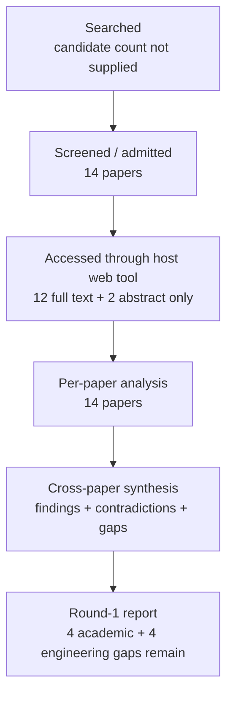

# Research Report: Email, image, table and attachment understanding in workplace communication: preserving multimodal and document structure, and grounding evidence back to precise source locations such as a cell, region, page or attachment version

## Contents

- [Round History](#round-history)
- [Executive Summary](#executive-summary)
- [Research Question](#research-question)
- [Methodology](#methodology)
- [Papers Reviewed](#papers-reviewed)
- [Research Landscape](#research-landscape)
- [Methodology Comparison](#methodology-comparison)
- [Confidence-Graded Findings](#confidence-graded-findings)
- [Trade-Off Analysis](#trade-off-analysis)
- [Points of Agreement](#points-of-agreement)
- [Points of Contradiction](#points-of-contradiction)
- [Research Gaps](#research-gaps)
- [Reproducibility Notes](#reproducibility-notes)
- [Practical Recommendations](#practical-recommendations)
- [Future Directions](#future-directions)
- [Readiness Assessment (System-Building Mode)](#readiness-assessment-system-building-mode)
- [Evidence Map](#evidence-map)
- [References](#references)
- [Appendix: Run Metadata](#appendix-run-metadata)

## Round History

Iterative gap-closure loop (hard cap: 4 rounds). See `references/iterative-synthesis.md` for the full loop definition.

| Round | Run ID | Topic / Gap Focus | New Papers | Gaps Addressed | Remaining Gaps |
|-------|--------|-------------------|------------|----------------|----------------|
| 1 | b251df112d0c | email, image, table and attachment understanding in workplace communication: preserving multimodal and document structure, and grounding evidence back to precise source locations such as a cell, region, page or attachment version | 14 | initial shortlist | 4 academic, 4 engineering |

**Stop reason**: another round runs while open academic gaps remain and new papers appear

## Executive Summary

This review investigates whether workplace-relevant multimodal information can be preserved and interpreted without flattening away table structure, page layout, images, reading order, or precise evidence provenance. Fourteen papers from 2020–2026 collectively show with [HIGH] confidence that structural information such as rows, columns, hierarchy, two-dimensional layout, reading order, and page organization can materially affect document-understanding performance, and that semantic answer correctness must be evaluated separately from evidence-location correctness [2006.14806] [2010.12537] [2106.11539] [2212.05935] [2407.01523] [2412.18424] [2503.23131]. The strongest result is that structure and provenance cannot safely be reduced to plain extracted text alone; different studies demonstrate useful provenance at cell, page, bounding-box, and mask granularities [doi-10-18653-v1-2020-acl-main-398] [2212.05935] [2503.23131] [manual-0661fc0cba]. The most significant unresolved problem is that the literature reviewed here does not provide a unified, experimentally validated chain from attachment identity and attachment version through page and document element to an exact region, cell, or span, nor does it directly evaluate email-language references such as “the highlighted row” against versioned workplace attachments. Four academic and four engineering gaps therefore remain open.

**Scope**: 14 papers analyzed from arXiv, SpringerLink, ACL Anthology, CVPR OpenAccess, and the Hong Kong Polytechnic University research portal over 2020–2026  
**Overall Confidence**: Medium  
**Verdict**: HAS_GAPS

## Research Question

The review asks:

> How should a work-information system preserve and understand information carried by email-associated images, tables, documents, and attachments while maintaining enough document structure and provenance to ground a claim back to a precise source location such as an attachment version, page, visual region, table cell, or text span?

In scope are document structure preservation, table structure and semantics, reading order, multi-page understanding, multimodal document QA, visual/document-region grounding, provenance granularity, and failure modes caused by flattening, OCR, layout reconstruction, or page compression.

Also in scope is the distinction between:

- parsing success and semantic understanding;
- OCR text and layout-aware understanding;
- cell values and table semantics;
- answer correctness and evidence-location correctness;
- attachment identity and attachment-version identity;
- generic image understanding and precise visual grounding.

Out of scope is the downstream determination of which textual proposition a successfully grounded multimodal object semantically scopes over, and the interpretation of already grounded evidence as an action, request, commitment, or decision. Those responsibilities remain outside Topic 08's ownership boundary.

## Methodology

### Search Strategy

- **Sources**: Papers were read through the host's web tool. Admitted-paper access came from arXiv, SpringerLink, ACL Anthology, CVPR OpenAccess, and the Hong Kong Polytechnic University research portal. The upstream discovery-source mix was not supplied in the run input.
- **Query variants**:
  - `email, image, table attachment understanding workplace communication: preserving multimodal document structure, grounding evidence back precise source locations cell, region, page version`
  - `email, image, table`
  - `email, attachment understanding workplace communication: preserving multimodal document structure, grounding evidence back precise source locations cell, region, page version`
  - `image, attachment understanding workplace communication: preserving multimodal document structure, grounding evidence back precise source locations cell, region, page version`
  - `table attachment understanding workplace communication: preserving multimodal document structure, grounding evidence back precise source locations cell, region, page version`
  - `email, image, table attachment understanding`
  - `email, image, table workplace communication:`
  - `email, image, table preserving multimodal`
- **Time window**: 2020–2026 among the 14 admitted papers.
- **Screening**: The supplied run record identifies an initial shortlist of 14 papers but does not specify whether screening used BM25 only or BM25 plus a sub-agent, so this is unknown rather than inferred.

The access level used in analysis was:

| Paper | Host-web access level |
|---|---|
| [1911.10683] | full text |
| [doi-10-1007-s00521-022-06948-5] | full text |
| [2010.12537] | full text |
| [2006.14806] | full text |
| [2111.07129] | full text |
| [doi-10-18653-v1-2020-acl-main-398] | full text |
| [manual-0661fc0cba] | abstract only |
| [manual-1048d6caf2] | abstract only |
| [2503.23131] | full text |
| [2212.05935] | full text |
| [2407.01523] | full text |
| [2412.18424] | full text |
| [2106.11539] | full text |
| [2104.12756] | full text |

Twelve papers therefore had full-text access and two had abstract-only access. Findings depending substantially on the two abstract-only records are treated more cautiously.

### Pipeline Summary

| Metric | Count |
|--------|-------|
| Total candidates | unknown; not supplied |
| After screening | 14 admitted papers |
| Downloaded | unknown; papers were accessed through the host web tool and a download count was not supplied |
| Successfully converted | unknown; conversion count was not supplied |
| Deeply analyzed | 14, with 12 full-text and 2 abstract-only evidence records |
| Iterations (if system-building) | 1 literature round completed |

## Papers Reviewed

| # | Title | Authors | Year | Venue | Quality Score | Relevance |
|---|-------|---------|------|-------|--------------|-----------|
| 1 | Image-based table recognition: data, model, and evaluation [1911.10683] | Xu Zhong, Elaheh ShafieiBavani, Antonio Jimeno Yepes | 2020 | not supplied | not scored | HIGH |
| 2 | Reading order detection on handwritten documents [doi-10-1007-s00521-022-06948-5] | Lorenzo Quirós, Enrique Vidal | 2022 | not supplied | not scored | MEDIUM |
| 3 | TUTA: Tree-based Transformers for Generally Structured Table Pre-training [2010.12537] | Zhiruo Wang, Haoyu Dong, Ran Jia et al. | 2021 | not supplied | not scored | HIGH |
| 4 | TURL: Table Understanding through Representation Learning [2006.14806] | Xiang Deng, Huan Sun, Alyssa Lees et al. | 2020 | not supplied | not scored | HIGH |
| 5 | Visual Understanding of Complex Table Structures from Document Images [2111.07129] | Sachin Raja, Ajoy Mondal, C. V. Jawahar | 2022 | not supplied | not scored | HIGH |
| 6 | TaPas: Weakly Supervised Table Parsing via Pre-training [doi-10-18653-v1-2020-acl-main-398] | Jonathan Herzig, Pawel Krzysztof Nowak, Thomas Müller et al. | 2020 | ACL record; exact venue wording not supplied | not scored | HIGH |
| 7 | M3Grounder: Mask-Based Multi-Span and Multi-Granular Grounding for Document QA [manual-0661fc0cba] | Venkata Kesav Venna, Sai Madhusudan Gunda, Jyothi Swaroopa Jinka et al. | 2026 | CVPR OpenAccess record; exact venue wording not supplied | not scored | HIGH |
| 8 | Scene-Text Oriented Referring Expression Comprehension [manual-1048d6caf2] | authors not supplied | 2026 | not supplied | not scored | MEDIUM |
| 9 | RefChartQA: Grounding Visual Answer on Chart Images through Instruction Tuning [2503.23131] | Alexander Vogel, Omar Moured, Yufan Chen et al. | 2025 | not supplied | not scored | HIGH |
| 10 | Hierarchical multimodal transformers for Multi-Page DocVQA [2212.05935] | Rubèn Tito, Dimosthenis Karatzas, Ernest Valveny | 2023 | not supplied | not scored | HIGH |
| 11 | MMLongBench-Doc: Benchmarking Long-context Document Understanding with Visualizations [2407.01523] | Yubo Ma, Yuhang Zang, Liangyu Chen et al. | 2024 | not supplied | not scored | HIGH |
| 12 | LongDocURL: a Comprehensive Multimodal Long Document Benchmark Integrating Understanding, Reasoning, and Locating [2412.18424] | Chao Deng, Jiale Yuan, Pi Bu et al. | 2025 | not supplied | not scored | HIGH |
| 13 | DocFormer: End-to-End Transformer for Document Understanding [2106.11539] | Srikar Appalaraju, Bhavan Jasani, Bhargava Urala Kota et al. | 2021 | not supplied | not scored | HIGH |
| 14 | InfographicVQA [2104.12756] | Minesh Mathew, Viraj Bagal, Rubèn Pérez Tito et al. | 2022 | not supplied | not scored | HIGH |

## Research Landscape

### Theme 1: Structure preservation is part of meaning preservation

**Coverage**: 8 papers | **Confidence**: High  
**Supporting papers**: [1911.10683], [doi-10-1007-s00521-022-06948-5], [2010.12537], [2006.14806], [2111.07129], [doi-10-18653-v1-2020-acl-main-398], [2106.11539], [2412.18424]

The table and document literature consistently separates content tokens from structural relationships. TURL and TUTA explicitly model table organization rather than treating a table as an undifferentiated text sequence, while TAPAS encodes row and column structure for table reasoning [2006.14806] [2010.12537] [doi-10-18653-v1-2020-acl-main-398]. DocFormer combines textual, spatial, and visual document representations, and LongDocURL reports advantages from structure-preserving parsed text over less structured extraction in its evaluated long-document QA setting [2106.11539] [2412.18424]. Image-based table-recognition work separately demonstrates that reconstructing cells, spanning relationships, and geometry from document images is itself a nontrivial upstream problem [1911.10683] [2111.07129].

Key findings:

1. [HIGH] **Explicit structural representations can improve measured downstream understanding within their evaluated tasks.** Row/column or tree structure, shared two-dimensional layout, and structure-preserving parsed representations all show task-specific benefits [2006.14806] [2010.12537] [2106.11539] [2412.18424].
2. [HIGH] **Recovering structure from an image and semantically interpreting an already structured table are distinct problems.** Image-table recognition reconstructs cells and spans from page pixels, whereas TURL, TUTA, and TAPAS start from table representations that already expose structural relations [1911.10683] [2111.07129] [2006.14806] [2010.12537] [doi-10-18653-v1-2020-acl-main-398].
3. [HIGH] **Reading order is another structural dependency rather than a cosmetic formatting detail.** Hierarchical reading-order processing can produce large improvements on some document collections, while heterogeneous layouts and upstream segmentation errors remain difficult [doi-10-1007-s00521-022-06948-5].

### Theme 2: Provenance exists at multiple incompatible granularities

**Coverage**: 4 papers | **Confidence**: High  
**Supporting papers**: [doi-10-18653-v1-2020-acl-main-398], [2212.05935], [2503.23131], [manual-0661fc0cba]

The reviewed systems demonstrate evidence localization at different levels rather than a shared provenance model. TAPAS can select supporting table cells [doi-10-18653-v1-2020-acl-main-398]. Hi-VT5 predicts a supporting page within multi-page documents [2212.05935]. RefChartQA grounds answers to chart-element bounding boxes [2503.23131]. M3Grounder describes phrase-, line-, and block-level mask grounding, although only abstract-level evidence was available for this review [manual-0661fc0cba].

A useful product abstraction suggested by the synthesis is a typed provenance location

$L=(a,v,p,e,r,c,s)$

where $a$ is attachment identity, $v$ attachment version, $p$ page, $e$ document element, $r$ visual region, $c$ table cell, and $s$ textual span. The reviewed literature validates several individual components of such a tuple, but not the complete hierarchy.

Key findings:

1. [HIGH] **Precise evidence grounding is technically feasible at cell, page, and bounding-box levels in separate task settings** [doi-10-18653-v1-2020-acl-main-398] [2212.05935] [2503.23131].
2. [MEDIUM] **Pixel-mask provenance can potentially provide finer-grained document evidence than boxes alone, but the relevant M3Grounder evidence in this round is abstract-level and therefore insufficient for a strong implementation conclusion** [manual-0661fc0cba].
3. [HIGH] **No admitted paper experimentally validates the full provenance chain from attachment version through page to exact region, cell, and answer span.** Existing papers cover subsets of that hierarchy [doi-10-18653-v1-2020-acl-main-398] [2212.05935] [2503.23131] [manual-0661fc0cba].

### Theme 3: Long and multi-page documents remain difficult

**Coverage**: 3 papers | **Confidence**: High  
**Supporting papers**: [2212.05935], [2407.01523], [2412.18424]

Multi-page document systems face a combination of memory limits, page-selection problems, compression, long-context reasoning, and cross-page evidence integration. Hi-VT5's page-aware approach becomes particularly relevant as evidence moves deeper into a document [2212.05935]. MMLongBench-Doc reports weaker performance on cross-page and later-evidence questions [2407.01523]. LongDocURL explicitly includes substantial multi-page evidence and still reports a large remaining model-human gap [2412.18424].

Key findings:

1. [HIGH] **Evidence later in a document is not equivalent to evidence near the beginning.** Position and page-selection effects materially influence results in multi-page evaluation [2212.05935] [2407.01523].
2. [HIGH] **Cross-page questions remain harder than many single-page cases.** The observed difficulty persists across different long-document benchmarks and architectures [2212.05935] [2407.01523] [2412.18424].
3. [HIGH] **Compression or flattening is not a free optimization.** Long-document input strategies can trade memory and context capacity against loss of document structure or visual evidence [2212.05935] [2412.18424].

### Theme 4: Visual information helps selectively, not universally

**Coverage**: 4 papers | **Confidence**: High  
**Supporting papers**: [2106.11539], [2104.12756], [2407.01523], [2503.23131]

The corpus does not support a universal rule that more visual features always improve document understanding. DocFormer reports benefits from jointly modeling image, text, and spatial information on its evaluated form and receipt tasks [2106.11539]. InfographicVQA reports that the particular detected-object regions and OCR-token visual features used in its evaluated baselines did not deliver a general improvement [2104.12756]. MMLongBench-Doc reports that most evaluated LVLMs underperformed OCR-text LLM counterparts in its experiments, while some stronger multimodal models were exceptions [2407.01523]. RefChartQA further shows that explicit grounding training can improve some models while reducing answer accuracy for others [2503.23131].

Key findings:

1. [HIGH] **The usefulness of visual features depends on the task, visual representation, detector quality, and model architecture** [2106.11539] [2104.12756] [2407.01523].
2. [HIGH] **Flattened OCR-derived text can remain competitive for text- and table-oriented questions, but it can discard information required for chart- or image-dependent questions** [2407.01523].
3. [HIGH] **Explicit grounding supervision does not guarantee higher answer accuracy across models** [2503.23131].

## Methodology Comparison

| Approach | Papers | Strengths | Weaknesses | Best For | Performance |
|----------|--------|-----------|------------|----------|-------------|
| Image-based table structure recognition | [1911.10683], [2111.07129] | Reconstructs cells, spans, and spatial table structure from document images; can preserve geometry when boxes are retained | Depends on table detection/layout quality; spatial provenance is not guaranteed by every representation; complex structure remains difficult | Scanned or image-origin tables | Strong task-specific structure-recognition results are reported, but no common metric across this report's methods |
| Structured-table representation learning | [2006.14806], [2010.12537] | Represents row/column/hierarchical semantics rather than plain sequence text | Starts from structured tables; does not identify originating page, attachment, or attachment version | Semantic understanding of already parsed tables | Structural modeling improves the evaluated table tasks |
| Table QA with explicit cell selection | [doi-10-18653-v1-2020-acl-main-398] | Produces answer reasoning tied to selected cells; provenance can be more precise than answer text alone | Does not supply document-page or attachment-version identity | QA over structured tables | Demonstrates task-level table QA and cell selection |
| Layout-aware multimodal document encoding | [2106.11539] | Combines textual, spatial, and visual features | Benefit depends on domain and upstream input quality; not a complete provenance system | Forms, receipts, document entity understanding | Multimodal/spatial combination improves evaluated tasks |
| Hierarchical multi-page modeling | [2212.05935] | Handles multiple pages explicitly and predicts supporting page | Page-level localization remains coarser than region/cell provenance; scaling and compression pressures remain | Multi-page DocVQA | Relative advantages increase in difficult later-page cases |
| Long-context multimodal benchmarking | [2407.01523], [2412.18424] | Exposes cross-page, late-evidence, visualization, and input-parsing failures | Primarily evaluation evidence rather than a unified production solution | Comparing long-document input and model strategies | Large remaining difficulty on cross-page and multimodal questions |
| Chart-region grounding | [2503.23131] | Links answers to explicit chart regions/bounding boxes | Grounding accuracy and reasoning accuracy can diverge; grounding tuning is model-dependent | Charts and visual numerical evidence | Grounding training helps some models and hurts answer accuracy for others |
| Fine-grained mask grounding | [manual-0661fc0cba] | Potential phrase-, line-, and block-level source localization | Evidence in this review is abstract-only; full experimental detail was unavailable | Fine-grained document QA provenance | Insufficient access for robust comparative assessment |
| Scene-text referring-expression grounding | [manual-1048d6caf2] | Addresses language referring to visually located text | Natural-scene transfer evidence rather than workplace-document evidence; abstract-only access | Adjacent research for expressions referring to visible text | Insufficient evidence for workplace-document performance |
| Reading-order detection | [doi-10-1007-s00521-022-06948-5] | Models hierarchical layout relationships before text consumption | Sensitive to heterogeneous layouts and upstream segmentation | Scanned/handwritten document serialization | Large gains on some datasets, but heterogeneous ABP documents remain difficult |

## Confidence-Graded Findings

### 🟢 High Confidence (supported by 3+ papers with consistent results)

1. [HIGH] **Explicit document and table structure can materially affect understanding performance.** Independent work on TURL, TUTA, DocFormer, and LongDocURL supports preserving structural relationships rather than treating serialization as semantics-free preprocessing [2006.14806] [2010.12537] [2106.11539] [2412.18424].

2. [HIGH] **Image-based table recognition can reconstruct spatial table structure, but spatial provenance is not inherent to every table representation.** The EDD/PubTabNet setup discussed by Zhong et al. did not supply cell coordinates in the relevant representation, whereas the rectilinear-relation framework preserves cell boxes while recovering span relationships [1911.10683] [2111.07129].

3. [HIGH] **Structured-table models do not by themselves provide attachment or page provenance.** TURL, TUTA, and TAPAS preserve useful table-internal relations but do not identify an originating attachment version and page location as part of their evaluated representation [2006.14806] [2010.12537] [doi-10-18653-v1-2020-acl-main-398].

4. [HIGH] **Evidence can be localized at several granularities, but those granularities have been demonstrated separately.** Selected cells, supporting pages, and chart-element bounding boxes are each experimentally represented in different systems [doi-10-18653-v1-2020-acl-main-398] [2212.05935] [2503.23131].

5. [HIGH] **Long, late, and cross-page evidence remains difficult.** Hi-VT5, MMLongBench-Doc, and LongDocURL all expose degradation or remaining difficulty associated with multi-page information integration [2212.05935] [2407.01523] [2412.18424].

6. [HIGH] **Answer correctness and evidence-grounding correctness are distinct dimensions.** Hi-VT5 includes cases with correct answers but incorrect supporting-page prediction, while RefChartQA reports examples where relevant visual regions are localized but subsequent mathematical reasoning fails [2212.05935] [2503.23131].

7. [HIGH] **Grounding supervision is not monotonically beneficial to answer accuracy.** RefChartQA reports meaningful gains for some evaluated model configurations and declines for others after grounding instruction tuning [2503.23131].

8. [HIGH] **Reading-order recovery depends on both hierarchical reasoning and upstream segmentation quality.** Strong improvements on OHG and FCR coexist with inadequate practical recovery on the heterogeneous ABP collection [doi-10-1007-s00521-022-06948-5].

9. [HIGH] **Plain OCR/text pathways and full visual pathways have complementary failure modes.** OCR-derived text can remain competitive for text/table questions, while visual evidence becomes important for image/chart questions; retaining table structure within parsed text can also improve long-document QA compared with less structured extraction [2407.01523] [2412.18424].

### 🟡 Medium Confidence (supported by 1-2 papers or with caveats)

1. [MEDIUM] **Pixel-mask grounding may offer a useful provenance level below bounding boxes.** M3Grounder describes multi-granular phrase-, line-, and block-level masks, but this round had abstract-only access, so the detailed evaluation cannot be independently assessed here [manual-0661fc0cba].

2. [MEDIUM] **Referring-expression methods for visually located scene text are a plausible mechanism for document expressions that refer to visible text.** The scene-text work is adjacent-domain evidence rather than direct validation on workplace documents or email-linked attachments [manual-1048d6caf2].

### 🔴 Low Confidence (preliminary, single-source, or contradicted)

1. [LOW] **Existing academic methods are sufficient for production-grade email-to-attachment grounding.** The corpus does not establish this. It contains little or no direct target-domain evaluation in which workplace-message text refers to a precise location in a linked and versioned attachment; therefore any production-accuracy claim would currently be unsupported [manual-1048d6caf2] [2503.23131] [manual-0661fc0cba].

2. [LOW] **A complete attachment-version provenance model can be inferred from existing page/region grounding work.** The reviewed systems do not test longitudinal attachment identity or mappings between corresponding regions across revisions, so extrapolation to that requirement would be speculative [2212.05935] [2503.23131] [manual-0661fc0cba].

## Trade-Off Analysis

| Decision | Option A | Option B | Recommendation |
|----------|----------|----------|----------------|
| Preserve flattened text only vs. retain structure | Flattened text is simple, searchable, and can perform well for some text/table questions, but may destroy page geometry, reading order, merged-cell relations, charts, or image evidence [2407.01523] | Retain native/derived structural representations alongside text; costs more storage and pipeline complexity but preserves evidence required by multiple document tasks [2006.14806] [2010.12537] [2106.11539] [2412.18424] | Preserve both. Do not make flattened text the sole canonical representation |
| OCR/text pathway vs. visual pathway | Text pathways can be efficient and competitive on text-heavy questions [2407.01523] | Visual pathways preserve charts, images, layout, and visually encoded relations, but are not uniformly better [2104.12756] [2106.11539] [2407.01523] | Route or combine pathways by document element/type; benchmark rather than assume one universal winner |
| Page-level vs. fine-grained provenance | Page labels scale naturally to multi-page retrieval and are demonstrated by Hi-VT5 [2212.05935] | Cell/box/mask grounding can identify more precise evidence but requires richer source geometry [doi-10-18653-v1-2020-acl-main-398] [2503.23131] [manual-0661fc0cba] | Use hierarchical provenance in which coarse levels remain valid when finer levels are unavailable |
| Couple answer generation with grounding vs. score separately | A single output is simpler but can conceal wrong evidence behind a correct answer | Separate semantic and provenance outputs expose cases in which one is correct and the other fails [2212.05935] [2503.23131] | Score separately and require both where source traceability matters |
| Treat unsupported parsing as empty content vs. explicit failure | Empty output is operationally simple but indistinguishable from genuinely empty source content | Explicit unsupported/failed/partial states preserve uncertainty and recovery opportunities | Use explicit failure states; this is an engineering requirement requiring dedicated validation |
| Model-generated attachment identity vs. deterministic identity/versioning | Semantic labels are flexible but unstable under reprocessing | Stable deterministic artifact/version identifiers provide durable lineage independent of model interpretation | Assign immutable identity/version outside the language model and attach model interpretations to those identifiers |
| Compress long documents aggressively vs. preserve page context | Compression reduces context/memory pressure but risks information and structural loss [2212.05935] [2412.18424] | Rich page-level representations preserve evidence but increase operational cost | Use retrieval/hierarchy plus recoverable source representations; never discard source evidence merely to fit model context |

A suitable correctness model for implementation is not merely answer accuracy. At minimum, semantic and provenance success should remain independently visible. If $S$ denotes semantic correctness and $G$ provenance correctness, a strict end-to-end success criterion can be expressed as

$J = S \land G$

while retaining $S$ and $G$ as separate reported metrics. This avoids allowing a correct answer with the wrong source location, or a correct location with failed reasoning, to appear fully successful.

## Points of Agreement **[EVIDENCE REQUIRED]**

1. [HIGH] **Document structure carries task-relevant information.** Table hierarchy, row/column organization, two-dimensional layout, page structure, and reading order affect different evaluated document tasks [2006.14806] [2010.12537] [2106.11539] [doi-10-1007-s00521-022-06948-5] [2412.18424].

2. [HIGH] **Image-table recovery and table-semantic understanding should not be treated as the same stage.** Image-based systems reconstruct cells and spanning relations, whereas table-language models reason over structures that have already been parsed [1911.10683] [2111.07129] [2006.14806] [2010.12537] [doi-10-18653-v1-2020-acl-main-398].

3. [HIGH] **Multi-page evidence location remains an unsolved source of difficulty.** Later pages, cross-page evidence, and long-document reasoning remain challenging across independent evaluations [2212.05935] [2407.01523] [2412.18424].

4. [HIGH] **Evidence localization deserves its own evaluation.** Page prediction, selected cells, and chart-region grounding demonstrate provenance objectives that cannot be reduced to answer accuracy [doi-10-18653-v1-2020-acl-main-398] [2212.05935] [2503.23131].

5. [HIGH] **Upstream structural mistakes can propagate into downstream understanding.** Table-detection/layout dependencies and reading-order segmentation failures show that later model intelligence does not eliminate errors introduced during document decomposition [2111.07129] [doi-10-1007-s00521-022-06948-5] [2106.11539].

## Points of Contradiction **[EVIDENCE REQUIRED]**

1. [HIGH] **Whether adding visual features reliably improves document understanding**: DocFormer reports gains from combining text, image, and spatial features on its evaluated document tasks [2106.11539], whereas InfographicVQA reports that the evaluated generic detected-object regions and OCR-token visual features did not provide a general improvement [2104.12756]. MMLongBench-Doc further reports that most evaluated LVLMs underperformed OCR-text LLM counterparts, with stronger multimodal models providing exceptions [2407.01523].
   - **Possible explanation**: The studies differ in document domains, tasks, visual representations, OCR pipelines, architectures, and model capacity. The evidence contradicts a universal claim that adding visual features necessarily improves results; it does not invalidate the task-specific measurements.
   - **Implication**: msgloom should not select a visual pipeline merely because it is multimodal. Structured-text and visual routes should be benchmarked against the actual document classes and evidence types.

2. [HIGH] **Whether explicit visual-grounding training improves answer accuracy**: RefChartQA itself contains both outcomes. Grounding instruction tuning produces large gains for some evaluated models while answer accuracy falls for other configurations [2503.23131].
   - **Possible explanation**: Grounding supervision changes the optimization target and may benefit models capable of using localized evidence while imposing trade-offs on others.
   - **Implication**: Grounding quality and semantic answer quality should be separately measured rather than assuming that improvement in one guarantees improvement in the other.

## Research Gaps

All eight gaps below remain open after Round 1. None is accepted as solved or closed. The current literature reviewed here has not answered the four academic gaps, and it does not provide the complete operational validation required for the four engineering gaps.

| # | Gap | Type | Severity | Rounds searched | Impact on Goals |
|---|-----|------|----------|-----------------|----------------|
| G1 | Provenance across successive attachment revisions, including stable version-relative locations, semantic changes, and mappings between older and newer evidence regions, has not been established | [ACADEMIC] | HIGH | Round 1 | Without it, a citation may point to the wrong revision or lose lineage after an attachment changes |
| G2 | Direct grounding from workplace-message language such as “this screenshot”, “the highlighted row”, or “numbers below” to an attachment, cell, or document region has not been evaluated by this corpus | [ACADEMIC] | HIGH | Round 1 | Prevents reliable cross-modal resolution of references in real work communication |
| G3 | Spreadsheet semantics beyond isolated tables—formulas, hidden rows/sheets, cross-sheet references, merged regions, formatting semantics, units, and named ranges—remain unanswered | [ACADEMIC] | HIGH | Round 1 | Spreadsheet evidence could be misread even when visible values are extracted correctly |
| G4 | No admitted paper validates one end-to-end provenance representation spanning attachment version, page, document element, exact region/cell, and answer span | [ACADEMIC] | HIGH | Round 1 | Prevents direct adoption of a literature-validated provenance architecture |
| G5 | A complete contract for distinguishing genuine absence from unsupported, incomplete, or failed parsing/OCR/layout/grounding has not been validated | [ENGINEERING] | HIGH | Round 1 | Silent failures could look like successful empty extraction and cause important evidence to disappear |
| G6 | Robustness of candidate extraction/structure pipelines on heterogeneous workplace-style documents has not been measured with the required adversarial coverage | [ENGINEERING] | HIGH | Round 1 | Real attachments can contain sparse/merged tables, scans, irregular layouts, OCR corruption, and embedded objects |
| G7 | Operational scaling for long documents and very large tables remains unresolved under memory, quadratic relation inference, page compression, and context limits | [ENGINEERING] | MEDIUM | Round 1 | Scaling choices can silently discard evidence or make processing impractical |
| G8 | No single evaluation jointly scores semantic correctness, extraction completeness, exact provenance, unsupported-evidence handling, reading order, tables, images, and workplace-style attachment structure | [ENGINEERING] | HIGH | Round 1 | The system could pass component benchmarks while still missing decision-critical evidence end to end |

The synthesis also identified two boundary items that are intentionally excluded from Topic 08's open-gap count: after an object is grounded, determining which textual proposition it semantically scopes over belongs to the reference/response-scope responsibility; interpreting already grounded content as an action, request, commitment, or decision belongs to the action/decision responsibility. These are ownership boundaries rather than Topic 08 gaps.

### Academic Gaps (require more papers)

1. **[ACADEMIC] [HIGH] G1 — Attachment revision provenance**: The literature reviewed in Round 1 has not answered how to maintain stable evidence provenance across successive document or attachment versions, including mapping a cited region in version $v_i$ to the corresponding, deleted, moved, or modified region in $v_{i+1}$. Existing page and region grounding does not supply revision identity or longitudinal lineage [2212.05935] [2407.01523] [2503.23131] [manual-0661fc0cba].  
   **Rounds already searched**: 1.  
   **Suggested query**: `"document version comparison" multimodal provenance semantic change region grounding attachment revision`.

2. **[ACADEMIC] [HIGH] G2 — Cross-modal reference grounding from work messages**: The literature reviewed in Round 1 has not directly evaluated references such as “this screenshot”, “the highlighted row”, “numbers below”, or “attachment version two” when the referring expression occurs in message text and the target lies in another document object. Scene-text referring-expression work is adjacent-domain evidence only [manual-1048d6caf2], while chart/document grounding work starts from different task formulations [2503.23131] [manual-0661fc0cba].  
   **Rounds already searched**: 1.  
   **Suggested query**: `"multimodal coreference" document attachment visual grounding referring expression email table screenshot`.

3. **[ACADEMIC] [HIGH] G3 — Workbook-level spreadsheet understanding**: The literature reviewed in Round 1 has not answered the broader workbook problem: formulas, hidden sheets/rows, cross-sheet dependencies, merged regions, formatting semantics, units, named ranges, and workbook-level relationships. TURL, TUTA, and TAPAS provide strong evidence about structured tables but not this complete spreadsheet surface [2006.14806] [2010.12537] [doi-10-18653-v1-2020-acl-main-398].  
   **Rounds already searched**: 1.  
   **Suggested query**: `"spreadsheet understanding" formulas merged cells multi-sheet semantic workbook grounding`.

4. **[ACADEMIC] [HIGH] G4 — Unified hierarchical provenance**: The literature reviewed in Round 1 has not validated an end-to-end evidence location model that jointly covers attachment identity/version, page, element, region/cell, and span. Existing work establishes separate pieces of the hierarchy [doi-10-18653-v1-2020-acl-main-398] [2212.05935] [2503.23131] [manual-0661fc0cba].  
   **Rounds already searched**: 1.  
   **Suggested query**: `"document evidence grounding" provenance page region cell span multimodal citation localization`.

### Engineering Gaps (fillable without papers)

1. **[ENGINEERING] [HIGH] G5 — Explicit incomplete/unsupported/failure semantics**: The current literature does not provide the complete operational contract required by msgloom for distinguishing genuine empty evidence from parser failure, OCR failure, unsupported embedded objects, incomplete extraction, layout failure, or grounding failure [2407.01523] [2106.11539] [2111.07129] [doi-10-1007-s00521-022-06948-5].  
   **Rounds already searched**: 1.  
   **Suggested resolution**: Define typed extraction and grounding outcomes such as `complete`, `partial`, `unsupported`, `failed`, and `not_present`; preserve affected source identity and error lineage; construct tests proving that failure can never silently collapse into successful empty content.

2. **[ENGINEERING] [HIGH] G6 — Heterogeneous workplace-document robustness**: The required robustness has not been demonstrated for the intended workload.  
   **Rounds already searched**: 1.  
   **Suggested resolution**: Build independent synthetic/adversarial fixtures covering sparse tables, merged cells, ambiguous multi-row headers, units, irregular reading order, embedded images, scanned pages, OCR corruption, charts, and mixed text/image documents. Include false-negative and provenance-error counts [2111.07129] [doi-10-1007-s00521-022-06948-5] [2106.11539] [2412.18424].

3. **[ENGINEERING] [MEDIUM] G7 — Scaling under large document/table inputs**: The operational balance among memory, latency, table-relation complexity, page compression, and context truncation remains unresolved [2111.07129] [2212.05935] [2412.18424].  
   **Rounds already searched**: 1.  
   **Suggested resolution**: Benchmark page counts, table sizes, cell counts, image density, and cross-page dependencies separately; measure both resource cost and evidence-loss rate so performance optimization cannot hide semantic degradation.

4. **[ENGINEERING] [HIGH] G8 — Unified end-to-end evaluation**: The current literature has not supplied a single benchmark that simultaneously measures all msgloom-critical dimensions [2407.01523] [2412.18424] [2503.23131] [2111.07129].  
   **Rounds already searched**: 1.  
   **Suggested resolution**: Build an evaluation suite with independent gold annotations for content completeness, structure, semantic answer, provenance, reading order, table/cell relationships, explicit unsupported cases, and version identity. Synthetic/adversarial fixtures can validly exercise the mechanism without claiming production-mailbox representativeness.

## Reproducibility Notes

Code, dataset, and license status were not included in the supplied cross-paper synthesis and were not independently re-audited while writing this report. Unknown fields are therefore left explicitly unknown rather than inferred from paper familiarity or hosting location.

| Paper | Code Available | Data Available | Sufficient Detail | License |
|-------|---------------|----------------|-------------------|---------|
| [1911.10683] | unknown | unknown | full text available; reproducibility sufficiency not separately scored | unknown |
| [doi-10-1007-s00521-022-06948-5] | unknown | unknown | full text available; reproducibility sufficiency not separately scored | unknown |
| [2010.12537] | unknown | unknown | full text available; reproducibility sufficiency not separately scored | unknown |
| [2006.14806] | unknown | unknown | full text available; reproducibility sufficiency not separately scored | unknown |
| [2111.07129] | unknown | unknown | full text available; reproducibility sufficiency not separately scored | unknown |
| [doi-10-18653-v1-2020-acl-main-398] | unknown | unknown | full text available; reproducibility sufficiency not separately scored | unknown |
| [manual-0661fc0cba] | unknown | unknown | ⚠️ abstract-only access in this round | unknown |
| [manual-1048d6caf2] | unknown | unknown | ⚠️ abstract-only access in this round | unknown |
| [2503.23131] | unknown | unknown | full text available; reproducibility sufficiency not separately scored | unknown |
| [2212.05935] | unknown | unknown | full text available; reproducibility sufficiency not separately scored | unknown |
| [2407.01523] | unknown | unknown | full text available; reproducibility sufficiency not separately scored | unknown |
| [2412.18424] | unknown | unknown | full text available; reproducibility sufficiency not separately scored | unknown |
| [2106.11539] | unknown | unknown | full text available; reproducibility sufficiency not separately scored | unknown |
| [2104.12756] | unknown | unknown | full text available; reproducibility sufficiency not separately scored | unknown |

## Practical Recommendations **[EVIDENCE REQUIRED]**

1. **Preserve structural representations alongside extracted text.** Keep page identity, cell grids, row/column relationships, spans, bounding boxes or masks where available, reading-order relations, headers, and units rather than allowing plain serialization to become the only retained source representation. This follows from evidence that explicit structure can improve table and document tasks and that less structured extraction can lose useful information [2006.14806] [2010.12537] [2106.11539] [2412.18424].  
   *Confidence*: High

2. **Use a typed hierarchical provenance model.** A record should be capable of expressing attachment identity, attachment version, page, element, region, cell, and text span, while permitting unknown levels rather than fabricating unavailable precision. Cell-, page-, box-, and mask-level grounding are independently demonstrated, though the unified hierarchy remains an academic gap [doi-10-18653-v1-2020-acl-main-398] [2212.05935] [2503.23131] [manual-0661fc0cba].  
   *Confidence*: High for the need; Medium for the exact unified representation because it has not been directly validated.

3. **Keep extraction, structural interpretation, grounding, and downstream semantic judgment distinguishable.** A downstream answer must not erase whether OCR/layout reconstruction failed, and a correct answer must not be allowed to conceal incorrect provenance. Hi-VT5 and RefChartQA directly demonstrate separability between localization and answer reasoning [2212.05935] [2503.23131].  
   *Confidence*: High

4. **Evaluate semantic correctness and provenance correctness separately.** Report at least semantic accuracy $S$, grounding/provenance accuracy $G$, and a strict joint measure $J=S\land G$ when both are required. This follows from observed answer/location mismatches [2212.05935] [2503.23131].  
   *Confidence*: High

5. **Do not assume either OCR-text or full visual processing is universally superior.** Benchmark pathways by document element and task. Text can remain competitive on text/table questions, while image/chart evidence requires preserved visual information; visual-feature gains vary substantially by model and representation [2104.12756] [2106.11539] [2407.01523].  
   *Confidence*: High

6. **Treat table-image reconstruction and table-semantic understanding as separate pipeline capabilities.** The first recovers cells, spans, and geometry from pixels; the second reasons over an already structured table [1911.10683] [2111.07129] [2006.14806] [2010.12537] [doi-10-18653-v1-2020-acl-main-398]. Preserve both stages' outputs and failures.  
   *Confidence*: High

7. **Preserve explicit failures and unsupported regions.** Evidence from layout, reading-order, and long-document work shows that upstream errors and input transformations can affect downstream reasoning [doi-10-1007-s00521-022-06948-5] [2111.07129] [2407.01523]. A failed or unsupported object should therefore remain a recoverable limitation rather than be represented as successful empty extraction.  
   *Confidence*: High for the failure-risk principle; engineering validation remains open.

8. **Assign stable attachment and version identities deterministically, outside model-generated descriptions.** None of the reviewed systems supplies the required longitudinal version model, while existing grounding methods depend on stable source objects at lower levels [2212.05935] [2503.23131]. Deterministic identity is therefore a defensive engineering requirement pending the G1 literature follow-up.  
   *Confidence*: Medium

9. **Create adversarial fixtures before claiming readiness on workplace attachments.** Include merged cells, multi-row headers, units, sparse tables, charts, scanned pages, OCR corruption, late/cross-page evidence, visually highlighted regions, unsupported embedded objects, and deliberately wrong attachment versions. These target failure modes exposed or motivated by the reviewed table, layout, and long-document literature [2111.07129] [doi-10-1007-s00521-022-06948-5] [2212.05935] [2407.01523] [2412.18424].  
   *Confidence*: High

10. **Do not claim production-email accuracy from this corpus.** The evidence establishes transferable design principles and evaluation dimensions, not performance on complete email threads linked to evolving workplace attachments.  
    *Confidence*: High

## Future Directions

1. Target G1 with literature on semantic document differencing, multimodal version comparison, document revision alignment, and provenance across versions. The objective is not generic file diffing but persistent evidence identity under movement, deletion, rewriting, and layout change.

2. Target G2 with literature on multimodal coreference, document referring expressions, visual grounding over visually rich documents, and cross-document/message reference resolution. Direct evidence should require a referring expression outside the target document whenever possible.

3. Target G3 with spreadsheet-specific research rather than extending ordinary table models by assumption. Priority features are formula dependency, cross-sheet references, hidden content, merged regions, units, formatting semantics, and workbook-level structure.

4. Target G4 with work on evidence-grounded document QA and citation localization that exposes multiple provenance levels simultaneously.

5. Build the G5/G6/G8 engineering benchmark independently of the component under test. The gold representation should include exact source artifact/version identity, page/region/cell coordinates or logical identifiers where available, expected extraction status, and expected semantic evidence.

6. Evaluate long-document strategies with both computational and semantic metrics. A faster method should not be considered superior if it raises evidence omission, provenance error, or structural corruption.

7. Preserve direct-vs-transfer evidence labels in subsequent rounds. Natural-scene referring-expression results may motivate mechanisms, but they should not be counted as demonstrated workplace-email accuracy.

## Readiness Assessment (System-Building Mode)

### Verdict: HAS_GAPS

### Assessment Summary

The Round-1 synthesis is sufficient to establish several implementation principles: preserve structure, retain recoverable source geometry, separate grounding from reasoning, keep explicit failure states, and avoid assuming either text-only or multimodal processing is uniformly superior. It is not sufficient to finalize the complete Topic 08 architecture because four high-priority academic questions remain open, especially attachment-version provenance, email-to-attachment visual reference grounding, spreadsheet semantics, and a unified provenance hierarchy. Engineering can proceed on preservation contracts and evaluation infrastructure while those academic gaps receive targeted follow-up.

### Coverage Matrix

| Dimension | Status | Evidence |
|-----------|--------|----------|
| Architecture patterns | ⚠️ Partial | Structural representation, staged processing, page/cell/region grounding, and multi-page patterns are supported [2006.14806] [2010.12537] [2106.11539] [2212.05935] [2503.23131], but attachment-version provenance is missing |
| Technology stack | ⚠️ Partial | Candidate model families and representation strategies are covered [1911.10683] [2111.07129] [2106.11539] [2212.05935], but the corpus does not select a msgloom production stack |
| Performance baselines | ⚠️ Partial | Individual papers benchmark table, layout, multi-page, long-document, and grounding tasks [2111.07129] [2212.05935] [2407.01523] [2412.18424] [2503.23131], but no unified workplace benchmark exists |
| Security model | ❌ Missing | The admitted literature was not selected to address permissions, attachment security, or access control |
| Trade-off map | ⚠️ Partial | Text vs. visual, answer vs. grounding, page vs. fine-grained provenance, and long-context compression trade-offs are evidenced [2104.12756] [2106.11539] [2212.05935] [2407.01523] [2503.23131]; versioning and production operating trade-offs remain open |

### Gap Resolution Plan

| # | Gap | Type | Severity | Resolution |
|---|-----|------|----------|------------|
| G1 | Attachment revision provenance and cross-version region lineage | [ACADEMIC] | HIGH | Target semantic document-version comparison, revision alignment, and multimodal provenance literature in the next round |
| G2 | Ground message expressions directly to screenshots/tables/cells/attachment regions | [ACADEMIC] | HIGH | Search multimodal coreference, document referring-expression, visual grounding, and cross-document grounding research |
| G3 | Workbook-level spreadsheet semantics | [ACADEMIC] | HIGH | Search spreadsheet-understanding research covering formulas, sheets, merged regions, formatting, units, and dependency graphs |
| G4 | Unified attachment→page→element→region/cell→span provenance | [ACADEMIC] | HIGH | Search evidence-grounded document QA and citation-localization work exposing hierarchical source locations |
| G5 | Explicit parser/OCR/layout/grounding failure contract | [ENGINEERING] | HIGH | Define typed failure states and regression/mutation tests; prohibit failed/unsupported content from becoming empty success |
| G6 | Heterogeneous workplace-document robustness | [ENGINEERING] | HIGH | Build independent adversarial fixtures across tables, scans, OCR noise, images, and irregular reading orders |
| G7 | Scaling for long documents and large tables | [ENGINEERING] | MEDIUM | Benchmark resource cost and semantic/provenance loss together over increasing pages, cells, and visual density |
| G8 | Unified end-to-end evaluation | [ENGINEERING] | HIGH | Construct independent gold for extraction completeness, structure, semantic correctness, provenance, failures, and artifact/version identity |

## Evidence Map

| Research Question Aspect | Supporting evidence |
|--------------------------|---------------------|
| Does table/document structure matter beyond plain text? | [2006.14806] (§4, §6); [2010.12537] (§4.3); [2106.11539] (§4.4); [2412.18424] (§4.4) |
| Can table structure be reconstructed from page images? | [1911.10683] (§VII); [2111.07129] (§3.2–3.3) |
| Do semantic table models retain row/column/hierarchy relations? | [2006.14806] (§4–5); [2010.12537] (§3, §3.5); [doi-10-18653-v1-2020-acl-main-398] (§2, §4) |
| Can evidence be grounded to table cells? | [doi-10-18653-v1-2020-acl-main-398] (§2, §4) |
| Can evidence be grounded to a supporting page? | [2212.05935] (§5.3) |
| Can visual evidence be grounded to bounding boxes? | [2503.23131] (§3.2, §5.4–5.5) |
| Is mask-level document grounding represented? | [manual-0661fc0cba] (abstract/method summary; abstract-only access) |
| Does long/multi-page evidence remain difficult? | [2212.05935] (§5.2–5.3); [2407.01523] (§4.4); [2412.18424] (§3.4, §4.3) |
| Are answer correctness and evidence localization separable? | [2212.05935] (§5.3); [2503.23131] (§5.5) |
| Does grounding instruction always improve answer accuracy? | [2503.23131] (§5.4, Table 2) — no, results are model-dependent |
| Does hierarchical layout help reading order? | [doi-10-1007-s00521-022-06948-5] (§5.2.1, §5.2.5) |
| Is OCR/text flattening always inferior? | [2407.01523] (§4.3–4.4) — no; it is competitive for some question types |
| Can structured parsed text outperform less structured extraction? | [2412.18424] (§4.4) |
| Do visual features universally improve results? | [2106.11539] (§4.4), [2104.12756], [2407.01523] (§4.3–4.4) — no universal result |
| Is email-to-attachment visual reference grounding directly validated? | Not answered by the Round-1 corpus; [manual-1048d6caf2] is adjacent scene-text evidence only |
| Is attachment-version lineage directly validated? | Not answered by the Round-1 corpus |
| Is a unified attachment-version→page→region/cell→span provenance hierarchy validated? | Not answered; only separate hierarchy components are demonstrated by [doi-10-18653-v1-2020-acl-main-398], [2212.05935], [2503.23131], and [manual-0661fc0cba] |

## References

1. [1911.10683] — *Image-based table recognition: data, model, and evaluation*. Xu Zhong, Elaheh ShafieiBavani, Antonio Jimeno Yepes. 2020. Venue not supplied in the review record.
2. [doi-10-1007-s00521-022-06948-5] — *Reading order detection on handwritten documents*. Lorenzo Quirós, Enrique Vidal. 2022. Venue not supplied in the review record.
3. [2010.12537] — *TUTA: Tree-based Transformers for Generally Structured Table Pre-training*. Zhiruo Wang, Haoyu Dong, Ran Jia et al. 2021. Venue not supplied in the review record.
4. [2006.14806] — *TURL: Table Understanding through Representation Learning*. Xiang Deng, Huan Sun, Alyssa Lees et al. 2020. Venue not supplied in the review record.
5. [2111.07129] — *Visual Understanding of Complex Table Structures from Document Images*. Sachin Raja, Ajoy Mondal, C. V. Jawahar. 2022. Venue not supplied in the review record.
6. [doi-10-18653-v1-2020-acl-main-398] — *TaPas: Weakly Supervised Table Parsing via Pre-training*. Jonathan Herzig, Pawel Krzysztof Nowak, Thomas Müller et al. 2020. ACL record; exact venue wording not supplied in the review record.
7. [manual-0661fc0cba] — *M3Grounder: Mask-Based Multi-Span and Multi-Granular Grounding for Document QA*. Venkata Kesav Venna, Sai Madhusudan Gunda, Jyothi Swaroopa Jinka et al. 2026. CVPR OpenAccess record; exact venue wording not supplied in the review record.
8. [manual-1048d6caf2] — *Scene-Text Oriented Referring Expression Comprehension*. Authors not supplied. 2026. Venue not supplied in the review record.
9. [2503.23131] — *RefChartQA: Grounding Visual Answer on Chart Images through Instruction Tuning*. Alexander Vogel, Omar Moured, Yufan Chen et al. 2025. Venue not supplied in the review record.
10. [2212.05935] — *Hierarchical multimodal transformers for Multi-Page DocVQA*. Rubèn Tito, Dimosthenis Karatzas, Ernest Valveny. 2023. Venue not supplied in the review record.
11. [2407.01523] — *MMLongBench-Doc: Benchmarking Long-context Document Understanding with Visualizations*. Yubo Ma, Yuhang Zang, Liangyu Chen et al. 2024. Venue not supplied in the review record.
12. [2412.18424] — *LongDocURL: a Comprehensive Multimodal Long Document Benchmark Integrating Understanding, Reasoning, and Locating*. Chao Deng, Jiale Yuan, Pi Bu et al. 2025. Venue not supplied in the review record.
13. [2106.11539] — *DocFormer: End-to-End Transformer for Document Understanding*. Srikar Appalaraju, Bhavan Jasani, Bhargava Urala Kota et al. 2021. Venue not supplied in the review record.
14. [2104.12756] — *InfographicVQA*. Minesh Mathew, Viraj Bagal, Rubèn Pérez Tito et al. 2022. Venue not supplied in the review record.

## Appendix: Run Metadata

- **Run ID**: b251df112d0c
- **Round**: 1 of at most 4
- **Topic**: email, image, table and attachment understanding in workplace communication: preserving multimodal and document structure, and grounding evidence back to precise source locations such as a cell, region, page or attachment version
- **Sources**: host web tool access to arXiv, SpringerLink, ACL Anthology, CVPR OpenAccess, and the Hong Kong Polytechnic University research portal for the admitted corpus
- **Papers reviewed**: 14
- **Access coverage**: 12 full text; 2 abstract only
- **Open gaps after Round 1**: 4 [ACADEMIC], 4 [ENGINEERING]
- **Pipeline version**: unknown; not supplied
- **Date**: 2026-09-17
- **Artifacts**: `runs/b251df112d0c/`
- **Stop reason**: another round runs while open academic gaps remain and new papers appear
- **Evidence constraint**: inherited Topic 04 and Topic 05 handoffs were used only to define scope and ownership boundaries; they were not treated as evidence for findings
- **Target-domain limitation**: the corpus supports transferable design principles and evaluation dimensions but does not establish production accuracy for complete workplace email threads with versioned attachments
