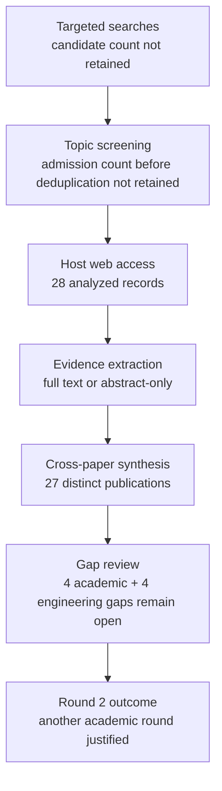

# Research Report: Email, Image, Table and Attachment Understanding in Workplace Communication

## Contents

- [Round History](#round-history)
- [Executive Summary](#executive-summary)
- [Research Question](#research-question)
- [Methodology](#methodology)
- [Papers Reviewed](#papers-reviewed)
- [Research Landscape](#research-landscape)
- [Confidence-Graded Findings](#confidence-graded-findings)
- [Research Gaps](#research-gaps)
- [Practical Recommendations](#practical-recommendations)
- [Evidence Map](#evidence-map)
- [References](#references)
- [Appendix: Run Metadata](#appendix-run-metadata)

## Round History

Iterative gap-closure loop (hard cap: 4 rounds). See
`references/iterative-synthesis.md` for the full loop definition.

| Round | Run ID | Topic / Gap Focus | New Papers | Gaps Addressed | Remaining Gaps |
|-------|--------|-------------------|------------|----------------|----------------|
| 1 | b251df112d0c | email, image, table and attachment understanding in workplace communication: preserving multimodal and document structure, and grounding evidence back to precise source locations such as a cell, region, page or attachment version | 14 | initial shortlist | 4 academic, 4 engineering |
| 2 | a274d1d20c2f | version-aware multimodal evidence provenance and reference grounding across revised workplace attachments, including cross-version region lineage, email-to-attachment referring expressions, workbook-level spreadsheet structure, and hierarchical provenance from attachment version through page, element, region or cell to answer span | 14 | academic gaps of the previous round | 4 academic, 4 engineering |

**Stop reason**: another round runs while open academic gaps remain and new papers appear

## Executive Summary

This review investigated how workplace systems can preserve the semantics of tables, spreadsheets, images, multi-page documents, and revised attachments while grounding extracted or inferred information back to precise evidence locations. Across 27 distinct publications represented by 28 analyses, the strongest result is [HIGH] that explicit spatial, hierarchical, table, workbook, or document structure materially contributes to performance in multiple controlled evaluations, and that answer correctness must be evaluated separately from evidence localization [2106.11539] [2010.12537] [2412.18424] [2604.12282] [2608.03292] [2503.23131] [2212.05935]. The literature also supplies complementary provenance mechanisms at document, page, passage, region, mask, cell, and answer-span levels, plus direct evidence that version modeling and cross-version alignment help version-sensitive tasks [2510.08109] [2607.14117] [2609.08364] [2511.12003] [manual-0661fc0cba] [doi-10-18653-v1-2020-acl-main-398]. However, the most significant gap remains [HIGH] the absence of an experimentally validated end-to-end scheme for revised workplace attachments that preserves stable attachment/version identity and traces evidence through page, element, region or cell, and answer span while resolving references from message text. The research is therefore sufficient to guide a conservative architecture and engineering test programme, but not sufficient to claim that the combined problem has been solved for real workplace communication.

**Scope**: 27 distinct publications, 28 analyzed records, accessed from 6 host families over publication years 2020-2026  
**Overall Confidence**: High for structure preservation and modular grounding principles; Medium for transfer to natural workplace attachments  
**Verdict**: HAS_GAPS

## Research Question

The review investigated:

> How should a workplace communication system preserve and understand evidence contained in email-associated images, tables, spreadsheets, PDFs, document layouts, and repeatedly revised attachments, while retaining sufficient provenance to ground every decision-relevant result back to an exact source such as an attachment version, page, parsed element, visual region, table cell, passage, or answer span?

The scope includes:

- visually rich document understanding and layout-aware representations;
- multi-page and long-document question answering;
- page, region, bounding-box, mask, cell, passage, and answer-span grounding;
- table detection, table structure recognition, table reasoning, and table QA;
- workbook-level spreadsheet understanding rather than isolated visible-cell serialization;
- cross-version retrieval, differencing, and element alignment;
- visual and multimodal referring-expression grounding relevant to phrases such as “the highlighted row” or “this screenshot”;
- preservation of explicit failure states when extraction, OCR, layout reconstruction, retrieval, or grounding is unsupported or unreliable.

The scope excludes generic OCR accuracy when no structural or semantic preservation is evaluated, generic image captioning without source grounding, retrieval of missing attachments as a separate information-access problem, and text-only proposition/reference resolution once a multimodal object has already been grounded.

The review also preserves a critical boundary: locating a referenced cell, region, screenshot, page, or attachment is not equivalent to deciding which semantic proposition a reply applies to.

## Methodology

### Search Strategy

- **Sources**: The supplied run metadata does not preserve the original discovery-engine list. Admitted papers were read through the host's web tool from arXiv, ACL Anthology, Springer, IEEE Xplore, CVF Open Access, and the Hong Kong Polytechnic University Research Portal.
- **Query variants**:
  - `version-aware multimodal evidence provenance reference grounding across revised workplace attachments, including cross-version region lineage, email-to-attachment referring expressions, workbook-level spreadsheet structure, hierarchical page, element, cell answer span`
  - `version-aware multimodal evidence`
  - `version-aware provenance reference grounding across revised workplace attachments, including cross-version region lineage, email-to-attachment referring expressions, workbook-level spreadsheet structure, hierarchical page, element, cell answer span`
  - `multimodal provenance reference grounding across revised workplace attachments, including cross-version region lineage, email-to-attachment referring expressions, workbook-level spreadsheet structure, hierarchical page, element, cell answer span`
  - `evidence provenance reference grounding across revised workplace attachments, including cross-version region lineage, email-to-attachment referring expressions, workbook-level spreadsheet structure, hierarchical page, element, cell answer span`
  - `version-aware multimodal evidence provenance reference`
  - `version-aware multimodal evidence grounding across`
  - `version-aware multimodal evidence revised workplace`
- **Time window**: Publications in the admitted corpus span 2020-2026.
- **Screening**: Exact screening implementation is not retained in the supplied final-round metadata. Admission was topic-specific and the final synthesis contains 28 analyzed records representing 27 distinct publications.
- **Evidence policy**: Findings in this report derive only from admitted papers. Inherited project handoffs define scope but are not treated as research evidence.
- **Transfer policy**: Evidence from scientific PDFs, technical documentation, charts, clinical documents, generic document QA, scene-text grounding, and curated spreadsheet benchmarks is treated as transfer evidence where the workplace-email domain was not directly tested.

### Access and Reading Coverage

Every admitted record was read through the host's web tool at the access level shown below. `full_text` means the run could inspect the complete article or manuscript; `abstract_only` means conclusions must remain limited to information exposed by the abstract/project page.

| Paper ID | Access level | Host / representation |
|---|---|---|
| `1911.10683` | full_text | arXiv HTML |
| `2006.14806` | full_text | arXiv PDF |
| `2010.12537` | full_text | arXiv HTML |
| `2104.12756` | full_text | arXiv HTML |
| `2106.11539` | full_text | arXiv HTML |
| `2111.07129` | full_text | arXiv HTML |
| `2212.05935` | full_text | arXiv HTML |
| `2401.00908` | full_text | arXiv HTML |
| `2407.01523` | full_text | arXiv HTML |
| `2412.18424` | full_text | arXiv HTML |
| `2503.23131` | full_text | arXiv HTML |
| `2505.16470` | full_text | arXiv HTML |
| `2510.08109` | full_text | arXiv HTML |
| `2511.12003` | full_text | arXiv HTML |
| `2604.12282` | full_text | arXiv HTML |
| `2606.29955` | full_text | arXiv HTML |
| `2607.14117` | full_text | arXiv HTML |
| `2607.24651` | full_text | arXiv HTML |
| `2608.03292` | full_text | arXiv HTML |
| `2609.08364` | full_text | arXiv HTML |
| `doi-10-1007-s00521-022-06948-5` | full_text | Springer article |
| `doi-10-1109-tmm-2022-3219642` | abstract_only | IEEE Xplore |
| `doi-10-18653-v1-2020-acl-main-398` | full_text | ACL Anthology PDF |
| `doi-10-18653-v1-2025-acl-long-547` | full_text | arXiv HTML |
| `doi-10-18653-v1-2025-findings-naacl-295` | full_text | arXiv HTML |
| `manual-0661fc0cba` | abstract_only | CVF Open Access project/article page |
| `manual-1048d6caf2` | abstract_only | PolyU Research Portal |
| `manual-7fdf40b3c6` | abstract_only | CVF Open Access project/article page |

`doi-10-1109-tmm-2022-3219642` and `manual-1048d6caf2` describe the same underlying Scene-Text Oriented Referring Expression Comprehension publication. They are therefore two analyses but not independent corroborating publications.

### Pipeline Summary

| Metric | Count |
|--------|-------|
| Total candidates | unknown in supplied run metadata |
| After screening | 28 analyzed records retained |
| Downloaded | not applicable as a required step; papers were read through the host web tool |
| Successfully converted | not reported |
| Deeply analyzed | 28 analyses representing 27 distinct publications |
| Distinct publications | 27 |
| Iterations completed | 2 of at most 4 |

## Papers Reviewed

The table contains all 28 admitted records. Quality scores were not supplied by the pipeline and are therefore marked `unknown` rather than reconstructed after the fact.

| # | Title | Authors | Year | Venue | Quality Score | Relevance |
|---|-------|---------|------|-------|--------------|-----------|
| 1 | Evidence Attribution in Visual Document Understanding without Coordinates or Region Labels [2607.24651] | Zhuchenyang Liu, Yao Zhang, Yu Xiao | 2026 | arXiv / venue not supplied | unknown | HIGH |
| 2 | VersionRAG: Version-Aware Retrieval-Augmented Generation for Evolving Documents [2510.08109] | Daniel Huwiler, Kurt Stockinger, Jonathan Fürst | 2025 | arXiv / venue not supplied | unknown | HIGH |
| 3 | DocTrace: Towards Traceable Long Document VQA via Hierarchical Evidence Graph Reasoning [2608.03292] | Le Xiang, Zhicheng Guan, Hong Chen et al. | 2026 | arXiv / venue not supplied | unknown | HIGH |
| 4 | Disambiguating Reference in Visually Grounded Dialogues through Joint Modeling of Textual and Multimodal Semantic Structures [doi-10-18653-v1-2025-acl-long-547] | Shun Inadumi, Nobuhiro Ueda, Koichiro Yoshino | 2025 | ACL 2025 | unknown | MEDIUM |
| 5 | M3Grounder: Mask-Based Multi-Span and Multi-Granular Grounding for Document QA [manual-0661fc0cba] | Venkata Kesav Venna, Sai Madhusudan Gunda, Jyothi Swaroopa Jinka et al. | 2026 | CVPR 2026 | unknown | HIGH |
| 6 | Benchmarking Retrieval-Augmented Multimomal Generation for Document Question Answering [2505.16470] | Kuicai Dong, Yujing Chang, Shijie Huang et al. | 2025 | arXiv / venue not supplied | unknown | HIGH |
| 7 | SpreadsheetBench 2: Evaluating Agents on End-to-End Business Spreadsheet Workflows [2606.29955] | authors not supplied in run metadata | 2026 | arXiv / venue not supplied | unknown | HIGH |
| 8 | Scene-Text Oriented Referring Expression Comprehension [doi-10-1109-tmm-2022-3219642] | Yuqi Bu, Liuwu Li, Jiayuan Xie et al. | 2022 | IEEE venue not further specified in run metadata | unknown | MEDIUM |
| 9 | Heterogeneous Element-Aware Cross-Version Differencing of Scientific Documents via Layout-Aware Alignment and Structure-Aware Reasoning [2607.14117] | Zhen Yin, Wenkang An, Hao Wang et al. | 2026 | arXiv / venue not supplied | unknown | HIGH |
| 10 | SentryLine: Evidence-Grounded Question Answering over Evolving Documents in Oncology Care [2609.08364] | Tampu Ravi Kumar, Gaurav Najpande, Muhammad Ali Khan et al. | 2026 | arXiv / venue not supplied | unknown | HIGH |
| 11 | Towards Robust Real-World Spreadsheet Understanding with Multi-Agent Multi-Format Reasoning [2604.12282] | Houxing Ren, Mingjie Zhan, Zimu Lu et al. | 2026 | arXiv / venue not supplied | unknown | HIGH |
| 12 | Where is this coming from? Making groundedness count in the evaluation of Document VQA models [doi-10-18653-v1-2025-findings-naacl-295] | Armineh Nourbakhsh, Siddharth Parekh, Pranav Shetty et al. | 2025 | Findings of NAACL 2025 | unknown | HIGH |
| 13 | TRH2TQA: Table Recognition with Hierarchical Relationships to Table Question-Answering on Business Table Images [manual-7fdf40b3c6] | Pongsakorn Jirachanchaisiri, Nam Tuan Ly, Atsuhiro Takasu | 2025 | WACV 2025 | unknown | HIGH |
| 14 | Look as You Think: Unifying Reasoning and Visual Evidence Attribution for Verifiable Document RAG via Reinforcement Learning [2511.12003] | Shuochen Liu, Pengfei Luo, Chao Zhang et al. | 2026 | arXiv / venue not supplied | unknown | HIGH |
| 15 | DocLLM: A layout-aware generative language model for multimodal document understanding [2401.00908] | Dongsheng Wang, Natraj Raman, Mathieu Sibue et al. | 2024 | arXiv / venue not supplied | unknown | HIGH |
| 16 | Image-based table recognition: data, model, and evaluation [1911.10683] | Xu Zhong, Elaheh ShafieiBavani, Antonio Jimeno Yepes | 2020 | arXiv / venue not supplied | unknown | HIGH |
| 17 | Reading order detection on handwritten documents [doi-10-1007-s00521-022-06948-5] | Lorenzo Quirós, Enrique Vidal | 2022 | Springer journal article | unknown | MEDIUM |
| 18 | TUTA: Tree-based Transformers for Generally Structured Table Pre-training [2010.12537] | Zhiruo Wang, Haoyu Dong, Ran Jia et al. | 2021 | arXiv / venue not supplied | unknown | HIGH |
| 19 | TURL: Table Understanding through Representation Learning [2006.14806] | Xiang Deng, Huan Sun, Alyssa Lees et al. | 2020 | arXiv / venue not supplied | unknown | HIGH |
| 20 | Visual Understanding of Complex Table Structures from Document Images [2111.07129] | Sachin Raja, Ajoy Mondal, C. V. Jawahar | 2022 | arXiv / venue not supplied | unknown | HIGH |
| 21 | TaPas: Weakly Supervised Table Parsing via Pre-training [doi-10-18653-v1-2020-acl-main-398] | Jonathan Herzig, Pawel Krzysztof Nowak, Thomas Müller et al. | 2020 | ACL 2020 | unknown | HIGH |
| 22 | Scene-Text Oriented Referring Expression Comprehension [manual-1048d6caf2] | authors not supplied in this duplicate record | 2026 record metadata; underlying publication duplicated above | PolyU Research Portal record | unknown | MEDIUM |
| 23 | RefChartQA: Grounding Visual Answer on Chart Images through Instruction Tuning [2503.23131] | Alexander Vogel, Omar Moured, Yufan Chen et al. | 2025 | arXiv / venue not supplied | unknown | HIGH |
| 24 | Hierarchical multimodal transformers for Multi-Page DocVQA [2212.05935] | Rubèn Tito, Dimosthenis Karatzas, Ernest Valveny | 2023 | arXiv / venue not supplied | unknown | HIGH |
| 25 | MMLongBench-Doc: Benchmarking Long-context Document Understanding with Visualizations [2407.01523] | Yubo Ma, Yuhang Zang, Liangyu Chen et al. | 2024 | arXiv / venue not supplied | unknown | HIGH |
| 26 | LongDocURL: a Comprehensive Multimodal Long Document Benchmark Integrating Understanding, Reasoning, and Locating [2412.18424] | Chao Deng, Jiale Yuan, Pi Bu et al. | 2025 | arXiv / venue not supplied | unknown | HIGH |
| 27 | DocFormer: End-to-End Transformer for Document Understanding [2106.11539] | Srikar Appalaraju, Bhavan Jasani, Bhargava Urala Kota et al. | 2021 | arXiv / venue not supplied | unknown | HIGH |
| 28 | InfographicVQA [2104.12756] | Minesh Mathew, Viraj Bagal, Rubèn Pérez Tito et al. | 2022 | arXiv / venue not supplied | unknown | HIGH |

## Research Landscape

### Theme 1: Structure-Preserving Document Representations

**Coverage**: 6 papers | **Confidence**: High  
**Supporting papers**: [2106.11539], [2010.12537], [2412.18424], [2604.12282], [2608.03292], [doi-10-18653-v1-2020-acl-main-398]

A consistent pattern across several architectures is that document understanding cannot safely be reduced to a flat token stream. Spatial features, tree-aware table positions, explicit structural sketches, structure-preserving parsed text, and structured evidence graphs all contribute to downstream performance in their respective controlled evaluations [2106.11539] [2010.12537] [2412.18424] [2604.12282] [2608.03292]. TAPAS additionally encodes row-column structure for table reasoning, although the supplied analysis does not establish a controlled ablation isolating row-column structure itself [doi-10-18653-v1-2020-acl-main-398].

Key findings:

1. [HIGH] Preserving spatial or hierarchical relationships provides measurable utility in multiple independently designed document and spreadsheet systems [2106.11539] [2010.12537] [2412.18424] [2604.12282] [2608.03292].
2. [HIGH] “Parsing succeeded” is not a sufficient semantic criterion: structure-preserving representations can materially affect downstream reasoning even when textual content is available [2412.18424] [2604.12282] [2608.03292].
3. [MEDIUM] The literature supports retaining row/column and hierarchical table relations, but not every paper isolates the causal contribution of each structural signal independently [doi-10-18653-v1-2020-acl-main-398].

### Theme 2: Evidence Localization as a Separate Capability

**Coverage**: 7 papers | **Confidence**: High  
**Supporting papers**: [2212.05935], [2503.23131], [2511.12003], [2607.24651], [manual-0661fc0cba], [doi-10-18653-v1-2020-acl-main-398], [2609.08364]

The literature increasingly treats answer generation and evidence attribution as separate evaluation targets. Hi-VT5 predicts answer pages, RefChartQA grounds answers to chart regions, LAT associates reasoning steps with page-plus-box evidence, CiteVQA evaluates attribution independently, M3Grounder connects spans to segmentation masks, TAPAS selects supporting table cells, and SentryLine retains document/page/passage/update information [2212.05935] [2503.23131] [2511.12003] [2607.24651] [manual-0661fc0cba] [doi-10-18653-v1-2020-acl-main-398] [2609.08364].

Key findings:

1. [HIGH] Correct answers and correct evidence localization are empirically separable; a system can answer correctly while pointing to the wrong page or region, or localize correctly while reasoning incorrectly [2212.05935] [2503.23131] [2608.03292].
2. [HIGH] Fine-grained provenance can be represented using multiple interfaces—cells, boxes, masks, quotations, passages, or page identifiers—but these interfaces have been validated on different tasks rather than as one universal scheme [2503.23131] [2511.12003] [2607.24651] [manual-0661fc0cba] [2609.08364].
3. [HIGH] Evidence-grounding evaluation should therefore be independent from semantic-answer evaluation [doi-10-18653-v1-2025-findings-naacl-295] [2503.23131] [2212.05935].

### Theme 3: Multi-Page and Long-Document Reasoning

**Coverage**: 4 papers | **Confidence**: High  
**Supporting papers**: [2212.05935], [2407.01523], [2505.16470], [2608.03292]

Multi-page evidence creates a recurring failure surface. MMLongBench-Doc reports worse model performance on cross-page questions than single-page questions and degradation when evidence is located later in a document [2407.01523]. MMDocRAG separately reports weaker results on multi-page and multi-image questions than on simpler corresponding cases [2505.16470]. Hi-VT5 improves practical long-document handling through hierarchical page summaries but also exposes information loss relative to an oracle condition receiving the full answer-page representation [2212.05935]. DocTrace identifies page localization as a major bottleneck, especially for multi-page questions [2608.03292].

Key findings:

1. [HIGH] Cross-page evidence is harder than single-page evidence in the evaluated MMLongBench-Doc setting [2407.01523].
2. [HIGH] Multi-page and multi-image cases are harder than simpler corresponding cases in MMDocRAG [2505.16470].
3. [HIGH] Compression can improve tractability while discarding information relevant to an oracle upper bound [2212.05935].
4. [MEDIUM] These papers do not establish a universal claim that every cross-modal question is harder than every single-modality question.

### Theme 4: Table and Workbook Semantics

**Coverage**: 9 papers | **Confidence**: High  
**Supporting papers**: [1911.10683], [2006.14806], [2010.12537], [2111.07129], [doi-10-18653-v1-2020-acl-main-398], [manual-7fdf40b3c6], [2604.12282], [2606.29955], [2401.00908]

Table work spans at least three separate requirements: structural recovery from images, semantic interpretation of table relations, and workbook-level operational reasoning. Complex-table recognition can retain explicit cell boxes and rectilinear relationships [2111.07129], while TAPAS explicitly selects supporting cells during QA [doi-10-18653-v1-2020-acl-main-398]. TUTA and TURL model structured table relationships beyond raw serialization [2010.12537] [2006.14806]. At the workbook level, SpreadsheetAgent benefits from explicit structure extraction and verification [2604.12282], while SpreadsheetBench 2 shows that successful individual cell modifications can coexist with much lower exact workflow success and identifies insufficient workbook inspection and incorrect target-cell selection as important errors [2606.29955].

Key findings:

1. [HIGH] Exact cell values alone are insufficient for table understanding because row, column, hierarchy, and geometry can carry semantic relationships [2010.12537] [2006.14806] [2111.07129].
2. [HIGH] Workbook-level structure and verification affect business-spreadsheet performance [2604.12282] [2606.29955].
3. [HIGH] Cell-level operation success is not equivalent to end-to-end task correctness [2606.29955].
4. [MEDIUM] Comprehensive treatment of formulas, named ranges, hidden sheets, formatting semantics, units, and cross-version workbook provenance remains unvalidated by the reviewed corpus.

### Theme 5: Version Awareness and Cross-Version Lineage

**Coverage**: 3 papers | **Confidence**: High for adjacent tasks, Medium for workplace transfer  
**Supporting papers**: [2510.08109], [2607.14117], [2609.08364]

VersionRAG directly demonstrates that explicit version-aware retrieval can outperform version-agnostic retrieval for evolving technical documentation [2510.08109]. A separate scientific-document differencing study reports substantial degradation in detection, localization, alignment, and matching when explicit cross-version alignment is removed [2607.14117]. SentryLine retains update status alongside document/page/passage provenance in an evolving clinical-document setting [2609.08364].

Key findings:

1. [HIGH] Explicit version information is operationally useful in version-sensitive retrieval [2510.08109].
2. [HIGH] Explicit cross-version element alignment contributes materially to scientific-document differencing performance [2607.14117].
3. [MEDIUM] These results establish useful mechanisms but do not validate stable attachment identity, revised-region lineage, and end-to-end answer provenance for heterogeneous workplace attachments.

### Theme 6: Referring Expressions Across Text and Visual Evidence

**Coverage**: 2 distinct publications | **Confidence**: Medium  
**Supporting papers**: [doi-10-1109-tmm-2022-3219642], [doi-10-18653-v1-2025-acl-long-547]

Scene-text-oriented referring-expression comprehension explicitly aligns language with scene text and image regions [doi-10-1109-tmm-2022-3219642]. Joint modeling of textual and multimodal semantic structure improves reference disambiguation in visually grounded dialogue [doi-10-18653-v1-2025-acl-long-547]. These studies support the transfer hypothesis that linguistic cues can assist visual-object grounding, but neither evaluates workplace statements such as “use the highlighted row”, “this screenshot”, “numbers below”, or “use attachment v2”.

Key findings:

1. [MEDIUM] Language-to-visual grounding can exploit textual-reference structure and visible text [doi-10-1109-tmm-2022-3219642] [doi-10-18653-v1-2025-acl-long-547].
2. [LOW] Direct performance expectations for email-to-attachment reference resolution cannot be inferred from the reviewed corpus because no admitted paper evaluates that domain.

## Methodology Comparison

| Approach | Papers | Strengths | Weaknesses | Best For | Performance |
|----------|--------|-----------|------------|----------|-------------|
| Layout-aware multimodal encoding | [2106.11539], [2401.00908] | Retains text-layout relationships and can combine spatial, textual, and visual signals | More complex than flattened text; visual features do not universally help | Forms, visually structured pages, document IE | Controlled ablation evidence supports spatial/layout contribution [2106.11539] |
| Hierarchical / structural table modeling | [2010.12537], [2006.14806], [doi-10-18653-v1-2020-acl-main-398] | Retains row/column/tree relationships and supports cell-level reasoning | Can depend on correct table parsing; not full workbook semantics | Structured tables and table QA | Positive table-task results; no single universal structural metric retained in synthesis |
| Image-based table structure recognition | [1911.10683], [2111.07129], [manual-7fdf40b3c6] | Recovers cells and relationships directly from document images | OCR, sparse tables, merged structures, and geometry errors can propagate | Scanned or image-native tables | Strong task-specific recognition results; exact figures not reproduced in supplied synthesis |
| Hierarchical multi-page document models | [2212.05935], [2407.01523] | Scales reasoning across pages; can localize answer pages | Compression can lose answer-page information; late/cross-page evidence remains difficult | Long PDFs and multi-page QA | Hi-VT5 improves realistic multi-page handling but remains below an oracle full-answer-page representation [2212.05935] |
| Retrieval-augmented multimodal document QA | [2505.16470], [2608.03292] | Separates retrieval/localization from downstream reasoning and exposes evidence bottlenecks | Retrieval and parser errors propagate; multi-page evidence remains difficult | Large documents where full-context processing is impractical | Multi-page/multi-image degradation reported [2505.16470] |
| Direct box/coordinate grounding | [2503.23131], [2511.12003] | Precise machine-readable localization | Coordinate generation can be fragile without dedicated training | Models trained explicitly for grounding | Strong task-specific results in dedicated training regimes [2503.23131] [2511.12003] |
| Text quotation followed by localization | [2607.24651] | Avoids requiring a model to emit exact coordinates directly | Requires a reliable downstream quotation-to-region aligner | General VLM attribution when coordinate output is weak | Better recall than direct coordinates for the six open VLMs evaluated in that study [2607.24651] |
| Mask-based grounding | [manual-0661fc0cba] | Can represent irregular or multi-span visual evidence more flexibly than one box | Evidence available only at abstract-level in this review | Fine-grained document evidence regions | Promising task-specific result; detailed validation unavailable from full manuscript in this run |
| Workbook structural inspection and agent reasoning | [2604.12282], [2606.29955] | Operates across sheets and workflows rather than isolated cells | Latency, target-cell errors, and incomplete workbook inspection remain problems | Business spreadsheet workflows | Explicit structure/verification helps; exact workflow completion remains substantially harder than component operations [2604.12282] [2606.29955] |
| Version-aware retrieval | [2510.08109] | Distinguishes current from historical evidence and supports evolving corpora | Does not itself provide page/region/cell lineage | Evolving technical documentation | Outperforms version-agnostic retrieval in its benchmark [2510.08109] |
| Cross-version element alignment | [2607.14117] | Aligns typed document elements before semantic change reasoning | Validated on scientific PDFs, not workplace attachment families | Structured document differencing | Removing alignment substantially reduces several differencing metrics [2607.14117] |

## Confidence-Graded Findings

### 🟢 High Confidence (supported by 3+ papers with consistent results)

1. **[HIGH] Explicit structure should be preserved rather than flattened away.** — Controlled or comparative evidence across DocFormer, TUTA, LongDocURL, SpreadsheetAgent, and DocTrace shows benefits from spatial, hierarchical, parsed, or explicitly reconstructed structure [2106.11539] [2010.12537] [2412.18424] [2604.12282] [2608.03292].

2. **[HIGH] Answer correctness and source-grounding correctness are distinct system properties.** — Correct localization can coexist with wrong reasoning, while correct answers can coexist with incorrect page prediction; groundedness therefore requires independent measurement [2503.23131] [2212.05935] [2608.03292] [doi-10-18653-v1-2025-findings-naacl-295].

3. **[HIGH] Fine-grained provenance is technically feasible at several individual levels.** — Page localization, page-plus-box evidence, textual quotation-to-region alignment, masks, selected table cells, and document/page/passage provenance have all been demonstrated separately [2212.05935] [2511.12003] [2607.24651] [manual-0661fc0cba] [doi-10-18653-v1-2020-acl-main-398] [2609.08364].

4. **[HIGH] Multi-page evidence remains materially harder in evaluated long-document settings.** — MMLongBench-Doc reports weaker cross-page performance, MMDocRAG reports weaker multi-page and multi-image performance, and DocTrace identifies page localization as a major long-document bottleneck [2407.01523] [2505.16470] [2608.03292].

5. **[HIGH] Workbook-level reasoning cannot be judged from isolated cell-edit success.** — Explicit workbook structure and verification improve spreadsheet-agent behavior, while SpreadsheetBench 2 demonstrates a substantial distinction between component/cell success and exact workflow completion [2604.12282] [2606.29955].

6. **[HIGH] Explicit version modeling and alignment are beneficial on version-sensitive tasks.** — VersionRAG improves retrieval for evolving technical documentation, and explicit element alignment contributes substantially to scientific-document cross-version differencing [2510.08109] [2607.14117].

7. **[HIGH] Upstream parsing, OCR, table reconstruction, retrieval, or localization errors can propagate into downstream answers.** — This pattern appears across table recognition, reading-order detection, multi-page QA, retrieval-augmented document QA, version-aware retrieval, attribution, and traceable QA [2111.07129] [doi-10-1007-s00521-022-06948-5] [2212.05935] [2505.16470] [2510.08109] [2607.24651] [2608.03292].

### 🟡 Medium Confidence (supported by 1-2 papers or with caveats)

1. **[MEDIUM] Textual reference structure and visible text can improve visual grounding.** — Scene-text referring-expression comprehension and visually grounded dialogue both support this mechanism, but neither operates on workplace email referring into attachments [doi-10-1109-tmm-2022-3219642] [doi-10-18653-v1-2025-acl-long-547].

2. **[MEDIUM] Quotation-based attribution can be preferable to raw coordinate generation for some general VLMs.** — CiteVQA reports weak direct-coordinate generation for six evaluated open VLMs and better recall when textual evidence is generated and aligned downstream, but dedicated grounding systems show strong box or mask results under different training regimes [2607.24651] [2511.12003] [manual-0661fc0cba].

3. **[MEDIUM] A hierarchical provenance model combining version, page, element, region/cell, and answer span is technically plausible.** — Every layer has close analogues in the corpus, but no admitted paper validates their composition as one end-to-end representation [2607.14117] [2511.12003] [manual-0661fc0cba] [doi-10-18653-v1-2020-acl-main-398] [2609.08364].

### 🔴 Low Confidence (preliminary, single-source, or contradicted)

1. **[LOW] Adding generic visual features will improve every document-understanding task.** — The corpus does not support this universal claim. DocFormer benefits from multimodal/spatial features, while InfographicVQA reports configurations where OCR-token visual features or detected object regions do not improve results [2106.11539] [2104.12756].

2. **[LOW] Grounding-oriented training will necessarily improve answer accuracy.** — RefChartQA itself reports model-dependent outcomes, including gains for some backbones and accuracy reductions on one or more splits for others [2503.23131].

3. **[LOW] One evidence interface—coordinates, boxes, masks, quotations, cells, or parser IDs—is universally superior.** — Results are strongly dependent on task, architecture, supervision, and evaluation regime [2607.24651] [2511.12003] [manual-0661fc0cba] [2503.23131].

4. **[LOW] The reviewed results establish production accuracy for email-to-attachment grounding.** — No admitted study directly validates workplace-message references into heterogeneous attachment versions.

## Trade-Off Analysis

| Decision | Option A | Option B | Recommendation |
|----------|----------|----------|----------------|
| Flatten documents to text vs preserve structure | Flat text is simpler and cheaper, but can lose layout, table hierarchy, reading order, and visual relationships | Structured representation retains layout, hierarchy, cells, and regions but costs more to parse/store | Preserve structure whenever it may affect meaning; maintain flattened text only as an additional view [2106.11539] [2010.12537] [2412.18424] |
| Direct coordinate generation vs semantic evidence then localization | Direct coordinates give precise output but are fragile for some general VLMs [2607.24651] | Quotations/parser elements can be resolved to geometry downstream and may be easier for general VLMs [2607.24651] | Support multiple grounding interfaces and benchmark by document class rather than hard-coding one universal interface |
| Page compression vs full-page representation | Compression improves scalability [2212.05935] | Full representations retain more information but consume more context/memory | Use hierarchical compression for candidate selection but retain recoverable original page evidence for final verification |
| Isolated table parsing vs workbook inspection | Isolated tables are cheaper and simpler | Workbook inspection preserves multi-sheet context and supports workflow reasoning [2604.12282] [2606.29955] | Treat spreadsheets as workbook-level artifacts when actions or evidence can cross sheets |
| Version-agnostic retrieval vs version-aware retrieval | Simpler index, but may conflate historical and current content | Explicit versions reduce temporal ambiguity on evolving-document tasks [2510.08109] | Store immutable version identity and make version selection explicit |
| Plain textual diff vs structural cross-version lineage | Easy to implement but weak for moved, reformatted, split, merged, or visually changed elements | Element-aware alignment represents structural correspondence [2607.14117] | Maintain a distinct lineage layer instead of treating text diff as provenance |
| Empty extraction vs explicit failure state | Empty output is easy to consume but confuses “no evidence” with “failed to extract” | Explicit status propagates uncertainty and unsupported features | Use explicit failure/status types; never silently convert unsupported evidence into successful emptiness |
| Single answer metric vs answer + provenance metrics | Simple benchmark, but can hide wrong sources | Separate metrics expose correct-answer/wrong-evidence and wrong-answer/correct-evidence cases [2503.23131] [2212.05935] | Score semantic correctness and grounding independently |

## Points of Agreement **[EVIDENCE REQUIRED]**

1. **[HIGH] Structural context matters.** Spatial, hierarchical, tree, table, or workbook structure contributes to document and spreadsheet understanding in multiple independent systems [2106.11539] [2010.12537] [2412.18424] [2604.12282] [2608.03292].

2. **[HIGH] Evidence location should be first-class rather than reconstructed only after answer generation.** Page, region, box, mask, cell, passage, and answer-span grounding appear as explicit modeled or evaluated outputs across the corpus [2212.05935] [2503.23131] [2511.12003] [2607.24651] [manual-0661fc0cba] [doi-10-18653-v1-2020-acl-main-398] [2609.08364].

3. **[HIGH] Long-document evidence location is a recurring bottleneck.** Later-page and multi-page evidence are associated with weaker results, and explicit page localization remains difficult [2407.01523] [2505.16470] [2608.03292].

4. **[HIGH] Upstream structural errors propagate downstream.** Table structure, OCR, reading order, parser coverage, retrieval, and localization failures can affect final reasoning [2111.07129] [doi-10-1007-s00521-022-06948-5] [2505.16470] [2607.24651] [2608.03292].

5. **[HIGH] Version identity cannot safely be ignored when documents evolve.** Explicit version-aware retrieval and cross-version alignment both improve their respective tasks [2510.08109] [2607.14117].

## Points of Contradiction **[EVIDENCE REQUIRED]**

1. **[MEDIUM] Whether visual features reliably improve document understanding**: DocFormer reports benefits from combining image, text, and spatial features, while InfographicVQA reports that OCR-token visual features did not improve its LayoutLM baseline and that detected object regions could underperform no-object or full-image variants [2106.11539] [2104.12756].
   - **Possible explanation**: The architectures, document domains, visual encodings, and supervision differ.
   - **Implication**: Visual features should not be added merely because an input is visually rich; their contribution must be validated against the target evidence types.

2. **[HIGH] Whether grounding-oriented training necessarily improves answer accuracy**: RefChartQA reports substantial gains for some model backbones while UniChart, ChartGemma, and Qwen2.5-VL lose accuracy on one or more evaluated splits [2503.23131].
   - **Possible explanation**: Grounding objectives alter optimization differently across pretrained backbones and can trade answer accuracy against localization behavior.
   - **Implication**: Grounding quality and answer quality must be evaluated independently.

3. **[MEDIUM] Direct coordinates versus alternative evidence interfaces**: CiteVQA reports weak direct-coordinate generation for six evaluated open VLMs and stronger recall through textual quotations aligned downstream, while LAT and M3Grounder demonstrate effective box or mask grounding with dedicated training [2607.24651] [2511.12003] [manual-0661fc0cba].
   - **Possible explanation**: Dedicated supervision can make geometry generation practical, whereas generic VLMs may represent textual evidence more reliably than exact coordinates.
   - **Implication**: The provenance schema should not force every model to emit the same geometric representation.

4. **[MEDIUM] OCR/text representations versus direct visual processing**: MMLongBench-Doc reports that most evaluated LVLMs underperform LLM counterparts using OCR-derived text overall, while OCR pipelines are comparatively weak on chart- and image-dependent questions; MMDocRAG separately finds detailed VLM-generated visual descriptions more useful than OCR-only text for visual evidence [2407.01523] [2505.16470].
   - **Possible explanation**: OCR is strong when semantic evidence is predominantly textual, while visual descriptions become more useful for genuinely visual evidence.
   - **Implication**: Input representation should be selected or combined according to evidence type rather than assuming a single modality dominates.

5. **[HIGH] Compression benefits versus information loss**: Hi-VT5's hierarchical page summaries improve practical multi-page handling but the same paper reports an oracle-page condition where a T5 model receiving the full answer-page representation performs better [2212.05935].
   - **Possible explanation**: Compression removes information to gain tractability.
   - **Implication**: Compressed representations should remain linked to recoverable source pages so final evidence can be re-opened and verified.

## Research Gaps

All eight gaps remain open. The literature has not answered them yet.

| # | Gap | Type | Severity | Rounds already searched | Impact on Goals |
|---|-----|------|----------|-------------------------|----------------|
| 1 | Complete provenance across successive workplace attachment revisions, including stable attachment identity, version-relative locations, semantic change, and old-to-new region lineage | [ACADEMIC] | HIGH | Rounds 1 and 2 | Without this, a briefing can cite the wrong attachment generation or lose where older evidence moved after revision |
| 2 | Direct grounding of workplace-message expressions such as “this screenshot”, “highlighted row”, or “numbers below” into attachment objects | [ACADEMIC] | HIGH | Rounds 1 and 2 | Without it, cross-modal references can remain unresolved even when the attachment itself parses correctly |
| 3 | Comprehensive workbook semantics including formulas, hidden rows/sheets, cross-sheet references, merged regions, formatting semantics, units, named ranges, and revision provenance | [ACADEMIC] | HIGH | Rounds 1 and 2 | Incorrect workbook interpretation can silently change quantities, dependencies, targets, or current-versus-obsolete values |
| 4 | End-to-end provenance hierarchy jointly identifying attachment version, page, element, exact region/cell, and answer span | [ACADEMIC] | HIGH | Rounds 1 and 2 | Traceability remains fragmented across incompatible provenance granularities |
| 5 | Explicit contract distinguishing successful absence from parser, OCR, layout, retrieval, or grounding failure | [ENGINEERING] | HIGH | Round 1 directly; Round 2 evidence reviewed incidentally | Empty outputs can otherwise conceal missing evidence and produce false confidence |
| 6 | Combined workplace-style robustness benchmark for sparse tables, merged structures, OCR corruption, irregular reading order, embedded images, and scans | [ENGINEERING] | HIGH | Round 1 directly; Round 2 evidence reviewed incidentally | Candidate extraction can appear successful on clean benchmarks while failing on operational attachments |
| 7 | Operational scaling for long documents, large tables, and long/multi-sheet workbooks | [ENGINEERING] | MEDIUM | Round 1 directly; Round 2 evidence reviewed incidentally | Memory pressure, quadratic relationships, truncation, compression loss, and agent latency may block practical throughput |
| 8 | One evaluation combining semantic correctness, extraction completeness, exact provenance, unsupported-evidence handling, and preservation of tables/images/reading order | [ENGINEERING] | HIGH | Round 1 directly; Round 2 evidence reviewed incidentally | Separate benchmark scores do not reveal end-to-end omissions capable of changing a workplace decision |

### Academic Gaps (require more papers)

1. **[ACADEMIC][HIGH] Cross-version workplace attachment provenance remains unanswered.** VersionRAG establishes version-sensitive retrieval and the scientific-PDF differencing paper establishes element alignment, but no admitted work jointly handles stable attachment identity, successive versions, page/region lineage, and final answer provenance in workplace attachments [2510.08109] [2607.14117]. Rounds searched: 1 and 2. Suggested query: `"document version comparison" multimodal provenance semantic change region grounding attachment revision`.

2. **[ACADEMIC][HIGH] Email-to-attachment referring-expression grounding remains unanswered.** Scene-text grounding and visually grounded dialogue provide transfer mechanisms, but the literature reviewed has not validated message phrases such as “this screenshot”, “highlighted row”, “numbers below”, or explicit version references against attached PDFs, spreadsheets, or screenshots [doi-10-1109-tmm-2022-3219642] [doi-10-18653-v1-2025-acl-long-547]. Rounds searched: 1 and 2. Suggested query: `"multimodal coreference" document attachment visual grounding referring expression email table screenshot`.

3. **[ACADEMIC][HIGH] Comprehensive workbook semantics remain unanswered.** SpreadsheetAgent and SpreadsheetBench 2 cover workbook inspection, structural extraction, verification, multi-sheet workflows, and target-cell modification, but they do not collectively establish complete handling of formulas, hidden sheets/rows, named ranges, formatting semantics, merged regions, units, cross-sheet dependencies, and revised-workbook provenance [2604.12282] [2606.29955]. Rounds searched: 1 and 2. Suggested query: `"spreadsheet understanding" formulas merged cells multi-sheet semantic workbook grounding`.

4. **[ACADEMIC][HIGH] A complete hierarchical evidence-provenance representation remains unanswered.** The corpus separately contains version alignment, page evidence, boxes, masks, cells, passages, and answer spans, but no admitted paper evaluates the complete attachment-version → page → element → region/cell → answer-span hierarchy [2607.14117] [2511.12003] [manual-0661fc0cba] [doi-10-18653-v1-2020-acl-main-398] [2609.08364]. Rounds searched: 1 and 2. Suggested query: `"document evidence grounding" provenance page region cell span multimodal citation localization`.

### Engineering Gaps (fillable without papers)

1. **[ENGINEERING][HIGH] Unsupported/incomplete/wrong extraction needs an explicit operational contract.** The literature documents unanswerable questions and upstream failure modes but does not provide the required workplace end-to-end state contract [2407.01523] [2607.24651] [2608.03292] [2111.07129]. Round directly searched: 1. Suggested resolution: define typed states such as `supported_success`, `supported_no_evidence`, `unsupported_object`, `parser_failure`, `ocr_failure`, `layout_failure`, `retrieval_failure`, `grounding_unresolved`, and `grounding_conflict`, then test that downstream components cannot collapse them into the same empty value.

2. **[ENGINEERING][HIGH] Heterogeneous workplace extraction robustness needs an independent fixture suite.** Existing work reveals sparse-table, reading-order, OCR, parser, and layout failure modes but does not combine them under one operational benchmark [2111.07129] [doi-10-1007-s00521-022-06948-5] [1911.10683] [2607.24651]. Round directly searched: 1. Suggested resolution: build synthetic and public-document fixtures containing scans, low-quality OCR, sparse tables, merged cells, rotated text, unusual reading order, embedded images, broken objects, hidden sheets, and mixed orientation.

3. **[ENGINEERING][MEDIUM] Scaling remains unresolved.** Quadratic table relations, page-count pressure, compression loss, context cut-offs/merging, and multi-agent spreadsheet latency remain documented constraints rather than a solved engineering problem [2111.07129] [2212.05935] [2412.18424] [2604.12282]. Round directly searched: 1. Suggested resolution: benchmark latency, peak memory, source coverage, provenance accuracy, and semantic accuracy independently as document/workbook size grows.

4. **[ENGINEERING][HIGH] No unified end-to-end evaluation currently covers the required reliability surface.** Current benchmarks separately evaluate groundedness, page evidence, table structure, workflow exactness, unanswerable handling, and reading order [doi-10-18653-v1-2025-findings-naacl-295] [2407.01523] [2606.29955] [2111.07129] [doi-10-1007-s00521-022-06948-5]. Round directly searched: 1. Suggested resolution: create one evaluation harness with semantic-answer, extraction-completeness, provenance, unsupported-content, version-correctness, table-structure, image-region, and reading-order measures.

## Reproducibility Notes

The supplied synthesis did not retain verified code-repository, dataset-download, or software-license metadata. Those fields are therefore marked `unknown`; absence of a value here must not be interpreted as absence of public artifacts.

| Paper | Code Available | Data Available | Sufficient Detail | License |
|-------|---------------|----------------|-------------------|---------|
| [2607.24651] | unknown | unknown | full text inspected | unknown |
| [2510.08109] | unknown | unknown | full text inspected | unknown |
| [2608.03292] | unknown | unknown | full text inspected | unknown |
| [doi-10-18653-v1-2025-acl-long-547] | unknown | unknown | full text inspected | unknown |
| [manual-0661fc0cba] | unknown | unknown | abstract-only; insufficient for full reproduction assessment | unknown |
| [2505.16470] | unknown | unknown | full text inspected | unknown |
| [2606.29955] | unknown | unknown | full text inspected | unknown |
| [doi-10-1109-tmm-2022-3219642] | unknown | unknown | abstract-only | unknown |
| [2607.14117] | unknown | unknown | full text inspected | unknown |
| [2609.08364] | unknown | unknown | full text inspected | unknown |
| [2604.12282] | unknown | unknown | full text inspected | unknown |
| [doi-10-18653-v1-2025-findings-naacl-295] | unknown | unknown | full text inspected | unknown |
| [manual-7fdf40b3c6] | unknown | unknown | abstract-only | unknown |
| [2511.12003] | unknown | unknown | full text inspected | unknown |
| [2401.00908] | unknown | unknown | full text inspected | unknown |
| [1911.10683] | unknown | unknown | full text inspected | unknown |
| [doi-10-1007-s00521-022-06948-5] | unknown | unknown | full text inspected | unknown |
| [2010.12537] | unknown | unknown | full text inspected | unknown |
| [2006.14806] | unknown | unknown | full text inspected | unknown |
| [2111.07129] | unknown | unknown | full text inspected | unknown |
| [doi-10-18653-v1-2020-acl-main-398] | unknown | unknown | full text inspected | unknown |
| [manual-1048d6caf2] | unknown | unknown | abstract-only duplicate record | unknown |
| [2503.23131] | unknown | unknown | full text inspected | unknown |
| [2212.05935] | unknown | unknown | full text inspected | unknown |
| [2407.01523] | unknown | unknown | full text inspected | unknown |
| [2412.18424] | unknown | unknown | full text inspected | unknown |
| [2106.11539] | unknown | unknown | full text inspected | unknown |
| [2104.12756] | unknown | unknown | full text inspected | unknown |

## Practical Recommendations **[EVIDENCE REQUIRED]**

1. **Preserve provenance as composable layers rather than a single opaque citation.** — The literature separately validates document/page/passage provenance, page-plus-box evidence, masks, supporting table cells, answer spans, and cross-version element alignment [2609.08364] [2511.12003] [manual-0661fc0cba] [doi-10-18653-v1-2020-acl-main-398] [2607.14117]. A practical source locator can therefore be represented as an extensible tuple such as
   $P=(a,v,p,e,r,c,s)$,
   where $a$ is attachment identity, $v$ version, $p$ page/sheet, $e$ parsed element, $r$ visual region, $c$ cell/range where applicable, and $s$ answer/source span. Missing components should remain explicitly unavailable rather than fabricated.
   *Confidence*: High for preserving composable provenance; Medium for this exact combined schema because the complete hierarchy is not yet experimentally validated.

2. **Keep source bytes and immutable attachment versions separate from semantic interpretations.** — Explicit version awareness improves evolving-document retrieval, and cross-version alignment materially affects document differencing [2510.08109] [2607.14117]. Store new interpretations as derived artifacts rather than overwriting older evidence.
   *Confidence*: High.

3. **Build cross-version lineage as its own artifact rather than relying on ordinary text diff.** — Cross-version element alignment improves scientific-document change analysis [2607.14117]. The implementation should represent correspondences such as unchanged, modified, inserted, deleted, split, merged, and unresolved; the latter categories are synthesis-derived engineering requirements and remain to be validated in workplace documents.
   *Confidence*: Medium-High.

4. **Preserve document and table structure before semantic summarization.** — Multiple controlled evaluations show benefits from spatial, hierarchical, parsed, or reconstructed structure [2106.11539] [2010.12537] [2412.18424] [2604.12282] [2608.03292]. Flattened text can remain available as a derived convenience representation, but it should not be the only retained representation.
   *Confidence*: High.

5. **Treat spreadsheets as workbooks, not collections of visible cell strings.** — Workbook-level inspection, structural reconstruction, and verification affect business-spreadsheet performance, while incorrect target-cell selection remains a major failure class [2604.12282] [2606.29955]. The engineering benchmark should explicitly include formulas, hidden rows/sheets, merged regions, cross-sheet dependencies, units, named ranges, and formatting-derived semantics even though comprehensive academic validation of all these cases remains open.
   *Confidence*: High for workbook-level treatment; Medium for the complete proposed fixture set.

6. **Evaluate answer correctness and provenance correctness separately.** — Correct answers can cite the wrong page, and correct localization can coexist with incorrect reasoning [2212.05935] [2503.23131] [2608.03292]. At minimum, retain distinct metrics for semantic correctness $A$ and provenance correctness $G$ rather than collapsing them into one score. A conservative deployment gate can require both, for example $D=A\land G$, rather than treating a correct answer with wrong evidence as fully successful.
   *Confidence*: High.

7. **Do not mandate one grounding interface for every model or artifact.** — Direct coordinates are weak for some general VLMs, while boxes and masks work well under dedicated grounding training, and table QA can ground through cells instead [2607.24651] [2511.12003] [manual-0661fc0cba] [doi-10-18653-v1-2020-acl-main-398]. Support stable parser IDs, cells/ranges, page-plus-box coordinates, masks, and quotation-plus-localization where appropriate.
   *Confidence*: High.

8. **Make unsupported or failed extraction explicit.** — The reviewed literature repeatedly shows downstream dependence on OCR, table reconstruction, parsing, retrieval, and page localization [2111.07129] [2212.05935] [2505.16470] [2607.24651] [2608.03292]. A missing region must therefore not be represented identically to a successfully inspected region containing no relevant information.
   *Confidence*: High.

9. **Create dedicated message-to-attachment reference fixtures.** — Adjacent-domain studies show that textual reference structure and scene text can contribute to visual grounding, but the workplace case remains unvalidated [doi-10-1109-tmm-2022-3219642] [doi-10-18653-v1-2025-acl-long-547]. Fixtures should include phrases such as “the highlighted row”, “this screenshot”, “the red box”, “numbers below”, “attachment v2”, ambiguous multiple candidates, stale attachment versions, and no-valid-referent cases.
   *Confidence*: Medium.

10. **Stress-test evidence that is late, distributed, or structurally difficult.** — Cross-page, later-page, multi-image, and compressed evidence are recurring difficulty sources [2212.05935] [2407.01523] [2505.16470] [2608.03292]. Test cases should deliberately place decision-critical evidence near context limits and across multiple pages/sheets.
    *Confidence*: High.

11. **Measure provenance coverage independently from extraction coverage.** — A system may extract text without retaining the evidence location needed for verification. One possible engineering metric is
    $C_P=\frac{\sum_i w_i I_i}{\sum_i w_i}$,
    where $I_i=1$ only when required provenance layer $i$ is recoverable and $w_i$ weights decision-critical layers. This formula is a proposed engineering metric, not one validated by the reviewed papers.
    *Confidence*: Medium as an engineering proposal.

## Future Directions

1. Search specifically for cross-version document-region lineage, semantic document differencing, and persistent identifiers across revisions, with strict admission criteria requiring explicit source-location correspondence.

2. Search for multimodal coreference or referring-expression work in document, office, email, spreadsheet, or screenshot settings rather than relying on natural-scene transfer evidence.

3. Expand spreadsheet research toward formula semantics, hidden structures, named ranges, merged cells, formatting-derived meaning, unit propagation, dependency graphs, and workbook-version comparison.

4. Search for document-QA or RAG systems that expose a hierarchical provenance path rather than only one evidence granularity.

5. Build an independent workplace-style multimodal evaluation set even while academic searching continues, because four current gaps are engineering gaps and cannot be closed merely by finding additional papers.

6. Evaluate source-grounding interfaces under one shared benchmark: stable parser element IDs, cells/ranges, page-plus-box coordinates, masks, and textual quotations followed by localization.

7. Evaluate cross-version failure cases including moved content, page renumbering, reformatted tables, split/merged regions, renamed attachments, duplicated filenames, revised workbook formulas, and deleted evidence.

8. Preserve production-domain validation as a separate future step. Synthetic and public fixtures can validate mechanics and failure contracts, but they must not be described as establishing production-email representativeness.

## Readiness Assessment (System-Building Mode)

### Verdict: HAS_GAPS

### Assessment Summary

The literature is sufficient to design a conservative system architecture around immutable source versions, structure-preserving parsing, independent grounding, and composable provenance. It is not sufficient to claim that the complete msgloom requirement has been academically validated: four high-priority academic gaps remain, particularly revised-attachment lineage, email-to-attachment references, comprehensive workbook semantics, and a unified provenance hierarchy.

Engineering can proceed in parallel on explicit failure contracts, robustness fixtures, scaling tests, and unified evaluation because those questions are testable without waiting for additional papers.

### Coverage Matrix

| Dimension | Status | Evidence |
|-----------|--------|----------|
| Architecture patterns | ✅ Sufficient for provisional design | Structure-preserving document models, page localization, evidence grounding, workbook reasoning, and version-aware methods provide reusable patterns [2106.11539] [2010.12537] [2212.05935] [2604.12282] [2510.08109] [2607.14117] |
| Technology stack | ⚠️ Partial | Papers demonstrate model families and representations, but the corpus does not establish one production stack for heterogeneous workplace attachments |
| Performance baselines | ⚠️ Partial | Strong benchmark-specific baselines exist for document QA, grounding, spreadsheets, tables, and version tasks, but no unified workplace benchmark exists [2407.01523] [2606.29955] [doi-10-18653-v1-2025-findings-naacl-295] |
| Security model | ❌ Missing | Security and permission architecture are outside the admitted evidence |
| Trade-off map | ✅ Sufficient for provisional engineering | Compression, OCR-versus-visual processing, grounding interfaces, visual-feature utility, and version-aware processing expose concrete trade-offs [2212.05935] [2407.01523] [2505.16470] [2607.24651] [2510.08109] |
| Version-aware provenance | ⚠️ Partial | Version retrieval and cross-version alignment are evidenced separately, but the complete workplace lineage problem remains open [2510.08109] [2607.14117] |
| Fine-grained grounding | ✅ Sufficient at individual levels / ⚠️ combined | Pages, boxes, masks, cells, passages, quotations, and spans are all represented somewhere in the corpus [2212.05935] [2511.12003] [manual-0661fc0cba] [doi-10-18653-v1-2020-acl-main-398] [2609.08364] |
| Email-to-attachment references | ❌ Missing direct evidence | Only adjacent-domain scene-text and visually grounded dialogue studies were found [doi-10-1109-tmm-2022-3219642] [doi-10-18653-v1-2025-acl-long-547] |
| Workbook semantics | ⚠️ Partial | Workbook inspection/workflows are covered, but several semantic structures remain unvalidated [2604.12282] [2606.29955] |
| Failure-state semantics | ❌ Missing as an end-to-end contract | Upstream failure propagation is documented, but not the required operational state model [2111.07129] [2505.16470] [2608.03292] |
| End-to-end reliability evaluation | ❌ Missing | Existing benchmarks cover separate subsets of the required dimensions [doi-10-18653-v1-2025-findings-naacl-295] [2407.01523] [2606.29955] |

### Gap Resolution Plan

| # | Gap | Type | Severity | Resolution |
|---|-----|------|----------|------------|
| 1 | Revised-attachment provenance and cross-version region lineage | [ACADEMIC] | HIGH | Round 3 targeted search for multimodal document version comparison, persistent region identity, semantic differencing, and provenance |
| 2 | Workplace-message to attachment/cell/region referring expressions | [ACADEMIC] | HIGH | Round 3 targeted search for document multimodal coreference and referring-expression grounding; retain transfer-vs-direct-domain distinction |
| 3 | Comprehensive workbook semantics and revision provenance | [ACADEMIC] | HIGH | Round 3 search focused on spreadsheet semantics, formula/dependency understanding, hidden structures, merged cells, and versioned workbooks |
| 4 | Unified attachment-version → page → element → region/cell → answer-span hierarchy | [ACADEMIC] | HIGH | Search evidence-grounded document QA, citation localization, provenance graphs, and hierarchical document evidence |
| 5 | Explicit unsupported/failure contract | [ENGINEERING] | HIGH | Define typed extraction/grounding states and verify propagation through end-to-end synthetic/adversarial tests |
| 6 | Heterogeneous workplace robustness | [ENGINEERING] | HIGH | Build independent fixture suite covering OCR corruption, scans, sparse/merged tables, unusual reading order, embedded objects, and workbook edge cases |
| 7 | Scaling for long documents/tables/workbooks | [ENGINEERING] | MEDIUM | Benchmark latency, memory, evidence recall, truncation, compression loss, and provenance accuracy by document size |
| 8 | Unified end-to-end evaluation | [ENGINEERING] | HIGH | Build a composite evaluation harness separating semantic correctness, extraction completeness, provenance correctness, version correctness, unsupported handling, and structure preservation |

## Evidence Map

| Research Question Aspect | Evidence |
|--------------------------|----------|
| Spatial/layout information contributes to document understanding | ✓ DocFormer ablation [2106.11539]; ✓ DocLLM layout-aware modeling [2401.00908] |
| Hierarchical table structure matters | ✓ TUTA tree-aware ablation [2010.12537]; ✓ TURL structured table representation [2006.14806]; ✓ complex-table relations [2111.07129] |
| Cell-level evidence can be explicit | ✓ TAPAS supporting-cell selection [doi-10-18653-v1-2020-acl-main-398] |
| Page-level provenance | ✓ Hi-VT5 answer-page prediction [2212.05935]; ✓ MMLongBench-Doc evidence pages [2407.01523]; ✓ DocTrace page localization [2608.03292] |
| Bounding-box evidence | ✓ RefChartQA [2503.23131]; ✓ LAT reasoning-step page-plus-box evidence [2511.12003] |
| Mask evidence | ✓ M3Grounder answer-span-linked masks [manual-0661fc0cba] |
| Text evidence mapped back to visual regions | ✓ CiteVQA quotation-to-region attribution [2607.24651] |
| Document/page/passage provenance | ✓ SentryLine [2609.08364] |
| Answer correctness versus evidence correctness | ✓ RefChartQA [2503.23131]; ✓ Hi-VT5 [2212.05935]; ✓ DocTrace [2608.03292]; ✓ groundedness evaluation [doi-10-18653-v1-2025-findings-naacl-295] |
| Cross-page difficulty | ✓ MMLongBench-Doc [2407.01523]; ✓ MMDocRAG [2505.16470]; ✓ DocTrace [2608.03292] |
| Compression trade-off | ✓ Hi-VT5 [2212.05935] |
| Workbook-level structure/inspection | ✓ SpreadsheetAgent [2604.12282]; ✓ SpreadsheetBench 2 [2606.29955] |
| Exact workflow correctness versus component success | ✓ SpreadsheetBench 2 [2606.29955] |
| Version-aware retrieval | ✓ VersionRAG [2510.08109] |
| Cross-version element alignment | ✓ scientific-document differencing [2607.14117] |
| Update status attached to evidence | ✓ SentryLine [2609.08364] |
| Scene-text referring expressions | ✓ Scene-Text Oriented Referring Expression Comprehension [doi-10-1109-tmm-2022-3219642] |
| Textual relations in visually grounded dialogue | ✓ joint textual/multimodal model [doi-10-18653-v1-2025-acl-long-547] |
| Email-to-attachment referring expressions | ✗ No direct admitted evidence |
| Stable workplace attachment identity across revisions | ✗ No complete admitted solution |
| Full version → page → element → region/cell → span hierarchy | ✗ No single admitted end-to-end validation |
| Comprehensive formulas/hidden sheets/named ranges/formatting/versioned workbook semantics | ✗ Not established |
| Explicit absence-vs-parser/OCR/layout/grounding failure contract | ✗ No complete admitted solution |
| One workplace benchmark combining semantics, completeness, provenance, failures, tables, images, and reading order | ✗ No admitted benchmark |

## References

1. [2607.24651] — Evidence Attribution in Visual Document Understanding without Coordinates or Region Labels. Zhuchenyang Liu, Yao Zhang, Yu Xiao. 2026.
2. [2510.08109] — VersionRAG: Version-Aware Retrieval-Augmented Generation for Evolving Documents. Daniel Huwiler, Kurt Stockinger, Jonathan Fürst. 2025.
3. [2608.03292] — DocTrace: Towards Traceable Long Document VQA via Hierarchical Evidence Graph Reasoning. Le Xiang, Zhicheng Guan, Hong Chen et al. 2026.
4. [doi-10-18653-v1-2025-acl-long-547] — Disambiguating Reference in Visually Grounded Dialogues through Joint Modeling of Textual and Multimodal Semantic Structures. Shun Inadumi, Nobuhiro Ueda, Koichiro Yoshino. 2025.
5. [manual-0661fc0cba] — M3Grounder: Mask-Based Multi-Span and Multi-Granular Grounding for Document QA. Venkata Kesav Venna, Sai Madhusudan Gunda, Jyothi Swaroopa Jinka et al. 2026.
6. [2505.16470] — Benchmarking Retrieval-Augmented Multimomal Generation for Document Question Answering. Kuicai Dong, Yujing Chang, Shijie Huang et al. 2025.
7. [2606.29955] — SpreadsheetBench 2: Evaluating Agents on End-to-End Business Spreadsheet Workflows. Authors not supplied in run metadata. 2026.
8. [doi-10-1109-tmm-2022-3219642] — Scene-Text Oriented Referring Expression Comprehension. Yuqi Bu, Liuwu Li, Jiayuan Xie et al. 2022.
9. [2607.14117] — Heterogeneous Element-Aware Cross-Version Differencing of Scientific Documents via Layout-Aware Alignment and Structure-Aware Reasoning. Zhen Yin, Wenkang An, Hao Wang et al. 2026.
10. [2609.08364] — SentryLine: Evidence-Grounded Question Answering over Evolving Documents in Oncology Care. Tampu Ravi Kumar, Gaurav Najpande, Muhammad Ali Khan et al. 2026.
11. [2604.12282] — Towards Robust Real-World Spreadsheet Understanding with Multi-Agent Multi-Format Reasoning. Houxing Ren, Mingjie Zhan, Zimu Lu et al. 2026.
12. [doi-10-18653-v1-2025-findings-naacl-295] — Where is this coming from? Making groundedness count in the evaluation of Document VQA models. Armineh Nourbakhsh, Siddharth Parekh, Pranav Shetty et al. 2025.
13. [manual-7fdf40b3c6] — TRH2TQA: Table Recognition with Hierarchical Relationships to Table Question-Answering on Business Table Images. Pongsakorn Jirachanchaisiri, Nam Tuan Ly, Atsuhiro Takasu. 2025.
14. [2511.12003] — Look as You Think: Unifying Reasoning and Visual Evidence Attribution for Verifiable Document RAG via Reinforcement Learning. Shuochen Liu, Pengfei Luo, Chao Zhang et al. 2026.
15. [2401.00908] — DocLLM: A layout-aware generative language model for multimodal document understanding. Dongsheng Wang, Natraj Raman, Mathieu Sibue et al. 2024.
16. [1911.10683] — Image-based table recognition: data, model, and evaluation. Xu Zhong, Elaheh ShafieiBavani, Antonio Jimeno Yepes. 2020.
17. [doi-10-1007-s00521-022-06948-5] — Reading order detection on handwritten documents. Lorenzo Quirós, Enrique Vidal. 2022.
18. [2010.12537] — TUTA: Tree-based Transformers for Generally Structured Table Pre-training. Zhiruo Wang, Haoyu Dong, Ran Jia et al. 2021.
19. [2006.14806] — TURL: Table Understanding through Representation Learning. Xiang Deng, Huan Sun, Alyssa Lees et al. 2020.
20. [2111.07129] — Visual Understanding of Complex Table Structures from Document Images. Sachin Raja, Ajoy Mondal, C. V. Jawahar. 2022.
21. [doi-10-18653-v1-2020-acl-main-398] — TaPas: Weakly Supervised Table Parsing via Pre-training. Jonathan Herzig, Pawel Krzysztof Nowak, Thomas Müller et al. 2020.
22. [manual-1048d6caf2] — Scene-Text Oriented Referring Expression Comprehension. Duplicate analysis record of the publication represented by [doi-10-1109-tmm-2022-3219642].
23. [2503.23131] — RefChartQA: Grounding Visual Answer on Chart Images through Instruction Tuning. Alexander Vogel, Omar Moured, Yufan Chen et al. 2025.
24. [2212.05935] — Hierarchical multimodal transformers for Multi-Page DocVQA. Rubèn Tito, Dimosthenis Karatzas, Ernest Valveny. 2023.
25. [2407.01523] — MMLongBench-Doc: Benchmarking Long-context Document Understanding with Visualizations. Yubo Ma, Yuhang Zang, Liangyu Chen et al. 2024.
26. [2412.18424] — LongDocURL: a Comprehensive Multimodal Long Document Benchmark Integrating Understanding, Reasoning, and Locating. Chao Deng, Jiale Yuan, Pi Bu et al. 2025.
27. [2106.11539] — DocFormer: End-to-End Transformer for Document Understanding. Srikar Appalaraju, Bhavan Jasani, Bhargava Urala Kota et al. 2021.
28. [2104.12756] — InfographicVQA. Minesh Mathew, Viraj Bagal, Rubèn Pérez Tito et al. 2022.

## Appendix: Run Metadata

- **Run ID**: `a274d1d20c2f`
- **Round**: 2 of at most 4
- **Topic**: `version-aware multimodal evidence provenance and reference grounding across revised workplace attachments, including cross-version region lineage, email-to-attachment referring expressions, workbook-level spreadsheet structure, and hierarchical provenance from attachment version through page, element, region or cell to answer span`
- **Research programme topic**: Email, image, table and attachment understanding in workplace communication
- **Distinct publications**: 27
- **Analyzed records**: 28
- **New papers recorded for this round**: 14
- **Sources**: arXiv, ACL Anthology, Springer, IEEE Xplore, CVF Open Access, Hong Kong Polytechnic University Research Portal
- **Reading mechanism**: host's web tool
- **Access composition**: 24 full-text records and 4 abstract-only records
- **Duplicate analysis note**: `doi-10-1109-tmm-2022-3219642` and `manual-1048d6caf2` refer to the same underlying publication and were not treated as independent corroboration
- **Open gaps after Round 2**: 4 [ACADEMIC], 4 [ENGINEERING]
- **Pipeline version**: unknown in supplied run metadata
- **Date**: 2026-09-17
- **Artifacts**: `runs/a274d1d20c2f/`
- **Stop reason**: another round runs while open academic gaps remain and new papers appear
