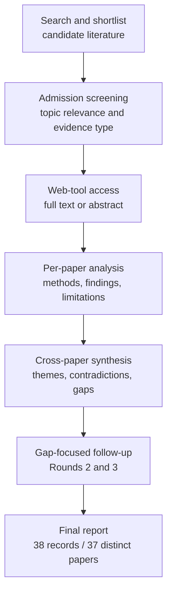

# Research Report: Email, Image, Table and Attachment Understanding in Workplace Communication

## Contents

- [Round History](#round-history)
- [Executive Summary](#executive-summary)
- [Research Question](#research-question)
- [Methodology](#methodology)
- [Papers Reviewed](#papers-reviewed)
- [Research Landscape](#research-landscape)
- [Methodology Comparison](#methodology-comparison)
- [Confidence-Graded Findings](#confidence-graded-findings)
- [Trade-Off Analysis](#trade-off-analysis)
- [Points of Agreement](#points-of-agreement)
- [Points of Contradiction](#points-of-contradiction)
- [Research Gaps](#research-gaps)
- [Reproducibility Notes](#reproducibility-notes)
- [Practical Recommendations](#practical-recommendations)
- [Future Directions](#future-directions)
- [Readiness Assessment (System-Building Mode)](#readiness-assessment-system-building-mode)
- [Evidence Map](#evidence-map)
- [References](#references)
- [Appendix: Run Metadata](#appendix-run-metadata)

## Round History

Iterative gap-closure loop (hard cap: 4 rounds). See `references/iterative-synthesis.md` for the full loop definition.

| Round | Run ID | Topic / Gap Focus | New Papers | Gaps Addressed | Remaining Gaps |
|-------|--------|-------------------|------------|----------------|----------------|
| 1 | b251df112d0c | email, image, table and attachment understanding in workplace communication: preserving multimodal and document structure, and grounding evidence back to precise source locations such as a cell, region, page or attachment version | 14 | initial shortlist | 4 academic, 4 engineering |
| 2 | a274d1d20c2f | version-aware multimodal evidence provenance and reference grounding across revised workplace attachments, including cross-version region lineage, email-to-attachment referring expressions, workbook-level spreadsheet structure, and hierarchical provenance from attachment version through page, element, region or cell to answer span | 14 | 0 resolved | 4 academic, 4 engineering |
| 3 | 0e864e7fe398 | Cross-version multimodal document grounding: stable region and element lineage across revised attachments, message-to-attachment referring expressions, revised-workbook provenance, and end-to-end hierarchical evidence identifiers from version through page, region or cell to answer span. | 10 | academic gaps of the previous round | 4 academic, 4 engineering |

**Stop reason**: another round runs while open academic gaps remain and new papers appear

## Executive Summary

This review investigated whether workplace email systems can preserve and interpret information contained in attachments, tables, spreadsheets, screenshots, scanned documents, and visually structured pages while grounding derived claims back to precise evidence locations. The corpus contains 38 reviewed records representing 37 distinct papers from 10 access-source hosts or repositories, spanning 2001–2026; one study appears under two supplied records. The strongest result is that document structure, spatial layout, table hierarchy, and explicit evidence localization materially improve or enable document understanding, while answer correctness and evidence correctness must be evaluated separately [2106.11539] [2010.12537] [2605.12882] [2608.03292]. The most significant unresolved issue is cross-version provenance: the literature does not yet establish an end-to-end method that preserves stable attachment and element identity across revisions while linking a final answer through attachment version, page or sheet, region or cell, and answer span [2510.08109] [2607.14117] [2605.12882]. Transfer confidence to production workplace communication is therefore lower than confidence in the component mechanisms.

**Scope**: 37 distinct papers represented by 38 reviewed records from 10 access-source hosts/repositories over 2001–2026  
**Overall Confidence**: Medium  
**Verdict**: HAS_GAPS

## Research Question

The investigation asked:

> How should a workplace-communication system preserve multimodal and document structure in email bodies and attachments, understand tables, spreadsheets, screenshots, scanned pages, diagrams, and other visually structured evidence, resolve references into those objects, and ground every derived claim back to a precise source location such as an attachment version, page, sheet, element, visual region, table cell, or answer span?

The scope includes document AI, visually rich document understanding, layout and reading order, table structure recognition and reasoning, spreadsheet understanding, document visual question answering, hierarchical evidence localization, visual or multimodal referring expressions, provenance, document version alignment, and cross-version change tracking.

The scope excludes OCR character accuracy considered in isolation, generic image captioning without evidence localization, parser-throughput benchmarks that do not measure preservation of meaning, retrieval of missing attachments as a primary problem, and purely textual response-scope resolution once the referenced document object has already been grounded.

The project-specific distinction is critical: parsing success is not equivalent to successful understanding. A system can successfully extract characters while losing table hierarchy, units, merged-cell relationships, reading order, visual emphasis, embedded-object coverage, or version identity. Unsupported or inaccessible evidence must therefore remain an explicit limitation rather than being represented as successful absence.

## Methodology

### Search Strategy

- **Sources**: arXiv, ACL Anthology, Springer, IEEE Xplore, CVF Open Access, VLDB proceedings, ResearchGate, institutional repositories at the University of Bologna and University of Edinburgh, and PolyU Research Portal.
- **Query variants**:
  - `cross-version multimodal document grounding: stable region element lineage across attachments, message-to-attachment referring expressions, revised-workbook provenance, end-to-end hierarchical evidence identifiers version page, cell answer span.`
  - `cross-version multimodal document`
  - `cross-version grounding: stable region element lineage across attachments, message-to-attachment referring expressions, revised-workbook provenance, end-to-end hierarchical evidence identifiers version page, cell answer span.`
  - `multimodal grounding: stable region element lineage across attachments, message-to-attachment referring expressions, revised-workbook provenance, end-to-end hierarchical evidence identifiers version page, cell answer span.`
  - `document grounding: stable region element lineage across attachments, message-to-attachment referring expressions, revised-workbook provenance, end-to-end hierarchical evidence identifiers version page, cell answer span.`
  - `cross-version multimodal document grounding: stable`
  - `cross-version multimodal document region element`
  - `cross-version multimodal document lineage across`
- **Time window**: 2001–2026.
- **Screening**: The supplied run artifacts do not report whether the screening implementation was BM25-only or BM25 plus a sub-agent; that detail is therefore unknown rather than inferred.
- **Admission focus**: direct document/table/spreadsheet/grounding/versioning evidence was preferred; adjacent scene-grounding, XML-versioning, and reading-order papers were retained as transfer evidence rather than treated as direct workplace-email validation.

The papers were read through the host's web tool during the literature-review pipeline. Access levels were recorded per paper and are reproduced below. Thirty-three supplied records were available as full text and five as abstract-only access.

### Access Level by Paper

| Paper | Access level | Host used |
|---|---|---|
| [1911.10683] | full_text | arXiv HTML |
| [2006.14806] | full_text | arXiv PDF |
| [2010.12537] | full_text | arXiv HTML |
| [2104.12756] | full_text | arXiv HTML |
| [2106.11539] | full_text | arXiv HTML |
| [2111.07129] | full_text | arXiv HTML |
| [2203.09056] | full_text | arXiv HTML |
| [2212.05935] | full_text | arXiv HTML |
| [2401.00908] | full_text | arXiv HTML |
| [2407.01523] | full_text | arXiv HTML |
| [2412.18424] | full_text | arXiv HTML |
| [2503.23131] | full_text | arXiv HTML |
| [2505.16470] | full_text | arXiv HTML |
| [2510.08109] | full_text | arXiv HTML |
| [2511.12003] | full_text | arXiv HTML |
| [2601.08741] | full_text | arXiv HTML |
| [2604.12282] | full_text | arXiv HTML |
| [2605.12882] | full_text | arXiv HTML |
| [2606.15906] | full_text | arXiv HTML |
| [2606.29955] | full_text | arXiv HTML |
| [2607.14117] | full_text | arXiv HTML |
| [2607.24651] | full_text | arXiv HTML |
| [2607.29638] | full_text | arXiv HTML |
| [2608.03292] | full_text | arXiv HTML |
| [2609.08364] | full_text | arXiv HTML |
| [doi-10-1002-spe-2305] | full_text | University of Bologna repository PDF |
| [doi-10-1007-3-540-44503-x-20] | full_text | University of Edinburgh repository PDF |
| [doi-10-1007-978-3-540-30480-7-29] | full_text | ResearchGate |
| [doi-10-1007-s00521-022-06948-5] | full_text | Springer |
| [doi-10-1109-tmm-2022-3219642] | abstract_only | IEEE Xplore |
| [doi-10-18653-v1-2020-acl-main-398] | full_text | ACL Anthology PDF |
| [doi-10-18653-v1-2025-acl-long-547] | full_text | arXiv HTML |
| [doi-10-18653-v1-2025-findings-naacl-295] | full_text | arXiv HTML |
| [doi-10-18653-v1-2026-eacl-long-192] | full_text | ACL Anthology PDF |
| [manual-0661fc0cba] | abstract_only | CVF Open Access |
| [manual-1048d6caf2] | abstract_only | PolyU Research Portal |
| [manual-7fdf40b3c6] | abstract_only | CVF Open Access |
| [manual-ae200642f8] | full_text | VLDB proceedings PDF |

### Pipeline Summary

| Metric | Count |
|--------|-------|
| Total candidates | unknown from supplied artifacts |
| After screening | 38 reviewed records |
| Downloaded | unknown; papers were accessed through the host web tool rather than uniformly downloaded |
| Successfully converted | unknown; conversion count was not supplied |
| Deeply analyzed | 38 records representing 37 distinct papers |
| Iterations | 3 rounds completed |

### Methodological Limitations

The synthesis supplied to this report contains per-paper analysis summaries rather than the full text of every paper, so claims here are limited to findings captured by those analyses. The corpus is heterogeneous: it includes scientific PDFs, document-QA datasets, web tables, infographics, scene-text images, visually grounded dialogue, clinical material, XML histories, spreadsheet benchmarks, and only indirect evidence for workplace email attachments.

Two supplied records, [manual-1048d6caf2] and [doi-10-1109-tmm-2022-3219642], refer to the same study, *Scene-Text Oriented Referring Expression Comprehension*. They are therefore treated as one distinct paper when calculating the 37-paper scope.

The absence of production-mailbox studies means no result should be interpreted as a demonstrated production accuracy estimate for msgloom.

## Papers Reviewed

Quality scores were not supplied by the pipeline and are therefore reported as `unknown`; numerical values are not invented. Relevance reflects this review's distinction between direct target mechanisms and adjacent transfer evidence.

| # | Title | Authors | Year | Venue | Quality Score | Relevance |
|---|-------|---------|------|-------|---------------|-----------|
| 1 | MAGE-RAG: Multigranular Adaptive Graph Evidence for Agentic Multimodal RAG in Long-Document QA [2606.15906] | Yilong Zuo, Xunkai Li, Jing Yuan et al. | 2026 | not specified in supplied metadata | unknown | HIGH |
| 2 | CiteVQA: Benchmarking Evidence Attribution for Trustworthy Document Intelligence [2605.12882] | Dongsheng Ma, Jiayu Li, Zhengren Wang et al. | 2026 | not specified in supplied metadata | unknown | HIGH |
| 3 | From Rows to Reasoning: A Retrieval-Augmented Multimodal Framework for Spreadsheet Understanding [2601.08741] | Anmol Gulati, Sahil Sen, Waqar Sarguroh et al. | 2026 | not specified in supplied metadata | unknown | HIGH |
| 4 | HierDoc: Hierarchical Page-to-Region Evidence Routing for Long-Document Visual Question Answering [2607.29638] | Rongjian Gu, Wengang Zhou, Junyu Xiong et al. | 2026 | not specified in supplied metadata | unknown | HIGH |
| 5 | Change-Centric Management of Versions in an XML Warehouse [manual-ae200642f8] | Amélie Marian, Serge Abiteboul, Grégory Cobéna et al. | 2001 | VLDB proceedings | unknown | MEDIUM |
| 6 | Bridging the gap between tracking and detecting changes in XML [doi-10-1002-spe-2305] | Paolo Ciancarini, Angelo Di Iorio, Carlo Marchetti et al. | 2016 | not specified in supplied metadata | unknown | MEDIUM |
| 7 | Schema-less, semantics-based change detection for XML documents [doi-10-1007-978-3-540-30480-7-29] | Shuohao Zhang, Curtis Dyreson, Richard T. Snodgrass | 2004 | not specified in supplied metadata | unknown | MEDIUM |
| 8 | Rethinking Reading Order: Toward Generalizable Document Understanding with LLM-based Relation Modeling [doi-10-18653-v1-2026-eacl-long-192] | Weishi Wang, Hengchang Hu, Daniel Dahlmeier | 2026 | EACL | unknown | HIGH |
| 9 | Robust Table Detection and Structure Recognition from Heterogeneous Document Images [2203.09056] | Chixiang Ma, Weihong Lin, Lei Sun et al. | 2023 | not specified in supplied metadata | unknown | HIGH |
| 10 | Why and Where: A Characterization of Data Provenance [doi-10-1007-3-540-44503-x-20] | Peter Buneman, Sanjeev Khanna, Wang-Chiew Tan | 2001 | not specified in supplied metadata | unknown | MEDIUM |
| 11 | Image-based table recognition: data, model, and evaluation [1911.10683] | Xu Zhong, Elaheh ShafieiBavani, Antonio Jimeno Yepes | 2020 | not specified in supplied metadata | unknown | HIGH |
| 12 | Reading order detection on handwritten documents [doi-10-1007-s00521-022-06948-5] | Lorenzo Quirós, Enrique Vidal | 2022 | not specified in supplied metadata | unknown | MEDIUM |
| 13 | TUTA: Tree-based Transformers for Generally Structured Table Pre-training [2010.12537] | Zhiruo Wang, Haoyu Dong, Ran Jia et al. | 2021 | not specified in supplied metadata | unknown | HIGH |
| 14 | TURL: Table Understanding through Representation Learning [2006.14806] | Xiang Deng, Huan Sun, Alyssa Lees et al. | 2020 | not specified in supplied metadata | unknown | HIGH |
| 15 | Visual Understanding of Complex Table Structures from Document Images [2111.07129] | Sachin Raja, Ajoy Mondal, C. V. Jawahar | 2022 | not specified in supplied metadata | unknown | HIGH |
| 16 | TaPas: Weakly Supervised Table Parsing via Pre-training [doi-10-18653-v1-2020-acl-main-398] | Jonathan Herzig, Pawel Krzysztof Nowak, Thomas Müller et al. | 2020 | ACL | unknown | HIGH |
| 17 | M3Grounder: Mask-Based Multi-Span and Multi-Granular Grounding for Document QA [manual-0661fc0cba] | Venkata Kesav Venna, Sai Madhusudan Gunda, Jyothi Swaroopa Jinka et al. | 2026 | CVPR | unknown | HIGH |
| 18 | Scene-Text Oriented Referring Expression Comprehension [manual-1048d6caf2] | authors not supplied in this record | 2026 record | source record; duplicate study noted | unknown | MEDIUM |
| 19 | RefChartQA: Grounding Visual Answer on Chart Images through Instruction Tuning [2503.23131] | Alexander Vogel, Omar Moured, Yufan Chen et al. | 2025 | not specified in supplied metadata | unknown | HIGH |
| 20 | Hierarchical multimodal transformers for Multi-Page DocVQA [2212.05935] | Rubèn Tito, Dimosthenis Karatzas, Ernest Valveny | 2023 | not specified in supplied metadata | unknown | HIGH |
| 21 | MMLongBench-Doc: Benchmarking Long-context Document Understanding with Visualizations [2407.01523] | Yubo Ma, Yuhang Zang, Liangyu Chen et al. | 2024 | not specified in supplied metadata | unknown | HIGH |
| 22 | LongDocURL: a Comprehensive Multimodal Long Document Benchmark Integrating Understanding, Reasoning, and Locating [2412.18424] | Chao Deng, Jiale Yuan, Pi Bu et al. | 2025 | not specified in supplied metadata | unknown | HIGH |
| 23 | DocFormer: End-to-End Transformer for Document Understanding [2106.11539] | Srikar Appalaraju, Bhavan Jasani, Bhargava Urala Kota et al. | 2021 | not specified in supplied metadata | unknown | HIGH |
| 24 | InfographicVQA [2104.12756] | Minesh Mathew, Viraj Bagal, Rubèn Pérez Tito et al. | 2022 | not specified in supplied metadata | unknown | HIGH |
| 25 | Evidence Attribution in Visual Document Understanding without Coordinates or Region Labels [2607.24651] | Zhuchenyang Liu, Yao Zhang, Yu Xiao | 2026 | not specified in supplied metadata | unknown | HIGH |
| 26 | VersionRAG: Version-Aware Retrieval-Augmented Generation for Evolving Documents [2510.08109] | Daniel Huwiler, Kurt Stockinger, Jonathan Fürst | 2025 | not specified in supplied metadata | unknown | HIGH |
| 27 | DocTrace: Towards Traceable Long Document VQA via Hierarchical Evidence Graph Reasoning [2608.03292] | Le Xiang, Zhicheng Guan, Hong Chen et al. | 2026 | not specified in supplied metadata | unknown | HIGH |
| 28 | Disambiguating Reference in Visually Grounded Dialogues through Joint Modeling of Textual and Multimodal Semantic Structures [doi-10-18653-v1-2025-acl-long-547] | Shun Inadumi, Nobuhiro Ueda, Koichiro Yoshino | 2025 | ACL | unknown | MEDIUM |
| 29 | Benchmarking Retrieval-Augmented Multimomal Generation for Document Question Answering [2505.16470] | Kuicai Dong, Yujing Chang, Shijie Huang et al. | 2025 | not specified in supplied metadata | unknown | HIGH |
| 30 | SpreadsheetBench 2: Evaluating Agents on End-to-End Business Spreadsheet Workflows [2606.29955] | authors not supplied | 2026 | not specified in supplied metadata | unknown | HIGH |
| 31 | Scene-Text Oriented Referring Expression Comprehension [doi-10-1109-tmm-2022-3219642] | Yuqi Bu, Liuwu Li, Jiayuan Xie et al. | 2022 | IEEE Transactions on Multimedia record | unknown | MEDIUM |
| 32 | Heterogeneous Element-Aware Cross-Version Differencing of Scientific Documents via Layout-Aware Alignment and Structure-Aware Reasoning [2607.14117] | Zhen Yin, Wenkang An, Hao Wang et al. | 2026 | not specified in supplied metadata | unknown | HIGH |
| 33 | SentryLine: Evidence-Grounded Question Answering over Evolving Documents in Oncology Care [2609.08364] | Tampu Ravi Kumar, Gaurav Najpande, Muhammad Ali Khan et al. | 2026 | not specified in supplied metadata | unknown | HIGH |
| 34 | Towards Robust Real-World Spreadsheet Understanding with Multi-Agent Multi-Format Reasoning [2604.12282] | Houxing Ren, Mingjie Zhan, Zimu Lu et al. | 2026 | not specified in supplied metadata | unknown | HIGH |
| 35 | Where is this coming from? Making groundedness count in the evaluation of Document VQA models [doi-10-18653-v1-2025-findings-naacl-295] | Armineh Nourbakhsh, Siddharth Parekh, Pranav Shetty et al. | 2025 | Findings of NAACL | unknown | HIGH |
| 36 | TRH2TQA: Table Recognition with Hierarchical Relationships to Table Question-Answering on Business Table Images [manual-7fdf40b3c6] | Pongsakorn Jirachanchaisiri, Nam Tuan Ly, Atsuhiro Takasu | 2025 | WACV | unknown | HIGH |
| 37 | Look as You Think: Unifying Reasoning and Visual Evidence Attribution for Verifiable Document RAG via Reinforcement Learning [2511.12003] | Shuochen Liu, Pengfei Luo, Chao Zhang et al. | 2026 | not specified in supplied metadata | unknown | HIGH |
| 38 | DocLLM: A layout-aware generative language model for multimodal document understanding [2401.00908] | Dongsheng Wang, Natraj Raman, Mathieu Sibue et al. | 2024 | not specified in supplied metadata | unknown | HIGH |

## Research Landscape

### Theme 1: Layout, Spatial Structure, and Document Hierarchy

**Coverage**: 8+ papers | **Confidence**: High  
**Supporting papers**: [2106.11539], [2010.12537], [2401.00908], [1911.10683], [2111.07129], [2203.09056], [2412.18424], [doi-10-18653-v1-2026-eacl-long-192]

[HIGH] Layout is not merely presentation metadata. Across document and table studies, spatial position, document hierarchy, tree structure, table relationships, and learned relations improve downstream understanding compared with weaker representations that discard these relationships [2106.11539] [2010.12537] [2401.00908] [2412.18424].

[HIGH] Table structure is especially sensitive to flattening. Recovering rows, columns, spanning cells, hierarchical headers, and cell locations is necessary for preserving relationships that can disappear in OCR-only or linearized text [1911.10683] [2111.07129] [2203.09056] [manual-7fdf40b3c6].

Key findings:

1. [HIGH] Spatial and structural representations consistently contribute useful information beyond plain text in the evaluated document and table tasks [2106.11539] [2010.12537] [2401.00908].
2. [HIGH] Reading order should be modeled as a document relation rather than assumed to equal OCR serialization order, but the best relation definition is task-dependent [doi-10-1007-s00521-022-06948-5] [doi-10-18653-v1-2026-eacl-long-192].
3. [HIGH] Preserving table hierarchy is important to downstream table reasoning; cell values without their row, column, header, spanning, and location context are an incomplete semantic representation [1911.10683] [2111.07129] [2203.09056].

### Theme 2: Hierarchical Evidence Grounding and Attribution

**Coverage**: 10+ papers | **Confidence**: High  
**Supporting papers**: [2605.12882], [2607.29638], [2608.03292], [manual-0661fc0cba], [2607.24651], [2511.12003], [doi-10-18653-v1-2020-acl-main-398], [2503.23131], [2212.05935], [doi-10-18653-v1-2025-findings-naacl-295]

[HIGH] Modern document-QA systems increasingly represent evidence at multiple granularities rather than returning only an answer. Depending on the study, provenance can include document, page, region, bounding box, table cell, quotation, mask, and answer-level associations [2605.12882] [2607.29638] [2608.03292] [manual-0661fc0cba].

[HIGH] Answer correctness and evidence correctness are not interchangeable. A model can produce the right answer for the wrong reason, cite an insufficient region, or localize relevant evidence without completing the reasoning correctly [2212.05935] [2503.23131] [2605.12882] [2608.03292].

A useful strict evaluation concept is therefore a joint answer-and-evidence measure. For $N$ cases, one generic form is:

$J = \frac{1}{N}\sum_{i=1}^{N}\mathbf{1}[\hat{a}_i=a_i \land \hat{e}_i\text{ satisfies the required evidence criterion}]$

where $\hat{a}_i$ is the predicted answer and $\hat{e}_i$ is the predicted provenance. This formalization is a report-level synthesis, not a metric attributed to one specific paper.

Key findings:

1. [HIGH] Hierarchical routing from document or page to smaller regions is a recurring architecture for long-document evidence localization [2607.29638] [2608.03292] [2606.15906].
2. [HIGH] Attribution-aware evaluation exposes errors hidden by answer-only scores [2605.12882] [doi-10-18653-v1-2025-findings-naacl-295].
3. [MEDIUM] Different evidence interfaces—coordinates, quotations, masks, cells, or regions—have different reliability profiles and should not be treated as interchangeable [2607.24651] [manual-0661fc0cba].

### Theme 3: Multi-Page, Long-Document, and Cross-Modal Reasoning

**Coverage**: 8+ papers | **Confidence**: High  
**Supporting papers**: [2212.05935], [2407.01523], [2412.18424], [2505.16470], [2606.15906], [2607.29638], [2608.03292], [2104.12756]

[HIGH] Long-document QA is substantially harder when evidence crosses pages, images, tables, or modalities. Systems must both locate evidence and compose it correctly, rather than simply expand the input context [2407.01523] [2412.18424] [2505.16470] [2606.15906].

[HIGH] Hierarchical selection and evidence routing are recurring responses to the scaling problem because indiscriminately processing every page at maximum visual detail is both expensive and prone to evidence-selection errors [2607.29638] [2608.03292] [2606.15906].

Key findings:

1. [HIGH] Cross-page and cross-modal reasoning remains a difficult failure surface even for modern multimodal systems [2407.01523] [2412.18424] [2505.16470].
2. [HIGH] Evidence localization must remain coupled to the retained page and structural context because exact regions alone may be insufficient for interpreting headers, units, or surrounding constraints [2605.12882] [2607.29638].
3. [MEDIUM] OCR-only, structured-text, and rich visual representations each win in some settings; representation choice is therefore benchmark- and architecture-dependent rather than universally settled [2407.01523] [2412.18424] [2505.16470].

### Theme 4: Tables and Spreadsheet Semantics

**Coverage**: 10+ papers | **Confidence**: High  
**Supporting papers**: [1911.10683], [2006.14806], [2010.12537], [2111.07129], [2203.09056], [doi-10-18653-v1-2020-acl-main-398], [manual-7fdf40b3c6], [2601.08741], [2604.12282], [2606.29955]

[HIGH] Table understanding requires more than detecting text inside rectangular regions. The evaluated literature models rows, columns, hierarchical headers, merged or spanning relations, entity structure, and explicit cell positions because these relationships influence semantic interpretation and question answering [1911.10683] [2010.12537] [2111.07129] [2203.09056].

[HIGH] Workbook-scale spreadsheet systems benefit from structural reconstruction, multi-granular retrieval, and verification, but realistic end-to-end workbook tasks remain substantially more difficult than isolated cell-level operations [2601.08741] [2604.12282] [2606.29955].

Key findings:

1. [HIGH] Flat text should not be the only retained representation of a table or workbook [1911.10683] [2010.12537] [2111.07129].
2. [HIGH] Spreadsheet reasoning benefits from retrieving evidence at multiple structural levels rather than treating a workbook as a monolithic text sequence [2601.08741].
3. [HIGH] Realistic workbook workflows expose failures that simpler cell-level benchmarks can miss [2606.29955].
4. [MEDIUM] The current corpus does not establish comprehensive support for hidden sheets, hidden rows, named ranges, merged regions, formatting semantics, units, formulas, cross-sheet references, and cross-version provenance as one integrated capability [2601.08741] [2604.12282] [2606.29955].

### Theme 5: Version Identity, Change Detection, and Cross-Version Lineage

**Coverage**: 7+ papers | **Confidence**: Medium for workplace transfer  
**Supporting papers**: [2510.08109], [2607.14117], [2609.08364], [manual-ae200642f8], [doi-10-1002-spe-2305], [doi-10-1007-978-3-540-30480-7-29], [doi-10-1007-3-540-44503-x-20]

[HIGH] Explicit version identity matters for questions over evolving documents: version-aware retrieval addresses a different problem from ordinary retrieval because otherwise evidence from stale and current states can be conflated [2510.08109].

[HIGH] Cross-version alignment can localize changed or corresponding scientific-document elements, while XML research demonstrates persistent or semantic node identity under document evolution [2607.14117] [manual-ae200642f8] [doi-10-1007-978-3-540-30480-7-29].

[MEDIUM] These literatures provide complementary mechanisms but do not establish one workplace-attachment provenance model combining persistent attachment identity, region or cell lineage, semantic change, and answer attribution across revisions [2510.08109] [2607.14117] [2605.12882].

Key findings:

1. [HIGH] Version identity should be explicit rather than inferred solely from filenames or current location [2510.08109].
2. [HIGH] Logical identity and physical location must be separable because corresponding elements may move across revisions [2607.14117] [manual-ae200642f8].
3. [MEDIUM] Cross-version correspondence should be modeled as a relation rather than silently replacing old locators, but this integrated design remains a synthesis-derived engineering recommendation rather than a directly validated workplace architecture.

### Theme 6: Language-to-Visual-Object Reference Grounding

**Coverage**: 3+ records | **Confidence**: Medium  
**Supporting papers**: [doi-10-1109-tmm-2022-3219642], [manual-1048d6caf2], [doi-10-18653-v1-2025-acl-long-547]

[HIGH] Scene-text referring-expression work and visually grounded dialogue demonstrate that textual structure and visible text cues can improve mapping language to visual referents in their evaluated domains [doi-10-1109-tmm-2022-3219642] [doi-10-18653-v1-2025-acl-long-547].

[MEDIUM] This supports the feasibility of language-to-region grounding as a mechanism, but it does not validate email phrases such as "the highlighted row", "numbers below", "this screenshot", or "use attachment v2" against real workplace attachment objects, pages, cells, or regions [doi-10-1109-tmm-2022-3219642] [doi-10-18653-v1-2025-acl-long-547].

Key findings:

1. [HIGH] Reference interpretation can require joint textual and visual structure rather than text-only coreference [doi-10-18653-v1-2025-acl-long-547].
2. [MEDIUM] Workplace message-to-attachment grounding remains a transfer hypothesis, not an established result.

## Methodology Comparison

| Approach | Papers | Strengths | Weaknesses | Best For | Performance |
|----------|--------|-----------|------------|----------|-------------|
| Layout-aware multimodal encoding | [2106.11539], [2401.00908] | Preserves spatial relationships jointly with text | Can still lose higher-order document/version structure | Forms, visually rich pages, document IE | Consistent downstream gains reported in evaluated tasks; no single cross-paper metric is comparable |
| Tree/hierarchy-aware table modeling | [2010.12537], [2006.14806], [doi-10-18653-v1-2020-acl-main-398] | Represents row/column/header relationships | Primarily table-centric; workbook context can exceed model scope | Structured tables and table QA | Positive benchmark results reported; heterogeneous metrics |
| Image-based table structure recognition | [1911.10683], [2111.07129], [2203.09056] | Recovers geometry absent from OCR strings | Sensitive to heterogeneous layouts and recognition errors | Scanned/rendered tables | Stronger structure modeling than flat extraction on evaluated datasets; exact cross-paper comparison unsupported |
| Hierarchical document evidence routing | [2607.29638], [2608.03292], [2606.15906] | Scales localization from page to region/evidence graph | Routing errors can discard needed evidence | Long-document QA | Improves evidence selection in reported systems; no universal metric |
| Grounded/attributed document QA | [2605.12882], [2607.24651], [2511.12003], [manual-0661fc0cba] | Makes evidence auditable; detects answer/evidence mismatch | Output format and supervision requirements vary | Verifiable document intelligence | Attribution metrics reveal failures hidden by answer-only evaluation |
| Multi-page multimodal QA | [2212.05935], [2407.01523], [2412.18424], [2505.16470] | Exercises realistic cross-page evidence composition | High computational cost and substantial remaining failure rates | Long reports and mixed visual/text documents | Cross-page/cross-modal cases remain harder than simpler cases |
| Spreadsheet retrieval plus reasoning | [2601.08741], [2604.12282] | Limits context while preserving selected structure | Retrieval can omit globally relevant workbook context | Large workbooks | Benchmark-dependent advantages; not universally superior to full-context alternatives |
| End-to-end spreadsheet agents | [2606.29955] | Tests realistic workflow completion rather than isolated QA | Exposes compounding planning/execution errors | Business spreadsheet workflows | Task-level success remains more difficult than local cell correctness |
| Version-aware retrieval | [2510.08109] | Prevents mixing evolving document states | Does not by itself provide region/cell lineage | Evolving document collections | Reported benefit for version-sensitive retrieval; no workplace attachment validation |
| Cross-version document alignment | [2607.14117] | Matches heterogeneous elements across revisions | Evaluated on scientific documents, not workplace attachments | Document differencing and revision analysis | Improves change localization in its evaluated setting |
| Persistent/semantic XML identity | [manual-ae200642f8], [doi-10-1007-978-3-540-30480-7-29], [doi-10-1002-spe-2305] | Separates logical identity from snapshot location | XML assumptions do not directly cover image/PDF/spreadsheet regions | Versioned structured data | Demonstrates tracking/change mechanisms; transfer to multimodal attachments unvalidated |
| Referring-expression grounding | [doi-10-1109-tmm-2022-3219642], [doi-10-18653-v1-2025-acl-long-547] | Maps language to visible referents using multimodal semantics | Evaluated outside workplace attachments | Visual reference resolution | Adjacent-domain support only |

## Confidence-Graded Findings

### 🟢 High Confidence (supported by 3+ papers with consistent results)

1. **[HIGH] Spatial, layout, hierarchical, or explicitly structured representations improve document and table understanding relative to weaker representations that discard those relations.** Supported by [2106.11539], [2010.12537], [2401.00908], and [2412.18424].

2. **[HIGH] Provenance can be represented at multiple within-document levels, including document, page, region, bounding box, element, quotation, table cell, and answer span.** No single paper covers the full hierarchy, but overlapping subsets are demonstrated by [2605.12882], [2607.29638], [2608.03292], [manual-0661fc0cba], and [doi-10-18653-v1-2020-acl-main-398].

3. **[HIGH] Answer correctness and evidence correctness are empirically separable.** Systems can produce correct answers with incorrect or incomplete evidence, or locate evidence without completing reasoning correctly [2212.05935] [2503.23131] [2605.12882] [2608.03292].

4. **[HIGH] Cross-page, multi-image, and cross-modal evidence composition is harder than simpler document-QA settings in evaluated long-document benchmarks.** Supported by [2407.01523], [2412.18424], [2505.16470], and [2606.15906].

5. **[HIGH] Table semantics depend on structural relations such as rows, columns, spanning cells, hierarchical headers, and cell positions, not OCR strings alone.** Supported by [1911.10683], [2111.07129], [2203.09056], [manual-7fdf40b3c6], and [2412.18424].

6. **[HIGH] Workbook-scale spreadsheet understanding benefits from structural reconstruction, multi-granular retrieval, or verification, but end-to-end business workbook completion remains difficult.** Supported by [2601.08741], [2604.12282], and [2606.29955].

7. **[HIGH] Version-aware retrieval, cross-version layout alignment, semantic identity, and persistent node identity each solve meaningful parts of evolving-document provenance.** Supported by [2510.08109], [2607.14117], [doi-10-1007-978-3-540-30480-7-29], and [manual-ae200642f8].

8. **[HIGH] The reviewed versioning methods do not jointly demonstrate stable multimodal attachment identity, persistent region/cell lineage, semantic change interpretation, and answer-level provenance across successive workplace attachment revisions.** This absence remains after comparison of [2510.08109], [2607.14117], [2601.08741], and [2605.12882].

9. **[HIGH] Scene-text and visually grounded dialogue work demonstrate language-to-region grounding mechanisms, but not workplace-message-to-attachment grounding.** Supported by [doi-10-1109-tmm-2022-3219642] and [doi-10-18653-v1-2025-acl-long-547].

10. **[HIGH] Reading order is a learned or reconstructed structural relation whose useful definition varies by document domain and task.** Supported by [doi-10-1007-s00521-022-06948-5] and [doi-10-18653-v1-2026-eacl-long-192].

### 🟡 Medium Confidence (supported by 1-2 papers or with caveats)

1. **[MEDIUM] Persistent cross-version evidence identifiers should separate logical element identity from version-relative physical coordinates.** XML-versioning and PDF-alignment evidence strongly motivates this design [manual-ae200642f8] [2607.14117], but the combined pattern has not been directly evaluated on workplace attachments.

2. **[MEDIUM] Textual quotation may sometimes be a more reliable evidence-attribution interface than direct coordinate generation for general-purpose VLMs.** Reported by [2607.24651], but dedicated grounding architectures such as [manual-0661fc0cba] show that spatial masks can work well under different supervision and benchmarks.

3. **[MEDIUM] A dedicated message-to-attachment reference resolver is likely preferable to assuming ordinary text coreference will transfer.** Adjacent evidence exists in [doi-10-1109-tmm-2022-3219642] and [doi-10-18653-v1-2025-acl-long-547], but direct workplace validation is absent.

4. **[MEDIUM] Combining local evidence locators with surrounding structural context is likely safer than storing only an isolated region.** Hierarchical document systems support the mechanism [2607.29638] [2608.03292], but the exact storage contract is an engineering synthesis.

### 🔴 Low Confidence (preliminary, single-source, or contradicted)

1. **[LOW] Explicit visual-grounding supervision universally improves answer accuracy.** The evidence does not support this universal claim: [2503.23131] reports improvements for some backbones and splits but degradation for others.

2. **[LOW] OCR-only input is categorically better or worse than richer multimodal representations.** Results vary across [2407.01523], [2412.18424], and [2505.16470], so a universal ranking is not justified.

3. **[LOW] One reading-order annotation convention is a universally correct target.** The objectives and downstream behavior differ between [doi-10-1007-s00521-022-06948-5] and [doi-10-18653-v1-2026-eacl-long-192].

4. **[LOW] Retrieval-based spreadsheet architectures universally outperform full-context spreadsheet modeling.** [2601.08741] reports benchmark-dependent comparisons that do not support a universal conclusion.

## Trade-Off Analysis

| Decision | Option A | Option B | Recommendation |
|----------|----------|----------|----------------|
| Canonical document representation | Flatten everything to text: simple retrieval and indexing, but loses spatial/table relations [1911.10683] [2106.11539] | Preserve text plus layout/tree/table structures: more storage and processing, but retains decision-relevant relationships [2010.12537] [2401.00908] | Preserve structured representations alongside text; do not make flattened text the only canonical semantic representation |
| Evidence granularity | Store answer/source document only: cheap but weak traceability | Store page/region/cell/span hierarchy: greater complexity but supports verification [2605.12882] [2607.29638] [2608.03292] | Use composable hierarchical evidence identifiers |
| Answer evaluation | Answer accuracy only | Separate answer, evidence, and joint strict correctness [2605.12882] [doi-10-18653-v1-2025-findings-naacl-295] | Measure all three |
| Version identity | Filename/current path as identity | Explicit persistent attachment/version identity [2510.08109] | Use explicit stable identity plus immutable version identity |
| Cross-version location | Overwrite old coordinates with latest location | Preserve old locator and record correspondence to new locator [2607.14117] [manual-ae200642f8] | Preserve immutable historical evidence and explicit lineage relations |
| Long-document processing | Process all pages uniformly at maximum detail | Hierarchical page/evidence routing [2606.15906] [2607.29638] [2608.03292] | Use routing, but retain failure states and a recovery path for missed evidence |
| Spreadsheet representation | Cell text only | Workbook structure plus formulas/relations/metadata [2601.08741] [2604.12282] | Preserve workbook-native structure wherever possible |
| Grounding output | Coordinates only | Quotations, masks, element/cell IDs, or hybrid evidence [2607.24651] [manual-0661fc0cba] | Prefer source-native stable IDs where available and use geometry as one locator layer, not the identity itself |
| Unsupported content | Return empty evidence | Explicit unsupported/parser/OCR/retrieval/grounding failure state | Use explicit typed failure states; this remains an engineering gap |

## Points of Agreement **[EVIDENCE REQUIRED]**

1. **[HIGH] Document structure matters.** Spatial layout, hierarchy, and explicit structural representations contribute to document understanding across multiple architectures and datasets [2106.11539] [2010.12537] [2401.00908].

2. **[HIGH] Evidence attribution is a separate quality dimension from answer generation.** Grounded document-QA studies repeatedly expose correct-answer/wrong-evidence and wrong-answer/correct-localization cases [2605.12882] [2608.03292] [2503.23131].

3. **[HIGH] Long and multi-page documents require explicit evidence-selection mechanisms.** Hierarchical page/region routing, evidence graphs, and multigranular retrieval recur across modern systems [2606.15906] [2607.29638] [2608.03292].

4. **[HIGH] Table meaning cannot reliably be reduced to OCR text.** Table structure recognition and table-understanding studies explicitly model row, column, hierarchical, or spanning relationships [1911.10683] [2010.12537] [2111.07129] [2203.09056].

5. **[HIGH] Version-awareness is a distinct requirement rather than ordinary retrieval over duplicated snapshots.** Evidence from evolving-document retrieval and cross-version alignment supports explicit version representation [2510.08109] [2607.14117].

6. **[HIGH] Benchmarking should include provenance or grounding, not only final answer accuracy.** This is directly motivated by attribution-focused document QA and groundedness evaluation [2605.12882] [doi-10-18653-v1-2025-findings-naacl-295] [2608.03292].

## Points of Contradiction **[EVIDENCE REQUIRED]**

1. **[HIGH] Whether explicit visual grounding training improves answer accuracy**: [2503.23131] reports large gains for some backbones, but the same intervention reduces answer accuracy for other backbones or splits.
   - **Possible explanation**: the result depends on architecture, pretraining, task split, and the interaction between grounding supervision and answer generation.
   - **Implication**: grounding should be evaluated for evidence quality and answer quality separately rather than assumed to improve both.

2. **[HIGH] OCR-centric versus richer visual representations**: [2407.01523] reports that many evaluated LVLMs underperform LLM pipelines supplied with OCR text, while [2505.16470] reports an advantage from detailed VLM-generated visual descriptions over OCR alone and [2412.18424] reports substantial benefits from structure-preserving parsing over plain text extraction.
   - **Possible explanation**: model capability, document type, parser quality, visual density, and benchmark construction differ.
   - **Implication**: msgloom should benchmark candidate representations on its own heterogeneous fixture set rather than selecting OCR-only or vision-only processing by literature-wide assumption.

3. **[HIGH] Reading-order annotation fidelity versus downstream usefulness**: [doi-10-1007-s00521-022-06948-5] treats recovery of a target reading sequence as the direct objective, while [doi-10-18653-v1-2026-eacl-long-192] reports relation modeling that may disagree with adjacency-oriented human labels yet improve downstream tasks.
   - **Possible explanation**: the studies optimize different notions of "reading order": annotation agreement versus useful document relations.
   - **Implication**: reading-order evaluation should include downstream semantic preservation, not only exact sequence agreement.

4. **[HIGH] Spreadsheet retrieval architecture versus fuller-context modeling**: [2601.08741] reports strong advantages for its retrieval framework on its own benchmark while a strongest reported SpreadsheetLLM result remains slightly higher on the SpreadsheetLLM benchmark.
   - **Possible explanation**: benchmark composition and adaptation differ.
   - **Implication**: retrieval architecture should be selected empirically for target workbook sizes and tasks rather than treated as universally superior.

5. **[MEDIUM] Grounding output interface**: [2607.24651] finds direct coordinate generation unreliable for the tested general open VLMs and obtains better evidence recall through quotations, whereas [manual-0661fc0cba] reports strong mask-based spatial grounding using a dedicated architecture.
   - **Possible explanation**: dedicated spatial supervision and a purpose-built grounding model are materially different from asking a general VLM to emit coordinates.
   - **Implication**: the question is not whether "coordinates work", but which evidence interface is appropriate for the architecture, supervision, and source type.

## Research Gaps

All eight gaps remain open. The literature reviewed so far has not answered them completely; none should be interpreted as accepted or closed.

| # | Gap | Type | Severity | Rounds Already Searched / Reviewed | Impact on Goals |
|---|-----|------|----------|------------------------------------|-----------------|
| 1 | Complete cross-version provenance for revised workplace attachments | ACADEMIC | HIGH | Academic search/review in Rounds 1, 2, and 3 | Without stable identity and lineage, a report may cite stale or moved evidence after an attachment revision |
| 2 | Direct workplace message-to-attachment referring-expression grounding | ACADEMIC | HIGH | Academic search/review in Rounds 1, 2, and 3 | References such as "this screenshot" or "the highlighted row" cannot be safely interpreted from adjacent-domain evidence alone |
| 3 | Comprehensive workbook semantics plus provenance across revised workbooks | ACADEMIC | HIGH | Academic search/review in Rounds 1, 2, and 3 | Hidden sheets, formulas, merged structures, units, and cross-sheet relations can change work decisions |
| 4 | One end-to-end provenance representation from attachment version through page/element/region/cell to answer span | ACADEMIC | HIGH | Academic search/review in Rounds 1, 2, and 3 | Traceability remains fragmented across incompatible evidence granularities |
| 5 | Typed behavior for unsupported, incomplete, or incorrect extraction/grounding | ENGINEERING | HIGH | Identified in Round 1; retained and re-assessed in Rounds 2 and 3 rather than targeted as an academic search | Genuine absence must not be confused with parser, OCR, retrieval, or grounding failure |
| 6 | Heterogeneous workplace-style robustness suite | ENGINEERING | HIGH | Identified in Round 1; retained and re-assessed in Rounds 2 and 3 rather than targeted as an academic search | Without controlled adversarial fixtures, silent semantic loss can pass nominal parser tests |
| 7 | Operational scaling for long documents, large tables, and realistic workbooks | ENGINEERING | MEDIUM | Identified in Round 1; retained and re-assessed in Rounds 2 and 3 rather than targeted as an academic search | Latency, memory, and throughput constraints may force unsafe representation truncation |
| 8 | Unified evaluation of semantic correctness, completeness, provenance, failure handling, and structural preservation | ENGINEERING | HIGH | Identified in Round 1; retained and re-assessed in Rounds 2 and 3 rather than targeted as an academic search | No current benchmark directly verifies the combined reliability contract msgloom requires |

### Academic Gaps (require more papers)

1. **[ACADEMIC] [HIGH] Gap 1 — Cross-version multimodal attachment provenance**: The literature has not yet answered how to maintain stable attachment identity, version-relative source locations, semantic changes, and lineage from an older cited region or cell to its later counterpart in revised workplace attachments. Version-aware retrieval [2510.08109], scientific-PDF alignment [2607.14117], semantic XML matching [doi-10-1007-978-3-540-30480-7-29], and persistent XML node identity [manual-ae200642f8] solve separate subproblems rather than the combined problem.  
   **Rounds searched**: 1, 2, 3.  
   **Suggested queries**: `"document version alignment" multimodal provenance region lineage semantic change revised documents workplace attachments`, `"cross-version document grounding" region lineage attachment revision`.

2. **[ACADEMIC] [HIGH] Gap 2 — Workplace message-to-attachment referring expressions**: The literature has not yet validated direct grounding of phrases such as "this screenshot", "the highlighted row", "numbers below", or "use attachment v2" into attachment objects, pages, cells, or regions. Existing evidence is from scenes or visually grounded dialogue [doi-10-1109-tmm-2022-3219642] [doi-10-18653-v1-2025-acl-long-547].  
   **Rounds searched**: 1, 2, 3.  
   **Suggested queries**: `"referring expression grounding" document multimodal email attachment table cell screenshot coreference workplace`, `"document reference resolution" email attachment visual region`.

3. **[ACADEMIC] [HIGH] Gap 3 — Comprehensive workbook semantics and revised-workbook provenance**: The literature has not yet answered the combined problem of formulas, hidden rows and sheets, cross-sheet references, merged regions, formatting semantics, units, named ranges, and provenance across workbook revisions. Current spreadsheet studies cover important subsets [2601.08741] [2604.12282] [2606.29955].  
   **Rounds searched**: 1, 2, 3.  
   **Suggested queries**: `"spreadsheet understanding" workbook formulas hidden sheets named ranges merged cells cross-sheet provenance version revisions`, `"workbook provenance" version formulas hidden sheets`.

4. **[ACADEMIC] [HIGH] Gap 4 — Unified end-to-end hierarchical provenance**: The literature has not yet validated one provenance representation that jointly identifies attachment version, page or sheet, document element, exact region or spreadsheet cell, and answer span. Existing papers validate subsets [2605.12882] [2607.29638] [2608.03292] [manual-0661fc0cba] [doi-10-18653-v1-2020-acl-main-398] [2601.08741].  
   **Rounds searched**: 1, 2, 3.  
   **Suggested queries**: `"evidence provenance" document question answering version page region cell answer span hierarchical multimodal grounding`, `"hierarchical provenance" document version page region answer`.

### Engineering Gaps (fillable without papers)

1. **[ENGINEERING] [HIGH] Gap 5 — Explicit extraction/grounding failure contract**: The literature has not supplied a complete implementation contract distinguishing true evidence absence from parser failure, OCR failure, layout failure, unsupported embedded objects, retrieval failure, and grounding failure [2511.12003] [2607.24651] [2606.15906] [2605.12882].  
   **Rounds reviewed**: identified in Round 1; retained through Rounds 2 and 3.  
   **Suggested resolution**: define typed stage outcomes such as `SUCCESS`, `NO_EVIDENCE`, `UNSUPPORTED_CONTENT`, `PARSE_FAILED`, `OCR_FAILED`, `STRUCTURE_INCOMPLETE`, `RETRIEVAL_FAILED`, and `GROUNDING_UNCERTAIN`; retain source bytes and stage diagnostics so later recovery can distinguish the causes.

2. **[ENGINEERING] [HIGH] Gap 6 — Workplace-style adversarial fixture suite**: The literature has not jointly exercised sparse and merged tables, hierarchical headers, OCR corruption, irregular reading order, embedded visual objects, scanned pages, duplicated labels, cross-page references, and explicit extraction-completeness accounting [2111.07129] [2203.09056] [doi-10-1007-s00521-022-06948-5] [2407.01523] [2606.29955].  
   **Rounds reviewed**: identified in Round 1; retained through Rounds 2 and 3.  
   **Suggested resolution**: build independent gold fixtures covering PDFs, DOCX, XLSX, screenshots, scans, hidden workbook structures, moved elements, merged cells, ambiguous visual references, and multiple attachment versions.

3. **[ENGINEERING] [MEDIUM] Gap 7 — Target-workload scaling**: The literature has not established acceptable latency, memory, and throughput for the combined msgloom workload across long attachments, large tables, and realistic multi-sheet workbooks [2510.08109] [2606.15906] [2606.29955] [doi-10-1002-spe-2305].  
   **Rounds reviewed**: identified in Round 1; retained through Rounds 2 and 3.  
   **Suggested resolution**: benchmark complete pipelines at representative attachment sizes, recording parse time, OCR/vision cost, memory, retained evidence coverage, retrieval recall, grounding recall, and any truncation-induced false negatives.

4. **[ENGINEERING] [HIGH] Gap 8 — Unified reliability benchmark**: The literature has not provided one evaluation combining semantic correctness, extraction completeness, exact provenance, unsupported-evidence handling, table/image/layout preservation, and reading-order correctness on workplace-style attachments [2605.12882] [doi-10-18653-v1-2025-findings-naacl-295] [2407.01523] [2412.18424] [1911.10683] [2606.29955].  
   **Rounds reviewed**: identified in Round 1; retained through Rounds 2 and 3.  
   **Suggested resolution**: define an end-to-end evaluation in which prediction inputs and gold annotations are structurally separated and independently generated; measure both false positives and false negatives at extraction, grounding, and final-answer stages.

## Reproducibility Notes

The supplied synthesis does not provide verified repository URLs, dataset URLs, or license fields for every paper. Those fields are therefore marked `unknown` rather than inferred.

| Paper | Code Available | Data Available | Sufficient Detail | License |
|-------|---------------|----------------|-------------------|---------|
| [1911.10683] | unknown from supplied synthesis | unknown from supplied synthesis | full text available | unknown |
| [2006.14806] | unknown | unknown | full text available | unknown |
| [2010.12537] | unknown | unknown | full text available | unknown |
| [2104.12756] | unknown | unknown | full text available | unknown |
| [2106.11539] | unknown | unknown | full text available | unknown |
| [2111.07129] | unknown | unknown | full text available | unknown |
| [2203.09056] | unknown | unknown | full text available | unknown |
| [2212.05935] | unknown | unknown | full text available | unknown |
| [2401.00908] | unknown | unknown | full text available | unknown |
| [2407.01523] | unknown | unknown | full text available | unknown |
| [2412.18424] | unknown | unknown | full text available | unknown |
| [2503.23131] | unknown | unknown | full text available | unknown |
| [2505.16470] | unknown | unknown | full text available | unknown |
| [2510.08109] | unknown | unknown | full text available | unknown |
| [2511.12003] | unknown | unknown | full text available | unknown |
| [2601.08741] | unknown | unknown | full text available | unknown |
| [2604.12282] | unknown | unknown | full text available | unknown |
| [2605.12882] | unknown | unknown | full text available | unknown |
| [2606.15906] | unknown | unknown | full text available | unknown |
| [2606.29955] | unknown | unknown | full text available | unknown |
| [2607.14117] | unknown | unknown | full text available | unknown |
| [2607.24651] | unknown | unknown | full text available | unknown |
| [2607.29638] | unknown | unknown | full text available | unknown |
| [2608.03292] | unknown | unknown | full text available | unknown |
| [2609.08364] | unknown | unknown | full text available | unknown |
| [doi-10-1002-spe-2305] | unknown | unknown | full text available | unknown |
| [doi-10-1007-3-540-44503-x-20] | unknown | unknown | full text available | unknown |
| [doi-10-1007-978-3-540-30480-7-29] | unknown | unknown | full text available | unknown |
| [doi-10-1007-s00521-022-06948-5] | unknown | unknown | full text available | unknown |
| [doi-10-1109-tmm-2022-3219642] | unknown | unknown | abstract only | unknown |
| [doi-10-18653-v1-2020-acl-main-398] | unknown | unknown | full text available | unknown |
| [doi-10-18653-v1-2025-acl-long-547] | unknown | unknown | full text available | unknown |
| [doi-10-18653-v1-2025-findings-naacl-295] | unknown | unknown | full text available | unknown |
| [doi-10-18653-v1-2026-eacl-long-192] | unknown | unknown | full text available | unknown |
| [manual-0661fc0cba] | unknown | unknown | abstract only | unknown |
| [manual-1048d6caf2] | unknown | unknown | abstract only | unknown |
| [manual-7fdf40b3c6] | unknown | unknown | abstract only | unknown |
| [manual-ae200642f8] | unknown | unknown | full text available | unknown |

## Practical Recommendations **[EVIDENCE REQUIRED]**

1. **Preserve multiple structural representations rather than replacing documents with flattened text.** Keep source bytes and source-native structure, plus normalized text/layout representations. Table and document studies show that spatial, row/column, hierarchy, and layout relationships carry information lost during flattening [1911.10683] [2010.12537] [2106.11539] [2401.00908].  
   *Confidence*: High

2. **Use composable hierarchical evidence identifiers.** A practical evidence record should be able to identify, when available, `attachment_identity → version → page/sheet → element → region/cell → answer span`. The individual levels are supported by overlapping document-grounding systems, although the complete chain remains academically unvalidated [2605.12882] [2607.29638] [2608.03292] [2601.08741].  
   *Confidence*: Medium

3. **Separate persistent logical identity from version-relative physical location.** A table, paragraph, region, or cell-like logical element can move between revisions; persistent identity therefore should not be encoded solely as coordinates or a page number [2607.14117] [manual-ae200642f8] [doi-10-1007-978-3-540-30480-7-29].  
   *Confidence*: Medium

4. **Never overwrite historical evidence locators when a document is revised.** Preserve the original locator and represent correspondence to later elements as an explicit cross-version relation with confidence and change metadata. Versioning and alignment research supports the underlying separation between versions and correspondences [2510.08109] [2607.14117].  
   *Confidence*: Medium

5. **Evaluate answer correctness and evidence correctness separately, then add a strict joint metric.** Attribution-focused studies show that answer-only accuracy can hide unsupported or incorrectly localized answers [2605.12882] [2608.03292] [doi-10-18653-v1-2025-findings-naacl-295].  
   *Confidence*: High

6. **Preserve table and workbook semantics alongside rendered or OCR text.** Keep row, column, header, merged/spanning relationships, cell addresses, formulas, sheet identity, and other native workbook structure whenever parsable rather than treating a rendered string as canonical [1911.10683] [2111.07129] [2203.09056] [2601.08741].  
   *Confidence*: High

7. **Make extraction incompleteness a first-class result.** Do not encode unsupported embedded content, OCR failure, unreadable pages, or failed grounding as an empty successful result. Existing work demonstrates multiple independent failure surfaces, but the complete failure contract must be engineered locally [2605.12882] [2606.15906] [2607.24651].  
   *Confidence*: High for the need; Medium for the exact contract

8. **Evaluate message-to-attachment referring expressions as a dedicated task.** Do not assume that scene-text or visually grounded dialogue results establish performance for phrases such as "the red box", "row below", or "attachment v2" [doi-10-1109-tmm-2022-3219642] [doi-10-18653-v1-2025-acl-long-547].  
   *Confidence*: High

9. **Retain both local evidence and enough enclosing structure to interpret it.** A cell or bounding box without its headers, units, surrounding table, page, or sheet may be precisely located but semantically insufficient [2607.29638] [2608.03292] [2010.12537].  
   *Confidence*: High

10. **Treat version lineage, multimodal grounding, spreadsheet provenance, and answer-span attribution as an unvalidated composition until tested end to end.** The corpus establishes useful component mechanisms but not their combined reliability for longitudinal workplace attachments [2510.08109] [2607.14117] [2605.12882] [2601.08741].  
    *Confidence*: High

11. **Build a deliberately adversarial fixture suite before architecture approval.** It should include versioned PDFs, spreadsheets, screenshots, scanned pages, multi-page tables, merged cells, hidden workbook structures, formulas, relocated elements, duplicated labels, ambiguous referring expressions, parser failures, and missing evidence. The literature demonstrates these classes of structural and grounding difficulty individually [2111.07129] [2203.09056] [2407.01523] [2606.29955].  
    *Confidence*: High

## Future Directions

1. Conduct the next targeted academic round on cross-version multimodal provenance rather than broad document-understanding search, prioritizing studies that jointly model persistent identity and region/cell correspondence.

2. Search specifically for email-, enterprise-, or collaboration-document datasets containing linguistic references from message text into attached files, screenshots, tables, or workbook regions.

3. Investigate spreadsheet provenance literature beyond QA benchmarks, especially formula dependency graphs, named ranges, hidden structures, workbook differencing, and cell lineage under structural edits.

4. Formalize a version-aware evidence schema in which persistent identity, immutable version identity, physical location, semantic role, and cross-version correspondence are independent fields.

5. Build a gold-standard synthetic/adversarial workplace fixture suite independently of the extraction and grounding components being evaluated.

6. Measure both evidence false negatives and false positives. A system that cites a plausible but wrong cell is a different failure from one that exposes an unsupported/unknown result.

7. Evaluate retrieval/routing recall before optimizing inference speed. Hierarchical evidence routing is valuable only if relevant pages, sheets, or elements are not silently discarded.

8. Test whether source-native identifiers, textual quotations, geometric regions, or hybrid evidence objects produce the best verification experience for different formats.

## Readiness Assessment (System-Building Mode)

### Verdict: HAS_GAPS

### Assessment Summary

The synthesis is sufficient to establish several architectural principles for an implementation prototype: preserve source-native structure, keep provenance granular and immutable, distinguish answers from their evidence, retain explicit version identities, and expose extraction failures. It is not sufficient to declare the complete Topic 08 design validated because four high-priority academic gaps remain open, especially cross-version attachment lineage and direct message-to-attachment grounding, while four engineering gaps require local evaluation.

### Coverage Matrix

| Dimension | Status | Evidence |
|-----------|--------|----------|
| Architecture patterns | ✅ Sufficient for prototype principles | Layout-aware encoding [2106.11539] [2401.00908], hierarchical evidence routing [2607.29638] [2608.03292], structured spreadsheet retrieval [2601.08741] |
| Technology stack | ⚠️ Partial | Papers establish model classes and representation strategies, but do not prescribe the msgloom parser/model/runtime stack |
| Performance baselines | ⚠️ Partial | Numerous benchmark results exist [2407.01523] [2412.18424] [2606.29955], but they are not directly comparable or representative of the target workplace workload |
| Security model | ❌ Missing / outside this literature scope | No admitted paper establishes the product security or permission model |
| Trade-off map | ✅ Sufficient for initial engineering decisions | OCR versus visual representation [2407.01523] [2505.16470], hierarchical routing [2606.15906], evidence-interface differences [2607.24651] [manual-0661fc0cba] |
| Exact within-document provenance | ✅ Substantially supported | [2605.12882] [2607.29638] [2608.03292] [manual-0661fc0cba] |
| Cross-version provenance | ⚠️ Partial | [2510.08109] [2607.14117] [manual-ae200642f8] cover components only |
| Workplace message-to-attachment grounding | ❌ Missing | Adjacent-domain evidence only [doi-10-1109-tmm-2022-3219642] [doi-10-18653-v1-2025-acl-long-547] |
| Spreadsheet semantics | ⚠️ Partial | [2601.08741] [2604.12282] [2606.29955] |
| Failure-state contract | ❌ Missing | Failure modes exist in individual studies, but no complete target-system contract is validated |
| Unified end-to-end reliability evaluation | ❌ Missing | Existing benchmarks cover overlapping subsets [2605.12882] [2407.01523] [2606.29955] |

### Gap Resolution Plan

| # | Gap | Type | Severity | Resolution |
|---|-----|------|----------|------------|
| 1 | Cross-version multimodal attachment provenance | ACADEMIC | HIGH | Continue a targeted literature search for persistent multimodal element identity, document lineage, revision-aware evidence graphs, and cross-version region/cell alignment |
| 2 | Workplace message-to-attachment referring expressions | ACADEMIC | HIGH | Search enterprise/email multimodal coreference and document referring-expression datasets; retain adjacent scene/dialogue evidence only as transfer evidence |
| 3 | Complete workbook semantics and revised-workbook provenance | ACADEMIC | HIGH | Search spreadsheet provenance, formula dependency, workbook differencing, hidden-sheet handling, and versioned spreadsheet semantics |
| 4 | Unified attachment-version-to-answer evidence hierarchy | ACADEMIC | HIGH | Search hierarchical provenance/document citation models; do not infer validation merely by composing independent papers |
| 5 | Failure-state contract | ENGINEERING | HIGH | Define typed parser/OCR/layout/retrieval/grounding outcomes and test recovery behavior |
| 6 | Heterogeneous robustness | ENGINEERING | HIGH | Create independent adversarial fixtures covering scanned, visual, tabular, workbook, and versioned-document failure cases |
| 7 | Operational scaling | ENGINEERING | MEDIUM | Benchmark latency, memory, cost, evidence recall, and truncation behavior on realistic document/workbook sizes |
| 8 | Unified evaluation | ENGINEERING | HIGH | Build an end-to-end benchmark measuring completeness, semantics, provenance, structural preservation, failure handling, and final report evidence |

## Evidence Map

| Research Question Aspect | Primary Evidence | Additional Evidence | Coverage |
|--------------------------|------------------|---------------------|----------|
| Does document layout matter? | [2106.11539] | [2401.00908], [2412.18424] | Strong |
| Does table structure matter beyond OCR? | [1911.10683] | [2010.12537], [2111.07129], [2203.09056] | Strong |
| Can evidence be localized to pages/regions? | [2607.29638] | [2608.03292], [2605.12882] | Strong |
| Can evidence be grounded to masks/visual spans? | [manual-0661fc0cba] | [2503.23131], [2607.24651] | Moderate to strong |
| Can table cells participate in reasoning/provenance? | [doi-10-18653-v1-2020-acl-main-398] | [2601.08741] | Strong for within-state tables |
| Are answer and evidence accuracy distinct? | [2605.12882] | [2608.03292], [2503.23131], [doi-10-18653-v1-2025-findings-naacl-295] | Strong |
| Is cross-page reasoning difficult? | [2407.01523] | [2412.18424], [2505.16470], [2606.15906] | Strong |
| Can large documents use hierarchical routing? | [2607.29638] | [2608.03292], [2606.15906] | Strong |
| Can realistic workbooks be handled end to end? | [2606.29955] | [2601.08741], [2604.12282] | Partial |
| Is explicit version identity useful? | [2510.08109] | [2609.08364] | Strong in evaluated evolving-document domains |
| Can elements be aligned across versions? | [2607.14117] | [manual-ae200642f8], [doi-10-1007-978-3-540-30480-7-29] | Strong for transfer domains |
| Is complete multimodal workplace attachment lineage solved? | [2510.08109] | [2607.14117], [2605.12882] | No; gap remains |
| Can language refer to visual regions? | [doi-10-1109-tmm-2022-3219642] | [doi-10-18653-v1-2025-acl-long-547] | Strong in adjacent domains |
| Is workplace email-to-attachment grounding validated? | [doi-10-1109-tmm-2022-3219642] | [doi-10-18653-v1-2025-acl-long-547] | No; transfer evidence only |
| Is reading order universally defined? | [doi-10-1007-s00521-022-06948-5] | [doi-10-18653-v1-2026-eacl-long-192] | No; task/domain dependent |
| Does one benchmark test complete Topic 08 reliability? | [2605.12882] | [2407.01523], [1911.10683], [2606.29955] | No; gap remains |

## References

1. [2606.15906] — *MAGE-RAG: Multigranular Adaptive Graph Evidence for Agentic Multimodal RAG in Long-Document QA*. Yilong Zuo, Xunkai Li, Jing Yuan et al. 2026.
2. [2605.12882] — *CiteVQA: Benchmarking Evidence Attribution for Trustworthy Document Intelligence*. Dongsheng Ma, Jiayu Li, Zhengren Wang et al. 2026.
3. [2601.08741] — *From Rows to Reasoning: A Retrieval-Augmented Multimodal Framework for Spreadsheet Understanding*. Anmol Gulati, Sahil Sen, Waqar Sarguroh et al. 2026.
4. [2607.29638] — *HierDoc: Hierarchical Page-to-Region Evidence Routing for Long-Document Visual Question Answering*. Rongjian Gu, Wengang Zhou, Junyu Xiong et al. 2026.
5. [manual-ae200642f8] — *Change-Centric Management of Versions in an XML Warehouse*. Amélie Marian, Serge Abiteboul, Grégory Cobéna et al. 2001. VLDB proceedings.
6. [doi-10-1002-spe-2305] — *Bridging the gap between tracking and detecting changes in XML*. Paolo Ciancarini, Angelo Di Iorio, Carlo Marchetti et al. 2016.
7. [doi-10-1007-978-3-540-30480-7-29] — *Schema-less, semantics-based change detection for XML documents*. Shuohao Zhang, Curtis Dyreson, Richard T. Snodgrass. 2004.
8. [doi-10-18653-v1-2026-eacl-long-192] — *Rethinking Reading Order: Toward Generalizable Document Understanding with LLM-based Relation Modeling*. Weishi Wang, Hengchang Hu, Daniel Dahlmeier. 2026. EACL.
9. [2203.09056] — *Robust Table Detection and Structure Recognition from Heterogeneous Document Images*. Chixiang Ma, Weihong Lin, Lei Sun et al. 2023.
10. [doi-10-1007-3-540-44503-x-20] — *Why and Where: A Characterization of Data Provenance*. Peter Buneman, Sanjeev Khanna, Wang-Chiew Tan. 2001.
11. [1911.10683] — *Image-based table recognition: data, model, and evaluation*. Xu Zhong, Elaheh ShafieiBavani, Antonio Jimeno Yepes. 2020.
12. [doi-10-1007-s00521-022-06948-5] — *Reading order detection on handwritten documents*. Lorenzo Quirós, Enrique Vidal. 2022.
13. [2010.12537] — *TUTA: Tree-based Transformers for Generally Structured Table Pre-training*. Zhiruo Wang, Haoyu Dong, Ran Jia et al. 2021.
14. [2006.14806] — *TURL: Table Understanding through Representation Learning*. Xiang Deng, Huan Sun, Alyssa Lees et al. 2020.
15. [2111.07129] — *Visual Understanding of Complex Table Structures from Document Images*. Sachin Raja, Ajoy Mondal, C. V. Jawahar. 2022.
16. [doi-10-18653-v1-2020-acl-main-398] — *TaPas: Weakly Supervised Table Parsing via Pre-training*. Jonathan Herzig, Pawel Krzysztof Nowak, Thomas Müller et al. 2020. ACL.
17. [manual-0661fc0cba] — *M3Grounder: Mask-Based Multi-Span and Multi-Granular Grounding for Document QA*. Venkata Kesav Venna, Sai Madhusudan Gunda, Jyothi Swaroopa Jinka et al. 2026.
18. [manual-1048d6caf2] — *Scene-Text Oriented Referring Expression Comprehension*. Supplied record dated 2026; authors not supplied in that record. Duplicate study record noted.
19. [2503.23131] — *RefChartQA: Grounding Visual Answer on Chart Images through Instruction Tuning*. Alexander Vogel, Omar Moured, Yufan Chen et al. 2025.
20. [2212.05935] — *Hierarchical multimodal transformers for Multi-Page DocVQA*. Rubèn Tito, Dimosthenis Karatzas, Ernest Valveny. 2023.
21. [2407.01523] — *MMLongBench-Doc: Benchmarking Long-context Document Understanding with Visualizations*. Yubo Ma, Yuhang Zang, Liangyu Chen et al. 2024.
22. [2412.18424] — *LongDocURL: a Comprehensive Multimodal Long Document Benchmark Integrating Understanding, Reasoning, and Locating*. Chao Deng, Jiale Yuan, Pi Bu et al. 2025.
23. [2106.11539] — *DocFormer: End-to-End Transformer for Document Understanding*. Srikar Appalaraju, Bhavan Jasani, Bhargava Urala Kota et al. 2021.
24. [2104.12756] — *InfographicVQA*. Minesh Mathew, Viraj Bagal, Rubèn Pérez Tito et al. 2022.
25. [2607.24651] — *Evidence Attribution in Visual Document Understanding without Coordinates or Region Labels*. Zhuchenyang Liu, Yao Zhang, Yu Xiao. 2026.
26. [2510.08109] — *VersionRAG: Version-Aware Retrieval-Augmented Generation for Evolving Documents*. Daniel Huwiler, Kurt Stockinger, Jonathan Fürst. 2025.
27. [2608.03292] — *DocTrace: Towards Traceable Long Document VQA via Hierarchical Evidence Graph Reasoning*. Le Xiang, Zhicheng Guan, Hong Chen et al. 2026.
28. [doi-10-18653-v1-2025-acl-long-547] — *Disambiguating Reference in Visually Grounded Dialogues through Joint Modeling of Textual and Multimodal Semantic Structures*. Shun Inadumi, Nobuhiro Ueda, Koichiro Yoshino. 2025. ACL.
29. [2505.16470] — *Benchmarking Retrieval-Augmented Multimomal Generation for Document Question Answering*. Kuicai Dong, Yujing Chang, Shijie Huang et al. 2025.
30. [2606.29955] — *SpreadsheetBench 2: Evaluating Agents on End-to-End Business Spreadsheet Workflows*. Authors not supplied in the provided metadata. 2026.
31. [doi-10-1109-tmm-2022-3219642] — *Scene-Text Oriented Referring Expression Comprehension*. Yuqi Bu, Liuwu Li, Jiayuan Xie et al. 2022.
32. [2607.14117] — *Heterogeneous Element-Aware Cross-Version Differencing of Scientific Documents via Layout-Aware Alignment and Structure-Aware Reasoning*. Zhen Yin, Wenkang An, Hao Wang et al. 2026.
33. [2609.08364] — *SentryLine: Evidence-Grounded Question Answering over Evolving Documents in Oncology Care*. Tampu Ravi Kumar, Gaurav Najpande, Muhammad Ali Khan et al. 2026.
34. [2604.12282] — *Towards Robust Real-World Spreadsheet Understanding with Multi-Agent Multi-Format Reasoning*. Houxing Ren, Mingjie Zhan, Zimu Lu et al. 2026.
35. [doi-10-18653-v1-2025-findings-naacl-295] — *Where is this coming from? Making groundedness count in the evaluation of Document VQA models*. Armineh Nourbakhsh, Siddharth Parekh, Pranav Shetty et al. 2025. Findings of NAACL.
36. [manual-7fdf40b3c6] — *TRH2TQA: Table Recognition with Hierarchical Relationships to Table Question-Answering on Business Table Images*. Pongsakorn Jirachanchaisiri, Nam Tuan Ly, Atsuhiro Takasu. 2025. WACV.
37. [2511.12003] — *Look as You Think: Unifying Reasoning and Visual Evidence Attribution for Verifiable Document RAG via Reinforcement Learning*. Shuochen Liu, Pengfei Luo, Chao Zhang et al. 2026.
38. [2401.00908] — *DocLLM: A layout-aware generative language model for multimodal document understanding*. Dongsheng Wang, Natraj Raman, Mathieu Sibue et al. 2024.

## Appendix: Run Metadata

- **Run ID**: `0e864e7fe398`
- **Round**: 3 of at most 4
- **Research topic**: `email, image, table and attachment understanding in workplace communication: preserving multimodal and document structure, and grounding evidence back to precise source locations such as a cell, region, page or attachment version`
- **Round 3 focus**: `Cross-version multimodal document grounding: stable region and element lineage across revised attachments, message-to-attachment referring expressions, revised-workbook provenance, and end-to-end hierarchical evidence identifiers from version through page, region or cell to answer span.`
- **Sources**: arXiv, ACL Anthology, Springer, IEEE Xplore, CVF Open Access, VLDB proceedings, ResearchGate, University of Bologna repository, University of Edinburgh repository, PolyU Research Portal
- **Access method**: papers were read through the host's web tool; access was recorded as either `full_text` or `abstract_only` per paper in Methodology
- **Distinct papers**: 37
- **Reviewed records**: 38
- **Rounds completed**: 3
- **Open gaps**: 4 academic, 4 engineering
- **Pipeline version**: not specified in supplied artifacts
- **Date**: 2026-09-17
- **Artifacts**: `runs/0e864e7fe398/`
- **Stop reason**: another round runs while open academic gaps remain and new papers appear
